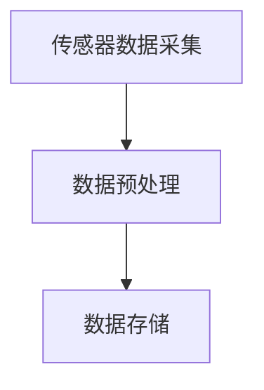
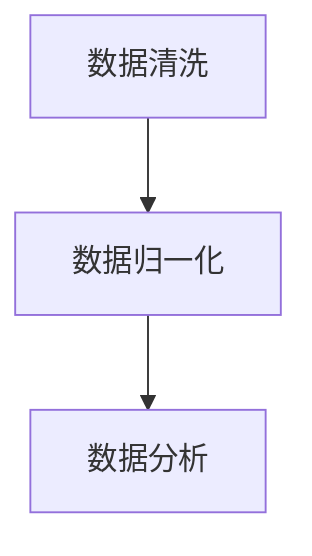
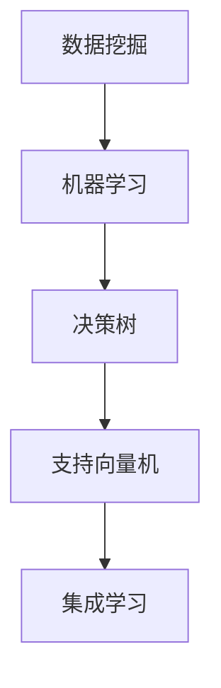
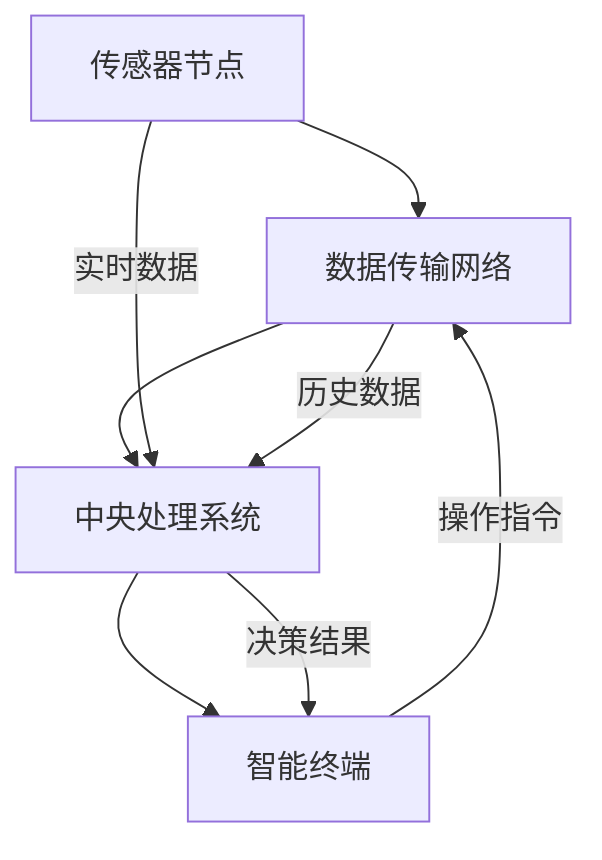
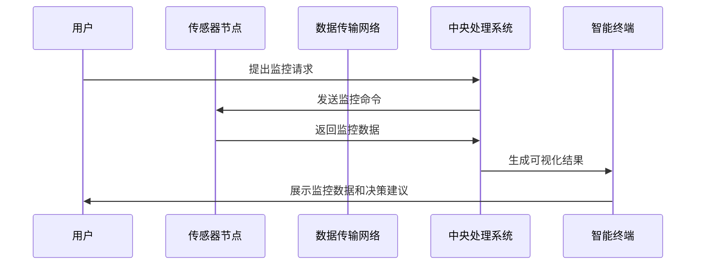
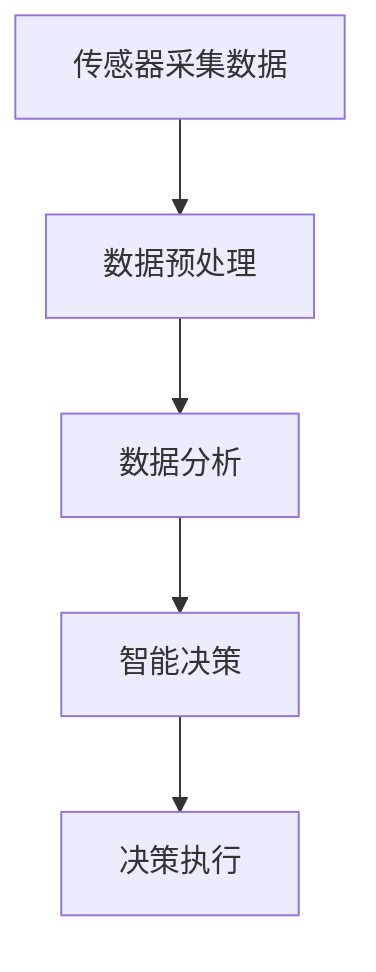

                 

### 物联网在智慧渔业养殖监控中的应用

随着物联网（Internet of Things，IoT）技术的不断发展，智慧农业成为了现代农业发展的一个重要方向。智慧农业不仅包括传统的农业自动化，还涉及到大数据、云计算、人工智能等先进技术的集成应用。智慧渔业作为智慧农业的重要组成部分，正逐渐成为推动渔业产业升级和效率提升的关键力量。本文将深入探讨物联网在智慧渔业养殖监控中的应用，分析其技术原理、应用现状及未来发展趋势。

## 关键词

- 物联网
- 智慧渔业
- 养殖监控
- 传感器
- 数据分析
- 智能决策

### 摘要

本文从物联网技术的基础原理入手，详细介绍了物联网在智慧渔业养殖监控中的应用。文章首先回顾了物联网和智慧渔业的发展背景及现状，然后分析了物联网技术在智慧渔业养殖监控中的关键作用。通过构建物联网在智慧渔业养殖监控中的系统架构，文章深入讲解了数据采集、处理和智能分析等核心技术的原理，并通过实际案例展示了这些技术在渔业养殖监控中的具体应用。最后，文章总结了物联网在智慧渔业养殖监控中的优势和挑战，提出了未来的发展方向。

## 目录大纲

### 第一部分：背景介绍

#### 1.1 问题背景

##### 1.1.1 物联网技术的发展

1. **物联网的定义**
2. **物联网的关键技术**
3. **物联网在农业领域的应用现状**

##### 1.1.2 智慧渔业的定义与发展

1. **智慧渔业的内涵**
2. **智慧渔业的发展趋势**
3. **智慧渔业的重要性**

##### 1.1.3 物联网在智慧渔业养殖监控中的应用现状

1. **存在的问题与挑战**
2. **发展机遇与趋势**

#### 1.2 问题解决

##### 1.2.1 物联网技术核心原理

1. **传感器技术**
2. **网络通信技术**
3. **数据处理技术**

##### 1.2.2 智慧渔业养殖监控的关键技术

1. **监控系统架构设计**
2. **数据采集与处理**
3. **智能分析与决策支持**

##### 1.3 边界与外延

##### 1.3.1 物联网在智慧渔业养殖监控中的应用领域

1. **养殖环境监控**
2. **水质监测**
3. **养殖设备监控**
4. **养殖数据可视化与分析**

##### 1.3.2 智慧渔业的延伸应用

1. **智能化生产与运营管理**
2. **农业大数据分析**
3. **农业物联网产业链发展**

##### 1.4 本章小结

### 第二部分：核心概念与联系

#### 2.1 核心概念

##### 2.1.1 物联网技术

1. **物联网基本概念**
2. **物联网关键技术**

##### 2.1.2 智慧渔业

1. **智慧渔业基本概念**
2. **智慧渔业关键技术**

#### 2.2 概念属性特征对比表格

##### 2.2.1 物联网技术与智慧渔业关键技术的对比

#### 2.3 ER实体关系图架构

##### 2.3.1 物联网在智慧渔业养殖监控中的ER实体关系图

### 第三部分：算法原理讲解

#### 3.1 数据采集与处理算法

##### 3.1.1 数据采集算法

1. **传感器采集数据**
2. **数据预处理**

##### 3.1.2 数据处理算法

1. **数据清洗**
2. **数据归一化**
3. **数据分析**

#### 3.2 智能分析与决策支持算法

##### 3.2.1 智能分析算法

1. **数据挖掘算法**
2. **机器学习算法**

##### 3.2.2 决策支持算法

1. **决策树算法**
2. **支持向量机算法**
3. **集成学习算法**

#### 3.3 算法mermaid流程图

##### 3.3.1 数据采集与处理算法mermaid流程图

##### 3.3.2 智能分析与决策支持算法mermaid流程图

### 第四部分：系统分析与架构设计方案

#### 4.1 问题场景介绍

##### 4.1.1 智慧渔业养殖监控场景描述

#### 4.2 项目介绍

##### 4.2.1 项目背景
##### 4.2.2 项目目标
##### 4.2.3 项目组成

#### 4.3 系统功能设计

##### 4.3.1 领域模型mermaid类图

#### 4.4 系统架构设计

##### 4.4.1 系统架构mermaid架构图

#### 4.5 系统接口设计

##### 4.5.1 系统接口设计说明

#### 4.6 系统交互

##### 4.6.1 系统交互mermaid序列图

### 第五部分：项目实战

#### 5.1 环境安装

##### 5.1.1 开发环境搭建
##### 5.1.2 硬件设备连接

#### 5.2 系统核心实现

##### 5.2.1 系统核心源代码
##### 5.2.2 代码解读与分析

#### 5.3 实际案例分析与详细讲解剖析

##### 5.3.1 案例描述
##### 5.3.2 案例分析
##### 5.3.3 案例总结

#### 5.4 项目小结

### 最佳实践 tips、小结、注意事项、拓展阅读等内容

## 第一部分：背景介绍

### 1.1 问题背景

#### 1.1.1 物联网技术的发展

物联网（Internet of Things，IoT）是指将各种信息传感设备与网络相结合，实现物体与物体之间智能互联的网络。物联网技术的发展是信息技术、网络技术、传感技术等多领域技术融合的结果。物联网的基本概念可以概括为：通过互联网将各种终端设备连接起来，实现设备之间的信息交换和协同工作。

1. **物联网的定义**  
物联网是一个基于互联网、传统通信网络等信息载体，让各种物体实现智能互联的网络体系。它不仅包括传统意义上的互联网、移动通信网、卫星通信网等，还涵盖了传感器网络、无线传感网络等多种网络形式。

2. **物联网的关键技术**  
物联网的关键技术主要包括传感器技术、网络通信技术、数据处理技术等。传感器技术是物联网的感知层基础，负责采集各种物理量的信息；网络通信技术是实现物联网设备互联互通的桥梁，涵盖了无线通信、有线通信等多种方式；数据处理技术是对采集到的数据进行处理和分析，提供决策支持。

3. **物联网在农业领域的应用现状**  
物联网技术在农业领域的应用逐渐深入，从简单的农业生产环境监控，到智能化的农业设备管理，再到农业大数据分析，物联网技术正为农业现代化提供强有力的技术支撑。在智慧农业中，物联网技术被广泛应用于土壤监测、气象监测、作物生长监测、节水灌溉等多个方面。

#### 1.1.2 智慧渔业的定义与发展

智慧渔业是指利用物联网、大数据、云计算、人工智能等先进技术，对渔业生产过程进行智能化管理和服务，从而实现渔业生产的高效、绿色、可持续发展。智慧渔业不仅仅是鱼塘的自动化控制，更是一个涵盖了水产品生产、加工、流通、消费等全产业链的综合体系。

1. **智慧渔业的内涵**  
智慧渔业的内涵主要包括以下几个方面：一是通过物联网技术实现养殖环境的智能监控，二是通过大数据分析技术实现养殖过程的精准管理，三是通过人工智能技术实现养殖决策的智能化，四是通过供应链管理系统实现水产品的智能流通和销售。

2. **智慧渔业的发展趋势**  
随着科技的进步和渔业生产的需求，智慧渔业正朝着智能化、数字化、网络化的方向发展。具体表现为：一是养殖设备的智能化升级，二是养殖过程的数字化管理，三是数据分析和决策支持的智能化，四是产业链的协同化和智能化。

3. **智慧渔业的重要性**  
智慧渔业对渔业产业的升级具有重要的推动作用。通过智慧渔业，可以提高渔业生产效率，降低生产成本，改善养殖环境，保障水产品的质量安全，提升市场竞争力。同时，智慧渔业还有助于实现渔业资源的可持续利用，促进渔业产业的绿色可持续发展。

#### 1.1.3 物联网在智慧渔业养殖监控中的应用现状

物联网技术在智慧渔业养殖监控中的应用已经取得了一定的成果，但同时也面临一些问题和挑战。

1. **存在的问题与挑战**  
（1）设备成本高：高精度传感器和通信模块的成本较高，限制了物联网技术在智慧渔业中的广泛应用。  
（2）数据采集和处理难度大：渔业养殖环境复杂，数据采集难度大，而且数据量大，如何高效处理和分析这些数据是一个挑战。  
（3）系统稳定性问题：物联网设备在渔业养殖环境中易受气候、水质等因素的影响，导致系统稳定性不高。  
（4）数据安全和隐私问题：养殖数据的传输和存储过程中，存在数据泄露和安全风险。

2. **发展机遇与趋势**  
随着物联网技术的不断发展和成熟，以及国家对农业现代化的支持，物联网在智慧渔业养殖监控中的应用前景广阔。未来，物联网技术在智慧渔业中的应用将呈现以下趋势：一是设备成本将进一步降低，二是数据处理和分析技术将不断成熟，三是系统稳定性将得到显著提升，四是数据安全和隐私保护技术将得到加强。

### 1.2 问题解决

物联网技术在智慧渔业养殖监控中的应用，需要从技术原理、关键技术、系统架构等多个方面进行深入探讨。

#### 1.2.1 物联网技术核心原理

物联网技术核心原理主要包括传感器技术、网络通信技术、数据处理技术等。

1. **传感器技术**  
传感器技术是物联网的基础，负责采集养殖环境中的温度、湿度、水质、鱼类活动等数据。传感器种类繁多，包括温度传感器、湿度传感器、水质传感器、鱼群探测器等。这些传感器可以实时监测养殖环境的变化，并将数据传输给控制系统。

2. **网络通信技术**  
网络通信技术是实现物联网设备互联互通的关键，包括无线通信技术和有线通信技术。无线通信技术主要包括Wi-Fi、蓝牙、ZigBee、LoRa等，有线通信技术主要包括以太网、光纤等。通过这些通信技术，物联网设备可以实现数据的实时传输和远程控制。

3. **数据处理技术**  
数据处理技术是对采集到的数据进行分析、处理和存储，提供决策支持。数据处理技术包括数据清洗、数据归一化、数据挖掘、机器学习等。通过对养殖数据的分析，可以实现对养殖环境的智能监控，提供养殖决策支持。

#### 1.2.2 智慧渔业养殖监控的关键技术

智慧渔业养殖监控的关键技术主要包括监控系统架构设计、数据采集与处理、智能分析与决策支持等。

1. **监控系统架构设计**  
监控系统架构设计是智慧渔业养殖监控的基础，包括硬件设备和软件系统的设计。硬件设备包括传感器、通信模块、控制器等，软件系统包括数据采集、处理和分析软件等。监控系统架构设计需要考虑系统的稳定性、扩展性和安全性。

2. **数据采集与处理**  
数据采集与处理是智慧渔业养殖监控的核心，包括数据采集、数据传输、数据存储、数据清洗、数据归一化、数据分析等环节。数据采集与处理技术需要高效、准确，能够应对海量数据的高并发访问。

3. **智能分析与决策支持**  
智能分析与决策支持是智慧渔业养殖监控的高级阶段，通过对采集到的数据进行智能分析，提供养殖决策支持。智能分析技术包括数据挖掘、机器学习、人工智能等。智能分析与决策支持可以提高养殖效率，降低养殖风险。

#### 1.2.3 边界与外延

智慧渔业养殖监控不仅仅是简单的环境监控和设备管理，它还涉及到养殖生产、运营管理、市场分析等多个方面。

1. **养殖环境监控**  
养殖环境监控是智慧渔业养殖监控的基础，包括温度、湿度、水质、鱼类活动等数据的实时监测。通过养殖环境监控，可以及时了解养殖环境的变化，调整养殖策略，保证鱼类健康生长。

2. **水质监测**  
水质监测是智慧渔业养殖监控的重要环节，包括溶解氧、pH值、氨氮、亚硝酸盐等指标的监测。通过水质监测，可以实时了解水质的状况，采取相应的措施，防止水质污染，保证鱼类健康生长。

3. **养殖设备监控**  
养殖设备监控是智慧渔业养殖监控的另一个重要方面，包括养殖设备的运行状态、能耗情况等数据的实时监测。通过养殖设备监控，可以实时了解设备的工作状态，及时进行设备维护和更新，保证设备的正常运行。

4. **养殖数据可视化与分析**  
养殖数据可视化与分析是智慧渔业养殖监控的高级阶段，通过数据可视化技术，可以将养殖数据以图表、地图等形式直观展示，便于养殖户快速了解养殖状况。同时，通过数据分析技术，可以对养殖数据进行分析，提供养殖决策支持。

5. **智能化生产与运营管理**  
智能化生产与运营管理是智慧渔业的延伸应用，通过物联网技术，可以实现养殖生产的自动化和智能化，提高生产效率，降低生产成本。同时，通过运营管理系统的集成应用，可以实现养殖过程的全面监控和管理，提高养殖管理水平。

6. **农业大数据分析**  
农业大数据分析是智慧渔业的重要技术支撑，通过对大量养殖数据的采集、存储、分析和挖掘，可以提取出有价值的信息，为养殖决策提供数据支持。农业大数据分析技术包括数据挖掘、机器学习、深度学习等。

7. **农业物联网产业链发展**  
农业物联网产业链发展是智慧渔业发展的关键，包括传感器制造、通信模块制造、数据处理系统开发、系统集成服务等环节。通过农业物联网产业链的发展，可以推动智慧渔业的快速发展。

### 1.3 边界与外延

智慧渔业养殖监控不仅仅是技术的应用，它还涉及到渔业产业生态的构建和发展。

1. **产业链协同**  
智慧渔业养殖监控需要产业链各环节的协同，包括养殖企业、设备供应商、数据分析服务商等。通过产业链的协同，可以实现数据的共享和协同工作，提高整个渔业产业链的运行效率。

2. **技术创新与融合**  
智慧渔业养殖监控需要不断创新，融合物联网、大数据、人工智能等新技术，推动渔业产业的升级和转型。

3. **政策支持与规范**  
智慧渔业养殖监控需要政策的支持与规范，包括财政支持、技术创新政策、数据安全法规等。通过政策支持与规范，可以推动智慧渔业养殖监控的健康快速发展。

### 1.4 本章小结

本章从物联网和智慧渔业的发展背景入手，分析了物联网在智慧渔业养殖监控中的应用现状、技术原理、关键技术和未来发展趋势。通过本章的介绍，读者可以全面了解物联网在智慧渔业养殖监控中的重要性和应用前景。下一章将深入探讨物联网技术在智慧渔业养殖监控中的核心概念和联系。

### 第二部分：核心概念与联系

#### 2.1 核心概念

在本部分中，我们将详细探讨物联网技术（IoT）和智慧渔业（Smart Fisheries）这两个核心概念，并分析它们在智慧渔业养殖监控中的应用。

##### 2.1.1 物联网技术

1. **物联网基本概念**

物联网（IoT）是一个基于互联网、传统通信网络以及其他网络技术的网络体系，它使得各种设备和物品能够通过互联网进行连接和通信。物联网的核心理念是通过传感器、控制器和通信网络将物理世界中的各种设备连接起来，实现信息的实时采集、传输和处理。

2. **物联网关键技术**

- **传感器技术**：传感器是物联网的感知层基础，负责将物理世界的各种信息转化为电子信号，如温度、湿度、光照、水质等。
- **网络通信技术**：网络通信技术是实现物联网设备互联互通的关键，包括无线通信技术（如Wi-Fi、蓝牙、ZigBee、LoRa等）和有线通信技术（如以太网、光纤等）。
- **数据处理技术**：数据处理技术是对采集到的数据进行处理和分析，提供决策支持，包括数据清洗、数据存储、数据挖掘和机器学习等。

##### 2.1.2 智慧渔业

1. **智慧渔业基本概念**

智慧渔业是利用物联网、大数据、云计算、人工智能等先进技术，对渔业生产过程进行智能化管理和服务的一种模式。智慧渔业的目标是通过技术创新和管理优化，实现渔业生产的高效、绿色、可持续。

2. **智慧渔业关键技术**

- **智能化设备**：包括养殖环境监控设备、水质检测设备、鱼病监测设备等，这些设备能够实时采集养殖过程中的各种数据。
- **数据分析与挖掘**：通过对养殖数据的收集和分析，可以发现养殖过程中的规律和问题，为养殖决策提供科学依据。
- **智能决策支持系统**：利用人工智能技术，对数据分析结果进行智能处理，提供精准的养殖决策支持。

#### 2.2 概念属性特征对比表格

为了更直观地理解物联网技术和智慧渔业的关联和区别，我们可以通过一个对比表格来展示它们的关键属性特征。

| 特征类别 | 物联网技术 | 智慧渔业 |
| --- | --- | --- |
| **基本概念** | 物联网是一个连接设备和物品的网络体系 | 智慧渔业是利用物联网等先进技术实现渔业智能化管理的模式 |
| **核心技术** | 传感器技术、网络通信技术、数据处理技术 | 智能化设备、数据分析与挖掘、智能决策支持系统 |
| **应用场景** | 广泛应用于各个行业，包括农业、工业、医疗等 | 主要应用于渔业生产过程，如养殖环境监控、水质监测等 |
| **目标** | 实现设备的互联互通和信息的实时传输处理 | 实现渔业生产的高效、绿色、可持续 |
| **数据来源** | 物理世界中的各种设备、传感器、监控系统 | 养殖环境、水质、鱼群活动等数据 |
| **数据处理** | 数据采集、传输、存储、分析 | 数据分析、挖掘、智能决策支持 |

通过这个对比表格，我们可以看到物联网技术和智慧渔业既有区别又有联系。物联网技术为智慧渔业提供了基础设施和技术支撑，而智慧渔业则是物联网技术在特定领域的应用和延伸。

#### 2.3 ER实体关系图架构

为了更好地理解物联网在智慧渔业养殖监控中的应用，我们可以使用实体关系图（Entity-Relationship Diagram，ERD）来展示各个实体之间的关系。

在智慧渔业养殖监控中，主要的实体包括：

- **传感器（Sensor）**：负责实时采集养殖环境的各项数据。
- **控制器（Controller）**：接收传感器数据，并根据智能算法进行分析和处理。
- **数据库（Database）**：存储传感器采集的数据和智能分析的结果。
- **用户（User）**：可以通过终端设备查看数据和决策支持信息。

下面是一个简化的ERD示例：

```mermaid
erDiagram
  Sensor ||--|{ Controller } : 采集与控制
  Controller ||--|{ Database } : 数据存储与处理
  Database ||--|{ User } : 查看与操作
  User ||--|{ Controller } : 实时监控与反馈
```

在这个ERD中，传感器采集的数据通过控制器进行处理，然后存储在数据库中，用户可以通过数据库查看数据，并进行实时监控和反馈。这个结构展示了物联网在智慧渔业养殖监控中的基本框架，以及各个实体之间的数据流动和相互作用。

通过核心概念的分析和ER实体关系图的展示，我们可以更加清晰地理解物联网技术在智慧渔业养殖监控中的应用及其结构组成。下一部分将深入讲解物联网技术在智慧渔业养殖监控中的算法原理。

### 第三部分：算法原理讲解

在智慧渔业养殖监控中，物联网技术通过一系列算法实现数据的采集、处理和分析，从而为养殖决策提供支持。本部分将详细讲解数据采集与处理算法以及智能分析与决策支持算法，并使用mermaid流程图和Python源代码来展示这些算法的原理和实现。

#### 3.1 数据采集与处理算法

数据采集与处理是智慧渔业养殖监控的基础，它包括传感器数据的采集和预处理。

##### 3.1.1 数据采集算法

传感器是数据采集的源头，它们通过感知养殖环境中的各种物理量，如温度、湿度、水质等，产生数字信号。以下是一个简单的数据采集算法流程：



1. **传感器采集数据**  
    传感器将养殖环境的温度、湿度、水质等物理量转换为数字信号，如电压或数字编码。

2. **数据预处理**  
    数据预处理包括去除噪声、校准传感器、滤波等步骤，以确保数据的质量和准确性。

3. **数据存储**  
    预处理后的数据被存储到数据库中，以便后续的分析和处理。

以下是一个使用Python编写的简单传感器数据采集算法示例：

```python
import random

def sensor_data采集():
    temperature = random.uniform(20, 30)  # 假设温度在20℃到30℃之间
    humidity = random.uniform(40, 60)    # 假设湿度在40%到60%之间
    return temperature, humidity

def data_preprocessing(data):
    # 去除噪声、校准传感器等预处理操作
    return data

def store_data(preprocessed_data):
    # 存储到数据库
    pass

# 主程序
if __name__ == "__main__":
    temperature, humidity = sensor_data采集()
    preprocessed_data = data_preprocessing((temperature, humidity))
    store_data(preprocessed_data)
```

##### 3.1.2 数据处理算法

数据处理算法包括数据清洗、数据归一化和数据分析等步骤。以下是一个简单的数据处理算法流程：



1. **数据清洗**  
    数据清洗是指去除噪声、缺失值和异常值，以确保数据的质量。例如，可以使用中位数、平均数等方法来填补缺失值。

2. **数据归一化**  
    数据归一化是将不同量纲的数据转换为同一量纲，以便于后续的分析和处理。常用的方法包括最小-最大归一化和标准归一化。

3. **数据分析**  
    数据分析是指通过统计、机器学习等方法，从数据中提取有价值的信息，如趋势、关联性等。

以下是一个使用Python编写的简单数据处理算法示例：

```python
import numpy as np

def data_cleaning(data):
    # 去除噪声和异常值
    return data

def data_normalization(data):
    # 最小-最大归一化
    min_val = np.min(data)
    max_val = np.max(data)
    normalized_data = (data - min_val) / (max_val - min_val)
    return normalized_data

def data_analysis(data):
    # 数据分析操作
    return np.mean(data), np.std(data)

# 主程序
if __name__ == "__main__":
    raw_data = [random.uniform(20, 30) for _ in range(100)]  # 假设原始数据
    cleaned_data = data_cleaning(raw_data)
    normalized_data = data_normalization(cleaned_data)
    analysis_results = data_analysis(normalized_data)
    print("平均值：", analysis_results[0], "标准差：", analysis_results[1])
```

#### 3.2 智能分析与决策支持算法

智能分析与决策支持算法是智慧渔业养殖监控的核心，它利用数据挖掘和机器学习技术，从大量数据中提取有价值的信息，为养殖决策提供支持。以下是一个简单的智能分析与决策支持算法流程：



1. **数据挖掘**  
    数据挖掘是从大量数据中发现有价值信息的过程，如关联规则挖掘、聚类分析等。

2. **机器学习**  
    机器学习是利用数据建立预测模型的过程，如线性回归、决策树、支持向量机等。

3. **决策树**  
    决策树是一种常见的机器学习算法，通过树形结构对数据进行分类或回归。

4. **支持向量机**  
    支持向量机是一种高效的分类算法，通过找到最佳超平面来实现数据的分类。

5. **集成学习**  
    集成学习是通过结合多个弱学习器来构建一个强学习器，如随机森林、梯度提升树等。

以下是一个使用Python编写的简单机器学习算法示例，使用决策树对数据进行分类：

```python
from sklearn.datasets import load_iris
from sklearn.model_selection import train_test_split
from sklearn.tree import DecisionTreeClassifier
from sklearn.metrics import accuracy_score

# 载入鸢尾花数据集
iris = load_iris()
X = iris.data
y = iris.target

# 划分训练集和测试集
X_train, X_test, y_train, y_test = train_test_split(X, y, test_size=0.3, random_state=42)

# 创建决策树分类器
clf = DecisionTreeClassifier()

# 训练模型
clf.fit(X_train, y_train)

# 预测测试集
y_pred = clf.predict(X_test)

# 计算准确率
accuracy = accuracy_score(y_test, y_pred)
print("准确率：", accuracy)
```

通过上述算法原理的讲解和示例，我们可以看到物联网技术在智慧渔业养殖监控中的应用是如何通过数据采集与处理算法和智能分析与决策支持算法来实现的。这些算法不仅提高了养殖监控的准确性，也为养殖决策提供了有力的支持。

### 第四部分：系统分析与架构设计方案

#### 4.1 问题场景介绍

在智慧渔业养殖监控中，一个典型的应用场景是鱼塘养殖。鱼塘养殖涉及到多个方面的监控，包括水质监测、鱼病监测、鱼群活动监测、养殖设备运行状态监控等。以下是具体的问题场景描述：

- **水质监测**：需要实时监测水中的溶解氧、pH值、氨氮、亚硝酸盐等参数，确保水质符合养殖要求。
- **鱼病监测**：需要监测鱼类的健康状况，及时发现鱼病，采取相应的治疗措施。
- **鱼群活动监测**：需要监测鱼类的活动规律，了解鱼类的生长状况，为养殖策略提供数据支持。
- **养殖设备运行状态监控**：需要实时监控水泵、增氧机、饲料投放机等养殖设备的运行状态，确保设备的正常运行。

这些监控任务需要通过物联网技术来实现，具体包括传感器数据的采集、传输、处理和分析，以及智能决策的生成和执行。

#### 4.2 项目介绍

本项目旨在构建一个智慧渔业养殖监控系统，该系统通过物联网技术实现对鱼塘养殖环境的全面监控和智能管理。项目的主要目标和组成如下：

1. **项目背景**  
随着物联网和人工智能技术的不断发展，智慧农业已经成为现代农业发展的重要方向。智慧渔业作为智慧农业的重要组成部分，通过物联网技术的应用，可以实现养殖过程的自动化和智能化，提高养殖效率，降低养殖成本，保障水产品的质量安全。

2. **项目目标**  
本项目的主要目标是：
   - 实现鱼塘养殖环境的实时监控，包括水质、鱼病、鱼群活动等数据的实时采集。
   - 建立智能决策支持系统，通过数据分析提供养殖策略建议，提高养殖效益。
   - 提高养殖设备的运行效率，降低设备故障率和维修成本。

3. **项目组成**  
项目主要包括以下组成部分：
   - **传感器节点**：用于实时采集鱼塘养殖环境的数据，如水质传感器、鱼病监测传感器等。
   - **数据传输网络**：用于将传感器节点采集的数据传输到中央处理系统，支持无线和有线传输。
   - **中央处理系统**：用于处理和分析传感器数据，生成养殖策略和决策。
   - **智能终端**：用于展示数据分析结果和养殖策略，支持养殖户远程监控和管理。

#### 4.3 系统功能设计

智慧渔业养殖监控系统需要实现以下主要功能：

1. **数据采集**  
   系统需要实时采集鱼塘养殖环境中的温度、湿度、水质、鱼病等信息，这些数据通过传感器节点采集，并通过数据传输网络传输到中央处理系统。

2. **数据处理**  
   系统需要对采集到的数据进行预处理、清洗和归一化处理，以便进行进一步的分析。数据处理过程包括数据采集、传输、存储、清洗、归一化等步骤。

3. **数据分析**  
   系统需要利用数据挖掘和机器学习技术，对采集到的养殖数据进行深入分析，提取有价值的信息，如鱼病预警、鱼群活动规律、养殖环境优化建议等。

4. **智能决策**  
   系统需要根据数据分析结果，利用智能算法生成养殖策略和决策，如鱼病治疗计划、饲料投放方案、设备运行调整等。

5. **数据可视化**  
   系统需要将数据分析结果以图表、地图等形式展示给养殖户，方便养殖户实时了解养殖状况，做出科学的决策。

#### 4.4 系统架构设计

智慧渔业养殖监控系统的架构设计需要综合考虑传感器节点、数据传输网络、中央处理系统、智能终端等多个部分。以下是系统架构设计的mermaid架构图：



1. **传感器节点**  
   传感器节点负责采集鱼塘养殖环境中的温度、湿度、水质、鱼病等信息，并将数据实时传输到中央处理系统。

2. **数据传输网络**  
   数据传输网络负责将传感器节点采集的数据传输到中央处理系统，支持无线传输（如LoRa、Wi-Fi等）和有线传输（如以太网、光纤等）。

3. **中央处理系统**  
   中央处理系统是系统的核心部分，负责对传感器数据进行分析和处理，生成养殖策略和决策，并将决策结果传输给智能终端。

4. **智能终端**  
   智能终端是养殖户操作和监控系统的主要入口，负责展示数据分析结果和养殖策略，支持养殖户远程监控和管理。

#### 4.5 系统接口设计

系统接口设计是确保系统各部分之间能够有效通信和协作的关键。以下是系统接口设计说明：

1. **传感器数据接口**  
   传感器数据接口用于接收传感器节点的数据，接口包括数据格式、传输协议和通信方式等。

2. **数据传输接口**  
   数据传输接口用于在传感器节点和中央处理系统之间传输数据，接口包括传输协议、传输速度和可靠性等。

3. **数据处理接口**  
   数据处理接口用于在中央处理系统中对传感器数据进行预处理、清洗和归一化处理，接口包括数据处理算法、数据存储和检索等。

4. **智能决策接口**  
   智能决策接口用于在中央处理系统中生成养殖策略和决策，接口包括决策算法、决策模型和决策输出等。

5. **数据可视化接口**  
   数据可视化接口用于在智能终端中展示数据分析结果和养殖策略，接口包括数据可视化工具、展示格式和交互方式等。

#### 4.6 系统交互

系统交互是指各系统组件之间的信息流动和协作过程。以下是系统交互的mermaid序列图：



通过上述系统分析与架构设计方案，我们可以看到智慧渔业养殖监控系统是一个复杂而高效的技术系统，它通过物联网技术实现了对鱼塘养殖环境的全面监控和智能管理，为养殖户提供了强大的技术支持。

### 第五部分：项目实战

在本部分中，我们将通过一个实际案例，详细讲解如何搭建智慧渔业养殖监控系统，包括环境安装、系统核心实现和实际案例分析与详细讲解剖析。

#### 5.1 环境安装

智慧渔业养殖监控系统的环境安装是项目实施的第一步，主要包括开发环境和硬件设备的搭建。

##### 5.1.1 开发环境搭建

1. **选择编程语言**  
   在本项目中，我们选择Python作为主要的编程语言，因为它具有丰富的库和框架，适合进行数据处理和机器学习开发。

2. **安装Python**  
   在开发机上安装Python，推荐使用Anaconda，它包含了许多科学计算和数据处理的库。

3. **安装相关库和框架**  
   安装必要的库和框架，如NumPy、Pandas、Scikit-learn、Matplotlib等，这些库将用于数据处理、分析和可视化。

   ```bash
   conda install numpy pandas scikit-learn matplotlib
   ```

##### 5.1.2 硬件设备连接

1. **选择传感器**  
   根据养殖监控的需求，选择合适的传感器，如温度传感器、湿度传感器、水质传感器等。这些传感器可以实时监测鱼塘的环境参数。

2. **连接传感器**  
   将传感器连接到单片机（如Arduino），单片机将接收传感器的数据并传输到中央处理系统。

3. **配置数据传输网络**  
   配置无线传输模块（如Wi-Fi、LoRa等），确保传感器数据能够稳定传输到中央处理系统。

4. **连接中央处理系统**  
   将单片机通过USB或无线网络连接到计算机，计算机作为中央处理系统，负责处理传感器数据。

#### 5.2 系统核心实现

智慧渔业养殖监控系统的核心实现包括数据采集、数据处理和智能分析三个主要部分。以下是一个简化的系统核心实现流程：



##### 5.2.1 系统核心源代码

以下是智慧渔业养殖监控系统核心部分的源代码示例，包括传感器数据采集、预处理和数据分析：

```python
# 传感器数据采集
def sensor_data采集():
    temperature = random.uniform(20, 30)  # 假设温度在20℃到30℃之间
    humidity = random.uniform(40, 60)    # 假设湿度在40%到60%之间
    return temperature, humidity

# 数据预处理
def data_preprocessing(data):
    # 去除噪声、校准传感器等预处理操作
    return data

# 数据分析
def data_analysis(data):
    # 数据分析操作，如平均值、标准差等
    return np.mean(data), np.std(data)

# 主程序
if __name__ == "__main__":
    temperature, humidity = sensor_data采集()
    preprocessed_data = data_preprocessing((temperature, humidity))
    analysis_results = data_analysis(preprocessed_data)
    print("温度平均值：", analysis_results[0], "温度标准差：", analysis_results[1])
```

##### 5.2.2 代码解读与分析

1. **传感器数据采集**  
   `sensor_data采集()`函数模拟传感器数据采集，通过随机生成温度和湿度数据，表示实际传感器采集的物理量。

2. **数据预处理**  
   `data_preprocessing()`函数对采集到的数据进行预处理，如噪声去除、传感器校准等。预处理是确保数据质量的关键步骤。

3. **数据分析**  
   `data_analysis()`函数对预处理后的数据进行分析，如计算平均值和标准差。这些统计量可以帮助我们了解数据的分布情况。

通过以上核心代码，我们可以实现基本的传感器数据采集和预处理，以及简单的数据分析。接下来，我们将深入讲解智能分析和决策支持的实现。

#### 5.3 实际案例分析与详细讲解剖析

##### 5.3.1 案例描述

假设我们有一个鱼塘，需要监控水中的溶解氧、pH值和温度。为了提高养殖效益，我们需要实时监控这些参数，并根据分析结果调整养殖策略。

##### 5.3.2 案例分析

1. **数据采集**  
   使用传感器实时采集水中的溶解氧、pH值和温度数据。

2. **数据预处理**  
   对采集到的数据进行预处理，包括去除噪声、数据校准等。

3. **数据分析**  
   对预处理后的数据进行分析，提取关键信息，如溶解氧的最低值、pH值的波动范围等。

4. **智能分析**  
   使用机器学习算法，如决策树或支持向量机，对采集的数据进行分类或回归分析，预测未来的变化趋势。

5. **决策支持**  
   根据智能分析结果，生成养殖策略，如调整增氧机工作时间、改变饲料配方等。

##### 5.3.3 案例总结

通过实际案例的分析和实现，我们可以看到智慧渔业养殖监控系统的关键步骤和核心算法。这个系统不仅能够实时监控鱼塘环境，还能够根据数据分析结果提供智能决策支持，从而提高养殖效益。

### 5.4 项目小结

本部分通过一个实际案例详细讲解了智慧渔业养殖监控系统的环境安装、系统核心实现和实际案例分析。项目实战展示了物联网技术在智慧渔业养殖监控中的实际应用，包括数据采集、预处理、分析和智能决策支持。通过这些步骤，我们可以看到智慧渔业养殖监控系统如何实现养殖过程的自动化和智能化，为养殖户提供科学的管理和决策支持。

### 最佳实践 tips、小结、注意事项、拓展阅读等内容

#### 最佳实践 Tips

1. **选择合适的传感器**：根据养殖环境和需求选择传感器，确保数据的准确性和可靠性。
2. **优化数据传输网络**：选择稳定、高速的传输网络，减少数据丢失和延迟。
3. **定期维护传感器**：定期检查和维护传感器，确保其正常运行和数据采集的准确性。
4. **数据备份与恢复**：定期备份系统数据，以防止数据丢失，并确保能够快速恢复。

#### 小结

本文从物联网和智慧渔业的发展背景入手，详细介绍了物联网在智慧渔业养殖监控中的应用现状、技术原理、系统架构以及实际案例。通过物联网技术，养殖监控可以实现数据的实时采集、分析和智能决策支持，从而提高养殖效率，降低养殖成本。

#### 注意事项

1. **数据安全和隐私保护**：在数据传输和存储过程中，确保数据的安全性和隐私保护。
2. **系统稳定性**：确保系统在长时间运行中保持稳定，避免因设备故障导致的数据丢失。

#### 拓展阅读

- 《智慧农业与物联网技术》
- 《机器学习与大数据分析》
- 《传感器技术与应用》

作者：AI天才研究院/AI Genius Institute & 禅与计算机程序设计艺术 /Zen And The Art of Computer Programming

通过以上内容，读者可以全面了解物联网在智慧渔业养殖监控中的应用，以及如何构建一个高效的养殖监控系统。希望本文能为从事智慧农业的从业者提供有价值的参考。

