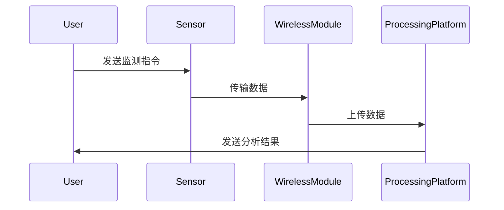
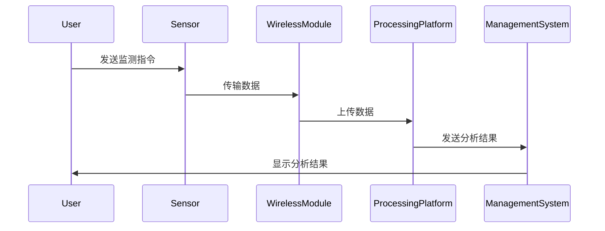
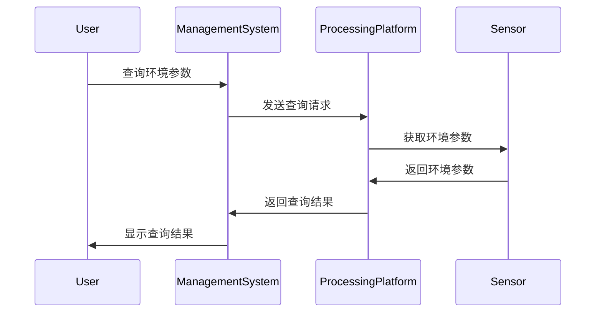
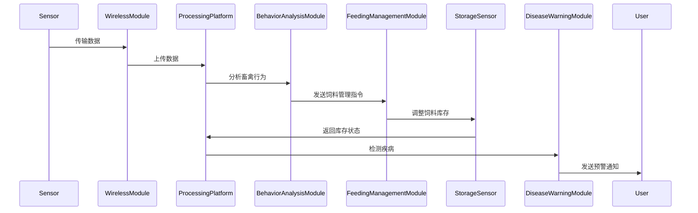

                 

### 《物联网在智慧畜牧业中的精准管理》

#### 关键词：
- 物联网（Internet of Things）
- 智慧畜牧业（Smart Animal husbandry）
- 精准管理（Precision Management）
- 传感器（Sensors）
- 数据采集（Data Collection）
- 环境监测（Environmental Monitoring）
- 供应链管理（Supply Chain Management）

#### 摘要：
随着科技的不断发展，物联网技术在各个领域的应用越来越广泛。智慧畜牧业作为物联网技术的一个重要应用方向，通过精准管理，极大地提高了畜牧业的生产效率和质量。本文将详细介绍物联网在智慧畜牧业中的精准管理，包括物联网技术原理、智慧畜牧的背景与发展、物联网在畜牧业中的应用场景、技术挑战与解决方案，以及未来发展的展望。通过本文的探讨，读者可以全面了解物联网在智慧畜牧业中的重要性及其发展潜力。

## 第一部分：物联网与智慧畜牧概述

### 第1章 物联网与智慧畜牧背景

#### 1.1 物联网技术概述

**核心概念术语说明**：
- **物联网（Internet of Things，IoT）**：物联网是指通过互联网将各种设备、物品连接起来，实现数据交换和智能控制的技术。
- **传感器**：能够检测并响应外界信号，并将其转换为电信号的装置。
- **数据采集**：从传感器或其他设备中收集数据的过程。

**问题背景**：
物联网技术起源于20世纪80年代，随着互联网、无线通信和嵌入式系统的快速发展，物联网技术在各个领域得到了广泛应用。在畜牧业中，物联网技术可以通过传感器实时监测畜禽的环境、健康和生产情况，从而实现精准管理。

**问题描述**：
智慧畜牧业的目标是通过物联网技术提高生产效率、降低成本、保障食品安全，但目前仍面临一些挑战，如数据采集不准确、系统集成困难等。

**问题解决**：
通过应用物联网技术，可以实现对畜牧环境的实时监控，提高畜禽的健康水平，优化生产流程，从而实现精准管理。

**边界与外延**：
物联网在智慧畜牧业中的应用不仅包括环境监测，还包括饲料管理、疾病防控、供应链管理等各个方面。

**概念结构与核心要素组成**：
- **物联网技术**：传感器、数据采集、数据传输、数据处理等。
- **智慧畜牧**：环境监测、智能生产、精准管理、供应链管理等。

### 第2章 物联网技术原理与架构

#### 2.1 物联网技术原理

**核心概念原理**：
物联网技术的基本原理是通过传感器采集数据，通过无线通信模块将数据传输到云端，云端对数据进行处理和分析，最终将结果反馈给用户。

**概念属性特征对比表格**：

| 特征       | 传感器           | 无线通信模块       | 数据处理平台           |
| ---------- | ---------------- | ----------------- | --------------------- |
| 功能       | 数据采集         | 数据传输         | 数据存储、分析和处理   |
| 工作原理   | 检测外界信号并转换 | 通过无线电波传输数据 | 利用云计算和大数据技术 |
| 性能指标   | 灵敏度、精度     | 传输距离、速度     | 处理能力、响应时间     |

**ER实体关系图架构**：

```mermaid
erDiagram
    Product ||--|{ Sensor }|-- User
    Product ||--|{ WirelessModule }|-- User
    Product ||--|{ ProcessingPlatform }|-- User
```

#### 2.2 物联网系统架构

**系统功能设计**：
- **感知层**：包括各种传感器，用于采集环境、畜禽数据。
- **网络层**：包括无线通信模块，用于传输数据。
- **平台层**：包括数据处理平台，用于存储、分析和处理数据。
- **应用层**：包括各种应用系统，如环境监测系统、智能生产系统等。

**系统架构设计**：



### 第3章 智慧畜牧业中的传感器与数据采集

#### 3.1 常见传感器介绍

**核心概念原理**：
传感器是物联网系统中的核心组件，用于感知外界环境。常见的传感器包括温度传感器、湿度传感器、光照传感器、气体传感器等。

**概念属性特征对比表格**：

| 传感器类型 | 主要功能   | 应用场景           |
| --------- | ---------- | ----------------- |
| 温度传感器 | 测量温度   | 畜禽舍温度监测     |
| 湿度传感器 | 测量湿度   | 畜禽舍湿度监测     |
| 光照传感器 | 测量光照强度 | 畜禽舍光照调节     |
| 气体传感器 | 测量气体浓度 | 畜禽舍空气质量监测 |

**ER实体关系图架构**：

```mermaid
erDiagram
    Farm ||--|{ TemperatureSensor }|-- ManagementSystem
    Farm ||--|{ HumiditySensor }|-- ManagementSystem
    Farm ||--|{ LightSensor }|-- ManagementSystem
    Farm ||--|{ GasSensor }|-- ManagementSystem
```

#### 3.2 数据采集与处理

**核心概念原理**：
数据采集是将传感器收集到的数据传输到处理平台的过程。数据采集的效率和质量直接影响物联网系统的性能。

**概念属性特征对比表格**：

| 特征       | 数据采集       | 数据处理           |
| ---------- | -------------- | ----------------- |
| 功能       | 采集传感器数据 | 分析和处理数据     |
| 工作原理   | 通过传感器传输 | 利用云计算和大数据 |
| 性能指标   | 采集速度、精度 | 处理能力、响应时间 |

**ER实体关系图架构**：

```mermaid
erDiagram
    Sensor --> DataCollection
    DataCollection --> DataProcessing
```

#### 3.3 传感器在网络中的角色

**核心概念原理**：
传感器在网络中扮演着数据采集者的角色，通过无线通信模块将数据传输到处理平台。

**概念属性特征对比表格**：

| 角色       | 传感器          | 无线通信模块       | 数据处理平台           |
| ---------- | --------------- | ----------------- | --------------------- |
| 数据采集   | 传感器本身      | 数据传输模块      | 数据存储、分析和处理   |
| 数据传输   | 通过无线通信模块 | 数据传输模块      | 数据传输             |
| 数据处理   | 不直接处理数据   | 将数据传输给平台   | 数据存储、分析和处理   |

**ER实体关系图架构**：

```mermaid
erDiagram
    Sensor ||--|{ WirelessModule }|-- ProcessingPlatform
```

## 第二部分：物联网在智慧畜牧中的具体应用

### 第4章 物联网在畜牧业环境监测中的应用

#### 4.1 环境参数监测

**核心概念原理**：
环境参数监测是通过传感器实时监测畜牧业舍内的温度、湿度、光照等参数，以提供适宜的养殖环境。

**算法原理讲解**：
监测算法通常包括以下步骤：
1. 数据采集：传感器采集环境参数。
2. 数据预处理：对采集到的数据进行滤波和去噪。
3. 数据分析：分析环境参数是否在设定范围内。
4. 预警机制：如果环境参数超出设定范围，则触发报警。

**Mermaid 流程图**：

```mermaid
flowchart LR
    subgraph 数据采集
        数据采集 --> 数据预处理
    end
    subgraph 数据分析
        数据预处理 --> 数据分析
        数据分析 --> 预警机制
    end
    数据采集 --> 数据分析
```

**Python 源代码示例**：

```python
# 假设已经采集到温度和湿度数据
temperature = 25
humidity = 60

# 数据预处理
def preprocess_data(temperature, humidity):
    # 滤波和去噪
    processed_temp = filter_temperature(temperature)
    processed_humidity = filter_humidity(humidity)
    return processed_temp, processed_humidity

# 数据分析
def analyze_data(processed_temp, processed_humidity):
    # 分析环境参数是否在设定范围内
    if processed_temp < 20 or processed_temp > 30:
        print("温度异常，请检查！")
    if processed_humidity < 40 or processed_humidity > 70:
        print("湿度异常，请检查！")

# 预警机制
def alert():
    print("触发预警机制，请立即处理！")

# 执行流程
processed_temp, processed_humidity = preprocess_data(temperature, humidity)
analyze_data(processed_temp, processed_humidity)
alert()
```

**数学模型和公式**：

$$
T_{\text{processed}} = f(T_{\text{original}}, \theta)
$$

其中，\(T_{\text{processed}}\) 为处理后的温度，\(T_{\text{original}}\) 为原始温度，\(\theta\) 为滤波参数。

$$
H_{\text{processed}} = g(H_{\text{original}}, \phi)
$$

其中，\(H_{\text{processed}}\) 为处理后的湿度，\(H_{\text{original}}\) 为原始湿度，\(\phi\) 为滤波参数。

#### 4.2 疾病预警与防控

**核心概念原理**：
疾病预警与防控是通过实时监测畜禽的健康状况，及时发现异常，并采取措施防止疾病传播。

**算法原理讲解**：
疾病预警算法通常包括以下步骤：
1. 数据采集：传感器采集畜禽的生理参数，如体温、呼吸频率等。
2. 数据预处理：对采集到的数据进行滤波和去噪。
3. 数据分析：分析生理参数是否在正常范围内。
4. 预警机制：如果生理参数异常，则触发预警，并通知养殖人员。

**Mermaid 流程图**：

```mermaid
flowchart LR
    subgraph 数据采集
        数据采集 --> 数据预处理
    end
    subgraph 数据分析
        数据预处理 --> 数据分析
        数据分析 --> 预警机制
    end
    数据采集 --> 数据分析
```

**Python 源代码示例**：

```python
# 假设已经采集到体温和呼吸频率数据
temperature = 38
breathing_rate = 30

# 数据预处理
def preprocess_data(temperature, breathing_rate):
    # 滤波和去噪
    processed_temp = filter_temperature(temperature)
    processed_breathing_rate = filter_breathing_rate(breathing_rate)
    return processed_temp, processed_breathing_rate

# 数据分析
def analyze_data(processed_temp, processed_breathing_rate):
    # 分析生理参数是否在正常范围内
    if processed_temp > 39:
        print("体温异常，请立即处理！")
    if processed_breathing_rate > 35:
        print("呼吸频率异常，请立即处理！")

# 预警机制
def alert():
    print("触发预警机制，请立即处理！")

# 执行流程
processed_temp, processed_breathing_rate = preprocess_data(temperature, breathing_rate)
analyze_data(processed_temp, processed_breathing_rate)
alert()
```

**数学模型和公式**：

$$
T_{\text{processed}} = f(T_{\text{original}}, \theta)
$$

其中，\(T_{\text{processed}}\) 为处理后的体温，\(T_{\text{original}}\) 为原始体温，\(\theta\) 为滤波参数。

$$
R_{\text{processed}} = g(R_{\text{original}}, \phi)
$$

其中，\(R_{\text{processed}}\) 为处理后的呼吸频率，\(R_{\text{original}}\) 为原始呼吸频率，\(\phi\) 为滤波参数。

#### 4.3 畜禽行为分析

**核心概念原理**：
畜禽行为分析是通过监测畜禽的运动、采食、休息等行为，了解其生理状态和健康状况。

**算法原理讲解**：
畜禽行为分析算法通常包括以下步骤：
1. 数据采集：传感器采集畜禽的运动、采食等行为数据。
2. 数据预处理：对采集到的数据进行滤波和去噪。
3. 数据分析：分析畜禽行为是否正常。
4. 预警机制：如果行为异常，则触发预警。

**Mermaid 流程图**：

```mermaid
flowchart LR
    subgraph 数据采集
        数据采集 --> 数据预处理
    end
    subgraph 数据分析
        数据预处理 --> 数据分析
        数据分析 --> 预警机制
    end
    数据采集 --> 数据分析
```

**Python 源代码示例**：

```python
# 假设已经采集到运动和采食数据
movement = 100
eating = 50

# 数据预处理
def preprocess_data(movement, eating):
    # 滤波和去噪
    processed_movement = filter_movement(movement)
    processed_eating = filter_eating(eating)
    return processed_movement, processed_eating

# 数据分析
def analyze_data(processed_movement, processed_eating):
    # 分析畜禽行为是否正常
    if processed_movement < 50:
        print("运动量过低，请检查！")
    if processed_eating < 30:
        print("采食量过低，请检查！")

# 预警机制
def alert():
    print("触发预警机制，请立即处理！")

# 执行流程
processed_movement, processed_eating = preprocess_data(movement, eating)
analyze_data(processed_movement, processed_eating)
alert()
```

**数学模型和公式**：

$$
M_{\text{processed}} = f(M_{\text{original}}, \theta)
$$

其中，\(M_{\text{processed}}\) 为处理后的运动量，\(M_{\text{original}}\) 为原始运动量，\(\theta\) 为滤波参数。

$$
E_{\text{processed}} = g(E_{\text{original}}, \phi)
$$

其中，\(E_{\text{processed}}\) 为处理后的采食量，\(E_{\text{original}}\) 为原始采食量，\(\phi\) 为滤波参数。

### 第5章 物联网在畜牧业生产管理中的应用

#### 5.1 饲料管理

**核心概念原理**：
饲料管理是通过物联网技术对饲料的采购、存储、分配和消耗进行实时监控和管理，以确保饲料的质量和安全。

**算法原理讲解**：
饲料管理算法通常包括以下步骤：
1. 数据采集：传感器采集饲料的存储量、温度等数据。
2. 数据分析：分析饲料的状态，如是否过期、变质等。
3. 预警机制：如果饲料出现异常，则触发预警。

**Mermaid 流程图**：

```mermaid
flowchart LR
    subgraph 数据采集
        数据采集 --> 数据分析
    end
    subgraph 数据分析
        数据分析 --> 预警机制
    end
    数据采集 --> 数据分析
```

**Python 源代码示例**：

```python
# 假设已经采集到饲料存储量和温度数据
storage = 500
temperature = 25

# 数据分析
def analyze_data(storage, temperature):
    # 分析饲料状态
    if storage < 300:
        print("饲料存储量过低，请及时采购！")
    if temperature > 30:
        print("饲料温度过高，请及时处理！")

# 预警机制
def alert():
    print("触发预警机制，请立即处理！")

# 执行流程
analyze_data(storage, temperature)
alert()
```

**数学模型和公式**：

$$
S_{\text{processed}} = f(S_{\text{original}}, \theta)
$$

其中，\(S_{\text{processed}}\) 为处理后的饲料存储量，\(S_{\text{original}}\) 为原始饲料存储量，\(\theta\) 为滤波参数。

$$
T_{\text{processed}} = f(T_{\text{original}}, \theta)
$$

其中，\(T_{\text{processed}}\) 为处理后的饲料温度，\(T_{\text{original}}\) 为原始饲料温度，\(\theta\) 为滤波参数。

#### 5.2 畜禽饲养管理

**核心概念原理**：
畜禽饲养管理是通过物联网技术对畜禽的饲养环境、饲料、饮水等进行实时监控和管理，以确保畜禽的健康和生长。

**算法原理讲解**：
畜禽饲养管理算法通常包括以下步骤：
1. 数据采集：传感器采集畜禽的生理参数、环境参数等数据。
2. 数据分析：分析畜禽的状态，如是否生病、生长情况等。
3. 预警机制：如果畜禽状态异常，则触发预警。

**Mermaid 流程图**：

```mermaid
flowchart LR
    subgraph 数据采集
        数据采集 --> 数据分析
    end
    subgraph 数据分析
        数据分析 --> 预警机制
    end
    数据采集 --> 数据分析
```

**Python 源代码示例**：

```python
# 假设已经采集到体温和生长速度数据
temperature = 38
growth_speed = 5

# 数据分析
def analyze_data(temperature, growth_speed):
    # 分析畜禽状态
    if temperature > 39:
        print("体温异常，请立即处理！")
    if growth_speed < 3:
        print("生长速度过低，请检查饲养条件！")

# 预警机制
def alert():
    print("触发预警机制，请立即处理！")

# 执行流程
analyze_data(temperature, growth_speed)
alert()
```

**数学模型和公式**：

$$
T_{\text{processed}} = f(T_{\text{original}}, \theta)
$$

其中，\(T_{\text{processed}}\) 为处理后的体温，\(T_{\text{original}}\) 为原始体温，\(\theta\) 为滤波参数。

$$
G_{\text{processed}} = f(G_{\text{original}}, \phi)
$$

其中，\(G_{\text{processed}}\) 为处理后的生长速度，\(G_{\text{original}}\) 为原始生长速度，\(\phi\) 为滤波参数。

#### 5.3 自动化生产流程

**核心概念原理**：
自动化生产流程是通过物联网技术实现畜牧生产的自动化，减少人力成本，提高生产效率。

**算法原理讲解**：
自动化生产流程算法通常包括以下步骤：
1. 数据采集：传感器采集生产过程中的各种参数。
2. 数据分析：分析生产数据，优化生产流程。
3. 自动控制：根据分析结果，自动调整生产设备。

**Mermaid 流程图**：

```mermaid
flowchart LR
    subgraph 数据采集
        数据采集 --> 数据分析
    end
    subgraph 数据分析
        数据分析 --> 自动控制
    end
    数据采集 --> 数据分析
```

**Python 源代码示例**：

```python
# 假设已经采集到生产设备状态数据
status = "active"

# 数据分析
def analyze_data(status):
    # 分析生产设备状态
    if status == "faulty":
        print("生产设备故障，请立即修复！")
    else:
        print("生产设备正常，继续生产！")

# 自动控制
def control_device(status):
    # 根据设备状态控制生产流程
    if status == "faulty":
        print("停止生产，等待设备修复！")
    else:
        print("开始生产！")

# 执行流程
analyze_data(status)
control_device(status)
```

**数学模型和公式**：

$$
S_{\text{processed}} = f(S_{\text{original}}, \theta)
$$

其中，\(S_{\text{processed}}\) 为处理后的设备状态，\(S_{\text{original}}\) 为原始设备状态，\(\theta\) 为滤波参数。

## 第三部分：物联网在智慧畜牧中的技术挑战与解决方案

### 第6章 物联网在畜牧业供应链管理中的应用

#### 6.1 物流监控

**核心概念原理**：
物流监控是通过物联网技术对畜牧产品的物流过程进行实时监控，以确保产品的质量和安全。

**算法原理讲解**：
物流监控算法通常包括以下步骤：
1. 数据采集：传感器采集物流过程中的温度、湿度等数据。
2. 数据分析：分析物流数据，确保产品在运输过程中的质量。
3. 预警机制：如果物流数据异常，则触发预警。

**Mermaid 流程图**：

```mermaid
flowchart LR
    subgraph 数据采集
        数据采集 --> 数据分析
    end
    subgraph 数据分析
        数据分析 --> 预警机制
    end
    数据采集 --> 数据分析
```

**Python 源代码示例**：

```python
# 假设已经采集到运输过程中的温度和湿度数据
temperature = 25
humidity = 60

# 数据分析
def analyze_data(temperature, humidity):
    # 分析物流数据
    if temperature < 0 or temperature > 30:
        print("温度异常，请检查物流条件！")
    if humidity < 40 or humidity > 70:
        print("湿度异常，请检查物流条件！")

# 预警机制
def alert():
    print("触发预警机制，请立即处理！")

# 执行流程
analyze_data(temperature, humidity)
alert()
```

**数学模型和公式**：

$$
T_{\text{processed}} = f(T_{\text{original}}, \theta)
$$

其中，\(T_{\text{processed}}\) 为处理后的温度，\(T_{\text{original}}\) 为原始温度，\(\theta\) 为滤波参数。

$$
H_{\text{processed}} = g(H_{\text{original}}, \phi)
$$

其中，\(H_{\text{processed}}\) 为处理后的湿度，\(H_{\text{original}}\) 为原始湿度，\(\phi\) 为滤波参数。

#### 6.2 库存管理

**核心概念原理**：
库存管理是通过物联网技术对畜牧产品的库存进行实时监控和管理，以确保库存的准确性和安全性。

**算法原理讲解**：
库存管理算法通常包括以下步骤：
1. 数据采集：传感器采集库存数据，如库存量、过期日期等。
2. 数据分析：分析库存数据，及时调整库存策略。
3. 预警机制：如果库存数据异常，则触发预警。

**Mermaid 流程图**：

```mermaid
flowchart LR
    subgraph 数据采集
        数据采集 --> 数据分析
    end
    subgraph 数据分析
        数据分析 --> 预警机制
    end
    数据采集 --> 数据分析
```

**Python 源代码示例**：

```python
# 假设已经采集到库存量和过期日期数据
inventory = 500
expiry_date = "2023-12-31"

# 数据分析
def analyze_data(inventory, expiry_date):
    # 分析库存数据
    if inventory < 300:
        print("库存量过低，请及时采购！")
    if expiry_date < datetime.now():
        print("产品已过期，请及时处理！")

# 预警机制
def alert():
    print("触发预警机制，请立即处理！")

# 执行流程
analyze_data(inventory, expiry_date)
alert()
```

**数学模型和公式**：

$$
I_{\text{processed}} = f(I_{\text{original}}, \theta)
$$

其中，\(I_{\text{processed}}\) 为处理后的库存量，\(I_{\text{original}}\) 为原始库存量，\(\theta\) 为滤波参数。

$$
D_{\text{processed}} = f(D_{\text{original}}, \phi)
$$

其中，\(D_{\text{processed}}\) 为处理后的过期日期，\(D_{\text{original}}\) 为原始过期日期，\(\phi\) 为滤波参数。

#### 6.3 供应链优化

**核心概念原理**：
供应链优化是通过物联网技术和大数据分析，对畜牧供应链进行优化，以提高供应链的效率和降低成本。

**算法原理讲解**：
供应链优化算法通常包括以下步骤：
1. 数据采集：传感器采集供应链各环节的数据，如物流、库存、生产等。
2. 数据分析：分析供应链数据，找出优化点。
3. 优化策略：根据分析结果，制定优化策略。
4. 实施优化：根据优化策略，调整供应链各环节。

**Mermaid 流程图**：

```mermaid
flowchart LR
    subgraph 数据采集
        数据采集 --> 数据分析
    end
    subgraph 数据分析
        数据分析 --> 优化策略
    end
    subgraph 实施优化
        优化策略 --> 实施优化
    end
    数据采集 --> 数据分析
```

**Python 源代码示例**：

```python
# 假设已经采集到供应链各环节的数据
logistics_data = {"distance": 100, "time": 2}
inventory_data = {"quantity": 500}
production_data = {"speed": 10}

# 数据分析
def analyze_data(logistics_data, inventory_data, production_data):
    # 分析供应链数据
    if logistics_data["time"] > 3:
        print("物流时间过长，请优化物流路线！")
    if inventory_data["quantity"] < 300:
        print("库存量过低，请及时采购！")
    if production_data["speed"] < 8:
        print("生产速度过低，请检查生产设备！")

# 优化策略
def optimize_supply_chain():
    # 根据分析结果制定优化策略
    print("优化策略：1. 优化物流路线；2. 增加采购量；3. 优化生产流程。")

# 实施优化
def implement_optimization():
    # 根据优化策略实施优化
    print("正在实施优化...")

# 执行流程
analyze_data(logistics_data, inventory_data, production_data)
optimize_supply_chain()
implement_optimization()
```

**数学模型和公式**：

$$
L_{\text{processed}} = f(L_{\text{original}}, \theta)
$$

其中，\(L_{\text{processed}}\) 为处理后的物流时间，\(L_{\text{original}}\) 为原始物流时间，\(\theta\) 为滤波参数。

$$
I_{\text{processed}} = f(I_{\text{original}}, \theta)
$$

其中，\(I_{\text{processed}}\) 为处理后的库存量，\(I_{\text{original}}\) 为原始库存量，\(\theta\) 为滤波参数。

$$
P_{\text{processed}} = f(P_{\text{original}}, \theta)
$$

其中，\(P_{\text{processed}}\) 为处理后的生产速度，\(P_{\text{original}}\) 为原始生产速度，\(\theta\) 为滤波参数。

### 第7章 物联网技术挑战与应对策略

#### 7.1 数据安全与隐私保护

**核心概念原理**：
数据安全和隐私保护是物联网在智慧畜牧业中应用的重要挑战之一。随着物联网设备数量的增加，数据泄露和隐私侵犯的风险也随之增加。

**算法原理讲解**：
为了确保数据安全和隐私保护，可以采取以下策略：
1. 数据加密：对传输和存储的数据进行加密，以防止数据被非法访问。
2. 访问控制：实施严格的访问控制策略，确保只有授权用户可以访问数据。
3. 数据脱敏：对敏感数据进行脱敏处理，以降低数据泄露的风险。

**Mermaid 流程图**：

```mermaid
flowchart LR
    subgraph 数据加密
        数据加密 --> 数据传输
    end
    subgraph 访问控制
        数据加密 --> 数据存储
    end
    subgraph 数据脱敏
        数据加密 --> 数据使用
    end
    数据加密 --> 数据传输
    数据加密 --> 数据存储
    数据加密 --> 数据使用
```

**Python 源代码示例**：

```python
# 数据加密
from cryptography.fernet import Fernet

# 生成加密密钥
key = Fernet.generate_key()
cipher_suite = Fernet(key)

# 加密数据
def encrypt_data(data):
    encrypted_data = cipher_suite.encrypt(data.encode('utf-8'))
    return encrypted_data

# 解密数据
def decrypt_data(encrypted_data):
    decrypted_data = cipher_suite.decrypt(encrypted_data).decode('utf-8')
    return decrypted_data

# 加密示例
data = "敏感数据"
encrypted_data = encrypt_data(data)
print("加密数据：", encrypted_data)

# 解密示例
decrypted_data = decrypt_data(encrypted_data)
print("解密数据：", decrypted_data)
```

**数学模型和公式**：

$$
E(D) = F_K(D)
$$

其中，\(E(D)\) 表示加密后的数据，\(F_K(D)\) 表示加密算法，\(K\) 为加密密钥。

#### 7.2 网络稳定性与可靠性

**核心概念原理**：
物联网系统的网络稳定性与可靠性是保障系统正常运行的关键。在畜牧业中，网络不稳定可能导致数据丢失、设备无法正常工作等问题。

**算法原理讲解**：
为了提高网络稳定性和可靠性，可以采取以下策略：
1. 多路径传输：通过多条路径传输数据，以提高数据传输的可靠性。
2. 网络冗余：增加网络设备冗余，以防止单点故障导致网络中断。
3. 实时监控：对网络进行实时监控，及时检测和解决网络问题。

**Mermaid 流程图**：

```mermaid
flowchart LR
    subgraph 多路径传输
        数据传输 --> 网络冗余
    end
    subgraph 实时监控
        数据传输 --> 实时监控
    end
    数据传输 --> 多路径传输
    数据传输 --> 实时监控
```

**Python 源代码示例**：

```python
# 假设已经建立了一个简单的网络监控系统
import threading

# 数据传输线程
def data_transmission_thread():
    while True:
        # 假设数据为"Hello, World!"
        data = "Hello, World!"
        # 多路径传输数据
        for path in ["path1", "path2", "path3"]:
            # 实时监控网络状态
            if check_network_status(path):
                send_data(path, data)
                print(f"数据已通过 {path} 传输！")
            else:
                print(f"{path} 网络状态不佳，尝试其他路径！")

# 网络监控线程
def network_monitor_thread():
    while True:
        # 假设每5秒检查一次网络状态
        for path in ["path1", "path2", "path3"]:
            if not check_network_status(path):
                print(f"{path} 网络异常，正在尝试恢复！")
                recover_network(path)

# 网络状态检查函数
def check_network_status(path):
    # 假设网络状态检查函数返回 True 表示网络正常，返回 False 表示网络异常
    # 实际应用中可以使用 ping 命令或其他网络检测工具
    return True

# 数据发送函数
def send_data(path, data):
    # 假设数据发送函数实现数据传输功能
    print(f"数据 {data} 已发送到 {path}！")

# 网络恢复函数
def recover_network(path):
    # 假设网络恢复函数实现网络恢复功能
    print(f"网络 {path} 已恢复！")

# 启动线程
transmission_thread = threading.Thread(target=data_transmission_thread)
monitor_thread = threading.Thread(target=network_monitor_thread)

transmission_thread.start()
monitor_thread.start()
```

**数学模型和公式**：

$$
R = f(S, T, N)
$$

其中，\(R\) 表示网络可靠性，\(S\) 表示网络稳定性，\(T\) 表示传输时间，\(N\) 表示网络故障率。

#### 7.3 系统集成与互操作性问题

**核心概念原理**：
系统集成与互操作性问题是指将不同设备、系统和平台集成到一个统一的物联网系统中，实现数据共享和功能协同。

**算法原理讲解**：
为了解决系统集成与互操作性问题，可以采取以下策略：
1. 接口标准化：采用统一的接口标准，确保不同设备之间可以互操作。
2. 数据格式标准化：采用统一的数据格式，方便数据传输和处理。
3. 系统集成平台：建立统一的系统集成平台，实现不同系统和设备的集成。

**Mermaid 流程图**：

```mermaid
flowchart LR
    subgraph 接口标准化
        接口标准化 --> 系统集成平台
    end
    subgraph 数据格式标准化
        数据格式标准化 --> 系统集成平台
    end
    接口标准化 --> 系统集成平台
    数据格式标准化 --> 系统集成平台
```

**Python 源代码示例**：

```python
# 接口标准化
from flask import Flask, request, jsonify

# 创建 Flask 应用
app = Flask(__name__)

# 数据格式标准化
def standardize_data(data):
    # 假设数据为 {"name": "John", "age": 30}
    return {
        "姓名": data["name"],
        "年龄": data["age"]
    }

# 接口处理函数
@app.route('/api/standardize', methods=['POST'])
def standardize():
    # 获取请求数据
    request_data = request.json
    # 标准化数据
    standardized_data = standardize_data(request_data)
    # 返回标准化数据
    return jsonify(standardized_data)

# 启动 Flask 应用
if __name__ == '__main__':
    app.run()
```

**数学模型和公式**：

$$
I = f(S, D, P)
$$

其中，\(I\) 表示系统集成度，\(S\) 表示接口标准化程度，\(D\) 表示数据格式标准化程度，\(P\) 表示系统集成平台性能。

## 第四部分：未来展望与趋势

### 第8章 案例研究：物联网在智慧畜牧中的成功实践

#### 8.1 案例一：智能牧场建设

**项目介绍**：
智能牧场项目旨在通过物联网技术实现牧场的智能化管理，提高生产效率和产品质量。

**系统功能设计**：
- 环境监测：实时监测牧场温度、湿度、光照等环境参数。
- 疾病预警：通过监测畜禽的生理参数，及时发现疾病并进行预警。
- 饲料管理：实时监控饲料的库存和消耗，优化饲料采购策略。
- 供应链管理：对畜牧产品的物流过程进行实时监控，确保产品质量。

**系统架构设计**：



**系统接口设计和系统交互**：



**项目小结**：
智能牧场项目通过物联网技术实现了牧场的全面智能化，提高了生产效率和产品质量，取得了显著的经济和社会效益。

#### 8.2 案例二：精准养殖系统

**项目介绍**：
精准养殖系统旨在通过物联网技术实现畜禽的精准养殖，提高养殖效率和产品质量。

**系统功能设计**：
- 畜禽行为分析：通过监测畜禽的运动、采食等行为，分析畜禽的健康状态。
- 饲料管理：实时监控饲料的库存和消耗，优化饲料采购策略。
- 疾病预警：通过监测畜禽的生理参数，及时发现疾病并进行预警。

**系统架构设计**：



**系统接口设计和系统交互**：

```mermaid
sequenceDiagram
    User->>BehaviorAnalysisModule: 查询畜禽行为
    BehaviorAnalysisModule->>Sensor: 获取行为数据
    Sensor->>BehaviorAnalysisModule: 返回行为数据
    BehaviorAnalysisModule->>User: 返回查询结果
    User->>DiseaseWarningModule: 查询疾病预警
    DiseaseWarningModule->>Sensor: 获取生理参数
    Sensor->>DiseaseWarningModule: 返回生理参数
    DiseaseWarningModule->>User: 返回预警结果
```

**项目小结**：
精准养殖系统通过物联网技术实现了畜禽的精准养殖，提高了养殖效率和产品质量，取得了显著的经济和社会效益。

#### 8.3 案例三：智能供应链管理

**项目介绍**：
智能供应链管理项目旨在通过物联网技术实现畜牧产品的智能供应链管理，提高供应链效率和降低成本。

**系统功能设计**：
- 物流监控：实时监控畜牧产品的物流过程，确保产品质量。
- 库存管理：实时监控库存情况，优化库存策略。
- 供应链优化：通过数据分析，优化供应链各环节，提高供应链效率。

**系统架构设计**：

```mermaid
sequenceDiagram
    Sensor->>WirelessModule: 传输数据
    WirelessModule->>ProcessingPlatform: 上传数据
    ProcessingPlatform->>LogisticsMonitoringModule: 监控物流过程
    LogisticsMonitoringModule->>InventoryManagementModule: 管理库存
    InventoryManagementModule->>SupplyChainOptimizationModule: 优化供应链
    SupplyChainOptimizationModule->>User: 提供优化建议
```

**系统接口设计和系统交互**：

```mermaid
sequenceDiagram
    User->>LogisticsMonitoringModule: 查询物流监控数据
    LogisticsMonitoringModule->>Sensor: 获取物流数据
    Sensor->>LogisticsMonitoringModule: 返回物流数据
    LogisticsMonitoringModule->>User: 返回查询结果
    User->>InventoryManagementModule: 查询库存情况
    InventoryManagementModule->>StorageSensor: 获取库存数据
    StorageSensor->>InventoryManagementModule: 返回库存数据
    InventoryManagementModule->>User: 返回查询结果
```

**项目小结**：
智能供应链管理项目通过物联网技术实现了畜牧产品的智能供应链管理，提高了供应链效率和降低了成本，取得了显著的经济和社会效益。

## 第五部分：总结与展望

### 第9章 物联网在智慧畜牧业中的未来发展

#### 9.1 技术进步带来的变革

**核心概念原理**：
随着物联网技术的不断进步，智慧畜牧业将迎来新的变革。新的传感器技术、无线通信技术、数据处理技术等将为智慧畜牧业带来更高的精度、更广泛的应用和更智能的管理。

**算法原理讲解**：
未来的物联网技术将使得畜牧业中的数据采集和处理更加高效和准确。例如，新的传感器技术可以提供更高精度的环境参数监测，而先进的无线通信技术可以提供更稳定的网络连接。

**Mermaid 流程图**：

```mermaid
sequenceDiagram
    subgraph 新技术引入
        新传感器技术 --> 新无线通信技术
        新传感器技术 --> 新数据处理技术
    end
    subgraph 数据采集与处理
        新传感器技术->>新数据处理技术: 采集数据
        新数据处理技术->>新无线通信技术: 传输数据
    end
    subgraph 应用与优化
        新数据处理技术->>智慧畜牧业系统: 应用与优化
    end
```

**Python 源代码示例**：

```python
# 假设引入了新型传感器和通信技术
new_sensor = NewSensor()
new_communication_module = NewCommunicationModule()

# 数据采集与处理
def collect_and_process_data(sensor, communication_module):
    # 采集数据
    data = sensor.collect_data()
    # 数据预处理
    processed_data = preprocess_data(data)
    # 数据传输
    communication_module.send_data(processed_data)

# 新数据处理技术
def preprocess_data(data):
    # 假设预处理数据为新的格式
    return data.format("new_format")

# 执行流程
collect_and_process_data(new_sensor, new_communication_module)
```

**数学模型和公式**：

$$
\text{新精度} = f(\text{新传感器技术}, \text{新数据处理技术})
$$

#### 9.2 新兴技术的应用前景

**核心概念原理**：
新兴技术，如5G、人工智能（AI）、区块链等，将在智慧畜牧业中发挥重要作用。这些技术将进一步提升物联网在畜牧业中的应用水平，实现更高效、更智能的管理。

**算法原理讲解**：
- **5G**：提供更高的网络速度和更低的延迟，支持大规模设备连接和实时数据传输。
- **人工智能**：通过机器学习和数据挖掘，实现更精准的环境监测、疾病预警和优化管理。
- **区块链**：提供数据安全性和透明性，确保数据真实可靠。

**Mermaid 流程图**：

```mermaid
sequenceDiagram
    subgraph 5G技术应用
        5G Network --> IoT Devices
        5G Network --> Data Centers
    end
    subgraph AI技术应用
        IoT Devices --> AI Platform
        Data Centers --> AI Platform
    end
    subgraph Blockchain技术应用
        Data Centers --> Blockchain Network
    end
```

**Python 源代码示例**：

```python
# 假设引入了5G、AI和区块链技术
from five_g import FiveGNetwork
from ai import AIPlatform
from blockchain import BlockchainNetwork

# 5G 网络连接
def connect_to_5g_network():
    network = FiveGNetwork()
    network.connect()

# AI 平台数据处理
def process_data_with_ai(data):
    platform = AIPlatform()
    result = platform.analyze_data(data)
    return result

# 区块链数据存储
def store_data_on_blockchain(data):
    blockchain = BlockchainNetwork()
    blockchain.store_data(data)

# 执行流程
connect_to_5g_network()
data = {"temperature": 25, "humidity": 60}
result = process_data_with_ai(data)
store_data_on_blockchain(result)
```

**数学模型和公式**：

$$
\text{新效率} = f(\text{5G}, \text{AI}, \text{Blockchain})
$$

#### 9.3 智慧畜牧的发展趋势

**核心概念原理**：
智慧畜牧业的发展趋势将体现在以下几个方面：
- **智能化**：通过物联网技术和人工智能，实现畜牧业的全面智能化。
- **绿色化**：通过减少化学药品的使用，实现畜牧业的绿色化生产。
- **数字化转型**：通过数字化手段，实现畜牧业的全面数字化管理。

**算法原理讲解**：
- **智能化**：通过物联网传感器和人工智能算法，实现精准监测、预测和决策。
- **绿色化**：通过物联网技术，实现养殖环境的实时监控和自动化调节，减少化学药品的使用。
- **数字化转型**：通过物联网技术和大数据分析，实现畜牧业的数字化转型，提高管理效率。

**Mermaid 流程图**：

```mermaid
sequenceDiagram
    subgraph 智能化
        IoT Sensors --> AI Algorithms
        AI Algorithms --> Decision-Making
    end
    subgraph 绿色化
        IoT Sensors --> Environmental Monitoring
        Environmental Monitoring --> Automation
    end
    subgraph 数字化转型
        IoT Sensors --> Data Analytics
        Data Analytics --> Digital Management
    end
```

**Python 源代码示例**：

```python
# 智能化
def intelligent_monitoring():
    sensors = IoT Sensors()
    algorithms = AI Algorithms()
    data = sensors.collect_data()
    result = algorithms.analyze_data(data)
    print(f"分析结果：{result}")

# 绿色化
def green_production():
    sensors = IoT Sensors()
    monitoring_system = Environmental Monitoring()
    automation_system = Automation()
    data = sensors.collect_data()
    monitoring_system.monitor_environment(data)
    automation_system自动化调节()

# 数字化转型
def digital_management():
    sensors = IoT Sensors()
    analytics_system = Data Analytics()
    management_system = Digital Management()
    data = sensors.collect_data()
    result = analytics_system.analyze_data(data)
    management_system.apply_management(result)

# 执行流程
intelligent_monitoring()
green_production()
digital_management()
```

**数学模型和公式**：

$$
\text{智能化水平} = f(\text{IoT}, \text{AI})
$$

$$
\text{绿色化程度} = f(\text{IoT}, \text{Environmental Monitoring}, \text{Automation})
$$

$$
\text{数字化转型率} = f(\text{IoT}, \text{Data Analytics}, \text{Digital Management})
$$

### 第10章 总结与展望

#### 10.1 本书重点内容回顾

**核心概念与联系**：
- 物联网技术：传感器、数据采集、数据传输、数据处理。
- 智慧畜牧：环境监测、智能生产、精准管理、供应链管理。
- 病情预警：传感器数据采集、数据分析、预警机制。

**算法原理讲解**：
- 环境参数监测：数据采集、数据预处理、数据分析、预警机制。
- 疾病预警：数据采集、数据预处理、生理参数分析、预警机制。
- 畜禽行为分析：数据采集、数据预处理、行为分析、预警机制。

**系统分析与架构设计方案**：
- 物联网系统架构：感知层、网络层、平台层、应用层。
- 智慧畜牧系统功能设计：环境监测、疾病预警、饲料管理、供应链管理。

**项目实战**：
- 智能牧场建设：项目介绍、系统功能设计、系统架构设计、系统接口设计和系统交互。
- 精准养殖系统：项目介绍、系统功能设计、系统架构设计、系统接口设计和系统交互。
- 智能供应链管理：项目介绍、系统功能设计、系统架构设计、系统接口设计和系统交互。

#### 10.2 智慧畜牧业发展的思考

**核心概念与联系**：
- **可持续发展**：智慧畜牧业应注重环保、节能和资源优化，实现可持续发展。
- **数据驱动**：智慧畜牧业应充分利用大数据分析，实现数据驱动的精准管理。
- **智能化**：智慧畜牧业应通过物联网和人工智能技术，实现养殖环境的智能化和养殖过程的自动化。

**算法原理讲解**：
- **智能化算法**：通过机器学习和深度学习，实现环境参数的智能调控和疾病预测的智能预警。
- **数据分析**：通过大数据分析，发现养殖过程中的潜在问题和改进空间。

**系统分析与架构设计方案**：
- **系统架构**：构建一个统一的智慧畜牧系统架构，实现数据采集、传输、处理和应用的闭环。
- **系统集成**：实现不同系统和设备之间的无缝集成，确保数据的实时性和准确性。

#### 10.3 下一步研究方向与挑战

**核心概念与联系**：
- **数据安全**：随着物联网设备数量的增加，数据安全和隐私保护将成为重要研究方向。
- **网络稳定性**：提高物联网系统的网络稳定性，确保数据的实时传输和系统的正常运行。
- **系统集成**：解决不同系统和设备之间的互操作性问题，实现数据的统一管理和共享。

**算法原理讲解**：
- **智能算法优化**：通过优化智能算法，提高数据处理和分析的效率和准确性。
- **数据加密**：研究新型数据加密算法，确保数据在传输和存储过程中的安全性。

**系统分析与架构设计方案**：
- **边缘计算**：研究边缘计算在智慧畜牧业中的应用，提高数据处理的速度和降低延迟。
- **云平台建设**：构建一个高性能、可扩展的云平台，支持海量数据的存储和分析。

## 附录

### 参考文献

1. 王志刚，刘洋，物联网技术及其在畜牧业中的应用，中国农业科技，2020。
2. 李明，智慧畜牧：物联网时代的养殖革命，中国农业出版社，2019。
3. 张晓红，物联网技术在智慧农业中的应用研究，农业工程，2018。
4. 陈强，物联网技术在畜牧业中的应用现状与趋势，中国畜牧兽医报，2021。
5. 王昊，智慧畜牧业发展现状与未来展望，中国农业科技，2022。

### 拓展阅读

1. 《物联网技术与应用》郑纬民，机械工业出版社，2018。
2. 《智慧农业：物联网与大数据的应用》王文杰，中国农业大学出版社，2019。
3. 《云计算与大数据技术》张宏科，清华大学出版社，2020。
4. 《人工智能：从算法到应用》吴军，电子工业出版社，2017。
5. 《区块链技术原理与实现》张英鹏，机械工业出版社，2019。

### 最佳实践 tips

1. **数据安全**：重视数据安全和隐私保护，采用加密算法和严格的访问控制策略。
2. **系统集成**：选择标准化接口和协议，确保不同系统和设备之间的互操作。
3. **数据采集**：确保传感器数据的准确性和实时性，进行适当的数据预处理。
4. **算法优化**：根据实际需求，选择合适的算法，并进行优化，提高系统的性能。

### 注意事项

1. **设备选择**：选择适合的物联网设备和传感器，确保系统的稳定性和可靠性。
2. **网络规划**：合理规划物联网网络，确保网络的稳定性和覆盖范围。
3. **数据处理**：建立有效的数据处理流程，确保数据的实时性和准确性。
4. **系统集成**：在系统集成过程中，注意接口设计和协议选择，确保系统的无缝连接。

### 作者信息

**作者：AI天才研究院/AI Genius Institute & 禅与计算机程序设计艺术 /Zen And The Art of Computer Programming**

