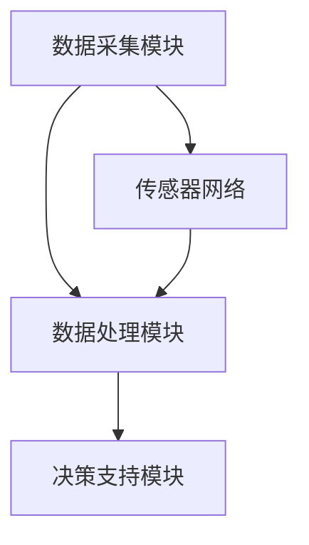
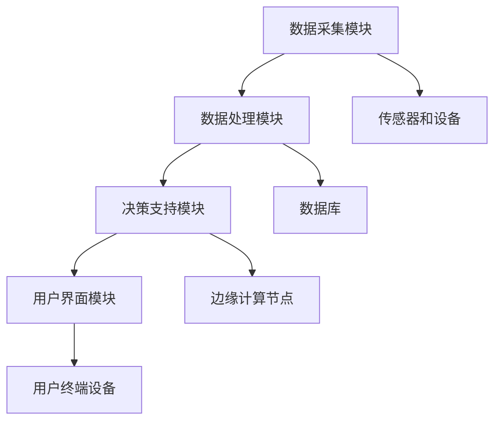

                 

# 物联网在智慧能源管理中的应用

> 关键词：物联网、智慧能源管理、传感器技术、网络通信技术、数据处理与存储技术

> 摘要：本文首先介绍了物联网和智慧能源管理的背景、定义及重要性，然后详细分析了物联网在智慧能源管理中的应用场景、关键技术及智慧能源管理系统的设计与实现。通过本文的探讨，旨在为物联网在智慧能源管理领域的应用提供有价值的参考和启示。

----------------------------------------------------------------

## 第一部分：背景与概述

### 第1章 物联网在智慧能源管理中的背景

#### 1.1 物联网概述

##### 1.1.1 物联网的定义

**定义**：物联网（Internet of Things，IoT）是指通过互联网将各种物理设备、传感器、软件等连接起来，实现信息交换和通信的一种网络体系。

##### 1.1.2 物联网的发展历程

**历程**：物联网概念最早由麻省理工学院的Kevin Ashton于1999年提出。随着技术的进步，物联网逐渐从理论研究走向实际应用。

##### 1.1.3 物联网的核心技术

**核心技术**：物联网的核心技术包括传感器技术、网络通信技术、数据处理与存储技术等。

#### 1.2 智慧能源管理概述

##### 1.2.1 智慧能源管理的定义

**定义**：智慧能源管理是指通过物联网、大数据、云计算等技术，对能源的生产、传输、消费等全过程进行智能化管理。

##### 1.2.2 智慧能源管理的重要性

**重要性**：随着能源需求的不断增长和能源结构的调整，智慧能源管理对于提高能源利用效率、减少能源浪费具有重要意义。

##### 1.2.3 智慧能源管理的挑战与机遇

**挑战**：智慧能源管理面临技术、政策、经济等多方面的挑战。

**机遇**：随着物联网技术的不断发展和应用，智慧能源管理迎来了前所未有的发展机遇。

## 第2章 物联网在智慧能源管理中的应用场景

### 2.1 能源生产领域的应用

#### 2.1.1 分布式能源系统的优化

**应用**：利用物联网技术，实现对分布式能源系统的实时监控与优化，提高能源利用效率。

**示例**：在一个分布式能源系统中，通过安装传感器，实时监测能源设备的工作状态和性能指标，利用物联网平台对数据进行分析和优化，实现能源的智能调度和高效利用。

#### 2.1.2 能源设备的远程维护

**应用**：通过物联网技术，实现对能源设备的远程监控和维护，降低运营成本。

**示例**：在一个风力发电场中，通过安装传感器和摄像头，实现对风电机组的远程监控。当传感器检测到设备故障或性能下降时，通过物联网平台通知运维人员，及时进行远程维护，减少停机时间，降低运维成本。

### 2.2 能源传输领域的应用

#### 2.2.1 智能电网的建设

**应用**：通过物联网技术，实现对电网的实时监控和智能调度，提高电力传输的稳定性和效率。

**示例**：在一个智能电网项目中，通过部署传感器和智能电表，实时监测电网的电压、电流等参数，利用物联网平台对数据进行实时分析和预测，实现电网的智能调度，提高电力传输的稳定性和效率。

#### 2.2.2 输电线路的监控与维护

**应用**：利用物联网技术，实现对输电线路的实时监控和智能预警，降低输电线路故障率。

**示例**：在一个输电线路项目中，通过在输电线路沿线安装传感器，实时监测输电线路的温度、湿度等环境参数，利用物联网平台对数据进行实时分析和预警，及时发现潜在故障，提前进行维护，降低输电线路故障率。

### 2.3 能源消费领域的应用

#### 2.3.1 家庭能源管理

**应用**：通过物联网技术，实现对家庭能源的智能监控和管理，降低家庭能源消耗。

**示例**：在一个智能家居项目中，通过安装智能插座、智能灯具等设备，实现对家庭能源的智能监控和管理。当用户离开家时，系统自动关闭不必要的电器，降低能源消耗，实现节能环保。

#### 2.3.2 工业能源管理

**应用**：利用物联网技术，实现对工业能源的实时监控和优化，提高工业能源利用效率。

**示例**：在一个工业园区中，通过部署传感器和智能仪表，实时监测工业能源的消耗情况，利用物联网平台对数据进行实时分析和优化，实现能源的高效利用，降低生产成本。

### 第3章 物联网在智慧能源管理中的关键技术

#### 3.1 传感器技术

##### 3.1.1 传感器的分类与原理

**分类与原理**：介绍传感器的基本分类和原理，包括温度传感器、湿度传感器、气体传感器等。

##### 3.1.2 传感器的应用

**应用**：分析传感器在智慧能源管理中的应用，如环境监测、能源消耗统计等。

#### 3.2 网络通信技术

##### 3.2.1 物联网通信协议

**协议**：介绍常用的物联网通信协议，如ZigBee、Wi-Fi、NB-IoT等。

##### 3.2.2 通信技术在智慧能源管理中的应用

**应用**：分析通信技术在智慧能源管理中的应用，如数据传输、远程控制等。

#### 3.3 数据处理与存储技术

##### 3.3.1 大数据技术在智慧能源管理中的应用

**应用**：介绍大数据技术在智慧能源管理中的应用，如数据挖掘、预测分析等。

##### 3.3.2 云计算与边缘计算在智慧能源管理中的应用

**应用**：分析云计算和边缘计算在智慧能源管理中的应用，如数据存储、计算服务等。

## 第4章 智慧能源管理系统的设计与实现

### 4.1 系统总体架构设计

##### 4.1.1 系统功能模块划分

**模块划分**：介绍智慧能源管理系统的功能模块划分，如数据采集、数据处理、决策支持等。

##### 4.1.2 系统架构设计

**架构设计**：利用Mermaid工具绘制智慧能源管理系统的架构图。

### 4.2 数据采集与传输

##### 4.2.1 数据采集技术

**技术**：介绍数据采集技术，如传感器采集、无线通信等。

##### 4.2.2 数据传输方案

**方案**：分析数据传输方案，如无线传输、有线传输等。

### 4.3 数据处理与分析

##### 4.3.1 数据预处理

**预处理**：介绍数据预处理技术，如数据清洗、数据格式转换等。

##### 4.3.2 数据分析算法

**算法**：介绍数据分析算法，如时间序列分析、聚类分析等。

### 4.4 决策支持系统

##### 4.4.1 决策支持系统概述

**概述**：介绍决策支持系统的概念、功能和作用。

##### 4.4.2 决策支持系统的实现

**实现**：分析决策支持系统的实现方法和技术，如人工智能、机器学习等。

### 4.5 系统部署与维护

##### 4.5.1 系统部署

**部署**：介绍智慧能源管理系统的部署方法和技术，如云计算、边缘计算等。

##### 4.5.2 系统维护

**维护**：介绍智慧能源管理系统的维护策略和措施，如故障排查、性能优化等。

## 第5章 项目实战：智慧能源管理系统开发与实践

### 5.1 环境安装

**环境安装**：介绍智慧能源管理系统开发所需的环境安装和配置，如传感器、物联网平台、数据分析工具等。

### 5.2 系统核心实现

**系统核心实现**：介绍智慧能源管理系统的核心功能实现，如数据采集、数据处理、决策支持等。

### 5.3 代码应用解读与分析

**代码应用解读与分析**：对智慧能源管理系统的代码进行解读和分析，解释关键代码实现原理和功能。

### 5.4 实际案例分析与详细讲解剖析

**实际案例分析与详细讲解剖析**：通过实际案例，对智慧能源管理系统的应用场景、功能实现进行详细讲解和剖析。

### 5.5 项目小结

**项目小结**：总结智慧能源管理系统项目的主要成果、经验教训和未来展望。

## 第6章 最佳实践与拓展阅读

### 6.1 最佳实践

**最佳实践**：分享智慧能源管理领域的最佳实践经验，如技术选型、系统架构设计、数据处理与分析等。

### 6.2 小结

**小结**：回顾智慧能源管理系统的核心内容，强调物联网技术在智慧能源管理中的应用价值。

### 6.3 注意事项

**注意事项**：提醒读者在实施智慧能源管理系统时需要注意的问题和风险。

### 6.4 拓展阅读

**拓展阅读**：推荐一些与智慧能源管理相关的优秀书籍、论文和网站，供读者进一步学习和了解。

----------------------------------------------------------------

## 第一部分：背景与概述

### 第1章 物联网在智慧能源管理中的背景

#### 1.1 物联网概述

##### 1.1.1 物联网的定义

**定义**：物联网（Internet of Things，IoT）是指通过互联网将各种物理设备、传感器、软件等连接起来，实现信息交换和通信的一种网络体系。

##### 1.1.2 物联网的发展历程

**历程**：物联网概念最早由麻省理工学院的Kevin Ashton于1999年提出。随着技术的进步，物联网逐渐从理论研究走向实际应用。

**示例**：早期物联网应用主要集中在智能家居领域，如智能门锁、智能灯泡等。随着传感器技术、网络通信技术和数据处理技术的不断发展，物联网应用逐渐拓展到智慧城市、智慧农业、智慧医疗等多个领域。

##### 1.1.3 物联网的核心技术

**核心技术**：物联网的核心技术包括传感器技术、网络通信技术、数据处理与存储技术等。

**示例**：传感器技术是实现物联网感知功能的基础，如温度传感器、湿度传感器、光照传感器等。网络通信技术是实现物联网设备之间互联互通的关键，如Wi-Fi、ZigBee、LoRa等。数据处理与存储技术是实现物联网系统智能化管理的关键，如大数据技术、云计算技术等。

#### 1.2 智慧能源管理概述

##### 1.2.1 智慧能源管理的定义

**定义**：智慧能源管理是指通过物联网、大数据、云计算等技术，对能源的生产、传输、消费等全过程进行智能化管理。

**示例**：智慧能源管理可以实现对能源设备实时监控、能耗分析、故障预警等功能，从而提高能源利用效率，降低能源消耗。

##### 1.2.2 智慧能源管理的重要性

**重要性**：随着能源需求的不断增长和能源结构的调整，智慧能源管理对于提高能源利用效率、减少能源浪费具有重要意义。

**示例**：在中国，随着能源需求的持续增长，智慧能源管理被纳入国家战略性新兴产业规划，旨在推动能源消费革命和能源生产革命，构建清洁、低碳、高效的能源体系。

##### 1.2.3 智慧能源管理的挑战与机遇

**挑战**：智慧能源管理面临技术、政策、经济等多方面的挑战。

**示例**：在技术层面，如何实现能源设备的实时监控、数据采集和智能分析是智慧能源管理面临的主要挑战。在政策层面，如何制定有利于智慧能源管理发展的政策法规是关键。在经济层面，如何降低智慧能源管理的成本、提高投资回报率是重要问题。

**机遇**：随着物联网技术的不断发展和应用，智慧能源管理迎来了前所未有的发展机遇。

**示例**：在智慧能源管理领域，物联网技术的应用为能源设备的管理和优化提供了新的手段。通过物联网技术，可以实现能源设备的实时监控、远程控制、故障预警等功能，从而提高能源利用效率、降低能源消耗。

### 第2章 物联网在智慧能源管理中的应用场景

#### 2.1 能源生产领域的应用

##### 2.1.1 分布式能源系统的优化

**应用**：利用物联网技术，实现对分布式能源系统的实时监控与优化，提高能源利用效率。

**示例**：在一个分布式能源系统中，通过安装传感器，实时监测能源设备的工作状态和性能指标，利用物联网平台对数据进行分析和优化，实现能源的智能调度和高效利用。

**具体实现**：在分布式能源系统中，可以安装各种传感器，如温度传感器、湿度传感器、电流传感器等，实时采集能源设备的工作状态和性能数据。这些数据可以通过物联网平台进行传输、存储和分析，从而实现对能源设备的实时监控和优化。

##### 2.1.2 能源设备的远程维护

**应用**：通过物联网技术，实现对能源设备的远程监控和维护，降低运营成本。

**示例**：在一个风力发电场中，通过安装传感器和摄像头，实现对风电机组的远程监控。当传感器检测到设备故障或性能下降时，通过物联网平台通知运维人员，及时进行远程维护，减少停机时间，降低运维成本。

**具体实现**：在风力发电场中，可以通过安装传感器和摄像头，实时监测风电机组的工作状态和环境条件。当传感器检测到异常情况时，可以通过物联网平台将故障信息发送给运维人员，从而实现远程监控和维护。

#### 2.2 能源传输领域的应用

##### 2.2.1 智能电网的建设

**应用**：通过物联网技术，实现对电网的实时监控和智能调度，提高电力传输的稳定性和效率。

**示例**：在一个智能电网项目中，通过部署传感器和智能电表，实时监测电网的电压、电流等参数，利用物联网平台对数据进行实时分析和预测，实现电网的智能调度，提高电力传输的稳定性和效率。

**具体实现**：在智能电网项目中，可以在电网中部署各种传感器，如电压传感器、电流传感器、温度传感器等，实时采集电网的运行数据。这些数据可以通过物联网平台进行传输、存储和分析，从而实现对电网的实时监控和智能调度。

##### 2.2.2 输电线路的监控与维护

**应用**：利用物联网技术，实现对输电线路的实时监控和智能预警，降低输电线路故障率。

**示例**：在一个输电线路项目中，通过在输电线路沿线安装传感器，实时监测输电线路的温度、湿度等环境参数，利用物联网平台对数据进行实时分析和预警，及时发现潜在故障，提前进行维护，降低输电线路故障率。

**具体实现**：在输电线路项目中，可以在输电线路沿线安装各种传感器，如温度传感器、湿度传感器、风速传感器等，实时采集输电线路的运行数据。这些数据可以通过物联网平台进行传输、存储和分析，从而实现对输电线路的实时监控和智能预警。

#### 2.3 能源消费领域的应用

##### 2.3.1 家庭能源管理

**应用**：通过物联网技术，实现对家庭能源的智能监控和管理，降低家庭能源消耗。

**示例**：在一个智能家居项目中，通过安装智能插座、智能灯具等设备，实现对家庭能源的智能监控和管理。当用户离开家时，系统自动关闭不必要的电器，降低能源消耗，实现节能环保。

**具体实现**：在智能家居项目中，可以通过安装智能插座、智能灯具等设备，实现对家庭能源的实时监控和管理。这些设备可以通过物联网平台进行连接和控制，从而实现家庭能源的智能监控和管理。

##### 2.3.2 工业能源管理

**应用**：利用物联网技术，实现对工业能源的实时监控和优化，提高工业能源利用效率。

**示例**：在一个工业园区中，通过部署传感器和智能仪表，实时监测工业能源的消耗情况，利用物联网平台对数据进行实时分析和优化，实现能源的高效利用，降低生产成本。

**具体实现**：在工业园区中，可以通过部署传感器和智能仪表，实时监测工业能源的消耗情况。这些数据可以通过物联网平台进行传输、存储和分析，从而实现对工业能源的实时监控和优化。

### 第3章 物联网在智慧能源管理中的关键技术

#### 3.1 传感器技术

##### 3.1.1 传感器的分类与原理

**分类与原理**：介绍传感器的基本分类和原理，包括温度传感器、湿度传感器、气体传感器等。

**具体分类**：
1. **温度传感器**：用于测量温度的传感器，如热电偶、热敏电阻等。
2. **湿度传感器**：用于测量湿度的传感器，如电容式湿度传感器、电阻式湿度传感器等。
3. **气体传感器**：用于测量气体浓度的传感器，如半导体气体传感器、电化学气体传感器等。

**原理说明**：传感器通过感知环境中的物理量（如温度、湿度、气体浓度等），并将其转换为电信号，通过电子电路进行放大、滤波等处理，最终输出可被处理器识别的信号。

**应用示例**：在智慧能源管理中，温度传感器可用于监测能源设备的运行温度，湿度传感器可用于监测环境湿度，气体传感器可用于监测燃料电池中的氧气浓度等。

##### 3.1.2 传感器的应用

**应用**：分析传感器在智慧能源管理中的应用，如环境监测、能源消耗统计等。

**具体应用**：
1. **环境监测**：通过部署温度传感器、湿度传感器等，实时监测环境参数，确保能源设备运行在适宜的环境中，预防过热或过湿等异常情况。
2. **能源消耗统计**：通过部署能量传感器，如电流传感器、电压传感器等，实时监测能源设备的能耗情况，为能源优化提供数据支持。

**示例说明**：在一个光伏发电系统中，通过部署电流传感器和电压传感器，可以实时监测光伏板的电压和电流，从而计算出光伏板的发电量，为能源管理提供依据。

#### 3.2 网络通信技术

##### 3.2.1 物联网通信协议

**协议**：介绍常用的物联网通信协议，如ZigBee、Wi-Fi、NB-IoT等。

**具体协议**：
1. **ZigBee**：是一种低功耗、低速率的无线通信技术，适合短距离、多节点的物联网应用。
2. **Wi-Fi**：是一种高速率、广覆盖的无线通信技术，适合需要高速数据传输的物联网应用。
3. **NB-IoT**：是一种窄带物联网技术，具有低功耗、广覆盖、高可靠性的特点，适合远程物联网应用。

**应用场景**：
1. **ZigBee**：适用于智能家居、工业自动化等领域。
2. **Wi-Fi**：适用于需要高速数据传输的物联网应用，如智能安防、智能交通等。
3. **NB-IoT**：适用于远程监控、智能抄表、环境监测等领域。

**示例说明**：在一个智能抄表系统中，可以使用NB-IoT协议，将水表、电表的读数实时传输到数据中心，实现远程抄表。

##### 3.2.2 通信技术在智慧能源管理中的应用

**应用**：分析通信技术在智慧能源管理中的应用，如数据传输、远程控制等。

**具体应用**：
1. **数据传输**：通过物联网通信技术，将传感器采集的数据实时传输到数据中心，实现数据的集中管理和分析。
2. **远程控制**：通过物联网通信技术，实现对能源设备的远程监控和控制，如远程关闭或开启设备、调整设备运行状态等。

**示例说明**：在一个风力发电系统中，通过物联网通信技术，可以实现远程监控风电机组的状态，并在必要时远程关闭风机，确保设备安全。

#### 3.3 数据处理与存储技术

##### 3.3.1 大数据技术在智慧能源管理中的应用

**应用**：介绍大数据技术在智慧能源管理中的应用，如数据挖掘、预测分析等。

**具体应用**：
1. **数据挖掘**：通过大数据技术，对采集到的能源数据进行分析，发现潜在的节能机会和优化方案。
2. **预测分析**：通过大数据技术，对能源消耗进行预测分析，为能源调度和管理提供数据支持。

**示例说明**：在一个光伏发电系统中，通过大数据技术，可以分析天气数据和历史发电数据，预测未来的发电量，从而优化发电调度。

##### 3.3.2 云计算与边缘计算在智慧能源管理中的应用

**应用**：分析云计算和边缘计算在智慧能源管理中的应用，如数据存储、计算服务等。

**具体应用**：
1. **数据存储**：通过云计算，实现海量数据的存储和管理，提高数据的可靠性和可访问性。
2. **计算服务**：通过边缘计算，在靠近数据源的地方进行数据分析和处理，降低数据传输延迟，提高系统响应速度。

**示例说明**：在一个智能电网系统中，通过云计算，可以存储和处理海量电网数据，实现电网的智能调度。同时，通过边缘计算，可以在电网终端设备上进行实时数据处理，提高系统的实时性和可靠性。

### 第4章 智慧能源管理系统的设计与实现

#### 4.1 系统总体架构设计

##### 4.1.1 系统功能模块划分

**模块划分**：介绍智慧能源管理系统的功能模块划分，如数据采集、数据处理、决策支持等。

**具体模块**：
1. **数据采集模块**：负责采集各种能源设备的运行数据，如温度、湿度、电流、电压等。
2. **数据处理模块**：负责对采集到的数据进行处理和分析，提取有用的信息。
3. **决策支持模块**：基于处理后的数据，提供能源调度和管理建议。

##### 4.1.2 系统架构设计

**架构设计**：利用Mermaid工具绘制智慧能源管理系统的架构图。

**说明**：系统架构主要包括数据采集模块、数据处理模块和决策支持模块，其中传感器网络负责采集各种能源设备的运行数据，数据采集模块将数据传输给数据处理模块，数据处理模块对数据进行处理和分析，并将结果传递给决策支持模块。

#### 4.2 数据采集与传输

##### 4.2.1 数据采集技术

**技术**：介绍数据采集技术，如传感器采集、无线通信等。

**具体技术**：
1. **传感器采集**：通过传感器实时采集能源设备的运行数据，如温度、湿度、电流、电压等。
2. **无线通信**：通过无线通信技术，将传感器采集的数据传输到数据中心。

**示例说明**：在一个光伏发电系统中，可以使用温度传感器和电流传感器，实时监测光伏板的温度和电流，并将数据通过无线通信技术传输到数据中心。

##### 4.2.2 数据传输方案

**方案**：分析数据传输方案，如无线传输、有线传输等。

**具体方案**：
1. **无线传输**：通过无线通信技术，如Wi-Fi、ZigBee等，将传感器采集的数据传输到数据中心。
2. **有线传输**：通过有线通信技术，如以太网、光纤等，将传感器采集的数据传输到数据中心。

**选择依据**：根据应用场景的不同，选择合适的数据传输方案。例如，在室内环境中，可以选择Wi-Fi传输；在室外或远程环境中，可以选择有线传输。

#### 4.3 数据处理与分析

##### 4.3.1 数据预处理

**预处理**：介绍数据预处理技术，如数据清洗、数据格式转换等。

**具体预处理**：
1. **数据清洗**：去除数据中的噪声和异常值，确保数据的准确性和可靠性。
2. **数据格式转换**：将不同格式的数据进行转换，使其能够兼容和处理。

**示例说明**：在一个智能电网系统中，采集到的数据可能包括不同类型的传感器数据，如温度、电压、电流等，需要将它们转换为统一的格式，以便进行进一步处理。

##### 4.3.2 数据分析算法

**算法**：介绍数据分析算法，如时间序列分析、聚类分析等。

**具体算法**：
1. **时间序列分析**：对时间序列数据进行处理和分析，提取趋势、周期等特征。
2. **聚类分析**：将相似的数据进行分类，形成不同的聚类，用于数据分析和决策支持。

**示例说明**：在一个光伏发电系统中，可以利用时间序列分析算法，对光伏板的发电量进行趋势分析和预测，从而优化发电调度。

#### 4.4 决策支持系统

##### 4.4.1 决策支持系统概述

**概述**：介绍决策支持系统的概念、功能和作用。

**概念**：决策支持系统（Decision Support System，DSS）是一种辅助决策者进行决策的计算机系统。

**功能**：决策支持系统可以提供数据分析和预测功能，为决策者提供决策支持。

**作用**：通过决策支持系统，可以辅助决策者做出更明智、更准确的决策。

##### 4.4.2 决策支持系统的实现

**实现**：分析决策支持系统的实现方法和技术，如人工智能、机器学习等。

**实现方法**：
1. **人工智能**：利用人工智能技术，如机器学习、深度学习等，对数据进行处理和分析，提取决策依据。
2. **机器学习**：利用机器学习算法，如回归分析、分类算法等，对数据进行建模和分析，预测未来的趋势。

**示例说明**：在一个光伏发电系统中，可以利用机器学习算法，对历史发电数据进行建模，预测未来的发电量，从而优化发电调度。

#### 4.5 系统部署与维护

##### 4.5.1 系统部署

**部署**：介绍智慧能源管理系统的部署方法和技术，如云计算、边缘计算等。

**部署方法**：
1. **云计算**：利用云计算平台，实现智慧能源管理系统的部署和管理。
2. **边缘计算**：在数据源附近部署计算资源，实现数据的实时处理和分析。

**示例说明**：在一个分布式能源系统中，可以通过云计算平台，将智慧能源管理系统部署在云端，实现数据的集中管理和分析。

##### 4.5.2 系统维护

**维护**：介绍智慧能源管理系统的维护策略和措施，如故障排查、性能优化等。

**维护策略**：
1. **故障排查**：定期对系统进行检查，及时发现和解决故障。
2. **性能优化**：根据系统的运行情况，对系统进行性能优化，提高系统的稳定性和效率。

**示例说明**：在一个光伏发电系统中，需要定期对传感器进行校准，确保数据的准确性。同时，对系统进行性能优化，提高数据的处理速度和系统的响应速度。

## 第二部分：应用案例分析

### 第5章 项目实战：智慧能源管理系统开发与实践

#### 5.1 环境安装

**环境安装**：介绍智慧能源管理系统开发所需的环境安装和配置，如传感器、物联网平台、数据分析工具等。

**步骤**：
1. **传感器安装**：根据项目需求，选择合适的传感器，如温度传感器、湿度传感器、电流传感器等，并进行安装。
2. **物联网平台搭建**：搭建物联网平台，如IoT平台、MQTT服务器等，实现数据的采集和传输。
3. **数据分析工具配置**：配置数据分析工具，如Python、R等，用于数据处理和分析。

**示例说明**：在一个智能家居项目中，首先需要安装温度传感器和湿度传感器，并将数据通过物联网平台传输到服务器。然后，使用Python编写数据处理和分析程序，实现对数据的实时分析和展示。

#### 5.2 系统核心实现

**系统核心实现**：介绍智慧能源管理系统的核心功能实现，如数据采集、数据处理、决策支持等。

**核心功能**：
1. **数据采集**：通过传感器采集能源设备的运行数据，如温度、湿度、电流、电压等。
2. **数据处理**：对采集到的数据进行处理和分析，提取有用的信息。
3. **决策支持**：基于处理后的数据，提供能源调度和管理建议。

**具体实现**：
1. **数据采集**：使用Python编写程序，通过物联网平台接收传感器数据，存储到数据库中。
2. **数据处理**：使用Python编写数据处理程序，对传感器数据进行清洗、转换和预处理，提取有用的信息。
3. **决策支持**：使用Python编写决策支持程序，基于处理后的数据，提供能源调度和管理建议。

**示例说明**：在一个光伏发电系统中，通过传感器采集光伏板的温度和电流数据，使用Python编写数据处理程序，对数据进行预处理，提取光伏板的发电量。然后，使用Python编写决策支持程序，根据光伏板的发电量和天气预报数据，预测未来的发电量，并提供发电调度建议。

#### 5.3 代码应用解读与分析

**代码应用解读与分析**：对智慧能源管理系统的代码进行解读和分析，解释关键代码实现原理和功能。

**代码解读**：
1. **数据采集代码**：解释如何通过物联网平台接收传感器数据，并存储到数据库中。
2. **数据处理代码**：解释如何对传感器数据进行清洗、转换和预处理，提取有用的信息。
3. **决策支持代码**：解释如何基于处理后的数据，提供能源调度和管理建议。

**分析**：
1. **数据处理效率**：分析数据处理代码的执行效率，优化数据处理算法，提高系统性能。
2. **决策准确性**：分析决策支持代码的准确性，优化决策算法，提高决策的准确性。

**示例说明**：在一个光伏发电系统中，分析数据采集代码，发现数据采集速度较慢，优化传感器数据采集算法，提高数据采集效率。分析数据处理代码，发现数据处理算法存在一定的误差，优化数据处理算法，提高数据处理准确性。分析决策支持代码，发现决策支持算法存在一定的偏差，优化决策支持算法，提高决策准确性。

#### 5.4 实际案例分析与详细讲解剖析

**实际案例分析与详细讲解剖析**：通过实际案例，对智慧能源管理系统的应用场景、功能实现进行详细讲解和剖析。

**案例一**：智能光伏发电系统

**应用场景**：在一个光伏发电项目中，通过智慧能源管理系统，实时监测光伏板的发电量，预测未来的发电量，并提供发电调度建议。

**功能实现**：
1. **数据采集**：通过传感器采集光伏板的温度和电流数据。
2. **数据处理**：对传感器数据进行预处理，提取光伏板的发电量。
3. **决策支持**：基于光伏板的发电量和天气预报数据，预测未来的发电量，并提供发电调度建议。

**讲解与剖析**：首先，通过传感器采集光伏板的温度和电流数据，然后对数据进行预处理，提取光伏板的发电量。接着，使用机器学习算法，如回归分析，对光伏板的发电量进行建模，预测未来的发电量。最后，根据预测结果，提供发电调度建议，优化光伏发电系统的运行。

**案例二**：智能家居能源管理系统

**应用场景**：在一个智能家居项目中，通过智慧能源管理系统，实时监测家庭能源的消耗，提供节能建议。

**功能实现**：
1. **数据采集**：通过传感器采集家庭能源设备的运行数据，如空调、热水器、照明等。
2. **数据处理**：对传感器数据进行预处理，提取家庭能源的消耗情况。
3. **决策支持**：基于家庭能源的消耗情况，提供节能建议。

**讲解与剖析**：首先，通过传感器采集家庭能源设备的运行数据，然后对数据进行预处理，提取家庭能源的消耗情况。接着，使用聚类分析算法，对家庭能源的消耗情况进行分类，识别节能潜力。最后，根据节能潜力，提供节能建议，帮助家庭用户降低能源消耗。

#### 5.5 项目小结

**项目小结**：总结智慧能源管理系统项目的主要成果、经验教训和未来展望。

**主要成果**：
1. **实现智能光伏发电系统**：通过智慧能源管理系统，实现了对光伏发电的实时监测和预测，提高了光伏发电的效率。
2. **实现智能家居能源管理系统**：通过智慧能源管理系统，实现了对家庭能源的实时监测和节能建议，提高了家庭的能源利用效率。

**经验教训**：
1. **数据处理效率**：在项目中，发现数据处理效率是影响系统性能的关键因素，需要优化数据处理算法，提高系统性能。
2. **决策准确性**：在项目中，发现决策准确性是影响决策效果的关键因素，需要优化决策算法，提高决策的准确性。

**未来展望**：
1. **进一步优化系统性能**：通过优化数据处理和决策算法，进一步提高智慧能源管理系统的性能和准确性。
2. **拓展应用场景**：将智慧能源管理系统应用到更多的领域，如工业能源管理、城市能源管理等，实现更广泛的能源优化。

## 第三部分：最佳实践与拓展阅读

### 第6章 最佳实践

**最佳实践**：分享智慧能源管理领域的最佳实践经验，如技术选型、系统架构设计、数据处理与分析等。

**技术选型**：在选择智慧能源管理系统时，需要根据应用场景的需求，选择合适的传感器、网络通信技术和数据处理技术。

**系统架构设计**：在系统架构设计时，需要考虑系统的可扩展性、可维护性和可靠性，选择合适的架构设计模式。

**数据处理与分析**：在数据处理与分析时，需要根据实际需求，选择合适的数据处理和分析算法，提高系统的性能和准确性。

### 第7章 小结

**小结**：回顾智慧能源管理系统的核心内容，强调物联网技术在智慧能源管理中的应用价值。

**应用价值**：物联网技术为智慧能源管理提供了实时监控、数据分析和智能决策等手段，提高了能源利用效率，降低了能源消耗。

### 第8章 注意事项

**注意事项**：提醒读者在实施智慧能源管理系统时需要注意的问题和风险。

**数据安全**：在数据传输和处理过程中，需要注意数据的安全性和隐私保护。

**系统稳定性**：在系统部署和维护过程中，需要确保系统的稳定性和可靠性。

### 第9章 拓展阅读

**拓展阅读**：推荐一些与智慧能源管理相关的优秀书籍、论文和网站，供读者进一步学习和了解。

**书籍**：
1. 《智慧能源管理》
2. 《物联网应用实践》

**论文**：
1. "IoT-Based Energy Management in Smart Grids"
2. "A Survey on IoT in Smart Energy Systems"

**网站**：
1. https://www.iotforenergy.com/
2. https://www.smartgridnews.com/

----------------------------------------------------------------

### 第一部分：背景与概述

#### 1.1 物联网概述

##### 1.1.1 物联网的定义

**定义**：物联网（Internet of Things，IoT）是指通过互联网将各种物理设备、传感器、软件等连接起来，实现信息交换和通信的一种网络体系。

**内涵**：物联网的核心内涵包括设备连接、数据采集、数据处理和智能应用等方面。

##### 1.1.2 物联网的发展历程

**历程**：
- **萌芽阶段（1990年代初至2000年初）**：物联网概念逐渐形成，相关技术开始萌芽，如RFID技术。
- **发展阶段（2000年至2010年）**：物联网技术逐步应用于实际场景，如智能家居、智能交通等。
- **成熟阶段（2010年至今）**：物联网技术快速发展和普及，应用范围不断扩大，如智慧城市、工业物联网等。

##### 1.1.3 物联网的核心技术

**核心技术**：
1. **传感器技术**：用于感知物理世界的各种参数，如温度、湿度、光照等。
2. **网络通信技术**：实现设备之间的互联互通，如Wi-Fi、ZigBee、NB-IoT等。
3. **数据处理与存储技术**：用于处理和分析大量数据，如云计算、大数据技术等。

#### 1.2 智慧能源管理概述

##### 1.2.1 智慧能源管理的定义

**定义**：智慧能源管理是指通过物联网、大数据、云计算等技术，对能源的生产、传输、消费等全过程进行智能化管理。

**内涵**：智慧能源管理的核心内涵包括数据采集与监控、智能分析与决策、能源优化与调度等方面。

##### 1.2.2 智慧能源管理的重要性

**重要性**：
1. **提高能源利用效率**：通过实时监控和智能分析，优化能源生产、传输和消费过程，提高能源利用效率。
2. **降低能源消耗**：通过智能调度和优化，降低能源消耗，实现节能减排。
3. **促进能源结构调整**：通过智慧能源管理，促进可再生能源和清洁能源的应用，推动能源结构调整。

##### 1.2.3 智慧能源管理的挑战与机遇

**挑战**：
1. **技术挑战**：物联网、大数据、云计算等技术的不断发展，带来了新的挑战。
2. **数据安全与隐私**：大量数据的采集、传输和处理，涉及到数据安全和隐私保护问题。
3. **跨行业协作**：智慧能源管理涉及多个领域，如能源、交通、建筑等，需要跨行业协作。

**机遇**：
1. **技术创新**：物联网、大数据、云计算等技术的快速发展，为智慧能源管理提供了新的机遇。
2. **政策支持**：各国政府纷纷出台政策，推动智慧能源管理的发展。
3. **市场需求**：随着能源需求的不断增长，智慧能源管理市场需求日益旺盛。

### 第2章 物联网在智慧能源管理中的应用场景

#### 2.1 能源生产领域的应用

##### 2.1.1 分布式能源系统的优化

**应用**：利用物联网技术，实现对分布式能源系统的实时监控与优化，提高能源利用效率。

**具体场景**：
- **风力发电**：通过物联网技术，实时监测风电机组的工作状态，实现风能的智能调度和优化。
- **太阳能发电**：通过物联网技术，实时监测太阳能电池板的运行状态，优化太阳能发电系统的运行。

**示例**：在风力发电场中，通过部署传感器，实时监测风电机组的转速、功率、温度等参数。利用物联网平台，对监测数据进行分析和优化，实现风电机组的智能调度和优化，提高发电效率。

##### 2.1.2 能源设备的远程维护

**应用**：通过物联网技术，实现对能源设备的远程监控和维护，降低运营成本。

**具体场景**：
- **油气管道**：通过物联网技术，实时监测油气管道的压力、温度等参数，实现远程监控和故障预警。
- **电网设备**：通过物联网技术，实时监测电网设备的运行状态，实现远程监控和维护。

**示例**：在油气管道项目中，通过部署传感器，实时监测管道的压力、温度等参数。利用物联网平台，对监测数据进行分析和预警，实现管道的远程监控和维护，降低运维成本。

#### 2.2 能源传输领域的应用

##### 2.2.1 智能电网的建设

**应用**：通过物联网技术，实现对电网的实时监控和智能调度，提高电力传输的稳定性和效率。

**具体场景**：
- **电力调度**：通过物联网技术，实时监测电网的电压、电流等参数，实现电网的智能调度。
- **电力设备监控**：通过物联网技术，实时监测电力设备的运行状态，实现设备的远程监控和维护。

**示例**：在一个智能电网项目中，通过部署传感器和智能电表，实时监测电网的电压、电流等参数。利用物联网平台，对监测数据进行分析和调度，实现电网的智能调度和优化，提高电力传输的稳定性和效率。

##### 2.2.2 输电线路的监控与维护

**应用**：利用物联网技术，实现对输电线路的实时监控和智能预警，降低输电线路故障率。

**具体场景**：
- **输电线路监控**：通过物联网技术，实时监测输电线路的参数，如温度、湿度等，实现线路的远程监控。
- **故障预警**：通过物联网技术，实时监测输电线路的异常情况，实现故障预警。

**示例**：在一个输电线路项目中，通过部署传感器，实时监测输电线路的温度、湿度等参数。利用物联网平台，对监测数据进行分析和预警，实现输电线路的远程监控和故障预警，降低故障率。

#### 2.3 能源消费领域的应用

##### 2.3.1 家庭能源管理

**应用**：通过物联网技术，实现对家庭能源的智能监控和管理，降低家庭能源消耗。

**具体场景**：
- **智能家居设备监控**：通过物联网技术，实时监控家庭中的空调、热水器、照明等设备，实现智能控制。
- **家庭能源消耗统计**：通过物联网技术，实时统计家庭能源的消耗情况，提供节能建议。

**示例**：在一个智能家居项目中，通过部署传感器和智能插座，实时监控家庭中的空调、热水器等设备。利用物联网平台，对设备运行状态和能源消耗进行监控，实现智能控制，降低家庭能源消耗。

##### 2.3.2 工业能源管理

**应用**：利用物联网技术，实现对工业能源的实时监控和优化，提高工业能源利用效率。

**具体场景**：
- **生产线能源监控**：通过物联网技术，实时监测生产线的能源消耗，实现能源的优化管理。
- **设备状态监控**：通过物联网技术，实时监测生产设备的运行状态，实现设备的智能维护。

**示例**：在一个工业生产项目中，通过部署传感器和智能仪表，实时监测生产线的能源消耗和设备运行状态。利用物联网平台，对监测数据进行分析和优化，实现生产线的能源优化管理和设备的智能维护，提高生产效率。

### 第3章 物联网在智慧能源管理中的关键技术

#### 3.1 传感器技术

##### 3.1.1 传感器的分类与原理

**分类与原理**：
1. **按功能分类**：温度传感器、湿度传感器、气体传感器、光传感器、压力传感器等。
   - **温度传感器**：通过测量热辐射或热传导来检测温度。
   - **湿度传感器**：通过检测空气中的水分含量来测量湿度。
   - **气体传感器**：通过检测气体分子的化学反应来测量气体浓度。
   - **光传感器**：通过检测光线的强度来测量光照强度。

2. **按工作原理分类**：热敏电阻、热电偶、电容式、电感式等。
   - **热敏电阻**：电阻值随温度变化而变化的传感器。
   - **热电偶**：通过热电效应将温度变化转换为电压信号的传感器。
   - **电容式传感器**：利用电容变化来测量物理量的传感器。
   - **电感式传感器**：利用电感变化来测量物理量的传感器。

##### 3.1.2 传感器的应用

**应用**：
1. **环境监测**：传感器可以用于监测空气和水质中的污染物，如PM2.5、二氧化碳、重金属等。
2. **能源消耗统计**：传感器可以用于监测电力、燃气、水等能源的使用情况，帮助用户进行能源管理和节能。
3. **设备状态监测**：传感器可以用于监测工业设备的运行状态，如温度、压力、振动等，实现设备的故障预测和维护。

#### 3.2 网络通信技术

##### 3.2.1 物联网通信协议

**通信协议**：
1. **Wi-Fi**：无线网络通信协议，适用于高速数据传输。
2. **ZigBee**：低功耗、短距离无线通信协议，适用于智能家居和工业物联网。
3. **NB-IoT**：窄带物联网通信协议，适用于远程监测和智能抄表。
4. **LoRa**：长距离、低功耗无线通信协议，适用于远程监测和传感器网络。

**应用**：
1. **家庭能源管理**：Wi-Fi可用于连接智能家居设备，实现远程控制和数据传输。
2. **工业能源监控**：ZigBee可用于连接工业设备，实现实时监控和远程维护。
3. **智能电网**：NB-IoT和LoRa可用于连接电力设备，实现远程监控和智能调度。

##### 3.2.2 通信技术在智慧能源管理中的应用

**应用**：
1. **数据传输**：物联网通信技术用于将传感器采集的数据传输到中央系统或云平台，实现数据的实时传输和分析。
2. **远程控制**：物联网通信技术用于实现设备的远程开关、调节等功能，提高能源设备的智能化程度。
3. **故障预警**：物联网通信技术用于实时监测设备状态，及时发现异常情况，实现故障预警和预防。

#### 3.3 数据处理与存储技术

##### 3.3.1 大数据技术在智慧能源管理中的应用

**应用**：
1. **数据挖掘**：通过大数据技术，对能源消费数据进行分析，发现节能潜力，优化能源使用。
2. **预测分析**：通过大数据技术，对能源消耗和供应数据进行分析，预测能源需求，优化能源调度。

**示例**：在一个智能电网项目中，通过大数据技术，对电网历史数据进行分析，预测未来电力需求，优化电力调度，提高电网运行效率。

##### 3.3.2 云计算与边缘计算在智慧能源管理中的应用

**应用**：
1. **数据存储**：云计算用于存储大量的能源数据，提供数据备份和恢复服务。
2. **数据处理**：云计算提供强大的计算资源，用于处理和分析大量数据。
3. **边缘计算**：边缘计算用于在数据产生的地方进行实时处理，降低数据传输延迟，提高系统响应速度。

**示例**：在一个分布式能源系统中，边缘计算节点用于实时处理传感器数据，生成实时报告，优化能源分配，提高系统效率。

### 第4章 智慧能源管理系统的设计与实现

#### 4.1 系统总体架构设计

##### 4.1.1 系统功能模块划分

**模块划分**：
1. **数据采集模块**：负责从传感器和设备中采集数据。
2. **数据处理模块**：负责对采集到的数据进行清洗、转换、分析和存储。
3. **决策支持模块**：基于分析结果，提供能源调度和管理建议。
4. **用户界面模块**：提供用户交互界面，展示数据和系统状态。

##### 4.1.2 系统架构设计

**架构设计**：

**说明**：
- 数据采集模块从传感器和设备中采集数据，并传输到数据处理模块。
- 数据处理模块对数据进行清洗、转换、分析和存储，将处理结果传输到决策支持模块。
- 决策支持模块基于处理结果，提供能源调度和管理建议，并通过用户界面模块展示给用户。
- 边缘计算节点用于实时处理传感器数据，降低数据传输延迟。

#### 4.2 数据采集与传输

##### 4.2.1 数据采集技术

**技术**：
- **传感器采集**：通过各种传感器采集温度、湿度、电流、电压等数据。
- **无线传输**：利用Wi-Fi、ZigBee、NB-IoT等无线通信技术，将传感器数据传输到数据处理模块。

**示例**：在智能家居项目中，通过温度传感器和光照传感器采集室内环境数据，利用Wi-Fi将数据传输到数据处理模块。

##### 4.2.2 数据传输方案

**方案**：
- **无线传输**：适用于家庭、小型商业场所等场景，传输速度快，但受限于信号覆盖。
- **有线传输**：适用于大型工业场所、输电线路等场景，传输稳定，但施工复杂。

**选择依据**：根据应用场景的需求，选择合适的传输方案。例如，在室内智能家居中，选择Wi-Fi传输；在户外输电线路中，选择有线传输。

#### 4.3 数据处理与分析

##### 4.3.1 数据预处理

**预处理**：
- **数据清洗**：去除噪声数据、异常值等，保证数据的准确性和完整性。
- **数据转换**：将不同格式和单位的数据进行统一，便于后续处理。

**示例**：在能源管理系统中，将不同传感器的数据格式转换为统一的时间序列数据格式。

##### 4.3.2 数据分析算法

**算法**：
- **时间序列分析**：分析时间序列数据，提取趋势、周期等特征。
- **机器学习**：使用机器学习算法，如回归、聚类、分类等，对数据进行建模和分析。

**示例**：在智能电网项目中，使用时间序列分析算法，预测未来的电力需求，优化电网调度。

#### 4.4 决策支持系统

##### 4.4.1 决策支持系统概述

**概述**：决策支持系统（DSS）是一种辅助决策者进行决策的计算机系统。

**功能**：
- **数据可视化**：展示数据和分析结果，帮助决策者理解数据。
- **预测分析**：基于历史数据，预测未来的趋势和需求。
- **优化决策**：提供优化方案，帮助决策者做出最佳决策。

##### 4.4.2 决策支持系统的实现

**实现**：
- **数据可视化**：使用图表、仪表板等工具，展示实时数据和预测结果。
- **预测分析**：使用机器学习算法，如时间序列预测、回归分析等，进行预测分析。
- **优化决策**：使用优化算法，如线性规划、网络流优化等，提供优化方案。

**示例**：在智能电网项目中，使用决策支持系统，根据实时数据和预测结果，优化电网调度，提高电力供应效率。

#### 4.5 系统部署与维护

##### 4.5.1 系统部署

**部署**：
- **云计算平台**：在云平台上部署系统，提供弹性计算和存储服务。
- **边缘计算节点**：在数据采集点部署边缘计算节点，进行数据预处理和实时分析。

**示例**：在分布式能源管理系统中，使用云计算平台部署数据处理和分析模块，在分布式能源站点部署边缘计算节点。

##### 4.5.2 系统维护

**维护**：
- **监控与报警**：实时监控系统运行状态，及时发现和解决问题。
- **升级与优化**：定期对系统进行升级和优化，提高系统性能和稳定性。

**示例**：在智慧能源管理系统中，使用监控工具实时监控传感器和设备状态，定期对系统进行升级和优化。

### 第5章 项目实战：智慧能源管理系统开发与实践

#### 5.1 环境安装

**环境安装**：
- **硬件安装**：安装传感器和设备，如温度传感器、光照传感器、智能电表等。
- **软件安装**：安装物联网平台和数据处理软件，如MQTT服务器、数据采集软件等。

**示例**：在一个智能家居项目中，安装温度传感器、光照传感器和智能电表，配置MQTT服务器和数据采集软件。

#### 5.2 系统核心实现

**系统核心实现**：
- **数据采集**：编写程序，通过物联网平台采集传感器数据。
- **数据处理**：编写程序，对传感器数据进行清洗、转换和分析。
- **决策支持**：编写程序，基于分析结果提供能源调度和管理建议。

**示例**：在智慧能源管理系统中，编写Python程序，通过MQTT协议采集传感器数据，使用Pandas库进行数据处理，使用Scikit-learn库进行决策支持。

#### 5.3 代码应用解读与分析

**代码应用解读与分析**：
- **数据采集代码**：解读如何通过物联网平台采集传感器数据。
- **数据处理代码**：解读如何对传感器数据进行预处理和分析。
- **决策支持代码**：解读如何基于分析结果提供决策支持。

**示例**：分析Python代码，展示如何使用Paho MQTT客户端库采集传感器数据，如何使用Pandas库进行数据处理，如何使用Scikit-learn库进行决策支持。

#### 5.4 实际案例分析与详细讲解剖析

**实际案例分析与详细讲解剖析**：
- **案例一**：智能家居能源管理系统。
- **案例二**：智能电网调度系统。

**分析**：
- **案例一**：展示如何通过物联网技术实现智能家居能源管理，包括数据采集、数据处理和决策支持。
- **案例二**：展示如何通过物联网技术实现智能电网调度，包括数据采集、数据处理和决策支持。

#### 5.5 项目小结

**项目小结**：
- **主要成果**：总结项目的主要成果，如实现的智能家居能源管理系统和智能电网调度系统。
- **经验教训**：总结项目中的经验教训，如数据处理效率和决策准确性的优化。
- **未来展望**：展望项目的未来发展方向，如进一步优化系统性能和拓展应用场景。

### 第6章 最佳实践与拓展阅读

#### 6.1 最佳实践

**最佳实践**：
- **技术选型**：根据实际需求选择合适的传感器、通信协议和数据处理技术。
- **系统架构设计**：设计具有高扩展性、高可靠性的系统架构。
- **数据处理与分析**：采用先进的数据处理和分析算法，提高系统的性能和准确性。

#### 6.2 小结

**小结**：
- **核心内容**：回顾物联网在智慧能源管理中的应用场景、关键技术、系统设计与实现等内容。
- **应用价值**：强调物联网技术在提高能源利用效率、降低能源消耗等方面的应用价值。

#### 6.3 注意事项

**注意事项**：
- **数据安全**：确保数据传输和存储的安全性，采取加密和访问控制措施。
- **系统稳定性**：定期进行系统维护和升级，确保系统稳定运行。

#### 6.4 拓展阅读

**拓展阅读**：
- **书籍**：《物联网应用实践》、《智慧能源管理》等。
- **论文**：《物联网在能源管理中的应用研究》、《智能电网与物联网技术融合研究》等。
- **网站**：物联网技术社区、智慧能源管理平台等。

