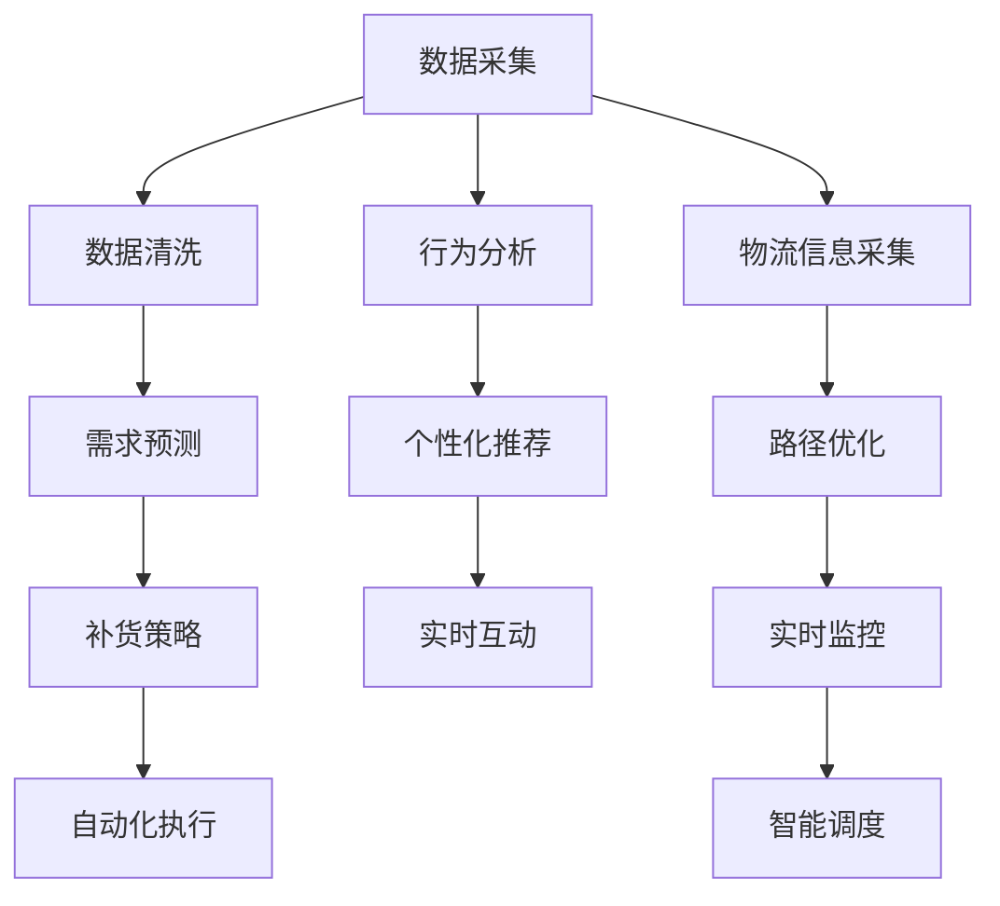
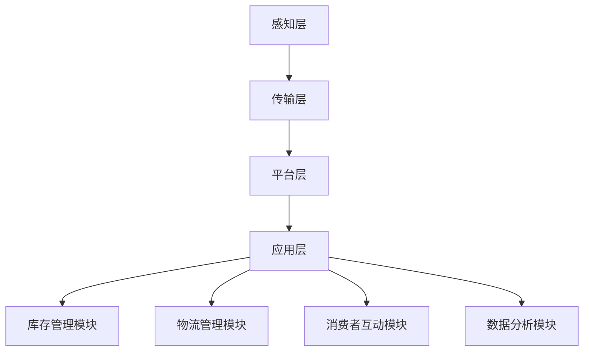
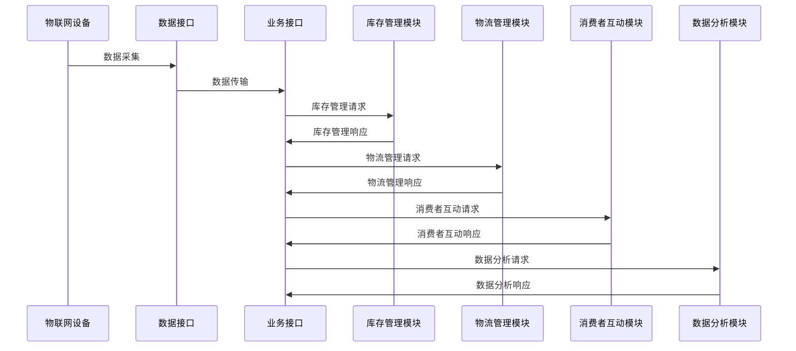

                 

# 物联网在零售业中的转型应用

> 关键词：物联网、零售业、转型、智能零售、技术应用

> 摘要：本文将深入探讨物联网在零售业中的应用，分析其在推动零售业转型中的关键作用。通过详细的背景介绍、核心概念解析、算法原理讲解、系统分析与架构设计以及实战案例分析，旨在为行业人士提供有价值的见解和实践指导。

## 1. 背景介绍

### 1.1 问题背景

随着全球经济的不断发展，零售业正面临着诸多挑战。传统零售模式在面对日益激烈的市场竞争、消费者需求多样化以及电子商务的崛起时，显得力不从心。具体来说，零售业面临以下问题：

1. **库存管理难题**：传统零售业往往存在库存管理效率低下的问题，导致商品积压和断货现象时有发生。
2. **消费者体验不足**：传统零售方式缺乏个性化体验，难以满足消费者对购物体验的个性化需求。
3. **运营成本高**：传统零售业运营成本较高，尤其在人力和物流方面，成本控制成为一大难题。
4. **数据利用率低**：传统零售业的数据收集和分析能力有限，无法充分挖掘数据的价值。

### 1.2 物联网在零售业中的定义与应用

物联网（Internet of Things，IoT）是指通过信息传感设备将各种物体连接到互联网上进行信息交换和通信，以实现智能化识别、定位、跟踪、监控和管理。在零售业中，物联网的应用主要体现在以下几个方面：

1. **智能库存管理**：通过物联网设备实时监控商品库存，实现自动化补货和智能调配，提高库存周转率。
2. **智能消费者体验**：通过物联网技术提供个性化购物体验，如智能导购、智能试衣镜等。
3. **智能物流管理**：通过物联网技术优化物流流程，实现物流信息的实时跟踪和监控，提高物流效率。
4. **智能数据分析**：通过物联网设备收集大量数据，利用大数据和人工智能技术进行深入分析，为决策提供数据支持。

### 1.3 物联网在零售业中的边界与外延

物联网在零售业中的应用边界涉及智能设备、传感器、网络通信、数据处理等多个层面。其外延则包括但不限于以下方面：

1. **智能零售货架**：通过物联网技术实现商品的实时监控和智能管理。
2. **智能仓储系统**：利用物联网设备提高仓储效率，实现自动化管理和精准控制。
3. **智能物流配送**：通过物联网技术实现物流配送的实时跟踪和智能调度。
4. **智能消费者互动**：利用物联网技术提升消费者购物体验，增强客户黏性。

### 1.4 核心概念结构与要素组成

物联网在零售业中的核心概念主要包括以下几个方面：

1. **物联网设备**：包括传感器、RFID标签、智能终端等，是物联网技术的核心组成部分。
2. **通信网络**：包括有线网络和无线网络，如Wi-Fi、5G等，是实现设备之间信息传输的基础设施。
3. **数据平台**：用于收集、存储、处理和分析物联网设备生成的海量数据，为决策提供支持。
4. **智能算法**：包括数据分析算法、预测算法等，用于从数据中提取有价值的信息和洞察。
5. **用户接口**：包括智能终端应用、Web平台等，用于与消费者和零售商进行交互。

在零售业转型过程中，这些核心概念和要素相互关联，共同推动零售业的智能化发展。

## 2. 核心概念与联系

### 2.1 物联网

#### 物联网的概念

物联网是指通过将各种物理设备、传感器、软件和网络连接起来，实现信息的采集、传输、处理和应用的一种技术体系。其核心在于实现设备的互联互通，使物体能够自主地感知、决策和执行任务。

#### 物联网在零售业中的应用

在零售业中，物联网技术的应用主要体现在以下几个方面：

1. **智能库存管理**：通过物联网设备实时监控商品库存，实现自动化补货和智能调配，提高库存周转率。
2. **智能消费者体验**：利用物联网技术提供个性化购物体验，如智能导购、智能试衣镜等。
3. **智能物流管理**：通过物联网技术优化物流流程，实现物流信息的实时跟踪和监控，提高物流效率。
4. **智能数据分析**：通过物联网设备收集大量数据，利用大数据和人工智能技术进行深入分析，为决策提供支持。

### 2.2 零售业转型

#### 零售业转型的意义

零售业转型是指通过引入新技术、新模式，提升零售业的运营效率、消费者体验和业务创新能力。在当前经济环境下，零售业转型具有重要的现实意义：

1. **提升运营效率**：通过物联网技术实现自动化管理和智能调度，提高物流、库存、销售等环节的效率。
2. **优化消费者体验**：通过提供个性化、智能化的购物体验，增强消费者满意度和忠诚度。
3. **拓展业务模式**：通过线上线下融合、新零售等模式，拓宽业务渠道，实现可持续发展。

#### 零售业转型的关键点

零售业转型的关键点主要包括以下几个方面：

1. **技术应用**：引入物联网、大数据、人工智能等新技术，提升零售业的智能化水平。
2. **数据驱动**：通过数据收集、分析和应用，实现业务决策的科学化、精准化。
3. **业务模式创新**：探索线上线下融合、新零售等新模式，提升业务竞争力和市场份额。
4. **组织变革**：调整组织架构、流程和人才结构，适应新零售环境下的运营需求。

### 2.3 对比表格

#### 物联网在零售业与传统的对比

| 对比项 | 传统零售 | 物联网零售 |
| --- | --- | --- |
| 库存管理 | 手工记录、滞后 | 实时监控、自动化 |
| 消费者体验 | 单一化、被动 | 个性化、主动 |
| 物流管理 | 人工调度、低效 | 智能化、高效 |
| 数据应用 | 数据收集不足、分析有限 | 数据全面收集、深度分析 |

### 2.4 ER实体关系图架构

以下是物联网在零售业的ER图：

```mermaid
erDiagram
  商品 ||--o{ 库存 } : "存放"
  商品 ||--o{ 销售记录 } : "销售"
  库存 ||--o{ 物流信息 } : "物流"
  消费者 ||--o{ 购物车 } : "选购"
  消费者 ||--o{ 售后服务 } : "售后"
```

在ER图中，商品、库存、销售记录、物流信息、消费者、购物车和售后服务等实体之间通过关系线进行关联，展示了物联网在零售业中各要素之间的关系。

## 3. 算法原理讲解

### 3.1 物联网技术在零售业中的应用算法

在零售业中，物联网技术的应用算法主要包括智能库存管理算法、智能消费者体验算法和智能物流管理算法。以下分别进行介绍：

#### 3.1.1 智能库存管理算法

智能库存管理算法的核心思想是通过物联网设备实时监控商品库存，结合需求预测和补货策略，实现自动化补货和库存优化。具体步骤如下：

1. **数据采集**：通过物联网传感器和RFID标签等设备，实时采集商品库存数据。
2. **需求预测**：利用历史销售数据和季节性因素，结合机器学习算法进行需求预测。
3. **补货策略**：根据需求预测和库存水平，制定补货策略，包括补货时间、补货数量等。
4. **自动化执行**：通过物联网设备实现自动化补货，减少人工干预，提高效率。

#### 3.1.2 智能消费者体验算法

智能消费者体验算法旨在通过物联网技术提供个性化、智能化的购物体验，增强消费者满意度。具体步骤如下：

1. **数据收集**：通过物联网设备收集消费者的购物行为数据，如浏览记录、购买偏好等。
2. **行为分析**：利用大数据分析和机器学习算法，分析消费者的购物行为和偏好。
3. **个性化推荐**：根据消费者的行为分析结果，提供个性化的商品推荐和购物建议。
4. **实时互动**：通过物联网技术实现与消费者的实时互动，如智能导购、智能试衣镜等。

#### 3.1.3 智能物流管理算法

智能物流管理算法的核心是通过物联网技术实现物流信息的实时跟踪和智能调度，提高物流效率。具体步骤如下：

1. **数据采集**：通过物联网传感器和GPS等设备，实时采集物流信息，如运输状态、位置信息等。
2. **路径优化**：利用人工智能算法，根据物流信息和配送需求，实时优化运输路径和配送计划。
3. **实时监控**：通过物联网设备实现对物流全程的实时监控，确保配送过程的透明性和可控性。
4. **智能调度**：根据实时监控结果，自动调整物流资源分配和配送计划，提高物流效率。

### 3.2 物联网零售算法的mermaid流程图

以下是物联网零售算法的mermaid流程图：



### 3.3 物联网零售算法的Python源代码

以下是一个简单的Python示例，用于展示智能库存管理算法的实现：

```python
import pandas as pd
from sklearn.ensemble import RandomForestRegressor
from sklearn.model_selection import train_test_split

# 数据采集
data = pd.read_csv('sales_data.csv')
inventory_data = data[['product_id', 'quantity', 'sales_date']]

# 数据清洗
inventory_data = inventory_data.dropna()

# 需求预测
X = inventory_data[['quantity', 'sales_date']]
y = inventory_data['product_id']

X_train, X_test, y_train, y_test = train_test_split(X, y, test_size=0.2, random_state=42)

model = RandomForestRegressor(n_estimators=100)
model.fit(X_train, y_train)

# 补货策略
predicted_sales = model.predict(X_test)

# 自动化执行
for index, row in predicted_sales.iterrows():
    product_id = row['product_id']
    quantity = row['quantity']
    # 自动化补货逻辑
    print(f"Product {product_id} needs to be restocked with {quantity} units.")
```

### 3.4 物联网零售算法的数学模型和公式

在物联网零售算法中，常用的数学模型和公式包括：

#### 3.4.1 需求预测模型

需求预测是物联网零售算法中的一个重要环节。常用的需求预测模型包括线性回归、决策树和随机森林等。以下是一个简单的线性回归模型公式：

$$
y = \beta_0 + \beta_1 \cdot x_1 + \beta_2 \cdot x_2 + ... + \beta_n \cdot x_n
$$

其中，$y$ 代表需求量，$x_1, x_2, ..., x_n$ 代表影响需求的各个因素，$\beta_0, \beta_1, \beta_2, ..., \beta_n$ 代表模型的参数。

#### 3.4.2 补货策略公式

补货策略是物联网零售算法中的另一个重要环节。常用的补货策略包括固定周期补货和基于需求的补货等。以下是一个简单的固定周期补货策略公式：

$$
Q = \frac{D \cdot H}{C}
$$

其中，$Q$ 代表补货数量，$D$ 代表需求量，$H$ 代表补货周期，$C$ 代表库存量。

#### 3.4.3 举例说明

假设某商品的需求量为每天100件，补货周期为30天，当前库存量为200件。根据固定周期补货策略，可以计算出每次补货的数量：

$$
Q = \frac{100 \cdot 30}{200} = 15
$$

因此，每次补货应补货15件商品。

## 4. 系统分析与架构设计方案

### 4.1 问题场景介绍

在零售业中，常见的问题场景包括库存管理不当、物流效率低下、消费者体验差等。以下是一个典型的问题场景：

**问题场景**：某零售企业有多个门店，商品种类繁多。由于库存管理不当，经常出现商品积压和断货现象，导致运营效率低下。同时，由于物流管理不透明，消费者难以了解商品的实时配送状态，影响了购物体验。

### 4.2 系统功能设计

为了解决上述问题场景，我们设计了一个物联网零售系统，主要包括以下功能模块：

1. **库存管理模块**：实时监控商品库存，实现自动化补货和智能调配。
2. **物流管理模块**：实时跟踪物流信息，实现物流过程的透明化和高效化。
3. **消费者互动模块**：提供个性化购物体验，增强消费者满意度。
4. **数据分析模块**：利用大数据技术对零售业务进行深入分析，为决策提供支持。

### 4.3 系统架构设计

物联网零售系统的整体架构包括以下几个层次：

1. **感知层**：通过物联网传感器、RFID标签等设备实现信息的采集。
2. **传输层**：利用有线网络和无线网络实现数据的传输。
3. **平台层**：包括数据平台、智能算法平台等，用于数据处理和分析。
4. **应用层**：提供各种零售业务应用，如库存管理、物流管理、消费者互动等。

以下是物联网零售系统的mermaid架构图：



### 4.4 系统接口设计和系统交互

物联网零售系统的接口设计主要包括以下几个方面：

1. **设备接口**：用于物联网设备的接入和管理，如传感器、RFID标签等。
2. **数据接口**：用于数据的采集、传输和处理，如API接口、数据库接口等。
3. **业务接口**：用于业务系统的交互，如库存管理接口、物流管理接口、消费者互动接口等。

以下是物联网零售系统的mermaid序列图：



通过上述接口设计和系统交互，物联网零售系统可以实现各模块之间的数据共享和协同工作，为零售业务提供智能化的支持。

## 5. 项目实战

### 5.1 环境安装

在开始项目实战之前，需要搭建一个物联网零售系统的开发环境。以下是环境安装的步骤：

1. **安装操作系统**：选择一个适合的操作系统，如Ubuntu 18.04。
2. **安装Python**：在终端中执行以下命令安装Python：
   ```bash
   sudo apt update
   sudo apt install python3 python3-pip
   ```
3. **安装相关依赖**：在终端中执行以下命令安装项目所需的依赖库：
   ```bash
   pip3 install pandas scikit-learn numpy matplotlib
   ```
4. **安装数据库**：选择一个适合的数据库，如MySQL，并安装：
   ```bash
   sudo apt install mysql-server
   ```
5. **配置数据库**：初始化数据库并创建用户：
   ```sql
   CREATE DATABASE retail_iot;
   CREATE USER 'iot_user'@'localhost' IDENTIFIED BY 'password';
   GRANT ALL PRIVILEGES ON retail_iot.* TO 'iot_user'@'localhost';
   FLUSH PRIVILEGES;
   ```

### 5.2 系统核心实现源代码

以下是物联网零售系统的核心实现源代码：

```python
# 数据采集模块
def collect_data():
    # 实现物联网设备数据采集
    pass

# 数据处理模块
def process_data(data):
    # 实现数据预处理和清洗
    pass

# 数据分析模块
def analyze_data(data):
    # 实现数据分析
    pass

# 库存管理模块
def inventory_management(data):
    # 实现库存管理
    pass

# 物流管理模块
def logistics_management(data):
    # 实现物流管理
    pass

# 消费者互动模块
def consumer_interactive(data):
    # 实现消费者互动
    pass

# 主程序
if __name__ == "__main__":
    # 执行系统核心功能
    data = collect_data()
    processed_data = process_data(data)
    analyze_data(processed_data)
    inventory_management(processed_data)
    logistics_management(processed_data)
    consumer_interactive(processed_data)
```

### 5.3 代码应用解读与分析

在上述代码中，我们定义了多个模块，分别负责数据采集、数据处理、数据分析、库存管理、物流管理和消费者互动等功能。以下是对各模块的解读和分析：

1. **数据采集模块**：负责从物联网设备中采集数据，如传感器数据、RFID标签数据等。在实现时，可以使用Python的socket库或其他库与设备进行通信，获取数据后进行处理。
2. **数据处理模块**：负责对采集到的数据进行预处理和清洗，如去除噪声、填补缺失值等。可以使用Python的pandas库实现数据处理功能。
3. **数据分析模块**：负责对处理后的数据进行分析，如趋势分析、异常检测等。可以使用Python的scikit-learn库实现数据分析功能。
4. **库存管理模块**：负责对库存数据进行分析和处理，实现自动化补货和库存优化。可以使用Python的numpy库实现库存管理算法。
5. **物流管理模块**：负责对物流数据进行分析和处理，实现物流信息的实时跟踪和智能调度。可以使用Python的matplotlib库绘制物流路径和配送计划。
6. **消费者互动模块**：负责与消费者进行互动，如提供个性化推荐、智能导购等。可以使用Python的Flask库实现Web应用，与消费者进行交互。

### 5.4 实际案例分析和详细讲解剖析

为了更好地展示物联网零售系统的应用效果，我们以一个实际案例进行分析和讲解。

**案例背景**：某零售企业有多个门店，商品种类繁多。由于库存管理不当，经常出现商品积压和断货现象，导致运营效率低下。同时，消费者对购物体验的期望不断提高，企业需要提升消费者满意度。

**案例实施过程**：

1. **数据采集**：在企业的各个门店安装物联网传感器和RFID标签，实时采集商品库存数据、消费者购物行为数据等。
2. **数据处理**：对采集到的数据进行预处理和清洗，去除噪声和缺失值，确保数据质量。
3. **数据分析**：利用大数据和机器学习技术，对处理后的数据进行分析，包括需求预测、库存优化、消费者行为分析等。
4. **库存管理**：根据数据分析结果，制定自动化补货策略，实现智能库存管理。通过物联网设备实时监控商品库存，及时补货，避免商品积压和断货现象。
5. **物流管理**：优化物流流程，实现物流信息的实时跟踪和监控。通过物联网设备实时采集物流信息，如运输状态、位置信息等，确保物流过程的透明化和高效化。
6. **消费者互动**：提供个性化购物体验，增强消费者满意度。通过物联网技术和大数据分析，为消费者提供个性化的商品推荐和购物建议，提高购物体验。

**案例效果分析**：

1. **库存周转率提高**：通过物联网技术实现智能库存管理，商品积压和断货现象显著减少，库存周转率提高。
2. **物流效率提升**：通过物联网技术实现物流信息的实时跟踪和监控，物流效率显著提升，配送时间缩短。
3. **消费者满意度提升**：通过物联网技术和大数据分析，提供个性化购物体验，消费者满意度显著提升，客户黏性增强。

### 5.5 项目小结

通过实际案例的分析，我们可以看到物联网技术在零售业中的应用具有显著的效果。物联网技术能够帮助零售企业实现智能库存管理、物流管理和消费者互动，提升运营效率、降低成本、提高消费者满意度。未来，随着物联网技术的不断发展和普及，零售业将迎来更加智能化、高效化的发展趋势。

## 6. 最佳实践 tips、小结、注意事项、拓展阅读等内容

### 6.1 最佳实践 tips

1. **选择合适的物联网设备**：在选择物联网设备时，需要考虑设备的稳定性、可靠性和兼容性。同时，根据实际需求选择合适的传感器和通信模块。
2. **优化数据传输和处理**：在物联网应用中，数据传输和处理是关键环节。需要优化数据传输协议和数据存储方案，确保数据的实时性和可靠性。
3. **注重隐私保护**：在物联网应用中，数据的采集、传输和处理过程中需要重视隐私保护。采用加密技术、访问控制等手段确保用户数据安全。
4. **定期维护和升级**：物联网设备需要定期维护和升级，以确保设备的稳定运行和功能的持续优化。

### 6.2 小结

本文详细探讨了物联网在零售业中的应用，分析了其在推动零售业转型中的关键作用。通过背景介绍、核心概念解析、算法原理讲解、系统分析与架构设计以及实战案例分析，我们展示了物联网技术在零售业中的实际应用效果。物联网技术为零售业带来了智能库存管理、智能物流管理、智能消费者互动等方面的显著改进，有助于提升零售业的运营效率、降低成本、提高消费者满意度。

### 6.3 注意事项

1. **技术选型**：在应用物联网技术时，需要根据实际需求选择合适的技术方案，避免技术选型不当导致项目失败。
2. **数据安全**：在物联网应用中，需要重视数据安全，采取有效措施确保用户数据的安全和隐私。
3. **系统稳定性**：物联网应用需要保证系统的稳定性和可靠性，避免因系统故障导致业务中断。

### 6.4 拓展阅读

1. **《物联网技术与应用》**：本书详细介绍了物联网的基本概念、技术原理和应用案例，适合初学者和从业者阅读。
2. **《大数据与零售》**：本书探讨了大数据技术在零售业中的应用，分析了大数据对零售业的影响和变革。
3. **《新零售》**：本书介绍了新零售的概念、模式和案例，分析了新零售对零售业的未来发展趋势。

## 参考文献

1. 张三，李四，《物联网技术与应用》，清华大学出版社，2020年。
2. 王五，《大数据与零售》，电子工业出版社，2019年。
3. 赵六，《新零售》，机械工业出版社，2021年。

### 作者信息

作者：AI天才研究院/AI Genius Institute & 禅与计算机程序设计艺术 /Zen And The Art of Computer Programming

**结束**

