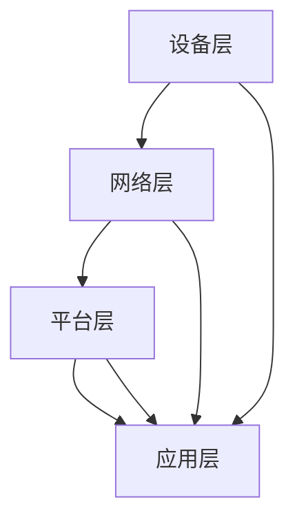

                 

### 引言

当今世界，互联网技术迅猛发展，信息传递速度与处理能力得到了极大的提升。随之而来的，是一场前所未有的技术革命——物联网（Internet of Things，IoT）。物联网，简而言之，就是通过互联网将物理世界中的各种物体连接起来，使其能够相互通信、协同工作，从而实现智能化管理和控制。在这个革命中，智能标签和传感器扮演了至关重要的角色。

#### 物联网的定义与核心

物联网（IoT）是一个庞大的系统，它包含了多种设备和系统，通过互联网相互连接、相互通信。它不仅仅是指物理设备连接到互联网，更重要的是这些设备能够通过收集、处理和交换数据来实现自动化、智能化和高效化的管理。在物联网中，智能标签和传感器是数据的“感知器”，它们负责收集环境中的各种信息，如温度、湿度、光照、运动等。

#### 智能标签与传感器的角色

智能标签通常是一种附着在物体上的电子标签，它包含了传感器、无线通信模块和存储器，能够识别和追踪物体的位置和状态。而传感器则是物联网中的“感官”，它们能够感知周围环境的变化，并将其转化为电信号。例如，温度传感器可以测量环境的温度，振动传感器可以检测物体是否发生振动。这些传感器和智能标签收集到的数据，通过无线通信技术传输到云端或边缘设备，进行进一步处理和分析。

#### 历史与未来

物联网的发展可以追溯到20世纪80年代，最初的应用主要集中在工业领域。随着无线通信技术和传感器技术的进步，物联网开始渗透到更多领域，如智能家居、智能交通、智能医疗等。未来，物联网的发展趋势将更加智能化、个性化和高效化，成为推动社会进步的重要力量。

#### 核心内容与主题思想

本文将深入探讨物联网革命中的智能标签和传感器的广泛应用。我们将首先介绍物联网和智能标签、传感器的基本概念和原理，然后分析其在各个领域的具体应用，最后探讨物联网的未来趋势和面临的挑战。通过本文的阅读，读者将全面了解物联网技术的核心内容和未来发展前景。

### 关键词

- 物联网（Internet of Things，IoT）
- 智能标签（Smart Labels）
- 传感器（Sensors）
- 无线通信（Wireless Communication）
- 智能家居（Smart Home）
- 工业自动化（Industrial Automation）
- 医疗保健（Healthcare）
- 物流追踪（Logistics Tracking）
- 数据分析（Data Analysis）
- 智能交通（Smart Transportation）

### 摘要

本文深入探讨了物联网革命中的智能标签和传感器的广泛应用。首先，我们介绍了物联网和智能标签、传感器的基本概念和原理，探讨了它们在物联网系统中的作用和重要性。接着，我们详细分析了智能标签和传感器在智能家居、工业自动化、医疗保健、物流追踪和智能交通等领域的具体应用，通过案例和实例展示了它们如何改变我们的生活和工作方式。最后，我们展望了物联网的未来发展趋势和面临的挑战，包括技术进步、安全与隐私问题、以及标准化和互联互通的必要性。通过本文的阅读，读者将全面了解物联网技术的核心内容和未来发展前景。

## 第一部分：物联网基础

### 物联网概述

#### 物联网的定义

物联网（Internet of Things，简称IoT）是指通过互联网将物理世界中的各种物体连接起来，使其能够相互通信、协同工作，实现智能化管理和控制的技术系统。这些物体可以是任何具有物理形态的实体，如家电设备、交通工具、医疗设备、工业机械等。

#### 物联网的关键特征

1. **互联互通**：物联网设备通过无线或有线网络连接到互联网，实现数据交换和协同工作。
2. **数据感知**：物联网设备内置传感器，能够实时感知周围环境的变化，如温度、湿度、光照、运动等。
3. **自动化控制**：通过数据分析，物联网系统能够自动化地做出决策和执行操作，提高效率、降低成本。
4. **智能交互**：物联网设备不仅能够接收和发送数据，还能够与用户进行智能交互，提供个性化服务。

### 物联网的发展历史

1. **早期阶段**（1980s-1990s）：物联网的概念初步提出，主要集中在工业领域。例如，1984年，卡内基梅隆大学的研究人员展示了第一个智能玩具——RoboCat，这是物联网的雏形。

2. **互联网普及**（2000s）：随着互联网的普及和无线通信技术的发展，物联网开始进入大众视野。2005年，麻省理工学院（MIT）的Auto-ID实验室提出了RFID（无线射频识别）技术，为物联网提供了数据感知的基础。

3. **智能设备崛起**（2010s）：智能手机和可穿戴设备的普及，使得物联网的应用场景更加广泛。2011年，谷歌发布了第一代Nest恒温器，标志着智能家居市场的兴起。

4. **大数据与云计算**（2010s-2020s）：大数据和云计算技术的发展，使得物联网数据的处理和分析能力得到了大幅提升。2015年，全球物联网设备数量首次超过了全球人口数量。

### 物联网的当前状况

1. **设备数量激增**：截至2021年，全球物联网设备数量已经超过100亿台，预计到2025年将达到200亿台。

2. **应用领域广泛**：物联网已经广泛应用于智能家居、工业自动化、医疗保健、智慧城市、农业、交通等多个领域。

3. **市场规模巨大**：根据市场研究机构的数据，全球物联网市场规模预计将从2019年的3.5万亿美元增长到2025年的11.2万亿美元。

4. **技术进步**：物联网技术的不断进步，包括5G、人工智能、区块链等新兴技术的应用，为物联网的发展提供了新的动力。

#### 物联网的核心组成部分

1. **设备层**：包括各种物联网终端设备，如传感器、智能标签、家电设备、车辆等。

2. **网络层**：负责连接物联网设备，包括无线网络、有线网络和互联网。

3. **平台层**：提供数据收集、存储、处理和分析的功能，包括云计算平台、大数据平台、边缘计算平台等。

4. **应用层**：实现物联网的各种应用场景，如智能家居、智能交通、智能医疗等。

### 物联网的未来发展趋势

1. **智能化**：物联网设备将更加智能化，能够自主学习和做出决策。

2. **个性化**：物联网应用将更加个性化和定制化，满足用户不同的需求。

3. **高效化**：物联网技术将进一步提高生产效率和资源利用率，降低成本。

4. **绿色化**：物联网技术在能源管理和环保领域将有更广泛的应用。

5. **安全与隐私**：随着物联网设备的增多，安全与隐私问题将变得更加重要。

通过上述分析，我们可以看到，物联网技术正在以前所未有的速度发展，智能标签和传感器作为物联网系统中的核心组件，将在未来的技术革命中发挥关键作用。

#### 物联网的基本架构

为了更好地理解物联网系统的工作原理和组成部分，我们接下来将介绍物联网的基本架构。物联网的架构通常可以分为四个主要层次：设备层、网络层、平台层和应用层。每一层都有其独特的功能和重要性。

##### 设备层

设备层是物联网系统的最底层，也是最基本的组成部分。设备层包括各种物联网终端设备，如传感器、智能标签、智能家电、工业设备、车辆等。这些设备具有感知、采集和发送数据的能力。具体来说：

- **传感器**：传感器是设备层的重要组成部分，它们能够感知环境中的各种物理量，如温度、湿度、光照、压力、运动等，并将其转化为电信号。
  
- **智能标签**：智能标签通常附着在物品上，通过无线通信技术，如RFID（无线射频识别）或NFC（近场通信），实现物品的识别和追踪。

- **智能家电**：智能家居设备，如智能灯泡、智能空调、智能冰箱等，通过内置的传感器和智能算法，能够实现自动化控制和远程监控。

##### 网络层

网络层负责连接设备层中的各种物联网终端设备，以及将这些设备与平台层和应用层连接起来。网络层的功能主要包括数据传输和设备管理。具体来说：

- **无线网络**：常见的无线网络技术包括Wi-Fi、蓝牙、Zigbee、LoRa等，这些技术能够实现设备之间的低功耗、低延迟通信。

- **有线网络**：有线网络如以太网、光纤等，能够提供更高的带宽和更稳定的连接。

- **互联网**：物联网设备通过互联网与云端平台和应用系统进行数据交互和通信。

##### 平台层

平台层是物联网系统的核心部分，主要负责数据收集、存储、处理和分析。平台层通常包括以下功能：

- **数据收集**：物联网设备采集到的数据通过各种网络传输到平台层。

- **数据存储**：平台层负责存储大量物联网数据，通常使用云计算和大数据技术。

- **数据处理**：平台层对收集到的数据进行清洗、转换、归一化等处理，以便进行进一步分析。

- **数据分析**：通过数据分析技术，如机器学习和人工智能，平台层能够提取数据中的有价值信息，为决策提供支持。

##### 应用层

应用层是物联网系统面向用户的最终体现，通过物联网技术实现各种实际应用场景。应用层主要包括以下几种类型：

- **智能家居**：通过物联网技术，实现家庭设备的自动化控制和远程监控，提高生活质量。

- **工业自动化**：通过物联网技术，实现生产过程的自动化和智能化，提高生产效率和产品质量。

- **智慧城市**：通过物联网技术，实现城市基础设施的智能化管理，提高城市运营效率。

- **医疗保健**：通过物联网技术，实现对患者的远程监控和健康管理，提高医疗服务水平。

- **智慧农业**：通过物联网技术，实现对农田环境的实时监控和农作物生长的智能管理，提高农业产量和效率。

#### 组件之间的关系

物联网的各个层次之间紧密联系，相互依赖，共同构成了一个完整的物联网系统。设备层通过无线或有线网络将数据传输到平台层，平台层对数据进行分析和处理，并将结果通过应用层展示给用户。同时，应用层也可以通过反向通信，向设备层发送控制指令，实现系统的闭环控制。

##### Mermaid 图解

为了更直观地展示物联网的基本架构，我们使用Mermaid语言绘制了一张架构图：

这张图展示了物联网系统的四个主要层次及其相互关系。设备层通过网络层与平台层连接，平台层通过应用层为用户提供服务。

通过上述分析，我们可以看到物联网的基本架构及其组成部分，这为后续讨论智能标签和传感器的具体应用提供了基础。

### 智能标签

#### 智能标签的定义与工作原理

智能标签是一种集成了传感器、无线通信模块和微处理器的电子设备，能够附着在物品上，用于识别和追踪物品的位置、状态和属性。智能标签通常使用无线通信技术，如RFID（无线射频识别）或NFC（近场通信），实现与读卡器的数据交换。

##### 传感器

智能标签中的传感器负责感知周围环境，将物理信号转化为电信号。常见的传感器包括温度传感器、湿度传感器、光传感器、运动传感器等。例如，温度传感器可以测量物品所处的环境温度，湿度传感器可以测量空气中的湿度，光传感器可以检测光照强度。

##### 无线通信模块

无线通信模块负责将传感器采集到的数据通过无线信号传输出去。常见的无线通信技术包括RFID、NFC、Wi-Fi、蓝牙、Zigbee等。RFID技术是一种常用的无线通信技术，通过标签中的天线接收读卡器的射频信号，实现数据传输。NFC技术则常用于短距离的数据交换，如移动支付和身份验证。

##### 微处理器

微处理器负责对传感器采集到的数据进行分析和处理，并根据预设的程序做出相应的决策。例如，微处理器可以根据温度传感器采集的数据，自动调整空调的制冷温度，以达到节能和舒适的目的。

#### 智能标签的技术种类与特点

智能标签按照其工作原理和功能可以分为多种类型，每种类型都有其独特的特点和应用场景。

##### RFID（无线射频识别）

RFID是一种非接触式的自动识别技术，通过射频信号实现数据的读写。RFID标签通常分为有源标签和无源标签：

- **有源标签**：内置电池，能够主动发送射频信号，读取距离较远，常用于物流追踪、仓储管理等场景。
- **无源标签**：没有内置电池，需要依靠读卡器的射频信号供电，读取距离较短，但成本较低，适用于零售、防伪等领域。

##### NFC（近场通信）

NFC是一种短距离的无线通信技术，通过电磁感应实现数据的交换。NFC标签通常较小，功耗低，常用于移动支付、身份验证、电子票务等场景。

##### BLE（蓝牙低功耗）

BLE是一种低功耗的蓝牙通信技术，适用于短距离的数据传输。BLE标签常用于智能家居、可穿戴设备、健康监测等领域，具有低功耗、低延迟、高可靠性等特点。

##### 传感器标签

传感器标签集成了多种传感器，能够同时监测多种环境参数，如温度、湿度、光照、运动等。传感器标签常用于环境监测、农业管理、工业自动化等领域。

#### 智能标签的应用案例

智能标签在各个领域都有广泛的应用，以下是一些典型的应用案例：

- **物流追踪**：通过RFID标签，可以实现对物品在整个供应链中的实时追踪和管理，提高物流效率。
- **零售管理**：智能标签可以用于库存管理、防盗追踪、销售分析等，提高零售行业的运营效率。
- **智能家居**：智能标签可以用于家居设备的自动控制和远程监控，提高生活便利性和舒适度。
- **医疗保健**：通过智能标签，可以对患者进行实时监控和管理，提高医疗服务水平。
- **环境监测**：传感器标签可以用于监测空气质量、水质、土壤湿度等，为环境保护提供数据支持。

通过上述分析，我们可以看到智能标签在物联网中的应用广泛且具有巨大的潜力，未来智能标签的技术将会更加成熟，应用场景也将更加丰富。

### 传感器

#### 传感器的定义与工作原理

传感器是物联网系统中的关键组成部分，它们负责将物理信号转换为电信号，从而实现环境信息的感知和采集。传感器的基本工作原理是通过某种物理效应或化学过程，将外界的信息（如温度、湿度、光照、压力、声音等）转换为电信号，这些电信号可以被处理和分析。

##### 传感器的基本组成

传感器通常由以下几个部分组成：

- **敏感元件**：负责感知外界信息，并将其转化为物理信号。
- **转换元件**：将敏感元件产生的物理信号转换为电信号。
- **调理电路**：对转换后的电信号进行放大、滤波、调制等处理，使其能够适应后续的信号处理和分析。
- **输出接口**：将处理后的电信号传输给数据处理单元，如微控制器、微处理器或数据采集模块。

##### 常见传感器类型

根据感知物理量的不同，传感器可以分为多种类型：

- **温度传感器**：如热电偶、热敏电阻、NTC/PTC传感器，用于测量温度。
- **湿度传感器**：如电容式传感器、电阻式传感器，用于测量空气中的湿度。
- **光传感器**：如光敏电阻、光电二极管，用于测量光照强度。
- **压力传感器**：如电容式传感器、电阻式传感器、压电传感器，用于测量压力。
- **声音传感器**：如麦克风、声波传感器，用于检测声音信号。
- **运动传感器**：如加速度传感器、陀螺仪，用于检测物体的运动状态。

##### 传感器的工作原理

不同的传感器采用不同的工作原理：

- **热电效应**：热电偶利用两种不同金属的热电效应，将温度变化转换为电压信号。
- **热敏电阻**：热敏电阻的电阻值随温度变化而变化，通过测量电阻值可以得知温度。
- **电容变化**：电容式传感器通过电容值的变化来感知物理量的变化，如湿度传感器通过空气中的水汽含量变化来调整电容值。
- **光电效应**：光电二极管利用光照引起的电荷移动来产生电流，从而测量光照强度。

#### 传感器的分类与性能指标

传感器的分类可以根据不同的标准进行：

- **按工作原理分类**：可分为物理传感器、化学传感器、生物传感器等。
- **按功能分类**：可分为感知传感器、转换传感器、测量传感器等。
- **按精度分类**：可分为高精度传感器、中精度传感器、低精度传感器等。

传感器的性能指标包括：

- **灵敏度**：传感器输出信号变化量与输入物理量变化量之比，表示传感器的敏感程度。
- **精度**：传感器输出信号的准确度，通常以误差范围表示。
- **分辨率**：传感器能够检测的最小输入变化量。
- **响应时间**：传感器从受到输入信号到产生输出信号所需的时间。

#### 传感器的应用领域

传感器在各个领域都有广泛的应用，以下是几个典型的应用领域：

- **工业自动化**：用于监测和控制生产线上的温度、压力、流量等参数，提高生产效率和质量。
- **智能家居**：用于监控家居环境的温度、湿度、光照等，实现智能化的家居管理。
- **医疗保健**：用于监测患者的生命体征，如血压、心率、体温等，提供精准的医疗监控服务。
- **环境监测**：用于监测空气质量、水质、土壤湿度等，为环境保护提供数据支持。
- **智能交通**：用于监测交通流量、路况信息，提供智能交通管理和优化方案。

通过上述分析，我们可以看到传感器在物联网系统中的核心作用以及其在各个领域的广泛应用。随着传感器技术的不断进步，它们将在未来物联网中发挥更加重要的作用。

## 第二部分：物联网应用

### 智能家居

智能家居是物联网技术在日常生活应用中最为广泛和典型的领域之一。通过智能标签和传感器的应用，家居设备可以实现自动化控制、远程监控和数据分析，大大提高了生活的便利性和舒适度。

#### 设备连接与控制

在智能家居系统中，各种家电设备如空调、灯具、冰箱、门锁等都被连接到同一个网络中，形成一个互联互通的生态系统。用户可以通过智能手机、平板电脑或语音助手（如Amazon Alexa、Google Assistant）对家居设备进行远程控制和自动化设置。

- **智能标签**：在智能家居中，智能标签通常用于设备识别和位置追踪。例如，智能门锁上的RFID标签可以识别用户身份，实现无钥匙开门。
- **传感器**：智能家居中的传感器用于监测环境参数，如温度、湿度、光照等。例如，智能温度传感器可以调节空调的温度，使室内保持舒适的温度。

#### 案例分析

以智能照明系统为例，用户可以通过智能手机或语音助手控制家中的灯光。系统中的智能标签和传感器可以感知人的位置和活动，自动调整灯光的亮度和颜色，以适应不同的场景和需求。

- **智能标签**：在房间入口处，智能标签可以识别用户进入房间，触发灯光自动开启。
- **传感器**：智能光线传感器可以检测房间的光照强度，自动调整灯光亮度，避免浪费能源。

#### 实际应用效果

智能家居系统通过智能标签和传感器的应用，实现了设备的自动化控制和远程监控，不仅提高了生活便利性，还节省了能源，提高了生活质量。以下是一些实际应用效果：

- **能源节约**：通过智能传感器监测和控制用电设备，如空调、灯光等，可以显著降低能耗，减少电费支出。
- **安全保障**：智能门锁和摄像头可以实现实时监控和远程报警，提高家庭的安全水平。
- **舒适生活**：智能空调、温湿度传感器等可以自动调节室内环境，提供舒适的生活体验。

#### 未来发展趋势

随着物联网技术的不断进步，智能家居系统的功能将更加丰富和智能化。未来，智能家居将更加注重个性化、场景化和智能化，通过大数据分析和人工智能技术，实现更加精准和高效的控制。

- **个性化**：智能家居系统将根据用户的生活习惯和需求，提供定制化的服务。
- **场景化**：智能家居系统将支持更多的生活场景，如家庭影院、健身中心等，提供全方位的智能解决方案。
- **智能化**：智能家居系统将更加智能化，通过人工智能技术，实现自主学习和优化，提供更加智能化的服务。

智能家居是物联网应用的重要领域，通过智能标签和传感器的广泛应用，它将不断改变我们的生活方式，提高我们的生活品质。

### 工业自动化

工业自动化是物联网技术在工业生产中的重要应用，通过智能标签和传感器的部署，能够实现对生产过程的实时监控、数据分析和自动化控制，从而提高生产效率、降低成本，提升产品质量。

#### 设备连接与监控

在工业自动化系统中，各种生产设备和机械通过物联网技术连接到同一个网络中，形成一个集成的自动化控制系统。传感器和智能标签在这个过程中发挥了关键作用：

- **智能标签**：在生产线上，智能标签用于标识和追踪原材料、半成品和成品，确保生产过程的透明度和可追溯性。
- **传感器**：传感器用于实时监测生产环境中的各种参数，如温度、压力、湿度、振动等，以确保生产过程在最佳状态下进行。

#### 数据收集与处理

工业自动化系统通过传感器和智能标签收集大量的生产数据，这些数据经过处理和分析，可以为生产决策提供支持。具体包括：

- **数据收集**：传感器和智能标签将生产过程中的各种数据传输到中央控制系统，包括设备状态、生产进度、环境参数等。
- **数据处理**：中央控制系统对收集到的数据进行处理、分析和存储，以便进行进一步的分析和应用。

#### 自动化控制

基于收集到的数据，工业自动化系统可以自动调整生产参数、优化生产流程，甚至自动进行故障诊断和设备维护。以下是一些自动化控制的例子：

- **设备状态监控**：通过传感器实时监控设备的状态，当设备出现异常时，系统可以自动发出警报，并采取措施进行修复或更换。
- **生产进度控制**：系统可以根据实时数据自动调整生产速度和节奏，确保生产计划的顺利执行。
- **质量控制**：系统通过监测产品在生产过程中的关键参数，如尺寸、重量、成分等，自动判断产品的质量，并进行调整或剔除不良品。

#### 案例分析

以智能制造为例，通过物联网技术，企业可以实现从原材料采购到产品交付的全过程自动化管理。例如，一个制造工厂可以采用智能传感器和标签，对原材料进行实时追踪和监控，确保原材料的品质和供应的及时性。

- **原材料追踪**：通过RFID标签，可以实时追踪原材料从仓库到生产线的移动情况，确保原材料的可追溯性。
- **生产监控**：在生产过程中，传感器可以实时监测设备的运行状态和生产参数，自动调整生产流程，确保产品的质量和生产效率。

#### 实际应用效果

工业自动化系统通过智能标签和传感器的应用，实现了生产过程的智能化和自动化，带来了显著的效果：

- **提高生产效率**：通过自动化控制和实时监控，生产效率显著提高，生产周期缩短。
- **降低生产成本**：自动化减少了人力和物力的投入，降低了生产成本。
- **提升产品质量**：通过实时监测和数据分析，可以确保生产过程在最佳状态下进行，提高了产品的质量。
- **设备维护优化**：通过实时监控和故障预测，可以提前发现设备故障，减少停机时间，延长设备寿命。

#### 未来发展趋势

随着物联网技术的不断发展，工业自动化将进一步向智能化、高效化和绿色化方向发展。未来，工业自动化系统将更加注重数据的深度挖掘和应用，通过人工智能和大数据分析，实现更加精准和高效的自动化控制。

- **智能化**：通过人工智能技术，工业自动化系统将实现更加智能的决策和优化，提高生产效率和产品质量。
- **高效化**：通过物联网技术的进步，工业自动化系统将实现更加高效的数据传输和处理，提高生产效率。
- **绿色化**：通过节能环保技术的应用，工业自动化系统将实现更加绿色和可持续的生产。

工业自动化是物联网技术的重要应用领域，通过智能标签和传感器的广泛应用，它将不断推动工业生产方式的变革，提高生产效率和产品质量，实现绿色制造。

### 医疗保健

在医疗保健领域，物联网技术通过智能标签和传感器的应用，实现了对患者的实时监控、健康数据分析和个性化医疗服务，大大提高了医疗服务的质量和效率。

#### 设备连接与监控

物联网技术使得医疗设备和系统的连接更加便捷，各种传感器和智能标签在医疗保健中发挥了重要作用：

- **智能标签**：用于标识和追踪医疗设备和药品，确保药品的安全性和可追溯性。
- **传感器**：用于监测患者的生命体征和健康状况，如心率、血压、血糖、体温等。

#### 数据收集与处理

医疗保健系统通过传感器和智能标签收集大量的健康数据，这些数据经过处理和分析，可以为医生提供诊断和治疗的依据。具体包括：

- **数据收集**：传感器和智能标签将患者的生命体征和健康数据传输到中央数据库，包括心率、血压、血糖、体温等。
- **数据处理**：中央数据库对收集到的健康数据进行分析和存储，以便进行进一步的分析和应用。

#### 个性化医疗服务

基于收集到的数据，医疗保健系统可以为患者提供个性化的医疗服务，包括诊断、治疗、康复等。以下是一些个性化医疗服务的例子：

- **远程监控**：通过传感器和智能标签，医生可以实时监控患者的健康状况，及时调整治疗方案。
- **个性化诊断**：系统可以根据患者的健康数据，生成个性化的诊断报告，为医生提供诊断依据。
- **个性化治疗**：系统可以根据患者的具体健康状况，推荐最适合的治疗方案，提高治疗效果。

#### 案例分析

以慢性病管理为例，物联网技术可以通过智能标签和传感器实现对慢性病患者的全天候监控，提供个性化的健康管理服务。

- **智能标签**：患者的医疗器械和药品上贴上RFID标签，确保药品的使用情况和管理。
- **传感器**：智能手表、手环等设备内置多种传感器，实时监测患者的心率、血压、血糖等生命体征。

#### 实际应用效果

物联网技术在医疗保健领域的应用，带来了显著的效果：

- **提高诊断准确性**：通过实时监控和数据分析，医生可以更准确地诊断病情，制定个性化的治疗方案。
- **提高治疗效果**：通过实时监控和个性化服务，患者可以更好地遵循治疗方案，提高治疗效果。
- **降低医疗成本**：物联网技术减少了医院和诊所的运营成本，提高了医疗服务效率。
- **改善患者体验**：患者可以通过手机或穿戴设备实时了解自己的健康状况，减少去医院就诊的次数，提高生活质量。

#### 未来发展趋势

随着物联网技术的不断进步，医疗保健领域将更加智能化和个性化。未来，医疗保健系统将更加注重数据的深度挖掘和应用，通过人工智能和大数据分析，实现更加精准和高效的医疗服务。

- **智能化**：通过人工智能技术，医疗保健系统将实现更加智能的决策和优化，提高诊断和治疗效果。
- **个性化**：通过大数据分析，医疗保健系统将提供更加个性化的医疗服务，满足患者的多样化需求。
- **远程医疗**：随着5G和物联网技术的发展，远程医疗将更加普及，医生可以远程诊断和治疗患者，提高医疗服务可及性。
- **智能药物管理**：智能标签和传感器将实现对药物的有效追踪和管理，确保药物的安全性和有效性。

医疗保健是物联网技术的重要应用领域，通过智能标签和传感器的广泛应用，它将不断改善医疗服务，提高医疗质量，使患者享受到更加便捷和优质的医疗服务。

### 物流追踪

在物流领域，物联网技术通过智能标签和传感器的应用，实现了货物的实时追踪和管理，大大提高了物流效率，降低了运营成本。

#### 设备连接与监控

物流系统中的各种设备，如车辆、集装箱、包裹等，通过物联网技术连接到同一个网络中，实现货物的全程监控。智能标签和传感器在物流追踪中发挥了关键作用：

- **智能标签**：通常采用RFID或NFC技术，用于标识和追踪货物的位置和状态。
- **传感器**：用于监测货物的环境参数，如温度、湿度、震动等，确保货物在运输过程中不受损坏。

#### 数据收集与处理

物联网技术通过智能标签和传感器实时收集货物的位置、状态和环境参数，并将这些数据传输到中央管理系统，进行进一步的处理和分析。具体包括：

- **数据收集**：智能标签和传感器将货物的位置、状态和环境数据传输到物流管理系统，包括车辆位置、货物状态、环境参数等。
- **数据处理**：物流管理系统对收集到的数据进行处理、分析和存储，以便进行进一步的应用。

#### 运营优化

基于收集到的数据，物流系统可以对运输过程进行优化，提高物流效率，降低运营成本。以下是一些运营优化的例子：

- **路径优化**：通过实时监控车辆位置和交通状况，系统可以自动调整运输路线，减少运输时间和成本。
- **库存管理**：系统可以根据货物的实时位置和状态，自动调整仓库库存，确保货物供应的及时性和准确性。
- **异常处理**：当货物出现异常情况时，系统可以自动发出警报，并采取措施进行异常处理。

#### 案例分析

以冷链物流为例，物联网技术可以通过智能标签和传感器实现对冷冻食品的全程监控，确保食品的新鲜度和安全性。

- **智能标签**：在冷冻食品包装上贴上RFID标签，实时追踪食品的位置和状态。
- **传感器**：在运输车辆中安装温度传感器，实时监测冷冻食品的储存温度。

#### 实际应用效果

物联网技术在物流追踪中的应用，带来了显著的效果：

- **提高物流效率**：通过实时监控和路径优化，物流系统的运作效率显著提高，运输时间缩短。
- **降低运营成本**：通过实时监控和异常处理，物流系统可以提前预测和处理可能出现的问题，减少运营成本。
- **提升服务质量**：通过全程追踪和管理，用户可以实时了解货物的位置和状态，提高对物流服务的满意度。
- **保障食品安全**：通过实时监测温度、湿度等环境参数，确保食品在运输过程中保持新鲜和安全。

#### 未来发展趋势

随着物联网技术的不断发展，物流追踪系统将更加智能化和高效化。未来，物流追踪系统将更加注重数据的应用和智能化控制。

- **智能化**：通过人工智能技术，物流系统将实现更加智能的决策和优化，提高物流效率。
- **自动化**：通过自动化技术，物流系统将实现自动化的货物处理和运输，提高运营效率。
- **绿色物流**：通过节能环保技术的应用，物流系统将实现更加绿色和可持续的运营，减少碳排放。

物流追踪是物联网技术的重要应用领域，通过智能标签和传感器的广泛应用，它将不断改善物流运作，提高物流效率，降低运营成本，为企业和用户带来更大的价值。

### 智能交通

在智能交通领域，物联网技术通过智能标签和传感器的应用，实现了对交通流量、路况信息和车辆状态的实时监控和分析，提高了交通管理效率和安全性。

#### 设备连接与监控

智能交通系统中的各种设备，如交通信号灯、摄像头、车辆等，通过物联网技术连接到同一个网络中，实现交通信息的实时传输和共享。智能标签和传感器在智能交通中发挥了关键作用：

- **智能标签**：通常用于车辆识别和车主信息记录，如ETC（电子收费）标签、车牌识别标签等。
- **传感器**：用于监测交通环境中的各种参数，如交通流量、速度、温度、湿度等。

#### 数据收集与处理

物联网技术通过智能标签和传感器实时收集交通数据，并将这些数据传输到交通管理系统，进行进一步的处理和分析。具体包括：

- **数据收集**：智能标签和传感器将交通流量、速度、温度、湿度等数据传输到交通管理系统，包括车辆位置、交通信号灯状态、道路拥堵情况等。
- **数据处理**：交通管理系统对收集到的数据进行处理、分析和存储，以便进行进一步的应用。

#### 交通优化与调度

基于收集到的数据，智能交通系统可以对交通流量进行优化和调度，提高交通效率，减少拥堵。以下是一些交通优化与调度的例子：

- **路径优化**：通过实时监控交通流量和路况信息，系统可以自动为车辆规划最优行驶路线，减少行驶时间和拥堵。
- **信号灯控制**：系统可以根据实时交通流量，自动调整交通信号灯的时长和周期，提高交通流畅性。
- **公共交通调度**：系统可以根据实时客流信息和交通状况，自动调整公交车和地铁的运行班次和线路，提高公共交通的运营效率。

#### 案例分析

以智能交通管理系统为例，物联网技术可以通过智能标签和传感器实现对城市交通的全面监控和管理。

- **智能标签**：在每辆车上安装ETC标签，实时记录车辆通行信息和车主信息。
- **传感器**：在交通信号灯和摄像头处安装流量传感器和摄像头，实时监测交通流量和路况。

#### 实际应用效果

物联网技术在智能交通领域的应用，带来了显著的效果：

- **提高交通效率**：通过实时监控和路径优化，交通系统的运作效率显著提高，减少了交通拥堵。
- **提升安全性**：通过实时监控和智能调度，交通系统可以更好地保障行车安全，减少交通事故。
- **减少污染**：通过优化交通流量和减少拥堵，智能交通系统有助于减少车辆排放，改善空气质量。
- **改善用户体验**：通过实时交通信息和路径优化，用户可以更便捷地规划出行路线，减少等待时间和行驶时间。

#### 未来发展趋势

随着物联网技术的不断发展，智能交通系统将更加智能化和高效化。未来，智能交通系统将更加注重数据的应用和智能化控制。

- **智能化**：通过人工智能技术，智能交通系统将实现更加智能的交通流量预测和调控，提高交通效率。
- **自动化**：通过自动化技术，交通信号灯和车辆控制将实现自动化，减少人工干预，提高交通安全性。
- **绿色交通**：通过节能环保技术的应用，智能交通系统将实现更加绿色和可持续的运营，减少能源消耗和环境污染。

智能交通是物联网技术的重要应用领域，通过智能标签和传感器的广泛应用，它将不断改善交通管理，提高交通效率，提升出行体验，为城市交通带来更大的便利和安全。

### 第三部分：物联网的集成与互操作性

#### 集成与互操作性的重要性

物联网（IoT）的核心在于将各种设备、系统和平台连接起来，形成一个统一的生态系统，从而实现数据的共享和协同工作。然而，要想实现这一目标，设备的集成与互操作性是关键。集成与互操作性不仅关乎系统之间的无缝通信，还影响到数据的一致性、可靠性和安全性。

#### 集成的挑战

1. **技术差异**：不同的设备、系统和平台通常采用不同的技术标准和协议，这导致了数据格式、通信方式和数据处理流程的不兼容。

2. **数据格式不统一**：不同设备产生的数据格式可能不同，如JSON、XML、CSV等，这给数据的集成和解析带来了挑战。

3. **系统复杂性**：物联网系统通常由多个不同的组件组成，包括硬件设备、中间件、数据平台和应用系统，这增加了集成的复杂性。

4. **数据隐私和安全**：集成过程中，如何确保数据的隐私和安全是一个重要的挑战，尤其是在涉及敏感数据的情况下。

#### 互操作性的挑战

1. **协议兼容性**：物联网设备通常采用不同的通信协议，如Wi-Fi、蓝牙、Zigbee、MQTT等，如何保证不同协议之间的兼容性是一个关键问题。

2. **标准化**：缺乏统一的物联网标准和规范，使得不同厂商的设备难以互操作，影响了物联网生态系统的整体发展。

3. **数据格式**：不同系统之间的数据格式不一致，导致数据交换和共享困难。

4. **数据同步**：当多个系统同时处理同一数据时，如何确保数据的一致性和实时性，是一个重要的挑战。

#### 集成与互操作性的解决方案

1. **中间件技术**：中间件在集成过程中起到桥梁作用，它能够将不同设备、系统和平台连接起来，提供数据转换、通信和管理的功能。例如，物联网中间件可以将不同协议的数据转换为统一的格式，实现设备间的无缝通信。

2. **数据格式标准化**：采用统一的 数据格式（如JSON、XML等），可以简化数据集成和处理的复杂性。例如，采用JSON格式可以方便地处理和解析数据，提高系统的互操作性。

3. **物联网协议**：使用通用的物联网通信协议，如MQTT、CoAP等，可以确保设备之间的兼容性和互操作性。这些协议设计用于低带宽、高可靠性的物联网环境，能够有效地解决数据传输和同步的问题。

4. **数据加密与安全**：在集成过程中，采用数据加密和身份验证技术，可以确保数据在传输和存储过程中的安全性。例如，使用TLS（传输层安全协议）可以确保数据在传输过程中的加密和完整性。

#### 案例分析

以智能家居为例，智能家居系统通常包含多个不同的设备和平台，如智能灯泡、智能空调、智能门锁等。为了实现这些设备的无缝集成和互操作，以下是一些具体解决方案：

- **中间件**：使用智能家居中间件，如HomeKit或Google Home，可以将不同品牌和类型的设备连接起来，提供统一的控制界面。
- **协议兼容**：采用统一的通信协议，如MQTT，确保设备之间的数据交换和通信的顺畅。
- **数据格式**：使用统一的JSON格式，简化数据解析和处理，提高系统的互操作性。
- **数据安全**：采用TLS协议，确保数据在传输过程中的安全性和隐私保护。

#### 实际应用效果

通过集成和互操作性的解决方案，智能家居系统实现了设备之间的无缝连接和协同工作，带来了显著的效果：

- **便捷控制**：用户可以通过一个统一的控制界面，轻松地管理和控制家中的各种设备。
- **节能环保**：通过设备的自动化控制和优化，可以节省能源消耗，降低运营成本。
- **提升安全性**：通过数据加密和身份验证，确保设备之间的通信和数据传输的安全性和隐私保护。

#### 未来发展趋势

随着物联网技术的不断进步，集成和互操作性的解决方案将变得更加成熟和多样化。未来，集成和互操作性将更加注重以下几个方面：

- **标准化**：全球范围内的物联网标准和协议将逐步统一，提高设备之间的互操作性。
- **智能化**：通过人工智能和机器学习技术，集成和互操作性将实现更加智能和自适应的解决方案。
- **安全性**：随着物联网设备数量的增加，数据隐私和安全将成为集成和互操作性的重要关注点。

集成与互操作性是物联网技术发展的重要方向，通过有效的解决方案，可以克服技术差异和数据格式不统一等挑战，实现物联网系统的无缝连接和高效运行。

### 物联网安全与隐私保护

#### 安全问题的重要性

在物联网（IoT）迅猛发展的今天，安全问题显得尤为重要。物联网设备数量庞大，且广泛分布于家庭、工业、医疗等多个领域，这些设备连接的网络构成了一个庞大的信息生态系统。然而，随着设备数量的增加和互联性的增强，物联网系统面临的安全威胁也越来越复杂和多样化。

#### 常见的安全威胁

1. **数据泄露**：物联网设备在收集、传输和处理数据时，若缺乏有效的加密和防护措施，可能导致敏感数据泄露。
2. **设备篡改**：攻击者可以通过入侵物联网设备，篡改设备的功能或数据，导致系统故障或数据错误。
3. **拒绝服务攻击（DDoS）**：攻击者通过控制大量物联网设备，对其发起大规模攻击，导致目标系统瘫痪。
4. **中间人攻击（Man-in-the-Middle）**：攻击者拦截物联网设备与服务器之间的通信，窃取或篡改数据。
5. **物理安全**：物联网设备如智能摄像头、智能门锁等，若遭受物理破坏，可能导致系统被入侵或数据泄露。

#### 安全措施

1. **数据加密**：采用强加密算法（如AES、RSA）对传输和存储的数据进行加密，确保数据在传输和存储过程中的安全性。
2. **身份验证**：使用数字签名和证书对物联网设备进行身份验证，确保只有授权设备可以访问系统。
3. **访问控制**：通过设置访问控制策略，限制不同设备或用户对系统的访问权限，防止未授权访问。
4. **防火墙和入侵检测系统**：部署防火墙和入侵检测系统，监控网络流量，防止恶意攻击。
5. **安全更新与补丁**：定期更新物联网设备的固件和软件，修补安全漏洞，防止攻击者利用已知漏洞入侵系统。

#### 隐私保护

1. **数据匿名化**：在数据收集和存储过程中，对个人身份信息进行匿名化处理，减少隐私泄露的风险。
2. **隐私政策**：明确告知用户数据收集、存储和使用的方式，获取用户的知情同意。
3. **数据去重与去标识化**：通过数据去重和去标识化技术，减少个人数据在系统中的暴露。
4. **访问日志记录**：记录系统访问日志，便于追踪和分析潜在的安全威胁和隐私泄露事件。

#### 最佳实践

1. **安全设计原则**：在设计物联网系统时，应将安全性考虑在内，遵循最小权限原则、最小暴露原则等安全设计原则。
2. **安全培训和意识提升**：对物联网设备的使用者进行安全培训，提升他们的安全意识和防范能力。
3. **安全评估与测试**：定期进行安全评估和测试，发现并修复潜在的安全漏洞。

#### 未来趋势

随着物联网技术的不断进步，安全与隐私保护将面临新的挑战和机遇。未来，物联网安全将更加注重以下几个方面：

1. **标准化**：制定统一的物联网安全标准和协议，提高设备之间的互操作性，简化安全部署和管理。
2. **自适应安全技术**：通过自适应安全技术，实时监控和响应网络威胁，提高系统的安全性和响应速度。
3. **人工智能与机器学习**：利用人工智能和机器学习技术，实现智能化的威胁检测和防护，提高物联网系统的安全能力。
4. **联邦学习**：通过联邦学习技术，在保证数据隐私的前提下，实现数据的集中分析和处理，提高系统的安全性和数据利用效率。

物联网安全与隐私保护是一个长期且不断演进的过程。通过采取有效的安全措施和最佳实践，我们可以构建一个安全、可靠、隐私保护的物联网生态系统，为未来的物联网发展奠定坚实的基础。

### 第四部分：未来趋势与挑战

#### 未来趋势

随着物联网技术的不断进步，其应用领域将更加广泛，技术发展也将带来新的机遇和挑战。以下是物联网未来的一些重要趋势：

1. **人工智能与物联网的深度融合**：人工智能（AI）与物联网（IoT）的结合，将使得物联网系统更加智能和高效。通过AI算法，物联网设备可以进行自主学习，提高自动化水平，优化决策过程。例如，AI可以帮助智能家居系统更好地理解用户行为，提供个性化服务。

2. **边缘计算的发展**：边缘计算将数据处理和分析从云端转移到靠近数据源的边缘设备上，降低延迟，提高实时性。这对于需要快速响应和低延迟的应用场景，如智能交通、工业自动化等，具有重要意义。

3. **5G网络的普及**：5G网络的高带宽、低延迟特性将极大地推动物联网的发展。5G网络将为物联网设备提供更加稳定和高效的通信环境，支持更多设备连接，提高数据传输速度和可靠性。

4. **区块链技术的应用**：区块链技术可以提供去中心化、不可篡改的数据存储和传输机制，增强物联网系统的安全性和隐私保护。例如，通过区块链，可以实现物联网设备的可信数据交换和交易。

#### 挑战

尽管物联网技术具有巨大的潜力，但在其发展过程中，仍然面临诸多挑战：

1. **标准化与兼容性问题**：目前，物联网缺乏统一的通信协议和技术标准，不同设备、系统和平台之间的兼容性较差。这导致数据格式不统一、通信协议不兼容等问题，增加了集成的复杂性和成本。

2. **数据隐私和安全**：物联网设备数量庞大，涉及大量用户数据，如何保护这些数据的安全性和隐私成为一大挑战。数据泄露、设备被篡改等安全威胁可能会对用户和系统造成严重后果。

3. **网络带宽和功耗**：物联网设备通常需要长期运行，对功耗和网络带宽有较高的要求。如何降低设备的功耗，提高网络带宽利用率，是物联网技术发展的重要课题。

4. **设备和数据管理**：随着物联网设备的不断增加，设备管理和数据管理变得更加复杂。如何高效管理大量设备，确保数据的可靠传输和存储，是一个亟待解决的问题。

#### 应对策略

为了克服这些挑战，以下是一些可能的应对策略：

1. **加强标准化工作**：推动物联网标准的制定和推广，提高设备之间的互操作性，简化集成过程。

2. **数据安全和隐私保护**：采用先进的安全技术和隐私保护措施，如数据加密、身份验证、访问控制等，确保数据在传输和存储过程中的安全性和隐私性。

3. **优化网络架构**：发展边缘计算和5G网络，提高物联网系统的实时性和效率，降低功耗。

4. **智能化设备管理**：利用人工智能和大数据分析技术，实现智能化设备管理和数据管理，提高系统的效率和可靠性。

5. **政策法规和行业合作**：加强政策法规的制定和实施，促进物联网行业的健康发展。同时，鼓励行业内的合作与交流，共同解决技术难题。

通过上述策略，我们可以更好地应对物联网发展过程中的挑战，推动物联网技术的广泛应用和可持续发展。

### 总结与展望

物联网技术正以前所未有的速度改变着我们的生活和工作方式。智能标签和传感器作为物联网的核心组件，通过实时感知和数据处理，将物理世界与数字世界紧密连接，实现了自动化、智能化和高效化的管理。本文从物联网基础、智能标签、传感器、应用领域、集成与互操作性、安全与隐私保护、未来趋势等多个方面，深入探讨了物联网技术的广泛应用和潜在挑战。

首先，我们介绍了物联网的定义、核心组成部分和基本架构，阐述了物联网技术的发展历史和现状。接着，详细介绍了智能标签和传感器的工作原理、技术种类及其在各个领域的应用。随后，我们分别探讨了物联网在智能家居、工业自动化、医疗保健、物流追踪和智能交通等领域的具体应用案例，展示了物联网技术如何改善我们的生活质量和工作效率。

在物联网的集成与互操作性部分，我们分析了当前面临的挑战，并提出了相应的解决方案，强调了标准化和协议兼容性在物联网发展中的重要性。在安全与隐私保护部分，我们探讨了物联网系统面临的安全威胁，并提出了一系列安全措施和最佳实践，以确保数据的安全性和用户的隐私保护。

最后，我们展望了物联网技术的未来发展趋势，包括人工智能与物联网的深度融合、边缘计算的发展、5G网络的普及和区块链技术的应用。同时，我们也指出了物联网发展过程中可能面临的挑战，并提出了相应的应对策略。

展望未来，物联网技术将继续深刻影响我们的生活和工作。随着技术的不断进步和应用的不断拓展，物联网将不仅仅是连接设备和系统，更将成为推动社会进步和经济发展的重要力量。让我们共同期待物联网带来的美好未来。作者：AI天才研究院/AI Genius Institute & 禅与计算机程序设计艺术 /Zen And The Art of Computer Programming。

