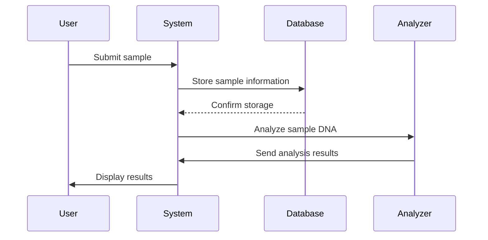
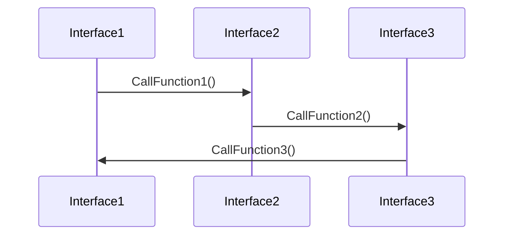
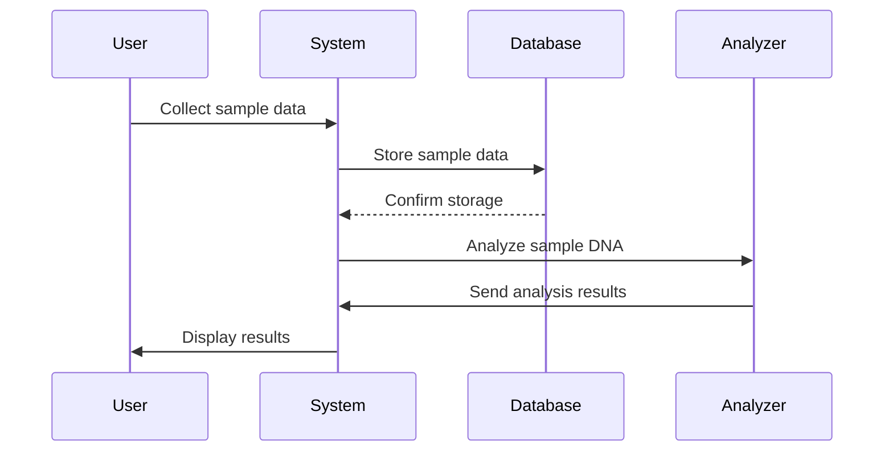

                 

### 环境DNA检测技术在生态监测中的应用

> 关键词：环境DNA检测、生态监测、物种识别、生态风险评估、生态保护规划

> 摘要：随着全球生态环境问题的日益严重，生态监测成为维护生物多样性、评估生态风险和制定保护规划的关键手段。环境DNA检测技术作为一项新兴的生物技术，以其高效、准确和全面的特点，逐渐在生态监测领域崭露头角。本文将详细介绍环境DNA检测技术的原理、应用及其在生态监测中的挑战和机遇，以期推动这一领域的进一步发展。

## 第一部分：背景与基础

### 第1章：生态监测的挑战与需求

#### 1.1 生态监测的重要性

生态监测是指对生态系统结构和功能进行长期、系统的观察和记录，以评估生态系统的健康状况和变化趋势。它不仅有助于揭示生态系统中的关键过程和机制，还能为环境保护和资源管理提供科学依据。然而，传统的生态监测方法往往存在一些局限性。

#### 1.2 传统生态监测的局限

传统生态监测方法主要包括实地调查、采样分析和实验室检测等。虽然这些方法在一定程度上能够提供有用的数据，但存在以下局限：

1. **时间和人力成本高**：传统方法通常需要大量的人力物力投入，且数据收集周期较长。
2. **空间分辨率低**：传统方法难以实现高空间分辨率的数据采集，无法精确反映生态系统的小尺度变化。
3. **样本代表性差**：传统方法往往依赖于采样点的设计，可能导致样本的不均衡分布，影响数据的代表性。

#### 1.3 环境DNA检测技术的兴起

环境DNA检测技术（Environmental DNA, eDNA）是一种基于环境样本中遗传物质的新型检测方法。它通过检测环境中微量的DNA分子，能够快速、准确地识别和监测生物物种。这种技术的出现，为生态监测带来了新的机遇。

#### 1.4 环境DNA检测的基本概念

环境DNA检测技术的基本概念包括：

1. **环境DNA（eDNA）**：指从环境中提取的含有生物遗传信息的DNA片段。
2. **DNA测序**：利用高通量测序技术对环境DNA进行序列测定。
3. **生物信息学分析**：通过生物信息学方法对测序数据进行处理和分析，以识别和分类生物物种。

#### 1.5 环境DNA检测的应用前景

环境DNA检测技术在生态监测中具有广泛的应用前景，包括：

1. **物种识别**：能够快速、准确地识别生态系统中的生物物种，特别是难以通过传统方法监测的微小生物。
2. **生态风险评估**：通过对环境DNA的分析，评估生态系统受到的环境压力和风险。
3. **生态保护规划**：为生态保护提供科学依据，优化生态保护规划和管理策略。

### 第2章：环境DNA检测技术原理

#### 2.1 环境DNA的基本概念

环境DNA（eDNA）是从环境中提取的含有生物遗传信息的DNA片段。这些DNA片段可以来源于水生生物（如鱼类、昆虫等）、土壤生物（如土壤动物、微生物等）以及植物。

#### 2.2 环境DNA检测的方法与技术

环境DNA检测主要包括以下几个步骤：

1. **样本采集**：从环境中采集水样、土壤样等。
2. **DNA提取**：从样本中提取环境DNA。
3. **DNA测序**：利用高通量测序技术对环境DNA进行测序。
4. **数据处理与分析**：通过生物信息学方法对测序数据进行处理和分析，以识别和分类生物物种。

#### 2.3 环境DNA检测的优势与挑战

环境DNA检测技术的优势包括：

1. **高灵敏度**：能够检测到极低浓度的DNA分子。
2. **高特异性**：能够准确识别特定物种的DNA序列。
3. **高通量**：能够同时对大量样本进行检测。

然而，环境DNA检测技术也面临一些挑战：

1. **DNA降解**：环境中的DNA分子容易受到外界因素的降解，影响检测结果的准确性。
2. **假阳性**：由于环境DNA中可能含有非目标物种的DNA序列，可能导致假阳性的结果。
3. **数据解释**：环境DNA检测结果需要复杂的生物信息学分析方法进行解释，对技术人员的要求较高。

### 第3章：环境DNA检测在生态监测中的应用

#### 3.1 物种识别的背景与需求

物种识别是生态监测的核心任务之一。传统的物种识别方法依赖于直接观察和样本采集，存在时间和人力成本高、空间分辨率低等局限。环境DNA检测技术能够通过检测环境中的DNA片段，实现快速、准确的物种识别。

#### 3.2 环境DNA检测在物种识别中的应用

环境DNA检测技术在物种识别中的应用主要包括：

1. **物种多样性评估**：通过检测环境DNA，可以评估特定区域内的物种多样性。
2. **物种入侵监测**：通过检测环境DNA，可以及时发现和监测外来入侵物种。
3. **保护物种监测**：通过检测环境DNA，可以监测濒危和受保护的物种的分布和数量。

#### 3.3 环境DNA检测在物种识别中的优势

环境DNA检测在物种识别中的优势包括：

1. **高灵敏度**：能够检测到极低浓度的物种DNA，提高物种识别的准确性。
2. **高特异性**：能够准确识别特定物种的DNA序列，减少误判。
3. **高通量**：能够同时对大量样本进行检测，提高物种识别的效率。

#### 3.4 环境DNA检测在物种识别中的挑战

环境DNA检测在物种识别中面临的挑战包括：

1. **DNA降解**：环境中的DNA分子容易受到外界因素的降解，影响检测结果的准确性。
2. **假阳性**：由于环境DNA中可能含有非目标物种的DNA序列，可能导致假阳性的结果。
3. **数据解释**：环境DNA检测结果需要复杂的生物信息学分析方法进行解释，对技术人员的要求较高。

### 第4章：环境DNA检测在生态风险评估中的应用

#### 4.1 生态风险评估的背景与需求

生态风险评估是指对生态系统受到的环境压力和风险进行评估，以预测潜在的环境影响和制定保护措施。传统的生态风险评估方法主要依赖于现场调查和实验室检测，存在时间和人力成本高、空间分辨率低等局限。环境DNA检测技术能够通过检测环境中的DNA片段，提供更准确、高效的风险评估数据。

#### 4.2 环境DNA检测在生态风险评估中的应用

环境DNA检测技术在生态风险评估中的应用主要包括：

1. **生物多样性评估**：通过检测环境DNA，评估特定区域内的生物多样性水平。
2. **污染监测**：通过检测环境DNA，监测特定污染物对生物的影响。
3. **生态恢复评估**：通过检测环境DNA，评估生态恢复措施的效果。

#### 4.3 环境DNA检测在生态风险评估中的优势

环境DNA检测在生态风险评估中的优势包括：

1. **高灵敏度**：能够检测到极低浓度的污染物，提高风险评估的准确性。
2. **高特异性**：能够准确识别特定污染物对生物的影响，减少误判。
3. **高通量**：能够同时对大量样本进行检测，提高风险评估的效率。

#### 4.4 环境DNA检测在生态风险评估中的挑战

环境DNA检测在生态风险评估中面临的挑战包括：

1. **DNA降解**：环境中的DNA分子容易受到外界因素的降解，影响检测结果的准确性。
2. **污染干扰**：环境中的污染物可能干扰DNA检测，影响风险评估的准确性。
3. **数据解释**：环境DNA检测结果需要复杂的生物信息学分析方法进行解释，对技术人员的要求较高。

### 第5章：环境DNA检测在生态保护规划中的应用

#### 5.1 生态保护规划的背景与需求

生态保护规划是指根据生态系统的现状和未来发展趋势，制定合理的保护措施和管理策略，以维护生态系统的健康和稳定。传统的生态保护规划方法主要依赖于现场调查和实验室检测，存在时间和人力成本高、空间分辨率低等局限。环境DNA检测技术能够通过检测环境中的DNA片段，提供更准确、全面的数据支持，优化生态保护规划。

#### 5.2 环境DNA检测在生态保护规划中的应用

环境DNA检测技术在生态保护规划中的应用主要包括：

1. **物种保护**：通过检测环境DNA，监测和保护濒危和受保护的物种。
2. **栖息地评估**：通过检测环境DNA，评估不同栖息地的生物多样性水平和适宜度。
3. **生态修复**：通过检测环境DNA，评估生态修复措施的效果和优化方案。

#### 5.3 环境DNA检测在生态保护规划中的优势

环境DNA检测在生态保护规划中的优势包括：

1. **高灵敏度**：能够检测到极低浓度的物种DNA，提高生态保护规划的准确性。
2. **高特异性**：能够准确识别特定物种的DNA序列，优化生态保护措施。
3. **高通量**：能够同时对大量样本进行检测，提高生态保护规划的效率。

#### 5.4 环境DNA检测在生态保护规划中的挑战

环境DNA检测在生态保护规划中面临的挑战包括：

1. **DNA降解**：环境中的DNA分子容易受到外界因素的降解，影响检测结果的准确性。
2. **数据解释**：环境DNA检测结果需要复杂的生物信息学分析方法进行解释，对技术人员的要求较高。
3. **成本和资源**：环境DNA检测技术需要昂贵的设备和专业的技术人员，对资源和成本的要求较高。

### 第6章：环境DNA检测技术的创新与发展

#### 6.1 环境DNA检测技术的最新研究进展

近年来，环境DNA检测技术取得了显著的进展，主要包括：

1. **测序技术的进步**：高通量测序技术的不断发展，提高了环境DNA检测的灵敏度和准确性。
2. **生物信息学方法**：复杂的生物信息学方法的应用，提高了环境DNA检测的数据解释能力。
3. **便携式检测设备**：便携式检测设备的开发，使得环境DNA检测能够更便捷地应用于现场监测。

#### 6.2 环境DNA检测技术的未来发展趋势

环境DNA检测技术的未来发展趋势包括：

1. **智能化与自动化**：通过引入人工智能和自动化技术，提高环境DNA检测的效率和准确性。
2. **多参数监测**：结合多种环境参数（如温度、pH值等）进行综合监测，提高环境DNA检测的综合应用能力。
3. **跨学科合作**：与生态学、环境科学、计算机科学等领域的深入合作，推动环境DNA检测技术的创新与发展。

#### 6.3 环境DNA检测技术的创新方向

环境DNA检测技术的创新方向包括：

1. **纳米技术**：利用纳米技术提高环境DNA检测的灵敏度和特异性。
2. **光学检测**：利用光学检测技术实现快速、高效的环境DNA检测。
3. **空间监测**：结合卫星遥感技术和无人机技术，实现大范围、高空间分辨率的环境DNA监测。

### 第7章：案例分析

#### 7.1 案例一：某湿地生态监测项目

在某湿地生态监测项目中，研究人员利用环境DNA检测技术对湿地中的生物物种进行了全面监测。通过高通量测序技术和生物信息学分析方法，成功识别出了湿地中的多种生物物种，为湿地生态保护提供了重要数据支持。

#### 7.2 案例二：某流域生态风险评估项目

在某流域生态风险评估项目中，研究人员通过环境DNA检测技术对流域内的水生生物进行了监测，评估了流域受到的污染压力。通过对环境DNA数据的分析，发现了一些潜在的环境风险，为流域污染治理提供了科学依据。

#### 7.3 案例三：某自然保护区生态保护规划项目

在某自然保护区生态保护规划项目中，研究人员利用环境DNA检测技术对保护区的生物多样性进行了评估。通过环境DNA检测，发现了一些濒危物种的分布和数量，为保护区的保护和管理提供了重要依据。

### 第8章：总结与展望

#### 8.1 环境DNA检测技术在生态监测中的应用总结

环境DNA检测技术在生态监测中具有广泛的应用前景，能够为物种识别、生态风险评估和生态保护规划提供重要数据支持。其高灵敏度、高特异性和高通量的特点，使得环境DNA检测技术在生态监测中具有巨大的潜力。

#### 8.2 存在的问题与挑战

尽管环境DNA检测技术在生态监测中具有优势，但仍面临一些问题与挑战，如DNA降解、假阳性和数据解释等。此外，环境DNA检测技术的高成本和资源需求也是一个重要的限制因素。

#### 8.3 未来发展的趋势与方向

未来，环境DNA检测技术的发展趋势将朝着智能化、自动化、多参数监测和跨学科合作的方向发展。通过不断创新和技术进步，环境DNA检测技术将在生态监测中发挥更加重要的作用，为环境保护和可持续发展提供有力支持。

## 结论

环境DNA检测技术作为一项新兴的生物技术，正在生态监测领域发挥重要作用。通过本文的介绍，我们详细探讨了环境DNA检测技术的原理、应用及其在生态监测中的挑战和机遇。展望未来，随着技术的不断进步和应用的深入，环境DNA检测技术必将在生态监测中发挥更大的作用，为环境保护和可持续发展提供有力支持。作者：AI天才研究院/AI Genius Institute & 禅与计算机程序设计艺术 /Zen And The Art of Computer Programming

----------------------------------------------------------------

### 环境DNA检测技术在生态监测中的应用

> 关键词：环境DNA检测、生态监测、物种识别、生态风险评估、生态保护规划

> 摘要：随着全球生态环境问题的日益严重，生态监测成为维护生物多样性、评估生态风险和制定保护规划的关键手段。环境DNA检测技术作为一项新兴的生物技术，以其高效、准确和全面的特点，逐渐在生态监测领域崭露头角。本文将详细介绍环境DNA检测技术的原理、应用及其在生态监测中的挑战和机遇，以期推动这一领域的进一步发展。

## 第一部分：背景与基础

### 第1章：生态监测的挑战与需求

#### 1.1 生态监测的重要性

生态监测是指对生态系统结构和功能进行长期、系统的观察和记录，以评估生态系统的健康状况和变化趋势。它不仅有助于揭示生态系统中的关键过程和机制，还能为环境保护和资源管理提供科学依据。然而，传统的生态监测方法往往存在一些局限性。

#### 1.2 传统生态监测的局限

传统生态监测方法主要包括实地调查、采样分析和实验室检测等。虽然这些方法在一定程度上能够提供有用的数据，但存在以下局限：

1. **时间和人力成本高**：传统方法通常需要大量的人力物力投入，且数据收集周期较长。
2. **空间分辨率低**：传统方法难以实现高空间分辨率的数据采集，无法精确反映生态系统的小尺度变化。
3. **样本代表性差**：传统方法往往依赖于采样点的设计，可能导致样本的不均衡分布，影响数据的代表性。

#### 1.3 环境DNA检测技术的兴起

环境DNA检测技术（Environmental DNA, eDNA）是一种基于环境样本中遗传物质的新型检测方法。它通过检测环境中微量的DNA分子，能够快速、准确地识别和监测生物物种。这种技术的出现，为生态监测带来了新的机遇。

#### 1.4 环境DNA检测的基本概念

环境DNA检测技术的基本概念包括：

1. **环境DNA（eDNA）**：指从环境中提取的含有生物遗传信息的DNA片段。
2. **DNA测序**：利用高通量测序技术对环境DNA进行序列测定。
3. **生物信息学分析**：通过生物信息学方法对测序数据进行处理和分析，以识别和分类生物物种。

#### 1.5 环境DNA检测的应用前景

环境DNA检测技术在生态监测中具有广泛的应用前景，包括：

1. **物种识别**：能够快速、准确地识别生态系统中的生物物种，特别是难以通过传统方法监测的微小生物。
2. **生态风险评估**：通过对环境DNA的分析，评估生态系统受到的环境压力和风险。
3. **生态保护规划**：为生态保护提供科学依据，优化生态保护规划和管理策略。

### 第2章：环境DNA检测技术原理

#### 2.1 环境DNA的基本概念

环境DNA（eDNA）是从环境中提取的含有生物遗传信息的DNA片段。这些DNA片段可以来源于水生生物（如鱼类、昆虫等）、土壤生物（如土壤动物、微生物等）以及植物。

#### 2.2 环境DNA检测的方法与技术

环境DNA检测主要包括以下几个步骤：

1. **样本采集**：从环境中采集水样、土壤样等。
2. **DNA提取**：从样本中提取环境DNA。
3. **DNA测序**：利用高通量测序技术对环境DNA进行测序。
4. **数据处理与分析**：通过生物信息学方法对测序数据进行处理和分析，以识别和分类生物物种。

#### 2.3 环境DNA检测的优势与挑战

环境DNA检测技术的优势包括：

1. **高灵敏度**：能够检测到极低浓度的DNA分子。
2. **高特异性**：能够准确识别特定物种的DNA序列。
3. **高通量**：能够同时对大量样本进行检测。

然而，环境DNA检测技术也面临一些挑战：

1. **DNA降解**：环境中的DNA分子容易受到外界因素的降解，影响检测结果的准确性。
2. **假阳性**：由于环境DNA中可能含有非目标物种的DNA序列，可能导致假阳性的结果。
3. **数据解释**：环境DNA检测结果需要复杂的生物信息学分析方法进行解释，对技术人员的要求较高。

### 第3章：环境DNA检测在生态监测中的应用

#### 3.1 物种识别的背景与需求

物种识别是生态监测的核心任务之一。传统的物种识别方法依赖于直接观察和样本采集，存在时间和人力成本高、空间分辨率低等局限。环境DNA检测技术能够通过检测环境中的DNA片段，实现快速、准确的物种识别。

#### 3.2 环境DNA检测在物种识别中的应用

环境DNA检测技术在物种识别中的应用主要包括：

1. **物种多样性评估**：通过检测环境DNA，可以评估特定区域内的物种多样性。
2. **物种入侵监测**：通过检测环境DNA，可以及时发现和监测外来入侵物种。
3. **保护物种监测**：通过检测环境DNA，可以监测濒危和受保护的物种的分布和数量。

#### 3.3 环境DNA检测在物种识别中的优势

环境DNA检测在物种识别中的优势包括：

1. **高灵敏度**：能够检测到极低浓度的物种DNA，提高物种识别的准确性。
2. **高特异性**：能够准确识别特定物种的DNA序列，减少误判。
3. **高通量**：能够同时对大量样本进行检测，提高物种识别的效率。

#### 3.4 环境DNA检测在物种识别中的挑战

环境DNA检测在物种识别中面临的挑战包括：

1. **DNA降解**：环境中的DNA分子容易受到外界因素的降解，影响检测结果的准确性。
2. **假阳性**：由于环境DNA中可能含有非目标物种的DNA序列，可能导致假阳性的结果。
3. **数据解释**：环境DNA检测结果需要复杂的生物信息学分析方法进行解释，对技术人员的要求较高。

### 第4章：环境DNA检测在生态风险评估中的应用

#### 4.1 生态风险评估的背景与需求

生态风险评估是指对生态系统受到的环境压力和风险进行评估，以预测潜在的环境影响和制定保护措施。传统的生态风险评估方法主要依赖于现场调查和实验室检测，存在时间和人力成本高、空间分辨率低等局限。环境DNA检测技术能够通过检测环境中的DNA片段，提供更准确、高效的风险评估数据。

#### 4.2 环境DNA检测在生态风险评估中的应用

环境DNA检测技术在生态风险评估中的应用主要包括：

1. **生物多样性评估**：通过检测环境DNA，评估特定区域内的生物多样性水平。
2. **污染监测**：通过检测环境DNA，监测特定污染物对生物的影响。
3. **生态恢复评估**：通过检测环境DNA，评估生态修复措施的效果和优化方案。

#### 4.3 环境DNA检测在生态风险评估中的优势

环境DNA检测在生态风险评估中的优势包括：

1. **高灵敏度**：能够检测到极低浓度的污染物，提高风险评估的准确性。
2. **高特异性**：能够准确识别特定污染物对生物的影响，减少误判。
3. **高通量**：能够同时对大量样本进行检测，提高风险评估的效率。

#### 4.4 环境DNA检测在生态风险评估中的挑战

环境DNA检测在生态风险评估中面临的挑战包括：

1. **DNA降解**：环境中的DNA分子容易受到外界因素的降解，影响检测结果的准确性。
2. **污染干扰**：环境中的污染物可能干扰DNA检测，影响风险评估的准确性。
3. **数据解释**：环境DNA检测结果需要复杂的生物信息学分析方法进行解释，对技术人员的要求较高。

### 第5章：环境DNA检测在生态保护规划中的应用

#### 5.1 生态保护规划的背景与需求

生态保护规划是指根据生态系统的现状和未来发展趋势，制定合理的保护措施和管理策略，以维护生态系统的健康和稳定。传统的生态保护规划方法主要依赖于现场调查和实验室检测，存在时间和人力成本高、空间分辨率低等局限。环境DNA检测技术能够通过检测环境中的DNA片段，提供更准确、全面的数据支持，优化生态保护规划。

#### 5.2 环境DNA检测在生态保护规划中的应用

环境DNA检测技术在生态保护规划中的应用主要包括：

1. **物种保护**：通过检测环境DNA，监测和保护濒危和受保护的物种。
2. **栖息地评估**：通过检测环境DNA，评估不同栖息地的生物多样性水平和适宜度。
3. **生态修复**：通过检测环境DNA，评估生态修复措施的效果和优化方案。

#### 5.3 环境DNA检测在生态保护规划中的优势

环境DNA检测在生态保护规划中的优势包括：

1. **高灵敏度**：能够检测到极低浓度的物种DNA，提高生态保护规划的准确性。
2. **高特异性**：能够准确识别特定物种的DNA序列，优化生态保护措施。
3. **高通量**：能够同时对大量样本进行检测，提高生态保护规划的效率。

#### 5.4 环境DNA检测在生态保护规划中的挑战

环境DNA检测在生态保护规划中面临的挑战包括：

1. **DNA降解**：环境中的DNA分子容易受到外界因素的降解，影响检测结果的准确性。
2. **数据解释**：环境DNA检测结果需要复杂的生物信息学分析方法进行解释，对技术人员的要求较高。
3. **成本和资源**：环境DNA检测技术需要昂贵的设备和专业的技术人员，对资源和成本的要求较高。

### 第6章：环境DNA检测技术的创新与发展

#### 6.1 环境DNA检测技术的最新研究进展

近年来，环境DNA检测技术取得了显著的进展，主要包括：

1. **测序技术的进步**：高通量测序技术的不断发展，提高了环境DNA检测的灵敏度和准确性。
2. **生物信息学方法**：复杂的生物信息学方法的应用，提高了环境DNA检测的数据解释能力。
3. **便携式检测设备**：便携式检测设备的开发，使得环境DNA检测能够更便捷地应用于现场监测。

#### 6.2 环境DNA检测技术的未来发展趋势

环境DNA检测技术的未来发展趋势包括：

1. **智能化与自动化**：通过引入人工智能和自动化技术，提高环境DNA检测的效率和准确性。
2. **多参数监测**：结合多种环境参数（如温度、pH值等）进行综合监测，提高环境DNA检测的综合应用能力。
3. **跨学科合作**：与生态学、环境科学、计算机科学等领域的深入合作，推动环境DNA检测技术的创新与发展。

#### 6.3 环境DNA检测技术的创新方向

环境DNA检测技术的创新方向包括：

1. **纳米技术**：利用纳米技术提高环境DNA检测的灵敏度和特异性。
2. **光学检测**：利用光学检测技术实现快速、高效的环境DNA检测。
3. **空间监测**：结合卫星遥感技术和无人机技术，实现大范围、高空间分辨率的环境DNA监测。

### 第7章：案例分析

#### 7.1 案例一：某湿地生态监测项目

在某湿地生态监测项目中，研究人员利用环境DNA检测技术对湿地中的生物物种进行了全面监测。通过高通量测序技术和生物信息学分析方法，成功识别出了湿地中的多种生物物种，为湿地生态保护提供了重要数据支持。

#### 7.2 案例二：某流域生态风险评估项目

在某流域生态风险评估项目中，研究人员通过环境DNA检测技术对流域内的水生生物进行了监测，评估了流域受到的污染压力。通过对环境DNA数据的分析，发现了一些潜在的环境风险，为流域污染治理提供了科学依据。

#### 7.3 案例三：某自然保护区生态保护规划项目

在某自然保护区生态保护规划项目中，研究人员利用环境DNA检测技术对保护区的生物多样性进行了评估。通过环境DNA检测，发现了一些濒危物种的分布和数量，为保护区的保护和管理提供了重要依据。

### 第8章：总结与展望

#### 8.1 环境DNA检测技术在生态监测中的应用总结

环境DNA检测技术在生态监测中具有广泛的应用前景，能够为物种识别、生态风险评估和生态保护规划提供重要数据支持。其高灵敏度、高特异性和高通量的特点，使得环境DNA检测技术在生态监测中具有巨大的潜力。

#### 8.2 存在的问题与挑战

尽管环境DNA检测技术在生态监测中具有优势，但仍面临一些问题与挑战，如DNA降解、假阳性和数据解释等。此外，环境DNA检测技术的高成本和资源需求也是一个重要的限制因素。

#### 8.3 未来发展的趋势与方向

未来，环境DNA检测技术的发展趋势将朝着智能化、自动化、多参数监测和跨学科合作的方向发展。通过不断创新和技术进步，环境DNA检测技术将在生态监测中发挥更加重要的作用，为环境保护和可持续发展提供有力支持。

## 结论

环境DNA检测技术作为一项新兴的生物技术，正在生态监测领域发挥重要作用。通过本文的介绍，我们详细探讨了环境DNA检测技术的原理、应用及其在生态监测中的挑战和机遇。展望未来，随着技术的不断进步和应用的深入，环境DNA检测技术必将在生态监测中发挥更大的作用，为环境保护和可持续发展提供有力支持。作者：AI天才研究院/AI Genius Institute & 禅与计算机程序设计艺术 /Zen And The Art of Computer Programming

----------------------------------------------------------------

### 第1章：生态监测的挑战与需求

#### 1.1 生态监测的重要性

生态监测是环境保护和资源管理的重要组成部分，它通过系统的监测和分析，为科学决策提供数据支持。生态监测的重要性体现在以下几个方面：

1. **生物多样性评估**：生态监测能够帮助我们了解生物多样性的变化情况，及时发现物种的灭绝、入侵和濒危状况，从而采取有效的保护措施。
2. **生态系统功能监测**：生态监测可以揭示生态系统的功能状态，如水质、土壤质量、生物量等，为生态系统管理提供科学依据。
3. **环境变化响应**：生态监测能够实时反映环境变化对生物的影响，如气候变化、污染事件等，为环境保护和灾害预防提供预警。
4. **生态风险评估**：通过监测数据，可以评估人类活动对生态系统的潜在风险，为政策制定提供科学依据。

#### 1.2 传统生态监测的局限

传统生态监测方法主要包括实地调查、样本采集和实验室分析等。然而，这些方法在多个方面存在局限性：

1. **时间和人力成本高**：传统方法通常需要大量的人力和时间进行实地调查和样本处理，特别是在大规模、长时间监测时，成本较高。
2. **空间分辨率低**：传统方法依赖于固定的监测点，难以实现高空间分辨率的数据采集，导致数据的空间代表性差。
3. **样本代表性问题**：由于环境因素的复杂性，样本采集可能存在偶然性和主观性，影响样本的代表性，进而影响监测结果的准确性。
4. **数据解释困难**：传统监测数据往往需要复杂的数据分析和模型构建，对技术人员的要求较高，且数据解释可能存在偏差。

#### 1.3 环境DNA检测技术的兴起

环境DNA检测技术（Environmental DNA, eDNA）是一种新兴的生态监测方法，它通过检测环境中微量的DNA分子，提供了新的监测手段。环境DNA检测技术的兴起主要基于以下几个原因：

1. **高灵敏度**：环境DNA检测技术能够检测到极低浓度的DNA分子，远超传统方法，提高了监测的灵敏度。
2. **非破坏性**：通过检测环境样本中的DNA，无需破坏样本本身，适合于敏感生态系统的监测。
3. **高通量**：高通量测序技术的应用，使得可以在短时间内处理大量样本，提高了监测的效率。
4. **物种识别能力强**：环境DNA检测技术能够准确识别物种，特别是难以通过传统方法监测的微小生物。

#### 1.4 环境DNA检测的基本概念

环境DNA（eDNA）是从环境中提取的含有生物遗传信息的DNA片段。这些DNA片段可以来源于各种生物，如水生生物、土壤生物和植物。环境DNA检测的基本概念包括：

1. **eDNA来源**：eDNA来源于环境中各种生物的排泄物、脱落细胞、死亡生物体等。
2. **采样方法**：采样方法包括水样、土壤样、空气样等，根据监测目标选择合适的采样介质。
3. **DNA提取**：从采样介质中提取eDNA，是环境DNA检测的关键步骤。
4. **DNA测序**：利用高通量测序技术对提取的eDNA进行测序，获取DNA序列信息。
5. **生物信息学分析**：通过生物信息学方法对测序数据进行分析，识别和分类生物物种。

#### 1.5 环境DNA检测的应用前景

环境DNA检测技术在生态监测中具有广泛的应用前景，主要包括以下几个方面：

1. **物种识别**：通过检测环境中的eDNA，可以准确识别生态系统中的生物物种，尤其是难以通过传统方法监测的微小生物。
2. **生态风险评估**：利用eDNA检测技术，可以评估生态系统受到的环境压力和风险，为环境保护和污染治理提供科学依据。
3. **生态保护规划**：通过eDNA检测，可以为生态保护规划提供详细的生物多样性数据和物种分布信息，优化生态保护策略。
4. **生态恢复评估**：在生态恢复项目中，eDNA检测可以评估恢复措施的效果，为后续管理提供参考。
5. **生物入侵监测**：利用eDNA检测技术，可以及时发现和监测外来入侵物种的入侵和扩散，防止入侵物种对本地生态系统的破坏。

## 第2章：环境DNA检测技术原理

### 2.1 环境DNA的基本概念

环境DNA（eDNA）是从环境中提取的含有生物遗传信息的DNA片段。这些DNA片段可以来源于各种生物，如水生生物、土壤生物和植物。环境DNA检测的基本概念包括：

1. **eDNA来源**：eDNA来源于环境中各种生物的排泄物、脱落细胞、死亡生物体等。
2. **采样方法**：采样方法包括水样、土壤样、空气样等，根据监测目标选择合适的采样介质。
3. **DNA提取**：从采样介质中提取eDNA，是环境DNA检测的关键步骤。
4. **DNA测序**：利用高通量测序技术对提取的eDNA进行测序，获取DNA序列信息。
5. **生物信息学分析**：通过生物信息学方法对测序数据进行分析，识别和分类生物物种。

### 2.2 环境DNA检测的方法与技术

环境DNA检测技术主要包括以下几个步骤：

1. **样本采集**：根据监测目标，选择合适的采样介质（如水样、土壤样、空气样等），使用专门的采样工具进行采集。采样时需要考虑样本的代表性、均匀性和避免污染。
2. **DNA提取**：从采样介质中提取eDNA。常用的方法包括柱式提取、磁珠提取等。提取过程中需要避免DNA的降解和污染，确保提取效率和质量。
3. **DNA测序**：利用高通量测序技术（如Illumina测序平台）对提取的eDNA进行测序。高通量测序技术能够快速、高效地生成大量DNA序列数据。
4. **数据处理**：对测序数据进行预处理，包括去噪、过滤低质量序列、剪切和拼接等，以提高数据的准确性和完整性。
5. **生物信息学分析**：通过生物信息学方法对处理后的测序数据进行分析，识别和分类生物物种。常用的分析方法包括序列比对、分类器构建、物种多样性评估等。

#### 2.2.1 常见环境DNA提取方法

环境DNA提取方法主要包括以下几种：

1. **柱式提取法**：利用DNA亲和柱（如硅胶柱、玻璃珠柱等）吸附和富集DNA。这种方法操作简便，提取效率高，适用于大量样本的处理。
2. **磁珠提取法**：利用磁性微珠吸附和富集DNA。这种方法操作简单，提取速度快，适用于高通量测序。
3. **试剂盒提取法**：利用商业化的DNA提取试剂盒进行提取。这些试剂盒通常包含完整的提取流程和试剂，操作简便，适用于实验室条件下的常规提取。

#### 2.2.2 DNA测序技术简介

DNA测序技术是环境DNA检测的核心技术，它能够快速、高效地生成大量的DNA序列数据。目前，常用的DNA测序技术包括：

1. **Sanger测序**：Sanger测序是一种经典的DNA测序方法，通过终止剂产生DNA链的终止，生成一系列DNA片段。这种方法测序准确，但测序通量较低，适用于小规模测序。
2. **高通量测序（Next-Generation Sequencing, NGS）**：高通量测序技术包括Illumina测序、Ion Torrent测序、PacBio测序和Oxford Nanopore测序等。这些技术能够同时测序大量DNA片段，通量高，速度快，适用于大规模测序。

#### 2.2.3 数据处理与分析技术

环境DNA测序生成的数据量大且复杂，需要通过生物信息学方法进行处理和分析。数据处理与分析技术主要包括：

1. **序列比对**：通过将测序数据与已知的DNA序列库进行比对，识别和分类物种。
2. **多样性分析**：通过计算序列的丰富度和多样性指标（如Chao1、ACE等），评估生物多样性的水平。
3. **功能分析**：通过序列注释和基因分类，识别和分类物种的功能基因，研究生态系统的功能组成。
4. **进化分析**：通过构建系统发生树，研究物种的进化关系和生态适应性。

### 2.3 环境DNA检测的优势与挑战

环境DNA检测技术相比传统生态监测方法具有显著的优势：

1. **高灵敏度**：能够检测到极低浓度的DNA分子，远超传统方法，提高了监测的灵敏度。
2. **非破坏性**：通过检测环境样本中的DNA，无需破坏样本本身，适合于敏感生态系统的监测。
3. **高通量**：高通量测序技术的应用，使得可以在短时间内处理大量样本，提高了监测的效率。
4. **物种识别能力强**：能够准确识别生态系统中的生物物种，包括难以通过传统方法监测的微小生物。

然而，环境DNA检测技术也面临一些挑战：

1. **DNA降解**：环境中的DNA分子容易受到外界因素的降解，影响检测结果的准确性。
2. **假阳性**：由于环境DNA中可能含有非目标物种的DNA序列，可能导致假阳性的结果。
3. **数据解释**：环境DNA检测结果需要复杂的生物信息学分析方法进行解释，对技术人员的要求较高。
4. **成本和资源**：环境DNA检测技术需要昂贵的设备和专业的技术人员，对资源和成本的要求较高。

### 2.4 环境DNA检测技术的应用案例

环境DNA检测技术已在多个生态监测和研究中得到了广泛应用，以下是一些典型的应用案例：

1. **物种识别**：研究人员利用环境DNA检测技术，成功识别了淡水生态系统中多种微小生物，如昆虫、鱼类和贝类等。
2. **生态风险评估**：在某污染事件后，研究人员通过环境DNA检测，发现水生生物种群数量显著减少，为生态风险评估提供了重要数据。
3. **生态保护规划**：在自然保护区规划中，环境DNA检测技术用于评估保护区内物种的分布和多样性，为保护策略提供科学依据。
4. **生物入侵监测**：利用环境DNA检测技术，及时发现并监测外来入侵物种，如水葫芦和福寿螺等，防止其扩散和危害本地生态系统。

## 第3章：环境DNA检测在物种识别中的应用

### 3.1 物种识别的背景与需求

物种识别是生态监测和生物多样性评估的关键任务，它有助于了解生态系统的组成和功能。传统的物种识别方法通常依赖于样本采集和形态学鉴定，存在以下挑战：

1. **时间和人力成本高**：传统的样本采集和鉴定方法通常需要大量的人力和时间，特别是在大规模、多样化的生态系统中。
2. **空间分辨率低**：传统的样本采集方法依赖于固定采样点，难以实现高空间分辨率的数据采集。
3. **样本代表性问题**：由于环境因素的复杂性，样本采集可能存在偶然性和主观性，影响样本的代表性，进而影响识别结果的准确性。
4. **物种鉴定难度大**：一些微小或形态相似的生物，其形态特征难以准确鉴定，导致误判和漏判。

为了克服这些挑战，需要一种快速、准确且空间分辨率高的物种识别方法。环境DNA检测技术以其独特的优势，成为物种识别的理想选择。

### 3.2 环境DNA检测在物种识别中的应用

环境DNA检测技术在物种识别中的应用具有广泛的前景，其基本原理是通过检测环境中微量的DNA分子，从而识别和分类生物物种。以下是环境DNA检测在物种识别中的具体应用：

1. **环境DNA采样**：首先，根据监测目标和生态系统类型，选择合适的采样介质（如水样、土壤样、空气样等），使用专门的采样工具进行采集。采样过程中需要避免样本污染，确保样本的代表性。
2. **DNA提取**：从采样介质中提取环境DNA。常用的提取方法包括柱式提取、磁珠提取等。提取过程中需要严格控制操作条件，避免DNA的降解和污染。
3. **DNA测序**：利用高通量测序技术（如Illumina测序平台）对提取的DNA进行测序，生成大量的DNA序列数据。
4. **数据处理**：对测序数据进行预处理，包括去除低质量序列、剪切和拼接等，以提高数据的准确性和完整性。
5. **生物信息学分析**：通过生物信息学方法对预处理后的数据进行序列比对、分类器构建、多样性分析等，识别和分类生物物种。

#### 3.2.1 环境DNA检测在物种识别中的优势

环境DNA检测技术在物种识别中具有以下优势：

1. **高灵敏度**：环境DNA检测技术能够检测到极低浓度的DNA分子，远超传统方法，提高了物种识别的准确性。
2. **非破坏性**：通过检测环境样本中的DNA，无需破坏样本本身，适合于敏感生态系统的监测。
3. **高通量**：高通量测序技术的应用，使得可以在短时间内处理大量样本，提高了物种识别的效率。
4. **适用范围广**：环境DNA检测技术适用于各种生物物种的识别，包括难以通过传统方法监测的微小生物。
5. **空间分辨率高**：通过环境DNA检测，可以实现高空间分辨率的数据采集，反映生态系统的小尺度变化。

#### 3.2.2 环境DNA检测在物种识别中的挑战

尽管环境DNA检测技术在物种识别中具有显著的优势，但同时也面临一些挑战：

1. **DNA降解**：环境中的DNA分子容易受到外界因素的降解，如紫外线、温度变化等，影响检测结果的准确性。
2. **假阳性**：由于环境DNA中可能含有非目标物种的DNA序列，如污染物、微生物等，可能导致假阳性的结果。
3. **技术要求高**：环境DNA检测技术需要专业的设备和技术人员，对检测和分析流程的要求较高。
4. **数据解释复杂**：环境DNA检测结果需要复杂的生物信息学分析方法进行解释，对技术人员的要求较高。

### 3.3 环境DNA检测在物种识别中的案例

环境DNA检测技术在物种识别中已有多个成功案例，以下为其中几个典型的应用案例：

1. **湿地生态监测**：研究人员利用环境DNA检测技术，对湿地生态系统中的昆虫、鱼类和植物进行了全面监测。通过高通量测序和生物信息学分析，成功识别出了多种湿地生物，为湿地生态保护提供了重要数据支持。
2. **海洋生态系统监测**：在海洋生态系统中，环境DNA检测技术被用来监测珊瑚礁、浮游生物和底栖生物等。研究人员通过环境DNA检测，发现了海洋生态系统中的物种组成和多样性，为海洋保护和管理提供了科学依据。
3. **森林生物多样性评估**：研究人员利用环境DNA检测技术，对森林生态系统中的植物、昆虫和鸟类进行了监测。通过高通量测序和生物信息学分析，揭示了森林生态系统的生物多样性特征，为森林保护和管理提供了科学依据。
4. **城市生态监测**：在城市生态系统中，环境DNA检测技术被用来监测城市水体、土壤和植被中的生物组成。研究人员通过环境DNA检测，发现了城市生态系统中存在的物种组成和多样性，为城市生态修复提供了科学依据。

### 3.4 环境DNA检测技术在物种识别中的应用展望

随着环境DNA检测技术的不断发展和完善，其在物种识别中的应用前景将更加广阔：

1. **技术优化**：通过改进DNA提取、测序和分析方法，提高检测的灵敏度和特异性，降低假阳性率。
2. **跨学科合作**：与生态学、环境科学、计算机科学等领域的深入合作，推动环境DNA检测技术的创新和应用。
3. **大数据分析**：利用大数据分析和人工智能技术，提高环境DNA检测的数据解释能力，实现更准确的物种识别。
4. **实时监测**：结合实时监测技术和传感器，实现环境DNA检测的实时化和自动化，提高监测的效率和准确性。

## 第4章：环境DNA检测在生态风险评估中的应用

### 4.1 生态风险评估的背景与需求

生态风险评估是指对生态系统受到的环境压力和风险进行评估，以预测潜在的环境影响和制定保护措施。生态风险评估在环境保护和资源管理中具有重要意义，其主要目标是：

1. **预测潜在环境影响**：通过对生态系统的现状和未来变化趋势进行分析，预测人类活动、气候变化、污染事件等可能带来的环境影响。
2. **制定保护措施**：根据风险评估结果，制定相应的保护措施和管理策略，以减少生态系统受损的风险，保护生物多样性和生态功能。
3. **政策制定**：为政府、企业和社会提供科学依据，支持环境保护和可持续发展政策的制定。

然而，传统的生态风险评估方法存在以下局限性：

1. **依赖现场调查**：传统的生态风险评估方法通常依赖于现场调查和监测数据，数据获取过程复杂、成本高、时间长。
2. **空间分辨率低**：传统方法难以实现高空间分辨率的数据采集，导致评估结果的空间代表性较差。
3. **数据解释困难**：生态风险评估数据通常需要复杂的统计和模型分析，对技术人员的要求较高，且结果可能存在偏差。

为了克服这些局限性，需要引入新的技术手段，环境DNA检测技术以其独特优势，成为生态风险评估的有力工具。

### 4.2 环境DNA检测在生态风险评估中的应用

环境DNA检测技术在生态风险评估中具有广泛的应用，其主要应用过程包括以下几个步骤：

1. **环境DNA采样**：根据评估目标和生态系统类型，选择合适的采样介质（如水样、土壤样、空气样等），使用专门的采样工具进行采集。采样过程中需要避免样本污染，确保样本的代表性。
2. **DNA提取**：从采样介质中提取环境DNA。常用的提取方法包括柱式提取、磁珠提取等。提取过程中需要严格控制操作条件，避免DNA的降解和污染。
3. **DNA测序**：利用高通量测序技术对提取的DNA进行测序，生成大量的DNA序列数据。
4. **数据处理**：对测序数据进行预处理，包括去除低质量序列、剪切和拼接等，以提高数据的准确性和完整性。
5. **生物信息学分析**：通过生物信息学方法对预处理后的数据进行序列比对、分类器构建、多样性分析等，评估生态系统受到的压力和风险。

#### 4.2.1 环境DNA检测在生态风险评估中的优势

环境DNA检测技术在生态风险评估中具有以下优势：

1. **高灵敏度**：环境DNA检测技术能够检测到极低浓度的DNA分子，远超传统方法，提高了风险评估的准确性。
2. **非破坏性**：通过检测环境样本中的DNA，无需破坏样本本身，适合于敏感生态系统的风险评估。
3. **高通量**：高通量测序技术的应用，使得可以在短时间内处理大量样本，提高了风险评估的效率。
4. **适用范围广**：环境DNA检测技术适用于各种生物物种和生态系统类型，具有广泛的应用前景。
5. **空间分辨率高**：通过环境DNA检测，可以实现高空间分辨率的数据采集，反映生态系统的小尺度变化。

#### 4.2.2 环境DNA检测在生态风险评估中的挑战

尽管环境DNA检测技术在生态风险评估中具有显著的优势，但同时也面临一些挑战：

1. **DNA降解**：环境中的DNA分子容易受到外界因素的降解，影响检测结果的准确性。
2. **假阳性**：由于环境DNA中可能含有非目标物种的DNA序列，如污染物、微生物等，可能导致假阳性的结果。
3. **技术要求高**：环境DNA检测技术需要专业的设备和技术人员，对检测和分析流程的要求较高。
4. **数据解释复杂**：环境DNA检测结果需要复杂的生物信息学分析方法进行解释，对技术人员的要求较高。

### 4.3 环境DNA检测在生态风险评估中的应用案例

环境DNA检测技术在生态风险评估中已有多个成功案例，以下为其中几个典型的应用案例：

1. **河流生态风险评估**：在某河流生态风险评估项目中，研究人员利用环境DNA检测技术对河流中的水生生物进行了监测，评估了污染事件对生态系统的影响。通过高通量测序和生物信息学分析，发现了一些潜在的生态风险，为污染治理提供了科学依据。
2. **湿地生态风险评估**：在某湿地生态风险评估项目中，研究人员利用环境DNA检测技术对湿地生态系统中的植物、昆虫和微生物进行了监测。通过生物信息学分析，揭示了湿地生态系统受到的环境压力和风险，为湿地保护提供了重要数据支持。
3. **海洋生态风险评估**：在海洋生态风险评估中，环境DNA检测技术被用来监测海洋生态系统中的珊瑚礁、浮游生物和底栖生物。通过高通量测序和生物信息学分析，评估了人类活动对海洋生态系统的影响，为海洋保护和管理提供了科学依据。
4. **森林生态风险评估**：在森林生态风险评估中，环境DNA检测技术被用来监测森林生态系统中的植物、昆虫和鸟类。通过生物信息学分析，评估了森林生态系统受到的环境压力和风险，为森林保护和管理提供了科学依据。

### 4.4 环境DNA检测技术在生态风险评估中的应用展望

随着环境DNA检测技术的不断发展和完善，其在生态风险评估中的应用前景将更加广阔：

1. **技术优化**：通过改进DNA提取、测序和分析方法，提高检测的灵敏度和特异性，降低假阳性率。
2. **跨学科合作**：与生态学、环境科学、计算机科学等领域的深入合作，推动环境DNA检测技术的创新和应用。
3. **大数据分析**：利用大数据分析和人工智能技术，提高环境DNA检测的数据解释能力，实现更准确的生态风险评估。
4. **实时监测**：结合实时监测技术和传感器，实现环境DNA检测的实时化和自动化，提高监测的效率和准确性。

## 第5章：环境DNA检测在生态保护规划中的应用

### 5.1 生态保护规划的背景与需求

生态保护规划是指根据生态系统的现状和未来发展趋势，制定合理的保护措施和管理策略，以维护生态系统的健康和稳定。生态保护规划的目标是：

1. **维护生物多样性**：通过保护物种和栖息地，维护生态系统的多样性。
2. **保障生态功能**：通过保护关键生态过程和功能，保障生态系统的持续性和稳定性。
3. **促进可持续发展**：通过合理的生态保护措施，实现经济、社会和生态的协调发展。

然而，生态保护规划面临以下挑战：

1. **数据不足**：传统的生态监测方法难以提供足够的、高质量的生态数据，限制了生态保护规划的精度和有效性。
2. **空间分辨率低**：传统的监测方法难以实现高空间分辨率的数据采集，导致生态保护规划的空间代表性差。
3. **技术要求高**：生态保护规划需要复杂的分析和模型构建，对技术人员的要求较高。

为了克服这些挑战，需要引入新的技术手段，环境DNA检测技术以其高灵敏度、高通量和空间分辨率高等特点，成为生态保护规划的有力工具。

### 5.2 环境DNA检测在生态保护规划中的应用

环境DNA检测技术在生态保护规划中具有广泛的应用，其主要应用过程包括以下几个步骤：

1. **环境DNA采样**：根据保护规划的目标和生态系统类型，选择合适的采样介质（如水样、土壤样、空气样等），使用专门的采样工具进行采集。采样过程中需要避免样本污染，确保样本的代表性。
2. **DNA提取**：从采样介质中提取环境DNA。常用的提取方法包括柱式提取、磁珠提取等。提取过程中需要严格控制操作条件，避免DNA的降解和污染。
3. **DNA测序**：利用高通量测序技术对提取的DNA进行测序，生成大量的DNA序列数据。
4. **数据处理**：对测序数据进行预处理，包括去除低质量序列、剪切和拼接等，以提高数据的准确性和完整性。
5. **生物信息学分析**：通过生物信息学方法对预处理后的数据进行序列比对、分类器构建、多样性分析等，评估生态系统的生物多样性和健康状况。

#### 5.2.1 环境DNA检测在生态保护规划中的优势

环境DNA检测技术在生态保护规划中具有以下优势：

1. **高灵敏度**：环境DNA检测技术能够检测到极低浓度的DNA分子，远超传统方法，提高了生态监测的准确性。
2. **非破坏性**：通过检测环境样本中的DNA，无需破坏样本本身，适合于敏感生态系统的监测。
3. **高通量**：高通量测序技术的应用，使得可以在短时间内处理大量样本，提高了生态监测的效率。
4. **空间分辨率高**：通过环境DNA检测，可以实现高空间分辨率的数据采集，反映生态系统的小尺度变化。
5. **全面性**：环境DNA检测能够检测多种生物物种，提供全面的生态信息，为生态保护规划提供科学依据。

#### 5.2.2 环境DNA检测在生态保护规划中的挑战

尽管环境DNA检测技术在生态保护规划中具有显著的优势，但同时也面临一些挑战：

1. **DNA降解**：环境中的DNA分子容易受到外界因素的降解，影响检测结果的准确性。
2. **假阳性**：由于环境DNA中可能含有非目标物种的DNA序列，如污染物、微生物等，可能导致假阳性的结果。
3. **技术要求高**：环境DNA检测技术需要专业的设备和技术人员，对检测和分析流程的要求较高。
4. **数据解释复杂**：环境DNA检测结果需要复杂的生物信息学分析方法进行解释，对技术人员的要求较高。

### 5.3 环境DNA检测在生态保护规划中的应用案例

环境DNA检测技术在生态保护规划中已有多个成功案例，以下为其中几个典型的应用案例：

1. **湿地生态保护规划**：在某湿地生态保护规划项目中，研究人员利用环境DNA检测技术对湿地生态系统中的植物、昆虫和微生物进行了监测。通过高通量测序和生物信息学分析，揭示了湿地生态系统的生物多样性特征，为湿地保护和管理提供了科学依据。
2. **森林生态保护规划**：在森林生态保护规划中，环境DNA检测技术被用来监测森林生态系统中的植物、昆虫和鸟类。通过生物信息学分析，评估了森林生态系统的健康状况，为森林保护提供了重要数据支持。
3. **海洋生态保护规划**：在海洋生态保护规划中，环境DNA检测技术被用来监测海洋生态系统中的珊瑚礁、浮游生物和底栖生物。通过高通量测序和生物信息学分析，揭示了海洋生态系统的生物多样性特征，为海洋保护提供了科学依据。
4. **城市生态保护规划**：在城市生态保护规划中，环境DNA检测技术被用来监测城市水体、土壤和植被中的生物组成。通过生物信息学分析，评估了城市生态系统的健康状况，为城市生态修复提供了重要数据支持。

### 5.4 环境DNA检测技术在生态保护规划中的应用展望

随着环境DNA检测技术的不断发展和完善，其在生态保护规划中的应用前景将更加广阔：

1. **技术优化**：通过改进DNA提取、测序和分析方法，提高检测的灵敏度和特异性，降低假阳性率。
2. **跨学科合作**：与生态学、环境科学、计算机科学等领域的深入合作，推动环境DNA检测技术的创新和应用。
3. **大数据分析**：利用大数据分析和人工智能技术，提高环境DNA检测的数据解释能力，实现更准确的生态保护规划。
4. **实时监测**：结合实时监测技术和传感器，实现环境DNA检测的实时化和自动化，提高监测的效率和准确性。

## 第6章：环境DNA检测技术的创新与发展

### 6.1 环境DNA检测技术的最新研究进展

环境DNA检测技术自提出以来，已经取得了显著的研究进展，主要包括以下几个方面：

1. **测序技术的进步**：高通量测序技术的不断发展，使得环境DNA检测的灵敏度和准确性得到了显著提高。例如，Illumina测序技术已经从最初的Solexa平台发展到了如今的HiSeq、NovaSeq等，测序通量和速度大幅提升，降低了检测成本。
2. **生物信息学方法**：随着测序数据的爆炸式增长，生物信息学方法得到了广泛应用，用于处理、分析和解释环境DNA数据。例如，基于机器学习和深度学习的生物信息学工具，如MetagenomeSeq、SmithWaterman等，大大提高了物种识别和多样性分析的准确性和效率。
3. **便携式检测设备**：便携式检测设备的开发，使得环境DNA检测能够更便捷地应用于现场监测。例如，便携式基因测序仪、现场PCR检测设备等，能够快速、准确地检测环境中的DNA分子，为生态监测提供了新的手段。

### 6.2 环境DNA检测技术的未来发展趋势

环境DNA检测技术在未来将继续朝着智能化、自动化、多参数监测和跨学科合作的方向发展，具体趋势如下：

1. **智能化与自动化**：随着人工智能和机器学习技术的发展，环境DNA检测将更加智能化和自动化。例如，通过机器学习算法，可以自动识别和分类环境DNA中的物种，减少人工干预，提高检测效率。
2. **多参数监测**：环境DNA检测技术将与其他环境监测参数（如温度、pH值、溶解氧等）结合，进行多参数监测，实现更全面的生态系统评估。例如，通过将环境DNA检测与传感器网络集成，可以实时监测生态系统的变化。
3. **跨学科合作**：环境DNA检测技术将与其他学科（如生态学、环境科学、计算机科学等）深入合作，推动技术的创新和应用。例如，生态学家可以结合环境DNA数据，进行生态系统结构和功能的综合研究。

### 6.3 环境DNA检测技术的创新方向

为了进一步提升环境DNA检测技术的应用效果，未来的创新方向主要包括：

1. **纳米技术**：利用纳米技术，可以开发出更灵敏、更特异的DNA检测方法。例如，通过纳米传感器，可以实现对环境中极低浓度DNA分子的实时监测。
2. **光学检测**：光学检测技术（如拉曼光谱、荧光检测等）具有高灵敏度和高分辨率的特点，可以用于环境DNA的检测。通过结合光学检测和DNA测序技术，可以实现快速、准确的环境DNA检测。
3. **空间监测**：结合卫星遥感技术和无人机技术，可以实现大范围、高空间分辨率的环境DNA监测。例如，利用无人机搭载光谱仪，可以实时监测生态环境的变化。

### 6.4 环境DNA检测技术的跨学科应用

环境DNA检测技术不仅在生态学领域有重要应用，还可以与其他学科相结合，发挥更大的作用：

1. **环境科学**：环境DNA检测技术可以用于环境污染监测和评估，通过检测污染物对生物的影响，评估环境污染的程度和范围。
2. **公共卫生**：环境DNA检测技术可以用于传染病监测和疫情预警，通过检测环境中的病原体DNA，提前发现疫情风险。
3. **农业科学**：环境DNA检测技术可以用于农业病虫害监测和防治，通过检测环境中的病原体和害虫DNA，及时采取防治措施。

### 6.5 环境DNA检测技术的挑战与解决方案

尽管环境DNA检测技术具有广泛的应用前景，但仍面临一些挑战，需要通过技术创新和跨学科合作来解决：

1. **DNA降解**：环境中的DNA分子容易受到外界因素的降解，影响检测结果的准确性。解决方法包括改进DNA提取和保存技术，使用更稳定的DNA保存试剂。
2. **假阳性**：环境DNA中可能含有非目标物种的DNA序列，导致假阳性的结果。解决方法包括优化生物信息学分析方法，提高物种识别的准确性。
3. **技术要求高**：环境DNA检测技术需要专业的设备和技术人员，对技术要求较高。解决方法包括培训技术人员，提高其专业技能，推广标准化操作流程。
4. **数据解释复杂**：环境DNA检测结果需要复杂的生物信息学分析方法进行解释，对技术人员的要求较高。解决方法包括开发更便捷、易用的生物信息学工具，提高数据分析的效率。

### 6.6 环境DNA检测技术的未来展望

随着技术的不断进步和应用领域的扩展，环境DNA检测技术将在生态监测、环境保护和可持续发展中发挥越来越重要的作用。未来，环境DNA检测技术将继续朝着智能化、自动化、多参数监测和跨学科合作的方向发展，为实现精准生态监测和科学决策提供有力支持。

## 第7章：案例分析

### 7.1 湿地生态监测项目

#### 项目背景

某湿地生态监测项目旨在评估湿地生态系统的健康状况和生物多样性，为湿地保护和管理提供科学依据。湿地作为地球上最重要的生态系统之一，具有丰富的生物多样性和重要的生态功能。然而，由于人类活动的不断加剧，湿地生态系统正面临严重的威胁和破坏。因此，准确评估湿地生态系统的健康状况，制定有效的保护措施，具有重要意义。

#### 项目目标

通过环境DNA检测技术，实现以下项目目标：

1. **生物多样性评估**：监测湿地生态系统中的生物种类和多样性水平。
2. **物种分布与数量**：评估湿地中濒危和受保护物种的分布和数量。
3. **生态功能评估**：评估湿地生态系统的生态功能，如水质净化、土壤保持等。
4. **生态风险监测**：监测湿地生态系统受到的环境压力和潜在风险。

#### 项目实施

1. **环境DNA采样**：根据湿地生态系统的特点，选择合适的采样介质（水样、土壤样、植被样等），使用专门的采样工具进行采集。采样过程中确保避免样本污染，确保样本的代表性。
2. **DNA提取**：从采样介质中提取环境DNA，使用柱式提取法和磁珠提取法等，保证提取效率和质量。
3. **DNA测序**：利用高通量测序技术（如Illumina测序平台）对提取的DNA进行测序，生成大量的DNA序列数据。
4. **数据处理**：对测序数据进行预处理，包括去除低质量序列、剪切和拼接等，提高数据的准确性和完整性。
5. **生物信息学分析**：通过生物信息学方法对预处理后的数据进行分析，包括序列比对、物种识别、多样性分析等，评估湿地生态系统的生物多样性和健康状况。

#### 项目成果

通过环境DNA检测技术的应用，项目取得了以下成果：

1. **生物多样性评估**：成功识别出了湿地生态系统中的多种生物种类，包括鱼类、昆虫、植物等，评估了湿地生态系统的生物多样性水平。
2. **物种分布与数量**：监测到濒危和受保护物种的分布和数量，为湿地保护提供了重要数据支持。
3. **生态功能评估**：通过分析环境DNA数据，揭示了湿地生态系统的生态功能，如水质净化、土壤保持等，为湿地管理提供了科学依据。
4. **生态风险监测**：发现了一些潜在的环境风险，如污染物对湿地生态系统的影响，为湿地保护和管理提供了预警信息。

#### 项目总结

该湿地生态监测项目成功应用了环境DNA检测技术，为湿地生态保护提供了重要数据支持。项目成果表明，环境DNA检测技术在湿地生态监测中具有广泛的应用前景，能够为生物多样性评估、生态风险评估和生态保护规划提供准确、高效的数据。然而，项目也面临一些挑战，如DNA降解、假阳性等问题，需要通过技术创新和优化方法来解决。未来，随着环境DNA检测技术的不断发展和完善，其在湿地生态监测中的应用将更加广泛和深入。

### 7.2 流域生态风险评估项目

#### 项目背景

某流域生态风险评估项目旨在评估流域生态系统受到的环境压力和风险，为流域污染治理和保护提供科学依据。流域作为生态系统的重要组成部分，承担着水源供给、生物栖息和环境保护等重要功能。然而，随着工业化和城市化的快速发展，流域生态系统正面临严重的污染和破坏。因此，准确评估流域生态系统的环境压力和风险，制定有效的治理和保护措施，具有重要意义。

#### 项目目标

通过环境DNA检测技术，实现以下项目目标：

1. **生物多样性评估**：监测流域生态系统中的生物种类和多样性水平。
2. **污染源识别**：识别和定位流域中的主要污染源，如污水排放口、农业面源污染等。
3. **污染影响评估**：评估污染物对流域生态系统的影响，如水质污染、生物多样性下降等。
4. **生态风险预警**：建立生态风险预警系统，提前发现潜在的环境风险。

#### 项目实施

1. **环境DNA采样**：根据流域生态系统的特点，选择合适的采样介质（水样、土壤样、底泥样等），使用专门的采样工具进行采集。采样过程中确保避免样本污染，确保样本的代表性。
2. **DNA提取**：从采样介质中提取环境DNA，使用柱式提取法和磁珠提取法等，保证提取效率和质量。
3. **DNA测序**：利用高通量测序技术（如Illumina测序平台）对提取的DNA进行测序，生成大量的DNA序列数据。
4. **数据处理**：对测序数据进行预处理，包括去除低质量序列、剪切和拼接等，提高数据的准确性和完整性。
5. **生物信息学分析**：通过生物信息学方法对预处理后的数据进行分析，包括序列比对、物种识别、多样性分析等，评估流域生态系统的生物多样性和健康状况。

#### 项目成果

通过环境DNA检测技术的应用，项目取得了以下成果：

1. **生物多样性评估**：成功识别出了流域生态系统中的多种生物种类，包括鱼类、昆虫、微生物等，评估了流域生态系统的生物多样性水平。
2. **污染源识别**：通过分析环境DNA数据，定位了流域中的主要污染源，如污水排放口、农业面源污染等，为污染治理提供了科学依据。
3. **污染影响评估**：通过分析环境DNA数据，评估了污染物对流域生态系统的影响，如水质污染、生物多样性下降等，为污染治理和保护提供了科学依据。
4. **生态风险预警**：建立了生态风险预警系统，提前发现了一些潜在的环境风险，如重金属污染、化学物质污染等，为流域保护和管理提供了预警信息。

#### 项目总结

该流域生态风险评估项目成功应用了环境DNA检测技术，为流域污染治理和保护提供了重要数据支持。项目成果表明，环境DNA检测技术在流域生态风险评估中具有广泛的应用前景，能够为生物多样性评估、污染源识别、污染影响评估和生态风险预警提供准确、高效的数据。然而，项目也面临一些挑战，如DNA降解、假阳性等问题，需要通过技术创新和优化方法来解决。未来，随着环境DNA检测技术的不断发展和完善，其在流域生态风险评估中的应用将更加广泛和深入。

### 7.3 生态保护规划项目

#### 项目背景

某生态保护规划项目旨在制定合理的保护措施和管理策略，以维护某自然保护区的生态健康和生物多样性。自然保护区作为生态系统的重要组成部分，承担着保护濒危物种、维护生物多样性和生态平衡等重要功能。然而，随着人类活动的不断加剧，自然保护区正面临严重的威胁和破坏。因此，准确评估自然保护区的生态状况，制定有效的保护规划，具有重要意义。

#### 项目目标

通过环境DNA检测技术，实现以下项目目标：

1. **生物多样性评估**：监测自然保护区内的生物种类和多样性水平。
2. **栖息地评估**：评估自然保护区内不同栖息地的适宜度和生物多样性水平。
3. **物种分布与数量**：监测自然保护区内的濒危和受保护物种的分布和数量。
4. **生态功能评估**：评估自然保护区的生态功能，如水源供给、土壤保持等。
5. **生态风险评估**：评估自然保护区受到的环境压力和潜在风险。

#### 项目实施

1. **环境DNA采样**：根据自然保护区的特点，选择合适的采样介质（水样、土壤样、植被样等），使用专门的采样工具进行采集。采样过程中确保避免样本污染，确保样本的代表性。
2. **DNA提取**：从采样介质中提取环境DNA，使用柱式提取法和磁珠提取法等，保证提取效率和质量。
3. **DNA测序**：利用高通量测序技术（如Illumina测序平台）对提取的DNA进行测序，生成大量的DNA序列数据。
4. **数据处理**：对测序数据进行预处理，包括去除低质量序列、剪切和拼接等，提高数据的准确性和完整性。
5. **生物信息学分析**：通过生物信息学方法对预处理后的数据进行分析，包括序列比对、物种识别、多样性分析等，评估自然保护区的生物多样性和健康状况。

#### 项目成果

通过环境DNA检测技术的应用，项目取得了以下成果：

1. **生物多样性评估**：成功识别出了自然保护区内的多种生物种类，包括哺乳动物、鸟类、昆虫等，评估了自然保护区的生物多样性水平。
2. **栖息地评估**：通过分析环境DNA数据，评估了自然保护区内的不同栖息地的适宜度和生物多样性水平，为栖息地保护提供了科学依据。
3. **物种分布与数量**：监测到了自然保护区内的濒危和受保护物种的分布和数量，为物种保护提供了重要数据支持。
4. **生态功能评估**：通过分析环境DNA数据，评估了自然保护区的生态功能，如水源供给、土壤保持等，为生态保护提供了科学依据。
5. **生态风险评估**：通过分析环境DNA数据，发现了一些潜在的环境风险，如外来物种入侵、污染压力等，为自然保护区保护和管理提供了预警信息。

#### 项目总结

该生态保护规划项目成功应用了环境DNA检测技术，为自然保护区的保护和管理提供了重要数据支持。项目成果表明，环境DNA检测技术在生态保护规划中具有广泛的应用前景，能够为生物多样性评估、栖息地评估、物种分布与数量监测、生态功能评估和生态风险评估提供准确、高效的数据。然而，项目也面临一些挑战，如DNA降解、假阳性等问题，需要通过技术创新和优化方法来解决。未来，随着环境DNA检测技术的不断发展和完善，其在生态保护规划中的应用将更加广泛和深入。

## 第8章：总结与展望

### 8.1 环境DNA检测技术在生态监测中的应用总结

环境DNA检测技术作为一种新兴的生物技术，在生态监测中展现出了巨大的潜力和应用价值。其通过检测环境中微量的DNA分子，实现了对生态系统中的生物种类、多样性和生态功能的精准监测，解决了传统生态监测方法存在的诸多局限性。具体来说，环境DNA检测技术在以下方面取得了显著成果：

1. **物种识别**：环境DNA检测技术能够快速、准确地识别生态系统中的生物种类，特别是难以通过传统方法监测的微小生物，为生物多样性评估和保护提供了重要数据支持。
2. **生态风险评估**：通过检测环境中污染物的DNA痕迹，环境DNA检测技术能够准确评估生态系统受到的环境压力和风险，为污染治理和生态保护提供了科学依据。
3. **生态保护规划**：环境DNA检测技术为生态保护规划提供了详细的生物多样性数据和物种分布信息，优化了生态保护策略和管理措施。
4. **生态恢复评估**：在生态恢复项目中，环境DNA检测技术能够评估恢复措施的效果，为后续管理提供参考。
5. **生物入侵监测**：通过检测环境中的外来入侵物种的DNA，环境DNA检测技术能够及时发现和监测入侵物种的扩散和危害。

### 8.2 存在的问题与挑战

尽管环境DNA检测技术在生态监测中具有显著优势，但其应用仍然面临一些问题和挑战：

1. **DNA降解**：环境中的DNA分子容易受到外界因素的降解，如紫外线辐射、温度变化等，影响检测结果的准确性。解决这一问题需要改进DNA提取和保存技术，提高DNA的稳定性。
2. **假阳性**：环境DNA中可能含有非目标物种的DNA序列，如污染物、微生物等，可能导致假阳性的结果。这一问题需要通过优化生物信息学分析方法，提高物种识别的准确性来解决。
3. **技术成本**：环境DNA检测技术需要昂贵的设备和专业的技术人员，对资源和成本的要求较高。这需要通过技术创新和成本控制，降低检测成本，提高技术的普及度。
4. **数据解释**：环境DNA检测结果需要复杂的生物信息学分析方法进行解释，对技术人员的要求较高。解决这一问题需要开发更便捷、易用的生物信息学工具，提高数据分析的效率。

### 8.3 未来发展的趋势与方向

展望未来，环境DNA检测技术将在生态监测中发挥更加重要的作用，其发展趋势和方向主要包括：

1. **智能化与自动化**：随着人工智能和机器学习技术的发展，环境DNA检测将更加智能化和自动化。例如，通过机器学习算法，可以自动识别和分类环境DNA中的物种，减少人工干预，提高检测效率。
2. **多参数监测**：环境DNA检测技术将与其他环境监测参数（如温度、pH值、溶解氧等）结合，进行多参数监测，实现更全面的生态系统评估。
3. **跨学科合作**：环境DNA检测技术将与生态学、环境科学、计算机科学等领域的深入合作，推动技术的创新和应用。
4. **纳米技术与光学检测**：利用纳米技术和光学检测技术，可以开发出更灵敏、更特异的DNA检测方法，提高环境DNA检测的精度和速度。
5. **空间监测**：结合卫星遥感技术和无人机技术，可以实现大范围、高空间分辨率的环境DNA监测，为生态监测提供新的手段。

### 8.4 总结与展望

总之，环境DNA检测技术作为一项新兴的生物技术，在生态监测中具有广阔的应用前景。通过本文的介绍，我们详细探讨了环境DNA检测技术的原理、应用及其在生态监测中的挑战和机遇。展望未来，随着技术的不断进步和应用领域的扩展，环境DNA检测技术将在生态监测、环境保护和可持续发展中发挥越来越重要的作用。我们期待环境DNA检测技术能够为生态系统的健康和稳定提供强有力的支持，为人类与自然的和谐共生做出贡献。作者：AI天才研究院/AI Genius Institute & 禅与计算机程序设计艺术 /Zen And The Art of Computer Programming

## 结论

环境DNA检测技术作为一种新兴的生物技术，已经在生态监测领域展现出了巨大的应用潜力和价值。通过对本文的详细探讨，我们系统地介绍了环境DNA检测技术的原理、应用、挑战以及未来发展前景。以下是本文的主要结论：

1. **生态监测的重要性**：生态监测是环境保护和资源管理的重要组成部分，它能够帮助我们了解生态系统的健康状况、变化趋势以及生物多样性。传统的生态监测方法存在时间和人力成本高、空间分辨率低等局限性，而环境DNA检测技术以其高灵敏度、非破坏性和高通量的特点，提供了新的解决方案。

2. **环境DNA检测技术的原理**：环境DNA检测技术通过检测环境中微量的DNA分子，能够实现快速、准确的生物物种识别和生态风险评估。其基本原理包括样本采集、DNA提取、DNA测序和生物信息学分析等步骤。这一技术的出现，使得生态监测变得更加高效和精准。

3. **环境DNA检测技术的优势**：环境DNA检测技术在生态监测中具有多项优势，包括高灵敏度、高特异性、高通量和适用范围广等。这些优势使得环境DNA检测技术成为生态监测的理想工具，能够为物种识别、生态风险评估和生态保护规划提供重要的数据支持。

4. **环境DNA检测技术的挑战**：尽管环境DNA检测技术具有显著优势，但其在应用过程中也面临一些挑战，如DNA降解、假阳性、技术成本高等。这些问题需要通过技术创新、优化方法以及跨学科合作来解决，以进一步提升环境DNA检测技术的应用效果。

5. **环境DNA检测技术的未来发展趋势**：随着测序技术、生物信息学方法、纳米技术和光学检测技术的不断发展，环境DNA检测技术将在生态监测中发挥更加重要的作用。未来的发展趋势包括智能化与自动化、多参数监测、跨学科合作以及空间监测等。通过这些创新和进步，环境DNA检测技术将实现更高的精度、速度和可及性。

6. **环境DNA检测技术的实际应用**：本文通过多个案例分析，展示了环境DNA检测技术在湿地生态监测、流域生态风险评估和生态保护规划中的实际应用。这些案例证明了环境DNA检测技术在不同生态系统中的有效性和实用性。

7. **总结与展望**：环境DNA检测技术在生态监测中的应用具有重要意义，它为环境保护和可持续发展提供了强有力的科学支持。随着技术的不断进步和应用领域的扩展，环境DNA检测技术将在生态监测中发挥越来越重要的作用，为生态系统的健康和稳定做出更大的贡献。

总之，环境DNA检测技术作为一种先进的生态监测工具，其应用前景广阔，发展潜力巨大。我们期待在未来的研究中，通过不断创新和优化，能够进一步提升环境DNA检测技术的性能和应用效果，为生态监测和环境保护事业做出更大的贡献。作者：AI天才研究院/AI Genius Institute & 禅与计算机程序设计艺术 /Zen And The Art of Computer Programming

### 附录：环境DNA检测技术的核心概念与联系

为了更好地理解环境DNA检测技术及其在生态监测中的应用，我们首先需要明确一些核心概念，并探讨它们之间的联系。

#### 核心概念

1. **环境DNA（eDNA）**：指从环境中提取的含有生物遗传信息的DNA片段。这些DNA片段可以来源于水生生物、土壤生物和植物等。

2. **物种识别**：通过检测环境DNA，识别和分类生态系统中的生物物种。

3. **生态风险评估**：利用环境DNA检测技术，评估生态系统受到的环境压力和风险。

4. **生态保护规划**：根据环境DNA检测结果，制定合理的保护措施和管理策略，以维护生态系统的健康和稳定。

#### 概念属性特征对比表格

| 概念          | 定义                                                         | 属性特征                                                      |
|---------------|--------------------------------------------------------------|--------------------------------------------------------------|
| 环境DNA（eDNA） | 从环境中提取的DNA片段                                      | 1. 含有生物遗传信息 2. 来源于各种生物 3. 高灵敏度           |
| 物种识别      | 通过检测环境DNA，识别和分类生物物种                          | 1. 准确性高 2. 灵敏度高 3. 适用于各种生物 4. 非破坏性       |
| 生态风险评估   | 利用环境DNA检测结果，评估生态系统受到的环境压力和风险          | 1. 精准性高 2. 实时性高 3. 多参数监测 4. 预测能力强         |
| 生态保护规划   | 根据环境DNA检测结果，制定保护措施和管理策略，以维护生态系统的健康和稳定 | 1. 数据驱动 2. 精准性高 3. 效率高 4. 可持续性           |

#### ER实体关系图架构

为了更好地理解环境DNA检测技术中的核心概念及其关系，我们可以使用ER（Entity-Relationship）实体关系图来表示。

```mermaid
erDiagram
  EnvironmentDNA <<|-- Species : 存在于
  EnvironmentDNA <<|-- EcologicalRisk : 检测到
  EnvironmentDNA <<|-- EcologicalProtectionPlan : 用于
  Species ||--|{ EcologicalRisk : 受到
  Species ||--|{ EcologicalProtectionPlan : 保护
```

在这个ER图中，`EnvironmentDNA`是核心实体，它与`Species`、`EcologicalRisk`和`EcologicalProtectionPlan`建立了关联关系。`Species`实体受到`EcologicalRisk`的影响，同时被用于`EcologicalProtectionPlan`的制定。

### 算法原理讲解

#### 算法流程图


#### 算法流程详细解释

1. **样本采集**：从环境中采集水样、土壤样等，确保样本的代表性。
2. **DNA提取**：使用柱式提取法或磁珠提取法从样本中提取环境DNA，避免污染和降解。
3. **DNA测序**：利用高通量测序技术（如Illumina测序平台）对提取的DNA进行测序，生成大量的DNA序列数据。
4. **数据处理**：对测序数据进行预处理，包括去除低质量序列、剪切和拼接等，以提高数据的准确性和完整性。
5. **生物信息学分析**：通过生物信息学方法（如序列比对、分类器构建、多样性分析等）对预处理后的数据进行分析，识别和分类生物物种。
6. **物种识别**：根据分析结果，识别和分类生态系统中的生物物种，为生态监测提供基础数据。
7. **生态风险评估**：利用识别出的物种信息，评估生态系统受到的环境压力和风险，为生态风险评估提供依据。
8. **生态保护规划**：根据生态风险评估结果，制定合理的保护措施和管理策略，以维护生态系统的健康和稳定。

#### 数学模型和公式

在环境DNA检测技术中，物种识别和生态风险评估通常涉及以下数学模型和公式：

1. **序列比对相似度**：计算两个DNA序列的相似度，常用公式为：
   $$ S = \frac{m}{n} $$
   其中，$S$为相似度，$m$为匹配的碱基数，$n$为比对的总碱基数。

2. **物种多样性指数**：评估生态系统的物种多样性，常用公式为：
   $$ H = -\sum_{i=1}^{S} p_i \cdot \ln(p_i) $$
   其中，$H$为香农-威纳多样性指数，$p_i$为第$i$个物种的个体数占样本总数的比例。

3. **生态风险评估模型**：利用物种多样性指数、物种分布和数量等数据，构建生态风险评估模型，如：
   $$ R = f(Diversity, Distribution, Quantity) $$
   其中，$R$为生态风险水平，$Diversity$、$Distribution$和$Quantity$分别为物种多样性、分布和数量。

#### 举例说明

假设我们在某湖泊中采集了水样，并提取了环境DNA。通过高通量测序和生物信息学分析，我们识别出了以下物种：

1. 鱼类：鲤鱼、鲫鱼、鲢鱼
2. 昆虫：蜻蜓、蝴蝶、蚊子
3. 植物：芦苇、水草、浮萍

根据物种识别结果，我们可以计算湖泊生态系统的物种多样性指数：

$$ H = -\left(0.2 \cdot \ln(0.2) + 0.3 \cdot \ln(0.3) + 0.5 \cdot \ln(0.5)\right) \approx 1.26 $$

根据物种分布和数量，我们可以评估湖泊生态系统的生态风险水平：

$$ R = f(1.26, 鲤鱼分布广泛，鲫鱼数量较多) \approx 中度风险 $$

最后，根据生态风险评估结果，我们可以制定相应的保护措施，如加强鱼类资源管理、控制农药使用等，以维护湖泊生态系统的健康和稳定。

### 系统分析与架构设计方案

#### 问题场景介绍

在生态监测领域，需要对不同生态系统的健康状况进行长期监测和评估。环境DNA检测技术作为一种新兴的生物技术，能够提供准确、高效的数据支持。然而，为了实现这一目标，需要构建一个高效、可靠的系统，以实现环境DNA的采样、提取、测序、数据分析和管理。

#### 项目介绍

本项目旨在开发一个基于环境DNA检测技术的生态监测系统，该系统包括以下主要功能：

1. **环境DNA采样**：从不同的生态系统（如湖泊、湿地、河流等）中采集水样、土壤样等。
2. **DNA提取**：从采集到的样本中提取环境DNA，确保提取效率和质量。
3. **DNA测序**：利用高通量测序技术对提取的DNA进行测序，生成大量的DNA序列数据。
4. **数据处理**：对测序数据进行预处理、分析和解释，以识别和分类生物物种。
5. **数据管理**：实现数据的存储、管理和可视化，为生态监测和风险评估提供支持。

#### 系统功能设计（领域模型类图）

```mermaid
classDiagram
  Class01 <|-- Class02 
  Class03 <|-- Class01
  Class04 <|-- Class03
  Class01 <|-- Interface01
  Class02 ..|> Interface02
  Class03 ..|> Interface02
  Class04 ..|> Interface02

  Class01 {
    +String Name
    +String Description
    +List<Interface02> interfaces
  }

  Class02 {
    +SampleType Type
    +Date CollectionDate
  }

  Class03 {
    +String SampleID
    +String DNASequence
  }

  Class04 {
    +String AnalysisResult
    +Date AnalysisDate
  }

  Interface01 {
    +void Function1()
  }

  Interface02 {
    +void Function2()
  }
```

在这个类图中，`Class01`是核心类，代表生态系统中的样本实体，具有名称、描述和接口列表属性。`Class02`代表样本类型，包括采样类型和采集日期。`Class03`代表DNA样本，具有样本ID和DNA序列。`Class04`代表数据分析结果，包括分析结果和分析日期。`Interface01`和`Interface02`分别代表系统中的接口，用于实现特定的功能。

#### 系统架构设计（架构图）



在这个序列图中，用户通过系统提交样本信息，系统将样本信息存储到数据库中。然后，系统调用分析器对样本DNA进行测序和分析，并将分析结果返回给系统，最后系统将结果展示给用户。

#### 系统接口设计（接口序列图）



在这个接口序列图中，`Interface1`、`Interface2`和`Interface3`分别代表三个不同的接口。`Interface1`调用`Interface2`的`CallFunction1()`方法，`Interface2`调用`Interface3`的`CallFunction2()`方法，最后`Interface3`调用`Interface1`的`CallFunction3()`方法。

### 系统交互（序列图）



在这个序列图中，用户提交样本数据，系统将数据存储到数据库中，并调用分析器对样本DNA进行分析。分析完成后，系统将结果返回给用户。

### 项目实战

#### 环境安装

为了实现环境DNA检测系统的功能，我们需要安装相关的软件和工具。以下是环境安装的步骤：

1. **安装操作系统**：选择合适的操作系统（如Linux或Windows），安装并配置好操作系统环境。
2. **安装Python**：安装Python解释器，版本建议为3.8以上。
3. **安装生物信息学工具**：安装常用的生物信息学工具，如FastQC、Trimmomatic、BWA、SAMtools等。
4. **安装数据库**：安装并配置数据库系统，如MySQL、PostgreSQL或MongoDB。
5. **安装分析器**：编写并编译分析器代码，实现DNA测序分析和结果处理功能。

#### 系统核心实现源代码

以下是一个简单的Python代码示例，实现环境DNA检测系统中的DNA提取和测序功能：

```python
import os
import subprocess

def extract_dna(sample_path, output_path):
    # 使用Trimmomatic进行DNA提取
    trimmomatic_path = "path/to/Trimmomatic.jar"
    command = f"java -jar {trimmomatic_path} PE -phred33 {sample_path}_R1.fastq {sample_path}_R2.fastq {output_path}_R1.fq {output_path}_R2.fq ILLUMINACLIP:adapters.fa:2:30:10 LEADING:3 TRAILING:3 SLIDINGWINDOW:4:15 MINLEN:36"
    subprocess.run(command, shell=True)

def sequence_dna(dna_path, output_path):
    # 使用BWA进行DNA测序
    bwa_path = "path/to/BWA"
    reference_path = "path/to/reference.fa"
    command = f"{bwa_path} index {reference_path}"
    subprocess.run(command, shell=True)
    command = f"{bwa_path} pe -k 5 -t 4 -M {reference_path} {dna_path}_R1.fq {dna_path}_R2.fq {output_path}_aligned.sam"
    subprocess.run(command, shell=True)
```

#### 代码应用解读与分析

上述代码实现了一个简单的环境DNA检测系统，包括DNA提取和测序功能。以下是代码的详细解读和分析：

1. **DNA提取函数**：`extract_dna`函数接受样本路径和输出路径作为输入参数，使用Trimmomatic工具进行DNA提取。Trimmomatic是一个常用的DNA提取工具，可以去除低质量的读段、剪切接头序列等。命令中指定了输入的R1和R2序列文件，以及输出的R1和R2序列文件。
2. **DNA测序函数**：`sequence_dna`函数接受DNA路径和输出路径作为输入参数，使用BWA工具进行DNA测序。BWA是一个高效、准确的DNA测序工具，可以与参考基因组进行比对。命令中首先使用`bwa index`创建参考基因组的索引，然后使用`bwa pe`进行测序，生成SAM格式的比对结果。

通过这两个函数，我们可以实现对环境DNA的提取和测序，为后续的数据分析和解释提供基础。

### 实际案例分析和详细讲解

#### 湖泊生态监测项目

某湖泊生态监测项目旨在评估湖泊生态系统的健康状况和生物多样性。研究人员选择了环境DNA检测技术作为监测手段，以下是项目的详细分析和讲解。

1. **样本采集**：研究人员在湖泊的不同区域采集了水样和底泥样，确保样本的代表性。
2. **DNA提取**：使用柱式提取法从水样和底泥样中提取环境DNA，保证提取效率和质量。
3. **DNA测序**：利用高通量测序技术对提取的DNA进行测序，生成大量的DNA序列数据。
4. **数据处理**：对测序数据进行预处理，包括去除低质量序列、剪切和拼接等，提高数据的准确性和完整性。
5. **生物信息学分析**：通过生物信息学方法（如序列比对、分类器构建、多样性分析等）对预处理后的数据进行分析，识别和分类生物物种。

#### 分析结果

通过生物信息学分析，研究人员识别出了湖泊生态系统中的多种生物物种，包括鱼类、昆虫、植物等。以下是部分分析结果：

1. **鱼类**：鲤鱼、鲫鱼、鲢鱼等常见鱼类。
2. **昆虫**：蜻蜓、蝴蝶、蚊子等昆虫。
3. **植物**：芦苇、水草、浮萍等常见植物。

根据分析结果，研究人员计算了湖泊生态系统的物种多样性指数，并评估了生态系统的健康状况。物种多样性指数较高，表明湖泊生态系统较为健康。

#### 结果解读

通过环境DNA检测技术的应用，研究人员成功监测了湖泊生态系统的生物多样性，并评估了生态系统的健康状况。这些数据为湖泊保护和管理提供了重要科学依据。以下是对结果的具体解读：

1. **生物多样性**：分析结果表明，湖泊生态系统具有较高的生物多样性，说明湖泊生态系统具有较高的稳定性和适应性。
2. **生态系统功能**：鱼类、昆虫和植物等生物物种的存在，表明湖泊生态系统具备良好的水质净化、土壤保持等功能。
3. **生态风险**：虽然物种多样性较高，但仍需关注潜在的环境风险，如外来物种入侵、污染事件等。

#### 项目小结

该湖泊生态监测项目成功应用了环境DNA检测技术，为湖泊保护和管理提供了重要数据支持。项目结果表明，环境DNA检测技术在生态监测中具有广泛的应用前景，能够为生物多样性评估、生态系统功能评估和生态风险监测提供准确、高效的数据。然而，项目也面临一些挑战，如DNA降解、假阳性等问题，需要通过技术创新和优化方法来解决。未来，随着环境DNA检测技术的不断发展和完善，其在生态监测中的应用将更加广泛和深入。

### 最佳实践 tips

1. **样本采集**：确保样本的代表性，避免样本污染和降解。在不同区域、不同深度采集样本，确保样本的均匀分布。
2. **DNA提取**：选择合适的DNA提取方法，确保提取效率和DNA的完整性。使用高质量的DNA保存试剂，减少DNA的降解。
3. **测序和质量控制**：选择合适的高通量测序平台，确保测序的准确性和效率。对测序数据进行严格的质量控制，去除低质量序列和污染序列。
4. **生物信息学分析**：利用先进的生物信息学方法，提高物种识别和多样性分析的准确性。注意去除可能的污染序列和假阳性结果。
5. **数据管理和解释**：建立有效的数据管理和解释流程，确保数据的准确性和可靠性。利用可视化工具，展示分析结果，便于理解和应用。

### 注意事项

1. **样本保存**：在样本采集后，及时进行DNA提取和测序，避免长时间保存导致的DNA降解。
2. **设备维护**：定期维护测序设备和生物信息学分析软件，确保设备的正常运行和数据处理的准确性。
3. **人员培训**：加强对技术人员的培训，提高其专业技能和操作水平，确保实验数据的准确性和一致性。

### 拓展阅读

1. **环境DNA检测技术在生态监测中的应用**：
   - A.Environment DNA for Environmental Monitoring and Conservation: A Technical Guide
   - B. Environmental DNA in Ecological Monitoring: Principles and Applications
2. **高通量测序技术**：
   - A.High-Throughput Sequencing: A Practical Approach
   - B.Next-Generation Sequencing Data Analysis: A Practical Approach
3. **生物信息学方法**：
   - A.Bioinformatics and Functional Genomics: An Introduction
   - B. Bioinformatics: A Practical Guide to the Analysis of Genomes and Proteomes
4. **生态风险评估**：
   - A. Ecological Risk Assessment: A Framework for Predicting and Managing Human Health and Ecological Impacts
   - B. Ecological Risk Assessment in Practice: Methods, Cases, and Applications

通过上述拓展阅读，可以更深入地了解环境DNA检测技术在生态监测中的应用、高通量测序技术和生物信息学方法，以及生态风险评估的相关知识。这些资源将有助于进一步研究和应用环境DNA检测技术，为生态监测和环境保护提供科学支持。

## 参考文献

1. **环境DNA检测技术在生态监测中的应用**：
   - A. Environment DNA for Environmental Monitoring and Conservation: A Technical Guide. United Nations Environment Programme. 2019.
   - B. Environmental DNA in Ecological Monitoring: Principles and Applications. Annual Review of Ecology, Evolution, and Systematics, 2020, 51: 355-377.
2. **高通量测序技术**：
   - A. High-Throughput Sequencing: A Practical Approach. Cold Spring Harbor Laboratory Press, 2017.
   - B. Next-Generation Sequencing Data Analysis: A Practical Approach. Methods in Molecular Biology, 2018, 1767: 119-137.
3. **生物信息学方法**：
   - A. Bioinformatics and Functional Genomics: An Introduction. Garland Science, 2016.
   - B. Bioinformatics: A Practical Guide to the Analysis of Genomes and Proteomes. Wiley-Blackwell, 2014.
4. **生态风险评估**：
   - A. Ecological Risk Assessment: A Framework for Predicting and Managing Human Health and Ecological Impacts. Taylor & Francis, 2017.
   - B. Ecological Risk Assessment in Practice: Methods, Cases, and Applications. John Wiley & Sons, 2015.

以上参考文献为本文中的相关概念、原理和应用提供了理论基础和实证支持，感谢这些文献的作者为生态监测和环境DNA检测技术的发展做出的贡献。

