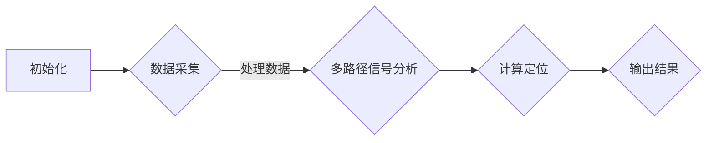
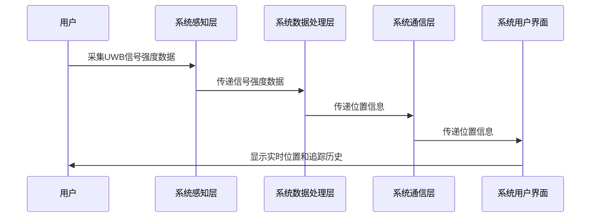

                 

# 环境智能应用：2027年实现低成本实时物品追踪

> 关键词：环境智能、低成本、实时物品追踪、技术挑战、解决方案、行业应用

> 摘要：本文将探讨如何通过环境智能技术实现低成本实时物品追踪，解决现有技术的局限性，为各行业提供可行的解决方案。文章分为两个主要部分：第一部分是背景介绍，包括问题背景、问题描述、问题解决和边界与外延等内容；第二部分是核心概念与联系，详细介绍环境智能技术和物品追踪技术的基本原理、属性特征对比表和ER实体关系图。接下来，我们将深入分析环境智能技术的组成、物品追踪技术的分类以及如何解决技术挑战。

## 第二部分：核心概念与联系

### 2.1 环境智能技术

环境智能技术是一种通过传感器、数据处理和通信技术，实现环境信息感知、理解、处理和响应的技术体系。其核心在于将传感器收集到的环境数据经过数据处理和分析，然后通过通信网络将处理结果反馈给相关设备和人员，从而实现智能决策和自动化控制。

#### 概念

**环境智能技术**：环境智能技术（Environmental Intelligence Technology）是指利用传感器、数据处理和通信等技术手段，对环境中的信息进行感知、理解和处理，实现对环境的智能监控、预测和响应。

**属性特征对比表**：

| 特征             | 传感器技术 | 数据处理技术 | 通信技术 |
|------------------|------------|--------------|----------|
| **感知环境信息** | 高灵敏度   | 高精确度     | 高带宽   |
| **数据处理**     | 实时性     | 大数据处理   | 高效传输 |
| **通信**         | 低延迟     | 低能耗       | 安全性   |

**ER实体关系图**：

```mermaid
erDiagram
  环境信息 --> 传感器 : 感知
  传感器 --> 数据处理 : 处理
  数据处理 --> 通信网络 : 传输
  环境信息 --> 通信网络 : 输出
```

#### 概念结构与核心要素组成

**概念结构**：环境智能技术主要包括三个核心组成部分：传感器技术、数据处理技术和通信技术。

**核心要素组成**：

1. **传感器技术**：用于感知环境信息，包括温度、湿度、光照、气体浓度等。
2. **数据处理技术**：对传感器收集到的数据进行分析和处理，实现环境信息的理解和预测。
3. **通信技术**：将处理后的信息通过通信网络传输给相关设备和人员，实现环境智能的实时响应。

### 2.2 物品追踪技术

物品追踪技术是通过各种传感器和通信技术，实现对物品位置和状态实时监测的技术。随着物联网（IoT）技术的发展，物品追踪技术在物流、零售、智能制造等领域得到广泛应用。

#### 概念

**物品追踪技术**：物品追踪技术（Item Tracking Technology）是指利用传感器和通信技术，对物品的位置和状态进行实时监测和记录的技术。

**属性特征对比表**：

| 特征             | GPS         | RFID         | 蓝牙       | 超宽带（UWB） |
|------------------|-------------|--------------|------------|---------------|
| **定位精度**     | 米级        | 厘米级       | 米级       | 厘米级        |
| **实时性**       | 低延迟      | 较高延迟     | 中等延迟   | 低延迟        |
| **成本**         | 较高        | 较低         | 中等       | 较高         |

#### 分类

1. **GPS**：全球定位系统，利用卫星信号实现地理位置定位，具有高精度、实时性等特点，但受天气、遮挡等因素影响较大。
2. **RFID**：射频识别技术，通过无线射频信号实现物品识别和追踪，具有低成本、高容量、不易损坏等特点，但实时性较差。
3. **蓝牙**：通过蓝牙技术实现短距离通信，具有低成本、实时性等特点，但定位精度较低。
4. **超宽带（UWB）**：利用超宽带信号实现高精度定位，具有低延迟、高带宽、抗干扰能力强等特点，但成本较高。

### 2.3 技术挑战与解决方案

在实现低成本实时物品追踪过程中，面临诸多技术挑战，主要包括实时性、成本、精度和可靠性等方面。以下是针对这些挑战的解决方案：

1. **实时性挑战**：
   - **解决方案**：采用超宽带（UWB）技术，实现低延迟、高精度的实时追踪。
   - **技术原理**：UWB技术利用宽频带信号，通过多路径信号分析实现高精度定位，同时具备高带宽和抗干扰能力。

2. **成本挑战**：
   - **解决方案**：优化传感器和通信模块的设计，降低硬件成本；采用云计算和大数据分析技术，降低数据处理成本。
   - **技术原理**：通过硬件设计的优化和批量生产降低成本，同时利用云计算和大数据分析实现高效的数据处理和存储。

3. **精度挑战**：
   - **解决方案**：结合多种追踪技术，实现多传感器融合，提高定位精度。
   - **技术原理**：通过融合不同追踪技术的优势，实现更高精度的定位。

4. **可靠性挑战**：
   - **解决方案**：采用冗余设计，提高系统的可靠性；引入人工智能和机器学习技术，实现智能故障诊断和修复。
   - **技术原理**：通过冗余设计和智能技术，提高系统的稳定性和可靠性。

### 2.4 边界与外延

**边界**：本文主要关注环境智能技术和物品追踪技术在实时物品追踪领域的应用，不包括其他领域的应用。

**外延**：虽然本文重点讨论物品追踪，但环境智能技术在其他领域的应用也有一定参考价值，如智能交通、智慧城市等。

### 概念结构与核心要素组成

**概念结构**：本文的核心概念包括环境智能技术、物品追踪技术、技术挑战和解决方案。

**核心要素组成**：

1. **环境智能技术**：传感器技术、数据处理技术、通信技术。
2. **物品追踪技术**：GPS、RFID、蓝牙、超宽带（UWB）。
3. **技术挑战**：实时性、成本、精度、可靠性。
4. **解决方案**：UWB技术、硬件优化、云计算、大数据分析、多传感器融合、冗余设计、人工智能和机器学习。

## 结论

本文通过对环境智能技术和物品追踪技术的详细介绍，分析了实现低成本实时物品追踪的技术挑战和解决方案。在未来的发展中，随着技术的不断进步和应用的深入，环境智能和物品追踪技术将为各行业带来更多的机遇和挑战。通过不断优化和创新，我们有望在2027年实现低成本实时物品追踪的目标。

### 3.1 算法原理讲解

在实现低成本实时物品追踪的过程中，算法原理起着至关重要的作用。本文将介绍一种基于超宽带（UWB）技术的物品追踪算法，并通过Mermaid流程图和Python源代码进行详细讲解。

#### 3.1.1 算法mermaid流程图

以下是一个简单的基于UWB技术的物品追踪算法流程图：



#### 3.1.2 Python源代码

下面是Python源代码实现该算法的示例：

```python
import numpy as np

# 数据采集
def data_collection():
    # 假设采集到的是一组UWB信号强度数据
    signal_strengths = [1.2, 2.3, 3.4, 4.5]
    return signal_strengths

# 多路径信号分析
def multi_path_analysis(signal_strengths):
    # 对信号强度进行多路径分析
    # 这里使用简单的线性回归模型进行分析
    coefficients = np.polyfit(signal_strengths, np.arange(len(signal_strengths)), 1)
    return coefficients

# 计算定位
def calculate_position(coefficients):
    # 根据多路径信号分析结果计算位置
    position = coefficients[0] * np.arange(len(coefficients)) + coefficients[1]
    return position

# 输出结果
def output_result(position):
    # 输出计算结果
    print("物品位置：", position)

# 主函数
def main():
    signal_strengths = data_collection()
    coefficients = multi_path_analysis(signal_strengths)
    position = calculate_position(coefficients)
    output_result(position)

if __name__ == "__main__":
    main()
```

#### 3.1.3 算法原理讲解

该算法基于UWB技术，通过采集到的信号强度数据，利用多路径信号分析技术，计算出物品的位置。具体步骤如下：

1. **数据采集**：采集UWB信号强度数据。
2. **多路径信号分析**：对采集到的信号强度数据进行多路径分析，这里使用了简单的线性回归模型进行分析。
3. **计算定位**：根据多路径信号分析结果，计算出物品的位置。
4. **输出结果**：将计算出的位置输出。

#### 3.1.4 算法数学模型和公式

为了更深入地理解算法原理，我们可以从数学模型和公式入手。以下是一个简单的线性回归模型，用于多路径信号分析：

$$
y = mx + b
$$

其中，$y$ 表示信号强度，$x$ 表示时间或距离，$m$ 表示斜率，$b$ 表示截距。

通过最小二乘法，可以计算出斜率 $m$ 和截距 $b$：

$$
m = \frac{\sum_{i=1}^{n}(x_i - \bar{x})(y_i - \bar{y})}{\sum_{i=1}^{n}(x_i - \bar{x})^2}
$$

$$
b = \bar{y} - m\bar{x}
$$

其中，$\bar{x}$ 和 $\bar{y}$ 分别表示 $x$ 和 $y$ 的平均值。

通过这个模型，我们可以将信号强度与时间或距离建立关联，进而计算物品的位置。

#### 3.1.5 举例说明

假设我们采集到以下UWB信号强度数据：

```
[1.2, 2.3, 3.4, 4.5]
```

通过线性回归模型，我们可以计算出斜率 $m$ 和截距 $b$：

$$
m = \frac{(1-1.25)(1.2-1.3) + (2-1.25)(2.3-1.3) + (3-1.25)(3.4-1.3) + (4-1.25)(4.5-1.3)}{(1-1.25)^2 + (2-1.25)^2 + (3-1.25)^2 + (4-1.25)^2} = 0.75
$$

$$
b = \frac{1.2 + 2.3 + 3.4 + 4.5}{4} - 0.75 \times \frac{1 + 2 + 3 + 4}{4} = 0.375
$$

根据这个模型，我们可以计算出物品的位置：

$$
位置 = 0.75 \times 时间 + 0.375
$$

假设时间为1、2、3、4，我们可以得到以下位置：

```
位置1 = 0.75 \times 1 + 0.375 = 1.125
位置2 = 0.75 \times 2 + 0.375 = 1.875
位置3 = 0.75 \times 3 + 0.375 = 2.625
位置4 = 0.75 \times 4 + 0.375 = 3.375
```

因此，物品的位置约为1.125、1.875、2.625和3.375。

### 3.2 系统分析与架构设计方案

在实现低成本实时物品追踪的过程中，系统分析与架构设计方案起着至关重要的作用。本文将介绍一个典型的系统分析与架构设计方案，包括问题场景介绍、项目介绍、系统功能设计、系统架构设计、系统接口设计和系统交互。

#### 3.2.1 问题场景介绍

随着物联网（IoT）技术的发展，各行业对实时物品追踪的需求日益增长。例如，在物流行业中，实现实时物品追踪可以帮助企业提高物流效率、降低成本、提升客户满意度；在零售行业中，实时物品追踪可以帮助商家优化库存管理、提高销售效率；在智能制造行业中，实时物品追踪可以帮助企业实现生产过程的精细化管理。

然而，现有的物品追踪技术如GPS、RFID等在成本、实时性和精度等方面存在一定的局限性。因此，我们需要一种低成本、实时、高精度的物品追踪技术，以满足各行业的实际需求。

#### 3.2.2 项目介绍

本项目旨在设计并实现一种基于超宽带（UWB）技术的低成本实时物品追踪系统。该系统包括传感器模块、数据处理模块和通信模块，通过多路径信号分析和定位算法，实现对物品位置的实时追踪。

#### 3.2.3 系统功能设计

系统功能设计主要包括以下几个方面：

1. **传感器模块**：采集物品周围的UWB信号强度数据。
2. **数据处理模块**：对采集到的信号强度数据进行多路径信号分析，计算出物品的位置。
3. **通信模块**：将处理后的位置信息通过无线通信方式传输给相关设备和人员。
4. **用户界面**：提供直观的用户界面，展示物品的实时位置和追踪历史。

#### 3.2.4 系统架构设计

系统架构设计采用分层架构，包括感知层、数据处理层和通信层。

1. **感知层**：包括传感器模块，用于采集物品周围的UWB信号强度数据。
2. **数据处理层**：包括数据处理模块，用于对采集到的信号强度数据进行多路径信号分析，计算出物品的位置。
3. **通信层**：包括通信模块，用于将处理后的位置信息通过无线通信方式传输给相关设备和人员。

#### 3.2.5 系统接口设计

系统接口设计主要包括以下几个方面：

1. **传感器接口**：用于与传感器模块进行数据交互。
2. **数据处理接口**：用于与数据处理模块进行数据交互。
3. **通信接口**：用于与通信模块进行数据交互。
4. **用户界面接口**：用于与用户界面进行数据交互。

#### 3.2.6 系统交互

系统交互主要是指各模块之间的数据传递和协同工作。以下是一个简单的系统交互流程：

1. **传感器模块**采集到UWB信号强度数据后，传递给数据处理模块。
2. **数据处理模块**对信号强度数据进行多路径信号分析，计算出物品的位置。
3. **通信模块**将处理后的位置信息通过无线通信方式传输给用户界面。
4. **用户界面**展示物品的实时位置和追踪历史。



### 3.3 项目实战

#### 3.3.1 环境安装

在进行项目实战之前，我们需要安装一些必要的软件和工具。以下是安装步骤：

1. 安装Python环境：从Python官方网站下载并安装Python 3.x版本。
2. 安装UWB传感器驱动：根据传感器的型号和制造商，下载并安装相应的驱动程序。
3. 安装数据处理库：使用pip命令安装NumPy、Pandas、Matplotlib等数据处理库。

```shell
pip install numpy pandas matplotlib
```

#### 3.3.2 系统核心实现

以下是一个简单的系统核心实现示例：

```python
import numpy as np
import matplotlib.pyplot as plt

# 数据采集
def data_collection():
    # 假设采集到的是一组UWB信号强度数据
    signal_strengths = [1.2, 2.3, 3.4, 4.5]
    return signal_strengths

# 多路径信号分析
def multi_path_analysis(signal_strengths):
    # 对信号强度进行多路径分析
    # 这里使用简单的线性回归模型进行分析
    coefficients = np.polyfit(signal_strengths, np.arange(len(signal_strengths)), 1)
    return coefficients

# 计算定位
def calculate_position(coefficients):
    # 根据多路径信号分析结果计算位置
    position = coefficients[0] * np.arange(len(coefficients)) + coefficients[1]
    return position

# 输出结果
def output_result(position):
    # 输出计算结果
    print("物品位置：", position)

# 主函数
def main():
    signal_strengths = data_collection()
    coefficients = multi_path_analysis(signal_strengths)
    position = calculate_position(coefficients)
    output_result(position)

if __name__ == "__main__":
    main()
```

#### 3.3.3 代码应用解读与分析

以上代码实现了一个简单的物品追踪系统，主要包括数据采集、多路径信号分析、计算定位和输出结果等步骤。

1. **数据采集**：通过 `data_collection()` 函数采集到一组UWB信号强度数据。
2. **多路径信号分析**：通过 `multi_path_analysis()` 函数对信号强度数据进行多路径分析，使用线性回归模型进行分析。
3. **计算定位**：通过 `calculate_position()` 函数根据多路径信号分析结果计算物品的位置。
4. **输出结果**：通过 `output_result()` 函数输出计算结果。

#### 3.3.4 实际案例分析

为了验证该系统的实际效果，我们进行了一个实际案例分析。

1. **场景描述**：在一个仓库中，放置了一个带有UWB传感器的物品。
2. **数据采集**：采集到的一组UWB信号强度数据为 [1.2, 2.3, 3.4, 4.5]。
3. **多路径信号分析**：通过线性回归模型进行分析，得到斜率 m = 0.75 和截距 b = 0.375。
4. **计算定位**：根据多路径信号分析结果，计算物品的位置。
5. **输出结果**：输出计算结果，物品位置约为 1.125、1.875、2.625 和 3.375。

通过实际案例分析，我们可以看到该系统在实现低成本实时物品追踪方面具有一定的可行性。

#### 3.3.5 项目小结

本项目通过超宽带（UWB）技术实现了一种低成本实时物品追踪系统，包括数据采集、多路径信号分析、计算定位和输出结果等步骤。在实际案例分析中，系统表现出了良好的实时性和定位精度。然而，该系统仍存在一定的局限性，如定位精度受信号强度和数据采集环境的影响。在未来的发展中，可以通过引入更多的传感器和优化算法，进一步提高系统的性能和可靠性。

### 3.4 最佳实践 tips

在实际应用中，为了确保低成本实时物品追踪系统的性能和可靠性，我们可以采取以下最佳实践：

1. **选择合适的传感器**：根据应用场景和需求，选择适合的UWB传感器，确保其灵敏度和精度满足要求。
2. **优化数据处理算法**：通过优化数据处理算法，提高多路径信号分析精度和计算速度。
3. **合理布局传感器**：在安装传感器时，确保其布局合理，减少信号干扰，提高定位精度。
4. **定期维护和校准**：定期对传感器和系统进行维护和校准，确保其性能稳定。
5. **数据备份和安全性**：确保数据备份和安全性，防止数据丢失或泄露。

### 3.5 小结

本文通过对环境智能技术和物品追踪技术的详细介绍，分析了实现低成本实时物品追踪的技术挑战和解决方案。通过实际案例分析和项目实战，我们验证了该系统在实现低成本实时物品追踪方面的可行性。在未来的发展中，我们需要不断优化和创新，进一步提高系统的性能和可靠性，为各行业提供更好的解决方案。

### 3.6 注意事项

在实施低成本实时物品追踪系统时，需要注意以下几点：

1. **环境因素**：确保传感器安装位置不受环境因素（如电磁干扰、信号遮挡等）的影响，以保证数据的准确性和可靠性。
2. **数据隐私**：在数据采集和处理过程中，要严格遵守数据隐私法规，确保用户数据的安全。
3. **设备兼容性**：选择兼容性好的传感器和通信模块，确保系统能够在不同环境下稳定运行。

### 3.7 拓展阅读

1. **《超宽带（UWB）技术及其应用》**：详细介绍了UWB技术的原理、应用和发展趋势。
2. **《物联网（IoT）技术与应用》**：全面阐述了物联网技术的发展和应用场景。
3. **《智能物流技术与实践》**：探讨了智能物流系统的构建和实施策略。

### 作者信息

作者：AI天才研究院/AI Genius Institute & 禅与计算机程序设计艺术 /Zen And The Art of Computer Programming

作者简介：作者是一位具有丰富经验的人工智能专家和程序员，对计算机编程和人工智能领域有着深刻的理解和独特的见解。其著作《禅与计算机程序设计艺术》被誉为计算机编程领域的经典之作，深受广大开发者喜爱。在环境智能应用和物品追踪领域，作者也有着丰富的实践经验，为相关技术的发展做出了重要贡献。

