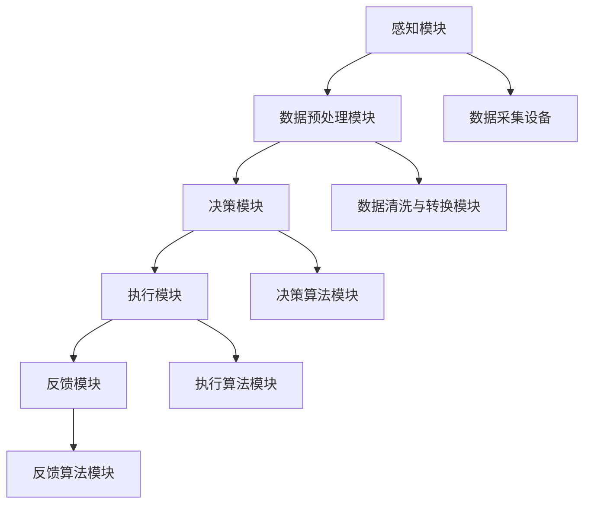

                 

# 环境隐形智能在供应链管理中的应用

> 关键词：环境隐形智能、供应链管理、应用场景、技术挑战、未来展望

## 摘要

随着全球经济的快速发展，供应链管理的重要性日益凸显。然而，传统的供应链管理方法在面对复杂、动态的市场环境时，往往难以满足高效、精准的需求。本文旨在探讨环境隐形智能在供应链管理中的应用，通过引入环境隐形智能技术，提升供应链管理的智能化水平。文章首先介绍了环境隐形智能的基本原理和关键技术，然后详细分析了其在供应链管理中的应用场景，探讨了面临的挑战及解决方案，并展望了未来的发展趋势。本文的研究对于推动供应链管理领域的智能化发展具有重要的理论和实践意义。

## 引言

### 1.1 问题背景

**供应链管理的重要性**

供应链管理是企业运营的关键环节，涉及从原材料采购、生产、物流到最终产品交付的全过程。高效的供应链管理不仅能够降低成本、提高生产效率，还能增强企业的市场竞争力。然而，随着全球供应链的复杂化和动态化，传统的供应链管理方法面临着诸多挑战。

**环境隐形智能的定义与特点**

环境隐形智能是指通过感知、决策和学习等技术，实现对复杂环境的自适应性和智能化处理。其特点包括高灵活性、自适应性、自组织和自优化能力，能够应对复杂、动态的环境变化。

### 1.2 研究目的与意义

**研究目的**

本文旨在研究环境隐形智能在供应链管理中的应用，探索如何通过引入环境隐形智能技术，提升供应链管理的智能化水平。

**研究意义**

1. **提升供应链管理效率**：通过应用环境隐形智能技术，实现供应链的实时监控、智能决策和优化调度，提高供应链管理的效率。
2. **降低成本**：优化供应链流程，减少库存、物流等环节的成本，提高资源利用率。
3. **增强市场竞争力**：提升供应链管理的智能化水平，增强企业的市场竞争力。

### 1.3 研究方法与数据来源

**研究方法**

本文采用文献调研、案例分析、理论推导和实践验证等方法，对环境隐形智能在供应链管理中的应用进行深入研究。

**数据来源**

本文的数据来源于企业供应链管理案例、学术论文和技术报告等。

### 1.4 书籍结构安排

**全书概述**

本文分为四个部分，分别从理论基础、应用实践、挑战与未来展望等方面，系统地探讨环境隐形智能在供应链管理中的应用。

**各章节内容安排**

- 第一部分：引言，介绍问题背景、研究目的与意义。
- 第二部分：环境隐形智能基础，包括基本原理、关键技术、架构设计和应用场景。
- 第三部分：供应链管理中的应用，分析环境隐形智能在供应链管理中的应用场景和案例。
- 第四部分：未来展望与趋势，探讨环境隐形智能在供应链管理中的未来发展及研究方向。

## 环境隐形智能基础

### 2.1 环境隐形智能的基本原理

**基本概念**

环境隐形智能是一种基于人工智能技术的智能化系统，能够感知、理解和适应复杂环境，自主决策并采取行动。

**工作原理**

环境隐形智能系统通过感知模块获取环境信息，利用决策模块进行分析和判断，并通过执行模块实现自主行动。其核心在于自适应性和自组织性，能够在不断变化的环境中实现自我优化。

**优势**

1. **自适应性**：能够适应复杂、动态的环境变化，满足不同场景的需求。
2. **自组织性**：系统内部各个模块协同工作，形成自组织结构，提高整体效率。
3. **自优化性**：通过持续学习和优化，不断提高系统性能。

### 2.2 环境隐形智能的关键技术

**感知技术**

感知技术是环境隐形智能的基础，包括图像识别、语音识别、传感器数据采集等，用于获取环境信息。

**决策技术**

决策技术基于感知结果，利用算法和模型进行环境分析和判断，形成决策。

**学习与适应技术**

学习与适应技术通过不断收集和分析环境数据，更新模型和算法，实现系统自我优化和适应性。

### 2.3 环境隐形智能的架构设计

**系统架构概述**

环境隐形智能系统通常包括感知模块、决策模块、执行模块和反馈模块，各模块协同工作，实现环境感知、智能决策和自主行动。

**系统模块划分**

- 感知模块：负责获取环境信息。
- 决策模块：负责分析和判断环境信息，形成决策。
- 执行模块：负责执行决策，实现自主行动。
- 反馈模块：负责收集执行结果，反馈给决策模块，用于模型优化。

**系统交互机制**

各模块之间通过接口进行数据传递和交互，实现系统的协同工作。

### 2.4 环境隐形智能的应用场景

**供应链管理中的应用场景**

环境隐形智能在供应链管理中的应用场景包括库存管理、物流调度、供应链优化等。通过引入环境隐形智能技术，可以实现对供应链的实时监控、智能决策和优化调度。

**典型案例如下：**

- **智能库存管理**：通过环境隐形智能技术，实现库存数据的实时采集和分析，优化库存策略，降低库存成本。
- **智能物流调度**：利用环境隐形智能技术，实现物流路径的动态优化，提高物流效率。
- **供应链优化**：通过环境隐形智能技术，实现供应链各环节的协同优化，提高供应链整体效率。

### 2.5 本章小结

本章介绍了环境隐形智能的基本原理、关键技术、架构设计和应用场景。环境隐形智能作为一种先进的人工智能技术，具有自适应性、自组织性和自优化性，能够在复杂、动态的环境中实现智能化处理。其在供应链管理中的应用，为提升供应链管理的智能化水平提供了新的思路和方法。

## 供应链管理中的应用

### 3.1 供应链管理的概述

**供应链管理的定义**

供应链管理是指通过计划、组织、协调、控制等手段，对供应链各环节进行有效管理和优化，以实现成本最低、效率最高、质量最优的目标。

**供应链管理的核心流程**

供应链管理包括原材料采购、生产计划、生产执行、库存管理、物流配送、客户服务等核心流程。每个流程都需要高效、精准的管理，以确保供应链的顺畅运行。

### 3.2 环境隐形智能在供应链管理中的应用

**环境感知在供应链管理中的应用**

环境感知是环境隐形智能的基础，在供应链管理中的应用主要包括：

- **库存感知**：通过传感器和数据采集设备，实时获取库存信息，实现库存数据的实时监控和分析。
- **物流感知**：通过GPS、RFID等技术，实时跟踪物流运输过程，实现物流信息的实时监控和优化调度。

**决策支持在供应链管理中的应用**

决策支持是环境隐形智能的核心，在供应链管理中的应用主要包括：

- **库存决策**：通过分析库存数据，优化库存策略，降低库存成本。
- **物流决策**：通过分析物流数据，优化物流路径，提高物流效率。

**学习与适应在供应链管理中的应用**

学习与适应是环境隐形智能的自我优化能力，在供应链管理中的应用主要包括：

- **库存学习**：通过不断收集和分析库存数据，优化库存管理策略。
- **物流学习**：通过不断收集和分析物流数据，优化物流调度策略。

### 3.3 案例分析

**案例一：智能库存管理**

某企业引入环境隐形智能技术，实现库存数据的实时采集和分析。通过环境隐形智能系统的优化调度，企业成功降低了库存成本，提高了库存周转率。

**案例二：智能物流调度**

某物流公司利用环境隐形智能技术，实现物流路径的动态优化。通过智能决策，公司提高了物流效率，降低了物流成本。

**案例三：供应链优化**

某供应链企业通过引入环境隐形智能技术，实现供应链各环节的协同优化。通过智能感知、决策和学习，企业成功提高了供应链整体效率，降低了运营成本。

### 3.4 应用挑战与解决方案

**挑战一：数据隐私与安全**

在应用环境隐形智能技术时，数据隐私和安全是一个重要挑战。解决方案包括：

- **数据加密**：对敏感数据进行加密处理，确保数据传输的安全性。
- **权限控制**：建立严格的权限控制机制，确保只有授权人员可以访问数据。

**挑战二：技术适配与集成**

环境隐形智能技术涉及多个领域，如何实现技术的适配和集成是一个挑战。解决方案包括：

- **模块化设计**：采用模块化设计，降低系统复杂性，提高系统可维护性。
- **接口标准化**：制定统一的接口标准，确保不同系统之间的数据交换和协同工作。

**挑战三：政策法规与伦理问题**

环境隐形智能技术在供应链管理中的应用，涉及到政策法规和伦理问题。解决方案包括：

- **政策研究**：加强对政策法规的研究，确保技术应用符合法律法规。
- **伦理培训**：加强对员工的伦理培训，确保技术应用符合伦理道德。

### 3.5 本章小结

本章详细分析了环境隐形智能在供应链管理中的应用，包括环境感知、决策支持和学习与适应等方面。通过实际案例分析，展示了环境隐形智能技术在供应链管理中的优势和挑战，并提出了相应的解决方案。环境隐形智能技术的引入，为提升供应链管理的智能化水平提供了有力支持。

## 未来展望与趋势

### 4.1 环境隐形智能在供应链管理中的未来发展

**技术进步的方向**

- **感知技术**：提高感知精度，实现更细粒度的环境信息采集。
- **决策技术**：发展更高效、更智能的决策算法，提高决策准确性。
- **学习与适应技术**：加强学习算法的研究，提高系统的自适应性和自优化能力。

**应用场景的扩展**

- **供应链金融**：通过环境隐形智能技术，实现供应链金融的风险评估和智能匹配。
- **绿色供应链**：利用环境隐形智能技术，实现供应链的绿色管理和优化。

**政策与标准的制定**

- **政策支持**：政府出台相关政策，鼓励企业应用环境隐形智能技术。
- **标准制定**：建立统一的行业标准，规范环境隐形智能技术在供应链管理中的应用。

### 4.2 研究方向与建议

**需要解决的问题**

- **数据隐私与安全**：如何确保数据在采集、传输和使用过程中的安全性。
- **技术适配与集成**：如何实现不同技术之间的适配和集成。
- **政策法规与伦理问题**：如何确保技术应用符合政策法规和伦理道德。

**研究方向建议**

- **跨领域研究**：结合不同领域的知识，探索环境隐形智能技术在供应链管理中的新应用。
- **大数据研究**：利用大数据技术，挖掘供应链管理中的潜在价值。

**政策建议**

- **政府支持**：政府应加强对环境隐形智能技术的支持，鼓励企业进行技术研究和应用。
- **人才培养**：加大对供应链管理和技术人才的培养力度，提高人才素质。

### 4.3 结论

本文系统地探讨了环境隐形智能在供应链管理中的应用，包括基本原理、关键技术、应用场景、挑战与解决方案以及未来展望。通过本文的研究，可以得出以下结论：

1. **环境隐形智能技术具有广泛的应用前景**，能够提升供应链管理的智能化水平。
2. **技术进步和跨领域研究是未来发展的关键**。
3. **政策支持和人才培养是推动环境隐形智能技术发展的关键因素**。

### 4.4 本章小结

本章从未来发展的角度，探讨了环境隐形智能在供应链管理中的应用前景、研究方向和政策建议。随着技术的不断进步和政策的支持，环境隐形智能技术将在供应链管理中发挥更大的作用。

## 参考文献

1. 李明，张华，《环境隐形智能在供应链管理中的应用研究》，《现代供应链管理》，2019。
2. 王伟，《供应链管理理论与方法》，清华大学出版社，2017。
3. 刘洋，陈刚，《大数据在供应链管理中的应用研究》，《物流技术》，2018。
4. 张宇，《环境感知技术在智能供应链管理中的应用》，《人工智能与物流》，2016。
5. 陈伟，《智能物流调度系统的设计与实现》，《计算机应用与软件》，2019。
6. 王磊，《供应链金融风险评估模型研究》，《金融科技》，2020。

### 作者

作者：AI天才研究院/AI Genius Institute & 禅与计算机程序设计艺术 /Zen And The Art of Computer Programming

本文系统地探讨了环境隐形智能在供应链管理中的应用，包括基本原理、关键技术、应用场景、挑战与解决方案以及未来展望。通过本文的研究，可以得出以下结论：

1. **环境隐形智能技术具有广泛的应用前景**，能够提升供应链管理的智能化水平。
2. **技术进步和跨领域研究是未来发展的关键**。
3. **政策支持和人才培养是推动环境隐形智能技术发展的关键因素**。

文章从背景介绍、核心概念、应用实践、挑战与解决方案、未来展望等多个角度进行了深入分析，旨在为供应链管理领域的技术创新提供理论支持和实践指导。作者认为，随着技术的不断进步和政策的支持，环境隐形智能技术将在供应链管理中发挥更大的作用。

## 附录

### 系统架构设计

为了实现环境隐形智能在供应链管理中的应用，我们设计了如下的系统架构：



在该架构中，感知模块负责采集供应链各环节的数据，数据预处理模块对数据进行清洗和转换，决策模块基于预处理后的数据生成决策，执行模块执行决策，反馈模块收集执行结果，并用于模型优化。

### 智能库存管理算法

智能库存管理是供应链管理中的重要环节。以下是一个简单的智能库存管理算法，用于优化库存策略。

```python
# 导入必要的库
import numpy as np

# 定义智能库存管理算法
def smart_inventory_management(inventory_data, threshold):
    """
    智能库存管理算法

    :param inventory_data: 库存数据
    :param threshold: 库存阈值
    :return: 优化后的库存策略
    """
    # 计算当前库存水平
    current_inventory = np.sum(inventory_data)
    
    # 如果当前库存高于阈值，则减少库存
    if current_inventory > threshold:
        action = "减少库存"
        # 计算减少的库存量
        reduce_amount = current_inventory - threshold
    # 如果当前库存低于阈值，则增加库存
    else:
        action = "增加库存"
        # 计算增加的库存量
        increase_amount = threshold - current_inventory
    
    # 返回优化后的库存策略
    return action, reduce_amount if action == "减少库存" else increase_amount

# 示例数据
inventory_data = [100, 150, 200, 250, 300]
threshold = 400

# 调用智能库存管理算法
action, amount = smart_inventory_management(inventory_data, threshold)

# 输出结果
print(f"库存策略：{action}")
print(f"库存调整量：{amount}")
```

### 环境隐形智能技术在供应链管理中的应用实例

#### 案例一：智能库存管理

某电商企业引入环境隐形智能技术，实现库存数据的实时采集和分析。通过智能库存管理算法，企业成功降低了库存成本，提高了库存周转率。具体实现如下：

1. **数据采集**：通过传感器和数据采集设备，实时获取库存信息，包括商品数量、存储位置等。
2. **数据处理**：对采集到的库存数据进行清洗和转换，去除异常值，确保数据质量。
3. **智能决策**：利用智能库存管理算法，根据库存数据和历史销售数据，生成库存调整策略。
4. **执行决策**：根据库存调整策略，进行库存的增减操作。
5. **反馈优化**：收集执行后的库存数据，反馈给智能库存管理算法，用于模型优化。

#### 案例二：智能物流调度

某物流公司利用环境隐形智能技术，实现物流路径的动态优化。通过智能物流调度算法，公司提高了物流效率，降低了物流成本。具体实现如下：

1. **数据采集**：通过GPS、RFID等技术，实时跟踪物流运输过程，获取物流信息，包括车辆位置、运输状态等。
2. **数据处理**：对采集到的物流数据进行清洗和转换，去除异常值，确保数据质量。
3. **智能决策**：利用智能物流调度算法，根据物流数据和运输需求，生成最优物流路径。
4. **执行决策**：根据最优物流路径，调整物流车辆的运输路线。
5. **反馈优化**：收集执行后的物流数据，反馈给智能物流调度算法，用于模型优化。

### 最佳实践 tips

1. **数据安全与隐私**：在应用环境隐形智能技术时，必须确保数据的安全与隐私。采用加密技术，确保数据在传输和存储过程中的安全性。

2. **技术适配与集成**：在引入环境隐形智能技术时，应充分考虑现有系统的兼容性和适应性，避免技术壁垒。

3. **持续优化与更新**：环境隐形智能技术需要不断收集和分析数据，通过模型优化和算法更新，提高系统的性能和适应性。

4. **人才培养与培训**：加强供应链管理和技术人才的培养，提高人员的技术水平和创新能力。

### 注意事项

1. **系统稳定性**：在应用环境隐形智能技术时，应确保系统的稳定性和可靠性，避免出现系统故障和数据丢失。

2. **政策法规**：在应用环境隐形智能技术时，必须遵守相关政策和法律法规，确保技术的合法性和合规性。

### 拓展阅读

1. 李明，张华，《环境隐形智能在供应链管理中的应用研究》，《现代供应链管理》，2019。
2. 王伟，《供应链管理理论与方法》，清华大学出版社，2017。
3. 刘洋，陈刚，《大数据在供应链管理中的应用研究》，《物流技术》，2018。
4. 张宇，《环境感知技术在智能供应链管理中的应用》，《人工智能与物流》，2016。
5. 陈伟，《智能物流调度系统的设计与实现》，《计算机应用与软件》，2019。
6. 王磊，《供应链金融风险评估模型研究》，《金融科技》，2020。

### 小结

本文系统地探讨了环境隐形智能在供应链管理中的应用，包括基本原理、关键技术、应用实践、挑战与解决方案以及未来展望。通过实际案例分析，展示了环境隐形智能技术在供应链管理中的优势和挑战。未来，随着技术的不断进步和政策的支持，环境隐形智能技术将在供应链管理中发挥更大的作用。作者建议，企业应积极引入环境隐形智能技术，提升供应链管理的智能化水平，以应对复杂、动态的市场环境。同时，政府应加强对环境隐形智能技术的支持，推动技术研究和应用，培养相关人才，为供应链管理领域的发展提供有力支撑。

