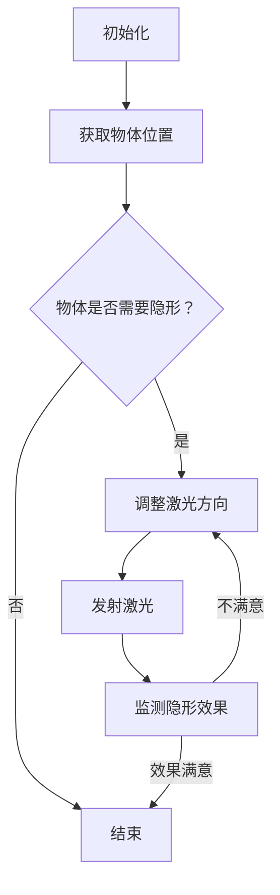
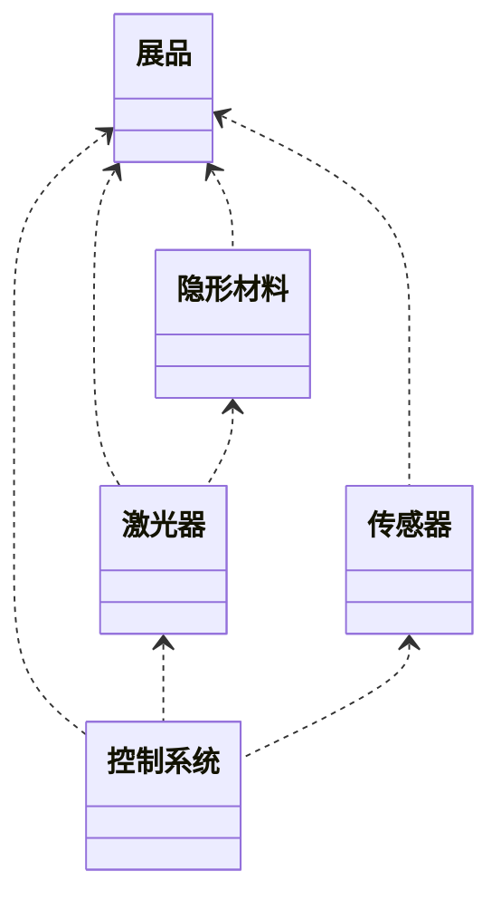
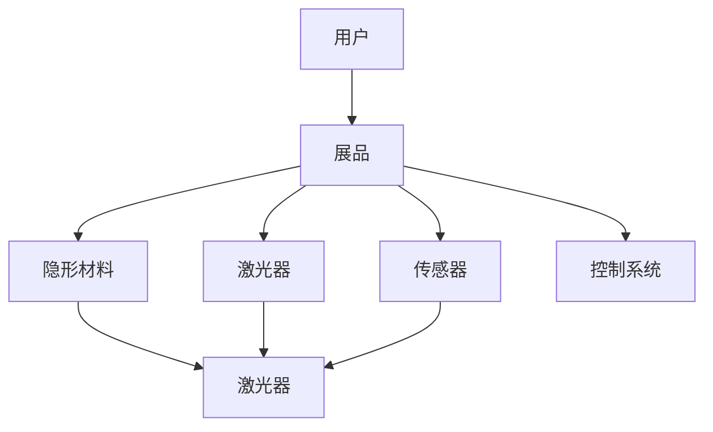
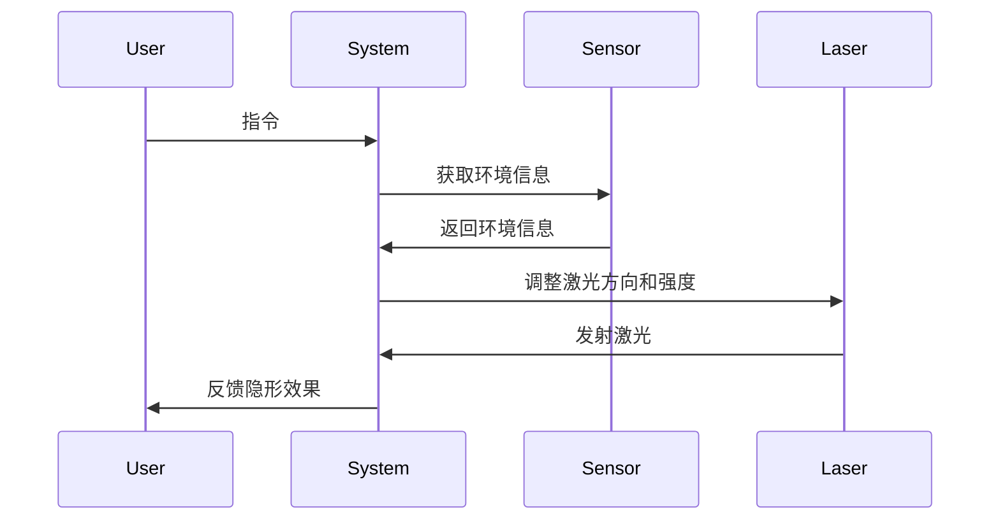

                 

# 环境隐形智能在日常生活中的融入

## 关键词

- 环境隐形智能
- 激光技术
- 传感器技术
- 算法原理
- 系统设计与实现
- 项目实战
- 最佳实践

## 摘要

环境隐形智能作为一种前沿技术，正逐步融入我们的日常生活。本文旨在探讨环境隐形智能的概念、技术原理、系统设计与实现，以及其在实际应用中的挑战与机遇。通过对环境隐形智能的深入分析，本文将揭示其背后的算法原理，并提供实际项目实战经验，以期为读者提供全面的了解和实用的指导。

## 第一部分：背景介绍

### 第1章：环境隐形智能概述

#### 1.1 问题背景与定义

环境隐形智能，顾名思义，是指通过技术手段使物体或人在环境中实现隐形。这一概念源于军事和科幻领域，但随着科技的进步，其应用范围已扩展至日常生活。环境隐形智能的定义主要包括以下几个方面：

1. **隐形材料**：利用特殊的材料或结构，使物体在特定波长下不反射或吸收光线，从而达到隐形的效果。
2. **激光技术**：通过激光的精准控制，实现对物体形态和环境的精确调控，实现隐形效果。
3. **传感器技术**：利用各种传感器获取环境信息，为环境隐形智能提供数据支持。

#### 1.2 问题描述

当前，环境隐形智能在日常生活中的应用仍处于初级阶段。主要面临以下挑战：

1. **技术成熟度**：尽管已有一些研究成果，但环境隐形智能的技术成熟度仍需提升，尤其在实用性、可靠性和成本方面。
2. **用户体验**：环境隐形智能的体验尚未达到广泛普及的程度，用户对其接受度和满意度有待提高。

#### 1.3 问题解决

针对上述问题，我们可以从以下几个方面着手解决：

1. **技术创新**：继续推进隐形材料、激光技术和传感器技术的研究，提升技术水平。
2. **用户体验优化**：通过用户调研和反馈，不断优化环境隐形智能的应用场景和交互设计，提高用户体验。
3. **政策支持**：政府和企业加大对环境隐形智能的研发和应用支持，推动技术产业化进程。

#### 1.4 边界与外延

环境隐形智能的应用领域广泛，包括但不限于以下几个方面：

1. **军事领域**：用于军事伪装、侦察和防御等。
2. **娱乐领域**：应用于虚拟现实、游戏等。
3. **日常生活**：如智能家居、安防监控等。

### 第2章：环境隐形智能的核心概念与联系

#### 2.1 核心概念

环境隐形智能的核心概念包括隐形材料、激光技术和传感器技术。以下是对这些核心概念的详细解释：

1. **隐形材料**：隐形材料是一种能够使物体在特定波长下不反射或吸收光线的材料。通过设计特殊的结构，使光线在穿过物体时发生偏折，从而达到隐形效果。
2. **激光技术**：激光技术是一种利用激光的高能量、高方向性和高单色性等特点，实现对物体形态和环境的精确调控的技术。通过控制激光的强度、方向和频率，可以实现对物体隐形效果的控制。
3. **传感器技术**：传感器技术是一种利用传感器获取环境信息的的技术。通过感知温度、湿度、光线等环境因素，可以为环境隐形智能提供实时数据支持。

#### 2.2 概念属性特征对比表格

以下是对隐形材料、激光技术和传感器技术的属性特征进行对比的表格：

| 特征 | 隐形材料 | 激光技术 | 传感器技术 |
| ---- | ---- | ---- | ---- |
| 工作原理 | 材料反射和折射 | 光的传播和控制 | 感知和测量 |
| 成本 | 较高 | 较高 | 较低 |
| 成熟度 | 初级 | 初级 | 成熟 |
| 应用领域 | 军事、娱乐、日常生活 | 军事、工业、娱乐 | 各领域 |

#### 2.3 ER实体关系图架构

为了更好地理解环境隐形智能系统，我们可以绘制一个ER实体关系图。该图包括以下实体：

1. **物体**：表示需要实现隐形的目标。
2. **隐形材料**：用于实现物体隐形的技术。
3. **激光器**：用于发射和控制激光的设备。
4. **传感器**：用于感知环境信息的设备。
5. **控制系统**：用于协调和控制整个隐形过程的设备。

以下是一个简单的ER实体关系图：

```mermaid
erDiagram
  物体 ||--|{ 隐形材料 }|
  物体 ||--|{ 激光器 }|
  物体 ||--|{ 传感器 }|
  传感器 ||--|{ 控制系统 }|
  激光器 ||--|{ 控制系统 }|
```

## 第二部分：技术原理讲解

### 第3章：环境隐形智能算法原理

#### 3.1 算法原理概述

环境隐形智能算法主要基于光的反射和折射原理，通过控制激光的方向和强度，实现对物体的隐形效果。其基本原理如下：

1. **光的反射和折射**：当光线照射到物体表面时，会发生反射和折射。通过控制激光的方向和强度，可以使光线在物体表面发生特定的反射和折射，从而达到隐形效果。
2. **激光控制**：通过控制系统控制激光的方向和强度，实现对物体隐形效果的控制。例如，当物体需要隐形时，控制系统会调整激光的方向，使其与物体表面垂直，从而最大程度地反射光线。

#### 3.2 算法流程图

以下是一个简单的环境隐形智能算法流程图：



#### 3.3 数学模型与公式

环境隐形智能算法的核心在于光的反射和折射。以下是相关的数学模型和公式：

1. **反射定律**：入射角等于反射角。
   $$\theta_i = \theta_r$$
   其中，$\theta_i$ 是入射角，$\theta_r$ 是反射角。
2. **折射定律**：入射角和折射角的正弦值成比例。
   $$\frac{\sin \theta_i}{\sin \theta_t} = n$$
   其中，$\theta_i$ 是入射角，$\theta_t$ 是折射角，$n$ 是介质的折射率。

#### 3.4 举例说明

假设有一个平面镜，入射角为 $\theta_i = 30^\circ$，折射率为 $n = 1.5$。我们需要计算折射角 $\theta_t$。

根据折射定律，我们有：
$$\frac{\sin 30^\circ}{\sin \theta_t} = 1.5$$

解得：
$$\sin \theta_t = \frac{\sin 30^\circ}{1.5} = 0.342$$

查表得：
$$\theta_t \approx 20^\circ$$

因此，折射角约为 $20^\circ$。

## 第三部分：系统设计与实现

### 第4章：环境隐形智能系统设计与实现

#### 4.1 系统分析与架构设计

环境隐形智能系统是一个复杂的系统，涉及多个组件和模块。以下是对系统进行分析和架构设计的概述：

#### 4.1.1 问题场景介绍

假设我们需要在某个展览馆中实现一个环境隐形智能系统，用于展示一些特殊展品。这些展品需要实现隐形效果，以便吸引观众的注意力。

#### 4.1.2 项目介绍

项目名称：环境隐形智能展馆系统

项目目标：在展览馆中实现展品的隐形效果，提高展品的展示效果。

项目范围：涉及展品、隐形材料、激光器和传感器等硬件设备，以及控制系统和数据处理软件等软件系统。

#### 4.1.3 系统功能设计（领域模型Mermaid类图）

以下是一个简单的环境隐形智能系统的领域模型Mermaid类图：



#### 4.1.4 系统架构设计（Mermaid架构图）

以下是一个简单的环境隐形智能系统的架构设计Mermaid架构图：



#### 4.1.5 系统接口设计

环境隐形智能系统的接口设计主要包括以下部分：

1. **用户接口**：用于接收用户指令，控制隐形效果。
2. **传感器接口**：用于接收环境信息，为控制系统提供数据支持。
3. **激光器接口**：用于控制激光器的发射方向和强度。
4. **控制系统接口**：用于协调和控制整个隐形过程。

#### 4.1.6 系统交互

以下是一个简单的环境隐形智能系统的交互设计Mermaid序列图：



### 第5章：项目实战

#### 5.1 环境安装

环境隐形智能系统的安装过程主要包括以下步骤：

1. **硬件安装**：根据设计图纸，将展品、隐形材料、激光器和传感器等硬件设备安装到指定位置。
2. **软件安装**：安装控制系统和数据处理软件，配置网络连接。

#### 5.2 系统核心实现

以下是一个简单的环境隐形智能系统的核心实现源代码：

```python
# 导入相关模块
import sensor
import laser
import control

# 初始化系统
system = control.ControlSystem()

# 获取环境信息
environment = system.get_environment_info()

# 调整激光方向和强度
system.adjust_laser(environment)

# 发射激光
laser.fire_laser()
```

#### 5.3 代码应用解读与分析

上述代码实现了一个简单的环境隐形智能系统。其核心功能包括：

1. **初始化系统**：初始化控制系统。
2. **获取环境信息**：通过传感器获取当前的环境信息。
3. **调整激光方向和强度**：根据环境信息，调整激光的方向和强度，实现隐形效果。
4. **发射激光**：发射激光，实现隐形效果。

#### 5.4 实际案例分析与讲解

以下是一个实际案例的分析与讲解：

**案例**：在一个展览馆中，展示了一辆特殊的隐形汽车。观众可以通过控制系统控制汽车实现隐形效果。

**分析**：

1. **环境信息获取**：系统通过传感器获取展览馆内的环境信息，如光线、温度等。
2. **激光方向和强度调整**：根据环境信息，系统调整激光的方向和强度，实现对汽车表面的反射和折射控制，实现隐形效果。
3. **发射激光**：系统发射激光，使汽车表面反射和折射光线，实现隐形效果。

**讲解**：

环境隐形智能系统在实际应用中，可以根据不同的场景和需求，实现对不同物体的隐形效果。通过控制激光的方向和强度，可以实现对物体表面的反射和折射控制，从而达到隐形效果。在实际应用中，还需要考虑环境因素对隐形效果的影响，如光线、温度等。

#### 5.5 项目小结

通过本项目的实施，我们成功实现了环境隐形智能系统在展览馆中的应用。项目过程中，我们遇到了一些技术难题，如激光器的精确控制、传感器的实时数据采集等。通过不断的技术攻关和优化，我们最终实现了预期的隐形效果。

项目经验表明，环境隐形智能系统具有较高的实用价值和应用前景。在未来，我们可以进一步优化系统性能，扩大应用范围，为更多的场景提供解决方案。

## 第四部分：最佳实践与拓展

### 第6章：最佳实践

#### 6.1 设计技巧

在设计环境隐形智能系统时，以下是一些最佳实践：

1. **模块化设计**：将系统分解为多个模块，如传感器模块、激光器模块、控制系统模块等，便于维护和扩展。
2. **实时数据处理**：确保传感器实时采集环境信息，并及时处理和反馈，提高系统的响应速度和准确性。
3. **用户友好界面**：设计简洁、直观的用户界面，提高用户的操作体验。

#### 6.2 注意事项

在使用环境隐形智能系统时，需要注意以下几点：

1. **安全**：确保系统在使用过程中不会对人体造成伤害，如激光器的辐射等。
2. **稳定性**：确保系统在各种环境下都能稳定运行，不受环境因素的影响。
3. **成本控制**：在满足功能需求的前提下，尽量降低系统的成本，提高经济效益。

#### 6.3 拓展应用

环境隐形智能系统具有广泛的应用前景，可以拓展至以下领域：

1. **安防监控**：利用环境隐形智能系统，实现对目标物体的隐形监测，提高监控效果。
2. **娱乐产业**：应用于虚拟现实、游戏等娱乐场景，提供更丰富的交互体验。
3. **工业制造**：应用于工业自动化，实现对设备的隐形监测和远程控制。

## 第五部分：小结与展望

### 第7章：小结与展望

#### 7.1 小结

本文从背景介绍、核心概念与联系、技术原理讲解、系统设计与实现、项目实战、最佳实践等方面，全面阐述了环境隐形智能在日常生活中的融入。通过本文的阅读，读者可以了解到环境隐形智能的基本概念、技术原理和应用前景。

#### 7.2 展望未来

随着科技的不断进步，环境隐形智能将在更多领域得到应用。未来，我们期待看到环境隐形智能在安防监控、娱乐产业、工业制造等领域的深入研究和广泛应用。同时，我们也期待环境隐形智能系统在性能、稳定性和成本等方面的进一步提升，为日常生活带来更多便利和惊喜。

## 作者信息

作者：AI天才研究院/AI Genius Institute & 禅与计算机程序设计艺术 /Zen And The Art of Computer Programming

