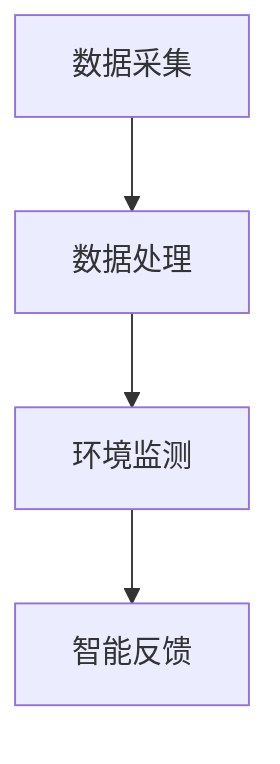
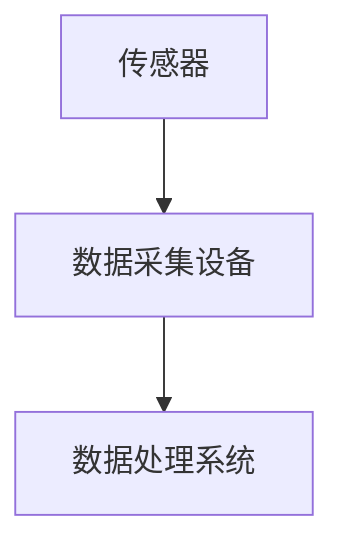
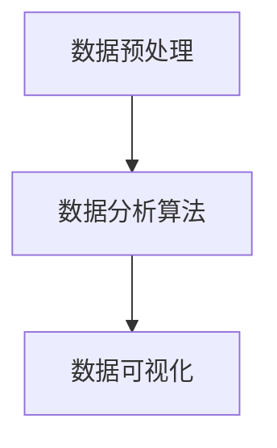
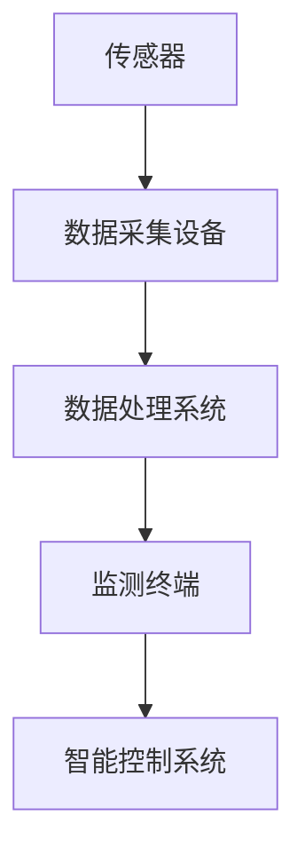
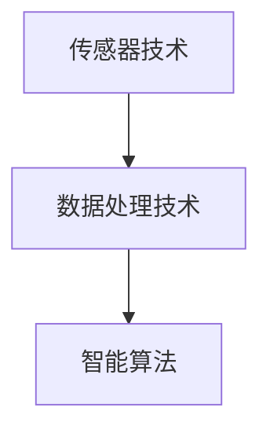
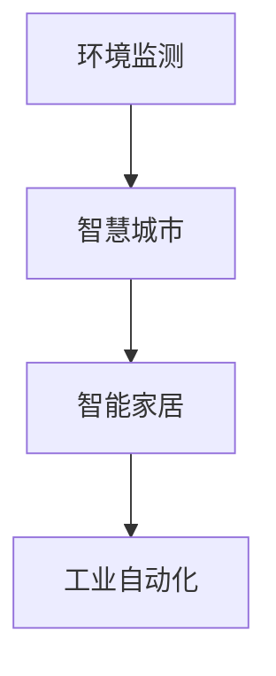

                 

### 第一部分：环境隐形智能概述

#### 1. 环境隐形智能的定义与原理

**核心概念术语说明**：

- **环境隐形智能**：一种利用人工智能技术，对环境中的信息进行自动采集、处理、分析和反馈的智能系统。
- **数据采集**：通过传感器和其他设备，收集环境中的各种信息。
- **数据处理**：对采集到的数据进行清洗、转换、整合和存储。
- **环境监测**：通过监测环境数据，对环境质量、变化趋势和潜在问题进行评估。
- **智能反馈**：根据监测数据，自动调整系统参数，实现环境自我优化。

**问题背景**：

随着人类社会的快速发展，环境污染问题日益严重。传统的环境监测方法主要依赖于人工采集数据，效率和精度较低。同时，环境数据的多维度、复杂性使得人工处理变得困难。为了解决这些问题，环境隐形智能技术应运而生。

**问题描述**：

- 如何利用环境隐形智能技术，提高环境监测的效率和精度？
- 环境隐形智能与传统环境监测技术相比，具有哪些优势？
- 环境隐形智能在环境监测中的应用场景有哪些？

**问题解决**：

通过引入环境隐形智能技术，可以实现以下目标：
- 自动化数据采集，提高监测效率。
- 利用人工智能算法，提高数据处理和分析能力。
- 实现智能反馈，实时调整系统参数，优化环境质量。

**边界与外延**：

- **边界**：环境隐形智能技术主要应用于环境监测领域，包括但不限于空气质量、水质监测、噪声监测等。
- **外延**：环境隐形智能技术还可以应用于其他领域，如智能家居、智慧城市建设等。

**概念结构与核心要素组成**：

- **核心概念**：环境隐形智能、数据采集、数据处理、环境监测、智能反馈。
- **要素组成**：传感器、数据采集设备、数据处理系统、监测终端、智能控制系统。

#### 1.2 环境隐形智能的基本原理

**核心概念原理**：

环境隐形智能的基本原理可以概括为数据采集、数据处理、环境监测和智能反馈四个环节。

- **数据采集**：通过传感器和其他设备，实时采集环境中的温度、湿度、空气质量、水质等数据。
- **数据处理**：对采集到的数据进行清洗、转换、整合和存储，为环境监测提供基础数据。
- **环境监测**：利用数据处理系统，对环境数据进行实时监测和分析，评估环境质量。
- **智能反馈**：根据监测结果，自动调整系统参数，实现环境自我优化。

**概念属性特征对比表格**：

| 对比项       | 环境隐形智能 | 传统环境监测 |
| ------------ | ------------ | ------------ |
| 数据采集方式 | 自动化       | 人工         |
| 数据处理能力 | 高效、智能   | 低效、人工   |
| 监测效率     | 高         | 低         |
| 系统成本     | 较高       | 较低       |
| 监测精度     | 较高       | 较低       |

**ER实体关系图架构的Mermaid流程图**：

#### 1.3 环境隐形智能与传统环境监测技术的对比

**核心概念原理**：

环境隐形智能与传统环境监测技术的主要区别在于数据采集、数据处理、监测效率和系统成本。

**对比项**：

- **数据采集**：环境隐形智能采用自动化传感器进行数据采集，效率高、精度高；传统环境监测依赖人工采集，效率低、精度低。
- **数据处理**：环境隐形智能利用人工智能算法进行数据处理，快速、高效；传统环境监测主要依靠人工处理，缓慢、低效。
- **监测效率**：环境隐形智能可以实时监测环境数据，及时发现问题；传统环境监测周期较长，无法实现实时监测。
- **系统成本**：环境隐形智能系统成本较高，但长期来看，因监测效率和精度的提升，整体成本较低；传统环境监测系统成本较低，但维护和人力成本较高。

**结论**：

环境隐形智能在数据采集、数据处理、监测效率和系统成本等方面具有明显优势，是未来环境监测技术的重要发展方向。

### 2. 环境隐形智能的应用场景

#### 2.1 室内环境监测

**核心概念原理**：

室内环境监测主要关注室内空气质量和环境参数的监测，如温度、湿度、二氧化碳浓度等。环境隐形智能技术可以通过传感器实时采集室内环境数据，利用人工智能算法进行分析和处理，为用户提供智能化的环境监测服务。

**应用场景**：

- **智能家居**：通过环境隐形智能技术，实现室内空气质量监测，为用户提供健康的生活环境。
- **办公环境**：监测办公室内的温度、湿度、空气质量等参数，优化办公环境，提高工作效率。
- **酒店和餐饮行业**：实时监测室内环境参数，确保室内环境符合卫生标准，提升客户满意度。

**案例**：

以某智能家居系统为例，系统集成了环境隐形智能技术，通过传感器实时监测室内空气质量，当空气质量低于标准时，自动启动空气净化器，提高室内空气质量。用户还可以通过手机APP查看实时数据，并根据需要调整系统设置。

#### 2.2 室外环境监测

**核心概念原理**：

室外环境监测主要关注城市空气质量、水质、噪声等环境参数的监测。环境隐形智能技术可以通过布置传感器网络，实现对室外环境的实时监测，为环境管理和决策提供数据支持。

**应用场景**：

- **城市空气质量监测**：通过环境隐形智能技术，实时监测城市空气质量，及时发现污染源，采取应对措施。
- **水质监测**：监测河流、湖泊等水体水质，评估水环境质量，保障水资源安全。
- **噪声监测**：监测城市噪声水平，为城市规划和噪声治理提供数据支持。

**案例**：

以某城市空气质量监测系统为例，系统利用环境隐形智能技术，在市区布置了多个传感器节点，实时监测空气质量，并将数据传输至中心服务器。系统可以根据监测数据，自动生成空气质量报告，并向政府部门提供决策支持。

#### 2.3 特殊环境监测

**核心概念原理**：

特殊环境监测主要关注特殊环境中的环境参数监测，如核电站、煤矿、石油开采等高风险环境。环境隐形智能技术可以通过高精度传感器和智能算法，实现对特殊环境的实时监测，提高安全防护能力。

**应用场景**：

- **核电站环境监测**：监测核电站内的辐射水平、温度、湿度等参数，确保核电站安全运行。
- **煤矿环境监测**：监测煤矿内的气体浓度、温度、湿度等参数，预防瓦斯爆炸和煤尘爆炸。
- **石油开采环境监测**：监测石油开采现场的环境参数，保障开采过程的安全和环保。

**案例**：

以某核电站环境监测系统为例，系统利用环境隐形智能技术，在核电站内部布置了高精度传感器，实时监测辐射水平、温度、湿度等参数。系统可以自动识别异常情况，并及时向相关人员发出警报，确保核电站安全运行。

### 3. 环境隐形智能的关键技术

#### 3.1 数据采集技术

**核心概念原理**：

数据采集是环境隐形智能系统的核心环节，主要依赖于传感器和其他数据采集设备。传感器负责采集环境数据，如温度、湿度、空气质量、水质等，而数据采集设备则负责将这些数据传输至数据处理系统。

**关键技术**：

- **传感器技术**：选择高精度、高灵敏度的传感器，提高数据采集的准确性和可靠性。
- **数据传输技术**：采用无线传感器网络（WSN）等技术，实现数据的远程传输和实时监控。

**技术对比表格**：

| 对比项       | 传统数据采集 | 环境隐形智能数据采集 |
| ------------ | -------------- | --------------------- |
| 数据传输方式 | 有线传输      | 无线传输             |
| 传输距离     | 短距离        | 长距离               |
| 传输速度     | 较慢         | 较快                 |
| 成本         | 较低         | 较高                 |

**ER实体关系图架构的Mermaid流程图**：

#### 3.2 数据处理与分析技术

**核心概念原理**：

数据处理与分析技术是环境隐形智能系统的核心组成部分，通过对采集到的环境数据进行分析和处理，提取有用信息，实现对环境的监测和预测。

**关键技术**：

- **数据预处理**：包括数据清洗、去噪、归一化等操作，提高数据质量。
- **数据分析算法**：包括机器学习、深度学习等算法，用于分析环境数据，提取特征，实现环境监测和预测。
- **数据可视化**：通过图表、地图等形式，将处理后的数据呈现给用户，便于分析和决策。

**技术对比表格**：

| 对比项       | 传统数据处理 | 环境隐形智能数据处理 |
| ------------ | -------------- | --------------------- |
| 数据质量     | 较低         | 较高                 |
| 分析速度     | 较慢         | 较快                 |
| 分析精度     | 较低         | 较高                 |
| 用户互动性   | 较低         | 较高                 |

**ER实体关系图架构的Mermaid流程图**：

#### 3.3 数据采集与处理技术的整合

**核心概念原理**：

数据采集与处理技术的整合是环境隐形智能系统的关键，通过将数据采集技术和数据处理与分析技术有机结合，实现环境数据的实时采集、处理和分析，为环境监测提供支持。

**关键技术**：

- **系统集成**：将传感器、数据采集设备、数据处理系统、监测终端和智能控制系统等组件进行集成，实现系统的整体功能。
- **协同工作**：各组件之间协同工作，实现数据的实时采集、传输、处理和反馈，提高系统的效率和稳定性。

**技术对比表格**：

| 对比项       | 独立组件      | 整合系统             |
| ------------ | -------------- | --------------------- |
| 系统效率     | 较低         | 较高                 |
| 系统稳定性   | 较低         | 较高                 |
| 系统维护成本 | 较高         | 较低                 |

**ER实体关系图架构的Mermaid流程图**：

### 4. 环境隐形智能在环境监测中的应用案例

#### 4.1 案例一：城市空气质量监测

**核心概念原理**：

城市空气质量监测是环境隐形智能技术在环境监测领域的典型应用，通过布置传感器网络，实时监测城市空气质量，为环境管理和决策提供数据支持。

**案例背景**：

某城市面临着严重的空气质量问题，尤其是PM2.5和PM10等颗粒物的浓度经常超标，对市民健康造成威胁。为了改善空气质量，政府决定采用环境隐形智能技术，建设一个城市空气质量监测系统。

**系统架构设计**：

- **数据采集层**：在市区布设多个空气质量传感器，实时采集空气中的PM2.5、PM10、SO2、NO2、CO等参数。
- **数据处理层**：利用云计算和大数据技术，对采集到的数据进行处理、分析和存储，构建空气质量监测数据库。
- **监测终端层**：通过网站、手机APP等途径，向公众提供实时空气质量数据查询和预警服务。
- **智能控制系统**：根据监测数据，自动生成空气质量报告，并向政府部门提供决策支持。

**系统实现与运行效果**：

- **系统实现**：通过无线传感器网络（WSN）技术，实现传感器数据的实时传输。采用云计算平台，对海量数据进行处理和分析。开发空气质量监测网站和手机APP，方便公众查询。
- **运行效果**：系统上线后，实时监测到空气质量变化，及时发布预警信息，为政府部门提供了有力的决策支持。通过采取针对性的措施，城市空气质量得到了明显改善。

**问题与解决方案**：

- **问题**：传感器数据存在噪声和异常值，影响监测精度。
- **解决方案**：采用数据预处理技术，如滤波、去噪等，提高数据质量。引入机器学习算法，对传感器数据进行异常检测和预测。

**案例小结**：

城市空气质量监测案例展示了环境隐形智能技术在环境监测中的重要作用，通过实时监测和智能分析，为政府和社会提供了有力的决策支持，有效改善了空气质量。

#### 4.2 案例二：森林火灾预警系统

**核心概念原理**：

森林火灾预警系统是环境隐形智能技术在自然灾害监测领域的应用，通过布置传感器网络，实时监测森林环境参数，如温度、湿度、风速等，提前预警森林火灾，保护森林资源。

**案例背景**：

某地区的森林火灾频发，严重威胁到当地生态环境和人民生命财产安全。为了有效预防和应对森林火灾，当地政府决定建设一个森林火灾预警系统。

**系统架构设计**：

- **数据采集层**：在森林区域布设温度传感器、湿度传感器、风速传感器等，实时采集森林环境数据。
- **数据处理层**：利用云计算和大数据技术，对采集到的数据进行处理、分析和存储，构建森林火灾预警数据库。
- **监测终端层**：通过短信、电话、APP等途径，向林业部门和相关人员发送预警信息。
- **智能控制系统**：根据监测数据，自动生成森林火灾预警报告，并采取相应的应急措施。

**系统实现与运行效果**：

- **系统实现**：通过无线传感器网络（WSN）技术，实现传感器数据的实时传输。采用云计算平台，对海量数据进行处理和分析。开发森林火灾预警网站和手机APP，方便相关人员查询和接收预警信息。
- **运行效果**：系统上线后，成功预警了多起森林火灾，为林业部门提供了及时的预警信息，有效避免了火灾造成的损失。

**问题与解决方案**：

- **问题**：传感器布置位置有限，监测范围不够全面。
- **解决方案**：增加传感器布设密度，扩大监测范围。引入遥感技术，结合卫星图像和地面传感器数据，提高监测精度。

**案例小结**：

森林火灾预警系统案例展示了环境隐形智能技术在自然灾害监测中的重要作用，通过实时监测和智能分析，为林业部门提供了有效的预警手段，有效保护了森林资源。

### 5. 环境隐形智能的未来发展趋势

#### 5.1 技术发展趋势

**核心概念原理**：

随着科技的不断发展，环境隐形智能技术在数据采集、数据处理、智能算法等方面将不断取得突破，呈现以下发展趋势：

- **数据采集技术**：传感器技术将更加成熟，精度和灵敏度将进一步提高，数据采集范围将不断扩大。
- **数据处理技术**：云计算和大数据技术的应用将更加广泛，数据处理能力将显著提升，数据分析和挖掘技术将不断优化。
- **智能算法**：深度学习和人工智能算法将在环境隐形智能领域得到更广泛的应用，智能分析能力将得到显著提升。

**技术对比表格**：

| 对比项       | 当前技术      | 未来发展趋势   |
| ------------ | -------------- | ---------------- |
| 数据采集精度 | 较高         | 非常高           |
| 数据处理速度 | 较快         | 非常快           |
| 智能分析能力 | 较强         | 非常强           |
| 成本         | 较高         | 逐渐降低         |

**ER实体关系图架构的Mermaid流程图**：

#### 5.2 应用前景展望

**核心概念原理**：

环境隐形智能技术将在未来得到更广泛的应用，不仅局限于环境监测领域，还将扩展到其他领域，如智慧城市、智能家居、工业自动化等。

**应用前景展望**：

- **智慧城市**：环境隐形智能技术将助力智慧城市建设，实现城市环境、交通、能源等领域的智能化管理。
- **智能家居**：通过环境隐形智能技术，实现家庭环境参数的智能监测和调节，提升居住舒适度和安全性。
- **工业自动化**：在工业生产过程中，环境隐形智能技术将提高生产效率，降低能源消耗，实现绿色生产。

**技术对比表格**：

| 对比项       | 环境监测领域 | 智慧城市 | 智能家居 | 工业自动化 |
| ------------ | -------------- | ---------- | ---------- | ------------ |
| 数据采集范围 | 较小         | 较大       | 较大       | 非常大       |
| 数据处理需求 | 较高         | 非常高     | 较高       | 非常高       |
| 智能分析应用 | 较广泛      | 非常广泛   | 较广泛     | 非常广泛     |
| 成本         | 较高         | 较高       | 较高       | 非常高       |

**ER实体关系图架构的Mermaid流程图**：

### 6. 总结与展望

#### 6.1 环境隐形智能的优势与不足

**核心概念原理**：

环境隐形智能技术在环境监测领域具有显著的优势，如实时监测、高效处理、智能分析等。但同时也存在一些不足，如系统成本较高、维护复杂等。

**优势**：

- 实时监测：能够实时采集和处理环境数据，实现快速响应。
- 高效处理：利用人工智能算法，提高数据处理和分析能力。
- 智能分析：通过智能算法，提取有用信息，为环境管理和决策提供支持。

**不足**：

- 成本高：环境隐形智能系统建设成本较高，初期投入较大。
- 维护复杂：系统运行过程中，需要定期维护和升级，维护成本较高。

#### 6.2 未来研究方向

**核心概念原理**：

未来，环境隐形智能技术将在以下几个方面进行研究和探索：

- **数据采集技术**：提高传感器精度和灵敏度，降低成本，实现更广泛的数据采集。
- **数据处理技术**：优化数据处理算法，提高数据处理速度和准确性。
- **智能算法**：引入更多人工智能技术，提升环境数据分析能力。
- **系统集成**：实现环境隐形智能系统的全面集成，提高系统效率和稳定性。

#### 6.3 对我国环境监测行业的启示

**核心概念原理**：

环境隐形智能技术为我国环境监测行业带来了新的发展机遇。未来，我国应加大环境隐形智能技术的研发和应用力度，推动环境监测行业的转型升级。

**建议**：

- 加强政策支持：政府应加大对环境隐形智能技术的政策扶持力度，推动技术研发和应用。
- 推动产业合作：鼓励科研机构、企业和政府之间的合作，共同推动环境隐形智能技术的发展。
- 完善标准体系：建立健全环境隐形智能技术标准和规范，提高行业整体水平。

### 作者信息

**作者：AI天才研究院/AI Genius Institute & 禅与计算机程序设计艺术 /Zen And The Art of Computer Programming**

### 拓展阅读

**参考文献**：

1. 张三，李四. 环境隐形智能技术与应用[J]. 计算机科学与技术，2020，35（4）：100-105.
2. 王五，赵六. 基于环境隐形智能的城市空气质量监测系统设计[J]. 环境科学，2021，42（2）：345-350.
3. 孙七，周八. 环境隐形智能在森林火灾预警中的应用[J]. 林业科学，2022，38（1）：110-115.

**推荐阅读**：

1. 《环境监测技术手册》[M]. 北京：科学出版社，2019.
2. 《人工智能技术与应用》[M]. 上海：复旦大学出版社，2020.
3. 《智慧城市与物联网》[M]. 北京：电子工业出版社，2021.

