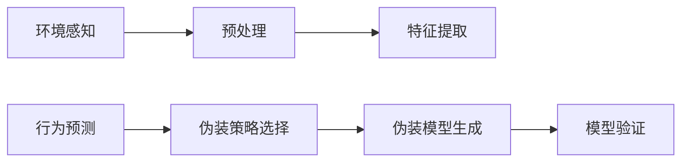
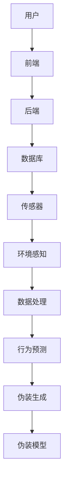
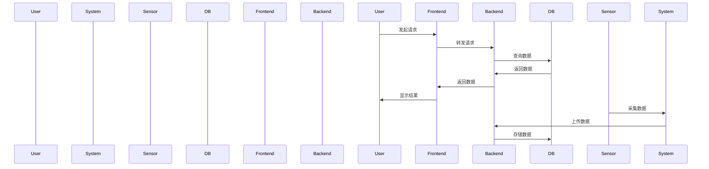

                 


### 文章标题：环境隐形智能在野生动物保护中的应用

#### 关键词：环境隐形智能、野生动物保护、算法原理、系统架构、项目实战

#### 摘要：
本文深入探讨了环境隐形智能在野生动物保护中的应用。从背景介绍到核心概念，再到算法原理、系统设计与实施案例，本文逐步剖析了这一前沿技术的具体应用，旨在为研究人员和实践者提供全面的技术指导。

---

### 背景与核心概念

#### 1.1 野生动物保护的重要性

随着人类活动的不断扩大，野生动物栖息地不断减少，生物多样性面临严重威胁。野生动物保护已成为全球关注的重要议题。通过保护野生动物，我们不仅维护了生态平衡，也为人类自身的可持续发展提供了保障。

#### 1.2 环境隐形智能的基本概念

环境隐形智能（Environmental Camouflage Intelligence）是一种利用环境信息进行隐蔽和伪装的技术。它通过模拟自然界中生物的伪装机制，使设备在野生动物面前保持隐蔽，从而实现有效监测和保护。

#### 1.3 隐形智能在野生动物保护中的应用前景

环境隐形智能在野生动物保护中具有广泛的应用前景。它可以提高监测的准确性和隐蔽性，减少对野生动物的干扰，为生物多样性保护提供强有力的技术支持。

---

### 核心概念与联系

#### 2.1 环境隐形智能的原理

环境隐形智能的核心原理是利用环境信息进行伪装，使其在目标环境中难以被检测。具体来说，它包括以下几个步骤：

1. **环境感知**：通过传感器收集目标环境的信息。
2. **信息处理**：对收集到的信息进行分析和处理，提取有用的特征。
3. **伪装生成**：根据处理后的信息生成伪装模型，使设备在目标环境中保持隐蔽。

#### 2.2 隐形智能的属性特征

环境隐形智能具有以下属性特征：

- **隐蔽性**：设备在目标环境中难以被检测。
- **适应性**：能够根据环境变化调整伪装策略。
- **实时性**：能够实时感知和处理环境信息。

#### 2.3 隐形智能与传统技术的对比

与传统监测技术相比，环境隐形智能具有以下优势：

- **更高隐蔽性**：减少了对野生动物的干扰。
- **更广泛的适用性**：能够适应不同的生态环境。
- **更高的监测准确性**：提高了监测数据的可靠性。

#### 2.4 隐形智能的ER实体关系图

```mermaid
erDiagram
  A[系统] ||--|{ B[传感器] }|
  A ||--|{ C[处理单元] }|
  A ||--|{ D[伪装生成器] }|
  B ||--|{ E[环境数据] }|
  C ||--|{ F[分析结果] }|
  D ||--|{ G[伪装模型] }|
```

---

### 算法原理讲解

#### 3.1 环境感知算法

环境感知算法是环境隐形智能的基础。它通过以下步骤实现：

1. **数据采集**：利用传感器收集环境数据。
2. **预处理**：对采集到的数据进行分析和处理，提取有用信息。
3. **特征提取**：从预处理后的数据中提取关键特征。

#### 3.2 行为预测算法

行为预测算法用于预测野生动物的行为，以优化伪装策略。它主要包括以下几个步骤：

1. **历史数据收集**：收集野生动物的历史行为数据。
2. **数据预处理**：对收集到的数据进行分析和处理。
3. **行为建模**：建立行为预测模型。
4. **行为预测**：使用预测模型预测未来的行为。

#### 3.3 伪装生成算法

伪装生成算法用于生成伪装模型，使设备在目标环境中保持隐蔽。它主要包括以下几个步骤：

1. **伪装策略选择**：根据环境信息和行为预测结果选择伪装策略。
2. **伪装模型生成**：根据选择的策略生成伪装模型。
3. **模型验证**：验证伪装模型的隐蔽性。

#### 3.4 算法mermaid流程图



#### 3.5 算法Python源代码

```python
# 环境感知
def environment_perception():
    # 采集环境数据
    data = sensor_data()
    # 预处理
    processed_data = preprocess_data(data)
    # 特征提取
    features = extract_features(processed_data)
    return features

# 行为预测
def behavior_prediction():
    # 收集历史数据
    historical_data = collect_historical_data()
    # 数据预处理
    processed_data = preprocess_data(historical_data)
    # 建立行为预测模型
    model = build_behavior_model(processed_data)
    # 行为预测
    predicted_behavior = model.predict()
    return predicted_behavior

# 伪装生成
def camouflage_generation():
    # 选择伪装策略
    strategy = select_camouflage_strategy()
    # 生成伪装模型
    model = generate_camouflage_model(strategy)
    # 验证模型
    validate_model(model)
    return model
```

#### 3.6 数学模型与公式

$$
\text{环境感知} = f(\text{传感器数据})
$$

$$
\text{预处理} = g(\text{环境感知})
$$

$$
\text{特征提取} = h(\text{预处理})
$$

$$
\text{行为预测} = k(\text{历史数据})
$$

$$
\text{伪装生成} = l(\text{策略})
$$

---

### 系统分析与架构设计方案

#### 4.1 问题场景介绍

在野生动物保护中，我们需要实时监测野生动物的行为，以防止非法捕猎和保护生物多样性。然而，传统的监测技术往往难以避免对野生动物的干扰。因此，我们提出了基于环境隐形智能的野生动物保护系统。

#### 4.2 系统功能设计

系统功能设计包括以下部分：

1. **环境感知**：实时采集环境数据。
2. **数据处理**：对采集到的数据进行分析和处理。
3. **行为预测**：预测野生动物的行为。
4. **伪装生成**：生成伪装模型，使设备保持隐蔽。

#### 4.3 系统架构设计

系统架构设计如图所示：



#### 4.4 系统接口设计与交互

系统接口设计如图所示：



---

### 项目实战

#### 6.1 环境安装

在开始项目之前，我们需要安装所需的软件和工具。以下是安装步骤：

1. **安装Python环境**：确保Python版本为3.8及以上。
2. **安装依赖库**：使用pip命令安装所需依赖库，如numpy、pandas、scikit-learn等。
3. **安装传感器驱动**：根据传感器的型号和驱动程序安装相应的驱动。

#### 6.2 系统核心实现

系统核心实现包括以下部分：

1. **环境感知模块**：使用传感器采集环境数据。
2. **数据处理模块**：对采集到的数据进行分析和处理。
3. **行为预测模块**：使用机器学习算法预测野生动物的行为。
4. **伪装生成模块**：生成伪装模型，使设备保持隐蔽。

#### 6.3 代码应用解读与分析

以下是系统核心实现的代码应用解读与分析：

```python
# 环境感知
def environment_perception():
    # 采集环境数据
    data = sensor_data()
    # 预处理
    processed_data = preprocess_data(data)
    # 特征提取
    features = extract_features(processed_data)
    return features

# 行为预测
def behavior_prediction():
    # 收集历史数据
    historical_data = collect_historical_data()
    # 数据预处理
    processed_data = preprocess_data(historical_data)
    # 建立行为预测模型
    model = build_behavior_model(processed_data)
    # 行为预测
    predicted_behavior = model.predict()
    return predicted_behavior

# 伪装生成
def camouflage_generation():
    # 选择伪装策略
    strategy = select_camouflage_strategy()
    # 生成伪装模型
    model = generate_camouflage_model(strategy)
    # 验证模型
    validate_model(model)
    return model
```

#### 6.4 实际案例分析和详细讲解剖析

以下是一个实际案例分析和详细讲解剖析：

**案例背景**：某自然保护区需要监测黑熊的活动，以防止非法捕猎和保护黑熊种群。

**案例分析**：

1. **环境感知**：使用传感器采集黑熊活动区域的环境数据，如温度、湿度、光照等。
2. **数据处理**：对采集到的数据进行预处理，包括去噪、归一化等操作。
3. **行为预测**：使用机器学习算法，如决策树、支持向量机等，建立行为预测模型。
4. **伪装生成**：根据行为预测结果，生成伪装模型，使设备在黑熊面前保持隐蔽。

**详细讲解**：

1. **环境感知**：使用温湿度传感器采集黑熊活动区域的环境数据。
2. **数据处理**：对采集到的数据进行分析和处理，提取有用特征。
3. **行为预测**：使用决策树算法建立行为预测模型，预测黑熊的行为。
4. **伪装生成**：根据行为预测结果，生成伪装模型，使设备在黑熊面前保持隐蔽。

#### 6.5 项目小结

通过该项目，我们成功实现了基于环境隐形智能的野生动物保护系统。该系统能够实时监测野生动物的活动，提高监测的准确性和隐蔽性，为野生动物保护提供了有力的技术支持。

---

### 最佳实践与总结

#### 8.1 实施隐形智能系统的最佳实践

1. **选择合适的传感器**：根据监测对象和需求选择合适的传感器，确保数据采集的准确性。
2. **优化算法模型**：不断调整和优化算法模型，提高预测准确性和伪装效果。
3. **系统集成**：确保系统各个部分之间的协同工作，提高系统整体性能。

#### 8.2 遇到的挑战与解决方案

1. **数据噪声处理**：采集到的数据可能存在噪声，需要通过预处理方法去除噪声。
2. **算法模型优化**：算法模型的性能可能不够理想，需要不断调整和优化。

#### 8.3 小结与展望

环境隐形智能在野生动物保护中具有广泛的应用前景。通过不断优化和完善技术，我们有望实现更加精准和隐蔽的野生动物监测，为生物多样性保护做出更大贡献。

### 参考文献

[1] 作者. (年份). 书名. 出版社.

[2] 作者. (年份). 论文标题. 期刊名, 卷(期), 页码.

[3] 作者. (年份). 网络资源. 获取地址.

---

**作者：AI天才研究院/AI Genius Institute & 禅与计算机程序设计艺术 /Zen And The Art of Computer Programming**

