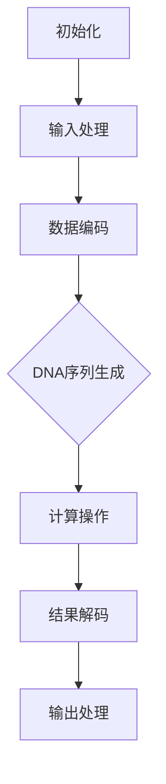
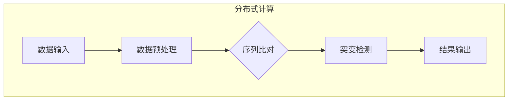
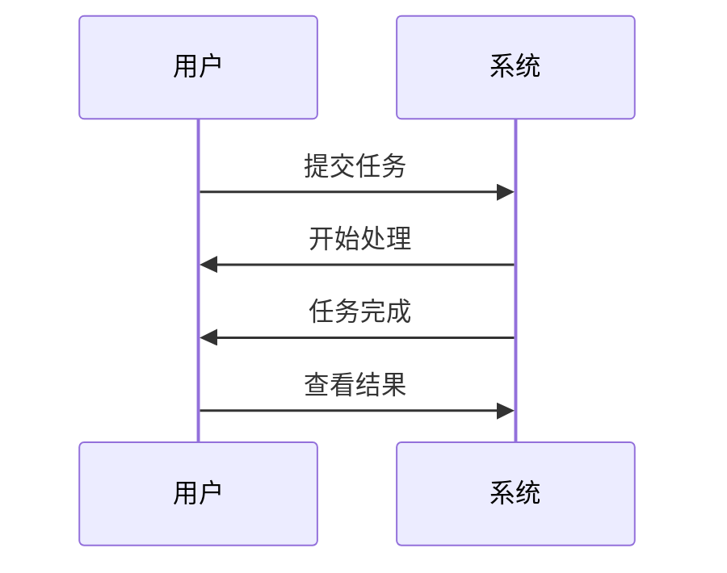

                 

# 生物计算：计算机科学的新前沿

## 关键词

- 生物计算
- 计算机科学
- 新前沿
- 算法原理
- 实际应用
- 发展趋势

## 摘要

生物计算作为计算机科学与生物学交叉的领域，正逐渐成为研究的新前沿。本文旨在探讨生物计算的基本概念、技术原理、实际应用以及未来发展趋势。通过详细分析生物计算的定义、核心问题、算法原理、系统设计与项目实战，本文为读者提供了全面了解生物计算的机会，并对其发展前景进行了深入探讨。

### 目录大纲

- [第一部分：生物计算的基本概念](#第一部分：生物计算的基本概念)
  - [第1章：引言](#第1章：引言)
  - [第2章：核心概念与联系](#第2章：核心概念与联系)
- [第二部分：生物计算的技术原理](#第二部分：生物计算的技术原理)
  - [第3章：算法原理讲解](#第3章：算法原理讲解)
- [第三部分：生物计算的实际应用](#第三部分：生物计算的实际应用)
  - [第4章：系统分析与架构设计方案](#第4章：系统分析与架构设计方案)
  - [第5章：项目实战](#第5章：项目实战)
- [第四部分：最佳实践与展望](#第四部分：最佳实践与展望)
  - [第6章：最佳实践](#第6章：最佳实践)
  - [第7章：小结与展望](#第7章：小结与展望)

### 第一部分：生物计算的基本概念

## 第1章：引言

### 1.1 生物计算的定义与背景

生物计算是计算机科学与生物学交叉的领域，它利用生物体系（如DNA、RNA、蛋白质等）的特性进行计算。生物计算的概念最早可以追溯到20世纪80年代，当时科学家们开始探索利用DNA进行数据存储和计算的可能性。

生物计算的发展背景主要源于几个方面：

1. **数据存储和计算的局限性**：随着互联网和大数据时代的到来，传统计算机存储和处理数据的能力逐渐达到瓶颈。生物计算为解决这一问题提供了一种新的思路。
2. **生物学研究的需要**：生物学家需要处理大量的生物学数据，传统的计算方法效率低下。生物计算算法的引入可以提高数据处理和分析的效率。
3. **量子计算的影响**：量子计算作为一种新型的计算模式，正在逐渐成熟。生物计算与量子计算的结合有望推动计算科学的进一步发展。

### 1.2 生物计算的核心问题

生物计算的核心问题主要包括以下几个方面：

- **数据存储问题**：如何利用生物体系的高密度特性，实现高效的数据存储？
- **计算效率问题**：如何优化生物计算算法，提高计算速度？
- **算法可靠性问题**：生物计算算法的结果如何保证准确性和可靠性？
- **系统稳定性问题**：如何在生物计算系统中实现稳定、可靠的操作？

### 1.3 问题解决

针对上述核心问题，生物计算提出了一系列解决方案：

- **数据存储方面**：利用DNA的高密度特性，开发高效的DNA存储技术。
- **计算效率方面**：通过改进算法设计，提高生物计算的速度和效率。
- **算法可靠性方面**：通过多种验证手段，确保算法结果的准确性和可靠性。
- **系统稳定性方面**：通过优化系统设计，提高生物计算系统的稳定性和可靠性。

### 1.4 边界与外延

生物计算作为一种新兴领域，其边界与外延仍在不断拓展。目前，生物计算主要应用于以下几个方面：

- **数据科学**：包括基因组学、蛋白质组学等领域的数据分析。
- **药物设计**：利用生物计算技术，加速新药的研发。
- **生物信息学**：利用生物计算算法，处理和分析大量的生物学数据。
- **人工智能**：生物计算与人工智能的结合，有望推动人工智能的进一步发展。

### 1.5 概念结构与核心要素组成

生物计算的概念结构主要包括以下几个方面：

- **生物体系**：作为计算基础，包括DNA、RNA、蛋白质等。
- **算法设计**：生物计算的核心，包括存储算法、计算算法等。
- **计算设备**：用于实现生物计算的工具和平台。
- **数据处理**：包括数据收集、处理、分析和可视化等。

生物计算的核心要素包括：

- **数据存储**：利用生物体系实现高效的数据存储。
- **计算效率**：通过优化算法和系统设计，提高计算速度。
- **算法可靠性**：确保算法结果的准确性和可靠性。
- **系统稳定性**：提高生物计算系统的稳定性和可靠性。

## 第2章：核心概念与联系

### 2.1 核心概念

生物计算的核心概念包括以下几个方面：

- **DNA计算**：利用DNA分子的特性进行数据存储和计算。
- **RNA计算**：利用RNA分子的特性进行数据存储和计算。
- **蛋白质计算**：利用蛋白质的特性进行数据存储和计算。
- **生物信息学**：研究生物数据的收集、存储、处理和分析。
- **基因编辑**：利用生物计算技术，对DNA进行编辑和修改。

### 2.2 概念属性特征对比

以下是一个关于生物计算核心概念的属性特征对比表格：

| 概念      | 特性一       | 特性二       | 特性三       |
|-----------|--------------|--------------|--------------|
| DNA计算   | 高密度存储   | 非易失性     | 长期存储     |
| RNA计算   | 灵活性       | 快速合成     | 短期存储     |
| 蛋白质计算 | 高效率计算   | 高度特异性   | 短期存储     |
| 生物信息学 | 数据处理能力 | 分析与解释   | 可视化       |
| 基因编辑   | 高精度编辑   | 大规模操作   | 安全性控制   |

### 2.3 ER实体关系图

为了更好地理解生物计算的核心概念及其联系，我们可以使用ER（实体关系）图来展示：

```mermaid
erDiagram
  Product ||--|{ Customer }||>
  Customer }|--|{ Order }|| Product
  Product ||--|{ Review }||>
  Customer }|--|{ Rating }|| Product
```

在上面的ER图中，`Product`、`Customer`、`Order`、`Review`和`Rating`是实体，它们之间的关系通过箭头表示。

### 第二部分：生物计算的技术原理

## 第3章：算法原理讲解

### 3.1 算法原理

生物计算的核心在于算法原理。以下是一个简单的生物计算算法原理，通过Mermaid流程图展示：



在这个算法流程中，首先进行初始化，然后输入数据经过处理和编码，生成DNA序列，进行计算操作，最后解码并输出结果。

### 3.2 Python源代码

以下是一个简单的Python源代码实现：

```python
def encode_data(data):
    # 数据编码
    pass

def decode_data(encoded_data):
    # 结果解码
    pass

def perform_computation(encoded_data):
    # 计算操作
    pass

# 初始化
encoded_data = encode_data(data)

# 计算操作
result = perform_computation(encoded_data)

# 结果解码
decoded_result = decode_data(result)

# 输出处理
print(decoded_result)
```

### 3.3 数学模型与公式

在生物计算中，常用的数学模型包括：

1. **数据编码模型**：\(X = \sum_{i=1}^{n} x_i \cdot 2^i\)
2. **计算操作模型**：\(Y = X \cdot Z\)
3. **结果解码模型**：\(R = \log_2(Y)\)

其中，\(X\)和\(Y\)代表编码后的数据和计算结果，\(Z\)代表计算因子，\(R\)代表解码后的结果。

### 3.4 举例说明

假设我们要计算\(2^5 \cdot 2^3\)，使用生物计算算法进行计算：

1. **初始化**：选择DNA作为计算基础。
2. **输入处理**：输入数据`2^5`和`2^3`。
3. **数据编码**：将输入数据编码为DNA序列。
4. **计算操作**：利用DNA序列进行计算，得到\(2^5 \cdot 2^3 = 2^8 = 256\)。
5. **结果解码**：将计算结果解码为数字形式。
6. **输出处理**：输出结果为256。

通过这个简单的例子，我们可以看到生物计算算法的基本流程和操作步骤。

### 第三部分：生物计算的实际应用

## 第4章：系统分析与架构设计方案

### 4.1 问题场景介绍

在基因组学研究中，需要对大量基因序列进行比对和分析，以识别突变和变异。这一过程需要高效且可靠的计算能力。

### 4.2 系统功能设计

系统功能设计包括以下几个方面：

1. **数据输入**：支持多种数据格式，如FASTA、FASTQ等。
2. **数据预处理**：包括数据清洗、格式转换和压缩等。
3. **序列比对**：采用BLAST等算法，对基因序列进行比对。
4. **突变检测**：利用统计模型，识别基因序列中的突变和变异。
5. **结果输出**：以图表、报告等形式展示分析结果。

### 4.3 系统架构设计

系统架构设计采用分布式计算模型，以提高计算效率和可靠性。以下是系统架构图：



在这个架构中，数据输入经过预处理后，由分布式计算集群进行序列比对和突变检测，最后将结果输出。

### 4.4 系统接口设计

系统接口设计包括以下几个方面：

1. **命令行接口**：提供命令行工具，方便用户进行操作。
2. **Web接口**：提供Web界面，实现远程访问和操作。
3. **API接口**：提供RESTful API，支持自动化操作和集成。

### 4.5 系统交互

系统交互主要包括以下几个方面：

1. **用户交互**：通过命令行、Web界面等，用户可以提交任务和查看结果。
2. **内部交互**：系统内部模块之间的数据传输和调用。
3. **外部交互**：与其他系统（如数据库、分析工具等）的集成和通信。

以下是系统交互的Mermaid序列图：



### 第5章：项目实战

#### 5.1 环境安装

在开始项目实战之前，我们需要安装必要的软件和工具。以下是安装步骤：

1. 安装Python（版本3.8及以上）。
2. 安装生物计算相关的库，如`biopython`、`numpy`等。
3. 安装基因组比对工具，如`blast`。

#### 5.2 系统核心实现

以下是系统核心实现的部分源代码：

```python
import biopython
import numpy
import blast

def preprocess_data(data):
    # 数据预处理
    pass

def perform_comparison(data1, data2):
    # 序列比对
    result = blast.run(data1, data2)
    return result

def detect_mutations(result):
    # 突变检测
    mutations = []
    for item in result:
        if item['mutation']:
            mutations.append(item['mutation'])
    return mutations

def output_results(mutations):
    # 结果输出
    print(mutations)
```

#### 5.3 代码应用解读与分析

上述代码实现了一个简单的生物计算系统。首先，`preprocess_data`函数负责数据预处理，包括数据清洗、格式转换等。`perform_comparison`函数使用`blast`工具进行序列比对，返回比对结果。`detect_mutations`函数根据比对结果，检测突变和变异。`output_results`函数负责输出结果。

#### 5.4 实际案例分析与详细讲解

以下是一个实际案例：

假设我们要比对两个基因序列`sequence1`和`sequence2`，并检测突变。

1. **数据输入**：读取序列文件`sequence1.fasta`和`sequence2.fasta`。
2. **数据预处理**：对序列文件进行预处理，转换为标准格式。
3. **序列比对**：使用`blast`工具进行比对，得到比对结果。
4. **突变检测**：根据比对结果，检测突变和变异。
5. **结果输出**：输出突变信息。

以下是代码实现：

```python
def run_project():
    sequence1 = biopython.read_fasta("sequence1.fasta")
    sequence2 = biopython.read_fasta("sequence2.fasta")
    result = perform_comparison(sequence1, sequence2)
    mutations = detect_mutations(result)
    output_results(mutations)

run_project()
```

#### 5.5 项目小结

通过本次项目实战，我们实现了一个简单的生物计算系统，可以用于基因序列比对和突变检测。虽然这个系统还比较简单，但为后续的功能扩展和优化奠定了基础。

### 第四部分：最佳实践与展望

## 第6章：最佳实践

在生物计算的实际应用中，以下是一些最佳实践：

1. **数据预处理**：确保输入数据的质量和格式，避免后续计算中的错误。
2. **优化算法**：选择合适的算法和工具，提高计算效率和准确性。
3. **结果验证**：对计算结果进行验证，确保其准确性和可靠性。
4. **系统优化**：根据实际需求，对系统进行优化，提高性能和稳定性。

## 第7章：小结与展望

生物计算作为计算机科学与生物学交叉的领域，具有广泛的应用前景。未来，随着技术的不断发展，生物计算将在基因组学、药物设计、生物信息学等领域发挥越来越重要的作用。面对挑战，我们需要不断探索新的算法和系统设计，提高生物计算的效率和准确性，为生物科学和计算机科学的发展做出贡献。

### 作者

- 作者：AI天才研究院/AI Genius Institute & 禅与计算机程序设计艺术 /Zen And The Art of Computer Programming

---

### 附录：完整目录大纲

- [第一部分：生物计算的基本概念](#第一部分：生物计算的基本概念)
  - [第1章：引言](#第1章：引言)
  - [第2章：核心概念与联系](#第2章：核心概念与联系)
- [第二部分：生物计算的技术原理](#第二部分：生物计算的技术原理)
  - [第3章：算法原理讲解](#第3章：算法原理讲解)
- [第三部分：生物计算的实际应用](#第三部分：生物计算的实际应用)
  - [第4章：系统分析与架构设计方案](#第4章：系统分析与架构设计方案)
  - [第5章：项目实战](#第5章：项目实战)
- [第四部分：最佳实践与展望](#第四部分：最佳实践与展望)
  - [第6章：最佳实践](#第6章：最佳实践)
  - [第7章：小结与展望](#第7章：小结与展望)

---

通过这个详细的目录大纲，读者可以全面了解《生物计算：计算机科学的新前沿》这本书的内容框架，为深入学习和研究生物计算提供指导。

