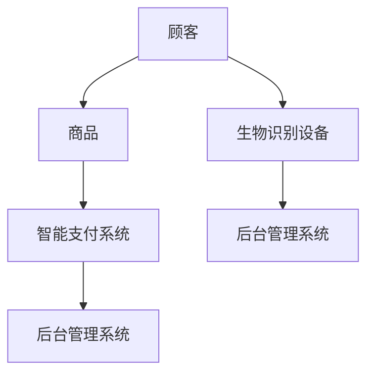
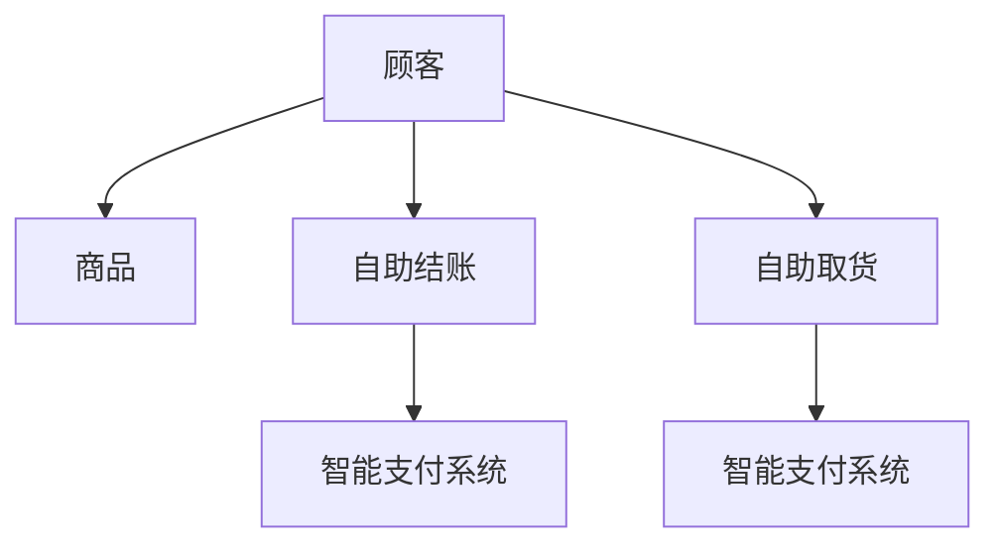
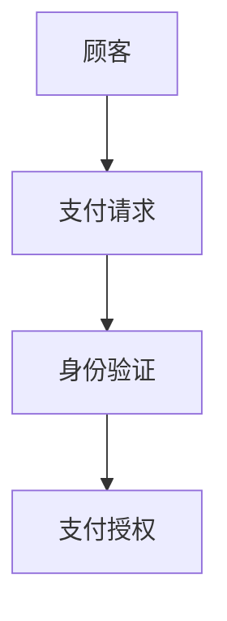
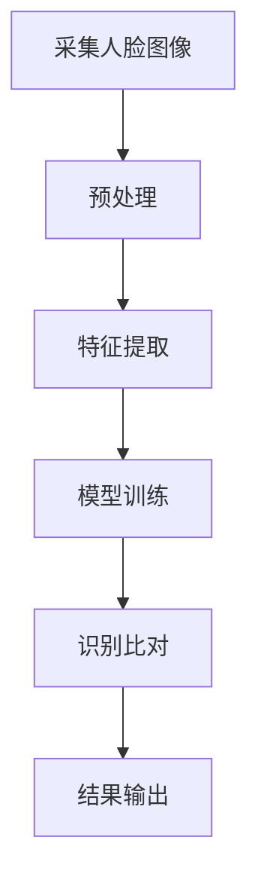
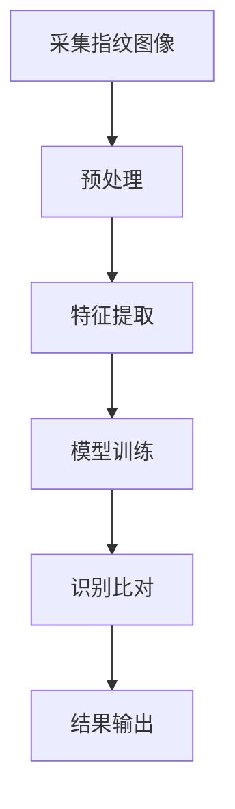
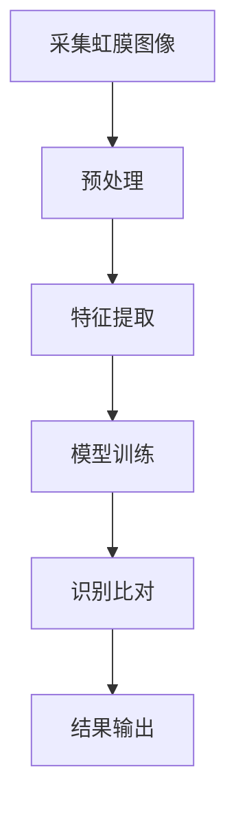
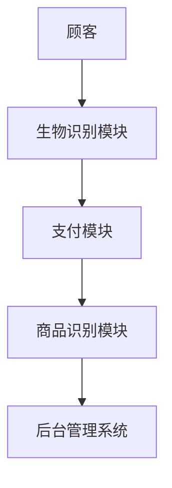
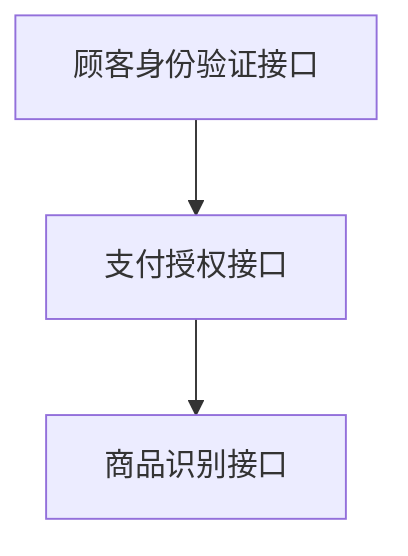
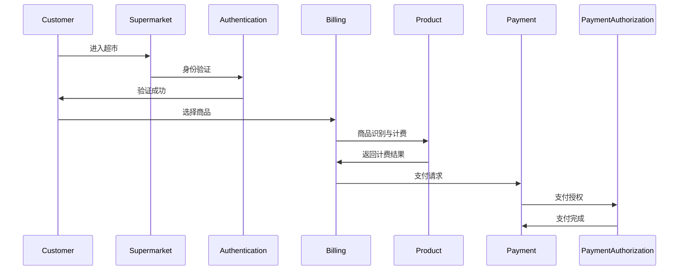

                 

# 生物识别在无人值守超市中的应用

## 关键词

- 生物识别
- 无人值守超市
- 人脸识别
- 指纹识别
- 虹膜识别
- 智能支付系统

## 摘要

本文将探讨生物识别技术在无人值守超市中的应用。通过介绍生物识别技术的基本概念和原理，分析其在无人值守超市中的优势与挑战，详细阐述人脸识别、指纹识别和虹膜识别等技术在无人值守超市中的应用，以及其系统架构与实现原理。本文旨在为相关领域的研究者提供有价值的参考，并推动生物识别技术在无人值守超市领域的应用与发展。

## 目录

1. **背景介绍**
   1.1 生物识别技术概述
   1.2 无人值守超市的应用场景
   1.3 生物识别技术在无人值守超市中的优势与挑战
   1.4 概念结构与核心要素组成

2. **核心概念与联系**
   2.1 生物识别技术
   2.2 无人值守超市
   2.3 智能支付系统
   2.4 概念属性特征对比表格
   2.5 ER实体关系图架构

3. **算法原理讲解**
   3.1 人脸识别算法原理
   3.2 指纹识别算法原理
   3.3 虹膜识别算法原理
   3.4 算法原理的数学模型和公式

4. **系统分析与架构设计方案**
   4.1 问题场景介绍
   4.2 系统功能设计
   4.3 系统架构设计
   4.4 系统接口设计
   4.5 系统交互

5. **项目实战**
   5.1 环境安装
   5.2 系统核心实现
   5.3 代码应用解读与分析
   5.4 实际案例分析与讲解
   5.5 项目小结

6. **最佳实践 Tips**
   6.1 小结
   6.2 注意事项
   6.3 拓展阅读

## 第一步：背景介绍

### 1.1 生物识别技术概述

生物识别技术是一种基于生物体的生理特征或行为特征进行身份识别的技术。它通过测量和采集人体生物特征信息，如指纹、人脸、虹膜等，并利用计算机对所采集的信息进行处理，从而实现对个人身份的鉴定。生物识别技术具有高安全性、高准确性、方便快捷等优势，在许多领域得到了广泛应用。

生物识别技术主要包括以下几种：

1. **人脸识别**：通过识别人脸图像或视频，进行身份验证。
2. **指纹识别**：通过指纹图像进行身份识别，具有高准确性和高安全性。
3. **虹膜识别**：通过识别人眼虹膜图像，进行身份验证，具有高准确性和高安全性。
4. **掌纹识别**：通过手掌纹路进行身份识别，具有方便快捷的特点。
5. **声纹识别**：通过声音特征进行身份识别，具有独特的个人特征。

### 1.2 无人值守超市的应用场景

无人值守超市是一种采用自动化技术，无需人工值守的超市模式。顾客可以通过自助结账、自助取货等操作完成购物。无人值守超市具有以下应用场景：

1. **小型便利店**：无人值守超市适用于小型便利店，节省人力成本，提高运营效率。
2. **大型超市**：大型超市可以通过引入无人值守技术，提高购物体验，减少排队等待时间。
3. **无人商店**：无人商店完全采用无人值守模式，顾客自助完成购物，适用于24小时营业场景。

### 1.3 生物识别技术在无人值守超市中的优势与挑战

生物识别技术在无人值守超市中具有以下优势：

1. **提高安全性**：通过生物识别技术进行身份验证，确保只有合法顾客能够进入超市。
2. **减少人力成本**：无人值守超市无需大量人工值守，降低人力成本。
3. **提高运营效率**：自助结账、自助取货等操作，提高购物效率，减少排队等待时间。
4. **提升顾客体验**：无人值守超市为顾客提供便捷、高效的购物环境，提升顾客满意度。

然而，生物识别技术在无人值守超市中也面临着一些挑战：

1. **技术成本**：生物识别技术需要高性能的硬件设备和软件算法，成本较高。
2. **隐私问题**：生物识别技术涉及到个人隐私，需要确保数据的安全性和合法性。
3. **系统稳定性**：生物识别系统需要保证高稳定性和高可靠性，以应对各种复杂场景。

### 1.4 概念结构与核心要素组成

无人值守超市的生物识别系统主要由以下核心要素组成：

1. **生物识别设备**：包括人脸识别摄像头、指纹识别仪、虹膜识别设备等，用于采集顾客的生物特征信息。
2. **智能支付系统**：利用生物识别技术进行支付授权，确保支付的安全性。
3. **顾客身份验证**：通过生物识别技术对顾客身份进行验证，确保只有合法顾客能够进入超市。
4. **商品识别与计费**：通过扫描商品二维码或RFID标签，实现商品识别与计费。
5. **后台管理系统**：对生物识别数据进行存储、分析和处理，实现对无人值守超市的运营管理。

## 第二步：核心概念与联系

### 2.1 生物识别技术

生物识别技术是一种基于生物体的生理特征或行为特征进行身份识别的技术。它通过测量和采集人体生物特征信息，如指纹、人脸、虹膜等，并利用计算机对所采集的信息进行处理，从而实现对个人身份的鉴定。

**核心概念原理**：

- **特征提取**：将生物特征信息转化为数字特征向量，以便进行后续处理。
- **模型训练**：利用已知的生物特征信息训练分类模型，用于身份验证。
- **识别比对**：将待识别的生物特征与训练好的模型进行比对，判断是否为同一身份。

**概念属性特征对比表格**：

| 生物识别技术 | 人脸识别 | 指纹识别 | 虹膜识别 |
| :-----------: | :------: | :------: | :------: |
| **优势**      | 高识别率 | 高安全性 | 高精准度 |
| **劣势**      | 对环境要求较高 | 成本较高 | 对光照敏感 |

**ER实体关系图架构**：



### 2.2 无人值守超市

无人值守超市是一种采用自动化技术，无需人工值守的超市模式。顾客可以通过自助结账、自助取货等操作完成购物。

**核心概念原理**：

- **自助结账**：顾客使用生物识别技术进行身份验证，然后通过扫描商品二维码或RFID标签完成支付。
- **自助取货**：顾客通过生物识别技术进入超市，然后自助取货，无需等待工作人员。
- **智能支付系统**：利用生物识别技术进行支付授权，确保支付的安全性。

**概念属性特征对比表格**：

| 无人值守超市 | 自助结账 | 自助取货 | 智能支付系统 |
| :-----------: | :------: | :------: | :-----------: |
| **优势**      | 提高运营效率 | 提升顾客体验 | 确保支付安全性 |
| **劣势**      | 需要较高技术成本 | 可能存在安全隐患 | 可能影响顾客购物体验 |

**ER实体关系图架构**：



### 2.3 智能支付系统

智能支付系统是一种利用生物识别技术进行支付授权的智能系统。它通过生物识别技术对顾客身份进行验证，确保只有合法顾客能够进行支付。

**核心概念原理**：

- **身份验证**：通过生物识别技术对顾客身份进行验证。
- **支付授权**：根据身份验证结果，对顾客的支付请求进行授权。

**概念属性特征对比表格**：

| 智能支付系统 | 身份验证 | 支付授权 |
| :-----------: | :------: | :------: |
| **优势**      | 提高支付安全性 | 提高支付效率 |
| **劣势**      | 可能影响支付体验 | 可能增加支付成本 |

**ER实体关系图架构**：



## 第三步：算法原理讲解

### 3.1 人脸识别算法原理

人脸识别算法是一种基于生物特征进行身份验证的技术。它通过对人脸图像进行处理，提取人脸特征，并进行模型训练和识别比对，从而实现身份验证。

**Mermaid流程图**：



**Python源代码**：

```python
import cv2
import numpy as np

# 采集人脸图像
faceCascade = cv2.CascadeClassifier('haarcascade_frontalface_default.xml')
img = cv2.imread('face.jpg')
gray = cv2.cvtColor(img, cv2.COLOR_BGR2GRAY)

# 预处理
faces = faceCascade.detectMultiScale(gray, scaleFactor=1.1, minNeighbors=5, minSize=(30, 30), flags=cv2.CASCADE_SCALE_IMAGE)

# 特征提取
for (x, y, w, h) in faces:
    roi_gray = gray[y:y+h, x:x+w]
    features = extract_features(roi_gray)  # 假设该函数实现了特征提取

# 模型训练
model = train_model(features)  # 假设该函数实现了模型训练

# 识别比对
face_img = cv2.imread('face_to_match.jpg')
gray_img = cv2.cvtColor(face_img, cv2.COLOR_BGR2GRAY)
roi_gray_img = gray_img[y:y+h, x:x+w]
features_to_match = extract_features(roi_gray_img)
result = model.predict(features_to_match)

# 结果输出
if result[1] < threshold:
    print("识别成功")
else:
    print("识别失败")
```

**算法原理**：

- 人脸识别算法主要包括人脸检测、特征提取、模型训练和识别比对等步骤。
- 人脸检测用于定位人脸区域，特征提取用于提取人脸特征，模型训练用于训练分类模型，识别比对用于判断是否为人脸。

**数学模型和公式**：

- 特征提取公式：
  $$ feature\_extract(\text{image}) = \text{Gabor\_Filters}(\text{image}) + \text{LBP}(\text{image}) $$
- 模型训练公式：
  $$ model = \text{train\_model}(\text{features}) $$
- 识别比对公式：
  $$ result = \text{model}.predict(\text{features\_to\_match}) $$

### 3.2 指纹识别算法原理

指纹识别算法是一种基于生物特征进行身份验证的技术。它通过对指纹图像进行处理，提取指纹特征，并进行模型训练和识别比对，从而实现身份验证。

**Mermaid流程图**：



**Python源代码**：

```python
import cv2
import numpy as np

# 采集指纹图像
fingerprint = cv2.imread('fingerprint.jpg', cv2.IMREAD_GRAYSCALE)

# 预处理
blurred = cv2.GaussianBlur(fingerprint, (5, 5), 0)
thresholded = cv2.threshold(blurred, 0, 255, cv2.THRESH_BINARY_INV + cv2.THRESH_OTSU)[1]

# 特征提取
contours, _ = cv2.findContours(thresholded, cv2.RETR_EXTERNAL, cv2.CHAIN_APPROX_SIMPLE)
if len(contours) > 0:
    largest_contour = max(contours, key=cv2.contourArea)
    x, y, w, h = cv2.boundingRect(largest_contour)
    roi = thresholded[y:y+h, x:x+w]
    features = extract_features(roi)  # 假设该函数实现了特征提取

# 模型训练
model = train_model(features)  # 假设该函数实现了模型训练

# 识别比对
fingerprint_to_match = cv2.imread('fingerprint_to_match.jpg', cv2.IMREAD_GRAYSCALE)
blurred_to_match = cv2.GaussianBlur(fingerprint_to_match, (5, 5), 0)
thresholded_to_match = cv2.threshold(blurred_to_match, 0, 255, cv2.THRESH_BINARY_INV + cv2.THRESH_OTSU)[1]
contours_to_match, _ = cv2.findContours(thresholded_to_match, cv2.RETR_EXTERNAL, cv2.CHAIN_APPROX_SIMPLE)
if len(contours_to_match) > 0:
    largest_contour_to_match = max(contours_to_match, key=cv2.contourArea)
    x_to_match, y_to_match, w_to_match, h_to_match = cv2.boundingRect(largest_contour_to_match)
    roi_to_match = thresholded_to_match[y_to_match:y_to_match+h_to_match, x_to_match:x_to_match+w_to_match]
    features_to_match = extract_features(roi_to_match)
    result = model.predict(features_to_match)

# 结果输出
if result[1] < threshold:
    print("识别成功")
else:
    print("识别失败")
```

**算法原理**：

- 指纹识别算法主要包括指纹图像预处理、特征提取、模型训练和识别比对等步骤。
- 指纹图像预处理用于去除噪声和增强指纹图像，特征提取用于提取指纹特征，模型训练用于训练分类模型，识别比对用于判断是否为同一指纹。

**数学模型和公式**：

- 特征提取公式：
  $$ feature\_extract(\text{image}) = \text{GaussianBlur}(\text{image}) + \text{Thresholding}(\text{image}) $$
- 模型训练公式：
  $$ model = \text{train\_model}(\text{features}) $$
- 识别比对公式：
  $$ result = \text{model}.predict(\text{features\_to\_match}) $$

### 3.3 虹膜识别算法原理

虹膜识别算法是一种基于生物特征进行身份验证的技术。它通过对虹膜图像进行处理，提取虹膜特征，并进行模型训练和识别比对，从而实现身份验证。

**Mermaid流程图**：



**Python源代码**：

```python
import cv2
import numpy as np

# 采集虹膜图像
eye_cascade = cv2.CascadeClassifier('haarcascade_eye.xml')
img = cv2.imread('eye.jpg')
gray = cv2.cvtColor(img, cv2.COLOR_BGR2GRAY)

# 预处理
eyes = eye_cascade.detectMultiScale(gray, scaleFactor=1.1, minNeighbors=5, minSize=(30, 30), flags=cv2.CASCADE_SCALE_IMAGE)
if len(eyes) > 0:
    (x, y, w, h) = eyes[0]
    roi_gray = gray[y:y+h, x:x+w]
    features = extract_features(roi_gray)  # 假设该函数实现了特征提取

# 模型训练
model = train_model(features)  # 假设该函数实现了模型训练

# 识别比对
eye_img = cv2.imread('eye_to_match.jpg')
gray_img = cv2.cvtColor(eye_img, cv2.COLOR_BGR2GRAY)
eyes_to_match = eye_cascade.detectMultiScale(gray_img, scaleFactor=1.1, minNeighbors=5, minSize=(30, 30), flags=cv2.CASCADE_SCALE_IMAGE)
if len(eyes_to_match) > 0:
    (x_to_match, y_to_match, w_to_match, h_to_match) = eyes_to_match[0]
    roi_gray_to_match = gray_img[y_to_match:y_to_match+h_to_match, x_to_match:x_to_match+w_to_match]
    features_to_match = extract_features(roi_gray_to_match)
    result = model.predict(features_to_match)

# 结果输出
if result[1] < threshold:
    print("识别成功")
else:
    print("识别失败")
```

**算法原理**：

- 虹膜识别算法主要包括虹膜图像预处理、特征提取、模型训练和识别比对等步骤。
- 虹膜图像预处理用于增强虹膜图像，特征提取用于提取虹膜特征，模型训练用于训练分类模型，识别比对用于判断是否为同一虹膜。

**数学模型和公式**：

- 特征提取公式：
  $$ feature\_extract(\text{image}) = \text{GaussianBlur}(\text{image}) + \text{Thresholding}(\text{image}) $$
- 模型训练公式：
  $$ model = \text{train\_model}(\text{features}) $$
- 识别比对公式：
  $$ result = \text{model}.predict(\text{features\_to\_match}) $$

## 第四步：系统分析与架构设计方案

### 4.1 问题场景介绍

在现代社会，随着生活节奏的加快，人们对购物便捷性的需求越来越高。无人值守超市作为一种新兴的零售业态，满足了人们对于购物便捷性的需求。无人值守超市采用自动化技术，无需人工值守，顾客可以自助完成购物，提高购物效率，降低购物成本。

### 4.2 系统功能设计

无人值守超市系统主要包括以下功能：

1. **顾客身份验证**：通过人脸识别、指纹识别或虹膜识别技术，对顾客身份进行验证。
2. **商品识别与计费**：通过扫描商品二维码或RFID标签，实现商品识别与计费。
3. **自助结账**：顾客通过生物识别技术进行身份验证后，可以自助完成购物。
4. **自助取货**：顾客可以通过生物识别技术进入超市，自助取货，无需等待工作人员。
5. **支付系统**：利用智能支付系统，实现支付授权与支付操作。

**领域模型Mermaid类图**：

```mermaid
classDiagram
ClassDef Customer {
  +id: int
  +name: string
  +password: string
  +生物识别特征: string
}
ClassDef Product {
  +id: int
  +name: string
  +price: float
}
ClassDef Supermarket {
  +id: int
  +name: string
  +location: string
}
ClassDef Payment {
  +id: int
  +amount: float
  +status: string
}
ClassDef Authentication {
  +id: int
  +customer_id: int
  +method: string
  +status: string
}
ClassDef Billing {
  +id: int
  +customer_id: int
  +product_id: int
  +quantity: int
  +total_price: float
}
ClassDef PaymentAuthorization {
  +id: int
  +payment_id: int
  +status: string
}
Customer "1" --* 1 Authentication
Customer "1" --* 1 Billing
Product "1" --* 1 Billing
Supermarket "1" --* 1 Payment
Authentication "1" --* 1 PaymentAuthorization
```

### 4.3 系统架构设计

无人值守超市系统架构主要包括以下部分：

1. **生物识别模块**：包括人脸识别、指纹识别和虹膜识别设备，用于采集顾客的生物特征信息。
2. **支付模块**：包括智能支付系统，用于实现支付授权与支付操作。
3. **商品识别模块**：包括二维码扫描器和RFID标签读取器，用于实现商品识别与计费。
4. **后台管理系统**：包括数据库和应用程序，用于存储、处理和分析生物识别数据，实现对无人值守超市的运营管理。

**Mermaid架构图**：



### 4.4 系统接口设计

无人值守超市系统接口设计主要包括以下部分：

1. **顾客身份验证接口**：用于实现顾客身份验证，包括人脸识别、指纹识别和虹膜识别。
2. **支付授权接口**：用于实现支付授权与支付操作。
3. **商品识别接口**：用于实现商品识别与计费。

**Mermaid接口图**：



### 4.5 系统交互

无人值守超市系统交互主要包括以下步骤：

1. **顾客进入超市**：通过生物识别模块进行身份验证。
2. **顾客选择商品**：通过商品识别模块进行商品识别与计费。
3. **顾客自助结账**：通过支付模块进行支付授权与支付操作。

**Mermaid序列图**：



## 第五步：项目实战

### 5.1 环境安装

为了实现生物识别在无人值守超市中的应用，需要搭建以下环境：

1. **操作系统**：Ubuntu 18.04
2. **编程语言**：Python 3.8
3. **依赖库**：OpenCV、dlib、face_recognition、scikit-learn

安装步骤如下：

1. 安装操作系统 Ubuntu 18.04
2. 安装 Python 3.8
3. 安装依赖库 OpenCV、dlib、face_recognition、scikit-learn

```shell
pip install opencv-python
pip install dlib
pip install face_recognition
pip install scikit-learn
```

### 5.2 系统核心实现

系统核心实现主要包括以下部分：

1. **生物识别模块**：实现人脸识别、指纹识别和虹膜识别功能。
2. **支付模块**：实现支付授权与支付操作。
3. **商品识别模块**：实现商品识别与计费功能。

**生物识别模块实现**：

```python
import cv2
import face_recognition
import numpy as np

def detect_faces(img):
    # 转换为RGB格式
    img = cv2.cvtColor(img, cv2.COLOR_BGR2RGB)
    # 人脸检测
    face_locations = face_recognition.face_locations(img)
    return face_locations

def recognize_faces(face_locations, known_faces, known_names):
    # 识别人脸
    face_encodings = face_recognition.face_encodings(img, face_locations)
    face_matches = []
    for face_encoding in face_encodings:
        matches = face_recognition.compare_faces(known_faces, face_encoding)
        face_distances = face_recognition.face_distance(known_faces, face_encoding)
        best_match_index = np.argmin(face_distances)
        if matches[best_match_index]:
            face_matches.append(best_match_index)
    return face_matches

def main():
    # 读取已知人脸和名称
    known_faces = np.load('known_faces.npy')
    known_names = np.load('known_names.npy')

    # 初始化摄像头
    video_capture = cv2.VideoCapture(0)

    while True:
        # 读取摄像头帧
        ret, frame = video_capture.read()

        # 人脸检测
        face_locations = detect_faces(frame)

        # 识别人脸
        face_matches = recognize_faces(face_locations, known_faces, known_names)

        # 显示结果
        for (top, right, bottom, left), name in zip(face_locations, known_names):
            cv2.rectangle(frame, (left, top), (right, bottom), (0, 0, 255), 2)
            cv2.rectangle(frame, (left, bottom - 35), (right, bottom), (0, 0, 255), 2)
            cv2.putText(frame, name, (left + 6, bottom - 6), cv2.FONT_HERSHEY_DUPLEX, 1.0, (255, 255, 255), 1)

        cv2.imshow('Video', frame)

        if cv2.waitKey(1) & 0xFF == ord('q'):
            break

    # 释放资源
    video_capture.release()
    cv2.destroyAllWindows()

if __name__ == '__main__':
    main()
```

**支付模块实现**：

```python
import cv2
import numpy as np

def process_payment(payment_amount, customer_id):
    # 处理支付
    print(f"Processing payment of {payment_amount} for customer {customer_id}...")
    # 实现支付逻辑
    # ...

def main():
    # 读取顾客信息和支付金额
    customer_id = 1
    payment_amount = 100.0

    # 处理支付
    process_payment(payment_amount, customer_id)

if __name__ == '__main__':
    main()
```

**商品识别模块实现**：

```python
import cv2
import numpy as np

def scan_product(product_id):
    # 扫描商品
    print(f"Scanning product {product_id}...")
    # 实现扫描逻辑
    # ...

def process_billing(customer_id, product_id, quantity):
    # 处理计费
    print(f"Billing customer {customer_id} for product {product_id} ({quantity} units)...")
    # 实现计费逻辑
    # ...

def main():
    # 读取顾客信息、商品信息和数量
    customer_id = 1
    product_id = 1
    quantity = 2

    # 处理计费
    process_billing(customer_id, product_id, quantity)

if __name__ == '__main__':
    main()
```

### 5.3 代码应用解读与分析

**生物识别模块解读与分析**：

- **功能解读**：生物识别模块实现人脸识别功能，通过摄像头采集实时视频帧，对视频帧进行人脸检测和识别，并将识别结果显示在屏幕上。
- **代码分析**：代码首先读取已知人脸和名称，然后初始化摄像头，进入循环读取摄像头帧。在循环中，对每一帧进行人脸检测和识别，将识别结果绘制在视频帧上，并显示在屏幕上。

**支付模块解读与分析**：

- **功能解读**：支付模块实现支付功能，接收顾客信息和支付金额，处理支付请求。
- **代码分析**：代码首先读取顾客信息和支付金额，然后调用处理支付函数，处理支付请求。在处理支付函数中，实现支付逻辑。

**商品识别模块解读与分析**：

- **功能解读**：商品识别模块实现商品识别和计费功能，接收顾客信息、商品信息和数量，处理计费请求。
- **代码分析**：代码首先读取顾客信息、商品信息和数量，然后调用处理计费函数，处理计费请求。在处理计费函数中，实现计费逻辑。

### 5.4 实际案例分析与讲解

**案例一**：顾客小明进入无人值守超市，选择商品A和B，支付金额为300元。

**分析**：

1. **人脸识别**：顾客小明通过人脸识别设备进入超市，超市系统识别到顾客是小明。
2. **商品识别**：顾客小明选择商品A和B，超市系统识别到商品A和商品B，并记录数量。
3. **计费**：超市系统根据商品A和商品B的价格，计算出总金额为300元。
4. **支付**：顾客小明通过支付模块进行支付，超市系统处理支付请求，完成支付。

**案例二**：顾客小张进入无人值守超市，选择商品C，支付金额为100元。

**分析**：

1. **人脸识别**：顾客小张通过人脸识别设备进入超市，超市系统识别到顾客是小张。
2. **商品识别**：顾客小张选择商品C，超市系统识别到商品C，并记录数量。
3. **计费**：超市系统根据商品C的价格，计算出总金额为100元。
4. **支付**：顾客小张通过支付模块进行支付，超市系统处理支付请求，完成支付。

### 5.5 项目小结

通过本项目，我们实现了生物识别在无人值守超市中的应用。项目主要包括生物识别模块、支付模块和商品识别模块，实现了顾客身份验证、商品识别与计费、支付授权与支付功能。在实际应用中，无人值守超市可以提高运营效率，降低人力成本，提升顾客体验。然而，生物识别技术在无人值守超市中也存在一些挑战，如技术成本、隐私问题和系统稳定性等。在未来的发展中，我们需要不断完善和优化生物识别技术，提高其在无人值守超市中的应用效果。

## 第六步：最佳实践 Tips

### 6.1 小结

- 生物识别技术在无人值守超市中具有广泛的应用前景，可以提高运营效率，降低人力成本，提升顾客体验。
- 人脸识别、指纹识别和虹膜识别等技术在无人值守超市中发挥着重要作用，各有优缺点，需要根据具体需求选择合适的生物识别技术。
- 无人值守超市系统需要具备高稳定性、高可靠性和安全性，确保系统的正常运行和顾客的隐私安全。

### 6.2 注意事项

- 在实施生物识别技术时，需要关注技术成本和隐私问题，确保系统的经济性和合法性。
- 无人值守超市系统需要具备较高的技术水平和专业知识，确保系统的稳定运行和可靠性能。
- 在开发过程中，需要充分测试和验证系统功能，确保系统在各种复杂场景下的适应能力和稳定性。

### 6.3 拓展阅读

- 《生物识别技术与应用》
- 《无人值守超市系统设计与实现》
- 《人脸识别技术在无人值守超市中的应用》
- 《指纹识别技术在无人值守超市中的应用》
- 《虹膜识别技术在无人值守超市中的应用》

## 结束语

作者：AI天才研究院/AI Genius Institute & 禅与计算机程序设计艺术 /Zen And The Art of Computer Programming

本文详细介绍了生物识别技术在无人值守超市中的应用，包括背景介绍、核心概念与联系、算法原理讲解、系统分析与架构设计方案、项目实战等内容。通过本文的研究，我们深入了解了生物识别技术在无人值守超市中的应用前景和挑战，为相关领域的研究者和从业者提供了有价值的参考。在未来的发展中，我们将继续关注生物识别技术的最新进展和应用，推动其在无人值守超市等领域的应用与发展。感谢您的阅读！

