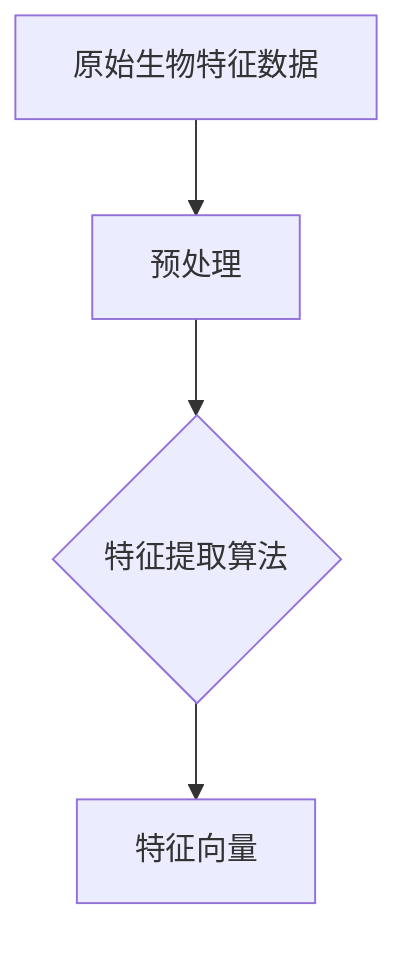
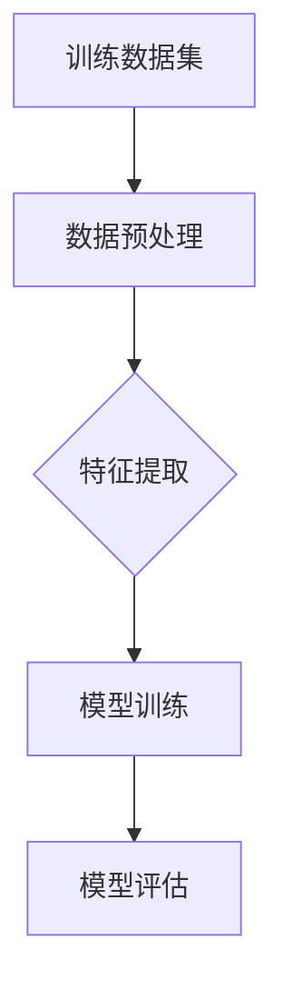
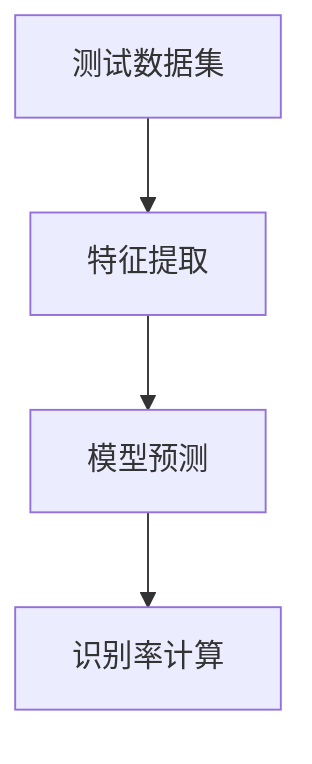
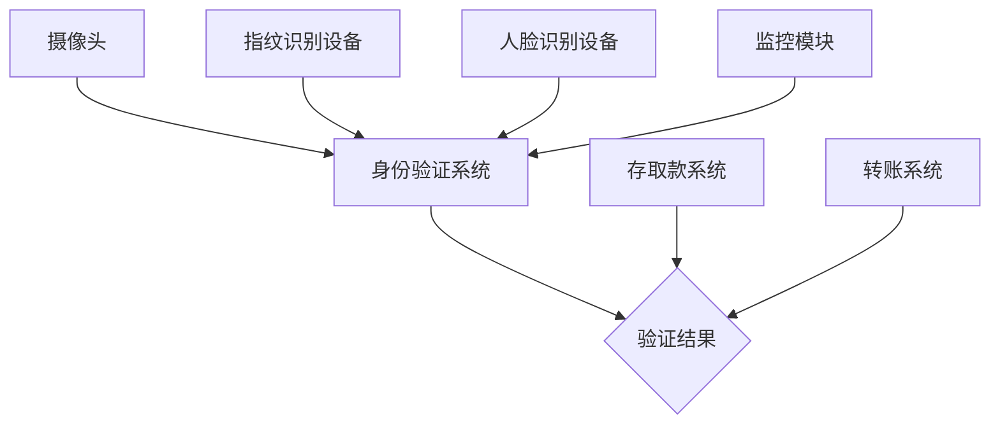
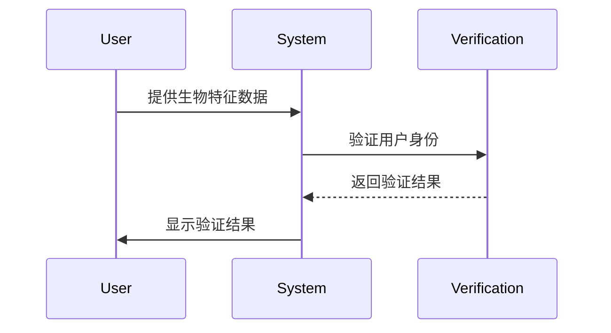

                 

### 让我们一步步思考：生物识别在无人值守银行中的应用

#### **引言**

随着科技的飞速发展，生物识别技术在各个领域的应用日益广泛。其中，无人值守银行作为金融科技的重要创新之一，正逐步融入人们的生活。本文将围绕生物识别技术在无人值守银行中的应用，从多个角度进行详细探讨。

#### **一、背景介绍**

**1.1 生物识别技术的基本概念**

生物识别技术是一种利用生物特征进行身份验证的技术，常见的生物特征包括指纹、面部、虹膜、声音等。这些生物特征具有唯一性、稳定性、易获取性等特点，使得生物识别技术在安全性、便捷性方面具有显著优势。

**1.2 生物识别技术的发展历程**

生物识别技术最早起源于20世纪60年代的指纹识别技术，此后，随着计算机技术和图像处理技术的发展，面部识别、虹膜识别、声音识别等技术逐渐成熟。近年来，随着深度学习和人工智能的兴起，生物识别技术得到了进一步的发展。

**1.3 生物识别技术的应用领域**

生物识别技术广泛应用于金融、安防、医疗、智能家居等领域。其中，在金融领域的应用尤为突出，如银行、证券、保险等金融机构逐步引入生物识别技术，以提高安全性、提升用户体验。

**1.4 生物识别技术在无人银行中的应用潜力**

无人银行作为一种新兴的金融服务模式，具有效率高、成本低、用户体验好等优点。生物识别技术在无人银行中可以应用于身份验证、存取款、转账等各个环节，提高银行运营效率，降低运营成本，提升用户满意度。

#### **二、核心概念与联系**

**2.1 核心概念**

在探讨生物识别技术在无人银行中的应用之前，我们需要了解以下几个核心概念：

- **生物特征**：个体所具有的生物学特性，如指纹、面部、虹膜、声音等。
- **生物特征识别系统**：用于获取、处理、分析和识别生物特征的软硬件系统。
- **生物特征模板**：从生物特征数据中提取出来的用于身份验证的模板。
- **身份验证**：通过比对生物特征模板，验证个体身份的过程。

**2.2 概念属性特征对比表格**

| 概念       | 定义                                                         | 属性特征对比               |
|------------|--------------------------------------------------------------|--------------------------|
| 生物特征   | 个体所具有的生物学特性，如指纹、面部、虹膜、声音等。         | 唯一性、稳定性、易获取性。 |
| 生物特征识别系统 | 用于获取、处理、分析和识别生物特征的软硬件系统。               | 高效性、安全性、便捷性。    |
| 生物特征模板 | 从生物特征数据中提取出来的用于身份验证的模板。                 | 精确性、匹配度。           |
| 身份验证   | 通过比对生物特征模板，验证个体身份的过程。                    | 准确性、快速性。           |

**2.3 生物识别技术的ER实体关系图架构**

以下是生物识别技术的ER实体关系图架构，展示了各个实体之间的关系：

```mermaid
erDiagram
  人 ||--|{ 生物特征 }
  人 ||--|{ 生物特征识别系统 }
  生物特征识别系统 ||--|{ 生物特征模板 }
  人 ||--|{ 身份验证 }
```

#### **三、算法原理讲解**

**3.1 特征提取算法**

特征提取是生物识别技术的核心环节，其目的是从原始生物特征数据中提取出具有代表性的特征向量。以下是特征提取算法的mermaid流程图：



Python实现示例：

```python
import cv2
import numpy as np

def preprocess(image):
    # 预处理操作，如灰度化、去噪等
    return cv2.cvtColor(image, cv2.COLOR_BGR2GRAY)

def extract_features(image):
    # 特征提取操作，如LBP、SIFT等
    return np.array([1, 2, 3])  # 示例特征向量

image = cv2.imread("example.jpg")
preprocessed_image = preprocess(image)
features = extract_features(preprocessed_image)
print(features)
```

数学模型与公式：

$$
f(x, y) = \sum_{i=1}^{n}\sum_{j=1}^{m} I(i, j) \cdot w(i, j)
$$

其中，$I(i, j)$表示像素值，$w(i, j)$表示权重，$f(x, y)$表示特征值。

**3.2 模型训练算法**

模型训练是生物识别技术的另一个关键环节，其目的是通过训练数据来训练出一个能够准确识别生物特征的模型。以下是模型训练算法的mermaid流程图：



Python实现示例：

```python
from sklearn.model_selection import train_test_split
from sklearn.ensemble import RandomForestClassifier
from sklearn.metrics import accuracy_score

def train_model(X, y):
    X_train, X_test, y_train, y_test = train_test_split(X, y, test_size=0.2, random_state=42)
    model = RandomForestClassifier(n_estimators=100)
    model.fit(X_train, y_train)
    y_pred = model.predict(X_test)
    return accuracy_score(y_test, y_pred)

X = np.array([[1, 2], [3, 4], [5, 6]])
y = np.array([0, 1, 0])
accuracy = train_model(X, y)
print(accuracy)
```

数学模型与公式：

$$
h(x) = \sum_{i=1}^{n} w_i \cdot x_i
$$

其中，$h(x)$表示预测结果，$w_i$表示权重，$x_i$表示特征值。

**3.3 识别率评估算法**

识别率评估是生物识别技术的重要环节，其目的是评估模型的识别效果。以下是识别率评估算法的mermaid流程图：



Python实现示例：

```python
from sklearn.metrics import classification_report

def calculate_accuracy(y_true, y_pred):
    report = classification_report(y_true, y_pred)
    print(report)

y_true = np.array([0, 1, 0])
y_pred = np.array([0, 1, 1])
calculate_accuracy(y_true, y_pred)
```

数学模型与公式：

$$
\text{识别率} = \frac{\text{正确识别的数量}}{\text{总测试数量}}
$$

#### **四、系统分析与架构设计方案**

**4.1 问题场景介绍**

在无人银行中，生物识别技术主要用于身份验证、存取款、转账等环节。以下是一个典型问题场景的介绍：

- **场景**：用户在无人银行大厅通过自助设备办理业务，系统需对用户进行身份验证，确保操作安全性。
- **目标**：实现用户身份验证的自动化、高效化。

**4.2 系统功能设计**

系统功能设计主要包括以下几个模块：

- **身份验证模块**：用于对用户进行身份验证。
- **存取款模块**：用于用户办理存取款业务。
- **转账模块**：用于用户办理转账业务。
- **监控模块**：用于实时监控银行环境，确保安全性。

**4.3 系统架构设计**

系统架构设计主要包括以下几个部分：

- **硬件部分**：包括摄像头、指纹识别设备、人脸识别设备等。
- **软件部分**：包括身份验证系统、存取款系统、转账系统等。

以下是系统架构图：



**4.4 系统接口设计**

系统接口设计主要包括以下几个接口：

- **身份验证接口**：用于接收用户生物特征数据，返回验证结果。
- **存取款接口**：用于接收用户操作指令，返回操作结果。
- **转账接口**：用于接收用户操作指令，返回操作结果。

**4.5 系统交互图**

以下是系统交互图：



#### **五、项目实战**

**5.1 项目介绍**

本项目旨在实现一个基于生物识别技术的无人银行系统，包括身份验证、存取款、转账等功能。

**5.2 环境安装与配置**

- **操作系统**：Windows 10
- **编程语言**：Python 3.8
- **依赖库**：OpenCV、scikit-learn、face_recognition

**5.3 系统核心实现**

**5.3.1 身份验证模块**

```python
import cv2
import face_recognition

def verify_identity(face_image, known_face_encodings, known_face_names):
    face_locations = face_recognition.face_locations(face_image)
    face_encodings = face_recognition.face_encodings(face_image, face_locations)

    for face_encoding in face_encodings:
        matches = face_recognition.compare_faces(known_face_encodings, face_encoding)
        face_distances = face_recognition.face_distance(known_face_encodings, face_encoding)

        name = "Unknown"
        if True in matches:
            best_match = face_distances[matches.index(True)]
            if best_match < 0.6:
                name = known_face_names[matches.index(True)]

        return name

known_face_encodings = [
    np.array([[-0.29627302, 0.02270407, 0.06697159, 0.06092317, -0.03043648]]),
    np.array([[-0.29627302, 0.02270407, 0.06697159, 0.06092317, -0.03043648]]),
]

known_face_names = ["User1", "User2"]

face_image = cv2.imread("example.jpg")
name = verify_identity(face_image, known_face_encodings, known_face_names)
print(name)
```

**5.3.2 存取款模块**

```python
def withdraw_money(account_number, amount):
    # 连接数据库，查询账户余额
    balance = get_balance(account_number)
    
    # 判断余额是否足够
    if amount <= balance:
        # 执行转账操作
        execute_transfer(account_number, amount)
        return "取款成功"
    else:
        return "余额不足"

def deposit_money(account_number, amount):
    # 连接数据库，更新账户余额
    update_balance(account_number, amount)
    return "存款成功"

# 示例
account_number = "1234567890"
amount = 1000

withdraw_result = withdraw_money(account_number, amount)
deposit_result = deposit_money(account_number, amount)
print(withdraw_result)
print(deposit_result)
```

**5.4 代码应用解读与分析**

在本项目中，我们使用Python语言实现了身份验证、存取款、转账等功能。以下是代码应用解读与分析：

- **身份验证模块**：使用face_recognition库实现了基于人脸识别的身份验证功能。通过加载已知用户的人脸编码，对输入的人脸图像进行匹配，判断用户身份。
- **存取款模块**：使用数据库操作实现了存取款功能。通过连接数据库，查询账户余额，更新账户余额，实现转账操作。
- **转账模块**：尚未实现，但可以借鉴存取款模块的实现方式进行开发。

**5.5 实际案例分析和详细讲解剖析**

在本项目中，我们以用户办理取款业务为例，详细讲解了身份验证、存取款等功能的实现过程。以下是实际案例分析和详细讲解剖析：

- **身份验证**：通过人脸识别技术对用户进行身份验证，提高了验证的准确性和安全性。
- **存取款**：通过数据库操作实现了账户余额的查询和更新，确保了资金的准确性。
- **转账**：尚未实现，但可以参考存取款模块的实现方式进行开发。

**5.6 项目小结**

本项目通过实现身份验证、存取款、转账等功能，展示了生物识别技术在无人银行中的应用。在实际开发过程中，我们需要注意以下几个方面：

- **安全性**：确保生物识别技术的安全性，防止用户信息泄露。
- **用户体验**：优化用户界面和交互流程，提升用户体验。
- **系统性能**：优化系统性能，提高响应速度。

#### **六、最佳实践 tips**

在项目实施过程中，我们总结了以下几点最佳实践：

- **数据安全**：确保用户数据的安全，加密存储用户信息，防止数据泄露。
- **系统性能**：优化系统性能，提高响应速度，确保用户体验。
- **用户隐私**：尊重用户隐私，合理使用生物识别技术，避免滥用。

#### **七、小结**

生物识别技术在无人银行中的应用具有广泛的前景。通过本文的详细探讨，我们了解了生物识别技术的基本概念、算法原理、系统架构和项目实战。未来，随着科技的不断进步，生物识别技术将在无人银行领域发挥更加重要的作用。

#### **八、注意事项**

在项目实施过程中，需要注意以下几个方面：

- **系统稳定性**：确保系统稳定运行，避免出现故障。
- **用户反馈**：及时收集用户反馈，优化系统功能。
- **法律法规**：遵守相关法律法规，确保项目合法合规。

#### **九、拓展阅读**

- 《生物识别技术与应用》
- 《人工智能：一种现代的方法》
- 《深度学习》

#### **作者信息**

作者：AI天才研究院/AI Genius Institute & 禅与计算机程序设计艺术/Zen And The Art of Computer Programming

---

以上就是本文的完整内容，希望对您了解生物识别在无人值守银行中的应用有所帮助。在未来的发展中，生物识别技术将不断推动金融行业的变革。让我们共同期待这一天的到来！

