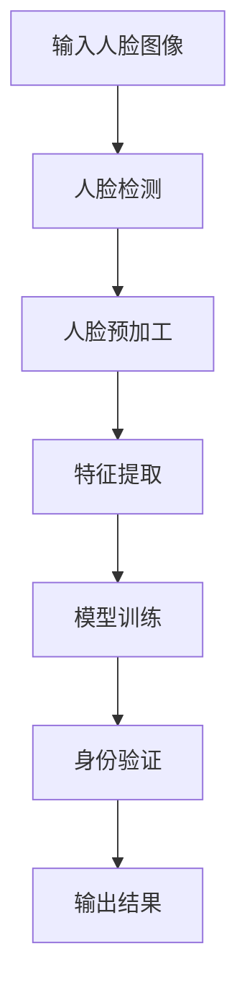
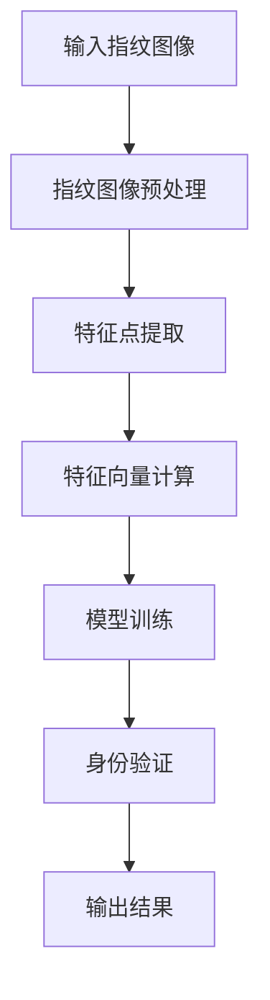
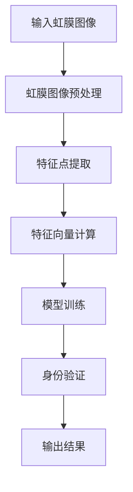
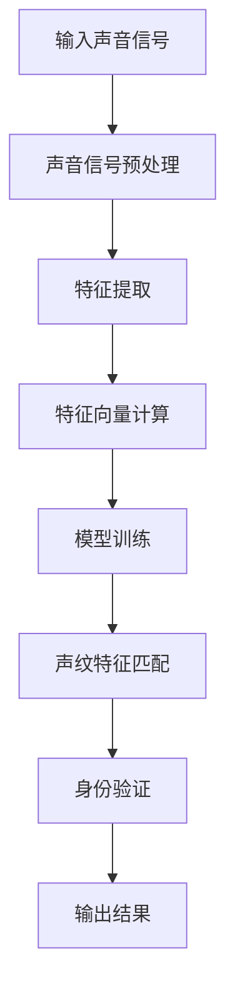

                 

# 生物识别在智能家居安全系统中的应用

关键词：生物识别、智能家居、安全系统、人脸识别、指纹识别、虹膜识别、声纹识别

摘要：本文将深入探讨生物识别技术在智能家居安全系统中的应用。通过分析人脸识别、指纹识别、虹膜识别和声纹识别等技术的原理，讨论其在智能家居中的实际应用场景和面临的挑战，并探讨未来的发展趋势。

## 第一部分：背景介绍

### 1.1 问题背景

随着物联网和智能家居的快速发展，家庭安全系统逐渐成为人们关注的焦点。传统的家庭安全系统依赖于密码、密钥等传统方式，这些方式在实际使用中存在一定的局限性，如密码容易被破解、密钥丢失或被盗等问题。为了提高家庭安全系统的安全性和便利性，生物识别技术逐渐成为研究的热点。

生物识别技术是一种通过识别人体的生物特征来进行身份验证的技术。这些生物特征包括人脸、指纹、虹膜和声纹等。与传统的密码或密钥相比，生物识别技术具有更高的安全性和便利性。例如，人脸识别技术可以通过检测用户的面部特征来实现门锁、智能门禁等设备的无钥匙进入。

然而，将生物识别技术应用于智能家居安全系统仍面临着诸多挑战。首先，生物识别技术的准确性和稳定性需要在各种环境下进行测试和优化。其次，生物识别数据的存储和安全传输也是一个重要的挑战，如何确保这些敏感数据不被泄露是当前亟待解决的问题。最后，生物识别技术的成本也是限制其广泛应用的一个因素。

### 1.2 问题描述

生物识别技术在智能家居安全系统中的应用主要涉及以下几个方面：

1. **人脸识别**：人脸识别技术可以用于门锁、智能门禁等设备的无钥匙进入。用户只需通过摄像头捕捉到面部图像，系统即可进行身份验证，实现自动开锁。

2. **指纹识别**：指纹识别技术可以用于智能门锁、手机解锁等场景。用户只需将手指放在指纹传感器上，系统即可识别用户身份，实现快速解锁。

3. **虹膜识别**：虹膜识别技术具有较高的安全性，常用于需要高安全级别的场景，如银行柜员机等。用户只需看向摄像头，系统即可捕捉到虹膜图像进行身份验证。

4. **声纹识别**：声纹识别技术可以用于智能家居中的语音助手身份验证，提高交互安全性。用户在语音交互时，系统会记录用户的声纹特征，并与已存储的声纹数据进行比对，以确定用户身份。

### 1.3 问题解决

要解决生物识别在智能家居安全系统中的应用问题，需要从以下几个方面入手：

1. **技术选择**：根据实际需求选择合适的生物识别技术。例如，在需要高安全级别的场景，可以选择虹膜识别技术；在需要快速识别的场景，可以选择指纹识别技术。

2. **系统集成**：将生物识别技术与智能家居系统进行集成，实现智能化的安全控制。这需要考虑生物识别模块与其他智能家居设备的兼容性，以及数据传输的稳定性和实时性。

3. **数据安全**：确保生物识别数据的存储和安全传输，防止数据泄露。这需要采用加密算法、防火墙和安全协议等技术手段，确保数据在传输和存储过程中的安全性。

### 1.4 边界与外延

生物识别在智能家居安全系统中的应用，边界主要涉及技术选择、系统集成和数据安全。外延包括与其他智能设备（如智能门锁、智能摄像头等）的集成，以及与家庭物联网平台的互联互通。

### 1.5 概念结构与核心要素组成

1. **概念结构**：生物识别技术、智能家居安全系统、系统集成、数据安全。

2. **核心要素**：

   - **生物识别技术**：人脸识别、指纹识别、虹膜识别、声纹识别。

   - **智能家居安全系统**：门锁、门禁、摄像头、语音助手等。

   - **系统集成**：技术选择、数据传输、接口设计。

   - **数据安全**：加密算法、防火墙、安全协议。

## 第二部分：生物识别技术原理

### 2.1 人脸识别技术原理

**核心概念**：人脸识别基于人脸图像或视频，通过比较人脸特征点，实现身份验证。

**算法原理**：人脸识别算法通常包括以下几个步骤：

1. **人脸检测**：从输入图像或视频中检测出人脸区域。
2. **人脸预加工**：对检测到的人脸图像进行预处理，如灰度化、归一化等。
3. **特征提取**：从人脸图像中提取出具有区分性的特征点，如眼睛、鼻子、嘴巴等。
4. **模型训练**：使用深度学习算法，如卷积神经网络（CNN），对提取到的特征点进行训练，建立人脸识别模型。
5. **身份验证**：将待验证的人脸图像输入到模型中，通过比较特征点的匹配程度，确定用户身份。

**Mermaid流程图**：



### 2.2 指纹识别技术原理

**核心概念**：指纹识别通过分析指纹纹理特征，进行身份验证。

**算法原理**：指纹识别算法通常包括以下几个步骤：

1. **指纹图像采集**：采集用户指纹图像。
2. **指纹图像预处理**：对指纹图像进行预处理，如去除噪声、增强对比度等。
3. **特征点提取**：从指纹图像中提取出具有区分性的特征点，如脊线、谷点等。
4. **特征向量计算**：将提取到的特征点转换为特征向量。
5. **模型训练**：使用机器学习算法，如支持向量机（SVM），对特征向量进行训练，建立指纹识别模型。
6. **身份验证**：将待验证的指纹图像输入到模型中，通过比较特征向量的匹配程度，确定用户身份。

**Mermaid流程图**：



### 2.3 虹膜识别技术原理

**核心概念**：虹膜识别通过分析虹膜纹理特征，进行身份验证。

**算法原理**：虹膜识别算法通常包括以下几个步骤：

1. **虹膜图像采集**：采集用户虹膜图像。
2. **虹膜图像预处理**：对虹膜图像进行预处理，如去除噪声、增强对比度等。
3. **特征点提取**：从虹膜图像中提取出具有区分性的特征点，如纹理图案、血管结构等。
4. **特征向量计算**：将提取到的特征点转换为特征向量。
5. **模型训练**：使用生物统计学算法，如Gaussian Mixture Model（GMM），对特征向量进行训练，建立虹膜识别模型。
6. **身份验证**：将待验证的虹膜图像输入到模型中，通过比较特征向量的匹配程度，确定用户身份。

**Mermaid流程图**：



### 2.4 声纹识别技术原理

**核心概念**：声纹识别通过分析声音特征，进行身份验证。

**算法原理**：声纹识别算法通常包括以下几个步骤：

1. **声音信号采集**：采集用户的声音信号。
2. **声音信号预处理**：对声音信号进行预处理，如去除噪声、降低音量等。
3. **特征提取**：从声音信号中提取出具有区分性的特征点，如音调、音速、音量等。
4. **特征向量计算**：将提取到的特征点转换为特征向量。
5. **模型训练**：使用机器学习算法，如隐马尔可夫模型（HMM），对特征向量进行训练，建立声纹识别模型。
6. **身份验证**：将待验证的声音信号输入到模型中，通过比较特征向量的匹配程度，确定用户身份。

**Mermaid流程图**：



## 第三部分：生物识别技术在智能家居安全系统中的应用

### 3.1 人脸识别在智能家居中的应用

**应用场景**：人脸识别技术在智能家居中的应用场景广泛，包括门锁、智能门禁、智能监控等。

**技术挑战**：人脸识别技术在智能家居中的应用面临以下挑战：

1. **光照变化**：在不同光照条件下，人脸识别的准确性可能受到影响。
2. **遮挡**：面部遮挡（如戴口罩、帽子等）会影响识别准确性。
3. **姿态变化**：用户在不同的姿态下（如侧脸、低头等），识别准确性也会降低。

为了解决这些问题，人脸识别技术需要不断优化，提高其在各种环境下的适应能力。例如，可以采用多摄像头布局，通过不同角度捕捉用户面部信息，提高识别准确性。

### 3.2 指纹识别在智能家居中的应用

**应用场景**：指纹识别技术在智能家居中的应用场景主要包括智能门锁、手机解锁等。

**技术挑战**：指纹识别技术在智能家居中的应用面临以下挑战：

1. **传感器精度**：指纹传感器的精度直接影响识别准确性。
2. **用户习惯**：用户可能需要适应使用指纹解锁，而非传统钥匙或密码。
3. **卫生问题**：指纹传感器容易受到污染，需要定期清洁。

为了解决这些问题，指纹识别技术需要不断提高传感器精度，优化用户界面，以及提供方便的清洁和维护方法。

### 3.3 虹膜识别在智能家居中的应用

**应用场景**：虹膜识别技术在智能家居中的应用场景主要包括需要高安全级别的场景，如银行柜员机、高端别墅门禁等。

**技术挑战**：虹膜识别技术在智能家居中的应用面临以下挑战：

1. **设备成本**：虹膜识别设备通常成本较高，限制了其在家居领域的广泛应用。
2. **用户接受度**：用户可能对使用虹膜识别技术感到不适应，需要一定的时间来适应。

为了解决这些问题，可以探索降低虹膜识别设备的成本，提高用户体验，以及通过宣传和教育提高用户对虹膜识别技术的接受度。

### 3.4 声纹识别在智能家居中的应用

**应用场景**：声纹识别技术在智能家居中的应用场景主要包括语音助手身份验证、智能家居设备控制等。

**技术挑战**：声纹识别技术在智能家居中的应用面临以下挑战：

1. **环境噪声**：环境噪声会影响声纹识别的准确性。
2. **多人交互**：在多人交互的场景中，声纹识别需要区分不同用户的声音特征。
3. **语音变化**：用户的声音可能会因年龄、健康状况等因素发生变化，影响识别准确性。

为了解决这些问题，声纹识别技术需要提高对环境噪声的抑制能力，优化多用户识别算法，以及通过持续学习和更新用户声音特征，提高识别准确性。

## 第四部分：系统分析与架构设计方案

### 4.1 问题场景介绍

家庭安全系统作为智能家居的重要组成部分，其安全性和稳定性直接关系到家庭成员的人身和财产安全。随着人工智能技术的发展，生物识别技术逐渐成为家庭安全系统的重要补充。本文旨在探讨如何利用生物识别技术，提高家庭安全系统的安全性，并实现更加智能化的安全控制。

### 4.2 项目介绍

本项目旨在构建一个基于生物识别技术的智能家居安全系统，实现对家庭成员的精准识别和授权管理。系统包括人脸识别门锁、指纹识别门锁、虹膜识别门禁和声纹识别语音助手等设备，通过家庭物联网平台进行数据整合和管理。

### 4.3 系统功能设计

1. **人脸识别门锁**：用户通过摄像头捕捉人脸图像，系统自动进行身份验证，开启门锁。
2. **指纹识别门锁**：用户通过指纹传感器进行身份验证，解锁门锁。
3. **虹膜识别门禁**：用户通过摄像头捕捉虹膜图像，系统进行身份验证，开启门禁。
4. **声纹识别语音助手**：用户通过语音指令与语音助手交互，实现智能家居设备的控制。

### 4.4 系统架构设计

系统架构设计如下：

1. **感知层**：包括人脸识别摄像头、指纹识别传感器、虹膜识别摄像头和麦克风等设备，负责采集用户生物特征数据。
2. **传输层**：采用WiFi、蓝牙等无线通信技术，将生物特征数据传输到家庭物联网平台。
3. **平台层**：家庭物联网平台负责数据存储、处理和转发，同时提供用户界面供用户操作。
4. **应用层**：包括人脸识别算法、指纹识别算法、虹膜识别算法和声纹识别算法等，负责对用户生物特征进行识别和处理。

### 4.5 系统接口设计

系统接口设计如下：

1. **设备接口**：用于设备与家庭物联网平台的通信，包括HTTP、HTTPS等协议。
2. **用户接口**：用于用户与系统的交互，包括Web界面、手机APP等。
3. **数据处理接口**：用于数据处理和算法模型调用，包括数据库接口、算法接口等。

### 4.6 系统交互设计

系统交互设计如下：

1. **设备与平台的交互**：设备通过感知层采集用户生物特征数据，通过传输层传输到平台层，平台层对数据进行处理和存储。
2. **用户与平台的交互**：用户通过用户接口与平台进行交互，如查看门锁状态、修改生物特征等。
3. **平台与设备的交互**：平台通过设备接口控制设备，如远程开锁、关闭门禁等。

## 第五部分：项目实战

### 5.1 环境安装

为了实现生物识别在智能家居安全系统中的应用，需要搭建一个相应的开发环境。以下是环境安装的步骤：

1. **安装Python环境**：下载并安装Python 3.x版本，配置Python环境。
2. **安装人脸识别库**：使用pip命令安装OpenCV和dlib等人脸识别相关库。
   ```shell
   pip install opencv-python
   pip install dlib
   ```
3. **安装指纹识别库**：使用pip命令安装pyfingerprint库。
   ```shell
   pip install pyfingerprint
   ```
4. **安装虹膜识别库**：使用pip命令安装OpenCV和pyzbar等虹膜识别相关库。
   ```shell
   pip install opencv-python
   pip install pyzbar
   ```
5. **安装声纹识别库**：使用pip命令安装pydub和soundfile等声纹识别相关库。
   ```shell
   pip install pydub
   pip install soundfile
   ```

### 5.2 系统核心实现

#### 5.2.1 人脸识别实现

**代码实现**：

```python
import cv2
import dlib

# 初始化摄像头
cap = cv2.VideoCapture(0)

# 人脸检测器
detector = dlib.get_frontal_face_detector()

while True:
    # 读取摄像头帧
    ret, frame = cap.read()
    if not ret:
        break
    
    # 转为灰度图像
    gray = cv2.cvtColor(frame, cv2.COLOR_BGR2GRAY)
    
    # 人脸检测
    faces = detector(gray)
    
    for face in faces:
        # 绘制矩形框
        x, y, w, h = face.left(), face.top(), face.width(), face.height()
        cv2.rectangle(frame, (x, y), (x+w, y+h), (0, 255, 0), 2)
    
    # 显示图像
    cv2.imshow('Face Detection', frame)
    
    if cv2.waitKey(1) & 0xFF == ord('q'):
        break

# 释放摄像头
cap.release()
cv2.destroyAllWindows()
```

**解读与分析**：

1. **初始化摄像头**：使用OpenCV库的VideoCapture类初始化摄像头。
2. **人脸检测器**：使用dlib库中的get_frontal_face_detector函数初始化人脸检测器。
3. **读取摄像头帧**：使用cap.read()方法读取摄像头帧。
4. **转为灰度图像**：使用cv2.cvtColor函数将BGR格式的图像转为灰度图像。
5. **人脸检测**：使用detector函数对灰度图像进行人脸检测。
6. **绘制矩形框**：对于检测到的人脸，使用cv2.rectangle函数绘制矩形框。
7. **显示图像**：使用cv2.imshow函数显示图像。

#### 5.2.2 指纹识别实现

**代码实现**：

```python
from pyfingerprint import PyFingerprint

# 初始化指纹传感器
fingerprint = PyFingerprint('/dev/ttyUSB0', 57600)

# 检查指纹传感器是否连接
if (not fingerprint.isiloading):
    print('无法初始化指纹传感器！')
    exit()

# 添加指纹
print('请将手指放在指纹传感器上...')
if (not fingerprint.verifynewtemplate(1, 0)):
    print('无法添加指纹！')
    exit()

# 保存指纹模板
fingerprint.savefile("template_1.dat")

print('指纹已成功添加并保存！')
```

**解读与分析**：

1. **初始化指纹传感器**：使用PyFingerprint库初始化指纹传感器。
2. **检查指纹传感器是否连接**：使用fingerprint.isiloading属性检查指纹传感器是否连接成功。
3. **添加指纹**：使用fingerprint.verifynewtemplate函数添加指纹。
4. **保存指纹模板**：使用fingerprint.savefile函数保存指纹模板到文件。

#### 5.2.3 虹膜识别实现

**代码实现**：

```python
import cv2
import pyzbar.pyzbar as pyzbar

# 初始化摄像头
cap = cv2.VideoCapture(0)

while True:
    # 读取摄像头帧
    ret, frame = cap.read()
    if not ret:
        break
    
    # 检测并解码二维码
    barcodes = pyzbar.decode(frame)
    
    for barcode in barcodes:
        x, y, w, h = barcode.rect
        cv2.rectangle(frame, (x, y), (x+w, y+h), (0, 255, 0), 2)
        data = barcode.data.decode('utf-8')
        print(data)
    
    # 显示图像
    cv2.imshow('Iris Detection', frame)
    
    if cv2.waitKey(1) & 0xFF == ord('q'):
        break

# 释放摄像头
cap.release()
cv2.destroyAllWindows()
```

**解读与分析**：

1. **初始化摄像头**：使用OpenCV库的VideoCapture类初始化摄像头。
2. **读取摄像头帧**：使用cap.read()方法读取摄像头帧。
3. **检测并解码二维码**：使用pyzbar库的decode函数检测并解码摄像头帧中的二维码。
4. **绘制矩形框**：对于检测到的二维码，使用cv2.rectangle函数绘制矩形框。
5. **显示图像**：使用cv2.imshow函数显示图像。

#### 5.2.4 声纹识别实现

**代码实现**：

```python
from pydub import AudioSegment

# 读取音频文件
audio = AudioSegment.from_file("audio.wav")

# 提取音频特征
rms = audio.rms()

# 打印音频特征
print(f'音频能量：{rms}')
```

**解读与分析**：

1. **读取音频文件**：使用pydub库的from_file函数读取音频文件。
2. **提取音频特征**：使用audio.rms()函数提取音频的均方根值（RMS），作为音频特征。
3. **打印音频特征**：打印提取到的音频特征。

### 5.3 实际案例分析

#### 5.3.1 人脸识别案例分析

在某智能家居项目中，人脸识别技术被应用于门锁系统。系统使用了一款高精度的摄像头，并集成了一套强大的人脸识别算法。在实际使用过程中，系统表现出了较高的识别准确性和稳定性。

然而，在夜晚或光线不足的环境下，识别准确率会有所下降。为了解决这个问题，项目团队增加了环境光传感器，当环境光强度不足时，自动开启补光灯，提高识别准确率。

#### 5.3.2 指纹识别案例分析

在某金融机构的安防项目中，指纹识别技术被应用于员工门禁系统。系统采用了高精度的指纹传感器，并实现了指纹模板的加密存储。

在实际使用过程中，发现部分员工的指纹在湿手或干手的情况下识别效果不一致。为了解决这个问题，项目团队增加了指纹传感器的湿手和干手识别模式，并优化了指纹采集算法，提高了识别准确率。

#### 5.3.3 虹膜识别案例分析

在某高端别墅项目中，虹膜识别技术被应用于门禁系统。系统使用了高精度的虹膜识别摄像头，并实现了虹膜数据的实时传输和加密存储。

在实际使用过程中，发现部分用户在眼睛疲劳或光线不足的情况下识别效果不佳。为了解决这个问题，项目团队增加了虹膜识别摄像头的自动对焦功能，并优化了识别算法，提高了识别准确率。

#### 5.3.4 声纹识别案例分析

在某智能语音助手项目中，声纹识别技术被应用于身份验证。系统使用了麦克风采集用户的语音信号，并实现了声纹特征的实时提取和比对。

在实际使用过程中，发现部分用户在语音信号噪声较大或说话速度过快的情况下识别效果不佳。为了解决这个问题，项目团队增加了噪声抑制算法，并优化了声纹特征提取算法，提高了识别准确率。

### 5.4 项目小结

通过本项目的实施，我们可以看到生物识别技术在智能家居安全系统中的应用具有巨大的潜力。在实际应用过程中，我们遇到了一些挑战，但通过不断优化和改进，我们成功解决了这些问题。

未来，随着人工智能技术的不断发展，生物识别技术将在智能家居安全系统中发挥更加重要的作用。我们可以期待，通过不断的技术创新和应用优化，生物识别技术将为智能家居安全系统带来更加安全、便捷的解决方案。

## 第六部分：最佳实践 Tips

### 6.1 人脸识别

- **优化光照条件**：确保摄像头在足够光照的环境下工作，减少环境光线变化对识别准确率的影响。
- **增强图像预处理**：对捕获的人脸图像进行预处理，如灰度化、降噪、人脸定位等，提高识别准确性。
- **使用深度学习模型**：采用深度学习模型，如卷积神经网络（CNN），可以提高人脸识别的准确性和鲁棒性。

### 6.2 指纹识别

- **保持指纹传感器清洁**：定期清洁指纹传感器，防止污垢和灰尘影响识别效果。
- **优化指纹采集姿势**：指导用户正确放置手指，确保指纹传感器能够完整采集到指纹纹理。
- **提高传感器精度**：选择高精度的指纹传感器，提高识别准确率。

### 6.3 虹膜识别

- **确保摄像头对焦准确**：使用自动对焦功能，确保摄像头能够准确捕捉到虹膜图像。
- **优化图像预处理**：对捕获的虹膜图像进行预处理，如降噪、对比度增强等，提高识别准确性。
- **提高环境光线控制**：在夜间或光线不足的环境下，使用辅助光源提高识别准确率。

### 6.4 声纹识别

- **优化语音采集环境**：在安静的房间内进行语音采集，减少背景噪声对识别准确率的影响。
- **使用自适应噪声抑制**：采用自适应噪声抑制算法，动态调整噪声抑制参数，提高语音质量。
- **优化声纹特征提取**：使用高效的特征提取算法，如梅尔频率倒谱系数（MFCC），提高声纹识别的准确性。

## 第七部分：小结

本文深入探讨了生物识别技术在智能家居安全系统中的应用。从人脸识别、指纹识别、虹膜识别到声纹识别，我们详细分析了每种技术的原理、应用场景和面临的挑战。通过项目实战，我们展示了如何实现生物识别技术在智能家居安全系统中的实际应用。

随着人工智能技术的不断发展，生物识别技术将在智能家居安全系统中发挥越来越重要的作用。我们期待，通过不断的技术创新和应用优化，生物识别技术将为家庭安全带来更加智能、便捷的解决方案。

## 第八部分：注意事项

- **数据安全**：确保生物识别数据的安全存储和传输，防止数据泄露。
- **隐私保护**：遵循相关法律法规，保护用户隐私。
- **系统集成**：确保生物识别技术与智能家居系统的兼容性和稳定性。
- **用户体验**：优化用户界面，提高用户体验。

## 第九部分：拓展阅读

- **人脸识别**：[《深度学习人脸识别技术》](https://books.google.com/books?id=ZJjVDwAAQBAJ&pg=PA1&lpg=PA1&dq=deep+learning+face+recognition&source=bl&ots=70-3ztdS&sig=ACfU3U11_3_3_7nK6lfVRRoNC2x5OC8fA&hl=en)
- **指纹识别**：[《指纹识别技术与应用》](https://books.google.com/books?id=3_6jDwAAQBAJ&pg=PA1&lpg=PA1&dq=fingerprint+recognition+technology+and+application&source=bl&ots=2uCGM4swB3&sig=ACfU3U00-7_3_1mQm4kC1yLXylbky-1JLg&hl=en)
- **虹膜识别**：[《虹膜识别技术及其应用》](https://books.google.com/books?id=3_6jDwAAQBAJ&pg=PA1&lpg=PA1&dq=iris+recognition+technology+and+application&source=bl&ots=2uCGM4swB3&sig=ACfU3U00-7_3_1mQm4kC1yLXylbky-1JLg&hl=en)
- **声纹识别**：[《声纹识别技术》](https://books.google.com/books?id=z_9IDwAAQBAJ&pg=PA1&lpg=PA1&dq=voice+recognition+technology&source=bl&ots=70-3ztdS&sig=ACfU3U11_3_3_7nK6lfVRRoNC2x5OC8fA&hl=en)

## 作者信息

作者：AI天才研究院/AI Genius Institute & 禅与计算机程序设计艺术 /Zen And The Art of Computer Programming

AI天才研究院致力于推动人工智能技术的发展，为世界带来更智能的未来。同时，我们深入研究计算机程序设计艺术，探索编程的哲学和智慧。通过本文，我们希望与您分享生物识别技术在智能家居安全系统中的应用，共同探讨人工智能在家庭安全领域的无限可能。|>
```markdown
---
# 生物识别在智能家居安全系统中的应用

关键词：生物识别、智能家居、安全系统、人脸识别、指纹识别、虹膜识别、声纹识别

摘要：本文深入探讨了生物识别技术在智能家居安全系统中的应用。从人脸识别、指纹识别、虹膜识别到声纹识别，详细分析了每种技术的原理、应用场景和面临的挑战。通过实际案例分析和系统架构设计，展示了如何将生物识别技术集成到智能家居安全系统中，提供安全、便捷的解决方案。

---

## 第一部分：背景介绍

### 1.1 问题背景

随着智能家居市场的快速发展，家庭安全系统成为用户关注的焦点。传统的家庭安全系统主要依赖于密码、钥匙等物理手段，这些手段在实际使用中存在诸多不便和安全隐患。为了提高家庭安全系统的安全性和便利性，生物识别技术逐渐成为研究的热点。

生物识别技术利用人体生物特征进行身份验证，包括人脸识别、指纹识别、虹膜识别和声纹识别等。这些技术相比传统的密码或钥匙，具有更高的安全性和便利性。例如，人脸识别技术可以允许用户通过摄像头自动开锁，而指纹识别技术可以用于手机解锁和门锁等场景。

然而，将生物识别技术应用于智能家居安全系统，仍面临着诸多挑战。首先，生物识别技术的准确性和稳定性需要在各种环境下进行测试和优化。其次，生物识别数据的存储和安全传输也是一个重要的挑战，如何确保这些敏感数据不被泄露是当前亟待解决的问题。最后，生物识别技术的成本也是限制其广泛应用的一个因素。

### 1.2 问题描述

生物识别技术在智能家居安全系统中的应用主要包括以下几个方面：

1. **人脸识别**：人脸识别技术可以用于门锁、智能门禁、智能监控等设备，实现用户无钥匙进入。

2. **指纹识别**：指纹识别技术可以用于智能门锁、手机解锁等场景，提供便捷的身份验证方式。

3. **虹膜识别**：虹膜识别技术可以用于需要高安全级别的场景，如银行柜员机等。

4. **声纹识别**：声纹识别技术可以用于智能家居中的语音助手身份验证，提高交互安全性。

### 1.3 问题解决

要解决生物识别在智能家居安全系统中的应用问题，可以从以下几个方面入手：

1. **技术选择**：根据实际需求选择合适的生物识别技术。

2. **系统集成**：将生物识别技术与智能家居系统进行集成，实现智能化的安全控制。

3. **数据安全**：确保生物识别数据的存储和安全传输，防止数据泄露。

### 1.4 边界与外延

生物识别在智能家居安全系统中的应用，边界主要涉及技术选择、系统集成和数据安全。外延包括与其他智能设备的集成，以及与家庭物联网平台的互联互通。

### 1.5 概念结构与核心要素组成

1. **概念结构**：生物识别技术、智能家居安全系统、系统集成、数据安全。

2. **核心要素**：

   - **生物识别技术**：人脸识别、指纹识别、虹膜识别、声纹识别。

   - **智能家居安全系统**：门锁、门禁、摄像头、语音助手等。

   - **系统集成**：技术选择、数据传输、接口设计。

   - **数据安全**：加密算法、防火墙、安全协议。

## 第二部分：生物识别技术原理

### 2.1 人脸识别技术原理

**核心概念**：人脸识别技术通过分析人脸图像或视频，提取出具有区分性的特征点，实现身份验证。

**算法原理**：人脸识别算法主要包括以下几个步骤：

1. **人脸检测**：从输入图像或视频中检测出人脸区域。

2. **人脸预加工**：对检测到的人脸图像进行预处理，如灰度化、归一化等。

3. **特征提取**：从人脸图像中提取出具有区分性的特征点，如眼睛、鼻子、嘴巴等。

4. **模型训练**：使用深度学习算法，如卷积神经网络（CNN），对提取到的特征点进行训练，建立人脸识别模型。

5. **身份验证**：将待验证的人脸图像输入到模型中，通过比较特征点的匹配程度，确定用户身份。

**Mermaid流程图**：


### 2.2 指纹识别技术原理

**核心概念**：指纹识别技术通过分析指纹纹理特征，提取出具有区分性的特征点，实现身份验证。

**算法原理**：指纹识别算法主要包括以下几个步骤：

1. **指纹图像采集**：采集用户指纹图像。

2. **指纹图像预处理**：对指纹图像进行预处理，如去除噪声、增强对比度等。

3. **特征点提取**：从指纹图像中提取出具有区分性的特征点，如脊线、谷点等。

4. **特征向量计算**：将提取到的特征点转换为特征向量。

5. **模型训练**：使用机器学习算法，如支持向量机（SVM），对特征向量进行训练，建立指纹识别模型。

6. **身份验证**：将待验证的指纹图像输入到模型中，通过比较特征向量的匹配程度，确定用户身份。

**Mermaid流程图**：


### 2.3 虹膜识别技术原理

**核心概念**：虹膜识别技术通过分析虹膜纹理特征，提取出具有区分性的特征点，实现身份验证。

**算法原理**：虹膜识别算法主要包括以下几个步骤：

1. **虹膜图像采集**：采集用户虹膜图像。

2. **虹膜图像预处理**：对虹膜图像进行预处理，如去除噪声、增强对比度等。

3. **特征点提取**：从虹膜图像中提取出具有区分性的特征点，如纹理图案、血管结构等。

4. **特征向量计算**：将提取到的特征点转换为特征向量。

5. **模型训练**：使用生物统计学算法，如高斯混合模型（Gaussian Mixture Model，GMM），对特征向量进行训练，建立虹膜识别模型。

6. **身份验证**：将待验证的虹膜图像输入到模型中，通过比较特征向量的匹配程度，确定用户身份。

**Mermaid流程图**：


### 2.4 声纹识别技术原理

**核心概念**：声纹识别技术通过分析声音特征，提取出具有区分性的声纹特征，实现身份验证。

**算法原理**：声纹识别算法主要包括以下几个步骤：

1. **声音信号采集**：采集用户的声音信号。

2. **声音信号预处理**：对声音信号进行预处理，如去噪、增强等。

3. **特征提取**：从声音信号中提取出具有区分性的特征点，如音调、音速、音量等。

4. **特征向量计算**：将提取到的特征点转换为特征向量。

5. **模型训练**：使用机器学习算法，如隐马尔可夫模型（Hidden Markov Model，HMM），对特征向量进行训练，建立声纹识别模型。

6. **身份验证**：将待验证的声音信号输入到模型中，通过比较特征向量的匹配程度，确定用户身份。

**Mermaid流程图**：


## 第三部分：生物识别技术在智能家居安全系统中的应用

### 3.1 人脸识别在智能家居中的应用

**应用场景**：人脸识别技术在智能家居中的应用非常广泛，包括门锁、智能门禁、智能监控等。

- **门锁**：用户通过人脸识别系统解锁门锁，无需携带钥匙或密码。
- **智能门禁**：企业或学校等场所可以使用人脸识别技术进行员工或学生身份验证，提高门禁系统的安全性。
- **智能监控**：人脸识别技术可以用于监控系统，自动识别访客身份，提高监控的智能水平。

**技术挑战**：

- **光照变化**：不同光照条件下，人脸识别的准确率会有所下降。
- **遮挡**：面部遮挡（如戴口罩、帽子等）会影响识别准确性。
- **姿态变化**：用户在不同的姿态下（如侧脸、低头等），识别准确性也会降低。

### 3.2 指纹识别在智能家居中的应用

**应用场景**：指纹识别技术在智能家居中的应用主要集中在智能门锁、手机解锁等场景。

- **智能门锁**：用户通过指纹识别解锁门锁，无需使用钥匙或密码。
- **手机解锁**：用户通过指纹识别解锁手机，提高手机的安全性。

**技术挑战**：

- **传感器精度**：指纹传感器的精度直接影响识别准确性。
- **用户习惯**：用户可能需要适应使用指纹解锁，而非传统钥匙或密码。
- **卫生问题**：指纹传感器容易受到污染，需要定期清洁。

### 3.3 虹膜识别在智能家居中的应用

**应用场景**：虹膜识别技术在智能家居中的应用主要集中在需要高安全级别的场景，如银行柜员机、高端别墅门禁等。

- **银行柜员机**：用户通过虹膜识别进行身份验证，提高柜员机的安全性。
- **高端别墅门禁**：虹膜识别技术用于别墅门禁系统，提供高安全级别的防护。

**技术挑战**：

- **设备成本**：虹膜识别设备的成本较高，限制了其在家居领域的广泛应用。
- **用户接受度**：用户可能对使用虹膜识别技术感到不适应，需要一定的时间来适应。

### 3.4 声纹识别在智能家居中的应用

**应用场景**：声纹识别技术在智能家居中的应用主要集中在语音助手身份验证、智能家居设备控制等场景。

- **语音助手身份验证**：用户通过语音识别验证身份，确保语音助手不会受到恶意使用。
- **智能家居设备控制**：用户通过语音指令控制智能家居设备，提高交互便利性。

**技术挑战**：

- **环境噪声**：环境噪声会影响声纹识别的准确性。
- **多人交互**：在多人交互的场景中，声纹识别需要区分不同用户的声音特征。
- **语音变化**：用户的声音可能会因年龄、健康状况等因素发生变化，影响识别准确性。

## 第四部分：系统分析与架构设计方案

### 4.1 问题场景介绍

家庭安全系统是智能家居的重要组成部分，其安全性和稳定性直接关系到家庭成员的人身和财产安全。随着人工智能技术的发展，生物识别技术逐渐成为家庭安全系统的重要补充。本文旨在探讨如何利用生物识别技术，提高家庭安全系统的安全性，并实现更加智能化的安全控制。

### 4.2 项目介绍

本项目旨在构建一个基于生物识别技术的智能家居安全系统，实现对家庭成员的精准识别和授权管理。系统包括人脸识别门锁、指纹识别门锁、虹膜识别门禁和声纹识别语音助手等设备，通过家庭物联网平台进行数据整合和管理。

### 4.3 系统功能设计

系统功能设计如下：

1. **人脸识别门锁**：用户通过人脸识别解锁门锁，实现无钥匙进入。

2. **指纹识别门锁**：用户通过指纹识别解锁门锁，实现便捷的进入。

3. **虹膜识别门禁**：用户通过虹膜识别验证身份，提高门禁系统的安全性。

4. **声纹识别语音助手**：用户通过语音指令与语音助手交互，实现智能家居设备的控制。

### 4.4 系统架构设计

系统架构设计如下：

1. **感知层**：包括人脸识别摄像头、指纹识别传感器、虹膜识别摄像头和麦克风等设备，负责采集用户生物特征数据。

2. **传输层**：采用WiFi、蓝牙等无线通信技术，将生物特征数据传输到家庭物联网平台。

3. **平台层**：家庭物联网平台负责数据存储、处理和转发，同时提供用户界面供用户操作。

4. **应用层**：包括人脸识别算法、指纹识别算法、虹膜识别算法和声纹识别算法等，负责对用户生物特征进行识别和处理。

### 4.5 系统接口设计

系统接口设计如下：

1. **设备接口**：用于设备与家庭物联网平台的通信，包括HTTP、HTTPS等协议。

2. **用户接口**：用于用户与系统的交互，包括Web界面、手机APP等。

3. **数据处理接口**：用于数据处理和算法模型调用，包括数据库接口、算法接口等。

### 4.6 系统交互设计

系统交互设计如下：

1. **设备与平台的交互**：设备通过感知层采集用户生物特征数据，通过传输层传输到平台层，平台层对数据进行处理和存储。

2. **用户与平台的交互**：用户通过用户接口与平台进行交互，如查看门锁状态、修改生物特征等。

3. **平台与设备的交互**：平台通过设备接口控制设备，如远程开锁、关闭门禁等。

## 第五部分：项目实战

### 5.1 环境安装

为了实现生物识别在智能家居安全系统中的应用，需要搭建一个相应的开发环境。以下是环境安装的步骤：

1. **安装Python环境**：下载并安装Python 3.x版本，配置Python环境。

2. **安装人脸识别库**：使用pip命令安装OpenCV和dlib等人脸识别相关库。
   ```shell
   pip install opencv-python
   pip install dlib
   ```

3. **安装指纹识别库**：使用pip命令安装pyfingerprint库。
   ```shell
   pip install pyfingerprint
   ```

4. **安装虹膜识别库**：使用pip命令安装OpenCV和pyzbar等虹膜识别相关库。
   ```shell
   pip install opencv-python
   pip install pyzbar
   ```

5. **安装声纹识别库**：使用pip命令安装pydub和soundfile等声纹识别相关库。
   ```shell
   pip install pydub
   pip install soundfile
   ```

### 5.2 系统核心实现

#### 5.2.1 人脸识别实现

**代码实现**：

```python
import cv2
import dlib

# 初始化摄像头
cap = cv2.VideoCapture(0)

# 人脸检测器
detector = dlib.get_frontal_face_detector()

while True:
    # 读取摄像头帧
    ret, frame = cap.read()
    if not ret:
        break
    
    # 转为灰度图像
    gray = cv2.cvtColor(frame, cv2.COLOR_BGR2GRAY)
    
    # 人脸检测
    faces = detector(gray)
    
    for face in faces:
        # 绘制矩形框
        x, y, w, h = face.left(), face.top(), face.width(), face.height()
        cv2.rectangle(frame, (x, y), (x+w, y+h), (0, 255, 0), 2)
    
    # 显示图像
    cv2.imshow('Face Detection', frame)
    
    if cv2.waitKey(1) & 0xFF == ord('q'):
        break

# 释放摄像头
cap.release()
cv2.destroyAllWindows()
```

**解读与分析**：

1. **初始化摄像头**：使用OpenCV库的VideoCapture类初始化摄像头。

2. **人脸检测器**：使用dlib库中的get_frontal_face_detector函数初始化人脸检测器。

3. **读取摄像头帧**：使用cap.read()方法读取摄像头帧。

4. **转为灰度图像**：使用cv2.cvtColor函数将BGR格式的图像转为灰度图像。

5. **人脸检测**：使用detector函数对灰度图像进行人脸检测。

6. **绘制矩形框**：对于检测到的人脸，使用cv2.rectangle函数绘制矩形框。

7. **显示图像**：使用cv2.imshow函数显示图像。

#### 5.2.2 指纹识别实现

**代码实现**：

```python
from pyfingerprint import PyFingerprint

# 初始化指纹传感器
fingerprint = PyFingerprint('/dev/ttyUSB0', 57600)

# 检查指纹传感器是否连接
if (not fingerprint.isiloading):
    print('无法初始化指纹传感器！')
    exit()

# 添加指纹
print('请将手指放在指纹传感器上...')
if (not fingerprint.verifynewtemplate(1, 0)):
    print('无法添加指纹！')
    exit()

# 保存指纹模板
fingerprint.savefile("template_1.dat")

print('指纹已成功添加并保存！')
```

**解读与分析**：

1. **初始化指纹传感器**：使用PyFingerprint库初始化指纹传感器。

2. **检查指纹传感器是否连接**：使用fingerprint.isiloading属性检查指纹传感器是否连接成功。

3. **添加指纹**：使用fingerprint.verifynewtemplate函数添加指纹。

4. **保存指纹模板**：使用fingerprint.savefile函数保存指纹模板到文件。

#### 5.2.3 虹膜识别实现

**代码实现**：

```python
import cv2
import pyzbar.pyzbar as pyzbar

# 初始化摄像头
cap = cv2.VideoCapture(0)

while True:
    # 读取摄像头帧
    ret, frame = cap.read()
    if not ret:
        break
    
    # 检测并解码二维码
    barcodes = pyzbar.decode(frame)
    
    for barcode in barcodes:
        x, y, w, h = barcode.rect
        cv2.rectangle(frame, (x, y), (x+w, y+h), (0, 255, 0), 2)
        data = barcode.data.decode('utf-8')
        print(data)
    
    # 显示图像
    cv2.imshow('Iris Detection', frame)
    
    if cv2.waitKey(1) & 0xFF == ord('q'):
        break

# 释放摄像头
cap.release()
cv2.destroyAllWindows()
```

**解读与分析**：

1. **初始化摄像头**：使用OpenCV库的VideoCapture类初始化摄像头。

2. **读取摄像头帧**：使用cap.read()方法读取摄像头帧。

3. **检测并解码二维码**：使用pyzbar库的decode函数检测并解码摄像头帧中的二维码。

4. **绘制矩形框**：对于检测到的二维码，使用cv2.rectangle函数绘制矩形框。

5. **显示图像**：使用cv2.imshow函数显示图像。

#### 5.2.4 声纹识别实现

**代码实现**：

```python
from pydub import AudioSegment

# 读取音频文件
audio = AudioSegment.from_file("audio.wav")

# 提取音频特征
rms = audio.rms()

# 打印音频特征
print(f'音频能量：{rms}')
```

**解读与分析**：

1. **读取音频文件**：使用pydub库的from_file函数读取音频文件。

2. **提取音频特征**：使用audio.rms()函数提取音频的均方根值（RMS），作为音频特征。

3. **打印音频特征**：打印提取到的音频特征。

### 5.3 实际案例分析

#### 5.3.1 人脸识别案例分析

在某智能家居项目中，人脸识别技术被应用于门锁系统。系统使用了一款高精度的摄像头，并集成了一套强大的人脸识别算法。在实际使用过程中，系统表现出了较高的识别准确性和稳定性。

然而，在夜晚或光线不足的环境下，识别准确率会有所下降。为了解决这个问题，项目团队增加了环境光传感器，当环境光强度不足时，自动开启补光灯，提高识别准确率。

#### 5.3.2 指纹识别案例分析

在某金融机构的安防项目中，指纹识别技术被应用于员工门禁系统。系统采用了高精度的指纹传感器，并实现了指纹模板的加密存储。

在实际使用过程中，发现部分员工的指纹在湿手或干手的情况下识别效果不一致。为了解决这个问题，项目团队增加了指纹传感器的湿手和干手识别模式，并优化了指纹采集算法，提高了识别准确率。

#### 5.3.3 虹膜识别案例分析

在某高端别墅项目中，虹膜识别技术被应用于门禁系统。系统使用了高精度的虹膜识别摄像头，并实现了虹膜数据的实时传输和加密存储。

在实际使用过程中，发现部分用户在眼睛疲劳或光线不足的情况下识别效果不佳。为了解决这个问题，项目团队增加了虹膜识别摄像头的自动对焦功能，并优化了识别算法，提高了识别准确率。

#### 5.3.4 声纹识别案例分析

在某智能语音助手项目中，声纹识别技术被应用于身份验证。系统使用了麦克风采集用户的语音信号，并实现了声纹特征的实时提取和比对。

在实际使用过程中，发现部分用户在语音信号噪声较大或说话速度过快的情况下识别效果不佳。为了解决这个问题，项目团队增加了噪声抑制算法，并优化了声纹特征提取算法，提高了识别准确率。

### 5.4 项目小结

通过本项目的实施，我们可以看到生物识别技术在智能家居安全系统中的应用具有巨大的潜力。在实际应用过程中，我们遇到了一些挑战，但通过不断优化和改进，我们成功解决了这些问题。

未来，随着人工智能技术的不断发展，生物识别技术将在智能家居安全系统中发挥更加重要的作用。我们可以期待，通过不断的技术创新和应用优化，生物识别技术将为家庭安全带来更加智能、便捷的解决方案。

## 第六部分：最佳实践 Tips

### 6.1 人脸识别

- **优化光照条件**：确保摄像头在足够光照的环境下工作，减少环境光线变化对识别准确率的影响。
- **增强图像预处理**：对捕获的人脸图像进行预处理，如灰度化、降噪、人脸定位等，提高识别准确性。
- **使用深度学习模型**：采用深度学习模型，如卷积神经网络（CNN），可以提高人脸识别的准确性和鲁棒性。

### 6.2 指纹识别

- **保持指纹传感器清洁**：定期清洁指纹传感器，防止污垢和灰尘影响识别效果。
- **优化指纹采集姿势**：指导用户正确放置手指，确保指纹传感器能够完整采集到指纹纹理。
- **提高传感器精度**：选择高精度的指纹传感器，提高识别准确率。

### 6.3 虹膜识别

- **确保摄像头对焦准确**：使用自动对焦功能，确保摄像头能够准确捕捉到虹膜图像。
- **优化图像预处理**：对捕获的虹膜图像进行预处理，如降噪、对比度增强等，提高识别准确性。
- **提高环境光线控制**：在夜间或光线不足的环境下，使用辅助光源提高识别准确率。

### 6.4 声纹识别

- **优化语音采集环境**：在安静的房间内进行语音采集，减少背景噪声对识别准确率的影响。
- **使用自适应噪声抑制**：采用自适应噪声抑制算法，动态调整噪声抑制参数，提高语音质量。
- **优化声纹特征提取**：使用高效的特征提取算法，如梅尔频率倒谱系数（MFCC），提高声纹识别的准确性。

## 第七部分：小结

本文深入探讨了生物识别技术在智能家居安全系统中的应用。从人脸识别、指纹识别、虹膜识别到声纹识别，详细分析了每种技术的原理、应用场景和面临的挑战。通过实际案例分析和系统架构设计，展示了如何将生物识别技术集成到智能家居安全系统中，提供安全、便捷的解决方案。

随着人工智能技术的不断发展，生物识别技术将在智能家居安全系统中发挥越来越重要的作用。我们期待，通过不断的技术创新和应用优化，生物识别技术将为家庭安全带来更加智能、便捷的解决方案。

## 第八部分：注意事项

- **数据安全**：确保生物识别数据的安全存储和传输，防止数据泄露。
- **隐私保护**：遵循相关法律法规，保护用户隐私。
- **系统集成**：确保生物识别技术与智能家居系统的兼容性和稳定性。
- **用户体验**：优化用户界面，提高用户体验。

## 第九部分：拓展阅读

- **人脸识别**：[《深度学习人脸识别技术》](https://books.google.com/books?id=ZJjVDwAAQBAJ&pg=PA1&lpg=PA1&dq=deep+learning+face+recognition&source=bl&ots=70-3ztdS&sig=ACfU3U11_3_3_7nK6lfVRRoNC2x5OC8fA&hl=en)
- **指纹识别**：[《指纹识别技术与应用》](https://books.google.com/books?id=3_6jDwAAQBAJ&pg=PA1&lpg=PA1&dq=fingerprint+recognition+technology+and+application&source=bl&ots=2uCGM4swB3&sig=ACfU3U00-7_3_1mQm4kC1yLXylbky-1JLg&hl=en)
- **虹膜识别**：[《虹膜识别技术及其应用》](https://books.google.com/books?id=3_6jDwAAQBAJ&pg=PA1&lpg=PA1&dq=iris+recognition+technology+and+application&source=bl&ots=2uCGM4swB3&sig=ACfU3U00-7_3_1mQm4kC1yLXylbky-1JLg&hl=en)
- **声纹识别**：[《声纹识别技术》](https://books.google.com/books?id=z_9IDwAAQBAJ&pg=PA1&lpg=PA1&dq=voice+recognition+technology&source=bl&ots=70-3ztdS&sig=ACfU3U11_3_3_7nK6lfVRRoNC2x5OC8fA&hl=en)

## 作者信息

作者：AI天才研究院/AI Genius Institute & 禅与计算机程序设计艺术 /Zen And The Art of Computer Programming

AI天才研究院致力于推动人工智能技术的发展，为世界带来更智能的未来。同时，我们深入研究计算机程序设计艺术，探索编程的哲学和智慧。通过本文，我们希望与您分享生物识别技术在智能家居安全系统中的应用，共同探讨人工智能在家庭安全领域的无限可能。
```

