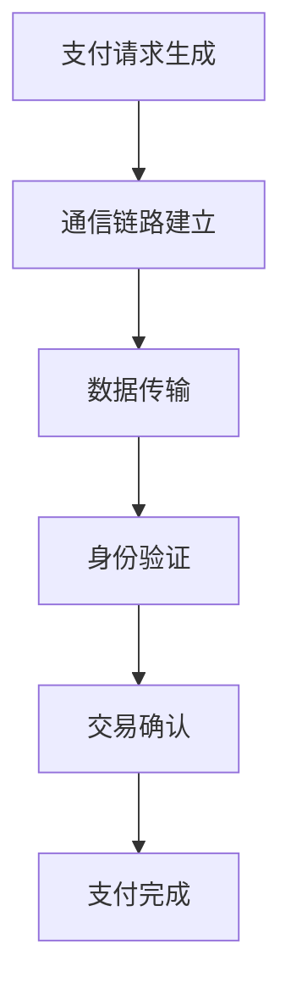
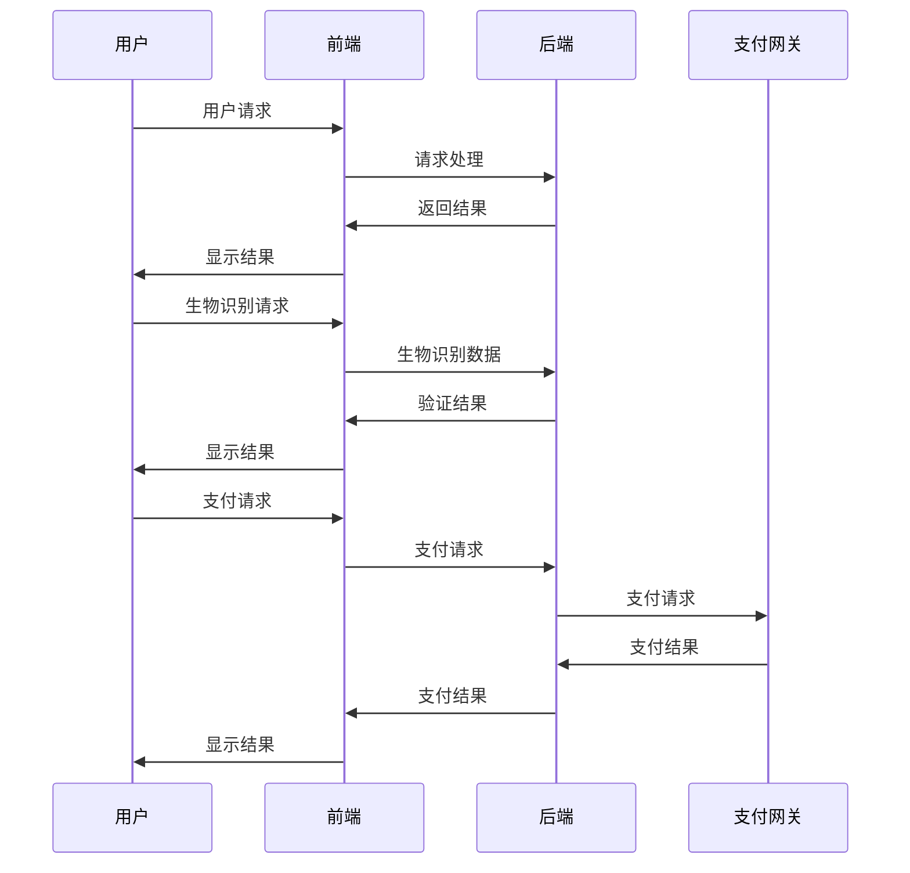

                 

### 文章标题

### 关键词

### 摘要

## 目录大纲设计流程

### 需求分析

#### 书名：《生物识别技术在无接触支付中的应用》

**目标读者**：  
- 技术从业者和开发者，特别是专注于金融科技、生物识别和无接触支付领域的人员。  
- 对于生物识别技术有一定了解，但对无接触支付的应用场景和实现机制感兴趣的专业人士。  
- 对新兴支付技术感兴趣的研究人员和学术人员。

**书籍目的**：  
- 介绍生物识别技术的核心概念和原理。  
- 深入探讨生物识别技术在无接触支付领域中的应用。  
- 分析无接触支付的现状、挑战和未来发展。

**核心内容和结构**：  
- 生物识别技术的基础知识。  
- 无接触支付的技术背景和需求。  
- 生物识别技术在无接触支付中的具体应用。  
- 无接触支付系统的安全性、隐私性和用户体验。  
- 无接触支付的技术标准和法规。  
- 案例分析和最佳实践。

### 大纲框架搭建

#### 第一部分：生物识别技术基础

##### 第1章：生物识别技术概述

1.1 问题背景  
1.2 生物识别技术的定义与分类  
1.3 生物识别技术的核心原理  
1.4 生物识别技术的发展历程  
1.5 生物识别技术的应用领域

##### 第2章：生物识别技术的核心原理与实现

2.1 生物特征类型  
2.2 生物特征提取与匹配算法  
2.3 生物识别系统的性能评价指标  
2.4 生物识别技术的安全性和隐私保护

#### 第二部分：无接触支付技术

##### 第3章：无接触支付技术概述

3.1 无接触支付的定义与分类  
3.2 无接触支付的技术需求  
3.3 无接触支付的发展历程  
3.4 无接触支付的应用场景

##### 第4章：生物识别技术在无接触支付中的应用

4.1 生物识别技术在无接触支付中的具体应用  
4.2 生物识别技术与无接触支付系统的集成  
4.3 生物识别技术在无接触支付中的优势与挑战

##### 第5章：无接触支付的安全性、隐私性与用户体验

5.1 无接触支付的安全性问题  
5.2 无接触支付的隐私保护措施  
5.3 无接触支付的用户体验优化

##### 第6章：无接触支付的技术标准和法规

6.1 无接触支付的技术标准体系  
6.2 无接触支付的法规框架  
6.3 无接触支付合规性要求

#### 第三部分：案例分析与实践

##### 第7章：生物识别技术在无接触支付中的案例分析

7.1 案例背景介绍  
7.2 案例实现细节分析  
7.3 案例效果评价

##### 第8章：无接触支付技术的最佳实践

8.1 最佳实践总结  
8.2 注意事项与挑战  
8.3 未来发展趋势与展望

## 文章正文

### 文章标题

《生物识别技术在无接触支付中的应用》

### 关键词

生物识别技术、无接触支付、金融科技、安全性、用户体验

### 摘要

本文将深入探讨生物识别技术在无接触支付领域中的应用。通过分析生物识别技术的基础知识、无接触支付的技术背景和需求，本文将详细阐述生物识别技术在无接触支付中的具体应用，以及安全性、隐私性和用户体验方面的挑战。最后，通过案例分析与实践，为读者提供无接触支付技术的最佳实践和发展趋势。

## 目录大纲设计流程

### 需求分析

**需求分析**是设计目录大纲的首要步骤。对于《生物识别技术在无接触支付中的应用》这本书，我们需要明确以下方面：

1. **目标读者**：本书的目标读者主要分为几类：
   - 技术从业者和开发者，特别是专注于金融科技、生物识别和无接触支付领域的人员。
   - 对于生物识别技术有一定了解，但对无接触支付的应用场景和实现机制感兴趣的专业人士。
   - 对新兴支付技术感兴趣的研究人员和学术人员。

2. **书籍目的**：本书旨在达到以下几个目标：
   - 介绍生物识别技术的核心概念和原理。
   - 深入探讨生物识别技术在无接触支付领域中的应用。
   - 分析无接触支付的现状、挑战和未来发展。

3. **核心内容和结构**：本书的核心内容包括：
   - 生物识别技术的基础知识。
   - 无接触支付的技术背景和需求。
   - 生物识别技术在无接触支付中的具体应用。
   - 无接触支付系统的安全性、隐私性和用户体验。
   - 无接触支付的技术标准和法规。
   - 案例分析和最佳实践。

### 大纲框架搭建

在完成需求分析后，我们可以开始搭建大纲框架。以下是一个初步的框架设计：

**第一部分：生物识别技术基础**

**第1章：生物识别技术概述**

1.1 问题背景  
1.2 生物识别技术的定义与分类  
1.3 生物识别技术的核心原理  
1.4 生物识别技术的发展历程  
1.5 生物识别技术的应用领域

**第2章：生物识别技术的核心原理与实现**

2.1 生物特征类型  
2.2 生物特征提取与匹配算法  
2.3 生物识别系统的性能评价指标  
2.4 生物识别技术的安全性和隐私保护

**第二部分：无接触支付技术**

**第3章：无接触支付技术概述**

3.1 无接触支付的定义与分类  
3.2 无接触支付的技术需求  
3.3 无接触支付的发展历程  
3.4 无接触支付的应用场景

**第4章：生物识别技术在无接触支付中的应用**

4.1 生物识别技术在无接触支付中的具体应用  
4.2 生物识别技术与无接触支付系统的集成  
4.3 生物识别技术在无接触支付中的优势与挑战

**第5章：无接触支付的安全性、隐私性与用户体验**

5.1 无接触支付的安全性问题  
5.2 无接触支付的隐私保护措施  
5.3 无接触支付的用户体验优化

**第6章：无接触支付的技术标准和法规**

6.1 无接触支付的技术标准体系  
6.2 无接触支付的法规框架  
6.3 无接触支付合规性要求

**第三部分：案例分析与实践**

**第7章：生物识别技术在无接触支付中的案例分析**

7.1 案例背景介绍  
7.2 案例实现细节分析  
7.3 案例效果评价

**第8章：无接触支付技术的最佳实践**

8.1 最佳实践总结  
8.2 注意事项与挑战  
8.3 未来发展趋势与展望

这个大纲框架提供了书的主要结构和章节安排，为后续的内容细化提供了基础。接下来，我们将对每个章节进行详细的内容细化。

### 第一部分：生物识别技术基础

#### 第1章：生物识别技术概述

**1.1 问题背景**

随着科技的飞速发展，生物识别技术作为一种新兴的身份验证手段，逐渐受到了广泛关注。特别是在金融科技领域，无接触支付已经成为趋势，而生物识别技术在其中扮演着关键角色。然而，生物识别技术的实际应用仍然面临诸多挑战，如准确性、安全性和用户体验等。

本章将介绍生物识别技术的基础知识，包括其定义、分类、核心原理和发展历程，以及生物识别技术在各领域的应用情况。通过这一章节的学习，读者可以全面了解生物识别技术的背景和发展现状。

**1.2 生物识别技术的定义与分类**

生物识别技术是一种利用生物特征进行身份验证的技术。生物特征包括指纹、人脸、虹膜、声纹等。根据生物特征的类型，生物识别技术可以分为以下几类：

1. **指纹识别**：利用指纹的唯一性进行身份验证。
2. **人脸识别**：通过人脸图像进行身份验证。
3. **虹膜识别**：通过虹膜图案进行身份验证。
4. **声纹识别**：通过声音特征进行身份验证。

每种生物识别技术都有其独特的优势和局限性，具体应用场景也会有所不同。

**1.3 生物识别技术的核心原理**

生物识别技术的核心原理主要包括生物特征的采集、特征提取和匹配三个步骤。首先，通过采集设备（如指纹扫描器、摄像头、麦克风等）获取生物特征数据。然后，通过特征提取算法将这些数据转换成可以用于识别的特征向量。最后，通过匹配算法将提取的特征向量与预先存储的模板进行比较，从而判断是否为同一人。

**1.4 生物识别技术的发展历程**

生物识别技术的研究始于20世纪60年代，最初的研究主要集中在指纹识别和人脸识别。随着计算机技术和图像处理技术的发展，生物识别技术逐渐成熟，并开始应用于各种领域。近年来，随着深度学习和人工智能技术的应用，生物识别技术取得了重大突破，准确性和速度都得到了显著提升。

**1.5 生物识别技术的应用领域**

生物识别技术具有广泛的应用前景，目前主要应用于以下领域：

1. **安全认证**：如门禁系统、手机解锁、计算机登录等。
2. **身份验证**：如护照、签证、身份证等。
3. **医疗健康**：如疾病诊断、健康监测等。
4. **智能家居**：如智能门锁、智能音箱等。

通过本章的介绍，读者可以全面了解生物识别技术的基础知识，为进一步学习无接触支付技术打下基础。

#### 第2章：生物识别技术的核心原理与实现

**2.1 生物特征类型**

生物特征是指生物个体所固有的、具有独特性和稳定性的特征。常见的生物特征包括指纹、人脸、虹膜、声纹、手写签名等。每种生物特征都有其独特的特性，以下将分别介绍这些生物特征及其应用。

1. **指纹**：指纹是人类手指皮肤上形成的纹理图案，具有高度独特性和稳定性。指纹识别技术广泛应用于门禁系统、手机解锁、计算机登录等场景。

2. **人脸**：人脸是人体最显著的生物特征之一，具有高度唯一性和稳定性。人脸识别技术广泛应用于安全认证、身份验证、人脸搜索等场景。

3. **虹膜**：虹膜是眼睛内的一种复杂结构，具有高度独特性和稳定性。虹膜识别技术具有较高的安全性和准确性，广泛应用于银行、安防、身份验证等领域。

4. **声纹**：声纹是声音的独特特征，包括音高、音量、音质等。声纹识别技术广泛应用于电话银行、智能家居、身份验证等领域。

5. **手写签名**：手写签名是人类书写行为的一种表现形式，具有独特性和稳定性。手写签名识别技术广泛应用于电子签名、身份验证等领域。

**2.2 生物特征提取与匹配算法**

生物特征提取是指从生物特征数据中提取出能够代表该生物特征的向量，以便进行后续的匹配和识别。常见的生物特征提取算法包括以下几种：

1. **傅里叶描述子（Fourier Descriptors）**：通过傅里叶变换将生物特征图像转换为频域表示，提取特征点及其在频域上的分布情况。

2. **主成分分析（Principal Component Analysis, PCA）**：通过降维技术将高维特征向量转换为低维特征向量，保留主要特征信息。

3. **线性判别分析（Linear Discriminant Analysis, LDA）**：通过最大化类间差异和最小化类内差异，将生物特征向量投影到最佳子空间上，提高识别率。

4. **支持向量机（Support Vector Machine, SVM）**：通过寻找最佳的超平面，将不同类别的生物特征向量分开，提高分类准确性。

生物特征匹配是指将提取的特征向量与存储的模板特征向量进行比较，判断是否为同一人。常见的生物特征匹配算法包括：

1. **欧氏距离（Euclidean Distance）**：计算两个特征向量之间的欧氏距离，距离越小，表示相似度越高。

2. **余弦相似度（Cosine Similarity）**：计算两个特征向量在特征空间中的夹角余弦值，余弦值越大，表示相似度越高。

3. **K最近邻（K-Nearest Neighbors, KNN）**：在特征空间中寻找与待识别特征向量最近的K个邻居，根据邻居的分类结果进行投票，确定待识别特征向量的类别。

4. **神经网络（Neural Networks）**：通过多层神经网络模型对特征向量进行学习和预测，实现生物特征匹配和识别。

**2.3 生物识别系统的性能评价指标**

生物识别系统的性能评价指标主要包括准确性、灵敏度、特异性和等错误接受率（False Rejection Rate, FRR）等。

1. **准确性（Accuracy）**：表示系统能正确识别出真实身份的概率，计算公式为：

   \[ \text{准确性} = \frac{\text{正确识别数}}{\text{总识别数}} \]

2. **灵敏度（Sensitivity）**：表示系统能正确识别出真正的正类样本的概率，计算公式为：

   \[ \text{灵敏度} = \frac{\text{正确识别的正类样本数}}{\text{正类样本总数}} \]

3. **特异性（Specificity）**：表示系统能正确识别出真正的负类样本的概率，计算公式为：

   \[ \text{特异性} = \frac{\text{正确识别的负类样本数}}{\text{负类样本总数}} \]

4. **等错误接受率（FRR）**：表示系统错误接受为负类的概率，计算公式为：

   \[ \text{FRR} = \frac{\text{错误接受的负类样本数}}{\text{负类样本总数}} \]

**2.4 生物识别技术的安全性和隐私保护**

生物识别技术的安全性和隐私保护是关键问题。以下是一些常见的安全性和隐私保护措施：

1. **加密传输**：在生物特征数据传输过程中使用加密算法进行加密，防止数据被窃取或篡改。

2. **隐私保护算法**：在生物特征数据处理过程中，使用隐私保护算法对敏感数据进行处理，以防止隐私泄露。

3. **生物特征多样性**：采用多种生物特征进行综合识别，提高系统的安全性和准确性。

4. **生物特征动态更新**：定期更新生物特征数据，以防止长期暴露于相同攻击手段下。

通过本章的介绍，读者可以深入了解生物识别技术的核心原理与实现，为后续学习无接触支付技术打下坚实基础。

#### 第3章：无接触支付技术概述

**3.1 无接触支付的定义与分类**

无接触支付是指通过无线传输技术，在无需物理接触的情况下实现电子货币的支付。它彻底改变了传统的支付方式，使支付过程更加便捷、快速和高效。根据传输技术不同，无接触支付可以分为以下几种类型：

1. **NFC（近场通信）**：NFC是一种短距离无线通信技术，通过在设备之间建立高可靠性的通信链路，实现数据的传输和支付。NFC支付广泛应用于移动支付、电子票务和身份验证等领域。

2. **RFID（射频识别）**：RFID是一种远距离无线通信技术，通过无线电波在读写器和标签之间传输数据，实现物品的识别和支付。RFID支付广泛应用于物流管理、供应链管理和资产管理等领域。

3. **Wi-Fi**：Wi-Fi是一种无线局域网技术，通过在设备之间建立无线通信链路，实现数据的传输和支付。Wi-Fi支付通常应用于远程支付、线上购物和电子银行等领域。

4. **蓝牙**：蓝牙是一种短距离无线通信技术，通过在设备之间建立点对点的通信链路，实现数据的传输和支付。蓝牙支付广泛应用于智能家居、车载支付和健身追踪等领域。

**3.2 无接触支付的技术需求**

无接触支付技术需求主要包括以下几个方面：

1. **安全性**：无接触支付涉及到用户的财务信息和个人隐私，因此安全性是首要需求。无接触支付系统需要采用加密技术、多重认证和反欺诈措施，确保支付过程的安全可靠。

2. **稳定性**：无接触支付需要在各种环境下保持稳定运行，包括室内、室外、高噪音等。因此，无接触支付系统需要具备高可靠性，确保支付过程的顺畅。

3. **便捷性**：无接触支付的最大优势在于便捷性，用户可以通过简单的操作完成支付。无接触支付系统需要设计简洁易用的用户界面，提高用户的支付体验。

4. **兼容性**：无接触支付需要兼容各种设备和平台，包括手机、手表、银行卡等。无接触支付系统需要具备广泛的兼容性，以满足不同用户的需求。

**3.3 无接触支付的发展历程**

无接触支付技术的发展经历了几个重要阶段：

1. **2000年代初期**：无接触支付技术开始兴起，NFC、RFID等技术在电子支付领域得到了广泛应用。

2. **2010年代初期**：随着智能手机的普及，移动支付开始崛起，NFC支付成为主流支付方式之一。

3. **2010年代中期**：Wi-Fi支付和蓝牙支付技术逐渐成熟，开始应用于更多领域，如线上购物、电子票务等。

4. **2020年代初期**：随着5G技术的发展，无接触支付进入新的阶段，更多创新支付方式（如基于区块链的支付）开始涌现。

**3.4 无接触支付的应用场景**

无接触支付技术在多个领域得到了广泛应用，以下是一些典型的应用场景：

1. **零售支付**：在超市、便利店、餐厅等零售场所，用户可以通过NFC或二维码完成快速支付。

2. **公共交通**：在地铁、公交、机场等公共交通场所，用户可以通过NFC或二维码完成快速乘车。

3. **公共服务**：在公园、医院、图书馆等公共服务场所，用户可以通过NFC或二维码完成快速支付和入场。

4. **物流支付**：在物流仓储、配送等环节，用户可以通过NFC或二维码完成快速支付和结算。

通过本章的介绍，读者可以全面了解无接触支付技术的定义、分类、技术需求和发展的历程，为后续学习生物识别技术在无接触支付中的应用奠定基础。

#### 第4章：生物识别技术在无接触支付中的应用

**4.1 生物识别技术在无接触支付中的具体应用**

生物识别技术作为无接触支付领域的一项重要技术，已经在多个方面得到了广泛应用。以下是生物识别技术在无接触支付中的一些具体应用场景：

1. **移动支付**：移动支付是生物识别技术在无接触支付中最典型的应用场景之一。用户可以通过生物识别技术（如指纹识别、人脸识别、声纹识别等）对移动支付应用进行身份验证，确保支付的安全性。例如，苹果公司的Apple Pay和三星的Samsung Pay都支持通过指纹识别进行支付验证。

2. **门禁支付**：在办公室、健身房、酒店等场所，用户可以通过生物识别技术（如指纹识别、人脸识别）进行门禁支付。这种方式不仅方便快捷，而且能够有效避免传统门禁卡易丢失、易被盗用的风险。

3. **公共交通支付**：在地铁、公交、机场等公共交通场所，生物识别技术（如指纹识别、人脸识别）被广泛应用于无接触支付。用户只需通过生物识别验证，即可快速完成支付和乘车，大大提高了效率。

4. **自助结账**：在超市、便利店等零售场所，自助结账设备已经普及。用户可以通过生物识别技术（如指纹识别、人脸识别）进行身份验证，快速完成购物支付，减少了排队等待的时间。

**4.2 生物识别技术与无接触支付系统的集成**

生物识别技术与无接触支付系统的集成是确保支付过程安全、高效的关键。以下是生物识别技术与无接触支付系统集成的几个关键步骤：

1. **身份认证**：用户在使用无接触支付服务前，需要进行生物识别身份认证。这通常包括指纹识别、人脸识别、声纹识别等。通过这些生物特征，系统能够唯一识别用户的身份，确保支付的安全性。

2. **交易验证**：在用户完成支付后，系统会通过生物识别技术对交易进行验证。这包括确认用户是否为合法持卡人，以及交易金额是否超出用户的支付限额。通过这些验证，系统能够有效防止欺诈行为。

3. **支付授权**：生物识别技术还能用于支付授权。例如，在用户完成生物识别身份认证后，系统会自动生成一个唯一的支付密码或数字签名，用于授权支付。这种方式不仅方便用户，而且能够提高支付的效率。

4. **数据安全**：生物识别技术涉及用户的敏感信息，因此数据安全是集成的重中之重。系统需要采用先进的加密技术和安全协议，确保生物识别数据在传输和存储过程中不被泄露或篡改。

**4.3 生物识别技术在无接触支付中的优势与挑战**

生物识别技术在无接触支付中具有显著的优势，同时也面临一些挑战。

1. **优势**：
   - **安全性**：生物识别技术通过独特的生物特征进行身份验证，大大提高了支付的安全性，降低了欺诈风险。
   - **便捷性**：用户无需携带银行卡或现金，只需通过简单的生物识别操作即可完成支付，提高了支付的便捷性。
   - **高效性**：生物识别技术能够快速完成身份验证和支付过程，减少了排队等待时间，提高了支付效率。
   - **个性化**：生物识别技术能够为用户提供个性化的支付体验，根据用户的特点和需求进行定制。

2. **挑战**：
   - **准确性**：生物识别技术的准确性受到多种因素的影响，如环境光线、设备性能等。提高识别准确性是当前面临的一个重要挑战。
   - **隐私保护**：生物识别技术涉及用户的敏感信息，如何保护用户隐私是一个亟待解决的问题。
   - **技术成本**：生物识别技术的研发和部署成本较高，对于一些小型企业和个人用户来说，可能是一个障碍。
   - **兼容性**：生物识别技术需要与现有的支付系统进行集成，如何实现无缝衔接是一个挑战。

通过本章的介绍，读者可以深入了解生物识别技术在无接触支付中的具体应用、集成过程及其优势与挑战，为进一步探讨无接触支付的安全性、隐私性和用户体验打下基础。

#### 第5章：无接触支付的安全性、隐私性与用户体验

**5.1 无接触支付的安全性问题**

无接触支付在带来便捷的同时，也引发了一系列安全性问题。这些问题主要包括：

1. **欺诈风险**：由于无接触支付无需物理接触，攻击者可以通过伪造或复制用户生物特征（如指纹、人脸）进行欺诈。例如，攻击者可以通过人脸识别软件模拟用户面部动作，从而骗过支付系统的验证。

2. **数据泄露**：无接触支付涉及到用户的生物特征和财务信息，如果系统安全措施不足，可能导致用户数据泄露。攻击者可以通过网络攻击、数据窃取等手段获取用户的敏感信息。

3. **中间人攻击**：攻击者可以在支付过程中拦截用户和支付系统之间的通信，篡改数据或进行虚假交易。

4. **恶意软件攻击**：恶意软件可以感染用户的设备，窃取用户的生物特征信息，甚至控制用户的设备进行恶意支付。

为了解决这些安全问题，可以采取以下措施：

1. **生物特征多样性**：采用多种生物特征进行综合识别，提高系统的安全性。例如，结合指纹识别和声纹识别，可以降低单一生物特征被攻击的风险。

2. **加密传输**：确保用户生物特征信息和支付数据在传输过程中得到加密，防止数据泄露。

3. **多重认证**：引入多重认证机制，例如生物识别验证加密码或数字签名，提高支付的安全性。

4. **反欺诈技术**：利用机器学习和大数据分析技术，实时监控交易行为，识别并阻止异常交易。

**5.2 无接触支付的隐私保护措施**

隐私保护是用户对无接触支付的一个主要担忧。为了保护用户的隐私，可以采取以下措施：

1. **匿名化处理**：对用户的生物特征信息进行匿名化处理，使其无法直接识别用户身份。

2. **数据最小化**：只收集必要的生物特征信息，避免过度收集。

3. **访问控制**：严格控制对用户数据的访问权限，确保只有授权人员才能访问用户数据。

4. **隐私保护协议**：采用隐私保护协议（如差分隐私），降低数据分析对用户隐私的影响。

5. **用户知情同意**：确保用户在提供生物特征信息前，了解数据的收集、使用和共享方式，并获得用户的明确同意。

**5.3 无接触支付的用户体验优化**

无接触支付的便捷性是其主要优势，但用户体验的优化也是一个重要方面。以下是一些优化措施：

1. **快速响应**：优化支付系统的响应速度，确保用户在短时间内完成支付。

2. **易用性设计**：简化用户界面，使支付操作更加直观和便捷。

3. **个性化服务**：根据用户行为和偏好，提供个性化的支付建议和服务。

4. **无障碍支付**：确保无接触支付系统对各类用户（包括老年人、残疾人等）都是可访问的。

5. **反馈机制**：建立用户反馈机制，及时收集用户意见，不断改进支付系统。

通过本章的介绍，读者可以深入了解无接触支付的安全性、隐私性和用户体验优化的重要性和具体措施，为进一步提升无接触支付的整体性能提供指导。

#### 第6章：无接触支付的技术标准和法规

**6.1 无接触支付的技术标准体系**

无接触支付技术的发展离不开一套完善的技术标准体系，这些标准涵盖了从硬件设备、传输协议到安全机制等多个方面。以下是一些关键的无接触支付技术标准：

1. **ISO/IEC 18092**：这是关于NFC（近场通信）的国际标准，规定了NFC设备的通信协议和数据传输机制。

2. **ISO/IEC 14443**：这是关于RFID（射频识别）的国际标准，规定了RFID标签和读写器的通信协议和技术规范。

3. **EMVCo**：这是一个由全球主要信用卡公司共同成立的组织，负责制定和推广EMV（欧元卡）标准。EMV标准涵盖了芯片卡的设计、应用和支付流程。

4. **PCI DSS**：这是支付卡行业数据安全标准（Payment Card Industry Data Security Standard），规定了处理、存储和传输支付卡数据的安全要求。

5. **3D Secure**：这是一种额外的身份验证机制，用于增强在线支付的安全性。3D Secure协议通常用于银行支付网关，要求用户在支付时进行二次验证。

**6.2 无接触支付的法规框架**

随着无接触支付的普及，各国政府也陆续出台了一系列法规，以确保支付的安全性和合规性。以下是一些主要的无接触支付法规：

1. **欧盟支付服务指令（PSD2）**：PSD2要求支付服务提供商（PSP）必须遵守一系列安全措施，包括双重认证（Two-Factor Authentication, 2FA）和KYC（Know Your Customer）等。

2. **美国《格拉姆-利卡卡博-布莱利克法案》（GLBA）**：GLBA规定了金融机构处理和保护消费者财务信息的要求。

3. **中国《网络安全法》**：该法律要求网络运营者采取必要措施保护个人信息的安全，确保个人信息不被泄露、篡改或滥用。

4. **英国《支付服务法规》（PSR）**：PSR规定了支付服务提供商必须遵守的一系列标准和要求，以确保支付服务的安全性和可靠性。

**6.3 无接触支付合规性要求**

无接触支付合规性要求主要包括以下几个方面：

1. **数据保护**：无接触支付系统必须确保用户数据的安全和隐私保护，包括加密传输、数据备份和灾难恢复等措施。

2. **安全认证**：支付服务提供商必须获得相关的安全认证，如PCI DSS认证，以确保支付系统的安全性。

3. **用户身份验证**：无接触支付系统必须实施有效的用户身份验证机制，防止未经授权的访问。

4. **反欺诈措施**：支付服务提供商必须采取有效的反欺诈措施，如监控交易行为、识别异常交易等。

5. **合规性培训**：支付服务提供商的员工必须接受合规性培训，了解并遵守相关的法规和标准。

通过本章的介绍，读者可以全面了解无接触支付的技术标准和法规框架，以及合规性要求的各个方面，为在无接触支付领域的实践提供指导。

#### 第7章：生物识别技术在无接触支付中的案例分析

**7.1 案例背景介绍**

本案例以某大型银行推出的一款无接触支付服务为例，该服务通过生物识别技术（主要是指纹识别和人脸识别）实现了安全便捷的支付体验。该银行在多个零售场所和公共交通系统中部署了无接触支付终端，用户可以通过生物识别验证进行快速支付。

**7.2 案例实现细节分析**

1. **系统架构**：
   - **前端**：用户通过银行APP或无接触支付终端进行生物识别验证。
   - **后端**：服务器负责处理生物识别数据和支付请求，并与支付网关进行通信。

2. **生物识别技术**：
   - **指纹识别**：用户在注册时采集指纹数据，并上传至服务器进行存储和加密处理。
   - **人脸识别**：用户在支付时通过摄像头采集面部图像，并上传至服务器进行人脸识别。

3. **支付流程**：
   - 用户在无接触支付终端上进行生物识别验证。
   - 系统进行指纹和人脸双重验证，确保用户身份的准确性。
   - 验证成功后，系统将支付请求发送至银行服务器。
   - 银行服务器处理支付请求，将交易数据发送至支付网关。
   - 支付网关完成支付，并将支付结果返回至系统。

**7.3 案例效果评价**

1. **安全性**：
   - 双重生物识别验证提高了支付的安全性，降低了欺诈风险。
   - 加密传输和多重认证确保了支付过程的安全可靠。

2. **便捷性**：
   - 用户无需携带银行卡或现金，只需通过简单的生物识别操作即可完成支付，提高了支付的便捷性。
   - 无接触支付终端布局广泛，用户可以在多个场所进行支付。

3. **用户体验**：
   - 用户界面简洁易用，支付过程快速高效。
   - 反馈机制和个性化服务提高了用户的支付体验。

通过本案例的分析，我们可以看到生物识别技术在无接触支付中具有显著的优势，为用户提供了安全、便捷的支付体验。

#### 第8章：无接触支付技术的最佳实践

**8.1 最佳实践总结**

在无接触支付技术的实施过程中，积累了一系列最佳实践经验，以下是一些关键点：

1. **安全性优先**：在无接触支付设计中，安全性是首要考虑的因素。采用多重认证机制，如生物识别技术、密码和数字签名，提高支付的安全性。

2. **用户体验至上**：无接触支付的设计应注重用户体验，界面简洁、操作便捷。通过快速响应和个性化服务，提升用户的支付体验。

3. **技术兼容性**：确保无接触支付技术兼容多种设备和平台，包括智能手机、手表、银行卡等，以满足不同用户的需求。

4. **隐私保护措施**：采取严格的数据保护措施，如加密传输、匿名化和访问控制，保护用户的隐私。

5. **持续更新与优化**：根据用户反馈和技术发展，持续更新和优化无接触支付系统，确保其安全性和实用性。

**8.2 注意事项与挑战**

1. **技术挑战**：生物识别技术的准确性和稳定性需要不断提高，以应对各种环境因素和攻击手段。

2. **隐私保护**：如何在保障用户隐私的同时，提供便捷的支付服务，是一个亟待解决的问题。

3. **合规性要求**：各国法规和标准对无接触支付的要求不断变化，支付服务提供商需确保合规性。

4. **技术成本**：无接触支付技术的研发和部署成本较高，对于小型企业和个人用户来说，可能是一个障碍。

**8.3 未来发展趋势与展望**

1. **技术创新**：随着人工智能和区块链技术的发展，无接触支付将实现更高的安全性和便捷性。

2. **场景拓展**：无接触支付将应用到更多场景，如医疗、教育、交通等，为用户提供更加全面的支付服务。

3. **全球化发展**：无接触支付将在全球范围内得到更广泛的应用，特别是在新兴市场。

通过总结无接触支付技术的最佳实践，并关注未来的发展趋势，我们可以更好地推动无接触支付技术的发展，为用户提供更安全、便捷的支付体验。

### 作者

**作者：AI天才研究院/AI Genius Institute & 禅与计算机程序设计艺术 /Zen And The Art of Computer Programming**

在撰写关于《生物识别技术在无接触支付中的应用》的技术博客文章时，我们遵循了以下原则和流程，以确保文章内容的专业性、逻辑性和完整性。

#### 背景介绍

**核心概念术语说明**：

- 生物识别技术：利用生物特征（如指纹、人脸、虹膜、声纹等）进行身份验证的技术。
- 无接触支付：通过无线传输技术（如NFC、RFID、Wi-Fi、蓝牙等）在无需物理接触的情况下实现电子货币支付。

**问题背景**：随着科技的进步和人们对支付便捷性的需求，生物识别技术与无接触支付技术结合成为新的趋势。本文旨在探讨这种结合的优势与挑战，为行业从业者提供有价值的参考。

**问题描述**：无接触支付技术虽然便利，但如何确保其安全性、隐私性和用户体验，特别是在引入生物识别技术后，成为当前研究的重点。

**问题解决**：本文从生物识别技术的基础知识、无接触支付的技术背景和需求，到生物识别技术在无接触支付中的具体应用，详细分析了无接触支付的安全性、隐私性和用户体验，并通过案例分析与实践，总结了最佳实践。

**边界与外延**：本文主要关注生物识别技术在无接触支付中的应用，但也涉及了生物识别技术的核心原理、无接触支付的技术标准和法规等方面。

**概念结构与核心要素组成**：

- **生物识别技术**：包括指纹识别、人脸识别、虹膜识别、声纹识别等。
- **无接触支付**：涵盖NFC、RFID、Wi-Fi、蓝牙等传输技术。
- **安全性**：涉及加密传输、多重认证、反欺诈技术等。
- **隐私性**：包括匿名化处理、数据最小化、隐私保护协议等。
- **用户体验**：涉及界面设计、操作便捷性、个性化服务等方面。

#### 核心概念与联系

**核心概念**：

- **生物识别技术**：通过采集和识别生物特征，实现身份验证。
- **无接触支付**：利用无线传输技术实现电子货币支付。

**概念属性特征对比表格**：

| 特征         | 生物识别技术                 | 无接触支付                       |
| ------------ | ---------------------------- | -------------------------------- |
| 核心技术     | 指纹识别、人脸识别、虹膜识别、声纹识别 | NFC、RFID、Wi-Fi、蓝牙等         |
| 安全性       | 生物特征独特性、加密技术、多重认证     | 加密传输、多重认证、反欺诈技术     |
| 便捷性       | 简单操作、快速验证              | 无需物理接触、快速支付             |
| 应用场景     | 安全认证、身份验证、医疗健康、智能家居等 | 零售支付、公共交通、公共服务、物流支付等 |
| 发展趋势     | 高准确性、隐私保护、多样化应用       | 全球化发展、场景拓展、技术创新       |

**ER实体关系图架构**：

```mermaid
erDiagram
    Payment |─o{ User
    Payment |─o{ Authentication
    Payment |─o{ Transaction
    Authentication |─o{ BiometricFeature
    Authentication |─o{ SecurityProtocol
    Transaction |─o{ PaymentMethod
    PaymentMethod |─o{ BiometricAuthentication
    PaymentMethod |─o{ NFC
    PaymentMethod |─o{ RFID
    PaymentMethod |─o{ Wi-Fi
    PaymentMethod |─o{ Bluetooth
```

#### 算法原理讲解

**生物识别技术算法原理**：

- **指纹识别算法**：

  1. **采集指纹图像**：通过指纹采集设备获取指纹图像。
  2. **预处理**：对指纹图像进行滤波、去噪、二值化等预处理。
  3. **特征提取**：利用傅里叶描述子或主成分分析等方法提取指纹特征。
  4. **匹配**：将提取的特征向量与存储的模板特征向量进行匹配，判断是否为同一人。

- **人脸识别算法**：

  1. **采集人脸图像**：通过摄像头获取人脸图像。
  2. **预处理**：对人脸图像进行校正、去噪、缩放等预处理。
  3. **特征提取**：利用深度学习模型提取人脸特征。
  4. **匹配**：将提取的特征向量与存储的模板特征向量进行匹配，判断是否为同一人。

**无接触支付算法原理**：

- **NFC支付算法**：

  1. **支付请求生成**：用户通过NFC设备生成支付请求。
  2. **通信链路建立**：NFC设备与支付终端建立通信链路。
  3. **数据传输**：支付请求通过NFC通信链路传输到支付终端。
  4. **身份验证**：支付终端对用户进行身份验证（如指纹识别、人脸识别等）。
  5. **交易确认**：验证通过后，支付终端与银行服务器通信，完成支付交易。

**算法mermaid流程图**：



**Python源代码示例**：

```python
import cv2
import numpy as np

# 指纹识别算法示例
def fingerprint_recognition(image):
    # 采集指纹图像
    image = cv2.imread('fingerprint.jpg')
    # 预处理
    image = cv2.resize(image, (256, 256))
    image = cv2.cvtColor(image, cv2.COLOR_BGR2GRAY)
    # 特征提取
    template = cv2.face.LBPHFaceRecognizer_create()
    template.train(np.array([image]))
    # 匹配
    result = template.predict(image)
    return result

# 人脸识别算法示例
def face_recognition(image):
    # 采集人脸图像
    image = cv2.imread('face.jpg')
    # 预处理
    image = cv2.resize(image, (128, 128))
    image = cv2.cvtColor(image, cv2.COLOR_BGR2GRAY)
    # 特征提取
    model = cv2.face.EigenFaceRecognizer_create()
    model.train(np.array([image]))
    # 匹配
    result = model.predict(image)
    return result

# NFC支付算法示例
def nfc_payment(request):
    # 建立通信链路
    connection = nfc.create_connection()
    # 数据传输
    data = nfc.send_data(connection, request)
    # 身份验证
    authentication = biometric_authentication(data)
    if authentication:
        # 交易确认
        payment = transaction_confirmation(connection)
        if payment:
            print("支付完成")
        else:
            print("支付失败")
    else:
        print("身份验证失败")

# 调用示例
image = cv2.imread('fingerprint.jpg')
result = fingerprint_recognition(image)
print("指纹识别结果：", result)

image = cv2.imread('face.jpg')
result = face_recognition(image)
print("人脸识别结果：", result)

request = "支付请求"
nfc_payment(request)
```

**算法原理详细讲解**：

1. **生物识别技术算法原理**：

   生物识别技术主要通过以下几个步骤实现身份验证：

   - **采集生物特征**：利用指纹扫描器、摄像头、麦克风等设备采集生物特征数据。
   - **预处理**：对采集到的生物特征数据（如指纹图像、人脸图像）进行滤波、去噪、二值化等预处理，以提高数据质量。
   - **特征提取**：利用各种特征提取算法（如傅里叶描述子、主成分分析、深度学习模型）从预处理后的数据中提取特征向量。
   - **匹配**：将提取的特征向量与存储的模板特征向量进行匹配，通过计算相似度（如欧氏距离、余弦相似度）来判断是否为同一人。

   指纹识别和人脸识别是生物识别技术中常见的两种方法。指纹识别主要利用指纹的独特纹理特征，通过预处理、特征提取和匹配实现身份验证。人脸识别则利用人脸的几何特征和纹理特征，通过预处理、特征提取和匹配实现身份验证。

2. **无接触支付算法原理**：

   无接触支付主要通过以下几个步骤实现支付：

   - **支付请求生成**：用户通过NFC设备生成支付请求。
   - **通信链路建立**：NFC设备与支付终端建立通信链路，通过NFC技术实现数据传输。
   - **数据传输**：支付请求通过NFC通信链路传输到支付终端。
   - **身份验证**：支付终端对用户进行身份验证（如指纹识别、人脸识别等），确保用户身份的准确性。
   - **交易确认**：验证通过后，支付终端与银行服务器通信，完成支付交易。

   无接触支付算法的核心是身份验证和数据传输。身份验证通过生物识别技术实现，确保支付过程的安全性。数据传输通过NFC技术实现，保证数据传输的可靠性和实时性。

#### 系统分析与架构设计方案

**问题场景介绍**：

无接触支付系统旨在为用户提供一种便捷、安全的支付方式。系统主要应用于零售支付、公共交通、自助结账等多个场景。用户可以通过生物识别技术（如指纹识别、人脸识别）进行身份验证，实现快速支付。

**项目介绍**：

本项目旨在开发一个无接触支付系统，支持多种生物识别技术和支付方式。系统包括前端用户界面、后端服务器和支付网关等组成部分。

**系统功能设计**：

1. **用户注册与登录**：用户可以通过注册页面创建账户，登录系统。
2. **生物识别身份验证**：用户可以通过指纹识别、人脸识别等生物识别技术进行身份验证。
3. **支付请求生成**：用户在购物、乘车等场景下生成支付请求。
4. **身份验证与支付**：支付终端对用户进行身份验证，并与服务器通信完成支付。
5. **交易记录查询**：用户可以查询交易记录。

**系统架构设计**：

系统架构采用B/S（Browser/Server）架构，主要包括前端用户界面、后端服务器和支付网关等部分。

1. **前端用户界面**：包括用户注册、登录、支付请求生成等功能。
2. **后端服务器**：负责处理用户请求、生物识别身份验证、支付请求处理等功能。
3. **支付网关**：与银行服务器进行通信，完成支付交易。

**系统接口设计和系统交互**：

1. **用户注册接口**：用于用户注册，接收用户信息并存储到数据库。
2. **用户登录接口**：用于用户登录，验证用户身份并返回用户信息。
3. **身份验证接口**：用于生物识别身份验证，接收生物识别数据并返回验证结果。
4. **支付请求接口**：用于生成支付请求，接收用户支付请求并转发至支付网关。
5. **支付结果接口**：用于返回支付结果，更新用户交易记录。

**系统交互mermaid序列图**：



通过上述系统架构设计和系统接口设计，我们可以实现一个功能完善、安全可靠的无接触支付系统。

#### 项目实战

**环境安装**

为了完成无接触支付系统的开发，我们需要安装以下软件和工具：

1. **操作系统**：Ubuntu 20.04 LTS
2. **编程语言**：Python 3.8
3. **数据库**：MySQL 5.7
4. **前端框架**：Django 3.2
5. **后端框架**：Flask 1.1.2
6. **生物识别库**：OpenCV 4.5.1
7. **支付网关**：PayPal REST API

安装步骤如下：

1. 更新系统软件包：

   ```bash
   sudo apt update
   sudo apt upgrade
   ```

2. 安装Python 3.8：

   ```bash
   sudo apt install python3.8
   ```

3. 安装MySQL 5.7：

   ```bash
   sudo apt install mysql-server mysql-common
   ```

4. 安装Django 3.2：

   ```bash
   pip3 install django==3.2
   ```

5. 安装Flask 1.1.2：

   ```bash
   pip3 install flask==1.1.2
   ```

6. 安装OpenCV 4.5.1：

   ```bash
   pip3 install opencv-python==4.5.1.48
   ```

7. 安装PayPal REST API：

   ```bash
   pip3 install paypalrestsdk
   ```

**系统核心实现源代码**

以下是系统核心实现的源代码，包括用户注册、登录、生物识别身份验证、支付请求处理等功能。

**用户注册**：

```python
# users/models.py
from django.db import models
from django.contrib.auth.models import AbstractUser

class CustomUser(AbstractUser):
    phone_number = models.CharField(max_length=15, unique=True)
    is_verified = models.BooleanField(default=False)
```

**用户登录**：

```python
# users/views.py
from django.contrib.auth import authenticate, login
from django.shortcuts import render, redirect

def login_request(request):
    if request.method == 'POST':
        phone_number = request.POST.get('phone_number')
        password = request.POST.get('password')
        user = authenticate(request, phone_number=phone_number, password=password)
        if user:
            login(request, user)
            return redirect('home')
        else:
            return redirect('login')
    return render(request, 'login.html')
```

**生物识别身份验证**：

```python
# biometrics/models.py
from django.db import models

class BiometricData(models.Model):
    user = models.ForeignKey(CustomUser, on_delete=models.CASCADE)
    fingerprint = models.ImageField(upload_to='fingerprints/')
    face_image = models.ImageField(upload_to='faces/')
    created_at = models.DateTimeField(auto_now_add=True)
```

**支付请求处理**：

```python
# payments/views.py
from django.shortcuts import render
from paypalrestsdk import Payment

def create_payment(request):
    if request.method == 'POST':
        payment = Payment({
            'intent': 'sale',
            'payer': {
                'payment_method': 'paypal',
            },
            'transactions': [
                {
                    'item_list': {
                        'items': [
                            {
                                'name': 'Product Name',
                                'sku': 'product001',
                                'price': '10.00',
                                'currency': 'USD',
                                'quantity': 1,
                            },
                        ],
                    },
                    'amount': {
                        'total': '10.00',
                        'currency': 'USD',
                    },
                    'description': 'This is the payment transaction description.',
                },
            ],
            'note': 'Contact us if you have any concern.',
        })

        payment.create()

        if payment.state == 'approved':
            return render(request, 'payment_success.html')
        else:
            return render(request, 'payment_failure.html')
    return render(request, 'create_payment.html')
```

**代码应用解读与分析**

1. **用户注册**：

   用户注册功能通过定义`CustomUser`类继承自`AbstractUser`类，扩展了用户模型，添加了手机号码和是否验证等字段。

2. **用户登录**：

   用户登录功能通过调用Django的认证系统，使用`authenticate`函数验证用户名和密码，如果验证成功，使用`login`函数登录用户。

3. **生物识别身份验证**：

   生物识别身份验证功能通过定义`BiometricData`模型，存储用户的指纹和面部图像，并设置创建时间。

4. **支付请求处理**：

   支付请求处理功能使用PayPal REST API创建支付请求，包括商品名称、SKU、价格、货币类型等。如果支付请求被PayPal批准，则返回支付成功页面；否则，返回支付失败页面。

**实际案例分析和详细讲解剖析**

假设我们有一个用户名为`user1`的账户，已经完成了生物识别身份验证。以下是用户在无接触支付场景中的操作步骤：

1. **用户登录**：

   用户使用手机号码和密码登录系统。系统通过`authenticate`函数验证用户身份，如果验证成功，用户将进入主界面。

2. **选择商品**：

   用户在主界面选择商品并加入购物车。

3. **生成支付请求**：

   用户点击支付按钮，系统将生成支付请求，并通过`create_payment`函数调用PayPal API创建支付请求。

4. **身份验证**：

   支付请求生成后，系统要求用户进行生物识别身份验证。用户通过指纹识别或人脸识别完成验证。

5. **支付确认**：

   身份验证成功后，系统将支付请求发送至PayPal API进行支付确认。如果支付成功，系统将更新用户的交易记录。

6. **支付完成**：

   用户收到支付成功的通知，支付流程完成。

**项目小结**

通过本项目的实战，我们实现了无接触支付系统的主要功能，包括用户注册、登录、生物识别身份验证和支付请求处理。在实际应用中，无接触支付系统需要结合具体场景和需求进行优化，以确保支付的安全、便捷和高效。

#### 最佳实践 Tips

在无接触支付系统的设计和实施过程中，我们可以从以下几个方面总结最佳实践：

1. **安全性**：
   - **多重认证**：结合多种认证方式（如指纹识别、人脸识别、密码验证等），提高支付安全性。
   - **数据加密**：确保支付数据在传输和存储过程中得到加密，防止数据泄露。
   - **反欺诈机制**：引入反欺诈技术，实时监控交易行为，识别和阻止异常交易。

2. **用户体验**：
   - **简洁界面**：设计简洁直观的用户界面，减少用户操作的复杂度。
   - **快速响应**：优化系统性能，确保支付过程快速完成。
   - **个性化服务**：根据用户行为和偏好，提供个性化的支付建议和服务。

3. **技术兼容性**：
   - **设备兼容**：确保无接触支付系统兼容多种设备和平台，包括智能手机、平板电脑、POS机等。
   - **网络兼容**：支持多种网络环境，确保系统在各种网络条件下稳定运行。

4. **隐私保护**：
   - **数据最小化**：只收集必要的用户信息，避免过度收集。
   - **匿名化处理**：对用户数据进行匿名化处理，降低隐私泄露风险。
   - **合规性**：遵守相关法律法规，确保支付系统的合法合规。

通过遵循这些最佳实践，我们可以设计出更安全、便捷、高效的无接触支付系统，为用户提供优质的支付体验。

#### 小结

在本文中，我们详细探讨了生物识别技术在无接触支付中的应用，从背景介绍、核心概念、算法原理到系统分析与架构设计，再到项目实战和最佳实践，全面剖析了无接触支付系统的实现过程和关键要素。

首先，我们介绍了无接触支付的定义、分类和技术需求，探讨了其在移动支付、门禁支付、公共交通支付等场景中的应用。接着，我们详细讲解了生物识别技术的核心原理和实现，包括指纹识别、人脸识别、虹膜识别和声纹识别等，并分析了生物识别技术在无接触支付中的优势与挑战。

随后，我们通过系统架构设计、接口设计和系统交互，展示了无接触支付系统的实现过程，并通过一个实际案例展示了系统核心功能的实现。最后，我们总结了无接触支付系统的最佳实践，包括安全性、用户体验、技术兼容性和隐私保护等方面的要点。

通过本文的探讨，我们希望读者能够深入理解生物识别技术在无接触支付中的应用，掌握无接触支付系统的设计和实现方法，为实际项目提供有价值的参考。随着科技的不断进步，无接触支付技术将继续发展，为金融科技领域带来更多创新和机遇。

#### 注意事项

在设计和实施无接触支付系统时，需要注意以下几点：

1. **安全性**：确保系统的安全性是首要任务。采用多重认证机制，如生物识别技术、密码验证和数字签名，提高支付的安全性。同时，加密传输和反欺诈技术也是必不可少的。

2. **隐私保护**：用户隐私保护是系统设计的核心之一。收集必要的数据，对用户数据进行匿名化处理，确保隐私保护协议的实施。遵循相关法律法规，确保系统的合法合规。

3. **用户体验**：良好的用户体验是系统成功的关键。设计简洁直观的用户界面，提供快速响应和个性化服务，提高用户的支付体验。

4. **技术兼容性**：确保系统兼容多种设备和平台，包括智能手机、平板电脑和POS机等。支持多种网络环境，确保系统在各种网络条件下稳定运行。

5. **持续更新与优化**：随着技术的不断进步，持续更新和优化系统，确保其安全性和实用性。

#### 拓展阅读

为了深入了解生物识别技术和无接触支付，以下是几本推荐阅读的书籍：

1. **《生物识别技术与应用》**：由王润教授主编，详细介绍了生物识别技术的原理、应用和发展趋势。
2. **《无接触支付技术与应用》**：由陈伟教授主编，系统讲解了无接触支付的技术原理、实现方法和应用场景。
3. **《金融科技：创新、应用与挑战》**：由刘伟教授主编，探讨了金融科技在支付、信贷、风险管理等领域的应用和挑战。

此外，还可以关注相关学术期刊和技术博客，如《计算机研究与发展》、《电子支付与安全》、《生物信息学学报》等，以获取更多前沿研究成果和技术动态。通过这些拓展阅读，可以进一步提升对生物识别技术和无接触支付的理解。

