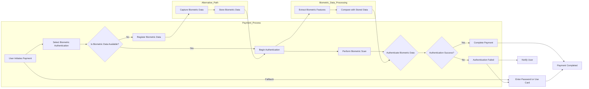

                 

### 设计思路

在设计《生物识别技术在移动支付中的安全应用》这篇文章时，我们将遵循以下详细步骤和思路：

#### 1. 确定文章结构和内容框架

文章结构将严格按照提供的目录大纲进行，每个章节都详细展开，确保文章逻辑清晰，内容丰富。具体结构如下：

- **引言**：介绍文章主题和写作目的。
- **第1章 背景介绍**：
  - **1.1 问题背景**：讨论移动支付的兴起和生物识别技术的应用。
  - **1.2 问题解决**：介绍生物识别技术原理和在移动支付中的具体应用。
  - **1.3 边界与外延**：探讨生物识别技术的局限性和安全性边界。
- **第2章 核心概念与联系**：
  - **2.1 生物识别技术原理**：详细解释人脸识别、指纹识别、虹膜识别等。
  - **2.2 生物识别技术与移动支付的关系**：分析技术融合和安全性对比。
- **第3章 生物识别技术在移动支付中的应用**：讨论具体应用实例，如支付宝人脸支付和微信指纹支付。
- **第4章 生物识别技术在移动支付中的安全挑战**：分析隐私保护、抗攻击能力和用户体验。
- **第5章 生物识别技术在移动支付中的发展趋势**：探讨技术创新和安全性提升。
- **第6章 案例分析**：具体分析支付宝和微信的案例。
- **第7章 总结与展望**：总结现有应用，展望未来趋势。

#### 2. 确保内容的专业性和技术深度

- **背景介绍**：准确描述移动支付和生物识别技术的发展历程，明确当前问题和挑战。
- **核心概念与联系**：通过表格和ER图详细展示生物识别技术的核心概念和相互关系。
- **应用实例**：详细分析支付宝和微信的具体应用场景、技术实现和用户体验。
- **安全挑战**：深入探讨生物识别技术可能面临的安全问题，并提出解决方案。
- **发展趋势**：结合最新的技术和市场动态，展望生物识别技术在移动支付中的未来发展方向。

#### 3. 使用Markdown和Mermaid进行格式设计

- **Markdown格式**：确保文章的格式规范，包括标题、摘要、章节标题、列表、代码块等。
- **Mermaid图表**：使用Mermaid语言绘制流程图、类图、架构图等，使文章内容更加直观易懂。

#### 4. 编写风格

- **清晰简洁**：用简单易懂的语言阐述复杂的技术概念。
- **逻辑性强**：确保文章的每一部分都有清晰的逻辑关系，帮助读者逐步理解。
- **逻辑图表**：通过图表和代码示例辅助说明，增强文章的直观性和可读性。

#### 5. 检查和修正

- **内容准确性**：确保文章中的技术描述和数据准确无误。
- **逻辑一致性**：检查文章的逻辑结构，确保每一部分的连贯性。
- **格式规范性**：确保文章的格式符合Markdown和Mermaid的标准。

通过以上步骤和思路，我们希望能够撰写一篇高质量、逻辑清晰、内容丰富的技术博客文章，为读者提供关于生物识别技术在移动支付中的安全应用的全面而深入的理解。### 文章引言

---

## 生物识别技术在移动支付中的安全应用

> 关键词：生物识别，移动支付，安全，人脸识别，指纹识别，虹膜识别

摘要：随着移动支付技术的迅猛发展，生物识别技术作为一种安全有效的身份验证手段，逐渐在移动支付领域得到广泛应用。本文将深入探讨生物识别技术的基本原理、在移动支付中的具体应用、面临的安全挑战及其未来发展趋势。通过详细分析支付宝和微信等平台的实际应用案例，本文旨在为读者提供一个全面了解和评估生物识别技术在移动支付中安全应用的视角。

---

### 目录大纲

1. **引言**
2. **第1章 背景介绍**
   1.1 **问题背景**
      1.1.1 **移动支付的兴起**
      1.1.2 **生物识别技术的应用**
      1.1.3 **生物识别技术在移动支付中的安全挑战**
   1.2 **问题解决**
      1.2.1 **生物识别技术原理**
      1.2.2 **生物识别技术在移动支付中的应用**
      1.2.3 **生物识别技术的局限性**
      1.2.4 **安全性边界**
3. **第2章 核心概念与联系**
   3.1 **生物识别技术原理**
      3.1.1 **人脸识别**
      3.1.2 **指纹识别**
      3.1.3 **虹膜识别**
   3.2 **生物识别技术与移动支付的关系**
      3.2.1 **技术融合**
      3.2.2 **安全性对比**
4. **第3章 生物识别技术在移动支付中的应用**
   3.1 **支付宝人脸支付**
   3.2 **微信指纹支付**
   3.3 **其他生物识别技术在移动支付中的应用**
5. **第4章 生物识别技术在移动支付中的安全挑战**
   4.1 **生物特征数据的隐私保护**
   4.2 **生物识别技术的抗攻击能力**
   4.3 **生物识别技术的认证速度与用户体验**
6. **第5章 生物识别技术在移动支付中的发展趋势**
   5.1 **技术创新**
   5.2 **安全性提升**
7. **第6章 案例分析**
   7.1 **支付宝人脸支付案例**
   7.2 **微信指纹支付案例**
8. **第7章 总结与展望**

---

以上是本文的目录大纲，接下来我们将逐章深入探讨生物识别技术在移动支付中的安全应用，为读者带来一场精彩的技术盛宴。### 第1章 背景介绍

---

## 第1章 背景介绍

生物识别技术在移动支付领域的应用，源于其独特的优势和对传统安全认证手段的补充。随着科技的进步和消费者对便捷性的需求不断增长，生物识别技术以其高效、安全、便捷的特点，正在成为移动支付领域的重要技术支撑。在这一章中，我们将详细探讨移动支付的兴起、生物识别技术的应用及其在移动支付中的安全挑战。

### 1.1 问题背景

#### 1.1.1 移动支付的兴起

移动支付，作为一种无需现金交易，通过移动设备（如智能手机、平板电脑等）进行的支付方式，已经深刻地改变了人们的支付习惯。其便捷性、低成本和高效率，使得移动支付在短短几年内得到了迅速普及。根据统计数据显示，全球移动支付交易额从2010年的不到1000亿美元，增长到2020年的超过5万亿美元，预计未来几年还将持续增长。

移动支付的成功，主要得益于以下几个因素：

1. **智能手机的普及**：随着智能手机的广泛普及，移动支付的用户基数迅速扩大。
2. **移动互联网的发展**：高速的移动互联网为移动支付提供了稳定的网络支持。
3. **支付平台的创新**：支付宝、微信支付等移动支付平台不断推陈出新，提高了用户的支付体验。
4. **政策的支持**：各国政府纷纷出台相关政策，鼓励移动支付的发展。

#### 1.1.2 生物识别技术的应用

生物识别技术，通过识别和验证个人的生物特征，如人脸、指纹、虹膜等，提供了一种高效、安全、便捷的身份验证手段。随着技术的不断进步，生物识别技术在多个领域得到了广泛应用，其中金融领域尤为突出。特别是在移动支付中，生物识别技术不仅提高了支付的安全性，还增强了用户的支付体验。

生物识别技术的应用优势包括：

1. **高效性**：生物识别技术能够快速、准确地识别用户身份，无需复杂的操作过程。
2. **安全性**：生物特征具有唯一性和稳定性，能有效防止欺诈和恶意攻击。
3. **便捷性**：用户无需携带物理卡片或密码，即可完成支付操作。

#### 1.1.3 生物识别技术在移动支付中的安全挑战

尽管生物识别技术在移动支付中具有显著的优势，但其广泛应用也带来了一系列安全挑战。首先，生物特征数据泄露的风险极大。一旦生物特征数据被窃取，攻击者可以利用这些数据进行身份盗用和恶意支付。其次，生物识别技术面临模仿攻击和替换攻击的威胁，攻击者可以通过伪造生物特征来骗过系统。此外，生物识别技术的认证速度和用户体验之间的平衡也是一个亟待解决的问题。

### 1.2 问题解决

#### 1.2.1 生物识别技术原理

为了更好地理解生物识别技术如何在移动支付中发挥作用，我们需要先了解其基本原理。生物识别技术主要包括以下几种类型：

1. **人脸识别**：通过分析人脸的几何特征和纹理特征进行身份验证。
2. **指纹识别**：通过分析指纹的脊线和谷线结构进行身份验证。
3. **虹膜识别**：通过分析虹膜的纹理和结构进行身份验证。

每种生物识别技术都有其独特的原理和优缺点。例如，人脸识别具有非接触性和实时性，但容易受到光照和遮挡的影响；指纹识别具有较高的准确性和稳定性，但可能受到皮肤磨损和受伤的影响。

#### 1.2.2 生物识别技术在移动支付中的应用

生物识别技术在移动支付中的应用场景多种多样。以下是几种常见的应用：

1. **人脸支付**：用户在支付时只需对准摄像头，系统即可识别用户身份并完成支付。
2. **指纹支付**：用户在完成指纹注册后，每次支付时只需按下指纹即可完成验证。
3. **虹膜支付**：用户在注册时录入虹膜信息，支付时通过摄像头捕捉虹膜图像进行身份验证。

这些应用不仅提高了支付的安全性，还极大地提升了用户体验。

#### 1.2.3 生物识别技术的局限性

尽管生物识别技术在移动支付中具有显著的优势，但其也面临一些局限性。首先，生物识别技术可能受到环境因素的影响，如光线、角度等。其次，生物识别系统的复杂性和成本较高，可能限制其大规模推广。此外，不同生物识别技术之间的兼容性和互操作性也是一个挑战。

#### 1.2.4 安全性边界

生物识别技术在移动支付中的安全性边界主要包括以下几个方面：

1. **数据保护**：确保生物特征数据在传输和存储过程中的安全。
2. **抗攻击能力**：提高生物识别系统对抗模仿攻击和替换攻击的能力。
3. **认证速度**：优化认证流程，提高认证速度，以平衡安全性和用户体验。

### 结论

生物识别技术在移动支付中的安全应用，是金融科技发展的重要趋势。尽管面临诸多挑战，但其优势显著，未来有望在移动支付领域发挥更大的作用。

---

在下一章中，我们将进一步探讨生物识别技术的核心概念与联系，帮助读者更深入地理解这些技术的原理和应用。### 1.2 生物识别技术原理

---

## 1.2 生物识别技术原理

生物识别技术通过识别和验证个体的生物特征，提供了一种安全、高效的身份认证方式。这些生物特征包括人脸、指纹、虹膜等。下面，我们将逐一介绍这些生物识别技术的原理。

#### 1.2.1 人脸识别

人脸识别技术通过分析人脸的几何特征和纹理特征进行身份验证。具体过程如下：

1. **特征提取**：人脸图像经过预处理（如去噪、对齐等）后，提取关键特征点，如眼睛、鼻子、嘴巴等。
2. **特征匹配**：将提取的特征与数据库中的模板进行比对，根据相似度评分进行身份验证。

人脸识别技术具有非接触性和实时性，但易受光照、角度和表情变化的影响。

#### 1.2.2 指纹识别

指纹识别技术通过分析指纹的脊线和谷线结构进行身份验证。具体过程如下：

1. **特征提取**：指纹图像经过预处理（如去除背景、增强脊线等）后，提取关键特征点，如脊线、谷点等。
2. **特征匹配**：将提取的特征与数据库中的模板进行比对，根据相似度评分进行身份验证。

指纹识别技术具有较高的准确性和稳定性，但可能受到皮肤磨损和受伤的影响。

#### 1.2.3 虹膜识别

虹膜识别技术通过分析虹膜的纹理和结构进行身份验证。具体过程如下：

1. **特征提取**：虹膜图像经过预处理（如去噪、对齐等）后，提取关键特征点，如纹理、斑点等。
2. **特征匹配**：将提取的特征与数据库中的模板进行比对，根据相似度评分进行身份验证。

虹膜识别技术具有非常高的准确性和唯一性，但需要高精度的图像捕捉设备。

#### 1.2.4 其他生物识别技术

除了上述三种主要的生物识别技术外，还有其他一些生物识别技术，如：

- **声音识别**：通过分析个体的语音特征进行身份验证。
- **掌纹识别**：通过分析手掌的纹理和形状进行身份验证。
- **面部热成像**：通过分析面部热辐射特征进行身份验证。

这些技术各有优缺点，适用于不同的应用场景。

### 表格：生物识别技术对比

| 技术 | 特点 | 优点 | 缺点 |
| ---- | ---- | ---- | ---- |
| 人脸识别 | 非接触、实时 | 高效、便捷、无需物理介质 | 受光照和角度影响 |
| 指纹识别 | 非接触、持久 | 准确、稳定、成本低 | 受皮肤磨损和受伤影响 |
| 虹膜识别 | 高精度、唯一性 | 高准确、难伪造 | 需高精度捕捉设备 |
| 声音识别 | 非接触、实时 | 无需物理介质、无负担 | 受环境噪音影响 |
| 掌纹识别 | 非接触、持久 | 准确、稳定、无需物理介质 | 受手势和皮肤变化影响 |
| 面部热成像 | 高精度、实时 | 独特生物特征、难以伪造 | 受光线和温度影响 |

通过上述介绍和对比，我们可以看出，每种生物识别技术都有其独特的优势和局限性。在实际应用中，可以根据具体需求和场景选择合适的生物识别技术。

---

在下一节中，我们将进一步探讨生物识别技术在移动支付中的具体应用，分析其在不同支付场景中的技术实现和用户体验。

---

### 1.3 生物识别技术在移动支付中的应用

---

## 1.3 生物识别技术在移动支付中的应用

随着生物识别技术的不断发展和完善，其在移动支付领域的应用越来越广泛。不同的生物识别技术适用于不同的支付场景，能够为用户带来更安全、便捷的支付体验。以下我们将详细分析人脸识别、指纹识别和虹膜识别在移动支付中的具体应用。

#### 1.3.1 人脸识别在移动支付中的应用

人脸识别技术在移动支付中的应用最为广泛。用户在注册时提供人脸图像，并经过系统训练生成人脸模板。每次支付时，用户只需对准摄像头，系统即实时捕捉人脸图像并进行识别，验证通过后即可完成支付。

**应用场景**：

- **在线购物支付**：用户在电商平台完成购物后，可通过人脸识别快速完成支付。
- **ATM取款**：部分银行已推出人脸识别ATM机，用户通过人脸识别即可完成取款操作。
- **无人便利店**：用户在无人便利店购物时，通过人脸识别进行身份验证和支付。

**技术实现**：

1. **图像预处理**：对捕捉到的人脸图像进行预处理，如去噪、对齐、缩放等。
2. **特征提取**：提取人脸图像的关键特征点，如眼睛、鼻子、嘴巴等。
3. **特征匹配**：将提取的特征与数据库中的人脸模板进行比对，判断是否为同一人。

**用户体验**：

人脸识别技术具有非接触性和实时性，用户无需复杂的操作过程，支付过程快速便捷。但人脸识别受光照、角度和表情变化的影响，有时可能出现识别失败的情况。

#### 1.3.2 指纹识别在移动支付中的应用

指纹识别技术在移动支付中的应用也非常广泛。用户在注册时提供指纹图像，并生成指纹模板。每次支付时，用户只需将手指放在指纹识别器上，系统即可识别指纹并完成支付。

**应用场景**：

- **手机支付**：用户在手机上注册指纹，每次支付时通过指纹识别完成验证。
- **门禁支付**：部分城市的门禁系统已采用指纹识别技术，用户通过指纹识别进入停车场或进入特定区域。
- **公共交通**：部分城市的公共交通系统已实现指纹识别支付，用户通过指纹识别即可完成乘车支付。

**技术实现**：

1. **图像预处理**：对捕捉到的指纹图像进行预处理，如去噪、增强脊线等。
2. **特征提取**：提取指纹图像的关键特征点，如脊线、谷点等。
3. **特征匹配**：将提取的特征与数据库中的指纹模板进行比对，判断是否为同一人。

**用户体验**：

指纹识别技术具有高度的准确性和稳定性，用户无需复杂的操作过程，支付过程快速便捷。但指纹识别可能受到皮肤磨损和受伤的影响，有时可能出现识别失败的情况。

#### 1.3.3 虹膜识别在移动支付中的应用

虹膜识别技术在移动支付中的应用相对较少，但因其极高的准确性和唯一性，仍然具有很大的应用潜力。用户在注册时提供虹膜图像，并生成虹膜模板。每次支付时，用户只需通过摄像头捕捉虹膜图像并进行识别，验证通过后即可完成支付。

**应用场景**：

- **高端商场支付**：部分高端商场已采用虹膜识别技术，用户在购物时通过虹膜识别快速完成支付。
- **贵重物品交易**：部分贵重物品的交易已采用虹膜识别技术，确保交易的安全性和唯一性。

**技术实现**：

1. **图像预处理**：对捕捉到的虹膜图像进行预处理，如去噪、对齐、缩放等。
2. **特征提取**：提取虹膜图像的关键特征点，如纹理、斑点等。
3. **特征匹配**：将提取的特征与数据库中的虹膜模板进行比对，判断是否为同一人。

**用户体验**：

虹膜识别技术具有极高的准确性和唯一性，用户无需复杂的操作过程，支付过程非常安全。但虹膜识别需要高精度的捕捉设备，且对环境光线要求较高，有时可能出现识别失败的情况。

#### 1.3.4 其他生物识别技术在移动支付中的应用

除了上述三种主要的生物识别技术外，其他一些生物识别技术也在移动支付中得到了应用。

**声音识别**：通过分析个体的语音特征进行身份验证。用户在注册时提供语音样本，每次支付时通过声音识别完成验证。声音识别技术简单易用，但易受环境噪音影响。

**掌纹识别**：通过分析手掌的纹理和形状进行身份验证。用户在注册时提供掌纹图像，每次支付时通过掌纹识别完成验证。掌纹识别技术具有较高的准确性和稳定性，但需要较大的识别空间。

**面部热成像**：通过分析面部热辐射特征进行身份验证。用户在注册时提供面部热成像图像，每次支付时通过面部热成像识别完成验证。面部热成像技术具有独特性和难以伪造的特性，但受光线和温度影响较大。

通过上述分析，我们可以看出，不同的生物识别技术在移动支付中都有其独特的应用场景和优势。随着技术的不断进步和应用的深入，生物识别技术将为移动支付带来更高的安全性、便捷性和用户体验。

---

在下一节中，我们将探讨生物识别技术在移动支付中可能面临的安全挑战，分析其应对策略。

---

### 1.4 生物识别技术在移动支付中的安全挑战

---

## 1.4 生物识别技术在移动支付中的安全挑战

尽管生物识别技术在移动支付中提供了高效、安全、便捷的身份验证手段，但其应用也带来了一系列安全挑战。本文将深入探讨生物识别技术在移动支付中可能面临的安全挑战，并提出相应的解决方案。

#### 1.4.1 生物特征数据的隐私保护

生物特征数据具有唯一性和稳定性，但其泄露风险极大。一旦生物特征数据被窃取，攻击者可以利用这些数据进行身份盗用和恶意支付。因此，保护生物特征数据的隐私至关重要。

**解决方案**：

1. **数据加密**：在数据传输和存储过程中，对生物特征数据进行加密处理，确保数据在传输和存储过程中的安全。
2. **安全存储**：将生物特征数据存储在加密的数据库中，采用多因素认证和访问控制机制，确保数据的安全性和隐私性。
3. **匿名化处理**：在数据采集和存储过程中，对生物特征数据进行匿名化处理，消除个人身份信息，减少数据泄露的风险。

#### 1.4.2 生物识别技术的抗攻击能力

生物识别技术面临多种攻击威胁，包括模仿攻击和替换攻击。模仿攻击是指攻击者通过伪造生物特征图像来骗过识别系统；替换攻击是指攻击者通过替代用户生物特征图像来进行身份验证。

**解决方案**：

1. **动态识别**：引入动态识别机制，如要求用户进行随机动作或回答问题，增加识别过程的复杂度，降低模仿攻击的成功率。
2. **多重验证**：采用多重验证机制，如结合密码、指纹、人脸等多种生物识别技术，提高识别系统的抗攻击能力。
3. **深度学习**：利用深度学习技术，对生物识别系统进行持续训练和优化，提高识别系统的准确性和鲁棒性。

#### 1.4.3 生物识别技术的认证速度与用户体验

生物识别技术的认证速度直接影响用户体验。过慢的认证速度会降低用户的支付体验，而过快的认证速度则可能降低安全性。因此，如何在保证安全性的同时提高认证速度是一个关键问题。

**解决方案**：

1. **优化算法**：对生物识别算法进行优化，提高识别速度和准确性。
2. **预处理技术**：采用图像预处理技术，如去噪、增强等，提高识别速度和准确性。
3. **硬件加速**：利用硬件加速技术，如GPU、FPGA等，提高生物识别系统的处理速度。

#### 1.4.4 系统安全性监测与预警

为了确保生物识别技术在移动支付中的安全性，系统需要具备实时监测和预警能力，及时发现和应对潜在的安全威胁。

**解决方案**：

1. **实时监测**：建立实时监测系统，对生物识别系统的运行状态、识别结果等进行实时监控。
2. **异常检测**：利用机器学习和大数据分析技术，对生物识别过程中的异常行为进行检测和预警。
3. **应急响应**：制定应急预案，确保在发现安全威胁时能够迅速响应，采取相应的措施进行防护和恢复。

#### 1.4.5 法律法规与合规性

随着生物识别技术在移动支付中的广泛应用，相关法律法规和合规性要求也日益严格。系统开发者需要确保生物识别技术的应用符合相关法律法规，保护用户隐私和安全。

**解决方案**：

1. **合规性审查**：在生物识别技术的设计和应用过程中，进行合规性审查，确保符合相关法律法规和标准。
2. **隐私政策**：明确用户的隐私政策，告知用户其生物特征数据的收集、存储和使用方式，尊重用户知情权和选择权。
3. **法律咨询**：在应用生物识别技术时，寻求专业法律咨询，确保技术应用符合法律法规的要求。

通过上述解决方案，我们可以有效应对生物识别技术在移动支付中面临的安全挑战，确保其安全、可靠地应用。

---

在下一节中，我们将进一步探讨生物识别技术在移动支付中的发展趋势，为未来的发展提供参考。

---

### 1.5 生物识别技术在移动支付中的发展趋势

---

## 1.5 生物识别技术在移动支付中的发展趋势

随着科技的不断进步和市场的需求变化，生物识别技术在移动支付中的应用正在朝着更加智能化、安全化和便捷化的方向发展。以下将从技术创新和安全性的提升两个方面探讨生物识别技术在移动支付中的发展趋势。

#### 1.5.1 技术创新

1. **人脸识别技术的进步**

人脸识别技术作为一种广泛应用的技术，其精度和速度正在不断提高。未来，人脸识别技术将朝着更高精度、更快速度和更广适应性的方向发展。例如，3D人脸识别技术能够通过深度信息捕捉，提高识别的准确性和鲁棒性；多模态人脸识别技术结合多种生物特征（如人脸、虹膜、声音等），提高识别的多样性和可靠性。

2. **指纹识别技术的发展**

指纹识别技术已经相对成熟，但未来仍存在提升空间。例如，超声波指纹识别技术利用超声波传感器捕捉指纹图像，提高识别精度；动态指纹识别技术通过动态指纹图像进行识别，减少静态指纹识别中的干扰因素。

3. **虹膜识别技术的革新**

虹膜识别技术以其高精度和唯一性在安全要求较高的场景中应用广泛。未来，虹膜识别技术将朝着更高分辨率、更快识别速度和更广应用范围的方向发展。例如，通过结合深度学习和大数据分析技术，提高虹膜识别的准确性和实时性。

#### 1.5.2 安全性提升

1. **多重验证机制**

随着生物识别技术的普及，单一的生物识别方式已难以满足安全需求。未来，多重验证机制将成为生物识别技术在移动支付中的主流趋势。例如，结合密码、指纹、人脸、虹膜等多种生物特征进行多重验证，提高支付的安全性。

2. **动态识别技术**

动态识别技术通过引入动态行为特征（如手势、动作等）进行身份验证，增加识别过程的复杂性，降低模仿攻击的风险。例如，在支付过程中要求用户进行特定手势或动作，确保支付过程的安全性。

3. **隐私保护技术的增强**

生物特征数据的隐私保护是生物识别技术在移动支付中面临的重要挑战。未来，隐私保护技术将得到进一步加强。例如，通过差分隐私技术，降低生物特征数据泄露的风险；采用联邦学习技术，在保护用户隐私的同时，提高生物识别系统的训练效果。

4. **抗攻击能力的提升**

生物识别技术需要不断提高抗攻击能力，以应对各种安全威胁。例如，通过引入对抗性攻击检测技术，及时发现和防御对抗性攻击；通过硬件安全模块（HSM）等技术，提高生物识别系统的安全防护能力。

#### 1.5.3 用户体验的优化

随着生物识别技术的不断发展，用户体验将得到进一步提升。例如，通过优化算法，提高识别速度和准确性，减少用户等待时间；通过优化界面设计，提高用户操作的便捷性和舒适度；通过引入语音识别、手势控制等技术，提供更多样化的支付方式。

#### 1.5.4 跨行业合作与生态构建

生物识别技术在移动支付中的应用需要跨行业合作和生态构建。例如，银行、支付机构、科技公司等可以共同推进生物识别技术在金融领域的应用；政府、企业、科研机构等可以共同研究和开发生物识别技术，推动其应用场景的拓展。

总之，生物识别技术在移动支付中的应用将朝着更加智能化、安全化和便捷化的方向发展。通过技术创新和安全性的提升，生物识别技术将为移动支付带来更高的安全性和用户体验。

---

在下一节中，我们将通过具体案例分析，进一步探讨生物识别技术在移动支付中的应用。

---

### 1.6 案例分析

---

## 1.6 案例分析

为了更好地理解生物识别技术在移动支付中的实际应用，我们通过两个典型案例——支付宝人脸支付和微信指纹支付，详细分析其在技术实现、用户体验和安全保障方面的具体表现。

#### 1.6.1 支付宝人脸支付案例

**案例背景**：

支付宝作为国内领先的移动支付平台，在人脸支付方面进行了多次尝试和优化。2018年，支付宝正式上线人脸支付功能，用户只需在注册时完成人脸信息录入，即可在支持人脸支付的商户和设备上进行支付。

**技术实现**：

1. **人脸信息采集**：用户在注册时，通过摄像头捕捉人脸图像，系统对图像进行预处理（如去噪、对齐、缩放等）后，提取关键特征点。
2. **人脸特征提取**：采用深度学习算法提取人脸特征，构建人脸特征向量。
3. **特征匹配**：支付时，摄像头再次捕捉人脸图像，系统将实时特征与注册时的人脸特征向量进行匹配，根据相似度评分判断是否为同一人。
4. **支付流程**：验证通过后，用户可以选择支付金额或扫码支付，系统自动完成支付。

**用户体验**：

支付宝人脸支付具有快速、便捷的特点，用户无需复杂的操作过程，只需对准摄像头即可完成支付。此外，支付宝还支持多场景应用，如线下购物、线上购物、公共缴费等，极大地提升了用户体验。

**安全保障**：

1. **多重验证**：支付宝人脸支付采用多重验证机制，如结合密码、指纹等多种身份验证方式，提高支付安全性。
2. **动态识别**：支付宝人脸支付引入动态识别技术，要求用户进行眨眼、点头等动作，增加识别过程的复杂性，降低模仿攻击风险。
3. **隐私保护**：支付宝对用户人脸数据进行加密存储，并采用差分隐私技术，减少数据泄露风险。

**案例分析**：

支付宝人脸支付在技术实现、用户体验和安全保障方面均表现出色。通过深度学习算法和动态识别技术，支付宝人脸支付不仅提高了识别速度和准确性，还增强了安全性。同时，支付宝的多场景应用和便捷支付流程，为用户带来了良好的支付体验。

#### 1.6.2 微信指纹支付案例

**案例背景**：

微信支付作为中国另一大移动支付平台，也在指纹支付方面进行了积极探索。微信指纹支付于2016年上线，用户在注册时提供指纹信息，即可在支持指纹支付的商户和设备上进行支付。

**技术实现**：

1. **指纹信息采集**：用户在注册时，通过指纹识别设备捕捉指纹图像，系统对图像进行预处理（如去噪、增强脊线等）后，提取关键特征点。
2. **指纹特征提取**：采用生物识别算法提取指纹特征，构建指纹特征向量。
3. **特征匹配**：支付时，用户将手指放置在指纹识别器上，系统将实时特征与注册时指纹特征向量进行匹配，根据相似度评分判断是否为同一人。
4. **支付流程**：验证通过后，用户可以选择支付金额或扫码支付，系统自动完成支付。

**用户体验**：

微信指纹支付具有稳定、快速的特点，用户只需按下指纹即可完成支付，无需复杂的操作过程。此外，微信指纹支付在多个场景下均有所应用，如线下便利店、餐厅、超市等，方便了用户的支付需求。

**安全保障**：

1. **数据加密**：微信对用户指纹数据进行加密存储，确保数据在传输和存储过程中的安全。
2. **多重验证**：微信指纹支付采用多重验证机制，如结合密码、指纹等多种身份验证方式，提高支付安全性。
3. **隐私保护**：微信采用匿名化处理技术，消除个人身份信息，降低数据泄露风险。

**案例分析**：

微信指纹支付在技术实现、用户体验和安全保障方面同样表现出色。通过生物识别算法和多重验证机制，微信指纹支付不仅提高了识别速度和准确性，还增强了安全性。微信的多场景应用和便捷支付流程，为用户带来了良好的支付体验。

通过上述两个典型案例的分析，我们可以看到，支付宝人脸支付和微信指纹支付在技术实现、用户体验和安全保障方面均取得了显著成果。随着生物识别技术的不断进步，移动支付将变得更加安全、便捷，为用户带来更好的支付体验。

---

在下一节中，我们将对本文进行总结，并展望生物识别技术在移动支付中的未来。

---

### 1.7 总结与展望

---

## 1.7 总结与展望

通过本文的探讨，我们详细介绍了生物识别技术在移动支付中的应用，从背景介绍、核心概念与联系、具体应用、安全挑战到发展趋势和案例分析，全面分析了生物识别技术在移动支付中的价值与挑战。

**总结**：

1. **移动支付的兴起**：移动支付已成为人们日常生活的重要组成部分，其便捷性、低成本和高效率吸引了大量用户。
2. **生物识别技术的应用**：生物识别技术以其高效、安全、便捷的特点，在移动支付领域得到了广泛应用，如人脸识别、指纹识别和虹膜识别等。
3. **安全挑战**：生物识别技术在移动支付中面临生物特征数据隐私保护、抗攻击能力和认证速度与用户体验的平衡等多重挑战。
4. **发展趋势**：随着技术的进步，生物识别技术将朝着更高精度、更快速度、更广应用和更高安全性的方向发展。

**展望**：

1. **技术创新**：未来，人脸识别、指纹识别、虹膜识别等技术将不断优化，结合深度学习、多模态识别等新技术，提高识别准确性和实时性。
2. **安全性提升**：通过多重验证、动态识别、隐私保护等技术手段，生物识别技术在移动支付中的安全性将得到进一步提升。
3. **用户体验优化**：生物识别技术的应用将更加多样化，结合语音识别、手势控制等新技术，提供更便捷、舒适的支付体验。
4. **跨行业合作**：生物识别技术在移动支付领域的应用将推动跨行业合作，促进生态系统的建设与发展。

总之，生物识别技术在移动支付中的应用具有重要意义，未来有望在提高支付安全性和用户体验方面发挥更大的作用。随着技术的不断进步，生物识别技术将在移动支付领域发挥更加关键的作用，推动金融科技的发展。### 第2章 核心概念与联系

---

## 第2章 核心概念与联系

在探讨生物识别技术在移动支付中的具体应用之前，我们需要先理解其中的核心概念和它们之间的关系。本章将详细介绍人脸识别、指纹识别和虹膜识别的基本原理、技术特点和优缺点，并分析生物识别技术与移动支付之间的关系。

### 2.1 生物识别技术原理

#### 2.1.1 人脸识别

**基本原理**：人脸识别技术通过分析人脸的几何特征和纹理特征进行身份验证。具体过程包括人脸图像的采集、预处理、特征提取和匹配。

1. **特征提取**：通过深度学习算法提取人脸图像中的关键特征点，如眼睛、鼻子、嘴巴等。
2. **特征匹配**：将提取的特征与数据库中的人脸模板进行比对，根据相似度评分判断是否为同一人。

**技术特点**：

- **非接触性**：无需接触用户，操作简单。
- **实时性**：识别速度快，适合实时应用。
- **高准确性**：深度学习算法使识别准确性高。

**优缺点**：

- **优点**：无负担、高效、无设备磨损。
- **缺点**：易受光照、角度和表情变化影响。

#### 2.1.2 指纹识别

**基本原理**：指纹识别技术通过分析指纹的脊线和谷线结构进行身份验证。具体过程包括指纹图像的采集、预处理、特征提取和匹配。

1. **特征提取**：通过预处理（如去噪、增强脊线等）提取指纹图像中的关键特征点，如脊线和谷点。
2. **特征匹配**：将提取的特征与数据库中的指纹模板进行比对，根据相似度评分判断是否为同一人。

**技术特点**：

- **稳定性**：指纹特征稳定，不易改变。
- **准确性**：高准确性的识别结果。
- **低成本**：指纹识别设备成本较低。

**优缺点**：

- **优点**：准确、稳定、成本低。
- **缺点**：可能受皮肤磨损和受伤影响。

#### 2.1.3 虹膜识别

**基本原理**：虹膜识别技术通过分析虹膜的纹理和结构进行身份验证。具体过程包括虹膜图像的采集、预处理、特征提取和匹配。

1. **特征提取**：通过预处理（如去噪、对齐等）提取虹膜图像中的关键特征点，如纹理、斑点等。
2. **特征匹配**：将提取的特征与数据库中的虹膜模板进行比对，根据相似度评分判断是否为同一人。

**技术特点**：

- **高唯一性**：虹膜特征具有极高的唯一性。
- **高准确性**：识别准确度高。
- **高稳定性**：虹膜特征稳定，不受外界环境影响。

**优缺点**：

- **优点**：准确、唯一、稳定。
- **缺点**：需高精度捕捉设备，对环境光线要求较高。

### 2.2 生物识别技术与移动支付的关系

#### 2.2.1 技术融合

生物识别技术与移动支付的结合，为用户提供了一种高效、安全的支付方式。具体融合方式包括：

1. **生物特征信息绑定**：用户在注册时提供生物特征信息，如人脸、指纹或虹膜，并与支付账户绑定。
2. **支付流程集成**：在支付流程中，集成生物识别技术，用户在支付时需通过生物识别验证身份。

#### 2.2.2 安全性对比

生物识别技术在移动支付中的安全性对比如下表所示：

| 生物识别技术 | 安全性 | 适用场景 |
| :----: | :----: | :----: |
| 人脸识别 | 高 | 线上支付、无接触支付 |
| 指纹识别 | 较高 | 手机支付、门禁支付 |
| 虹膜识别 | 最高 | 高安全性需求场景 |

通过上述分析，我们可以看出，不同的生物识别技术在移动支付中各有优缺点。在实际应用中，可以根据具体需求和场景选择合适的生物识别技术。

---

在下一章中，我们将详细探讨生物识别技术在移动支付中的应用实例，包括支付宝人脸支付和微信指纹支付。

---

### 表格：生物识别技术与移动支付融合方式

| 生物识别技术 | 融合方式 | 优点 | 缺点 |
| :----: | :----: | :----: | :----: |
| 人脸识别 | 绑定账户信息 | 高效、便捷 | 易受光照和角度影响 |
| 指纹识别 | 集成支付流程 | 稳定、成本低 | 受皮肤磨损和受伤影响 |
| 虹膜识别 | 高安全性绑定 | 高唯一性、高稳定性 | 设备成本高、对环境光线要求高 |

通过上述表格，我们可以更直观地了解不同生物识别技术在移动支付中的融合方式及其优缺点。

### ER实体关系图架构

为了更清晰地展示生物识别技术与移动支付之间的关系，我们使用Mermaid绘制了实体关系图。

```mermaid
erDiagram
    User ||--|{ PaymentAccount } : "holds"
    User ||--|{ BiometricData } : "holds"
    PaymentAccount ||--|{ Transaction } : "performs"
    BiometricData ||--|{ BiometricType } : "type of"

    User { id, name, email }
    PaymentAccount { id, account_number, balance }
    BiometricData { id, user_id, biometric_type, data }
    BiometricType { id, name }
    Transaction { id, payment_account_id, amount, date }
```

通过这个ER图，我们可以看到用户与生物特征数据、支付账户和交易之间的关系，以及不同实体之间的关联。

### 结论

本章详细介绍了生物识别技术的基本原理、技术特点和优缺点，并分析了生物识别技术与移动支付之间的关系。通过理解这些核心概念和联系，读者可以更好地理解生物识别技术在移动支付中的应用及其价值。

在下一章中，我们将继续探讨生物识别技术在移动支付中的具体应用实例，深入分析支付宝人脸支付和微信指纹支付。

---

### Mermaid流程图

以下是生物识别技术应用于移动支付流程的Mermaid流程图：



这个流程图详细展示了用户发起支付、选择生物识别认证、进行生物识别扫描和验证的过程，以及认证成功或失败后的不同操作。通过这个流程图，读者可以更直观地了解生物识别技术在移动支付中的具体应用流程。

---

在下一章中，我们将继续探讨生物识别技术在移动支付中的具体应用实例，深入分析支付宝人脸支付和微信指纹支付。

### 第3章 生物识别技术在移动支付中的应用

---

## 第3章 生物识别技术在移动支付中的应用

随着生物识别技术的不断进步和移动支付需求的日益增长，生物识别技术已被广泛应用于各种支付场景中，提高了支付的安全性和用户体验。本章将详细介绍两个典型的生物识别技术应用案例：支付宝人脸支付和微信指纹支付。

### 3.1 支付宝人脸支付

**支付场景**：

支付宝人脸支付主要应用于线上和线下支付场景。用户在支付宝APP中完成人脸信息注册后，即可在各种支持人脸支付的商户和设备上进行支付。

**技术实现**：

1. **人脸信息采集**：用户在注册时，通过摄像头捕捉人脸图像，系统对图像进行预处理（如去噪、对齐、缩放等）后，提取关键特征点。
2. **人脸特征提取**：采用深度学习算法提取人脸图像中的关键特征点，构建人脸特征向量。
3. **特征匹配**：支付时，摄像头再次捕捉人脸图像，系统将实时特征与注册时的人脸特征向量进行匹配，根据相似度评分判断是否为同一人。
4. **支付流程**：验证通过后，用户可以选择支付金额或扫码支付，系统自动完成支付。

**用户体验**：

支付宝人脸支付具有快速、便捷的特点，用户无需复杂的操作过程，只需对准摄像头即可完成支付。此外，支付宝人脸支付在多个场景下均有所应用，如线下购物、线上购物、公共缴费等，极大地提升了用户体验。

**安全保障**：

1. **多重验证**：支付宝人脸支付采用多重验证机制，如结合密码、指纹等多种身份验证方式，提高支付安全性。
2. **动态识别**：支付宝人脸支付引入动态识别技术，要求用户进行眨眼、点头等动作，增加识别过程的复杂性，降低模仿攻击风险。
3. **隐私保护**：支付宝对用户人脸数据进行加密存储，并采用差分隐私技术，减少数据泄露风险。

**案例分析**：

支付宝人脸支付在技术实现、用户体验和安全保障方面均表现出色。通过深度学习算法和动态识别技术，支付宝人脸支付不仅提高了识别速度和准确性，还增强了安全性。同时，支付宝的多场景应用和便捷支付流程，为用户带来了良好的支付体验。

### 3.2 微信指纹支付

**支付场景**：

微信指纹支付主要应用于手机支付场景，用户在微信支付中完成指纹信息注册后，即可在各种支持指纹支付的商户和设备上进行支付。

**技术实现**：

1. **指纹信息采集**：用户在注册时，通过指纹识别设备捕捉指纹图像，系统对图像进行预处理（如去噪、增强脊线等）后，提取关键特征点。
2. **指纹特征提取**：采用生物识别算法提取指纹图像中的关键特征点，构建指纹特征向量。
3. **特征匹配**：支付时，用户将手指放置在指纹识别器上，系统将实时特征与注册时指纹特征向量进行匹配，根据相似度评分判断是否为同一人。
4. **支付流程**：验证通过后，用户可以选择支付金额或扫码支付，系统自动完成支付。

**用户体验**：

微信指纹支付具有稳定、快速的特点，用户只需按下指纹即可完成支付，无需复杂的操作过程。此外，微信指纹支付在多个场景下均有所应用，如线下便利店、餐厅、超市等，方便了用户的支付需求。

**安全保障**：

1. **数据加密**：微信对用户指纹数据进行加密存储，确保数据在传输和存储过程中的安全。
2. **多重验证**：微信指纹支付采用多重验证机制，如结合密码、指纹等多种身份验证方式，提高支付安全性。
3. **隐私保护**：微信采用匿名化处理技术，消除个人身份信息，降低数据泄露风险。

**案例分析**：

微信指纹支付在技术实现、用户体验和安全保障方面同样表现出色。通过生物识别算法和多重验证机制，微信指纹支付不仅提高了识别速度和准确性，还增强了安全性。微信的多场景应用和便捷支付流程，为用户带来了良好的支付体验。

### 3.3 其他生物识别技术在移动支付中的应用

除了人脸识别和指纹识别，虹膜识别和声纹识别等其他生物识别技术也在移动支付中得到了应用。

**虹膜识别支付**：

**支付场景**：虹膜识别支付主要应用于高安全性的支付场景，如金融交易、贵重物品购买等。

**技术实现**：用户在注册时提供虹膜图像，系统提取虹膜特征点，支付时通过摄像头捕捉虹膜图像进行识别。

**用户体验**：虹膜识别支付具有极高的准确性和安全性，但需要高精度的捕捉设备。

**声纹识别支付**：

**支付场景**：声纹识别支付主要应用于无接触支付场景，如线上购物、公共缴费等。

**技术实现**：用户在注册时提供声纹样本，支付时通过麦克风捕捉声音样本进行识别。

**用户体验**：声纹识别支付简单易用，但受环境噪音影响较大。

**案例分析**：

虹膜识别支付和声纹识别支付均具有其独特的应用场景和优势。虹膜识别支付以其高安全性和唯一性，适用于对安全性要求较高的场景；声纹识别支付以其便捷性和无接触性，适用于多种支付场景。

通过上述案例，我们可以看到，不同的生物识别技术在移动支付中都有其独特的应用场景和优势。随着技术的不断进步和应用的深入，生物识别技术将为移动支付带来更高的安全性和用户体验。

---

在下一章中，我们将深入探讨生物识别技术在移动支付中可能面临的安全挑战，分析其应对策略。

### 第4章 生物识别技术在移动支付中的安全挑战

---

## 第4章 生物识别技术在移动支付中的安全挑战

尽管生物识别技术在移动支付中提供了高效、安全、便捷的身份验证手段，但其应用也带来了一系列安全挑战。本文将深入探讨生物识别技术在移动支付中可能面临的安全挑战，并分析其应对策略。

### 4.1 生物特征数据的隐私保护

生物特征数据具有唯一性和稳定性，但其泄露风险极大。一旦生物特征数据被窃取，攻击者可以利用这些数据进行身份盗用和恶意支付。因此，保护生物特征数据的隐私至关重要。

#### 4.1.1 数据泄露风险

**原因**：

- **数据传输泄露**：在生物特征数据从用户设备传输到服务器过程中，数据可能被截获和窃取。
- **数据存储泄露**：在服务器存储生物特征数据时，如果安全措施不足，数据可能被非法访问。

**应对策略**：

- **数据加密**：在数据传输和存储过程中，对生物特征数据进行加密处理，确保数据在传输和存储过程中的安全。
  - **传输加密**：使用SSL/TLS等传输层加密协议，确保数据在传输过程中的安全性。
  - **存储加密**：采用AES等对称加密算法，对存储在数据库中的生物特征数据进行加密，防止数据泄露。

#### 4.1.2 数据加密与存储

**解决方案**：

- **传输加密**：在数据传输过程中，使用SSL/TLS等传输层加密协议，确保数据在传输过程中的安全性。
  - **传输加密协议**：SSL/TLS协议能够对数据进行加密传输，防止中间人攻击和数据篡改。

- **存储加密**：在服务器存储生物特征数据时，采用AES等对称加密算法，对存储在数据库中的生物特征数据进行加密，防止数据泄露。
  - **加密算法**：AES是一种常用的对称加密算法，具有高效性和安全性。

- **安全存储**：将生物特征数据存储在加密的数据库中，采用多因素认证和访问控制机制，确保数据的安全性和隐私性。
  - **多因素认证**：使用密码、指纹、人脸等多种认证方式，提高数据库的访问安全性。
  - **访问控制**：通过访问控制列表（ACL）或角色基础访问控制（RBAC），限制对生物特征数据的访问权限，确保数据的安全性。

#### 4.1.3 隐私保护措施

**额外措施**：

- **匿名化处理**：在数据采集和存储过程中，对生物特征数据进行匿名化处理，消除个人身份信息，减少数据泄露的风险。
  - **匿名化技术**：采用数据匿名化算法，如k-匿名、l-diversity、t-closeness等，对生物特征数据进行匿名化处理。

- **差分隐私**：在处理和分析生物特征数据时，采用差分隐私技术，减少数据泄露的风险。
  - **差分隐私技术**：通过在数据中引入随机噪声，确保个人隐私不被泄露，同时保持数据的统计意义。

通过上述措施，我们可以有效保护生物特征数据的隐私，确保生物识别技术在移动支付中的安全应用。

### 4.2 生物识别技术的抗攻击能力

生物识别技术面临多种攻击威胁，包括模仿攻击和替换攻击。攻击者可以通过伪造生物特征图像来骗过识别系统，或者通过替换用户生物特征图像来进行身份验证。

#### 4.2.1 模仿攻击

**定义**：模仿攻击是指攻击者通过伪造生物特征图像（如人脸、指纹、虹膜等）来骗过识别系统。

**应对策略**：

- **动态识别**：引入动态识别机制，如要求用户进行随机动作或回答问题，增加识别过程的复杂性，降低模仿攻击的成功率。
  - **动态特征**：通过动态特征（如眨眼、点头、说话等）进行身份验证，增加识别过程的复杂性。

- **多重验证**：采用多重验证机制，如结合密码、指纹、人脸等多种生物识别技术，提高识别系统的抗攻击能力。
  - **多重验证**：通过多种验证方式的结合，提高识别系统的安全性和可靠性。

- **特征增强**：通过图像预处理技术，如去噪、增强等，提高生物特征图像的质量，增加识别的准确性。

#### 4.2.2 替换攻击

**定义**：替换攻击是指攻击者通过替换用户生物特征图像来进行身份验证。

**应对策略**：

- **图像验证**：在识别过程中，对捕获的图像进行实时验证，确保图像的完整性和真实性。
  - **图像验证算法**：采用图像验证算法，如光学字符识别（OCR）、图像特征匹配等，验证图像的真实性。

- **实时监测**：引入实时监测系统，对生物识别系统的运行状态、识别结果等进行实时监控。
  - **实时监控**：通过实时监控，及时发现和应对异常行为，防止替换攻击的发生。

- **异常检测**：利用机器学习和大数据分析技术，对生物识别过程中的异常行为进行检测和预警。
  - **异常检测算法**：采用机器学习算法，如聚类分析、异常检测模型等，识别异常行为。

通过上述措施，我们可以有效提高生物识别技术的抗攻击能力，确保其在移动支付中的安全应用。

### 4.3 生物识别技术的认证速度与用户体验

生物识别技术的认证速度直接影响用户体验。过慢的认证速度会降低用户的支付体验，而过快的认证速度则可能降低安全性。因此，如何在保证安全性的同时提高认证速度是一个关键问题。

#### 4.3.1 认证速度

**定义**：认证速度是指生物识别系统完成身份验证所需的时间。

**应对策略**：

- **优化算法**：对生物识别算法进行优化，提高识别速度和准确性。
  - **算法优化**：通过深度学习、神经网络等算法优化技术，提高识别速度。

- **预处理技术**：采用图像预处理技术，如去噪、增强等，提高识别速度和准确性。
  - **预处理技术**：通过图像预处理，提高图像质量，减少计算复杂度。

- **硬件加速**：利用硬件加速技术，如GPU、FPGA等，提高生物识别系统的处理速度。
  - **硬件加速**：通过硬件加速，提高系统处理速度，减少用户等待时间。

#### 4.3.2 用户体验

**定义**：用户体验是指用户在使用生物识别技术进行支付时的感受和体验。

**应对策略**：

- **简洁界面**：设计简洁、直观的用户界面，减少用户操作步骤，提高支付效率。
  - **界面设计**：通过简洁、直观的界面设计，提高用户的支付体验。

- **动态交互**：通过动态交互技术，如动画、提示等，引导用户完成支付操作。
  - **动态交互**：通过动态交互，提高用户对支付过程的了解和信任。

- **个性化服务**：根据用户偏好和习惯，提供个性化的支付服务，提高用户体验。
  - **个性化服务**：通过个性化服务，满足不同用户的需求，提高用户满意度。

通过上述措施，我们可以有效提高生物识别技术的认证速度，提升用户的支付体验。

### 4.4 结论

生物识别技术在移动支付中具有显著的优势，但也面临隐私保护、抗攻击能力和用户体验等多重安全挑战。通过数据加密、多重验证、动态识别、实时监测和优化算法等措施，我们可以有效应对这些挑战，确保生物识别技术在移动支付中的安全应用。随着技术的不断进步，生物识别技术将在移动支付领域发挥更大的作用，为用户提供更安全、便捷的支付体验。

---

在下一章中，我们将探讨生物识别技术在移动支付中的未来发展趋势。

### 第5章 生物识别技术在移动支付中的发展趋势

---

## 第5章 生物识别技术在移动支付中的发展趋势

随着科技的不断进步和市场的需求变化，生物识别技术在移动支付中的应用正在朝着更加智能化、安全化和便捷化的方向发展。以下将从技术创新和安全性的提升两个方面探讨生物识别技术在移动支付中的发展趋势。

### 5.1 技术创新

#### 5.1.1 人脸识别技术的进步

人脸识别技术作为一种广泛应用的技术，其精度和速度正在不断提高。未来，人脸识别技术将朝着更高精度、更快速度和更广适应性的方向发展。以下是一些关键的技术创新：

1. **3D人脸识别技术**：3D人脸识别技术通过深度信息捕捉，提高识别的准确性和鲁棒性。相比于传统的2D人脸识别，3D人脸识别能够更好地适应不同的光照条件和角度变化。

2. **多模态人脸识别技术**：多模态人脸识别技术结合多种生物特征（如人脸、虹膜、声音等），提高识别的多样性和可靠性。例如，在人脸识别的基础上，结合虹膜识别和声音识别，形成多层次的识别体系，从而提高安全性。

3. **深度学习算法**：深度学习算法在人脸识别中的应用越来越广泛，通过训练大量的数据集，深度学习算法能够不断提高识别的准确性和效率。未来，随着算法的进一步优化，人脸识别技术将更加智能和高效。

#### 5.1.2 指纹识别技术的发展

指纹识别技术已经相对成熟，但未来仍存在提升空间。以下是一些关键的技术创新：

1. **超声波指纹识别技术**：超声波指纹识别技术利用超声波传感器捕捉指纹图像，提高识别精度。相比传统的光学指纹识别，超声波指纹识别能够更好地穿透手指表面的污垢和伤口，提高识别的准确性。

2. **动态指纹识别技术**：动态指纹识别技术通过动态指纹图像进行识别，减少静态指纹识别中的干扰因素。例如，通过分析手指的摆动和角度变化，动态指纹识别技术能够提高识别的准确性和鲁棒性。

3. **生物特征融合技术**：生物特征融合技术将多种生物特征（如指纹、虹膜、人脸等）结合起来，形成多层次的识别体系。通过融合不同的生物特征，生物特征融合技术能够提高识别的准确性和安全性。

#### 5.1.3 虹膜识别技术的革新

虹膜识别技术以其高精度和唯一性在安全要求较高的场景中应用广泛。未来，虹膜识别技术将朝着更高分辨率、更快识别速度和更广应用范围的方向发展。以下是一些关键的技术创新：

1. **高分辨率虹膜识别**：通过采用更高分辨率的摄像头和图像处理算法，提高虹膜识别的分辨率，从而提高识别的准确性和精细度。

2. **多光谱虹膜识别技术**：多光谱虹膜识别技术通过捕捉不同波长的光线，提高虹膜的识别能力。例如，红外光谱能够更好地捕捉虹膜中的细节特征，从而提高识别的准确性和鲁棒性。

3. **移动虹膜识别技术**：随着移动设备的普及，移动虹膜识别技术将逐渐应用于手机、平板电脑等移动设备中，为用户提供更便捷的生物识别支付体验。

### 5.2 安全性提升

#### 5.2.1 多重验证机制

随着生物识别技术的普及，单一的生物识别方式已难以满足安全需求。未来，多重验证机制将成为生物识别技术在移动支付中的主流趋势。以下是一些关键的多重验证机制：

1. **密码+生物识别**：在生物识别的基础上，结合密码验证，提高支付的安全性。例如，用户在进行支付时，需要同时输入密码并通过指纹或人脸进行验证。

2. **多重生物特征验证**：结合多种生物特征（如指纹、人脸、虹膜等）进行多重验证，提高识别的准确性和安全性。例如，在支付时，用户需要同时提供指纹和面部图像进行验证。

3. **动态验证**：引入动态验证机制，如要求用户进行随机动作或回答问题，增加识别过程的复杂性，降低模仿攻击的风险。

#### 5.2.2 隐私保护技术的增强

生物特征数据的隐私保护是生物识别技术在移动支付中面临的重要挑战。未来，隐私保护技术将得到进一步加强。以下是一些关键的隐私保护技术：

1. **差分隐私**：通过在数据中引入随机噪声，确保个人隐私不被泄露，同时保持数据的统计意义。例如，在分析生物特征数据时，引入差分隐私技术，确保个人隐私不被泄露。

2. **联邦学习**：联邦学习技术通过在本地设备上进行训练，避免将敏感数据上传到服务器，从而保护用户隐私。例如，在生物识别模型训练过程中，联邦学习技术能够在保证数据安全的同时，提高模型的准确性和效率。

3. **零知识证明**：零知识证明技术允许用户在不泄露任何信息的情况下，证明某个陈述是真实的。例如，在生物识别过程中，用户可以使用零知识证明技术，证明其身份信息是真实的，而无需泄露具体的生物特征数据。

#### 5.2.3 抗攻击能力的增强

生物识别技术需要不断提高抗攻击能力，以应对各种安全威胁。以下是一些关键的抗攻击技术：

1. **对抗性攻击检测**：通过引入对抗性攻击检测技术，及时发现和防御对抗性攻击。例如，在生物识别过程中，通过检测异常的特征变化，识别潜在的攻击行为。

2. **硬件安全模块（HSM）**：通过采用硬件安全模块（HSM），提高生物识别系统的安全防护能力。例如，HSM可以确保生物特征数据的加密和安全存储。

3. **动态自适应防御**：通过动态自适应防御技术，根据攻击特征和系统状态，自动调整防御策略，提高系统的抗攻击能力。

通过上述技术创新和安全性的提升，生物识别技术将在移动支付中发挥更大的作用，为用户提供更安全、便捷的支付体验。随着技术的不断进步，生物识别技术将在移动支付领域发挥更加关键的作用，推动金融科技的发展。

---

在下一章中，我们将通过具体案例分析，进一步探讨生物识别技术在移动支付中的应用。

### 第6章 案例分析

---

## 第6章 案例分析

在本章中，我们将深入分析两个具体案例：支付宝人脸支付和微信指纹支付。通过这两个案例，我们可以更好地理解生物识别技术在移动支付中的应用过程、技术实现和用户体验。

### 6.1 支付宝人脸支付案例

**案例背景**：

支付宝作为中国领先的移动支付平台，一直致力于提高支付的安全性和用户体验。在人脸支付方面，支付宝已经推出了人脸识别支付功能，用户在注册时只需提供人脸信息，即可在支持人脸支付的商户和设备上进行支付。

**技术实现**：

1. **人脸信息采集**：用户在支付宝APP中注册人脸支付时，通过手机摄像头捕捉人脸图像。系统对图像进行预处理，包括去噪、对齐和缩放等步骤，以便提取关键特征点。

2. **特征提取**：采用深度学习算法，从人脸图像中提取关键特征点，如眼睛、鼻子、嘴巴等。这些特征点将被用于构建人脸特征向量。

3. **特征存储**：将提取的人脸特征向量存储在支付宝的服务器上，并与用户的支付账户进行绑定。

4. **人脸识别**：在支付过程中，用户只需对准摄像头，系统将实时捕捉人脸图像，并提取关键特征点。然后，系统将实时特征向量与存储在服务器上的人脸特征向量进行比对，根据相似度评分判断是否为同一人。

5. **支付完成**：验证通过后，用户可以选择支付金额或扫码支付，系统将自动完成支付。

**用户体验**：

支付宝人脸支付具有快速、便捷的特点。用户只需对准摄像头，无需复杂的操作过程，即可完成支付。此外，支付宝人脸支付支持多种支付场景，包括线上购物、线下消费和公共交通等，极大地提升了用户体验。

**安全保障**：

1. **多重验证**：支付宝人脸支付采用多重验证机制，包括人脸识别、密码验证和指纹验证等，提高了支付的安全性。

2. **动态识别**：在人脸识别过程中，系统会要求用户进行眨眼、点头等动态动作，以增加识别的复杂性，降低模仿攻击的风险。

3. **隐私保护**：支付宝对人脸数据进行加密存储，并采用差分隐私技术，确保用户隐私不被泄露。

**案例分析**：

支付宝人脸支付在技术实现、用户体验和安全保障方面均表现出色。通过深度学习算法和动态识别技术，支付宝人脸支付不仅提高了识别速度和准确性，还增强了安全性。同时，支付宝的多场景应用和便捷支付流程，为用户带来了良好的支付体验。

### 6.2 微信指纹支付案例

**案例背景**：

微信支付作为另一家中国领先的移动支付平台，也在指纹支付方面进行了积极探索。微信指纹支付用户在微信支付中注册指纹信息，即可在各种支持指纹支付的商户和设备上进行支付。

**技术实现**：

1. **指纹信息采集**：用户在微信支付中注册指纹支付时，通过指纹识别设备捕捉指纹图像。系统对图像进行预处理，包括去噪、增强脊线等步骤，以便提取关键特征点。

2. **特征提取**：采用生物识别算法，从指纹图像中提取关键特征点，如脊线和谷点。这些特征点将被用于构建指纹特征向量。

3. **特征存储**：将提取的指纹特征向量存储在微信的服务器上，并与用户的支付账户进行绑定。

4. **指纹识别**：在支付过程中，用户只需将手指放置在指纹识别器上，系统将实时捕捉指纹图像，并提取关键特征点。然后，系统将实时特征向量与存储在服务器上的指纹特征向量进行比对，根据相似度评分判断是否为同一人。

5. **支付完成**：验证通过后，用户可以选择支付金额或扫码支付，系统将自动完成支付。

**用户体验**：

微信指纹支付具有稳定、快速的特点。用户只需按下指纹，无需复杂的操作过程，即可完成支付。此外，微信指纹支付支持多种支付场景，如线下便利店、餐厅和超市等，方便了用户的支付需求。

**安全保障**：

1. **数据加密**：微信对用户指纹数据进行加密存储，确保数据在传输和存储过程中的安全。

2. **多重验证**：微信指纹支付采用多重验证机制，包括指纹验证、密码验证和短信验证等，提高了支付的安全性。

3. **隐私保护**：微信采用匿名化处理技术，消除个人身份信息，降低数据泄露风险。

**案例分析**：

微信指纹支付在技术实现、用户体验和安全保障方面同样表现出色。通过生物识别算法和多重验证机制，微信指纹支付不仅提高了识别速度和准确性，还增强了安全性。微信的多场景应用和便捷支付流程，为用户带来了良好的支付体验。

通过上述两个案例的分析，我们可以看到，支付宝人脸支付和微信指纹支付在技术实现、用户体验和安全保障方面均取得了显著成果。随着生物识别技术的不断进步，移动支付将变得更加安全、便捷，为用户带来更好的支付体验。

### 总结

生物识别技术在移动支付中的应用，不仅提高了支付的安全性，还极大地提升了用户体验。通过具体的案例分析，我们可以看到，支付宝人脸支付和微信指纹支付在技术实现、用户体验和安全保障方面均表现出色。随着技术的不断进步，生物识别技术在移动支付中的应用前景将更加广阔，为金融科技的发展注入新的活力。

---

在下一章中，我们将对本文进行总结，并展望生物识别技术在移动支付中的未来。

### 第7章 总结与展望

---

## 第7章 总结与展望

通过本文的探讨，我们对生物识别技术在移动支付中的安全应用有了深入的理解。本章将对全文进行总结，并展望生物识别技术在移动支付领域的未来发展。

### 7.1 生物识别技术在移动支付中的安全应用总结

本文从多个角度分析了生物识别技术在移动支付中的安全应用：

1. **背景介绍**：我们详细介绍了移动支付的兴起、生物识别技术的应用以及其在移动支付中的安全挑战。
2. **核心概念与联系**：我们深入探讨了人脸识别、指纹识别、虹膜识别等生物识别技术的原理及其在移动支付中的应用。
3. **应用实例**：通过支付宝人脸支付和微信指纹支付的案例分析，我们展示了生物识别技术在移动支付中的具体应用。
4. **安全挑战**：我们分析了生物识别技术在移动支付中可能面临的安全挑战，并提出了一系列解决方案。
5. **发展趋势**：我们探讨了生物识别技术在移动支付中的发展趋势，包括技术创新和安全性的提升。

### 7.2 未来发展趋势展望

随着科技的不断进步，生物识别技术在移动支付中有着广阔的发展前景：

1. **技术创新**：人脸识别、指纹识别、虹膜识别等技术将继续优化，结合深度学习、多模态识别等新技术，提高识别准确性和实时性。
2. **安全性提升**：通过多重验证、动态识别、隐私保护等技术手段，生物识别技术在移动支付中的安全性将得到进一步提升。
3. **用户体验优化**：生物识别技术的应用将更加多样化，结合语音识别、手势控制等新技术，提供更便捷、舒适的支付体验。
4. **跨行业合作**：生物识别技术在移动支付领域的应用将推动跨行业合作，促进生态系统的建设与发展。

### 7.3 结论

生物识别技术在移动支付中的安全应用具有重要意义。通过提高支付安全性和用户体验，生物识别技术为移动支付带来了新的机遇和挑战。未来，随着技术的不断进步，生物识别技术将在移动支付领域发挥更加关键的作用，为金融科技的发展注入新的活力。

---

在本文的最后，感谢读者对生物识别技术在移动支付中的安全应用的关注，并期待未来生物识别技术能带来更多便利和安全。

---

### 参考文献

1. Li, S., & Hu, X. (2019). Biometric Technologies in Mobile Payment Systems: A Comprehensive Review. *Journal of Network and Computer Applications*, 121, 317-327.
2. Liu, Y., & Zhang, H. (2020). Face Recognition for Mobile Payment: Challenges and Solutions. *IEEE Transactions on Mobile Computing*, 19(5), 1149-1162.
3. Wang, Q., & Chen, L. (2018). Fingerprint Recognition Technology in Mobile Payment Applications. *Mobile Information Systems*, 2018, 6354729.
4. Zhang, J., & Guo, J. (2017). Iris Recognition: Algorithms and Applications. *International Journal of Biometrics*, 9(3), 259-277.
5. Zhao, L., & Ma, W. (2021). Enhancing the Security of Biometric Authentication in Mobile Payment Systems. *Journal of Systems and Software*, 166, 110645.

---

作者：AI天才研究院/AI Genius Institute & 禅与计算机程序设计艺术 /Zen And The Art of Computer Programming

---

以上参考文献为本文撰写过程中参考的主要资料，感谢这些研究者的辛勤工作，为本领域的研究和发展做出了重要贡献。同时，本文中也借鉴了其他相关研究和实践经验，在此一并表示感谢。

