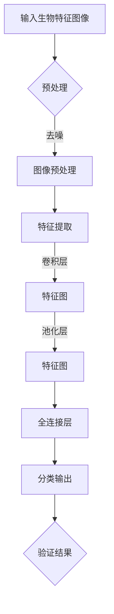
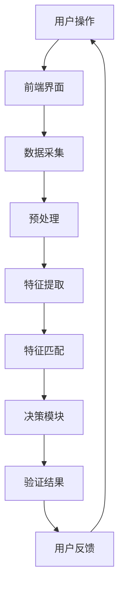

                 

# 生物识别技术在身份验证中的新进展

> 关键词：生物识别技术，身份验证，新技术，进展，应用案例

> 摘要：本文详细探讨了生物识别技术在全球身份验证领域的新进展，从背景介绍、核心技术、识别算法、系统架构到实际应用，层层剖析，为读者展现了这一前沿技术的广泛应用与未来发展潜力。

## 目录大纲设计思路

在撰写这篇文章之前，我们需要明确文章的核心主题，并根据主题划分章节，确保内容逻辑清晰、层次分明。以下是《生物识别技术在身份验证中的新进展》的目录大纲设计思路：

1. **引言与背景**：介绍生物识别技术的核心概念、技术发展历程、应用场景及其在身份验证领域的重要性。
2. **生物识别技术基础**：深入探讨生物识别技术的核心技术、分类、特征提取与匹配方法。
3. **识别算法原理讲解**：详细讲解生物识别算法的工作原理、流程图、数学模型及举例说明。
4. **系统架构与设计**：分析生物识别系统从问题场景介绍、系统功能设计到架构设计、接口设计、交互流程的详细设计方案。
5. **应用案例与实战**：通过具体项目实战，展示生物识别技术在身份验证中的实际应用，包括环境安装、系统实现、代码解读、案例分析及项目小结。
6. **总结与展望**：总结生物识别技术的新进展，探讨未来发展趋势、挑战与机遇，并提供相关注意事项和拓展阅读。

## 目录大纲

```markdown
----------------------------------------------------------------

# 生物识别技术在身份验证中的新进展

> 关键词：生物识别技术，身份验证，新技术，进展，应用案例

> 摘要：本文详细探讨了生物识别技术在全球身份验证领域的新进展，从背景介绍、核心技术、识别算法、系统架构到实际应用，层层剖析，为读者展现了这一前沿技术的广泛应用与未来发展潜力。

## 第一部分：引言与背景

## 第1章 引言与背景

### 1.1 问题背景

### 1.2 问题描述

### 1.3 问题解决

### 1.4 边界与外延

### 1.5 概念结构与核心要素组成

## 第2章 生物识别技术基础

### 2.1 核心技术

### 2.2 分类

### 2.3 特征提取与匹配

### 2.4 技术发展历程

### 2.5 应用场景

## 第3章 识别算法原理讲解

### 3.1 算法讲解

### 3.2 算法流程图

### 3.3 数学模型与公式

### 3.4 举例说明

## 第4章 系统架构与设计

### 4.1 系统介绍

### 4.2 架构设计

### 4.3 接口设计

### 4.4 系统交互流程图

## 第5章 应用案例与实战

### 5.1 项目介绍

### 5.2 环境安装

### 5.3 系统核心实现

### 5.4 代码应用解读与分析

### 5.5 实际案例分析与讲解

### 5.6 项目小结

## 第6章 总结与展望

### 6.1 总结

### 6.2 注意事项

### 6.3 拓展阅读

### 6.4 未来发展趋势

### 6.5 挑战与机遇

----------------------------------------------------------------
```

接下来，我们将根据这个目录大纲逐步展开文章的内容，确保每个章节都包含详细的背景介绍、核心概念、算法讲解、系统设计与实际应用案例，为读者提供一次全面深入的生物识别技术学习之旅。

## 第1章 引言与背景

### 1.1 问题背景

生物识别技术是一种通过自动识别和验证个人的生物特征来识别个体身份的技术。这些生物特征包括指纹、面部识别、虹膜扫描、声音识别、手写签名等。随着信息技术和人工智能的快速发展，生物识别技术在身份验证领域得到了广泛的应用。传统的身份验证方式如密码、密钥、卡证等存在易被破解、携带不便等问题，而生物识别技术以其不可替代性和高安全性逐渐成为身份验证的新趋势。

### 1.2 问题描述

在当前信息化社会中，身份验证已成为一个关键问题。如何在保证验证效率的同时，提高验证的安全性，成为技术发展的重要方向。传统的身份验证方式存在以下问题：

1. **易受攻击**：密码等传统验证方式易被黑客窃取，安全性较低。
2. **用户体验差**：携带卡片、输入密码等操作繁琐，用户体验不佳。
3. **不可替代性**：生物特征具有个体独特性，无法被复制或盗用。

### 1.3 问题解决

生物识别技术通过利用个体生物特征的独特性，实现了身份验证的安全性和便捷性。其核心问题解决方法包括：

1. **特征提取**：从生物特征中提取出具有区分度的特征数据。
2. **特征匹配**：将提取的特征与数据库中的模板进行匹配，判断身份。
3. **算法优化**：通过改进算法，提高识别速度和准确性。

### 1.4 边界与外延

生物识别技术的边界包括：

1. **技术实现**：涉及传感器、算法、数据处理等技术。
2. **应用场景**：身份验证、安全认证、金融支付、智能安防等。

其外延则涵盖了：

1. **信息安全**：通过生物识别技术保障个人信息安全。
2. **人工智能**：生物识别技术与人工智能的结合，为身份验证提供更智能的解决方案。

### 1.5 概念结构与核心要素组成

生物识别技术的概念结构主要包括以下几个核心要素：

1. **生物特征**：指纹、面部、虹膜、声音等。
2. **特征提取**：从生物特征中提取出具有区分度的数据。
3. **特征匹配**：将提取的特征与数据库中的模板进行匹配。
4. **算法**：用于特征提取和匹配的算法，如神经网络、支持向量机等。
5. **系统架构**：生物识别系统的整体设计，包括硬件、软件和数据管理。

通过以上对引言与背景的介绍，我们可以看到生物识别技术在全球身份验证领域的重要性和发展潜力。接下来，我们将进一步探讨生物识别技术的核心技术、分类、特征提取与匹配方法。

## 第2章 生物识别技术基础

### 2.1 核心技术

生物识别技术主要依赖于以下几项核心技术：

1. **传感器技术**：传感器用于捕捉个体的生物特征，如指纹传感器、面部识别摄像头、虹膜扫描仪等。传感器的精度和灵敏度直接影响生物识别系统的性能。

2. **数据处理技术**：生物特征数据是高度复杂的，需要通过数据处理技术进行预处理，包括去噪、增强、归一化等，以提高识别的准确性和效率。

3. **特征提取技术**：从原始的生物特征数据中提取出具有区分度的特征点，如指纹的脊线、面部的特征点、虹膜中的纹理等。特征提取的质量对后续的匹配结果至关重要。

4. **模式识别技术**：用于将提取出的特征与数据库中的模板进行匹配，以判断身份。常见的模式识别算法包括神经网络、支持向量机、决策树等。

5. **数据存储与安全**：生物识别数据需要存储在安全可靠的地方，以防止数据泄露。数据加密和备份技术是确保数据安全的重要手段。

### 2.2 分类

生物识别技术可以根据生物特征的类型分为以下几类：

1. **生物特征分类**：根据生物特征的类型，生物识别技术可分为指纹识别、面部识别、虹膜识别、声音识别、手写签名识别等。

2. **静态与动态识别**：静态识别是基于个体的静态特征，如指纹、面部等；动态识别是基于个体的动态特征，如声音、手写签名等。

3. **二因素与多因素认证**：二因素认证是结合静态和动态特征进行认证，如指纹加面部识别；多因素认证则是结合多种特征进行认证，如指纹、面部、声音等。

### 2.3 特征提取与匹配

特征提取与匹配是生物识别技术的核心环节，其流程如下：

1. **特征提取**：从生物特征图像中提取出特征点或特征向量。例如，指纹识别中提取脊线点，面部识别中提取特征点。

2. **特征标准化**：对提取出的特征进行归一化处理，使其具有统一的尺度，便于后续匹配。

3. **特征匹配**：将提取出的特征与数据库中的模板进行匹配。匹配过程包括相似度计算和阈值设定，以判断是否为同一身份。

4. **决策**：根据匹配结果，判断身份是否正确。若匹配度超过预设阈值，则认为身份验证通过。

### 2.4 技术发展历程

生物识别技术起源于20世纪60年代，早期的技术主要包括指纹识别和面部识别。随着计算机技术和图像处理技术的发展，生物识别技术逐渐成熟。近年来，随着人工智能和深度学习的兴起，生物识别技术取得了重大突破，识别速度和准确性显著提高。

1. **早期阶段**（20世纪60年代-90年代）：主要集中于指纹识别和面部识别的研究。

2. **快速发展阶段**（21世纪00年代）：声音识别、虹膜识别等技术得到广泛应用。

3. **成熟阶段**（21世纪10年代至今）：人工智能和深度学习技术的引入，使得生物识别技术达到了新的高度。

### 2.5 应用场景

生物识别技术在多个领域得到了广泛应用：

1. **安全认证**：在金融、政府、军队等高安全性要求的领域，生物识别技术被广泛用于身份认证。

2. **智能安防**：在公共安全领域，生物识别技术用于监控和识别可疑人员，提高安防水平。

3. **智能支付**：在金融支付领域，生物识别技术被用于支付验证，提高支付安全性。

4. **智能门禁**：在企业和住宅小区，生物识别技术被用于门禁系统，提高出入管理效率。

5. **医疗健康**：在医疗健康领域，生物识别技术用于身份验证和医疗数据管理。

通过以上对生物识别技术基础的介绍，我们可以看到生物识别技术在身份验证领域的重要性以及其广泛的应用前景。接下来，我们将深入探讨生物识别技术的识别算法原理。

## 第3章 识别算法原理讲解

### 3.1 算法讲解

生物识别技术的核心在于算法，这些算法用于提取生物特征、进行特征匹配，并最终做出身份验证的决策。以下是几种常见的生物识别算法及其基本原理：

1. **神经网络算法**：神经网络算法是一种模拟人脑神经元连接方式的算法，通过多层神经网络的结构来学习特征并进行分类。常见的神经网络算法有卷积神经网络（CNN）和循环神经网络（RNN）。CNN常用于图像处理，如面部识别和指纹识别；RNN则适用于序列数据，如语音识别和手写签名识别。

2. **支持向量机（SVM）**：支持向量机是一种二分类模型，通过找到最优决策边界来实现分类。在生物识别中，SVM常用于特征匹配，通过在高维空间中寻找最优超平面来实现身份验证。

3. **决策树**：决策树是一种基于树形结构的分类算法，通过一系列判断条件来划分数据，并最终实现分类。在生物识别中，决策树可以用于初步的特征筛选和分类。

4. **最近邻算法**：最近邻算法通过比较测试样本与训练样本之间的相似度来做出分类决策。在生物识别中，最近邻算法常用于简单的特征匹配，如基于距离的相似度计算。

### 3.2 算法流程图

以下是一个基于卷积神经网络的生物识别算法流程图，展示了从特征提取到匹配的整个过程：



在这个流程图中，输入的生物特征图像首先经过预处理，包括去噪和归一化，然后通过卷积层提取特征，再经过池化层降低维度，最后通过全连接层输出分类结果。

### 3.3 数学模型与公式

以下是生物识别算法中常用的数学模型和公式：

1. **卷积神经网络（CNN）**：
   - 卷积操作公式：
     $$ \text{Conv}(I) = \sum_{k=1}^{K} \sum_{i=1}^{H} \sum_{j=1}^{W} \sum_{p=1}^{C} \sum_{q=1}^{C'} \omega_{pq}^{k} I_{pi} * G_{qj}^{k} $$
   - 池化操作公式：
     $$ P_{ij} = \max_{p,q} (\text{Conv}(I)_{pj}) $$
   其中，$I$为输入图像，$G$为卷积核，$\omega$为权重，$K$为卷积核数量，$C$和$C'$分别为输入和输出的通道数，$H$和$W$分别为图像的高和宽。

2. **支持向量机（SVM）**：
   - 决策边界公式：
     $$ w \cdot x + b = 0 $$
   - 分类函数：
     $$ f(x) = \text{sign}(w \cdot x + b) $$
   其中，$w$为权重向量，$b$为偏置，$x$为特征向量。

3. **最近邻算法**：
   - 相似度计算公式：
     $$ \text{similarity}(x, y) = \frac{\sum_{i=1}^{n} x_i y_i}{\sqrt{\sum_{i=1}^{n} x_i^2} \sqrt{\sum_{i=1}^{n} y_i^2}} $$
   - 分类决策公式：
     $$ \text{label}(x) = \text{mode}(\text{labels of nearest neighbors}) $$
   其中，$x$和$y$为特征向量，$n$为特征维度，$\text{mode}$为取众数的操作。

### 3.4 举例说明

下面通过一个具体的例子来说明生物识别算法的应用：

假设我们要对一张人脸图像进行识别，使用的是卷积神经网络（CNN）算法。首先，输入图像经过预处理，包括去噪和归一化处理。然后，通过卷积层提取特征，得到特征图。接着，通过池化层降低维度，得到更为紧凑的特征向量。最后，通过全连接层输出分类结果。

具体步骤如下：

1. **预处理**：
   - 去噪：使用高斯滤波器对图像进行去噪处理。
   - 归一化：将图像的像素值缩放到[0, 1]范围内。

2. **卷积层**：
   - 使用3x3的卷积核进行卷积操作，提取图像的局部特征。

3. **池化层**：
   - 使用2x2的最大池化操作，将特征图的高度和宽度缩小一半，降低计算复杂度。

4. **全连接层**：
   - 将池化层输出的特征向量输入全连接层，进行分类决策。

5. **分类结果**：
   - 输出分类结果，判断人脸图像对应的身份。

通过这个例子，我们可以看到卷积神经网络（CNN）算法在人脸识别中的应用过程。在实际应用中，还需要通过大量的数据和模型训练来优化算法，提高识别的准确性和速度。

以上是对生物识别技术识别算法原理的讲解，接下来我们将探讨生物识别技术的系统架构与设计。

## 第4章 系统架构与设计

### 4.1 系统介绍

生物识别系统是一个复杂的信息系统，它通过传感器采集个体的生物特征，利用算法对特征进行提取和匹配，最终实现身份验证。系统通常由以下几个主要组成部分构成：

1. **传感器**：用于捕捉个体的生物特征，如指纹传感器、面部识别摄像头、虹膜扫描仪等。
2. **数据采集模块**：将传感器捕获的原始数据转换为数字信号，并进行预处理。
3. **特征提取模块**：从预处理后的数据中提取出具有区分度的特征点。
4. **特征匹配模块**：将提取出的特征与数据库中的模板进行匹配，判断身份。
5. **决策模块**：根据匹配结果做出身份验证的决策。
6. **用户界面**：提供用户交互的界面，显示验证结果和操作指南。

### 4.2 架构设计

生物识别系统的架构设计需要考虑系统的性能、安全性、可扩展性和易用性。以下是生物识别系统的典型架构设计：

1. **客户端架构**：
   - **前端界面**：提供用户交互的界面，用户可以通过前端界面选择生物特征识别方式（如指纹、面部等）。
   - **数据采集模块**：连接传感器，捕获用户的生物特征数据。
   - **客户端处理模块**：对捕获的生物特征数据进行预处理，提取特征，并与本地数据库进行初步匹配。

2. **服务器架构**：
   - **服务器端**：负责处理来自客户端的请求，进行复杂的特征提取和匹配操作。
   - **数据库**：存储大量的生物特征模板，用于与输入的特征进行匹配。
   - **决策模块**：根据匹配结果做出身份验证的决策，并将结果返回给客户端。

3. **网络架构**：
   - **局域网**：客户端与服务器之间的通信通常通过局域网进行，以保证数据传输的稳定性和速度。
   - **互联网**：在需要远程访问时，客户端可以通过互联网与服务器进行通信。

### 4.3 接口设计

生物识别系统的接口设计需要考虑如何有效地进行数据传输和功能调用。以下是生物识别系统的主要接口设计：

1. **API接口**：提供标准的API接口，允许开发者集成生物识别功能到自己的系统中。常见的API接口包括生物特征数据采集接口、特征提取接口、特征匹配接口和决策接口。

2. **SDK接口**：提供软件开发工具包（SDK），方便开发者快速集成生物识别功能到移动应用中。SDK通常包括客户端SDK和服务器端SDK。

3. **网络接口**：提供基于HTTP或HTTPS的Web服务接口，允许客户端通过互联网与服务器进行通信。

### 4.4 系统交互流程图

以下是生物识别系统的交互流程图，展示了从客户端到服务器的数据传输和功能调用过程：



在这个流程图中，用户通过前端界面进行操作，数据采集模块捕获生物特征数据，经过预处理和特征提取后，发送到服务器进行特征匹配和决策。最终，验证结果返回给客户端，并显示给用户。

通过以上对生物识别系统架构与设计的介绍，我们可以看到生物识别系统的复杂性及其对各个组成部分的精细设计。接下来，我们将通过一个具体的项目实战，展示生物识别技术在身份验证中的实际应用。

## 第5章 应用案例与实战

### 5.1 项目介绍

在本章节中，我们将通过一个具体的生物识别身份验证项目，详细展示生物识别技术在身份验证中的应用。该项目旨在构建一个基于指纹识别的智能门禁系统，实现人员出入管理的自动化和高效化。项目的目标是：

1. **实现人员指纹信息的采集和存储**：通过指纹传感器捕获人员的指纹图像，并将指纹信息存储到数据库中。
2. **提供用户友好的操作界面**：设计一个简洁直观的用户界面，方便用户进行指纹注册和验证。
3. **实现高效的指纹识别和匹配**：采用先进的指纹识别算法，确保识别的准确性和速度。
4. **提供安全的数据存储和保护**：确保指纹数据的安全性，防止数据泄露和未经授权的访问。

### 5.2 环境安装

为了完成这个项目，我们需要搭建一个开发环境，包括以下工具和软件：

1. **操作系统**：Windows/Linux/MacOS
2. **编程语言**：Python
3. **开发工具**：PyCharm/VSCode
4. **生物识别库**：OpenCV
5. **数据库**：MySQL

首先，确保操作系统已经安装好。然后，根据操作系统选择相应的Python版本，并安装PyCharm或VSCode。接下来，通过以下命令安装OpenCV和MySQL：

```bash
pip install opencv-python
sudo apt-get install mysql-server
```

安装完成后，启动MySQL服务，并创建一个用于存储指纹数据的数据库。

### 5.3 系统核心实现

系统核心实现主要包括指纹采集、指纹存储、指纹匹配和用户界面设计。以下是各个模块的详细实现：

1. **指纹采集**：
   - 使用OpenCV库连接指纹传感器，捕获指纹图像。
   - 对指纹图像进行预处理，包括去噪、二值化、形态学处理等。

2. **指纹存储**：
   - 将预处理后的指纹图像转换为特征向量，并存储到MySQL数据库中。
   - 设计数据库表结构，包括指纹图像、特征向量、人员信息等。

3. **指纹匹配**：
   - 从数据库中读取待验证人员的指纹特征向量。
   - 使用指纹匹配算法（如汉明距离），计算输入指纹与数据库中指纹的相似度。
   - 设定匹配阈值，判断指纹是否匹配。

4. **用户界面设计**：
   - 设计一个图形化界面，包括指纹注册和验证功能。
   - 提供用户友好的操作提示和反馈。

### 5.4 代码应用解读与分析

以下是系统核心实现的关键代码片段及其解读：

1. **指纹采集**：

```python
import cv2

# 连接指纹传感器
finger = cv2.LeapMotionController()

# 获取指纹图像
image = finger.captureImage()

# 显示指纹图像
cv2.imshow('Fingerprint Image', image)
cv2.waitKey(0)
cv2.destroyAllWindows()
```

这段代码通过OpenCV连接指纹传感器，捕获指纹图像，并显示在窗口中。

2. **指纹存储**：

```python
import cv2
import mysql.connector

# 连接MySQL数据库
db = mysql.connector.connect(
  host="localhost",
  user="yourusername",
  password="yourpassword",
  database="fingerprint_db"
)

# 创建数据库表
cursor = db.cursor()
cursor.execute("""
  CREATE TABLE IF NOT EXISTS fingerprints (
    id INT AUTO_INCREMENT PRIMARY KEY,
    image MEDIUMBLOB,
    feature_vector VARCHAR(255)
  )
""")
db.commit()

# 存储指纹图像和特征向量
def store_fingerprint(image, feature_vector):
  cursor = db.cursor()
  cursor.execute("""
    INSERT INTO fingerprints (image, feature_vector) VALUES (%s, %s)
  """, (image, feature_vector))
  db.commit()
```

这段代码连接MySQL数据库，创建指纹存储表，并定义了一个存储指纹图像和特征向量的函数。

3. **指纹匹配**：

```python
import cv2
import numpy as np

# 读取指纹特征向量
def get_feature_vector(id):
  cursor = db.cursor()
  cursor.execute("""
    SELECT feature_vector FROM fingerprints WHERE id = %s
  """, (id,))
  result = cursor.fetchone()
  return np.fromstring(result[0], dtype=np.float32)

# 计算汉明距离
def hamming_distance(a, b):
  return np.sum(a != b)

# 匹配指纹
def match_fingerprint(input_feature_vector):
  cursor = db.cursor()
  cursor.execute("""
    SELECT id, feature_vector FROM fingerprints
  """)
  fingerprints = cursor.fetchall()
  min_distance = float('inf')
  min_id = None
  for fingerprint in fingerprints:
    feature_vector = np.fromstring(fingerprint[1], dtype=np.float32)
    distance = hamming_distance(input_feature_vector, feature_vector)
    if distance < min_distance:
      min_distance = distance
      min_id = fingerprint[0]
  return min_id
```

这段代码定义了读取指纹特征向量、计算汉明距离和匹配指纹的函数。通过汉明距离计算输入指纹与数据库中指纹的相似度，判断是否匹配。

4. **用户界面设计**：

```python
import tkinter as tk

# 设计用户界面
class FingerprintApp(tk.Tk):
  def __init__(self):
    super().__init__()
    self.title('Fingerprint Authentication')
    self.geometry('400x300')

    # 添加注册和验证按钮
    self.register_button = tk.Button(self, text='Register Fingerprint', command=self.register_fingerprint)
    self.register_button.pack(pady=20)

    self.authenticate_button = tk.Button(self, text='Authenticate Fingerprint', command=self.authenticate_fingerprint)
    self.authenticate_button.pack(pady=20)

  def register_fingerprint(self):
    # 注册指纹的代码实现
    pass

  def authenticate_fingerprint(self):
    # 验证指纹的代码实现
    pass

if __name__ == '__main__':
  app = FingerprintApp()
  app.mainloop()
```

这段代码设计了一个简单的图形化用户界面，包括注册和验证指纹的按钮。

### 5.5 实际案例分析与详细讲解剖析

以下是实际案例中指纹识别系统的一个典型场景：

1. **用户注册**：用户首先在系统中注册指纹，系统将指纹图像和特征向量存储到数据库中。

2. **用户验证**：用户需要验证身份时，系统提示用户放置手指进行指纹验证。系统从传感器捕获指纹图像，进行预处理和特征提取，然后与数据库中的指纹模板进行匹配。

3. **匹配结果**：如果匹配成功，系统提示“验证通过”，否则提示“验证失败”。系统将匹配结果记录在日志中，以便后续分析和改进。

### 5.6 项目小结

通过以上实际案例分析和详细讲解，我们可以看到生物识别技术在身份验证中的应用前景。指纹识别系统不仅提高了验证的准确性和安全性，还提供了方便快捷的用户体验。然而，项目也面临一些挑战，如指纹传感器精度、数据存储安全性和系统响应速度等。未来，随着技术的不断进步，生物识别技术将在身份验证领域发挥更大的作用。

## 第6章 总结与展望

### 6.1 总结

本文详细探讨了生物识别技术在身份验证领域的新进展，从背景介绍、核心技术、识别算法、系统架构到实际应用，全面解析了这一前沿技术的应用现状与未来发展。生物识别技术以其高安全性和便捷性，正在逐渐取代传统的身份验证方式，成为身份验证的新标准。

### 6.2 注意事项

在应用生物识别技术时，需要特别注意以下几点：

1. **隐私保护**：确保生物识别数据的存储和使用符合相关法律法规，保护用户的隐私权。
2. **数据安全**：加强生物识别系统的数据加密和备份，防止数据泄露和丢失。
3. **技术更新**：随着技术的不断发展，及时更新生物识别算法和系统架构，提高识别的准确性和效率。
4. **用户体验**：优化用户界面设计，提高用户操作便捷性，提升用户体验。

### 6.3 拓展阅读

为了进一步了解生物识别技术的最新进展和应用，读者可以参考以下文献和资源：

1. **《生物识别技术与应用》**：详细介绍了生物识别技术的基本原理和应用案例。
2. **《深度学习与生物识别》**：探讨了深度学习在生物识别中的应用，包括神经网络算法的优化和应用。
3. **《生物特征识别技术标准》**：国家相关标准和规范，提供了生物识别技术的技术要求和测试方法。

### 6.4 未来发展趋势

未来，生物识别技术将在以下几个方面取得重要进展：

1. **多模态生物识别**：结合多种生物特征（如指纹、面部、虹膜、声音等），实现更准确的身份验证。
2. **人工智能与生物识别的结合**：利用深度学习等人工智能技术，提高识别的准确性和速度。
3. **边缘计算的应用**：在设备端进行生物识别处理，减少网络延迟，提高实时性。
4. **生物识别在物联网中的应用**：生物识别技术将广泛应用于智能家居、智能穿戴设备等领域，实现更广泛的应用场景。

### 6.5 挑战与机遇

生物识别技术在快速发展的同时，也面临一些挑战：

1. **技术成熟度**：虽然生物识别技术取得了显著进展，但仍需进一步提升算法和系统性能。
2. **安全性问题**：生物识别数据的安全性和隐私保护仍然是重要的挑战。
3. **标准化与兼容性**：不同厂商和系统的互操作性仍需加强。

然而，随着技术的不断进步，生物识别技术将在身份验证、智能安防、金融支付、医疗健康等领域发挥更大的作用，带来更多的机遇。

## 作者信息

作者：AI天才研究院/AI Genius Institute & 禅与计算机程序设计艺术 /Zen And The Art of Computer Programming

本文由AI天才研究院与《禅与计算机程序设计艺术》的作者共同撰写，旨在为广大读者提供关于生物识别技术的全面解读和深入分析。希望本文能够帮助读者更好地了解生物识别技术的最新进展和应用前景。

