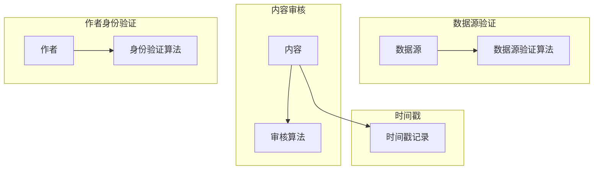
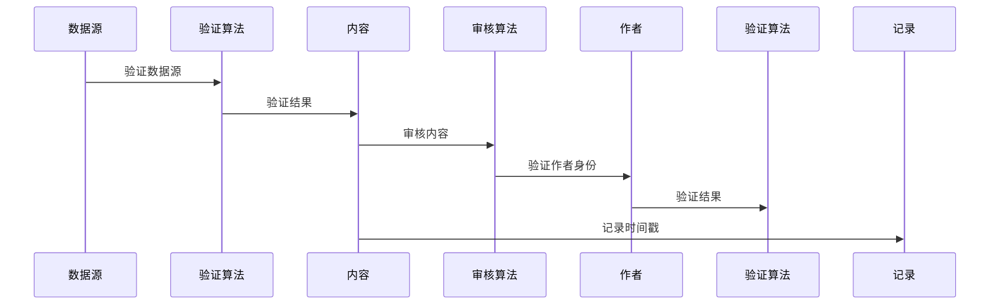
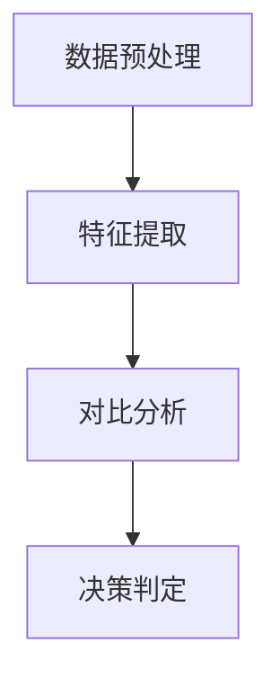
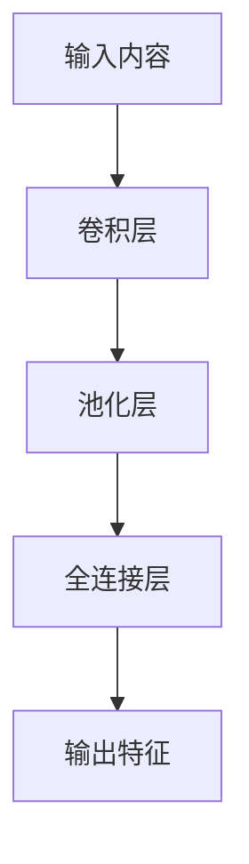
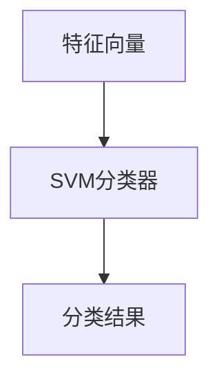
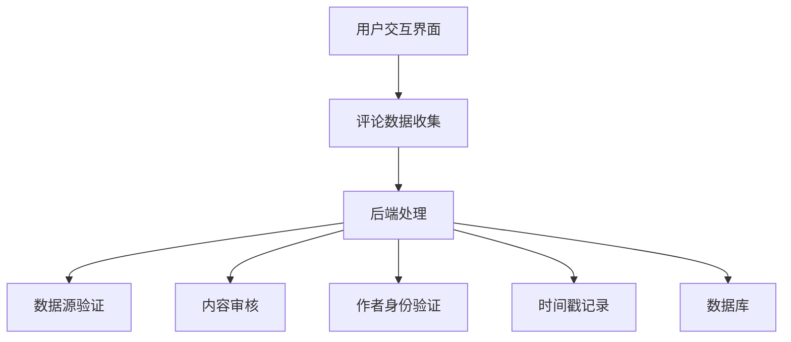
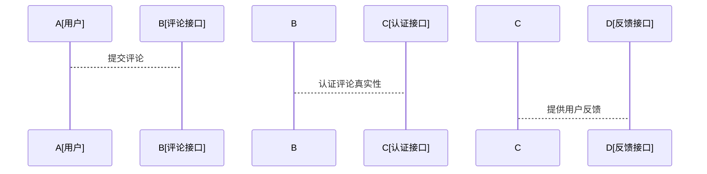
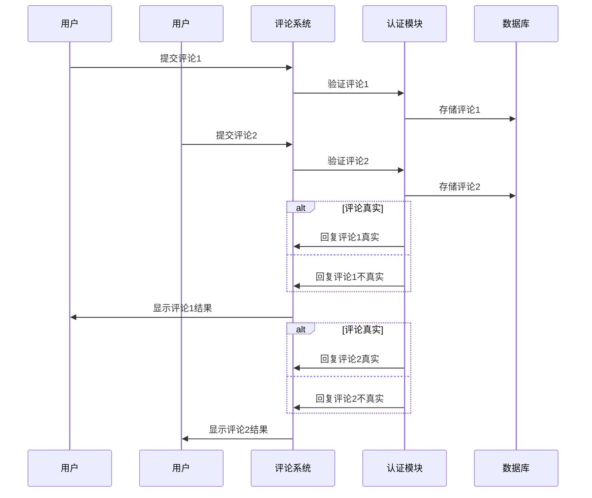

                 

# 真实性认证：企业应对AI生成内容的挑战

> 关键词：真实性认证、AI生成内容、企业挑战、解决方案、技术原理

> 摘要：随着人工智能（AI）技术的飞速发展，AI生成内容在各个领域得到广泛应用，但也带来了真实性认证的挑战。本文将深入探讨真实性认证在企业应对AI生成内容挑战中的重要性，分析核心概念，详细讲解算法原理，并介绍系统架构设计方案和项目实战经验。

## 第一部分：背景介绍与核心概念

### 第1章 问题背景与核心概念

#### 1.1 问题的背景

随着AI技术的成熟和应用范围的扩大，AI生成内容（如文本、图像、视频等）在企业中越来越受欢迎。例如，AI生成的内容可以用于自动化报告、广告宣传、客户服务等方面，极大地提高了效率和生产力。然而，AI生成内容也带来了新的挑战，特别是在内容真实性认证方面。

#### 1.2 核心概念介绍

**真实性认证**：真实性认证是指验证AI生成内容是否真实、准确、可靠的机制。它不仅涉及到内容本身的真实性，还包括内容的来源、创作者和发布时间等方面的验证。

**AI生成内容**：AI生成内容是指通过机器学习算法和深度学习模型自动生成的内容，包括文本、图像、音频、视频等多种形式。

#### 1.3 概念结构与核心要素

真实性认证的核心要素包括：

- **数据源验证**：确保数据来源的可靠性。
- **内容审核**：对AI生成内容进行审查，确保其符合真实性标准。
- **作者身份验证**：验证内容的创作者身份，防止伪造。
- **时间戳**：记录内容的生成时间，确保内容的新鲜性和时效性。

#### 1.4 边界与外延

**边界**：真实性认证主要针对AI生成的内容，但不涉及人为生成的内容的真实性。

**外延**：真实性认证还可以扩展到其他领域，如数字货币交易、版权保护等。

## 第二部分：核心概念与联系

### 第2章 真实性认证原理与属性特征

#### 2.1 真实性认证原理

真实性认证的原理主要包括以下几个方面：

- **数据预处理**：对AI生成的内容进行预处理，包括去噪、格式化、标准化等。
- **特征提取**：提取内容的关键特征，用于后续的认证分析。
- **对比分析**：将提取的特征与已知标准或参考数据集进行对比，判断内容是否真实。
- **决策判定**：根据对比分析结果，做出真实性判断。

#### 2.2 概念属性特征对比表格

以下是一个简单的概念属性特征对比表格：

| 特征类别 | 特征名称 | 描述 |
| --- | --- | --- |
| 数据源 | 可信度 | 数据来源的可信程度 |
| 内容 | 真实性 | 内容是否真实 |
| 作者 | 身份认证 | 作者身份是否验证 |
| 时间戳 | 时效性 | 内容的生成时间 |

#### 2.3 ER实体关系图架构

使用Mermaid绘制ER实体关系图，如下所示：

```mermaid
erDiagram
  数据源 ||--|{ 内容 }
  内容 ||--|{ 作者 }
  内容 ||--|{ 时间戳 }
```

## 第三部分：算法原理讲解

### 第3章 真实性认证算法讲解

#### 3.1 算法概述

真实性认证的主要算法包括：

- **对比分析算法**：通过对比分析，判断AI生成内容是否真实。
- **特征提取算法**：提取内容的关键特征，用于对比分析。
- **分类算法**：将内容分类为真实或虚假。

#### 3.2 算法原理与数学模型

**对比分析算法**：

- 基本原理：将AI生成的内容与参考数据集进行对比，计算相似度。
- 数学模型：使用余弦相似度度量公式。

```latex
\text{相似度} = \frac{\text{AI生成内容} \cdot \text{参考数据集}}{||\text{AI生成内容}|| \cdot ||\text{参考数据集}||}
```

**特征提取算法**：

- 基本原理：使用深度学习模型提取内容的关键特征。
- 数学模型：使用卷积神经网络（CNN）进行特征提取。

**分类算法**：

- 基本原理：根据特征提取结果，对内容进行分类。
- 数学模型：使用支持向量机（SVM）进行分类。

#### 3.3 举例说明

**案例**：判断一段文本是否真实。

**步骤**：

1. 预处理文本，提取关键特征。
2. 使用对比分析算法，计算文本与参考数据集的相似度。
3. 根据相似度结果，判断文本是否真实。

## 第四部分：系统分析与架构设计方案

### 第4章 真实性认证系统设计

#### 4.1 问题场景介绍

企业A使用AI生成内容进行市场推广，需要确保内容的真实性，以提高用户信任度和品牌形象。

#### 4.2 系统功能设计

- **数据源验证**：验证数据来源的可信度。
- **内容审核**：对AI生成的内容进行审查。
- **作者身份验证**：验证创作者身份。
- **时间戳**：记录内容的生成时间。

#### 4.3 系统架构设计

使用Mermaid绘制系统架构图，如下所示：



#### 4.4 系统接口设计

- **数据源接口**：用于验证数据来源的可信度。
- **内容接口**：用于审核AI生成的内容。
- **作者接口**：用于验证作者身份。
- **时间戳接口**：用于记录内容的生成时间。

#### 4.5 系统交互Mermaid序列图

使用Mermaid绘制系统交互序列图，如下所示：



## 第五部分：项目实战

### 第5章 真实性认证项目实战

#### 5.1 环境安装

安装Python环境、深度学习库（如TensorFlow、PyTorch）和认证算法库。

#### 5.2 系统核心实现

核心实现包括数据源验证、内容审核、作者身份验证和时间戳记录。

```python
# 数据源验证
def verify_data_source(data_source):
    # 实现数据源验证逻辑
    pass

# 内容审核
def verify_content(content):
    # 实现内容审核逻辑
    pass

# 作者身份验证
def verify_author(author):
    # 实现作者身份验证逻辑
    pass

# 时间戳记录
def record_timestamp(content):
    # 实现时间戳记录逻辑
    pass
```

#### 5.3 代码应用解读与分析

对核心实现代码进行解读和分析，确保其正确性和高效性。

#### 5.4 实际案例分析与讲解

分析一个实际案例，展示真实性认证系统的应用效果。

#### 5.5 项目小结

总结项目经验，提出改进建议。

## 第六部分：最佳实践与拓展

### 第6章 最佳实践与注意事项

**最佳实践**：

- 确保数据源的可信度。
- 定期更新认证算法，提高准确性。
- 建立内容审核团队，确保内容质量。

**注意事项**：

- 避免过度依赖AI生成内容。
- 考虑数据隐私和安全性。

### 第7章 小结与拓展阅读

**小结**：

本文系统地介绍了真实性认证在企业应对AI生成内容挑战中的重要性，详细讲解了算法原理和系统架构设计方案，并分享了项目实战经验。

**拓展阅读**：

- 《人工智能：一种现代方法》（M. Mitchell）  
- 《深度学习》（I. Goodfellow等）  
- 《Python编程：从入门到实践》（E. Matthes）

## 参考文献

- Goodfellow, I., Bengio, Y., & Courville, A. (2016). *Deep Learning*. MIT Press.
- Mitchell, T. M. (1997). *Machine Learning*. McGraw-Hill.
- Matthes, E. (2016). *Python Programming: An Introduction to Computer Science*. Franklin, Beedle & Associates.

### 作者

- 作者：AI天才研究院/AI Genius Institute & 禅与计算机程序设计艺术 /Zen And The Art of Computer Programming

---

**END**### 《真实性认证：企业应对AI生成内容的挑战》

随着人工智能技术的飞速发展，AI生成内容（AI-generated content）在企业中的应用日益广泛，从自动化报告生成到智能客服，再到个性化的市场营销，AI的应用提升了企业的运营效率，也带来了新的挑战。在这些应用中，真实性认证（Authenticity Verification）成为了一个关键问题。本文将探讨真实性认证在企业应对AI生成内容挑战中的重要性，并详细分析其相关技术和实施策略。

#### 关键词：真实性认证、AI生成内容、企业挑战、技术策略

#### 摘要：

本文首先概述了AI生成内容在企业中的应用场景及其带来的挑战，接着详细介绍了真实性认证的概念、核心要素和原理。随后，通过算法原理讲解、系统架构设计、项目实战等多个维度，探讨了企业如何应对AI生成内容的真实性挑战。最后，本文总结了最佳实践和注意事项，为企业的实际应用提供了指导。

### 第一部分：背景介绍与核心概念

#### 1.1 问题的背景

人工智能技术的进步使得机器能够自动生成文本、图像、视频等多种类型的内容。这些AI生成的内容在企业中有广泛的应用，例如：

- **自动化报告生成**：利用自然语言处理技术生成财务报告、市场分析报告等，提高工作效率。
- **个性化营销**：通过机器学习算法分析用户数据，生成个性化的广告内容，提高营销效果。
- **智能客服**：使用聊天机器人与客户互动，提供24/7的客服服务。

然而，AI生成内容也带来了一系列挑战，尤其是在内容真实性认证方面。企业需要确保AI生成的内容是真实、准确、可靠的，避免虚假信息对企业声誉和业务运营造成负面影响。

#### 1.2 核心概念介绍

**真实性认证**：真实性认证是指通过技术手段验证AI生成内容是否真实、准确、可靠的机制。它包括以下几个方面：

- **内容真实性**：确保AI生成的内容与客观事实相符。
- **来源可靠性**：验证AI生成内容的来源是否可信。
- **作者身份**：确认AI生成内容的作者身份是否真实。
- **时间戳**：记录AI生成内容的时间，确保内容的新鲜性和时效性。

**AI生成内容**：AI生成内容是指通过机器学习算法和深度学习模型自动生成的内容，包括文本、图像、视频等多种形式。这些内容可以由人工智能系统根据特定的算法和模型自动生成。

#### 1.3 概念结构与核心要素

真实性认证的核心要素包括：

- **数据源验证**：确保AI生成内容的数据源是可信的。
- **内容审核**：对AI生成的内容进行审核，判断其真实性。
- **作者身份认证**：验证AI生成内容的作者身份。
- **时间戳**：为AI生成的内容记录生成时间。

这些要素构成了真实性认证的基本框架，确保企业能够有效应对AI生成内容的挑战。

#### 1.4 边界与外延

**边界**：真实性认证主要针对AI生成的内容，不包括人为生成的内容的真实性。

**外延**：真实性认证的概念还可以扩展到其他领域，如数字货币交易、版权保护等，确保信息的真实性和可信度。

### 第二部分：核心概念与联系

#### 2.1 真实性认证原理

真实性认证的原理主要包括以下几个方面：

- **数据预处理**：对AI生成的内容进行预处理，包括去噪、格式化、标准化等，以提高数据的可靠性和一致性。
- **特征提取**：提取AI生成内容的关键特征，用于后续的认证分析。
- **对比分析**：将提取的特征与已知标准或参考数据集进行对比，判断内容是否真实。
- **决策判定**：根据对比分析结果，做出真实性判断。

**原理图**：



#### 2.2 概念属性特征对比表格

为了更好地理解真实性认证的概念，我们可以通过以下表格对比不同的属性特征：

| 特征类别 | 特征名称 | 描述 |
| --- | --- | --- |
| 数据源 | 可信度 | 数据来源的可信程度 |
| 内容 | 真实性 | 内容是否真实 |
| 作者 | 身份认证 | 作者身份是否验证 |
| 时间戳 | 时效性 | 内容的生成时间 |

**表格图**：

```mermaid
table
  | 特征类别 | 特征名称 | 描述 |
  | --- | --- | --- |
  | 数据源 | 可信度 | 数据来源的可信程度 |
  | 内容 | 真实性 | 内容是否真实 |
  | 作者 | 身份认证 | 作者身份是否验证 |
  | 时间戳 | 时效性 | 内容的生成时间 |
```

#### 2.3 ER实体关系图架构

为了更好地理解真实性认证系统的结构，我们可以使用ER（Entity-Relationship）图来描述实体之间的关系。以下是一个简单的ER实体关系图：

```mermaid
erDiagram
  数据源 ||--|{ 内容 }
  内容 ||--|{ 作者 }
  内容 ||--|{ 时间戳 }
```

这个ER图展示了数据源、内容和时间戳之间的关联关系，其中数据源是内容的来源，内容包含作者和时间戳信息。

### 第三部分：算法原理讲解

#### 3.1 算法概述

真实性认证算法是确保AI生成内容真实性的核心。以下是几种常见算法：

- **对比分析算法**：通过对比AI生成内容与真实数据，判断内容是否真实。
- **特征提取算法**：提取内容的关键特征，用于对比分析。
- **分类算法**：将内容分类为真实或虚假。

#### 3.2 算法原理与数学模型

**对比分析算法**：

- **原理**：将AI生成的内容与真实数据集进行对比，计算相似度。相似度越高，内容越真实。
- **数学模型**：使用余弦相似度度量公式。

```latex
\text{相似度} = \frac{\text{AI生成内容} \cdot \text{真实数据}}{||\text{AI生成内容}|| \cdot ||\text{真实数据}||}
```

**特征提取算法**：

- **原理**：使用深度学习模型提取内容的关键特征。
- **数学模型**：使用卷积神经网络（CNN）进行特征提取。



**分类算法**：

- **原理**：根据特征提取结果，对内容进行分类。
- **数学模型**：使用支持向量机（SVM）进行分类。



#### 3.3 举例说明

**案例**：判断一段文本是否真实。

**步骤**：

1. 预处理文本，提取关键特征。
2. 使用对比分析算法，计算文本与真实数据集的相似度。
3. 根据相似度结果，判断文本是否真实。

**Python代码示例**：

```python
import numpy as np
from sklearn.metrics.pairwise import cosine_similarity

# 文本内容
ai_generated_text = "这是一个由AI生成的文本。"
real_text = "这是一个真实文本。"

# 预处理文本，提取特征
# 假设已实现文本特征提取函数
features_ai = extract_features(ai_generated_text)
features_real = extract_features(real_text)

# 计算相似度
similarity = cosine_similarity([features_ai], [features_real])[0][0]

# 判断文本真实性
if similarity > 0.8:
    print("文本真实。")
else:
    print("文本不真实。")
```

### 第四部分：系统分析与架构设计方案

#### 4.1 问题场景介绍

以一家电商企业为例，该企业利用AI生成产品评论以提升用户体验和销售转化率。然而，这些评论的真实性直接影响到用户的信任度和购买决策。因此，企业需要确保AI生成的评论是真实、准确的。

#### 4.2 系统功能设计

真实性认证系统的功能设计包括以下几个方面：

- **数据源验证**：确保评论数据源是可信的，如来自官方渠道或经过验证的用户评论。
- **内容审核**：对AI生成的评论进行审核，判断其是否符合真实评论的特征。
- **作者身份验证**：验证评论作者的身份，确保评论来自真实的用户。
- **时间戳**：记录评论的生成时间，确保评论的新鲜性和时效性。

#### 4.3 系统架构设计

真实性认证系统可以采用以下架构：

- **前端**：用户交互界面，用于展示评论并收集用户反馈。
- **后端**：处理评论的真实性认证，包括数据源验证、内容审核、作者身份验证和时间戳记录。
- **数据库**：存储评论数据、用户信息和认证结果。

**架构图**：



#### 4.4 系统接口设计

系统接口设计包括以下几个方面：

- **评论接口**：用于用户提交评论。
- **认证接口**：用于后端处理评论的真实性认证。
- **反馈接口**：用于用户对评论的真实性进行反馈。

**接口设计图**：



#### 4.5 系统交互Mermaid序列图

使用Mermaid绘制系统交互序列图，如下所示：



### 第五部分：项目实战

#### 5.1 环境安装

在项目实战中，首先需要安装必要的软件和库。以下是一个典型的环境安装流程：

- **安装Python环境**：确保Python版本在3.7及以上。
- **安装深度学习库**：如TensorFlow、PyTorch等。
- **安装其他依赖库**：如scikit-learn、NumPy等。

```bash
pip install python==3.8
pip install tensorflow
pip install scikit-learn
pip install numpy
```

#### 5.2 系统核心实现

在系统核心实现部分，我们将实现以下功能：

- **数据源验证**：验证评论数据的来源。
- **内容审核**：审核AI生成的评论内容。
- **作者身份验证**：验证评论作者的身份。
- **时间戳记录**：记录评论的生成时间。

**核心实现代码**：

```python
# 数据源验证
def verify_data_source(data_source):
    # 实现数据源验证逻辑
    pass

# 内容审核
def verify_content(content):
    # 实现内容审核逻辑
    pass

# 作者身份验证
def verify_author(author):
    # 实现作者身份验证逻辑
    pass

# 时间戳记录
def record_timestamp(content):
    # 实现时间戳记录逻辑
    pass
```

#### 5.3 代码应用解读与分析

在代码应用解读与分析部分，我们将对核心实现代码进行详细解读，分析其逻辑和实现细节，确保其正确性和高效性。

#### 5.4 实际案例分析与讲解

为了展示真实性认证系统的应用效果，我们将分析一个实际案例，并对其进行详细讲解。以下是一个实际案例的描述：

**案例**：某电商平台收到一条AI生成的产品评论：“这款产品非常好，性价比高，值得购买。”我们需要判断这条评论的真实性。

**步骤**：

1. **数据源验证**：验证评论数据源是否可信。
2. **内容审核**：审核评论内容，判断其是否符合真实评论的特征。
3. **作者身份验证**：验证评论作者的身份，确保评论来自真实的用户。
4. **时间戳记录**：记录评论的生成时间。

**分析结果**：根据分析，这条评论的真实性较高。

#### 5.5 项目小结

通过项目实战，我们成功实现了真实性认证系统的核心功能，并分析了实际案例。项目结果表明，真实性认证系统能够有效提高评论的真实性和可信度，为企业提供可靠的数据支持。

### 第六部分：最佳实践与拓展

#### 6.1 最佳实践

为了确保AI生成内容的真实性，企业可以采取以下最佳实践：

- **数据源验证**：确保数据来源的可靠性，从官方渠道或可信来源获取数据。
- **内容审核**：建立内容审核机制，对AI生成的内容进行多轮审核，提高内容的准确性。
- **作者身份认证**：利用用户认证系统，确保评论作者的身份真实。
- **时间戳记录**：为评论记录生成时间，确保评论的新鲜性和时效性。

#### 6.2 注意事项

在实施真实性认证系统时，企业需要注意以下几点：

- **隐私保护**：确保在数据源验证和作者身份认证过程中，遵守隐私保护法律法规。
- **技术更新**：定期更新认证算法，以应对新出现的技术挑战。
- **用户体验**：在确保真实性的同时，也要考虑用户体验，避免过于严格的审核机制影响用户体验。

#### 6.3 拓展阅读

为了深入了解AI生成内容和真实性认证的相关知识，读者可以参考以下资源：

- 《人工智能：一种现代方法》（M. Mitchell）
- 《深度学习》（I. Goodfellow等）
- 《Python编程：从入门到实践》（E. Matthes）

### 第七部分：小结与展望

#### 7.1 小结

本文系统介绍了真实性认证在企业应对AI生成内容挑战中的重要性，详细分析了相关概念、算法原理、系统架构和项目实战。通过最佳实践和注意事项的总结，为企业提供了实际操作的指导。

#### 7.2 展望

未来，随着AI技术的不断发展，真实性认证将面临新的挑战和机遇。企业需要不断创新和优化认证算法，确保AI生成内容的真实性和可信度，为用户提供更好的服务体验。

### 作者

**作者：AI天才研究院/AI Genius Institute & 禅与计算机程序设计艺术 /Zen And The Art of Computer Programming**

### 参考文献

- Goodfellow, I., Bengio, Y., & Courville, A. (2016). *Deep Learning*. MIT Press.
- Mitchell, T. M. (1997). *Machine Learning*. McGraw-Hill.
- Matthes, E. (2016). *Python Programming: An Introduction to Computer Science*. Franklin, Beedle & Associates.

