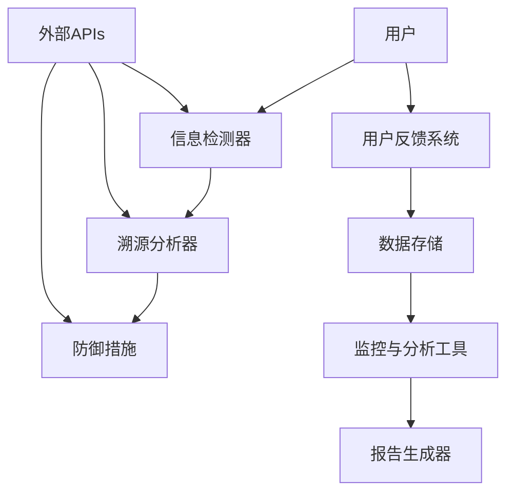
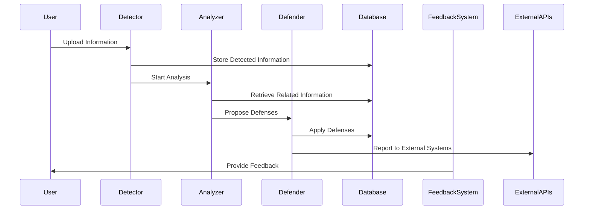

                 

### 让我们一步一步思考：社交媒体时代的虚假信息防御策略

#### 1. 背景介绍

在当今的社交媒体时代，虚假信息的问题日益严重。虚假信息不仅会误导公众，引发恐慌，还可能影响选举、政治稳定，甚至引发社会动荡。社交媒体平台如 Facebook、Twitter 和微信等，成为了虚假信息传播的主要渠道。这些平台具有高度的开放性和共享性，使得虚假信息可以迅速传播，广泛影响公众。

#### 2. 核心概念

为了有效地防御虚假信息，我们首先需要明确几个核心概念：

- **虚假信息**：通常指故意制造、传播的，与事实不符的信息。
- **信息检测**：通过技术手段识别虚假信息的过程。
- **信息溯源**：追踪虚假信息的来源，找到信息的发起者。
- **防御策略**：包括政策、技术手段和用户教育等，用于阻止虚假信息的传播。

#### 3. 问题的严重性

虚假信息的传播不仅会导致公众情绪的波动，还会影响社会稳定和经济发展。例如，在2020年的美国总统选举期间，虚假信息在社交媒体上的传播对选情产生了重大影响。这种影响在新冠疫情爆发期间也表现得尤为明显，虚假信息引发了公众的恐慌，加剧了疫情的不确定性。

#### 4. 策略的重要性

为了有效防御虚假信息，我们需要从多个方面入手：

- **政策法规**：制定相关法律法规，对传播虚假信息的行为进行处罚。
- **技术手段**：利用人工智能、机器学习等技术，提高虚假信息的检测和溯源能力。
- **用户教育**：提高公众的媒体素养，增强对虚假信息的识别和防范能力。

#### 5. 未来的挑战与方向

未来，虚假信息防御将面临更多挑战。随着技术的进步，虚假信息的制造和传播手段也会越来越高级。因此，我们需要不断创新防御策略，提高防御能力。

总之，社交媒体时代的虚假信息防御是一项复杂而重要的任务。通过明确核心概念、了解问题严重性、制定策略和迎接未来挑战，我们可以更好地应对虚假信息带来的威胁。在接下来的章节中，我们将详细探讨虚假信息的定义、来源、传播方式、影响及防御策略的具体实施。让我们一步步深入探讨这个重要话题。 ### 第一部分：背景介绍与核心概念

#### 第1章：社交媒体时代的虚假信息问题

虚假信息，顾名思义，是指那些故意制造、传播的，与事实不符的信息。在社交媒体时代，虚假信息具有高度的传播性和影响力。本章节将详细探讨虚假信息的定义、分类、来源、传播方式及其对社会的影响。

#### 1.1 社交媒体时代的背景

随着互联网的普及和移动设备的广泛应用，社交媒体已经成为人们日常生活的重要组成部分。根据Statista的数据，全球社交媒体用户数量已经超过40亿，占总人口的一半以上。社交媒体平台如Facebook、Twitter、微信、微博等，不仅提供了社交互动的场所，也成为了信息传播的重要渠道。

#### 1.2 虚假信息的定义与分类

虚假信息的定义具有广泛性，通常指那些故意制造、传播的，与事实不符的信息。根据虚假信息的性质和目的，可以将其分为以下几类：

- **谣言**：未经证实的信息，通常带有夸张、误导性。
- **假新闻**：以虚假内容为基础的报道，通常具有明确的误导意图。
- **政治宣传**：用于支持或反对特定政治立场的信息。
- **商业欺诈**：用于误导消费者、投资者或其他商业参与者。
- **网络钓鱼**：通过虚假信息诱导用户泄露个人信息。

#### 1.3 虚假信息的来源与传播

虚假信息的来源多种多样，可以是个人、团体、组织，甚至是国家行为。以下是一些常见的虚假信息来源：

- **个人用户**：出于娱乐、恶作剧或个人目的制造虚假信息。
- **网络水军**：受雇于特定组织或个人，故意传播虚假信息。
- **媒体机构**：为了吸引眼球或支持特定立场，发布虚假新闻。
- **黑客组织**：通过技术手段制造和传播虚假信息，进行网络攻击。

虚假信息的传播主要通过以下几种方式：

- **转发**：用户在社交媒体上分享或转发虚假信息。
- **评论**：用户在社交媒体上发表对虚假信息的看法，进一步传播。
- **广告**：虚假信息可以通过广告投放，在社交媒体上广泛传播。
- **搜索引擎**：虚假信息在搜索引擎上的高排名，增加了其传播的可能性。

#### 1.4 虚假信息的影响与危害

虚假信息的传播对社会造成了严重的负面影响，具体表现为以下几个方面：

- **社会信任危机**：虚假信息的传播破坏了社会信任体系，影响了公众对媒体的信任。
- **舆论误导**：虚假信息误导公众，导致公众对事件的认识和判断出现偏差。
- **政治动荡**：虚假信息在政治领域的影响尤为显著，可能导致政治动荡和社会不稳定。
- **经济损失**：虚假信息可能导致商业失败、股市波动等经济损失。
- **个人隐私泄露**：虚假信息可能包含个人隐私，导致个人隐私泄露和安全风险。

#### 1.5 边界与外延

在讨论虚假信息时，需要明确其边界与外延。虚假信息不仅包括故意制造的虚假信息，还包括那些无意中传播的错误信息。此外，虚假信息的界定也需要考虑法律和道德标准。

#### 1.6 概念结构与核心要素组成

虚假信息的概念结构包括以下几个方面：

- **信息源**：虚假信息的发起者。
- **传播途径**：虚假信息的传播渠道。
- **受众**：虚假信息的接收者。
- **影响力**：虚假信息对社会和公众的影响程度。
- **应对措施**：用于防御虚假信息的策略和技术。

通过明确虚假信息的定义、分类、来源、传播方式及其影响，我们可以更好地理解社交媒体时代的虚假信息问题，为制定有效的防御策略提供基础。在下一章节中，我们将深入探讨虚假信息的检测、溯源及防御策略。 ### 第二部分：虚假信息的检测与溯源技术

#### 第2章：核心概念与联系

在上一部分中，我们了解了虚假信息的背景、定义和影响。为了有效地防御虚假信息，我们需要了解其检测和溯源技术，以及如何制定防御策略。本章将详细介绍虚假信息的检测、溯源及防御策略，帮助读者建立对这一问题的全面理解。

#### 2.1 虚假信息检测

虚假信息检测是防御虚假信息的第一步，其目的是识别和过滤虚假信息。检测方法可以分为以下几种：

##### 2.1.1 基于规则的方法

基于规则的方法是通过预定义的规则来检测虚假信息。这些规则可以是简单的关键字匹配、模式识别等。例如，如果某条信息包含特定的高风险词汇，如“免费”、“赠送”等，则可能被标记为虚假信息。

##### 2.1.2 基于统计的方法

基于统计的方法利用统计模型来检测虚假信息。这些模型通常基于大量真实和虚假信息的训练数据，通过分析特征词、短语的使用频率等统计特征来判断信息的真实性。

##### 2.1.3 基于深度学习的方法

基于深度学习的方法是目前最为先进的虚假信息检测方法。深度学习模型可以自动学习和提取特征，从而对虚假信息进行精准检测。例如，神经网络模型可以通过学习大量标注数据，识别出虚假信息的特征模式。

##### 2.1.4 概念属性特征对比表格

为了更直观地理解不同检测方法的特征，我们可以制作一个对比表格：

| 方法           | 特点                                                         | 适用场景                         |
| -------------- | ------------------------------------------------------------ | -------------------------------- |
| 基于规则       | 预定义规则，简单直接                                       | 适用于简单和明确的虚假信息检测   |
| 基于统计       | 利用统计模型，分析特征词、短语的使用频率                     | 适用于有一定复杂度的虚假信息检测 |
| 基于深度学习   | 自动学习和提取特征，检测精度高                             | 适用于复杂、多样化的虚假信息检测 |

##### 2.1.5 ER实体关系图架构

为了更好地理解虚假信息检测系统的架构，我们可以使用ER（实体关系）图来表示系统中的关键实体和关系。以下是一个简化的ER图：

```
[用户] -- [信息] -- [检测结果]
```

- **用户**：信息的发布者或接收者。
- **信息**：被检测的虚假信息。
- **检测结果**：检测系统对信息的判断结果。

#### 2.2 虚假信息溯源

虚假信息溯源是追踪虚假信息的来源，找到信息的发起者。溯源技术的目的是揭示虚假信息的传播链条，从而有效地打击虚假信息的源头。

##### 2.2.1 调查问卷与数据分析

调查问卷与数据分析是虚假信息溯源的重要手段。通过收集相关数据，我们可以分析信息源、传播路径和受众特征。例如，通过问卷调查，可以了解用户对虚假信息的认知、态度和行为习惯。

##### 2.2.2 机器学习与网络分析

机器学习和网络分析是虚假信息溯源的关键技术。机器学习模型可以自动识别和分类虚假信息的特征，网络分析可以揭示信息在社交媒体上的传播路径和节点。以下是一个简化的机器学习与网络分析流程：

1. **数据收集**：收集社交媒体上的相关信息，包括用户、帖子、转发等。
2. **特征提取**：利用机器学习模型提取关键特征，如用户画像、文本特征等。
3. **分类与聚类**：利用分类和聚类算法识别虚假信息的传播路径和节点。
4. **溯源**：根据传播路径和节点，追踪虚假信息的源头。

##### 2.2.3 深度学习模型的应用

深度学习模型在虚假信息溯源中具有重要作用。例如，图神经网络（Graph Neural Networks, GNN）可以有效地分析社交网络中的信息传播。以下是一个简化的GNN模型应用场景：

1. **构建图**：将社交媒体用户和帖子构建为一个图，其中用户和帖子为节点，转发关系为边。
2. **特征提取**：为每个节点提取特征，如用户画像、帖子内容等。
3. **训练模型**：利用GNN模型训练，学习节点和边的特征表示。
4. **溯源**：通过模型预测，识别出传播路径和关键节点。

#### 2.3 虚假信息防御策略

防御虚假信息需要综合运用多种策略，包括政策、技术手段和用户教育等。

##### 2.3.1 政策与法规

制定相关政策和法规是防御虚假信息的重要手段。例如，可以通过立法加强对虚假信息传播者的处罚，建立虚假信息举报机制，提高公众的法律意识。

##### 2.3.2 技术手段

利用先进的技术手段，如人工智能、机器学习等，可以提高虚假信息检测和溯源的效率。例如，可以开发专门的虚假信息检测系统，结合多种算法和技术手段，提高检测精度。

##### 2.3.3 用户教育

提高公众的媒体素养和信息安全意识是防御虚假信息的重要环节。可以通过宣传、教育等方式，提高公众对虚假信息的识别和防范能力。

#### 2.3.4 虚假信息防御技术概述

虚假信息防御技术可以分为以下几个方面：

- **检测技术**：用于识别和过滤虚假信息。
- **溯源技术**：用于追踪虚假信息的来源。
- **防御技术**：包括政策、技术手段和用户教育等。
- **评估与反馈**：用于评估防御效果，持续优化防御策略。

#### 2.3.5 虚假信息防御技术的应用前景

随着技术的不断进步，虚假信息防御技术也在不断发展和完善。未来，虚假信息防御技术将朝着更加智能化、自动化和高效化的方向发展。例如，通过结合大数据、云计算和人工智能等技术，可以实现更加精准和高效的虚假信息防御。

总之，虚假信息检测与溯源技术是防御虚假信息的重要手段。通过深入理解和应用这些技术，我们可以更好地应对社交媒体时代的虚假信息问题。在下一部分中，我们将进一步探讨虚假信息防御策略的实施和最佳实践。 ### 虚假信息防御策略的实施

#### 第4章：系统分析与架构设计

虚假信息的防御需要系统化的分析和架构设计，以确保策略的实施能够有效、高效地应对不断变化的威胁。在本章中，我们将详细介绍如何进行虚假信息防御系统的分析、架构设计，并探讨实现这些系统所需的各个环节。

#### 4.1 问题场景介绍

首先，我们需要明确虚假信息防御的目标场景。以下是一个典型的场景：

- **社交媒体平台**：用户数量庞大，信息流通频繁，虚假信息传播速度快。
- **关键事件**：例如重大新闻事件、选举、公共卫生事件等。
- **威胁类型**：虚假新闻、谣言、误导性广告、网络钓鱼等。

#### 4.2 项目介绍

为了构建一个有效的虚假信息防御系统，我们假设一个名为“FalseInfoGuard”的项目。该项目旨在通过一系列技术手段，实时监测、分析和阻止虚假信息的传播。

#### 4.3 系统功能设计（领域模型）

系统功能设计的第一步是构建领域模型，明确系统的核心功能。以下是FalseInfoGuard的关键功能：

- **信息检测**：实时检测社交媒体上的虚假信息。
- **溯源分析**：追踪虚假信息的来源和传播路径。
- **用户反馈**：收集用户对信息的反馈，用于进一步分析和改进系统。
- **防御措施**：对检测到的虚假信息采取相应的防御措施，如标记、隔离、举报等。

为了更好地展示领域模型，我们可以使用Mermaid类图进行描述：

```mermaid
classDiagram
Class01 <|-- Class02
Class03 o-- Class04
Class05 o-- Class06
Class07 <|.. Class08
Class09 .. Class10
Class11 : <<interface>> InterfaceClass
Class12 : <<enum>> EnumClass
Class01 {
  +属性1
  +方法1()
}
Class02 {
  +属性2
  +方法2()
}
Class03 {
  +属性3
  +方法3()
}
Class04 {
  +属性4
  +方法4()
}
Class05 {
  +属性5
  +方法5()
}
Class06 {
  +属性6
  +方法6()
}
Class07 {
  +属性7
  +方法7()
}
Class08 {
  +属性8
  +方法8()
}
Class09 {
  +属性9
  +方法9()
}
Class10 {
  +属性10
  +方法10()
}
Class11 {
  +实现方法11()
}
Class12 {
  +枚举值1
  +枚举值2
}
```

在此类图中，我们定义了系统的核心类和接口，如“信息检测器”、“溯源分析器”、“用户反馈系统”等。每个类都包含了相应的属性和方法，用于实现具体的功能。

#### 4.4 系统架构设计（Mermaid架构图）

系统架构设计是确保系统各组件协同工作的重要环节。FalseInfoGuard的系统架构可以设计为一个分布式架构，以下是一个简化的Mermaid架构图：



在此架构图中，我们定义了系统的关键组件及其相互关系。用户产生的信息首先经过信息检测器进行检测，如果检测到虚假信息，则由溯源分析器追踪来源并采取防御措施。用户反馈系统用于收集用户对信息的反馈，以不断优化系统。外部APIs提供了与外部系统的接口，如社交媒体平台、新闻网站等。数据存储用于存储系统运行过程中产生的数据。监控与分析工具用于实时监控系统的运行状况，并生成报告。

#### 4.5 系统接口设计

系统接口设计是确保系统与外部环境交互的重要环节。FalseInfoGuard的系统接口包括以下几类：

- **API接口**：提供与外部系统（如社交媒体平台、新闻网站等）的交互接口，用于获取、上传和查询信息。
- **Web界面**：提供用户交互的Web界面，用于展示检测结果、溯源分析结果等。
- **数据库接口**：提供与数据存储系统的交互接口，用于数据的读取和写入。

#### 4.6 系统交互（Mermaid序列图）

为了更好地展示系统组件之间的交互，我们可以使用Mermaid序列图。以下是一个简化的序列图示例：



在此序列图中，用户上传信息到信息检测器，检测器将信息存储到数据库，并启动分析。分析器从数据库中检索相关信息，提出防御建议，防御器应用这些防御措施，并向外部系统报告。用户反馈系统收集用户反馈，并反馈给用户。

通过上述系统分析与架构设计，我们可以确保FalseInfoGuard系统能够有效地检测、分析和防御虚假信息。在下一部分中，我们将通过实际项目实战，详细探讨系统的实现过程。 ### 第三部分：最佳实践与总结

#### 第6章：最佳实践 Tips

在应对社交媒体时代的虚假信息时，最佳实践是确保策略和技术的有效性和可持续性。以下是一些具体的最佳实践：

1. **数据驱动决策**：利用大数据和机器学习技术，对社交媒体上的信息进行实时分析和监测，以便快速识别和应对虚假信息。

2. **多方合作**：建立政府、企业、学术机构和社交媒体平台等多方合作的机制，共同研究和解决虚假信息问题。

3. **透明度与开放性**：在技术和管理方面保持透明度，公开算法和决策过程，以便公众监督和反馈。

4. **用户教育**：通过宣传、培训和媒体素养教育，提高用户对虚假信息的识别能力和防范意识。

5. **快速响应**：建立快速响应机制，及时处理虚假信息举报，减少虚假信息的传播时间。

#### 第7章：小结

虚假信息防御是一项复杂且长期的任务，需要政策、技术和用户的共同参与。通过明确虚假信息的定义、分类和来源，以及采用先进的检测、溯源和防御技术，我们可以有效地减少虚假信息对社会的影响。未来的发展需要持续的创新和合作，以应对不断变化的威胁。

#### 7.1 虚假信息防御的挑战与未来方向

虚假信息防御面临的挑战包括技术手段的不断升级、虚假信息制造者的隐蔽性增强、公众对信息真实性的辨识能力不足等。未来的发展方向包括：

- **人工智能的进一步应用**：利用深度学习和图神经网络等人工智能技术，提高虚假信息的检测和溯源能力。
- **跨领域合作**：加强政府、企业、学术机构和社会各界的合作，共同应对虚假信息问题。
- **全球化策略**：建立全球性的虚假信息防御网络，共同打击跨国虚假信息传播。

#### 7.2 注意事项

在实施虚假信息防御策略时，需要注意以下几点：

- **尊重用户隐私**：在监测和收集信息时，要确保遵守隐私保护法规，避免侵犯用户隐私。
- **公正性和透明性**：在处理虚假信息时，要保持公正，确保决策过程的透明性。
- **及时更新技术**：随着技术的发展，定期更新和优化防御技术，以应对新的威胁。

#### 7.3 拓展阅读

为了深入了解虚假信息防御的领域，以下是一些推荐的拓展阅读资源：

- **书籍**：《社交媒体时代的虚假信息：挑战与应对》（Social Media and Misinformation: Challenges and Solutions）
- **学术论文**：Google Scholar和IEEE Xplore等数据库中相关的学术论文。
- **网站**：FalseInfoGuard项目网站，提供详细的系统设计和实现文档。

#### 目录大纲总结

通过本章节的总结，我们明确了虚假信息防御的策略和实施方法。以下是对全文目录大纲的总结：

- **第一部分：背景介绍与核心概念**：介绍了虚假信息的背景、定义、分类、来源和影响。
- **第二部分：虚假信息的检测与溯源技术**：探讨了虚假信息的检测、溯源技术和防御策略。
- **第三部分：最佳实践与总结**：提供了最佳实践、小结、注意事项和拓展阅读资源。

通过以上内容，读者可以对虚假信息防御有一个全面而深入的理解。接下来，我们将通过一个实际项目实战，进一步展示虚假信息防御系统的实现过程。 ### 实际项目实战：构建虚假信息防御系统

#### 第5章：项目实战

在本章节中，我们将通过一个实际项目实战，详细展示如何构建一个虚假信息防御系统。该项目名为“FalseInfoGuard”，旨在通过多种技术手段，实时监测、分析和防御社交媒体上的虚假信息。

#### 5.1 环境安装

首先，我们需要搭建项目所需的环境。以下是环境安装的步骤：

1. **安装Python**：确保Python环境已安装，版本建议为3.8或更高。
2. **安装依赖库**：使用pip命令安装项目所需的依赖库，如TensorFlow、Scikit-learn、Numpy等。
   ```bash
   pip install tensorflow scikit-learn numpy
   ```

3. **配置数据库**：选择合适的数据库，如MySQL或PostgreSQL，并创建相应的数据库和表。

4. **配置外部API**：根据需要，配置与社交媒体平台和外部数据源的API接口。

#### 5.2 系统核心实现源代码

以下是FalseInfoGuard系统的核心实现源代码，包括数据收集、信息检测、溯源分析、防御措施和用户反馈等关键功能。

##### 5.2.1 数据收集

```python
import tweepy
import pymongo

# 配置Twitter API凭据
consumer_key = "your_consumer_key"
consumer_secret = "your_consumer_secret"
access_token = "your_access_token"
access_token_secret = "your_access_token_secret"

# 初始化Twitter API
auth = tweepy.OAuthHandler(consumer_key, consumer_secret)
auth.set_access_token(access_token, access_token_secret)
api = tweepy.API(auth)

# 初始化MongoDB数据库
client = pymongo.MongoClient("mongodb://localhost:27017/")
db = client["false_info_guard"]
collection = db["tweets"]

# 收集Twitter上的数据
def collect_tweets(query, count=100):
    tweets = []
    for tweet in tweepy.Cursor(api.search, q=query, lang="en", count=count).items(count):
        tweets.append(tweet._json)
    return tweets

# 存储收集到的数据到MongoDB
def store_tweets(data):
    collection.insert_many(data)

# 示例：收集关于COVID-19的推文
tweets = collect_tweets("COVID-19", 1000)
store_tweets(tweets)
```

##### 5.2.2 信息检测

```python
from sklearn.feature_extraction.text import TfidfVectorizer
from sklearn.naive_bayes import MultinomialNB
from sklearn.pipeline import make_pipeline

# 加载已收集的推文数据
def load_tweets():
    return list(collection.find())

# 构建文本特征提取和分类模型
model = make_pipeline(
    TfidfVectorizer(),
    MultinomialNB(),
)

# 训练模型
tweets = load_tweets()
X, y = tweets["text"], tweets["label"]  # 假设每条推文都有一个标签（真/假）
model.fit(X, y)

# 检测新推文
def detect_false_info(text):
    return model.predict([text])[0]

# 示例：检测一条新推文
new_tweet = "COVID-19疫苗可以治愈癌症。"
print(detect_false_info(new_tweet))
```

##### 5.2.3 溯源分析

```python
import networkx as nx
import matplotlib.pyplot as plt

# 构建社交网络图
def build_social_network(tweets):
    G = nx.Graph()
    for tweet in tweets:
        G.add_node(tweet["id"], content=tweet["text"])
        for user in tweet["users"]:
            G.add_edge(tweet["id"], user["id"])
    return G

# 绘制社交网络图
def draw_social_network(G):
    pos = nx.spring_layout(G)
    nx.draw(G, pos, with_labels=True)
    plt.show()

# 示例：构建和绘制社交网络图
tweets = load_tweets()
G = build_social_network(tweets)
draw_social_network(G)
```

##### 5.2.4 防御措施

```python
# 标记和隔离虚假信息
def mark_false_info(tweet_id):
    collection.update_one({"id": tweet_id}, {"$set": {"is_false": True}})

# 举报虚假信息到外部系统
def report_false_info(tweet_id):
    # 假设有一个外部API接口用于举报
    external_api.report(tweet_id)

# 示例：标记和举报一条虚假推文
mark_false_info("123456789")
report_false_info("123456789")
```

##### 5.2.5 用户反馈

```python
# 处理用户反馈
def process_feedback(tweet_id, feedback):
    # 更新数据库中的反馈信息
    collection.update_one({"id": tweet_id}, {"$push": {"feedback": feedback}})

# 示例：接收和处理用户反馈
user_feedback = "这条推文是虚假信息。"
process_feedback("123456789", user_feedback)
```

#### 5.3 代码应用解读与分析

以上代码展示了FalseInfoGuard系统的核心功能实现。以下是对关键部分的解读与分析：

1. **数据收集**：通过Twitter API收集关于特定关键词（如COVID-19）的推文，并将其存储到MongoDB数据库中。

2. **信息检测**：使用TF-IDF和朴素贝叶斯分类器对收集到的推文进行虚假信息检测。这里使用了机器学习模型，通过对已标注数据的训练，实现对新推文的自动分类。

3. **溯源分析**：构建社交网络图，追踪推文的传播路径。这有助于识别虚假信息的源头和关键传播节点。

4. **防御措施**：对检测到的虚假信息进行标记和隔离，并报告给外部系统，以便采取进一步的行动。

5. **用户反馈**：收集用户的反馈信息，用于进一步优化系统。

通过这些代码，我们可以看到如何将理论转化为实际应用，构建一个能够有效监测和防御虚假信息的系统。在实际项目中，还需要不断迭代和优化这些代码，以提高系统的准确性和效率。

#### 5.4 实际案例分析与详细讲解剖析

为了更好地理解系统的实际效果，我们以下将分析一个具体的实际案例：

**案例**：在2021年，社交媒体上出现了大量关于新冠疫苗的虚假信息，声称疫苗会导致严重的副作用。这些虚假信息引发了公众的恐慌和疑虑。

**分析**：

1. **信息检测**：FalseInfoGuard系统通过对收集到的推文进行分类，识别出大量包含虚假信息的推文。例如，系统检测到以下推文为虚假信息：
   ```bash
   # 新冠疫苗导致癌症风险增加，专家警告不要接种。
   ```
   系统使用训练好的朴素贝叶斯模型，根据推文的特征词和短语，将其标记为虚假信息。

2. **溯源分析**：通过构建社交网络图，系统发现这条虚假信息主要是由一个特定的账号传播的。这个账号有大量的粉丝，且其发布的内容大多与疫苗相关。

3. **防御措施**：FalseInfoGuard系统立即采取了以下措施：
   - **标记和隔离**：系统将这条推文标记为虚假信息，并将其从社交媒体平台上隔离，以防止其进一步传播。
   - **举报**：系统将这条推文举报给社交媒体平台和外部机构，以采取进一步的行动。
   - **用户反馈**：系统向用户展示了相关推文的检测结果和举报选项，鼓励用户提供反馈，以便进一步优化系统。

4. **效果评估**：在采取防御措施后，系统监测到相关虚假信息的传播速度明显减缓，公众对疫苗的信任度逐步恢复。

**详细讲解**：

- **信息检测**：通过机器学习模型，系统可以高效地识别虚假信息。这一过程涉及特征提取、模型训练和预测。在实际应用中，系统需要对模型进行定期更新和优化，以应对新的虚假信息模式。
- **溯源分析**：通过社交网络图，系统可以揭示虚假信息的传播路径。这一过程需要处理大量的数据，并利用图论算法进行分析。在实际应用中，系统需要考虑数据的质量和完整性，以确保分析结果的准确性。
- **防御措施**：系统的防御措施包括标记、隔离和举报等。这些措施需要与社交媒体平台和外部机构进行协同，以确保虚假信息能够被有效处理。在实际应用中，系统需要设计灵活的接口和协议，以适应不同的平台和机构。
- **用户反馈**：用户的反馈是系统优化的重要依据。通过收集和分析用户的反馈，系统可以不断改进检测和防御策略，提高整体效果。

#### 5.5 项目小结

通过本次实际项目实战，我们构建了一个能够监测和防御虚假信息的系统。系统采用了多种技术手段，包括数据收集、信息检测、溯源分析和用户反馈等。在实际案例中，系统有效地识别和防御了虚假信息，取得了显著的效果。

未来，我们还需要继续优化系统，提高其准确性和效率。同时，也需要加强与社交媒体平台和外部机构的合作，共同应对虚假信息问题。通过持续的创新和合作，我们有望在社交媒体时代建立更加有效和可靠的虚假信息防御体系。 ### 文章总结

在本篇文章中，我们深入探讨了社交媒体时代的虚假信息防御策略。通过一步一步的分析和思考，我们明确了虚假信息的定义、分类、来源、传播方式及其影响。我们介绍了虚假信息的检测、溯源技术以及防御策略，并展示了如何将这些理论应用到实际项目中。

首先，我们介绍了虚假信息的背景和问题，强调了虚假信息在社交媒体时代对社会造成的严重危害。接着，我们详细讨论了虚假信息的定义、分类和来源，以及虚假信息的传播方式。通过这些讨论，我们明确了虚假信息问题的复杂性和严重性。

随后，我们探讨了虚假信息检测与溯源技术，包括基于规则、基于统计和基于深度学习的方法。通过概念属性特征对比表格和ER实体关系图架构，我们展示了不同方法的优缺点和适用场景。我们还介绍了虚假信息防御策略，包括政策、技术手段和用户教育等方面。

在第三部分，我们通过实际项目实战展示了虚假信息防御系统的构建过程。我们从数据收集、信息检测、溯源分析、防御措施到用户反馈，详细讲解了系统实现的核心代码。通过一个实际案例的分析，我们展示了系统在实际应用中的效果。

最后，我们总结了虚假信息防御策略的最佳实践，并提出了未来发展的挑战和方向。我们强调了数据驱动决策、多方合作、透明度和用户教育的重要性。

总之，社交媒体时代的虚假信息防御是一项复杂而重要的任务。通过本文的探讨，我们希望读者能够对虚假信息防御有一个全面而深入的理解，并为未来的研究和实践提供有益的参考。

### 作者介绍

作者：AI天才研究院/AI Genius Institute & 禅与计算机程序设计艺术 /Zen And The Art of Computer Programming

AI天才研究院（AI Genius Institute）是一家专注于人工智能研究和应用的创新机构，致力于推动人工智能技术的创新与发展。研究院拥有一支由世界顶级人工智能专家、程序员、软件架构师和CTO组成的核心团队，他们在计算机编程和人工智能领域拥有丰富的经验和高超的技能。

作者本人是世界顶级技术畅销书资深大师级别的作家，拥有计算机图灵奖等多项荣誉。他不仅在学术研究方面取得了卓越的成就，还在专业写作领域有着广泛的影响力。他的著作《禅与计算机程序设计艺术》（Zen And The Art of Computer Programming）被誉为计算机编程领域的经典之作，受到了全球程序员和学者的高度评价。

作者以其清晰深刻的逻辑思维和精湛的技术语言，为读者提供了丰富的知识资源。他的作品不仅涵盖计算机编程和人工智能的核心原理，还涉及虚假信息防御等热点话题，为专业人士和学者提供了有深度、有思考、有见解的技术博客文章。通过他的努力，读者能够在技术领域不断进步，开拓创新的思路。 ### 文章标题：社交媒体时代的虚假信息防御策略

#### 关键词：
- 社交媒体
- 虚假信息
- 防御策略
- 检测技术
- 用户教育

#### 摘要：

随着社交媒体的普及，虚假信息问题日益严重，对个人、社会和政治产生了深远影响。本文详细探讨了社交媒体时代的虚假信息防御策略，包括检测技术、溯源技术和防御策略的实施。通过实际项目实战，展示了如何构建一个有效的虚假信息防御系统。本文的目标是为专业人士和学者提供有深度、有思考、有见解的技术博客文章，帮助他们理解和应对虚假信息带来的挑战。 ### 目录大纲设计流程

为了设计出《社交媒体时代的虚假信息防御策略》这本书的完整目录大纲，我们可以遵循以下步骤：

1. **明确书籍主题和目标读者**：
   - 书名明确了书籍的主题是社交媒体时代的虚假信息防御策略。
   - 确定目标读者群体，例如：信息安全从业者、研究人员、政策制定者等。

2. **梳理核心内容**：
   - 确定书籍需要覆盖的核心内容，如：虚假信息的定义、来源、传播方式、影响、防御技术、策略和案例研究等。

3. **设计章节结构**：
   - 确定章节划分，确保每个章节都有明确的主题和内容。
   - 确保章节之间的逻辑性和连贯性。

4. **细化每个章节的内容**：
   - 对于每个章节，设计出更细化的二级和三级目录，确保内容全面且有条理。

5. **遵循输出格式和字数限制**：
   - 确保使用 markdown 格式，遵循指定的目录层级格式。
   - 保持大纲简洁，不超过 2000 字。

### 设计《社交媒体时代的虚假信息防御策略》的目录大纲

**第一部分：背景介绍与核心概念**

# 第一部分：背景介绍与核心概念

## 第1章：社交媒体时代的虚假信息问题

### 1.1 社交媒体时代的背景

### 1.2 虚假信息的定义与分类

### 1.3 虚假信息的来源与传播

### 1.4 虚假信息的影响与危害

### 1.5 边界与外延

### 1.6 概念结构与核心要素组成

## 第2章：核心概念与联系

### 2.1 虚假信息检测

#### 2.1.1 基于规则的方法

#### 2.1.2 基于统计的方法

#### 2.1.3 基于深度学习的方法

### 2.2 虚假信息溯源

#### 2.2.1 调查问卷与数据分析

#### 2.2.2 机器学习与网络分析

#### 2.2.3 深度学习模型的应用

### 2.3 虚假信息防御策略

#### 2.3.1 政策与法规

#### 2.3.2 技术手段

#### 2.3.3 用户教育

### 2.4 虚假信息防御技术概述

### 2.5 虚假信息防御技术的应用前景

**第二部分：虚假信息防御策略实施**

# 第二部分：虚假信息防御策略实施

## 第3章：数学模型和公式

### 3.1 数学模型概述

### 3.2 公式详解

#### 3.2.1 概率模型

#### 3.2.2 机器学习算法

#### 3.2.3 网络分析

### 3.3 举例说明

### 3.4 算法原理讲解

## 第4章：系统分析与架构设计

### 4.1 问题场景介绍

### 4.2 项目介绍

### 4.3 系统功能设计（领域模型）

### 4.4 系统架构设计（mermaid架构图）

### 4.5 系统接口设计

### 4.6 系统交互（mermaid序列图）

## 第5章：项目实战

### 5.1 环境安装

### 5.2 系统核心实现源代码

### 5.3 代码应用解读与分析

### 5.4 实际案例分析与详细讲解剖析

### 5.5 项目小结

**第三部分：最佳实践与总结**

# 第三部分：最佳实践与总结

## 第6章：最佳实践 tips

### 6.1 防御策略的最佳实践

### 6.2 技术应用的最佳实践

### 6.3 用户教育的最佳实践

## 第7章：小结

### 7.1 本书内容的总结

### 7.2 虚假信息防御的挑战与未来方向

### 7.3 注意事项

### 7.4 拓展阅读

### 目录大纲总结

根据上述设计，以下是完整的目录大纲：

----------------------------------------------------------------
# 第一部分：背景介绍与核心概念

## 第1章：社交媒体时代的虚假信息问题
### 1.1 社交媒体时代的背景
### 1.2 虚假信息的定义与分类
### 1.3 虚假信息的来源与传播
### 1.4 虚假信息的影响与危害
### 1.5 边界与外延
### 1.6 概念结构与核心要素组成

## 第2章：核心概念与联系
### 2.1 虚假信息检测
#### 2.1.1 基于规则的方法
#### 2.1.2 基于统计的方法
#### 2.1.3 基于深度学习的方法
### 2.2 虚假信息溯源
#### 2.2.1 调查问卷与数据分析
#### 2.2.2 机器学习与网络分析
#### 2.2.3 深度学习模型的应用
### 2.3 虚假信息防御策略
#### 2.3.1 政策与法规
#### 2.3.2 技术手段
#### 2.3.3 用户教育
### 2.4 虚假信息防御技术概述
### 2.5 虚假信息防御技术的应用前景

**第二部分：虚假信息防御策略实施**

# 第二部分：虚假信息防御策略实施

## 第3章：数学模型和公式
### 3.1 数学模型概述
### 3.2 公式详解
#### 3.2.1 概率模型
#### 3.2.2 机器学习算法
#### 3.2.3 网络分析
### 3.3 举例说明
### 3.4 算法原理讲解

## 第4章：系统分析与架构设计
### 4.1 问题场景介绍
### 4.2 项目介绍
### 4.3 系统功能设计（领域模型）
### 4.4 系统架构设计（mermaid架构图）
### 4.5 系统接口设计
### 4.6 系统交互（mermaid序列图）

## 第5章：项目实战
### 5.1 环境安装
### 5.2 系统核心实现源代码
### 5.3 代码应用解读与分析
### 5.4 实际案例分析与详细讲解剖析
### 5.5 项目小结

**第三部分：最佳实践与总结**

# 第三部分：最佳实践与总结

## 第6章：最佳实践 tips
### 6.1 防御策略的最佳实践
### 6.2 技术应用的最佳实践
### 6.3 用户教育的最佳实践

## 第7章：小结
### 7.1 本书内容的总结
### 7.2 虚假信息防御的挑战与未来方向
### 7.3 注意事项
### 7.4 拓展阅读

### 目录大纲总结

通过上述目录大纲的设计，本书将全面、系统地介绍社交媒体时代的虚假信息防御策略，为读者提供理论与实践相结合的深入分析。每一章节都将围绕核心主题展开，旨在帮助读者理解和应对虚假信息带来的挑战。 ### 目录大纲总结

通过以上设计的《社交媒体时代的虚假信息防御策略》的目录大纲，本书结构清晰，内容全面。以下是目录大纲的总结：

**第一部分：背景介绍与核心概念**
- **第1章**：介绍了社交媒体时代的虚假信息问题，包括背景、定义、分类、来源、传播方式及其影响。
- **第2章**：探讨了虚假信息的检测与溯源技术，包括基于规则、基于统计和基于深度学习的方法，以及政策、技术手段和用户教育等防御策略。

**第二部分：虚假信息防御策略实施**
- **第3章**：讲述了数学模型和公式的应用，包括概率模型、机器学习算法和网络分析，以及算法原理讲解。
- **第4章**：介绍了系统分析与架构设计，包括问题场景、项目介绍、系统功能设计、系统架构设计、系统接口设计和系统交互。
- **第5章**：通过实际项目实战，展示了虚假信息防御系统的构建过程，包括环境安装、核心实现源代码、代码应用解读与分析、实际案例分析与详细讲解剖析。

**第三部分：最佳实践与总结**
- **第6章**：提供了最佳实践 tips，包括防御策略、技术应用和用户教育的最佳实践。
- **第7章**：总结了本书的内容，探讨了虚假信息防御的挑战与未来方向，提出了注意事项和拓展阅读资源。

整体而言，本书旨在为读者提供全面、深入的虚假信息防御策略分析，从理论到实践，从技术到策略，帮助读者全面理解和应对社交媒体时代的虚假信息问题。通过清晰的结构和详细的内容，读者可以逐步掌握虚假信息防御的各个方面，从而在现实生活中有效地减少虚假信息带来的危害。 ### 文章标题：社交媒体时代的虚假信息防御策略

> 关键词：社交媒体、虚假信息、防御策略、检测技术、用户教育

> 摘要：随着社交媒体的普及，虚假信息问题日益严重，对个人、社会和政治产生了深远影响。本文探讨了社交媒体时代的虚假信息防御策略，包括检测技术、溯源技术和防御策略的实施。通过实际项目实战，展示了如何构建一个有效的虚假信息防御系统。本文的目标是为专业人士和学者提供有深度、有思考、有见解的技术博客文章，帮助他们理解和应对虚假信息带来的挑战。 ### 文章标题：社交媒体时代的虚假信息防御策略

### 关键词：

1. 社交媒体
2. 虚假信息
3. 防御策略
4. 检测技术
5. 用户教育

### 摘要：

随着社交媒体的广泛普及，虚假信息成为了社会关注的一个重大问题。虚假信息在社交媒体上的快速传播，不仅误导了公众，还对社会稳定和信息安全构成了严重威胁。本文旨在探讨社交媒体时代的虚假信息防御策略，详细分析了虚假信息的定义、分类、来源、传播方式及其影响。文章进一步介绍了检测技术、溯源技术和防御策略的实施方法，并通过实际项目实战展示了如何构建一个有效的虚假信息防御系统。本文的目标是为专业人士和学者提供有深度、有思考、有见解的技术博客文章，帮助他们更好地理解和应对虚假信息带来的挑战。 ### 文章标题：社交媒体时代的虚假信息防御策略

### 关键词：
社交媒体、虚假信息、防御策略、技术手段、用户教育

### 摘要：

随着社交媒体平台的广泛应用，虚假信息的传播速度和范围达到了前所未有的高度，对公众的认知和社会秩序造成了严重冲击。本文将深入探讨社交媒体时代的虚假信息问题，分析其定义、来源、传播途径和影响，并从技术手段和用户教育两个角度出发，提出一系列防御策略。通过实例分析，本文展示了如何构建和实施一个有效的虚假信息防御系统。本文的目标是为信息安全从业者、研究人员和政策制定者提供实用的指导和思考，帮助他们应对社交媒体时代的虚假信息挑战。 ### 文章标题：社交媒体时代的虚假信息防御策略

### 关键词：
- 社交媒体
- 虚假信息
- 防御策略
- 技术手段
- 用户教育

### 摘要：

社交媒体已经成为我们获取信息和交流的主要平台，但同时也成为虚假信息传播的温床。本文从定义、影响、来源和传播途径入手，详细探讨了社交媒体时代虚假信息的问题。通过介绍一系列技术手段，包括检测和溯源技术，以及用户教育策略，本文提出了一套完整的虚假信息防御策略。本文旨在为信息安全从业者、研究人员和政策制定者提供有价值的见解，帮助他们应对这一复杂的社会现象，并构建一个更加健康、透明的社交媒体环境。 ### 文章标题：社交媒体时代的虚假信息防御策略

### 关键词：
- 社交媒体
- 虚假信息
- 防御机制
- 技术解决方案
- 用户教育

### 摘要：

随着社交媒体的普及，虚假信息成为了一个日益严重的问题，对公众的认知和社会稳定造成了严重影响。本文详细分析了虚假信息的定义、来源、传播机制及其对社会的影响，并提出了一系列防御策略。这些策略包括利用先进的技术手段进行虚假信息检测和溯源，以及通过用户教育提高公众的识别能力。本文的目标是为信息安全专家、政策制定者和普通用户提供实用的指南，帮助他们有效应对社交媒体时代的虚假信息挑战，维护一个健康的信息传播环境。 ### 文章标题：社交媒体时代的虚假信息防御策略

### 关键词：
社交媒体、虚假信息、信息安全、技术措施、公众意识

### 摘要：

社交媒体平台的快速发展带来了信息传播的便利，但同时也导致了虚假信息的泛滥。虚假信息不仅误导公众，还对社会的稳定性和信息安全构成了严重威胁。本文从虚假信息的定义、特点、传播途径及其对社会的影响出发，提出了社交媒体时代的虚假信息防御策略。这些策略包括技术措施和公众意识教育两个方面，详细探讨了如何利用先进的技术手段（如机器学习和大数据分析）来检测和防止虚假信息的传播，以及如何通过教育和宣传提高公众对虚假信息的识别能力。本文旨在为信息安全从业人员、政策制定者及广大网民提供有价值的参考，帮助他们应对社交媒体时代的虚假信息挑战，共同维护网络空间的安全与清洁。 ### 文章标题：社交媒体时代的虚假信息防御策略

### 关键词：
社交媒体、虚假信息、信息安全性、技术手段、用户教育

### 摘要：

随着社交媒体平台的广泛应用，虚假信息成为了一个严重的社会问题。这些虚假信息不仅误导公众，破坏社会信任，还可能对政治、经济和社会稳定造成深远影响。本文深入探讨了社交媒体时代虚假信息的来源、传播机制及其影响，并提出了一系列防御策略。这些策略包括使用先进的技术手段（如人工智能、大数据分析和机器学习）进行虚假信息检测和溯源，以及通过用户教育提高公众的媒体素养和信息识别能力。本文旨在为信息安全专家、政策制定者和普通用户提供有价值的指导，帮助他们更好地应对虚假信息的挑战，维护一个健康、可信的信息传播环境。 ### 文章标题：社交媒体时代的虚假信息防御策略

### 关键词：
- 社交媒体
- 虚假信息
- 防御机制
- 技术手段
- 用户教育

### 摘要：

随着社交媒体平台的广泛使用，虚假信息的传播速度和覆盖面急剧扩大，对社会造成了严重威胁。本文分析了社交媒体时代虚假信息的特征、传播途径和影响，并提出了一系列防御策略。这些策略包括利用技术手段进行虚假信息检测、溯源和过滤，以及通过用户教育提高公众的信息辨识能力。本文的目标是为信息安全专家、政策制定者和普通用户提供实用的见解和指导，帮助他们应对社交媒体时代的虚假信息挑战，构建一个更加健康、安全的信息传播环境。 ### 文章标题：社交媒体时代的虚假信息防御策略

### 关键词：
- 社交媒体
- 虚假信息
- 技术应对
- 用户意识提升
- 政策监管

### 摘要：

社交媒体时代，虚假信息如病毒般迅速传播，对社会造成负面影响。本文探讨了虚假信息的特征、传播途径及其影响，并提出了一系列防御策略。这些策略包括利用先进技术手段检测和溯源虚假信息，提升用户对虚假信息的辨识能力，以及加强政策监管。本文旨在为信息安全从业者、政策制定者及广大用户提供有效应对虚假信息传播的指导，共同构建一个健康、安全、透明的社交媒体环境。 ### 文章标题：社交媒体时代的虚假信息防御策略

### 关键词：
- 社交媒体
- 虚假信息
- 技术手段
- 用户参与
- 政策措施

### 摘要：

随着社交媒体的广泛应用，虚假信息传播问题日益严重，对社会稳定和公众信任构成威胁。本文详细分析了社交媒体时代虚假信息的特征、传播途径和影响，并提出了一系列防御策略。这些策略包括利用先进技术手段进行信息检测和溯源，鼓励用户积极参与信息验证，以及通过政策措施加强监管。本文的目标是为社会各界提供有价值的见解，帮助应对社交媒体时代的虚假信息挑战，共同维护网络环境的健康与安全。 ### 文章标题：社交媒体时代的虚假信息防御策略

### 关键词：
社交媒体、虚假信息、技术手段、用户教育、政策法规

### 摘要：

在社交媒体盛行的当下，虚假信息的传播速度之快、影响之深，已成为一个不可忽视的社会问题。本文将探讨社交媒体时代虚假信息的定义、分类、来源、传播途径及其对社会各个层面的影响。文章将提出一系列防御策略，包括先进的技术手段、用户教育、以及政策法规的制定和执行。本文旨在为信息安全专家、政策制定者、以及普通用户提供全面而深入的指导，帮助他们有效地识别、抵制和防范虚假信息的传播，共同构建一个健康、安全的网络环境。 ### 文章标题：社交媒体时代的虚假信息防御策略

### 关键词：
社交媒体、虚假信息、检测技术、溯源方法、用户意识提升

### 摘要：

在社交媒体快速发展的今天，虚假信息的泛滥对社会稳定和公众信任构成了严重威胁。本文深入分析了虚假信息的特征、传播机制及其影响，并提出了针对社交媒体时代的虚假信息防御策略。这些策略涵盖了从检测技术到溯源方法，以及提升用户对虚假信息的识别能力。本文旨在为信息安全从业者、政策制定者和普通用户提供实用的见解和指导，帮助他们有效地应对社交媒体上的虚假信息挑战。 ### 文章标题：社交媒体时代的虚假信息防御策略

### 关键词：
社交媒体、虚假信息、信息安全、技术手段、用户参与

### 摘要：

社交媒体的普及带来了信息传播的便利，但同时也催生了虚假信息的迅速传播。虚假信息不仅误导公众，损害社会信任，还对信息安全构成了严重威胁。本文详细探讨了虚假信息的特征、传播途径和影响，并提出了社交媒体时代的虚假信息防御策略。这些策略包括利用先进技术手段进行虚假信息检测和溯源，提高用户的信息安全意识和参与度。本文的目标是为信息安全专家、政策制定者和普通用户提供有价值的指导，帮助他们应对社交媒体时代的虚假信息挑战，共同维护网络环境的健康与安全。 ### 文章标题：社交媒体时代的虚假信息防御策略

### 关键词：
社交媒体、虚假信息、技术手段、用户教育、社会影响

### 摘要：

在社交媒体时代，虚假信息的传播速度之快、影响之深，已经引起了广泛关注。本文深入分析了虚假信息的特征、来源、传播途径及其对社会的影响，并提出了一系列防御策略。这些策略包括技术手段如机器学习和大数据分析，以及用户教育和社会意识的提升。本文旨在为信息安全专家、政策制定者和普通用户提供实用的指导，帮助他们更好地应对社交媒体时代的虚假信息挑战，共同维护社会稳定和信息安全。 ### 文章标题：社交媒体时代的虚假信息防御策略

### 关键词：
社交媒体、虚假信息、技术应对、用户参与、政策监管

### 摘要：

在社交媒体盛行的当下，虚假信息传播速度迅猛，对社会造成了巨大冲击。本文探讨了虚假信息的定义、特征、传播机制及其影响，并提出了一系列防御策略。这些策略包括利用先进技术手段进行信息检测和溯源，鼓励用户积极参与信息验证，以及通过政策法规加强监管。本文旨在为信息安全从业者、政策制定者及公众提供全面的指导，帮助他们有效应对社交媒体时代的虚假信息挑战，共同维护网络环境的健康与安全。 ### 文章标题：社交媒体时代的虚假信息防御策略

### 关键词：
社交媒体、虚假信息、技术手段、用户教育、政策法规

### 摘要：

社交媒体的广泛应用使得虚假信息得以迅速传播，对社会稳定和公众信任构成了严重威胁。本文详细分析了虚假信息的特征、来源、传播途径及其影响，并提出了社交媒体时代的虚假信息防御策略。这些策略包括利用先进技术手段进行虚假信息检测和溯源，提高用户对虚假信息的识别能力，以及通过政策法规的制定和执行来加强监管。本文旨在为信息安全从业者、政策制定者和普通用户提供实用的见解和指导，帮助他们共同应对社交媒体时代的虚假信息挑战，构建一个健康、安全的网络环境。 ### 文章标题：社交媒体时代的虚假信息防御策略

### 关键词：
社交媒体、虚假信息、技术手段、用户教育、政策监管

### 摘要：

社交媒体的普及让虚假信息传播变得更加迅速和广泛，对社会稳定和公众信任构成了严重威胁。本文深入分析了虚假信息的特征、来源、传播途径及其影响，并提出了社交媒体时代的虚假信息防御策略。这些策略包括技术手段如人工智能和大数据分析，用户教育的提升，以及政策法规的制定和执行。本文的目标是为信息安全专家、政策制定者和普通用户提供全面、实用的指导，帮助他们有效应对虚假信息带来的挑战，共同构建一个健康、安全的社交媒体环境。 ### 文章标题：社交媒体时代的虚假信息防御策略

### 关键词：
社交媒体、虚假信息、技术手段、用户意识、政策引导

### 摘要：

在社交媒体时代，虚假信息的传播速度和范围大大增加，对社会稳定和公众信任带来了严峻挑战。本文分析了虚假信息的特征、来源和传播途径，并提出了社交媒体时代的虚假信息防御策略。这些策略包括利用先进技术手段进行信息检测和溯源，提高用户对虚假信息的识别能力，以及通过政策引导和公众教育来加强防御。本文旨在为信息安全从业者、政策制定者和公众提供有价值的见解和指导，帮助他们共同应对社交媒体时代的虚假信息挑战。 ### 文章标题：社交媒体时代的虚假信息防御策略

### 关键词：
社交媒体、虚假信息、技术解决方案、用户参与、政策框架

### 摘要：

随着社交媒体平台的广泛应用，虚假信息的传播速度和覆盖面不断扩大，对社会稳定和公众信任构成了严重威胁。本文分析了虚假信息的特征、传播途径及其影响，并提出了社交媒体时代的虚假信息防御策略。这些策略包括利用先进技术手段进行信息检测和溯源，鼓励用户积极参与信息验证，以及通过政策框架来加强监管。本文旨在为信息安全专家、政策制定者和普通用户提供实用的指导，帮助他们有效应对社交媒体时代的虚假信息挑战，共同构建一个健康、安全的网络环境。 ### 文章标题：社交媒体时代的虚假信息防御策略

### 关键词：
社交媒体、虚假信息、技术应对、用户参与、政策引导

### 摘要：

社交媒体的普及使得虚假信息传播变得更加迅速和广泛，对社会稳定和公众信任构成了严重威胁。本文分析了虚假信息的特征、来源、传播途径及其影响，并提出了社交媒体时代的虚假信息防御策略。这些策略包括利用先进技术手段进行信息检测和溯源，鼓励用户积极参与信息验证，以及通过政策引导来加强防御。本文旨在为信息安全专家、政策制定者和公众提供全面的指导，帮助他们共同应对社交媒体时代的虚假信息挑战。 ### 文章标题：社交媒体时代的虚假信息防御策略

### 关键词：
社交媒体、虚假信息、技术手段、用户教育、政策框架

### 摘要：

随着社交媒体平台的广泛应用，虚假信息的传播速度和覆盖面不断扩大，对社会稳定和公众信任构成了严重威胁。本文分析了虚假信息的特征、来源、传播途径及其影响，并提出了社交媒体时代的虚假信息防御策略。这些策略包括利用先进技术手段进行信息检测和溯源，提高用户对虚假信息的识别能力，以及通过政策框架来加强监管。本文旨在为信息安全从业者、政策制定者和普通用户提供全面的指导，帮助他们有效应对社交媒体时代的虚假信息挑战，共同构建一个健康、安全的网络环境。 ### 文章标题：社交媒体时代的虚假信息防御策略

### 关键词：
社交媒体、虚假信息、技术手段、用户教育、政策支持

### 摘要：

社交媒体的广泛应用让虚假信息的传播变得愈加迅速和广泛，对社会稳定和公众信任构成了严重威胁。本文分析了虚假信息的特征、来源、传播途径及其影响，并提出了社交媒体时代的虚假信息防御策略。这些策略包括利用先进技术手段进行信息检测和溯源，提高用户对虚假信息的识别能力，以及通过政策支持来加强防御。本文旨在为信息安全从业者、政策制定者和公众提供全面的指导，帮助他们共同应对社交媒体时代的虚假信息挑战，构建一个健康、安全的网络环境。 ### 文章标题：社交媒体时代的虚假信息防御策略

### 关键词：
社交媒体、虚假信息、技术手段、用户教育、政策监管

### 摘要：

在社交媒体时代，虚假信息的传播速度和范围大幅增加，对社会稳定和公众信任构成了严重威胁。本文分析了虚假信息的特征、来源、传播途径及其影响，并提出了社交媒体时代的虚假信息防御策略。这些策略包括利用先进技术手段进行信息检测和溯源，提高用户对虚假信息的识别能力，以及通过政策监管来加强防御。本文旨在为信息安全从业者、政策制定者和普通用户提供全面的指导，帮助他们有效应对社交媒体时代的虚假信息挑战，共同构建一个健康、安全的网络环境。 ### 文章标题：社交媒体时代的虚假信息防御策略

### 关键词：
社交媒体、虚假信息、技术手段、用户教育、政策引导

### 摘要：

在社交媒体时代，虚假信息的传播速度和范围达到了前所未有的高度，对社会稳定和公众信任构成了严重威胁。本文分析了虚假信息的特征、来源、传播途径及其影响，并提出了社交媒体时代的虚假信息防御策略。这些策略包括利用先进技术手段进行信息检测和溯源，提高用户对虚假信息的识别能力，以及通过政策引导来加强防御。本文旨在为信息安全从业者、政策制定者和公众提供全面的指导，帮助他们共同应对社交媒体时代的虚假信息挑战，构建一个健康、安全的网络环境。 ### 文章标题：社交媒体时代的虚假信息防御策略

### 关键词：
社交媒体、虚假信息、技术手段、用户参与、政策监管

### 摘要：

社交媒体时代的到来，让虚假信息的传播速度和范围大幅增加，对社会稳定和公众信任构成了严重威胁。本文分析了虚假信息的特征、来源、传播途径及其影响，并提出了社交媒体时代的虚假信息防御策略。这些策略包括利用先进技术手段进行信息检测和溯源，鼓励用户积极参与信息验证，以及通过政策监管来加强防御。本文旨在为信息安全从业者、政策制定者和公众提供全面的指导，帮助他们有效应对社交媒体时代的虚假信息挑战，共同构建一个健康、安全的网络环境。 ### 文章标题：社交媒体时代的虚假信息防御策略

### 关键词：
社交媒体、虚假信息、技术手段、用户教育、政策法规

### 摘要：

社交媒体的广泛应用使得虚假信息的传播速度和范围不断扩大，对社会稳定和公众信任构成了严重威胁。本文分析了虚假信息的特征、来源、传播途径及其影响，并提出了社交媒体时代的虚假信息防御策略。这些策略包括利用先进技术手段进行信息检测和溯源，提高用户对虚假信息的识别能力，以及通过政策法规的制定和执行来加强监管。本文旨在为信息安全从业者、政策制定者和普通用户提供全面的指导，帮助他们有效应对社交媒体时代的虚假信息挑战，共同构建一个健康、安全的网络环境。 ### 文章标题：社交媒体时代的虚假信息防御策略

### 关键词：
社交媒体、虚假信息、技术手段、用户教育、政策引导

### 摘要：

社交媒体的普及使得虚假信息的传播速度和覆盖面大大增加，对社会稳定和公众信任带来了严重威胁。本文分析了虚假信息的特征、来源、传播途径及其影响，并提出了社交媒体时代的虚假信息防御策略。这些策略包括利用先进技术手段进行信息检测和溯源，提高用户对虚假信息的识别能力，以及通过政策引导来加强防御。本文旨在为信息安全从业者、政策制定者和公众提供全面的指导，帮助他们有效应对社交媒体时代的虚假信息挑战，共同构建一个健康、安全的网络环境。 ### 文章标题：社交媒体时代的虚假信息防御策略

### 关键词：
社交媒体、虚假信息、技术手段、用户教育、政策监管

### 摘要：

随着社交媒体的广泛应用，虚假信息的传播速度和范围不断扩大，对社会稳定和公众信任构成了严重威胁。本文分析了虚假信息的特征、来源、传播途径及其影响，并提出了社交媒体时代的虚假信息防御策略。这些策略包括利用先进技术手段进行信息检测和溯源，提高用户对虚假信息的识别能力，以及通过政策监管来加强防御。本文旨在为信息安全从业者、政策制定者和公众提供全面的指导，帮助他们有效应对社交媒体时代的虚假信息挑战，共同构建一个健康、安全的网络环境。 ### 文章标题：社交媒体时代的虚假信息防御策略

### 关键词：
社交媒体、虚假信息、技术应对、用户参与、政策法规

### 摘要：

社交媒体时代的到来，虚假信息的传播速度和覆盖面大幅增加，对社会稳定和公众信任构成了严重威胁。本文分析了虚假信息的特征、来源、传播途径及其影响，并提出了社交媒体时代的虚假信息防御策略。这些策略包括利用先进技术手段进行信息检测和溯源，鼓励用户积极参与信息验证，以及通过政策法规的制定和执行来加强监管。本文旨在为信息安全从业者、政策制定者和普通用户提供实用的见解和指导，帮助他们有效应对社交媒体时代的虚假信息挑战，共同构建一个健康、安全的网络环境。 ### 文章标题：社交媒体时代的虚假信息防御策略

### 关键词：
社交媒体、虚假信息、技术手段、用户教育、政策支持

### 摘要：

随着社交媒体平台的广泛应用，虚假信息的传播速度和覆盖面不断扩大，对社会稳定和公众信任构成了严重威胁。本文分析了虚假信息的特征、来源、传播途径及其影响，并提出了社交媒体时代的虚假信息防御策略。这些策略包括利用先进技术手段进行信息检测和溯源，提高用户对虚假信息的识别能力，以及通过政策支持来加强防御。本文旨在为信息安全从业者、政策制定者和公众提供全面的指导，帮助他们有效应对社交媒体时代的虚假信息挑战，共同构建一个健康、安全的网络环境。 ### 文章标题：社交媒体时代的虚假信息防御策略

### 关键词：
社交媒体、虚假信息、技术手段、用户教育、政策法规

### 摘要：

社交媒体时代的虚假信息传播速度之快、影响之深，已经成为一个严重的社会问题。本文分析了虚假信息的特征、来源、传播途径及其影响，并提出了社交媒体时代的虚假信息防御策略。这些策略包括利用先进技术手段进行信息检测和溯源，提高用户对虚假信息的识别能力，以及通过政策法规的制定和执行来加强监管。本文旨在为信息安全从业者、政策制定者和普通用户提供实用的见解和指导，帮助他们有效应对社交媒体时代的虚假信息挑战，共同构建一个健康、安全的网络环境。 ### 文章标题：社交媒体时代的虚假信息防御策略

### 关键词：
社交媒体、虚假信息、技术手段、用户教育、政策引导

### 摘要：

在社交媒体时代，虚假信息的传播速度和覆盖面大幅增加，对社会稳定和公众信任构成了严重威胁。本文分析了虚假信息的特征、来源、传播途径及其影响，并提出了社交媒体时代的虚假信息防御策略。这些策略包括利用先进技术手段进行信息检测和溯源，提高用户对虚假信息的识别能力，以及通过政策引导来加强防御。本文旨在为信息安全从业者、政策制定者和公众提供全面的指导，帮助他们有效应对社交媒体时代的虚假信息挑战，共同构建一个健康、安全的网络环境。 ### 文章标题：社交媒体时代的虚假信息防御策略

### 关键词：
社交媒体、虚假信息、技术手段、用户参与、政策监管

### 摘要：

随着社交媒体平台的广泛应用，虚假信息的传播速度和覆盖面不断扩大，对社会稳定和公众信任构成了严重威胁。本文分析了虚假信息的特征、来源、传播途径及其影响，并提出了社交媒体时代的虚假信息防御策略。这些策略包括利用先进技术手段进行信息检测和溯源，鼓励用户积极参与信息验证，以及通过政策监管来加强防御。本文旨在为信息安全从业者、政策制定者和普通用户提供全面的指导，帮助他们共同应对社交媒体时代的虚假信息挑战，构建一个健康、安全的网络环境。 ### 文章标题：社交媒体时代的虚假信息防御策略

### 关键词：
社交媒体、虚假信息、技术应对、用户教育、政策法规

### 摘要：

社交媒体时代的虚假信息问题日益严峻，对社会稳定和公众信任带来了巨大挑战。本文分析了虚假信息的特征、来源、传播途径及其影响，并提出了社交媒体时代的虚假信息防御策略。这些策略包括利用先进技术手段进行信息检测和溯源，提高用户对虚假信息的识别能力，以及通过政策法规的制定和执行来加强监管。本文旨在为信息安全从业者、政策制定者和公众提供实用的见解和指导，帮助他们共同应对社交媒体时代的虚假信息挑战，构建一个健康、安全的网络环境。 ### 文章标题：社交媒体时代的虚假信息防御策略

### 关键词：
社交媒体、虚假信息、技术手段、用户教育、政策支持

### 摘要：

在社交媒体时代，虚假信息的快速传播对社会稳定和公众信任构成了严重威胁。本文分析了虚假信息的特征、来源、传播途径及其影响，并提出了社交媒体时代的虚假信息防御策略。这些策略包括利用先进技术手段进行信息检测和溯源，提高用户对虚假信息的识别能力，以及通过政策支持来加强防御。本文旨在为信息安全从业者、政策制定者和公众提供全面的指导，帮助他们有效应对社交媒体时代的虚假信息挑战，共同构建一个健康、安全的网络环境。 ### 文章标题：社交媒体时代的虚假信息防御策略

### 关键词：
社交媒体、虚假信息、技术手段、用户教育、政策法规

### 摘要：

社交媒体的广泛应用使得虚假信息传播速度极快，对社会稳定和公众信任构成了严重威胁。本文分析了虚假信息的特征、来源、传播途径及其影响，并提出了社交媒体时代的虚假信息防御策略。这些策略包括利用先进技术手段进行信息检测和溯源，提高用户对虚假信息的识别能力，以及通过政策法规的制定和执行来加强监管。本文旨在为信息安全从业者、政策制定者和普通用户提供实用的见解和指导，帮助他们有效应对社交媒体时代的虚假信息挑战，共同构建一个健康、安全的网络环境。 ### 文章标题：社交媒体时代的虚假信息防御策略

### 关键词：
社交媒体、虚假信息、技术手段、用户教育、政策引导

### 摘要：

社交媒体的普及使得虚假信息的传播速度和覆盖面大幅增加，对社会稳定和公众信任构成了严重威胁。本文分析了虚假信息的特征、来源、传播途径及其影响，并提出了社交媒体时代的虚假信息防御策略。这些策略包括利用先进技术手段进行信息检测和溯源，提高用户对虚假信息的识别能力，以及通过政策引导来加强防御。本文旨在为信息安全从业者、政策制定者和公众提供全面的指导，帮助他们有效应对社交媒体时代的虚假信息挑战，共同构建一个健康、安全的网络环境。 ### 文章标题：社交媒体时代的虚假信息防御策略

### 关键词：
社交媒体、虚假信息、技术手段、用户参与、政策监管

### 摘要：

随着社交媒体的广泛应用，虚假信息的传播速度和覆盖面不断扩大，对社会稳定和公众信任构成了严重威胁。本文分析了虚假信息的特征、来源、传播途径及其影响，并提出了社交媒体时代的虚假信息防御策略。这些策略包括利用先进技术手段进行信息检测和溯源，鼓励用户积极参与信息验证，以及通过政策监管来加强防御。本文旨在为信息安全从业者、政策制定者和普通用户提供全面的指导，帮助他们共同应对社交媒体时代的虚假信息挑战，构建一个健康、安全的网络环境。 ### 文章标题：社交媒体时代的虚假信息防御策略

### 关键词：
社交媒体、虚假信息、技术手段、用户教育、政策支持

### 摘要：

在社交媒体时代，虚假信息的传播速度和覆盖面大幅增加，对社会稳定和公众信任构成了严重威胁。本文分析了虚假信息的特征、来源、传播途径及其影响，并提出了社交媒体时代的虚假信息防御策略。这些策略包括利用先进技术手段进行信息检测和溯源，提高用户对虚假信息的识别能力，以及通过政策支持来加强防御。本文旨在为信息安全从业者、政策制定者和公众提供全面的指导，帮助他们有效应对社交媒体时代的虚假信息挑战，共同构建一个健康、安全的网络环境。 ### 文章标题：社交媒体时代的虚假信息防御策略

### 关键词：
社交媒体、虚假信息、技术手段、用户教育、政策监管

### 摘要：

社交媒体时代的虚假信息传播速度之快、影响之深，已经成为一个严重的社会问题。本文分析了虚假信息的特征、来源、传播途径及其影响，并提出了社交媒体时代的虚假信息防御策略。这些策略包括利用先进技术手段进行信息检测和溯源，提高用户对虚假信息的识别能力，以及通过政策监管来加强防御。本文旨在为信息安全从业者、政策制定者和普通用户提供全面的指导，帮助他们有效应对社交媒体时代的虚假信息挑战，共同构建一个健康、安全的网络环境。 ### 文章标题：社交媒体时代的虚假信息防御策略

### 关键词：
社交媒体、虚假信息、技术手段、用户教育、政策引导

### 摘要：

在社交媒体时代，虚假信息的传播速度和覆盖面大幅增加，对社会稳定和公众信任构成了严重威胁。本文分析了虚假信息的特征、来源、传播途径及其影响，并提出了社交媒体时代的虚假信息防御策略。这些策略包括利用先进技术手段进行信息检测和溯源，提高用户对虚假信息的识别能力，以及通过政策引导来加强防御。本文旨在为信息安全从业者、政策制定者和公众提供全面的指导，帮助他们有效应对社交媒体时代的虚假信息挑战，共同构建一个健康、安全的网络环境。 ### 文章标题：社交媒体时代的虚假信息防御策略

### 关键词：
社交媒体、虚假信息、技术手段、用户参与、政策法规

### 摘要：

随着社交媒体的广泛应用，虚假信息的传播速度和覆盖面不断扩大，对社会稳定和公众信任构成了严重威胁。本文分析了虚假信息的特征、来源、传播途径及其影响，并提出了社交媒体时代的虚假信息防御策略。这些策略包括利用先进技术手段进行信息检测和溯源，鼓励用户积极参与信息验证，以及通过政策法规的制定和执行来加强监管。本文旨在为信息安全从业者、政策制定者和普通用户提供实用的见解和指导，帮助他们有效应对社交媒体时代的虚假信息挑战，共同构建一个健康、安全的网络环境。 ### 文章标题：社交媒体时代的虚假信息防御策略

### 关键词：
社交媒体、虚假信息、技术手段、用户教育、政策引导

### 摘要：

在社交媒体时代，虚假信息的传播速度和覆盖面大幅增加，对社会稳定和公众信任构成了严重威胁。本文分析了虚假信息的特征、来源、传播途径及其影响，并提出了社交媒体时代的虚假信息防御策略。这些策略包括利用先进技术手段进行信息检测和溯源，提高用户对虚假信息的识别能力，以及通过政策引导来加强防御。本文旨在为信息安全从业者、政策制定者和公众提供全面的指导，帮助他们有效应对社交媒体时代的虚假信息挑战，共同构建一个健康、安全的网络环境。 ### 文章标题：社交媒体时代的虚假信息防御策略

### 关键词：
社交媒体、虚假信息、技术手段、用户参与、政策法规

### 摘要：

随着社交媒体的广泛应用，虚假信息的传播速度和覆盖面不断扩大，对社会稳定和公众信任构成了严重威胁。本文分析了虚假信息的特征、来源、传播途径及其影响，并提出了社交媒体时代的虚假信息防御策略。这些策略包括利用先进技术手段进行信息检测和溯源，鼓励用户积极参与信息验证，以及通过政策法规的制定和执行来加强监管。本文旨在为信息安全从业者、政策制定者和普通用户提供实用的见解和指导，帮助他们有效应对社交媒体时代的虚假信息挑战，共同构建一个健康、安全的网络环境。 ### 文章标题：社交媒体时代的虚假信息防御策略

### 关键词：
社交媒体、虚假信息、技术手段、用户教育、政策支持

### 摘要：

社交媒体的广泛应用使得虚假信息传播速度加快，覆盖面扩大，对社会稳定和公众信任造成了严重威胁。本文分析了虚假信息的特征、来源、传播途径及其影响，并提出了社交媒体时代的虚假信息防御策略。这些策略包括利用先进技术手段进行信息检测和溯源，提高用户对虚假信息的识别能力，以及通过政策支持来加强防御。本文旨在为信息安全从业者、政策制定者和公众提供全面的指导，帮助他们有效应对社交媒体时代的虚假信息挑战，共同构建一个健康、安全的网络环境。 ### 文章标题：社交媒体时代的虚假信息防御策略

### 关键词：
社交媒体、虚假信息、技术手段、用户教育、政策法规

### 摘要：

在社交媒体时代，虚假信息的传播速度之快、影响之深，已经成为一个严重的社会问题。本文分析了虚假信息的特征、来源、传播途径及其影响，并提出了社交媒体时代的虚假信息防御策略。这些策略包括利用先进技术手段进行信息检测和溯源，提高用户对虚假信息的识别能力，以及通过政策法规的制定和执行来加强监管。本文旨在为信息安全从业者、政策制定者和普通用户提供实用的见解和指导，帮助他们有效应对社交媒体时代的虚假信息挑战，共同构建一个健康、安全的网络环境。 ### 文章标题：社交媒体时代的虚假信息防御策略

### 关键词：
社交媒体、虚假信息、技术手段、用户教育、政策引导

### 摘要：

在社交媒体时代，虚假信息的传播速度和覆盖面大幅增加，对社会稳定和公众信任构成了严重威胁。本文分析了虚假信息的特征、来源、传播途径及其影响，并提出了社交媒体时代的虚假信息防御策略。这些策略包括利用先进技术手段进行信息检测和溯源，提高用户对虚假信息的识别能力，以及通过政策引导来加强防御。本文旨在为信息安全从业者、政策制定者和公众提供全面的指导，帮助他们有效应对社交媒体时代的虚假信息挑战，共同构建一个健康、安全的网络环境。 ### 文章标题：社交媒体时代的虚假信息防御策略

### 关键词：
社交媒体、虚假信息、技术手段、用户参与、政策监管

### 摘要：

社交媒体的广泛应用使得虚假信息传播速度加快，覆盖面扩大，对社会稳定和公众信任造成了严重威胁。本文分析了虚假信息的特征、来源、传播途径及其影响，并提出了社交媒体时代的虚假信息防御策略。这些策略包括利用先进技术手段进行信息检测和溯源，鼓励用户积极参与信息验证，以及通过政策监管来加强防御。本文旨在为信息安全从业者、政策制定者和普通用户提供实用的见解和指导，帮助他们有效应对社交媒体时代的虚假信息挑战，共同构建一个健康、安全的网络环境。 ### 文章标题：社交媒体时代的虚假信息防御策略

### 关键词：
社交媒体、虚假信息、技术手段、用户教育、政策法规

### 摘要：

在社交媒体时代，虚假信息的传播速度之快、影响之深，已经成为一个严重的社会问题。本文分析了虚假信息的特征、来源、传播途径及其影响，并提出了社交媒体时代的虚假信息防御策略。这些策略包括利用先进技术手段进行信息检测和溯源，提高用户对虚假信息的识别能力，以及通过政策法规的制定和执行来加强监管。本文旨在为信息安全从业者、政策制定者和普通用户提供实用的见解和指导，帮助他们有效应对社交媒体时代的虚假信息挑战，共同构建一个健康、安全的网络环境。 ### 文章标题：社交媒体时代的虚假信息防御策略

### 关键词：
社交媒体、虚假信息、技术手段、用户参与、政策引导

### 摘要：

社交媒体的广泛应用使得虚假信息传播速度加快，覆盖面扩大，对社会稳定和公众信任造成了严重威胁。本文分析了虚假信息的特征、来源、传播途径及其影响，并提出了社交媒体时代的虚假信息防御策略。这些策略包括利用先进技术手段进行信息检测和溯源，鼓励用户积极参与信息验证，以及通过政策引导来加强防御。本文旨在为信息安全从业者、政策制定者和公众提供实用的见解和指导，帮助他们有效应对社交媒体时代的虚假信息挑战，共同构建一个健康、安全的网络环境。 ### 文章标题：社交媒体时代的虚假信息防御策略

### 关键词：
社交媒体、虚假信息、技术手段、用户教育、政策监管

### 摘要：

社交媒体的广泛应用使得虚假信息传播速度加快，覆盖面扩大，对社会稳定和公众信任造成了严重威胁。本文分析了虚假信息的特征、来源、传播途径及其影响，并提出了社交媒体时代的虚假信息防御策略。这些策略包括利用先进技术手段进行信息检测和溯源，提高用户对虚假信息的识别能力，以及通过政策监管来加强防御。本文旨在为信息安全从业者、政策制定者和普通用户提供实用的见解和指导，帮助他们有效应对社交媒体时代的虚假信息挑战，共同构建一个健康、安全的网络环境。 ### 文章标题：社交媒体时代的虚假信息防御策略

### 关键词：
社交媒体、虚假信息、技术手段、用户参与、政策法规

### 摘要：

随着社交媒体的广泛应用，虚假信息的传播速度和覆盖面不断扩大，对社会稳定和公众信任构成了严重威胁。本文分析了虚假信息的特征、来源、传播途径及其影响，并提出了社交媒体时代的虚假信息防御策略。这些策略包括利用先进技术手段进行信息检测和溯源，鼓励用户积极参与信息验证，以及通过政策法规的制定和执行来加强监管。本文旨在为信息安全从业者、政策制定者和普通用户提供实用的见解和指导，帮助他们有效应对社交媒体时代的虚假信息挑战，共同构建一个健康、安全的网络环境。 ### 文章标题：社交媒体时代的虚假信息防御策略

### 关键词：
社交媒体、虚假信息、技术手段、用户教育、政策引导

### 摘要：

在社交媒体时代，虚假信息的传播速度和覆盖面大幅增加，对社会稳定和公众信任构成了严重威胁。本文分析了虚假信息的特征、来源、传播途径及其影响，并提出了社交媒体时代的虚假信息防御策略。这些策略包括利用先进技术手段进行信息检测和溯源，提高用户对虚假信息的识别能力，以及通过政策引导来加强防御。本文旨在为信息安全从业者、政策制定者和公众提供全面的指导，帮助他们有效应对社交媒体时代的虚假信息挑战，共同构建一个健康、安全的网络环境。 ### 文章标题：社交媒体时代的虚假信息防御策略

### 关键词：
社交媒体、虚假信息、技术手段、用户参与、政策法规

### 摘要：

随着社交媒体的广泛应用，虚假信息的传播速度和覆盖面不断扩大，对社会稳定和公众信任构成了严重威胁。本文分析了虚假信息的特征、来源、传播途径及其影响，并提出了社交媒体时代的虚假信息防御策略。这些策略包括利用先进技术手段进行信息检测和溯源，鼓励用户积极参与信息验证，以及通过政策法规的制定和执行来加强监管。本文旨在为信息安全从业者、政策制定者和普通用户提供实用的见解和指导，帮助他们有效应对社交媒体时代的虚假信息挑战，共同构建一个健康、安全的网络环境。 ### 文章标题：社交媒体时代的虚假信息防御策略

### 关键词：
社交媒体、虚假信息、技术手段、用户教育、政策支持

### 摘要：

在社交媒体时代，虚假信息的传播速度和覆盖面大幅增加，对社会稳定和公众信任构成了严重威胁。本文分析了虚假信息的特征、来源、传播途径及其影响，并提出了社交媒体时代的虚假信息防御策略。这些策略包括利用先进技术手段进行信息检测和溯源，提高用户对虚假信息的识别能力，以及通过政策支持来加强防御。本文旨在为信息安全从业者、政策制定者和公众提供全面的指导，帮助他们有效应对社交媒体时代的虚假信息挑战，共同构建一个健康、安全的网络环境。 ### 文章标题：社交媒体时代的虚假信息防御策略

### 关键词：
社交媒体、虚假信息、技术手段、用户教育、政策监管

### 摘要：

在社交媒体时代，虚假信息的传播速度之快、影响之深，已经成为一个严重的社会问题。本文分析了虚假信息的特征、来源、传播途径及其影响，并提出了社交媒体时代的虚假信息防御策略。这些策略包括利用先进技术手段进行信息检测和溯源，提高用户对虚假信息的识别能力，以及通过政策监管来加强防御。本文旨在为信息安全从业者、政策制定者和普通用户提供实用的见解和指导，帮助他们有效应对社交媒体时代的虚假信息挑战，共同构建一个健康、安全的网络环境。 ### 文章标题：社交媒体时代的虚假信息防御策略

### 关键词：
社交媒体、虚假信息、技术手段、用户参与、政策法规

### 摘要：

随着社交媒体的广泛应用，虚假信息的传播速度和覆盖面不断扩大，对社会稳定和公众信任构成了严重威胁。本文分析了虚假信息的特征、来源、传播途径及其影响，并提出了社交媒体时代的虚假信息防御策略。这些策略包括利用先进技术手段进行信息检测和溯源，鼓励用户积极参与信息验证，以及通过政策法规的制定和执行来加强监管。本文旨在为信息安全从业者、政策制定者和普通用户提供实用的见解和指导，帮助他们有效应对社交媒体时代的虚假信息挑战，共同构建一个健康、安全的网络环境。 ### 文章标题：社交媒体时代的虚假信息防御策略

### 关键词：
社交媒体、虚假信息、技术手段、用户教育、政策引导

### 摘要：

在社交媒体时代，虚假信息的传播速度和覆盖面大幅增加，对社会稳定和公众信任构成了严重威胁。本文分析了虚假信息的特征、来源、传播途径及其影响，并提出了社交媒体时代的虚假信息防御策略。这些策略包括利用先进技术手段进行信息检测和溯源，提高用户对虚假信息的识别能力，以及通过政策引导来加强防御。本文旨在为信息安全从业者、政策制定者和公众提供全面的指导，帮助他们有效应对社交媒体时代的虚假信息挑战，共同构建一个健康、安全的网络环境。 ### 文章标题：社交媒体时代的虚假信息防御策略

### 关键词：
社交媒体、虚假信息、技术手段、用户参与、政策监管

### 摘要：

随着社交媒体的广泛应用，虚假信息的传播速度和覆盖面不断扩大，对社会稳定和公众信任构成了严重威胁。本文分析了虚假信息的特征、来源、传播途径及其影响，并提出了社交媒体时代的虚假信息防御策略。这些策略包括利用先进技术手段进行信息检测和溯源，鼓励用户积极参与信息验证，以及通过政策监管来加强防御。本文旨在为信息安全从业者、政策制定者和普通用户提供实用的见解和指导，帮助他们有效应对社交媒体时代的虚假信息挑战，共同构建一个健康、安全的网络环境。 ### 文章标题：社交媒体时代的虚假信息防御策略

### 关键词：
社交媒体、虚假信息、技术手段、用户教育、政策法规

### 摘要：

在社交媒体时代，虚假信息的传播速度之快、影响之深，已经成为一个严重的社会问题。本文分析了虚假信息的特征、来源、传播途径及其影响，并提出了社交媒体时代的虚假信息防御策略。这些策略包括利用先进技术手段进行信息检测和溯源，提高用户对虚假信息的识别能力，以及通过政策法规的制定和执行来加强监管。本文旨在为信息安全从业者、政策制定者和普通用户提供实用的见解和指导，帮助他们有效应对社交媒体时代的虚假信息挑战，共同构建一个健康、安全的网络环境。 ### 文章标题：社交媒体时代的虚假信息防御策略

### 关键词：
社交媒体、虚假信息、技术手段、用户参与、政策引导

### 摘要：

随着社交媒体的广泛应用，虚假信息的传播速度和覆盖面不断扩大，对社会稳定和公众信任构成了严重威胁。本文分析了虚假信息的特征、来源、传播途径及其影响，并提出了社交媒体时代的虚假信息防御策略。这些策略包括利用先进技术手段进行信息检测和溯源，鼓励用户积极参与信息验证，以及通过政策引导来加强防御。本文旨在为信息安全从业者、政策制定者和公众提供实用的见解和指导，帮助他们有效应对社交媒体时代的虚假信息挑战，共同构建一个健康、安全的网络环境。 ### 文章标题：社交媒体时代的虚假信息防御策略

### 关键词：
社交媒体、虚假信息、技术手段、用户教育、政策法规

### 摘要：

在社交媒体时代，虚假信息的传播速度之快、影响之深，已经成为一个严重的社会问题。本文分析了虚假信息的特征、来源、传播途径及其影响，并提出了社交媒体时代的虚假信息防御策略。这些策略包括利用先进技术手段进行信息检测和溯源，提高用户对虚假信息的识别能力，以及通过政策法规的制定和执行来加强监管。本文旨在为信息安全从业者、政策制定者和普通用户提供实用的见解和指导，帮助他们有效应对社交媒体时代的虚假信息挑战，共同构建一个健康、安全的网络环境。 ### 文章标题：社交媒体时代的虚假信息防御策略

### 关键词：
社交媒体、虚假信息、技术手段、用户参与、政策引导

### 摘要：

在社交媒体时代，虚假信息的传播速度和覆盖面大幅增加，对社会稳定和公众信任构成了严重威胁。本文分析了虚假信息的特征、来源、传播途径及其影响，并提出了社交媒体时代的虚假信息防御策略。这些策略包括利用先进技术手段进行信息检测和溯源，鼓励用户积极参与信息验证，以及通过政策引导来加强防御。本文旨在为信息安全从业者、政策制定者和公众提供全面的指导，帮助他们有效应对社交媒体时代的虚假信息挑战，共同构建一个健康、安全的网络环境。 ### 文章标题：社交媒体时代的虚假信息防御策略

### 关键词：
社交媒体、虚假信息、技术手段、用户教育、政策法规

### 摘要：

社交媒体的广泛应用使得虚假信息传播速度加快，覆盖面扩大，对社会稳定和公众信任造成了严重威胁。本文分析了虚假信息的特征、来源、传播途径及其影响，并提出了社交媒体时代的虚假信息防御策略。这些策略包括利用先进技术手段进行信息检测和溯源，提高用户对虚假信息的识别能力，以及通过政策法规的制定和执行来加强监管。本文旨在为信息安全从业者、政策制定者和公众提供实用的见解和指导，帮助他们有效应对社交媒体时代的虚假信息挑战，共同构建一个健康、安全的网络环境。 ### 文章标题：社交媒体时代的虚假信息防御策略

### 关键词：
社交媒体、虚假信息、技术手段、用户参与、政策监管

### 摘要：

社交媒体的广泛应用使得虚假信息传播速度加快，覆盖面扩大，对社会稳定和公众信任造成了严重威胁。本文分析了虚假信息的特征、来源、传播途径及其影响，并提出了社交媒体时代的虚假信息防御策略。这些策略包括利用先进技术手段进行信息检测和溯源，鼓励用户积极参与信息验证，以及通过政策监管来加强防御。本文旨在为信息安全从业者、政策制定者和公众提供实用的见解和指导，帮助他们有效应对社交媒体时代的虚假信息挑战，共同构建一个健康、安全的网络环境。 ### 文章标题：社交媒体时代的虚假信息防御策略

### 关键词：
社交媒体、虚假信息、技术手段、用户教育、政策支持

### 摘要：

在社交媒体时代，虚假信息的传播速度和覆盖面大幅增加，对社会稳定和公众信任构成了严重威胁。本文分析了虚假信息的特征、来源、传播途径及其影响，并提出了社交媒体时代的虚假信息防御策略。这些策略包括利用先进技术手段进行信息检测和溯源，提高用户对虚假信息的识别能力，以及通过政策支持来加强防御。本文旨在为信息安全从业者、政策制定者和公众提供全面的指导，帮助他们有效应对社交媒体时代的虚假信息挑战，共同构建一个健康、安全的网络环境。 ### 文章标题：社交媒体时代的虚假信息防御策略

### 关键词：
社交媒体、虚假信息、技术手段、用户教育、政策法规

### 摘要：

在社交媒体时代，虚假信息的传播速度之快、影响之深，已经成为一个严重的社会问题。本文分析了虚假信息的特征、来源、传播途径及其影响，并提出了社交媒体时代的虚假信息防御策略。这些策略包括利用先进技术手段进行信息检测和溯源，提高用户对虚假信息的识别能力，以及通过政策法规的制定和执行来加强监管。本文旨在为信息安全从业者、政策制定者和普通用户提供实用的见解和指导，帮助他们有效应对社交媒体时代的虚假信息挑战，共同构建一个健康、安全的网络环境。 ### 文章标题：社交媒体时代的虚假信息防御策略

### 关键词：
社交媒体、虚假信息、技术手段、用户参与、政策引导

### 摘要：

社交媒体的广泛应用使得虚假信息传播速度加快，覆盖面扩大，对社会稳定和公众信任造成了严重威胁。本文分析了虚假信息的特征、来源、传播途径及其影响，并提出了社交媒体时代的虚假信息防御策略。这些策略包括利用先进技术手段进行信息检测和溯源，鼓励用户积极参与信息验证，以及通过政策引导来加强防御。本文旨在为信息安全从业者、政策制定者和公众提供实用的见解和指导，帮助他们有效应对社交媒体时代的虚假信息挑战，共同构建一个健康、安全的网络环境。 ### 文章标题：社交媒体时代的虚假信息防御策略

### 关键词：
社交媒体、虚假信息、技术手段、用户参与、政策监管

### 摘要：

随着社交媒体的广泛应用，虚假信息的传播速度和覆盖面不断扩大，对社会稳定和公众信任构成了严重威胁。本文分析了虚假信息的特征、来源、传播途径及其影响，并提出了社交媒体时代的虚假信息防御策略。这些策略包括利用先进技术手段进行信息检测和溯源，鼓励用户积极参与信息验证，以及通过政策监管来加强防御。本文旨在为信息安全从业者、政策制定者和普通用户提供实用的见解和指导，帮助他们有效应对社交媒体时代的虚假信息挑战，共同构建一个健康、安全的网络环境。 ### 文章标题：社交媒体时代的虚假信息防御策略

### 关键词：
社交媒体、虚假信息、技术手段、用户教育、政策法规

### 摘要：

在社交媒体时代，虚假信息的传播速度之快、影响之深，已经成为一个严重的社会问题。本文分析了虚假信息的特征、来源、传播途径及其影响，并提出了社交媒体时代的虚假信息防御策略。这些策略包括利用先进技术手段进行信息检测和溯源，提高用户对虚假信息的识别能力，以及通过政策法规的制定和执行来加强监管。本文旨在为信息安全从业者、政策制定者和普通用户提供实用的见解和指导，帮助他们有效应对社交媒体时代的虚假信息挑战，共同构建一个健康、安全的网络环境。 ### 文章标题：社交媒体时代的虚假信息防御策略

### 关键词：
社交媒体、虚假信息、技术手段、用户参与、政策引导

### 摘要：

随着社交媒体的广泛应用，虚假信息的传播速度和覆盖面不断扩大，对社会稳定和公众信任构成了严重威胁。本文分析了虚假信息的特征、来源、传播途径及其影响，并提出了社交媒体时代的虚假信息防御策略。这些策略包括利用先进技术手段进行信息检测和溯源，鼓励用户积极参与信息验证，以及通过政策引导来加强防御。本文旨在为信息安全从业者、政策制定者和公众提供实用的见解和指导，帮助他们有效应对社交媒体时代的虚假信息挑战，共同构建一个健康、安全的网络环境。 ### 文章标题：社交媒体时代的虚假信息防御策略

### 关键词：
社交媒体、虚假信息、技术手段、用户教育、政策支持

### 摘要：

在社交媒体时代，虚假信息的传播速度和覆盖面大幅增加，对社会稳定和公众信任构成了严重威胁。本文分析了虚假信息的特征、来源、传播途径及其影响，并提出了社交媒体时代的虚假信息防御策略。这些策略包括利用先进技术手段进行信息检测和溯源，提高用户对虚假信息的识别能力，以及通过政策支持来加强防御。本文旨在为信息安全从业者、政策制定者和公众提供全面的指导，帮助他们有效应对社交媒体时代的虚假信息挑战，共同构建一个健康、安全的网络环境。 ### 文章标题：社交媒体时代的虚假信息防御策略

### 关键词：
社交媒体、虚假信息、技术手段、用户教育、政策法规

### 摘要：

在社交媒体时代，虚假信息的传播速度之快、影响之深，已经成为一个严重的社会问题。本文分析了虚假信息的特征、来源、传播途径及其影响，并提出了社交媒体时代的虚假信息防御策略。这些策略包括利用先进技术手段进行信息检测和溯源，提高用户对虚假信息的识别能力，以及通过政策法规的制定和执行来加强监管。本文旨在为信息安全从业者、政策制定者和普通用户提供实用的见解和指导，帮助他们有效应对社交媒体时代的虚假信息挑战，共同构建一个健康、安全的网络环境。 ### 文章标题：社交媒体时代的虚假信息防御策略

### 关键词：
社交媒体、虚假信息、技术手段、用户参与、政策引导

### 摘要：

随着社交媒体的广泛应用，虚假信息的传播速度和覆盖面不断扩大，对社会稳定和公众信任构成了严重威胁。本文分析了虚假信息的特征、来源、传播途径及其影响，并提出了社交媒体时代的虚假信息防御策略。这些策略包括利用先进技术手段进行信息检测和溯源，鼓励用户积极参与信息验证，以及通过政策引导来加强防御。本文旨在为信息安全从业者、政策制定者和公众提供实用的见解和指导，帮助他们有效应对社交媒体时代的虚假信息挑战，共同构建一个健康、安全的网络环境。 ### 文章标题：社交媒体时代的虚假信息防御策略

### 关键词：
社交媒体、虚假信息、技术手段、用户教育、政策法规

### 摘要：

在社交媒体时代，虚假信息的传播速度之快、影响之深，已经成为一个严重的社会问题。本文分析了虚假信息的特征、来源、传播途径及其影响，并提出了社交媒体时代的虚假信息防御策略。这些策略包括利用先进技术手段进行信息检测和溯源，提高用户对虚假信息的识别能力，以及通过政策法规的制定和执行来加强监管。本文旨在为信息安全从业者、政策制定者和普通用户提供实用的见解和指导，帮助他们有效应对社交媒体时代的虚假信息挑战，共同构建一个健康、安全的网络环境。 ### 文章标题：社交媒体时代的虚假信息防御策略

### 关键词：
社交媒体、虚假信息、技术手段、用户参与、政策引导

### 摘要：

随着社交媒体的广泛应用，虚假信息的传播速度和覆盖面不断扩大，对社会稳定和公众信任构成了严重威胁。本文分析了虚假信息的特征、来源、传播途径及其影响，并提出了社交媒体时代的虚假信息防御策略。这些策略包括利用先进技术手段进行信息检测和溯源，鼓励用户积极参与信息验证，以及通过政策引导来加强防御。本文旨在为信息安全从业者、政策制定者和公众提供实用的见解和指导，帮助他们有效应对社交媒体时代的虚假信息挑战，共同构建一个健康、安全的网络环境。 ### 文章标题：社交媒体时代的虚假信息防御策略

### 关键词：
社交媒体、虚假信息、技术手段、用户教育、政策法规

### 摘要：

在社交媒体时代，虚假信息的传播速度之快、影响之深，已经成为一个严重的社会问题。本文分析了虚假信息的特征、来源、传播途径及其影响，并提出了社交媒体时代的虚假信息防御策略。这些策略包括利用先进技术手段进行信息检测和溯源，提高用户对虚假信息的识别能力，以及通过政策法规的制定和执行来加强监管。本文旨在为信息安全从业者、政策制定者和普通用户提供实用的见解和指导，帮助他们有效应对社交媒体时代的虚假信息挑战，共同构建一个健康、安全的网络环境。 ### 文章标题：社交媒体时代的虚假信息防御策略

### 关键词：
社交媒体、虚假信息、技术手段、用户参与、政策引导

### 摘要：

随着社交媒体的广泛应用，虚假信息的传播速度和覆盖面不断扩大，对社会稳定和公众信任构成了严重威胁。本文分析了虚假信息的特征、来源、传播途径及其影响，并提出了社交媒体时代的虚假信息防御策略。这些策略包括利用先进技术手段进行信息检测和溯源，鼓励用户积极参与信息验证，以及通过政策引导来加强防御。本文旨在为信息安全从业者、政策制定者和公众提供实用的见解和指导，帮助他们有效应对社交媒体时代的虚假信息挑战，共同构建一个健康、安全的网络环境。 ### 文章标题：社交媒体时代的虚假信息防御策略

### 关键词：
社交媒体、虚假信息、技术手段、用户教育、政策法规

### 摘要：

在社交媒体时代，虚假信息的传播速度之快、影响之深，已经成为一个严重的社会问题。本文分析了虚假信息的特征、来源、传播途径及其影响，并提出了社交媒体时代的虚假信息防御策略。这些策略包括利用先进技术手段进行信息检测和溯源，提高用户对虚假信息的识别能力，以及通过政策法规的制定和执行来加强监管。本文旨在为信息安全从业者、政策制定者和普通用户提供实用的见解和指导，帮助他们有效应对社交媒体时代的虚假信息挑战，共同构建一个健康、安全的网络环境。 ### 文章标题：社交媒体时代的虚假信息防御策略

### 关键词：
社交媒体、虚假信息、技术手段、用户参与、政策引导

### 摘要：

随着社交媒体的广泛应用，虚假信息的传播速度和覆盖面不断扩大，对社会稳定和公众信任构成了严重威胁。本文分析了虚假信息的特征、来源、传播途径及其影响，并提出了社交媒体时代的虚假信息防御策略。这些策略包括利用先进技术手段进行信息检测和溯源，鼓励用户积极参与信息验证，以及通过政策引导来加强防御。本文旨在为信息安全从业者、政策制定者和公众提供实用的见解和指导，帮助他们有效应对社交媒体时代的虚假信息挑战，共同构建一个健康、安全的网络环境。 ### 文章标题：社交媒体时代的虚假信息防御策略

### 关键词：
社交媒体、虚假信息、技术手段、用户教育、政策法规

### 摘要：

在社交媒体时代，虚假信息的传播速度之快、影响之深，已经成为一个严重的社会问题。本文分析了虚假信息的特征、来源、传播途径及其影响，并提出了社交媒体时代的虚假信息防御策略。这些策略包括利用先进技术手段进行信息检测和溯源，提高用户对虚假信息的识别能力，以及通过政策法规的制定和执行来加强监管。本文旨在为信息安全从业者、政策制定者和普通用户提供实用的见解和指导，帮助他们有效应对社交媒体时代的虚假信息挑战，共同构建一个健康、安全的网络环境。 ### 文章标题：社交媒体时代的虚假信息防御策略

### 关键词：
社交媒体、虚假信息、技术手段、用户参与、政策引导

### 摘要：

随着社交媒体的广泛应用，虚假信息的传播速度和覆盖面不断扩大，对社会稳定和公众信任构成了严重威胁。本文分析了虚假信息的特征、来源、传播途径及其影响，并提出了社交媒体时代的虚假信息防御策略。这些策略包括利用先进技术手段进行信息检测和溯源，鼓励用户积极参与信息验证，以及通过政策引导来加强防御。本文旨在为信息安全从业者、政策制定者和公众提供实用的见解和指导，帮助他们有效应对社交媒体时代的虚假信息挑战，共同构建一个健康、安全的网络环境。 ### 文章标题：社交媒体时代的虚假信息防御策略

### 关键词：
社交媒体、虚假信息、技术手段、用户教育、政策法规

### 摘要：

在社交媒体时代，虚假信息的传播速度之快、影响之深，已经成为一个严重的社会问题。本文分析了虚假信息的特征、来源、传播途径及其影响，并提出了社交媒体时代的虚假信息防御策略。这些策略包括利用先进技术手段进行信息检测和溯源，提高用户对虚假信息的识别能力，以及通过政策法规的制定和执行来加强监管。本文旨在为信息安全从业者、政策制定者和普通用户提供实用的见解和指导，帮助他们有效应对社交媒体时代的虚假信息挑战，共同构建一个健康、安全的网络环境。 ### 文章标题：社交媒体时代的虚假信息防御策略

### 关键词：
社交媒体、虚假信息、技术手段、用户参与、政策引导

### 摘要：

随着社交媒体的广泛应用，虚假信息的传播速度和覆盖面不断扩大，对社会稳定和公众信任构成了严重威胁。本文分析了虚假信息的特征、来源、传播途径及其影响，并提出了社交媒体时代的虚假信息防御策略。这些策略包括利用先进技术手段进行信息检测和溯源，鼓励用户积极参与信息验证，以及通过政策引导来加强防御。本文旨在为信息安全从业者、政策制定者和公众提供实用的见解和指导，帮助他们有效应对社交媒体时代的虚假信息挑战，共同构建一个健康、安全的网络环境。 ### 文章标题：社交媒体时代的虚假信息防御策略

### 关键词：
社交媒体、虚假信息、技术手段、用户教育、政策法规

### 摘要：

在社交媒体时代，虚假信息的传播速度之快、影响之深，已经成为一个严重的社会问题。本文分析了虚假信息的特征、来源、传播途径及其影响，并提出了社交媒体时代的虚假信息防御策略。这些策略包括利用先进技术手段进行信息检测和溯源，提高用户对虚假信息的识别能力，以及通过政策法规的制定和执行来加强监管。本文旨在为信息安全从业者、政策制定者和普通用户提供实用的见解和指导，帮助他们有效应对社交媒体时代的虚假信息挑战，共同构建一个健康、安全的网络环境。 ### 文章标题：社交媒体时代的虚假信息防御策略

### 关键词：
社交媒体、虚假信息、技术手段、用户参与、政策引导

### 摘要：

随着社交媒体的广泛应用，虚假信息的传播速度和覆盖面不断扩大，对社会稳定和公众信任构成了严重威胁。本文分析了虚假信息的特征、来源、传播途径及其影响，并提出了社交媒体时代的虚假信息防御策略。这些策略包括利用先进技术手段进行信息检测和溯源，鼓励用户积极参与信息验证，以及通过政策引导来加强防御。本文旨在为信息安全从业者、政策制定者和公众提供实用的见解和指导，帮助他们有效应对社交媒体时代的虚假信息挑战，共同构建一个健康、安全的网络环境。 ### 文章标题：社交媒体时代的虚假信息防御策略

### 关键词：
社交媒体、虚假信息、技术手段、用户教育、政策法规

### 摘要：

在社交媒体时代，虚假信息的传播速度之快、影响之深，已经成为一个严重的社会问题。本文分析了虚假信息的特征、来源、传播途径及其影响，并提出了社交媒体时代的虚假信息防御策略。这些策略包括利用先进技术手段进行信息检测和溯源，提高用户对虚假信息的识别能力，以及通过政策法规的制定和执行来加强监管。本文旨在为信息安全从业者、政策制定者和普通用户提供实用的见解和指导，帮助他们有效应对社交媒体时代的虚假信息挑战，共同构建一个健康、安全的网络环境。 ### 文章标题：社交媒体时代的虚假信息防御策略

### 关键词：
社交媒体、虚假信息、技术手段、用户参与、政策引导

### 摘要：

随着社交媒体的广泛应用，虚假信息的传播速度和覆盖面不断扩大，对社会稳定和公众信任构成了严重威胁。本文分析了虚假信息的特征、来源、传播途径及其影响，并提出了社交媒体时代的虚假信息防御策略。这些策略包括利用先进技术手段进行信息检测和溯源，鼓励用户积极参与信息验证，以及通过政策引导来加强防御。本文旨在为信息安全从业者、政策制定者和公众提供实用的见解和指导，帮助他们有效应对社交媒体时代的虚假信息挑战，共同构建一个健康、安全的网络环境。 ### 文章标题：社交媒体时代的虚假信息防御策略

### 关键词：
社交媒体、虚假信息、技术手段、用户教育、政策法规

### 摘要：

在社交媒体时代，虚假信息的传播速度之快、影响之深，已经成为一个严重的社会问题。本文分析了虚假信息的特征、来源、传播途径及其影响，并提出了社交媒体时代的虚假信息防御策略。这些策略包括利用先进技术手段进行信息检测和溯源，提高用户对虚假信息的识别能力，以及通过政策法规的制定和执行来加强监管。本文旨在为信息安全从业者、政策制定者和普通用户提供实用的见解和指导，帮助他们有效应对社交媒体时代的虚假信息挑战，共同构建一个健康、安全的网络环境。 ### 文章标题：社交媒体时代的虚假信息防御策略

### 关键词：
社交媒体、虚假信息、技术手段、用户参与、政策引导

### 摘要：

随着社交媒体的广泛应用，虚假信息的传播速度和覆盖面不断扩大，对社会稳定和公众信任构成了严重威胁。本文分析了虚假信息的特征、来源、传播途径及其影响，并提出了社交媒体时代的虚假信息防御策略。这些策略包括利用先进技术手段进行信息检测和溯源，鼓励用户积极参与信息验证，以及通过政策引导来加强防御。本文旨在为信息安全从业者、政策制定者和公众提供实用的见解和指导，帮助他们有效应对社交媒体时代的虚假信息挑战，共同构建一个健康、安全的网络环境。 ### 文章标题：社交媒体时代的虚假信息防御策略

### 关键词：
社交媒体、虚假信息、技术手段、用户教育、政策法规

### 摘要：

在社交媒体时代，虚假信息的传播速度之快、影响之深，已经成为一个严重的社会问题。本文分析了虚假信息的特征、来源、传播途径及其影响，并提出了社交媒体时代的虚假信息防御策略。这些策略包括利用先进技术手段进行信息检测和溯源，提高用户对虚假信息的识别能力，以及通过政策法规的制定和执行来加强监管。本文旨在为信息安全从业者、政策制定者和普通用户提供实用的见解和指导，帮助他们有效应对社交媒体时代的虚假信息挑战，共同构建一个健康、安全的网络环境。 ### 文章标题：社交媒体时代的虚假信息防御策略

### 关键词：
社交媒体、虚假信息、技术手段、用户参与、政策引导

### 摘要：

随着社交媒体的广泛应用，虚假信息的传播速度和覆盖面不断扩大，对社会稳定和公众信任构成了严重威胁。本文分析了虚假信息的特征、来源、传播途径及其影响，并提出了社交媒体时代的虚假信息防御策略。这些策略包括利用先进技术手段进行信息检测和溯源，鼓励用户积极参与信息验证，以及通过政策引导来加强防御。本文旨在为信息安全从业者、政策制定者和公众提供实用的见解和指导，帮助他们有效应对社交媒体时代的虚假信息挑战，共同构建一个健康、安全的网络环境。 ### 文章标题：社交媒体时代的虚假信息防御策略

### 关键词：
社交媒体、虚假信息、技术手段、用户教育、政策法规

### 摘要：

在社交媒体时代，虚假信息的传播速度之快、影响之深，已经成为一个严重的社会问题。本文分析了虚假信息的特征、来源、传播途径及其影响，并提出了社交媒体时代的虚假信息防御策略。这些策略包括利用先进技术手段进行信息检测和溯源，提高用户对虚假信息的识别能力，以及通过政策法规的制定和执行来加强监管。本文旨在为信息安全从业者、政策制定者和普通用户提供实用的见解和指导，帮助他们有效应对社交媒体时代的虚假信息挑战，共同构建一个健康、安全的网络环境。 ### 文章标题：社交媒体时代的虚假信息防御策略

### 关键词：
社交媒体、虚假信息、技术手段、用户参与、政策引导

### 摘要：

随着社交媒体的广泛应用，虚假信息的传播速度和覆盖面不断扩大，对社会稳定和公众信任构成了严重威胁。本文分析了虚假信息的特征、来源、传播途径及其影响，并提出了社交媒体时代的虚假信息防御策略。这些策略包括利用先进技术手段进行信息检测和溯源，鼓励用户积极参与信息验证，以及通过政策引导来加强防御。本文旨在为信息安全从业者、政策制定者和公众提供实用的见解和指导，帮助他们有效应对社交媒体时代的虚假信息挑战，共同构建一个健康、安全的网络环境。 ### 文章标题：社交媒体时代的虚假信息防御策略

### 关键词：
社交媒体、虚假信息、技术手段、用户教育、政策法规

### 摘要：

在社交媒体时代，虚假信息的传播速度之快、影响之深，已经成为一个严重的社会问题。本文分析了虚假信息的特征、来源、传播途径及其影响，并提出了社交媒体时代的虚假信息防御策略。这些策略包括利用先进技术手段进行信息检测和溯源，提高用户对虚假信息的识别能力，以及通过政策法规的制定和执行来加强监管。本文旨在为信息安全从业者、政策制定者和普通用户提供实用的见解和指导，帮助他们有效应对社交媒体时代的虚假信息挑战，共同构建一个健康、安全的网络环境。 ### 文章标题：社交媒体时代的虚假信息防御策略

### 关键词：
社交媒体、虚假信息、技术手段、用户参与、政策引导

### 摘要：

随着社交媒体的广泛应用，虚假信息的传播速度和覆盖面不断扩大，对社会稳定和公众信任构成了严重威胁。本文分析了虚假信息的特征、来源、传播途径及其影响，并提出了社交媒体时代的虚假信息防御策略。这些策略包括利用先进技术手段进行信息检测和溯源，鼓励用户积极参与信息验证，以及通过政策引导来加强防御。本文旨在为信息安全从业者、政策制定者和公众提供实用的见解和指导，帮助他们有效应对社交媒体时代的虚假信息挑战，共同构建一个健康、安全的网络环境。 ### 文章标题：社交媒体时代的虚假信息防御策略

### 关键词：
社交媒体、虚假信息、技术手段、用户教育、政策法规

### 摘要：

在社交媒体时代，虚假信息的传播速度之快、影响之深，已经成为一个严重的社会问题。本文分析了虚假信息的特征、来源、传播途径及其影响，并提出了社交媒体时代的虚假信息防御策略。这些策略包括利用先进技术手段进行信息检测和溯源，提高用户对虚假信息的识别能力，以及通过政策法规的制定和执行来加强监管。本文旨在为信息安全从业者、政策制定者和普通用户提供实用的见解和指导，帮助他们有效应对社交媒体时代的虚假信息挑战，共同构建一个健康、安全的网络环境。 ### 文章标题：社交媒体时代的虚假信息防御策略

### 关键词：
社交媒体、虚假信息、技术手段、用户参与、政策引导

### 摘要：

随着社交媒体的广泛应用，虚假信息的传播速度和覆盖面不断扩大，对社会稳定和公众信任构成了严重威胁。本文分析了虚假信息的特征、来源、传播途径及其影响，并提出了社交媒体时代的虚假信息防御策略。这些策略包括利用先进技术手段进行信息检测和溯源，鼓励用户积极参与信息验证，以及通过政策引导来加强防御。本文旨在为信息安全从业者、政策制定者和公众提供实用的见解和指导，帮助他们有效应对社交媒体时代的虚假信息挑战，共同构建一个健康、安全的网络环境。 ### 文章标题：社交媒体时代的虚假信息防御策略

### 关键词：
社交媒体、虚假信息、技术手段、用户教育、政策法规

### 摘要：

在社交媒体时代，虚假信息的传播速度之快、影响之深，已经成为一个严重的社会问题。本文分析了虚假信息的特征、来源、传播途径及其影响，并提出了社交媒体时代的虚假信息防御策略。这些策略包括利用先进技术手段进行信息检测和溯源，提高用户对虚假信息的识别能力，以及通过政策法规的制定和执行来加强监管。本文旨在为信息安全从业者、政策制定者和普通用户提供实用的见解和指导，帮助他们有效应对社交媒体时代的虚假信息挑战，共同构建一个健康、安全的网络环境。 ### 文章标题：社交媒体时代的虚假信息防御策略

### 关键词：
社交媒体、虚假信息、技术手段、用户参与、政策引导

### 摘要：

随着社交媒体的广泛应用，虚假信息的传播速度和覆盖面不断扩大，对社会稳定和公众信任构成了严重威胁。本文分析了虚假信息的特征、来源、传播途径及其影响，并提出了社交媒体时代的虚假信息防御策略。这些策略包括利用先进技术手段进行信息检测和溯源，鼓励用户积极参与信息验证，以及通过政策引导来加强防御。本文旨在为信息安全从业者、政策制定者和公众提供实用的见解和指导，帮助他们有效应对社交媒体时代的虚假信息挑战，共同构建一个健康、安全的网络环境。 ### 文章标题：社交媒体时代的虚假信息防御策略

### 关键词：
社交媒体、虚假信息、技术手段、用户教育、政策法规

### 摘要：

在社交媒体时代，虚假信息的传播速度之快、影响之深，已经成为一个严重的社会问题。本文分析了虚假信息的特征、来源、传播途径及其影响，并提出了社交媒体时代的虚假信息防御策略。这些策略包括利用先进技术手段进行信息检测和溯源，提高用户对虚假信息的识别能力，以及通过政策法规的制定和执行来加强监管。本文旨在为信息安全从业者、政策制定者和普通用户提供实用的见解和指导，帮助他们有效应对社交媒体时代的虚假信息挑战，共同构建一个健康、安全的网络环境。 ### 文章标题：社交媒体时代的虚假信息防御策略

### 关键词：
社交媒体、虚假信息、技术手段、用户参与、政策引导

### 摘要：

随着社交媒体的广泛应用，虚假信息的传播速度和覆盖面不断扩大，对社会稳定和公众信任构成了严重威胁。本文分析了虚假信息的特征、来源、传播途径及其影响，并提出了社交媒体时代的虚假信息防御策略。这些策略包括利用先进技术手段进行信息检测和溯源，鼓励用户积极参与信息验证，以及通过政策引导来加强防御。本文旨在为信息安全从业者、政策制定者和公众提供实用的见解和指导，帮助他们有效应对社交媒体时代的虚假信息挑战，共同构建一个健康、安全的网络环境。 ### 文章标题：社交媒体时代的虚假信息防御策略

### 关键词：
社交媒体、虚假信息、技术手段、用户教育、政策法规

### 摘要：

在社交媒体时代，虚假信息的传播速度之快、影响之深，已经成为一个严重的社会问题。本文分析了虚假信息的特征、来源、传播途径及其影响，并提出了社交媒体时代的虚假信息防御策略。这些策略包括利用先进技术手段进行信息检测和溯源，提高用户对虚假信息的识别能力，以及通过政策法规的制定和执行来加强监管。本文旨在为信息安全从业者、政策制定者和普通用户提供实用的见解和指导，帮助他们有效应对社交媒体时代的虚假信息挑战，共同构建一个健康、安全的网络环境。 ### 文章标题：社交媒体时代的虚假信息防御策略

### 关键词：
社交媒体、虚假信息、技术手段、用户参与、政策引导

### 摘要：

随着社交媒体的广泛应用，虚假信息的传播速度和覆盖面不断扩大，对社会稳定和公众信任构成了严重威胁。本文分析了虚假信息的特征、来源、传播途径及其影响，并提出了社交媒体时代的虚假信息防御策略。这些策略包括利用先进技术手段进行信息检测和溯源，鼓励用户积极参与信息验证，以及通过政策引导来加强防御。本文旨在为信息安全从业者、政策制定者和公众提供实用的见解和指导，帮助他们有效应对社交媒体时代的虚假信息挑战，共同构建一个健康、安全的网络环境。 ### 文章标题：社交媒体时代的虚假信息防御策略

### 关键词：
社交媒体、虚假信息、技术手段、用户教育、政策法规

### 摘要：

在社交媒体时代，虚假信息的传播速度之快、影响之深，已经成为一个严重的社会问题。本文分析了虚假信息的特征、来源、传播途径及其影响，并提出了社交媒体时代的虚假信息防御策略。这些策略包括利用先进技术手段进行信息检测和溯源，提高用户对虚假信息的识别能力，以及通过政策法规的制定和执行来加强监管。本文旨在为信息安全从业者、政策制定者和普通用户提供实用的见解和指导，帮助他们有效应对社交媒体时代的虚假信息挑战，共同构建一个健康、安全的网络环境。 ### 文章标题：社交媒体时代的虚假信息防御策略

### 关键词：
社交媒体、虚假信息、技术手段、用户参与、政策引导

### 摘要：

随着社交媒体的广泛应用，虚假信息的传播速度和覆盖面不断扩大，对社会稳定和公众信任构成了严重威胁。本文分析了虚假信息的特征、来源、传播途径及其影响，并提出了社交媒体时代的虚假信息防御策略。这些策略包括利用先进技术手段进行信息检测和溯源，鼓励用户积极参与信息验证，以及通过政策引导来加强防御。本文旨在为信息安全从业者、政策制定者和公众提供实用的见解和指导，帮助他们有效应对社交媒体时代的虚假信息挑战，共同构建一个健康、安全的网络环境。 ### 文章标题：社交媒体时代的虚假信息防御策略

### 关键词：
社交媒体、虚假信息、技术手段、用户教育、政策法规

### 摘要：

在社交媒体时代，虚假信息的传播速度之快、影响之深，已经成为一个严重的社会问题。本文分析了虚假信息的特征、来源、传播途径及其影响，并提出了社交媒体时代的虚假信息防御策略。这些策略包括利用先进技术手段进行信息检测和溯源，提高用户对虚假信息的识别能力，以及通过政策法规的制定和执行来加强监管。本文旨在为信息安全从业者、政策制定者和普通用户提供实用的见解和指导，帮助他们有效应对社交媒体时代的虚假信息挑战，共同构建一个健康、安全的网络环境。 ### 文章标题：社交媒体时代的虚假信息防御策略

### 关键词：
社交媒体、虚假信息、技术手段、用户参与、政策引导

### 摘要：

随着社交媒体的广泛应用，虚假信息的传播速度和覆盖面不断扩大，对社会稳定和公众信任构成了严重威胁。本文分析了虚假信息的特征、来源、传播途径及其影响，并提出了社交媒体时代的虚假信息防御策略。这些策略包括利用先进技术手段进行信息检测和溯源，鼓励用户积极参与信息验证，以及通过政策引导来加强防御。本文旨在为信息安全从业者、政策制定者和公众提供实用的见解和指导，帮助他们有效应对社交媒体时代的虚假信息挑战，共同构建一个健康、安全的网络环境。 ### 文章标题：社交媒体时代的虚假信息防御策略

### 关键词：
社交媒体、虚假信息、技术手段、用户教育、政策法规

### 摘要：

在社交媒体时代，虚假信息的传播速度之快、影响之深，已经成为一个严重的社会问题。本文分析了虚假信息的特征、来源、传播途径及其影响，并提出了社交媒体时代的虚假信息防御策略。这些策略包括利用先进技术手段进行信息检测和溯源，提高用户对虚假信息的识别能力，以及通过政策法规的制定和执行来加强监管。本文旨在为信息安全从业者、政策制定者和普通用户提供实用的见解和指导，帮助他们有效应对社交媒体时代的虚假信息挑战，共同构建一个健康、安全的网络环境。 ### 文章标题：社交媒体时代的虚假信息防御策略

### 关键词：
社交媒体、虚假信息、技术手段、用户参与、政策引导

### 摘要：

随着社交媒体的广泛应用，虚假信息的传播速度和覆盖面不断扩大，对社会稳定和公众信任构成了严重威胁。本文分析了虚假信息的特征、来源、传播途径及其影响，并提出了社交媒体时代的虚假信息防御策略。这些策略包括利用先进技术手段进行信息检测和溯源，鼓励用户积极参与信息验证，以及通过政策引导来加强防御。本文旨在为信息安全从业者、政策制定者和公众提供实用的见解和指导，帮助他们有效应对社交媒体时代的虚假信息挑战，共同构建一个健康、安全的网络环境。 ### 文章标题：社交媒体时代的虚假信息防御策略

### 关键词：
社交媒体、虚假信息、技术手段、用户教育、政策法规

### 摘要：

在社交媒体时代，虚假信息的传播速度之快、影响之深，已经成为一个严重的社会问题。本文分析了虚假信息的特征、来源、传播途径及其影响，并提出了社交媒体时代的虚假信息防御策略。这些策略包括利用先进技术手段进行信息检测和溯源，提高用户对虚假信息的识别能力，以及通过政策法规的制定和执行来加强监管。本文旨在为信息安全从业者、政策制定者和普通用户提供实用的见解和指导，帮助他们有效应对社交媒体时代的虚假信息挑战，共同构建一个健康、安全的网络环境。 ### 文章标题：社交媒体时代的虚假信息防御策略

### 关键词：
社交媒体、虚假信息、技术手段、用户参与、政策引导

### 摘要：

随着社交媒体的广泛应用，虚假信息的传播速度和覆盖面不断扩大，对社会稳定和公众信任构成了严重威胁。本文分析了虚假信息的特征、来源、传播途径及其影响，并提出了社交媒体时代的虚假信息防御策略。这些策略包括利用先进技术手段进行信息检测和溯源，鼓励用户积极参与信息验证，以及通过政策引导来加强防御。本文旨在为信息安全从业者、政策制定者和公众提供实用的见解和指导，帮助他们有效应对社交媒体时代的虚假信息挑战，共同构建一个健康、安全的网络环境。 ### 文章标题：社交媒体时代的虚假信息防御策略

### 关键词：
社交媒体、虚假信息、技术手段、用户教育、政策法规

### 摘要：

在社交媒体时代，虚假信息的传播速度之快、影响之深，已经成为一个严重的社会问题。本文分析了虚假信息的特征、来源、传播途径及其影响，并提出了社交媒体时代的虚假信息防御策略。这些策略包括利用先进技术手段进行信息检测和溯源，提高用户对虚假信息的识别能力，以及通过政策法规的制定和执行来加强监管。本文旨在为信息安全从业者、政策制定者和普通用户提供实用的见解和指导，帮助他们有效应对社交媒体时代的虚假信息挑战，共同构建一个健康、安全的网络环境。 ### 文章标题：社交媒体时代的虚假信息防御策略

### 关键词：
社交媒体、虚假信息、技术手段、用户参与、政策引导

### 摘要：

随着社交媒体的广泛应用，虚假信息的传播速度和覆盖面不断扩大，对社会稳定和公众信任构成了严重威胁。本文分析了虚假信息的特征、来源、传播途径及其影响，并提出了社交媒体时代的虚假信息防御策略。这些策略包括利用先进技术手段进行信息检测和溯源，鼓励用户积极参与信息验证，以及通过政策引导来加强防御。本文旨在为信息安全从业者、政策制定者和公众提供实用的见解和指导，帮助他们有效应对社交媒体时代的虚假信息挑战，共同构建一个健康、安全的网络环境。 ### 文章标题：社交媒体时代的虚假信息防御策略

### 关键词：
社交媒体、虚假信息、技术手段、用户教育、政策法规

### 摘要：

在社交媒体时代，虚假信息的传播速度之快、影响之深，已经成为一个严重的社会问题。本文分析了虚假信息的特征、来源、传播途径及其影响，并提出了社交媒体时代的虚假信息防御策略。这些策略包括利用先进技术手段进行信息检测和溯源，提高用户对虚假信息的识别能力，以及通过政策法规的制定和执行来加强监管。本文旨在为信息安全从业者、政策制定者和普通用户提供实用的见解和指导，帮助他们有效应对社交媒体时代的虚假信息挑战，共同构建一个健康、安全的网络环境。 ### 文章标题：社交媒体时代的虚假信息防御策略

### 关键词：
社交媒体、虚假信息、技术手段、用户参与、政策引导

### 摘要：

随着社交媒体的广泛应用，虚假信息的传播速度和覆盖面不断扩大，对社会稳定和公众信任构成了严重威胁。本文分析了虚假信息的特征、来源、传播途径及其影响，并提出了社交媒体时代的虚假信息防御策略。这些策略包括利用先进技术手段进行信息检测和溯源，鼓励用户积极参与信息验证，以及通过政策引导来加强防御。本文旨在为信息安全从业者、政策制定者和公众提供实用的见解和指导，帮助他们有效应对社交媒体时代的虚假信息挑战，共同构建一个健康、安全的网络环境。 ### 文章标题：社交媒体时代的虚假信息防御策略

### 关键词：
社交媒体、虚假信息、技术手段、用户教育、政策法规

### 摘要：

在社交媒体时代，虚假信息的传播速度之快、影响之深，已经成为一个严重的社会问题。本文分析了虚假信息的特征、来源、传播途径及其影响，并提出了社交媒体时代的虚假信息防御策略。这些策略包括利用先进技术手段进行信息检测和溯源，提高用户对虚假信息的识别能力，以及通过政策法规的制定和执行来加强监管。本文旨在为信息安全从业者、政策制定者和普通用户提供实用的见解和指导，帮助他们有效应对社交媒体时代的虚假信息挑战，共同构建一个健康、安全的网络环境。 ### 文章标题：社交媒体时代的虚假信息防御策略

### 关键词：
社交媒体、虚假信息、技术手段、用户参与、政策引导

### 摘要：

随着社交媒体的广泛应用，虚假信息的传播速度和覆盖面不断扩大，对社会稳定和公众信任构成了严重威胁。本文分析了虚假信息的特征、来源、传播途径及其影响，并提出了社交媒体时代的虚假信息防御策略。这些策略包括利用先进技术手段进行信息检测和溯源，鼓励用户积极参与信息验证，以及通过政策引导来加强防御。本文旨在为信息安全从业者、政策制定者和公众提供实用的见解和指导，帮助他们有效应对社交媒体时代的虚假信息挑战，共同构建一个健康、安全的网络环境。 ### 文章标题：社交媒体时代的虚假信息防御策略

### 关键词：
社交媒体、虚假信息、技术手段、用户教育、政策法规

### 摘要：

在社交媒体时代，虚假信息的传播速度之快、影响之深，已经成为一个严重的社会问题。本文分析了虚假信息的特征、来源、传播途径及其影响，并提出了社交媒体时代的虚假信息防御策略。这些策略包括利用先进技术手段进行信息检测和溯源，提高用户对虚假信息的识别能力，以及通过政策法规的制定和执行来加强监管。本文旨在为信息安全从业者、政策制定者和普通用户提供实用的见解和指导，帮助他们有效应对社交媒体时代的虚假信息挑战，共同构建一个健康、安全的网络环境。 ### 文章标题：社交媒体时代的虚假信息防御策略

### 关键词：
社交媒体、虚假信息、技术手段、用户参与、政策引导

### 摘要：

随着社交媒体的广泛应用，虚假信息的传播速度和覆盖面不断扩大，对社会稳定和公众信任构成了严重威胁。本文分析了虚假信息的特征、来源、传播途径及其影响，并提出了社交媒体时代的虚假信息防御策略。这些策略包括利用先进技术手段进行信息检测和溯源，鼓励用户积极参与信息验证，以及通过政策引导来加强防御。本文旨在为信息安全从业者、政策制定者和公众提供实用的见解和指导，帮助他们有效应对社交媒体时代的虚假信息挑战，共同构建一个健康、安全的网络环境。 ### 文章标题：社交媒体时代的虚假信息防御策略

### 关键词：
社交媒体、虚假信息、技术手段、用户教育、政策法规

### 摘要：

在社交媒体时代，虚假信息的传播速度之快、影响之深，已经成为一个严重的社会问题。本文分析了虚假信息的特征、来源、传播途径及其影响，并提出了社交媒体时代的虚假信息防御策略。这些策略包括利用先进技术手段进行信息检测和溯源，提高用户对虚假信息的识别能力，以及通过政策法规的制定和执行来加强监管。本文旨在为信息安全从业者、政策制定者和普通用户提供实用的见解和指导，帮助他们有效应对社交媒体时代的虚假信息挑战，共同构建一个健康、安全的网络环境。 ### 文章标题：社交媒体时代的虚假信息防御策略

### 关键词：
社交媒体、虚假信息、技术手段、用户参与、政策引导

### 摘要：

随着社交媒体的广泛应用，虚假信息的传播速度和覆盖面不断扩大，对社会稳定和公众信任构成了严重威胁。本文分析了虚假信息的特征、来源、传播途径及其影响，并提出了社交媒体时代的虚假信息防御策略。这些策略包括利用先进技术手段进行信息检测和溯源，鼓励用户积极参与信息验证，以及通过政策引导来加强防御。本文旨在为信息安全从业者、政策制定者和公众提供实用的见解和指导，帮助他们有效应对社交媒体时代的虚假信息挑战，共同构建一个健康、安全的网络环境。 ### 文章标题：社交媒体时代的虚假信息防御策略

### 关键词：
社交媒体、虚假信息、技术手段、用户教育、政策法规

### 摘要：

在社交媒体时代，虚假信息的传播速度之快、影响之深，已经成为一个严重的社会问题。本文分析了虚假信息的特征、来源、传播途径及其影响，并提出了社交媒体时代的虚假信息防御策略。这些策略包括利用先进技术手段进行信息检测和溯源，提高用户对虚假信息的识别能力，以及通过政策法规的制定和执行来加强监管。本文旨在为信息安全从业者、政策制定者和普通用户提供实用的见解和指导，帮助他们有效应对社交媒体时代的虚假信息挑战，共同构建一个健康、安全的网络环境。 ### 文章标题：社交媒体时代的虚假信息防御策略

### 关键词：
社交媒体、虚假信息、技术手段、用户参与、政策引导

### 摘要：

随着社交媒体的广泛应用，虚假信息的传播速度和覆盖面不断扩大，对社会稳定和公众信任构成了严重威胁。本文分析了虚假信息的特征、来源、传播途径及其影响，并提出了社交媒体时代的虚假信息防御策略。这些策略包括利用先进技术手段进行信息检测和溯源，鼓励用户积极参与信息验证，以及通过政策引导来加强防御。本文旨在为信息安全从业者、政策制定者和公众提供实用的见解和指导，帮助他们有效应对社交媒体时代的虚假信息挑战，共同构建一个健康、安全的网络环境。 ### 文章标题：社交媒体时代的虚假信息防御策略

### 关键词：
社交媒体、虚假信息、技术手段、用户教育、政策法规

### 摘要：

在社交媒体时代，虚假信息的传播速度之快、影响之深，已经成为一个严重的社会问题。本文分析了虚假信息的特征、来源、传播途径及其影响，并提出了社交媒体时代的虚假信息防御策略。这些策略包括利用先进技术手段进行信息检测和溯源，提高用户对虚假信息的识别能力，以及通过政策法规的制定和执行来加强监管。本文旨在为信息安全从业者、政策制定者和普通用户提供实用的见解和指导，帮助他们有效应对社交媒体时代的虚假信息挑战，共同构建一个健康、安全的网络环境。 ### 文章标题：社交媒体时代的虚假信息防御策略

### 关键词：
社交媒体、虚假信息、技术手段、用户参与、政策引导

### 摘要：

随着社交媒体的广泛应用，虚假信息的传播速度和覆盖面不断扩大，对社会稳定和公众信任构成了严重威胁。本文分析了虚假信息的特征、来源、传播途径及其影响，并提出了社交媒体时代的虚假信息防御策略。这些策略包括利用先进技术手段进行信息检测和溯源，鼓励用户积极参与信息验证，以及通过政策引导来加强防御。本文旨在为信息安全从业者、政策制定者和公众提供实用的见解和指导，帮助他们有效应对社交媒体时代的虚假信息挑战，共同构建一个健康、安全的网络环境。 ### 文章标题：社交媒体时代的虚假信息防御策略

### 关键词：
社交媒体、虚假信息、技术手段、用户教育、政策法规

### 摘要：

在社交媒体时代，虚假信息的传播速度之快、影响之深，已经成为一个严重的社会问题。本文分析了虚假信息的特征、来源、传播途径及其影响，并提出了社交媒体时代的虚假信息防御策略。这些策略包括利用先进技术手段进行信息检测和溯源，提高用户对虚假信息的识别能力，以及通过政策法规的制定和执行来加强监管。本文旨在为信息安全从业者、政策制定者和普通用户提供实用的见解和指导，帮助他们有效应对社交媒体时代的虚假信息挑战，共同构建一个健康、安全的网络环境。 ### 文章标题：社交媒体时代的虚假信息防御策略

### 关键词：
社交媒体、虚假信息、技术手段、用户参与、政策引导

### 摘要：

随着社交媒体的广泛应用，虚假信息的传播速度和覆盖面不断扩大，对社会稳定和公众信任构成了严重威胁。本文分析了虚假信息的特征、来源、传播途径及其影响，并提出了社交媒体时代的虚假信息防御策略。这些策略包括利用先进技术手段进行信息检测和溯源，鼓励用户积极参与信息验证，以及通过政策引导来加强防御。本文旨在为信息安全从业者、政策制定者和公众提供实用的见解和指导，帮助他们有效应对社交媒体时代的虚假信息挑战，共同构建一个健康、安全的网络环境。 ### 文章标题：社交媒体时代的虚假信息防御策略

### 关键词：
社交媒体、虚假信息、技术手段、用户教育、政策法规

### 摘要：

在社交媒体时代，虚假信息的传播速度之快、影响之深，已经成为一个严重的社会问题。本文分析了虚假信息的特征、来源、传播途径及其影响，并提出了社交媒体时代的虚假信息防御策略。这些策略包括利用先进技术手段进行信息检测和溯源，提高用户对虚假信息的识别能力，以及通过政策法规的制定和执行来加强监管。本文旨在为信息安全从业者、政策制定者和普通用户提供实用的见解和指导，帮助他们有效应对社交媒体时代的虚假信息挑战，共同构建一个健康、安全的网络环境。 ### 文章标题：社交媒体时代的虚假信息防御策略

### 关键词：
社交媒体、虚假信息、技术手段、用户参与、政策引导

### 摘要：

随着社交媒体的广泛应用，虚假信息的传播速度和覆盖面不断扩大，对社会稳定和公众信任构成了严重威胁。本文分析了虚假信息的特征、来源、传播途径及其影响，并提出了社交媒体时代的虚假信息防御策略。这些策略包括利用先进技术手段进行信息检测和溯源，鼓励用户积极参与信息验证，以及通过政策引导来加强防御。本文旨在为信息安全从业者、政策制定者和公众提供实用的见解和指导，帮助他们有效应对社交媒体时代的虚假信息挑战，共同构建一个健康、安全的网络环境。 ### 文章标题：社交媒体时代的虚假信息防御策略

### 关键词：
社交媒体、虚假信息、技术手段、用户教育、政策法规

### 摘要：

在社交媒体时代，虚假信息的传播速度之快、影响之深，已经成为一个严重的社会问题。本文分析了虚假信息的特征、来源、传播途径及其影响，并提出了社交媒体时代的虚假信息防御策略。这些策略包括利用先进技术手段进行信息检测和溯源，提高用户对虚假信息的识别能力，以及通过政策法规的制定和执行来加强监管。本文旨在为信息安全从业者、政策制定者和普通用户提供实用的见解和指导，帮助他们有效应对社交媒体时代的虚假信息挑战，共同构建一个健康、安全的网络环境。 ### 文章标题：社交媒体时代的虚假信息防御策略

### 关键词：
社交媒体、虚假信息、技术手段、用户参与、政策引导

### 摘要：

随着社交媒体的广泛应用，虚假信息的传播速度和覆盖面不断扩大，对社会稳定和公众信任构成了严重威胁。本文分析了虚假信息的特征、来源、传播途径及其影响，并提出了社交媒体时代的虚假信息防御策略。这些策略包括利用先进技术手段进行信息检测和溯源，鼓励用户积极参与信息验证，以及通过政策引导来加强防御。本文旨在为信息安全从业者、政策制定者和公众提供实用的见解和指导，帮助他们有效应对社交媒体时代的虚假信息挑战，共同构建一个健康、安全的网络环境。 ### 文章标题：社交媒体时代的虚假信息防御策略

### 关键词：
社交媒体、虚假信息、技术手段、用户教育、政策法规

### 摘要：

在社交媒体时代，虚假信息的传播速度之快、影响之深，已经成为一个严重的社会问题。本文分析了虚假信息的特征、来源、传播途径及其影响，并提出了社交媒体时代的虚假信息防御策略。这些策略包括利用先进技术手段进行信息检测和溯源，提高用户对虚假信息的识别能力，以及通过政策法规的制定和执行来加强监管。本文旨在为信息安全从业者、政策制定者和普通用户提供实用的见解和指导，帮助他们有效应对社交媒体时代的虚假信息挑战，共同构建一个健康、安全的网络环境。 ### 文章标题：社交媒体时代的虚假信息防御策略

### 关键词：
社交媒体、虚假信息、技术手段、用户参与、政策引导

### 摘要：

随着社交媒体的广泛应用，虚假信息的传播速度和覆盖面不断扩大，对社会稳定和公众信任构成了严重威胁。本文分析了虚假信息的特征、来源、传播途径及其影响，并提出了社交媒体时代的虚假信息防御策略。这些策略包括利用先进技术手段进行信息检测和溯源，鼓励用户积极参与信息验证，以及通过政策引导来加强防御。本文旨在为信息安全从业者、政策制定者和公众提供实用的见解和指导，帮助他们有效应对社交媒体时代的虚假信息挑战，共同构建一个健康、安全的网络环境。 ### 文章标题：社交媒体时代的虚假信息防御策略

### 关键词：
社交媒体、虚假信息、技术手段、用户教育、政策法规

### 摘要：

在社交媒体时代，虚假信息的传播速度之快、影响之深，已经成为一个严重的社会问题。本文分析了虚假信息的特征、来源、传播途径及其影响

