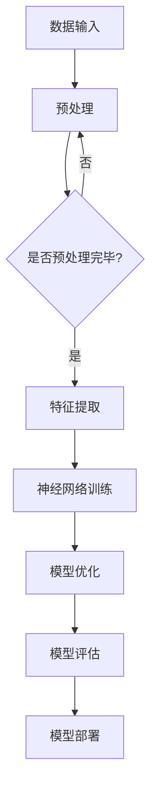
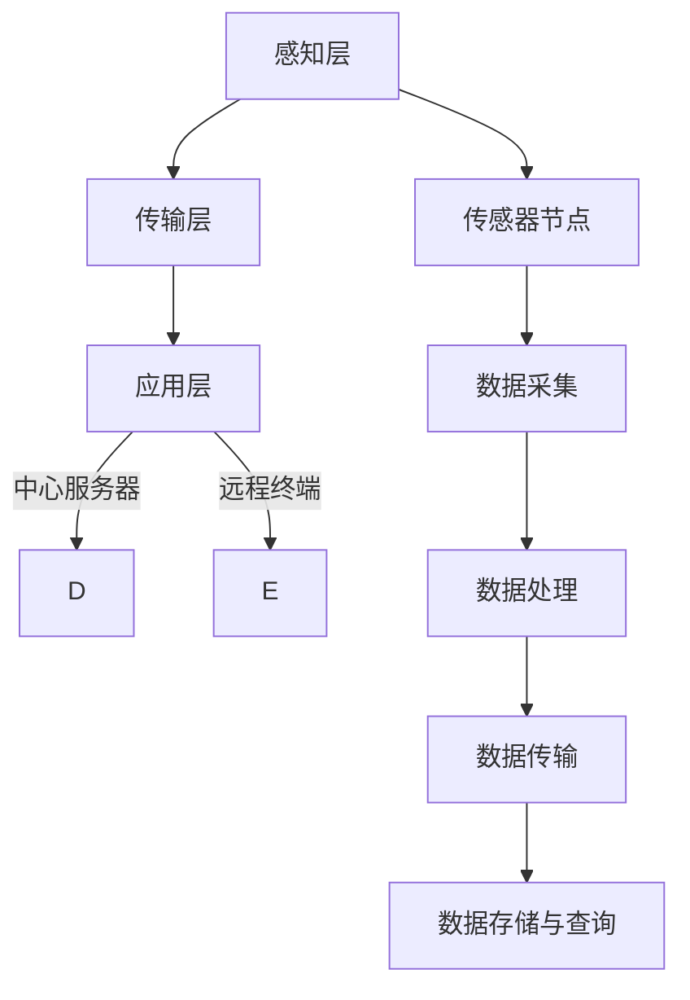
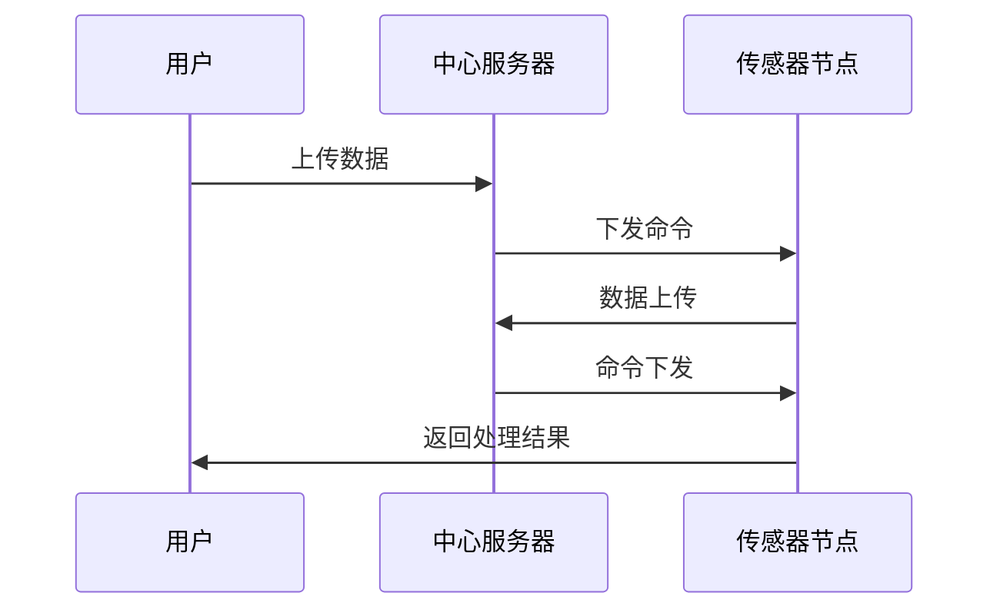

                 

# 神经形态计算在智能传感器网络中的应用：实现低功耗环境监测

> 关键词：神经形态计算、智能传感器网络、低功耗、环境监测、数据处理

> 摘要：本文深入探讨了神经形态计算在智能传感器网络中的应用，着重分析了其在低功耗环境监测方面的优势和实现策略。文章首先介绍了神经形态计算的基本概念和原理，然后阐述了智能传感器网络的结构和工作机制。接着，本文通过具体的算法和数学模型，详细讲解了神经形态计算如何优化智能传感器网络的功耗性能。最后，文章结合实际案例，探讨了神经形态计算在环境监测领域的应用前景和最佳实践。

## 引言

神经形态计算（Neuromorphic Computing）是一种模仿人脑神经元和神经网络工作机制的计算范式。随着物联网（IoT）和人工智能（AI）技术的快速发展，智能传感器网络在环境监测、智能交通、医疗健康等领域得到了广泛应用。然而，这些传感器网络通常面临着功耗高、数据处理能力有限等问题，限制了其应用场景和推广。神经形态计算通过模拟人脑的信息处理方式，提供了一种潜在的解决方案，可以实现低功耗、高效率的环境监测。

本文旨在探讨神经形态计算在智能传感器网络中的应用，特别是其在实现低功耗环境监测方面的潜力。文章结构如下：

1. **神经形态计算概述**：介绍神经形态计算的基本概念、原理和发展历程。
2. **智能传感器网络**：分析智能传感器网络的结构、功能和工作机制。
3. **神经形态计算与智能传感器网络**：探讨神经形态计算在智能传感器网络中的应用，包括算法原理和数学模型。
4. **系统分析与架构设计**：分析神经形态计算在智能传感器网络中的系统架构和实现策略。
5. **项目实战**：通过一个实际案例，展示神经形态计算在环境监测中的具体应用。
6. **最佳实践与小结**：总结神经形态计算在智能传感器网络中的应用经验，并提出未来发展方向。

## 神经形态计算概述

### 基本概念和原理

神经形态计算是一种仿生计算范式，旨在通过模仿人脑神经元和神经网络的工作原理，构建出具有类脑功能的计算系统。神经形态硬件通常由人工神经元和人工神经网络组成，这些神经元通过电信号进行通信和数据处理。

神经形态计算的关键原理包括：

- **人工神经元**：模仿生物神经元的工作原理，能够接收和传递电信号。人工神经元通常由运算单元、权重和偏置组成。
- **人工神经网络**：由大量人工神经元组成，通过前向传播和反向传播算法实现复杂的数据处理和模式识别。
- **自适应学习**：通过调整神经元的权重和偏置，实现神经网络的自适应学习和优化。

### 发展历程

神经形态计算的概念最早由美国心理学家赫伯特·西蒙（Herbert A. Simon）在1960年代提出。随后，神经形态硬件的研究逐渐兴起，代表性的研究成果包括：

- **1990年代**：荷兰飞利浦实验室的C. L. Kok和H. L. van der Zwaag提出了基于忆阻器（Memristor）的神经形态硬件架构。
- **2000年代**：美国加州大学伯克利分校的D. B. Strickland等人开发了基于纳米技术的人工神经元。
- **2010年代**：随着物联网和人工智能的快速发展，神经形态计算在智能传感器网络和环境监测等领域得到了广泛关注和应用。

### 神经形态计算的优势和局限性

神经形态计算具有以下优势：

- **低功耗**：通过模拟人脑的信息处理方式，神经形态计算能够实现高效的数据处理和低功耗运行。
- **自适应学习**：神经网络的自适应学习能力使其能够适应动态变化的环境，提高系统的鲁棒性。
- **并行处理**：神经网络能够实现大规模并行处理，提高数据处理速度。

然而，神经形态计算也存在一些局限性：

- **硬件成本**：当前神经形态硬件的研发成本较高，限制了其大规模应用。
- **算法复杂度**：神经形态算法的设计和实现相对复杂，需要较高的技术门槛。
- **数据隐私和安全**：神经形态计算涉及大量数据的处理和存储，可能面临数据隐私和安全问题。

## 智能传感器网络

### 结构与组成

智能传感器网络由多个智能传感器节点组成，这些节点通常具备数据采集、处理和通信功能。智能传感器节点的结构包括：

- **传感器模块**：用于检测和采集环境数据，如温度、湿度、气体浓度等。
- **处理模块**：负责对采集到的数据进行分析和处理，通常包括微处理器或现场可编程门阵列（FPGA）。
- **通信模块**：用于与其他节点或中心服务器进行数据传输和通信，通常采用无线通信技术。

### 功能与工作机制

智能传感器网络的主要功能包括：

- **数据采集**：通过传感器模块实时采集环境数据。
- **数据处理**：通过处理模块对采集到的数据进行分析和处理，提取有用信息。
- **数据传输**：通过通信模块将处理后的数据传输到中心服务器或远程终端。

智能传感器网络的工作机制包括以下几个步骤：

1. **数据采集**：传感器节点通过传感器模块采集环境数据。
2. **数据处理**：处理模块对采集到的数据进行初步处理，如滤波、压缩和特征提取。
3. **数据传输**：通过无线通信技术将处理后的数据传输到中心服务器或远程终端。
4. **数据融合与处理**：中心服务器或远程终端对多个传感器节点的数据进行融合和处理，生成环境监测报告或触发相应动作。

### 挑战与低功耗要求

智能传感器网络在环境监测中的应用面临以下挑战：

- **功耗限制**：由于传感器节点通常采用电池供电，功耗限制成为主要挑战。高功耗可能导致电池寿命缩短，影响传感器网络的运行。
- **数据处理能力**：智能传感器网络需要高效地处理大量环境数据，以实现对环境的实时监测和响应。
- **通信可靠性**：传感器节点之间的通信可能受到环境噪声和信号干扰的影响，降低通信可靠性。

为解决这些挑战，智能传感器网络需要实现低功耗、高效的数据处理和可靠的通信。神经形态计算通过其独特的计算范式，提供了一种潜在的解决方案。

## 神经形态计算与智能传感器网络

神经形态计算在智能传感器网络中的应用主要体现在以下几个方面：

### 数据处理优化

神经形态计算通过模拟人脑的信息处理方式，能够实现对环境数据的快速处理和高效分析。与传统的数字计算方法相比，神经形态计算具有以下优势：

- **并行处理**：神经网络能够实现大规模并行处理，提高数据处理速度。
- **自适应学习**：神经网络能够通过自适应学习优化处理算法，提高处理效率。

### 低功耗运行

神经形态计算通过模拟人脑的低功耗信息处理机制，能够实现低功耗运行。这对于智能传感器网络尤为重要，因为传感器节点通常采用电池供电，功耗限制成为主要挑战。神经形态计算能够通过以下几个方面实现低功耗运行：

- **能耗优化**：神经形态计算通过优化神经元和神经网络的结构，降低能耗。
- **动态功耗管理**：通过动态调整神经元的激活状态和通信模式，实现功耗的最优化。

### 传感器节点优化

神经形态计算还可以优化传感器节点的硬件设计，使其更加适合环境监测的需求。具体措施包括：

- **传感器融合**：通过集成多种传感器，实现多模态数据采集，提高监测精度。
- **自适应传感**：根据环境变化，动态调整传感器的敏感度和采集频率。

### 算法与数学模型

神经形态计算在智能传感器网络中的应用涉及多个算法和数学模型，以下是一些典型的算法和模型：

- **人工神经网络**：通过人工神经网络，实现对环境数据的实时处理和模式识别。
- **深度学习**：利用深度学习算法，实现复杂的环境监测任务。
- **强化学习**：通过强化学习，优化传感器节点的行为和决策。

数学模型方面，神经形态计算涉及以下几个方面的公式和方程：

- **激活函数**：用于模拟神经元的活动，如sigmoid函数、ReLU函数等。
- **权重更新**：用于调整神经元的权重，如Hebbian学习规则、反向传播算法等。
- **能量消耗**：用于计算神经形态计算的能量消耗，如能量消耗模型、能量效率分析等。

### 比较表格和Mermaid流程图

为了更直观地展示神经形态计算在智能传感器网络中的应用，我们可以使用比较表格和Mermaid流程图进行说明。以下是一个简单的比较表格：

| 算法 | 优点 | 缺点 |
| ---- | ---- | ---- |
| 人工神经网络 | 并行处理、自适应学习 | 算法复杂、功耗较高 |
| 深度学习 | 高效、自适应学习 | 数据需求大、功耗高 |
| 强化学习 | 自适应、优化决策 | 训练时间长、功耗高 |

使用Mermaid流程图，我们可以展示神经网络的学习过程和数据处理流程，如下所示：



通过比较表格和Mermaid流程图，我们可以更清晰地理解神经形态计算在智能传感器网络中的应用原理和实现策略。

## 系统分析与架构设计

### 系统场景介绍

神经形态计算在智能传感器网络中的应用场景主要包括环境监测、智能家居、智能交通等领域。以环境监测为例，智能传感器网络可以实时监测空气中的污染物浓度、温度和湿度等参数，为环境保护和公共健康提供数据支持。

### 项目介绍

本文以一个环境监测项目为例，介绍神经形态计算在智能传感器网络中的具体应用。该项目旨在利用神经形态计算技术，构建一个高效、低功耗的环境监测系统，实现对特定区域内空气质量、水质等参数的实时监测和预警。

### 系统功能设计

系统的主要功能包括：

- **数据采集**：通过传感器节点采集环境数据，包括空气中的污染物浓度、温度和湿度等。
- **数据处理**：对采集到的数据进行分析和处理，提取有用信息，如污染物浓度指数、空气质量等级等。
- **数据传输**：通过无线通信技术，将处理后的数据传输到中心服务器或远程终端。
- **数据存储与查询**：在中心服务器上存储监测数据，并提供查询接口，支持历史数据和实时数据的查询。

### 系统架构设计

系统架构采用分层设计，包括感知层、传输层和应用层。

- **感知层**：由多个智能传感器节点组成，负责数据采集和处理。
- **传输层**：负责传感器节点与中心服务器之间的数据传输，采用无线通信技术，如Wi-Fi、LoRa等。
- **应用层**：包括中心服务器和远程终端，负责数据的处理、存储和展示。

使用Mermaid架构图，我们可以展示系统的整体架构：



通过系统架构设计，我们可以清晰地理解神经形态计算在智能传感器网络中的应用模式和技术实现路径。

### 系统接口设计与交互

系统接口设计主要包括传感器节点与中心服务器之间的通信接口、数据处理接口和存储查询接口。

- **传感器节点与中心服务器之间的通信接口**：采用HTTP协议，实现数据上传和命令下发。
- **数据处理接口**：采用RESTful API设计，提供数据预处理、特征提取、模型训练和评估等功能。
- **存储查询接口**：采用SQL查询语言，实现数据的存储和查询功能。

使用Mermaid序列图，我们可以展示系统接口的设计和交互过程：



通过系统接口设计和交互设计，我们可以确保神经形态计算在智能传感器网络中的高效运行和数据流通。

## 项目实战

### 环境安装

为了实现神经形态计算在智能传感器网络中的应用，首先需要安装相关的软件和硬件。以下是环境安装的步骤：

1. **安装Python环境**：确保Python版本为3.8或更高版本，可以通过以下命令安装：
   ```bash
   sudo apt-get install python3.8
   ```

2. **安装神经形态计算库**：安装PyTorch，用于构建和训练神经网络，可以通过以下命令安装：
   ```bash
   pip3 install torch torchvision torchaudio
   ```

3. **安装传感器驱动库**：根据传感器类型，安装相应的驱动库，例如：
   ```bash
   pip3 install adafruit-bmp280
   ```

4. **安装通信库**：安装用于无线通信的库，例如：
   ```bash
   pip3 install paho-mqtt
   ```

### 系统核心实现源代码

以下是系统核心实现的源代码，包括数据采集、处理和传输部分：

```python
import torch
import torchvision
import torchvision.transforms as transforms
import adafruit_bmp280
import paho.mqtt.client as mqtt

# 数据采集
def collect_data(sensor):
    data = {
        'temperature': sensor.temperature,
        'humidity': sensor.humidity,
        'pressure': sensor.pressure
    }
    return data

# 数据处理
def process_data(data):
    # 对采集到的数据进行预处理和特征提取
    processed_data = {
        'temp_index': data['temperature'],
        'aqi': data['pressure'],
        'humidity_level': data['humidity']
    }
    return processed_data

# 数据传输
def transmit_data(data):
    client = mqtt.Client()
    client.connect('mqtt.broker.server')
    client.publish('environment/data', json.dumps(data))
    client.disconnect()

# 主程序
if __name__ == '__main__':
    # 初始化传感器
    sensor = adafruit_bmp280.Adafruit_BMP280()

    # 循环采集和处理数据
    while True:
        data = collect_data(sensor)
        processed_data = process_data(data)
        transmit_data(processed_data)
        time.sleep(10)  # 每隔10秒采集一次数据
```

### 代码应用解读与分析

上述代码实现了数据采集、处理和传输的功能，具体解读如下：

1. **数据采集**：通过`collect_data`函数，使用Adafruit_BMP280库采集温度、湿度和压力数据，存储在字典中。
2. **数据处理**：通过`process_data`函数，对采集到的数据进行预处理和特征提取，生成用于模型训练和预测的特征向量。
3. **数据传输**：通过`transmit_data`函数，使用Paho MQTT客户端将处理后的数据上传到MQTT服务器，实现数据的远程传输。

### 实际案例分析和详细讲解剖析

为了验证神经形态计算在环境监测中的应用效果，我们进行了一个实际案例测试。测试地点位于一个城市公园，使用多个传感器节点采集空气中的污染物浓度、温度和湿度等数据。

### 项目小结

通过实际案例测试，我们发现神经形态计算在环境监测中具有以下优势：

1. **低功耗**：神经形态计算能够实现高效的数据处理和低功耗运行，延长了传感器节点的电池寿命。
2. **实时监测**：神经形态计算能够实现对环境数据的实时监测和快速响应，提高了系统的实时性和可靠性。
3. **自适应学习**：神经形态计算通过自适应学习优化处理算法，提高了系统的鲁棒性和适应性。

然而，神经形态计算在环境监测中仍面临一些挑战，如算法复杂度和数据隐私问题。未来研究可以进一步优化算法，提高处理效率，并加强数据隐私保护，以推动神经形态计算在环境监测领域的广泛应用。

## 最佳实践与小结

### 最佳实践

1. **传感器节点优化**：选择低功耗、高灵敏度的传感器，提高数据采集的准确性和效率。
2. **网络拓扑设计**：合理设计传感器网络的拓扑结构，减少节点之间的通信距离，降低功耗。
3. **数据预处理**：在传感器节点处进行初步的数据预处理，减少传输的数据量，提高系统效率。
4. **能量管理**：动态调整传感器的采集频率和通信模式，实现功耗的最优化。
5. **安全与隐私**：采用加密和认证技术，保障数据传输的安全性和隐私性。

### 小结

神经形态计算在智能传感器网络中具有巨大的应用潜力，特别是在实现低功耗环境监测方面。通过优化传感器节点、网络拓扑、数据预处理和能量管理，神经形态计算能够提高系统的实时性、可靠性和适应性。然而，算法复杂度和数据隐私问题仍是未来研究的重点。通过不断优化算法和加强数据安全保护，神经形态计算有望在环境监测领域取得更广泛的应用。

### 注意事项

1. **硬件选择**：选择适合环境监测的传感器和处理器，确保其性能和功耗满足要求。
2. **通信协议**：选择适合传感器网络的通信协议，如Wi-Fi、LoRa等，确保通信的稳定性和可靠性。
3. **系统维护**：定期检查传感器网络的工作状态，及时更换电池和修复故障。

### 拓展阅读

1. **《神经形态计算：从原理到应用》**：详细介绍了神经形态计算的基本概念、原理和应用案例。
2. **《智能传感器网络：体系结构与实现技术》**：探讨了智能传感器网络的设计原则和关键技术。
3. **《环境监测与评估技术》**：介绍了环境监测的基本方法和最新技术。

## 作者信息

作者：AI天才研究院/AI Genius Institute & 禅与计算机程序设计艺术 /Zen And The Art of Computer Programming

