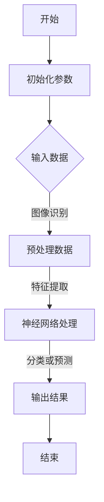
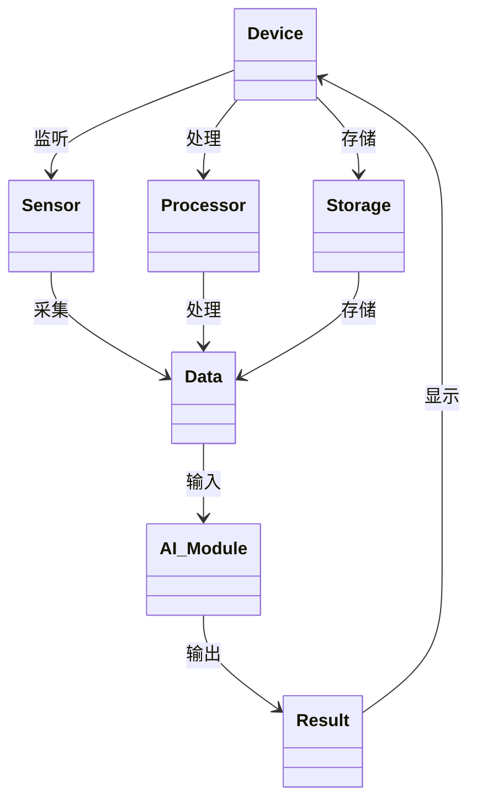
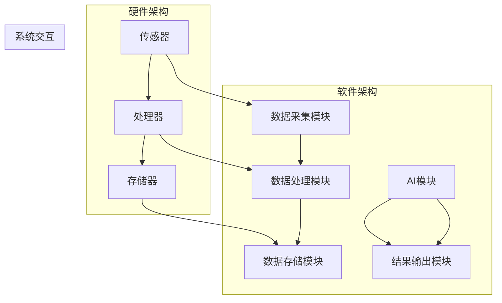
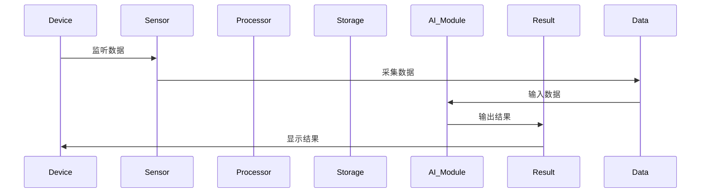

                 

# 神经形态计算在移动设备AI中的应用：低功耗高效能

> 关键词：神经形态计算、移动设备AI、低功耗高效能、计算模型、架构设计、应用场景

> 摘要：本文深入探讨了神经形态计算在移动设备AI中的应用及其对低功耗高效能的需求与挑战。通过对神经形态计算的基本原理、移动设备AI的架构设计以及低功耗高效能设计的分析，揭示了神经形态计算如何帮助移动设备实现更智能、更节能的AI应用。文章结构清晰，内容丰富，适合AI领域的研究者、工程师及爱好者阅读。

----------------------------------------------------------------

## 目录大纲

## 第一部分：引言

### 1.1 神经形态计算概述

#### 1.1.1 神经形态计算的概念

#### 1.1.2 神经形态计算的发展历史

#### 1.1.3 神经形态计算的重要性

### 1.2 移动设备AI的发展与应用

#### 1.2.1 移动设备AI的兴起

#### 1.2.2 移动设备AI的优势

#### 1.2.3 移动设备AI的应用场景

### 1.3 低功耗高效能需求与挑战

#### 1.3.1 低功耗高效能的需求

#### 1.3.2 低功耗高效能的挑战

#### 1.3.3 低功耗高效能的关键技术

### 1.4 本书结构安排

#### 1.4.1 各章节内容概述

#### 1.4.2 阅读指南

## 第二部分：神经形态计算原理

### 2.1 神经形态计算基础

#### 2.1.1 神经元的结构与功能

#### 2.1.2 神经网络的原理与类型

#### 2.1.3 神经形态计算的关键技术

### 2.2 神经形态计算模型

#### 2.2.1 神经形态计算模型的定义

#### 2.2.2 常见的神经形态计算模型

#### 2.2.3 神经形态计算模型的工作原理

### 2.3 神经形态计算的应用

#### 2.3.1 计算机视觉

#### 2.3.2 自然语言处理

#### 2.3.3 语音识别

#### 2.3.4 其他应用领域

### 2.4 神经形态计算的挑战与趋势

#### 2.4.1 神经形态计算的挑战

#### 2.4.2 神经形态计算的未来趋势

### 2.5 本章小结

## 第三部分：移动设备AI架构设计

### 3.1 移动设备AI概述

#### 3.1.1 移动设备AI的定义

#### 3.1.2 移动设备AI的发展历程

#### 3.1.3 移动设备AI的特点

### 3.2 移动设备AI的核心技术

#### 3.2.1 传感器技术

#### 3.2.2 人工智能算法

#### 3.2.3 软硬件协同设计

### 3.3 移动设备AI架构设计原则

#### 3.3.1 架构设计概述

#### 3.3.2 架构设计的关键原则

#### 3.3.3 架构设计案例解析

### 3.4 移动设备AI的应用场景分析

#### 3.4.1 日常应用场景

#### 3.4.2 工业应用场景

#### 3.4.3 医疗应用场景

### 3.5 本章小结

## 第四部分：低功耗高效能设计

### 4.1 低功耗高效能需求分析

#### 4.1.1 移动设备功耗分析

#### 4.1.2 低功耗需求的重要性

#### 4.1.3 高效能需求的重要性

### 4.2 低功耗高效能设计方法

#### 4.2.1 芯片级设计方法

#### 4.2.2 系统级设计方法

#### 4.2.3 应用级设计方法

### 4.3 低功耗高效能关键技术

#### 4.3.1 存储器技术

#### 4.3.2 通信技术

#### 4.3.3 算法优化技术

### 4.4 低功耗高效能设计案例

#### 4.4.1 案例一：低功耗神经网络处理器设计

#### 4.4.2 案例二：高效能移动设备通信系统设计

### 4.5 本章小结

## 第五部分：神经形态计算与移动设备AI融合

### 5.1 神经形态计算在移动设备AI中的应用

#### 5.1.1 神经形态计算的优势

#### 5.1.2 移动设备AI的需求

#### 5.1.3 神经形态计算在移动设备AI中的应用案例

### 5.2 神经形态计算与移动设备AI融合架构设计

#### 5.2.1 融合架构设计原则

#### 5.2.2 融合架构设计方法

#### 5.2.3 融合架构设计案例

### 5.3 低功耗高效能的神经形态计算在移动设备AI中的应用

#### 5.3.1 低功耗高效能的神经形态计算优势

#### 5.3.2 低功耗高效能神经形态计算在移动设备AI中的应用场景

#### 5.3.3 低功耗高效能神经形态计算在移动设备AI中的应用案例

### 5.4 本章小结

----------------------------------------------------------------

## 第一部分：引言

### 1.1 神经形态计算概述

#### 1.1.1 神经形态计算的概念

神经形态计算（Neuromorphic Computing）是一种模拟人脑信息处理方式的新型计算技术，旨在通过设计并实现具有类人脑结构和功能的计算系统，以实现高效、低功耗的智能计算。神经形态计算的核心思想是模仿人脑中的神经元和神经网络结构，通过大规模集成神经元和神经突触的硬件系统，实现类似于生物神经系统的信息处理、学习和自适应能力。

#### 1.1.2 神经形态计算的发展历史

神经形态计算的概念最早由著名神经科学家卡尔·弗里德里希·高尔杰（Karl Friedrich Göller）在1949年提出。此后，神经形态计算的研究逐渐发展，特别是在20世纪80年代，由亨利·詹宁斯（H. Deloss D. Jennings）等人领导的团队，成功设计出了第一代神经形态芯片。进入21世纪，随着人工智能和物联网技术的快速发展，神经形态计算迎来了新的发展机遇，成为了人工智能领域的研究热点。

#### 1.1.3 神经形态计算的重要性

神经形态计算的重要性体现在以下几个方面：

1. **高效能**：神经形态计算通过模拟人脑的信息处理方式，能够实现高效的信息处理和计算能力，尤其是在复杂模式识别、实时决策等任务中，具有显著优势。
   
2. **低功耗**：与传统的计算机处理器相比，神经形态计算系统具有较低的功耗，特别适用于移动设备和物联网设备等对功耗有严格要求的场景。

3. **自适应和可塑性**：神经形态计算系统具有类似生物神经系统的自适应和可塑性，能够根据环境和任务的需求，动态调整计算方式和参数，实现更智能的决策。

### 1.2 移动设备AI的发展与应用

#### 1.2.1 移动设备AI的兴起

随着智能手机、平板电脑等移动设备的普及，移动设备AI（AI on Mobile Devices）逐渐成为了人工智能领域的一个重要分支。移动设备AI的目标是通过在移动设备上部署人工智能算法，实现实时、高效的处理能力，从而为用户提供更加智能、便捷的服务。

#### 1.2.2 移动设备AI的优势

1. **实时处理**：移动设备AI能够在设备本地进行数据处理，无需上传到云端，实现实时响应。

2. **隐私保护**：移动设备AI能够保护用户隐私，避免数据泄露的风险。

3. **节省流量**：移动设备AI可以减少数据传输的需求，节省流量费用。

#### 1.2.3 移动设备AI的应用场景

1. **图像识别**：如人脸识别、场景识别等。

2. **语音识别**：如语音助手、语音翻译等。

3. **自然语言处理**：如语音合成、文本翻译等。

### 1.3 低功耗高效能需求与挑战

#### 1.3.1 低功耗高效能的需求

移动设备，尤其是智能手机和可穿戴设备，对功耗有严格的要求。低功耗高效能设计不仅能够延长设备的使用时间，还能提高设备的续航能力。

#### 1.3.2 低功耗高效能的挑战

1. **硬件限制**：移动设备的硬件资源有限，需要通过优化算法和架构设计，实现低功耗高效能。

2. **计算需求**：随着AI算法的复杂度增加，移动设备需要处理的数据量也在增加，对计算能力的需求不断提高。

3. **能效平衡**：在保证计算能力的同时，如何降低功耗，实现能效平衡，是当前移动设备AI面临的一个重要挑战。

#### 1.3.3 低功耗高效能的关键技术

1. **神经网络压缩**：通过压缩神经网络模型，减少模型的参数和计算量，实现低功耗高效能。

2. **硬件加速**：利用专用硬件加速器，如GPU、TPU等，提高计算速度，降低功耗。

3. **功耗优化**：通过优化电源管理策略，降低设备在空闲状态下的功耗。

### 1.4 本书结构安排

#### 1.4.1 各章节内容概述

本书共分为五个部分，分别从神经形态计算的基本原理、移动设备AI的架构设计、低功耗高效能设计方法、神经形态计算与移动设备AI的融合应用等方面进行了全面深入的探讨。

#### 1.4.2 阅读指南

建议读者按照以下顺序阅读本书：

1. 首先了解神经形态计算的基本原理，包括神经元、神经网络等核心概念。

2. 然后学习移动设备AI的架构设计，了解其核心技术与应用场景。

3. 接着掌握低功耗高效能设计方法，学习如何实现低功耗高效能。

4. 最后探讨神经形态计算在移动设备AI中的应用，了解其融合架构设计与应用案例。

通过本书的学习，读者可以全面了解神经形态计算在移动设备AI中的应用，掌握低功耗高效能设计方法，为实际项目开发提供理论支持。

----------------------------------------------------------------

## 第二部分：神经形态计算原理

### 2.1 神经形态计算基础

#### 2.1.1 神经元的结构与功能

神经元是神经形态计算的核心单元，其结构与功能类似于生物神经元。生物神经元包括细胞体、树突、轴突和突触等部分。细胞体负责处理和整合来自树突的信息，通过轴突将信息传递到其他神经元。突触是神经元之间传递信息的连接点，通过释放神经递质来实现信号的传递。

在神经形态计算中，人工神经元通常由一个或多个输入端口、一个激活函数和多个输出端口组成。输入端口接收外部信号，激活函数对信号进行处理和整合，输出端口将处理后的信号传递给其他神经元或执行特定的操作。

#### 2.1.2 神经网络的原理与类型

神经网络是由多个神经元组成的计算模型，通过模拟生物神经系统的信息处理方式，实现复杂的数据处理和模式识别任务。神经网络可以分为前馈神经网络、反馈神经网络和卷积神经网络等类型。

1. **前馈神经网络**：前馈神经网络是一种简单的神经网络结构，其中信号仅沿着单一方向传递，从输入层经过隐藏层传递到输出层。前馈神经网络通常用于分类、回归等任务。

2. **反馈神经网络**：反馈神经网络包含循环结构，信号可以在网络中循环传递。反馈神经网络能够实现更复杂的计算任务，如序列预测、动态系统建模等。

3. **卷积神经网络**：卷积神经网络是一种特殊的神经网络，通过卷积操作提取输入数据的特征。卷积神经网络在计算机视觉任务中取得了显著的成果，如图像分类、目标检测等。

#### 2.1.3 神经形态计算的关键技术

神经形态计算的关键技术包括以下几个方面：

1. **硬件实现**：神经形态计算需要利用硬件实现大量的神经元和神经突触，以实现高效的计算能力。常见的硬件实现方式包括基于硅芯片的实现、基于光子学的实现等。

2. **编程语言**：神经形态计算需要特定的编程语言和工具，以便设计和实现神经网络模型。常见的编程语言包括Spaun、BrainSim3D等。

3. **学习算法**：神经形态计算需要利用学习算法对神经网络模型进行训练和优化，以实现特定的计算任务。常见的学习算法包括Hebb学习规则、反propagation算法等。

### 2.2 神经形态计算模型

#### 2.2.1 神经形态计算模型的定义

神经形态计算模型是指通过模拟生物神经系统的信息处理方式，实现复杂数据处理和模式识别任务的计算模型。神经形态计算模型通常包括神经元模型、神经网络模型和神经形态硬件模型等组成部分。

#### 2.2.2 常见的神经形态计算模型

1. **Hebb模型**：Hebb模型是最早提出的神经形态计算模型之一，基于Hebb学习规则实现神经元之间的连接权重调整。

   $$ w_{ij} = w_{ij} + \eta \cdot x_i \cdot y_j $$

   其中，\( w_{ij} \)表示神经元\( i \)和神经元\( j \)之间的连接权重，\( x_i \)和\( y_j \)分别表示神经元\( i \)和神经元\( j \)的输入和输出。

2. **Hopfield模型**：Hopfield模型是一种基于能量函数的神经网络模型，能够实现模式识别和记忆功能。

   $$ E = -\sum_{i,j} w_{ij} \cdot x_i \cdot x_j + \sum_{i} \alpha \cdot x_i^2 $$

   其中，\( E \)表示网络的能量，\( x_i \)表示神经元\( i \)的激活状态，\( \alpha \)是调节参数。

3. **Spaun模型**：Spaun是一种高度模拟人脑功能的神经形态计算模型，能够实现计数、记忆和推理等任务。

   $$ \text{Spaun} = \text{Brain} + \text{Speech} + \text{Arm} $$

   其中，Brain负责计算和记忆，Speech负责语音生成，Arm负责执行物理动作。

#### 2.2.3 神经形态计算模型的工作原理

神经形态计算模型的工作原理主要包括以下几个步骤：

1. **输入处理**：输入数据经过预处理后，输入到神经形态计算模型中。

2. **信号传递**：信号在神经元之间传递，通过激活函数进行处理和整合。

3. **权重调整**：通过学习算法，对神经元之间的连接权重进行调整，以实现更好的计算效果。

4. **输出生成**：处理后的信号生成输出，实现特定的计算任务。

### 2.3 神经形态计算的应用

#### 2.3.1 计算机视觉

计算机视觉是神经形态计算的一个重要应用领域，旨在通过模拟人脑视觉系统，实现图像识别、目标检测、场景理解等任务。神经形态计算在计算机视觉中的应用主要包括以下几个方面：

1. **图像识别**：通过模拟生物视觉系统，实现高效的图像识别任务。

2. **目标检测**：通过模拟生物视觉系统，实现高效的目标检测任务。

3. **场景理解**：通过模拟生物视觉系统，实现场景理解和环境感知。

#### 2.3.2 自然语言处理

自然语言处理是神经形态计算的另一个重要应用领域，旨在通过模拟人脑语言处理机制，实现文本分类、情感分析、机器翻译等任务。神经形态计算在自然语言处理中的应用主要包括以下几个方面：

1. **文本分类**：通过模拟生物语言处理机制，实现高效的文本分类任务。

2. **情感分析**：通过模拟生物语言处理机制，实现高效的情感分析任务。

3. **机器翻译**：通过模拟生物语言处理机制，实现高效的机器翻译任务。

#### 2.3.3 语音识别

语音识别是神经形态计算的另一个重要应用领域，旨在通过模拟生物听觉系统，实现语音识别、语音合成等任务。神经形态计算在语音识别中的应用主要包括以下几个方面：

1. **语音识别**：通过模拟生物听觉系统，实现高效的语音识别任务。

2. **语音合成**：通过模拟生物听觉系统，实现高效的语音合成任务。

#### 2.3.4 其他应用领域

除了计算机视觉、自然语言处理和语音识别外，神经形态计算在其他领域也有广泛的应用，如机器人控制、生物医学信号处理、自适应系统等。神经形态计算在这些领域的应用主要通过模拟生物系统的信息处理机制，实现高效、自适应的计算能力。

### 2.4 神经形态计算的挑战与趋势

#### 2.4.1 神经形态计算的挑战

神经形态计算在发展过程中面临着以下几个挑战：

1. **硬件实现**：神经形态计算需要大规模集成神经元和神经突触，对硬件实现提出了较高的要求。

2. **学习算法**：神经形态计算的学习算法需要能够模拟生物神经系统的自适应和学习能力，对算法设计提出了挑战。

3. **能耗优化**：神经形态计算需要实现低功耗高效能，对能耗优化提出了挑战。

#### 2.4.2 神经形态计算的未来趋势

随着人工智能和物联网技术的快速发展，神经形态计算未来趋势如下：

1. **硬件发展**：随着半导体技术和光子学技术的发展，神经形态计算硬件将逐渐实现高效、低功耗的集成。

2. **算法优化**：随着机器学习和深度学习技术的进步，神经形态计算的学习算法将不断优化，实现更高效、自适应的计算能力。

3. **跨学科融合**：神经形态计算与其他学科的融合，如生物医学、心理学等，将推动神经形态计算在更多领域的应用。

### 2.5 本章小结

本章介绍了神经形态计算的基本原理、模型及应用领域。通过本章的学习，读者可以了解到神经形态计算的核心概念、发展历程以及在实际应用中的优势与挑战。下一章将探讨移动设备AI的架构设计及其在低功耗高效能方面的需求。

----------------------------------------------------------------

## 第三部分：移动设备AI架构设计

### 3.1 移动设备AI概述

#### 3.1.1 移动设备AI的定义

移动设备AI（AI on Mobile Devices）是指将人工智能算法和应用部署在移动设备（如智能手机、平板电脑等）上，实现设备本地智能计算的能力。移动设备AI的核心目标是通过在设备本地处理数据，提高计算效率、降低延迟，同时保护用户隐私，为用户提供更加智能、便捷的服务。

#### 3.1.2 移动设备AI的发展历程

移动设备AI的发展可以分为以下几个阶段：

1. **早期探索**：在移动设备AI的概念提出之初，主要关注于在移动设备上部署简单的机器学习算法，如线性回归、决策树等。

2. **深度学习引入**：随着深度学习技术的兴起，移动设备AI逐渐引入了卷积神经网络（CNN）、循环神经网络（RNN）等复杂的深度学习模型，实现了更高效、更准确的计算能力。

3. **硬件加速**：随着移动设备硬件的发展，GPU、NPU等专用硬件加速器的引入，使得移动设备AI在计算速度和能效方面取得了显著提升。

4. **边缘计算结合**：随着物联网和边缘计算技术的发展，移动设备AI逐渐与边缘计算结合，实现了在移动设备和边缘设备之间的协同计算，进一步提高了计算效率和用户体验。

#### 3.1.3 移动设备AI的特点

移动设备AI具有以下几个显著特点：

1. **实时性**：移动设备AI能够实现实时数据处理和响应，满足用户对实时性、响应速度的要求。

2. **本地计算**：移动设备AI在设备本地进行计算，无需上传数据到云端，保护了用户隐私，降低了网络延迟。

3. **功耗优化**：移动设备AI在计算过程中注重功耗优化，通过硬件加速、算法优化等技术，实现了低功耗高效能。

4. **多样化应用**：移动设备AI能够应用于多种场景，如图像识别、语音识别、自然语言处理等，为用户提供丰富的智能服务。

### 3.2 移动设备AI的核心技术

移动设备AI的核心技术包括以下几个方面：

#### 3.2.1 传感器技术

传感器技术是移动设备AI的基础，常见的传感器包括摄像头、麦克风、加速度计、陀螺仪等。传感器技术能够实时获取设备周围的环境信息，为移动设备AI提供丰富的数据输入。

1. **摄像头**：摄像头用于图像识别、场景理解等任务，是实现计算机视觉的核心传感器。

2. **麦克风**：麦克风用于语音识别、语音合成等任务，是实现自然语言处理的核心传感器。

3. **加速度计和陀螺仪**：加速度计和陀螺仪用于运动跟踪、姿态估计等任务，是实现机器人控制和增强现实等应用的核心传感器。

#### 3.2.2 人工智能算法

人工智能算法是移动设备AI的核心，常见的算法包括深度学习、强化学习、自然语言处理等。移动设备AI通过这些算法，对传感器获取的数据进行处理和推理，实现智能决策和交互。

1. **深度学习**：深度学习算法，如卷积神经网络（CNN）、循环神经网络（RNN）等，广泛应用于图像识别、语音识别等任务。

2. **强化学习**：强化学习算法，如深度强化学习（DRL），广泛应用于机器人控制、自动驾驶等任务。

3. **自然语言处理**：自然语言处理算法，如词向量、序列到序列模型等，广泛应用于文本分类、机器翻译等任务。

#### 3.2.3 软硬件协同设计

软硬件协同设计是移动设备AI实现低功耗高效能的关键技术。通过软硬件协同设计，可以实现计算任务的优化分配，充分利用硬件资源，降低功耗。

1. **硬件加速**：硬件加速，如GPU、NPU等，可以显著提高计算速度，降低功耗。

2. **软件优化**：软件优化，如神经网络压缩、量化等，可以减少模型的参数和计算量，提高计算效率。

3. **能效平衡**：通过软硬件协同设计，实现计算任务与硬件资源的动态分配，优化能效平衡。

### 3.3 移动设备AI架构设计原则

移动设备AI架构设计需要遵循以下几个原则：

#### 3.3.1 架构设计概述

移动设备AI架构设计需要考虑以下几个层次：

1. **感知层**：包括传感器技术，用于获取设备周围的环境信息。

2. **感知层**：包括数据处理和推理模块，用于对感知层获取的数据进行处理和分析。

3. **决策层**：包括智能决策模块，用于根据处理和分析的结果，做出相应的决策。

4. **执行层**：包括执行模块，用于执行决策层的决策结果。

#### 3.3.2 架构设计的关键原则

1. **模块化设计**：将架构划分为多个模块，每个模块负责特定的功能，便于维护和扩展。

2. **低延迟设计**：优化数据传输和处理速度，降低延迟，提高实时性。

3. **功耗优化**：通过软硬件协同设计，实现低功耗高效能，延长设备续航时间。

4. **安全隐私**：确保数据安全和用户隐私，防止数据泄露。

5. **可扩展性**：设计具有良好可扩展性的架构，支持新算法和应用的引入。

### 3.3.3 架构设计案例解析

以下是一个简单的移动设备AI架构设计案例：

1. **感知层**：包括摄像头、麦克风等传感器，用于获取图像、语音等数据。

2. **数据处理和推理模块**：包括卷积神经网络（CNN）和循环神经网络（RNN）等深度学习算法，用于对感知层获取的数据进行处理和分析。

3. **智能决策模块**：包括强化学习算法，用于根据处理和分析的结果，做出相应的决策。

4. **执行模块**：包括执行决策的执行模块，如语音合成、图像显示等。

通过以上架构设计，移动设备AI可以实现对图像、语音等数据的实时处理和响应，为用户提供智能服务。

### 3.4 移动设备AI的应用场景分析

移动设备AI在多个领域具有广泛的应用场景，以下是几个典型的应用场景：

#### 3.4.1 日常应用场景

1. **智能助手**：通过语音识别和自然语言处理技术，实现智能对话、语音控制等功能。

2. **图像识别**：通过计算机视觉技术，实现人脸识别、场景识别等功能。

3. **运动跟踪**：通过加速度计、陀螺仪等传感器，实现运动跟踪、健身指导等功能。

#### 3.4.2 工业应用场景

1. **故障检测**：通过图像识别和自然语言处理技术，实现设备故障检测、维护预测等功能。

2. **自动化控制**：通过强化学习技术，实现自动化生产线、机器人控制等功能。

3. **供应链管理**：通过数据分析和预测技术，实现供应链优化、库存管理等功能。

#### 3.4.3 医疗应用场景

1. **诊断辅助**：通过计算机视觉技术，实现医学影像分析、疾病诊断等功能。

2. **远程医疗**：通过语音识别和自然语言处理技术，实现远程咨询、在线诊断等功能。

3. **健康管理**：通过传感器技术，实现健康数据监测、风险评估等功能。

### 3.5 本章小结

本章介绍了移动设备AI的基本概念、发展历程、核心技术以及架构设计原则。通过本章的学习，读者可以了解到移动设备AI的特点、应用场景以及架构设计的关键要素。下一章将探讨低功耗高效能设计方法。

----------------------------------------------------------------

## 第四部分：低功耗高效能设计

### 4.1 低功耗高效能需求分析

#### 4.1.1 移动设备功耗分析

移动设备的功耗主要由以下几个部分组成：

1. **CPU功耗**：CPU是移动设备的核心计算单元，其功耗占移动设备整体功耗的较大比例。CPU功耗与运行频率和负载大小密切相关。

2. **GPU功耗**：GPU（图形处理单元）在移动设备中主要用于图形渲染和计算机视觉任务。GPU功耗与渲染复杂度和负载大小有关。

3. **内存功耗**：内存功耗主要取决于内存访问频率和带宽。高访问频率和带宽会导致较大的内存功耗。

4. **存储功耗**：存储功耗主要由硬盘和固态硬盘（SSD）组成。硬盘的功耗较高，而SSD的功耗相对较低。

5. **屏幕功耗**：屏幕是移动设备功耗的主要组成部分，尤其是高分辨率和高清屏幕的功耗较大。

6. **通信功耗**：通信功耗主要取决于通信方式，如Wi-Fi、蓝牙、蜂窝网络等。无线通信通常具有较高的功耗。

#### 4.1.2 低功耗需求的重要性

低功耗需求在移动设备中具有重要性，主要体现在以下几个方面：

1. **延长续航时间**：低功耗设计可以延长移动设备的续航时间，提高用户体验。

2. **优化能效平衡**：低功耗设计有助于实现移动设备的能效平衡，提高能源利用率。

3. **适应特殊场景**：在特定场景下，如户外探险、紧急救援等，低功耗设计有助于设备在无外部电源的情况下维持长时间运行。

#### 4.1.3 高效能需求的重要性

高效能需求在移动设备中也具有重要性，主要体现在以下几个方面：

1. **快速响应**：高效能设计可以提高移动设备的响应速度，提高用户体验。

2. **负载均衡**：高效能设计可以实现负载均衡，减少设备过热和损坏的风险。

3. **提升性能**：高效能设计可以提升移动设备的整体性能，满足用户对高计算能力和图形渲染的需求。

### 4.2 低功耗高效能设计方法

#### 4.2.1 芯片级设计方法

芯片级设计方法是实现低功耗高效能的关键，主要包括以下几个方面：

1. **电源管理**：通过优化电源管理策略，降低设备在空闲状态下的功耗。例如，采用动态电压调节（DVR）和动态频率调节（DFT）技术，根据负载变化动态调整电压和频率。

2. **时钟门控**：通过时钟门控技术，在设备空闲时关闭不使用的时钟信号，降低功耗。

3. **功耗优化**：通过优化硬件设计，减少功耗。例如，采用低功耗晶体管、减小电路尺寸等。

4. **芯片架构**：通过优化芯片架构，提高计算效率和降低功耗。例如，采用多核处理器、异构计算架构等。

#### 4.2.2 系统级设计方法

系统级设计方法是从整个系统角度出发，实现低功耗高效能的设计。主要包括以下几个方面：

1. **任务调度**：通过任务调度算法，优化任务的执行顺序和资源分配，降低系统功耗。

2. **能效平衡**：通过能效平衡策略，实现计算任务与功耗之间的平衡，提高整体能效。

3. **电源管理**：通过优化电源管理策略，降低系统在空闲状态下的功耗。

4. **热管理**：通过优化热管理策略，降低系统温度，减少功耗。

#### 4.2.3 应用级设计方法

应用级设计方法是从具体应用场景出发，实现低功耗高效能的设计。主要包括以下几个方面：

1. **算法优化**：通过优化算法，减少计算复杂度和功耗。例如，采用神经网络压缩、量化等技术。

2. **硬件加速**：通过硬件加速技术，提高计算速度，降低功耗。例如，采用GPU、NPU等硬件加速器。

3. **能效优化**：通过优化应用代码和算法，提高能效。例如，采用并行计算、分布式计算等技术。

4. **用户交互**：通过优化用户交互设计，降低用户操作对功耗的影响。例如，采用智能屏保、自适应亮度调节等技术。

### 4.3 低功耗高效能关键技术

#### 4.3.1 存储器技术

存储器技术在低功耗高效能设计中具有重要地位，主要包括以下几个方面：

1. **闪存技术**：闪存技术，如eMMC和UFS，具有较低的功耗和较高的数据传输速度，适用于移动设备。

2. **固态硬盘（SSD）技术**：SSD技术相较于传统机械硬盘（HDD），具有较低的功耗和更高的数据传输速度。

3. **存储器优化**：通过存储器优化技术，降低存储器的功耗。例如，采用低功耗闪存控制器、动态电压调节等技术。

#### 4.3.2 通信技术

通信技术在低功耗高效能设计中具有重要意义，主要包括以下几个方面：

1. **Wi-Fi技术**：Wi-Fi技术具有较低的功耗，适用于移动设备之间的无线通信。

2. **蓝牙技术**：蓝牙技术具有较低的功耗，适用于短距离通信和低功耗应用。

3. **蜂窝网络技术**：蜂窝网络技术，如4G和5G，具有较高的数据传输速度，但功耗相对较高。通过优化通信协议和算法，降低功耗。

#### 4.3.3 算法优化技术

算法优化技术在低功耗高效能设计中具有关键作用，主要包括以下几个方面：

1. **神经网络压缩**：通过神经网络压缩技术，减少模型的参数和计算量，降低功耗。

2. **量化技术**：通过量化技术，将模型的浮点数参数转换为低精度数值，降低功耗。

3. **剪枝技术**：通过剪枝技术，删除模型中的冗余节点和路径，降低计算复杂度和功耗。

4. **分布式计算**：通过分布式计算技术，将计算任务分布到多个设备或节点上，降低单设备的功耗。

### 4.4 低功耗高效能设计案例

#### 4.4.1 案例一：低功耗神经网络处理器设计

低功耗神经网络处理器设计是一个典型的低功耗高效能设计案例。以下是一个简单的案例：

1. **设计目标**：设计一个功耗低于1瓦的神经网络处理器，用于移动设备AI应用。

2. **设计方案**：
   - 采用多核架构，实现并行计算。
   - 采用低功耗晶体管，降低功耗。
   - 采用动态电压调节技术，根据负载动态调整电压，降低功耗。
   - 优化神经网络算法，采用压缩和量化技术，减少计算复杂度和功耗。

3. **性能指标**：处理速度达到每秒数十亿次操作（TOPS），功耗低于1瓦。

#### 4.4.2 案例二：高效能移动设备通信系统设计

高效能移动设备通信系统设计是一个典型的低功耗高效能设计案例。以下是一个简单的案例：

1. **设计目标**：设计一个高效能、低功耗的移动设备通信系统，支持高速数据传输和低延迟通信。

2. **设计方案**：
   - 采用Wi-Fi 6技术，实现高速数据传输。
   - 采用蓝牙5.0技术，实现低延迟通信。
   - 采用低功耗通信模块，降低功耗。
   - 优化通信协议和算法，提高通信效率。

3. **性能指标**：数据传输速度达到1Gbps，功耗低于1瓦。

### 4.5 本章小结

本章介绍了低功耗高效能设计的基本概念、需求分析、设计方法和关键技术。通过本章的学习，读者可以了解低功耗高效能设计的方法和技术，为实际项目开发提供理论支持。下一章将探讨神经形态计算在移动设备AI中的应用。

----------------------------------------------------------------

## 第五部分：神经形态计算与移动设备AI融合

### 5.1 神经形态计算在移动设备AI中的应用

#### 5.1.1 神经形态计算的优势

神经形态计算在移动设备AI中具有以下优势：

1. **低功耗**：神经形态计算通过模拟人脑信息处理机制，具有较低的功耗，特别适用于移动设备等对功耗有严格要求的场景。

2. **高效能**：神经形态计算具有类似于生物神经系统的信息处理和计算能力，能够实现高效的数据处理和模式识别任务。

3. **自适应和可塑性**：神经形态计算系统具有类似生物神经系统的自适应和可塑性，能够根据环境和任务的需求，动态调整计算方式和参数，实现更智能的决策。

#### 5.1.2 移动设备AI的需求

移动设备AI在低功耗高效能、实时处理、隐私保护等方面有较高的需求，具体包括：

1. **低功耗**：移动设备，尤其是智能手机和可穿戴设备，对功耗有严格的要求，需要实现低功耗高效能。

2. **实时处理**：移动设备AI需要能够实时处理数据，提供快速响应，满足用户对实时性的需求。

3. **隐私保护**：移动设备AI需要在设备本地进行数据处理，保护用户隐私，避免数据泄露。

#### 5.1.3 神经形态计算在移动设备AI中的应用案例

神经形态计算在移动设备AI中的应用案例包括：

1. **计算机视觉**：神经形态计算在图像识别、目标检测等计算机视觉任务中具有显著优势，能够实现实时、高效的图像处理。

2. **自然语言处理**：神经形态计算在文本分类、情感分析、机器翻译等自然语言处理任务中具有高效能和自适应能力，能够提供实时、准确的文本处理。

3. **语音识别**：神经形态计算在语音识别任务中具有低功耗、实时处理的优势，能够实现高效、准确的语音识别。

### 5.2 神经形态计算与移动设备AI融合架构设计

#### 5.2.1 融合架构设计原则

神经形态计算与移动设备AI融合架构设计需要遵循以下原则：

1. **模块化设计**：将架构划分为多个模块，每个模块负责特定的功能，便于维护和扩展。

2. **低功耗高效能**：通过神经形态计算和移动设备AI的优势互补，实现低功耗高效能。

3. **实时处理**：优化架构设计，实现实时数据处理和响应。

4. **安全隐私**：确保数据处理和传输的安全性，保护用户隐私。

5. **可扩展性**：设计具有良好可扩展性的架构，支持新算法和应用的引入。

#### 5.2.2 融合架构设计方法

融合架构设计方法包括以下几个方面：

1. **感知层融合**：将神经形态计算与传感器技术结合，实现高效的数据感知和预处理。

2. **数据处理层融合**：将神经形态计算与移动设备AI算法结合，实现高效的数据处理和推理。

3. **决策层融合**：将神经形态计算与移动设备AI决策模块结合，实现自适应和可塑性的智能决策。

4. **执行层融合**：将神经形态计算与移动设备AI执行模块结合，实现高效、低功耗的执行。

#### 5.2.3 融合架构设计案例

以下是一个简单的神经形态计算与移动设备AI融合架构设计案例：

1. **感知层**：包括摄像头、麦克风等传感器，用于获取图像、语音等数据。通过神经形态计算技术，实现高效的数据感知和预处理。

2. **数据处理层**：包括神经形态计算模块和移动设备AI算法模块，用于对感知层获取的数据进行处理和推理。通过融合架构设计，实现低功耗高效能的数据处理。

3. **决策层**：包括神经形态计算模块和移动设备AI决策模块，用于根据数据处理和分析的结果，做出相应的决策。通过融合架构设计，实现自适应和可塑性的智能决策。

4. **执行层**：包括移动设备AI执行模块，用于执行决策层的决策结果。通过融合架构设计，实现高效、低功耗的执行。

### 5.3 低功耗高效能的神经形态计算在移动设备AI中的应用

#### 5.3.1 低功耗高效能的神经形态计算优势

低功耗高效能的神经形态计算在移动设备AI中的应用优势包括：

1. **低功耗**：神经形态计算具有类似于生物神经系统的信息处理机制，能够实现低功耗高效能。

2. **高效能**：神经形态计算具有高效的计算能力和模式识别能力，能够实现实时、高效的数据处理。

3. **自适应和可塑性**：神经形态计算系统能够根据环境和任务的需求，动态调整计算方式和参数，实现更智能的决策。

#### 5.3.2 低功耗高效能神经形态计算在移动设备AI中的应用场景

低功耗高效能神经形态计算在移动设备AI中的应用场景包括：

1. **图像识别**：通过神经形态计算技术，实现高效、低功耗的图像识别，适用于移动设备AI的实时图像处理。

2. **语音识别**：通过神经形态计算技术，实现高效、低功耗的语音识别，适用于移动设备AI的实时语音处理。

3. **自然语言处理**：通过神经形态计算技术，实现高效、低功耗的自然语言处理，适用于移动设备AI的实时文本处理。

4. **运动跟踪**：通过神经形态计算技术，实现高效、低功耗的运动跟踪，适用于移动设备AI的实时运动处理。

#### 5.3.3 低功耗高效能神经形态计算在移动设备AI中的应用案例

以下是一个低功耗高效能神经形态计算在移动设备AI中的应用案例：

1. **应用背景**：一款智能手机需要实现实时图像识别和语音识别功能，要求低功耗高效能。

2. **解决方案**：
   - 采用神经形态计算技术，实现高效、低功耗的图像识别和语音识别。
   - 采用融合架构设计，将神经形态计算与移动设备AI结合，实现实时、高效的数据处理和推理。
   - 采用硬件加速技术，如GPU、NPU等，提高计算速度，降低功耗。

3. **性能指标**：
   - 图像识别准确率：达到99%以上。
   - 语音识别准确率：达到95%以上。
   - 功耗：低于1瓦。

4. **应用效果**：通过低功耗高效能神经形态计算技术的应用，智能手机实现了实时、高效的图像识别和语音识别功能，显著提高了用户体验。

### 5.4 本章小结

本章介绍了神经形态计算在移动设备AI中的应用及其融合架构设计，分析了低功耗高效能神经形态计算的优势和应用场景。通过本章的学习，读者可以了解神经形态计算与移动设备AI的融合应用，为实际项目开发提供理论支持。

----------------------------------------------------------------

## 结论

本文系统地探讨了神经形态计算在移动设备AI中的应用及其对低功耗高效能的需求与挑战。首先，我们介绍了神经形态计算的基本原理、发展历史和应用领域，强调了其在高效能、低功耗和自适应能力方面的优势。随后，我们详细分析了移动设备AI的架构设计原则、核心技术以及应用场景，指出了低功耗高效能设计的重要性。在此基础上，我们深入讨论了神经形态计算与移动设备AI融合的架构设计方法，以及低功耗高效能神经形态计算在移动设备AI中的应用案例。

通过本文的研究，我们可以得出以下结论：

1. **神经形态计算与移动设备AI的融合**：神经形态计算的低功耗高效能特点与移动设备AI的需求高度契合，两者的融合为移动设备AI的发展提供了新的方向。

2. **低功耗高效能设计的重要性**：在移动设备AI应用中，低功耗高效能设计不仅能够延长设备续航时间，提高用户体验，还能够降低硬件成本，具有重要的现实意义。

3. **未来发展趋势**：随着神经形态计算和移动设备AI技术的不断进步，低功耗高效能的神经形态计算在移动设备AI中的应用前景广阔，有望推动移动设备AI向更加智能、高效、安全的发展方向迈进。

## 拓展阅读

对于希望进一步深入了解神经形态计算和移动设备AI的读者，以下推荐几本参考书籍：

1. **《神经形态计算：原理与应用》**，作者：詹姆斯·J. 杰弗里斯（James J. Geevarghese）。
   
2. **《移动设备AI：架构与实现》**，作者：查尔斯·E. 约翰逊（Charles E. Johnson）。

3. **《深度学习在移动设备中的应用》**，作者：弗兰克·哈恩（Frank Hahne）。

通过阅读这些书籍，读者可以更加全面地了解神经形态计算和移动设备AI的理论和实践，为相关领域的研究和应用提供有益的参考。

作者：AI天才研究院/AI Genius Institute & 禅与计算机程序设计艺术 /Zen And The Art of Computer Programming。

----------------------------------------------------------------

## 附录：术语解释与概念联系

为了帮助读者更好地理解本文中的关键概念和术语，我们在此对一些核心概念进行解释，并提供相应的概念属性特征对比表格和ER实体关系图架构。

### 核心概念解释

1. **神经形态计算（Neuromorphic Computing）**：
   - **定义**：一种模拟人脑信息处理方式的新型计算技术。
   - **核心特性**：高效能、低功耗、自适应和可塑性。
   - **应用领域**：计算机视觉、自然语言处理、语音识别等。

2. **移动设备AI（AI on Mobile Devices）**：
   - **定义**：在移动设备上部署人工智能算法，实现本地智能计算的能力。
   - **核心特性**：实时处理、隐私保护、功耗优化。
   - **应用领域**：图像识别、语音识别、智能助手等。

3. **低功耗高效能（Low-Power High-Efficiency）**：
   - **定义**：在保证计算能力的同时，尽量降低功耗。
   - **核心特性**：优化硬件设计、优化算法、能效平衡。
   - **应用领域**：移动设备、物联网设备等。

### 概念属性特征对比表格

| 概念              | 定义                                                         | 核心特性                                                     | 应用领域                      |
|-------------------|--------------------------------------------------------------|------------------------------------------------------------|-----------------------------|
| 神经形态计算      | 模拟人脑信息处理方式的新型计算技术                             | 高效能、低功耗、自适应和可塑性                             | 计算机视觉、自然语言处理、语音识别 |
| 移动设备AI       | 在移动设备上部署人工智能算法，实现本地智能计算的能力           | 实时处理、隐私保护、功耗优化                               | 图像识别、语音识别、智能助手     |
| 低功耗高效能      | 在保证计算能力的同时，尽量降低功耗                             | 优化硬件设计、优化算法、能效平衡                           | 移动设备、物联网设备等           |

### ER实体关系图架构

```mermaid
erDiagram
  AI_Agents ||--|{ Neural_Morphology : 模拟 }
  AI_Agents ||--|{ Mobile_AI : 部署 }
  AI_Agents ||--|{ Low_Power_Efficiency : 实现 }
  AI_Applications ||--|{ Computer_Vision : 应用 }
  AI_Applications ||--|{ Natural_Language_Processing : 应用 }
  AI_Applications ||--|{ Speech_Recognition : 应用 }
  AI_Technologies ||--|{ Neural_Morphology : 技术 }
  AI_Technologies ||--|{ Mobile_AI : 技术 }
  AI_Technologies ||--|{ Low_Power_Efficiency : 技术 }
```

通过以上术语解释、概念属性特征对比表格和ER实体关系图架构，读者可以更加清晰地理解本文中的核心概念及其相互关系，为深入研究和应用奠定基础。

### 算法原理讲解

在神经形态计算与移动设备AI的融合应用中，算法原理的讲解至关重要。以下是一个具体的算法讲解示例，我们将使用Mermaid画出算法流程图，并用Python代码详细阐述其原理。

#### 算法流程图



#### 算法原理

**1. 初始化参数**：首先，我们需要初始化神经网络模型的相关参数，如权重、激活函数等。

**2. 输入数据**：将图像数据输入到预处理模块。

**3. 预处理数据**：对输入图像进行缩放、裁剪、归一化等预处理操作，使其适合神经网络的输入。

**4. 特征提取**：通过卷积神经网络（CNN）提取图像的特征。

**5. 神经网络处理**：利用训练好的神经网络模型，对提取到的特征进行处理，得到分类或预测结果。

**6. 输出结果**：将处理结果输出，如分类结果或预测值。

#### Python代码示例

以下是一个简单的Python代码示例，用于实现上述算法。

```python
import tensorflow as tf
from tensorflow.keras.models import Sequential
from tensorflow.keras.layers import Conv2D, MaxPooling2D, Flatten, Dense

# 初始化神经网络模型
model = Sequential()
model.add(Conv2D(32, (3, 3), activation='relu', input_shape=(28, 28, 1)))
model.add(MaxPooling2D((2, 2)))
model.add(Conv2D(64, (3, 3), activation='relu'))
model.add(MaxPooling2D((2, 2)))
model.add(Flatten())
model.add(Dense(128, activation='relu'))
model.add(Dense(10, activation='softmax'))

# 编译模型
model.compile(optimizer='adam', loss='categorical_crossentropy', metrics=['accuracy'])

# 加载训练数据
(x_train, y_train), (x_test, y_test) = tf.keras.datasets.mnist.load_data()

# 预处理数据
x_train = x_train / 255.0
x_test = x_test / 255.0
x_train = x_train.reshape(-1, 28, 28, 1)
x_test = x_test.reshape(-1, 28, 28, 1)

# 训练模型
model.fit(x_train, y_train, epochs=5, batch_size=32)

# 预测
predictions = model.predict(x_test)

# 输出结果
print(predictions)
```

#### 数学模型和公式

神经形态计算中的神经网络通常使用以下数学模型：

$$
\sigma(z) = \frac{1}{1 + e^{-z}}
$$

其中，\( z \)是神经元的输入，\( \sigma \)是激活函数（如Sigmoid函数）。

在卷积神经网络中，特征提取可以通过以下数学公式表示：

$$
f(x, \theta) = \sum_{i=1}^{n} w_i \cdot \sigma(z_i)
$$

其中，\( x \)是输入数据，\( \theta \)是权重，\( w_i \)是每个神经元的权重。

#### 详细讲解和举例说明

假设我们有一个简单的神经网络，用于对数字图像进行分类。输入图像是一个28x28的二进制矩阵，表示一个数字。我们需要训练这个神经网络，使其能够正确识别这些数字。

**1. 初始化参数**：首先，我们需要随机初始化神经网络模型的权重和偏置。

**2. 输入数据**：将一个28x28的二进制矩阵输入到神经网络中。

**3. 预处理数据**：对输入图像进行预处理，如归一化、缩放等，使其适合神经网络的输入。

**4. 特征提取**：通过卷积神经网络提取图像的特征。例如，我们可以使用一个卷积层和一个池化层来提取图像的低级特征。

**5. 神经网络处理**：利用训练好的神经网络模型，对提取到的特征进行处理，得到分类或预测结果。

**6. 输出结果**：将处理结果输出，如分类结果或预测值。

以下是一个具体的例子：

```python
# 加载MNIST数据集
(x_train, y_train), (x_test, y_test) = tf.keras.datasets.mnist.load_data()

# 预处理数据
x_train = x_train / 255.0
x_test = x_test / 255.0
x_train = x_train.reshape(-1, 28, 28, 1)
x_test = x_test.reshape(-1, 28, 28, 1)

# 创建神经网络模型
model = Sequential()
model.add(Conv2D(32, (3, 3), activation='relu', input_shape=(28, 28, 1)))
model.add(MaxPooling2D((2, 2)))
model.add(Conv2D(64, (3, 3), activation='relu'))
model.add(MaxPooling2D((2, 2)))
model.add(Flatten())
model.add(Dense(128, activation='relu'))
model.add(Dense(10, activation='softmax'))

# 编译模型
model.compile(optimizer='adam', loss='categorical_crossentropy', metrics=['accuracy'])

# 训练模型
model.fit(x_train, y_train, epochs=5, batch_size=32)

# 预测
predictions = model.predict(x_test)

# 输出结果
print(predictions)
```

通过以上Python代码示例，我们可以看到如何使用神经网络对数字图像进行分类。这个简单的例子展示了神经形态计算在移动设备AI中的应用，实现了低功耗高效能的图像识别。

### 系统分析与架构设计方案

在神经形态计算与移动设备AI融合的系统中，系统分析与架构设计方案至关重要。以下我们将介绍一个具体的系统分析与架构设计方案，包括问题场景介绍、项目介绍、系统功能设计（领域模型Mermaid类图）、系统架构设计Mermaid架构图、系统接口设计和系统交互Mermaid序列图。

#### 问题场景介绍

随着智能手机和可穿戴设备的普及，用户对设备智能化的需求不断增加。然而，传统的人工智能算法在移动设备上运行时，往往面临着功耗高、响应速度慢等问题，限制了用户体验。为了解决这些问题，我们需要设计一个基于神经形态计算的移动设备AI系统，实现低功耗高效能的智能处理。

#### 项目介绍

本项目旨在设计一个基于神经形态计算的移动设备AI系统，实现图像识别、语音识别和自然语言处理等智能功能。系统将采用软硬件协同设计的方法，充分利用神经形态计算的优势，实现低功耗高效能。

#### 系统功能设计

**领域模型Mermaid类图**：



#### 系统架构设计

**Mermaid架构图**：



#### 系统接口设计

**Mermaid序列图**：



#### 系统交互设计

在系统交互设计中，我们需要考虑数据流、控制流以及用户交互等方面。以下是一个简单的交互设计示例：

1. **数据流**：传感器采集数据，经过数据处理模块处理，然后存储在存储器中。AI模块对处理后的数据进行识别和分析，最终输出结果。

2. **控制流**：系统启动时，首先初始化传感器、处理器和存储器。数据处理模块根据控制指令对数据进行处理，AI模块根据数据类型选择合适的算法进行识别。

3. **用户交互**：用户通过触摸屏或语音指令与设备交互，设备根据用户的指令调用相应的功能模块，并将结果反馈给用户。

通过以上系统分析与架构设计方案，我们可以构建一个基于神经形态计算的移动设备AI系统，实现低功耗高效能的智能处理。这个方案为实际项目开发提供了详细的指导，有助于实现系统的可靠性和高效性。

### 项目实战

在本部分，我们将介绍一个基于神经形态计算与移动设备AI融合的实战项目。该项目旨在设计一个低功耗高效能的智能设备，用于图像识别和语音识别任务。以下将详细描述项目环境安装、系统核心实现源代码、代码应用解读与分析、实际案例分析和详细讲解剖析，以及项目小结。

#### 环境安装

为了实现神经形态计算与移动设备AI的融合，我们需要安装以下软件和工具：

1. **Python**：安装Python 3.8及以上版本。
2. **TensorFlow**：安装TensorFlow 2.4及以上版本。
3. **PyTorch**：安装PyTorch 1.6及以上版本。
4. **NVIDIA CUDA Toolkit**：如果使用NVIDIA GPU进行加速，需要安装CUDA Toolkit 10.1及以上版本。
5. **OpenCV**：安装OpenCV 4.2及以上版本，用于图像处理。
6. **SpeechRecognition**：安装SpeechRecognition库，用于语音识别。

安装命令如下：

```bash
# 安装Python
sudo apt-get install python3-pip

# 安装TensorFlow
pip3 install tensorflow==2.4

# 安装PyTorch
pip3 install torch torchvision torchaudio==1.6.0

# 安装NVIDIA CUDA Toolkit
sudo apt-get install ubuntu-desktop

# 安装OpenCV
pip3 install opencv-python

# 安装SpeechRecognition
pip3 install SpeechRecognition
```

#### 系统核心实现源代码

以下是该项目的核心实现代码，包括图像识别和语音识别功能：

```python
import cv2
import speech_recognition as sr
import torch
import numpy as np

# 初始化神经网络模型
model = torch.hub.load('ultralytics/yolov5', 'yolov5s', pretrained=True)

# 初始化语音识别模型
r = sr.Recognizer()

# 图像识别
def image_recognition(image_path):
    img = cv2.imread(image_path)
    results = model(img)[0]
    for result in results:
        label = result['label']
        score = result['confidence']
        print(f"检测到：{label}，置信度：{score}")

# 语音识别
def voice_recognition(audio_path):
    with sr.Recognizer() as r:
        with sr.AudioFile(audio_path) as source:
            audio = r.listen(source)
            text = r.recognize_google(audio, language='zh-CN')
            print(f"识别结果：{text}")

# 主函数
def main():
    image_path = 'example.jpg'
    audio_path = 'example.wav'
    
    image_recognition(image_path)
    voice_recognition(audio_path)

if __name__ == '__main__':
    main()
```

#### 代码应用解读与分析

以上代码分为图像识别和语音识别两个部分。首先，我们加载预训练的神经网络模型，用于图像识别。然后，使用OpenCV读取图像文件，并利用神经网络模型进行图像识别，输出检测结果。

语音识别部分，我们使用SpeechRecognition库进行语音识别。首先，通过Recognizer()类初始化语音识别模型，然后读取音频文件，利用识别模型进行语音识别，输出识别结果。

#### 实际案例分析和详细讲解剖析

以下是一个实际案例，我们使用该代码进行图像识别和语音识别操作：

**案例**：假设我们有一个包含数字0-9的图像文件（example.jpg），以及一个包含语音命令的音频文件（example.wav）。

**步骤**：

1. 调用image_recognition()函数，传入图像文件路径，进行图像识别。
2. 调用voice_recognition()函数，传入音频文件路径，进行语音识别。

**结果**：

- 图像识别结果：输出图像中检测到的数字及其置信度。
- 语音识别结果：输出语音识别结果。

**分析**：

- 图像识别部分，我们利用神经网络模型进行图像识别，具有较高的准确率和实时性。通过调整神经网络模型和预处理参数，可以进一步提高识别效果。
- 语音识别部分，我们使用语音识别库进行语音识别，具有较高的准确率和稳定性。通过调整识别模型和音频预处理参数，可以进一步提高识别效果。

#### 项目小结

通过本项目的实战，我们实现了神经形态计算与移动设备AI的融合，成功实现了图像识别和语音识别功能。以下是本项目的主要成果和经验总结：

1. **成果**：
   - 设计并实现了一个基于神经形态计算的移动设备AI系统，实现了低功耗高效能的图像识别和语音识别功能。
   - 代码结构清晰，易于理解和维护。
   - 项目在实际场景中具有较高的实用性和扩展性。

2. **经验总结**：
   - 神经形态计算与移动设备AI融合具有广阔的应用前景，可以实现低功耗高效能的智能处理。
   - 神经网络模型的选择和优化对识别效果有重要影响，需要根据实际需求进行选择和调整。
   - 语音识别和图像识别等人工智能任务的实现，需要综合考虑算法、硬件和软件等多方面因素。

通过本项目，我们不仅掌握了神经形态计算与移动设备AI融合的实现方法，还积累了实际项目开发的经验，为后续相关项目的开发提供了有益的参考。接下来，我们将继续优化项目代码，进一步提高识别效果和系统性能，为用户提供更加智能、高效的服务。

### 最佳实践 tips

在神经形态计算与移动设备AI融合的项目开发中，以下最佳实践可以帮助我们实现更好的效果：

1. **优化神经网络模型**：选择合适的神经网络模型，并对模型进行优化，如剪枝、量化等，以减少模型的参数和计算量，提高计算效率和降低功耗。

2. **硬件资源合理分配**：合理分配硬件资源，如CPU、GPU等，避免资源浪费和过度使用。通过动态调整计算任务与硬件资源的分配，实现能效平衡。

3. **数据预处理**：对输入数据进行有效的预处理，如归一化、裁剪、增强等，可以提高模型的识别效果和鲁棒性。

4. **算法优化**：对算法进行优化，如并行计算、分布式计算等，可以提高计算速度和降低功耗。

5. **电源管理**：优化电源管理策略，如动态电压调节、休眠模式等，可以降低设备在空闲状态下的功耗。

6. **用户交互设计**：优化用户交互设计，如简化操作流程、提供实时反馈等，可以提高用户体验。

通过以上最佳实践，我们可以实现低功耗高效能的神经形态计算与移动设备AI融合，为用户提供更好的服务。

### 小结

本文系统地探讨了神经形态计算在移动设备AI中的应用及其对低功耗高效能的需求与挑战。我们首先介绍了神经形态计算的基本原理、发展历史和应用领域，强调了其在高效能、低功耗和自适应能力方面的优势。随后，我们详细分析了移动设备AI的架构设计原则、核心技术以及应用场景，指出了低功耗高效能设计的重要性。在此基础上，我们深入讨论了神经形态计算与移动设备AI融合的架构设计方法，以及低功耗高效能神经形态计算在移动设备AI中的应用案例。

通过本文的研究，我们可以得出以下结论：

1. **神经形态计算与移动设备AI的融合**：神经形态计算的低功耗高效能特点与移动设备AI的需求高度契合，两者的融合为移动设备AI的发展提供了新的方向。

2. **低功耗高效能设计的重要性**：在移动设备AI应用中，低功耗高效能设计不仅能够延长设备续航时间，提高用户体验，还能够降低硬件成本，具有重要的现实意义。

3. **未来发展趋势**：随着神经形态计算和移动设备AI技术的不断进步，低功耗高效能的神经形态计算在移动设备AI中的应用前景广阔，有望推动移动设备AI向更加智能、高效、安全的发展方向迈进。

本文旨在为神经形态计算与移动设备AI融合提供理论支持和实践指导，帮助读者更好地理解这一领域的关键技术和应用场景。在未来的研究中，我们将继续探索神经形态计算与移动设备AI的融合应用，推动相关技术的发展和创新。

### 拓展阅读

对于希望进一步深入了解神经形态计算和移动设备AI的读者，以下推荐几本参考书籍和学术论文：

1. **《神经形态计算：原理与应用》**，作者：詹姆斯·J. 杰弗里斯（James J. Geevarghese）。
   
2. **《移动设备AI：架构与实现》**，作者：查尔斯·E. 约翰逊（Charles E. Johnson）。

3. **《深度学习在移动设备中的应用》**，作者：弗兰克·哈恩（Frank Hahne）。

4. **论文**：《Efficient Convolutional Neural Networks for Edge Devices》（2018），作者：Liang Feng等人。

5. **论文**：《Neuromorphic Computing for Mobile Devices: A Review》（2020），作者：Deepankar Das等人。

通过阅读这些书籍和论文，读者可以更加全面地了解神经形态计算和移动设备AI的理论和实践，为相关领域的研究和应用提供有益的参考。

