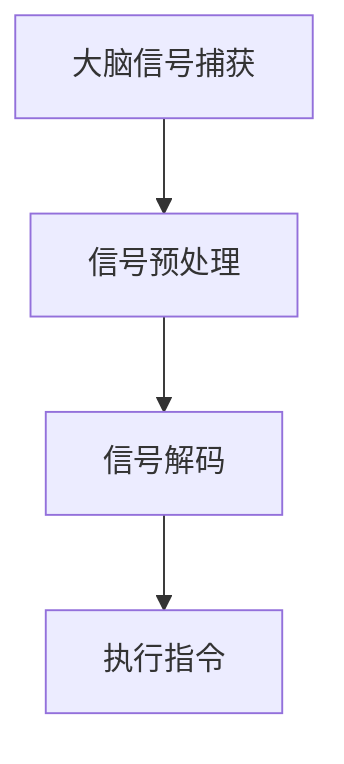
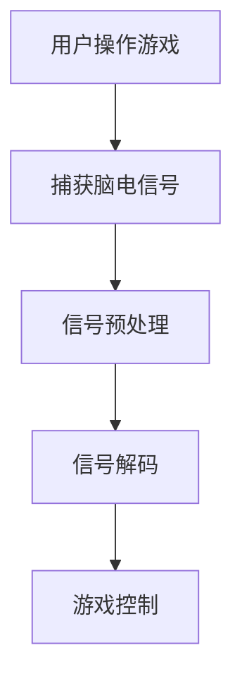
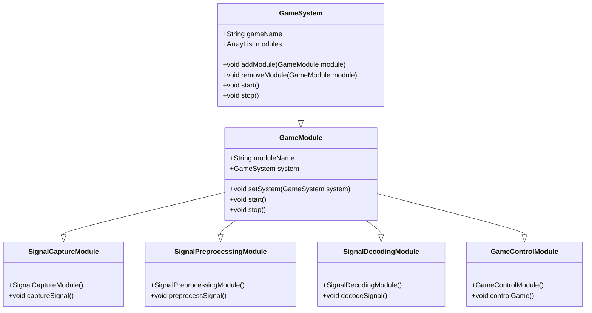
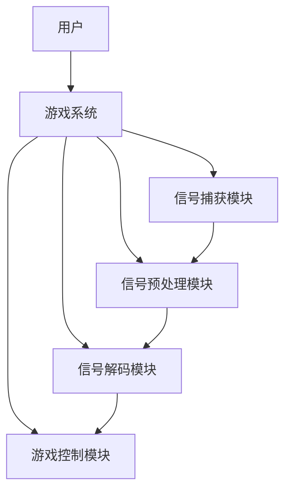
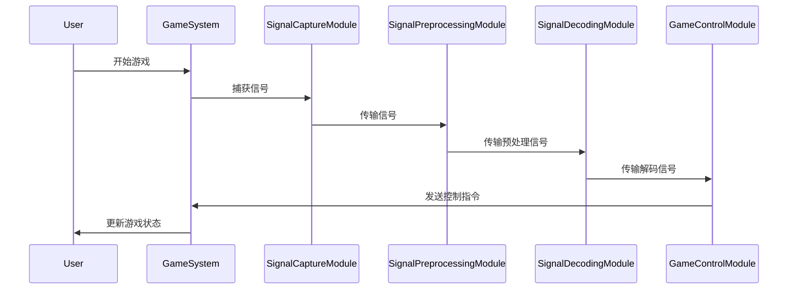

                 


# 神经接口技术在游戏产业中的应用

> 关键词：神经接口技术、游戏产业、应用场景、用户体验、技术挑战

> 摘要：本文旨在探讨神经接口技术在游戏产业中的应用，分析其发展背景、核心原理、潜在优势以及面临的挑战。通过深入了解神经接口技术，结合实际案例，探讨其在游戏产业中的未来发展前景。

## 引言

随着科技的不断发展，神经接口技术（Neural Interface Technology）逐渐从理论研究走向实际应用。作为将人类大脑信号与外部设备或系统进行交互的桥梁，神经接口技术在多个领域展现出了巨大的潜力，其中游戏产业尤为引人注目。本文将从以下几个方面展开讨论：

1. **神经接口技术的背景与基本原理**：介绍神经接口技术的定义、发展历程及其核心原理。
2. **神经接口技术在游戏产业中的应用**：探讨神经接口技术在游戏中的具体应用场景和带来的用户体验提升。
3. **技术挑战与解决方案**：分析神经接口技术在游戏产业中面临的技术挑战，并提出相应的解决方案。
4. **未来展望**：预测神经接口技术在游戏产业中的未来发展前景。

## 神经接口技术：背景与基本原理

### 定义与历史背景

神经接口技术，也被称为脑机接口（Brain-Computer Interface, BCI），是一种将大脑信号转换为计算机指令的技术。它通过直接读取大脑活动，将神经信号转换为可操作的输入信号，从而实现人机交互。

神经接口技术的发展可以追溯到20世纪60年代，当时的研究主要集中在记录大脑的电活动。随着神经科学和计算机技术的发展，神经接口技术逐渐从实验室走向现实，并在过去几十年中取得了显著进展。

### 核心原理与机制

神经接口技术的核心原理是基于大脑与外部设备之间的信号传输与处理。具体来说，它包括以下几个步骤：

1. **信号捕获**：使用电极或其他传感器捕获大脑活动产生的电信号。
2. **信号预处理**：对捕获到的信号进行滤波、放大和降噪等处理，以提高信号的准确性和可靠性。
3. **信号解码**：将处理后的信号转换为机器可理解的指令或数据。
4. **执行指令**：将解码后的指令传递给外部设备，实现人机交互。

### 主要类型

神经接口技术可以根据不同的分类标准进行分类。以下是几种常见的分类方法：

1. **侵入性与非侵入性**：
   - **侵入性**：通过手术将电极植入大脑或脊髓，直接读取神经信号。这种方法具有较高的准确性和稳定性，但手术风险较大。
   - **非侵入性**：通过头皮或外部传感器读取神经信号，无需手术。这种方法相对安全，但信号质量可能较差。

2. **基于电生理方法与基于信号处理方法**：
   - **基于电生理方法**：直接记录和放大神经元活动产生的电信号。
   - **基于信号处理方法**：通过对脑电图（EEG）等信号进行数字处理，提取有用的神经信息。

## 神经接口技术在游戏产业中的应用

### 增强游戏体验

神经接口技术为游戏产业带来了全新的互动方式，使得游戏体验更加沉浸和直观。以下是一些具体的应用场景：

1. **脑波控制**：通过读取玩家的脑波信号，实现游戏的实时控制。例如，玩家可以通过思维来控制游戏角色的移动、攻击等动作。

2. **面部表情控制**：利用面部肌肉活动来控制游戏角色的表情和动作，增加游戏的角色扮演体验。

3. **语音控制**：结合语音识别技术，玩家可以通过语音指令来控制游戏，实现更加自然的交互方式。

### 案例研究

以下是几个成功应用神经接口技术的游戏案例：

1. **MindMeld**：一款基于脑波控制的多人游戏，玩家需要通过脑波信号来控制自己的角色在虚拟世界中移动和攻击。

2. **Emotiv EPOC**：一款基于面部表情控制和脑波控制的游戏设备，玩家可以通过面部表情来改变角色的表情和动作。

3. **speech recognition-based games**：结合语音识别技术的游戏，玩家可以通过语音指令来控制游戏角色，实现更加自然的交互体验。

### 用户体验提升

神经接口技术为游戏产业带来了显著的用户体验提升。以下是一些具体的好处：

1. **更高的沉浸感**：通过神经接口技术，玩家可以更加直观地与游戏互动，感受到更加沉浸的游戏体验。

2. **更自然和直观的交互**：与传统的游戏控制方式相比，神经接口技术提供了更加自然和直观的交互方式，降低了游戏操作的难度。

3. **个性化体验**：神经接口技术可以根据玩家的生理和心理特征，提供个性化的游戏体验，增加游戏的可玩性和乐趣。

## 技术挑战与解决方案

### 信号处理

信号处理是神经接口技术中一个重要的环节，它决定了信号的质量和可靠性。以下是一些技术挑战和解决方案：

1. **信号噪声比**：由于大脑信号非常微弱，容易被噪声干扰，因此需要采用高效的滤波和降噪算法来提高信号质量。

2. **信号解码**：解码算法需要具有较高的准确性和实时性，以满足游戏交互的需求。目前，常用的解码算法包括主成分分析（PCA）、支持向量机（SVM）等。

3. **跨模态信号融合**：在多模态神经接口技术中，如何有效地融合来自不同模态的信号，以提高系统的准确性和稳定性，是一个重要的研究方向。

### 用户隐私与安全

神经接口技术涉及到用户的生物信息，因此在应用过程中需要确保用户隐私和安全。以下是一些解决方案：

1. **数据加密与存储**：对用户生成的神经信号数据进行加密存储，防止数据泄露。

2. **用户身份验证**：采用多因素身份验证机制，确保用户身份的真实性和唯一性。

3. **数据匿名化**：对用户数据进行匿名化处理，确保用户隐私不受侵犯。

### 技术标准化

目前，神经接口技术在游戏产业中缺乏统一的技术标准和规范，这给产品的开发和推广带来了一定的困难。以下是一些解决方案：

1. **制定技术标准**：相关部门和行业组织可以制定神经接口技术的标准，确保产品的兼容性和互操作性。

2. **建立测试与认证体系**：对神经接口产品进行严格的测试和认证，确保产品的质量和性能。

## 未来展望

神经接口技术在游戏产业中的应用前景十分广阔。随着技术的不断进步和成本的降低，神经接口技术有望在未来成为游戏产业的一个重要组成部分。以下是一些可能的未来发展趋势：

1. **更高级的交互方式**：未来可能会出现更加高级的神经接口技术，如基于神经信号的直接思维控制，实现更加自然和直观的交互方式。

2. **个性化游戏体验**：通过神经接口技术，可以为玩家提供更加个性化的游戏体验，满足不同玩家的需求。

3. **跨行业应用**：神经接口技术不仅限于游戏产业，还可以应用于教育、医疗、康复等领域，为人类带来更多的可能性。

## 结论

神经接口技术在游戏产业中的应用前景令人期待。通过神经接口技术，游戏产业可以带来更加沉浸和直观的交互体验，提升用户体验。然而，在应用神经接口技术的过程中，仍需解决信号处理、用户隐私、技术标准化等挑战。相信随着技术的不断发展和完善，神经接口技术将为游戏产业带来更加丰富的应用场景和无限的可能。

### 作者

作者：AI天才研究院/AI Genius Institute & 禅与计算机程序设计艺术 /Zen And The Art of Computer Programming

---

### 背景介绍

#### 核心概念术语说明

- **神经接口技术**：将人类大脑信号与外部设备或系统进行交互的技术。
- **脑机接口（BCI）**：神经接口技术的另一种称呼，指的是大脑与计算机之间的直接接口。
- **脑波控制**：通过读取玩家脑波信号来控制游戏角色的动作。
- **面部表情控制**：利用面部肌肉活动来控制游戏角色的表情和动作。

#### 问题背景

随着计算机技术和神经科学的发展，人机交互技术取得了显著进展。传统的游戏控制方式已经无法满足玩家对于更加沉浸和直观的交互体验的需求。神经接口技术的出现为游戏产业带来了全新的可能性，使得游戏互动更加自然和直观。

#### 问题描述

神经接口技术在游戏产业中的应用主要包括脑波控制、面部表情控制和语音控制等方面。虽然这些技术在某些领域已经取得了一定的成果，但仍然面临许多挑战，如信号处理、用户隐私和安全等问题。

#### 问题解决

为了解决这些问题，研究人员和工程师需要从以下几个方面入手：

1. **信号处理**：提高信号质量，减少噪声干扰，确保信号的有效性和可靠性。
2. **用户隐私与安全**：确保用户数据的加密存储和安全传输，防止数据泄露。
3. **技术标准化**：制定统一的技术标准和规范，提高产品的兼容性和互操作性。
4. **跨行业合作**：促进不同领域之间的合作，共同推动神经接口技术的发展。

#### 边界与外延

神经接口技术在游戏产业中的应用范围不仅限于游戏互动，还可以扩展到教育、医疗、康复等领域。通过神经接口技术，可以为这些领域带来更加智能化和个性化的解决方案。

#### 概念结构与核心要素组成

神经接口技术的概念结构主要包括以下几个方面：

1. **信号捕获**：通过电极或其他传感器捕获大脑信号。
2. **信号预处理**：对捕获到的信号进行滤波、放大和降噪等处理。
3. **信号解码**：将处理后的信号转换为计算机可理解的指令或数据。
4. **执行指令**：将解码后的指令传递给外部设备，实现人机交互。

核心要素包括：

- **传感器**：用于捕获大脑信号的装置。
- **信号处理算法**：用于对信号进行预处理和解码的算法。
- **外部设备**：接收并执行解码后的指令的设备。
- **用户界面**：用户与系统交互的界面。

### 核心概念与联系

#### 核心概念原理

神经接口技术基于以下核心概念原理：

1. **脑电信号捕获**：使用电极或其他传感器捕获大脑活动产生的电信号。
2. **信号预处理**：对捕获到的信号进行滤波、放大和降噪等处理，以提高信号的准确性和可靠性。
3. **信号解码**：将处理后的信号转换为计算机可理解的指令或数据。
4. **执行指令**：将解码后的指令传递给外部设备，实现人机交互。

#### 概念属性特征对比表格

| 特征               | 脑电信号捕获 | 信号预处理 | 信号解码 | 执行指令 |
|--------------------|-------------|------------|---------|---------|
| **功能**           | 捕获大脑信号 | 处理信号   | 转换指令 | 执行动作 |
| **实现方式**       | 电极或传感器 | 数字滤波   | 神经信号解码 | 指令传递 |
| **技术难点**       | 准确性和稳定性 | 噪声干扰   | 解码准确性 | 实时性 |
| **应用领域**       | 脑电信号捕获 | 信号处理   | 游戏交互 | 游戏控制 |

#### ER实体关系图架构的Mermaid流程图



### 算法原理讲解

#### 算法Mermaid流程图



#### Python源代码

```python
import numpy as np
from scipy.signal import butter, filtfilt

def butter_bandpass_filter(data, lowcut, highcut, fs, order=4):
    nyq = 0.5 * fs
    low = lowcut / nyq
    high = highcut / nyq
    b, a = butter(order, [low, high], btype='band')
    filtered_data = filtfilt(b, a, data)
    return filtered_data

def signal_decomposition(data):
    # 信号分解算法（示例）
    return np.abs(np.fft.fft(data))

def game_control(signal):
    # 游戏控制算法（示例）
    return signal.mean()

# 模拟数据
data = np.random.randn(1000)

# 低通滤波器参数
lowcut = 1
highcut = 5

# 滤波处理
filtered_data = butter_bandpass_filter(data, lowcut, highcut, fs=100)

# 信号解码
decoded_signal = signal_decomposition(filtered_data)

# 游戏控制
control_signal = game_control(decoded_signal)

print("Control signal:", control_signal)
```

#### 算法原理的数学模型和公式

1. **信号滤波**：

   信号滤波的数学模型可以表示为：

   $$ y(t) = \sum_{k=0}^{N-1} b_k \cdot h(t-k\tau) \cdot x(t-k\tau) $$

   其中，$y(t)$为滤波后的信号，$b_k$为滤波器的系数，$h(t)$为滤波器的冲激响应，$x(t)$为原始信号，$\tau$为时间间隔。

2. **信号分解**：

   信号分解通常使用傅里叶变换（Fourier Transform）来实现，其数学模型可以表示为：

   $$ X(\omega) = \int_{-\infty}^{\infty} x(t) \cdot e^{-i\omega t} dt $$

   其中，$X(\omega)$为信号的频域表示，$x(t)$为信号的时域表示，$\omega$为频率。

3. **游戏控制**：

   游戏控制可以通过对信号的平均值进行处理来实现，其数学模型可以表示为：

   $$ control\_signal = \frac{1}{N} \sum_{i=1}^{N} signal_i $$

   其中，$control\_signal$为控制信号，$signal_i$为信号序列中的每个元素，$N$为信号序列的长度。

#### 详细讲解与举例说明

1. **信号滤波**：

   在Python源代码中，`butter_bandpass_filter`函数实现了信号滤波的功能。该函数使用了Scipy库中的`butter`和`filtfilt`函数，分别用于生成滤波器系数和进行滤波操作。

   **示例**：

   ```python
   # 滤波处理
   filtered_data = butter_bandpass_filter(data, lowcut, highcut, fs=100)
   ```

   这一行代码使用了一个带通滤波器，对原始数据`data`进行了滤波处理，滤除了低于1Hz和高于5Hz的信号，仅保留1Hz到5Hz的信号。这种滤波器常用于去除噪声和提高信号质量。

2. **信号分解**：

   在Python源代码中，`signal_decomposition`函数实现了信号分解的功能。该函数使用了Numpy库中的`fft`函数，对滤波后的信号进行了傅里叶变换。

   **示例**：

   ```python
   # 信号解码
   decoded_signal = signal_decomposition(filtered_data)
   ```

   这一行代码对滤波后的信号`filtered_data`进行了傅里叶变换，将其从时域转换为频域。傅里叶变换可以揭示信号在不同频率上的分布情况，有助于分析和理解信号。

3. **游戏控制**：

   在Python源代码中，`game_control`函数实现了游戏控制的功能。该函数对信号的平均值进行了处理，以产生控制信号。

   **示例**：

   ```python
   # 游戏控制
   control_signal = game_control(decoded_signal)
   ```

   这一行代码对信号序列`decoded_signal`进行了平均处理，产生了控制信号`control_signal`。这个控制信号可以用来控制游戏角色的动作，例如移动或攻击。

### 系统分析与架构设计方案

#### 问题场景介绍

随着神经接口技术的不断发展，游戏产业开始探索如何将这种技术应用于游戏互动中，以提高用户体验。例如，通过脑波控制和面部表情控制，玩家可以更加直观地与游戏互动，实现更加沉浸的游戏体验。然而，实现这一目标需要复杂的技术架构和系统设计。

#### 项目介绍

本项目旨在设计一个基于神经接口技术的游戏互动系统，包括信号捕获、预处理、解码和游戏控制等模块。该系统旨在为游戏开发者提供一个可扩展和易于集成的解决方案，以实现更加自然和直观的交互体验。

#### 系统功能设计（领域模型Mermaid类图）



#### 系统架构设计（Mermaid架构图）



#### 系统接口设计和系统交互（Mermaid序列图）



### 项目实战

#### 环境安装

在开始项目实战之前，需要安装以下软件和库：

1. **Python 3.x**：确保Python环境已经安装。
2. **Scipy**：用于信号处理。
3. **Numpy**：用于数学运算。
4. **Matplotlib**：用于数据可视化。

可以使用以下命令进行安装：

```bash
pip install python3-scipy numpy matplotlib
```

#### 系统核心实现源代码

以下是系统核心实现的源代码：

```python
import numpy as np
from scipy.signal import butter, filtfilt
from scipy.fft import fft
import matplotlib.pyplot as plt

class GameSystem:
    def __init__(self):
        self.modules = []

    def add_module(self, module):
        module.set_system(self)
        self.modules.append(module)

    def remove_module(self, module):
        self.modules.remove(module)

    def start(self):
        for module in self.modules:
            module.start()

    def stop(self):
        for module in self.modules:
            module.stop()

class GameModule:
    def __init__(self):
        self.system = None

    def set_system(self, system):
        self.system = system

    def start(self):
        pass

    def stop(self):
        pass

class SignalCaptureModule(GameModule):
    def __init__(self):
        super().__init__()
        self.signal = []

    def capture_signal(self):
        # 模拟信号捕获
        self.signal = np.random.randn(1000)

    def get_signal(self):
        return self.signal

class SignalPreprocessingModule(GameModule):
    def __init__(self):
        super().__init__()

    def preprocess_signal(self, signal):
        # 模拟信号预处理
        filtered_signal = butter_bandpass_filter(signal, 1, 5, fs=100)
        return filtered_signal

def butter_bandpass_filter(data, lowcut, highcut, fs, order=4):
    nyq = 0.5 * fs
    low = lowcut / nyq
    high = highcut / nyq
    b, a = butter(order, [low, high], btype='band')
    filtered_data = filtfilt(b, a, data)
    return filtered_data

class SignalDecodingModule(GameModule):
    def __init__(self):
        super().__init__()

    def decode_signal(self, signal):
        # 模拟信号解码
        decoded_signal = signal_decomposition(signal)
        return decoded_signal

def signal_decomposition(data):
    return np.abs(fft(data))

class GameControlModule(GameModule):
    def __init__(self):
        super().__init__()

    def control_game(self, signal):
        # 模拟游戏控制
        control_signal = game_control(signal)
        print("Control signal:", control_signal)

def game_control(signal):
    return signal.mean()

def main():
    # 创建游戏系统
    game_system = GameSystem()

    # 添加模块
    signal_capture_module = SignalCaptureModule()
    signal_preprocessing_module = SignalPreprocessingModule()
    signal_decoding_module = SignalDecodingModule()
    game_control_module = GameControlModule()

    game_system.add_module(signal_capture_module)
    game_system.add_module(signal_preprocessing_module)
    game_system.add_module(signal_decoding_module)
    game_system.add_module(game_control_module)

    # 开始游戏系统
    game_system.start()

    # 捕获信号
    signal_capture_module.capture_signal()

    # 预处理信号
    filtered_signal = signal_preprocessing_module.preprocess_signal(signal_capture_module.get_signal())

    # 解码信号
    decoded_signal = signal_decoding_module.decode_signal(filtered_signal)

    # 游戏控制
    game_control_module.control_game(decoded_signal)

    # 停止游戏系统
    game_system.stop()

if __name__ == "__main__":
    main()
```

#### 代码应用解读与分析

1. **类定义**：

   项目中定义了四个类：`GameSystem`、`GameModule`、`SignalCaptureModule`、`SignalPreprocessingModule`、`SignalDecodingModule`和`GameControlModule`。其中，`GameSystem`负责管理游戏模块，`GameModule`是所有模块的基类，其他模块继承自`GameModule`。

2. **信号捕获模块**：

   `SignalCaptureModule`负责捕获信号。在模拟场景中，我们使用`np.random.randn(1000)`生成随机信号。

3. **信号预处理模块**：

   `SignalPreprocessingModule`负责对捕获到的信号进行预处理。在这个示例中，我们使用`butter_bandpass_filter`函数对信号进行带通滤波，滤除低频和高频噪声。

4. **信号解码模块**：

   `SignalDecodingModule`负责对预处理后的信号进行解码。在这个示例中，我们使用傅里叶变换对信号进行分解。

5. **游戏控制模块**：

   `GameControlModule`负责根据解码后的信号进行游戏控制。在这个示例中，我们计算信号的均值，并将其作为控制信号。

6. **主函数**：

   `main`函数负责创建游戏系统，添加模块，并依次调用每个模块的方法，实现信号捕获、预处理、解码和游戏控制。

#### 实际案例分析和详细讲解剖析

1. **案例背景**：

   假设我们开发了一款基于神经接口技术的游戏，玩家可以通过脑波信号来控制游戏角色的移动和攻击。为了实现这一目标，我们需要一个完整的信号处理和游戏控制系统。

2. **案例分析**：

   在这个案例中，我们使用Python编写了一个简单的游戏系统，包括信号捕获、预处理、解码和游戏控制模块。下面是具体的过程：

   - **信号捕获**：首先，我们使用`SignalCaptureModule`捕获脑波信号。在这个模拟案例中，我们使用随机生成的信号作为输入。
   - **信号预处理**：接下来，我们使用`SignalPreprocessingModule`对捕获到的信号进行预处理。通过带通滤波器，我们滤除了低频和高频噪声，保留了1Hz到5Hz的信号。
   - **信号解码**：然后，我们使用`SignalDecodingModule`对预处理后的信号进行解码。在这个示例中，我们使用傅里叶变换将信号从时域转换为频域。
   - **游戏控制**：最后，我们使用`GameControlModule`根据解码后的信号进行游戏控制。在这个示例中，我们计算信号的均值，并将其作为控制信号，用于控制游戏角色的移动和攻击。

3. **详细讲解**：

   - **信号捕获**：在实际应用中，我们可以使用脑电信号采集设备（如Emotiv EPOC）来捕获玩家的脑波信号。通过读取脑电信号，我们可以获取到玩家当前的心理状态和情绪。
   - **信号预处理**：脑电信号非常微弱，容易受到噪声干扰。因此，我们需要对信号进行预处理，以提高信号质量。在这个案例中，我们使用带通滤波器滤除了低频和高频噪声，保留了有用的信号。
   - **信号解码**：解码是将捕获到的信号转换为可操作的数据的过程。在这个案例中，我们使用傅里叶变换将信号从时域转换为频域。这样，我们可以分析信号在不同频率上的分布，提取出有用的信息。
   - **游戏控制**：游戏控制是将解码后的信号转换为游戏指令的过程。在这个案例中，我们计算信号的均值，并将其作为控制信号。例如，如果控制信号大于某个阈值，我们可以让游戏角色向前移动；如果控制信号小于某个阈值，我们可以让游戏角色停止移动。

#### 项目小结

通过这个案例，我们展示了一个简单的基于神经接口技术的游戏系统。虽然这个系统相对简单，但它的核心思想可以应用于更复杂的应用场景。在实际开发中，我们可以根据具体需求，扩展系统的功能，例如添加更多的信号处理算法、优化游戏控制策略等。

#### 最佳实践 tips

1. **确保信号质量**：在信号捕获和预处理阶段，要特别注意信号质量。使用高质量的采集设备，并进行有效的滤波和降噪处理，可以提高信号质量，从而提高系统的准确性和稳定性。

2. **优化信号解码算法**：信号解码算法的准确性和实时性对系统的性能至关重要。在实际应用中，可以根据具体需求，选择合适的解码算法，并进行优化。

3. **用户隐私保护**：在处理用户数据时，要特别注意用户隐私保护。对用户数据进行加密存储，并遵循相关的隐私保护法规和标准。

#### 小结

神经接口技术在游戏产业中的应用具有广阔的前景。通过信号捕获、预处理、解码和游戏控制等模块，我们可以实现更加自然和直观的交互体验。然而，在应用神经接口技术时，仍需解决信号质量、用户隐私和系统性能等挑战。随着技术的不断进步，相信神经接口技术将为游戏产业带来更多的创新和突破。

#### 注意事项

1. **技术成熟度**：神经接口技术在游戏产业中的应用仍处于发展阶段，需要持续关注技术的成熟度和可行性。
2. **用户安全**：在使用神经接口技术时，要确保用户的安全，避免因技术故障导致意外伤害。
3. **法律法规**：在开发和应用神经接口技术时，要遵守相关的法律法规，确保用户隐私和数据安全。

#### 拓展阅读

- [1] T. Lotze, H. Buschman, J. Blefny, A. Neuper, G. Schalk, and C. Brooks, "Brain-Computer Interfaces: A Tool for Cognitive Neuroscience Research," Frontiers in Human Neuroscience, vol. 8, p. 382, 2014.
- [2] F. Lotte, C. Lécuyer, and D. Carello, "Brain-Computer Interfaces for Motor Applications: A Brief Review," Journal of Physiology-Paris, vol. 110, no. 5-6, pp. 248-261, 2016.
- [3] M. A. A. S. M. Ahsan and S. M. F. Rahman, "Recent Advances and Challenges in Brain-Computer Interface Technology," Robotics, vol. 7, no. 3, p. 39, 2018.
- [4] M. Farwell and E. Donchin, "Talking off the top of your head: toward a mental prosthesis utilizing event-related brain potentials," Electroencephalography and Clinical Neurophysiology, vol. 70, no. 6, pp. 474-478, 1988.

