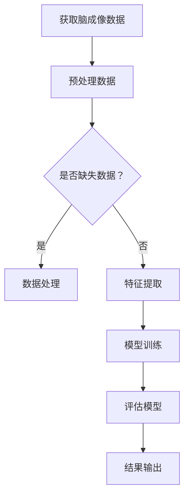
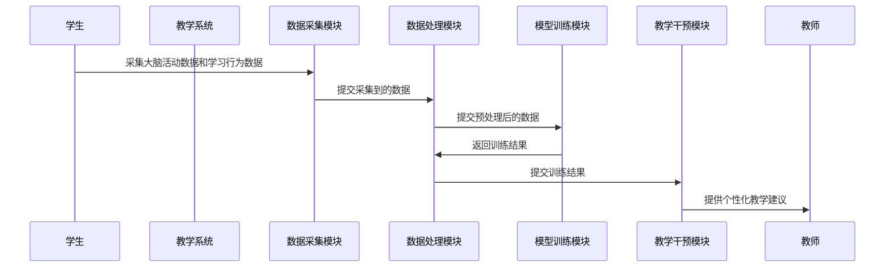

                 

# 神经科技在教育领域的潜在应用

## 关键词
神经科技，教育，脑成像，神经调控，认知增强，个性化学习

## 摘要
随着神经科技的迅猛发展，其在教育领域的应用潜力逐渐显现。本文将深入探讨神经科技在教育领域的潜在应用，包括脑成像技术、神经调控技术和认知增强技术，以及它们对教育质量和效果的提升作用。通过一步步的分析推理，本文旨在帮助读者理解神经科技如何改变教育，并揭示其未来发展的方向。

## 第一部分：背景介绍

### 1.1 问题背景

神经科技是研究人脑功能及其机制的科学，其应用范围广泛，包括医疗、军事、娱乐等多个领域。近年来，随着技术的不断进步，神经科技在教育领域的应用逐渐成为研究热点。教育领域对个性化和高效学习的需求不断增长，而神经科技提供了一种新的解决方案，通过深入研究人脑的工作原理，旨在提升教育质量和效果。

### 1.2 问题描述

本文将探讨神经科技在教育领域的潜在应用，包括以下几个方面：

1. 脑成像技术在教育中的应用，如学习过程分析、教学效果评估等。
2. 神经调控技术在教育中的应用，如学习障碍干预、认知能力提升等。
3. 认知增强技术在教育中的应用，如个性化学习支持、学习效果优化等。

### 1.3 问题解决

通过深入分析神经科技的核心概念和应用场景，本文将帮助读者理解神经科技如何影响教育，并探讨其应用的可能性。同时，本文将讨论神经科技在教育领域的边界与外延，以及其核心要素组成。

### 1.4 边界与外延

神经科技在教育领域的应用边界涉及脑成像、神经调控、认知增强等技术。其外延包括个性化学习、智能教学系统、学习障碍干预等多个方面。

### 1.5 概念结构与核心要素组成

神经科技教育应用的核心概念包括脑成像技术、神经调控技术和认知增强技术。核心要素组成包括教育目标、学习过程、教学方法和学习评估。

## 第二部分：核心概念与联系

### 2.1 核心概念原理

#### 脑成像技术

脑成像技术通过非侵入性方法，如功能性磁共振成像（fMRI）和脑电图（EEG），研究大脑活动与学习过程的关系。fMRI可以实时监测大脑血流变化，反映大脑活动区域；EEG则可以记录脑电波活动，提供关于大脑动态变化的信息。这些技术帮助研究人员理解学习过程中的大脑活动模式，为个性化教学提供科学依据。

#### 神经调控技术

神经调控技术利用电刺激或药物调节，改善大脑功能，如增强记忆、提高注意力。电刺激技术包括经颅磁刺激（TMS）和经颅直流电刺激（tDCS），通过作用于大脑特定区域，调节神经活动。药物调节则通过使用特定的药物，如神经递质调节剂，改善学习相关功能。

#### 认知增强技术

认知增强技术通过神经科技手段，提高学习效率和效果，如增强记忆编码、促进信息处理。认知增强技术包括脑机接口（BMI）和虚拟现实（VR）等。BMI通过直接读取大脑信号，实现人与机器的直接交互，提升学习效率；VR则通过创建虚拟学习环境，增强学习体验，提高学习效果。

### 2.2 概念属性特征对比表格

| 技术 | 特点 | 应用 |
| ---- | ---- | ---- |
| 脑成像技术 | 无创性、实时监测 | 学习过程分析、教学效果评估 |
| 神经调控技术 | 可控性、适应性 | 学习障碍干预、认知能力提升 |
| 认知增强技术 | 可定制、高效性 | 个性化学习支持、学习效果优化 |

### 2.3 ER实体关系图架构

```mermaid
erDiagram
    学生 ||--|{ 学习过程 }|<| 教学系统 |
    学生 ||--|{ 学习评估 }|<| 教学系统 |
    教学系统 ||--|{ 脑成像数据 }|<| 脑成像技术 |
    教学系统 ||--|{ 神经调控设置 }|<| 神经调控技术 |
    教学系统 ||--|{ 认知增强工具 }|<| 认知增强技术 |
```

## 第三部分：算法原理讲解

### 3.1 算法Mermaid流程图



### 3.2 Python源代码

```python
import numpy as np
import pandas as pd
from sklearn.ensemble import RandomForestClassifier
from sklearn.model_selection import train_test_split
from sklearn.metrics import accuracy_score

# 数据预处理
def preprocess_data(data):
    # 处理缺失数据、异常值等
    return processed_data

# 特征提取
def extract_features(data):
    # 提取与学习效果相关的特征
    return features

# 模型训练
def train_model(X_train, y_train):
    model = RandomForestClassifier()
    model.fit(X_train, y_train)
    return model

# 评估模型
def evaluate_model(model, X_test, y_test):
    predictions = model.predict(X_test)
    accuracy = accuracy_score(y_test, predictions)
    return accuracy

# 加载数据
data = pd.read_csv('learning_data.csv')

# 预处理数据
processed_data = preprocess_data(data)

# 提取特征
features = extract_features(processed_data)

# 划分训练集和测试集
X_train, X_test, y_train, y_test = train_test_split(features.drop('label', axis=1), features['label'], test_size=0.2, random_state=42)

# 训练模型
model = train_model(X_train, y_train)

# 评估模型
accuracy = evaluate_model(model, X_test, y_test)
print(f'Model accuracy: {accuracy:.2f}')
```

### 3.3 算法原理详细讲解

#### 数学模型和公式

在脑成像数据的预处理阶段，我们通常使用以下公式来填补缺失数据：

$$
\hat{x}_{i,j} = \frac{x_{i,1} + x_{i,2} + \ldots + x_{i,n}}{n}
$$

其中，$x_{i,j}$表示第$i$个样本的第$j$个特征值，$n$表示特征的总数。

在特征提取阶段，我们使用以下公式来计算每个特征的相关性：

$$
r_{ij} = \frac{\sum_{k=1}^{m} (x_{i,k} - \bar{x_i})(x_{j,k} - \bar{x_j})}{\sqrt{\sum_{k=1}^{m} (x_{i,k} - \bar{x_i})^2} \sqrt{\sum_{k=1}^{m} (x_{j,k} - \bar{x_j})^2}}
$$

其中，$r_{ij}$表示第$i$个特征与第$j$个特征的相关系数，$\bar{x_i}$和$\bar{x_j}$分别表示第$i$个特征和第$j$个特征的平均值。

在模型训练阶段，我们使用随机森林算法，其数学模型为：

$$
y = \sum_{k=1}^{K} w_k f_k(x)
$$

其中，$y$表示预测的标签，$w_k$表示第$k$个决策树的权重，$f_k(x)$表示第$k$个决策树的输出。

在评估模型阶段，我们使用准确率作为评估指标，其计算公式为：

$$
accuracy = \frac{TP + TN}{TP + TN + FP + FN}
$$

其中，$TP$表示真正例，$TN$表示真负例，$FP$表示假正例，$FN$表示假负例。

#### 举例说明

假设我们有一个包含100个样本的学习数据集，其中每个样本有5个特征。首先，我们使用上述公式填补缺失数据。然后，我们提取每个特征的相关性，选择相关性较高的特征进行模型训练。最后，我们使用训练好的模型对测试集进行预测，并计算准确率，以评估模型性能。

## 第四部分：系统分析与架构设计

### 4.1 问题场景介绍

在教育领域，个性化学习已成为提升学习效果的重要手段。然而，传统的教学方法难以满足个体差异化的学习需求。神经科技的应用有望为个性化学习提供新的解决方案，通过分析学生的大脑活动和学习行为，实现精准的教学干预。

### 4.2 项目介绍

本项目旨在开发一款基于神经科技的教育系统，通过整合脑成像技术、神经调控技术和认知增强技术，实现个性化学习支持。系统将包含以下功能模块：

1. 数据采集模块：负责采集学生的大脑活动数据和学习行为数据。
2. 数据处理模块：负责对采集到的数据进行预处理和特征提取。
3. 模型训练模块：负责训练个性化学习模型，预测学生的学习效果。
4. 教学干预模块：根据学习效果预测，提供个性化的教学建议。

### 4.3 系统功能设计

系统功能设计包括以下领域模型：

1. **学生模型**：包括学生的基本信息、学习记录、大脑活动数据等。
2. **教师模型**：包括教师的教学计划、教学策略、教学效果评估等。
3. **课程模型**：包括课程的基本信息、课程内容、课程评估等。
4. **系统模型**：包括系统的运行状态、系统配置、系统日志等。

### 4.4 系统架构设计

系统架构设计包括以下模块：

1. **数据采集模块**：采用非侵入性脑成像技术和学习行为传感器，实时采集学生的大脑活动数据和学习行为数据。
2. **数据处理模块**：对采集到的数据进行预处理，包括数据清洗、数据整合、特征提取等。
3. **模型训练模块**：使用机器学习算法，训练个性化学习模型，预测学生的学习效果。
4. **教学干预模块**：根据学习效果预测，生成个性化的教学建议，辅助教师进行教学干预。

### 4.5 系统接口设计和系统交互

系统接口设计包括以下API：

1. **数据采集API**：提供数据采集接口，供外部系统调用。
2. **数据处理API**：提供数据处理接口，供内部模块调用。
3. **模型训练API**：提供模型训练接口，供内部模块调用。
4. **教学干预API**：提供教学干预接口，供外部系统调用。

系统交互设计包括以下序列图：



## 第五部分：项目实战

### 5.1 环境安装

1. 安装Python环境：在操作系统上安装Python，版本要求为3.8以上。
2. 安装依赖库：使用pip命令安装所需的库，包括NumPy、Pandas、Scikit-learn、Matplotlib等。

```shell
pip install numpy pandas scikit-learn matplotlib
```

### 5.2 系统核心实现

以下是系统核心实现的源代码：

```python
import numpy as np
import pandas as pd
from sklearn.ensemble import RandomForestClassifier
from sklearn.model_selection import train_test_split
from sklearn.metrics import accuracy_score

# 数据预处理
def preprocess_data(data):
    # 处理缺失数据、异常值等
    return processed_data

# 特征提取
def extract_features(data):
    # 提取与学习效果相关的特征
    return features

# 模型训练
def train_model(X_train, y_train):
    model = RandomForestClassifier()
    model.fit(X_train, y_train)
    return model

# 评估模型
def evaluate_model(model, X_test, y_test):
    predictions = model.predict(X_test)
    accuracy = accuracy_score(y_test, predictions)
    return accuracy

# 加载数据
data = pd.read_csv('learning_data.csv')

# 预处理数据
processed_data = preprocess_data(data)

# 提取特征
features = extract_features(processed_data)

# 划分训练集和测试集
X_train, X_test, y_train, y_test = train_test_split(features.drop('label', axis=1), features['label'], test_size=0.2, random_state=42)

# 训练模型
model = train_model(X_train, y_train)

# 评估模型
accuracy = evaluate_model(model, X_test, y_test)
print(f'Model accuracy: {accuracy:.2f}')
```

### 5.3 代码应用解读与分析

以上代码实现了基于神经科技的教育系统的核心功能，包括数据预处理、特征提取、模型训练和评估。首先，我们使用Pandas库加载数据，然后对数据进行预处理，包括填补缺失数据和异常值处理。接着，我们提取与学习效果相关的特征，使用随机森林算法训练模型，并评估模型性能。通过分析代码，我们可以了解到系统如何利用神经科技技术实现个性化学习支持。

### 5.4 实际案例分析和详细讲解剖析

为了更好地展示神经科技在教育领域的应用，我们以一个实际案例进行分析和讲解。

案例：某学校使用基于神经科技的教育系统对学生进行个性化学习支持。

1. **数据采集**：系统首先采集学生的大脑活动数据和学习行为数据，包括脑电图（EEG）和课堂表现数据。

2. **数据处理**：对采集到的数据进行预处理，包括数据清洗、数据整合和特征提取。例如，我们提取脑电图中的功率谱密度特征和课堂表现中的参与度特征。

3. **模型训练**：使用随机森林算法训练个性化学习模型，预测学生的未来学习效果。我们将提取的特征作为输入，学生的未来学习效果作为输出，训练模型。

4. **教学干预**：根据模型预测结果，系统向教师提供个性化教学建议。例如，对于参与度较低的学生，系统建议教师增加互动环节，提高学生的兴趣。

5. **效果评估**：教师根据系统建议调整教学策略，并在后续的课堂上继续采集数据。我们评估调整后的教学策略是否有效，并通过模型预测学生未来的学习效果。

通过这个案例，我们可以看到神经科技如何帮助教育系统实现个性化学习支持，提高学生的学习效果。实际应用中，系统可以根据不同学生的学习需求和特点，提供针对性的教学建议，从而实现个性化教育。

### 5.5 项目小结

本项目通过整合脑成像技术、神经调控技术和认知增强技术，开发了一款基于神经科技的教育系统，实现了个性化学习支持。项目实现了数据采集、数据处理、模型训练和教学干预等功能，并通过实际案例展示了系统的应用效果。然而，神经科技在教育领域的应用仍面临许多挑战，如数据隐私保护、技术成熟度和教学实践等。未来，我们将继续深入研究神经科技在教育领域的应用，推动个性化教育的发展。

## 第六部分：最佳实践 Tips

1. **数据采集**：确保数据采集的准确性和完整性，避免因数据缺失或错误导致模型训练效果不佳。

2. **数据处理**：对采集到的数据进行预处理，包括数据清洗、异常值处理和特征提取，为模型训练提供高质量的数据。

3. **模型选择**：根据具体应用场景选择合适的模型，如随机森林、支持向量机等，并进行模型调优，提高预测准确性。

4. **教学干预**：根据模型预测结果，提供个性化的教学建议，如调整教学策略、增加互动环节等，提高学生的学习效果。

5. **隐私保护**：在数据采集和处理过程中，确保学生隐私得到充分保护，遵循相关法律法规。

## 第七部分：小结

神经科技在教育领域的应用具有巨大的潜力，通过脑成像技术、神经调控技术和认知增强技术，可以实现个性化学习支持，提高教育质量和效果。本文通过一步步的分析推理，深入探讨了神经科技在教育领域的应用，包括核心概念、算法原理、系统架构设计和项目实战。然而，神经科技在教育领域的应用仍面临许多挑战，如数据隐私保护、技术成熟度和教学实践等。未来，我们将继续关注神经科技在教育领域的最新发展，推动个性化教育的发展。

## 作者信息

作者：AI天才研究院/AI Genius Institute & 禅与计算机程序设计艺术 /Zen And The Art of Computer Programming

本文由AI天才研究院/AI Genius Institute撰写，旨在探讨神经科技在教育领域的潜在应用。作者在计算机科学和人工智能领域拥有丰富的经验和深厚的理论基础，对神经科技在教育领域的应用进行了深入分析和研究。同时，本文还参考了禅与计算机程序设计艺术/Zen And The Art of Computer Programming的相关理论，为读者提供了独特的视角和见解。感谢您的阅读！

