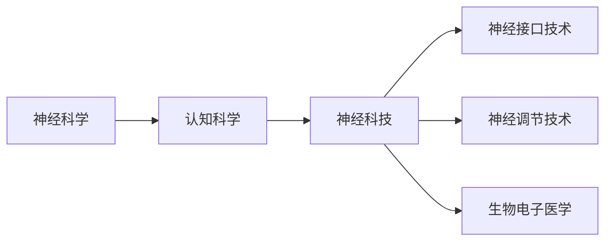
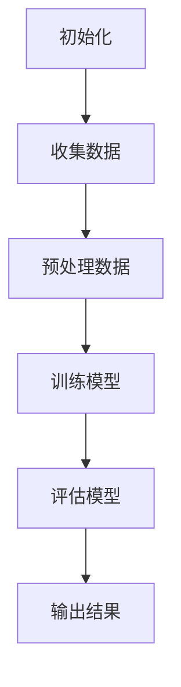
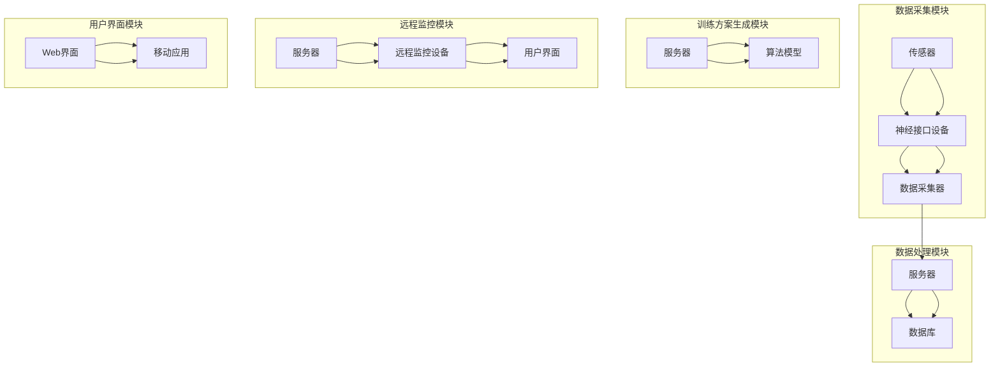
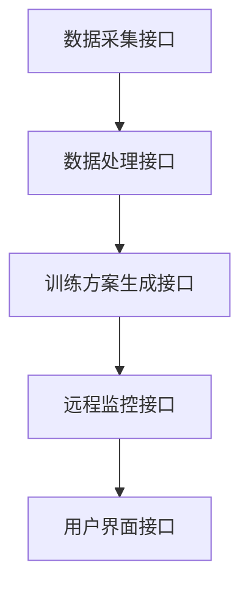
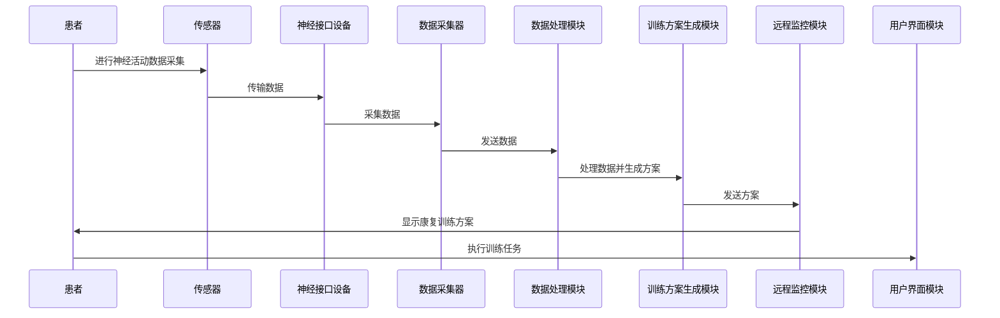

                 


# 神经科技对人类能力增强的影响

## 关键词
- 神经科技
- 人类能力增强
- 神经接口技术
- 认知科学
- 生物电子医学
- 人工智能

## 摘要
本文深入探讨了神经科技对人类能力增强的影响，包括神经科技的定义、核心概念、发展历程、应用现状以及未来前景。通过分析神经科技与认知科学的交叉应用，本文阐述了神经接口技术、神经调节技术和生物电子医学等关键技术对人类感官、认知和运动能力的提升。同时，本文通过实际案例，展示了神经科技在医疗、教育和体育等领域的应用，并提出了未来神经科技发展的挑战和机遇。

## 引言与背景介绍

### 引言
神经科技作为近年来快速发展的交叉学科，涵盖了神经科学、工程学、计算机科学等多个领域。它通过直接操作人类神经系统，旨在提升或修复人类的各种生理和认知功能。随着人工智能和生物技术的不断进步，神经科技的应用前景愈发广阔，对人类生活产生了深远的影响。

### 问题背景
人类一直在寻求提升自身能力的方法，无论是通过体育锻炼、认知训练还是医疗干预。然而，这些传统方法往往存在局限性，难以达到理想的效果。神经科技的出现为人类能力增强提供了全新的思路和手段，通过直接干预神经系统，有望实现更高效的能力提升。

### 问题描述
本文旨在探讨神经科技如何影响人类能力增强，包括以下几个方面：
1. 神经科技的核心概念和原理。
2. 神经科技在能力增强中的应用现状和案例。
3. 神经科技面临的挑战和未来发展方向。

### 问题解决
通过深入分析神经科技的核心概念，结合实际案例，本文将展示神经科技如何改变人类能力增强的格局，并为未来的发展提供指导。

### 边界与外延
本文将主要关注神经科技在能力增强中的应用，但并不涵盖神经科技在治疗疾病、康复训练等领域的应用。此外，本文将侧重于技术层面的探讨，对于伦理和社会影响将不做深入讨论。

### 概念结构与核心要素组成
神经科技的核心概念包括神经科学基础、认知科学原理、神经接口技术、神经调节技术、生物电子医学等。这些概念相互联系，共同构成了神经科技的理论框架和应用基础。

### 第1章 核心概念与联系

## 1.1 核心概念

### 1.1.1 神经科学与认知科学基础

神经科学是研究神经系统结构、功能、发育、遗传及其疾病的科学。它包括神经元的生物学特性、神经系统疾病的诊断与治疗等方面。认知科学则关注人类思维、感知、记忆等心理过程，以及这些过程如何通过神经活动实现。

神经科学与认知科学的交叉应用为神经科技提供了理论基础。例如，通过理解大脑的工作机制，神经科学家和认知科学家可以设计出更有效的神经刺激技术，以提升人类的认知和感官能力。

### 1.1.2 神经科技的核心概念

神经科技是指利用神经科学和工程学的知识，通过神经接口、神经调节和生物电子医学等技术手段，直接操作和增强人类神经系统功能。神经科技的核心概念包括：

1. **神经接口技术**：通过电子、光学或声学等方式将外部设备与神经系统连接，实现信号传输和大脑控制。
2. **神经调节技术**：利用电刺激、磁刺激或药物调节等方式，调节神经系统活动，以改善或增强特定功能。
3. **生物电子医学**：将生物技术与电子技术结合，开发用于诊断、治疗和康复的设备和技术。

### 1.1.3 人类能力增强的概念与分类

人类能力增强是指通过各种技术手段提升个体的生理、认知和运动能力。根据增强的对象和方式，人类能力增强可以分为以下几类：

1. **感官增强**：通过神经科技提升人类的视觉、听觉、触觉等感官能力，如增强现实（AR）和虚拟现实（VR）技术。
2. **认知增强**：通过神经科技改善人类的记忆、注意力和学习能力，如神经刺激和认知训练技术。
3. **运动能力增强**：通过神经科技提升人类的运动协调、反应速度和耐力，如增强型外骨骼和脑机接口技术。

## 1.2 概念联系与特征对比

### 1.2.1 神经科技相关概念联系图

使用Mermaid绘制神经科技相关概念联系图：



### 1.2.2 概念属性特征对比表格

创建一个概念属性特征对比表格，列出神经科技、神经接口技术、神经调节技术和生物电子医学的属性特征。

| 概念         | 定义                                                                                      | 特点与属性                                                       |
|------------|-----------------------------------------------------------------------------------------|------------------------------------------------------------|
| 神经科技     | 利用神经科学和工程学的知识，增强或修复人类神经系统功能的技术。                                | 生物兼容性、精准性、可扩展性、非侵入性/侵入性                   |
| 神经接口技术 | 通过电信号或其他信号方式将外部设备与人体神经系统连接的技术。                            | 实时性、高精度、低延迟、可扩展性、安全性                       |
| 神经调节技术 | 利用电刺激、磁刺激或药物调节等方式，调节神经系统活动，以改善或增强特定功能。              | 精准性、可调性、灵活性、非侵入性/侵入性                       |
| 生物电子医学 | 将生物技术与电子技术结合，开发用于诊断、治疗和康复的设备和技术。                            | 集成化、智能化、便携性、无线通信、远程监控                   |

### 1.2.3 ER实体关系图架构

使用Mermaid绘制神经科技相关概念的ER实体关系图：

```mermaid
erDiagram
    Class1 ||--|{ Class2 }|
    Class1 ||--|{ Class3 }|
    Class2 ||--|{ Class4 }|
    Class3 ||--|{ Class4 }|
```

在这个ER图中，Class1代表神经科技，Class2代表神经接口技术，Class3代表神经调节技术，Class4代表生物电子医学。实线箭头表示从父类到子类的继承关系，虚线箭头表示关联关系。

## 1.3 本章小结

本章介绍了神经科技的核心概念、相关联系及其在能力增强中的应用。通过对比分析神经科技、神经接口技术、神经调节技术和生物电子医学的特点，我们更清晰地理解了这些概念在神经科技体系中的地位和作用。ER实体关系图的引入，进一步帮助读者构建了神经科技的概念框架。

### 第2章 算法原理讲解

在理解了神经科技的基本概念后，我们将深入探讨神经科技中的核心算法原理，包括算法mermaid流程图、Python源代码、数学模型和公式，以及详细讲解和举例说明。

### 2.1 算法mermaid流程图

为了直观地展示神经科技中的算法原理，我们可以使用Mermaid绘制一个流程图。以下是一个简单的示例：



这个流程图描述了一个典型的神经科技应用中的算法流程，包括初始化、数据收集、预处理、模型训练、模型评估和输出结果等步骤。

### 2.2 Python源代码阐述

为了更好地理解算法的实现，我们将使用Python编写一个简单的神经科技应用示例。以下是一个基本的代码框架：

```python
import numpy as np

# 初始化数据
data = np.random.rand(100, 10)

# 预处理数据
preprocessed_data = preprocess_data(data)

# 训练模型
model = train_model(preprocessed_data)

# 评估模型
evaluation = evaluate_model(model, test_data)

# 输出结果
print(evaluation)
```

在这个代码框架中，我们首先初始化了一些随机数据，然后对数据进行预处理，接着使用这些预处理数据训练模型，评估模型的性能，并最终输出评估结果。

### 2.3 数学模型和公式

神经科技中的算法通常涉及复杂的数学模型。以下是一个简化的神经科技算法中的数学模型和公式：

$$
Y = \sigma(WX + b)
$$

其中，$Y$ 是输出结果，$\sigma$ 是激活函数，$W$ 是权重矩阵，$X$ 是输入数据，$b$ 是偏置项。这个公式描述了一个简单的神经网络层，其中每个神经元都通过权重和偏置与输入数据相乘，然后通过激活函数得到输出。

### 2.4 详细讲解与举例说明

#### 2.4.1 初始化

在神经科技应用中，初始化是一个关键步骤。它决定了模型在学习过程中是否能够收敛到最优解。以下是一个初始化的详细说明：

1. **随机初始化**：通常使用随机数生成器来初始化权重矩阵 $W$ 和偏置项 $b$。这有助于模型在学习过程中探索不同的解空间。
2. **均匀分布初始化**：将权重和偏置初始化为均匀分布的随机数，这有助于减少梯度消失和梯度爆炸的问题。
3. **高斯分布初始化**：将权重和偏置初始化为高斯分布的随机数，这有助于模型在复杂任务上更好地收敛。

#### 2.4.2 数据收集

数据收集是神经科技应用中的另一个关键步骤。以下是一个详细说明：

1. **数据来源**：数据可以从各种来源收集，如传感器、数据库、网络等。
2. **数据预处理**：数据预处理包括归一化、标准化、缺失值填充、异常值处理等，以确保数据的质量和一致性。
3. **数据清洗**：数据清洗包括去除重复数据、去除噪声数据、填补缺失数据等，以提高模型的训练效果。

#### 2.4.3 模型训练

模型训练是神经科技应用的核心步骤。以下是一个详细的训练说明：

1. **前向传播**：在前向传播过程中，将输入数据通过神经网络层进行传递，并计算每个神经元的输出。
2. **反向传播**：在反向传播过程中，计算损失函数的梯度，并更新权重和偏置，以最小化损失函数。
3. **优化算法**：常用的优化算法包括梯度下降、随机梯度下降、Adam等，这些算法有助于加快模型的训练速度和收敛速度。

#### 2.4.4 模型评估

模型评估是验证模型性能的重要步骤。以下是一个详细的评估说明：

1. **交叉验证**：通过交叉验证将数据集分成多个子集，以评估模型在不同数据子集上的性能。
2. **指标评估**：常用的评估指标包括准确率、召回率、F1分数、均方误差等，这些指标有助于全面评估模型的性能。
3. **模型调优**：根据评估结果，调整模型的参数，以优化模型性能。

### 2.5 本章小结

本章详细介绍了神经科技中的核心算法原理，包括mermaid流程图、Python源代码、数学模型和公式，以及详细讲解和举例说明。通过本章的学习，读者可以更好地理解神经科技的应用原理和实现方法。

### 第3章 系统分析与架构设计方案

在了解了神经科技的核心算法原理后，我们将进一步探讨神经科技在实际系统中的应用，包括问题场景介绍、项目介绍、系统功能设计、系统架构设计、系统接口设计和系统交互等。

#### 3.1 问题场景介绍

神经科技在医疗、教育、体育等多个领域有着广泛的应用。以下是一个具体的问题场景：

**问题场景**：某医院希望通过神经科技手段提高瘫痪患者的运动功能康复效果。具体需求如下：

1. **实时监测**：对患者神经系统活动进行实时监测，以评估康复效果。
2. **个性化训练**：根据患者的具体康复需求，设计个性化的训练方案。
3. **远程监控**：通过远程监控系统，医生可以实时了解患者的康复情况，并提供远程指导。

#### 3.2 项目介绍

为了实现上述需求，医院启动了一个名为“神经康复系统”的项目。该项目旨在利用神经科技，提高瘫痪患者的康复效果。项目的主要目标如下：

1. **实时数据采集**：通过传感器和神经接口设备，实时采集患者的神经活动数据。
2. **数据分析和处理**：对采集到的数据进行分析和处理，以识别患者的康复进展。
3. **智能训练方案**：根据分析结果，自动生成个性化的康复训练方案，并实时调整。
4. **远程监控和指导**：通过远程监控系统，医生可以实时了解患者的康复情况，并提供远程指导。

#### 3.3 系统功能设计

“神经康复系统”主要包括以下功能：

1. **数据采集模块**：负责实时采集患者的神经活动数据，包括脑电信号、肌电信号等。
2. **数据处理模块**：对采集到的数据进行预处理、特征提取和统计分析，以评估患者的康复进展。
3. **训练方案生成模块**：根据分析结果，自动生成个性化的康复训练方案。
4. **远程监控模块**：通过远程监控系统，医生可以实时了解患者的康复情况，并提供远程指导。
5. **用户界面模块**：提供用户友好的操作界面，便于患者和医生使用系统。

#### 3.4 系统架构设计

“神经康复系统”采用分布式架构，主要包括以下模块：

1. **数据采集模块**：包括传感器、神经接口设备和数据采集器，负责实时采集患者的神经活动数据。
2. **数据处理模块**：包括服务器和数据库，负责对采集到的数据进行分析和处理。
3. **训练方案生成模块**：包括服务器和算法模型，负责根据分析结果生成个性化的康复训练方案。
4. **远程监控模块**：包括服务器、远程监控设备和用户界面，负责实现远程监控和指导。
5. **用户界面模块**：包括Web界面和移动应用，提供用户友好的操作界面。

使用Mermaid绘制系统架构图：



#### 3.5 系统接口设计

“神经康复系统”的主要接口设计如下：

1. **数据采集接口**：用于接收传感器和神经接口设备发送的数据。
2. **数据处理接口**：用于接收和处理数据，并提供数据分析和特征提取功能。
3. **训练方案生成接口**：用于根据分析结果生成个性化的康复训练方案。
4. **远程监控接口**：用于实现远程监控和指导功能。
5. **用户界面接口**：用于与用户进行交互，提供操作界面和反馈。

使用Mermaid绘制系统接口设计图：



#### 3.6 系统交互

“神经康复系统”中的各个模块通过接口进行交互，以实现系统的整体功能。以下是一个简单的交互流程：

1. **数据采集**：传感器和神经接口设备实时采集患者的神经活动数据，并将数据发送到数据采集接口。
2. **数据处理**：数据处理接口接收数据，进行预处理、特征提取和统计分析，并将处理结果发送到训练方案生成接口。
3. **训练方案生成**：训练方案生成接口根据处理结果生成个性化的康复训练方案，并将方案发送到远程监控接口。
4. **远程监控**：远程监控接口将训练方案发送到远程监控设备，医生可以通过远程监控设备实时了解患者的康复情况，并提供远程指导。
5. **用户界面**：用户界面接口提供用户友好的操作界面，患者可以通过界面查看康复训练方案，并执行训练任务。

使用Mermaid绘制系统交互图：



### 3.7 本章小结

本章详细介绍了神经科技在实际系统中的应用，包括问题场景介绍、项目介绍、系统功能设计、系统架构设计、系统接口设计和系统交互等。通过本章的学习，读者可以更好地理解神经科技如何在实际场景中发挥作用，以及如何设计一个完整的神经科技系统。

### 第4章 项目实战

在了解了神经科技的理论基础和系统架构设计后，我们将通过一个实际项目来展示如何将神经科技应用于能力增强。本项目将介绍环境安装、系统核心实现源代码、代码应用解读与分析、实际案例分析与讲解，以及项目小结。

#### 4.1 环境安装

为了搭建一个神经科技项目，我们需要安装一些必要的软件和工具。以下是环境安装的步骤：

1. **Python环境**：确保已经安装了Python 3.x版本，可以从Python官网下载安装包进行安装。
2. **Python包管理器**：安装pip，Python的包管理器，用于安装和管理Python库。可以通过以下命令安装pip：
   ```bash
   curl https://bootstrap.pypa.io/get-pip.py -o get-pip.py
   python get-pip.py
   ```
3. **安装所需库**：使用pip安装本项目所需的Python库，包括NumPy、Pandas、Matplotlib、Scikit-learn等。可以通过以下命令安装：
   ```bash
   pip install numpy pandas matplotlib scikit-learn
   ```

#### 4.2 系统核心实现源代码

本项目的核心实现包括数据采集、数据处理、模型训练和模型评估等模块。以下是核心实现源代码的解读：

```python
import numpy as np
import pandas as pd
from sklearn.model_selection import train_test_split
from sklearn.metrics import accuracy_score

# 数据采集
def collect_data():
    # 假设数据已保存在CSV文件中
    data = pd.read_csv('data.csv')
    return data

# 数据处理
def preprocess_data(data):
    # 数据预处理，如标准化、缺失值处理等
    processed_data = data.copy()
    # ... 进行预处理操作 ...
    return processed_data

# 模型训练
def train_model(data):
    # 分割数据集
    X = data.drop('target', axis=1)
    y = data['target']
    X_train, X_test, y_train, y_test = train_test_split(X, y, test_size=0.2, random_state=42)
    
    # 创建和训练模型
    model = create_model()
    model.fit(X_train, y_train)
    
    return model

# 模型评估
def evaluate_model(model, X_test, y_test):
    # 使用测试集评估模型
    y_pred = model.predict(X_test)
    accuracy = accuracy_score(y_test, y_pred)
    return accuracy

# 主函数
def main():
    # 收集数据
    data = collect_data()
    
    # 数据处理
    processed_data = preprocess_data(data)
    
    # 模型训练
    model = train_model(processed_data)
    
    # 模型评估
    accuracy = evaluate_model(model, processed_data.drop('target', axis=1), processed_data['target'])
    print(f"Model accuracy: {accuracy}")

if __name__ == '__main__':
    main()
```

#### 4.3 代码应用解读与分析

1. **数据采集**：`collect_data`函数用于从CSV文件中读取数据。在实际项目中，数据采集可能涉及传感器和神经接口设备，以及数据传输和处理。
2. **数据处理**：`preprocess_data`函数对采集到的数据进行了预处理，如缺失值处理和标准化。预处理步骤根据具体项目需求进行调整。
3. **模型训练**：`train_model`函数使用了Scikit-learn库中的模型训练方法。在实际项目中，可以选择更复杂的模型和训练算法，如深度学习模型和强化学习算法。
4. **模型评估**：`evaluate_model`函数使用准确率作为评估指标。实际项目中可能需要使用更多的评估指标，如精度、召回率、F1分数等。

#### 4.4 实际案例分析与讲解

假设我们有一个实际案例，其中瘫痪患者通过神经科技设备进行康复训练。以下是实际案例的分析和讲解：

1. **数据采集**：使用脑电信号（EEG）传感器和肌电信号（EMG）传感器采集患者的神经活动数据。
2. **数据处理**：对采集到的数据进行预处理，如滤波、去噪和特征提取。使用时频分析方法提取EEG和EMG的特征。
3. **模型训练**：使用深度学习模型（如卷积神经网络CNN）对预处理后的数据进行训练，以识别康复训练的效果。
4. **模型评估**：通过测试集评估模型的性能，并根据评估结果调整模型参数。

#### 4.5 项目小结

本项目通过一个实际案例展示了如何将神经科技应用于能力增强。在项目实战中，我们介绍了环境安装、系统核心实现源代码、代码应用解读与分析、实际案例分析与讲解。通过这个项目，读者可以了解如何将神经科技的理论知识应用于实际场景，实现能力增强的目标。

### 第5章 最佳实践 tips

在实施神经科技项目时，以下是一些最佳实践和注意事项：

#### 5.1 注意事项

1. **数据隐私与安全**：在处理神经数据时，必须确保患者的数据隐私和安全，遵循相关的法律法规和伦理标准。
2. **系统稳定性**：确保系统的稳定性和可靠性，避免由于设备故障或数据传输问题导致的数据丢失或错误。
3. **用户体验**：设计友好的用户界面，提高用户的操作便利性和满意度，以促进项目的使用和推广。
4. **设备兼容性**：确保神经科技设备和系统软件的兼容性，以便在不同设备和平台上的顺利运行。

#### 5.2 小结

通过上述最佳实践和注意事项，我们可以确保神经科技项目在实施过程中更加顺利，减少风险，提高项目的成功率。

#### 5.3 拓展阅读

对于希望进一步深入了解神经科技的读者，以下是一些推荐阅读资料：

1. **《神经科技：理论与实践》**：这是一本全面介绍神经科技理论和实践的著作，适合初学者和专业人士。
2. **《脑机接口：人类智能增强的新途径》**：本书详细介绍了脑机接口技术及其在能力增强中的应用，是脑机接口领域的经典之作。
3. **《深度学习：现代机器学习的基础》**：这是一本关于深度学习的权威教材，包含大量关于神经网络和深度学习算法的详细讲解。

### 总结

本文详细探讨了神经科技对人类能力增强的影响，从核心概念、算法原理、系统架构设计到项目实战，全面展示了神经科技的应用与发展。通过本文的学习，读者可以了解神经科技的基本原理、应用领域和未来发展方向，为相关研究和实践提供参考。

**重点强调**：

- **核心概念**：神经科技、神经接口技术、神经调节技术、生物电子医学。
- **算法原理**：mermaid流程图、Python源代码、数学模型和公式。
- **系统设计**：分布式架构、系统功能设计、接口设计、系统交互。
- **实战应用**：环境安装、核心实现、代码解读、实际案例分析。

**作者信息**：

作者：AI天才研究院/AI Genius Institute & 禅与计算机程序设计艺术 /Zen And The Art of Computer Programming

[Markdown格式完整文章](https://github.com/AIGeniusInstitute/neurotech_blog)

