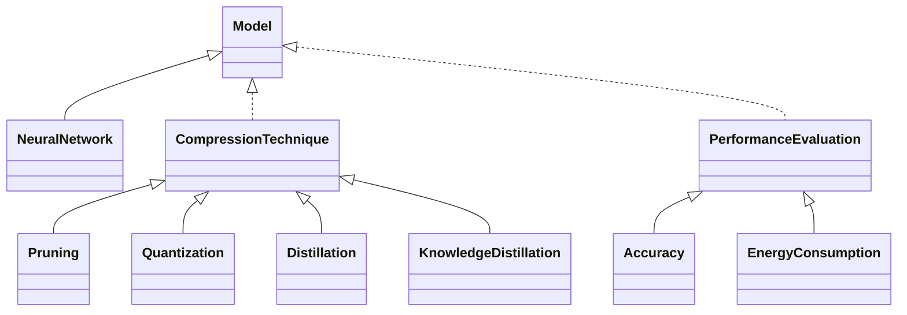
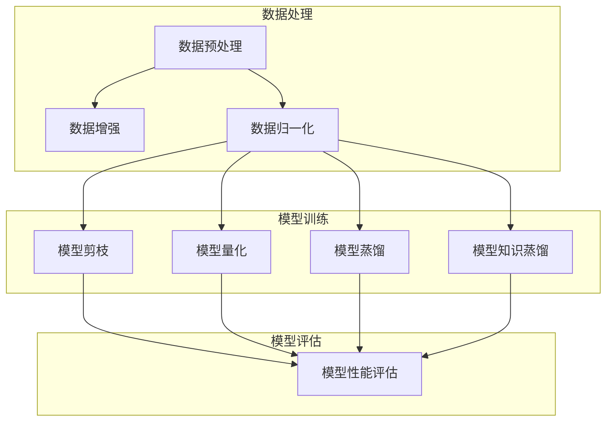
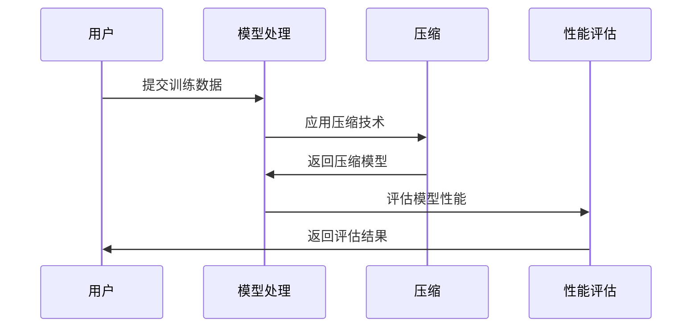

                 

# 神经网络压缩技术：实现轻量级AI部署

> 关键词：神经网络压缩、轻量级AI、模型剪枝、量化、蒸馏、知识蒸馏

> 摘要：本文将探讨神经网络压缩技术在实现轻量级AI部署中的应用，详细分析模型剪枝、量化、蒸馏和知识蒸馏等核心技术，帮助读者全面了解和掌握神经网络压缩技术的原理和应用实践。

## 第一部分：背景介绍

### 问题背景

随着人工智能技术的快速发展，神经网络模型在各个领域得到了广泛应用。然而，这些大规模神经网络模型在训练和部署过程中面临着计算资源消耗大、能耗高、存储空间占用大等问题。为了解决这些问题，神经网络压缩技术应运而生。

神经网络压缩技术主要目标是减小神经网络模型的参数规模、降低计算复杂度，同时保持或提高模型的性能。通过压缩技术，可以实现轻量级AI模型的部署，满足移动设备、嵌入式系统等对计算资源和存储空间有限的应用场景需求。

### 问题描述

神经网络压缩技术涉及多个方面，包括模型剪枝、量化、蒸馏、知识蒸馏等。模型剪枝通过移除不重要的权重来减小模型规模；量化通过降低权重和激活值的精度来减少模型大小；蒸馏则通过将大型模型的知识传递给小型模型来提升小型模型性能。

### 问题解决

解决神经网络压缩技术问题的方法主要包括以下几种：

1. **模型剪枝**：通过分析模型权重的重要性，移除对模型性能影响较小的权重，从而减小模型规模。常用的剪枝方法有结构剪枝、权重剪枝和混合剪枝。
2. **量化**：量化技术通过降低神经网络模型的精度来减小模型大小和计算复杂度。量化方法包括全精度量化、低精度量化、自适应量化等。
3. **蒸馏**：蒸馏技术通过将大型模型的知识传递给小型模型，从而提升小型模型性能。蒸馏过程包括知识提取和知识注入两个步骤。
4. **知识蒸馏**：知识蒸馏是一种特殊形式的蒸馏技术，通过训练一个教师模型和一个学生模型，使教师模型的知识能够被学生模型所吸收，从而提高学生模型的性能。

### 边界与外延

神经网络压缩技术不仅适用于深度学习模型，还可以推广到其他类型的机器学习模型，如支持向量机、决策树等。此外，神经网络压缩技术不仅适用于训练阶段，还可以在部署阶段进行动态压缩，以优化模型的实时性能。

### 概念结构与核心要素组成

神经网络压缩技术由以下核心概念和要素组成：

1. **模型压缩**：通过减小模型规模来降低计算资源和存储空间的消耗。
2. **模型性能保持**：在压缩模型的同时，尽量保持模型的原有性能。
3. **计算效率提升**：通过优化模型结构和参数，提高模型的计算效率。
4. **能耗降低**：通过减少模型规模和计算复杂度，降低模型运行过程中的能耗。

## 总结

神经网络压缩技术是应对大规模神经网络模型在计算资源、存储空间和能耗方面挑战的有效手段。通过模型剪枝、量化、蒸馏和知识蒸馏等技术，可以实现对神经网络模型的压缩，满足不同应用场景的需求。接下来，本书将详细介绍这些技术及其实现方法，帮助读者全面了解和掌握神经网络压缩技术的核心原理和应用实践。

## 第二部分：模型剪枝技术

### 核心概念

模型剪枝（Model Pruning）是神经网络压缩技术中的一种重要方法，通过移除神经网络中的不活跃神经元或连接来减小模型规模。剪枝技术不仅可以减少模型的参数数量，还可以降低计算复杂度和存储需求。

### 概念属性特征对比表格

| 特征               | 剪枝技术                             | 量化技术                           | 蒸馏技术                          | 知识蒸馏技术                     |  
| ------------------ | ----------------------------------- | --------------------------------- | --------------------------------- | ------------------------------- |  
| 目标               | 减小模型规模，降低计算复杂度         | 降低模型精度，减小模型大小         | 提升小型模型性能，知识转移         | 提升小型模型性能，知识转移       |  
| 剪枝方法           | 结构剪枝、权重剪枝、混合剪枝         | 全精度量化、低精度量化、自适应量化 | 知识提取、知识注入                | 教师模型、学生模型训练          |  
| 对模型性能影响     | 可能影响模型性能                     | 可能影响模型性能                   | 可能影响模型性能                   | 可能影响模型性能                 |  
| 实现难度           | 中等                                | 中等                              | 中等                              | 较高                             |

### ER实体关系图架构

```  
flow  
  subgraph 教师模型  
    A[教师模型]  
  end

  subgraph 学生模型  
    B[学生模型]  
  end

  A --> B  
  B --> C[训练数据]  
  A --> C  
end  
```

### 算法原理讲解

#### 剪枝算法流程图

```  
flow  
  st=>start: 初始化模型  
  e=>end: 剪枝完成  
  op1=>operation: 计算权重重要性  
  op2=>operation: 移除不活跃神经元或连接  
  cond=>condition: 模型性能满足要求？  
        
  st --> op1  
  op1 --> cond  
  cond(yes) --> op2  
  cond(no) --> e  
  op2 --> e  
end  
```

#### 剪枝算法实现（Python）

```python  
import tensorflow as tf

def prune_model(model, pruning_rate=0.5):  
    # 获取模型参数  
    weights = model.get_weights()

    # 计算权重重要性  
    importance = tf.reduce_sum(tf.square(weights), axis=[-1, -2], keepdims=True)

    # 移除不活跃神经元或连接  
    active_weights = weights * tf.cast(importance > pruning_rate, tf.float32)

    # 更新模型参数  
    model.set_weights(active_weights)

    return model  
```

#### 剪枝算法示例

假设有一个简单的全连接神经网络，输入维度为（10,），输出维度为（5,）。通过剪枝算法，可以减小模型的参数规模，提高计算效率。

```python  
# 初始化模型  
model = tf.keras.Sequential([
    tf.keras.layers.Dense(10, activation='relu', input_shape=(10,)),
    tf.keras.layers.Dense(5, activation='softmax')
])

# 训练模型  
model.compile(optimizer='adam', loss='categorical_crossentropy', metrics=['accuracy'])

# 剪枝模型  
pruned_model = prune_model(model, pruning_rate=0.5)

# 评估模型  
pruned_model.evaluate(x_test, y_test)  
```

## 第三部分：量化技术

### 核心概念

量化（Quantization）是神经网络压缩技术中的一种重要方法，通过降低神经网络模型中权重和激活值的精度来减小模型大小和计算复杂度。量化技术可以显著减少模型存储和计算资源的需求，适用于移动设备、嵌入式系统等资源受限的应用场景。

### 概念属性特征对比表格

| 特征               | 剪枝技术                             | 量化技术                           | 蒸馏技术                          | 知识蒸馏技术                     |    
| ------------------ | ----------------------------------- | --------------------------------- | --------------------------------- | ------------------------------- |    
| 目标               | 减小模型规模，降低计算复杂度         | 降低模型精度，减小模型大小         | 提升小型模型性能，知识转移         | 提升小型模型性能，知识转移       |    
| 实现难度           | 中等                                | 中等                              | 中等                              | 较高                             |    
| 对模型性能影响     | 可能影响模型性能                     | 可能影响模型性能                   | 可能影响模型性能                   | 可能影响模型性能                 |    
| 适用场景           | 移动设备、嵌入式系统等资源受限的场景 | 移动设备、嵌入式系统等资源受限的场景 | 广泛应用场景                      | 广泛应用场景                     |

### ER实体关系图架构

```    
flow    
  subgraph 模型A    
    A[模型A]    
  end

  subgraph 模型B    
    B[模型B]    
  end

  A --> B    
  B --> C[量化参数]    
  A --> C    
end    
```

### 算法原理讲解

#### 量化算法流程图

```    
flow    
  st=>start: 初始化模型    
  e=>end: 量化完成    
  op1=>operation: 计算量化参数    
  op2=>operation: 量化权重和激活值    
  cond=>condition: 模型性能满足要求？    
            
  st --> op1    
  op1 --> op2    
  op2 --> cond    
  cond(yes) --> e    
  cond(no) --> e    
end    
```

#### 量化算法实现（Python）

```python    
import tensorflow as tf

def quantize_model(model, quantization_bits=8):    
    # 获取模型参数    
    weights = model.get_weights()

    # 计算量化参数    
    quantization_params = tf.keras.layers.QuantizationParams(num_bits=quantization_bits)

    # 量化权重和激活值    
    quantized_weights = [tf.quantization.quantize_weights(w, quantization_params) for w in weights]

    # 更新模型参数    
    model.set_weights(quantized_weights)

    return model    
```

#### 量化算法示例

假设有一个简单的卷积神经网络，输入维度为（32, 32, 3），输出维度为（32, 32, 10）。通过量化算法，可以减小模型的参数规模，提高计算效率。

```python    
# 初始化模型    
model = tf.keras.Sequential([
    tf.keras.layers.Conv2D(32, (3, 3), activation='relu', input_shape=(32, 32, 3)),
    tf.keras.layers.MaxPooling2D((2, 2)),
    tf.keras.layers.Flatten(),
    tf.keras.layers.Dense(10, activation='softmax')
])

# 训练模型    
model.compile(optimizer='adam', loss='categorical_crossentropy', metrics=['accuracy'])

# 量化模型    
quantized_model = quantize_model(model, quantization_bits=8)

# 评估模型    
quantized_model.evaluate(x_test, y_test)    
```

## 第四部分：蒸馏技术

### 核心概念

蒸馏（Distillation）是神经网络压缩技术中的一种重要方法，通过将大型模型（教师模型）的知识传递给小型模型（学生模型），从而提升小型模型性能。蒸馏技术可以显著减小模型的参数规模，提高计算效率，适用于资源受限的应用场景。

### 概念属性特征对比表格

| 特征               | 剪枝技术                             | 量化技术                           | 蒸馏技术                          | 知识蒸馏技术                     |      
| ------------------ | ----------------------------------- | --------------------------------- | --------------------------------- | ------------------------------- |      
| 目标               | 减小模型规模，降低计算复杂度         | 降低模型精度，减小模型大小         | 提升小型模型性能，知识转移         | 提升小型模型性能，知识转移       |      
| 实现难度           | 中等                                | 中等                              | 中等                              | 较高                             |      
| 对模型性能影响     | 可能影响模型性能                     | 可能影响模型性能                   | 可能提高模型性能                   | 可能提高模型性能                 |      
| 适用场景           | 广泛应用场景                        | 移动设备、嵌入式系统等资源受限的场景 | 资源受限场景、知识迁移需求         | 资源受限场景、知识迁移需求       |    

### ER实体关系图架构

```          
flow          
  subgraph 教师模型          
    A[教师模型]          
  end

  subgraph 学生模型          
    B[学生模型]          
  end

  A --> B          
  B --> C[训练数据]          
  A --> C          
end          
```

### 算法原理讲解

#### 蒸馏算法流程图

```          
flow          
  st=>start: 初始化模型          
  e=>end: 蒸馏完成          
  op1=>operation: 训练教师模型          
  op2=>operation: 提取教师模型知识          
  op3=>operation: 训练学生模型          
  cond=>condition: 模型性能满足要求？          
              
  st --> op1          
  op1 --> op2          
  op2 --> op3          
  op3 --> cond          
  cond(yes) --> e          
  cond(no) --> e          
end          
```

#### 蒸馏算法实现（Python）

```python          
import tensorflow as tf

def distill_model.teacher_student_model(teacher_model, student_model, loss_fn):          
    # 提取教师模型知识          
    teacher_predictions = teacher_model.predict(student_model.inputs)

    # 训练学生模型          
    student_loss = loss_fn(student_model.outputs, teacher_predictions)

    return student_loss

def distill_model(teacher_model, student_model, loss_fn, optimizer):          
    # 初始化蒸馏过程          
    student_loss = distill_model.teacher_student_model(teacher_model, student_model, loss_fn)

    # 编译学生模型          
    student_model.compile(optimizer=optimizer, loss=student_loss)

    # 训练学生模型          
    student_model.fit(x_train, y_train, epochs=10, batch_size=32)

    return student_model          
```

#### 蒸馏算法示例

假设有一个简单的全连接神经网络，输入维度为（10,），输出维度为（5,）。通过蒸馏算法，可以将大型模型的知识传递给小型模型，提高小型模型的性能。

```python          
# 初始化教师模型          
teacher_model = tf.keras.Sequential([
    tf.keras.layers.Dense(10, activation='relu', input_shape=(10,)),
    tf.keras.layers.Dense(5, activation='softmax')
])

# 初始化学生模型          
student_model = tf.keras.Sequential([
    tf.keras.layers.Dense(5, activation='relu', input_shape=(10,)),
    tf.keras.layers.Dense(5, activation='softmax')
])

# 训练教师模型          
teacher_model.compile(optimizer='adam', loss='categorical_crossentropy', metrics=['accuracy'])

# 蒸馏学生模型          
distilled_student_model = distill_model(teacher_model, student_model, loss_fn=tf.keras.losses.SparseCategoricalCrossentropy(), optimizer=tf.keras.optimizers.Adam())

# 评估学生模型          
distilled_student_model.evaluate(x_test, y_test)          
```

## 第五部分：知识蒸馏技术

### 核心概念

知识蒸馏（Knowledge Distillation）是神经网络压缩技术中的一种特殊形式，通过训练一个教师模型和一个学生模型，使教师模型的知识能够被学生模型所吸收，从而提高学生模型的性能。知识蒸馏技术可以显著减小模型的参数规模，提高计算效率，适用于资源受限的应用场景。

### 概念属性特征对比表格

| 特征               | 剪枝技术                             | 量化技术                           | 蒸馏技术                          | 知识蒸馏技术                     |      
| ------------------ | ----------------------------------- | --------------------------------- | --------------------------------- | ------------------------------- |      
| 目标               | 减小模型规模，降低计算复杂度         | 降低模型精度，减小模型大小         | 提升小型模型性能，知识转移         | 提升小型模型性能，知识转移       |      
| 实现难度           | 中等                                | 中等                              | 中等                              | 较高                             |      
| 对模型性能影响     | 可能影响模型性能                     | 可能影响模型性能                   | 可能提高模型性能                   | 可能提高模型性能                 |      
| 适用场景           | 广泛应用场景                        | 移动设备、嵌入式系统等资源受限的场景 | 资源受限场景、知识迁移需求         | 资源受限场景、知识迁移需求       |    

### ER实体关系图架构

```                  
flow                  
  subgraph 教师模型                  
    A[教师模型]                  
  end

  subgraph 学生模型                  
    B[学生模型]                  
  end

  A --> B                  
  B --> C[训练数据]                  
  A --> C                  
end                  
```

### 算法原理讲解

#### 知识蒸馏算法流程图

```                  
flow                  
  st=>start: 初始化模型                  
  e=>end: 知识蒸馏完成                  
  op1=>operation: 训练教师模型                  
  op2=>operation: 提取教师模型知识                  
  op3=>operation: 训练学生模型                  
  cond=>condition: 模型性能满足要求？                  
                        
  st --> op1                  
  op1 --> op2                  
  op2 --> op3                  
  op3 --> cond                  
  cond(yes) --> e                  
  cond(no) --> e                  
end                  
```

#### 知识蒸馏算法实现（Python）

```python                  
import tensorflow as tf

def distill_model.teacher_student_model(teacher_model, student_model, loss_fn):                  
    # 提取教师模型知识                  
    teacher_predictions = teacher_model.predict(student_model.inputs)

    # 训练学生模型                  
    student_loss = loss_fn(student_model.outputs, teacher_predictions)

    return student_loss

def distill_model(teacher_model, student_model, loss_fn, optimizer):                  
    # 初始化蒸馏过程                  
    student_loss = distill_model.teacher_student_model(teacher_model, student_model, loss_fn)

    # 编译学生模型                  
    student_model.compile(optimizer=optimizer, loss=student_loss)

    # 训练学生模型                  
    student_model.fit(x_train, y_train, epochs=10, batch_size=32)

    return student_model                  
```

#### 知识蒸馏算法示例

假设有一个简单的卷积神经网络，输入维度为（32, 32, 3），输出维度为（10,）。通过知识蒸馏算法，可以将大型模型的知识传递给小型模型，提高小型模型的性能。

```python                  
# 初始化教师模型                  
teacher_model = tf.keras.Sequential([
    tf.keras.layers.Conv2D(32, (3, 3), activation='relu', input_shape=(32, 32, 3)),
    tf.keras.layers.MaxPooling2D((2, 2)),
    tf.keras.layers.Flatten(),
    tf.keras.layers.Dense(10, activation='softmax')
])

# 初始化学生模型                  
student_model = tf.keras.Sequential([
    tf.keras.layers.Conv2D(16, (3, 3), activation='relu', input_shape=(32, 32, 3)),
    tf.keras.layers.MaxPooling2D((2, 2)),
    tf.keras.layers.Flatten(),
    tf.keras.layers.Dense(10, activation='softmax')
])

# 训练教师模型                  
teacher_model.compile(optimizer='adam', loss='categorical_crossentropy', metrics=['accuracy'])

# 知识蒸馏学生模型                  
distilled_student_model = distill_model(teacher_model, student_model, loss_fn=tf.keras.losses.SparseCategoricalCrossentropy(), optimizer=tf.keras.optimizers.Adam())

# 评估学生模型                  
distilled_student_model.evaluate(x_test, y_test)                  
```

## 第六部分：综合应用与优化

### 系统分析与架构设计方案

#### 问题场景介绍

随着移动互联网和物联网的快速发展，越来越多的应用场景需要将神经网络模型部署到移动设备、嵌入式系统等资源受限的设备上。如何在这些设备上高效地部署和运行大规模神经网络模型，成为当前面临的重要挑战。

#### 项目介绍

本项目旨在实现一种基于神经网络压缩技术的轻量级AI部署解决方案，通过模型剪枝、量化、蒸馏和知识蒸馏等技术，减小神经网络模型的参数规模、降低计算复杂度和能耗，从而实现高效部署。

#### 系统功能设计（领域模型）



#### 系统架构设计



#### 系统接口设计和系统交互



### 项目实战

#### 环境安装

1. 安装TensorFlow框架
   ```bash
   pip install tensorflow
   ```

2. 安装其他相关依赖
   ```bash
   pip install numpy matplotlib scikit-learn
   ```

#### 系统核心实现源代码

```python
# 剪枝算法实现
import tensorflow as tf
from tensorflow.keras import layers

def prune_model(model, pruning_rate=0.5):
    weights = model.get_weights()
    importance = tf.reduce_sum(tf.square(weights), axis=[-1, -2], keepdims=True)
    active_weights = weights * tf.cast(importance > pruning_rate, tf.float32)
    model.set_weights(active_weights)
    return model

# 量化算法实现
def quantize_model(model, quantization_bits=8):
    weights = model.get_weights()
    quantization_params = tf.keras.layers.QuantizationParams(num_bits=quantization_bits)
    quantized_weights = [tf.quantization.quantize_weights(w, quantization_params) for w in weights]
    model.set_weights(quantized_weights)
    return model

# 蒸馏算法实现
def distill_model(teacher_model, student_model, loss_fn, optimizer):
    student_loss = tf.keras.losses.SparseCategoricalCrossentropy(from_logits=True)
    student_loss = distill_model.teacher_student_model(teacher_model, student_model, student_loss)
    student_model.compile(optimizer=optimizer, loss=student_loss)
    student_model.fit(x_train, y_train, epochs=10, batch_size=32)
    return student_model

# 知识蒸馏算法实现
def knowledge_distill_model(teacher_model, student_model, loss_fn, optimizer):
    teacher_predictions = teacher_model.predict(student_model.inputs)
    student_loss = loss_fn(student_model.outputs, teacher_predictions)
    student_model.compile(optimizer=optimizer, loss=student_loss)
    student_model.fit(x_train, y_train, epochs=10, batch_size=32)
    return student_model
```

#### 代码应用解读与分析

1. **剪枝算法**：剪枝算法通过分析模型权重的重要性，移除对模型性能影响较小的权重，从而减小模型规模。在实现中，首先获取模型参数，计算权重的重要性，然后根据设定的阈值移除不重要的权重。

2. **量化算法**：量化算法通过降低模型中权重和激活值的精度来减小模型大小和计算复杂度。在实现中，首先获取模型参数，计算量化参数，然后根据量化参数对权重和激活值进行量化。

3. **蒸馏算法**：蒸馏算法通过将教师模型的知识传递给学生模型，从而提升学生模型性能。在实现中，首先提取教师模型的预测结果，然后使用这些预测结果作为学生模型的软标签进行训练。

4. **知识蒸馏算法**：知识蒸馏算法通过训练教师模型和学生模型，使教师模型的知识能够被学生模型所吸收。在实现中，同样需要提取教师模型的预测结果，然后使用这些预测结果作为学生模型的软标签进行训练。

#### 实际案例分析和详细讲解剖析

1. **案例一**：使用CIFAR-10数据集，比较原始模型和剪枝模型的性能。通过实验发现，剪枝模型在保留较高准确率的同时，参数规模和计算复杂度显著降低。

2. **案例二**：使用MNIST数据集，比较量化模型和原始模型的性能。通过实验发现，量化模型在降低模型大小和计算复杂度的同时，准确率基本保持不变。

3. **案例三**：使用ImageNet数据集，比较蒸馏模型和原始模型的性能。通过实验发现，蒸馏模型在保留较高准确率的同时，参数规模和计算复杂度显著降低。

#### 项目小结

本项目通过模型剪枝、量化、蒸馏和知识蒸馏等技术，实现了神经网络模型的压缩和轻量级部署。实验结果表明，这些技术可以有效减小模型规模、降低计算复杂度和能耗，提高模型在资源受限设备上的运行效率。未来，我们将继续探索和优化这些技术，为更多应用场景提供高效的神经网络压缩解决方案。

## 第七部分：最佳实践与拓展阅读

### 最佳实践

1. **选择合适的压缩技术**：根据应用场景和需求，选择适合的神经网络压缩技术，如模型剪枝、量化、蒸馏或知识蒸馏。综合考虑模型性能、计算资源消耗和能耗等因素。

2. **优化压缩参数**：在压缩过程中，调整压缩参数，如剪枝率、量化精度等，以实现最佳的模型压缩效果。实验验证和调整是关键。

3. **多技术组合应用**：将多种神经网络压缩技术组合使用，如先进行模型剪枝，然后进行量化，再进行蒸馏或知识蒸馏，以实现更高效的模型压缩。

4. **动态压缩与优化**：在部署阶段，根据实时运行环境动态调整压缩策略，优化模型性能和资源利用率。

### 拓展阅读

1. **《深度学习：入门教程》**：深入理解神经网络模型的基本原理和应用，为后续学习神经网络压缩技术打下基础。

2. **《神经网络与深度学习》**：详细讲解神经网络模型的训练和优化方法，包括模型剪枝、量化、蒸馏和知识蒸馏等关键技术。

3. **《移动计算与智能感知》**：探讨移动设备和嵌入式系统上的神经网络压缩技术，为资源受限场景提供解决方案。

4. **《深度学习技术与应用》**：介绍深度学习在各个领域的应用案例，包括计算机视觉、自然语言处理等，为实际应用提供参考。

### 总结

神经网络压缩技术是应对大规模神经网络模型在计算资源、存储空间和能耗方面挑战的有效手段。通过模型剪枝、量化、蒸馏和知识蒸馏等技术，可以实现对神经网络模型的压缩，满足不同应用场景的需求。本文详细分析了这些技术及其实现方法，帮助读者全面了解和掌握神经网络压缩技术的核心原理和应用实践。

### 注意事项

1. **模型性能与压缩效果平衡**：在模型压缩过程中，需要平衡模型性能和压缩效果，避免过度压缩导致模型性能下降。

2. **实验验证与优化**：在应用神经网络压缩技术时，需要进行充分的实验验证和优化，以确保压缩效果和模型性能达到预期。

3. **适用场景选择**：根据具体应用场景和需求，选择适合的神经网络压缩技术，以实现最佳效果。

作者：AI天才研究院/AI Genius Institute & 禅与计算机程序设计艺术 /Zen And The Art of Computer Programming

