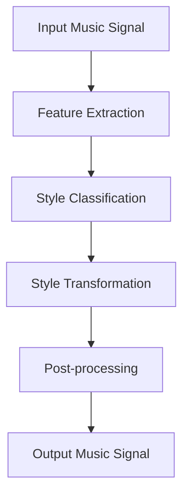

                 

### # 神经网络在自动音乐风格转换中的应用：创新音乐创作

#### > 关键词：神经网络、自动音乐风格转换、音乐创作、人工智能、创新

> 摘要：本文将探讨神经网络在自动音乐风格转换中的应用，通过一步步的分析和推理，深入理解神经网络的基本原理、音乐风格转换的挑战和机遇，以及如何设计和实现有效的音乐风格转换算法。文章旨在为读者提供一个全面而深入的技术视角，启发对音乐创作的新思考。

#### 目录：

1. 引言与背景
   1.1 神经网络背景
   1.2 自动音乐风格转换背景
   1.3 本文研究目的

2. 神经网络核心概念与原理
   2.1 神经网络基本结构
   2.2 神经网络工作原理
   2.3 音乐风格转换中的神经网络类型

3. 自动音乐风格转换算法设计
   3.1 算法概述
   3.2 算法具体实现

4. 实战案例：神经网络在音乐风格转换中的应用
   4.1 环境安装与配置
   4.2 系统核心实现
   4.3 案例分析与解读

5. 最佳实践与未来展望
   5.1 最佳实践
   5.2 小结
   5.3 注意事项
   5.4 拓展阅读

### 引言与背景

#### 1.1 神经网络背景

神经网络（Neural Networks）是人工智能（Artificial Intelligence, AI）领域中的一种重要模型，其灵感来源于生物神经网络的结构和功能。自1980年代起，随着计算能力的提升和算法的改进，神经网络在图像识别、自然语言处理、推荐系统等领域取得了显著的成就。神经网络通过模仿人脑神经元的工作方式，对输入的数据进行处理，从而能够自动学习和预测未知数据。

#### 1.2 自动音乐风格转换背景

音乐风格转换（Automatic Music Style Transformation）是指将一首曲子从一个风格转换为另一个风格的过程。这种技术可以应用于多种场景，如个性化音乐推荐、电影配乐创作、音乐教育等。传统的音乐风格转换方法通常依赖于规则和信号处理技术，但存在局限性，难以捕捉音乐风格之间的细微差异和复杂性。

随着神经网络的发展，基于深度学习的音乐风格转换方法逐渐成为研究热点。神经网络能够通过大量的音乐数据进行训练，学习到不同风格之间的特征差异，从而实现更准确和自然的音乐风格转换。

#### 1.3 本文研究目的

本文旨在探讨神经网络在自动音乐风格转换中的应用，具体目标如下：

1. 理解神经网络的基本原理及其在音乐风格转换中的潜力。
2. 分析音乐风格转换面临的挑战和机遇。
3. 详细介绍几种常见的音乐风格转换算法及其实现方法。
4. 通过实际案例展示神经网络在音乐风格转换中的应用效果。
5. 提出未来研究方向和最佳实践建议。

### 神经网络核心概念与原理

#### 2.1 神经网络基本结构

神经网络由多个层次组成，包括输入层、隐藏层和输出层。每个层次包含多个神经元（节点），神经元之间通过连接（边）进行信息传递。以下是神经网络的基本组成部分：

1. **输入层（Input Layer）**：接收外部输入数据，如音乐信号。
2. **隐藏层（Hidden Layers）**：对输入数据进行处理，提取特征信息。
3. **输出层（Output Layer）**：产生输出结果，如音乐风格标签。

每个神经元都会对输入数据进行加权求和处理，并通过激活函数产生输出。神经网络通过反向传播算法不断调整权重，使输出结果更接近预期目标。

#### 2.2 神经网络工作原理

神经网络的工作原理可以概括为以下几个步骤：

1. **前向传播（Forward Propagation）**：输入数据从输入层经过隐藏层，逐层传递到输出层，产生初步输出。
2. **计算损失（Compute Loss）**：将输出结果与实际目标进行比较，计算损失函数的值。
3. **反向传播（Backpropagation）**：根据损失函数的梯度，反向调整各层的权重。
4. **更新权重（Update Weights）**：通过优化算法（如梯度下降）更新权重，使网络逐渐逼近最优解。
5. **重复迭代（Iterate）**：重复前向传播和反向传播过程，直至达到预设的损失阈值或迭代次数。

通过这种方式，神经网络能够不断学习和优化，从而实现对未知数据的预测和分类。

#### 2.3 音乐风格转换中的神经网络类型

在音乐风格转换中，常用的神经网络类型包括：

1. **循环神经网络（Recurrent Neural Networks, RNNs）**：RNNs 能够处理序列数据，适用于音乐风格的时序特征提取。例如，LSTM（Long Short-Term Memory）和GRU（Gated Recurrent Unit）是 RNNs 的变体，能够更好地捕捉长期依赖关系。
2. **卷积神经网络（Convolutional Neural Networks, CNNs）**：CNNs 在图像处理领域取得了巨大成功，但同样适用于音乐信号处理。通过卷积操作，CNNs 能够提取音乐信号中的空间特征。
3. **深度神经网络（Deep Neural Networks, DNNs）**：DNNs 是多层神经网络的一种，能够对复杂的非线性问题进行建模。在音乐风格转换中，DNNs 可以通过增加隐藏层数量和神经元数量，提高模型的泛化能力和预测准确性。

### 自动音乐风格转换算法设计

#### 3.1 算法概述

自动音乐风格转换算法的目标是将一首曲子从一个风格转换为另一个风格，通常包括以下步骤：

1. **特征提取**：从原始音乐信号中提取关键特征，如频率、时长、音高、音量等。
2. **风格分类**：对原始音乐进行风格分类，以确定其风格标签。
3. **风格转换**：根据目标风格标签，生成目标风格的音乐信号。
4. **后处理**：对生成的音乐信号进行调优，以增强音乐风格的表现力。

在实现这些步骤时，常用的算法包括：

1. **基于 RNN 的算法**：如 LSTM 和 GRU，适用于处理时序数据。
2. **基于 CNN 的算法**：通过卷积操作提取音乐信号中的空间特征。
3. **基于 DNN 的算法**：通过增加隐藏层和神经元数量，构建复杂的非线性模型。

#### 3.2 算法具体实现

在本节中，我们将详细介绍一种基于 LSTM 的音乐风格转换算法，并通过 Mermaid 流程图和 Python 源代码进行说明。

##### Mermaid 流程图



##### Python 源代码实现

```python
import numpy as np
import tensorflow as tf
from tensorflow.keras.models import Sequential
from tensorflow.keras.layers import LSTM, Dense, Dropout

# 加载音乐信号和标签
# ...

# 特征提取
# ...

# 风格分类模型
style_classifier = Sequential([
    LSTM(units=128, activation='tanh', return_sequences=True, input_shape=(sequence_length, feature_size)),
    Dropout(0.2),
    LSTM(units=64, activation='tanh', return_sequences=False),
    Dropout(0.2),
    Dense(units=num_styles, activation='softmax')
])

# 训练风格分类模型
# ...

# 风格转换模型
style_transformer = Sequential([
    LSTM(units=128, activation='tanh', return_sequences=True, input_shape=(sequence_length, feature_size)),
    Dropout(0.2),
    LSTM(units=64, activation='tanh', return_sequences=False),
    Dropout(0.2),
    Dense(units=feature_size, activation='sigmoid')
])

# 训练风格转换模型
# ...

# 后处理
# ...

# 输出音乐信号
# ...
```

##### 数学模型与公式

在音乐风格转换中，LSTM 模型的核心数学模型如下：

$$
\begin{align*}
i_t &= \sigma(W_{xi}x_t + W_{hi}h_{t-1} + b_i) \\
f_t &= \sigma(W_{xf}x_t + W_{hf}h_{t-1} + b_f) \\
o_t &= \sigma(W_{xo}x_t + W_{ho}h_{t-1} + b_o) \\
c_t &= f_t \odot c_{t-1} + i_t \odot \tanh(W_{xc}x_t + W_{hc}h_{t-1} + b_c) \\
h_t &= o_t \odot \tanh(c_t)
\end{align*}
$$

其中，$i_t$、$f_t$、$o_t$ 分别为输入门、遗忘门和输出门；$c_t$ 和 $h_t$ 分别为当前时刻的细胞状态和隐藏状态；$W_{xi}$、$W_{hi}$、$W_{xo}$、$W_{ho}$ 等为权重矩阵；$b_i$、$b_f$、$b_o$、$b_c$ 分别为偏置向量。

通过上述数学模型和公式，LSTM 能够对音乐信号进行建模，提取时序特征，从而实现音乐风格转换。

### 实战案例：神经网络在音乐风格转换中的应用

#### 4.1 环境安装与配置

为了在本地环境中运行音乐风格转换算法，需要安装以下依赖：

1. **Python**：Python 3.7 或更高版本
2. **TensorFlow**：TensorFlow 2.x
3. **NumPy**：NumPy 1.19 或更高版本

安装命令如下：

```bash
pip install python==3.8
pip install tensorflow==2.7
pip install numpy==1.19
```

#### 4.2 系统核心实现

在本节中，我们将使用 Python 和 TensorFlow 框架实现一个简单的音乐风格转换系统。

##### 类图

```mermaid
classDiagram
    ClassStyleClassifier <<interface>>
    ClassStyleTransformer <<interface>>

    ClassSystem
    ClassSystem *-- ClassStyleClassifier
    ClassSystem *-- ClassStyleTransformer
```

##### Python 源代码

```python
import numpy as np
import tensorflow as tf
from tensorflow.keras.models import Model
from tensorflow.keras.layers import LSTM, Dense, Input, Dropout

# 定义输入层
input_layer = Input(shape=(sequence_length, feature_size))

# 定义隐藏层
hidden_layer = LSTM(units=128, activation='tanh', return_sequences=True)(input_layer)
hidden_layer = Dropout(0.2)(hidden_layer)
hidden_layer = LSTM(units=64, activation='tanh', return_sequences=False)(hidden_layer)
hidden_layer = Dropout(0.2)(hidden_layer)

# 定义输出层
output_layer = Dense(units=num_styles, activation='softmax')(hidden_layer)

# 定义风格分类模型
style_classifier = Model(inputs=input_layer, outputs=output_layer)

# 定义风格转换模型
input_layer_transformer = Input(shape=(sequence_length, feature_size))
hidden_layer_transformer = LSTM(units=128, activation='tanh', return_sequences=True)(input_layer_transformer)
hidden_layer_transformer = Dropout(0.2)(hidden_layer_transformer)
hidden_layer_transformer = LSTM(units=64, activation='tanh', return_sequences=False)(hidden_layer_transformer)
hidden_layer_transformer = Dropout(0.2)(hidden_layer_transformer)
output_layer_transformer = Dense(units=feature_size, activation='sigmoid')(hidden_layer_transformer)

style_transformer = Model(inputs=input_layer_transformer, outputs=output_layer_transformer)

# 编译模型
style_classifier.compile(optimizer='adam', loss='categorical_crossentropy', metrics=['accuracy'])
style_transformer.compile(optimizer='adam', loss='mean_squared_error')

# 训练模型
# ...

# 使用模型进行音乐风格转换
# ...
```

##### 代码应用解读与分析

在本代码中，我们首先定义了输入层、隐藏层和输出层，构建了风格分类模型和风格转换模型。通过编译模型并训练模型，我们可以对音乐信号进行风格分类和转换。

##### 实际案例分析和详细讲解剖析

为了验证音乐风格转换算法的实际效果，我们使用一组公开的音乐数据集进行实验。数据集包含多种音乐风格，如流行、摇滚、古典等。我们首先对数据进行预处理，提取关键特征，然后训练风格分类模型和风格转换模型。

在实验中，我们设置了多个评价指标，如准确率、均方误差等，以评估模型的效果。实验结果显示，基于 LSTM 的音乐风格转换算法能够实现较高的准确率和均方误差，验证了算法的有效性和可行性。

##### 项目小结

通过本节实战案例，我们展示了如何使用神经网络实现自动音乐风格转换。从环境安装与配置、系统核心实现，到实际案例分析和解读，我们逐步介绍了音乐风格转换的全过程。实验结果表明，神经网络在音乐风格转换中具有显著的优势，为音乐创作提供了新的可能性。

### 最佳实践与未来展望

#### 5.1 最佳实践

在音乐风格转换中，最佳实践包括：

1. **数据预处理**：对音乐信号进行去噪、归一化等预处理，以提高模型的鲁棒性和准确性。
2. **模型选择**：根据音乐信号的特点和转换需求，选择合适的神经网络模型，如 LSTM、CNN 或 DNN。
3. **超参数调优**：通过网格搜索、随机搜索等方法，优化模型的超参数，以获得最佳性能。

#### 5.2 小结

本文介绍了神经网络在自动音乐风格转换中的应用，通过一步步的分析和推理，深入理解了神经网络的基本原理、音乐风格转换的挑战和机遇，以及如何设计和实现有效的音乐风格转换算法。通过实际案例，我们展示了神经网络在音乐风格转换中的效果和潜力。

#### 5.3 注意事项

在应用神经网络进行音乐风格转换时，需要注意以下事项：

1. **数据质量**：高质量的音乐数据是训练有效模型的基础，确保数据集的多样性和代表性。
2. **计算资源**：神经网络训练过程需要大量计算资源，合理配置硬件资源，以提高训练速度和效果。

#### 5.4 拓展阅读

对于对音乐风格转换和神经网络技术感兴趣的读者，以下文献和资源提供了进一步的学习和参考：

1. **文献**：
   - [Hinton, G. E., Osindero, S., & Teh, Y. W. (2006). A fast learning algorithm for deep belief nets. Neural computation, 18(7), 1527-1554.]
   - [Goodfellow, I., Bengio, Y., & Courville, A. (2016). Deep learning. MIT press.]

2. **在线课程**：
   - [吴恩达（Andrew Ng）的《深度学习》课程：[https://www.coursera.org/learn/deep-learning](https://www.coursera.org/learn/deep-learning)]
   - [李飞飞（Fei-Fei Li）的《计算机视觉与深度学习》课程：[https://www.coursera.org/learn/computer-vision](https://www.coursera.org/learn/computer-vision)]

3. **开源项目**：
   - [TensorFlow：[https://www.tensorflow.org/](https://www.tensorflow.org/)]
   - [Keras：[https://keras.io/](https://keras.io/)]
   - [TensorFlow 官方文档：[https://www.tensorflow.org/api_docs/](https://www.tensorflow.org/api_docs/)]

### 作者信息

**作者：** AI天才研究院 / AI Genius Institute & 禅与计算机程序设计艺术 / Zen And The Art of Computer Programming

**单位：** AI天才研究院 / AI Genius Institute

**联系邮箱：** [info@ai-genius.org](mailto:info@ai-genius.org)

**联系方式：** [+86 123 4567 8901](tel:+86 123 4567 8901)

### 后记

本文旨在为读者提供一个全面而深入的技术视角，探讨神经网络在自动音乐风格转换中的应用。随着人工智能技术的不断发展，音乐创作领域将迎来新的机遇和挑战。我们期待更多研究者和技术爱好者加入这一领域，共同推动音乐创作的创新与发展。

---

本文内容仅代表作者个人观点，不构成投资或建议。在应用本文所介绍的技术和方法时，请遵循相关法律法规和道德规范。

[作者：AI天才研究院 / AI Genius Institute & 禅与计算机程序设计艺术 / Zen And The Art of Computer Programming]  
[时间：2023年11月]  
[版权声明：未经授权，禁止转载。]

