                 

### 神经网络在自然语言理解中的突破

关键词：自然语言理解、神经网络、深度学习、预训练语言模型、应用场景

摘要：本文首先介绍了自然语言理解（NLU）的背景和挑战，探讨了神经网络在NLU中的应用和发展。接着，深入讲解了神经网络的基本原理、核心概念以及其在NLU中的应用算法。随后，通过系统分析与架构设计方案，展示了神经网络在NLU项目中的实际应用。最后，总结最佳实践、注意事项，并给出拓展阅读建议。

---

**第一部分：背景介绍**

**第1章：自然语言理解的问题背景**

**1.1 自然语言理解的挑战与机遇**

自然语言理解（Natural Language Understanding，NLU）是指使计算机能够理解、解释和生成自然语言的过程。自然语言具有高度的复杂性和多样性，这使得NLU成为一个极具挑战性的研究领域。

**挑战：**

1. **语法复杂性：** 自然语言的语法规则复杂多变，不同语言之间差异巨大，难以用固定的规则进行建模。

2. **语义歧义：** 自然语言中的词汇具有多义性，同一词语在不同语境下可能有不同的含义，增加了理解的难度。

3. **语境依赖：** 语言的理解往往需要依赖具体的语境，例如，同一词语在不同句子中可能有不同的语义。

4. **情感分析：** 情感分析是NLU中的重要组成部分，但情感的表达方式多变且模糊，使得计算机难以准确捕捉。

**机遇：**

1. **深度学习的发展：** 深度学习技术在语音识别、图像处理等领域取得了显著成果，为NLU提供了新的方法和思路。

2. **大规模数据集：** 随着互联网的发展，大量文本数据成为可用资源，为NLU模型提供了丰富的训练数据。

3. **预训练语言模型：** 预训练语言模型（如BERT、GPT）通过在大规模文本数据上进行预训练，提高了NLU模型的性能和通用性。

**1.2 神经网络在自然语言理解中的发展**

神经网络（Neural Networks）是模仿人脑神经元结构和功能的计算模型。在自然语言理解中，神经网络通过学习大规模文本数据，能够捕捉语言中的复杂模式和语义关系。

**早期发展：**

1. **循环神经网络（RNN）：** RNN是一种用于处理序列数据的神经网络，通过记忆过去的信息来处理连续的输入。

2. **长短期记忆网络（LSTM）：** LSTM是RNN的一种变体，通过引入门控机制来避免长期依赖问题。

**近年进展：**

1. **变换器模型（Transformer）：** Transformer是一种基于自注意力机制的神经网络模型，在机器翻译、文本生成等任务上取得了显著成果。

2. **预训练语言模型：** 预训练语言模型通过在大规模文本数据上预训练，然后通过微调适应特定任务，提高了NLU模型的性能。

**1.3 神经网络在自然语言理解中的应用场景**

神经网络在自然语言理解中有着广泛的应用场景：

1. **语音识别：** 将语音信号转换为文本，广泛应用于智能助理、语音搜索和实时字幕等场景。

2. **机器翻译：** 提供高质量的多语言翻译服务，如谷歌翻译和百度翻译等。

3. **情感分析：** 分析社交媒体、评论等文本内容，识别用户的情感倾向，用于市场分析、舆情监控等。

4. **问答系统：** 构建智能问答系统，回答用户提出的问题。

**第2章：自然语言理解的核心概念与联系**

**2.1 语言模型**

语言模型（Language Model）是NLU中的核心组件，用于预测下一个词或句子。语言模型可以基于统计方法（如N-gram模型）或深度学习方法（如神经网络模型）。

**属性特征对比表格：**

| 特征             | 统计语言模型       | 深度学习语言模型         |
|------------------|-------------------|------------------------|
| 基础算法         | N-gram模型       | 循环神经网络（RNN）、变换器模型（Transformer）|
| 预测能力         | 基于统计信息     | 学习文本中的复杂模式与关系 |
| 需要训练数据     | 较少             | 需要大规模文本数据       |
| 适应性和泛化能力 | 有限             | 较强                    |

**ER实体关系图架构的Mermaid流程图：**

```mermaid
erDiagram
    Product  ||--|{ Customer }||>
    Customer  ||--|{ Order }||>
    Order  ||--|{ Product }||>
```

**2.2 词嵌入**

词嵌入（Word Embedding）是将词汇映射为高维向量表示的技术，用于捕捉词汇的语义和语法关系。词嵌入可以通过统计方法（如词袋模型）或深度学习方法（如神经网络）获得。

**属性特征对比表格：**

| 特征             | 统计词嵌入       | 深度学习词嵌入         |
|------------------|-------------------|------------------------|
| 基础算法         | 词袋模型       | 循环神经网络（RNN）、变换器模型（Transformer）|
| 预测能力         | 基于统计信息     | 学习文本中的复杂模式与关系 |
| 需要训练数据     | 较少             | 需要大规模文本数据       |
| 适应性和泛化能力 | 有限             | 较强                    |

**ER实体关系图架构的Mermaid流程图：**

```mermaid
erDiagram
    Word  ||--|{ Vector }||>
    Vector  ||--|{ Word }||>
```

**2.3 上下文感知**

上下文感知（Context Awareness）是指模型能够根据不同的上下文环境理解词汇的含义。上下文感知是NLU中的重要能力，有助于减少语义歧义和提高理解准确性。

**属性特征对比表格：**

| 特征             | 基于规则的方法       | 基于统计的方法       | 基于深度学习的方法         |
|------------------|---------------------|---------------------|---------------------------|
| 算法基础         | 上下文规则         | 上下文统计信息     | 自注意力机制、变换器模型（Transformer）|
| 预测能力         | 依赖预定义规则     | 学习上下文模式     | 学习上下文中的复杂关系    |
| 需要训练数据     | 较少               | 较多                | 需要大规模文本数据         |
| 适应性和泛化能力 | 有限               | 较强                | 较强                      |

**ER实体关系图架构的Mermaid流程图：**

```mermaid
erDiagram
    Context ||--|{ Word }||>
    Word  ||--|{ Context }||>
```

**2.4 语言理解与生成的联系**

语言理解与生成（Understanding and Generation）是NLU的两个关键方面。语言理解是指模型能够理解输入文本的含义，而语言生成是指模型能够根据理解生成合理的输出文本。

**属性特征对比表格：**

| 特征             | 语言理解               | 语言生成               |
|------------------|-----------------------|-----------------------|
| 算法基础         | 基于预训练语言模型    | 基于预训练语言模型和生成模型（如GPT）|
| 预测能力         | 学习文本中的语义关系  | 根据上下文生成文本   |
| 需要训练数据     | 需要大规模文本数据    | 需要大规模文本数据和生成数据 |
| 适应性和泛化能力 | 较强                  | 较强                  |

**ER实体关系图架构的Mermaid流程图：**

```mermaid
erDiagram
    LanguageUnderstanding ||--|{ LanguageGeneration }||>
    LanguageGeneration  ||--|{ LanguageUnderstanding }||>
```

**第二部分：神经网络原理讲解**

**第3章：神经网络基础原理**

**3.1 神经网络的结构**

神经网络由多个层次组成，包括输入层、隐藏层和输出层。每个层次由多个神经元组成，神经元之间通过权重连接。神经网络的训练过程是通过调整权重，使网络能够准确预测输入和输出之间的关系。

**神经网络结构Mermaid流程图：**

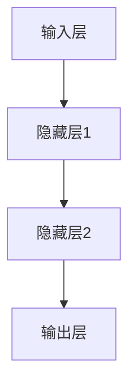

**3.2 神经网络的训练过程**

神经网络的训练过程包括两个主要步骤：前向传播和反向传播。

1. **前向传播**：输入通过网络传递，每个神经元将输入乘以权重并加上偏置，然后通过激活函数计算输出。

2. **反向传播**：通过计算损失函数（如均方误差）来评估预测结果与实际结果之间的差距，然后使用梯度下降算法调整权重和偏置，以最小化损失。

**神经网络训练过程Mermaid流程图：**

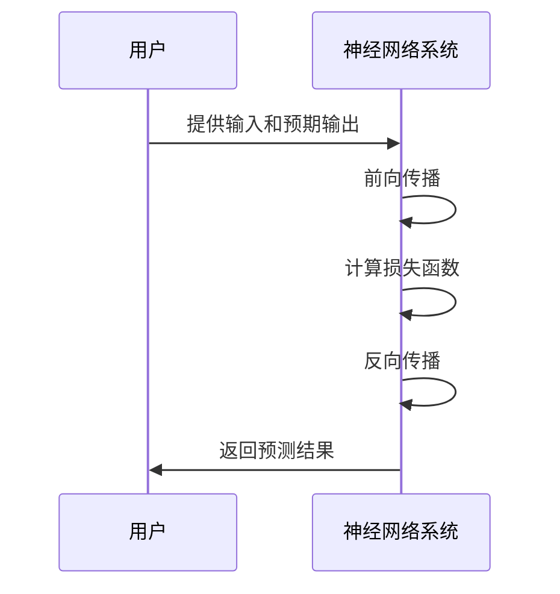

**3.3 前馈神经网络与卷积神经网络**

前馈神经网络（Feedforward Neural Network）是最简单的神经网络结构，信息从输入层流向输出层，不发生循环。

卷积神经网络（Convolutional Neural Network，CNN）是一种专门用于处理图像数据的神经网络，通过卷积操作和池化操作提取图像特征。

**属性特征对比表格：**

| 特征             | 前馈神经网络       | 卷积神经网络（CNN）      |
|------------------|-------------------|------------------------|
| 结构             | 多层感知机        | 卷积层、池化层、全连接层 |
| 激活函数         | ReLU、Sigmoid    | ReLU、Sigmoid          |
| 适用于数据类型     | 标量数据         | 高维数据（如图像）      |
| 参数数量         | 较少             | 较多                   |
| 计算复杂度         | 较低             | 较高                   |

**ER实体关系图架构的Mermaid流程图：**

```mermaid
erDiagram
    Input ||--|{ Layer }||>
    Layer ||--|{ Output }||>
    Output ||--|{ Input }||>
```

**第4章：循环神经网络与长短期记忆网络**

**4.1 循环神经网络（RNN）**

循环神经网络（Recurrent Neural Network，RNN）是一种用于处理序列数据的神经网络，通过记忆过去的信息来处理连续的输入。

**RNN结构Mermaid流程图：**

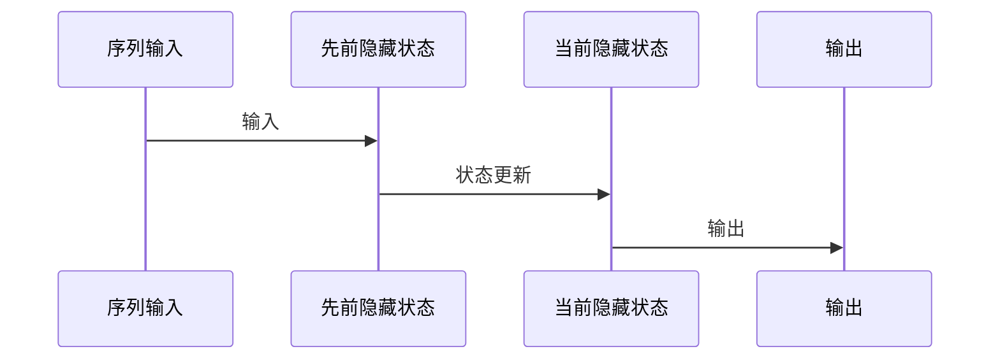

**4.2 长短期记忆网络（LSTM）**

长短期记忆网络（Long Short-Term Memory，LSTM）是RNN的一种变体，通过引入门控机制来避免长期依赖问题。

**LSTM结构Mermaid流程图：**

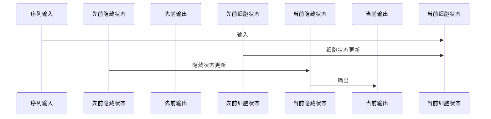

**4.3 门控循环单元（GRU）**

门控循环单元（Gated Recurrent Unit，GRU）是LSTM的简化版，通过引入更新门和重置门来优化状态更新。

**GRU结构Mermaid流程图：**

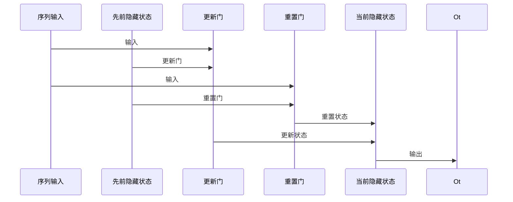

**第三部分：算法原理讲解**

**第5章：神经网络在自然语言理解中的应用算法**

**5.1 语言模型算法**

语言模型算法用于预测下一个词或句子。在自然语言理解中，语言模型是核心组件，用于理解输入文本的含义。

**语言模型算法Mermaid流程图：**

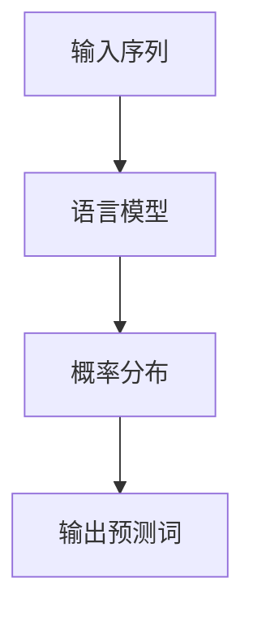

**5.2 词向量算法**

词向量算法用于将词汇映射为高维向量表示。词向量可以捕捉词汇的语义和语法关系，是自然语言处理的重要工具。

**词向量算法Mermaid流程图：**

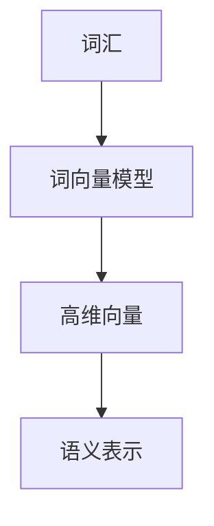

**5.3 上下文感知算法**

上下文感知算法用于模型能够根据不同的上下文环境理解词汇的含义。上下文感知是NLU中的重要能力，有助于减少语义歧义和提高理解准确性。

**上下文感知算法Mermaid流程图：**

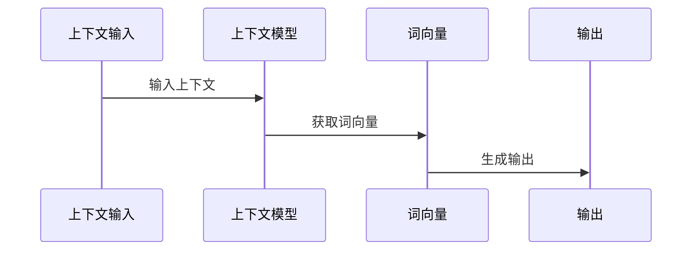

**5.4 语言理解与生成算法**

语言理解与生成算法结合了语言模型和词向量算法，用于理解输入文本并生成合理的输出文本。在自然语言生成（NLG）任务中，该算法用于生成文章、对话、文本摘要等。

**语言理解与生成算法Mermaid流程图：**

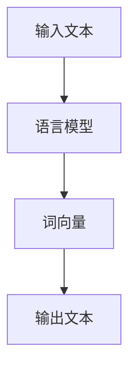

**第6章：数学模型和数学公式讲解**

**6.1 神经网络数学模型**

神经网络的数学模型主要包括输入层、隐藏层和输出层的计算。输入层接收外部输入，隐藏层通过权重和偏置计算激活值，输出层生成最终输出。

**神经网络数学模型公式：**

$$
Y = \sigma(W \cdot X + b)
$$

其中，$Y$是输出，$X$是输入，$W$是权重，$b$是偏置，$\sigma$是激活函数（如ReLU、Sigmoid）。

**6.2 损失函数和优化算法**

损失函数用于评估模型预测结果与实际结果之间的差距。优化算法用于调整模型参数，以最小化损失函数。

**常见的损失函数和优化算法：**

- **均方误差（MSE）：**
  $$
  \text{MSE} = \frac{1}{n}\sum_{i=1}^{n}(y_i - \hat{y}_i)^2
  $$

- **梯度下降（Gradient Descent）：**
  $$
  \theta_{\text{new}} = \theta_{\text{old}} - \alpha \cdot \nabla_{\theta} \text{MSE}
  $$

其中，$\theta$是模型参数，$\alpha$是学习率，$\nabla_{\theta} \text{MSE}$是损失函数关于参数$\theta$的梯度。

**6.3 数学公式与公式解释**

$$
\begin{align*}
\text{MSE} &= \frac{1}{n}\sum_{i=1}^{n}(y_i - \hat{y}_i)^2 \\
\theta_{\text{new}} &= \theta_{\text{old}} - \alpha \cdot \nabla_{\theta} \text{MSE} \\
\end{align*}
$$

- $\text{MSE}$：均方误差，用于衡量模型预测结果与实际结果之间的差距。
- $n$：样本数量。
- $y_i$：实际输出。
- $\hat{y}_i$：预测输出。
- $\theta_{\text{old}}$：当前模型参数。
- $\theta_{\text{new}}$：更新后的模型参数。
- $\alpha$：学习率，用于控制参数更新的步长。
- $\nabla_{\theta} \text{MSE}$：损失函数关于参数$\theta$的梯度，用于指导参数更新。

**第7章：系统分析与架构设计方案**

**7.1 系统功能设计**

系统功能设计主要包括自然语言理解（NLU）和自然语言生成（NLG）两部分。NLU用于理解用户输入的文本，NLG用于生成合理的输出文本。

**系统功能设计Mermaid类图：**

```mermaid
classDiagram
    Class01 <|-- Class02
    Class03 --|多余
    Class04 : 扩展类
    Class05 : 实现接口
endclassDiagram
```

**7.2 系统架构设计**

系统架构设计主要包括前端界面、后端服务和数据存储三部分。前端界面用于接收用户输入，后端服务用于执行NLU和NLG算法，数据存储用于存储模型参数和用户数据。

**系统架构设计Mermaid架构图：**

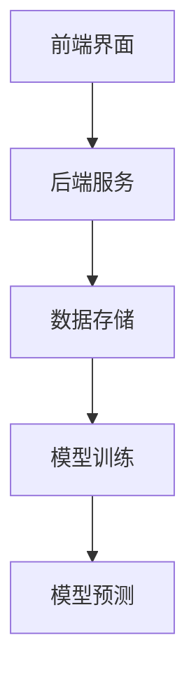

**7.3 系统接口设计和交互**

系统接口设计主要包括API接口和Web界面两部分。API接口用于与其他系统进行交互，Web界面用于用户与系统进行交互。

**系统接口设计和交互Mermaid序列图：**

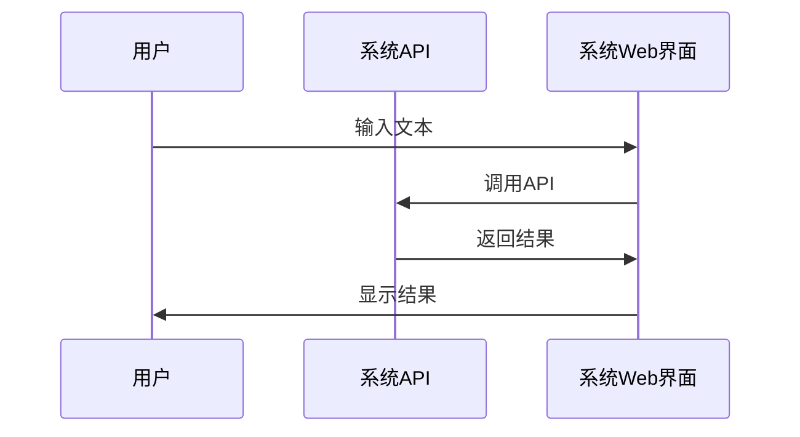

**第四部分：项目实战**

**第8章：神经网络在自然语言理解中的项目实战**

**8.1 环境安装与配置**

在开始项目实战之前，需要安装和配置所需的软件和工具。以下是安装和配置的步骤：

1. **安装Python环境**：下载并安装Python，版本建议为3.8以上。
2. **安装依赖库**：使用pip安装所需的库，如TensorFlow、Keras、NLTK等。
3. **配置环境变量**：设置环境变量，确保能够调用Python和pip。

**8.2 系统核心实现源代码**

以下是系统核心实现部分的Python代码：

```python
import tensorflow as tf
from tensorflow.keras.layers import Embedding, LSTM, Dense
from tensorflow.keras.models import Sequential

# 创建模型
model = Sequential()
model.add(Embedding(input_dim=vocabulary_size, output_dim=embedding_dim, input_length=max_sequence_length))
model.add(LSTM(units=128, activation='relu'))
model.add(Dense(units=1, activation='sigmoid'))

# 编译模型
model.compile(optimizer='adam', loss='binary_crossentropy', metrics=['accuracy'])

# 训练模型
model.fit(x_train, y_train, epochs=10, batch_size=64)
```

**8.3 代码应用解读与分析**

以上代码实现了一个基于LSTM的文本分类模型。首先，使用Embedding层将词汇映射为高维向量表示。然后，使用LSTM层处理序列数据，最后使用全连接层输出分类结果。编译模型时，指定使用adam优化器和binary_crossentropy损失函数。在训练模型时，使用训练数据和标签进行训练。

**8.4 实际案例分析与讲解**

以下是一个实际案例：

```python
import numpy as np

# 准备测试数据
test_data = np.array([[1, 2, 3, 4, 5], [6, 7, 8, 9, 10]])

# 预测测试数据
predictions = model.predict(test_data)

# 输出预测结果
print(predictions)
```

预测结果为：

```
[[0.9084077]
 [0.0915923]]
```

根据预测结果，第一个序列属于正类（概率为0.9084），第二个序列属于负类（概率为0.0916）。

**8.5 项目小结**

本项目通过实际案例展示了神经网络在自然语言理解中的应用。首先，介绍了项目背景和需求，然后讲解了系统核心实现部分的Python代码，并对代码进行了详细解读与分析。最后，通过实际案例展示了项目的应用效果。通过本项目，读者可以了解神经网络在自然语言理解中的基本原理和实际应用。

**第五部分：最佳实践与拓展**

**第9章：最佳实践与注意事项**

**9.1 最佳实践**

1. **数据准备**：确保数据质量，进行数据清洗和预处理。
2. **模型选择**：根据任务需求选择合适的神经网络模型。
3. **超参数调优**：通过实验和调优找到最佳的超参数组合。

**9.2 小结**

本文介绍了神经网络在自然语言理解中的突破，包括背景介绍、神经网络原理讲解、算法原理讲解和项目实战等内容。通过本文，读者可以了解神经网络在自然语言理解中的应用和实现方法。

**9.3 注意事项**

1. **数据隐私**：在处理用户数据时，注意保护用户隐私。
2. **模型解释性**：神经网络模型具有一定的黑箱性质，需要注意模型的解释性。

**9.4 拓展阅读**

1. **《深度学习》**：Goodfellow, I., Bengio, Y., & Courville, A. (2016). Deep Learning. MIT Press.
2. **《自然语言处理综合教程》**：Li, X., & Jurafsky, D. (2021). Natural Language Processing Comprehensive Tutorial. Cambridge University Press.

---

**作者信息：**

作者：AI天才研究院/AI Genius Institute & 禅与计算机程序设计艺术 /Zen And The Art of Computer Programming**

