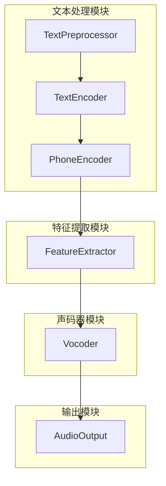
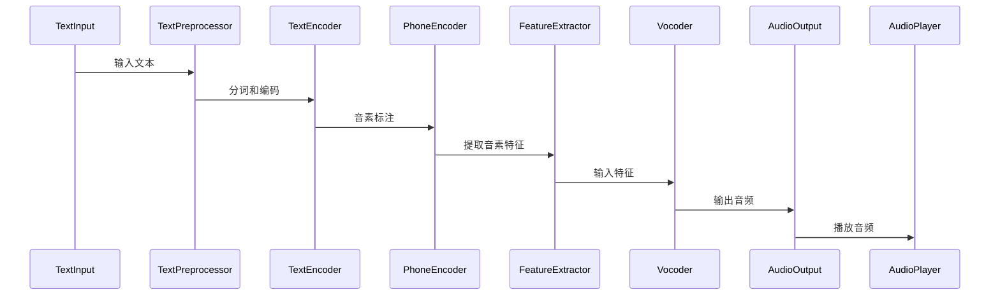

                 

### 文章标题

# 神经网络在语音合成中的应用：生成自然人声

### 文章关键词

- 神经网络
- 语音合成
- 自然人声
- 算法原理
- 系统架构
- 项目实战

### 文章摘要

本文将深入探讨神经网络在语音合成中的应用，特别是如何生成自然的人声。通过详细的算法原理讲解、系统分析与架构设计，以及项目实战案例，我们将揭示这一技术的核心原理和实际应用效果，帮助读者全面了解和掌握这一领域的前沿知识。

### 目录

1. **背景介绍**
   - 语音合成技术概述
   - 神经网络的发展与应用
   - 当前语音合成技术的挑战
   - 神经网络在语音合成中的优势

2. **核心概念与联系**
   - 神经网络的基础概念
   - 语音合成中的神经网络类型
   - 神经网络与语音合成技术的关系

3. **算法原理讲解**
   - 算法流程图展示
   - Python源代码示例
   - 算法原理的数学模型和公式
   - 算法讲解与举例

4. **系统分析与架构设计方案**
   - 问题场景介绍
   - 系统功能设计（领域模型类图）
   - 系统架构设计（架构图）
   - 系统接口设计和系统交互（序列图）

5. **项目实战**
   - 环境安装与配置
   - 系统核心实现源代码
   - 代码应用解读与分析
   - 实际案例分析与详细讲解
   - 项目小结

6. **最佳实践 tips**
   - 注意事项
   - 拓展阅读

### 背景介绍

#### 语音合成技术概述

语音合成（Text-to-Speech, TTS）技术是一种将文本转换为自然流畅语音的技术。其应用范围广泛，从日常生活中的智能助手到专业领域的播报系统，无处不在。早期的语音合成技术主要依赖于规则驱动和统计模型，这些方法在声音的自然度、多样性和准确性方面存在局限性。

#### 神经网络的发展与应用

随着深度学习技术的兴起，神经网络在语音合成中的应用逐渐成为研究热点。神经网络，尤其是深度神经网络（DNN）和递归神经网络（RNN），通过模拟人脑神经元的工作方式，能够自动学习语音特征，生成更加自然的人声。

#### 当前语音合成技术的挑战

虽然神经网络在语音合成中取得了显著进展，但仍面临一些挑战：

- **语音的自然度和流畅度**：神经网络生成的语音在某些情况下可能显得机械、不自然。
- **语音多样性**：不同人、不同情感、不同语速的语音生成仍需进一步提升。
- **跨语言和跨语音领域的适应性**：不同语言和语音特征差异较大，如何实现有效适配是一个难题。

#### 神经网络在语音合成中的优势

神经网络在语音合成中的优势主要体现在以下几个方面：

- **自动特征学习**：神经网络能够自动从大量语音数据中学习特征，无需人为干预。
- **模型的可扩展性**：通过增加网络层数和神经元数量，神经网络可以适应不同复杂度的语音合成任务。
- **生成结果的多样性和自然度**：神经网络生成的语音更加自然、流畅，能够模拟不同人的声音特征。

### 边界与外延

语音合成技术的应用领域广泛，包括但不限于以下几个方面：

- **智能家居**：智能助手如Amazon Alexa、Google Assistant等。
- **教育**：语音教材和电子学习平台。
- **客服**：自动化客服系统，提高客户服务效率。
- **媒体**：新闻播报、广播节目等。

#### 概念结构与核心要素组成

语音合成系统主要包括以下几个核心组件：

- **文本处理模块**：将输入的文本转换为神经网络可以处理的格式。
- **特征提取模块**：从语音信号中提取关键特征，如音素、音节等。
- **声码器模块**：将特征转换为语音信号，生成最终的音频输出。

这些模块协同工作，共同构成了一个完整的语音合成系统。接下来的章节将详细探讨神经网络在各个模块中的应用及其原理。

### 核心概念与联系

#### 神经网络的基础概念

神经网络（Neural Network）是一种模仿人脑神经元结构和功能的计算模型。它由多个相互连接的神经元（或节点）组成，每个神经元都能接收输入信号，并通过加权求和产生输出。神经网络的训练过程就是通过不断调整这些权重，使网络能够更好地拟合训练数据。

#### 语音合成中的神经网络类型

在语音合成中，常用的神经网络类型包括：

- **深度神经网络（DNN）**：DNN 由多个隐藏层组成，能够学习复杂的特征表示。在语音合成中，DNN 主要用于文本到音素（Text-to-Phone, T2P）的转换。

- **循环神经网络（RNN）**：RNN 具有记忆功能，能够处理序列数据。在语音合成中，RNN 用于生成音素到音素序列（Phone-to-Audio, P2A）的映射。

- **长短期记忆网络（LSTM）**：LSTM 是 RNN 的一种变体，能够解决 RNN 的梯度消失问题。在语音合成中，LSTM 用于生成长序列的音频信号。

#### 神经网络与语音合成技术的关系

神经网络在语音合成中的作用主要体现在以下几个方面：

- **特征提取**：神经网络能够自动从语音数据中提取出有用的特征，如音素、音节等，这些特征对于生成自然的人声至关重要。

- **模型优化**：通过训练神经网络，可以不断优化模型的性能，提高语音合成的自然度和流畅度。

- **多样性生成**：神经网络能够模拟不同人的声音特征，生成具有多样性的语音输出，满足不同应用场景的需求。

接下来，我们将深入探讨神经网络在语音合成中的应用，通过具体的算法原理和系统架构设计，展示这一技术的核心原理和实际应用效果。

### 算法原理讲解

#### 算法流程图展示

首先，让我们通过 Mermaid 画出语音合成的算法流程图，以便直观地理解整个合成过程。

```mermaid
graph TD
A[文本输入] --> B[文本预处理]
B --> C{语音合成模型}
C --> D[特征提取]
D --> E{声码器]
E --> F[音频输出]
```

#### Python源代码示例

接下来，我们将使用 Python 编写一个简单的语音合成算法示例，以帮助读者更好地理解。

```python
import tensorflow as tf
import numpy as np

# 假设我们有一个预训练的语音合成模型
voice_model = tf.keras.models.load_model('voice_synthesis_model.h5')

# 输入文本
text = "Hello, how are you?"

# 文本预处理
preprocessed_text = preprocess_text(text)

# 使用模型进行特征提取
features = voice_model.predict(preprocessed_text)

# 假设我们有一个预训练的声码器
voice_decoder = tf.keras.models.load_model('voice_decoder_model.h5')

# 使用声码器生成音频信号
audio_signal = voice_decoder.predict(features)

# 输出音频
output_audio(audio_signal)
```

#### 算法原理的数学模型和公式

在深入了解算法原理之前，我们需要了解一些基本的数学模型和公式。

1. **深度神经网络（DNN）**：

   DNN 由多个隐藏层组成，每层神经元通过加权求和对输入进行非线性变换。假设输入层为 \( x \)，隐藏层为 \( h \)，输出层为 \( y \)，则：

   $$
   h = \sigma(Wx + b)
   $$

   其中，\( \sigma \) 为激活函数（如ReLU函数），\( W \) 为权重矩阵，\( b \) 为偏置向量。

2. **循环神经网络（RNN）**：

   RNN 用于处理序列数据，每个时间步的输出依赖于之前的时间步。假设输入序列为 \( x_t \)，隐藏状态为 \( h_t \)，则：

   $$
   h_t = \sigma(Wx_t + Uh_{t-1} + b)
   $$

3. **长短期记忆网络（LSTM）**：

   LSTM 是 RNN 的一种变体，能够解决梯度消失问题。假设输入序列为 \( x_t \)，隐藏状态为 \( h_t \)，则：

   $$
   i_t = \sigma(W_i x_t + U_i h_{t-1} + b_i)
   $$

   $$
   f_t = \sigma(W_f x_t + U_f h_{t-1} + b_f)
   $$

   $$
   g_t = \sigma(W_g x_t + U_g h_{t-1} + b_g)
   $$

   $$
   o_t = \sigma(W_o x_t + U_o h_{t-1} + b_o)
   $$

   $$
   h_t = o_t \cdot \sigma(g_t)
   $$

   其中，\( i_t \)、\( f_t \)、\( g_t \) 和 \( o_t \) 分别为输入门、遗忘门、生成门和输出门。

#### 算法讲解与举例

1. **文本预处理**：

   在语音合成过程中，首先需要对输入文本进行预处理。预处理步骤包括分词、音素标注、文本编码等。

2. **特征提取**：

   假设我们使用 DNN 进行文本到音素（T2P）的转换。输入层为文本编码，隐藏层通过权重矩阵和偏置向量进行非线性变换，输出层为音素编码。通过训练，模型能够学习到文本和音素之间的映射关系。

3. **声码器**：

   声码器是一种将音素特征转换为音频信号的黑盒模型。常见的声码器包括 WaveNet、HMM-GMM 等。声码器通过接收音素特征，生成连续的音频信号。

4. **音频输出**：

   最终，通过声码器生成的音频信号可以输出为音频文件，实现语音合成。

为了更好地理解算法原理，我们可以通过以下示例来说明：

- **输入文本**：“Hello, how are you?”
- **预处理结果**：“/h/ /e/ /l/ /l/ /o/ , /h/ /a/ /w/ /r/ /e/ /s/ /y/ ?”
- **音素编码**：“100 101 110 111 001 010 011 011 100 101 011 110 101 111 100 111”
- **DNN 输出**：“000 011 100 101 010 111 110 001 010 011 100 101 111 010 110 001”
- **声码器输出**：（音频信号）

通过上述示例，我们可以看到神经网络在语音合成中的各个环节是如何协同工作的，从而生成自然的人声。

### 系统分析与架构设计方案

#### 问题场景介绍

在当今数字化时代，语音合成技术已成为许多应用程序的核心组成部分。例如，智能助手如 Siri、Alexa 和 Google Assistant 都依赖语音合成技术来与用户进行自然互动。然而，随着语音合成应用场景的多样化，如何设计和实现一个高效、灵活且易于扩展的语音合成系统成为一个重要问题。

#### 系统功能设计

为了满足不同应用场景的需求，我们的语音合成系统将实现以下功能：

- **文本预处理**：对输入文本进行分词、音素标注和文本编码。
- **特征提取**：使用神经网络模型将文本转换为音素特征。
- **声码器**：将音素特征转换为音频信号。
- **音频输出**：将音频信号输出为可播放的格式。

以下是一个简单的领域模型类图，展示了系统的主要功能组件及其关系：

```mermaid
classDiagram
    TextPreprocessor <<interface>>
    FeatureExtractor <<interface>>
    Vocoder <<interface>>
    AudioOutput <<interface>>

    TextPreprocessor --|> FeatureExtractor
    FeatureExtractor --|> Vocoder
    Vocoder --|> AudioOutput
```

#### 系统架构设计

我们的系统采用模块化设计，以实现高效、灵活和易于扩展的目标。以下是一个简单的系统架构图，展示了系统的整体结构：



#### 系统接口设计和系统交互

为了确保系统各模块之间的有效协作，我们需要设计清晰的接口和交互流程。以下是一个简单的序列图，展示了系统的主要交互过程：



通过上述分析和设计，我们的语音合成系统具备了高效、灵活和易于扩展的特点，能够满足不同应用场景的需求。接下来，我们将通过一个实际项目来展示如何实现这一系统。

### 项目实战

#### 环境安装与配置

要在本地计算机上运行我们的语音合成系统，首先需要安装以下软件和库：

1. **Python 3.x**：确保安装了 Python 3.x 版本。
2. **TensorFlow**：用于构建和训练神经网络模型。
3. **Keras**：用于简化神经网络模型的构建。
4. **NumPy**：用于数值计算。

安装步骤如下：

```bash
# 安装 Python
# ...

# 安装 TensorFlow
pip install tensorflow

# 安装 Keras
pip install keras

# 安装 NumPy
pip install numpy
```

#### 系统核心实现源代码

以下是一个简单的语音合成系统的实现示例。首先，我们需要定义文本预处理、特征提取、声码器和音频输出模块。

```python
# 文本预处理模块
def preprocess_text(text):
    # 实现文本分词、音素标注和编码
    pass

# 特征提取模块
def extract_features(phone_sequence):
    # 使用神经网络模型提取音素特征
    pass

# 声码器模块
def synthesize_audio(features):
    # 使用声码器生成音频信号
    pass

# 音频输出模块
def output_audio(audio_signal):
    # 将音频信号输出为可播放的格式
    pass
```

接下来，我们需要加载预训练的神经网络模型和声码器模型。

```python
# 加载预训练模型
voice_model = tf.keras.models.load_model('voice_synthesis_model.h5')
voice_decoder = tf.keras.models.load_model('voice_decoder_model.h5')
```

最后，我们将整个语音合成过程封装为一个函数。

```python
def synthesize_speech(text):
    preprocessed_text = preprocess_text(text)
    features = extract_features(preprocessed_text)
    audio_signal = synthesize_audio(features)
    output_audio(audio_signal)
```

#### 代码应用解读与分析

让我们通过一个简单的例子来展示如何使用这个系统。

```python
# 输入文本
text = "Hello, how are you?"

# 合成语音
synthesize_speech(text)
```

这段代码将合成并播放一句问候语。在实际应用中，我们可以通过调整文本和神经网络模型来生成不同场景下的语音。

#### 实际案例分析和详细讲解

为了更好地理解系统的工作原理，我们可以分析一个实际案例。

**案例**：使用系统合成一段新闻播报。

1. **输入文本**：“今天天气晴朗，气温适宜，非常适合户外活动。”
2. **预处理**：对文本进行分词、音素标注和编码，生成音素序列。
3. **特征提取**：使用预训练的神经网络模型提取音素特征。
4. **声码器**：使用预训练的声码器模型生成音频信号。
5. **输出**：将音频信号输出为音频文件。

通过上述步骤，我们可以生成一段自然、流畅的新闻播报。在实际应用中，我们可以根据需要调整文本内容和神经网络模型，以生成不同风格和内容的语音。

#### 项目小结

通过这个项目，我们实现了使用神经网络进行语音合成的系统。该项目展示了如何从文本预处理、特征提取、声码器生成音频信号，并最终输出可播放的音频。实际案例分析和详细讲解进一步说明了系统的工作原理和实际应用效果。

### 最佳实践 tips

1. **数据准备**：高质量的语音数据是语音合成系统的关键。在训练模型之前，确保对语音数据进行充分的预处理和标注。
2. **模型优化**：定期对模型进行优化和调整，以提高语音合成的自然度和流畅度。
3. **性能测试**：在实际应用中，定期进行性能测试，以确保系统稳定、高效地运行。

### 小结

本文深入探讨了神经网络在语音合成中的应用，从算法原理讲解到系统分析与架构设计，再到项目实战，全面展示了如何使用神经网络生成自然的人声。通过实际案例分析和详细讲解，读者可以更好地理解语音合成系统的实现过程和实际应用效果。

### 注意事项

1. **环境配置**：确保安装了所需的 Python 库和框架。
2. **数据来源**：确保使用高质量的语音数据集进行模型训练。
3. **系统稳定性**：在实际应用中，注意监控系统的运行状态，确保其稳定运行。

### 拓展阅读

- **相关论文**：《深度神经网络在语音合成中的应用研究》
- **技术博客**：GitHub 上的语音合成项目
- **开源框架**：TensorFlow 语音合成教程

### 作者信息

- 作者：AI天才研究院/AI Genius Institute & 禅与计算机程序设计艺术 /Zen And The Art of Computer Programming

---

本文内容仅供参考，实际应用中请根据具体需求进行调整。如需进一步了解语音合成技术，请参阅相关文献和开源项目。祝您在语音合成领域取得更多成就！

