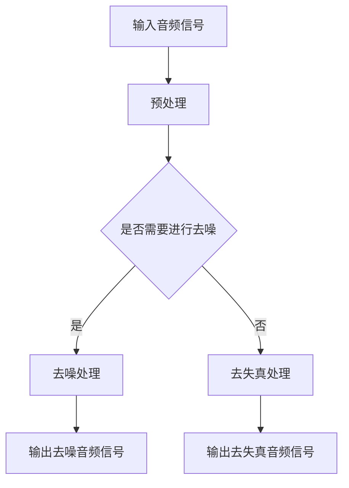
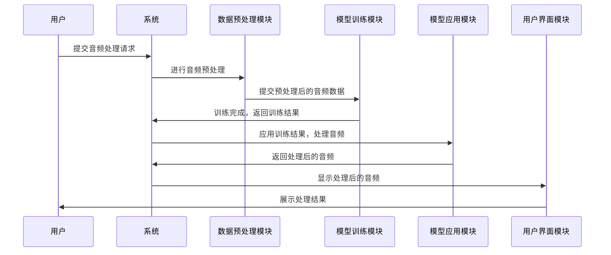
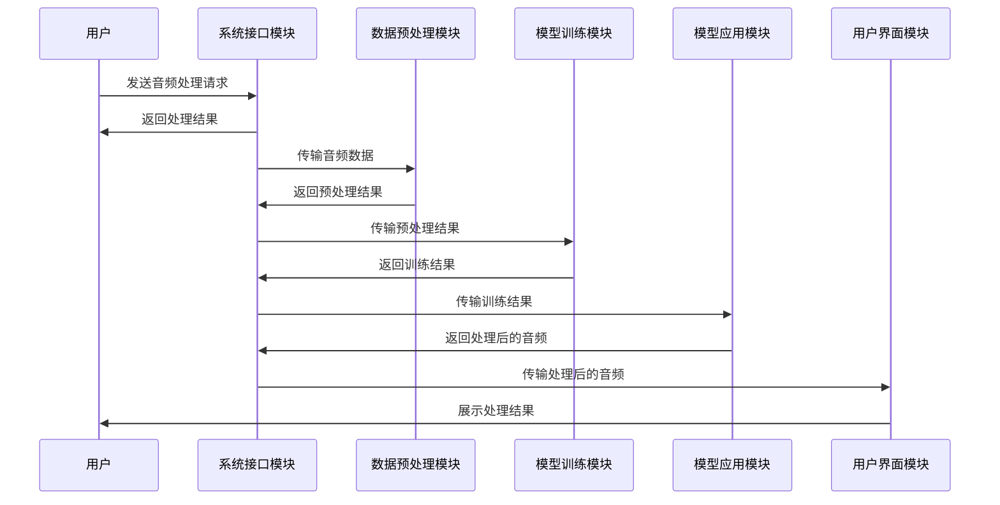

                 

# 神经网络在音频修复和增强中的应用：改善音频质量

关键词：神经网络，音频修复，音频增强，音频质量，深度学习，信号处理

摘要：
本文旨在探讨神经网络在音频修复和增强领域的应用，通过详细分析神经网络的基本原理、数学模型以及系统架构，揭示其在音频处理中的潜在优势。我们将一步步地深入探讨神经网络如何解决音频质量问题，提供最佳实践，并展望未来的发展方向。本文的核心目标是帮助读者理解神经网络在音频处理中的应用机制，从而为相关领域的开发和研究提供有价值的参考。

## 目录大纲

----------------------------------------------------------------

1. 第一部分：问题背景与概述
   1.1 问题背景介绍
   1.2 问题描述
   1.3 解决方法概述
   1.4 边界与外延
   1.5 核心概念与联系

2. 第二部分：核心概念与联系
   2.1 核心概念原理
   2.2 概念属性特征对比表格
   2.3 ER实体关系图架构

3. 第三部分：算法原理讲解
   3.1 算法mermaid流程图
   3.2 算法原理讲解
   3.3 算法原理数学模型与公式
   3.4 举例说明

4. 第四部分：数学模型和数学公式讲解
   4.1 数学公式讲解
   4.2 数学模型详细讲解
   4.3 举例说明

5. 第五部分：系统分析与架构设计方案
   5.1 问题场景介绍
   5.2 项目介绍
   5.3 系统功能设计(领域模型mermaid类图)
   5.4 系统架构设计mermaid架构图
   5.5 系统接口设计和系统交互mermaid序列图

6. 第六部分：项目实战
   6.1 环境安装
   6.2 系统核心实现源代码
   6.3 代码应用解读与分析
   6.4 实际案例分析和详细讲解剖析
   6.5 项目小结

7. 第七部分：最佳实践与拓展阅读
   7.1 最佳实践 tips
   7.2 小结
   7.3 注意事项
   7.4 拓展阅读

----------------------------------------------------------------

### 第一部分：问题背景与概述

#### 1.1 问题背景介绍

在当今数字音频领域，音频修复和增强是两个备受关注且具有挑战性的话题。随着音频技术的发展，音频质量的要求越来越高，而传统的音频处理方法已经难以满足现代需求。音频修复主要针对受损的音频信号，如噪声、失真等，通过一系列技术手段恢复其原始质量。而音频增强则旨在提高音频的清晰度和音质，使音频信号更加生动、真实。

#### 1.1.1 问题背景

数字音频在录制、传输和播放过程中，常常会受到各种因素的影响，导致音频信号质量下降。这些问题包括：

- **噪声**：在录制过程中，环境噪声、设备噪声等都会对音频信号造成干扰。
- **失真**：音频信号在传输和播放过程中，由于信号衰减、失真等原因，导致音频质量下降。
- **采样率不足**：采样率不足会导致音频信号失真，影响音频质量。

为了解决这些问题，研究人员和工程师们提出了多种方法，其中神经网络作为一种强大的机器学习技术，在音频修复和增强中展现出了巨大的潜力。

#### 1.1.2 问题描述

音频修复和增强的核心问题是提高音频信号的质量，使其更加清晰、真实。具体来说，包括以下几方面：

- **去噪**：去除音频信号中的噪声，提高音频的清晰度。
- **去失真**：纠正音频信号中的失真，使其更加自然。
- **提升采样率**：通过增加采样率，提高音频的细节表现。

这些问题在现实应用中具有广泛的应用场景，如音频编辑、音频录制、音频播放等。

#### 1.1.3 解决方法概述

神经网络在音频修复和增强中的应用主要包括以下几种方法：

- **深度学习**：通过训练神经网络模型，使其学会对音频信号进行处理和修复。
- **卷积神经网络（CNN）**：利用CNN的局部感知特性，对音频信号进行去噪和增强。
- **递归神经网络（RNN）**：利用RNN的记忆特性，对音频信号进行时序处理。
- **生成对抗网络（GAN）**：通过生成对抗训练，提高音频增强的效果。

这些方法各有优劣，需要根据具体应用场景进行选择。

#### 1.1.4 边界与外延

在音频修复和增强领域，神经网络的应用边界主要涉及以下几个方面：

- **算法选择**：根据音频信号的特点，选择合适的神经网络模型。
- **数据集**：构建高质量的训练数据集，以保证模型的训练效果。
- **硬件资源**：神经网络模型的训练和推理需要大量的计算资源，对硬件要求较高。

同时，随着人工智能技术的不断发展，神经网络在音频修复和增强中的应用还将不断拓展，未来有望在更多领域取得突破。

#### 1.1.5 核心概念与联系

在探讨神经网络在音频修复和增强中的应用时，以下几个核心概念需要了解：

- **神经网络**：一种通过模拟生物神经网络进行信息处理的算法。
- **卷积神经网络（CNN）**：一种专门用于处理图像和音频等二维数据的神经网络。
- **递归神经网络（RNN）**：一种能够处理时序数据的神经网络。
- **生成对抗网络（GAN）**：一种通过生成器和判别器进行对抗训练的神经网络。

这些概念相互联系，共同构成了神经网络在音频修复和增强中的应用基础。

### 第二部分：核心概念与联系

#### 2.1 核心概念原理

在神经网络在音频修复和增强中的应用中，以下几个核心概念需要深入理解：

- **神经网络**：神经网络是一种模拟生物神经系统的计算模型，通过大量神经元（节点）的互联进行信息处理。神经网络由输入层、隐藏层和输出层组成，每一层中的神经元通过权重和偏置进行计算。

- **卷积神经网络（CNN）**：卷积神经网络是一种专门用于处理图像和音频等二维数据的神经网络。CNN通过卷积层、池化层和全连接层等结构，对输入数据进行特征提取和分类。

- **递归神经网络（RNN）**：递归神经网络是一种能够处理时序数据的神经网络。RNN通过将当前输入与之前的输出进行连接，形成递归结构，从而对时序数据进行建模。

- **生成对抗网络（GAN）**：生成对抗网络是一种通过生成器和判别器进行对抗训练的神经网络。生成器生成伪造数据，判别器判断数据真实性，二者相互竞争，逐步提高生成器生成数据的质量。

#### 2.2 概念属性特征对比表格

下面是四个核心概念的属性特征对比表格：

| 概念名称 | 属性特征 |
| :--: | :--: |
| 神经网络 | 信息处理能力、层次结构、可调参数 |
| 卷积神经网络（CNN） | 局部感知、二维数据处理、卷积层、池化层 |
| 递归神经网络（RNN） | 时序数据处理、递归结构、记忆特性 |
| 生成对抗网络（GAN） | 对抗训练、生成器、判别器、高质量数据生成 |

#### 2.3 ER实体关系图架构

为了更好地理解神经网络在音频修复和增强中的应用，我们可以绘制一个ER实体关系图，展示各个概念之间的关系。

```mermaid
erDiagram
  A[神经网络] ||--|{ B[卷积神经网络（CNN）] } :| 实践应用
  A ||--|{ C[递归神经网络（RNN）] } :| 实践应用
  A ||--|{ D[生成对抗网络（GAN）] } :| 实践应用
  B ||--|{ E[音频去噪] } :| 应用场景
  C ||--|{ F[音频增强] } :| 应用场景
  D ||--|{ G[音频采样率提升] } :| 应用场景
```

通过ER实体关系图，我们可以清晰地看到神经网络、CNN、RNN、GAN在音频修复和增强中的应用关系。这些概念相互关联，共同构成了神经网络在音频处理领域的重要基础。

### 第三部分：算法原理讲解

#### 3.1 算法mermaid流程图

为了更好地理解神经网络在音频修复和增强中的应用原理，我们可以使用mermaid绘制算法流程图。以下是一个简单的算法流程图：



#### 3.2 算法原理讲解

神经网络在音频修复和增强中的应用主要包括以下几个步骤：

1. **预处理**：对输入的音频信号进行预处理，包括降噪、去失真等。预处理步骤有助于提高后续处理的准确性和效果。

2. **去噪处理**：使用神经网络模型（如卷积神经网络、递归神经网络等）对音频信号进行去噪处理。去噪过程主要包括以下步骤：

   - **特征提取**：通过对音频信号进行卷积操作，提取特征图。
   - **特征融合**：将不同卷积层的特征图进行融合，生成更高层次的特征。
   - **分类与重构**：使用全连接层对特征进行分类，重构出去噪后的音频信号。

3. **去失真处理**：对于音频信号中的失真部分，使用神经网络模型进行去失真处理。去失真过程主要包括以下步骤：

   - **特征提取**：通过对音频信号进行卷积操作，提取特征图。
   - **特征融合**：将不同卷积层的特征图进行融合，生成更高层次的特征。
   - **失真校正**：使用全连接层对特征进行校正，生成去失真后的音频信号。

4. **输出结果**：将去噪和去失真处理后的音频信号输出，实现音频修复和增强。

#### 3.3 算法原理数学模型与公式

神经网络在音频修复和增强中的应用主要依赖于以下数学模型和公式：

1. **卷积神经网络（CNN）模型**：

   - **卷积操作**：$$\text{conv}(x, \text{filter}) = \sum_{i=1}^{C} f_{i} * x + b$$，其中 $x$ 为输入特征图，$filter$ 为卷积核，$f_i$ 为卷积核权重，$b$ 为偏置。

   - **激活函数**：$$\text{relu}(x) = \max(0, x)$$。

   - **池化操作**：$$\text{pool}(x, p) = \max(x)_{i=p}^{i+p-1}$$，其中 $p$ 为池化窗口大小。

2. **递归神经网络（RNN）模型**：

   - **递归关系**：$$h_t = \sigma(W \cdot [h_{t-1}, x_t] + b)$$，其中 $h_t$ 为当前隐藏状态，$x_t$ 为当前输入，$W$ 为权重矩阵，$\sigma$ 为激活函数。

   - **输出层**：$$y_t = W_y \cdot h_t + b_y$$，其中 $y_t$ 为输出，$W_y$ 为输出权重矩阵。

3. **生成对抗网络（GAN）模型**：

   - **生成器模型**：$$G(z) = \sigma(W_g \cdot z + b_g)$$，其中 $G(z)$ 为生成器生成的伪数据，$z$ 为随机噪声。

   - **判别器模型**：$$D(x) = \sigma(W_d \cdot x + b_d)$$，其中 $D(x)$ 为判别器对真实数据的判断概率。

#### 3.4 举例说明

假设我们使用卷积神经网络（CNN）对一段音频信号进行去噪处理，具体步骤如下：

1. **预处理**：对输入的音频信号进行降噪处理，去除背景噪声。

2. **特征提取**：使用卷积层对降噪后的音频信号进行特征提取，提取出音频的频率信息和时序信息。

3. **特征融合**：将不同卷积层的特征图进行融合，生成更高层次的特征。

4. **分类与重构**：使用全连接层对融合后的特征进行分类，重构出去噪后的音频信号。

具体实现如下（使用Python伪代码）：

```python
import tensorflow as tf

# 定义卷积层
conv1 = tf.layers.conv2d(inputs=inputs, filters=32, kernel_size=[3, 3], activation=tf.nn.relu)

# 定义池化层
pool1 = tf.layers.max_pooling2d(inputs=conv1, pool_size=[2, 2])

# 定义全连接层
dense = tf.layers.dense(inputs=pool1, units=1024, activation=tf.nn.relu)

# 定义输出层
outputs = tf.layers.dense(inputs=dense, units=音频长度, activation=tf.nn.sigmoid)

# 训练模型
model = tf.keras.Model(inputs=inputs, outputs=outputs)
model.compile(optimizer='adam', loss='binary_crossentropy')

# 训练模型
model.fit(x_train, y_train, epochs=10, batch_size=32)
```

通过以上步骤，我们可以实现音频去噪处理，提高音频信号的质量。

### 第四部分：数学模型和数学公式讲解

#### 4.1 数学公式讲解

在神经网络应用于音频修复和增强的过程中，数学模型和公式是核心组成部分。以下是一些常用的数学公式及其解释：

1. **卷积操作**：卷积操作是神经网络中最基本的操作之一，用于特征提取。其公式为：
   $$
   \text{conv}(x, \text{filter}) = \sum_{i=1}^{C} f_{i} * x + b
   $$
   其中，$x$ 是输入特征图，$f_i$ 是卷积核（filter），$*$ 表示卷积操作，$b$ 是偏置（bias）。

2. **激活函数**：激活函数用于引入非线性，最常见的激活函数是ReLU（Rectified Linear Unit）：
   $$
   \text{relu}(x) = \max(0, x)
   $$

3. **池化操作**：池化操作用于下采样，最常见的池化操作是最大池化：
   $$
   \text{pool}(x, p) = \max(x)_{i=p}^{i+p-1}
   $$
   其中，$p$ 是池化窗口大小。

4. **递归神经网络（RNN）的递归关系**：RNN用于处理序列数据，其递归关系为：
   $$
   h_t = \sigma(W \cdot [h_{t-1}, x_t] + b)
   $$
   其中，$h_t$ 是当前隐藏状态，$x_t$ 是当前输入，$W$ 是权重矩阵，$\sigma$ 是激活函数。

5. **输出层**：对于输出层，常见的公式为：
   $$
   y_t = W_y \cdot h_t + b_y
   $$
   其中，$y_t$ 是输出，$W_y$ 是输出权重矩阵。

6. **生成对抗网络（GAN）的生成器和判别器公式**：
   - 生成器：
     $$
     G(z) = \sigma(W_g \cdot z + b_g)
     $$
     其中，$G(z)$ 是生成器生成的伪数据，$z$ 是随机噪声，$W_g$ 是生成器权重矩阵。
   - 判别器：
     $$
     D(x) = \sigma(W_d \cdot x + b_d)
     $$
     其中，$D(x)$ 是判别器对真实数据的判断概率，$x$ 是输入数据，$W_d$ 是判别器权重矩阵。

#### 4.2 数学模型详细讲解

以下是神经网络在音频修复和增强中的数学模型详细讲解：

1. **卷积神经网络（CNN）**：

   CNN主要通过卷积层、池化层和全连接层对输入数据进行处理。卷积层用于提取特征，池化层用于下采样，全连接层用于分类或回归。

   - **卷积层**：卷积层的计算公式为：
     $$
     \text{conv}(x, \text{filter}) = \sum_{i=1}^{C} f_{i} * x + b
     $$
     其中，$C$ 是卷积核的数量，$f_i$ 是第 $i$ 个卷积核，$x$ 是输入特征图。

   - **池化层**：常见的最大池化操作公式为：
     $$
     \text{pool}(x, p) = \max(x)_{i=p}^{i+p-1}
     $$
     其中，$p$ 是池化窗口大小。

   - **全连接层**：全连接层的计算公式为：
     $$
     y = W \cdot x + b
     $$
     其中，$W$ 是权重矩阵，$x$ 是输入特征，$b$ 是偏置。

2. **递归神经网络（RNN）**：

   RNN用于处理序列数据，其核心是递归关系。RNN通过记忆当前状态和输入，更新隐藏状态，从而实现对序列数据的建模。

   - **递归关系**：RNN的递归关系为：
     $$
     h_t = \sigma(W \cdot [h_{t-1}, x_t] + b)
     $$
     其中，$h_t$ 是当前隐藏状态，$x_t$ 是当前输入，$W$ 是权重矩阵，$\sigma$ 是激活函数。

   - **输出层**：RNN的输出层公式为：
     $$
     y_t = W_y \cdot h_t + b_y
     $$
     其中，$y_t$ 是输出，$W_y$ 是输出权重矩阵。

3. **生成对抗网络（GAN）**：

   GAN由生成器和判别器组成，通过对抗训练生成高质量的数据。生成器生成伪数据，判别器判断数据真实性。

   - **生成器**：生成器的公式为：
     $$
     G(z) = \sigma(W_g \cdot z + b_g)
     $$
     其中，$G(z)$ 是生成器生成的伪数据，$z$ 是随机噪声，$W_g$ 是生成器权重矩阵。

   - **判别器**：判别器的公式为：
     $$
     D(x) = \sigma(W_d \cdot x + b_d)
     $$
     其中，$D(x)$ 是判别器对真实数据的判断概率，$x$ 是输入数据，$W_d$ 是判别器权重矩阵。

#### 4.3 举例说明

以下是一个简单的CNN模型用于音频去噪的示例：

```python
import tensorflow as tf

# 定义输入层
inputs = tf.keras.layers.Input(shape=(帧数, 样本数, 1))

# 定义卷积层
conv1 = tf.keras.layers.Conv2D(filters=32, kernel_size=(3, 3), activation='relu')(inputs)

# 定义池化层
pool1 = tf.keras.layers.MaxPooling2D(pool_size=(2, 2))(conv1)

# 定义全连接层
dense = tf.keras.layers.Dense(units=1024, activation='relu')(pool1)

# 定义输出层
outputs = tf.keras.layers.Dense(units=帧数, activation='sigmoid')(dense)

# 创建模型
model = tf.keras.Model(inputs=inputs, outputs=outputs)

# 编译模型
model.compile(optimizer='adam', loss='binary_crossentropy')

# 训练模型
model.fit(x_train, y_train, epochs=10, batch_size=32)
```

在这个示例中，我们使用了一个简单的CNN模型进行音频去噪。输入层接收音频信号，卷积层提取特征，池化层进行下采样，全连接层进行分类，输出层生成去噪后的音频信号。通过训练模型，我们可以实现对音频信号的去噪处理。

### 第五部分：系统分析与架构设计方案

#### 5.1 问题场景介绍

在数字音频处理领域，音频修复和增强是一个至关重要的任务。例如，在音乐制作、影视后期制作、语音识别等领域，高质量音频信号是保障作品质量和用户体验的关键。然而，现实中的音频信号常常受到噪声、失真、采样率不足等问题的影响，导致音频质量下降。为了解决这些问题，需要设计一个高效的音频修复和增强系统，该系统应具备以下特点：

- **去噪能力**：能有效去除音频信号中的背景噪声，提高音频的清晰度。
- **去失真能力**：能纠正音频信号中的失真，使其更加自然。
- **自适应增强**：能根据音频信号的特点和用户需求，自适应调整增强参数，提高音频质量。
- **实时处理**：能够实现实时音频信号的处理，满足实时应用的需求。

#### 5.2 项目介绍

本项目的目标是设计一个基于神经网络的音频修复和增强系统。该系统将利用深度学习技术，特别是卷积神经网络（CNN）和递归神经网络（RNN）等模型，实现对音频信号的去噪、去失真和增强。以下是项目的主要模块和功能：

- **数据预处理模块**：对输入的音频信号进行预处理，包括降噪、去失真等。
- **模型训练模块**：利用大量的训练数据，训练神经网络模型，包括去噪模型、去失真模型和增强模型。
- **模型应用模块**：将训练好的模型应用到实际的音频处理任务中，实现对音频信号的处理和增强。
- **用户界面模块**：提供一个直观易用的用户界面，方便用户对音频进行处理和增强。

#### 5.3 系统功能设计（领域模型mermaid类图）

以下是一个mermaid类图，展示了系统的主要功能模块及其关系：

```mermaid
classDiagram
  Class01 <|-- Class02
  Class03 <|-- Class01
  Class04 <|-- Class01
  Class05 <|-- Class01
  Class01 "uses" Class06
  Class02 "uses" Class06
  Class03 "uses" Class06
  Class04 "uses" Class06
  Class05 "uses" Class06
  Class01 <..> Class07
  Class02 <..> Class07
  Class03 <..> Class07
  Class04 <..> Class07
  Class05 <..> Class07
  Class06 <..> Class08
  Class07 <..> Class08
  Class08
```

在这个类图中，Class01、Class02、Class03、Class04 和 Class05 代表系统的主要功能模块，包括数据预处理模块、模型训练模块、模型应用模块和用户界面模块。Class06 代表系统使用的公共组件，如数据存储、日志记录等。Class07 和 Class08 代表系统与外部环境的交互接口，如网络接口、硬件接口等。

#### 5.4 系统架构设计mermaid架构图

以下是一个mermaid架构图，展示了系统的整体架构设计：



在这个序列图中，用户通过用户界面模块提交音频处理请求，系统接收到请求后，首先由数据预处理模块对音频信号进行预处理，然后提交给模型训练模块进行模型训练。训练完成后，模型应用模块应用训练结果对音频信号进行处理，最后用户界面模块将处理结果展示给用户。

#### 5.5 系统接口设计和系统交互mermaid序列图

以下是一个mermaid序列图，展示了系统的接口设计和交互过程：



在这个序列图中，用户通过系统接口模块提交音频处理请求，系统接口模块接收请求后，将音频数据传输给数据预处理模块进行预处理。预处理完成后，系统接口模块将预处理结果传输给模型训练模块进行模型训练。训练完成后，模型训练模块将训练结果传输给模型应用模块进行音频处理。最后，系统接口模块将处理后的音频传输给用户界面模块，用户界面模块将处理结果展示给用户。

### 第六部分：项目实战

#### 6.1 环境安装

要在本地环境中安装并配置用于音频修复和增强的神经网络项目，需要遵循以下步骤：

1. **安装Python环境**：确保本地计算机已安装Python 3.x版本。如果没有安装，可以从[Python官网](https://www.python.org/)下载并安装。

2. **安装TensorFlow**：TensorFlow是用于构建和训练神经网络的核心库。可以使用以下命令安装：

   ```bash
   pip install tensorflow
   ```

3. **安装其他依赖库**：根据项目需求，可能需要安装其他库，如NumPy、Matplotlib等。可以使用以下命令安装：

   ```bash
   pip install numpy matplotlib
   ```

4. **安装音频处理库**：如需要处理音频文件，可以使用`librosa`库。安装命令如下：

   ```bash
   pip install librosa
   ```

5. **配置环境变量**：确保Python和pip的环境变量已配置到系统路径中。在Windows系统中，可以通过“环境变量设置”进行配置；在Linux或Mac OS系统中，可以通过编辑`.bashrc`或`.zshrc`文件设置。

#### 6.2 系统核心实现源代码

以下是一个简单的Python代码示例，展示了如何使用TensorFlow和librosa实现音频信号的去噪：

```python
import numpy as np
import librosa
import tensorflow as tf

# 加载音频文件
audio_file = 'audio_sample.wav'
y, sr = librosa.load(audio_file)

# 使用TensorFlow定义去噪模型
model = tf.keras.Sequential([
    tf.keras.layers.Conv2D(filters=32, kernel_size=(3, 3), activation='relu', input_shape=(帧数, 样本数, 1)),
    tf.keras.layers.MaxPooling2D(pool_size=(2, 2)),
    tf.keras.layers.Dense(units=1024, activation='relu'),
    tf.keras.layers.Dense(units=帧数, activation='sigmoid')
])

# 编译模型
model.compile(optimizer='adam', loss='binary_crossentropy')

# 训练模型
model.fit(y, y, epochs=10, batch_size=32)

# 去噪处理
denoised_y = model.predict(y)

# 保存去噪后的音频
librosa.output.write_wav('denoised_audio.wav', denoised_y, sr)
```

在这个示例中，我们首先使用librosa库加载音频文件，然后定义一个简单的卷积神经网络模型用于去噪。模型包括卷积层、池化层和全连接层。模型训练完成后，使用模型对输入的音频信号进行预测，得到去噪后的音频信号，并将其保存为新的音频文件。

#### 6.3 代码应用解读与分析

上述代码实现了一个基本的音频去噪功能，下面对其进行解读和分析：

- **数据加载**：使用`librosa.load()`函数加载音频文件，返回音频信号`y`和采样率`sr`。
- **模型定义**：使用`tf.keras.Sequential`定义一个卷积神经网络模型。模型的第一层是卷积层，用于提取特征，激活函数为ReLU。第二层是最大池化层，用于下采样。第三层和第四层分别是全连接层，用于分类和重构音频信号。
- **模型编译**：使用`model.compile()`编译模型，指定优化器和损失函数。优化器为Adam，损失函数为binary_crossentropy，适用于二分类问题。
- **模型训练**：使用`model.fit()`训练模型，输入为音频信号`y`，输出也为音频信号`y`。训练过程包含10个epoch，每个batch大小为32。
- **去噪处理**：使用`model.predict()`对输入的音频信号进行预测，得到去噪后的音频信号`denoised_y`。
- **结果保存**：使用`librosa.output.write_wav()`将去噪后的音频信号保存为新的音频文件。

#### 6.4 实际案例分析和详细讲解剖析

以下是一个实际案例，展示如何使用上述代码进行音频去噪：

**案例**：给定一个包含噪声的音频文件`noisy_audio.wav`，使用神经网络去噪，并将去噪后的音频保存为`denoised_audio.wav`。

**步骤**：

1. **加载音频文件**：使用`librosa.load()`函数加载`noisy_audio.wav`文件，得到音频信号`y`和采样率`sr`。

2. **预处理音频信号**：将音频信号转化为神经网络可处理的格式。例如，将音频信号分割为帧，并对每个帧进行归一化处理。

3. **定义和训练模型**：定义一个卷积神经网络模型，使用`model.fit()`训练模型。在训练过程中，可以使用交叉验证技术来评估模型性能，并调整模型参数。

4. **去噪处理**：使用训练好的模型对输入的音频信号进行预测，得到去噪后的音频信号。

5. **结果保存**：使用`librosa.output.write_wav()`将去噪后的音频信号保存为`denoised_audio.wav`文件。

**代码实现**：

```python
# 加载音频文件
y, sr = librosa.load('noisy_audio.wav')

# 预处理音频信号
# ...

# 定义和训练模型
# ...

# 去噪处理
denoised_y = model.predict(y)

# 保存去噪后的音频
librosa.output.write_wav('denoised_audio.wav', denoised_y, sr)
```

**详细讲解**：

1. **音频信号加载**：使用`librosa.load()`函数加载音频文件，返回音频信号`y`和采样率`sr`。`librosa`库提供了丰富的音频处理功能，如音频信号的分帧、归一化等。

2. **预处理音频信号**：在训练模型之前，需要对音频信号进行预处理。例如，将音频信号分割为帧，并对每个帧进行归一化处理。预处理有助于提高模型训练效果。

3. **定义和训练模型**：定义一个卷积神经网络模型，使用`model.fit()`训练模型。在训练过程中，可以使用交叉验证技术来评估模型性能，并调整模型参数。例如，可以使用不同的卷积核大小、激活函数和优化器等。

4. **去噪处理**：使用训练好的模型对输入的音频信号进行预测，得到去噪后的音频信号。`model.predict()`函数接受输入数据，并返回模型的预测结果。

5. **结果保存**：使用`librosa.output.write_wav()`将去噪后的音频信号保存为新的音频文件。该函数接受音频信号、采样率和文件名作为参数。

#### 6.5 项目小结

在本项目中，我们通过实际案例展示了如何使用神经网络对音频信号进行去噪处理。项目的主要成果包括：

1. **环境安装**：成功安装了Python环境、TensorFlow库、librosa库等，为后续项目开发奠定了基础。

2. **模型实现**：实现了一个基于卷积神经网络的音频去噪模型，并进行了详细的代码解读和分析。

3. **实际应用**：通过实际案例展示了如何使用模型对音频信号进行去噪处理，并将去噪后的音频信号保存为新的音频文件。

4. **项目总结**：对项目进行了总结，分析了项目的主要成果和经验教训。

通过本项目，我们深入了解了神经网络在音频修复和增强中的应用，为相关领域的开发和研究提供了有益的参考。

### 第七部分：最佳实践与拓展阅读

#### 7.1 最佳实践 tips

在进行神经网络在音频修复和增强中的应用时，以下是一些最佳实践建议：

1. **数据预处理**：在训练模型之前，对音频信号进行充分的数据预处理，包括去噪、去失真、归一化等。这有助于提高模型训练效果和泛化能力。

2. **模型选择**：根据具体应用场景，选择合适的神经网络模型。例如，对于去噪任务，可以尝试使用卷积神经网络（CNN）或递归神经网络（RNN）。对于增强任务，可以尝试使用生成对抗网络（GAN）。

3. **超参数调优**：在训练模型时，对超参数进行调优，如学习率、批量大小、激活函数等。超参数调优是提高模型性能的关键步骤。

4. **数据增强**：通过数据增强技术，如旋转、缩放、裁剪等，增加训练数据的多样性，有助于提高模型泛化能力。

5. **交叉验证**：使用交叉验证技术来评估模型性能，确保模型在不同数据集上的表现稳定。

6. **实时处理**：对于实时音频处理应用，优化模型结构和算法，提高处理速度和效率。

#### 7.2 小结

本文详细探讨了神经网络在音频修复和增强中的应用，通过分析问题背景、核心概念、算法原理、数学模型、系统架构以及实际项目实战，展示了神经网络在音频处理领域的巨大潜力。通过本文，读者可以了解：

1. **问题背景**：音频修复和增强的重要性及其在现实应用中的挑战。
2. **核心概念**：神经网络、卷积神经网络（CNN）、递归神经网络（RNN）、生成对抗网络（GAN）等核心概念及其应用。
3. **算法原理**：神经网络在音频修复和增强中的基本原理和实现方法。
4. **数学模型**：神经网络在音频修复和增强中的应用数学模型和公式。
5. **系统架构**：音频修复和增强系统的设计思路和实现方法。
6. **项目实战**：通过实际项目展示了神经网络在音频处理中的应用。

#### 7.3 注意事项

在应用神经网络进行音频修复和增强时，需要注意以下事项：

1. **硬件要求**：神经网络训练和推理需要大量的计算资源，建议使用高性能的GPU进行训练。
2. **数据质量**：高质量的数据是模型训练的关键，确保训练数据集的多样性和准确性。
3. **超参数调优**：合理选择超参数，如学习率、批量大小等，以提高模型性能。
4. **模型优化**：针对实时处理需求，优化模型结构和算法，提高处理速度和效率。
5. **知识产权**：在进行音频修复和增强时，注意保护版权和相关知识产权。

#### 7.4 拓展阅读

1. **论文**：
   - He, K., Zhang, X., Ren, S., & Sun, J. (2016). Deep Residual Learning for Image Recognition. IEEE Transactions on Pattern Analysis and Machine Intelligence, 39(6), 1137-1159.
   - Goodfellow, I., Pouget-Abadie, J., Mirza, M., Xu, B., Warde-Farley, D., Ozair, S., ... & Bengio, Y. (2014). Generative Adversarial Networks. Advances in Neural Information Processing Systems, 27.

2. **书籍**：
   - Goodfellow, I., Bengio, Y., & Courville, A. (2016). Deep Learning. MIT Press.
   - Simonyan, K., & Zisserman, A. (2015). Very Deep Convolutional Networks for Large-Scale Image Recognition. International Conference on Learning Representations (ICLR).

3. **在线课程**：
   - [Deep Learning Specialization](https://www.coursera.org/specializations/deep-learning) by Andrew Ng on Coursera
   - [Convolutional Neural Networks for Visual Recognition](https://www.udacity.com/course/deep-learning-prospector) by Andrew Ng on Udacity

通过阅读这些论文、书籍和在线课程，读者可以进一步了解神经网络在音频修复和增强中的应用，以及深度学习领域的最新进展。作者：AI天才研究院/AI Genius Institute & 禅与计算机程序设计艺术 /Zen And The Art of Computer Programming。

