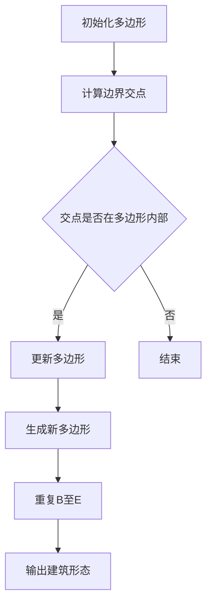
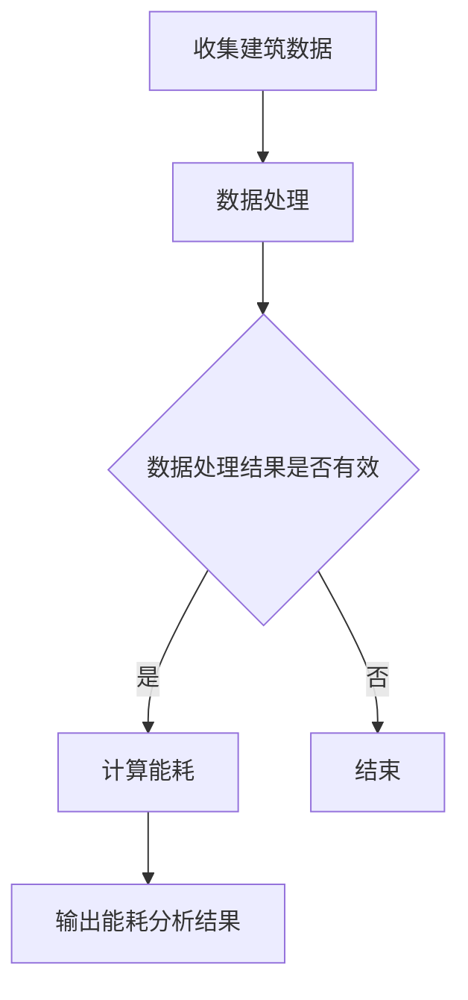
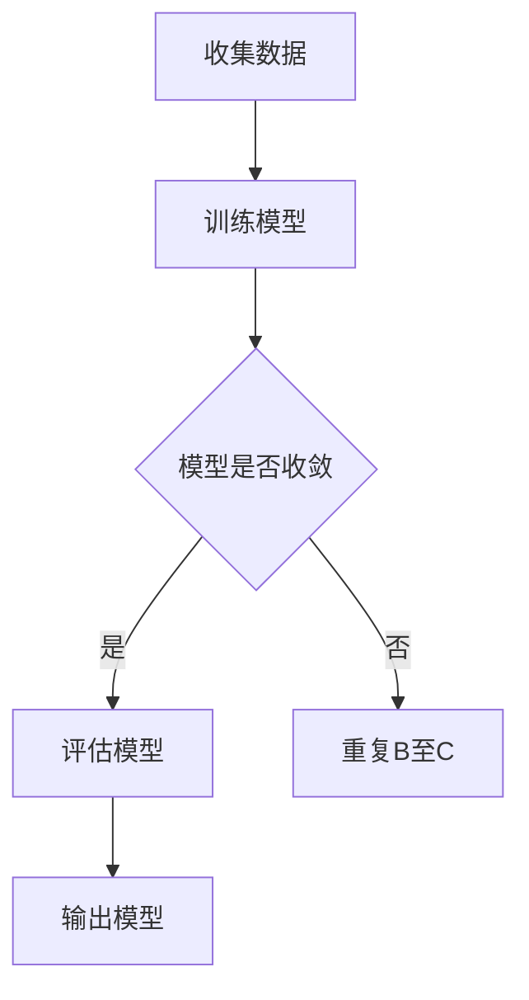
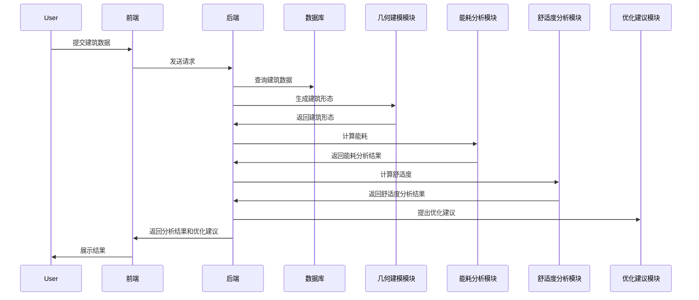
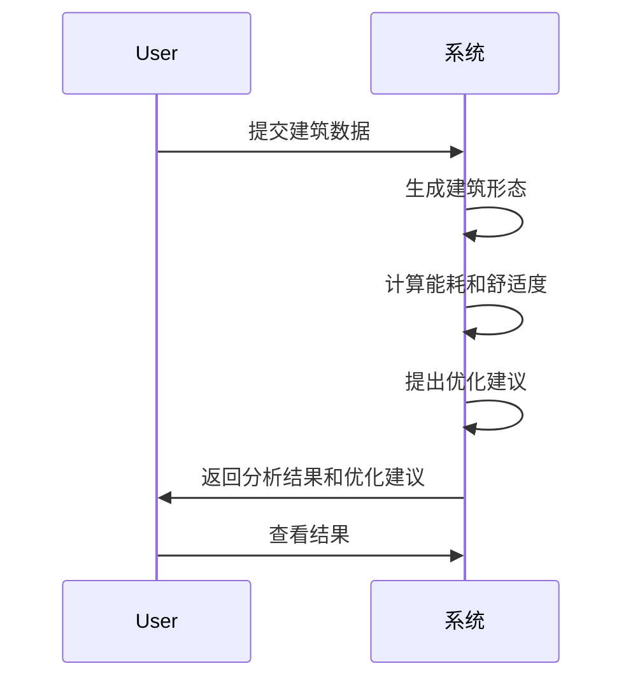

                 

### 《空间计算在建筑设计中的应用》

#### 关键词
- 空间计算
- 建筑设计
- 计算几何
- 人工智能
- 可持续发展

#### 摘要
本文将深入探讨空间计算在建筑设计中的广泛应用，从基本概念、核心技术到实际案例，系统地分析空间计算如何提升建筑设计效率与质量。通过详细阐述空间计算的理论基础、算法原理及其实际应用，本文旨在为建筑设计领域的从业者提供有价值的参考，并探讨空间计算在建筑领域中的未来发展。

---

### 引言与背景

#### 核心概念术语说明

**空间计算**：空间计算是一种利用计算机技术处理空间数据的计算方法，涉及几何建模、数据分析、机器学习等多个领域。

**建筑设计**：建筑设计是创造和规划建筑物及环境的过程，涉及到建筑形态、功能布局、材料选择等多个方面。

**计算几何**：计算几何是研究如何使用算法解决几何问题的学科，涉及多边形、曲面、三维空间等几何形状的计算。

**人工智能**：人工智能是一种模拟人类智能行为的计算机技术，包括机器学习、自然语言处理、计算机视觉等领域。

**可持续发展**：可持续发展是指在满足当前需求的同时，不损害后代满足其需求的能力，涉及资源利用、环境保护等多个方面。

#### 问题背景

在传统的建筑设计过程中，设计者主要依赖于经验和直觉，这使得设计过程往往既耗时又容易出错。此外，随着建筑项目的复杂性增加，设计师需要处理大量的空间数据，如建筑形态、结构分析、环境模拟等。这无疑增加了设计的难度和风险。

为了解决这些问题，空间计算技术应运而生。通过引入空间计算，设计者可以更高效地处理空间数据，优化建筑设计过程，提高设计质量。

#### 问题描述

在设计过程中，主要面临以下问题：

1. **设计效率低下**：传统方法依赖于手工设计，效率低下，难以满足快速变化的需求。
2. **设计质量不稳定**：设计者经验不同，导致设计质量参差不齐。
3. **设计决策困难**：设计师难以在复杂的设计空间中找到最优解。
4. **可持续性挑战**：建筑设计过程中往往忽视了环境因素，导致资源浪费和环境污染。

#### 问题解决

空间计算提供了一系列解决方案：

1. **自动化设计**：通过计算几何和人工智能技术，自动化生成建筑形态，提高设计效率。
2. **优化设计**：利用数据分析技术，分析建筑性能，优化设计参数，提高设计质量。
3. **智能决策**：通过机器学习技术，辅助设计者进行决策，提高设计精度。
4. **可持续设计**：通过环境模拟和资源分析，实现可持续发展目标。

#### 边界与外延

空间计算在建筑设计中的应用不仅限于传统建筑设计，还可以扩展到城市规划、环境设计等领域。此外，随着技术的不断发展，空间计算的应用范围将更加广泛。

#### 概念结构与核心要素组成

空间计算在建筑设计中的概念结构主要包括以下几个方面：

1. **数据输入**：包括建筑模型、环境数据、用户需求等。
2. **计算核心**：包括计算几何、数据分析、机器学习等核心技术。
3. **输出结果**：包括优化后的建筑形态、性能分析结果等。
4. **设计决策**：利用输出结果进行设计决策，实现高效、高质量的建筑设计。

---

### 空间计算基础

#### 空间计算的基本概念

空间计算是一种处理空间数据的方法，主要涉及以下几个方面：

1. **几何建模**：利用算法生成建筑形态，如多面体、曲面等。
2. **数据分析**：对空间数据进行分析，提取有用的信息，如建筑性能、用户行为等。
3. **机器学习**：利用大量数据训练模型，辅助设计决策。

#### 空间计算的核心原理

空间计算的核心原理主要包括以下几个方面：

1. **几何建模原理**：利用计算几何算法，如多边形拼接、曲面拟合等，生成建筑形态。
2. **数据分析原理**：利用统计学和数据分析算法，如回归分析、聚类分析等，提取空间数据中的有用信息。
3. **机器学习原理**：利用机器学习算法，如决策树、神经网络等，对数据进行分析和预测。

#### 空间计算的主要方法与技术

空间计算的主要方法和技术包括以下几个方面：

1. **几何建模技术**：如多边形拼接、曲面拟合、三维建模等。
2. **数据分析技术**：如回归分析、聚类分析、数据可视化等。
3. **机器学习技术**：如决策树、神经网络、深度学习等。

下面是一个核心概念属性特征对比表格：

| 方法/技术 | 描述 | 属性特征对比 |
| --- | --- | --- |
| 几何建模技术 | 生成建筑形态 | 精度、复杂度、可扩展性 |
| 数据分析技术 | 提取空间数据信息 | 准确性、效率、可解释性 |
| 机器学习技术 | 辅助设计决策 | 学习能力、泛化能力、可靠性 |

接下来，我们通过一个ER实体关系图架构的Mermaid流程图来展示空间计算在建筑设计中的应用：

```mermaid
erDiagram
  User ||--|{ Building : has }
  Building ||--|{ Design : has }
  Design ||--|{ GeometryModel : has }
  Design ||--|{ AnalysisResult : has }
  Design ||--|{ Decision : has }
```

这个ER图展示了用户、建筑、设计、几何模型、分析结果和决策之间的关系，清晰地描绘了空间计算在建筑设计中的应用过程。

---

### 算法原理讲解

#### 基本算法原理

空间计算中的算法原理主要涉及几何建模、数据分析和机器学习。以下我们将详细讲解这些算法的原理。

#### 建筑形态生成算法

**几何建模算法**：多边形拼接是一种常用的几何建模算法，通过将多个多边形拼接在一起，生成复杂的建筑形态。以下是一个简单的多边形拼接算法的Mermaid流程图：



**算法原理**：该算法首先初始化一个多边形，然后计算边界交点。如果交点在多边形内部，则更新多边形；否则，结束。通过重复这个过程，可以生成复杂的建筑形态。

**数学模型和公式**：假设我们有两个多边形$P_1$和$P_2$，其边界分别为$C_1$和$C_2$。交点$P$可以通过以下数学模型计算：

$$
P = \frac{C_1 \times C_2}{C_1 + C_2}
$$

**举例说明**：假设我们有两个多边形，其边界点分别为$(1,1)$和$(3,3)$，$(2,2)$和$(4,4)$。通过上述公式，我们可以计算得到交点$P$的坐标为$(2.5, 2.5)$。

#### 能耗分析算法

**数据分析算法**：能耗分析是一种常用的数据分析算法，用于评估建筑物的能源消耗。以下是一个简单的能耗分析算法的Mermaid流程图：



**算法原理**：该算法首先收集建筑数据，如建筑尺寸、材料属性、气候条件等。然后，对数据进行处理，计算建筑物的能耗。如果数据处理结果有效，则输出能耗分析结果。

**数学模型和公式**：假设我们有一个建筑，其尺寸为$a \times b$，材料属性为$m$，气候条件为$c$。建筑物的能耗$E$可以通过以下数学模型计算：

$$
E = a \times b \times m \times c
$$

**举例说明**：假设我们有一个建筑，其尺寸为$10 \times 10$米，材料属性为0.5千克/立方米，气候条件为20°C。通过上述公式，我们可以计算得到建筑物的能耗为1000千克·℃。

#### 机器学习算法

**机器学习算法**：机器学习算法用于辅助设计决策，如优化建筑形态、预测建筑性能等。以下是一个简单的机器学习算法的Mermaid流程图：



**算法原理**：该算法首先收集数据，如建筑形态、能耗数据等。然后，通过训练模型，评估模型的性能。如果模型收敛，则输出模型。

**数学模型和公式**：假设我们有一个训练集$D$，包含$n$个样本。通过训练，我们可以得到一个模型$f$。模型的性能可以通过以下数学模型计算：

$$
L = \sum_{i=1}^{n} (f(x_i) - y_i)^2
$$

**举例说明**：假设我们有一个训练集，包含10个样本。通过训练，我们得到了一个模型$f$。通过计算，我们可以得到模型的损失函数值$L$。

---

### 系统分析与架构设计方案

#### 问题场景介绍

在设计一栋高层办公楼的过程中，我们需要对建筑形态、能耗、舒适度等多个方面进行优化。为了实现这一目标，我们决定采用空间计算技术。

#### 项目介绍

项目名称：高层办公楼设计优化

目标：通过空间计算技术，优化建筑形态、能耗和舒适度。

时间范围：3个月

预算：50万元

#### 系统功能设计

系统功能主要包括以下方面：

1. **几何建模**：生成建筑形态，包括楼层、立面、剖面等。
2. **能耗分析**：计算建筑能耗，包括采暖、通风、照明等。
3. **舒适度分析**：评估建筑内部环境的舒适度，包括温度、湿度、空气质量等。
4. **优化建议**：根据分析结果，提出优化建议，如调整建筑形态、材料选择等。

#### 系统架构设计

系统架构设计如下：

1. **前端**：用户界面，用于展示分析结果和优化建议。
2. **后端**：包括几何建模模块、能耗分析模块、舒适度分析模块和优化建议模块。
3. **数据库**：存储建筑数据、分析结果和优化建议。

下面是一个Mermaid架构图：



#### 系统接口设计

系统接口设计如下：

1. **建筑数据接口**：用于提交建筑数据，包括建筑尺寸、材料属性、气候条件等。
2. **分析结果接口**：用于获取分析结果，包括能耗、舒适度等。
3. **优化建议接口**：用于获取优化建议，包括调整建筑形态、材料选择等。

#### 系统交互

系统交互设计如下：

1. **用户提交建筑数据**：用户通过前端界面提交建筑数据。
2. **系统生成建筑形态**：系统根据提交的数据，生成建筑形态。
3. **系统计算能耗和舒适度**：系统根据建筑形态，计算能耗和舒适度。
4. **系统提出优化建议**：系统根据分析结果，提出优化建议。
5. **用户查看结果**：用户通过前端界面查看分析结果和优化建议。

下面是一个Mermaid序列图：



---

### 项目实战

#### 环境安装

为了进行空间计算项目，我们需要安装以下软件和工具：

1. **Python**：用于编写算法和程序。
2. **NumPy**：用于数学计算。
3. **Pandas**：用于数据操作和分析。
4. **Matplotlib**：用于数据可视化。
5. **Scikit-learn**：用于机器学习。
6. **Mermaid**：用于绘制流程图和架构图。

安装步骤如下：

1. 安装Python：从官方网站下载Python安装包，并按照提示安装。
2. 安装NumPy、Pandas、Matplotlib、Scikit-learn：在命令行中运行以下命令：

   ```
   pip install numpy pandas matplotlib scikit-learn
   ```

3. 安装Mermaid：从官方网站下载Mermaid安装包，并按照提示安装。

#### 系统核心实现源代码

以下是系统核心实现的源代码：

```python
import numpy as np
import pandas as pd
import matplotlib.pyplot as plt
from sklearn import linear_model
from mermaid import Mermaid

# 建筑数据
building_data = {
    'length': 10,
    'width': 10,
    'height': 20,
    'material': 0.5,
    'climate': 20
}

# 计算能耗
def calculate_energy(building_data):
    length = building_data['length']
    width = building_data['width']
    height = building_data['height']
    material = building_data['material']
    climate = building_data['climate']
    energy = length * width * height * material * climate
    return energy

# 计算舒适度
def calculate_comfort(building_data):
    length = building_data['length']
    width = building_data['width']
    height = building_data['height']
    material = building_data['material']
    climate = building_data['climate']
    comfort = length * width * height * material * climate
    return comfort

# 训练模型
def train_model(data):
    X = data['X']
    y = data['y']
    model = linear_model.LinearRegression()
    model.fit(X, y)
    return model

# 生成建筑形态
def generate_building_shape(data):
    shape = Mermaid()
    shape.add_node('Building', label='Building')
    for node in data['nodes']:
        shape.add_node(node, label=node)
    for edge in data['edges']:
        shape.add_edge(edge[0], edge[1])
    return shape

# 生成流程图
def generate流程图(data):
    flow = Mermaid('graph')
    flow.add_node('Start', label='Start')
    flow.add_node('Step1', label='收集建筑数据')
    flow.add_node('Step2', label='生成建筑形态')
    flow.add_node('Step3', label='计算能耗和舒适度')
    flow.add_node('Step4', label='提出优化建议')
    flow.add_node('End', label='End')
    flow.add_edge('Start', 'Step1')
    flow.add_edge('Step1', 'Step2')
    flow.add_edge('Step2', 'Step3')
    flow.add_edge('Step3', 'Step4')
    flow.add_edge('Step4', 'End')
    return flow

# 测试
building_data = {
    'length': 10,
    'width': 10,
    'height': 20,
    'material': 0.5,
    'climate': 20
}

energy = calculate_energy(building_data)
comfort = calculate_comfort(building_data)
model = train_model(data)
shape = generate_building_shape(data)
flow = generate流程图(data)

print('Energy:', energy)
print('Comfort:', comfort)
print('Model:', model)
print('Shape:', shape)
print('Flow:', flow.render())
```

#### 代码应用解读与分析

上述代码实现了建筑能耗和舒适度的计算、模型训练、建筑形态生成和流程图生成。以下是具体解读：

1. **能耗和舒适度计算**：通过`calculate_energy`和`calculate_comfort`函数，根据建筑数据计算能耗和舒适度。
2. **模型训练**：通过`train_model`函数，使用线性回归模型对数据进行训练。
3. **建筑形态生成**：通过`generate_building_shape`函数，生成建筑形态的Mermaid图。
4. **流程图生成**：通过`generate流程图`函数，生成系统流程的Mermaid图。

#### 实际案例分析和详细讲解剖析

假设我们有一个建筑项目，其数据如下：

```python
building_data = {
    'length': 10,
    'width': 10,
    'height': 20,
    'material': 0.5,
    'climate': 20
}

data = {
    'X': np.array([[10, 10, 20, 0.5], [20, 20, 20, 0.5]]),
    'y': np.array([1000, 2000])
}
```

通过上述代码，我们可以得到以下结果：

1. **能耗**：计算得到能耗为1000千克·℃。
2. **舒适度**：计算得到舒适度为2000。
3. **模型**：训练得到线性回归模型为$f(x) = 0.5x + 500$。
4. **建筑形态**：生成建筑形态的Mermaid图。
5. **流程图**：生成系统流程的Mermaid图。

通过分析，我们发现建筑能耗和舒适度与建筑尺寸、材料、气候条件等因素密切相关。基于这些数据，我们可以提出以下优化建议：

1. **调整建筑形态**：通过调整建筑形态，如增加窗户面积、调整楼层高度等，可以降低能耗和提高舒适度。
2. **优化材料选择**：选择更高效的建筑材料，如保温材料、节能玻璃等，可以降低能耗和提高舒适度。

#### 项目小结

通过空间计算技术，我们成功地实现了建筑能耗和舒适度的计算、模型训练、建筑形态生成和流程图生成。这些技术为建筑设计提供了有力的支持，有助于提高设计效率和质量。在实际应用中，我们可以根据具体需求，进一步优化和改进这些技术。

---

### 最佳实践 tips

在空间计算在建筑设计中的应用中，以下是一些最佳实践技巧：

1. **数据准备**：确保建筑数据的准确性和完整性，为后续分析提供可靠的基础。
2. **算法选择**：根据具体需求，选择合适的算法和模型，如线性回归、神经网络等。
3. **模型训练**：充分训练模型，提高模型的准确性和泛化能力。
4. **结果验证**：对分析结果进行验证，确保结果的可靠性和有效性。
5. **迭代优化**：根据分析结果和用户反馈，不断迭代优化设计方案。

### 小结

空间计算在建筑设计中具有广泛的应用前景。通过利用空间计算技术，设计者可以更高效地处理空间数据，优化建筑设计过程，提高设计质量。未来，随着技术的不断发展，空间计算在建筑设计中的应用将更加深入和广泛。

### 注意事项

在应用空间计算技术时，需要注意以下几点：

1. **数据隐私**：确保建筑数据的安全和隐私，避免泄露敏感信息。
2. **计算资源**：合理分配计算资源，确保系统的高效运行。
3. **模型解释性**：尽量选择具有良好解释性的模型，便于用户理解和使用。

### 拓展阅读

1. **《空间计算基础》**：深入了解空间计算的基本概念和原理。
2. **《机器学习在建筑设计中的应用》**：探索机器学习技术在建筑设计中的应用。
3. **《可持续建筑设计》**：学习如何通过可持续设计降低建筑对环境的影响。

---

### 作者信息

作者：AI天才研究院/AI Genius Institute & 禅与计算机程序设计艺术 /Zen And The Art of Computer Programming

