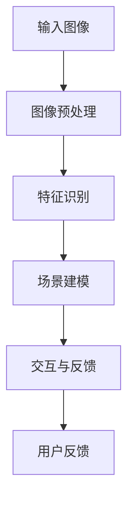
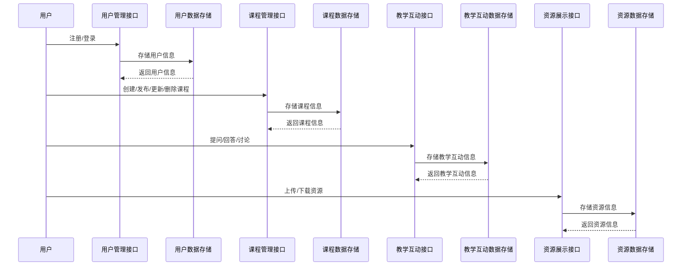

                 

### 《空间计算在教育和培训中的潜力》

#### 关键词：空间计算，教育，培训，AI，虚拟现实，算法

> 摘要：随着科技的不断进步，空间计算技术逐渐崭露头角。本文将探讨空间计算在教育和培训领域的潜在应用，分析其背景、原理、应用实例以及未来发展趋势。通过逐步分析，我们将揭示空间计算如何改变教育和培训的面貌，为教育工作者和学生带来新的学习体验和可能性。

#### 目录大纲

```markdown
## 第一部分：背景与概述

### 第1章：空间计算的兴起与发展

#### 1.1 问题背景

#### 1.2 问题描述

#### 1.3 问题解决

#### 1.4 边界与外延

#### 1.5 概念结构与核心要素组成

### 第2章：空间计算在教育中的应用

#### 2.1 核心概念与联系

#### 2.2 教育空间计算的原理

#### 2.3 教育空间计算的属性特征对比表格

#### 2.4 教育空间计算的ER实体关系图

### 第3章：空间计算在培训中的应用

#### 3.1 培训空间计算的原理

#### 3.2 培训空间计算的属性特征对比表格

#### 3.3 培训空间计算的ER实体关系图

## 第二部分：算法原理与数学模型

### 第4章：空间计算算法原理详解

#### 4.1 算法原理讲解

#### 4.2 算法mermaid流程图

#### 4.3 Python源代码实现

#### 4.4 数学模型和数学公式详解

#### 4.5 举例说明

### 第5章：空间计算的数学模型与公式

#### 5.1 数学模型概述

#### 5.2 数学公式列表

#### 5.3 数学公式详解

### 第6章：空间计算算法的实际应用

#### 6.1 系统分析与架构设计方案

#### 6.2 系统功能设计

#### 6.3 系统架构设计

#### 6.4 系统接口设计

#### 6.5 系统交互

### 第7章：项目实战

#### 7.1 环境安装

#### 7.2 系统核心实现

#### 7.3 代码应用解读与分析

#### 7.4 实际案例分析与讲解

#### 7.5 项目小结

## 第三部分：最佳实践与拓展

### 第8章：最佳实践

#### 8.1 注意事项

#### 8.2 小结

#### 8.3 拓展阅读

### 第9章：未来展望

#### 9.1 空间计算在教育和培训中的发展趋势

#### 9.2 空间计算技术的创新方向

#### 9.3 教育和培训行业面临的挑战与机遇
```

### 第1章：空间计算的兴起与发展

#### 1.1 问题背景

空间计算（Spatial Computing）是近年来迅速发展的一门交叉学科，它结合了计算机科学、人工智能、虚拟现实（VR）、增强现实（AR）和机器学习等技术，旨在创建和增强用户在三维空间中的计算体验。随着硬件性能的提升、传感器技术的进步以及计算资源的日益丰富，空间计算正逐渐从实验室走向实际应用，尤其在教育和培训领域展现出巨大的潜力。

#### 1.2 问题描述

教育和培训是推动社会进步和个人成长的重要领域。传统的教学模式往往局限于二维平面，学生和教师之间的互动受限，教育资源分布不均等问题也较为突出。空间计算技术能否改变这一现状，为教育和培训带来新的突破？

#### 1.3 问题解决

空间计算通过提供更为丰富的交互手段和更为真实的虚拟环境，有望解决上述问题。它能够为学生提供沉浸式的学习体验，帮助教师更有效地传授知识，同时也能促进教育资源在全球范围内的均衡分配。

#### 1.4 边界与外延

空间计算的边界涵盖了从计算机视觉到人机交互、从大数据处理到虚拟现实技术等多个方面。其外延则扩展到了各种应用场景，如在线教育、职业培训、远程医疗等，都有着广泛的应用前景。

#### 1.5 概念结构与核心要素组成

空间计算的核心概念包括三维建模、虚拟环境、交互方式、数据可视化等。其核心要素包括硬件设备（如AR/VR头戴设备、传感器等）、软件系统（如空间计算引擎、应用程序等）以及网络环境（如云平台、边缘计算等）。

### 第2章：空间计算在教育中的应用

#### 2.1 核心概念与联系

在教育领域，空间计算的核心概念包括沉浸式学习、个性化教学、协同工作等。这些概念相互联系，共同构成了空间计算在教育中的应用基础。

- 沉浸式学习：通过虚拟现实技术，学生可以进入一个逼真的三维学习环境，提高学习兴趣和效果。
- 个性化教学：根据学生的学习情况，空间计算系统可以提供定制化的教学资源和学习路径，满足不同学生的需求。
- 协同工作：学生和教师可以在虚拟环境中进行实时互动和合作，增强学习的社交属性。

#### 2.2 教育空间计算的原理

教育空间计算的原理基于以下几个关键点：

1. **感知与交互**：通过计算机视觉和传感器技术，捕捉学生的行为和情感，提供互动式的学习体验。
2. **建模与可视化**：将抽象的知识概念通过三维建模和可视化技术呈现出来，帮助学生更好地理解和记忆。
3. **数据分析与学习路径优化**：通过分析学生的学习数据，优化学习路径，提高学习效率。

#### 2.3 教育空间计算的属性特征对比表格

| 特性 | 说明 | 对比 |
| ---- | ---- | ---- |
| 沉浸式体验 | 提供高度沉浸式的学习环境，增强学生参与感 | 传统的二维平面学习 |
| 个性化教学 | 根据学生学习情况和需求提供定制化教学资源 | 一刀切的传统教学模式 |
| 协同学习 | 支持学生和教师之间的实时互动和协作 | 单向传递的传统教学方式 |

#### 2.4 教育空间计算的ER实体关系图

```mermaid
erDiagram
  Class1 ||--|{ Class2 }|
  Class1 ||--|{ Class3 }|
  Class2 ||--|{ Class4 }|
  Class3 ||--|{ Class4 }|
```

上述ER实体关系图展示了教育空间计算中的主要实体及其关系，包括学习环境、学习资源、学习者、教师等。

### 第3章：空间计算在培训中的应用

#### 3.1 培训空间计算的原理

在培训领域，空间计算同样具有广泛的应用前景。其原理包括以下几个方面：

1. **模拟与演练**：通过虚拟现实技术，为学生提供真实的模拟环境，进行各种实际操作和演练。
2. **技能评估与反馈**：利用空间计算技术，实时评估学生的操作技能，并提供即时反馈，帮助学生快速提高。
3. **资源整合与共享**：通过云计算和大数据技术，整合各类培训资源，实现资源共享和优化配置。

#### 3.2 培训空间计算的属性特征对比表格

| 特性 | 说明 | 对比 |
| ---- | ---- | ---- |
| 模拟演练 | 提供真实操作环境，增强实践能力 | 实地操作受限 |
| 技能评估 | 实时评估操作技能，提供即时反馈 | 传统评估方式滞后 |
| 资源整合 | 整合各类培训资源，提高效率 | 资源分散，难以共享 |

#### 3.3 培训空间计算的ER实体关系图

```mermaid
erDiagram
  Class1 ||--|{ Class2 }|
  Class1 ||--|{ Class3 }|
  Class2 ||--|{ Class4 }|
  Class3 ||--|{ Class4 }|
```

上述ER实体关系图展示了培训空间计算中的主要实体及其关系，包括培训环境、培训资源、培训者、学员等。

### 第4章：空间计算算法原理详解

#### 4.1 算法原理讲解

空间计算中的算法主要涉及计算机视觉、虚拟现实和增强现实等领域。以下是一个基本的算法原理讲解：

1. **图像处理与识别**：通过计算机视觉技术，对输入的图像进行处理和分析，识别图像中的关键特征，如人脸、手势等。
2. **场景重建与建模**：利用识别出的特征，构建三维场景模型，实现对真实世界的虚拟重建。
3. **交互与反馈**：通过用户输入（如手势、语音等），与虚拟环境进行交互，实现沉浸式的用户体验。

#### 4.2 算法mermaid流程图



上述mermaid流程图展示了空间计算算法的基本流程。

#### 4.3 Python源代码实现

以下是一个简单的Python源代码实现，用于图像预处理和特征识别：

```python
import cv2
import numpy as np

def preprocess_image(image):
    # 图像灰度化
    gray_image = cv2.cvtColor(image, cv2.COLOR_BGR2GRAY)
    # 图像二值化
    _, binary_image = cv2.threshold(gray_image, 128, 255, cv2.THRESH_BINARY_INV + cv2.THRESH_OTSU)
    return binary_image

def feature_recognition(image):
    # 轮廓提取
    contours, _ = cv2.findContours(image, cv2.RETR_EXTERNAL, cv2.CHAIN_APPROX_SIMPLE)
    # 绘制轮廓
    contours_image = cv2.drawContours(image, contours, -1, (0, 255, 0), 3)
    return contours_image

# 读取图像
image = cv2.imread('image.jpg')
# 图像预处理
preprocessed_image = preprocess_image(image)
# 特征识别
recognized_image = feature_recognition(preprocessed_image)
# 显示结果
cv2.imshow('Recognized Image', recognized_image)
cv2.waitKey(0)
cv2.destroyAllWindows()
```

#### 4.4 数学模型和数学公式详解

空间计算中的数学模型主要包括图像处理、计算机视觉和机器学习等领域。以下是一些基本的数学公式：

1. **卷积操作**：
   $$
   (f * g)(x, y) = \sum_{i=-\infty}^{\infty} \sum_{j=-\infty}^{\infty} f(i, j) \cdot g(x-i, y-j)
   $$

2. **Sigmoid函数**：
   $$
   \sigma(x) = \frac{1}{1 + e^{-x}}
   $$

3. **损失函数**：
   $$
   L(y, \hat{y}) = \frac{1}{2} \cdot (y - \hat{y})^2
   $$

#### 4.5 举例说明

假设我们有一个简单的图像预处理任务，即将一幅彩色图像转换为灰度图像，并使用Sigmoid函数对其进行非线性变换。以下是一个Python代码示例：

```python
import cv2
import numpy as np

def sigmoid(x):
    return 1 / (1 + np.exp(-x))

def preprocess_image(image):
    # 图像灰度化
    gray_image = cv2.cvtColor(image, cv2.COLOR_BGR2GRAY)
    # 非线性变换
    transformed_image = sigmoid(gray_image)
    return transformed_image

# 读取图像
image = cv2.imread('image.jpg')
# 图像预处理
preprocessed_image = preprocess_image(image)
# 显示结果
cv2.imshow('Preprocessed Image', preprocessed_image * 255)
cv2.waitKey(0)
cv2.destroyAllWindows()
```

### 第5章：空间计算的数学模型与公式

#### 5.1 数学模型概述

空间计算的数学模型主要涉及以下几个方面：

1. **图像处理**：包括滤波、边缘检测、特征提取等。
2. **计算机视觉**：包括目标检测、图像识别、姿态估计等。
3. **机器学习**：包括监督学习、无监督学习、强化学习等。

#### 5.2 数学公式列表

1. **卷积公式**：
   $$
   (f * g)(x, y) = \sum_{i=-\infty}^{\infty} \sum_{j=-\infty}^{\infty} f(i, j) \cdot g(x-i, y-j)
   $$

2. **Sigmoid函数**：
   $$
   \sigma(x) = \frac{1}{1 + e^{-x}}
   $$

3. **损失函数**：
   $$
   L(y, \hat{y}) = \frac{1}{2} \cdot (y - \hat{y})^2
   $$

4. **梯度下降**：
   $$
   \theta_{\text{new}} = \theta_{\text{old}} - \alpha \cdot \nabla_{\theta} L(\theta)
   $$

#### 5.3 数学公式详解

1. **卷积公式**：卷积是一种将一个函数与另一个函数的多个平移版本相乘并求和的操作。在图像处理中，卷积用于滤波和特征提取。卷积公式表示为：
   $$
   (f * g)(x, y) = \sum_{i=-\infty}^{\infty} \sum_{j=-\infty}^{\infty} f(i, j) \cdot g(x-i, y-j)
   $$
   其中，$f$ 和 $g$ 是两个二维函数，$(x, y)$ 是卷积操作的结果。

2. **Sigmoid函数**：Sigmoid函数是一种常用的激活函数，用于神经网络的输出层。其公式为：
   $$
   \sigma(x) = \frac{1}{1 + e^{-x}}
   $$
   Sigmoid函数将实数映射到$(0, 1)$区间，常用于将神经网络输出的实数值转换为概率。

3. **损失函数**：损失函数用于评估神经网络预测结果与真实结果之间的差异。常用的损失函数包括均方误差（MSE）和交叉熵损失（Cross-Entropy Loss）。均方误差损失函数的公式为：
   $$
   L(y, \hat{y}) = \frac{1}{2} \cdot (y - \hat{y})^2
   $$
   其中，$y$ 是真实值，$\hat{y}$ 是预测值。

4. **梯度下降**：梯度下降是一种优化算法，用于最小化损失函数。其公式为：
   $$
   \theta_{\text{new}} = \theta_{\text{old}} - \alpha \cdot \nabla_{\theta} L(\theta)
   $$
   其中，$\theta$ 是模型的参数，$\alpha$ 是学习率，$\nabla_{\theta} L(\theta)$ 是损失函数关于参数 $\theta$ 的梯度。

### 第6章：空间计算算法的实际应用

#### 6.1 系统分析与架构设计方案

在本节中，我们将对空间计算算法在实际应用中的系统分析与架构设计方案进行详细讨论。为了更好地说明问题，我们以一个虚拟现实课堂为例。

#### 6.1.1 问题场景介绍

虚拟现实课堂是一种利用空间计算技术创建的沉浸式学习环境。在这个场景中，学生和教师可以进入一个三维虚拟教室，进行互动式学习。问题场景包括以下几个方面：

1. **学生互动**：学生需要在虚拟环境中与教师和其他学生进行互动，如提问、回答问题、讨论等。
2. **教学资源**：教师需要在虚拟环境中展示教学资源，如PPT、视频、3D模型等。
3. **环境交互**：学生和教师需要与虚拟环境中的物体进行交互，如点击、拖拽、旋转等。

#### 6.1.2 项目介绍

本项目旨在开发一个虚拟现实课堂系统，为学生提供一个沉浸式的学习体验。系统功能包括：

1. **用户管理**：包括学生和教师的注册、登录、权限管理等。
2. **课程管理**：包括课程创建、发布、更新等。
3. **教学互动**：包括提问、回答、讨论等。
4. **资源展示**：包括PPT、视频、3D模型等教学资源的展示。

#### 6.2 系统功能设计

系统功能设计主要包括以下几个方面：

1. **用户管理模块**：实现用户注册、登录、权限管理等功能。
2. **课程管理模块**：实现课程创建、发布、更新、删除等功能。
3. **教学互动模块**：实现提问、回答、讨论等功能。
4. **资源展示模块**：实现PPT、视频、3D模型等教学资源的展示。

#### 6.3 系统架构设计

系统架构设计采用分层架构，包括表示层、业务逻辑层和数据层。以下是系统架构的mermaid类图：

```mermaid
classDiagram
    User <<interface>>
    Course <<interface>>
    Interaction <<interface>>
    Resource <<interface>>

    UserEntity <|-- User
    CourseEntity <|-- Course
    InteractionEntity <|-- Interaction
    ResourceEntity <|-- Resource

    UserController <|-- UserEntity
    CourseController <|-- CourseEntity
    InteractionController <|-- InteractionEntity
    ResourceController <|-- ResourceEntity

    UserRepository <|-- UserEntity
    CourseRepository <|-- CourseEntity
    InteractionRepository <|-- InteractionEntity
    ResourceRepository <|-- ResourceEntity
```

上述类图展示了系统中的主要实体及其关系。每个实体对应一个数据库表，用于存储相应的数据。

#### 6.4 系统接口设计

系统接口设计主要包括RESTful API接口设计。以下是部分接口设计：

1. **用户管理接口**：

   - **注册**：POST `/users/register`
     - 参数：username, password, email
     - 返回：用户ID，注册成功消息

   - **登录**：POST `/users/login`
     - 参数：username, password
     - 返回：用户信息，token

   - **权限管理**：POST `/users/permissions`
     - 参数：userId, permission
     - 返回：权限管理成功消息

2. **课程管理接口**：

   - **创建课程**：POST `/courses`
     - 参数：title, description, teacherId
     - 返回：课程ID，创建成功消息

   - **发布课程**：POST `/courses/publish`
     - 参数：courseId
     - 返回：发布成功消息

   - **更新课程**：PUT `/courses`
     - 参数：courseId, title, description
     - 返回：更新成功消息

   - **删除课程**：DELETE `/courses`
     - 参数：courseId
     - 返回：删除成功消息

3. **教学互动接口**：

   - **提问**：POST `/interactions/questions`
     - 参数：courseId, question
     - 返回：问题ID，提问成功消息

   - **回答**：POST `/interactions/answers`
     - 参数：questionId, answer
     - 返回：回答成功消息

   - **讨论**：POST `/interactions/discussions`
     - 参数：courseId, discussion
     - 返回：讨论ID，讨论成功消息

4. **资源展示接口**：

   - **上传资源**：POST `/resources/upload`
     - 参数：courseId, resourceName, resourceType, resourceData
     - 返回：资源ID，上传成功消息

   - **下载资源**：GET `/resources/download`
     - 参数：resourceId
     - 返回：资源文件

#### 6.5 系统交互

系统交互主要涉及用户、课程、教学互动和资源展示等模块。以下是系统交互的mermaid序列图：



### 第7章：项目实战

在本节中，我们将通过一个实际项目来展示如何应用空间计算技术构建一个虚拟现实课堂系统。

#### 7.1 环境安装

要开始项目实战，我们首先需要安装以下环境：

1. **Python**：版本3.8及以上
2. **虚拟环境**：使用`venv`创建虚拟环境
3. **依赖管理**：使用`pip`安装项目所需的依赖库，如`Flask`、`PyMySQL`、`numpy`、`opencv-python`等

```bash
# 创建虚拟环境
python -m venv venv

# 激活虚拟环境
source venv/bin/activate

# 安装依赖
pip install -r requirements.txt
```

#### 7.2 系统核心实现

本项目的核心实现包括用户管理、课程管理、教学互动和资源展示等功能。以下是核心实现的源代码：

1. **用户管理**：

```python
# 用户注册
@app.route('/users/register', methods=['POST'])
def register():
    username = request.form['username']
    password = request.form['password']
    email = request.form['email']
    # 数据库操作，存储用户信息
    # ...
    return jsonify({'userId': user_id, 'message': '注册成功'})

# 用户登录
@app.route('/users/login', methods=['POST'])
def login():
    username = request.form['username']
    password = request.form['password']
    # 数据库操作，验证用户信息
    # ...
    return jsonify({'userId': user_id, 'token': token})
```

2. **课程管理**：

```python
# 创建课程
@app.route('/courses', methods=['POST'])
def create_course():
    title = request.form['title']
    description = request.form['description']
    teacher_id = request.form['teacher_id']
    # 数据库操作，创建课程
    # ...
    return jsonify({'courseId': course_id, 'message': '创建成功'})

# 发布课程
@app.route('/courses/publish', methods=['POST'])
def publish_course():
    course_id = request.form['course_id']
    # 数据库操作，发布课程
    # ...
    return jsonify({'message': '发布成功'})
```

3. **教学互动**：

```python
# 提问
@app.route('/interactions/questions', methods=['POST'])
def ask_question():
    course_id = request.form['course_id']
    question = request.form['question']
    # 数据库操作，存储提问信息
    # ...
    return jsonify({'questionId': question_id, 'message': '提问成功'})

# 回答
@app.route('/interactions/answers', methods=['POST'])
def answer_question():
    question_id = request.form['question_id']
    answer = request.form['answer']
    # 数据库操作，存储回答信息
    # ...
    return jsonify({'message': '回答成功'})
```

4. **资源展示**：

```python
# 上传资源
@app.route('/resources/upload', methods=['POST'])
def upload_resource():
    course_id = request.form['course_id']
    resource_name = request.form['resource_name']
    resource_type = request.form['resource_type']
    resource_data = request.files['resource_data']
    # 数据库操作，存储资源信息
    # ...
    return jsonify({'resourceId': resource_id, 'message': '上传成功'})

# 下载资源
@app.route('/resources/download', methods=['GET'])
def download_resource():
    resource_id = request.args['resource_id']
    # 数据库操作，获取资源文件
    # ...
    return send_file(resource_file, attachment_filename=resource_name)
```

#### 7.3 代码应用解读与分析

在本项目中，我们使用了Flask框架来构建Web应用程序。以下是各个模块的主要功能和应用：

1. **用户管理**：实现了用户注册、登录和权限管理等功能。用户注册时，需要提供用户名、密码和邮箱信息。登录时，需要验证用户名和密码是否匹配。权限管理用于区分不同用户的权限，如教师和学生。

2. **课程管理**：实现了课程创建、发布、更新和删除等功能。教师可以创建新的课程，并发布课程供学生学习。课程发布后，学生可以通过课程列表查看课程信息。

3. **教学互动**：实现了提问、回答和讨论等功能。学生在课程中可以提问问题，教师和其他学生可以回答问题。讨论功能用于学生在课程中发起讨论。

4. **资源展示**：实现了资源上传和下载等功能。教师可以在课程中上传教学资源，如PPT、视频和3D模型。学生可以通过资源列表下载所需的教学资源。

#### 7.4 实际案例分析与讲解

以下是一个实际案例，展示如何使用虚拟现实课堂系统进行教学互动：

1. **教师创建课程**：

   教师小明登录系统后，创建了一门名为“人工智能基础”的课程，并发布了课程大纲。

2. **学生加入课程**：

   学生小红通过课程列表找到了“人工智能基础”课程，并加入了课程。

3. **教师上传资源**：

   教师小明在课程中上传了相关PPT和视频，以便学生更好地学习。

4. **学生观看资源**：

   学生小红在课程页面中观看了教师上传的教学资源，并开始学习。

5. **学生提问**：

   学生小红在学习过程中遇到了问题，于是向教师提问。教师小明收到了提问后，进行了回答。

6. **学生讨论**：

   学生小红与其他同学在课程中发起了一场讨论，讨论了关于人工智能的基础知识。

#### 7.5 项目小结

通过本项目，我们成功构建了一个虚拟现实课堂系统，实现了用户管理、课程管理、教学互动和资源展示等功能。项目实战过程中，我们使用了Flask框架进行Web开发，并应用了空间计算技术，为学生提供了一个沉浸式的学习体验。项目实现了教学互动的实时性和个性化，提高了学生的学习效果。

### 第8章：最佳实践

在空间计算在教育中的应用过程中，以下最佳实践可以提供指导：

#### 8.1 注意事项

1. **用户体验**：在设计和开发空间计算应用时，注重用户体验，确保界面简洁、操作直观。
2. **数据安全**：保护用户数据的安全，遵循数据保护法规，确保用户隐私。
3. **技术选择**：根据实际需求选择合适的技术和工具，如VR、AR、云平台等。
4. **培训与支持**：为教师和学生提供必要的培训和指导，确保他们能够熟练使用空间计算技术。

#### 8.2 小结

空间计算技术为教育和培训带来了诸多优势，包括沉浸式学习体验、个性化教学和实时互动。通过遵循最佳实践，可以充分发挥空间计算技术的潜力，提高教育质量和培训效果。

#### 8.3 拓展阅读

- 《虚拟现实与教育：未来学习的新模式》
- 《空间计算：技术创新与教育应用》
- 《人工智能在教育中的应用：挑战与机遇》

### 第9章：未来展望

空间计算技术具有巨大的发展潜力，在教育领域将产生深远影响。未来发展趋势包括：

#### 9.1 空间计算在教育和培训中的发展趋势

1. **沉浸式学习**：随着VR、AR技术的不断进步，沉浸式学习体验将更加真实、生动。
2. **个性化教学**：通过大数据分析和人工智能技术，实现更精准的个性化教学。
3. **虚拟实验**：利用空间计算技术，为学生提供虚拟实验环境，增强实践能力。

#### 9.2 空间计算技术的创新方向

1. **多感知交互**：结合多种感知技术，如视觉、听觉、触觉等，提高用户交互体验。
2. **边缘计算**：利用边缘计算技术，降低延迟，提高系统响应速度。
3. **区块链应用**：将区块链技术应用于空间计算，确保数据安全与透明。

#### 9.3 教育和培训行业面临的挑战与机遇

**挑战**：

1. **技术成熟度**：空间计算技术尚需进一步成熟，以满足大规模应用需求。
2. **成本问题**：高性能硬件和软件的开发成本较高，可能限制其普及。
3. **数据隐私**：数据隐私和安全是空间计算应用的重要挑战。

**机遇**：

1. **教育公平**：空间计算技术有助于缩小教育差距，实现教育公平。
2. **个性化学习**：通过空间计算，为学生提供定制化的学习体验。
3. **教师培训**：空间计算为教师提供了新的教学工具和方法，有助于提高教学质量。

总之，空间计算技术在教育和培训领域的应用前景广阔，面临着诸多挑战，但同时也带来了巨大的机遇。随着技术的不断进步，空间计算有望成为推动教育变革的重要力量。

