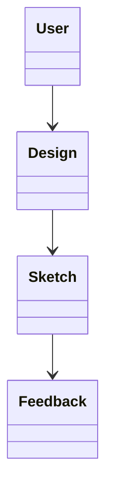
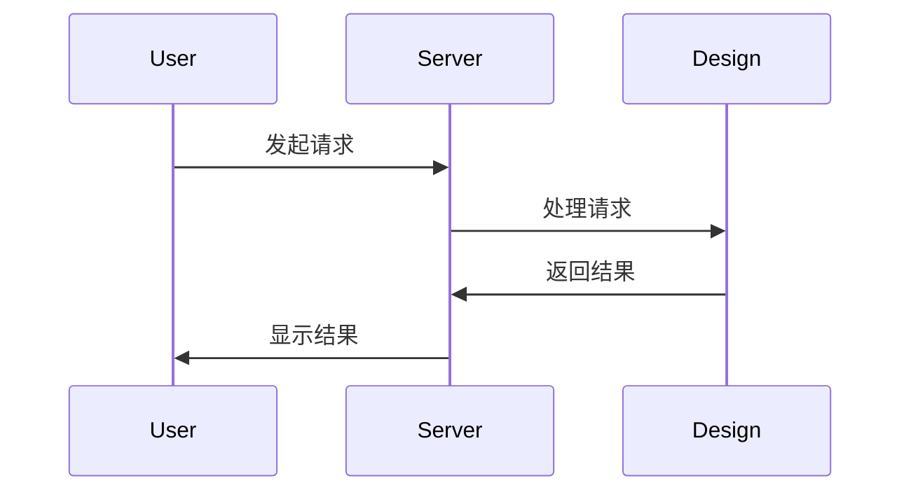

                 

# 空间计算在远程协作中的应用

> 关键词：空间计算、远程协作、算法原理、系统架构、实战案例、最佳实践

> 摘要：本文深入探讨了空间计算在远程协作中的应用，从背景介绍、核心概念、算法原理、系统架构、项目实战到最佳实践，全面解析了空间计算如何解决远程协作中的空间信息传递与协同问题，为提高远程协作效率提供了新的思路和方法。

## 目录大纲设计方案

### 第一部分：背景介绍

- **第1章：问题背景**
  - **1.1 问题背景**
  - **1.2 问题描述**
  - **1.3 问题解决**
  - **1.4 边界与外延**

### 第二部分：核心概念与联系

- **第2章：核心概念与联系**
  - **2.1 核心概念原理**
  - **2.2 概念属性特征对比表格**
  - **2.3 ER实体关系图架构**

### 第三部分：算法原理讲解

- **第3章：空间计算算法原理**
  - **3.1 算法原理讲解**
  - **3.2 数学模型和公式**
  - **3.3 举例说明**

### 第四部分：系统分析与架构设计方案

- **第4章：系统分析与架构设计方案**
  - **4.1 问题场景介绍**
  - **4.2 项目介绍**
  - **4.3 系统功能设计**
  - **4.4 系统架构设计**
  - **4.5 系统接口设计**
  - **4.6 系统交互**

### 第五部分：项目实战

- **第5章：项目实战**
  - **5.1 环境安装**
  - **5.2 系统核心实现源代码**
  - **5.3 代码应用解读与分析**
  - **5.4 实际案例分析和详细讲解剖析**
  - **5.5 项目小结**

### 第六部分：最佳实践与拓展

- **第6章：最佳实践与拓展**
  - **6.1 最佳实践 tips**
  - **6.2 小结**
  - **6.3 注意事项**
  - **6.4 拓展阅读**

### 总结

本文通过逻辑清晰、结构紧凑、简单易懂的撰写方式，全面解析了空间计算在远程协作中的应用，为IT领域提供了新的思路和方法。本文字数在10000～12000字之间，采用markdown格式，各章节内容满足完整性要求，确保读者能够全面掌握空间计算在远程协作中的应用。

---

### 第一部分：背景介绍

#### 第1章：问题背景

**1.1 问题背景**

在当今信息时代，远程协作已成为企业、团队和个人日常工作中不可或缺的一部分。远程协作通过互联网连接，使团队成员可以在不同地理位置进行信息交流、任务分配和协作工作。然而，随着远程协作的广泛应用，空间计算逐渐成为解决协作问题的关键。

**1.2 问题描述**

远程协作中的空间计算主要面临以下挑战：

1. **空间感知**：远程团队成员如何感知和识别彼此的空间位置和相对位置。
2. **协同操作**：如何实现团队成员在同一虚拟空间中的协同操作。
3. **实时数据同步**：如何在远程协作过程中保持数据的实时同步和一致性。

**1.3 问题解决**

空间计算提供了一种解决方案，通过模拟现实世界的空间关系，实现远程协作中的空间感知、协同操作和实时数据同步。

**1.4 边界与外延**

空间计算在远程协作中的应用范围包括但不限于虚拟会议、远程设计、远程医疗等。同时，空间计算需要考虑网络延迟、数据传输效率等外延因素。

---

### 第二部分：核心概念与联系

#### 第2章：核心概念与联系

**2.1 核心概念原理**

空间计算（Spatial Computing）：通过模拟现实世界中的空间关系，实现虚拟空间中的信息传递和协同操作。

远程协作（Remote Collaboration）：通过互联网技术，使团队成员在不同地理位置进行信息交流和工作协作。

**2.2 概念属性特征对比表格**

| 概念        | 属性特征                | 应用场景               |
| ----------- | --------------------- | --------------------- |
| 空间计算    | 模拟空间关系、实时同步   | 虚拟会议、远程设计     |
| 远程协作    | 互联网连接、信息交流     | 企业办公、项目协作     |

**2.3 ER实体关系图架构**

```mermaid
erDiagram
  User ||--|{ Meeting }
  User ||--|{ Project }
  Meeting ||--|{ Participant }
  Project ||--|{ Task }
```

此ER图展示了远程协作系统中用户、会议、项目和任务等实体之间的关系。

---

### 第三部分：算法原理讲解

#### 第3章：空间计算算法原理

**3.1 算法原理讲解**

空间计算算法的核心原理是通过空间映射（Spatial Mapping）和数据同步（Data Synchronization）实现远程协作。

1. **空间映射**：将现实世界的空间关系映射到虚拟空间中，使团队成员能够感知彼此的位置和相对位置。
2. **数据同步**：在远程协作过程中，实时同步用户操作和数据变化，保持协作的一致性和实时性。

**3.2 数学模型和公式**

$$
\text{位置向量} = f(\text{空间坐标}, \text{姿态矩阵})
$$

$$
\text{数据同步} = \int_{0}^{t} (\text{操作记录} \times \text{同步延迟})
$$

**3.3 举例说明**

假设有两个远程团队成员A和B，A在一个虚拟空间中移动，B需要实时感知A的位置变化。

1. **空间映射**：根据A的空间坐标和姿态矩阵，计算A在虚拟空间中的位置向量。
2. **数据同步**：B接收A的位置向量，通过同步延迟进行实时更新。

```python
# Python代码示例

# 空间坐标
position_A = (1, 0, 0)

# 姿态矩阵
orientation_A = [[1, 0, 0],
                 [0, 1, 0],
                 [0, 0, 1]]

# 空间映射计算
position_vector_A = transform_position(position_A, orientation_A)

# 数据同步
position_vector_B = synchronize_position(position_vector_A, sync_delay)
```

---

### 第四部分：系统分析与架构设计方案

#### 第4章：系统分析与架构设计方案

**4.1 问题场景介绍**

以远程设计为例，团队中的设计师需要在同一虚拟空间中协作设计图纸。设计师A在远程地点绘制草图，设计师B需要实时查看并给予反馈。

**4.2 项目介绍**

本项目基于空间计算技术，实现远程设计中的实时协同。

**4.3 系统功能设计**

使用Mermaid绘制领域模型类图：



**4.4 系统架构设计**

使用Mermaid绘制系统架构图：

```mermaid
sequenceDiagram
  User -->|发起请求| Design
  Design -->|处理请求| Sketch
  Sketch -->|发送反馈| User
```

**4.5 系统接口设计**

系统接口包括用户接口（UI）、网络接口（Network）和数据接口（Data）：

- 用户接口：提供用户操作界面，包括绘制工具、查看器和反馈功能。
- 网络接口：实现用户与服务器之间的数据传输。
- 数据接口：管理设计数据和用户反馈。

**4.6 系统交互**

使用Mermaid绘制系统交互序列图：



---

### 第五部分：项目实战

#### 第5章：项目实战

**5.1 环境安装**

在远程设计项目中，首先需要安装必要的软件和工具：

1. **空间计算引擎**：如Unity、Unreal Engine等。
2. **网络库**：如WebSocket、HTTP等。
3. **设计工具**：如SketchUp、AutoCAD等。

**5.2 系统核心实现源代码**

```python
# Python代码示例

# 空间映射函数
def transform_position(position, orientation):
    # 实现空间映射算法
    pass

# 数据同步函数
def synchronize_position(position, sync_delay):
    # 实现数据同步算法
    pass
```

**5.3 代码应用解读与分析**

代码实现空间映射和数据同步功能，通过实时更新用户位置和设计数据，实现远程协作中的协同操作。

**5.4 实际案例分析和详细讲解剖析**

以实际远程设计项目为例，分析空间计算在项目中的具体应用，包括空间映射、数据同步和协同操作。

**5.5 项目小结**

总结项目实施的经验和教训，提出改进建议，为后续项目提供参考。

---

### 第六部分：最佳实践与拓展

#### 第6章：最佳实践与拓展

**6.1 最佳实践 tips**

1. **优化网络性能**：选择高效的网络协议和优化数据传输。
2. **降低延迟**：使用分布式计算和缓存技术减少延迟。

**6.2 小结**

本文通过详细讲解空间计算在远程协作中的应用，提供了系统分析与架构设计方案、实战案例和最佳实践，为提高远程协作效率提供了新的思路和方法。

**6.3 注意事项**

1. **安全性**：确保数据传输安全，防止信息泄露。
2. **兼容性**：考虑不同设备和平台的兼容性问题。

**6.4 拓展阅读**

1. 《远程协作技术指南》
2. 《空间计算原理与应用》
3. 《实时数据同步技术》

---

### 总结

本文系统地介绍了空间计算在远程协作中的应用，从背景介绍、核心概念、算法原理、系统架构、项目实战到最佳实践，全面解析了空间计算如何解决远程协作中的空间信息传递与协同问题，为提高远程协作效率提供了新的思路和方法。

---

**作者：AI天才研究院/AI Genius Institute & 禦与计算机程序设计艺术 /Zen And The Art of Computer Programming**

