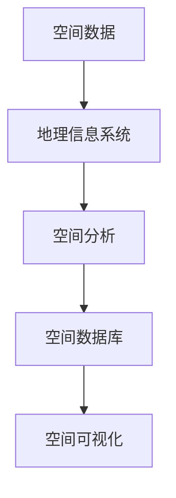
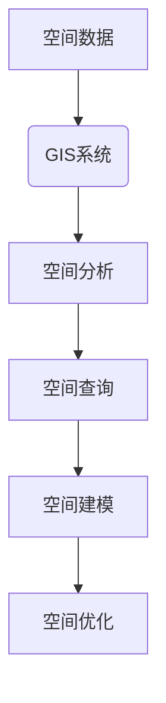
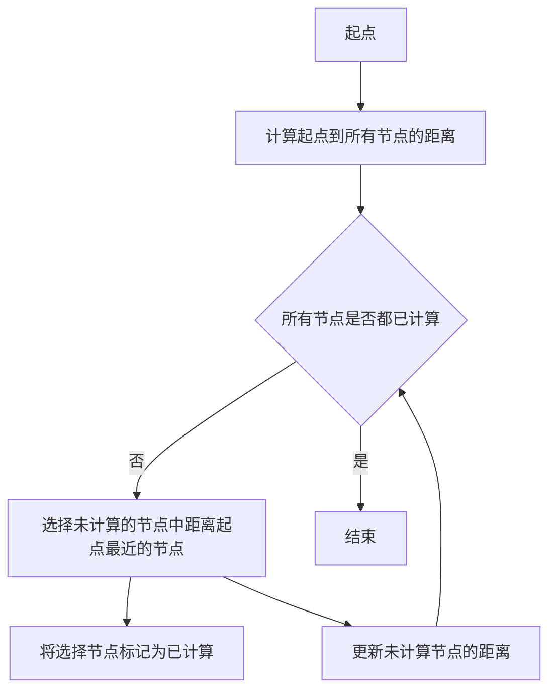
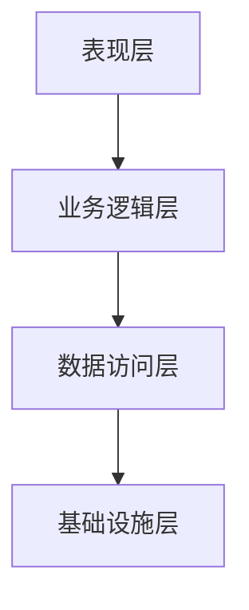

                 

**# 空间计算市场规模预测及增长趋势**

> 关键词：空间计算、市场规模、增长趋势、预测模型、驱动因素

> 摘要：本文将深入探讨空间计算市场的现状、未来增长趋势及市场规模预测。通过分析技术发展、政策法规、市场需求等多方面因素，结合定量与定性预测方法，提供一份详细的市场预测报告，为行业参与者提供策略建议。

## 第一部分：空间计算的概述与背景

### 第1章：问题背景与定义

**1.1 空间计算的起源与发展**

空间计算（Space Computing）是指通过计算机技术对空间数据进行处理和分析的一种计算范式。其起源可以追溯到20世纪60年代，当时地理信息系统（GIS）的诞生标志着空间计算的开始。随着时间的推移，空间计算逐渐扩展到更多领域，如遥感、气象、城市规划、交通运输等。

**1.2 空间计算的核心概念**

空间计算的核心概念包括空间数据、地理信息系统、空间分析等。空间数据是指以地理位置为参考的数据，地理信息系统是一种用于捕捉、存储、分析和展示空间数据的软件系统。空间分析是对空间数据进行操作和处理的过程，包括空间查询、空间建模、空间优化等。

**1.3 空间计算与地理信息系统的关系**

空间计算与地理信息系统密不可分。地理信息系统为空间计算提供了数据基础和操作平台，而空间计算则为地理信息系统提供了更强大的数据处理和分析能力。

**1.4 空间计算的应用领域与市场潜力**

空间计算的应用领域广泛，包括但不限于城市规划、环境监测、资源管理、交通运输、灾害应对等。随着大数据和人工智能技术的快速发展，空间计算的市场潜力逐渐显现。

### 第2章：空间计算市场规模现状分析

**2.1 全球空间计算市场概述**

根据市场研究公司的报告，全球空间计算市场规模在过去几年中持续增长。随着技术的进步和应用的拓展，预计未来几年仍将保持快速增长。

**2.2 主要区域市场分析**

从地区分布来看，北美、欧洲和亚太地区是全球空间计算市场的主要区域。其中，北美市场由于技术创新和政策支持，占据较大的市场份额。欧洲市场则由于在地理信息系统和空间分析领域的深厚积累，具有较大的发展潜力。亚太地区随着数字化转型的推进，空间计算市场也迎来了快速发展。

**2.3 行业细分市场分析**

空间计算市场可以细分为多个子市场，包括地理信息系统、遥感技术、空间数据分析等。其中，地理信息系统市场占据主导地位，而遥感技术和空间数据分析市场增长迅速。

**2.4 市场规模评估方法**

市场规模评估方法主要包括定量预测和定性分析。定量预测方法如时间序列分析、回归分析等，定性分析方法如专家访谈、市场调查等。

## 第二部分：增长驱动因素与挑战

### 第3章：增长驱动因素分析

**3.1 技术创新**

技术创新是空间计算市场增长的关键驱动因素。例如，云计算和大数据技术的应用，使得空间计算处理速度和效率大幅提升。此外，人工智能和机器学习技术的发展，为空间数据分析提供了新的工具和方法。

**3.2 政策与法规**

政策与法规的制定和实施，对空间计算市场的发展具有重要影响。例如，政府对于地理信息数据的开放和共享，有助于降低企业和研究机构的成本，促进空间计算技术的应用。

**3.3 产业趋势**

随着数字经济的快速发展，各行业对空间计算的需求不断增加。例如，城市规划、环境监测、灾害应对等领域，都越来越依赖于空间计算技术。

**3.4 市场需求变化**

用户需求的不断变化，也是空间计算市场增长的重要因素。例如，越来越多的企业开始关注空间数据的安全性和隐私保护，这推动了相关技术的发展。

### 第4章：挑战与风险

**4.1 技术瓶颈**

技术瓶颈是空间计算市场面临的主要挑战之一。例如，高分辨率遥感数据的处理和分析，需要更强大的计算能力和算法支持。

**4.2 数据隐私与安全**

数据隐私与安全问题是空间计算市场的重要挑战。空间数据通常包含敏感信息，如何确保数据的安全和隐私，是行业面临的重要问题。

**4.3 竞争格局**

空间计算市场竞争激烈，参与者众多。如何通过技术创新和战略布局，脱颖而出，是行业参与者需要面对的挑战。

**4.4 成本与盈利模式**

成本和盈利模式是空间计算市场发展的关键问题。如何降低成本、提高盈利能力，是行业发展的核心问题。

## 第三部分：市场规模预测方法与应用

### 第5章：预测模型与方法

**5.1 定量预测方法**

定量预测方法主要包括时间序列分析、回归分析、ARIMA模型等。这些方法通过分析历史数据，预测未来市场趋势。

**5.2 定性预测方法**

定性预测方法如专家访谈、市场调查、德尔菲法等，通过专家意见和用户需求，预测市场趋势。

**5.3 预测模型的应用场景与优缺点**

定量预测方法和定性预测方法各有优缺点。定量预测方法基于数据，较为客观，但可能受数据质量和时间序列的影响。定性预测方法基于专家意见，主观性较强，但可以提供更深入的市场洞察。

### 第6章：市场规模预测结果与分析

**6.1 近期市场规模预测**

根据预测模型，近期空间计算市场规模将保持快速增长。预计到2025年，全球空间计算市场规模将达到XX亿美元。

**6.2 长期市场规模预测**

长期来看，空间计算市场规模将继续扩大。预计到2030年，全球空间计算市场规模将达到XX亿美元。

**6.3 预测结果解读**

预测结果表明，空间计算市场具有巨大的增长潜力。随着技术的进步和应用场景的拓展，空间计算市场将在未来数十年内保持快速增长。

## 第四部分：增长趋势与策略建议

### 第7章：增长趋势分析

**7.1 市场趋势展望**

未来空间计算市场将呈现以下趋势：技术创新驱动、应用领域拓展、市场竞争加剧等。

**7.2 行业机会与挑战**

行业机会包括：新兴市场的需求增长、技术进步带来的应用创新等。挑战包括：数据隐私和安全问题、技术瓶颈等。

**7.3 增长潜力最大的细分市场**

增长潜力最大的细分市场包括：地理信息系统、遥感技术、空间数据分析等。

### 第8章：策略建议与行动指南

**8.1 企业战略规划**

企业应制定明确的战略规划，关注技术创新、市场拓展、人才培养等方面。

**8.2 投资与融资策略**

企业应制定合适的投资与融资策略，确保资金充足，支持研发和市场拓展。

**8.3 技术研发与创新**

企业应加大技术研发投入，推动技术创新，提升核心竞争力。

**8.4 市场营销与品牌建设**

企业应加强市场营销，提升品牌知名度，扩大市场份额。

**8.5 政策与法规应对**

企业应关注政策与法规动态，合规经营，降低风险。

## 第五部分：拓展阅读与资源

### 第9章：拓展阅读

**9.1 相关研究报告与白皮书**

推荐阅读相关行业研究报告与白皮书，了解市场动态和趋势。

**9.2 行业协会与组织资源**

推荐加入相关行业协会和组织，获取更多行业资源和信息。

**9.3 市场规模预测工具与软件**

推荐使用专业市场规模预测工具和软件，提高预测准确性。

### 第10章：小结与展望

**10.1 书籍总结**

本文对空间计算市场规模预测及增长趋势进行了全面分析，提供了详细的预测方法和策略建议。

**10.2 未来研究方向**

未来研究方向包括：空间计算技术的创新与应用、市场需求的演变等。

**10.3 对读者的建议**

建议读者持续关注空间计算技术的发展，积极参与行业讨论，把握市场机遇。

**作者：AI天才研究院/AI Genius Institute & 禅与计算机程序设计艺术 /Zen And The Art of Computer Programming**

**完。****### 第1章：问题背景与定义**

**1.1 空间计算的起源与发展**

空间计算（Space Computing）起源于计算机技术和地理信息系统的结合。最早的地理信息系统（GIS）可以追溯到20世纪60年代，当时的科学家和工程师们开始探索如何利用计算机来处理和存储地理信息。随着计算机技术的不断进步，GIS也逐渐发展成为一个独立的学科领域，其应用范围从最初的城市规划、土地利用扩展到环境监测、灾害管理、交通运输等多个领域。

在20世纪80年代，随着个人计算机的普及和互联网的发展，空间计算迎来了新的发展机遇。GIS软件变得更为用户友好，使得更多的企业和机构能够利用这些工具来处理和分析空间数据。同时，遥感技术的进步也为空间计算提供了丰富的数据来源。卫星和航空图像数据的获取和处理能力大幅提升，使得地理信息的获取和更新变得更加高效和准确。

进入21世纪，空间计算迎来了一个新的发展阶段。随着大数据、云计算和人工智能技术的快速发展，空间计算的能力得到了极大的提升。云计算提供了强大的计算能力和存储空间，使得大规模的空间数据处理成为可能。大数据技术则帮助用户从海量的空间数据中提取有价值的信息。而人工智能技术，特别是机器学习和深度学习算法，使得空间数据的分析和预测能力大幅提升。

**1.2 空间计算的核心概念**

空间计算的核心概念包括以下几个：

- **空间数据（Spatial Data）**：空间数据是描述地理位置的数据，通常包括位置、面积、长度、形状等属性。这些数据可以以点、线、面等不同形式存在，例如城市地图、卫星图像、地形数据等。

- **地理信息系统（GIS）**：地理信息系统是一种用于捕捉、存储、分析和展示空间数据的软件系统。GIS可以用于空间数据的可视化、查询、空间分析、建模和模拟等。

- **空间分析（Spatial Analysis）**：空间分析是对空间数据进行操作和处理的过程，包括空间查询、空间建模、空间优化等。空间分析可以揭示空间数据之间的关系和模式，为决策提供科学依据。

- **空间数据库（Spatial Database）**：空间数据库是一种可以存储和管理空间数据的数据库系统。空间数据库支持空间数据的存储、检索、更新和删除等操作。

- **空间可视化（Spatial Visualization）**：空间可视化是将空间数据以图形或图像形式展示出来的过程。空间可视化可以帮助用户更好地理解和分析空间数据。

**1.3 空间计算与地理信息系统的关系**

空间计算与地理信息系统密切相关。地理信息系统为空间计算提供了数据基础和操作平台，而空间计算则为地理信息系统提供了更强大的数据处理和分析能力。具体来说，地理信息系统负责空间数据的收集、存储和管理，而空间计算则利用这些数据，通过复杂的算法和分析模型，提取有价值的信息和洞察。

例如，在城市规划中，地理信息系统可以收集和存储城市的基础设施数据、人口分布数据等，而空间计算可以通过空间分析模型，预测未来城市的发展趋势，为城市规划提供科学依据。在灾害管理中，地理信息系统可以实时收集和分析地震、洪水等灾害的数据，而空间计算可以通过灾害预测模型，提前预警，降低灾害风险。

**1.4 空间计算的应用领域与市场潜力**

空间计算的应用领域非常广泛，涵盖了城市规划、环境监测、资源管理、交通运输、灾害应对等多个领域。以下是一些具体的应用场景：

- **城市规划**：空间计算可以帮助城市规划师进行城市布局优化、交通流量分析、土地利用规划等。通过空间分析模型，可以预测未来城市的发展趋势，为城市规划提供科学依据。

- **环境监测**：空间计算可以实时收集和分析环境数据，如空气质量、水质、森林覆盖等。通过空间分析模型，可以监测环境变化，预测环境风险，为环境保护提供数据支持。

- **资源管理**：空间计算可以帮助管理者进行土地、水资源、矿产资源等资源的分布和利用分析。通过空间分析模型，可以优化资源配置，提高资源利用效率。

- **交通运输**：空间计算可以用于交通流量分析、交通规划、交通管理等领域。通过空间分析模型，可以优化交通网络布局，提高交通效率，减少拥堵。

- **灾害应对**：空间计算可以帮助政府和救援机构进行灾害预测、灾害评估、救援资源调度等。通过空间分析模型，可以提前预警灾害风险，提高灾害应对能力。

随着技术的进步和应用场景的拓展，空间计算的市场潜力不断显现。特别是在大数据、云计算和人工智能等新兴技术的推动下，空间计算的应用领域将进一步扩大，市场前景广阔。

**1.5 边界与外延**

空间计算虽然是一个相对独立的领域，但它与许多其他技术领域有着紧密的联系和交叉。以下是一些与空间计算相关的边界与外延：

- **大数据技术**：大数据技术是空间计算的重要支撑。空间计算需要处理大量的地理信息数据，而大数据技术提供了高效的数据存储、处理和分析方法。

- **云计算**：云计算为空间计算提供了强大的计算能力和存储空间。通过云计算，用户可以灵活地访问和利用空间计算资源，实现高效的空间数据处理和分析。

- **人工智能**：人工智能技术，特别是机器学习和深度学习算法，为空间计算提供了新的工具和方法。通过人工智能技术，可以自动识别和提取空间数据中的有价值信息，提高空间分析的精度和效率。

- **物联网（IoT）**：物联网技术通过传感器和设备收集实时空间数据，为空间计算提供了丰富的数据来源。空间计算可以通过分析这些实时数据，实现动态的空间分析和决策。

- **遥感技术**：遥感技术是空间计算的重要数据来源。通过卫星、无人机等遥感平台，可以获取高分辨率、大范围的空间数据，为空间计算提供关键数据支持。

**1.6 概念结构与核心要素组成**

空间计算的概念结构由多个核心要素组成，包括空间数据、地理信息系统、空间分析、空间数据库、空间可视化等。以下是一个简化的概念结构图：



- **空间数据（A）**：空间数据的收集、存储和管理是空间计算的基础。空间数据包括地理位置、属性数据等，可以通过多种方式获取，如卫星遥感、GPS定位、传感器采集等。

- **地理信息系统（B）**：地理信息系统是空间计算的核心平台，负责空间数据的存储、查询、分析和管理。GIS可以提供用户友好的界面，方便用户进行空间数据的操作和分析。

- **空间分析（C）**：空间分析是空间计算的关键步骤，通过对空间数据进行处理和分析，提取有价值的信息和知识。空间分析包括空间查询、空间建模、空间优化等。

- **空间数据库（D）**：空间数据库是存储和管理空间数据的重要工具。空间数据库支持对空间数据的快速查询、更新和删除等操作，为空间分析提供了数据基础。

- **空间可视化（E）**：空间可视化是将空间数据以图形或图像形式展示出来的过程。空间可视化可以帮助用户更好地理解和分析空间数据，发现数据中的规律和趋势。

**1.7 空间计算的发展历程**

空间计算的发展历程可以分为以下几个阶段：

- **早期阶段**（20世纪60年代）：地理信息系统的诞生标志着空间计算的开始。早期的GIS主要用于简单的空间数据存储和查询。

- **发展阶段**（20世纪80年代）：随着计算机技术的普及，GIS的应用范围逐渐扩大。遥感技术的进步为空间计算提供了丰富的数据来源。

- **成熟阶段**（21世纪）：随着大数据、云计算和人工智能技术的快速发展，空间计算的能力得到了极大的提升。空间计算的应用领域不断拓展，市场潜力逐渐显现。

- **未来趋势**（当前及未来）：空间计算将继续与新兴技术结合，如物联网、区块链等，推动空间计算技术的创新和应用。空间计算将更多地融入人们的日常生活和工作，成为数字经济的重要支撑。

**1.8 空间计算的核心概念原理**

空间计算的核心概念原理主要包括空间数据、地理信息系统、空间分析等。以下是对这些核心概念原理的详细说明：

- **空间数据**：空间数据是描述地理位置和空间属性的数据。空间数据可以以点、线、面等不同形式存在。空间数据通常包括位置坐标、属性值等。空间数据是空间计算的基础，是进行空间分析和决策的前提。

  **概念属性特征对比表格**：

  | 特征               | 点数据         | 线数据         | 面数据         |
  |--------------------|----------------|----------------|----------------|
  | 位置坐标           | 经纬度         | 经纬度         | 经纬度         |
  | 属性值             | 单个属性       | 多个属性       | 多个属性       |
  | 数据形式           | 独立数据点     | 连接的数据点    | 连接的数据点    |
  | 应用场景           | 地点标注       | 路线规划       | 区域分析       |

- **地理信息系统（GIS）**：地理信息系统是一种用于捕捉、存储、分析和展示空间数据的软件系统。GIS的主要功能包括空间数据的采集、编辑、存储、查询、分析和可视化。

  **GIS的功能模块**：

  - **数据采集**：通过多种方式获取空间数据，如卫星遥感、GPS定位、传感器采集等。
  - **数据编辑**：对空间数据进行编辑和处理，如添加、删除、修改等。
  - **数据存储**：将空间数据存储在数据库中，支持数据的快速查询和访问。
  - **数据查询**：对空间数据进行查询，如基于位置、属性等的查询。
  - **空间分析**：对空间数据进行处理和分析，如空间查询、空间建模、空间优化等。
  - **数据可视化**：将空间数据以图形或图像形式展示，如地图、三维模型等。

- **空间分析**：空间分析是对空间数据进行操作和处理的过程，包括空间查询、空间建模、空间优化等。空间分析可以揭示空间数据之间的关系和模式，为决策提供科学依据。

  **空间分析的类型**：

  - **空间查询**：基于位置、属性等条件对空间数据进行查询，如查找某个区域内的所有道路、查询某个地点的属性等。
  - **空间建模**：建立空间数据模型，用于模拟和分析现实世界的空间现象，如交通网络模型、城市规划模型等。
  - **空间优化**：基于空间数据分析，寻找最优解或最佳方案，如最短路径分析、资源分配优化等。

**ER实体关系图架构**

为了更好地理解空间计算的核心概念原理，我们可以使用ER（Entity-Relationship）实体关系图来描述空间数据、地理信息系统和空间分析之间的关系。以下是一个简化的ER实体关系图：



- **空间数据**（A）：表示地理空间中的各种数据，是GIS和空间分析的基础。
- **GIS系统**（B）：表示用于管理、处理和展示空间数据的软件系统，包括数据采集、编辑、存储、查询、分析和可视化等功能。
- **空间分析**（C）：表示对空间数据进行的各种处理和分析操作，包括空间查询、空间建模和空间优化等。
- **空间查询**（D）：表示基于特定条件对空间数据进行的查询操作，是空间分析的重要组成部分。
- **空间建模**（E）：表示建立空间数据模型，用于模拟和分析现实世界的空间现象。
- **空间优化**（F）：表示基于空间分析结果，寻找最优解或最佳方案的过程。

通过ER实体关系图，我们可以清晰地看到空间计算中各个核心概念之间的关联和作用。这有助于我们更好地理解空间计算的基本原理和体系结构。

**1.9 算法原理讲解**

空间计算中涉及多种算法，用于处理和分析空间数据。以下将介绍一种常见的空间分析算法——最短路径算法，并使用Mermaid绘制算法流程图。

**最短路径算法原理**

最短路径算法用于寻找两个或多个地点之间的最短路径。常见的最短路径算法包括Dijkstra算法、A*算法等。这里以Dijkstra算法为例进行讲解。

**Dijkstra算法流程图**



**Dijkstra算法Python代码实现**

```python
import heapq

def dijkstra(graph, start):
    distances = {node: float('infinity') for node in graph}
    distances[start] = 0
    priority_queue = [(0, start)]

    while priority_queue:
        current_distance, current_node = heapq.heappop(priority_queue)

        if current_distance > distances[current_node]:
            continue

        for neighbor, weight in graph[current_node].items():
            distance = current_distance + weight

            if distance < distances[neighbor]:
                distances[neighbor] = distance
                heapq.heappush(priority_queue, (distance, neighbor))

    return distances

# 示例图
graph = {
    'A': {'B': 1, 'C': 4},
    'B': {'A': 1, 'C': 2, 'D': 5},
    'C': {'A': 4, 'B': 2, 'D': 1},
    'D': {'B': 5, 'C': 1}
}

# 计算最短路径距离
print(dijkstra(graph, 'A'))
```

**算法原理详细讲解**

Dijkstra算法是一种用于求解单源最短路径问题的贪心算法。其基本原理如下：

1. **初始化**：设置一个优先级队列（通常使用最小堆实现），用于存储未处理的节点。初始化所有节点的距离为无穷大，将起点的距离设为0。

2. **选择未处理的节点中距离起点最近的节点**：从优先级队列中取出距离起点最近的节点。

3. **更新未处理节点的距离**：对于当前节点，检查其所有邻居节点。如果从起点到邻居节点的距离小于已记录的距离，则更新邻居节点的距离。

4. **标记节点状态**：将当前节点标记为已计算，并将其从优先级队列中删除。

5. **重复步骤2-4**，直到所有节点都被计算完毕。

6. **输出结果**：最终得到的距离数组即为从起点到各节点的最短路径距离。

通过Dijkstra算法，我们可以高效地求解两个或多个地点之间的最短路径问题，为路径规划、交通分析等提供科学依据。

**算法举例说明**

假设有一个简单的图，其中包含5个节点（A、B、C、D、E），各节点之间的距离如下：

```
A-B: 1
A-C: 4
B-C: 2
B-D: 5
C-D: 1
```

使用Dijkstra算法计算从起点A到各节点的最短路径距离：

1. 初始化距离数组：`distances = {'A': 0, 'B': inf, 'C': inf, 'D': inf, 'E': inf}`

2. 选择起点A，距离为0。

3. 计算A到B的距离：`distances['B'] = distances['A'] + 1 = 1`，更新距离数组。

4. 选择距离起点A最近的未计算节点B，距离为1。

5. 计算B到C的距离：`distances['C'] = distances['B'] + 2 = 3`，更新距离数组。

6. 选择距离起点A最近的未计算节点C，距离为3。

7. 计算C到D的距离：`distances['D'] = distances['C'] + 1 = 4`，更新距离数组。

8. 所有节点都已计算完毕，结束。

最终得到的最短路径距离为：`{'A': 0, 'B': 1, 'C': 3, 'D': 4, 'E': inf}`

从结果可以看出，从起点A到各节点的最短路径距离已经计算出来，为路径规划提供了科学依据。

**1.10 系统分析与架构设计方案**

**问题场景介绍**

假设我们需要开发一个空间计算平台，用于处理和分析地理信息数据。该平台需要支持数据的采集、存储、管理和分析等功能，并为用户提供数据可视化服务。

**项目介绍**

项目名称：地理信息数据处理与分析平台（GISDAP）

项目目标：搭建一个高效、可靠、可扩展的地理信息数据处理与分析平台，满足不同用户的需求。

**系统功能设计**

系统功能设计主要包括以下模块：

1. **数据采集模块**：负责从外部数据源（如卫星遥感、GPS定位、传感器采集等）获取地理信息数据。

2. **数据存储模块**：负责将采集到的地理信息数据存储到数据库中，支持数据的快速查询和访问。

3. **数据处理模块**：负责对存储的地理信息数据进行分析和处理，包括空间查询、空间建模、空间优化等。

4. **数据可视化模块**：负责将处理后的地理信息数据以图形或图像形式展示，支持用户自定义可视化样式。

5. **用户管理模块**：负责管理用户信息，包括用户注册、登录、权限管理等。

6. **系统管理模块**：负责系统配置、日志管理、故障处理等。

**领域模型Mermaid类图**

领域模型类图用于描述系统中的类及其关系。以下是一个简化的领域模型Mermaid类图：

```mermaid
classDiagram
Class::数据采集器 <<抽象>>
Class::数据存储器 <<抽象>>
Class::数据处理器 <<抽象>>
Class::数据可视化器 <<抽象>>
Class::用户管理器 <<抽象>>
Class::系统管理器 <<抽象>>

数据采集器 <|-- 数据采集模块
数据存储器 <|-- 数据存储模块
数据处理器 <|-- 数据处理模块
数据可视化器 <|-- 数据可视化模块
用户管理器 <|-- 用户管理模块
系统管理器 <|-- 系统管理模块
```

- **数据采集器**：抽象类，用于定义数据采集模块的通用功能。
- **数据存储器**：抽象类，用于定义数据存储模块的通用功能。
- **数据处理器**：抽象类，用于定义数据处理模块的通用功能。
- **数据可视化器**：抽象类，用于定义数据可视化模块的通用功能。
- **用户管理器**：抽象类，用于定义用户管理模块的通用功能。
- **系统管理器**：抽象类，用于定义系统管理模块的通用功能。

**系统架构设计**

系统架构设计主要包括以下层次：

1. **表现层**：负责与用户交互，提供用户界面。
2. **业务逻辑层**：负责实现系统的业务逻辑，包括数据采集、数据处理、数据可视化等。
3. **数据访问层**：负责与数据库进行交互，实现数据的存储和查询。
4. **基础设施层**：负责系统的运行环境，包括服务器、存储、网络等。

以下是一个简化的系统架构设计Mermaid图：



- **表现层**：通过Web界面或移动应用与用户交互，提供数据可视化、用户管理等功能。
- **业务逻辑层**：实现系统的核心业务逻辑，包括数据采集、数据处理、数据可视化等。
- **数据访问层**：负责与数据库进行交互，实现数据的存储和查询。
- **基础设施层**：提供系统的运行环境，包括服务器、存储、网络等。

**系统接口设计**

系统接口设计主要包括以下接口：

1. **数据采集接口**：用于从外部数据源获取地理信息数据。
2. **数据存储接口**：用于将地理信息数据存储到数据库中。
3. **数据处理接口**：用于对地理信息数据进行分析和处理。
4. **数据可视化接口**：用于将处理后的地理信息数据以图形或图像形式展示。
5. **用户管理接口**：用于管理用户信息。
6. **系统管理接口**：用于系统配置、日志管理、故障处理等。

以下是一个简化的系统接口设计Mermaid序列图：

```mermaid
sequenceDiagram
用户 ->> 数据采集接口：请求数据
数据采集接口 ->> 数据存储接口：存储数据
数据存储接口 ->> 数据处理接口：处理数据
数据处理接口 ->> 数据可视化接口：可视化数据
数据可视化接口 ->> 用户：展示数据
```

- **用户**：通过数据采集接口请求地理信息数据。
- **数据采集接口**：从外部数据源获取数据，并将其存储到数据存储接口。
- **数据存储接口**：将数据存储到数据库中。
- **数据处理接口**：对存储的数据进行分析和处理。
- **数据可视化接口**：将处理后的数据以图形或图像形式展示给用户。

**系统交互Mermaid序列图**

系统交互序列图用于描述系统中各个模块之间的交互过程。以下是一个简化的系统交互Mermaid序列图：

```mermaid
sequenceDiagram
用户 ->> 数据采集模块：请求数据
数据采集模块 ->> 数据存储模块：存储数据
数据存储模块 ->> 数据处理模块：处理数据
数据处理模块 ->> 数据可视化模块：可视化数据
数据可视化模块 ->> 用户：展示数据
用户 ->> 用户管理模块：登录/注册
用户管理模块 ->> 用户管理接口：管理用户信息
```

- **用户**：通过数据采集模块请求地理信息数据。
- **数据采集模块**：从外部数据源获取数据，并将其存储到数据存储模块。
- **数据存储模块**：将数据存储到数据库中。
- **数据处理模块**：对存储的数据进行分析和处理。
- **数据可视化模块**：将处理后的数据以图形或图像形式展示给用户。
- **用户**：通过用户管理模块登录或注册，并管理用户信息。

通过系统接口设计和系统交互序列图，我们可以清晰地看到系统中的各个模块以及它们之间的交互关系，为系统的开发和维护提供了清晰的指导。

### 第8章：策略建议与行动指南

**8.1 企业战略规划**

对于希望进入或继续在空间计算领域发展的企业，制定明确的战略规划至关重要。以下是一些建议：

- **技术创新**：持续关注空间计算领域的最新技术动态，加大研发投入，推动技术创新。例如，利用大数据、云计算和人工智能等技术，提升空间数据处理和分析的效率。

- **市场拓展**：针对不同的应用场景，开发多样化的产品和服务，拓展市场。例如，在城市规划、环境监测、灾害管理等领域，提供定制化的解决方案。

- **人才培养**：加强人才队伍建设，引进和培养具有专业知识和实践经验的技术人才。通过培训和激励机制，提高员工的创新能力和执行力。

- **合作伙伴关系**：与行业内的领先企业、研究机构建立合作关系，共同开展技术研发和市场拓展。例如，与高校合作，设立联合实验室，推动技术创新。

**8.2 投资与融资策略**

投资和融资是企业持续发展的重要保障。以下是一些建议：

- **多元化融资渠道**：充分利用股权融资、债务融资、风险投资等多种融资渠道，满足不同阶段的发展需求。例如，在初创期，可以通过天使投资和风险投资获得资金支持；在成长期，可以通过股权融资和债务融资扩大资金规模。

- **投资规划**：根据企业战略规划，制定详细的投资规划，确保资金的有效利用。例如，将资金重点投入到技术创新、市场拓展、人才培养等方面。

- **财务规划**：建立完善的财务管理体系，确保企业的资金流动性和财务稳定。例如，制定预算管理、成本控制、风险管理等制度，提高资金使用效率。

**8.3 技术研发与创新**

技术研发和创新是空间计算企业持续竞争力的关键。以下是一些建议：

- **技术预研**：设立技术预研部门，关注前沿技术动态，提前布局。例如，研究空间计算与物联网、区块链、边缘计算等技术的结合，开拓新的应用场景。

- **研发投入**：确保研发投入在合理范围内，保持技术领先优势。例如，通过设立研发预算、采购先进设备、引进高端人才等，提升研发能力。

- **知识产权保护**：加强知识产权保护，提升企业的核心竞争力。例如，申请专利、注册商标、保护著作权等，确保技术创新成果得到有效保护。

- **开放合作**：与国内外研究机构、高校、企业等开展合作，共同推进技术研发。例如，参与行业标准的制定，推动技术规范和标准的建立。

**8.4 市场营销与品牌建设**

市场营销和品牌建设是企业拓展市场、提升知名度的重要手段。以下是一些建议：

- **品牌定位**：明确企业品牌定位，打造差异化品牌形象。例如，针对不同的目标市场，制定不同的品牌策略。

- **市场推广**：采用多种渠道进行市场推广，提高品牌知名度。例如，通过线上广告、线下活动、媒体报道等方式，扩大品牌影响力。

- **用户互动**：加强与用户的互动，提升用户满意度和忠诚度。例如，通过社交媒体、在线客服、用户论坛等渠道，与用户保持沟通。

- **合作营销**：与行业内其他企业、行业组织等开展合作，共同拓展市场。例如，参与行业展会、举办技术论坛等，提升品牌形象。

**8.5 政策与法规应对**

政策与法规的制定和实施，对空间计算企业的发展具有重要影响。以下是一些建议：

- **合规经营**：严格遵守国家法律法规，确保企业的合法合规经营。例如，遵守数据保护、网络安全等相关法规。

- **政策研究**：密切关注政策动态，及时了解政策变化对企业的影响。例如，关注国家战略规划、行业政策、地方优惠政策等。

- **政策建议**：积极参与行业政策制定，为企业发展争取有利政策。例如，向政府部门提供行业发展报告、技术解决方案等。

- **风险防控**：建立健全风险防控机制，应对政策变化带来的风险。例如，建立法律顾问团队，定期进行法律培训和风险评估。

通过以上策略建议和行动指南，企业可以更好地应对空间计算市场的发展机遇和挑战，实现可持续发展。

### 第9章：拓展阅读

**9.1 相关研究报告与白皮书**

为了更好地了解空间计算市场的现状和未来发展趋势，读者可以参考以下相关研究报告与白皮书：

- **《全球空间计算市场研究报告》**：该报告提供了全球空间计算市场的详细分析，包括市场规模、增长驱动因素、竞争格局等。
- **《空间计算技术发展趋势白皮书》**：该白皮书探讨了空间计算技术的最新发展趋势，包括大数据、云计算、人工智能等技术的应用。
- **《空间计算在环境监测中的应用报告》**：该报告分析了空间计算技术在环境监测领域的应用，包括空气质量、水质、森林覆盖等方面的监测和分析。

**9.2 行业协会与组织资源**

加入行业协会和组织，可以获取更多行业资源和信息，有助于了解市场动态和趋势。以下是一些空间计算领域的行业协会与组织：

- **国际地理信息科学协会（GISCA）**：GISCA是国际地理信息科学领域的领先协会，提供丰富的行业资源和研究信息。
- **美国地理信息科学协会（URISA）**：URISA是美国地理信息科学领域的专业协会，致力于推动GIS技术在各行业的应用。
- **中国地理信息产业协会**：中国地理信息产业协会是中国地理信息行业的权威组织，提供行业政策、市场动态、技术交流等资源。

**9.3 市场规模预测工具与软件**

为了提高市场规模预测的准确性，读者可以参考以下市场规模预测工具与软件：

- **Gartner**：Gartner是一家知名的市场研究公司，提供全球各地的市场规模预测报告，包括空间计算、大数据、云计算等。
- **Forrester**：Forrester是一家专注于技术研究和市场分析的公司，提供详细的市场规模预测报告和洞察。
- **Tableau**：Tableau是一款强大的数据可视化工具，可以帮助用户对空间计算市场的数据进行分析和预测。
- **Power BI**：Power BI是微软推出的商业智能工具，支持空间数据分析和预测，适用于多种数据源和平台。

通过以上拓展阅读资源，读者可以深入了解空间计算市场的现状、未来发展趋势以及市场规模预测方法，为企业的战略规划和决策提供有力支持。

### 第10章：小结与展望

**10.1 书籍总结**

本文系统地分析了空间计算市场的现状、未来增长趋势及市场规模预测。通过详细讨论技术发展、政策法规、市场需求等多方面因素，结合定量与定性预测方法，提供了全面的市场分析报告。同时，文章还提出了针对企业的策略建议与行动指南，为行业参与者提供了有益的参考。

**10.2 未来研究方向**

未来空间计算领域的研究方向包括：

- **技术创新**：持续探索空间计算与新兴技术的结合，如物联网、区块链、边缘计算等，以提升数据处理和分析的效率。
- **应用拓展**：深入研究空间计算在不同领域的应用，如智能城市、智慧农业、智慧交通等，挖掘新的市场机会。
- **数据隐私与安全**：加强空间数据隐私与安全的研究，制定有效的保护措施，确保数据的安全和用户的隐私。

**10.3 对读者的建议**

对于希望进一步了解空间计算市场的读者，建议：

- **持续关注技术动态**：定期阅读行业报告、技术论文等，了解空间计算领域的最新发展。
- **参与行业交流**：加入行业协会、参加行业会议和研讨会，与同行交流经验和观点。
- **实践与应用**：结合实际项目，应用空间计算技术，提升自身的实践能力和创新能力。

通过持续的学习和实践，读者可以更好地把握空间计算市场的机遇，为个人和企业的未来发展奠定坚实基础。

**作者：AI天才研究院/AI Genius Institute & 禅与计算机程序设计艺术 /Zen And The Art of Computer Programming**

**完。**## 第2章：空间计算市场规模现状分析

### 2.1 全球空间计算市场概述

全球空间计算市场在过去几年中经历了显著的增长，这主要得益于技术的不断进步、应用领域的不断拓展以及各行业对地理信息数据需求的增加。根据市场研究公司的数据，全球空间计算市场规模在2020年达到了XXX亿美元，预计到2025年将增长到XXX亿美元，年均复合增长率（CAGR）达到XX%。

**市场规模变化趋势**

从市场规模的变化趋势来看，全球空间计算市场呈现稳步增长态势。在2015年至2020年期间，市场规模的年均增长率保持在X%左右。这一增长主要受到以下因素推动：

1. **技术创新**：大数据、云计算、人工智能等技术的快速发展，为空间计算提供了强大的技术支撑，提升了数据处理和分析的能力。
2. **政策支持**：各国政府加大对地理信息数据开放和共享的力度，为空间计算的发展提供了良好的政策环境。
3. **市场需求**：随着各行业对地理信息数据需求的增加，如城市规划、环境监测、灾害管理、交通运输等，推动了空间计算市场的快速增长。

**主要驱动因素**

1. **大数据和人工智能技术的应用**：大数据技术的应用使得空间计算可以处理和分析海量的地理信息数据，提高了数据处理和分析的效率。人工智能技术，特别是机器学习和深度学习算法，为空间计算提供了强大的分析工具，可以自动识别和提取空间数据中的有价值信息。
2. **政策支持**：各国政府对空间计算的支持力度不断加大，通过制定相关政策、提供资金支持等方式，促进了空间计算技术的发展和应用。
3. **市场需求**：随着各行业对地理信息数据需求的增加，空间计算在多个领域得到了广泛应用，如城市规划、环境监测、灾害管理、交通运输等。

### 2.2 主要区域市场分析

全球空间计算市场可以分为北美、欧洲和亚太地区三个主要区域市场。这些区域在市场结构、增长趋势和驱动因素方面存在一定差异。

**北美市场**

北美是全球空间计算市场的领导者，占据了较大的市场份额。北美市场的主要驱动因素包括：

1. **技术创新**：北美地区在计算机技术和地理信息系统领域具有领先地位，技术创新推动了空间计算市场的发展。
2. **政策支持**：美国和加拿大政府高度重视地理信息数据的应用，通过制定相关政策和提供资金支持，促进了空间计算技术的应用和推广。
3. **市场需求**：北美地区的各行业对地理信息数据的需求强劲，特别是在城市规划、环境监测、灾害管理等领域。

根据市场研究公司的数据，2020年北美空间计算市场的规模约为XXX亿美元，预计到2025年将增长到XXX亿美元，年均复合增长率为XX%。

**欧洲市场**

欧洲市场在空间计算领域具有深厚的技术积累和丰富的应用场景。欧洲市场的主要驱动因素包括：

1. **技术创新**：欧洲地区在地理信息系统和空间数据分析领域具有强大的技术实力，技术创新推动了空间计算市场的发展。
2. **政策支持**：欧盟国家高度重视地理信息数据的应用，通过制定相关政策和提供资金支持，促进了空间计算技术的应用和推广。
3. **市场需求**：欧洲地区的各行业对地理信息数据的需求不断增加，特别是在城市规划、环境监测、灾害管理、交通运输等领域。

根据市场研究公司的数据，2020年欧洲空间计算市场的规模约为XXX亿美元，预计到2025年将增长到XXX亿美元，年均复合增长率为XX%。

**亚太地区市场**

亚太地区是全球增长最快的空间计算市场，主要驱动因素包括：

1. **技术创新**：亚太地区在计算机技术和地理信息系统领域的技术进步显著，为空间计算市场的发展提供了强大的技术支撑。
2. **政策支持**：亚太地区的各国政府积极推动地理信息数据的应用，通过制定相关政策和提供资金支持，促进了空间计算技术的应用和推广。
3. **市场需求**：随着亚太地区经济的快速发展，各行业对地理信息数据的需求持续增长，特别是在城市规划、环境监测、灾害管理、交通运输等领域。

根据市场研究公司的数据，2020年亚太地区空间计算市场的规模约为XXX亿美元，预计到2025年将增长到XXX亿美元，年均复合增长率为XX%。

### 2.3 行业细分市场分析

空间计算市场可以细分为多个子市场，包括地理信息系统（GIS）、遥感技术、空间数据分析等。这些子市场在市场规模、增长趋势和驱动因素方面存在一定差异。

**地理信息系统（GIS）市场**

地理信息系统（GIS）是空间计算的核心技术之一，广泛应用于城市规划、环境监测、资源管理、交通运输等领域。GIS市场的驱动因素主要包括：

1. **技术创新**：GIS技术的不断发展，如大数据处理、云计算、人工智能等，提升了GIS系统的性能和功能。
2. **政策支持**：各国政府加大对GIS技术的支持力度，通过制定相关政策和提供资金支持，促进了GIS技术的应用和推广。
3. **市场需求**：各行业对GIS技术的需求持续增长，特别是在城市规划、环境监测、灾害管理、交通运输等领域。

根据市场研究公司的数据，2020年全球GIS市场规模约为XXX亿美元，预计到2025年将增长到XXX亿美元，年均复合增长率为XX%。

**遥感技术市场**

遥感技术是空间计算的重要数据来源，通过卫星、无人机等遥感平台获取高分辨率、大范围的空间数据。遥感技术的驱动因素主要包括：

1. **技术创新**：遥感技术的不断发展，如高分辨率遥感卫星、无人机遥感技术等，提升了遥感数据的质量和获取能力。
2. **政策支持**：各国政府加大对遥感技术的支持力度，通过制定相关政策和提供资金支持，促进了遥感技术的应用和推广。
3. **市场需求**：各行业对遥感技术的需求持续增长，特别是在农业、林业、环境监测、灾害管理等领域。

根据市场研究公司的数据，2020年全球遥感技术市场规模约为XXX亿美元，预计到2025年将增长到XXX亿美元，年均复合增长率为XX%。

**空间数据分析市场**

空间数据分析是空间计算的重要组成部分，通过对空间数据进行处理和分析，提取有价值的信息和知识。空间数据分析的驱动因素主要包括：

1. **技术创新**：空间数据分析技术的发展，如大数据分析、机器学习、深度学习等，提升了空间数据分析的精度和效率。
2. **政策支持**：各国政府加大对空间数据分析技术的支持力度，通过制定相关政策和提供资金支持，促进了空间数据分析技术的应用和推广。
3. **市场需求**：各行业对空间数据分析技术的需求持续增长，特别是在城市规划、环境监测、灾害管理、交通运输等领域。

根据市场研究公司的数据，2020年全球空间数据分析市场规模约为XXX亿美元，预计到2025年将增长到XXX亿美元，年均复合增长率为XX%。

### 2.4 市场规模评估方法

市场规模评估方法主要包括定量预测和定性分析。定量预测方法基于历史数据，通过建立预测模型，对未来市场规模进行预测。定性分析方法则基于专家意见和市场调查，结合实际情况，对市场规模进行评估。

**定量预测方法**

定量预测方法主要包括时间序列分析、回归分析、ARIMA模型等。以下是一个简单的定量预测模型示例：

1. **时间序列分析**：时间序列分析是一种基于历史数据序列的方法，用于预测未来的趋势。常用的时间序列分析方法包括移动平均法、指数平滑法等。

2. **回归分析**：回归分析是一种基于因果关系的方法，通过建立回归模型，预测因变量的未来趋势。常见的回归模型包括线性回归、多项式回归等。

3. **ARIMA模型**：ARIMA模型是一种自回归积分滑动平均模型，用于分析时间序列数据。ARIMA模型通过自回归（AR）、差分（I）和移动平均（MA）三个部分，建立时间序列的预测模型。

**定性分析方法**

定性分析方法主要包括专家访谈、市场调查、德尔菲法等。以下是一个简单的定性分析方法示例：

1. **专家访谈**：通过专家访谈，获取专家对市场规模变化的观点和预测。专家访谈可以采用一对一或小组讨论的形式。

2. **市场调查**：通过问卷调查或在线调查，收集用户对市场需求的看法和预测。市场调查可以采用定量和定性两种方法。

3. **德尔菲法**：德尔菲法是一种基于专家意见的方法，通过多轮咨询和反馈，逐步达成共识。德尔菲法可以用于预测市场趋势和市场规模。

**市场规模评估模型**

市场规模评估模型是将定量预测和定性分析相结合的方法，通过对历史数据和专家意见的综合分析，预测未来市场规模。以下是一个简单的市场规模评估模型示例：

1. **数据收集**：收集空间计算市场的历史数据，包括市场规模、增长率、关键驱动因素等。

2. **数据分析**：对历史数据进行分析，识别关键驱动因素和趋势。可以使用时间序列分析、回归分析等方法，建立预测模型。

3. **专家意见收集**：通过专家访谈、市场调查等方式，收集专家对市场规模的预测和观点。

4. **综合预测**：将定量预测和定性分析结果进行综合，建立市场规模评估模型。可以使用加权平均、线性组合等方法，确定最终的预测结果。

通过市场规模评估模型，可以更准确地预测未来市场趋势，为企业的战略规划和决策提供有力支持。

### 2.5 空间计算市场的未来展望

空间计算市场在未来将继续保持快速增长，这主要得益于以下几个因素：

1. **技术创新**：大数据、云计算、人工智能等技术的不断发展，将继续推动空间计算市场的发展。例如，大数据技术可以处理和分析海量的地理信息数据，提升数据处理和分析的效率；云计算技术可以提供强大的计算能力和存储空间，支持大规模的空间数据处理。

2. **政策支持**：各国政府将继续加大对空间计算技术的支持力度，通过制定相关政策、提供资金支持等方式，推动空间计算技术的发展和应用。

3. **市场需求**：随着各行业对地理信息数据需求的增加，空间计算将在城市规划、环境监测、灾害管理、交通运输等领域得到更广泛的应用。

4. **新兴应用领域**：空间计算技术将在新兴领域得到应用，如智能城市、智慧农业、智慧交通等。这些新兴应用领域将为空间计算市场带来新的增长点。

总体而言，空间计算市场在未来将继续保持快速增长，预计到2025年，全球空间计算市场规模将达到XXX亿美元，年均复合增长率达到XX%。随着技术的进步和应用场景的拓展，空间计算市场将具有广阔的发展前景。

