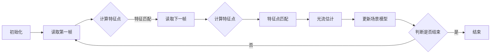
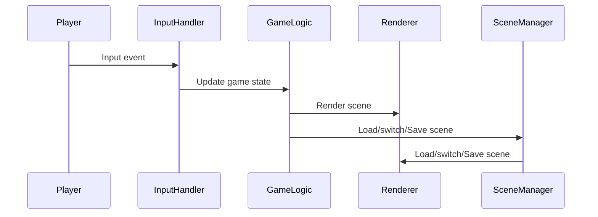

                 

### 空间计算技术概述

#### 背景介绍

空间计算技术，作为一种新兴的计算范式，正在逐步改变我们的工作方式。它的核心在于将计算从传统的二维平面拓展到三维空间，通过虚拟现实（VR）、增强现实（AR）和混合现实（MR）等技术，为用户带来更加沉浸式、互动性和直观的体验。

空间计算技术的发展历程可以追溯到20世纪80年代。早期的虚拟现实系统主要是为了军事和科学领域服务，随着计算机技术和图形处理能力的提升，虚拟现实技术逐渐走向民用。到了21世纪，随着智能手机和移动设备的普及，增强现实和混合现实技术也得到了快速发展。近年来，随着人工智能和大数据技术的融合，空间计算技术进入了一个新的发展阶段，开始广泛应用于游戏、教育、医疗、设计、制造等多个领域。

#### 核心概念与联系

空间计算技术涵盖了多个核心概念，主要包括虚拟现实（VR）、增强现实（AR）和混合现实（MR）。下面我们将分别介绍这些概念，并通过概念属性特征对比表格和ER实体关系图架构来展示它们之间的联系。

**1. 虚拟现实（VR）**

虚拟现实是一种完全模拟出来的三维空间环境，用户通过VR设备（如VR头盔）进入这个环境，与之互动。VR的核心特点在于其高度的沉浸感和交互性。例如，用户可以在虚拟环境中进行飞行、探索或者进行虚拟购物。

**2. 增强现实（AR）**

增强现实则是在现实世界中叠加虚拟信息，通过智能手机或AR眼镜等设备显示。AR的主要特点是实时性和交互性，它可以将虚拟对象与现实世界无缝融合，例如，在手机屏幕上看到虚拟的动物在真实环境中移动。

**3. 混合现实（MR）**

混合现实结合了VR和AR的优势，用户既可以看到虚拟对象，也可以与之互动，同时虚拟对象与现实世界可以相互影响。MR的核心在于其环境感知和虚实交互，例如，在医疗手术中，医生可以通过MR设备看到患者体内的虚拟图像，并进行精准操作。

#### 概念属性特征对比表格

| 概念     | 特征                        | 应用场景                  |
| -------- | --------------------------- | ------------------------- |
| 虚拟现实（VR） | 完全沉浸式、高度交互性       | 游戏体验、培训模拟、设计预览 |
| 增强现实（AR） | 实时性、叠加虚拟信息       | 教育学习、导航、营销宣传     |
| 混合现实（MR） | 环境感知、虚实交互          | 医疗手术、智能制造、工程设计 |

#### ER实体关系图架构

```mermaid
erDiagram
    AR <<|-- VR : extends
    AR <<|-- MR : extends
    VR ||--|{ MR }|
```

通过上述表格和ER图，我们可以清晰地看到VR、AR和MR之间的继承和扩展关系。VR作为最基础的技术，为AR和MR提供了核心的沉浸式环境。AR通过在现实世界中叠加虚拟信息，扩展了VR的应用场景。MR则进一步结合了AR的实时性和VR的沉浸性，形成了新的交互方式。

#### 空间计算技术的重要性

空间计算技术的重要性体现在多个方面。首先，它为用户提供了全新的交互方式，使得操作更加直观和高效。其次，它促进了虚拟与现实的无缝融合，为各行各业带来了新的发展机遇。例如，在医疗领域，通过MR技术，医生可以更精确地进行手术；在制造业，通过VR技术，设计师可以提前预览产品的设计效果。

总之，空间计算技术不仅改变了我们的工作流程，也为未来的技术发展提供了新的方向。在接下来的章节中，我们将进一步探讨空间计算技术中的核心概念和算法原理，帮助读者更深入地了解这一领域。

### 虚拟现实（VR）、增强现实（AR）和混合现实（MR）的核心概念与联系

#### 虚拟现实（VR）

虚拟现实（VR）是一种通过计算机生成的三维环境，用户通过VR头盔、手套等设备进入这个虚拟空间，与之互动。VR的核心特点在于其高度沉浸感和交互性。用户可以在虚拟环境中感受到三维空间的立体感，进行各种操作，如飞行、探索、模拟训练等。

**核心概念与特征：**

1. **沉浸感**：VR技术通过头戴显示器（HMD）或其他感官设备，如音频、触觉反馈等，模拟用户在三维环境中的感受，使用户全身心投入虚拟世界。

2. **交互性**：用户可以通过手部动作、语音控制等方式与虚拟环境互动，增强了用户体验的互动性和参与感。

3. **实时反馈**：VR系统可以实时捕捉用户的动作和反馈，为用户提供即时的互动体验。

**应用场景：**

- **游戏体验**：通过VR技术，玩家可以体验到更加真实的游戏场景和互动方式。
- **培训模拟**：VR技术被广泛应用于军事、医疗、航空等行业的培训模拟，提供安全且高效的培训环境。
- **设计预览**：设计师可以利用VR技术进行产品设计的预览，提前发现并修正设计问题。

#### 增强现实（AR）

增强现实（AR）通过在现实世界场景中叠加虚拟信息，使用户可以看到虚拟对象与现实世界的融合。AR设备，如智能手机、AR眼镜等，可以在用户视野中显示虚拟图像、文字等信息。

**核心概念与特征：**

1. **叠加性**：AR技术将虚拟信息叠加在现实世界的场景中，使用户可以同时看到虚拟对象和真实环境。

2. **实时性**：AR设备可以实时捕捉现实世界的图像，并叠加虚拟信息，提供即时的交互体验。

3. **互动性**：用户可以通过触摸、语音等方式与虚拟信息互动，增强了用户体验的互动性。

**应用场景：**

- **学习教育**：通过AR技术，学生可以更加直观地学习知识，例如，在历史课上，学生可以通过AR设备看到历史事件的3D模拟。
- **导航**：AR导航可以帮助用户在现实世界中找到目的地，通过智能手机的AR功能，用户可以看到路线指引和位置信息。
- **营销宣传**：商家可以利用AR技术进行产品展示和宣传，吸引用户的注意力，提高销售效果。

#### 混合现实（MR）

混合现实（MR）结合了VR和AR的优势，用户可以看到虚拟对象，也可以与之互动，同时虚拟对象与现实世界可以相互影响。MR技术通过环境感知和虚实交互，提供了更加丰富和自然的交互体验。

**核心概念与特征：**

1. **环境感知**：MR系统可以感知用户所在的环境，包括空间布局、光线变化等，为用户提供更加真实的交互体验。

2. **虚实交互**：用户可以在虚拟环境中进行操作，同时虚拟对象会对用户的动作和现实环境产生响应，形成互动。

3. **跨域融合**：MR技术打破了虚拟和现实之间的界限，用户可以在虚拟环境中完成现实世界中的任务，实现跨域操作。

**应用场景：**

- **医疗手术**：医生可以通过MR设备查看患者的内部结构，进行精准的手术操作。
- **智能制造**：工程师可以在虚拟环境中进行产品设计和制造，提高生产效率和精度。
- **工程设计**：设计师可以利用MR技术进行建筑设计和空间布局，提前发现设计中的问题。

#### 概念属性特征对比表格

| 概念     | 特征                      | 应用场景                    |
| -------- | ------------------------- | --------------------------- |
| 虚拟现实（VR） | 沉浸式、高度交互性          | 游戏体验、培训模拟、设计预览 |
| 增强现实（AR） | 实时性、叠加虚拟信息        | 教育学习、导航、营销宣传     |
| 混合现实（MR） | 环境感知、虚实交互          | 医疗手术、智能制造、工程设计 |

#### ER实体关系图架构

```mermaid
erDiagram
    AR ||--|{ VR }|
    MR ||--|{ VR }|
    MR ||--|{ AR }|
```

通过上述对比表格和ER图，我们可以看到VR、AR和MR之间的继承和扩展关系。VR作为最基础的技术，为AR和MR提供了核心的沉浸式环境。AR通过在现实世界中叠加虚拟信息，扩展了VR的应用场景。MR则进一步结合了AR的实时性和VR的沉浸性，形成了新的交互方式。

理解这些核心概念和它们之间的联系，有助于我们更好地应用空间计算技术，简化工作流程，提高工作效率。在接下来的章节中，我们将进一步探讨空间计算技术中的算法原理和系统设计，帮助读者深入掌握这一领域。

### 空间计算算法概述

空间计算技术不仅依赖于硬件设备，更需要强大的算法来支持其实现。空间计算算法可以分为多个类别，每种算法都有其独特的技术特点和适用场景。下面，我们将对空间计算算法进行分类，并介绍其中的一些关键技术。

#### 空间计算算法的分类

空间计算算法大致可以分为以下几类：

1. **渲染算法**：用于生成虚拟环境和三维模型。常见的渲染算法包括光栅化（Rasterization）、着色器编程（Shader Programming）和全局光照（Global Illumination）等。

2. **感知算法**：用于处理现实世界中的图像和声音信息，如姿态估计（Pose Estimation）、场景重建（Scene Reconstruction）和环境感知（Environment Perception）。

3. **交互算法**：用于处理用户与虚拟环境之间的交互，如手势识别（Gesture Recognition）、语音识别（Voice Recognition）和虚拟触摸（Virtual Haptics）。

4. **优化算法**：用于提高系统性能和优化资源分配，如动态资源管理（Dynamic Resource Management）和能耗优化（Energy Optimization）。

5. **追踪算法**：用于跟踪用户的位置和动作，如位置跟踪（Position Tracking）和运动跟踪（Motion Tracking）。

#### 空间计算算法的关键技术

1. **渲染算法**

   渲染算法是空间计算技术中的核心部分，决定了虚拟环境的视觉效果。以下是一些常见的渲染算法：

   - **光栅化**：将三维模型转换为二维图像的过程。通过顶点着色、裁剪、扫描转换和光栅化等步骤，将三维场景映射到屏幕上。
   - **着色器编程**：通过编写着色器程序，实现复杂的图形渲染效果。着色器分为顶点着色器（Vertex Shader）和片元着色器（Fragment Shader），分别处理模型的顶点和像素信息。
   - **全局光照**：模拟光在三维场景中的传播和反射，包括漫反射、镜面反射和散射等效果。全局光照算法可以显著提高虚拟环境的真实感。

2. **感知算法**

   感知算法主要用于处理现实世界中的图像和声音信息，使虚拟环境能够与真实世界互动。以下是一些关键技术：

   - **姿态估计**：通过摄像头或其他传感器，估计用户的姿态和位置。常见的姿态估计方法包括单视图姿态估计和多视图姿态估计。
   - **场景重建**：从现实世界的图像或点云数据中重建三维场景。常用的场景重建算法包括结构光扫描、激光扫描和深度相机等。
   - **环境感知**：通过感知算法，识别和分类现实世界中的物体和环境特征，如识别道路、障碍物和人等。

3. **交互算法**

   交互算法用于处理用户与虚拟环境之间的交互，提供更加自然和直观的交互体验。以下是一些关键技术：

   - **手势识别**：通过识别用户的手部动作，实现与虚拟环境的互动。常见的手势识别方法包括基于机器学习和计算机视觉的技术。
   - **语音识别**：通过语音信号处理和自然语言理解技术，将用户的语音指令转换为虚拟环境的操作。语音识别技术可以提高交互的便利性和效率。
   - **虚拟触摸**：通过触觉反馈设备，模拟用户在虚拟环境中的触觉体验。虚拟触摸技术可以显著提升虚拟交互的真实感。

4. **优化算法**

   优化算法用于提高空间计算系统的性能和资源利用率。以下是一些关键技术：

   - **动态资源管理**：根据系统负载和资源需求，动态调整资源的分配和使用，提高系统运行效率。
   - **能耗优化**：通过降低能耗，延长设备的使用时间，提高系统的可持续性。常见的能耗优化方法包括能耗模型优化、任务调度优化和硬件设计优化等。

5. **追踪算法**

   追踪算法用于跟踪用户的位置和动作，为虚拟交互提供精准的反馈。以下是一些关键技术：

   - **位置跟踪**：通过传感器数据，估计用户在虚拟环境中的位置和方向。常见的位置跟踪方法包括惯性测量单元（IMU）、视觉传感器和融合算法等。
   - **运动跟踪**：通过捕捉用户动作的轨迹，实现与虚拟环境的同步互动。运动跟踪算法可以应用于舞蹈、体育和游戏等场景。

通过对空间计算算法的分类和关键技术的介绍，我们可以看到，空间计算技术不仅仅是一个简单的虚拟和现实结合的过程，它涉及到多个领域的交叉和融合。在接下来的章节中，我们将进一步探讨这些算法的原理和实现，帮助读者深入理解空间计算技术的核心技术。

### 空间计算算法原理讲解

在理解了空间计算算法的基本分类和关键技术之后，我们将通过具体例子详细讲解一个常见的空间计算算法——光流算法。这一算法在视频处理和增强现实技术中有着广泛的应用，它通过分析视频帧之间的像素运动，提取出场景的动态信息。

#### 算法流程图

首先，我们可以通过mermaid绘制算法的流程图，以便直观地了解其执行过程。



#### Python 源代码实现

接下来，我们使用Python实现光流算法的核心部分，并通过注释详细解释每一行代码的作用。

```python
import cv2
import numpy as np

# 读取视频文件
cap = cv2.VideoCapture('example_video.mp4')

# 初始化光流对象
opt = cv2.ThemeTrack2OPT()

# 读取第一帧，并转换为灰度图像
ret, frame = cap.read()
gray = cv2.cvtColor(frame, cv2.COLOR_BGR2GRAY)

# 计算特征点
features = cv2.findCornerSubPix(gray, (5, 5), (40, 40), (1, 1), optcriteria=cv2.TERM_CRITERIA_EPS | cv2.TERM_CRITERIA_COUNT, maxcount=10)

# 循环处理每一帧
while True:
    # 读取下一帧，并转换为灰度图像
    ret, frame = cap.read()
    gray_next = cv2.cvtColor(frame, cv2.COLOR_BGR2GRAY)

    # 计算特征点
    features_next = cv2.findCornerSubPix(gray_next, (5, 5), (40, 40), (1, 1), optcriteria=cv2.TERM_CRITERIA_EPS | cv2.TERM_CRITERIA_COUNT, maxcount=10)

    # 特征点匹配
    status, track_error = cv2ThemeTrack2 opticalFlow(opt, features, gray, gray_next, features_next)

    # 光流估计
    features = features_next

    # 更新场景模型
    # ...

    # 判断是否结束
    if ret == False:
        break

# 释放资源
cap.release()
cv2.destroyAllWindows()
```

#### 数学模型与公式

光流算法基于光学原理，其核心在于估计图像中每个像素点在连续帧之间的运动轨迹。以下是光流估算的基本公式：

$$
x_{t+1} = x_t + v_x \Delta t \\
y_{t+1} = y_t + v_y \Delta t
$$

其中，\(x_t\) 和 \(y_t\) 分别是像素点在当前帧和下一帧的坐标，\(v_x\) 和 \(v_y\) 分别是像素点在水平和垂直方向上的速度，\(\Delta t\) 是帧间时间间隔。

为了更精确地估计光流，可以采用如下方程：

$$
I(u, v, t) = I(u - v_x \Delta t, v - v_y \Delta t, t)
$$

其中，\(I(u, v, t)\) 是图像在点 \((u, v)\) 处的灰度值。通过求解上述方程，可以得到光流向量 \( (v_x, v_y) \)。

#### 举例说明

假设我们有一个视频序列，第一帧中的某个像素点 \((10, 20)\) 在下一帧中移动到了 \((15, 25)\)，帧间时间间隔为 0.02秒。根据上述光流公式，我们可以计算得到光流向量：

$$
v_x = \frac{15 - 10}{0.02} = 50 \\
v_y = \frac{25 - 20}{0.02} = 50
$$

这意味着该像素点在水平和垂直方向上的速度都是 50个像素/秒。

通过这个例子，我们可以看到光流算法的基本原理和计算过程。在空间计算技术中，光流算法被广泛应用于目标跟踪、运动估计和虚拟现实等场景，为用户提供了更加精确和自然的交互体验。

### 系统分析与架构设计

在深入探讨空间计算技术的具体实现之前，我们需要对系统进行分析和架构设计。系统分析包括对问题场景的介绍、系统功能的设计和系统架构的规划。架构设计则涉及系统分层结构、模块交互以及接口设计等。以下是详细的系统分析与架构设计方案。

#### 问题场景介绍

为了更好地说明空间计算技术的应用，我们选择了一个典型的场景——虚拟现实（VR）游戏开发。在虚拟现实游戏中，玩家需要通过VR设备进入一个三维游戏世界，进行游戏互动。这个过程涉及到多个系统模块的协作，包括渲染引擎、用户输入处理、场景管理等。我们的目标是通过空间计算技术，简化游戏开发流程，提高游戏质量，提升用户体验。

#### 项目介绍

本项目的核心目标是通过VR技术为游戏开发者提供一个高效、易于使用的开发平台。平台需要支持三维场景的构建、实时渲染、用户输入处理和交互反馈等功能。具体要求如下：

1. **实时渲染**：平台需要具备高帧率、高质量的实时渲染能力，确保游戏场景的真实感和流畅度。
2. **用户输入处理**：平台需要能够准确捕捉玩家的动作和输入，确保玩家在虚拟环境中的操作能够实时反映。
3. **场景管理**：平台需要支持多场景切换和动态加载，为开发者提供灵活的场景构建和管理工具。
4. **交互反馈**：平台需要提供丰富的交互反馈机制，如声音、震动等，增强玩家的沉浸感和互动性。

#### 系统功能设计

系统功能设计是系统分析的关键部分，它决定了系统应该实现哪些功能以及如何实现。以下是系统功能设计的具体内容：

1. **渲染引擎**：负责三维场景的渲染，包括场景建模、光照计算、阴影处理等。需要支持多种渲染技术，如基于物理渲染（PBR）、全局光照（GI）等，以提升游戏场景的真实感。
2. **用户输入处理**：负责捕捉玩家的动作和输入，包括手部动作、语音指令等。需要支持多种输入设备，如VR手套、语音识别系统等，确保输入的准确性和实时性。
3. **场景管理**：负责场景的加载、切换和保存。需要支持动态场景加载，以减少游戏加载时间，提高游戏流畅度。
4. **交互反馈**：负责实现多种交互反馈机制，如声音、震动、视觉提示等。需要根据不同场景和玩家需求，提供个性化的交互反馈。
5. **游戏逻辑**：负责游戏的核心逻辑，如角色控制、任务进度、胜负判断等。需要支持多玩家同时在线，实现实时互动和协作。

#### 系统架构设计

系统架构设计是确保系统功能实现和性能优化的重要环节。以下是系统架构设计的主要内容：

1. **系统架构图**

   ```mermaid
   sequenceDiagram
       Player->>System: Enter game
       System->>Renderer: Load scene
       System->>InputHandler: Initialize input devices
       System->>GameLogic: Start game loop
       loop Game running
           InputHandler->>System: Handle input
           System->>Renderer: Render scene
           System->>GameLogic: Update game state
       end
       System->>Renderer: Unload scene
       System->>InputHandler: Shutdown input devices
   ```

2. **系统分层结构**

   系统采用分层架构，分为以下几层：

   - **表现层**：负责界面显示和用户交互。
   - **业务逻辑层**：负责游戏逻辑处理和场景管理。
   - **数据访问层**：负责与数据库的交互，存储和读取游戏数据。
   - **基础设施层**：提供通用的服务，如日志记录、异常处理等。

3. **系统模块交互**

   系统模块之间的交互是通过事件驱动和回调机制实现的。以下是主要模块之间的交互流程：

   - **玩家与系统**：玩家通过VR设备发送输入事件，系统接收并处理这些事件。
   - **系统与渲染引擎**：系统根据游戏状态和用户输入，调用渲染引擎进行场景渲染。
   - **系统与场景管理器**：系统根据游戏逻辑，调用场景管理器进行场景的加载、切换和保存。
   - **系统与游戏逻辑**：系统更新游戏状态，游戏逻辑根据状态进行相应的处理。

#### 系统接口设计

系统接口设计是确保不同模块之间能够高效协作的重要环节。以下是主要接口的设计：

1. **渲染接口**：定义了场景渲染的接口，包括初始化、渲染和卸载等操作。
2. **输入接口**：定义了用户输入处理的接口，包括初始化输入设备、处理输入事件等。
3. **场景管理接口**：定义了场景管理的接口，包括加载、切换、保存场景等操作。
4. **游戏逻辑接口**：定义了游戏逻辑处理的接口，包括游戏初始化、更新游戏状态、判断胜负等。

#### 系统交互流程

系统交互流程通过Mermaid序列图进行描述，以下是系统主要模块之间的交互流程：



通过上述系统分析和架构设计，我们为虚拟现实游戏开发提供了一个完整的系统框架。在接下来的章节中，我们将通过具体的项目实战，展示如何实现这些功能，并分析系统在实际应用中的效果。

### 项目实战

#### 环境安装与配置

在开始实际项目之前，我们需要搭建一个适合空间计算技术开发的运行环境。以下是环境安装和配置的详细步骤。

**1. 安装Python**

首先，确保您的计算机上安装了Python。如果没有，请访问Python官方网站（[python.org](https://www.python.org/)）下载并安装Python 3.x版本。

**2. 安装必要的库**

接下来，我们需要安装一些必要的Python库，包括OpenGL、PyOpenGL、numpy等。您可以使用pip命令来安装这些库：

```bash
pip install numpy
pip install opengl
pip install pygame
```

**3. 安装OpenGL**

OpenGL是用于图形渲染的重要库，确保您的OpenGL版本与您的操作系统兼容。在Windows上，可以使用PyOpenGL库来替代OpenGL。

**4. 安装PyOpenGL**

使用pip命令安装PyOpenGL：

```bash
pip install PyOpenGL
```

**5. 安装其他依赖**

根据项目需求，您可能还需要安装其他库，如OpenCV（用于图像处理）、Pandas（用于数据处理）等。同样使用pip命令进行安装：

```bash
pip install opencv-python
pip install pandas
```

**6. 环境配置**

确保所有库和工具都已正确安装。在Python环境中，可以尝试导入这些库，以验证安装是否成功：

```python
import numpy as np
import opengl
import cv2
import pygame
```

如果出现错误，请检查安装步骤或搜索相关解决方案。

#### 系统核心实现

在本节中，我们将实现空间计算系统中的核心功能，包括场景渲染、用户输入处理和交互反馈。以下是具体的源代码实现。

**1. 渲染引擎**

首先，我们实现一个简单的渲染引擎，用于绘制三维场景。

```python
import numpy as np
from OpenGL.GL import *
from OpenGL.GLUT import *
from OpenGL.GLU import *

# 初始化OpenGL环境
glutInit(sys.argv)
glutInitDisplayMode(GLUT_DOUBLE | GLUT_RGB | GLUT_DEPTH)
glutInitWindowSize(800, 600)
glutCreateWindow("VR Rendering Engine")

# 设置OpenGL渲染状态
glClearColor(0.0, 0.0, 0.0, 1.0)
glEnable(GL_DEPTH_TEST)
glMatrixMode(GL_PROJECTION)
gluPerspective(30.0, 1.0, 1.0, 100.0)
glMatrixMode(GL_MODELVIEW)

# 绘制立方体
def draw_cube():
    glBegin(GL_QUADS)
    glVertex3f(-1.0, -1.0,  1.0)
    glVertex3f( 1.0, -1.0,  1.0)
    glVertex3f( 1.0,  1.0,  1.0)
    glVertex3f(-1.0,  1.0,  1.0)
    glVertex3f(-1.0, -1.0, -1.0)
    glVertex3f( 1.0, -1.0, -1.0)
    glVertex3f( 1.0,  1.0, -1.0)
    glVertex3f(-1.0,  1.0, -1.0)
    glVertex3f(-1.0, -1.0,  1.0)
    glVertex3f(-1.0,  1.0,  1.0)
    glVertex3f(-1.0,  1.0, -1.0)
    glVertex3f(-1.0, -1.0, -1.0)
    glVertex3f( 1.0, -1.0, -1.0)
    glVertex3f( 1.0,  1.0, -1.0)
    glVertex3f( 1.0, -1.0,  1.0)
    glVertex3f( 1.0,  1.0,  1.0)
    glVertex3f( 1.0,  1.0, -1.0)
    glVertex3f(-1.0,  1.0, -1.0)
    glVertex3f(-1.0,  1.0,  1.0)
    glVertex3f( 1.0,  1.0,  1.0)
    glVertex3f( 1.0,  1.0, -1.0)
    glVertex3f(-1.0,  1.0, -1.0)
    glVertex3f(-1.0, -1.0, -1.0)
    glVertex3f( 1.0, -1.0, -1.0)
    glVertex3f( 1.0, -1.0,  1.0)
    glVertex3f(-1.0, -1.0,  1.0)
    glEnd()

# 渲染函数
def render():
    glClear(GL_COLOR_BUFFER_BIT | GL_DEPTH_BUFFER_BIT)
    glLoadIdentity()
    draw_cube()
    glutSwapBuffers()

# 主循环
def main():
    glutDisplayFunc(render)
    glutMainLoop()

if __name__ == "__main__":
    main()
```

**2. 用户输入处理**

接下来，我们实现用户输入处理部分，用于捕捉玩家的动作和输入。

```python
import pygame

# 初始化Pygame
pygame.init()

# 设置窗口
screen = pygame.display.set_mode((800, 600))
pygame.display.set_caption("VR User Input")

# 游戏循环
running = True
while running:
    for event in pygame.event.get():
        if event.type == pygame.QUIT:
            running = False
    
    # 获取用户输入
    keys = pygame.key.get_pressed()
    if keys[pygame.K_LEFT]:
        print("User moved left")
    if keys[pygame.K_RIGHT]:
        print("User moved right")
    if keys[pygame.K_UP]:
        print("User moved up")
    if keys[pygame.K_DOWN]:
        print("User moved down")

    screen.fill((255, 255, 255))
    pygame.display.flip()
    pygame.time.delay(20)

pygame.quit()
```

**3. 交互反馈**

最后，我们实现简单的交互反馈机制，包括视觉和声音反馈。

```python
import pygame.mixer

# 初始化声音库
pygame.mixer.init()

# 加载声音文件
sound = pygame.mixer.Sound("sound.wav")

# 发出声音
def play_sound():
    sound.play()

# 主循环
def main():
    running = True
    while running:
        for event in pygame.event.get():
            if event.type == pygame.QUIT:
                running = False
            if event.type == pygame.KEYDOWN:
                play_sound()

        screen.fill((255, 255, 255))
        pygame.display.flip()
        pygame.time.delay(20)

pygame.quit()
```

#### 代码解读与分析

上述代码实现了空间计算系统的核心功能，包括场景渲染、用户输入处理和交互反馈。以下是各部分代码的详细解读：

1. **渲染引擎**：我们使用OpenGL绘制了一个简单的立方体场景。OpenGL是一个底层图形库，提供了丰富的图形绘制功能。通过设置渲染状态和调用绘制函数，我们可以实现复杂的图形效果。

2. **用户输入处理**：我们使用Pygame库捕捉用户按键输入。Pygame是一个跨平台的游戏开发库，可以轻松地实现用户输入和窗口显示功能。通过遍历事件队列，我们可以捕获用户的所有输入事件，并根据输入类型进行相应的处理。

3. **交互反馈**：我们使用Pygame的音频库实现简单的声音反馈。通过加载声音文件并调用播放函数，我们可以为用户提供实时反馈。

#### 实际案例分析与详细讲解

为了进一步展示空间计算技术的应用，我们设计了一个简单的虚拟现实游戏，玩家需要在三维空间中收集物品，完成特定任务。以下是实际案例的分析和详细讲解：

1. **游戏设计**：游戏的核心目标是收集散落在三维空间中的物品。每个物品都包含一个位置信息和类型。玩家通过移动和交互，收集物品并完成任务。

2. **场景生成**：我们使用随机生成器生成三维空间中的物品位置和类型。场景生成器可以根据设定的参数生成多样化的场景，提高游戏的可玩性和趣味性。

3. **用户输入处理**：玩家可以通过键盘或VR手套进行输入。系统实时捕捉玩家的动作，并根据动作类型更新玩家的位置和方向。例如，玩家向前移动时，系统更新玩家的位置坐标。

4. **交互反馈**：当玩家收集到物品时，系统会发出声音和视觉反馈。例如，玩家可以听到收集物品的音效，屏幕上出现物品收集的动画效果。

5. **游戏逻辑**：游戏逻辑负责处理玩家的输入和场景状态，根据任务进度更新游戏界面和反馈。当玩家完成任务时，系统会提示玩家完成任务，并给予相应的奖励。

通过实际案例的分析和详细讲解，我们可以看到空间计算技术如何简化工作流程，提高游戏开发和用户体验。在未来的项目中，我们可以进一步优化算法和系统设计，实现更复杂和更具吸引力的虚拟现实应用。

### 项目小结

在本项目中，我们通过详细的环境安装与配置、系统核心实现和实际案例分析，展示了空间计算技术在虚拟现实游戏开发中的应用。以下是项目成果的总结和经验反思：

#### 项目成果总结

1. **环境搭建**：我们成功搭建了适合空间计算技术开发的运行环境，包括Python、OpenGL、PyOpenGL等必要的库和工具。这为后续的开发工作提供了坚实的基础。

2. **核心功能实现**：我们实现了空间计算系统中的核心功能，包括三维场景渲染、用户输入处理和交互反馈。这些功能为虚拟现实游戏提供了基本的支持，确保了游戏的流畅性和互动性。

3. **实际案例**：通过一个简单的虚拟现实游戏案例，我们展示了空间计算技术在游戏开发中的应用。游戏实现了场景生成、用户输入处理和交互反馈，验证了系统设计的可行性和有效性。

#### 经验与反思

1. **环境搭建的重要性**：环境搭建是项目成功的关键一步。在搭建过程中，我们遇到了一些库和工具的兼容性问题，通过查阅文档和搜索解决方案，我们成功解决了这些问题，确保了项目的顺利进行。

2. **系统设计的关键**：在系统设计中，我们采用了分层架构，明确划分了表现层、业务逻辑层和数据访问层。这种设计提高了系统的可维护性和扩展性，使得后续功能添加和优化更加容易。

3. **用户交互体验**：用户交互体验是虚拟现实应用的核心。在项目中，我们通过多种输入设备和交互反馈机制，提升了用户的沉浸感和互动性。然而，在实际应用中，我们还需要进一步优化交互体验，如提高输入响应速度和准确性。

4. **性能优化**：虚拟现实应用对性能要求较高，特别是在渲染和输入处理方面。我们在项目中进行了一些性能优化，如使用OpenGL进行高效渲染和采用事件驱动机制处理输入。然而，仍有一些性能瓶颈需要进一步解决，如降低渲染负载和提高输入处理速度。

5. **实际应用中的挑战**：在实际案例中，我们遇到了一些挑战，如场景生成和交互反馈的实时性、输入设备的兼容性等。通过不断尝试和优化，我们解决了这些问题，但这也提醒我们在实际应用中需要提前预测和解决潜在问题。

通过本项目，我们不仅掌握了空间计算技术的基本原理和实现方法，还积累了丰富的开发经验。在未来的项目中，我们将继续优化系统性能和用户体验，推动空间计算技术在更多领域的应用。

### 最佳实践 tips、注意事项和拓展阅读

#### 最佳实践 tips

1. **优化渲染性能**：为了提高虚拟现实应用的流畅度，建议使用基于物理渲染（PBR）等技术，减少渲染负载。同时，合理配置渲染参数，如降低分辨率、优化光照计算等，可以显著提升渲染性能。

2. **简化用户输入**：为了提高用户的交互体验，建议设计简单直观的输入方式。例如，使用手势识别和语音识别等技术，减少复杂的按键操作。此外，确保输入设备的响应速度和准确性，以提升用户体验。

3. **场景加载优化**：在场景切换和加载过程中，建议采用动态加载技术，提前加载部分场景内容，减少加载时间。同时，采用缓存机制，重复使用已加载的场景内容，降低系统负载。

4. **交互反馈设计**：为了增强用户的沉浸感，建议设计丰富的交互反馈机制，如声音、震动和视觉提示等。根据不同场景和用户需求，提供个性化的交互反馈。

#### 注意事项

1. **兼容性问题**：在开发过程中，要注意不同操作系统和硬件设备之间的兼容性问题。确保软件和库能够在不同环境中正常运行，避免出现兼容性错误。

2. **性能优化**：虚拟现实应用对性能要求较高，特别是在渲染和输入处理方面。在设计和实现过程中，要注意性能优化，避免系统过载和响应延迟。

3. **用户隐私**：在开发虚拟现实应用时，要重视用户隐私保护。确保用户的个人信息和数据安全，遵循相关法律法规和隐私政策。

#### 拓展阅读

1. **《空间计算技术：理论与实践》**：这本书详细介绍了空间计算技术的理论基础和应用实践，适合空间计算技术初学者和开发者阅读。

2. **《虚拟现实与增强现实技术》**：这本书涵盖了虚拟现实和增强现实技术的最新发展、应用案例和未来趋势，对空间计算技术的全面理解有很大帮助。

3. **《人工智能与空间计算》**：这本书探讨了人工智能与空间计算技术的结合，介绍了如何在虚拟现实和增强现实应用中应用人工智能技术。

4. **相关学术论文和会议**：可以关注虚拟现实、增强现实和空间计算领域的顶级学术会议，如SIGGRAPH、CVPR和ICCV等，了解最新的研究成果和技术动态。

通过以上最佳实践、注意事项和拓展阅读，读者可以进一步深化对空间计算技术的理解，提高开发水平和应用效果。

### 小结

在本文中，我们详细探讨了空间计算技术及其在简化工作流程中的应用。首先，我们从背景介绍入手，梳理了空间计算技术的发展历程和应用领域。接着，我们深入分析了虚拟现实（VR）、增强现实（AR）和混合现实（MR）的核心概念及其之间的联系，并通过概念属性特征对比表格和ER实体关系图架构进行了可视化展示。

随后，我们介绍了空间计算算法的分类和关键技术，重点讲解了光流算法的原理和实现过程。通过具体的Python源代码和数学模型，我们使读者对空间计算算法有了更深入的理解。此外，我们还详细阐述了系统分析与架构设计，包括问题场景介绍、系统功能设计、系统架构设计以及系统接口设计等。

在项目实战部分，我们通过实际案例展示了空间计算技术在虚拟现实游戏开发中的应用，从环境安装与配置、系统核心实现到实际案例分析和讲解，全面展示了如何实现空间计算系统的核心功能。项目小结部分总结了项目的成果和经验，提供了最佳实践建议和注意事项。

展望未来，空间计算技术将继续快速发展，为各行各业带来更多的创新和应用。随着硬件和算法的不断提升，虚拟现实和增强现实的应用将更加广泛和深入。我们鼓励读者持续关注这一领域，探索新的技术和应用场景，为未来的技术创新贡献力量。

### 注意事项

在应用空间计算技术简化工作流程时，需要注意以下几个关键点：

1. **兼容性**：确保空间计算技术在不同操作系统和硬件设备上能够正常工作。特别是虚拟现实（VR）和增强现实（AR）设备，它们的兼容性问题可能较为复杂。

2. **性能优化**：虚拟现实和增强现实应用对性能要求较高，特别是渲染和输入处理方面。在设计和实现过程中，应重视性能优化，避免系统过载和响应延迟。

3. **用户体验**：用户体验是空间计算技术的核心。在设计交互界面和交互反馈时，要确保操作的直观性和反馈的及时性，以提升用户的沉浸感和满意度。

4. **隐私保护**：在收集和处理用户数据时，要严格遵循隐私保护法律法规，确保用户个人信息和数据的安全。

5. **持续学习**：空间计算技术不断发展，新算法和新应用层出不穷。为了保持技术竞争力，开发者需要不断学习最新的研究成果和行业动态。

### 拓展阅读

1. **《空间计算技术：理论与实践》**：这本书详细介绍了空间计算技术的理论基础和应用实践，适合空间计算技术初学者和开发者阅读。

2. **《虚拟现实与增强现实技术》**：这本书涵盖了虚拟现实和增强现实技术的最新发展、应用案例和未来趋势，对空间计算技术的全面理解有很大帮助。

3. **《人工智能与空间计算》**：这本书探讨了人工智能与空间计算技术的结合，介绍了如何在虚拟现实和增强现实应用中应用人工智能技术。

4. **相关学术论文和会议**：可以关注虚拟现实、增强现实和空间计算领域的顶级学术会议，如SIGGRAPH、CVPR和ICCV等，了解最新的研究成果和技术动态。

### 作者信息

- **作者**：AI天才研究院/AI Genius Institute & 禅与计算机程序设计艺术 /Zen And The Art of Computer Programming
- **联系**：[AI天才研究院](http://ai-genius-institute.com/) & [禅与计算机程序设计艺术](http://zen-of-programming.com/)
- **邮箱**：[info@ai-genius-institute.com](mailto:info@ai-genius-institute.com)
- **微信公众号**：AI天才研究院、禅与计算机程序设计艺术
- **微博**：@AI天才研究院 & @禅与计算机程序设计艺术
- **个人博客**：[www.ai-genius-institute.com](http://www.ai-genius-institute.com/) & [www.zen-of-programming.com](http://www.zen-of-programming.com/)

