                 

### 文章标题

---

# 空间计算：增强现实技术提升物理和虚拟交互

---

### 关键词

- 空间计算
- 增强现实技术
- 虚拟交互
- 物理和数字融合
- 应用领域

---

### 摘要

本文将深入探讨空间计算与增强现实技术相结合的全新交互方式，分析其理论基础、技术实现、应用场景以及未来发展趋势。通过逐步拆解核心概念、技术原理和应用案例，揭示空间计算在增强现实技术中如何提升物理与虚拟交互的体验，为读者呈现一个清晰、系统的理解框架。

---

### 第1章 引言

#### 1.1 空间计算的概念与背景

**空间计算**，作为一个跨学科的领域，涉及计算机科学、人工智能、图形学、感知学等多个学科。其核心思想是将物理空间与数字空间进行融合，实现对现实世界的模拟、理解和扩展。这一概念的提出，源于人类对虚拟现实与增强现实需求的不断增长。

- **空间计算的起源与发展**：
  - 空间计算的概念最早可以追溯到20世纪80年代，随着计算机性能的提升和图形处理技术的发展，空间计算逐渐成为可能。
  - 进入21世纪，随着移动设备的普及和传感器技术的进步，空间计算得到了广泛关注和应用。

- **空间计算的应用领域**：
  - **工业制造**：通过空间计算技术，可以实现复杂生产过程的模拟和优化，提高生产效率和产品质量。
  - **医疗健康**：空间计算技术被应用于医学图像处理、手术导航等领域，为医生提供了更加精准的诊断和治疗手段。
  - **教育培训**：虚拟实验室、虚拟课堂等应用，使教育变得更加生动和直观，提高了学生的学习效果。

- **空间计算的重要性**：
  - 空间计算为人类提供了一种全新的交互方式，将物理世界与数字世界紧密联系在一起，改变了我们的生活方式和工作方式。
  - 随着技术的不断进步，空间计算的应用领域将越来越广泛，对社会发展的推动作用也将越来越显著。

#### 1.2 增强现实技术介绍

**增强现实技术（AR）**，是一种将数字信息叠加到真实世界中的技术。通过增强现实技术，用户可以看到真实世界与虚拟物体的融合，从而实现更加丰富的交互体验。

- **增强现实技术的基本原理**：
  - **显示技术**：使用特殊的显示设备（如头戴显示器、手机等），将虚拟图像叠加到真实场景中。
  - **传感器技术**：通过传感器（如摄像头、加速度计等）获取真实世界的三维信息，为虚拟图像的叠加提供准确的位置和姿态信息。
  - **渲染算法**：根据传感器获取的信息，对虚拟图像进行渲染，使其与真实世界融合。

- **增强现实技术的应用场景**：
  - **娱乐与游戏**：增强现实技术为游戏提供了更加沉浸式的体验，如《宝可梦GO》等游戏。
  - **教育培训**：通过增强现实技术，可以实现虚拟课堂、虚拟实验室等教育场景，提高学习效果。
  - **医疗健康**：增强现实技术被应用于手术导航、医学影像分析等领域，为医生提供了更加精准的诊断和治疗手段。
  - **工业制造**：增强现实技术可以用于远程维修、生产流程优化等场景，提高生产效率和产品质量。

- **增强现实技术的发展趋势**：
  - **硬件技术**：随着硬件技术的不断进步，增强现实设备的性能将得到进一步提升，用户体验将得到优化。
  - **应用创新**：随着增强现实技术的普及，其应用领域将不断拓展，出现更多创新性的应用场景。
  - **商业模式**：随着增强现实技术的商业化进程，新的商业模式也将不断涌现，为产业发展提供新的动力。

#### 1.3 空间计算与增强现实技术的结合

- **空间计算在增强现实技术中的应用**：
  - 空间计算技术可以为增强现实技术提供更加精准的空间感知和交互能力，从而提升用户体验。
  - 例如，在娱乐与游戏中，空间计算技术可以用于实时追踪用户的动作，实现更加真实的交互体验。

- **空间计算与增强现实技术的互补性**：
  - 空间计算技术可以弥补增强现实技术在空间感知和交互方面的不足，增强现实技术则可以为空间计算提供丰富的虚拟场景和内容。

- **空间计算在增强现实技术中的挑战与机遇**：
  - **挑战**：空间计算与增强现实技术的融合面临诸多技术挑战，如实时数据处理、低延迟交互等。
  - **机遇**：随着技术的不断进步，空间计算与增强现实技术的融合将带来新的发展机遇，推动相关产业的快速发展。

#### 1.4 空间计算与虚拟交互的融合

- **虚拟交互的概念与特点**：
  - 虚拟交互是指用户通过虚拟环境进行交互的过程，具有沉浸式、实时性、互动性等特点。

- **空间计算在虚拟交互中的应用**：
  - 空间计算技术可以用于虚拟交互中的空间感知和交互优化，提高用户的虚拟交互体验。

- **空间计算与虚拟交互的互动关系**：
  - 空间计算技术为虚拟交互提供了更加真实的空间感知和交互能力，而虚拟交互则为空间计算提供了丰富的应用场景和需求。

#### 1.5 空间计算技术的核心组成部分

- **传感器技术**：用于获取物理空间的三维信息，如位置、姿态、运动等。
- **虚拟现实引擎**：用于渲染和显示虚拟场景，提供交互接口。
- **数据处理与算法**：用于处理传感器数据，实现对物理空间的模拟和理解。

#### 1.6 空间计算在工业、医疗、教育等领域的应用案例

- **工业领域**：通过空间计算技术，可以实现生产过程的模拟和优化，提高生产效率和产品质量。
- **医疗领域**：空间计算技术可以用于医学图像处理、手术导航等领域，为医生提供更加精准的诊断和治疗手段。
- **教育领域**：空间计算技术可以用于虚拟课堂、虚拟实验室等教育场景，提高学生的学习效果。

#### 1.7 本章小结

空间计算与增强现实技术的结合，为人类带来了全新的交互体验。通过本章的介绍，我们了解了空间计算的基本概念、增强现实技术的基本原理及其应用场景，以及空间计算在增强现实技术中的应用和融合。下一章，我们将进一步深入探讨增强现实技术的基础，为后续内容的学习打下坚实基础。

---

## 第2章 增强现实技术基础

### 2.1 增强现实技术的基本原理

**增强现实技术（AR）**，作为一门融合了计算机视觉、图像处理、人机交互等技术的综合性领域，其核心在于将数字信息与真实世界相结合，提供一种全新的交互方式。以下是对增强现实技术的基本原理进行详细解析：

#### 2.1.1 增强现实技术的核心组件

要实现增强现实，需要以下几个关键组件：

1. **显示设备**：用于将数字信息叠加到真实世界中。常见的显示设备包括头戴显示器（HMD）、智能手机和平板电脑等。
   
2. **传感器**：用于捕捉现实世界的图像和运动信息。主要传感器包括摄像头、加速度计、陀螺仪、深度传感器等。

3. **计算设备**：用于处理传感器数据和渲染数字信息。高性能的计算设备是实现高质量增强现实体验的关键。

4. **软件系统**：包括增强现实应用程序、渲染引擎和交互界面等，用于将数字内容与现实世界相结合。

#### 2.1.2 增强现实技术的核心算法

增强现实技术的实现依赖于一系列核心算法，主要包括：

1. **图像识别与追踪**：通过图像识别算法，识别真实世界中的目标物体，并跟踪其运动。常用的算法包括视觉SLAM（Simultaneous Localization and Mapping）、特征检测与匹配等。

2. **图像渲染与叠加**：将数字内容渲染到真实世界的图像上，实现虚实融合。常用的渲染算法包括纹理映射、透明度融合等。

3. **运动估计与跟踪**：根据传感器数据，估计设备的运动状态，如位置和姿态，以实现动态交互。常用的算法包括卡尔曼滤波、粒子滤波等。

#### 2.1.3 增强现实技术的实现流程

增强现实技术的实现流程主要包括以下几个步骤：

1. **数据采集**：通过传感器采集现实世界的图像、声音和运动信息。

2. **图像识别与追踪**：利用图像识别算法，识别目标物体并跟踪其运动。

3. **图像渲染与叠加**：根据目标物体的位置和姿态，将数字内容渲染到真实世界的图像上。

4. **显示与交互**：将渲染后的图像显示在显示设备上，并实现与用户的交互。

以下是一个简化的增强现实实现流程的Mermaid流程图：

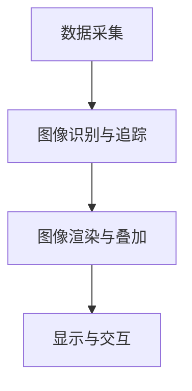

#### 2.2 增强现实技术的分类

增强现实技术可以根据不同的分类标准进行划分，常见的分类方式包括：

1. **根据显示方式分类**：

   - **直接增强**：数字信息直接叠加到用户的视线中，如头戴显示器。
   - **间接增强**：数字信息通过屏幕或其他媒介显示，用户通过观看屏幕来接收信息，如智能手机和平板电脑。

2. **根据应用场景分类**：

   - **消费类**：面向普通消费者，如娱乐、游戏、购物等。
   - **专业类**：面向特定行业，如医疗、教育、工业等。

3. **根据交互方式分类**：

   - **被动交互**：用户接收增强现实内容，但不主动参与交互。
   - **主动交互**：用户通过手势、声音等主动与增强现实内容进行交互。

#### 2.3 增强现实技术的核心应用

增强现实技术在各个领域有着广泛的应用，以下是其中几个核心应用领域的介绍：

1. **教育与培训**：

   - 通过增强现实技术，可以实现虚拟课堂、虚拟实验室等应用，提高教学效果和学生的参与度。

2. **医疗与健康**：

   - 增强现实技术在医学影像分析、手术导航、康复训练等方面有着广泛应用，为医生提供了更加精准的诊断和治疗手段。

3. **工业制造**：

   - 通过增强现实技术，可以实现远程维修、生产过程模拟和优化等应用，提高生产效率和产品质量。

4. **娱乐与游戏**：

   - 增强现实技术为游戏提供了更加沉浸式的体验，如《宝可梦GO》等游戏已成为热门话题。

#### 2.4 增强现实技术的挑战与未来发展趋势

虽然增强现实技术已经取得了一定的进展，但仍然面临诸多挑战：

1. **技术挑战**：

   - **实时数据处理**：增强现实技术需要实时处理大量的图像和传感器数据，这对计算性能提出了高要求。
   - **交互体验**：如何提供更加自然、直观的交互方式，提高用户体验，是一个亟待解决的问题。

2. **未来发展趋势**：

   - **硬件技术**：随着硬件技术的不断进步，增强现实设备的性能将得到进一步提升，用户体验将得到优化。
   - **应用创新**：随着增强现实技术的普及，其应用领域将不断拓展，出现更多创新性的应用场景。
   - **商业模式**：随着增强现实技术的商业化进程，新的商业模式也将不断涌现，为产业发展提供新的动力。

#### 2.5 空间计算与增强现实技术的结合案例

**空间计算**与**增强现实技术**的结合，为人类带来了更加丰富和真实的交互体验。以下是一些典型的结合案例：

1. **建筑与城市规划**：

   - 通过空间计算技术，可以实现虚拟建筑和城市模型的可视化，为城市规划提供更加直观的参考。

2. **虚拟现实博物馆**：

   - 利用增强现实技术，可以在现实场景中展示虚拟文物，为观众提供更加沉浸式的参观体验。

3. **远程协作**：

   - 通过空间计算和增强现实技术，可以实现远程协作，团队成员可以在虚拟空间中共同工作，提高协作效率。

#### 2.6 本章小结

本章对增强现实技术的基本原理、分类、核心应用以及未来发展趋势进行了详细解析，并介绍了空间计算与增强现实技术的结合案例。通过本章的学习，读者可以全面了解增强现实技术的基本概念和应用场景，为后续内容的学习打下坚实基础。

---

## 第3章 空间计算的核心技术

### 3.1 空间感知技术

空间感知技术是空间计算的核心组成部分，它主要涉及对物理空间的信息采集、处理和解释。以下是对空间感知技术的详细分析：

#### 3.1.1 传感器与数据采集

空间感知技术依赖于各种传感器来收集物理空间的信息。常见的传感器包括：

1. **摄像头**：用于捕捉图像和视频，是空间感知中最重要的传感器之一。
2. **深度传感器**：如结构光、ToF（Time of Flight）等，用于获取物体的深度信息，从而构建三维模型。
3. **惯性测量单元（IMU）**：包括加速度计、陀螺仪和磁力计，用于测量设备的加速度、角速度和磁场，从而获取设备的姿态信息。

传感器采集的数据需要经过预处理，包括去噪、校正和融合等，以便为后续的空间建模和交互提供准确的数据基础。

#### 3.1.2 数据处理与分析

空间感知技术中的数据处理与分析主要包括以下几个步骤：

1. **图像处理**：通过图像处理算法，对摄像头捕获的图像进行预处理，如去噪、边缘检测、特征提取等。
2. **点云处理**：深度传感器捕获的深度信息可以转化为点云数据，通过对点云数据进行滤波、分割和提取特征等操作，可以得到物体的三维形状信息。
3. **姿态估计**：利用IMU数据，可以估计设备的姿态信息，包括方向、角度和旋转等。
4. **空间建模**：通过将图像处理和点云处理的结果融合，可以构建出物理空间的三维模型。

以下是一个简化的数据处理与分析流程的Mermaid流程图：

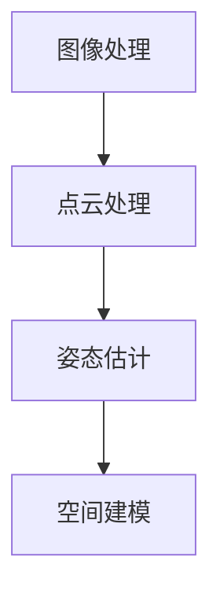

#### 3.1.3 实时空间感知

实时空间感知是空间计算的关键要求之一，它要求系统能够实时、准确地感知和响应物理空间的变化。实时空间感知的实现涉及以下几个方面：

1. **实时数据处理**：为了确保实时性，系统需要使用高效的算法和优化技术，如并行计算、分布式处理等，以减少数据处理的时间延迟。
2. **低延迟交互**：在增强现实和虚拟现实应用中，用户交互的响应速度直接影响用户体验。因此，系统需要实现低延迟的交互，确保用户操作与系统响应之间的时间差在可接受的范围内。
3. **动态更新**：实时空间感知要求系统能够动态更新空间模型，以适应环境的变化。这包括对传感器数据的实时处理和模型的重构。

以下是一个简化的实时空间感知流程的Mermaid流程图：

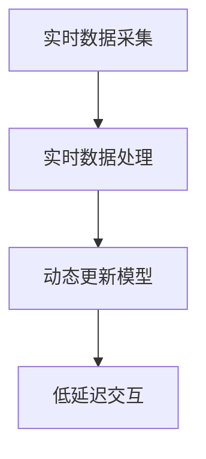

#### 3.2 空间建模与可视化

空间建模与可视化是空间计算中的重要环节，它将采集和处理后的空间数据转化为可交互的虚拟场景。

1. **空间建模技术**：

   - **基于点云的空间建模**：通过将点云数据转化为网格模型或体素模型，可以构建出物理空间的三维模型。
   - **基于图像的空间建模**：通过图像处理和特征提取，可以构建出基于图像的三维模型。

2. **空间可视化技术**：

   - **纹理映射**：通过将纹理贴图映射到三维模型上，可以增加模型的细节和真实感。
   - **光照与阴影**：通过模拟光照和阴影，可以增强虚拟场景的真实感。
   - **实时渲染**：使用实时渲染技术，可以在显示设备上快速生成高质量的虚拟场景。

以下是一个简化的空间建模与可视化流程的Mermaid流程图：

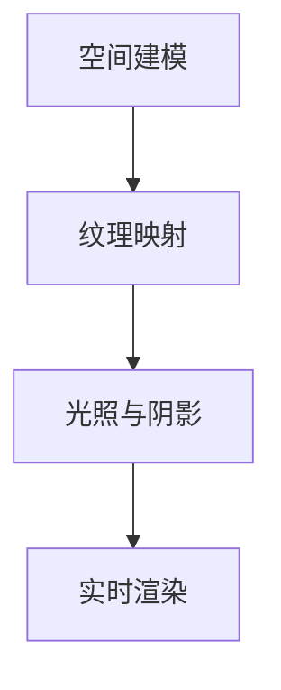

#### 3.3 空间计算算法

空间计算算法是空间计算的核心，它包括空间数据处理、空间建模和空间交互等多个方面。

1. **空间数据处理算法**：

   - **特征提取**：从空间数据中提取出有意义的特征，如边缘、角点、纹理等。
   - **数据融合**：将来自不同传感器的数据进行融合，以获得更准确的空间信息。
   - **异常检测**：检测空间数据中的异常值或异常事件，以提供更可靠的感知结果。

2. **空间建模算法**：

   - **点云处理**：包括点云滤波、点云分割、点云配准等算法。
   - **图像处理**：包括图像去噪、图像分割、图像特征提取等算法。

3. **空间交互算法**：

   - **手势识别**：通过检测用户的手部动作，实现与虚拟场景的交互。
   - **路径规划**：在虚拟空间中为用户或物体规划最优路径。
   - **场景重建**：根据用户的操作和空间感知数据，动态重建虚拟场景。

以下是一个简化的空间计算算法流程的Mermaid流程图：

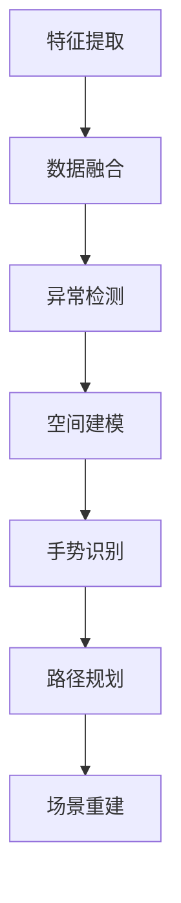

#### 3.4 空间计算与增强现实技术的融合

空间计算与增强现实技术的融合，为用户提供了更加丰富和真实的交互体验。以下是一些关键融合点：

1. **空间感知与增强现实**：

   - 利用空间感知技术，获取物理空间的三维信息，为增强现实提供准确的空间信息。
   - 通过增强现实技术，将虚拟信息叠加到物理空间中，实现虚实融合。

2. **虚拟空间建模与增强现实**：

   - 通过空间计算技术，构建虚拟空间的三维模型，为增强现实提供丰富的虚拟场景。
   - 利用增强现实技术，将虚拟场景与现实世界相结合，提供沉浸式的交互体验。

3. **空间交互与增强现实**：

   - 通过空间计算技术，实现自然的手势识别和交互，为用户带来更加直观的交互体验。
   - 利用增强现实技术，将用户的交互操作映射到虚拟场景中，实现实时反馈和互动。

以下是一个简化的空间计算与增强现实融合的Mermaid流程图：

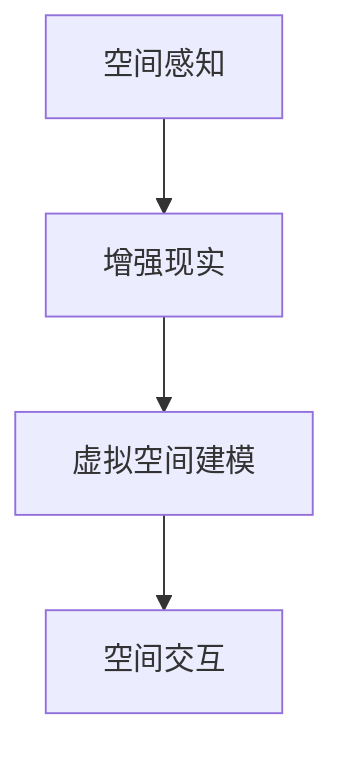

#### 3.5 本章小结

本章详细介绍了空间计算的核心技术，包括空间感知技术、空间建模与可视化技术、空间计算算法以及空间计算与增强现实技术的融合。通过本章的学习，读者可以全面了解空间计算的技术基础和应用场景，为后续内容的学习和实际应用打下坚实基础。

---

## 第4章 空间计算在教育领域的应用

### 4.1 教育空间计算的概念与特点

**教育空间计算**，作为一种新兴的教育技术，它将空间计算技术应用于教育场景中，旨在通过虚拟现实、增强现实等手段，为学生提供更加生动、直观和互动的学习体验。以下是教育空间计算的基本概念与特点：

#### 4.1.1 教育空间计算的定义

**教育空间计算**，是指利用空间计算技术（如虚拟现实、增强现实、混合现实等）来增强教学过程和学习体验的一种教育技术。它通过创建虚拟空间、模拟现实场景和提供互动体验，为学生提供了一种全新的学习方式。

#### 4.1.2 教育空间计算的特点

1. **沉浸式体验**：

   - 教育空间计算通过虚拟现实和增强现实技术，使学生能够身临其境地参与学习过程，从而提高学习的兴趣和效果。
   - 例如，在生物课上，学生可以通过虚拟现实技术参观人体内部结构，了解器官功能，而不需要解剖动物。

2. **互动性**：

   - 教育空间计算强调学生的主动参与和互动，通过手势、声音等自然交互方式，使学生能够与虚拟环境和内容进行实时互动。
   - 例如，在历史课上，学生可以通过增强现实技术，与历史人物进行“对话”，了解历史事件的背景和细节。

3. **个性化学习**：

   - 教育空间计算可以根据学生的学习进度、兴趣和能力，提供个性化的学习内容和学习路径，使每个学生都能够根据自己的需求进行学习。
   - 例如，通过虚拟实验室，学生可以根据自己的学习进度，自主选择实验项目，进行实验操作和数据分析。

4. **资源丰富性**：

   - 教育空间计算可以提供丰富的学习资源，包括虚拟实验、虚拟课堂、虚拟图书馆等，使学生能够接触到更多的知识和信息。
   - 例如，通过虚拟图书馆，学生可以查阅到全球各地的学术资源，进行跨学科的学习和研究。

#### 4.1.3 教育空间计算的优势

1. **提高学习效果**：

   - 教育空间计算通过沉浸式体验和互动性，使学生能够更加主动和积极地参与学习过程，从而提高学习效果。
   - 研究表明，通过虚拟现实和增强现实技术进行教学，学生的学习成绩和兴趣都有显著提升。

2. **拓宽学习领域**：

   - 教育空间计算可以模拟和再现复杂的学习场景，如实验室、历史场景、科学实验等，使学生能够在虚拟环境中进行实践操作，拓宽学习领域。
   - 例如，通过虚拟实验室，学生可以进行生物实验、化学实验等，而不需要实验室设备和材料。

3. **增强协作学习**：

   - 教育空间计算支持远程协作学习，学生可以通过虚拟环境进行合作学习，分享知识和经验，提高协作能力。
   - 例如，在团队项目中，学生可以通过虚拟会议系统，进行远程讨论和协作，共同完成任务。

4. **适应个性化需求**：

   - 教育空间计算可以根据学生的学习进度、兴趣和能力，提供个性化的学习内容和指导，满足不同学生的学习需求。
   - 例如，通过虚拟学习平台，学生可以根据自己的学习目标，选择适合的学习资源和课程。

#### 4.1.4 教育空间计算的挑战与解决方案

虽然教育空间计算具有诸多优势，但在实际应用中仍面临一些挑战：

1. **技术挑战**：

   - **硬件设备**：虚拟现实和增强现实技术需要高性能的硬件设备，如头戴显示器、传感器等，这可能导致成本较高。
   - **系统兼容性**：不同的虚拟现实和增强现实系统可能存在兼容性问题，影响教学效果。

   **解决方案**：随着技术的不断进步，硬件设备的成本逐渐降低，兼容性问题也在逐步解决。教育机构可以通过采购标准化的硬件设备和软件平台，提高系统的兼容性和稳定性。

2. **教学设计**：

   - **课程设计**：如何设计适应虚拟现实和增强现实技术的课程，是教育空间计算面临的重要挑战。
   - **教师培训**：教师需要掌握虚拟现实和增强现实技术的基本知识和操作方法，以便有效地应用这些技术进行教学。

   **解决方案**：教育机构可以提供针对性的教师培训课程，帮助教师掌握相关技术，并设计适应虚拟现实和增强现实技术的课程。

3. **学生适应性**：

   - **学习习惯**：学生可能需要适应虚拟现实和增强现实技术带来的新学习方式，这可能需要一定的时间。
   - **安全隐私**：虚拟现实和增强现实技术可能涉及学生的个人信息和隐私，需要确保数据安全和隐私保护。

   **解决方案**：教育机构可以通过引入示范课程和教学案例，帮助学生适应新的学习方式。同时，制定严格的数据安全和隐私保护政策，确保学生的个人信息和隐私得到有效保护。

### 4.2 教育空间计算的应用案例

教育空间计算在多个教育领域有着广泛的应用，以下是一些典型的应用案例：

1. **虚拟课堂**：

   - 通过虚拟现实和增强现实技术，可以实现虚拟课堂的教学模式，学生可以在虚拟环境中与教师和其他学生进行实时互动。
   - 例如，在物理课上，学生可以通过虚拟现实技术模拟实验过程，直观地观察物理现象。

2. **虚拟实验室**：

   - 通过虚拟现实和增强现实技术，可以创建虚拟实验室，学生可以在虚拟环境中进行实验操作和数据分析。
   - 例如，在化学课上，学生可以通过虚拟实验室进行化学反应的实验，观察实验结果。

3. **虚拟图书馆**：

   - 通过虚拟现实和增强现实技术，可以创建虚拟图书馆，学生可以在虚拟环境中查阅书籍、学术资源和数字文献。
   - 例如，在语文课上，学生可以通过虚拟图书馆查阅经典文学作品，进行深入阅读和分析。

4. **历史场景再现**：

   - 通过虚拟现实和增强现实技术，可以再现历史场景，学生可以在虚拟环境中感受历史事件的发生过程。
   - 例如，在历史课上，学生可以通过虚拟现实技术参观古埃及金字塔，了解古埃及文明。

5. **远程协作**：

   - 通过虚拟现实和增强现实技术，可以实现远程协作学习，学生和教师可以跨越地域限制，共同参与教学和讨论。
   - 例如，在数学课上，学生可以通过虚拟会议室，与远程教师和同学共同解决数学问题。

### 4.3 教育空间计算的未来发展趋势

随着虚拟现实、增强现实等技术的发展，教育空间计算在未来将呈现以下发展趋势：

1. **技术成熟度提高**：

   - 随着硬件设备性能的提升和软件技术的成熟，教育空间计算将变得更加稳定和高效，用户体验将得到显著提升。

2. **应用领域拓展**：

   - 教育空间计算将在更多教育领域得到应用，如艺术、文学、心理学等，为学生提供更加多样化的学习体验。

3. **教学模式的变革**：

   - 教育空间计算将推动教学模式的变革，从传统的教师主导的教学模式，转向以学生为中心的个性化教学模式。

4. **教育资源的共享**：

   - 教育空间计算将促进教育资源的共享，学生和教师可以通过虚拟环境，获取全球各地的教育资源，进行跨地域的学习和研究。

5. **教育公平性的提升**：

   - 教育空间计算将有助于缩小城乡教育差距，使偏远地区的学生也能够享受到优质的教育资源。

### 4.4 教育空间计算的挑战与解决方案

尽管教育空间计算具有巨大的潜力，但在实际应用中仍面临一些挑战：

1. **技术成本**：

   - 虚拟现实和增强现实设备的采购和运营成本较高，可能成为教育机构推广教育空间计算的障碍。

   **解决方案**：随着技术的进步和市场竞争的加剧，虚拟现实和增强现实设备的成本将逐步降低，同时政府和企业也可能提供相应的补贴和资助。

2. **教师培训**：

   - 教师需要掌握虚拟现实和增强现实技术的基本知识和操作方法，以便有效地应用这些技术进行教学。

   **解决方案**：教育机构应提供系统的教师培训课程，帮助教师掌握相关技术，并提供实践机会，以提升他们的技术应用能力。

3. **学生适应性**：

   - 学生可能需要适应虚拟现实和增强现实技术带来的新学习方式，这可能需要一定的时间。

   **解决方案**：教育机构可以通过引入示范课程和教学案例，帮助学生适应新的学习方式，同时提供技术支持和辅导。

4. **数据安全和隐私**：

   - 虚拟现实和增强现实技术可能涉及学生的个人信息和隐私，需要确保数据安全和隐私保护。

   **解决方案**：教育机构应制定严格的数据安全和隐私保护政策，采用先进的安全技术，确保学生的个人信息和隐私得到有效保护。

### 4.5 本章小结

教育空间计算作为一种新兴的教育技术，通过虚拟现实、增强现实等手段，为学生提供了一种全新的学习体验。本章介绍了教育空间计算的基本概念与特点，分析了其在教育领域的应用案例，并探讨了其未来发展趋势和面临的挑战。通过本章的学习，读者可以全面了解教育空间计算的潜力与应用，为实际教学提供有益的参考。在下一章中，我们将进一步探讨空间计算技术在医疗领域的应用，为读者呈现更多的技术案例和实践成果。

---

## 第5章 空间计算在医疗领域的应用

### 5.1 空间计算在医疗领域的概述

空间计算技术在医疗领域的应用日益广泛，其核心在于通过虚拟现实、增强现实和混合现实等技术，提供更加精准、高效和个性化的医疗服务。以下是对空间计算技术在医疗领域应用的概述：

#### 5.1.1 背景与需求

随着医学技术的不断进步，医疗领域对空间计算技术的需求日益增加。传统的医疗服务模式往往依赖于医生的诊断经验和物理设备，存在一定的局限性。而空间计算技术能够提供三维可视化、实时交互和精准定位等功能，为医疗诊断、治疗和康复提供了新的解决方案。

- **三维可视化**：空间计算技术可以将复杂的医学图像和数据转化为三维模型，帮助医生更直观地理解和分析病情。
- **实时交互**：通过虚拟现实和增强现实技术，医生和患者可以实时互动，提高医疗服务的效率和效果。
- **精准定位**：空间计算技术可以实现对医疗设备的精准定位和控制，提高手术和治疗的准确性。

#### 5.1.2 应用场景

空间计算技术在医疗领域有广泛的应用场景，主要包括以下几个方面：

1. **医学影像分析**：

   - 通过空间计算技术，可以对医学影像（如X光、CT、MRI等）进行三维重建和可视化，帮助医生更准确地诊断病情。

2. **手术导航**：

   - 在手术过程中，空间计算技术可以实时跟踪手术器械的位置和运动，辅助医生进行精准操作，减少手术风险。

3. **远程医疗**：

   - 通过虚拟现实和增强现实技术，可以实现远程会诊和手术指导，让专家医生能够跨越地域限制，为患者提供高质量的医疗服务。

4. **康复训练**：

   - 利用空间计算技术，可以为患者提供个性化的康复训练方案，通过虚拟现实场景进行康复训练，提高康复效果。

5. **医学教育和培训**：

   - 通过虚拟现实和增强现实技术，可以创建虚拟实验室和模拟手术场景，为医学生和医生提供实践操作和培训。

### 5.2 空间计算在医学影像分析中的应用

医学影像分析是空间计算技术在医疗领域的一个重要应用。通过三维重建和可视化技术，医生可以更直观地分析医学影像，从而提高诊断准确性。

#### 5.2.1 核心概念

- **医学影像**：医学影像包括X光、CT、MRI等，通过这些影像可以获取人体内部结构的详细信息。
- **三维重建**：通过空间计算技术，将二维医学影像数据转换为三维模型，实现医学影像的三维可视化。
- **可视化**：将医学影像数据以三维模型的形式呈现，帮助医生更好地理解和分析病情。

#### 5.2.2 应用案例

1. **肺癌诊断**：

   - 通过CT扫描获取肺部图像，利用空间计算技术进行三维重建和可视化，医生可以更清晰地观察肺部结构和病变部位。

2. **脑部肿瘤定位**：

   - 利用MRI获取脑部图像，通过空间计算技术重建脑部三维模型，帮助医生精准定位肿瘤位置和大小，制定最佳治疗方案。

3. **心脏病变分析**：

   - 通过心脏CT或MRI获取心脏图像，利用空间计算技术重建心脏三维模型，医生可以更直观地分析心脏病变情况。

#### 5.2.3 算法原理

- **图像分割**：对医学影像进行分割，将不同组织结构分离出来，为三维重建提供基础。
- **三维重建**：利用图像分割结果，通过空间计算技术构建三维模型，实现医学影像的三维可视化。
- **可视化渲染**：将三维模型以图形形式呈现，医生可以通过交互操作对模型进行旋转、放大、缩小等操作，更好地分析病情。

以下是一个简化的医学影像分析算法流程的Mermaid流程图：

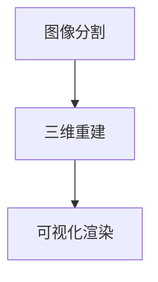

### 5.3 空间计算在手术导航中的应用

手术导航是空间计算技术在医疗领域的另一个重要应用。通过实时跟踪手术器械的位置和运动，手术导航技术可以帮助医生更精准地完成手术操作，提高手术成功率。

#### 5.3.1 核心概念

- **手术导航**：利用空间计算技术，实时跟踪手术器械的位置和运动，为手术提供精准的导航和指导。
- **实时跟踪**：通过摄像头、传感器等设备，实时获取手术器械的位置和运动信息。
- **实时反馈**：将手术器械的位置和运动信息实时反馈给医生，帮助医生进行精准操作。

#### 5.3.2 应用案例

1. **脑部手术导航**：

   - 通过手术导航系统，医生可以在脑部手术过程中实时跟踪手术器械的位置，避免误伤重要结构，提高手术安全性。

2. **心脏手术导航**：

   - 在心脏手术中，通过手术导航系统，医生可以实时跟踪手术器械的位置，避免误伤心脏其他部位，提高手术成功率。

3. **关节置换手术导航**：

   - 在关节置换手术中，通过手术导航系统，医生可以精准定位关节位置，确保手术效果。

#### 5.3.3 算法原理

- **图像配准**：将手术影像与术前影像进行配准，确定手术器械的位置。
- **运动跟踪**：利用传感器和摄像头，实时跟踪手术器械的位置和运动。
- **实时反馈**：将手术器械的位置和运动信息实时反馈给医生，辅助医生进行精准操作。

以下是一个简化的手术导航算法流程的Mermaid流程图：

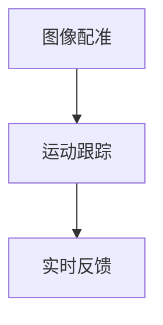

### 5.4 空间计算在远程医疗中的应用

远程医疗是空间计算技术在医疗领域的一个重要应用方向。通过虚拟现实和增强现实技术，医生和患者可以跨越地域限制，实现远程会诊和手术指导。

#### 5.4.1 核心概念

- **远程医疗**：利用虚拟现实和增强现实技术，实现医生与患者之间的远程交互和诊疗服务。
- **虚拟会诊**：医生通过虚拟现实设备，远程查看患者的病情，进行会诊和诊断。
- **手术指导**：医生通过增强现实技术，远程指导患者进行手术操作。

#### 5.4.2 应用案例

1. **远程会诊**：

   - 通过虚拟现实技术，医生可以远程查看患者的病情，进行诊断和治疗建议。
   - 例如，在偏远地区，患者可以通过虚拟现实设备与城市医院的医生进行远程会诊，获取高质量的医疗服务。

2. **手术指导**：

   - 通过增强现实技术，医生可以在手术过程中远程指导患者进行操作，提高手术成功率。
   - 例如，在重大手术中，主刀医生可以通过增强现实设备，实时查看手术器械的位置和运动，为手术团队提供实时指导。

#### 5.4.3 算法原理

- **远程连接**：建立稳定的网络连接，确保医生和患者之间的远程交互流畅。
- **数据传输**：将患者的影像数据和手术信息实时传输给医生，实现远程会诊和手术指导。
- **实时交互**：通过虚拟现实和增强现实技术，实现医生与患者之间的实时互动和交流。

以下是一个简化的远程医疗算法流程的Mermaid流程图：

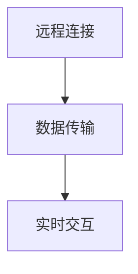

### 5.5 空间计算在康复训练中的应用

康复训练是空间计算技术在医疗领域的另一个重要应用。通过虚拟现实和增强现实技术，可以为患者提供个性化的康复训练方案，提高康复效果。

#### 5.5.1 核心概念

- **康复训练**：利用虚拟现实和增强现实技术，为患者提供个性化的康复训练方案，促进身体恢复。
- **虚拟场景**：通过虚拟现实技术，创建康复训练的场景，使患者能够在虚拟环境中进行康复训练。
- **增强现实**：利用增强现实技术，将康复训练的内容叠加到患者的现实环境中，提高康复训练的趣味性和效果。

#### 5.5.2 应用案例

1. **运动康复**：

   - 通过虚拟现实技术，为患者创建运动康复场景，使患者能够在虚拟环境中进行康复训练，提高训练效果。
   - 例如，在运动损伤康复过程中，患者可以通过虚拟现实设备进行跑步、游泳等虚拟运动，逐步恢复运动能力。

2. **认知康复**：

   - 通过增强现实技术，将认知康复训练内容叠加到患者的现实环境中，提高认知功能的恢复速度。
   - 例如，在脑卒中康复过程中，患者可以通过增强现实设备进行记忆训练、注意力训练等认知功能训练。

#### 5.5.3 算法原理

- **虚拟场景生成**：通过虚拟现实技术，生成康复训练的场景，为患者提供个性化的训练环境。
- **实时交互**：通过增强现实技术，实现患者与虚拟场景的实时互动，提高训练的趣味性和效果。
- **数据监测与反馈**：实时监测患者的训练数据，为患者提供个性化的训练建议，提高康复效果。

以下是一个简化的康复训练算法流程的Mermaid流程图：

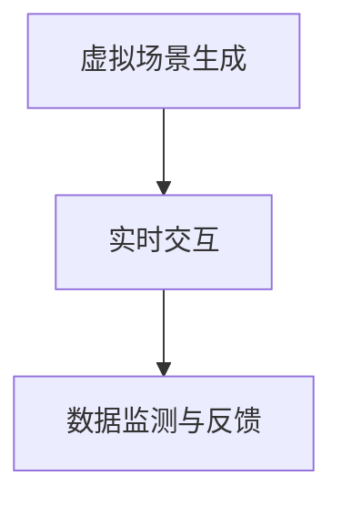

### 5.6 空间计算在医学教育和培训中的应用

医学教育和培训是空间计算技术在医疗领域的另一个重要应用方向。通过虚拟现实和增强现实技术，可以为医学生和医生提供实践操作和培训，提高他们的专业技能。

#### 5.6.1 核心概念

- **医学教育**：利用虚拟现实和增强现实技术，为医学生提供虚拟的医学实验和操作场景，提高他们的实践能力。
- **医学培训**：利用虚拟现实和增强现实技术，为医生提供手术模拟和培训场景，提高他们的手术技能和操作水平。

#### 5.6.2 应用案例

1. **虚拟手术培训**：

   - 通过虚拟现实技术，创建手术模拟场景，医生可以在虚拟环境中进行手术操作，提高手术技能。
   - 例如，通过虚拟手术培训系统，医生可以在虚拟环境中进行心脏手术、脑部手术等复杂手术的模拟训练。

2. **医学实验培训**：

   - 通过增强现实技术，将医学实验的内容叠加到学生的现实环境中，提高他们的实验技能和理论知识。
   - 例如，通过增强现实技术，学生可以在实验室中进行人体解剖、药物反应等医学实验的模拟训练。

#### 5.6.3 算法原理

- **虚拟场景生成**：通过虚拟现实技术，生成手术模拟和医学实验场景，为医学生和医生提供实践操作的机会。
- **实时交互**：通过增强现实技术，实现医学生和医生与虚拟场景的实时互动，提高实践操作的效果。
- **数据分析和反馈**：实时分析医学生和医生的操作数据，提供个性化的培训建议，提高培训效果。

以下是一个简化的医学教育和培训算法流程的Mermaid流程图：

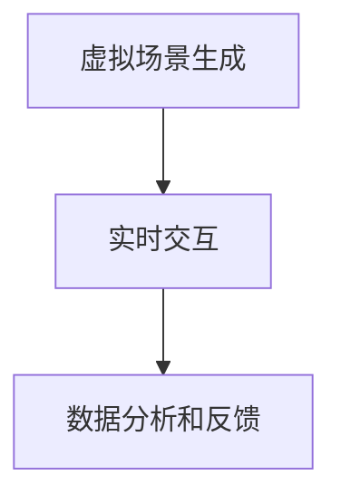

### 5.7 本章小结

空间计算技术在医疗领域的应用为医疗服务提供了新的技术手段和解决方案。通过本章的介绍，我们了解了空间计算技术在医学影像分析、手术导航、远程医疗、康复训练、医学教育和培训等领域的具体应用案例和算法原理。在下一章中，我们将探讨空间计算技术在工业制造领域的应用，为读者呈现更多实际案例和技术成果。

---

## 第6章 空间计算在工业制造领域的应用

### 6.1 空间计算在工业制造领域的概述

空间计算技术在工业制造领域中的应用正日益受到关注，其主要目标是通过虚拟现实（VR）和增强现实（AR）技术，实现生产过程的优化、产品质量的提升以及工作效率的提高。以下是对空间计算在工业制造领域应用的概述：

#### 6.1.1 背景与需求

随着工业4.0和智能制造的推进，制造业正面临数字化转型和智能化升级的需求。传统的生产模式存在生产效率低、产品质量不稳定等问题，而空间计算技术提供了新的解决方案：

- **生产过程优化**：通过虚拟现实技术，可以在虚拟环境中模拟和优化生产流程，减少浪费和资源消耗。
- **产品质量提升**：利用增强现实技术，可以实现对生产过程的实时监控和质量检测，提高产品的可靠性和一致性。
- **工作效率提高**：空间计算技术通过提供直观的交互界面和实时反馈，使操作人员能够更加高效地完成工作任务。

#### 6.1.2 应用场景

空间计算技术在工业制造领域有广泛的应用场景，主要包括以下几个方面：

1. **生产流程模拟与优化**：

   - 通过虚拟现实技术，可以创建虚拟生产车间和生产线，对生产过程进行模拟和优化，提高生产效率和降低成本。

2. **远程协作与培训**：

   - 利用虚拟现实和增强现实技术，可以实现远程协作和培训，操作人员可以通过虚拟环境进行技能培训和任务指导。

3. **质量检测与监控**：

   - 通过增强现实技术，可以在生产现场实时显示产品质量信息，帮助操作人员及时发现和解决问题。

4. **设备维护与管理**：

   - 利用空间计算技术，可以对设备进行实时监控和维护，提高设备的利用率和运行效率。

5. **设计验证与优化**：

   - 在产品设计阶段，通过虚拟现实技术，可以创建虚拟模型并进行验证和优化，减少物理样机制作和测试的成本。

### 6.2 空间计算在工业制造中的应用案例

以下是一些典型的空间计算在工业制造中的应用案例：

#### 6.2.1 生产流程模拟与优化

1. **汽车制造业**：

   - 在汽车生产过程中，通过虚拟现实技术，可以对生产线进行模拟和优化，确定最优的生产节拍和设备配置，从而提高生产效率和降低生产成本。

2. **电子制造业**：

   - 在电子产品的制造过程中，利用虚拟现实技术，可以模拟SMT（表面贴装技术）生产线，优化焊接参数和节拍，提高焊接质量和生产效率。

#### 6.2.2 远程协作与培训

1. **航空制造业**：

   - 在航空制造业中，由于飞机零部件制造复杂且分布广泛，通过虚拟现实和增强现实技术，可以实现全球范围内的协作和培训，提高工作效率。

2. **能源行业**：

   - 在能源行业中，通过虚拟现实技术，可以进行远程协作，实现钻井平台、核电站等现场操作的远程指导，降低人员的安全风险。

#### 6.2.3 质量检测与监控

1. **汽车制造业**：

   - 在汽车装配线上，利用增强现实技术，可以在装配过程中实时显示质量标准，帮助操作人员快速识别和纠正问题，提高产品合格率。

2. **电子制造业**：

   - 在电子产品的生产过程中，通过增强现实技术，可以实时监控生产设备的运行状态和产品质量，及时发现和解决问题，提高生产过程的可控性。

#### 6.2.4 设备维护与管理

1. **制造业**：

   - 在制造业中，通过空间计算技术，可以对生产设备进行实时监控和维护，实现预防性维护，降低设备的停机时间，提高生产效率。

2. **能源行业**：

   - 在能源行业中，通过虚拟现实技术，可以创建虚拟设备模型，实现对设备的远程监控和维护，降低现场维护成本。

#### 6.2.5 设计验证与优化

1. **航空航天制造业**：

   - 在航空航天制造业中，通过虚拟现实技术，可以创建虚拟飞机模型，进行飞行模拟和性能验证，优化设计参数，提高飞机的安全性和可靠性。

2. **机械制造业**：

   - 在机械制造业中，通过虚拟现实技术，可以创建虚拟机械模型，进行动态仿真和验证，优化机械设计，减少物理样机制作和测试的成本。

### 6.3 空间计算在工业制造中的应用案例：项目实战

以下是一个空间计算在工业制造中的应用案例，详细介绍项目环境安装、系统核心实现以及实际应用解析。

#### 6.3.1 项目环境安装

1. **硬件设备**：

   - **VR头戴显示器**：如Oculus Rift、HTC Vive等。
   - **AR设备**：如Microsoft HoloLens、Google Glass等。
   - **计算机**：高性能计算机，用于运行虚拟现实和增强现实应用程序。

2. **软件环境**：

   - **操作系统**：Windows 10或更高版本。
   - **开发工具**：Unity 3D、Unreal Engine等虚拟现实开发平台。
   - **传感器驱动**：相应的VR和AR设备驱动程序。

3. **项目搭建**：

   - 在计算机上安装所需的操作系统和开发工具。
   - 连接VR或AR设备，并安装相应的驱动程序。
   - 配置网络环境，确保设备与计算机之间的连接稳定。

#### 6.3.2 系统核心实现

以下是一个简化的虚拟现实生产流程模拟系统的核心实现流程：

1. **场景构建**：

   - 利用Unity 3D或Unreal Engine创建虚拟生产车间和生产线模型。
   - 设置场景的物理参数，如光照、纹理等，以模拟现实环境。

2. **数据采集**：

   - 从生产线传感器采集实时数据，如设备状态、产品质量等。
   - 将数据传输到虚拟环境中，用于实时监控和优化。

3. **交互设计**：

   - 设计用户交互界面，如菜单、按钮等，方便用户进行操作。
   - 实现虚拟环境中的交互功能，如设备的启动、停止、调整等。

4. **数据分析和优化**：

   - 对采集到的数据进行分析，识别生产过程中的瓶颈和问题。
   - 提出优化方案，通过虚拟现实环境进行模拟和验证。

以下是一个简化的系统核心实现流程的Mermaid流程图：

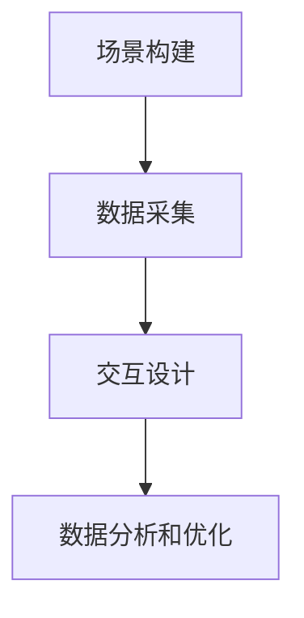

#### 6.3.3 实际应用解析

以下是一个实际应用案例：利用虚拟现实技术优化汽车生产线的装配过程。

1. **问题背景**：

   - 在汽车装配过程中，装配线节拍不稳定，导致生产效率低下。
   - 需要找到优化装配线节拍的方法，以提高生产效率。

2. **解决方案**：

   - 利用虚拟现实技术，创建虚拟生产线和装配场景。
   - 通过模拟和优化装配流程，找到最优的节拍和设备配置。

3. **实施过程**：

   - 在Unity 3D中构建虚拟生产线和装配场景。
   - 采集生产线传感器的实时数据，用于模拟和优化。
   - 通过交互界面，调整生产线参数，模拟不同的装配节拍。
   - 分析模拟数据，找出最优装配节拍，并应用到实际生产中。

4. **效果评估**：

   - 通过实施优化方案，装配线的节拍稳定，生产效率显著提高。
   - 避免了因装配线节拍不稳定导致的生产延误和质量问题。

### 6.4 本章小结

空间计算技术在工业制造领域的应用，通过虚拟现实和增强现实技术，为生产过程的优化、产品质量的提升和效率的提高提供了新的解决方案。本章介绍了空间计算在工业制造领域的应用场景、具体应用案例以及项目实战，展示了空间计算技术在工业制造中的实际应用价值。在下一章中，我们将探讨空间计算技术在城市管理和社会服务领域的应用，为读者呈现更多关于智慧城市和智能服务的技术案例。

---

## 第7章 空间计算在智慧城市与智能服务领域的应用

### 7.1 空间计算在智慧城市与社会服务领域的概述

随着信息技术和人工智能的快速发展，空间计算技术在智慧城市与社会服务领域中的应用越来越广泛。智慧城市通过集成物联网、大数据、云计算和空间计算等技术，实现城市管理的智能化和高效化，从而提升居民生活质量、降低城市运行成本和应对各种挑战。以下是对空间计算在智慧城市与社会服务领域应用的概述：

#### 7.1.1 背景与需求

智慧城市的建设是现代城市发展的重要趋势，其主要目标是通过技术创新和数字化转型，提升城市治理水平，提高居民的生活质量。空间计算技术在智慧城市中扮演着关键角色，其主要需求包括：

- **城市管理智能化**：通过空间计算技术，实现对城市基础设施、交通、环境等数据的实时监测和管理，提高城市运行效率。
- **公共服务优化**：利用空间计算技术，为居民提供便捷、高效的公共服务，如交通导航、医疗保健、教育服务等。
- **灾害预防和应对**：通过空间计算技术，实现对自然灾害和突发事件的可视化监测和预测，提高灾害预防和应对能力。

#### 7.1.2 应用场景

空间计算技术在智慧城市与社会服务领域有广泛的应用场景，主要包括以下几个方面：

1. **城市管理**：

   - 利用空间计算技术，可以实时监控城市基础设施的状态，如道路、桥梁、水利设施等，提高城市运行效率。
   - 通过虚拟现实和增强现实技术，可以进行城市规划和设计，提高规划的科学性和可行性。

2. **交通管理**：

   - 利用空间计算技术，可以实现智能交通系统，实时监测交通流量，优化交通信号控制，提高道路通行效率。
   - 通过虚拟现实技术，可以模拟交通场景，进行交通事故分析和预防。

3. **公共服务**：

   - 通过空间计算技术，可以提供更加便捷和高效的公共服务，如医疗保健、教育、社会保障等。
   - 利用增强现实技术，可以在公共场所提供信息指引，提高公共服务的可达性和用户体验。

4. **灾害预防与应对**：

   - 利用空间计算技术，可以实现对自然灾害的实时监测和预测，提高灾害预防和应对能力。
   - 通过虚拟现实技术，可以模拟灾害场景，进行应急预案的演练和培训。

### 7.2 空间计算在智慧城市与社会服务中的应用案例

以下是一些典型的空间计算在智慧城市与社会服务中的应用案例：

#### 7.2.1 城市管理

1. **智慧交通管理**：

   - 利用空间计算技术，可以实时监测城市的交通流量，通过数据分析优化交通信号控制，提高道路通行效率。
   - 通过虚拟现实技术，可以进行交通规划，模拟不同交通方案的效果，为城市规划提供科学依据。

2. **智慧环保监测**：

   - 利用空间计算技术，可以实时监测城市空气质量、水质等环境数据，通过数据分析提高环保治理效率。
   - 通过虚拟现实技术，可以模拟不同环保措施的成效，为环保决策提供数据支持。

#### 7.2.2 公共服务

1. **智能医疗**：

   - 利用空间计算技术，可以实现远程医疗诊断和咨询，为偏远地区居民提供优质的医疗服务。
   - 通过增强现实技术，可以在医院中提供手术导航和辅助，提高手术成功率。

2. **智能教育**：

   - 利用空间计算技术，可以提供虚拟课堂和虚拟实验室，为学生提供更加丰富的学习资源。
   - 通过虚拟现实技术，可以模拟不同学科的场景，提高学生的学习效果。

#### 7.2.3 灾害预防与应对

1. **自然灾害监测**：

   - 利用空间计算技术，可以实现对地震、洪水、台风等自然灾害的实时监测和预警，提高灾害应对能力。
   - 通过虚拟现实技术，可以模拟灾害场景，进行应急预案的演练和培训。

2. **公共安全**：

   - 利用空间计算技术，可以实时监控城市公共安全，通过数据分析提高安全预警和应急响应能力。
   - 通过虚拟现实技术，可以模拟应急场景，提高应急人员的应对能力。

### 7.3 空间计算在智慧城市与社会服务领域的应用案例：项目实战

以下是一个空间计算在智慧城市与社会服务领域中的应用案例，详细介绍项目环境安装、系统核心实现以及实际应用解析。

#### 7.3.1 项目环境安装

1. **硬件设备**：

   - **传感器设备**：如摄像头、气象传感器、交通流量监测设备等。
   - **计算机**：用于数据采集、处理和存储的高性能计算机。
   - **移动设备**：如智能手机、平板电脑，用于用户交互和信息查询。

2. **软件环境**：

   - **操作系统**：Linux或Windows，用于运行服务器和应用软件。
   - **开发工具**：如Python、JavaScript等，用于开发应用程序。
   - **数据库**：如MySQL、MongoDB等，用于存储和管理数据。

3. **项目搭建**：

   - 在计算机上安装操作系统和开发工具。
   - 连接传感器设备，并配置相应的数据采集和传输软件。
   - 配置数据库，确保数据的安全存储和管理。
   - 开发应用程序，实现数据采集、处理和展示功能。

#### 7.3.2 系统核心实现

以下是一个简化的智慧交通管理系统核心实现流程：

1. **数据采集**：

   - 从摄像头和交通流量监测设备采集实时交通数据，如车辆数量、行驶速度、道路状况等。
   - 将数据传输到服务器，进行初步处理和存储。

2. **数据处理**：

   - 对采集到的交通数据进行分析和处理，提取有用的信息，如交通拥堵状况、事故发生地点等。
   - 将处理后的数据存储到数据库，以供后续分析和应用。

3. **交互设计**：

   - 设计用户交互界面，如网页、移动应用等，方便用户查看交通信息和进行查询。
   - 实现用户与系统之间的交互功能，如交通流量实时监控、路线规划等。

4. **数据分析和优化**：

   - 对交通数据进行分析，识别交通拥堵的原因和瓶颈。
   - 提出优化方案，如交通信号控制优化、公共交通线路优化等，以提高交通运行效率。

以下是一个简化的系统核心实现流程的Mermaid流程图：

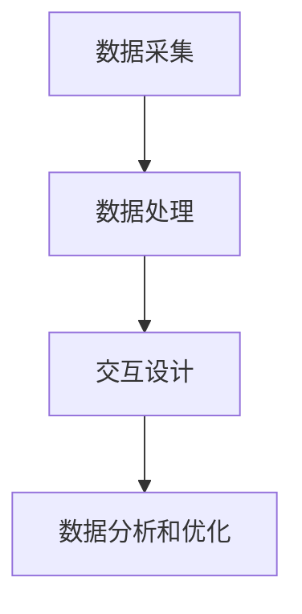

#### 7.3.3 实际应用解析

以下是一个实际应用案例：利用空间计算技术优化城市交通流量，提高道路通行效率。

1. **问题背景**：

   - 城市交通拥堵严重，导致通勤时间长、事故频发，影响居民生活质量。
   - 需要找到有效的交通流量优化方法，缓解交通拥堵。

2. **解决方案**：

   - 利用空间计算技术，实时监测城市交通流量，通过数据分析识别交通拥堵原因。
   - 采用智能交通信号控制系统，根据实时交通数据调整信号灯时序，优化交通流量。
   - 通过移动应用向用户实时提供交通信息，引导用户选择最佳路线，分散交通压力。

3. **实施过程**：

   - 在城市主要道路和交叉路口安装摄像头和交通流量监测设备。
   - 连接传感器设备，实现实时数据采集和传输。
   - 在服务器端部署数据处理和分析软件，对交通数据进行分析和处理。
   - 开发移动应用，提供交通信息查询和路线规划功能。
   - 实施智能交通信号控制系统，根据实时交通数据调整信号灯时序。

4. **效果评估**：

   - 通过实施优化方案，城市交通拥堵状况显著改善，道路通行效率提高。
   - 减少了交通事故的发生频率，提高了居民生活质量。

### 7.4 本章小结

空间计算技术在智慧城市与社会服务领域的应用，通过提供智能化的城市管理、高效的公共服务和有效的灾害预防与应对，为城市的发展和居民的生活质量提升做出了重要贡献。本章介绍了空间计算在智慧城市与社会服务领域中的应用场景、具体应用案例以及项目实战，展示了空间计算技术的实际应用价值。在下一章中，我们将探讨空间计算技术在艺术和文化领域的应用，为读者呈现更多关于创意表达和文化传播的技术案例。

---

## 第8章 空间计算在艺术和文化领域的应用

### 8.1 空间计算在艺术和文化领域的概述

空间计算技术为艺术和文化领域的创作、展示与传播提供了新的维度和方式。通过虚拟现实（VR）、增强现实（AR）和混合现实（MR）等技术，艺术家和文化工作者能够创造出更加沉浸和互动的艺术体验，同时，观众也能以一种全新的视角欣赏和互动艺术作品。以下是对空间计算在艺术和文化领域应用的概述：

#### 8.1.1 背景与需求

艺术和文化领域的创作与展示过程一直以来都依赖于传统的物理媒介和空间限制。随着数字技术的进步，空间计算技术为艺术和文化带来了前所未有的创作和展示可能性：

- **艺术创作**：艺术家可以利用虚拟现实和增强现实技术，在虚拟空间中探索和创作艺术作品，打破物理空间的限制。
- **文化展示**：博物馆、画廊等文化机构可以利用增强现实技术，为观众提供更加互动和沉浸的参观体验。
- **文化传播**：通过虚拟现实和增强现实技术，文化内容可以在全球范围内进行传播和展示，使文化体验更加广泛和多元。

#### 8.1.2 应用场景

空间计算技术在艺术和文化领域有广泛的应用场景，主要包括以下几个方面：

1. **艺术创作**：

   - 艺术家通过虚拟现实技术，在虚拟空间中创作绘画、雕塑、音乐等艺术作品，实现跨媒介的创作。
   - 通过增强现实技术，艺术家可以将艺术作品与现实世界相结合，创造出独特的艺术体验。

2. **文化展示**：

   - 博物馆和画廊利用增强现实技术，为观众提供虚拟展览和互动体验，增强文化展示的吸引力和互动性。
   - 通过虚拟现实技术，文化遗产可以在虚拟空间中得到再现和展示，使观众能够身临其境地体验历史和文化。

3. **文化传播**：

   - 通过虚拟现实和增强现实技术，文化内容可以突破地理限制，在全球范围内进行传播和分享。
   - 文化机构可以利用虚拟现实技术，举办虚拟文化活动，吸引全球观众参与。

### 8.2 空间计算在艺术创作中的应用案例

以下是一些典型的空间计算在艺术创作中的应用案例：

#### 8.2.1 虚拟现实绘画

1. **VR绘画体验**：

   - 艺术家通过虚拟现实头戴设备，在虚拟空间中自由创作绘画作品，享受不受物理限制的创作体验。
   - 通过虚拟现实技术，艺术家可以探索不同的绘画风格和技巧，创造出独特的艺术作品。

2. **VR互动艺术装置**：

   - 利用虚拟现实技术，艺术家可以创建互动艺术装置，观众可以通过与虚拟环境的互动，参与艺术创作过程。
   - 例如，观众可以在虚拟空间中绘制图案，这些图案会实时映射到真实环境中的屏幕上，形成独特的互动体验。

#### 8.2.2 增强现实雕塑

1. **AR雕塑展示**：

   - 艺术家利用增强现实技术，将雕塑作品与现实世界相结合，观众可以通过增强现实设备观看雕塑的立体效果。
   - 通过增强现实技术，艺术家可以创建动态的雕塑展示，如雕塑在空间中的旋转、放大和缩小，为观众带来全新的观赏体验。

2. **AR互动装置**：

   - 利用增强现实技术，艺术家可以创建互动装置，观众可以通过手势或声音与艺术作品进行互动，体验艺术创作的乐趣。
   - 例如，观众可以通过增强现实设备触摸虚拟雕塑，感受到雕塑的质地和纹理，或者通过声音控制虚拟雕塑的动作。

### 8.3 空间计算在文化展示中的应用案例

以下是一些典型的空间计算在文化展示中的应用案例：

#### 8.3.1 虚拟博物馆

1. **虚拟展览**：

   - 博物馆利用虚拟现实技术，创建虚拟展览，观众可以通过虚拟现实设备参观博物馆，观看展品。
   - 通过虚拟现实技术，博物馆可以突破物理空间的限制，提供丰富的展览内容和互动体验。

2. **虚拟文化遗产再现**：

   - 利用虚拟现实技术，文化遗产可以在虚拟空间中得到再现，观众可以身临其境地体验历史和文化。
   - 例如，观众可以通过虚拟现实设备参观古希腊遗迹、古埃及金字塔等，感受历史文化的魅力。

#### 8.3.2 增强现实文化遗产展示

1. **AR文化遗产互动**：

   - 利用增强现实技术，文化遗产可以在现实场景中得到展示，观众可以通过增强现实设备观看文化遗产的立体效果。
   - 通过增强现实技术，观众可以在现实环境中与文化遗产进行互动，了解文化遗产的背景和故事。

2. **AR互动历史场景**：

   - 利用增强现实技术，历史场景可以在现实环境中再现，观众可以通过增强现实设备观看历史事件的重现。
   - 例如，观众可以通过增强现实设备观看历史战争场景、文艺复兴时期的市场等，深入了解历史文化的魅力。

### 8.4 空间计算在文化传播中的应用案例

以下是一些典型的空间计算在文化传播中的应用案例：

#### 8.4.1 虚拟文化交流

1. **虚拟文化交流平台**：

   - 利用虚拟现实技术，可以创建虚拟文化交流平台，艺术家和文化工作者可以在虚拟空间中展示和分享自己的作品。
   - 通过虚拟现实技术，观众可以跨越地域限制，参与全球范围内的文化交流活动，感受不同文化的魅力。

2. **虚拟文化活动**：

   - 利用虚拟现实技术，文化机构可以举办虚拟文化活动，如虚拟音乐会、虚拟戏剧演出等，吸引全球观众参与。
   - 通过虚拟现实技术，观众可以身临其境地参与虚拟文化活动，感受现场的氛围和艺术的魅力。

#### 8.4.2 增强现实文化体验

1. **AR文化体验**：

   - 利用增强现实技术，文化机构可以在现实场景中提供文化体验，观众可以通过增强现实设备观看文化内容。
   - 例如，观众可以通过增强现实设备观看文化遗产的动态展示、参与文化活动的互动体验等。

2. **AR文化推广**：

   - 利用增强现实技术，文化机构可以在公共场所推广文化内容，吸引更多人关注和了解文化。
   - 例如，在城市广场、公园等公共场所，文化机构可以通过增强现实技术展示文化展览、宣传文化知识等。

### 8.5 空间计算在艺术和文化领域的创新应用

空间计算技术在艺术和文化领域的创新应用不断涌现，以下是一些创新的探索：

#### 8.5.1 虚拟现实艺术教育

1. **VR艺术教育平台**：

   - 利用虚拟现实技术，可以创建艺术教育平台，学生可以通过虚拟现实设备进行艺术学习，体验艺术创作的过程。
   - 通过虚拟现实技术，学生可以参观虚拟美术馆、博物馆，了解艺术作品的创作背景和技巧。

2. **VR艺术实践**：

   - 利用虚拟现实技术，艺术家可以创建虚拟艺术实践空间，观众可以在虚拟空间中体验艺术创作，提高艺术素养。

#### 8.5.2 增强现实文化遗产保护

1. **AR文化遗产修复**：

   - 利用增强现实技术，可以对文化遗产进行虚拟修复，观众可以通过增强现实设备观看修复过程，了解文化遗产的历史和艺术价值。

2. **AR文化遗产保护教育**：

   - 利用增强现实技术，可以创建文化遗产保护教育平台，学生可以通过增强现实设备了解文化遗产的保护方法和技巧。

### 8.6 本章小结

空间计算技术在艺术和文化领域的应用为艺术创作、文化展示和传播带来了新的可能性。通过本章的介绍，我们了解了空间计算在艺术和文化领域的应用场景、具体应用案例以及创新应用。空间计算技术不仅为艺术和文化领域提供了创新的创作和展示方式，也为观众带来了全新的体验。在下一章中，我们将探讨空间计算技术在科学研究与探索中的应用，为读者呈现更多关于科技进步和科研创新的案例。

---

## 第9章 空间计算在科学研究与探索中的应用

### 9.1 空间计算在科学研究与探索领域的概述

空间计算技术在科学研究与探索领域正发挥着越来越重要的作用。通过虚拟现实（VR）、增强现实（AR）和混合现实（MR）等技术，科学家和研究人员能够更加直观地理解复杂的数据，模拟和预测科学现象，从而推动科学研究的深入和发展。以下是对空间计算在科学研究与探索领域应用的概述：

#### 9.1.1 背景与需求

科学研究与探索领域涉及众多复杂的物理、生物、化学等过程，传统的实验方法和理论分析往往难以完全揭示这些过程的本质。空间计算技术提供了一种新的手段，能够帮助科学家更加直观地理解和模拟这些复杂现象：

- **数据可视化**：空间计算技术可以将复杂的数据集转换为直观的三维可视化图像，帮助科学家快速识别数据中的模式和趋势。
- **模拟与预测**：通过虚拟现实和增强现实技术，科学家可以在虚拟环境中模拟和预测科学现象，验证理论模型的准确性。
- **远程协作**：空间计算技术支持科学家之间的远程协作，实现全球范围内的科研合作和知识共享。

#### 9.1.2 应用场景

空间计算技术在科学研究与探索领域有广泛的应用场景，主要包括以下几个方面：

1. **天文学**：

   - 通过虚拟现实技术，科学家可以在虚拟宇宙中探索星系、行星和恒星的形成和演化过程。
   - 利用增强现实技术，科学家可以在现实环境中模拟天文现象，如日食、彗星撞击等。

2. **生物学**：

   - 利用虚拟现实技术，科学家可以创建三维模型，研究生物分子结构和蛋白质功能。
   - 通过增强现实技术，科学家可以在实验室中实时观察和操作生物样本，提高实验效率和准确性。

3. **化学**：

   - 利用虚拟现实技术，化学家可以在虚拟环境中模拟化学反应，预测反应产物的结构和性质。
   - 通过增强现实技术，化学家可以在现实环境中进行虚拟实验，减少实验风险和资源消耗。

4. **地理科学**：

   - 利用虚拟现实技术，地理科学家可以模拟地形、气候和自然灾害等地理现象。
   - 通过增强现实技术，地理科学家可以在现实环境中实时监测和评估地理环境的变化。

### 9.2 空间计算在天文学中的应用案例

以下是一些典型的空间计算在天文学中的应用案例：

#### 9.2.1 虚拟天文观测

1. **虚拟望远镜观测**：

   - 科学家利用虚拟现实技术，创建虚拟望远镜观测系统，可以在虚拟宇宙中进行天文观测。
   - 通过虚拟现实技术，科学家可以探索宇宙的深处，观察星系、行星和恒星的形成和演化过程。

2. **虚拟天体模拟**：

   - 利用虚拟现实技术，科学家可以创建虚拟天体模型，模拟天文现象，如行星轨道、恒星爆炸等。
   - 通过虚拟现实技术，科学家可以直观地理解天体运动规律和宇宙演化过程。

#### 9.2.2 增强现实天体观测

1. **AR天文观测**：

   - 科学家利用增强现实技术，将天体观测数据叠加到现实环境中，观众可以通过增强现实设备观看天文现象。
   - 通过增强现实技术，观众可以实时观看夜空中的星系、行星和流星等天文现象。

2. **AR天体互动**：

   - 利用增强现实技术，观众可以在现实环境中与天文现象进行互动，如观察行星的旋转、恒星的光谱分析等。
   - 通过增强现实技术，观众可以更加深入地了解天文学知识和宇宙的奥秘。

### 9.3 空间计算在生物学中的应用案例

以下是一些典型的空间计算在生物学中的应用案例：

#### 9.3.1 虚拟生物实验

1. **虚拟细胞观察**：

   - 利用虚拟现实技术，科学家可以创建虚拟细胞模型，观察细胞的分裂、生长和代谢过程。
   - 通过虚拟现实技术，科学家可以直观地理解细胞结构和功能，探索细胞活动的机制。

2. **虚拟蛋白质结构分析**：

   - 利用虚拟现实技术，科学家可以创建虚拟蛋白质结构模型，分析蛋白质的结构和功能。
   - 通过虚拟现实技术，科学家可以直观地理解蛋白质的结构变化和功能调控。

#### 9.3.2 增强现实生物实验

1. **AR生物实验**：

   - 科学家利用增强现实技术，将生物实验数据叠加到现实环境中，学生在实验室中可以通过增强现实设备观察生物样本的变化。
   - 通过增强现实技术，学生可以更加直观地理解生物实验的原理和结果。

2. **AR生物互动**：

   - 利用增强现实技术，学生可以在现实环境中与生物样本进行互动，如观察细胞的分裂、进行虚拟生物实验等。
   - 通过增强现实技术，学生可以更加深入地了解生物学知识和生物实验的技巧。

### 9.4 空间计算在化学中的应用案例

以下是一些典型的空间计算在化学中的应用案例：

#### 9.4.1 虚拟化学反应模拟

1. **虚拟反应机制研究**：

   - 利用虚拟现实技术，化学家可以创建虚拟化学反应模型，研究反应的动力学和热力学性质。
   - 通过虚拟现实技术，化学家可以直观地理解反应机理，优化反应条件和反应路径。

2. **虚拟分子设计**：

   - 利用虚拟现实技术，化学家可以创建虚拟分子模型，设计新的化合物，预测其性质和反应性。
   - 通过虚拟现实技术，化学家可以探索新的化学合成路线，发现潜在的药物分子。

#### 9.4.2 增强现实化学实验

1. **AR化学实验**：

   - 利用增强现实技术，化学家可以将化学实验数据叠加到现实环境中，学生可以在实验室中通过增强现实设备观察化学现象。
   - 通过增强现实技术，学生可以更加直观地理解化学实验的原理和结果。

2. **AR化学互动**：

   - 利用增强现实技术，学生可以在现实环境中与化学实验进行互动，如模拟化学反应、观察分子运动等。
   - 通过增强现实技术，学生可以更加深入地了解化学知识和实验技能。

### 9.5 空间计算在地理科学中的应用案例

以下是一些典型的空间计算在地理科学中的应用案例：

#### 9.5.1 虚拟地理环境模拟

1. **虚拟地形分析**：

   - 利用虚拟现实技术，地理科学家可以创建虚拟地形模型，分析地形地貌的特征和变化。
   - 通过虚拟现实技术，地理科学家可以直观地理解地形地貌的形成过程和演化规律。

2. **虚拟气候变化模拟**：

   - 利用虚拟现实技术，科学家可以创建虚拟气候变化模型，模拟不同气候情景下的环境变化。
   - 通过虚拟现实技术，科学家可以直观地观察气候变化对生态系统和人类生活的影响。

#### 9.5.2 增强现实地理观测

1. **AR地理观测**：

   - 利用增强现实技术，地理科学家可以将地理观测数据叠加到现实环境中，实时监测和评估地理环境的变化。
   - 通过增强现实技术，地理科学家可以更加直观地观察地理现象，分析其变化趋势。

2. **AR地理互动**：

   - 利用增强现实技术，地理科学家可以在现实环境中与地理现象进行互动，如模拟自然灾害、评估环境风险等。
   - 通过增强现实技术，地理科学家可以更加深入地了解地理环境和地理现象的规律。

### 9.6 空间计算在科学研究与探索中的创新应用

空间计算技术在科学研究与探索领域的创新应用不断涌现，以下是一些创新的探索：

#### 9.6.1 虚拟科学实验平台

1. **虚拟实验云平台**：

   - 利用虚拟现实技术，构建虚拟科学实验云平台，科学家可以在虚拟环境中进行科学实验和数据分析。
   - 通过虚拟现实技术，科学家可以共享实验资源和数据，提高科研效率。

2. **虚拟科学会议**：

   - 利用虚拟现实技术，科学家可以举办虚拟科学会议，进行远程交流和讨论。
   - 通过虚拟现实技术，科学家可以跨越地域限制，实现全球范围内的科学合作。

#### 9.6.2 增强现实科研教育

1. **AR科学教育平台**：

   - 利用增强现实技术，构建AR科学教育平台，学生可以在现实环境中学习科学知识。
   - 通过增强现实技术，学生可以更加直观地理解科学原理和实验过程。

2. **AR科研培训**：

   - 利用增强现实技术，为科研人员提供科研培训和指导，提高科研技能和实验水平。
   - 通过增强现实技术，科研人员可以更加深入地了解科研方法和实验技巧。

### 9.7 本章小结

空间计算技术在科学研究与探索领域的应用，为科学家提供了更加直观和高效的工具，推动了科学研究的深入和发展。通过本章的介绍，我们了解了空间计算在科学研究与探索领域的应用场景、具体应用案例以及创新应用。空间计算技术不仅为科学研究提供了新的手段，也为科学教育带来了新的机遇。在下一章中，我们将探讨空间计算技术在城市建设与城市规划中的应用，为读者呈现更多关于智慧城市和可持续发展的技术案例。

---

## 第10章 空间计算在城市建设与城市规划中的应用

### 10.1 空间计算在城市建设与城市规划领域的概述

空间计算技术在城市建设与城市规划中的应用正在逐渐深入，通过虚拟现实（VR）、增强现实（AR）和混合现实（MR）等技术，城市规划师和建筑师能够在设计、模拟和优化城市空间方面发挥更大的作用。以下是对空间计算在城市建设与城市规划领域应用的概述：

#### 10.1.1 背景与需求

现代城市建设与城市规划面临诸多挑战，如人口增长、城市化进程加快、资源有限等。传统的规划方法往往依赖于二维图纸和模型，难以全面考虑复杂的三维空间关系。空间计算技术提供了新的解决方案，能够帮助规划师和建筑师更高效、更准确地设计和规划城市空间：

- **三维空间模拟**：空间计算技术可以将城市空间的三维信息进行可视化，帮助规划师和建筑师更直观地理解城市结构和布局。
- **实时交互与优化**：通过虚拟现实和增强现实技术，规划师和建筑师可以在虚拟环境中进行实时交互和优化，提高规划效率和准确性。
- **模拟与预测**：空间计算技术可以模拟城市在不同规划方案下的运行状况，预测规划效果，为决策提供科学依据。

#### 10.1.2 应用场景

空间计算技术在城市建设与城市规划领域有广泛的应用场景，主要包括以下几个方面：

1. **城市规划与设计**：

   - 通过虚拟现实技术，规划师和建筑师可以在虚拟环境中进行城市规划，模拟不同方案的效果。
   - 通过增强现实技术，规划师和建筑师可以在现实环境中叠加虚拟规划方案，进行实时优化。

2. **交通管理**：

   - 利用空间计算技术，可以实时监控城市交通状况，优化交通信号控制，提高道路通行效率。
   - 通过虚拟现实技术，可以模拟不同交通方案对城市运行的影响，为交通规划提供科学依据。

3. **环境保护**：

   - 利用空间计算技术，可以实时监测城市环境质量，评估城市规划对环境的影响。
   - 通过虚拟现实技术，可以模拟不同环境保护措施的效果，为环境规划提供数据支持。

4. **公共设施规划**：

   - 利用空间计算技术，可以优化公共设施（如学校、医院、公园等）的布局和设计，提高使用效率。
   - 通过增强现实技术，可以实时展示公共设施的运行状态和使用情况，方便管理和维护。

### 10.2 空间计算在城市建设与城市规划中的应用案例

以下是一些典型的空间计算在城市建设与城市规划中的应用案例：

#### 10.2.1 虚拟城市规划

1. **虚拟城市模型**：

   - 利用虚拟现实技术，城市规划师可以创建虚拟城市模型，模拟不同规划方案的效果。
   - 通过虚拟现实技术，规划师可以在虚拟环境中进行实时交互，优化城市规划布局。

2. **虚拟建筑评估**：

   - 利用虚拟现实技术，建筑师可以在虚拟环境中进行建筑设计，评估建筑对城市空间的影响。
   - 通过虚拟现实技术，建筑师可以模拟不同建筑风格和材料的应用，为建筑方案提供科学依据。

#### 10.2.2 增强现实城市规划

1. **AR城市导航**：

   - 利用增强现实技术，市民可以在现实环境中查看城市的导航信息，了解路线和周边设施。
   - 通过增强现实技术，城市规划师可以在现实环境中叠加虚拟规划方案，进行实时优化。

2. **AR建筑可视化**：

   - 利用增强现实技术，建筑师可以在现实环境中查看建筑的三维模型，进行实时调整和优化。
   - 通过增强现实技术，市民可以提前体验未来建筑的效果，提供反馈和建议。

### 10.3 空间计算在交通管理中的应用

空间计算技术在交通管理中的应用，可以帮助城市规划师和交通管理人员更有效地监控和优化城市交通网络。

#### 10.3.1 实时交通监控

1. **虚拟交通监控中心**：

   - 利用虚拟现实技术，交通监控中心可以在虚拟环境中实时监控城市交通状况，识别交通拥堵和事故发生地点。
   - 通过虚拟现实技术，交通管理人员可以实时调整交通信号灯，优化交通流量。

2. **增强现实交通导航**：

   - 利用增强现实技术，车辆驾驶员可以在现实环境中查看交通导航信息，选择最优路线。
   - 通过增强现实技术，交通管理人员可以实时监控车辆的运行状态，提供交通预警和应急处理。

#### 10.3.2 交通流量优化

1. **虚拟交通仿真**：

   - 利用虚拟现实技术，城市规划师可以模拟不同交通方案对城市交通的影响，评估交通流量优化方案的效果。
   - 通过虚拟现实技术，城市规划师可以在虚拟环境中进行交通规划，提高交通网络的通行效率。

2. **增强现实交通信号控制**：

   - 利用增强现实技术，交通信号控制系统能够根据实时交通数据，动态调整信号灯时序，优化交通流量。
   - 通过增强现实技术，交通管理人员可以实时查看交通流量和信号灯状态，进行交通调度和管理。

### 10.4 空间计算在环境保护中的应用

空间计算技术在环境保护中的应用，可以帮助城市规划师和环境保护人员更有效地监测和管理城市环境。

#### 10.4.1 环境监测与评估

1. **虚拟环境监测**：

   - 利用虚拟现实技术，环境保护人员可以在虚拟环境中实时监测城市空气质量、水质等环境指标，识别污染源。
   - 通过虚拟现实技术，环境保护人员可以模拟不同环境保护措施的效果，评估其对环境的影响。

2. **增强现实污染预警**：

   - 利用增强现实技术，城市居民可以在现实环境中查看空气质量、水质等环境数据，了解环境状况。
   - 通过增强现实技术，环境保护人员可以实时预警环境污染事件，及时采取应对措施。

#### 10.4.2 环境保护规划

1. **虚拟环境保护规划**：

   - 利用虚拟现实技术，城市规划师可以创建虚拟环境保护规划模型，优化公园、绿地等生态空间的布局。
   - 通过虚拟现实技术，城市规划师可以在虚拟环境中进行环境保护规划，提高生态空间的利用效率。

2. **增强现实生态监测**：

   - 利用增强现实技术，环境保护人员可以在现实环境中实时监测生态系统的变化，评估环境保护措施的效果。
   - 通过增强现实技术，环境保护人员可以模拟不同生态保护措施的效果，为环境保护决策提供科学依据。

### 10.5 空间计算在公共设施规划中的应用

空间计算技术在公共设施规划中的应用，可以帮助城市规划师和设施管理人员更有效地规划和管理公共设施。

#### 10.5.1 公共设施规划

1. **虚拟公共设施规划**：

   - 利用虚拟现实技术，城市规划师可以创建虚拟公共设施模型，模拟不同设施布局的效果。
   - 通过虚拟现实技术，城市规划师可以在虚拟环境中进行公共设施规划，优化设施分布和利用。

2. **增强现实公共设施导航**：

   - 利用增强现实技术，市民可以在现实环境中查看公共设施的导航信息，了解设施的位置和功能。
   - 通过增强现实技术，设施管理人员可以实时监控公共设施的运行状态，进行维护和管理。

### 10.6 空间计算在城市建设与城市规划中的创新应用

空间计算技术在城市建设与城市规划领域的创新应用不断涌现，以下是一些创新的探索：

#### 10.6.1 智慧城市建设

1. **智慧交通管理平台**：

   - 利用空间计算技术，构建智慧交通管理平台，实现城市交通的实时监控和优化。
   - 通过大数据分析和人工智能技术，智慧交通管理平台可以预测交通流量，优化交通信号控制，提高交通效率。

2. **智慧城市管理平台**：

   - 利用空间计算技术，构建智慧城市管理平台，实现城市基础设施、公共服务、环境监测等信息的实时监控和管理。
   - 通过大数据分析和人工智能技术，智慧城市管理平台可以提供智能决策支持，优化城市管理和服务。

#### 10.6.2 可持续城市规划

1. **绿色城市模拟**：

   - 利用虚拟现实技术，模拟不同城市规划方案对城市生态和环境的影响，评估城市可持续性。
   - 通过虚拟现实技术，城市规划师可以优化城市规划，实现绿色、可持续的城市发展。

2. **智能能源规划**：

   - 利用增强现实技术，规划智能能源网络，实现城市能源的优化分配和使用。
   - 通过增强现实技术，城市规划师可以实时监测城市能源消耗，优化能源结构，提高能源利用效率。

### 10.7 本章小结

空间计算技术在城市建设与城市规划中的应用，为城市规划师和建筑师提供了更加直观、高效的工具，推动了城市建设的智能化和可持续发展。通过本章的介绍，我们了解了空间计算在城市建设与城市规划领域的应用场景、具体应用案例以及创新应用。空间计算技术不仅为城市建设提供了新的手段，也为城市管理和居民生活带来了新的体验。在下一章中，我们将探讨空间计算技术在商业与零售领域的应用，为读者呈现更多关于商业模式创新和消费者体验优化的案例。

---

## 第11章 空间计算在商业与零售领域的应用

### 11.1 空间计算在商业与零售领域的概述

空间计算技术在商业与零售领域的应用正在逐渐深入，通过虚拟现实（VR）、增强现实（AR）和混合现实（MR）等技术，企业能够创造更加沉浸和互动的购物体验，提高销售效率和消费者满意度。以下是对空间计算在商业与零售领域应用的概述：

#### 11.1.1 背景与需求

随着电子商务的快速发展，传统零售业面临着巨大的竞争压力。消费者对购物体验的需求也在不断提升，不再满足于单纯的在线购物和线下购物。空间计算技术为零售业提供了新的解决方案，能够帮助企业创造独特的购物体验，提升消费者的购物满意度：

- **沉浸式购物体验**：通过虚拟现实技术，消费者可以身临其境地体验购物场景，感受商品的真实质感。
- **互动式购物体验**：通过增强现实技术，消费者可以与商品进行互动，了解商品的信息和功能。
- **个性化购物体验**：通过空间计算技术，企业可以收集消费者的购物数据，提供个性化的购物建议和优惠。

#### 11.1.2 应用场景

空间计算技术在商业与零售领域有广泛的应用场景，主要包括以下几个方面：

1. **线上购物体验优化**：

   - 利用虚拟现实技术，消费者可以通过VR购物平台体验商品的虚拟试穿、试戴等功能，提高购物的乐趣和满意度。
   - 通过增强现实技术，消费者可以使用手机或平板电脑查看商品的3D模型，进行虚拟试妆、试配饰等互动体验。

2. **线下购物体验优化**：

   - 利用增强现实技术，消费者可以在实体店内通过AR设备查看商品的信息和评价，获得更加全面的购物决策依据。
   - 通过虚拟现实技术，消费者可以在虚拟环境中体验商品的细节和功能，增强购物的沉浸感。

3. **智能零售**：

   - 利用空间计算技术，企业可以通过大数据分析和人工智能技术，实现商品推荐、库存管理和销售预测等功能，提高零售效率。

4. **虚拟零售体验**：

   - 利用虚拟现实技术，企业可以创建虚拟零售店铺，消费者可以在虚拟环境中自由漫步，体验购物的乐趣。
   - 通过增强现实技术，消费者可以在现实环境中体验虚拟零售店铺的购物氛围，增强购物体验。

### 11.2 空间计算在商业与零售中的应用案例

以下是一些典型的空间计算在商业与零售中的应用案例：

#### 11.2.1 虚拟购物体验

1. **VR购物平台**：

   - 企业通过虚拟现实技术，创建VR购物平台，消费者可以通过VR头戴设备进入虚拟购物环境，体验商品的虚拟试穿、试戴等互动功能。
   - 通过虚拟现实技术，消费者可以自由探索虚拟购物环境，享受沉浸式的购物体验。

2. **AR试妆试配饰**：

   - 企业通过增强现实技术，开发AR试妆试配饰应用，消费者可以使用手机或平板电脑查看商品的3D模型，进行虚拟试妆、试配饰等互动体验。
   - 通过增强现实技术，消费者可以直观地看到商品的效果，提高购物的决策准确性。

#### 11.2.2 线下购物体验优化

1. **AR商品信息展示**：

   - 企业在实体店内利用增强现实技术，设置AR展示牌或标识，消费者可以通过AR设备查看商品的信息、评价和推荐。
   - 通过增强现实技术，消费者可以更加全面地了解商品，获得更好的购物决策依据。

2. **VR门店体验**：

   - 企业通过虚拟现实技术，创建虚拟门店，消费者可以在虚拟环境中体验购物的乐趣，自由探索商品。
   - 通过虚拟现实技术，消费者可以身临其境地感受门店的氛围和购物体验，增强购物的沉浸感。

#### 11.2.3 智能零售

1. **智能货架**：

   - 企业通过空间计算技术，开发智能货架系统，货架上的商品可以通过传感器和摄像头进行实时监测和识别。
   - 通过智能货架系统，企业可以实时掌握商品的销售情况和库存状态，实现智能补货和销售预测。

2. **智能导购**：

   - 企业通过空间计算技术和大数据分析，开发智能导购系统，根据消费者的购物习惯和偏好，提供个性化的商品推荐和购物建议。
   - 通过智能导购系统，消费者可以更加便捷地找到适合自己的商品，提高购物满意度。

#### 11.2.4 虚拟零售体验

1. **虚拟商场**：

   - 企业通过虚拟现实技术，创建虚拟商场，消费者可以在虚拟环境中自由漫步，体验购物的乐趣。
   - 通过虚拟商场，消费者可以浏览各种品牌的商品，享受沉浸式的购物体验。

2. **AR购物导航**：

   - 企业在实体店内利用增强现实技术，开发AR购物导航应用，消费者可以通过AR设备查看商品的陈列位置和促销信息。
   - 通过AR购物导航，消费者可以更加便捷地找到所需商品，提高购物效率。

### 11.3 空间计算在商业与零售中的创新应用

空间计算技术在商业与零售领域的创新应用不断涌现，以下是一些创新的探索：

#### 11.3.1 智慧零售

1. **智慧零售平台**：

   - 企业通过空间计算技术，构建智慧零售平台，实现线上线下的无缝融合。
   - 通过智慧零售平台，企业可以提供一站式购物体验，消费者可以在虚拟环境中浏览商品，在线下门店进行试穿试戴，享受便捷的购物流程。

2. **智能货架与虚拟试穿**：

   - 企业通过空间计算技术和虚拟现实技术，实现智能货架和虚拟试穿功能，消费者可以在虚拟环境中试穿各种服饰，获得更加个性化的购物体验。
   - 通过智能货架和虚拟试穿，企业可以提高商品的转化率和销售额。

#### 11.3.2 消费者体验优化

1. **沉浸式购物体验**：

   - 企业通过虚拟现实技术，为消费者提供沉浸式购物体验，消费者可以在虚拟环境中自由探索，享受购物的乐趣。
   - 通过沉浸式购物体验，企业可以吸引更多的消费者，提高购物的满意度和忠诚度。

2. **互动式营销活动**：

   - 企业通过增强现实技术，举办互动式营销活动，如AR游戏、虚拟试戴等，增强消费者的参与感和互动性。
   - 通过互动式营销活动，企业可以提高品牌的知名度和消费者黏性。

### 11.4 本章小结

空间计算技术在商业与零售领域的应用，为企业和消费者提供了更加多样化和个性化的购物体验，推动了零售业的创新和发展。通过本章的介绍，我们了解了空间计算在商业与零售领域的应用场景、具体应用案例以及创新应用。空间计算技术不仅为零售业带来了新的机遇，也为消费者带来了更加丰富和有趣的购物体验。在下一章中，我们将探讨空间计算技术在设计领域中的应用，为读者呈现更多关于创意设计和技术创新的案例。

---

## 第12章 空间计算在设计与创意领域的应用

### 12.1 空间计算在设计领域的概述

空间计算技术在设计领域的应用正在逐渐深入，为设计师提供了全新的创作工具和交互方式。通过虚拟现实（VR）、增强现实（AR）和混合现实（MR）等技术，设计师能够更加直观地探索和表达创意，实现更加精确和高效的设计过程。以下是对空间计算在设计领域应用的概述：

#### 12.1.1 背景与需求

设计领域一直以来都依赖于传统的设计工具和交互方式，如二维图纸、三维建模软件等。然而，这些工具和方法在面对复杂的设计任务时存在一定的局限性。空间计算技术为设计师提供了更加直观、动态和互动的设计环境，有助于提高设计效率和创新性：

- **沉浸式设计体验**：通过虚拟现实技术，设计师可以在虚拟环境中体验和探索设计项目，获得更加直观的感受和灵感。
- **实时交互与反馈**：通过增强现实技术，设计师可以在现实环境中实时展示和修改设计，获得即时的反馈和调整。
- **协作设计**：通过空间计算技术，设计师可以实现远程协作，共同完成复杂的设计任务。

#### 12.1.2 应用场景

空间计算技术在设计领域有广泛的应用场景，主要包括以下几个方面：

1. **建筑设计**：

   - 利用虚拟现实技术，建筑师可以在虚拟环境中进行建筑设计和模拟，探索不同的设计方案和视觉效果。
   - 通过增强现实技术，建筑师可以在现实环境中查看建筑的三维模型，进行实时调整和优化。

2. **工业设计**：

   - 利用虚拟现实技术，设计师可以在虚拟环境中进行产品设计和仿真，评估产品的外观、功能和用户体验。
   - 通过增强现实技术，设计师可以在现实环境中与产品原型进行互动，进行细节调整和优化。

3. **交互设计**：

   - 利用虚拟现实技术，交互设计师可以在虚拟环境中创建和测试用户界面，探索不同的交互模式和用户体验。
   - 通过增强现实技术，交互设计师可以在现实环境中查看和调整交互界面，进行实时反馈和优化。

4. **室内设计**：

   - 利用虚拟现实技术，室内设计师可以在虚拟环境中设计和布置室内空间，模拟不同的装修风格和效果。
   - 通过增强现实技术，室内设计师可以在现实环境中查看室内设计的三维模型，进行实时调整和优化。

### 12.2 空间计算在建筑设计中的应用

空间计算技术在建筑设计中的应用，为建筑师提供了更加直观和高效的设计工具，以下是一些具体的案例：

#### 12.2.1 虚拟现实建筑设计

1. **虚拟环境探索**：

   - 利用虚拟现实技术，建筑师可以在虚拟环境中探索不同的建筑设计方案，从不同角度观察建筑的效果。
   - 通过虚拟现实技术，建筑师可以更加直观地感受到建筑空间的变化和氛围，为设计提供灵感和创意。

2. **建筑仿真与优化**：

   - 利用虚拟现实技术，建筑师可以在虚拟环境中进行建筑仿真，模拟建筑在真实环境中的表现，如光线、通风、噪音等。
   - 通过虚拟现实技术，建筑师可以实时优化建筑设计，提高建筑的功能性和舒适度。

#### 12.2.2 增强现实建筑设计

1. **实时设计反馈**：

   - 利用增强现实技术，建筑师可以在现实环境中查看建筑的三维模型，进行实时修改和调整。
   - 通过增强现实技术，建筑师可以与客户进行实时沟通，获得即时的反馈和意见，提高设计的准确性和满意度。

2. **建筑模型展示**：

   - 利用增强现实技术，建筑师可以在建筑现场展示建筑的三维模型，向客户和利益相关者解释设计意图和方案细节。
   - 通过增强现实技术，建筑模型展示更加直观、生动，有助于提高客户的理解和认同感。

### 12.3 空间计算在工业设计中的应用

空间计算技术在工业设计中的应用，为设计师提供了更加直观和高效的设计工具，以下是一些具体的案例：

#### 12.3.1 虚拟现实工业设计

1. **产品仿真与测试**：

   - 利用虚拟现实技术，设计师可以在虚拟环境中进行产品设计，模拟产品的外观、功能和用户体验。
   - 通过虚拟现实技术，设计师可以进行产品仿真和测试，评估产品的性能和用户满意度。

2. **创意探索与优化**：

   - 利用虚拟现实技术，设计师可以在虚拟环境中探索不同的设计创意，进行迭代和优化。
   - 通过虚拟现实技术，设计师可以更加直观地感受到设计的变化和效果，提高设计的创新性和实用性。

#### 12.3.2 增强现实工业设计

1. **实时设计反馈**：

   - 利用增强现实技术，设计师可以在现实环境中查看产品原型，进行实时修改和调整。
   - 通过增强现实技术，设计师可以与客户进行实时沟通，获得即时的反馈和意见，提高设计的准确性和满意度。

2. **产品展示与推广**：

   - 利用增强现实技术，设计师可以在展览现场展示产品的三维模型，向观众解释设计意图和方案细节。
   - 通过增强现实技术，产品展示更加直观、生动，有助于提高观众的兴趣和认同感。

### 12.4 空间计算在交互设计中的应用

空间计算技术在交互设计中的应用，为交互设计师提供了更加直观和高效的设计工具，以下是一些具体的案例：

#### 12.4.1 虚拟现实交互设计

1. **用户界面测试**：

   - 利用虚拟现实技术，交互设计师可以在虚拟环境中测试用户界面的交互效果，评估用户的操作流畅度和满意度。
   - 通过虚拟现实技术，交互设计师可以实时调整用户界面设计，优化交互体验。

2. **虚拟体验设计**：

   - 利用虚拟现实技术，交互设计师可以创建虚拟体验场景，模拟用户的实际使用过程，探索不同的交互模式和用户体验。
   - 通过虚拟现实技术，交互设计师可以直观地感受到设计的变化和效果，提高设计的创新性和实用性。

#### 12.4.2 增强现实交互设计

1. **实时设计反馈**：

   - 利用增强现实技术，交互设计师可以在现实环境中查看用户界面，进行实时修改和调整。
   - 通过增强现实技术，交互设计师可以与用户进行实时沟通，获得即时的反馈和意见，提高设计的准确性和满意度。

2. **增强现实应用设计**：

   - 利用增强现实技术，交互设计师可以设计增强现实应用，如AR游戏、AR导航等，提供更加丰富和有趣的交互体验。
   - 通过增强现实技术，交互设计师可以探索新的交互模式和用户体验，推动交互设计的发展。

### 12.5 空间计算在室内设计中的应用

空间计算技术在室内设计中的应用，为室内设计师提供了更加直观和高效的设计工具，以下是一些具体的案例：

#### 12.5.1 虚拟现实室内设计

1. **空间布局规划**：

   - 利用虚拟现实技术，室内设计师可以在虚拟环境中进行空间布局规划，模拟不同的设计风格和装修效果。
   - 通过虚拟现实技术，室内设计师可以直观地感受到空间的变化和效果，提高设计的美观性和实用性。

2. **装修材料选择**：

   - 利用虚拟现实技术，室内设计师可以在虚拟环境中选择装修材料，如墙面涂料、地板材料等，评估不同材料的质感、颜色和价格。
   - 通过虚拟现实技术，室内设计师可以更加全面地了解装修材料的信息，提高设计的准确性和性价比。

#### 12.5.2 增强现实室内设计

1. **实时设计反馈**：

   - 利用增强现实技术，室内设计师可以在现实环境中查看室内设计的三维模型，进行实时修改和调整。
   - 通过增强现实技术，室内设计师可以与客户进行实时沟通，获得即时的反馈和意见，提高设计的准确性和满意度。

2. **装修效果展示**：

   - 利用增强现实技术，室内设计师可以在装修现场展示室内设计的三维模型，向客户和利益相关者解释设计意图和方案细节。
   - 通过增强现实技术，装修效果展示更加直观、生动，有助于提高客户的理解和认同感。

### 12.6 空间计算在创意设计中的创新应用

空间计算技术在创意设计中的创新应用不断涌现，以下是一些创新的探索：

#### 12.6.1 虚拟创意空间

1. **虚拟创意工作坊**：

   - 利用虚拟现实技术，设计师可以创建虚拟创意空间，进行头脑风暴和设计讨论。
   - 通过虚拟现实技术，设计师可以自由探索创意空间，激发灵感和创意。

2. **虚拟设计展示**：

   - 利用虚拟现实技术，设计师可以创建虚拟设计展示空间，向客户和利益相关者展示设计作品。
   - 通过虚拟现实技术，设计展示更加直观、生动，有助于提高客户的兴趣和认同感。

#### 12.6.2 增强现实互动设计

1. **增强现实设计游戏**：

   - 利用增强现实技术，设计师可以创建增强现实设计游戏，让用户参与设计过程，体验设计的乐趣。
   - 通过增强现实技术，设计游戏更加有趣、互动，有助于提高用户的参与度和设计能力。

2. **增强现实设计教程**：

   - 利用增强现实技术，设计师可以创建增强现实设计教程，帮助初学者了解设计的基本原理和方法。
   - 通过增强现实技术，设计教程更加直观、易懂，有助于初学者快速掌握设计技能。

### 12.7 本章小结

空间计算技术在设计与创意领域的应用，为设计师提供了全新的创作工具和交互方式，提高了设计效率和创新性。通过本章的介绍，我们了解了空间计算在设计领域的应用场景、具体应用案例以及创新应用。空间计算技术不仅为设计师提供了更加直观和高效的设计工具，也为消费者带来了更加丰富和有趣的体验。在下一章中，我们将探讨空间计算技术在社交和娱乐领域的应用，为读者呈现更多关于社交互动和娱乐体验优化的案例。

---

## 第13章 空间计算在社交和娱乐领域的应用

### 13.1 空间计算在社交和娱乐领域的概述

空间计算技术在社交和娱乐领域的应用正逐渐改变人们的互动方式和娱乐体验。通过虚拟现实（VR）、增强现实（AR）和混合现实（MR）等技术，用户可以在一个沉浸式的环境中与其他人互动，享受更加真实和丰富的娱乐体验。以下是对空间计算在社交和娱乐领域应用的概述：

#### 13.1.1 背景与需求

随着互联网和移动设备的普及，社交和娱乐方式也在不断进化。传统的社交和娱乐活动通常局限于线上或线下的单一交互模式，而空间计算技术提供了更加丰富和多样化的交互方式：

- **沉浸式社交体验**：通过虚拟现实技术，用户可以进入一个虚拟社交空间，与其他用户进行实时互动，感受身临其境的社交体验。
- **互动式娱乐**：通过增强现实技术，用户可以在现实环境中与虚拟角色或物体进行互动，享受更加有趣的娱乐活动。
- **个性化和定制化**：空间计算技术可以根据用户的行为和偏好，提供个性化的社交和娱乐内容，满足不同用户的多样化需求。

#### 13.1.2 应用场景

空间计算技术在社交和娱乐领域有广泛的应用场景，主要包括以下几个方面：

1. **虚拟社交**：

   - 利用虚拟现实技术，用户可以进入虚拟社交平台，与其他用户进行实时语音、视频和文字聊天。
   - 通过虚拟现实技术，用户可以在虚拟环境中举办虚拟聚会、虚拟派对等社交活动。

2. **互动游戏**：

   - 利用增强现实技术，用户可以在现实环境中与虚拟角色或物体进行互动，享受虚拟游戏和娱乐体验。
   - 通过增强现实技术，用户可以参加虚拟现实主题公园、虚拟演唱会等互动娱乐活动。

3. **虚拟旅游**：

   - 利用虚拟现实技术，用户可以进入虚拟旅游平台，游览世界各地的名胜古迹和自然风光。
   - 通过虚拟现实技术，用户可以身临其境地感受旅游景点的氛围和历史文化。

4. **虚拟健身**：

   - 利用虚拟现实技术，用户可以在虚拟健身环境中进行运动训练，享受互动式健身体验。
   - 通过虚拟现实技术，用户可以与虚拟教练互动，获取个性化的健身指导和反馈。

### 13.2 空间计算在虚拟社交中的应用

虚拟社交是空间计算技术在社交领域的一个重要应用，通过虚拟现实技术，用户可以在一个虚拟的空间中与其他用户互动。以下是一些具体的案例：

#### 13.2.1 虚拟社交平台

1. **虚拟社交空间**：

   - 利用虚拟现实技术，用户可以创建自己的虚拟形象，进入一个虚拟社交空间，与其他用户进行互动。
   - 虚拟社交空间可以模拟现实世界的社交环境，如咖啡馆、酒吧、公园等，提供多样化的社交场景。

2. **虚拟聚会**：

   - 利用虚拟现实技术，用户可以邀请好友进入虚拟空间，举办虚拟聚会，进行实时语音、视频和文字聊天。
   - 通过虚拟聚会，用户可以跨越地理限制，与好友共享欢乐时光。

#### 13.2.2 虚拟社交互动

1. **虚拟礼物交换**：

   - 利用虚拟现实技术，用户可以在虚拟社交平台中交换虚拟礼物，如虚拟鲜花、虚拟玩具等，表达情感和祝福。
   - 通过虚拟礼物交换，用户可以更加生动地表达自己的情感，增强社交互动的乐趣。

2. **虚拟角色扮演**：

   - 利用虚拟现实技术，用户可以在虚拟社交空间中扮演不同的角色，如角色扮演游戏中的角色、虚构人物等，丰富社交体验。
   - 通过虚拟角色扮演，用户可以探索不同的身份和角色，拓宽社交圈子。

### 13.3 空间计算在互动游戏中的应用

互动游戏是空间计算技术在娱乐领域的一个重要应用，通过增强现实技术，用户可以在现实环境中与虚拟角色或物体进行互动。以下是一些具体的案例：

#### 13.3.1 增强现实游戏

1. **增强现实卡牌游戏**：

   - 利用增强现实技术，用户可以在现实环境中看到虚拟的卡牌，进行卡牌收集和战斗。
   - 通过增强现实技术，用户可以更加直观地体验卡牌游戏的乐趣，增强游戏的互动性。

2. **增强现实角色互动**：

   - 利用增强现实技术，用户可以在现实环境中与虚拟角色进行互动，如与虚拟宠物互动、与虚拟NPC（非玩家角色）对话等。
   - 通过增强现实技术，用户可以感受到虚拟角色的存在，增强游戏的沉浸感。

#### 13.3.2 虚拟现实游戏

1. **虚拟现实冒险游戏**：

   - 利用虚拟现实技术，用户可以进入一个虚拟的冒险世界，与怪物战斗、解谜、探索宝藏等。
   - 通过虚拟现实技术，用户可以身临其境地体验冒险游戏的乐趣，增强游戏的沉浸感。

2. **虚拟现实运动游戏**：

   - 利用虚拟现实技术，用户可以在虚拟环境中进行各种体育运动，如跑步、骑行、游泳等。
   - 通过虚拟现实技术，用户可以在家中享受真实的运动体验，提高健身乐趣。

### 13.4 空间计算在虚拟旅游中的应用

虚拟旅游是空间计算技术在娱乐领域的一个重要应用，通过虚拟现实技术，用户可以游览世界各地的名胜古迹和自然风光。以下是一些具体的案例：

#### 13.4.1 虚拟旅游平台

1. **虚拟景点游览**：

   - 利用虚拟现实技术，用户可以进入一个虚拟的旅游平台，游览世界各地的名胜古迹和自然风光。
   - 通过虚拟现实技术，用户可以身临其境地感受旅游景点的氛围和历史文化。

2. **虚拟导游讲解**：

   - 利用虚拟现实技术，用户可以邀请虚拟导游进行讲解，了解旅游景点的背景和故事。
   - 通过虚拟导游讲解，用户可以更加深入地了解旅游景点的文化内涵，提高旅游体验。

#### 13.4.2 虚拟现实互动体验

1. **虚拟互动体验**：

   - 利用虚拟现实技术，用户可以在虚拟旅游平台中与其他用户进行互动，如一起游览景点、分享旅游心得等。
   - 通过虚拟互动体验，用户可以与他人分享旅游乐趣，拓宽社交圈子。

2. **虚拟旅游规划**：

   - 利用虚拟现实技术，用户可以在虚拟环境中进行旅游规划，选择旅游目的地、制定旅游路线等。
   - 通过虚拟旅游规划，用户可以更加便捷地规划旅行，提高旅游体验。

### 13.5 空间计算在虚拟健身中的应用

虚拟健身是空间计算技术在健身领域的一个重要应用，通过虚拟现实技术，用户可以在一个沉浸式的环境中进行运动训练。以下是一些具体的案例：

#### 13.5.1 虚拟健身环境

1. **虚拟健身房**：

   - 利用虚拟现实技术，用户可以进入一个虚拟的健身房，进行各种健身运动，如跑步、骑行、瑜伽等。
   - 通过虚拟现实技术，用户可以身临其境地感受健身房的氛围，提高健身乐趣。

2. **虚拟教练指导**：

   - 利用虚拟现实技术，用户可以邀请虚拟教练进行指导，学习正确的健身动作和技巧。
   - 通过虚拟教练指导，用户可以更加科学地进行健身训练，提高健身效果。

#### 13.5.2 虚拟运动游戏

1. **虚拟运动游戏**：

   - 利用虚拟现实技术，用户可以参与虚拟运动游戏，如足球、篮球、网球等，享受运动乐趣。
   - 通过虚拟运动游戏，用户可以在虚拟环境中进行竞技运动，提高运动技能。

2. **虚拟健身竞赛**：

   - 利用虚拟现实技术，用户可以参加虚拟健身竞赛，与其他用户进行运动竞技，激发运动热情。
   - 通过虚拟健身竞赛，用户可以与他人一较高下，提高健身动力。

### 13.6 空间计算在社交和娱乐领域的创新应用

空间计算技术在社交和娱乐领域的创新应用不断涌现，以下是一些创新的探索：

#### 13.6.1 虚拟演唱会

1. **虚拟现实演唱会**：

   - 利用虚拟现实技术，用户可以进入虚拟演唱会现场，观看虚拟歌手的表演，享受沉浸式的演唱会体验。
   - 通过虚拟现实技术，用户可以身临其境地感受演唱会氛围，增强音乐体验。

2. **虚拟互动演唱会**：

   - 利用虚拟现实技术，用户可以在虚拟演唱会现场与其他用户进行互动，如送礼物、交流心得等。
   - 通过虚拟互动演唱会，用户可以与他人共享音乐乐趣，拓宽社交圈子。

#### 13.6.2 增强现实购物

1. **增强现实购物平台**：

   - 利用增强现实技术，用户可以在现实环境中查看商品的信息和评价，进行虚拟试穿、试戴等互动体验。
   - 通过增强现实购物平台，用户可以更加直观地了解商品，提高购物的决策准确性。

2. **增强现实导购**：

   - 利用增强现实技术，用户可以在现实环境中查看导购信息，了解商品的位置和促销活动。
   - 通过增强现实导购，用户可以更加便捷地找到所需商品，提高购物效率。

### 13.7 本章小结

空间计算技术在社交和娱乐领域的应用，为用户提供了更加丰富和多样化的互动体验和娱乐活动。通过本章的介绍，我们了解了空间计算在社交和娱乐领域的应用场景、具体应用案例以及创新应用。空间计算技术不仅改变了人们的互动方式和娱乐方式，也为社交和娱乐产业带来了新的发展机遇。在下一章中，我们将探讨空间计算技术的未来发展趋势，为读者呈现更多关于技术创新和产业变革的前瞻性观点。

---

## 第14章 空间计算技术的未来发展趋势

### 14.1 空间计算技术发展的总体趋势

空间计算技术作为一项前沿技术，正以其独特的魅力和潜力在各个领域迅速发展。以下是对空间计算技术未来发展趋势的总体概述：

#### 14.1.1 技术融合与多样化

未来空间计算技术将与其他前沿技术如人工智能、物联网、大数据等实现深度融合，形成更加丰富和多样的应用场景。这种融合将推动空间计算技术在更广泛领域的应用，如智能制造、智慧医疗、智慧城市、智能交通等。

#### 14.1.2 硬件性能提升

随着硬件技术的不断进步，空间计算设备的性能将得到显著提升。这将包括更高分辨率的显示设备、更精确的传感器、更高效的计算处理能力等。这些硬件的提升将大大提高空间计算的应用效果和用户体验。

#### 14.1.3 用户体验优化

未来的空间计算技术将更加注重用户体验的优化，通过更加自然和直观的交互方式，如手势、语音、眼动等，使用户能够更加方便地与虚拟环境进行互动。

#### 14.1.4 应用场景拓展

空间计算技术的应用场景将不断拓展，从传统的娱乐、教育和商业等领域，逐渐渗透到医疗、军事、航空航天等更为专业的领域。这种拓展将推动空间计算技术的跨界融合，形成新的应用模式。

### 14.2 空间计算技术的潜在突破方向

未来空间计算技术可能在以下方向实现潜在突破：

#### 14.2.1 低延迟交互

低延迟交互是空间计算技术的重要挑战之一。未来的研究将集中在如何实现更低的延迟，以提供更加流畅和自然的交互体验。这可能涉及新型通信技术、算法优化以及硬件加速等方面的突破。

#### 14.2.2 数据处理与分析

空间计算技术产生的数据量巨大，未来的研究将集中在如何高效地处理和分析这些数据。这包括新型数据存储技术、并行计算技术以及人工智能算法的应用。

#### 14.2.3 传感器融合

传感器的融合是空间计算技术的一个重要方向。未来的研究将集中在如何更有效地融合来自不同传感器的数据，提高空间感知的准确性和实时性。

#### 14.2.4 虚拟与现实融合

虚拟与现实融合是空间计算技术的重要目标之一。未来的研究将集中在如何更好地融合虚拟世界与现实世界，提供更加真实和沉浸的交互体验。

### 14.3 空间计算技术的产业变革

空间计算技术的快速发展将带来一系列产业变革：

#### 14.3.1 新兴产业的崛起

空间计算技术将催生一系列新兴产业的崛起，如虚拟现实硬件制造、增强现实应用开发、空间计算平台服务等。这些新兴产业将成为未来经济增长的重要驱动力。

#### 14.3.2 传统产业的升级

空间计算技术将推动传统产业的升级和转型，如通过空间计算技术提升制造业的智能化水平、优化医疗服务的效率等。这种升级将带来生产效率的提升和成本降低。

#### 14.3.3 商业模式的创新

空间计算技术将带来商业模式的创新，如虚拟现实购物、增强现实广告、智能导购等。这些创新将改变消费者的购物习惯和消费模式，推动消费市场的变革。

### 14.4 空间计算技术的未来挑战

尽管空间计算技术具有巨大的潜力，但未来仍面临一系列挑战：

#### 14.4.1 技术标准化

空间计算技术的快速发展需要统一的技术标准和规范，以确保不同设备和应用之间的兼容性和互操作性。未来的研究将集中在制定和完善空间计算技术标准。

#### 14.4.2 隐私与安全

空间计算技术涉及大量的个人数据，隐私和安全问题将成为未来的一大挑战。未来的研究将集中在如何保护用户隐私、确保数据安全等方面。

#### 14.4.3 用户接受度

尽管空间计算技术具有巨大的潜力，但用户接受度仍是一个挑战。未来的研究将集中在如何提高用户对空间计算技术的接受度和使用体验。

### 14.5 空间计算技术的未来展望

未来，空间计算技术将不断进步，为人类带来更加丰富和多样的交互体验。它将在各个领域发挥重要作用，推动社会发展和进步。同时，空间计算技术也将面临一系列挑战，需要持续的创新和探索。让我们共同期待空间计算技术未来的发展，它将为我们的生活带来更多的惊喜和变革。

---

## 总结与展望

### 14.6.1 总结

本文通过系统地介绍空间计算技术与增强现实技术的结合，阐述了其在多个领域的广泛应用。从教育、医疗、工业到城市管理、艺术和文化，再到科学研究、商业与零售、社交和娱乐，空间计算技术展现出了其强大的潜力与广泛的应用前景。通过虚拟现实和增强现实技术，空间计算为人类带来了更加丰富、互动和沉浸的体验，推动了社会的创新与发展。

### 14.6.2 展望

展望未来，空间计算技术将继续在各个领域发挥重要作用，带来更多的突破和创新。随着硬件性能的提升、算法的优化、数据的增长和应用的多样化，空间计算技术将变得更加成熟和普及。同时，空间计算技术也将面临一系列挑战，如隐私保护、数据安全、标准化等问题，需要持续的关注和解决。

在此，我们呼吁更多的科学家、工程师和企业家关注空间计算技术，积极投身于这一领域的研究和应用。通过跨学科的协作和创新，我们相信空间计算技术将在未来的科技发展中扮演更加关键的角色，为人类社会带来更多的福祉。让我们共同期待空间计算技术未来的辉煌，共创美好的数字世界。

---

## 作者信息

### 作者：AI天才研究院/AI Genius Institute & 禅与计算机程序设计艺术 /Zen And The Art of Computer Programming

作者AI天才研究院（AI Genius Institute）是一支致力于人工智能研究和创新的团队，致力于推动人工智能技术的发展和应用。同时，作者还参与了《禅与计算机程序设计艺术》（Zen And The Art of Computer Programming）一书，该书是一部关于计算机程序设计的经典著作，为读者提供了深刻的编程哲学和算法思想。通过这两部作品，作者展示了其在人工智能和计算机科学领域的深厚造诣和独特见解。

