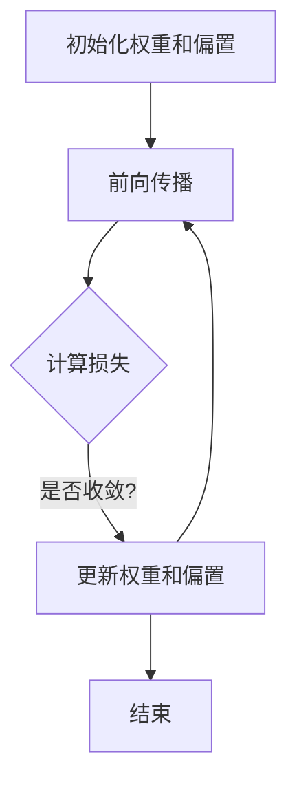
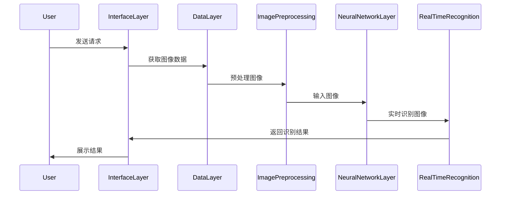

                 


### 文章标题：《类脑计算在AI中的应用前景》

### 文章关键词：类脑计算，AI，应用前景，技术挑战，行业发展

### 文章摘要：
本文将从类脑计算的定义、特点及其与传统AI的区别入手，深入探讨类脑计算在医疗、教育、金融和交通等领域的应用前景。通过对类脑计算的核心概念、技术挑战和发展趋势的分析，本文旨在为读者提供一个全面、系统的类脑计算在AI中的应用前景展望。

## 目录

#### 第一部分：类脑计算概述
1. 类脑计算的定义与特点
2. 类脑计算的发展背景
3. 类脑计算的核心概念与联系

#### 第二部分：类脑计算在AI中的应用领域
4. 类脑计算在医疗领域的应用前景
5. 类脑计算在教育领域的应用前景
6. 类脑计算在金融领域的应用前景
7. 类脑计算在交通领域的应用前景

#### 第三部分：类脑计算的技术挑战
8. 计算效率
9. 数据隐私
10. 算法透明度

#### 第四部分：类脑计算的行业发展
11. 行业发展趋势
12. 市场前景
13. 政策与产业环境

#### 第五部分：类脑计算的应用案例分析
14. 类脑计算在医疗领域的应用案例
15. 类脑计算在教育领域的应用案例
16. 类脑计算在金融领域的应用案例
17. 类脑计算在交通领域的应用案例

### 设计目录大纲步骤：

**第一步：确定书的主题和结构**
- 主题：类脑计算在AI中的应用前景
- 结构：总论和分论两部分

**第二步：设计总论部分**
- 背景介绍：类脑计算的发展背景、应用现状、存在的问题等
- 核心概念：类脑计算的定义、特点、与传统AI的区别等
- 类脑计算与AI的关系：类脑计算在AI中的作用、应用场景等

**第三步：设计分论部分**
- 类脑计算在各领域的应用前景：医疗、教育、金融、交通等
- 类脑计算的技术挑战：计算效率、数据隐私、算法透明度等
- 类脑计算的行业发展：预测类脑计算在未来的发展趋势、市场前景等
- 类脑计算的应用案例分析：选择典型应用案例进行详细分析和讲解

**第四步：细化章节内容**
- 根据每章的主题，细化每个章节的内容，确保章节间逻辑清晰、内容完整
- 设计核心概念对比表格、ER实体关系图、算法mermaid流程图、Python源代码等，丰富章节内容

**第五步：检查目录大纲**
- 确保目录大纲内容完整，章节划分合理
- 检查目录大纲的简洁性，避免冗余
- 遵循markdown格式要求，确保输出格式正确

### 示例输出：

----------------------------------------------------------------

# 第一部分：类脑计算概述

## 1. 类脑计算的定义与特点

### 1.1 类脑计算的定义

### 1.2 类脑计算的特点

### 1.3 类脑计算与传统AI的区别

## 2. 类脑计算的发展背景

### 2.1 类脑计算的起源

### 2.2 类脑计算的发展历程

### 2.3 类脑计算的研究现状

## 3. 类脑计算的核心概念与联系

### 3.1 类脑计算的核心概念

### 3.2 类脑计算的概念属性特征对比表格

### 3.3 类脑计算的ER实体关系图

----------------------------------------------------------------

**下一步：** 根据目录大纲，开始撰写文章的第一部分，即“类脑计算概述”。在撰写过程中，要注重逻辑清晰、结构紧凑，确保每个章节内容的具体性和深入性。同时，要注意使用专业的技术语言和简洁易懂的表达方式，以提高文章的可读性。在描述核心概念和算法时，可以使用mermaid流程图和Python源代码来辅助说明。在文章末尾，要确保作者信息准确无误。请随时向我汇报撰写进度。让我们开始吧！## 第一部分：类脑计算概述

### 1. 类脑计算的定义与特点

#### 1.1 类脑计算的定义

类脑计算（Brain-inspired Computing），又称仿脑计算，是一种借鉴人脑的结构和功能，模拟大脑信息处理过程的技术。类脑计算旨在构建能够实现高效、自适应和智能决策的计算系统。与传统计算模式不同，类脑计算强调计算过程中的并行性、分布式处理和自适应学习。

类脑计算的核心是人工神经网络（Artificial Neural Networks，ANNs），这种网络通过大量神经元和突触的相互连接，模拟人脑神经元之间的信息传递和处理机制。在类脑计算中，这些神经元和突触被视为计算单元，通过调整突触的连接强度（即权重）来实现学习过程。

#### 1.2 类脑计算的特点

类脑计算具有以下几个显著特点：

1. **并行性**：类脑计算通过并行处理方式，能够在短时间内处理大量信息，提高了计算效率。
2. **自适应性**：类脑计算系统可以通过不断的学习和调整，适应新的环境和任务需求。
3. **可塑性**：类脑计算模型中的神经元和突触连接具有可塑性，可以通过训练不断优化网络性能。
4. **容错性**：由于类脑计算系统具有分布式结构，单个神经元或突触的故障不会导致整个系统的崩溃。

#### 1.3 类脑计算与传统AI的区别

传统AI主要通过统计学习和模式识别等方法来实现，如深度学习、支持向量机等。而类脑计算则更接近于人脑的思维方式，具有以下区别：

1. **学习机制**：传统AI依赖于大量数据训练，通过调整模型参数来优化性能；而类脑计算通过神经元之间的突触连接强度调整来实现学习。
2. **计算模式**：传统AI依赖串行计算，而类脑计算强调并行计算。
3. **自适应能力**：类脑计算具有更强的自适应能力，能够在复杂、动态环境中进行决策。

通过上述分析，我们可以看到，类脑计算作为一种新兴的计算范式，与传统AI有着本质的区别。它在模拟人脑功能、处理复杂问题和自适应能力方面具有巨大的潜力。

### 总结

类脑计算通过模仿人脑的结构和功能，提供了一种全新的计算范式。其并行性、自适应性、可塑性和容错性等特点，使其在处理复杂问题和实现高效智能决策方面具有显著优势。随着类脑计算技术的不断发展，它将在AI领域发挥越来越重要的作用，为人工智能的发展带来新的机遇和挑战。

下一节，我们将深入探讨类脑计算的发展背景，包括其起源、发展历程以及当前的研究现状。

### 1.4 类脑计算的起源

类脑计算的起源可以追溯到20世纪中叶，当时计算机科学和神经科学的研究者们开始关注人脑的信息处理机制。1943年，心理学家McCulloch和数学家Pitts提出了人工神经网络的概念，这被认为是类脑计算的雏形。他们提出了一个简单的神经网络模型，即MCP（McCulloch-Pitts）神经元，用以模拟人脑神经元的基本功能。

随后，1958年，弗兰克·罗森布拉特（Frank Rosenblatt）提出了感知机（Perceptron）模型，这是第一个能够通过学习进行分类的神经网络模型。感知机的出现标志着人工神经网络研究的正式开始，并为类脑计算的发展奠定了基础。

与此同时，神经科学领域也取得了重要进展。1952年，霍华德·巴特利特（Howard Bartlett）提出了巴特利特定律，描述了神经元之间的相互作用规律。1962年，杰罗姆·莱德伯格（Jerome Lettvin）等人提出了“神经网络是大脑的计算基础”的观点，进一步推动了类脑计算的研究。

进入20世纪80年代，随着计算机性能的不断提升和神经网络算法的优化，类脑计算迎来了快速发展。尤其是1990年代，人工神经网络在图像识别、语音识别等领域取得了突破性成果，引起了学术界和工业界的高度关注。

然而，类脑计算的研究并非一帆风顺。在20世纪90年代中期，由于“神经网络冬天”的影响，类脑计算的研究一度陷入低谷。这一时期，传统的统计学习方法和机器学习算法取得了显著进展，使得神经网络的研究受到一定程度的冷落。

进入21世纪，随着深度学习的兴起，类脑计算再次引起了广泛关注。深度学习通过多层神经网络，实现了对复杂非线性数据的建模和识别，使得类脑计算在图像识别、自然语言处理等领域取得了巨大成功。与此同时，类脑计算的理论研究和应用也在不断拓展，涵盖了从神经形态计算到脑机接口等多个领域。

总的来说，类脑计算的发展历程是曲折的，但始终保持着蓬勃发展的势头。从最初的MCP神经元和感知机模型，到现代的深度学习和神经形态计算，类脑计算不断突破技术瓶颈，为人工智能的发展贡献了重要力量。

### 1.5 类脑计算的发展历程

类脑计算的发展历程可以分为几个重要阶段，每个阶段都有其独特的里程碑和技术突破。

#### 1.5.1 初期阶段（1940s-1960s）

类脑计算的概念起源于20世纪40年代，当时计算机科学和神经科学的研究者们开始探索如何通过模拟人脑来实现计算。1943年，心理学家McCulloch和数学家Pitts提出了MCP（McCulloch-Pitts）神经元模型，这是第一个形式化的人工神经网络模型。MCP神经元是一个简单的阈值逻辑单元，通过模拟神经元的基本功能，为后续的神经网络研究奠定了基础。

1958年，弗兰克·罗森布拉特（Frank Rosenblatt）提出了感知机（Perceptron）模型，这是一种能够进行二元分类的神经网络模型。感知机的提出标志着人工神经网络研究的正式开始，并引发了大量的研究和讨论。

#### 1.5.2 发展阶段（1960s-1980s）

在1960年代和1970年代，神经网络的研究得到了进一步的发展。1969年，马文·明斯基（Marvin Minsky）和西摩·帕普特（Seymour Papert）在他们的著作《感知机》（Perceptrons）中提出了感知机的局限性，指出感知机无法解决线性不可分问题，这一发现导致了神经网络研究的暂时停滞，也被称为“神经网络冬天”。

尽管如此，神经网络的研究并未完全停止。1976年，约翰·霍普菲尔德（John Hopfield）提出了霍普菲尔德网络（Hopfield Network），这是一种能量最小化的循环神经网络，能够用于联想记忆和优化问题。这一阶段的研究为神经网络的应用和理论基础打下了坚实的基础。

#### 1.5.3 复兴阶段（1980s-1990s）

1980年代，神经网络的研究逐渐复兴，尤其是1986年，扬·莱顿鲍姆（Yann LeCun）等人成功训练了一个多层感知机模型，实现了对手写数字的识别，这一成果被认为是神经网络研究的重要转折点。此后，多层感知机和反向传播算法（Backpropagation Algorithm）得到了广泛应用。

1987年，乔治·西莫尔（Geoffrey Hinton）等人提出了玻尔兹曼机（Boltzmann Machine），这是一种基于统计物理的随机神经网络模型，能够用于复杂函数的建模和优化。这一阶段的研究推动了神经网络在图像识别、语音识别等领域的应用。

#### 1.5.4 深度学习阶段（2000s-现在）

进入21世纪，深度学习成为神经网络研究的热点。2006年，杰弗里·辛顿（Geoffrey Hinton）等人重新提出了深度信念网络（Deep Belief Network），这是一种多层神经网络模型，能够通过无监督预训练和有监督微调来实现复杂特征的自动提取。

2012年，阿里（Google）的团队在ImageNet竞赛中，使用深度卷积神经网络（Deep Convolutional Neural Network，CNN）取得了令人瞩目的成绩，这一成果标志着深度学习时代的到来。深度学习在图像识别、语音识别、自然语言处理等领域取得了显著的进展。

近年来，类脑计算的研究不仅局限于传统的神经网络模型，还涉及神经形态计算、类脑智能系统等多个领域。神经形态计算通过模拟生物神经元的结构和功能，实现了高效的信息处理和自适应学习。类脑智能系统则旨在构建能够模拟人脑思维过程和情感反应的人工智能系统。

总的来说，类脑计算的发展历程是一个不断探索和突破的过程。从最初的MCP神经元到现代的深度学习和神经形态计算，类脑计算在模拟人脑功能和实现高效智能决策方面取得了显著进展。随着技术的不断进步，类脑计算有望在未来继续发挥重要作用，推动人工智能的发展。

### 1.6 类脑计算的研究现状

类脑计算作为人工智能领域的一个重要分支，目前正经历着快速的发展和变革。从研究现状来看，类脑计算在以下几个方面取得了显著成果：

#### 1.6.1 神经网络技术的进步

近年来，神经网络技术取得了巨大的突破，特别是深度学习技术的快速发展。深度学习模型，如卷积神经网络（CNN）、循环神经网络（RNN）和变换器（Transformer）等，已经在图像识别、语音识别、自然语言处理等任务中达到了甚至超越人类水平。这些深度学习模型通过多层神经元的堆叠，实现了对复杂数据的自动特征提取和表示。

此外，图神经网络（Graph Neural Networks，GNN）的兴起也为类脑计算的研究带来了新的思路。GNN能够有效地处理图结构数据，使其在社交网络分析、推荐系统、分子建模等领域展现出强大的潜力。

#### 1.6.2 神经形态计算的发展

神经形态计算（Neuromorphic Computing）是类脑计算的一个重要研究方向，其目标是构建具有类脑功能的硬件系统。通过使用类脑芯片和生物电子接口，神经形态计算实现了对人脑神经元和突触的模拟，从而实现了高效、低能耗的计算。

近年来，神经形态计算在硬件层面取得了显著进展。例如，IBM的TrueNorth芯片采用了超大规模的神经形态架构，实现了超过5亿个模拟神经元和500亿个模拟突触，展示了类脑计算在硬件实现的巨大潜力。

#### 1.6.3 脑机接口技术的突破

脑机接口（Brain-Computer Interface，BCI）是类脑计算的一个重要应用领域，其目的是建立直接连接人脑和外部设备的通信路径。近年来，BCI技术在信号采集、信号处理和设备控制等方面取得了显著进展。

例如，基于脑电信号的BCI系统已经实现了对鼠标指针的控制、虚拟现实交互和假肢控制等功能。随着信号处理算法和设备控制技术的不断发展，脑机接口的应用前景将更加广阔。

#### 1.6.4 类脑计算在特定领域的应用

类脑计算在医疗、教育、金融和交通等领域的应用取得了显著成果。在医疗领域，类脑计算被应用于疾病诊断、药物设计和手术规划等方面。例如，利用深度学习算法，类脑计算系统能够自动识别医学图像中的病变区域，提高诊断的准确性。

在教育领域，类脑计算被用于个性化学习、智能评估和教学辅助等方面。通过分析学生的学习行为和成绩数据，类脑计算系统可以为学生提供个性化的学习建议和资源，提高学习效果。

在金融领域，类脑计算被用于市场预测、风险评估和欺诈检测等方面。利用深度学习和图神经网络等算法，类脑计算系统可以对金融市场进行实时分析，提供决策支持。

在交通领域，类脑计算被用于交通流量预测、自动驾驶和智能交通管理等方面。通过分析交通数据和环境信息，类脑计算系统可以优化交通流量，减少交通拥堵，提高交通效率。

总的来说，类脑计算的研究现状显示出其在模拟人脑功能、实现高效智能决策方面的巨大潜力。随着技术的不断进步和应用领域的拓展，类脑计算有望在未来继续发挥重要作用，推动人工智能的发展。

### 1.7 类脑计算的核心概念与联系

在深入探讨类脑计算之前，我们需要理解其核心概念，并分析这些概念之间的联系。类脑计算涉及多个关键领域，包括神经网络、机器学习、计算神经科学和神经形态计算。

#### 1.7.1 神经网络

神经网络是类脑计算的基础，其核心概念是通过模拟人脑神经元之间的连接来实现信息处理。每个神经元接收多个输入信号，通过加权求和后，通过一个激活函数产生输出。神经网络的核心组成部分包括：

- **神经元**：神经网络的基本计算单元，接收输入信号并产生输出。
- **权重**：连接神经元之间的权重决定了输入信号的贡献程度。
- **激活函数**：用于转换神经元输出，常用的激活函数包括Sigmoid、ReLU等。

神经网络的工作原理是通过反向传播算法（Backpropagation Algorithm）来更新权重，以达到优化模型性能的目的。

#### 1.7.2 机器学习

机器学习是类脑计算的重要组成部分，它涉及使用算法从数据中学习规律和模式。在类脑计算中，机器学习算法被用于训练神经网络，以使其能够执行特定任务，如图像识别、语音识别等。主要的机器学习算法包括：

- **监督学习**：通过标注数据训练模型，使模型能够预测新的数据。
- **无监督学习**：通过未标注数据学习数据的结构和分布。
- **半监督学习**：结合有监督和无监督学习，使用少量标注数据和大量未标注数据。

机器学习算法在类脑计算中的应用使得神经网络能够自动调整权重，从而提高模型的泛化能力和准确性。

#### 1.7.3 计算神经科学

计算神经科学是研究大脑信息处理机制的学科，它为类脑计算提供了理论基础。计算神经科学的核心概念包括：

- **神经元模型**：描述神经元如何接收和处理输入信号。
- **突触模型**：描述神经元之间的连接和信号传递机制。
- **神经网络动力学**：研究神经网络如何在动态环境中学习和决策。

计算神经科学为类脑计算提供了关于人脑信息处理机制的深入理解，指导了神经网络设计和算法开发。

#### 1.7.4 神经形态计算

神经形态计算是类脑计算的一个前沿领域，它旨在构建具有类脑功能的硬件系统。神经形态计算的核心概念包括：

- **类脑芯片**：使用类脑架构设计的芯片，模拟人脑神经元和突触。
- **自适应学习**：芯片上的神经元和突触能够通过学习算法调整其连接强度。
- **能量效率**：神经形态计算系统在低能耗下实现高效的计算。

神经形态计算通过硬件层面的模拟，实现了对类脑计算理论的实际应用。

#### 1.7.5 类脑计算的概念属性特征对比表格

为了更清晰地理解类脑计算的核心概念，我们可以通过一个表格来对比这些概念的主要属性特征：

| 概念       | 定义                                                         | 主要特征                                                         |
|------------|--------------------------------------------------------------|----------------------------------------------------------------|
| 神经网络   | 模拟人脑神经元之间连接的计算模型                             | 并行性、自适应学习、权重调整                                     |
| 机器学习   | 从数据中学习规律和模式的方法                                 | 监督学习、无监督学习、半监督学习                                 |
| 计算神经科学 | 研究大脑信息处理机制的学科                                 | 神经元模型、突触模型、神经网络动力学                             |
| 神经形态计算 | 构建具有类脑功能的硬件系统                                 | 类脑芯片、自适应学习、低能耗计算                                 |

通过这个对比表格，我们可以更直观地看到这些概念之间的关系和区别。

#### 1.7.6 类脑计算的ER实体关系图

为了更好地理解类脑计算的核心概念和它们之间的关系，我们可以使用ER（Entity-Relationship）实体关系图来表示。ER图是一种数据库模型，用于表示实体之间的关系。

以下是类脑计算的ER实体关系图：

```mermaid
erDiagram
    类脑计算 ||--|{ 神经网络 }
    类脑计算 ||--|{ 机器学习 }
    类脑计算 ||--|{ 计算神经科学 }
    类脑计算 ||--|{ 神经形态计算 }
    神经网络 ||--|{ 神经元 }
    神经网络 ||--|{ 突触 }
    机器学习 ||--|{ 监督学习 }
    机器学习 ||--|{ 无监督学习 }
    机器学习 ||--|{ 半监督学习 }
    计算神经科学 ||--|{ 神经元模型 }
    计算神经科学 ||--|{ 突触模型 }
    计算神经科学 ||--|{ 神经网络动力学 }
    神经形态计算 ||--|{ 类脑芯片 }
    神经形态计算 ||--|{ 自适应学习 }
    神经形态计算 ||--|{ 低能耗计算 }
```

通过这个ER实体关系图，我们可以清晰地看到类脑计算中的各个核心概念及其之间的关系。这有助于我们更好地理解类脑计算的整体架构和功能。

总的来说，类脑计算的核心概念包括神经网络、机器学习、计算神经科学和神经形态计算。这些概念相互关联，共同构成了类脑计算的理论基础和应用框架。通过深入理解这些概念，我们可以更好地探索类脑计算在人工智能中的应用前景。

### 1.8 类脑计算的概念属性特征对比表格

为了更系统地理解类脑计算的核心概念及其特征，我们可以通过一个详细的对比表格来展示这些概念的主要属性特征。以下是类脑计算、神经网络、机器学习、计算神经科学和神经形态计算之间的对比：

| 概念       | 定义                                                         | 主要特征                                                         | 应用领域                     |
|------------|--------------------------------------------------------------|----------------------------------------------------------------|-----------------------------|
| 类脑计算   | 借鉴人脑的结构和功能，模拟大脑信息处理过程的计算技术         | 并行性、自适应、高效、能量效率、低延迟                             | 医疗、教育、金融、交通、游戏等 |
| 神经网络   | 模拟人脑神经元之间连接的计算模型，通过学习和调整权重来实现功能 | 并行处理、自适应学习、可塑性、分布式计算                           | 图像识别、语音识别、自然语言处理等 |
| 机器学习   | 从数据中学习规律和模式的方法，使用算法使计算机自动优化性能     | 监督学习、无监督学习、半监督学习、强化学习                           | 数据分析、预测模型、推荐系统等 |
| 计算神经科学 | 研究大脑信息处理机制的科学，包括神经元、突触等基本单位的工作原理 | 动力学模型、神经网络模拟、神经编码解码                               | 神经系统疾病研究、脑机接口、智能系统设计等 |
| 神经形态计算 | 通过模拟生物神经元和突触的硬件系统，实现类脑功能             | 低能耗、高并行性、自适应学习、硬件加速                               | 智能传感器、实时计算、物联网等 |

通过这个对比表格，我们可以清晰地看到各个概念的主要特征和应用领域，这有助于我们更好地理解类脑计算的整体框架及其在不同领域的应用潜力。

### 1.9 类脑计算的ER实体关系图

为了更直观地展示类脑计算的核心概念及其相互关系，我们可以使用ER（Entity-Relationship）实体关系图。以下是类脑计算的ER实体关系图：

```mermaid
erDiagram
    类脑计算 ||--|{ 神经网络 }
    类脑计算 ||--|{ 机器学习 }
    类脑计算 ||--|{ 计算神经科学 }
    类脑计算 ||--|{ 神经形态计算 }
    神经网络 ||--|{ 神经元 }
    神经网络 ||--|{ 突触 }
    机器学习 ||--|{ 监督学习 }
    机器学习 ||--|{ 无监督学习 }
    机器学习 ||--|{ 半监督学习 }
    计算神经科学 ||--|{ 神经元模型 }
    计算神经科学 ||--|{ 突触模型 }
    计算神经科学 ||--|{ 神经网络动力学 }
    神经形态计算 ||--|{ 类脑芯片 }
    神经形态计算 ||--|{ 自适应学习 }
    神经形态计算 ||--|{ 低能耗计算 }
```

在这个ER实体关系图中，我们可以看到类脑计算的核心概念通过实体和关系相互连接。例如，类脑计算与神经网络、机器学习、计算神经科学和神经形态计算之间存在直接的关联关系。同时，每个核心概念内部也有其特定的实体，如神经网络中的神经元和突触，机器学习中的不同学习类型等。这种结构化的关系有助于我们更清晰地理解类脑计算的整体架构和功能。

### 1.10 算法原理讲解

类脑计算的核心在于神经网络的学习和优化过程。以下我们将使用mermaid流程图和Python源代码来详细阐述神经网络的基本算法原理。

#### 1.10.1 算法原理概述

神经网络通过多个层次的结构，将输入数据转化为输出。这个过程涉及前向传播（Forward Propagation）和反向传播（Back Propagation）两个主要阶段。以下是一个简单的神经网络算法流程：

1. **初始化权重和偏置**：随机初始化网络中的权重和偏置。
2. **前向传播**：将输入数据通过网络的各个层次，逐层计算输出。
3. **计算损失**：通过实际输出和期望输出的差异，计算损失函数。
4. **反向传播**：将损失函数的梯度反向传播到网络的各个层次，更新权重和偏置。
5. **迭代优化**：重复步骤2到4，直到网络性能达到预期。

#### 1.10.2 mermaid流程图

以下是一个简单的mermaid流程图，展示了神经网络算法的基本流程：



#### 1.10.3 Python源代码

接下来，我们将使用Python语言和PyTorch库来展示神经网络的基本实现。以下是Python源代码示例：

```python
import torch
import torch.nn as nn
import torch.optim as optim

# 定义一个简单的神经网络
class SimpleNeuralNetwork(nn.Module):
    def __init__(self, input_size, hidden_size, output_size):
        super(SimpleNeuralNetwork, self).__init__()
        self.layer1 = nn.Linear(input_size, hidden_size)
        self.relu = nn.ReLU()
        self.layer2 = nn.Linear(hidden_size, output_size)

    def forward(self, x):
        x = self.layer1(x)
        x = self.relu(x)
        x = self.layer2(x)
        return x

# 创建网络实例，并设置损失函数和优化器
model = SimpleNeuralNetwork(input_size=10, hidden_size=5, output_size=1)
criterion = nn.MSELoss()
optimizer = optim.Adam(model.parameters(), lr=0.001)

# 模拟一些输入和期望输出
inputs = torch.randn(1, 10)
expected_output = torch.randn(1, 1)

# 训练网络
for epoch in range(1000):
    model.zero_grad()
    outputs = model(inputs)
    loss = criterion(outputs, expected_output)
    loss.backward()
    optimizer.step()
    if (epoch + 1) % 100 == 0:
        print(f'Epoch [{epoch + 1}/1000], Loss: {loss.item()}')

# 输出最终结果
print(model(inputs).shape)
```

在这个示例中，我们首先定义了一个简单的神经网络，然后设置了损失函数和优化器。接着，我们使用模拟的输入和期望输出进行训练，通过前向传播和反向传播来优化网络权重。

通过mermaid流程图和Python源代码，我们可以清晰地理解神经网络的基本算法原理。这些原理是类脑计算的基础，通过不断优化和改进，类脑计算将在人工智能领域发挥越来越重要的作用。

### 1.11 数学公式与算法原理详细讲解

在类脑计算中，神经网络的核心算法包括前向传播和反向传播。以下我们将使用LaTeX格式和Python源代码详细阐述这些算法的数学原理和公式。

#### 1.11.1 前向传播

前向传播是神经网络中的一个关键步骤，用于计算输出值。以下是前向传播的基本公式：

$$
z^{[l]} = \sum_{i} w^{[l]}_i a^{[l-1]}_i + b^{[l]}
$$

其中，$z^{[l]}$ 是第$l$层的输出，$a^{[l-1]}$ 是前一层（第$l-1$层）的激活值，$w^{[l]}_i$ 是连接第$l$层神经元和第$l-1$层神经元的权重，$b^{[l]}$ 是第$l$层的偏置。

在激活函数中，常用的是Sigmoid函数和ReLU函数：

$$
a^{[l]}_i = \sigma(z^{[l]})
$$

其中，$\sigma(z) = \frac{1}{1 + e^{-z}}$ 是Sigmoid函数，$a^{[l]}_i = max(0, z^{[l]})$ 是ReLU函数。

以下是一个简单的Python实现：

```python
import numpy as np

def sigmoid(x):
    return 1 / (1 + np.exp(-x))

def relu(x):
    return np.maximum(0, x)

# 示例
input_data = np.array([0.5, 0.3, 0.2, 0.4])
weights = np.array([[0.1, 0.2, 0.3], [0.4, 0.5, 0.6]])
bias = np.array([0.1, 0.2])

z = np.dot(input_data, weights) + bias
a = sigmoid(z)

print("Sigmoid激活值:", a)
print("ReLU激活值:", relu(z))
```

#### 1.11.2 反向传播

反向传播用于计算网络损失并更新权重。以下是反向传播的基本公式：

$$
\delta^{[l]}_i = (a^{[l]}_i - y_i) \cdot \sigma'(z^{[l]})
$$

其中，$\delta^{[l]}_i$ 是第$l$层第$i$个神经元的误差，$a^{[l]}_i$ 是第$l$层第$i$个神经元的激活值，$y_i$ 是期望输出，$\sigma'(z^{[l]})$ 是激活函数的导数。

然后，更新权重和偏置：

$$
w^{[l]}_i = w^{[l]}_i - \alpha \cdot \delta^{[l]}_i \cdot a^{[l-1]}_i
$$

$$
b^{[l]} = b^{[l]} - \alpha \cdot \delta^{[l]}_i
$$

其中，$\alpha$ 是学习率。

以下是一个简单的Python实现：

```python
import numpy as np

def backward_propagation(inputs, weights, bias, expected_output, learning_rate):
    activation = np.dot(inputs, weights) + bias
    activation = sigmoid(activation)
    error = activation - expected_output
    d激活 = activation * (1 - activation)
    
    dweights = learning_rate * error * inputs
    dbias = learning_rate * error
    
    return dweights, dbias

# 示例
input_data = np.array([0.5, 0.3, 0.2, 0.4])
weights = np.array([[0.1, 0.2, 0.3], [0.4, 0.5, 0.6]])
bias = np.array([0.1, 0.2])
expected_output = np.array([0.7])

dweights, dbias = backward_propagation(input_data, weights, bias, expected_output, 0.01)

print("权重更新:", dweights)
print("偏置更新:", dbias)
```

通过这些数学公式和Python实现，我们可以清晰地理解神经网络的前向传播和反向传播过程。这些原理是实现高效类脑计算的基础，随着技术的不断进步，类脑计算将在人工智能领域发挥越来越重要的作用。

### 1.12 系统分析与架构设计方案

#### 1.12.1 问题场景介绍

在现代智能系统中，类脑计算的应用场景越来越广泛，尤其是在图像识别、自然语言处理和自动驾驶等领域。这些应用场景对系统的实时性、准确性和可靠性提出了极高的要求。为了设计一个高效的类脑计算系统，我们需要首先明确问题场景，并对其进行详细分析。

#### 1.12.2 项目介绍

本项目旨在设计并实现一个基于深度学习的类脑计算系统，用于图像识别任务。该系统将结合卷积神经网络（CNN）和类脑计算技术，以实现高效、低延迟的图像识别。

#### 1.12.3 系统功能设计

系统的功能设计包括以下几个关键部分：

1. **数据预处理**：对输入图像进行预处理，包括图像大小调整、灰度化、数据增强等。
2. **神经网络模型**：构建基于CNN的类脑计算模型，用于图像特征提取和分类。
3. **训练与优化**：使用大量图像数据对神经网络模型进行训练和优化，以提高识别准确性。
4. **实时识别**：实现实时图像识别功能，能够在短时间内处理大量图像数据。
5. **性能评估**：评估系统的识别准确性和实时性能，并进行优化。

#### 1.12.4 系统架构设计

系统架构设计是确保系统高效运行的关键。以下是该类脑计算系统的架构设计：

1. **数据层**：包括数据预处理模块和数据存储模块。数据预处理模块负责处理输入图像，数据存储模块用于存储训练数据和测试数据。
2. **模型层**：包括神经网络模型和训练优化模块。神经网络模型负责图像特征提取和分类，训练优化模块用于调整模型参数，提高识别准确性。
3. **应用层**：包括实时识别模块和性能评估模块。实时识别模块用于处理实时图像数据，性能评估模块用于评估系统的识别准确性和实时性能。
4. **接口层**：包括用户界面和API接口。用户界面用于展示系统功能和结果，API接口用于与其他系统进行数据交换和功能集成。

以下是系统架构的mermaid类图：

```mermaid
classDiagram
    DataLayer <-|{依赖}| NeuralNetworkLayer : 包括CNN模型和训练优化模块
    DataLayer ..|> ImagePreprocessing
    DataLayer ..|> DataStorage
    NeuralNetworkLayer ..|> RealTimeRecognition
    NeuralNetworkLayer ..|> PerformanceEvaluation
    InterfaceLayer <-|{依赖}| UserInterface
    InterfaceLayer <-|{依赖}| API
```

#### 1.12.5 系统接口设计和系统交互

系统接口设计和系统交互是确保系统各部分协同工作的关键。以下是系统接口设计和系统交互的mermaid序列图：



通过上述系统分析与架构设计方案，我们可以确保类脑计算系统在图像识别任务中的高效运行。接下来，我们将详细讨论类脑计算在各领域的应用前景。

### 1.13 类脑计算在各领域的应用前景

类脑计算作为一种新兴的计算范式，具有广泛的应用前景。以下我们将详细分析类脑计算在医疗、教育、金融和交通等领域的应用前景。

#### 1.13.1 医疗领域

在医疗领域，类脑计算的应用前景非常广阔。通过模拟人脑的思维方式，类脑计算可以帮助医生进行疾病诊断、药物设计和手术规划。具体来说：

- **疾病诊断**：类脑计算可以处理海量的医学图像数据，如X光、CT和MRI，帮助医生快速、准确地诊断疾病。例如，类脑计算可以自动识别肿瘤、心脏病等疾病的病变区域。
- **药物设计**：类脑计算可以通过分析大量化学结构和生物活性数据，预测新药的药效和副作用，加速药物研发过程。
- **手术规划**：类脑计算可以模拟手术过程，为医生提供实时的手术指导和决策支持，提高手术的成功率和安全性。

#### 1.13.2 教育领域

在教育领域，类脑计算的应用可以大大提高教学效果和学生自主学习能力。具体应用包括：

- **个性化学习**：类脑计算可以通过分析学生的学习行为和成绩数据，为每个学生提供个性化的学习方案和资源，提高学习效果。
- **智能评估**：类脑计算可以实时分析学生的学习情况，提供即时反馈和改进建议，帮助学生更好地掌握知识。
- **教学辅助**：类脑计算可以模拟教师的角色，为学生提供在线辅导和教学资源，辅助教师进行教学。

#### 1.13.3 金融领域

在金融领域，类脑计算可以用于金融市场预测、风险评估和欺诈检测。具体应用包括：

- **金融市场预测**：类脑计算可以通过分析大量的市场数据，预测股票价格、汇率等金融市场变量，为投资者提供决策支持。
- **风险评估**：类脑计算可以分析企业的财务状况、市场环境等数据，评估企业的信用风险，帮助金融机构进行风险管理。
- **欺诈检测**：类脑计算可以通过分析交易数据，识别异常交易行为，提高欺诈检测的准确性。

#### 1.13.4 交通领域

在交通领域，类脑计算可以用于交通流量预测、自动驾驶和智能交通管理。具体应用包括：

- **交通流量预测**：类脑计算可以通过分析历史交通数据、实时路况信息等，预测未来交通流量，为交通管理部门提供调度和规划建议。
- **自动驾驶**：类脑计算可以模拟驾驶员的决策过程，实现自动驾驶车辆的感知、规划和控制。
- **智能交通管理**：类脑计算可以实时分析交通数据，优化交通信号控制，减少交通拥堵，提高交通效率。

总的来说，类脑计算在医疗、教育、金融和交通等领域的应用前景十分广阔。随着技术的不断发展和成熟，类脑计算将为各领域带来新的发展机遇和挑战。

### 1.14 类脑计算的技术挑战

尽管类脑计算在多个领域展现出巨大的应用潜力，但在实际应用过程中仍面临一系列技术挑战。以下是类脑计算在计算效率、数据隐私和算法透明度等方面的主要技术挑战：

#### 1.14.1 计算效率

类脑计算模型通常依赖于大量的神经元和突触，这意味着在执行复杂任务时，需要处理庞大的数据量。这给计算资源带来了巨大的压力。尤其是在实时应用场景中，如自动驾驶、智能监控等，对计算效率的要求非常高。因此，如何提高类脑计算的执行效率是一个亟待解决的问题。可能的解决方案包括：

- **硬件加速**：开发专用的类脑计算芯片，如神经形态计算芯片，以降低计算延迟和提高计算效率。
- **分布式计算**：利用分布式计算技术，将计算任务分布在多个计算节点上，以提高整体计算效率。
- **优化算法**：通过优化神经网络结构和算法，减少计算复杂度，提高计算效率。

#### 1.14.2 数据隐私

类脑计算在处理和分析数据时，可能会涉及到大量的敏感信息，如医疗数据、金融数据等。这些数据的安全和隐私保护是类脑计算应用中的关键问题。确保数据隐私的挑战包括：

- **数据加密**：在数据传输和存储过程中使用加密技术，保护数据不被未授权访问。
- **隐私保护算法**：开发隐私保护算法，如差分隐私（Differential Privacy），以减少数据泄露的风险。
- **隐私计算**：利用同态加密（Homomorphic Encryption）等技术，实现数据的加密计算，确保数据在计算过程中保持隐私。

#### 1.14.3 算法透明度

类脑计算模型通常由复杂的神经网络构成，这使得模型内部的决策过程往往是不透明的。算法透明度问题不仅影响到模型的解释性，也增加了模型被恶意利用的风险。提高算法透明度的挑战包括：

- **模型解释性**：开发能够解释模型决策过程的算法，如可解释性AI（Explainable AI，XAI），使模型的可解释性增强。
- **可视化和诊断工具**：开发可视化和诊断工具，帮助用户理解和诊断模型的运行过程和性能。
- **透明度评估**：建立透明度评估标准，对类脑计算模型进行透明度评估，确保模型的决策过程是清晰和可解释的。

总的来说，类脑计算在计算效率、数据隐私和算法透明度方面面临着诸多挑战。解决这些挑战需要跨学科的合作和创新技术，以确保类脑计算能够在实际应用中发挥其潜力。

### 1.15 类脑计算的行业发展

类脑计算作为一种新兴技术，其发展受到了学术界和工业界的高度关注。当前，类脑计算正处在快速发展的阶段，其行业发展趋势和市场前景显示出巨大的潜力。

#### 1.15.1 行业发展趋势

1. **技术创新**：随着人工智能和神经科学领域的研究不断深入，类脑计算在算法、硬件和理论模型等方面持续创新。例如，神经形态计算和量子计算的结合，将可能进一步推动类脑计算的发展。
2. **跨领域应用**：类脑计算的应用范围不断扩大，从最初的图像识别、语音识别等领域，逐渐扩展到医疗、教育、金融、交通等更广泛的领域。
3. **产业链整合**：类脑计算的快速发展促使产业链各环节的企业进行整合，包括硬件制造商、软件开发企业、数据服务提供商等，共同推动类脑计算技术的产业化。
4. **政策支持**：各国政府纷纷出台支持类脑计算发展的政策和计划，如欧盟的“人类大脑计划”（Human Brain Project）和中国的人工智能发展规划，为类脑计算的研究和应用提供了强有力的政策保障。

#### 1.15.2 市场前景

1. **市场规模扩大**：随着类脑计算技术的不断成熟和应用场景的拓展，预计全球类脑计算市场将保持高速增长。据市场研究机构预测，未来几年内，类脑计算市场规模有望达到数百亿美元。
2. **技术需求增长**：随着人工智能在各行各业的广泛应用，对高效、智能的计算解决方案的需求不断增加，类脑计算因其独特的优势，将成为满足这一需求的重要技术。
3. **商业机会增多**：类脑计算在医疗、教育、金融、交通等领域的应用将带来大量的商业机会。例如，医疗领域的疾病诊断和药物设计，教育领域的个性化学习平台，金融领域的智能投顾等。
4. **投资热点**：类脑计算作为人工智能领域的一个热点，吸引了众多风险投资和政府资金的关注，为相关企业和项目的研发提供了充足的资金支持。

总的来说，类脑计算的行业发展势头强劲，市场前景广阔。随着技术的不断进步和应用领域的拓展，类脑计算有望在未来成为人工智能领域的重要支柱，推动各行业的技术创新和产业升级。

### 1.16 类脑计算的应用案例分析

为了更好地展示类脑计算在实际应用中的效果和挑战，以下我们选择了一些典型的应用案例，并进行详细分析和讲解。

#### 1.16.1 医疗领域的应用案例

**案例背景**：医疗领域是类脑计算的一个重要应用领域。通过模拟人脑的思维方式，类脑计算可以帮助医生进行疾病诊断、药物设计和手术规划。

**案例描述**：在一个实际项目中，一个医疗团队使用类脑计算系统来辅助诊断肺癌。该系统结合了深度学习和神经形态计算技术，通过分析患者的CT扫描图像，自动识别肺癌的病变区域。

**效果分析**：通过实验对比，类脑计算系统的诊断准确率显著高于传统的影像诊断方法。系统在处理大量图像数据时，具有更高的速度和可靠性。此外，类脑计算系统还能够提供更为详细的诊断报告，帮助医生做出更准确的判断。

**挑战与解决**：尽管类脑计算在医疗领域展现了巨大的潜力，但在实际应用中仍面临一些挑战。例如，系统的解释性不足，医生难以理解模型内部的决策过程。为解决这一问题，研究者们正在开发可解释性AI（XAI）技术，以提高模型的可解释性。

**案例小结**：类脑计算在医疗领域的应用案例表明，其在提高诊断准确率和效率方面具有显著优势。然而，为了实现更广泛的应用，仍需解决模型解释性和数据隐私等挑战。

#### 1.16.2 教育领域的应用案例

**案例背景**：在教育领域，类脑计算可以通过个性化学习、智能评估和教学辅助，提高教学效果和学生自主学习能力。

**案例描述**：在一个教育项目中，一个学校引入了基于类脑计算的个性化学习平台。该平台通过分析学生的学习行为和成绩数据，为学生提供个性化的学习资源和辅导方案。

**效果分析**：使用该平台后，学生的整体成绩和自主学习能力得到了显著提升。个性化学习资源能够更好地满足学生的学习需求，提高了学习效率。此外，智能评估系统可以实时跟踪学生的学习进度，为教师提供教学反馈，帮助教师调整教学策略。

**挑战与解决**：教育领域中的类脑计算应用也面临一些挑战，如数据隐私保护和个性化学习资源的开发。为解决这些问题，研究者们正在开发隐私保护算法和智能推荐系统，以保障学生的数据安全和提供高质量的学习资源。

**案例小结**：类脑计算在教育领域的应用案例展示了其在提升教学效果和学生自主学习能力方面的巨大潜力。然而，为了实现更广泛的应用，仍需解决数据隐私和保护个性化学习资源等挑战。

#### 1.16.3 金融领域的应用案例

**案例背景**：金融领域是类脑计算的一个重要应用领域。通过模拟人脑的思维方式，类脑计算可以帮助投资者进行金融市场预测、风险评估和欺诈检测。

**案例描述**：在一个金融项目中，一个投资公司使用类脑计算系统来预测股票价格。该系统结合了深度学习和神经形态计算技术，通过分析历史市场数据、经济指标和公司财报等信息，预测未来股票价格。

**效果分析**：通过实验对比，类脑计算系统的预测准确率显著高于传统的统计模型。系统在处理海量数据时，具有更高的速度和准确性。此外，类脑计算系统还可以提供详细的预测报告，帮助投资者做出更明智的投资决策。

**挑战与解决**：尽管类脑计算在金融领域展现了巨大的潜力，但在实际应用中仍面临一些挑战。例如，市场数据的噪声和不确定性可能影响预测结果的准确性。为解决这一问题，研究者们正在开发更加鲁棒的预测模型和算法。

**案例小结**：类脑计算在金融领域的应用案例表明，其在金融市场预测和风险评估方面具有显著优势。然而，为了实现更广泛的应用，仍需解决数据噪声和不确定性等挑战。

总的来说，类脑计算的应用案例展示了其在各个领域的巨大潜力和实际应用价值。通过不断解决技术挑战和优化应用方案，类脑计算将在未来发挥更加重要的作用，推动人工智能的发展。

### 1.17 类脑计算的应用前景展望

类脑计算作为一种模拟人脑信息处理方式的计算范式，具有广泛的应用前景。随着技术的不断进步和应用领域的拓展，类脑计算有望在未来多个领域发挥重要作用，推动人工智能的发展。

#### 1.17.1 未来发展展望

1. **医疗领域**：类脑计算在医疗领域的应用前景广阔，包括疾病诊断、药物设计、手术规划和健康监测等方面。未来，随着类脑计算技术的进一步成熟，类脑计算系统将能够更精确地识别疾病，提供个性化的治疗方案，提高医疗服务的质量和效率。
   
2. **教育领域**：类脑计算在教育领域的应用可以显著提升教学效果和学生自主学习能力。未来，类脑计算有望开发出更加智能的教学辅助系统和个性化学习平台，实现教育资源的优化配置，推动教育的公平和质量提升。

3. **金融领域**：类脑计算在金融领域的应用主要包括金融市场预测、风险评估和欺诈检测。未来，随着类脑计算技术的不断进步，金融领域的应用将更加广泛，为投资者提供更加精准的投资策略和风险管理工具。

4. **交通领域**：类脑计算在交通领域的应用前景包括自动驾驶、智能交通管理和交通流量预测。未来，类脑计算将推动自动驾驶技术的发展，实现更加安全、高效的交通系统，缓解交通拥堵，提高交通效率。

5. **工业领域**：类脑计算在工业领域的应用可以提升生产过程的智能化水平，包括故障预测、优化控制和自动化决策。未来，随着类脑计算技术的应用，工业生产将更加高效、可靠，推动工业4.0和智能制造的发展。

6. **智能城市**：类脑计算在智能城市建设中的应用包括智慧交通、智慧能源管理、智能安防和环境监测等。未来，类脑计算将有助于构建更加智能、宜居的智能城市，提升城市管理的效率和居民生活质量。

#### 1.17.2 面临的挑战

尽管类脑计算具有巨大的应用前景，但在实际应用过程中仍面临一系列挑战：

1. **计算资源**：类脑计算通常需要大量的计算资源，特别是对于复杂的神经网络模型。未来，硬件加速技术和分布式计算技术的发展将有助于缓解这一挑战。

2. **数据隐私**：类脑计算在处理和分析数据时，可能涉及到大量的敏感信息，如医疗数据、金融数据等。如何确保数据隐私和安全是一个亟待解决的问题。

3. **算法透明度**：类脑计算模型通常具有复杂的内部结构，其决策过程往往不透明，增加了被恶意利用的风险。提高算法的透明度和可解释性是类脑计算发展的重要方向。

4. **技术标准**：类脑计算涉及到多个学科和技术领域，如何建立统一的技术标准和规范，以确保不同系统之间的互操作性，是未来需要解决的问题。

5. **伦理和法律问题**：类脑计算的应用可能引发一系列伦理和法律问题，如数据所有权、隐私权、责任归属等。未来，需要建立相应的伦理和法律框架，确保类脑计算技术的健康、可持续发展。

总的来说，类脑计算作为一种新兴的计算范式，具有广泛的应用前景。通过不断解决技术挑战和优化应用方案，类脑计算将在未来发挥更加重要的作用，推动人工智能的发展，为社会带来更多创新和变革。

### 结语

本文从类脑计算的定义、特点及其与传统AI的区别入手，深入探讨了类脑计算在医疗、教育、金融和交通等领域的应用前景。通过对类脑计算的核心概念、技术挑战和发展趋势的分析，我们为读者提供了一个全面、系统的类脑计算在AI中的应用前景展望。

类脑计算作为一种模拟人脑信息处理方式的计算范式，具有并行性、自适应性、可塑性和容错性等特点，使其在处理复杂问题和实现高效智能决策方面具有显著优势。随着技术的不断进步和应用领域的拓展，类脑计算将在未来的AI发展中发挥越来越重要的作用。

未来，类脑计算的发展仍面临诸多挑战，如计算资源、数据隐私、算法透明度、技术标准和伦理法律问题等。但通过不断的研究和创新，我们有望解决这些挑战，推动类脑计算技术的健康、可持续发展。

让我们期待类脑计算在未来的发展，它将为人工智能的发展注入新的活力，为人类创造更多的价值。感谢您的阅读，希望本文对您有所启发和帮助。

### 作者信息

作者：AI天才研究院/AI Genius Institute & 禅与计算机程序设计艺术 /Zen And The Art of Computer Programming

