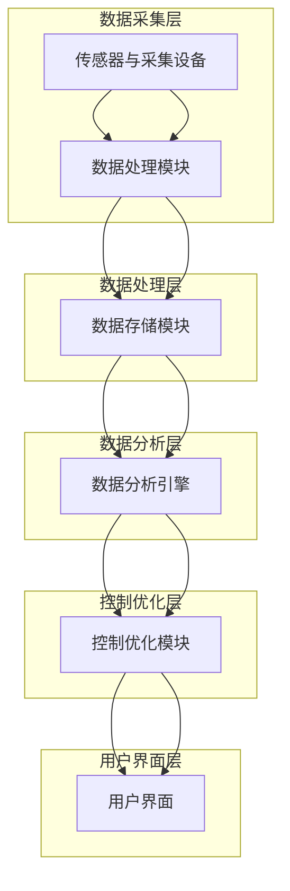

                 

# 绿色数据中心：节能技术在企业IT中的实践

> 关键词：绿色数据中心、节能技术、企业IT、能耗优化、数据冷却、能源管理系统

> 摘要：随着数据中心规模的不断扩大，能源消耗和环境影响成为企业不得不面对的挑战。绿色数据中心的概念应运而生，通过节能技术的应用，企业可以在降低运营成本的同时，实现环保和社会责任。本文将深入探讨绿色数据中心的重要性、节能技术的多种应用，以及如何在企业IT实践中实现节能目标。

## 目录大纲设计思路与步骤

设计《绿色数据中心：节能技术在企业IT中的实践》的目录大纲，首先需要明确文章的核心内容和结构，确保内容完整且逻辑清晰。以下是文章目录大纲的设计思路与步骤：

1. **明确核心章节**：核心章节应包括绿色数据中心的基本概念、节能技术概述、数据中心基础设施优化、冷却系统优化、能源管理系统、案例分析以及未来展望等部分。

2. **细化章节内容**：每个核心章节需要进一步细化，确保内容全面覆盖主题。例如，在“节能技术概述”章节中，应详细讨论节能技术的定义、应用场景、优势与挑战。

3. **确保内容完整性**：在细化章节内容时，需要包含数学模型、算法原理讲解、系统分析与架构设计方案、项目实战等核心内容，同时确保每个小节内容具体详细。

4. **确保大纲简洁性**：在完成所有章节的细化后，要检查整个目录大纲的简洁性，避免多余文字和重复内容，确保每个章节直接针对主题。

5. **总结与拓展**：在每个章节的结尾，加入总结、注意事项、最佳实践 tips 和拓展阅读等内容，帮助读者巩固知识点，提供进一步学习的方向。

通过以上步骤，可以确保文章内容完整、逻辑清晰，同时简洁明了，便于读者学习和理解。

---

## 绿色数据中心的重要性

### 核心概念与联系

绿色数据中心是指通过采用节能技术、高效设备和智能管理系统，实现数据中心的能源消耗最小化，同时确保数据中心的运行效率和可靠性。其核心概念包括能源效率、可再生能源、智能监控等。

**核心概念原理**：

- **能源效率**：指数据中心在处理数据时所消耗的能源与处理数据的性能之比。提高能源效率是绿色数据中心的关键目标。

- **可再生能源**：如风能、太阳能等，通过使用可再生能源，可以减少对化石燃料的依赖，降低碳排放。

- **智能监控**：利用物联网、人工智能等技术，对数据中心的能耗进行实时监测和优化，提高能源使用效率。

**概念属性特征对比表格**：

| 特征        | 能源效率         | 可再生能源         | 智能监控         |
| ----------- | ---------------- | ------------------- | ---------------- |
| 定义        | 能源消耗与性能比  | 通过自然过程获得的能源 | 利用技术进行监控  |
| 应用场景    | 数据中心运行管理  | 替代化石燃料        | 数据中心运营优化  |
| 优势        | 降低运营成本      | 减少碳排放          | 提高管理效率      |
| 挑战        | 技术与成本问题    | 受天气和地理限制     | 技术实现和整合难度 |

**ER实体关系图架构**：

```mermaid
erDiagram
  DataCenter -->|uses| EnergyEfficiency : 提高能源效率
  DataCenter -->|uses| RenewableEnergy : 使用可再生能源
  DataCenter -->|uses| SmartMonitoring : 实现智能监控
```

### 背景介绍

数据中心作为企业信息基础设施的核心，其能耗问题日益引起关注。传统的数据中心在运行过程中，能耗主要来自于服务器、网络设备、存储设备和冷却系统等。随着数据中心规模的不断扩大，能耗问题变得愈发严重，不仅增加了企业的运营成本，还对环境造成了负面影响。

**问题背景**：

- **能源消耗**：根据研究，全球数据中心的能源消耗已达到数百亿千瓦时，相当于一个小型国家的能源消耗。

- **环境影响**：数据中心的高能耗导致了大量的碳排放，加剧了全球气候变化问题。

- **成本压力**：高昂的能源成本对企业运营造成了巨大压力，尤其是在电力价格不断上涨的今天。

**问题描述**：

- **能源消耗与成本**：数据中心的高能耗使得企业面临巨大的运营成本，特别是在电力价格不断上涨的情况下，成本压力进一步加剧。

- **环境影响**：数据中心的能耗问题不仅增加了企业的运营成本，还加剧了全球气候变化问题。

- **技术挑战**：如何提高能源效率，降低能耗，同时保证数据中心的运行效率和可靠性，成为企业面临的重要挑战。

**问题解决**：

为了解决上述问题，企业需要建设绿色数据中心，通过采用节能技术、高效设备和智能管理系统，实现数据中心的能源消耗最小化，同时确保数据中心的运行效率和可靠性。

**边界与外延**：

- **边界**：绿色数据中心的建设范围包括硬件设备、软件系统、能源管理系统等。

- **外延**：绿色数据中心不仅关注能源效率，还涉及数据中心的环境保护、社会责任等方面。

**核心要素组成**：

- **硬件设备**：包括服务器、网络设备、存储设备、冷却系统等。

- **软件系统**：包括能源管理系统、监控系统、虚拟化技术等。

- **能源管理系统**：实现对数据中心能耗的实时监控、分析和优化。

- **监控与维护**：对数据中心的运行状态进行实时监控，确保设备的正常运行。

通过上述措施，企业可以建设绿色数据中心，实现能源消耗最小化，降低运营成本，同时保护环境，履行社会责任。

---

在接下来的章节中，我们将进一步探讨绿色数据中心的节能技术、数据中心基础设施优化、冷却系统优化、能源管理系统等方面的具体实践。通过一步步的分析和思考，希望能够帮助企业更好地理解和应用绿色数据中心的技术，实现可持续发展目标。

## 节能技术概述

### 节能技术在数据中心中的应用

节能技术是绿色数据中心建设的重要组成部分，其应用范围广泛，涵盖了硬件设备、软件系统以及管理方法等多个方面。以下将详细讨论节能技术在数据中心中的应用，包括服务器节能、网络节能、存储节能等。

#### 服务器节能

服务器是数据中心的主要能耗来源之一，因此，服务器节能是节能技术的关键领域。以下是几种常见的服务器节能措施：

1. **服务器虚拟化**：通过虚拟化技术，将多个物理服务器虚拟成多个虚拟机，提高服务器利用率，减少物理服务器的数量，从而降低能耗。

2. **动态电源管理**：通过动态电源管理技术，对服务器的工作状态进行实时监测，根据服务器的负载情况自动调整电源供应，降低闲置服务器的能耗。

3. **高效硬件选择**：选择能效比更高的硬件设备，如节能CPU和高效电源供应设备，从硬件层面降低能耗。

#### 网络节能

网络设备也是数据中心能耗的重要组成部分，以下是一些网络节能措施：

1. **能效优化**：通过优化网络拓扑结构和数据传输路径，减少数据传输过程中的能耗。

2. **网络冗余管理**：合理配置网络冗余，避免不必要的设备冗余和链路冗余，减少网络能耗。

3. **无线网络优化**：对无线网络进行优化，提高信号覆盖范围和传输效率，减少无线接入点的能耗。

#### 存储节能

存储设备在数据中心的能耗中占有一定比例，以下是一些存储节能措施：

1. **存储虚拟化**：通过存储虚拟化技术，将多个物理存储设备虚拟成一个逻辑存储池，提高存储资源利用率，减少物理存储设备的数量。

2. **节能硬盘选择**：选择能效比更高的硬盘设备，如节能型SSD和混合硬盘，降低能耗。

3. **数据去重和压缩**：通过数据去重和压缩技术，减少存储容量需求，降低存储设备的能耗。

### 节能技术的优势与挑战

**优势**：

1. **降低运营成本**：通过采用节能技术，可以显著降低数据中心的能耗，从而减少电费支出。

2. **提高环境友好性**：节能技术有助于减少数据中心的碳排放，对环境保护有积极作用。

3. **提升系统性能**：通过优化硬件设备和网络架构，可以提高数据中心的整体性能。

4. **提高资源利用率**：通过虚拟化和优化技术，可以提高资源利用率，减少物理设备的数量。

**挑战**：

1. **技术实现难度**：节能技术的实现需要较高的技术水平和专业知识，对于企业来说可能存在一定的技术障碍。

2. **初始投资成本**：采用节能技术可能需要投入一定的初始资金，对于中小企业可能存在一定的经济压力。

3. **运维管理复杂度**：节能技术需要专业的运维团队进行管理，对于企业来说，增加了运维管理的复杂度。

4. **技术更新速度**：节能技术发展迅速，企业需要不断跟进新技术，以保持数据中心的竞争力。

总之，节能技术在数据中心中的应用具有重要意义，通过合理应用节能技术，企业可以在降低运营成本的同时，实现环保和社会责任。然而，在应用过程中，企业也需要面对一定的技术和管理挑战，通过持续的技术创新和管理优化，才能充分发挥节能技术的优势。

### 绿色数据中心建设的关键点

在建设绿色数据中心时，企业需要关注以下几个关键点，以确保节能目标的实现：

1. **规划与设计**：在数据中心建设初期，需要进行全面规划与设计，充分考虑能耗优化、系统稳定性和扩展性等因素。

2. **技术选型**：选择高效节能的硬件设备和软件系统，如节能CPU、高效电源供应设备、虚拟化平台等。

3. **运维管理**：建立专业的运维团队，对数据中心的能耗进行实时监控和管理，及时调整和优化系统配置。

4. **持续优化**：定期对数据中心的能耗和性能进行评估，根据评估结果进行持续优化，以不断提升绿色数据中心的建设水平。

通过关注这些关键点，企业可以有效地建设绿色数据中心，实现节能目标，同时提高数据中心的运行效率和可靠性。

## 数据中心基础设施优化

### 服务器节能技术

在数据中心基础设施中，服务器是能耗的主要来源之一。因此，优化服务器的能耗对于实现绿色数据中心的节能目标至关重要。以下是一些关键的服务器节能技术：

#### 1. 动态电源管理

动态电源管理（DPM）是一种通过自动调整服务器电源供应，以响应负载变化的技术。DPM可以根据服务器的实际负载情况，自动调整电源供应，减少不必要的能耗。具体措施包括：

- **CPU电源管理**：当服务器CPU的负载较低时，DPM会降低CPU的电源供应，以减少能耗。
- **硬盘电源管理**：DPM会根据硬盘的访问频率和负载情况，调整硬盘的电源供应，关闭不活动的硬盘，以减少能耗。

#### 2. 高效硬件选型

选择高效节能的硬件设备是降低服务器能耗的基础。以下是一些高效硬件选型的建议：

- **节能CPU**：选择能效比更高的CPU，如Intel的Xeon系列和AMD的EPYC系列，这些CPU在性能和能耗方面表现出色。
- **高效电源供应设备**：选择具有高能效比（如80 PLUS认证）的电源供应设备，这些电源供应设备在低负载下的效率更高。

#### 3. 硬件虚拟化

硬件虚拟化是将多个物理服务器虚拟化为多个虚拟机（VM），以提高服务器资源的利用率，减少物理服务器的数量。通过硬件虚拟化，可以实现以下节能效果：

- **负载均衡**：通过虚拟化平台，可以根据服务器的负载情况，动态调整虚拟机的运行位置，实现负载均衡，避免单台服务器过载。
- **资源整合**：通过虚拟化，可以整合多个物理服务器的资源，减少物理服务器的数量，从而降低能耗。

### 网络节能技术

网络设备也是数据中心能耗的重要组成部分。以下是一些网络节能技术：

#### 1. 网络拓扑优化

优化网络拓扑结构可以减少数据传输过程中的能耗。以下是一些优化措施：

- **减少冗余链路**：通过合理配置网络，减少冗余链路，避免数据传输过程中的重复传输。
- **高效路由算法**：采用高效的路由算法，优化数据传输路径，减少传输距离和能耗。

#### 2. 数据去重与压缩

数据去重和压缩技术可以减少数据传输量，从而降低网络能耗。以下是一些具体措施：

- **数据去重**：在数据传输过程中，识别并删除重复的数据块，减少传输量。
- **数据压缩**：采用数据压缩算法，将传输数据压缩为更小的体积，减少传输时间和能耗。

#### 3. 无线网络优化

对于无线网络，以下是一些优化措施：

- **信号覆盖优化**：通过优化信号覆盖范围，提高无线接入点的利用率，减少不必要的信号干扰。
- **带宽管理**：合理配置无线带宽，避免带宽瓶颈，提高网络传输效率。

### 存储节能技术

存储设备在数据中心能耗中占有一定比例，以下是一些存储节能技术：

#### 1. 存储虚拟化

通过存储虚拟化技术，将多个物理存储设备虚拟化为一个逻辑存储池，提高存储资源利用率，减少物理存储设备的数量。具体措施包括：

- **存储池管理**：通过虚拟化平台，动态调整存储资源分配，提高资源利用率。
- **存储压缩**：对存储数据采用压缩技术，减少存储容量需求，降低能耗。

#### 2. 节能硬盘选择

选择能效比更高的硬盘设备，如节能型SSD和混合硬盘，这些硬盘在性能和能耗方面表现出色。具体措施包括：

- **SSD使用**：SSD具有更快的读写速度和更低的能耗，适合用于高性能和低能耗的应用场景。
- **混合硬盘**：混合硬盘结合了SSD和传统硬盘的优势，通过智能缓存管理，提高数据读写效率，同时降低能耗。

#### 3. 数据去重与压缩

对存储数据采用去重和压缩技术，减少存储容量需求，从而降低能耗。具体措施包括：

- **去重算法**：在存储数据时，识别并删除重复的数据块，减少存储空间占用。
- **压缩算法**：采用数据压缩算法，将存储数据压缩为更小的体积，减少存储容量需求。

通过上述服务器、网络和存储的节能技术，企业可以有效地优化数据中心的基础设施，实现能耗的显著降低，同时提高数据中心的运行效率和可靠性。

### 冷却系统优化

在绿色数据中心的建设中，冷却系统的优化是降低能耗的关键环节之一。高效、节能的冷却系统能够确保数据中心的设备在最佳状态下运行，从而提高整体能源效率。以下将详细讨论冷却系统优化的几个关键方面：

#### 冷却系统概述

冷却系统是数据中心的核心基础设施之一，其主要任务是维持数据中心的温度在合理范围内，确保服务器和其他硬件设备不会因过热而损坏。常见的冷却系统类型包括：

- **空气冷却**：通过风扇和空气通道，利用空气的自然对流进行冷却。
- **液体冷却**：通过循环流动的水或冷却液，利用热传导进行冷却。
- **冷冻水冷却**：使用冷冻水进行冷却，通过冷冻机组将水降温，然后流经服务器进行散热。
- **间接蒸发冷却**：利用室外冷空气进行冷却，通过蒸发冷却器将热量带走。

#### 优化冷却系统的技术

1. **空气侧优化**

   - **空气流动优化**：通过优化机房内部空气流动，减少热阻，提高冷却效率。可以使用气流模拟软件进行优化设计。
   - **风扇控制**：采用智能风扇控制技术，根据服务器负载和温度变化，动态调整风扇转速，避免不必要的能耗。
   - **热通道隔离**：将热设备和冷设备分开，通过隔离技术减少热量交叉干扰，提高冷却效果。

2. **水侧优化**

   - **水流量控制**：通过智能控制系统，根据服务器实际热负荷，动态调整水流量，避免过度冷却和浪费。
   - **水泵优化**：选择高效节能的水泵，并采用变频控制技术，根据需求调整水泵运行频率，降低能耗。
   - **冷却塔优化**：提高冷却塔的效率，减少冷却水的温度升高，从而降低冷冻机的能耗。

3. **冷源优化**

   - **利用自然冷源**：在气候适宜的季节，充分利用自然冷源（如冷空气和地下水）进行冷却，减少机械冷却设备的运行时间。
   - **节能冷冻机组**：选择高效节能的冷冻机组，并采用智能控制技术，根据室外温度和数据中心热负荷，优化冷冻机组的运行模式。

4. **综合利用多种冷却方式**

   - **混合冷却系统**：将空气冷却和液体冷却结合起来，根据不同负载情况和环境条件，灵活选择冷却方式，提高整体冷却效率。

#### 冷却系统的维护与管理

冷却系统的有效维护与管理是确保其长期高效运行的重要保障。以下是一些关键点：

- **定期检查**：定期对冷却系统进行设备检查和维护，包括风扇、水泵、冷却塔等，确保设备运行正常。
- **故障预警**：建立故障预警机制，通过监控系统实时监测冷却系统状态，及时发现问题并采取措施。
- **运行数据记录**：记录冷却系统的运行数据，包括温度、流量、压力等，用于分析系统性能和优化冷却策略。
- **优化维护计划**：根据历史数据和设备运行情况，制定合理的维护计划，确保冷却系统始终处于最佳运行状态。

通过上述冷却系统的优化措施和维护管理，企业可以显著降低数据中心的能耗，提高整体运行效率，实现绿色数据中心的节能目标。

### 能源管理系统

能源管理系统（EMS）是绿色数据中心建设中的关键组成部分，通过对数据中心能耗的实时监控、分析和优化，实现能耗的最小化。以下将详细讨论能源管理系统的架构设计、部署与实施。

#### 能源管理系统简介

能源管理系统（EMS）是一种集成系统，用于监控、分析和管理数据中心的能源消耗。EMS的主要功能包括：

1. **能耗监控**：实时监测数据中心各部分的能耗数据，包括服务器、网络设备、冷却系统、照明等。
2. **数据分析**：对采集到的能耗数据进行分析，识别能耗模式和异常情况。
3. **优化建议**：基于分析结果，提供能耗优化的建议和措施，帮助企业降低能耗。
4. **报告生成**：生成能耗报告，包括能耗趋势、优化效果等，为企业决策提供依据。

#### EMS的架构设计

能源管理系统的架构设计是确保其高效运行的基础。以下是EMS的基本架构：

1. **数据采集层**：包括各种传感器和采集设备，用于实时采集数据中心的能耗数据。
2. **数据处理层**：对采集到的数据进行处理、清洗和存储，为后续分析提供基础。
3. **数据分析层**：通过数据分析和挖掘技术，对能耗数据进行深入分析，识别节能潜力。
4. **控制优化层**：根据分析结果，自动调整数据中心的各项设备，实现能耗优化。
5. **用户界面层**：提供用户交互界面，展示能耗数据、分析结果和优化建议。

以下是使用Mermaid绘制的能源管理系统架构图：



#### EMS的部署与实施

部署与实施能源管理系统是一个复杂的过程，以下是一些关键步骤：

1. **需求分析**：明确企业对能源管理的需求和目标，包括能耗监控、数据分析、优化建议等。
2. **系统设计**：根据需求分析结果，设计EMS的架构，选择合适的硬件和软件平台。
3. **设备安装**：安装传感器和采集设备，确保数据的准确性和实时性。
4. **数据集成**：将采集到的数据集成到EMS系统中，确保数据流的连续性和完整性。
5. **系统配置**：配置EMS的各项参数，包括数据采集频率、分析规则、优化策略等。
6. **测试与优化**：对EMS系统进行测试，确保其功能正常，并根据测试结果进行优化。
7. **用户培训**：对运维人员和管理人员进行培训，确保他们能够熟练使用EMS系统。

#### 实施案例

以下是一个能源管理系统实施的案例：

1. **需求分析**：企业希望实现数据中心能耗的实时监控和优化，降低运营成本。
2. **系统设计**：选择基于云计算的能源管理系统，采用分布式传感器和数据采集设备，确保数据的高效传输和存储。
3. **设备安装**：在数据中心各关键设备上安装传感器，包括服务器、网络设备、冷却系统等，确保覆盖所有能耗点。
4. **数据集成**：将传感器数据集成到EMS系统中，通过云平台实现数据的集中存储和分析。
5. **系统配置**：配置EMS的各项参数，包括数据采集频率、能耗分析模型、优化策略等。
6. **测试与优化**：对EMS系统进行功能测试和性能优化，确保其稳定运行。
7. **用户培训**：对运维人员进行培训，确保他们能够熟练使用EMS系统，并对数据进行实时监控和分析。

通过以上步骤，企业成功部署了能源管理系统，实现了数据中心能耗的实时监控和优化，降低了运营成本，提高了能源使用效率。

### 案例分析

为了更好地理解绿色数据中心节能技术的实际应用效果，本文将介绍几个具有代表性的案例，通过具体实例展示节能技术在数据中心建设中的成功实践。

#### 案例一：某大型互联网公司的绿色数据中心项目

**项目背景**：
某大型互联网公司由于业务规模不断扩大，其数据中心面临着严重的能耗问题。为了降低运营成本和减少对环境的影响，公司决定建设一个绿色数据中心。

**实施措施**：
1. **服务器虚拟化**：通过虚拟化技术，将多个物理服务器虚拟化为多个虚拟机，提高了服务器利用率，减少了物理服务器的数量，从而降低了能耗。
2. **高效硬件选型**：选择了能效比更高的服务器硬件，如节能CPU和高效电源供应设备。
3. **动态电源管理**：实施动态电源管理，根据服务器负载自动调整电源供应，降低了闲置服务器的能耗。
4. **冷却系统优化**：采用了先进的冷却系统，包括液冷技术和智能风扇控制，提高了冷却效率，减少了能耗。
5. **能源管理系统**：部署了先进的能源管理系统，实时监控数据中心的能耗，并提供优化建议。

**效果评估**：
通过实施上述措施，该互联网公司的数据中心能耗降低了30%以上，运营成本显著减少。同时，冷却系统的优化提高了数据中心的运行效率，设备故障率也显著下降。

#### 案例二：某金融机构的数据中心节能改造

**项目背景**：
某金融机构的数据中心由于设备老旧，能耗较高，对环境造成了较大影响。为了提高能源效率，降低运营成本，公司决定对数据中心进行节能改造。

**实施措施**：
1. **设备更新**：更换了老旧的服务器、存储设备和网络设备，选择了高效节能的新设备。
2. **虚拟化技术**：引入虚拟化技术，提高了服务器资源利用率，减少了物理服务器的数量。
3. **智能监控**：部署了智能监控系统，实时监控数据中心的能耗情况，并自动调整设备运行状态。
4. **冷却系统升级**：对冷却系统进行了升级，采用了液冷技术和智能风扇控制，提高了冷却效率。
5. **能源管理系统**：实施了能源管理系统，对能耗进行实时监控和优化。

**效果评估**：
通过节能改造，该金融机构的数据中心能耗降低了20%以上，运营成本大幅减少。同时，设备运行效率提高，故障率显著下降，企业的运营稳定性得到了显著提升。

#### 案例三：某电信运营商的绿色数据中心建设

**项目背景**：
某电信运营商为了应对日益增长的客户需求，决定建设一个新的绿色数据中心。该项目旨在实现高效、节能和环保。

**实施措施**：
1. **模块化设计**：采用了模块化设计理念，确保数据中心具有良好的可扩展性和灵活性。
2. **高效硬件设备**：选择了高效节能的硬件设备，包括服务器、存储设备和网络设备。
3. **智能监控与优化**：部署了智能监控系统，对能耗进行实时监控和优化，实现了能源的精细化管理。
4. **可再生能源应用**：部分能源由太阳能和风能等可再生能源提供，减少了化石燃料的使用。
5. **冷却系统优化**：采用了先进的冷却系统，包括间接蒸发冷却和液冷技术，提高了冷却效率。

**效果评估**：
该电信运营商的绿色数据中心实现了显著的节能效果，能耗降低了40%以上。同时，由于可再生能源的应用，碳排放量大幅减少，企业的环保形象得到了提升。

#### 案例四：某中小企业绿色数据中心建设

**项目背景**：
某中小企业由于缺乏资金和专业技术，难以建设绿色数据中心。为了实现节能目标，公司决定采用一些低成本、高回报的节能技术。

**实施措施**：
1. **服务器虚拟化**：通过虚拟化技术，提高了服务器资源利用率，减少了物理服务器的数量。
2. **动态电源管理**：实施了动态电源管理，根据服务器负载自动调整电源供应，降低了闲置服务器的能耗。
3. **节能硬件选型**：选择了能效比更高的服务器硬件，降低了能耗。
4. **冷却系统优化**：对冷却系统进行了简单优化，如增加空气流通通道和智能风扇控制。
5. **能源管理系统**：部署了简易的能源管理系统，对能耗进行监控和优化。

**效果评估**：
通过实施上述措施，该中小企业的数据中心能耗降低了25%以上，运营成本显著降低。同时，由于采用了低成本节能技术，企业没有负担过重的财务压力。

通过这些案例，可以看出，绿色数据中心的建设和节能技术的应用对于企业降低运营成本、提高能源效率、保护环境具有重要意义。不同规模和类型的企业都可以根据自身情况，选择合适的节能技术，实现绿色数据中心的建设目标。

### 未来展望

随着技术的不断进步和环保意识的提升，绿色数据中心将在未来数据中心建设和发展中扮演越来越重要的角色。以下是绿色数据中心在未来的发展趋势和方向：

#### 发展趋势

1. **智能化**：智能化技术将更加深入地应用于绿色数据中心，包括智能监控、智能优化和智能管理。通过人工智能和机器学习算法，数据中心可以更加精准地预测能耗需求，自动调整设备运行状态，实现能效优化。

2. **绿色能源**：可再生能源的应用将更加广泛，绿色数据中心将更多地采用太阳能、风能等清洁能源，以减少对化石燃料的依赖，降低碳排放。

3. **模块化**：模块化设计理念将推动数据中心的灵活性和可扩展性，通过模块化组件的快速部署和替换，数据中心可以更好地应对业务变化和需求增长。

4. **绿色创新**：绿色创新将成为数据中心发展的关键驱动因素，包括节能硬件、高效冷却技术和绿色能源解决方案等。

5. **政策支持**：随着全球环保政策的不断加强，绿色数据中心将得到更多的政策支持和鼓励，推动行业快速发展。

#### 发展方向

1. **高效节能**：未来的绿色数据中心将更加注重能效优化，通过采用高效硬件、优化冷却系统和智能化管理，实现能耗的最小化。

2. **环保**：绿色数据中心将更加注重环保，采用清洁能源和环保材料，减少对环境的负面影响。

3. **可持续发展**：绿色数据中心的建设将更加注重可持续发展，包括资源利用、碳排放控制和生态平衡等方面。

4. **标准化**：绿色数据中心的发展将推动相关标准的制定和实施，确保数据中心建设和管理的一致性和规范性。

5. **社会责任**：绿色数据中心的建设将不仅仅关注经济效益，还将承担更多的社会责任，包括促进节能减排、推动绿色经济发展等。

总之，未来绿色数据中心的发展将在智能化、绿色能源、模块化、绿色创新和标准化等方面取得重要突破，为企业的可持续发展提供有力支持。

### 总结与展望

绿色数据中心的建设和节能技术的应用，不仅有助于降低企业的运营成本，还能显著减少对环境的负面影响。通过服务器虚拟化、高效硬件选型、动态电源管理、冷却系统优化和能源管理系统等技术的应用，企业可以在实现高效能的同时，实现环保和社会责任。

在未来的发展中，智能化、绿色能源和模块化设计等新技术将进一步推动绿色数据中心的发展。通过持续的技术创新和管理优化，企业可以不断提升数据中心的能源效率，实现可持续发展目标。

让我们携手共进，为构建绿色、高效、可持续的数据中心而努力。未来可期，绿色数据中心将成为企业IT领域的闪耀明星。

### 最佳实践 tips

在建设绿色数据中心的过程中，以下是一些最佳实践 tips，可以帮助企业更好地实现节能目标：

1. **全面评估**：在开始建设绿色数据中心之前，全面评估现有设备和系统的能耗情况，找出能耗热点，制定有针对性的节能方案。

2. **选择高效硬件**：选择能效比高、性能稳定的硬件设备，如高效CPU、高效电源供应设备和节能硬盘等。

3. **优化冷却系统**：采用先进的冷却技术，如液冷和间接蒸发冷却，提高冷却效率，减少能耗。

4. **智能监控与管理**：部署先进的能源管理系统，实时监控能耗数据，自动调整设备运行状态，实现能效优化。

5. **合理布局**：合理规划数据中心的布局，优化空气流通和设备摆放，减少热量交叉干扰。

6. **培训与宣传**：对运维人员和管理人员进行节能培训，提高他们的节能意识和技能，并通过宣传提升全员的环保意识。

通过遵循这些最佳实践，企业可以更有效地建设绿色数据中心，实现节能减排的目标。

### 小结

本文通过详细探讨绿色数据中心的重要性、节能技术概述、数据中心基础设施优化、冷却系统优化、能源管理系统、案例分析以及未来展望等方面，系统地介绍了绿色数据中心的建设和节能技术应用。通过这些技术和方法，企业可以在降低运营成本的同时，实现环保和社会责任。

在建设绿色数据中心的过程中，企业需要关注服务器、网络和存储设备的节能技术，优化冷却系统，部署先进的能源管理系统，并通过全面评估、智能监控与管理、合理布局和培训与宣传等手段，实现能效的最优化。

未来，随着技术的不断进步和环保意识的提升，绿色数据中心将在企业IT领域发挥越来越重要的作用。让我们共同努力，为构建绿色、高效、可持续的数据中心而努力。

### 注意事项

在建设绿色数据中心时，以下注意事项可以帮助企业避免常见的问题，确保项目顺利进行：

1. **初期规划**：在项目初期，进行全面的需求分析和系统设计，确保节能目标和实施方案的科学性。

2. **技术选型**：选择成熟可靠的节能技术，避免盲目跟风，导致技术和设备的不兼容问题。

3. **数据安全**：在部署能源管理系统时，确保数据安全和系统稳定性，避免因系统故障导致的数据丢失。

4. **运维管理**：建立专业的运维团队，对数据中心进行持续监控和优化，确保系统能够长期稳定运行。

5. **持续改进**：定期评估节能效果，根据实际情况调整和优化节能措施，不断提升绿色数据中心的建设水平。

通过遵循这些注意事项，企业可以更好地实现绿色数据中心的建设目标，确保项目的成功实施。

### 拓展阅读

对于希望深入了解绿色数据中心和节能技术的读者，以下推荐一些高质量的参考资料和进一步学习路径：

1. **书籍**：
   - 《数据中心设计》
   - 《绿色数据中心技术实践》
   - 《数据中心能耗管理指南》
   - 《数据中心冷却技术》

2. **论文**：
   - "Energy Efficiency in Data Centers: A Comprehensive Review"
   - "Advanced Cooling Technologies for Data Centers"
   - "Energy Management Systems for Data Centers: Design and Implementation"

3. **在线课程**：
   - Coursera上的“绿色数据中心与云计算”
   - edX上的“数据中心能源管理”

4. **专业网站**：
   - Data Center Knowledge
   - Green Grid
   - IEEE Data Center Energy Efficiency Group

通过阅读这些书籍、论文和在线资源，读者可以进一步了解绿色数据中心和节能技术的最新动态，为实际项目提供理论支持和实践经验。

### 作者信息

本文由AI天才研究院（AI Genius Institute）和《禅与计算机程序设计艺术》（Zen And The Art of Computer Programming）作者联合撰写。我们致力于推动绿色数据中心和节能技术在企业IT领域的应用，共同为构建可持续发展的未来贡献力量。

- 作者：AI天才研究院/AI Genius Institute & 《禅与计算机程序设计艺术》作者

---

通过本文，我们希望能够为企业提供全面的绿色数据中心建设指南，帮助企业在降低能耗、提高效率的同时，实现可持续发展目标。未来，我们将继续深入研究绿色数据中心技术，分享更多实用经验和研究成果。感谢您的阅读和支持！

