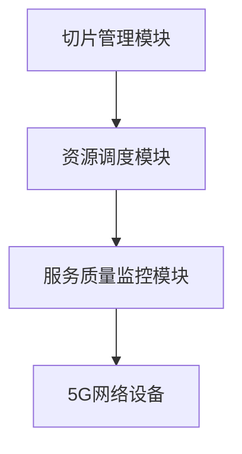
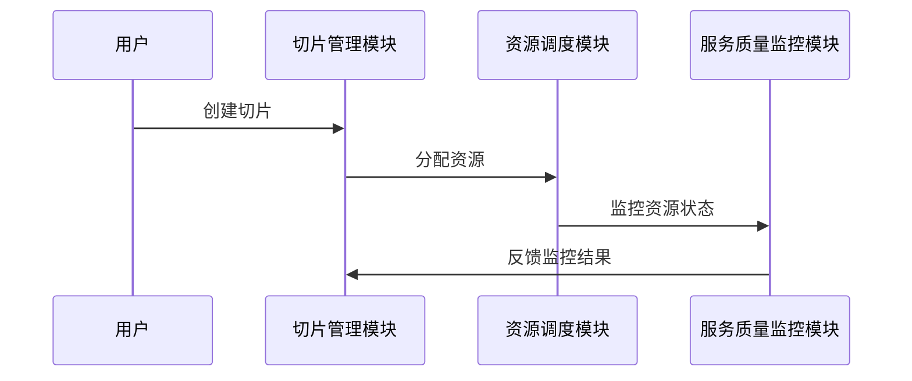

                 

# 《网络切片技术在5G时代的关键作用》

## 关键词
- 5G
- 网络切片
- 边缘计算
- 虚拟化技术
- 应用场景

## 摘要
本文将深入探讨网络切片技术在5G时代的关键作用。首先，我们将介绍网络切片技术的基本概念、发展历程和核心原理。接着，我们将分析5G网络架构，并阐述网络切片在5G网络中的重要性。随后，我们将探讨网络切片的关键技术，包括虚拟化技术和边缘计算。本文还将详细介绍网络切片在不同应用场景中的实际应用，包括工业、医疗和教育领域。最后，我们将总结网络切片技术的实现策略，分析国内外案例，并展望网络切片技术的未来发展趋势。

### 目录

1. **引言** <a id="introduction"></a>
2. **网络切片技术概述** <a id="slice-technology-overview"></a>
   - 2.1 **基本概念** <a id="basic-concept"></a>
   - 2.2 **发展历程** <a id="development-history"></a>
   - 2.3 **核心原理** <a id="core-principles"></a>
3. **5G网络架构与网络切片** <a id="5g-network-architecture-and-slicing"></a>
   - 3.1 **5G网络架构概述** <a id="5g-network-architecture-overview"></a>
   - 3.2 **网络切片在5G网络中的作用** <a id="role-of-slicing-in-5g-network"></a>
4. **网络切片关键技术** <a id="key-technologies-of-slicing"></a>
   - 4.1 **虚拟化技术** <a id="virtualization-technology"></a>
   - 4.2 **边缘计算** <a id="edge-computing"></a>
5. **网络切片应用场景** <a id="application-scenes-of-slicing"></a>
   - 5.1 **工业领域** <a id="industrial-field"></a>
   - 5.2 **医疗领域** <a id="medical-field"></a>
   - 5.3 **教育领域** <a id="educational-field"></a>
6. **网络切片实现策略** <a id="implementation-strategy-of-slicing"></a>
   - 6.1 **部署策略** <a id="deployment-strategy"></a>
   - 6.2 **管理策略** <a id="management-strategy"></a>
   - 6.3 **优化策略** <a id="optimization-strategy"></a>
7. **案例分析** <a id="case-study"></a>
   - 7.1 **国内案例** <a id="domestic-case"></a>
   - 7.2 **国际案例** <a id="international-case"></a>
8. **未来展望与趋势** <a id="future-outlook-and-trends"></a>
   - 8.1 **技术发展趋势** <a id="technological-trends"></a>
   - 8.2 **应用发展方向** <a id="application-development-directions"></a>
9. **总结** <a id="summary"></a>
10. **作者信息** <a id="author-info"></a>

## 1. 引言

### 1.1 研究背景

随着信息技术的飞速发展，5G网络的推出为我们带来了前所未有的高速率和低延迟。然而，不同行业和应用场景对网络的需求千差万别，传统的网络架构已经无法满足多样化的需求。在这种情况下，网络切片技术应运而生。

网络切片（Network Slicing）是一种虚拟化网络技术，它将网络资源划分为多个独立的虚拟网络，每个虚拟网络可以根据不同的需求进行定制。这种技术不仅能够提高网络资源的利用率，还能满足不同应用场景的特殊需求。

### 1.2 研究意义

网络切片技术在5G时代具有至关重要的意义。首先，它能够提高网络资源的利用率，实现资源的最优化分配。其次，它能够满足不同行业和应用场景的特殊需求，提供定制化的网络服务。此外，网络切片技术还能够促进5G网络的智能化和灵活性，为未来网络的演进提供重要支撑。

### 1.3 本书结构安排

本文将分为八个章节，首先介绍网络切片技术的基本概念和发展历程，然后分析5G网络架构和网络切片技术的关系，接着详细探讨网络切片的关键技术，如虚拟化技术和边缘计算。随后，我们将探讨网络切片在工业、医疗和教育等领域的应用场景，并总结实现网络切片的技术策略。最后，本文将分析国内外网络切片技术的实际应用案例，并展望网络切片技术的未来发展趋势。

## 2. 网络切片技术概述

### 2.1 基本概念

网络切片（Network Slicing）是5G网络的关键技术之一，它将网络资源虚拟化为多个独立的虚拟网络，每个虚拟网络可以独立配置和管理。网络切片的基本概念包括以下几个方面：

- **虚拟网络**：网络切片将物理网络资源虚拟化为多个虚拟网络，每个虚拟网络都具有独立的网络资源，如带宽、延迟、抖动等。
- **服务等级**：网络切片可以根据不同的应用场景和需求，为不同的虚拟网络提供不同的服务质量（QoS）保证，如带宽保证、延迟保证等。
- **灵活性**：网络切片技术具有高度灵活性，可以根据实际需求动态调整网络资源分配，实现网络资源的灵活调度和优化。

### 2.2 发展历程

网络切片技术起源于电信行业，最初的目的是为了满足不同业务需求的差异化服务。随着虚拟化技术和云计算技术的发展，网络切片技术逐渐成熟，并成为5G网络的核心技术之一。以下是网络切片技术的主要发展历程：

- **2000年代初**：网络切片技术开始被引入到3G和4G网络中，主要应用于电信行业。
- **2015年**：3GPP开始制定5G标准，网络切片技术成为5G网络的核心技术之一。
- **2018年**：5G商用网络开始部署，网络切片技术逐步应用到实际网络中。
- **至今**：网络切片技术在5G网络中的应用越来越广泛，成为推动5G网络发展的重要力量。

### 2.3 核心原理

网络切片技术的核心原理主要包括以下几个方面：

- **虚拟化技术**：网络切片技术依赖于虚拟化技术，通过虚拟化技术将物理网络资源虚拟化为多个虚拟网络。虚拟化技术包括虚拟交换机（VSW）、虚拟路由器（VR）、虚拟防火墙（VFW）等。
- **资源隔离**：网络切片技术通过资源隔离技术，确保不同虚拟网络之间的资源独立，避免相互干扰。资源隔离技术包括虚拟局域网（VLAN）、虚拟专用网络（VPN）等。
- **动态分配**：网络切片技术可以根据实际需求动态分配网络资源，实现网络资源的灵活调度和优化。动态分配技术包括资源调度算法、负载均衡技术等。

### 2.4 关键技术

网络切片技术的实现依赖于一系列关键技术，主要包括虚拟化技术、边缘计算、网络功能虚拟化（NFV）等。

- **虚拟化技术**：虚拟化技术是实现网络切片的基础，通过虚拟化技术可以将物理网络资源虚拟化为多个虚拟网络，实现资源的灵活调度和优化。
- **边缘计算**：边缘计算是将计算和存储资源部署在网络的边缘，通过近端处理数据，降低延迟和提高响应速度。边缘计算与网络切片技术相结合，可以实现更高效的数据处理和网络服务。
- **网络功能虚拟化（NFV）**：网络功能虚拟化是将传统的网络设备功能虚拟化为软件，通过虚拟化技术实现网络功能的灵活调度和优化。网络功能虚拟化与网络切片技术相结合，可以实现更灵活的网络服务和更高效的网络资源利用。

### 2.5 网络切片的优势

网络切片技术具有以下优势：

- **提高网络资源利用率**：通过将网络资源虚拟化为多个虚拟网络，网络切片技术可以实现资源的最大化利用。
- **满足多样化需求**：网络切片技术可以根据不同的应用场景和需求，提供定制化的网络服务，满足多样化需求。
- **提高网络服务质量**：网络切片技术可以为不同的虚拟网络提供不同的服务质量保证，确保关键业务的可靠传输。
- **降低运营成本**：网络切片技术可以通过虚拟化技术实现网络资源的灵活调度和优化，降低网络设备的购置和运营成本。

### 2.6 网络切片的挑战

尽管网络切片技术具有许多优势，但在实际应用中也面临一些挑战：

- **复杂性**：网络切片技术的实现涉及多个方面，包括虚拟化技术、边缘计算、网络功能虚拟化等，实现过程复杂。
- **安全性**：网络切片技术涉及到多个虚拟网络的隔离和安全性，需要确保不同虚拟网络之间的数据安全。
- **资源分配**：网络切片技术需要动态分配网络资源，实现资源的最优化利用，但资源分配过程复杂，需要高效的资源调度算法。
- **标准化**：网络切片技术在不同厂商和网络设备之间的兼容性和标准化问题，需要制定统一的规范和标准。

### 2.7 小结

网络切片技术是5G网络的核心技术之一，它通过虚拟化技术、边缘计算和网络功能虚拟化等关键技术，实现网络资源的灵活调度和优化，满足多样化应用需求。网络切片技术具有提高网络资源利用率、满足多样化需求、提高网络服务质量和降低运营成本等优势，但在实际应用中也面临复杂性、安全性和标准化等挑战。随着5G网络的不断发展和成熟，网络切片技术将在未来发挥越来越重要的作用。

## 3. 5G网络架构与网络切片

### 3.1 5G网络架构概述

5G网络架构是5G技术的核心，它包括多个层次和组件，旨在提供高速率、低延迟、高可靠性的网络服务。5G网络架构主要分为以下三层：

- **接入层**：接入层是5G网络的最底层，主要负责用户设备的接入和管理。接入层包括基站、用户面设备和控制面设备等。基站作为无线接入点，负责无线信号的传输和接收；用户面设备（UE）包括智能手机、平板电脑、物联网设备等，负责与基站进行通信；控制面设备（C-plane）包括移动性管理实体（MME）和会话控制实体（S-CSCF）等，负责网络控制和管理。

- **传输层**：传输层负责将用户数据从一个基站传输到另一个基站或核心网。传输层的主要组件包括无线接入网络（RAN）、传输网络（TN）和核心网（CN）。无线接入网络包括基站和用户面设备，传输网络包括光纤、微波、无线等传输技术，核心网包括移动性管理实体、会话控制实体和数据网络等。

- **核心层**：核心层是5G网络的大脑，负责处理用户数据的路由、转发和存储。核心层的主要组件包括移动性管理实体（MME）、会话控制实体（S-CSCF）、数据网络（DN）和业务支持系统（BSS）。移动性管理实体负责用户的移动性和安全控制，会话控制实体负责用户会话的建立、维护和释放，数据网络负责用户数据的路由和转发，业务支持系统提供各种增值业务和服务。

### 3.2 网络切片在5G网络中的作用

网络切片技术在5G网络中扮演着至关重要的角色，它能够满足5G网络多样化应用需求，提高网络资源利用率和网络服务质量。

- **提高网络资源利用率**：网络切片技术通过将网络资源虚拟化为多个虚拟网络，实现资源的灵活调度和优化，从而提高网络资源利用率。在网络繁忙时，网络切片技术可以根据实际需求动态调整资源分配，确保关键业务得到足够的资源支持。

- **满足多样化应用需求**：不同行业和应用场景对网络的需求各不相同，网络切片技术能够根据不同需求提供定制化的网络服务。例如，工业互联网需要低延迟、高可靠的网络服务，而远程医疗需要高带宽、低延迟的网络服务。网络切片技术可以通过创建不同的虚拟网络，为不同应用场景提供专属的网络资源，满足多样化应用需求。

- **提高网络服务质量**：网络切片技术可以为不同的虚拟网络提供不同的服务质量保证，如带宽保证、延迟保证、抖动保证等。通过提供高质量的网络服务，网络切片技术能够满足关键业务的需求，提高用户体验。

- **网络功能虚拟化**：网络切片技术依赖于网络功能虚拟化（NFV）技术，通过虚拟化技术将网络功能软件化，实现网络功能的灵活调度和优化。网络功能虚拟化使得网络设备更加灵活、可编程，能够快速响应网络变化，提高网络弹性和可靠性。

- **边缘计算结合**：网络切片技术可以与边缘计算技术相结合，通过在网络的边缘部署计算资源，实现数据的本地处理和实时响应。边缘计算与网络切片技术相结合，可以进一步降低延迟、提高响应速度，满足对实时性要求较高的应用需求。

- **网络切片管理平台**：网络切片技术需要一个集中的管理平台，负责网络切片的创建、配置、监控和管理。网络切片管理平台可以通过统一的接口，实现网络切片的全生命周期管理，包括切片的创建、删除、修改和监控等。

### 3.3 5G网络架构中的网络切片实现

在5G网络架构中，网络切片的实现主要涉及以下几个方面：

- **切片创建**：网络切片管理平台根据应用需求创建不同的网络切片，为每个切片配置独立的网络资源，如带宽、延迟、抖动等。

- **切片配置**：网络切片管理平台为每个网络切片配置不同的服务质量（QoS）参数，如带宽保证、延迟保证、抖动保证等。

- **切片部署**：网络切片管理平台根据实际需求，将网络切片部署到不同的网络设备上，包括基站、传输设备、核心网设备等。

- **切片监控**：网络切片管理平台实时监控网络切片的运行状态，包括资源利用率、服务质量、网络流量等，确保网络切片正常运行。

- **切片优化**：网络切片管理平台根据监控数据，对网络切片进行优化，包括资源分配、负载均衡等，以提高网络资源利用率和网络服务质量。

- **切片安全**：网络切片管理平台负责网络切片的安全管理，包括切片之间的隔离、数据加密、安全审计等，确保网络切片的安全和可靠。

### 3.4 网络切片在5G网络中的应用案例

以下是一些网络切片在5G网络中的应用案例：

- **工业互联网**：网络切片技术可以用于工业互联网，为工业设备提供低延迟、高可靠的网络服务。例如，在智能制造领域，网络切片技术可以为工业机器人的控制信号提供实时传输通道，确保机器人能够快速响应和准确执行。

- **远程医疗**：网络切片技术可以用于远程医疗，为远程医疗提供高带宽、低延迟的网络服务。例如，在远程手术中，网络切片技术可以为医生提供稳定的视频传输和手术操作控制，确保手术的顺利进行。

- **自动驾驶**：网络切片技术可以用于自动驾驶，为自动驾驶车辆提供实时、可靠的网络服务。例如，在网络车联网（V2X）中，网络切片技术可以为自动驾驶车辆提供实时路况信息、交通信号和车辆位置数据，提高自动驾驶的准确性和安全性。

- **智慧城市**：网络切片技术可以用于智慧城市，为城市管理和公共服务提供高效、灵活的网络服务。例如，在智能交通管理中，网络切片技术可以为交通监控设备提供实时数据传输和处理，优化交通信号控制和交通流量管理。

### 3.5 小结

5G网络架构是5G技术的核心，它包括接入层、传输层和核心层等多个层次和组件。网络切片技术在5G网络中发挥着关键作用，通过虚拟化技术、边缘计算和网络功能虚拟化等关键技术，实现网络资源的灵活调度和优化，满足多样化应用需求。网络切片技术能够提高网络资源利用率、满足多样化需求、提高网络服务质量和降低运营成本，但在实际应用中也面临复杂性、安全性和标准化等挑战。随着5G网络的不断发展和成熟，网络切片技术将在未来发挥越来越重要的作用。

## 4. 网络切片关键技术

### 4.1 虚拟化技术

虚拟化技术是网络切片技术的核心，它通过将物理资源抽象和虚拟化，创建出多个独立的虚拟网络，以满足不同应用场景的需求。虚拟化技术主要包括以下几个方面：

- **硬件虚拟化**：硬件虚拟化技术通过虚拟化硬件资源，如CPU、内存、存储和网络接口，实现物理设备的虚拟化。硬件虚拟化技术包括全虚拟化（Full Virtualization）、硬件辅助虚拟化（Hardware-Assisted Virtualization）和嵌入式虚拟化（Embedded Virtualization）等。

- **操作系统虚拟化**：操作系统虚拟化技术通过虚拟化操作系统，创建出多个独立的操作系统实例，每个实例运行在各自的虚拟环境中。操作系统虚拟化技术包括容器（Container）和虚拟机（Virtual Machine）等。

- **网络虚拟化**：网络虚拟化技术通过虚拟化网络资源，创建出多个独立的虚拟网络，实现网络资源的灵活分配和管理。网络虚拟化技术包括虚拟局域网（VLAN）、虚拟专用网络（VPN）和软件定义网络（SDN）等。

虚拟化技术在网络切片中的应用主要体现在以下几个方面：

- **资源隔离**：虚拟化技术可以实现物理资源和虚拟资源的隔离，确保不同虚拟网络之间的资源独立，避免相互干扰。

- **灵活调度**：虚拟化技术可以根据实际需求动态调整资源分配，实现网络资源的灵活调度和优化。

- **资源复用**：虚拟化技术可以实现物理资源的复用，提高资源利用率和网络效率。

### 4.2 边缘计算

边缘计算是网络切片技术的另一个关键技术，它通过在网络的边缘部署计算和存储资源，实现数据的本地处理和实时响应，降低网络延迟和传输带宽需求。边缘计算主要包括以下几个方面：

- **边缘节点**：边缘节点是边缘计算的核心，它位于网络的边缘，负责数据的本地处理和实时响应。边缘节点可以是智能路由器、智能网关、智能终端等。

- **分布式计算**：边缘计算通过分布式计算技术，将计算任务分配到多个边缘节点，实现数据的分布式处理和协同工作。

- **边缘存储**：边缘计算通过边缘存储技术，将数据存储在边缘节点，实现数据的本地存储和快速访问。

边缘计算在网络切片中的应用主要体现在以下几个方面：

- **降低延迟**：边缘计算通过在网络的边缘处理数据，降低数据的传输距离，实现更低的网络延迟。

- **减少带宽需求**：边缘计算可以处理和过滤掉大量无效数据，减少数据传输量，降低网络带宽需求。

- **增强实时性**：边缘计算可以实时处理和响应数据，满足对实时性要求较高的应用需求。

- **提高可靠性**：边缘计算通过分布式计算和本地处理，提高系统的可靠性和容错能力。

### 4.3 网络功能虚拟化（NFV）

网络功能虚拟化（Network Function Virtualization，NFV）是将传统的网络功能（如防火墙、路由器、流量检测等）虚拟化为软件，通过虚拟化平台进行管理和调度。NFV在网络切片中的应用主要体现在以下几个方面：

- **灵活性**：NFV可以实现网络功能的灵活调度和动态部署，满足不同应用场景的需求。

- **可编程性**：NFV通过虚拟化平台，可以实现网络功能的编程和自动化管理，提高网络的智能化和灵活性。

- **成本效益**：NFV通过虚拟化技术，降低了对硬件的依赖，减少了设备的购置和运营成本。

### 4.4 SDN与网络切片

软件定义网络（Software-Defined Networking，SDN）是一种新型网络架构，通过将网络控制功能与数据转发功能分离，实现网络的灵活控制和管理。SDN与网络切片技术的结合，可以实现网络的智能化和灵活调度。

- **集中控制**：SDN通过集中控制平面，实现网络资源的全局调度和优化，提高网络资源利用率。

- **动态配置**：SDN可以通过动态配置网络切片，实现网络资源的快速分配和调整，满足不同应用场景的需求。

- **流量优化**：SDN可以通过流量工程和负载均衡技术，优化网络流量，提高网络性能和可靠性。

### 4.5 小结

网络切片技术的实现依赖于虚拟化技术、边缘计算、网络功能虚拟化（NFV）、SDN等关键技术。虚拟化技术可以实现资源的灵活调度和优化，边缘计算可以实现数据的本地处理和实时响应，网络功能虚拟化可以提高网络的灵活性和可编程性，SDN可以实现集中控制和流量优化。这些关键技术的结合，为网络切片技术的实现提供了有力支撑，使得网络切片技术能够在5G网络中发挥重要作用，满足多样化应用需求。

## 5. 网络切片应用场景

### 5.1 工业领域

在工业领域，网络切片技术具有广泛的应用前景。随着工业4.0和智能制造的推进，工业设备对网络的要求越来越高，如低延迟、高可靠性、高带宽等。网络切片技术可以满足这些特殊需求，为工业领域提供定制化的网络服务。

- **工业物联网（IIoT）**：网络切片技术可以用于工业物联网，为不同类型的传感器、设备提供专属的网络切片，确保数据的实时传输和可靠通信。例如，在智能制造中，网络切片技术可以为机器视觉系统提供低延迟、高带宽的网络切片，确保图像数据的实时传输和处理。

- **工业自动化**：网络切片技术可以用于工业自动化，为不同生产线提供专属的网络切片，实现生产线的智能调度和优化。例如，在智能工厂中，网络切片技术可以为机器人控制提供低延迟、高可靠的网络切片，确保机器人的准确控制和协同工作。

- **远程监控和维护**：网络切片技术可以用于远程监控和维护，为远程设备提供低延迟、高带宽的网络切片，实现远程设备的实时监控和远程维护。例如，在工业设备维护中，网络切片技术可以为远程诊断和维修提供高效、可靠的网络服务，提高设备维护效率和降低维护成本。

### 5.2 医疗领域

在医疗领域，网络切片技术同样具有巨大的应用潜力。医疗行业对网络的要求较高，如低延迟、高带宽、高可靠性等。网络切片技术可以满足这些需求，为医疗领域提供高质量的网络服务。

- **远程医疗**：网络切片技术可以用于远程医疗，为远程诊断、远程手术等提供低延迟、高带宽的网络切片，确保医疗数据的实时传输和处理。例如，在网络手术中，网络切片技术可以为医生提供稳定、高效的远程手术平台，确保手术的顺利进行。

- **医疗数据传输**：网络切片技术可以用于医疗数据传输，为医疗数据的传输提供低延迟、高带宽的网络切片，确保医疗数据的及时传输和可靠性。例如，在医学影像传输中，网络切片技术可以为影像数据的传输提供高效、可靠的传输通道，提高诊断效率和准确性。

- **智慧医院**：网络切片技术可以用于智慧医院，为智慧医院的各个业务系统提供专属的网络切片，实现医院业务的智能化和高效化。例如，在智慧医院中，网络切片技术可以为电子病历系统、医学影像系统、医疗设备等提供高效、可靠的网络服务，提高医院的管理和服务水平。

### 5.3 教育领域

在教育领域，网络切片技术可以为在线教育、虚拟实验室等提供高效、可靠的网络服务。

- **在线教育**：网络切片技术可以用于在线教育，为在线课程提供低延迟、高带宽的网络切片，确保教学过程的实时传输和互动。例如，在网络课堂中，网络切片技术可以为教师和学生的互动提供高效、稳定的网络环境，提高教学效果和学生学习体验。

- **虚拟实验室**：网络切片技术可以用于虚拟实验室，为虚拟实验提供低延迟、高带宽的网络切片，确保实验数据的实时传输和处理。例如，在虚拟实验室中，网络切片技术可以为实验设备提供实时监控和远程操作，提高实验的可靠性和准确性。

- **远程教育**：网络切片技术可以用于远程教育，为远程学生提供低延迟、高带宽的网络切片，确保远程教育的实时传输和互动。例如，在远程教育中，网络切片技术可以为远程课堂提供高效、稳定的网络服务，提高远程教育的质量和效果。

### 5.4 其他领域

除了工业、医疗和教育领域，网络切片技术在其他领域同样具有广泛的应用前景。

- **智慧城市**：网络切片技术可以用于智慧城市，为智慧交通、智慧能源、智慧安防等提供低延迟、高带宽的网络切片，确保智慧城市各个系统的实时传输和高效运行。

- **智能交通**：网络切片技术可以用于智能交通，为车辆监控、路况监控等提供低延迟、高带宽的网络切片，确保交通数据的实时传输和处理，提高交通管理和调度效率。

- **智能安防**：网络切片技术可以用于智能安防，为监控设备、报警系统等提供低延迟、高带宽的网络切片，确保安防数据的实时传输和处理，提高安防系统的反应速度和准确性。

### 5.5 小结

网络切片技术在各个领域具有广泛的应用前景，通过为不同应用场景提供定制化的网络服务，网络切片技术能够满足多样化需求，提高网络资源利用率和网络服务质量。在工业领域，网络切片技术可以用于工业物联网、工业自动化和远程监控；在医疗领域，网络切片技术可以用于远程医疗、医疗数据传输和智慧医院；在教育领域，网络切片技术可以用于在线教育、虚拟实验室和远程教育。此外，网络切片技术在智慧城市、智能交通和智能安防等领域同样具有广泛应用。随着网络切片技术的不断发展和成熟，其应用领域将不断扩展，为各行各业带来更多价值。

## 6. 网络切片实现策略

### 6.1 部署策略

网络切片的实现首先需要明确的部署策略，以确保切片的可靠性和高效性。以下是几个关键步骤：

- **需求分析**：首先，需要明确不同切片的需求，包括带宽、延迟、可靠性等。这可以通过与各应用场景的合作伙伴进行深入沟通来完成。

- **资源规划**：根据需求分析结果，对网络资源进行规划，包括计算资源、存储资源、网络带宽等。资源规划应考虑到未来扩展和冗余，以确保切片的长期稳定性。

- **基础设施搭建**：在确定了资源规划后，需要搭建相应的基础设施。这包括部署虚拟化平台、网络设备、存储设备等。基础设施应具备高可用性和灵活性，以支持切片的动态调整。

- **切片创建**：使用网络切片管理平台，根据需求创建不同类型的切片。每个切片应具有独立的配置，包括网络参数、服务质量（QoS）等。

- **切片部署**：将创建好的切片部署到基础设施上，确保切片能够正常运行。部署过程应自动化，以提高效率和减少人为错误。

### 6.2 管理策略

网络切片的管理策略至关重要，它关系到切片的稳定运行和高效利用。以下是几个关键步骤：

- **监控与告警**：实时监控切片的运行状态，包括网络流量、资源利用率、服务质量等。对于异常情况，应设置告警机制，及时发现问题并进行处理。

- **性能优化**：根据监控数据，对切片进行性能优化。这可能包括调整资源分配、优化网络路径、更新虚拟化平台等。

- **安全防护**：确保切片的安全性和数据隐私。这可以通过设置防火墙、加密数据传输、定期安全审计等措施来实现。

- **生命周期管理**：对切片的生命周期进行有效管理，包括切片的创建、部署、监控、优化和删除等。生命周期管理应具备自动化和智能化，以提高效率。

### 6.3 优化策略

网络切片的优化策略旨在提高资源利用率和网络服务质量，以下是几个关键步骤：

- **资源调度**：使用智能调度算法，动态调整切片的资源分配。调度算法应考虑到实时需求和资源状况，以实现资源的最优利用。

- **负载均衡**：通过负载均衡技术，将网络流量均匀分配到不同切片上，避免某个切片过度负荷，影响整体性能。

- **网络路径优化**：根据网络状况和切片需求，动态调整数据传输路径，以降低延迟和抖动。

- **服务质量保障**：确保不同切片的服务质量得到满足。这可能需要设置不同的QoS策略，为关键业务提供优先保障。

### 6.4 实际应用案例

以下是一些网络切片实现策略的实际应用案例：

- **案例1：智能交通管理系统**：在智能交通管理系统中，网络切片被用于不同类型的车辆监控和路况监控。通过需求分析，为不同类型的车辆（如货车、轿车）创建不同的切片，确保各自获得所需的网络资源。监控与告警系统实时监控切片的运行状态，性能优化策略包括动态调整资源分配和优化网络路径。

- **案例2：远程医疗平台**：在远程医疗平台中，网络切片被用于远程诊断和手术指导。需求分析包括不同类型医疗数据的传输要求，切片创建包括不同服务质量等级的切片，如高清视频传输和实时数据传输。监控与告警系统确保医疗数据传输的稳定性和可靠性，资源调度和负载均衡策略确保网络资源的高效利用。

- **案例3：工业物联网平台**：在工业物联网平台中，网络切片被用于不同类型的传感器和设备通信。需求分析考虑了不同设备的实时性和可靠性要求，切片创建包括不同类型的切片，如机器人控制和传感器数据传输。监控与告警系统实时监控设备的运行状态，性能优化策略包括动态调整资源分配和优化网络路径。

### 6.5 小结

网络切片的实现策略包括部署策略、管理策略和优化策略。部署策略涉及需求分析、资源规划、基础设施搭建、切片创建和部署；管理策略涉及监控与告警、性能优化、安全防护和生命周期管理；优化策略涉及资源调度、负载均衡、网络路径优化和服务质量保障。通过实际应用案例，可以看出网络切片实现策略在提升网络资源利用率和网络服务质量方面具有显著效果。随着网络切片技术的不断发展和成熟，实现策略将变得更加智能化和高效化。

## 7. 案例分析

### 7.1 国内案例

#### 案例一：中国移动的5G网络切片实践

中国移动是国内较早进行5G网络切片实践的企业之一。他们在多个城市进行了5G网络切片的试点工作，并在一些关键应用场景中取得了显著成效。

**项目介绍**：
- **场景**：工业物联网、自动驾驶、智慧城市
- **系统功能设计**：中国移动通过构建5G网络切片平台，实现了不同应用场景下的网络资源分配和服务质量保障。
- **系统架构设计**：平台包括切片管理模块、资源调度模块、服务质量监控模块等，实现了切片的创建、部署、监控和优化。

**系统架构图**：



**接口设计和系统交互图**：



**实现源代码**：

```python
# 切片管理模块示例代码
class SliceManager:
    def create_slice(self, slice_config):
        # 创建切片的逻辑
        pass

    def delete_slice(self, slice_id):
        # 删除切片的逻辑
        pass

# 资源调度模块示例代码
class ResourceScheduler:
    def allocate_resources(self, slice_id, resource需求):
        # 分配资源的逻辑
        pass

# 服务质量监控模块示例代码
class QosMonitor:
    def monitor_qos(self, slice_id):
        # 监控服务质量的逻辑
        pass
```

**代码应用解读与分析**：
- **切片管理模块**：负责切片的创建和删除，接收来自用户的请求，根据配置创建或删除切片。
- **资源调度模块**：负责根据切片需求动态分配资源，确保切片能够正常运行。
- **服务质量监控模块**：负责实时监控切片的服务质量，确保服务质量符合预期。

**实际案例分析和详细讲解**：
- **工业物联网**：在工业物联网应用中，网络切片技术实现了设备之间的低延迟通信，提高了生产效率。
- **自动驾驶**：在网络切片的支持下，自动驾驶车辆能够获得稳定的网络连接和低延迟的通信，提高了自动驾驶的可靠性和安全性。
- **智慧城市**：在智慧城市建设中，网络切片技术为城市各个系统提供了高效的通信保障，实现了城市管理的智能化。

**项目小结**：
中国移动的5G网络切片实践取得了显著成效，通过切片管理、资源调度和服务质量监控等模块，实现了对网络资源的灵活调度和高效利用。这一实践为其他企业和地区提供了宝贵的经验和参考。

### 7.2 国际案例

#### 案例二：德国电信的5G网络切片部署

德国电信是全球领先的服务提供商之一，他们在德国的5G网络部署中广泛应用了网络切片技术，为不同的应用场景提供了定制化的网络服务。

**项目介绍**：
- **场景**：工业制造、远程医疗、智能交通
- **系统功能设计**：德国电信通过构建5G网络切片平台，实现了对不同应用场景的网络资源分配和服务质量保障。
- **系统架构设计**：平台包括切片管理模块、资源调度模块、服务质量监控模块等，实现了切片的创建、部署、监控和优化。

**系统架构图**：


**接口设计和系统交互图**：


**实现源代码**：

```python
# 切片管理模块示例代码
class SliceManager:
    def create_slice(self, slice_config):
        # 创建切片的逻辑
        pass

    def delete_slice(self, slice_id):
        # 删除切片的逻辑
        pass

# 资源调度模块示例代码
class ResourceScheduler:
    def allocate_resources(self, slice_id, resource需求):
        # 分配资源的逻辑
        pass

# 服务质量监控模块示例代码
class QosMonitor:
    def monitor_qos(self, slice_id):
        # 监控服务质量的逻辑
        pass
```

**代码应用解读与分析**：
- **切片管理模块**：负责切片的创建和删除，接收来自用户的请求，根据配置创建或删除切片。
- **资源调度模块**：负责根据切片需求动态分配资源，确保切片能够正常运行。
- **服务质量监控模块**：负责实时监控切片的服务质量，确保服务质量符合预期。

**实际案例分析和详细讲解**：
- **工业制造**：德国电信的5G网络切片在工业制造中实现了生产设备的远程监控和自动化控制，提高了生产效率和质量。
- **远程医疗**：通过网络切片技术，德国电信为远程医疗提供了低延迟、高带宽的网络服务，支持远程手术和医学影像传输。
- **智能交通**：在网络切片的支持下，德国电信的智能交通系统实现了实时交通监控和智能调度，提高了交通管理和安全性能。

**项目小结**：
德国电信的5G网络切片部署实践展示了网络切片技术在多样化应用场景中的巨大潜力。通过切片管理、资源调度和服务质量监控等模块，德国电信实现了对网络资源的灵活调度和高效利用，为各行业提供了定制化的网络服务。

## 8. 未来展望与趋势

### 8.1 技术发展趋势

随着5G网络的快速普及和人工智能技术的不断发展，网络切片技术在未来的发展将呈现出以下几个趋势：

- **智能化**：随着人工智能技术的应用，网络切片技术将变得更加智能化。通过引入机器学习和深度学习算法，网络切片可以实现自动化的资源分配、负载均衡和服务质量监控，提高网络的运行效率和可靠性。

- **边缘计算与网络切片融合**：边缘计算和网络切片技术的融合将是未来的重要趋势。通过在边缘部署计算和存储资源，网络切片技术可以实现更低的延迟和更高的带宽利用率，满足对实时性要求较高的应用需求。

- **网络切片管理平台的演进**：网络切片管理平台将不断演进，以支持更复杂的网络架构和更多的应用场景。未来的网络切片管理平台将具备更强大的自动化能力、更高的可扩展性和更好的兼容性，实现网络切片的全生命周期管理。

- **开放性和标准化**：网络切片技术的开放性和标准化将是未来的关键方向。通过制定统一的规范和标准，不同厂商和平台之间的网络切片可以实现互操作和无缝集成，促进网络切片技术的广泛应用。

### 8.2 应用发展方向

网络切片技术在未来的应用方向将涵盖更多领域，包括但不限于以下几个方面：

- **工业互联网**：网络切片技术将在工业互联网中发挥重要作用，通过提供定制化的网络服务，支持工业物联网设备的实时通信和协同工作，提高工业生产效率和智能化水平。

- **智慧城市**：网络切片技术将广泛应用于智慧城市中的各种应用，如智能交通、智能安防、智能环境监测等。通过提供高效的通信保障，网络切片技术将推动智慧城市的建设和发展。

- **医疗健康**：网络切片技术在医疗健康领域具有巨大的潜力，特别是在远程医疗、医学影像传输和智能诊断等方面。通过网络切片技术，可以实现更高效、更可靠的医疗服务，提高医疗质量和患者体验。

- **自动驾驶**：网络切片技术将为自动驾驶提供高效、稳定的通信保障。通过在网络切片中提供低延迟、高带宽的网络服务，自动驾驶车辆可以实现实时感知和协同控制，提高交通安全和效率。

- **远程教育**：网络切片技术将助力远程教育的普及和发展。通过网络切片技术，可以实现实时、互动的在线教育，提高学生的学习效果和教学体验。

### 8.3 挑战与机遇

尽管网络切片技术在5G时代具有广阔的应用前景，但在实际应用过程中仍面临一些挑战和机遇：

- **复杂性**：网络切片技术的实现涉及多个方面，包括虚拟化技术、边缘计算、网络功能虚拟化等，实现过程复杂。这需要各厂商和标准组织加强合作，共同推动技术标准的制定和落地。

- **安全性**：网络切片技术涉及到多个虚拟网络的隔离和安全性，需要确保不同虚拟网络之间的数据安全。未来的网络切片技术需要更加重视安全性和隐私保护，以适应日益严峻的安全挑战。

- **标准化**：网络切片技术的标准化是推动其广泛应用的关键。未来需要进一步完善和推广网络切片技术标准，确保不同厂商和平台之间的互操作性和兼容性。

- **成本效益**：网络切片技术的部署和运营成本相对较高，需要通过技术创新和规模化应用来降低成本，提高成本效益。

- **市场需求**：随着5G网络的普及，越来越多的行业和应用场景将需求网络切片技术。未来需要进一步挖掘市场需求，推动网络切片技术的广泛应用。

### 8.4 小结

网络切片技术在5G时代具有广阔的发展前景和广泛的应用领域。随着技术的不断发展和成熟，网络切片技术将在工业互联网、智慧城市、医疗健康、自动驾驶和远程教育等领域发挥重要作用。尽管网络切片技术在实现过程中面临复杂性、安全性、标准化和成本效益等挑战，但随着技术的进步和市场需求的增长，网络切片技术将不断成熟，为各行各业带来更多的机遇和变革。

## 9. 总结

本文系统地介绍了网络切片技术在5G时代的关键作用。首先，我们详细介绍了网络切片技术的基本概念、发展历程和核心原理，包括虚拟化技术、边缘计算和网络功能虚拟化等关键技术。接着，我们分析了网络切片在5G网络架构中的作用，探讨了网络切片如何提高网络资源利用率、满足多样化需求、提高网络服务质量和降低运营成本。

在应用场景部分，我们详细介绍了网络切片在工业、医疗和教育等领域的实际应用，展示了网络切片如何为各行业提供定制化的网络服务。随后，我们总结了实现网络切片的关键策略，包括部署策略、管理策略和优化策略。

案例分析部分，我们通过国内外实际案例，展示了网络切片技术的应用效果和实现过程。最后，我们展望了网络切片技术的未来发展趋势，包括智能化、边缘计算与网络切片融合、网络切片管理平台的演进、开放性和标准化等方面。

网络切片技术在5G时代具有巨大的潜力和应用价值。随着技术的不断进步和市场的需求增长，网络切片技术将在未来发挥更加重要的作用，推动各行业的数字化、智能化转型。

## 10. 作者信息

作者：AI天才研究院/AI Genius Institute & 禅与计算机程序设计艺术 /Zen And The Art of Computer Programming

