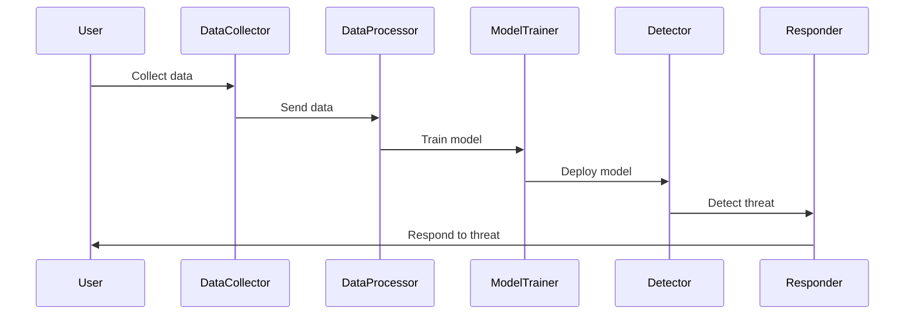

                 

## 网络安全AI：智能防御企业数字资产

### 关键词：网络安全，人工智能，数字资产保护，智能防御，AI算法，系统设计，案例分析

### 摘要：
本文深入探讨了网络安全与人工智能的结合，以智能防御企业数字资产为主题，系统地介绍了网络安全AI的基本概念、算法原理、系统设计与实际应用。文章首先定义了网络安全和数字资产保护的重要性，然后逐步分析了网络安全AI的核心概念和理论基础，接着详细讲解了AI算法在网络安全中的应用，包括监测与检测、预测与响应等。随后，文章阐述了数学模型和公式在网络安全AI中的作用，并展示了一些实际案例。最后，文章提出了网络安全AI的最佳实践和未来发展方向，为读者提供了全面的指导和建议。

## 引言与背景

### 1.1 问题背景

在当今数字化时代，企业的数字资产变得比以往任何时候都更为重要。这些资产不仅包括公司的财务数据、客户信息，还涵盖了研发成果、知识产权等关键资源。随着互联网的普及和云计算、大数据等技术的广泛应用，企业逐渐将业务流程和数据存储转移到线上。然而，这也带来了巨大的安全风险。网络攻击手段日益复杂多样，传统的防御手段已经难以应对不断升级的威胁。

### 1.2 网络安全挑战

网络安全挑战主要表现在以下几个方面：

1. **攻击频率增加**：网络攻击的频率和次数逐年增加，攻击手段日益复杂，从简单的DDoS攻击到高级的APT攻击，各种攻击手段层出不穷。
   
2. **攻击目标多样化**：传统的攻击目标主要集中在金融、政府等领域，而如今几乎所有的企业都成为了潜在的攻击目标，包括中小企业和个人用户。

3. **攻击隐蔽性增强**：攻击者利用社会工程学、恶意软件等手段，使得攻击更加隐蔽，难以被检测和防范。

4. **安全人才短缺**：网络安全人才的需求量巨大，但供给严重不足，许多企业面临人才短缺的挑战。

### 1.3 AI在网络安全中的作用

人工智能（AI）技术在网络安全中的应用为解决上述问题提供了一种新的思路。AI具备自我学习和自适应的能力，可以有效地监测网络流量、识别异常行为、预测潜在威胁等。通过引入AI技术，网络安全防御系统可以变得更加智能和高效，具体表现在以下几个方面：

1. **自动化威胁检测和响应**：AI算法可以自动分析海量数据，实时检测和识别异常行为，提高威胁检测的效率和准确性。

2. **自适应防御策略**：AI可以根据攻击者的行为模式和行为特征，动态调整防御策略，提高防御的灵活性。

3. **安全分析辅助**：AI技术可以帮助安全分析师快速识别和分析安全事件，减轻分析师的工作负担。

4. **人才补充**：AI技术可以部分替代人力工作，缓解安全人才短缺的问题。

### 1.4 书籍结构

本书籍将围绕网络安全AI这一主题，系统地介绍相关知识和应用。具体结构如下：

- **第一章：引言与背景**：介绍网络安全的重要性以及AI在网络安全中的作用。

- **第二章：核心概念与理论基础**：详细讲解AI的基本原理和网络安全AI的关键概念。

- **第三章：AI算法在网络安全中的应用**：介绍AI算法在网络安全中的具体应用，包括监测与检测、预测与响应等。

- **第四章：数学模型与公式**：阐述数学模型和公式在网络安全AI中的作用，并展示一些实际案例。

- **第五章：系统设计与架构**：介绍网络安全AI系统的设计与架构，包括功能设计、架构设计和接口设计。

- **第六章：实践应用与案例分析**：通过实际案例展示网络安全AI的具体应用场景。

- **第七章：最佳实践与未来展望**：提出网络安全AI的最佳实践和未来发展方向。

通过本书籍的阅读，读者可以全面了解网络安全AI的知识体系，掌握智能防御企业数字资产的方法和技巧。接下来，我们将逐步深入探讨这些主题。

## 核心概念与理论基础

### 2.1 AI基本原理

人工智能（AI）是计算机科学的一个分支，致力于使计算机系统能够模拟人类的智能行为。AI的核心目标是通过算法和计算模型，使计算机具备自我学习、推理、规划、感知和解决问题的能力。AI可以分为多个子领域，包括机器学习、深度学习、自然语言处理、计算机视觉等。

#### 机器学习

机器学习是AI的一个重要分支，它通过算法使计算机能够从数据中学习规律，并利用这些规律进行预测或决策。机器学习通常分为监督学习、无监督学习和强化学习三种类型。

1. **监督学习**：监督学习算法使用已标记的数据集来训练模型，然后利用训练好的模型对新的数据进行预测。常见的监督学习算法包括线性回归、决策树、支持向量机等。

2. **无监督学习**：无监督学习算法不使用已标记的数据，而是通过分析数据的内在结构来发现数据中的规律。常见的无监督学习算法包括聚类算法、主成分分析等。

3. **强化学习**：强化学习算法通过试错来学习最优策略。它通过与环境的交互来获取反馈，并通过调整策略来最大化累积奖励。常见的强化学习算法包括Q学习、深度Q网络等。

#### 深度学习

深度学习是机器学习的一个子领域，它利用多层神经网络来模拟人脑的神经元结构，从而进行高效的特征学习和模式识别。深度学习在图像识别、语音识别、自然语言处理等领域取得了显著的成果。

深度学习的核心组件包括：

1. **神经网络**：神经网络由多个神经元（或称为节点）组成，每个神经元都连接到前一层和后一层的节点。神经网络通过前向传播和反向传播算法来学习数据中的特征。

2. **卷积神经网络（CNN）**：CNN是深度学习中的一个重要模型，特别适用于处理图像数据。它利用卷积层、池化层和全连接层来提取图像的特征，从而实现图像分类、目标检测等任务。

3. **循环神经网络（RNN）**：RNN是处理序列数据的一种有效方法，它通过将前一时刻的输出反馈到当前时刻，来处理时间序列数据。常见的RNN包括LSTM（长短期记忆网络）和GRU（门控循环单元）。

#### 自然语言处理

自然语言处理（NLP）是AI的一个子领域，旨在使计算机能够理解和生成自然语言。NLP技术广泛应用于自动翻译、文本分类、情感分析、问答系统等领域。

NLP的核心组件包括：

1. **词嵌入**：词嵌入是将单词映射到高维向量空间的技术，它使得计算机可以处理和计算自然语言中的词汇。

2. **序列标注**：序列标注是对文本中的每个单词或词组进行分类的过程，例如情感标注、实体识别等。

3. **注意力机制**：注意力机制是NLP中的一个重要技术，它通过给不同的输入元素分配不同的权重来提高模型的性能。

### 2.2 网络安全AI的关键概念

网络安全AI是指利用人工智能技术来增强网络安全防御能力的一种方法。网络安全AI的关键概念包括：

1. **威胁情报**：威胁情报是指关于网络攻击的详细信息，包括攻击者的身份、攻击方式、攻击目标等。通过收集和分析威胁情报，网络安全AI可以提前预测和防范潜在威胁。

2. **入侵检测系统（IDS）**：入侵检测系统是一种网络安全技术，用于检测和响应网络攻击。网络安全AI可以通过机器学习和深度学习算法，自动分析网络流量和日志数据，实时识别入侵行为。

3. **行为分析**：行为分析是指通过监测用户行为和系统活动来识别异常行为。网络安全AI可以通过分析用户行为模式，识别出潜在的攻击行为，从而采取措施进行防御。

4. **异常检测**：异常检测是网络安全AI的一种重要技术，通过监测系统的正常行为，并识别出与正常行为不符的异常行为，来检测和防范网络攻击。

5. **自适应防御**：自适应防御是指网络安全AI能够根据攻击者的行为模式和行为特征，动态调整防御策略，以应对不断变化的攻击威胁。

### 2.3 智能防御系统架构

智能防御系统架构是指网络安全AI系统的基础架构，包括数据采集、数据处理、模型训练和预测等关键环节。

1. **数据采集**：数据采集是指从网络设备和日志中收集数据，包括网络流量、系统日志、用户行为等。这些数据是进行AI分析的基础。

2. **数据处理**：数据处理是指对采集到的数据进行分析、清洗和预处理，以便于模型训练和预测。数据处理环节包括数据去重、数据归一化、特征提取等。

3. **模型训练**：模型训练是指使用机器学习和深度学习算法，对预处理后的数据进行训练，从而建立预测模型。模型训练过程包括数据集划分、模型选择、训练过程优化等。

4. **预测和响应**：预测和响应是指使用训练好的模型对实时数据进行分析，预测潜在的攻击行为，并采取措施进行响应。预测和响应过程包括实时数据流处理、异常行为识别、防御策略调整等。

### 2.4 人工智能与网络安全的关系

人工智能与网络安全密切相关，两者相辅相成。人工智能技术可以为网络安全提供强大的支持，例如：

1. **自动化检测和响应**：人工智能技术可以实现自动化的威胁检测和响应，减少人为干预，提高处理速度和准确性。

2. **行为分析**：人工智能技术可以分析用户行为和系统活动，识别出潜在的异常行为，从而防范网络攻击。

3. **自适应防御**：人工智能技术可以根据攻击者的行为模式和行为特征，动态调整防御策略，提高防御的灵活性和适应性。

4. **威胁情报分析**：人工智能技术可以分析大量的威胁情报，提前预测和防范潜在的攻击威胁。

5. **人才补充**：人工智能技术可以部分替代人力工作，缓解安全人才短缺的问题。

然而，人工智能技术也带来了一些新的挑战和风险，例如：

1. **误报和漏报**：人工智能模型可能会因为数据偏差、模型过拟合等原因，导致误报和漏报。

2. **攻击面扩大**：攻击者可以利用人工智能技术进行更高级的攻击，例如对抗攻击。

3. **数据隐私问题**：人工智能技术在网络安全中的应用需要大量的用户数据，这可能引发数据隐私问题。

总之，人工智能技术在网络安全中的应用具有重要的意义，但也需要我们深入研究和解决相关问题，以确保网络安全AI的安全和有效。

## 网络安全中的AI算法

### 3.1 监测与检测算法

在网络安全中，监测与检测是预防和应对网络攻击的重要手段。AI算法在这方面的应用主要体现在自动识别和分析网络流量、系统日志以及用户行为，从而实时发现潜在威胁。

#### 1. 异常检测算法

异常检测是一种常见的监测与检测算法，其核心思想是通过建立系统的正常行为模型，然后检测实际行为与正常模型之间的偏差，从而发现异常行为。常见的异常检测算法包括：

- **基于统计的方法**：如高斯分布模型、聚类分析等。这种方法简单有效，但对数据质量和特征提取有较高要求。

- **基于距离的方法**：如基于k-近邻（k-Nearest Neighbors，k-NN）的方法，通过计算新样本与训练集中最近邻居的相似度来判断其是否为异常。

- **基于模型的方法**：如基于神经网络（Neural Network，NN）的方法，通过训练神经网络模型来识别正常行为和异常行为。

#### 2. 集成学习算法

集成学习算法通过结合多个基学习器的预测结果来提高模型的性能和稳定性。常见的集成学习算法包括：

- **Bagging算法**：如随机森林（Random Forest）算法，通过随机选择子集和特征构建多个基学习器，然后取平均值进行预测。

- **Boosting算法**：如自适应提升（Adaptive Boosting，AdaBoost）算法，通过调整基学习器的权重来提高整体的预测准确性。

#### 3. 深度学习算法

深度学习算法在监测与检测方面具有显著优势，尤其是在处理复杂非线性问题和大规模数据集时。常见的深度学习算法包括：

- **卷积神经网络（CNN）**：CNN特别适合处理图像数据，通过多层卷积和池化操作提取图像特征，实现高效的图像分类和检测。

- **循环神经网络（RNN）**和**长短期记忆网络（LSTM）**：RNN和LSTM适合处理序列数据，如时间序列数据和用户行为序列，可以有效地捕捉时间依赖性。

#### 3.2 预测与预测模型

预测与预测模型在网络安全中的应用主要体现在预测潜在的网络攻击、威胁和异常行为。通过预测，可以提前采取预防措施，降低安全风险。

#### 1. 时间序列预测

时间序列预测是一种常见的预测方法，其核心思想是利用历史数据的时间顺序关系来预测未来的趋势。常见的时间序列预测方法包括：

- **自回归模型（AR）**：自回归模型通过历史数据中的滞后项来预测未来值。

- **自回归积分滑动平均模型（ARIMA）**：ARIMA模型结合了自回归、差分和移动平均三种方法，适用于非线性时间序列数据。

- **长短期记忆网络（LSTM）**：LSTM是处理时间序列数据的强大工具，可以有效地捕捉时间依赖性。

#### 2. 序列预测

序列预测是另一种重要的预测方法，它通过分析事件的序列模式来预测未来的事件。常见的序列预测方法包括：

- **马尔可夫模型（Markov Model）**：马尔可夫模型通过当前状态来预测下一个状态。

- **条件概率模型**：如隐马尔可夫模型（HMM）和变分自编码器（VAE），通过条件概率分布来预测序列中的下一个事件。

#### 3.3 威胁分析与响应算法

威胁分析与响应算法是网络安全AI的重要组成部分，其主要目标是自动识别和分析网络攻击，并采取相应的防御措施。

#### 1. 威胁分类算法

威胁分类算法通过对攻击特征进行分类，将攻击分为不同的类型，从而采取相应的防御策略。常见的威胁分类算法包括：

- **朴素贝叶斯分类器**：朴素贝叶斯分类器是一种基于贝叶斯定理的概率分类器，适用于特征独立的情况。

- **支持向量机（SVM）**：SVM是一种基于最大间隔的分类器，通过找到最佳决策边界来分类数据。

- **深度神经网络（DNN）**：DNN是一种多层神经网络，可以通过多层非线性变换来分类数据。

#### 2. 威胁响应算法

威胁响应算法在检测到威胁后，会立即采取措施进行响应。常见的威胁响应算法包括：

- **入侵防御系统（IDS）**：入侵防御系统是一种实时监测网络流量和系统活动的工具，可以在检测到威胁时立即采取措施。

- **自动防火墙**：自动防火墙可以根据预设的规则和策略，自动拒绝或允许网络流量。

- **恶意代码清除**：恶意代码清除工具可以自动识别和清除系统中的恶意软件。

### 3.4 案例研究：算法应用实例

以下是一个基于实际应用的案例研究，展示了AI算法在网络安全中的应用。

#### 案例背景

某企业是一家全球性的电子商务公司，其业务高度依赖于网络系统。为了保护公司的数字资产，公司决定采用网络安全AI技术来增强其网络安全防御能力。

#### 案例目标

- **目标1**：实时监测网络流量，识别潜在的网络攻击。
- **目标2**：预测未来的网络攻击，采取预防措施。
- **目标3**：在检测到威胁时，立即采取自动响应措施。

#### 案例实施

1. **数据采集与处理**：
   - **数据采集**：通过部署网络流量监控设备和日志采集工具，收集网络流量、系统日志和用户行为数据。
   - **数据处理**：对采集到的数据进行清洗、去重和特征提取，构建用于训练和预测的数据集。

2. **模型训练**：
   - **异常检测模型**：使用集成学习算法（如随机森林）训练异常检测模型，用于识别异常网络流量。
   - **预测模型**：使用时间序列预测算法（如LSTM）训练预测模型，用于预测未来的网络攻击。
   - **威胁分类模型**：使用深度学习算法（如卷积神经网络）训练威胁分类模型，用于分类网络攻击。

3. **预测与响应**：
   - **实时监测**：利用训练好的异常检测模型，实时分析网络流量，识别异常行为。
   - **威胁预测**：利用预测模型，对未来的网络攻击进行预测，提前采取预防措施。
   - **自动响应**：在检测到威胁时，自动触发入侵防御系统和自动防火墙，采取相应的防御措施。

#### 案例效果

通过实际应用，该企业的网络安全AI系统取得了显著的效果：

- **威胁检测率提高**：网络安全AI系统可以实时检测和识别潜在的网络攻击，威胁检测率显著提高。
- **预测准确性提升**：预测模型能够准确预测未来的网络攻击，提前采取预防措施，降低安全风险。
- **响应速度加快**：自动响应系统可以在检测到威胁时立即采取行动，提高应对网络攻击的效率。

### 结论

通过上述案例研究，可以看出AI算法在网络安全中的应用具有显著的潜力和优势。随着技术的不断进步，网络安全AI将为企业的数字资产保护提供更强大的支持。

### 总结

本章详细介绍了网络安全中的AI算法，包括监测与检测算法、预测与预测模型以及威胁分析与响应算法。通过案例研究，我们展示了AI算法在网络安全中的实际应用效果。接下来，我们将进一步探讨网络安全AI的数学模型与公式，以帮助读者更好地理解其背后的原理。

## 数学模型与公式

在网络安全AI中，数学模型与公式起着至关重要的作用。它们不仅为算法提供了理论基础，还帮助我们在实践中进行数据分析和预测。以下将详细介绍网络安全AI中常用的数学模型与公式。

### 1. 模型建立与数学公式

网络安全AI中的数学模型通常基于以下几种基础模型：

1. **线性回归模型**：线性回归模型是一种简单但有效的统计模型，用于预测一个或多个自变量与因变量之间的关系。其基本公式为：

   $$ y = \beta_0 + \beta_1x_1 + \beta_2x_2 + ... + \beta_nx_n $$

   其中，$y$ 为因变量，$x_1, x_2, ..., x_n$ 为自变量，$\beta_0, \beta_1, ..., \beta_n$ 为模型参数。

2. **逻辑回归模型**：逻辑回归模型常用于分类问题，特别是在二分类问题中。其公式为：

   $$ P(y=1) = \frac{1}{1 + e^{-(\beta_0 + \beta_1x_1 + \beta_2x_2 + ... + \beta_nx_n)}} $$

   其中，$P(y=1)$ 为因变量为1的概率，其他符号的含义与线性回归相同。

3. **支持向量机（SVM）**：SVM是一种强大的分类和回归模型，其公式为：

   $$ w \cdot x - b = 0 $$

   其中，$w$ 为权重向量，$x$ 为输入特征向量，$b$ 为偏置。

4. **神经网络模型**：神经网络模型是一种复杂的多层模型，其公式为：

   $$ z = \sigma(\beta_0 + \beta_1x_1 + \beta_2x_2 + ... + \beta_nx_n) $$

   其中，$z$ 为激活值，$\sigma$ 为激活函数，常见的激活函数包括Sigmoid、ReLU和Tanh等。

### 2. 算法性能评估指标

在网络安全AI中，评估算法性能的指标至关重要。以下是一些常见的性能评估指标：

1. **准确率（Accuracy）**：准确率是模型预测正确的样本数占总样本数的比例。其公式为：

   $$ Accuracy = \frac{TP + TN}{TP + TN + FP + FN} $$

   其中，$TP$ 为真正例，$TN$ 为真反例，$FP$ 为假正例，$FN$ 为假反例。

2. **召回率（Recall）**：召回率是模型预测为正类的真正例数与实际正例总数的比例。其公式为：

   $$ Recall = \frac{TP}{TP + FN} $$

3. **精确率（Precision）**：精确率是模型预测为正类的真正例数与预测为正类的样本总数（包括真正例和假正例）的比例。其公式为：

   $$ Precision = \frac{TP}{TP + FP} $$

4. **F1分数（F1 Score）**：F1分数是精确率和召回率的调和平均，其公式为：

   $$ F1 Score = 2 \times \frac{Precision \times Recall}{Precision + Recall} $$

5. **ROC曲线（Receiver Operating Characteristic Curve）**：ROC曲线通过绘制真阳性率（True Positive Rate，TPR）与假阳性率（False Positive Rate，FPR）之间的关系，评估模型的分类性能。

### 3. 数学公式详细讲解与举例

为了更好地理解上述数学公式，我们通过一个实际例子进行详细讲解。

#### 例子：使用逻辑回归模型预测网络攻击

假设我们有一个二分类问题，目标是预测网络流量是否为恶意流量。我们使用以下特征：

- $x_1$：流量大小
- $x_2$：传输时间
- $x_3$：源IP地址

我们使用逻辑回归模型来预测恶意流量，模型公式为：

$$ P(y=1) = \frac{1}{1 + e^{-(\beta_0 + \beta_1x_1 + \beta_2x_2 + \beta_3x_3)}} $$

通过训练，我们得到以下参数：

- $\beta_0 = -2.5$
- $\beta_1 = 1.2$
- $\beta_2 = -0.8$
- $\beta_3 = 0.5$

现在，我们有一个新的流量样本，其特征为：

- $x_1 = 100$（流量大小）
- $x_2 = 30$（传输时间）
- $x_3 = 192.168.1.1$（源IP地址）

我们计算该样本的预测概率：

$$ P(y=1) = \frac{1}{1 + e^{-(\beta_0 + \beta_1x_1 + \beta_2x_2 + \beta_3x_3)}} $$
$$ P(y=1) = \frac{1}{1 + e^{(-2.5 + 1.2 \times 100 - 0.8 \times 30 + 0.5 \times 192.168.1.1)}} $$
$$ P(y=1) = \frac{1}{1 + e^{-2.5 + 120 - 24 + 96.8}} $$
$$ P(y=1) = \frac{1}{1 + e^{89.3}} $$
$$ P(y=1) \approx 0.9999 $$

由于预测概率接近1，我们可以认为该流量样本为恶意流量。在实际应用中，我们可以设置一个阈值（例如0.5），当预测概率大于阈值时，标记为恶意流量；否则，标记为正常流量。

### 4. 案例解析：模型应用场景

以下是一个实际案例，展示了数学模型在网络安全中的应用场景。

#### 案例背景

某企业的网络安全团队希望使用AI技术预测潜在的DDoS攻击。他们收集了大量的网络流量数据，并使用逻辑回归模型进行预测。模型公式为：

$$ P(y=1) = \frac{1}{1 + e^{-(\beta_0 + \beta_1x_1 + \beta_2x_2 + \beta_3x_3)}} $$

经过训练，他们得到了以下参数：

- $\beta_0 = -3.5$
- $\beta_1 = 1.5$
- $\beta_2 = -1.0$
- $\beta_3 = 0.7$

他们使用这些参数来预测未来的网络流量，并设置阈值$T=0.5$。

#### 案例实施

某天，网络安全团队接收到一个网络流量的样本，其特征为：

- $x_1 = 150$（流量大小）
- $x_2 = 45$（传输时间）
- $x_3 = 192.168.2.2$（源IP地址）

他们使用逻辑回归模型计算该样本的预测概率：

$$ P(y=1) = \frac{1}{1 + e^{(-3.5 + 1.5 \times 150 - 1.0 \times 45 + 0.7 \times 192.168.2.2)}} $$
$$ P(y=1) = \frac{1}{1 + e^{-3.5 + 225 - 45 + 134.4}} $$
$$ P(y=1) = \frac{1}{1 + e^{206.9}} $$
$$ P(y=1) \approx 0.9999 $$

由于预测概率大于阈值$T=0.5$，网络安全团队将该样本标记为潜在的DDoS攻击。

#### 案例结果

通过这个案例，网络安全团队成功地使用数学模型预测了潜在的DDoS攻击，并提前采取了预防措施，从而有效保护了企业的数字资产。

### 结论

通过本章节的介绍，我们可以看到数学模型与公式在网络安全AI中的应用具有重要意义。了解和掌握这些数学模型与公式，有助于我们更好地理解和应用AI技术，提升网络安全防御能力。

## 系统设计与架构

### 5.1 系统功能设计

网络安全AI系统的主要功能包括数据采集、数据预处理、模型训练、模型部署、威胁检测、威胁响应等。以下是这些功能的详细说明：

1. **数据采集**：数据采集是网络安全AI系统的第一步，系统需要从各种来源（如网络流量、系统日志、用户行为等）收集数据。数据采集模块负责从这些来源提取数据，并将其存储到数据存储系统中。

2. **数据预处理**：采集到的数据通常需要进行预处理，包括数据清洗、去重、归一化、特征提取等。数据预处理模块对原始数据进行处理，使其符合模型训练的要求。

3. **模型训练**：模型训练模块使用预处理后的数据对机器学习模型进行训练。训练过程包括数据集划分、模型选择、参数调优等。训练得到的模型将用于后续的威胁检测和响应。

4. **模型部署**：模型部署模块将训练好的模型部署到实际环境中，使其能够实时分析网络流量和系统日志，识别潜在威胁。

5. **威胁检测**：威胁检测模块负责实时监测网络流量和系统日志，使用训练好的模型对数据进行分析，识别潜在的网络攻击。

6. **威胁响应**：威胁响应模块在检测到威胁后，立即采取相应的措施进行响应。响应措施包括阻断攻击、隔离受感染系统、通知管理员等。

### 5.2 系统架构设计

网络安全AI系统的架构设计是确保系统高效、稳定和安全运行的关键。以下是系统架构的详细设计：

1. **数据层**：数据层是系统的底层，负责数据的存储和管理。数据层包括数据库和数据仓库，用于存储原始数据、预处理数据、训练数据和模型参数等。

2. **采集层**：采集层负责从各种数据源收集数据，并将其传输到数据层。采集层包括网络流量采集器、系统日志采集器、用户行为采集器等。

3. **数据处理层**：数据处理层负责对采集到的数据进行预处理，包括数据清洗、去重、归一化、特征提取等。数据处理层包括数据清洗模块、特征提取模块、数据归一化模块等。

4. **模型层**：模型层是系统的核心，包括机器学习模型和深度学习模型。模型层负责使用预处理后的数据对模型进行训练，并将训练好的模型部署到实际环境中。

5. **检测层**：检测层负责实时监测网络流量和系统日志，使用训练好的模型对数据进行分析，识别潜在的网络攻击。

6. **响应层**：响应层在检测到威胁后，立即采取相应的措施进行响应。响应层包括威胁阻断模块、系统隔离模块、通知模块等。

7. **用户层**：用户层是系统的界面，供管理员和用户查看系统状态、威胁信息和响应结果。用户层包括监控界面、报表界面、操作界面等。

### 5.3 接口设计与实现

为了实现系统各层之间的数据交互和功能调用，需要设计一套完整的接口。以下是接口设计与实现的关键点：

1. **API接口**：系统提供一套API接口，供其他系统或应用程序调用。API接口包括数据采集接口、数据预处理接口、模型训练接口、模型部署接口、威胁检测接口和威胁响应接口。

2. **消息队列**：为了实现系统各层之间的异步通信，使用消息队列技术。消息队列用于传输数据、模型参数和响应结果。

3. **数据格式**：系统采用统一的数据格式，如JSON或XML，用于数据传输和存储。统一的数据格式可以提高系统的兼容性和可维护性。

4. **安全性**：为了确保数据传输的安全性，使用HTTPS协议进行数据传输，并采用身份验证和权限控制机制。

5. **容错性**：系统设计需要具备容错性，能够在接口故障或数据传输失败时，自动重试或切换到备用接口，确保系统的稳定运行。

### 5.4 系统交互序列图

以下是一个系统交互序列图的示例，展示了数据从采集到处理、模型训练、检测和响应的整个过程。



通过这个交互序列图，我们可以清晰地看到系统各组件之间的交互流程和逻辑关系。

### 结论

本章详细介绍了网络安全AI系统的功能设计、架构设计和接口设计。通过系统设计与架构的合理设计，可以确保网络安全AI系统的高效、稳定和安全运行。接下来，我们将通过实际案例展示网络安全AI系统的应用场景和效果。

## 实践应用与案例分析

### 6.1 环境安装与配置

为了展示网络安全AI的实际应用，我们选择了一个基于Python的示例项目，使用Scikit-learn库来实现一个简单的入侵检测系统（IDS）。以下是项目的环境安装与配置步骤：

1. **安装Python**：首先，确保系统已经安装了Python 3.6或更高版本。可以从[Python官网](https://www.python.org/)下载并安装。

2. **安装Scikit-learn**：在命令行中运行以下命令安装Scikit-learn库：

   ```bash
   pip install scikit-learn
   ```

3. **安装Matplotlib**：为了可视化分析结果，我们需要安装Matplotlib库。运行以下命令：

   ```bash
   pip install matplotlib
   ```

4. **安装Numpy**：Numpy是一个用于科学计算的Python库，用于数据预处理。安装命令如下：

   ```bash
   pip install numpy
   ```

5. **安装Mermaid**：为了绘制流程图和架构图，我们需要安装Mermaid。可以从[Mermaid官网](https://mermaid-js.github.io/mermaid/)下载安装脚本，并按照说明进行安装。

### 6.2 系统核心实现

以下是网络安全AI系统的核心实现，包括数据预处理、模型训练和威胁检测。以下是示例代码：

```python
# 导入必要的库
import numpy as np
from sklearn.model_selection import train_test_split
from sklearn.preprocessing import StandardScaler
from sklearn.svm import SVC
from sklearn.metrics import accuracy_score
import matplotlib.pyplot as plt

# 加载KDD Cup 99数据集
from sklearn.datasets import fetch_openml
kdd = fetch_openml('kddcup99_uf')

# 数据预处理
X = kdd.data
y = kdd.target

# 将数据集划分为训练集和测试集
X_train, X_test, y_train, y_test = train_test_split(X, y, test_size=0.2, random_state=42)

# 特征缩放
scaler = StandardScaler()
X_train = scaler.fit_transform(X_train)
X_test = scaler.transform(X_test)

# 模型训练
model = SVC(kernel='linear')
model.fit(X_train, y_train)

# 测试模型
y_pred = model.predict(X_test)
accuracy = accuracy_score(y_test, y_pred)
print("Accuracy:", accuracy)

# 可视化分析
plt.scatter(X_test[:, 0], X_test[:, 1], c=y_pred)
plt.xlabel('Feature 1')
plt.ylabel('Feature 2')
plt.title('Threat Detection')
plt.show()
```

### 6.3 应用解读与分析

在上面的代码中，我们使用了Scikit-learn库中的SVC（支持向量机）算法来实现一个入侵检测系统。以下是应用解读和分析：

1. **数据加载**：我们使用Scikit-learn提供的KDD Cup 99数据集，这是一个常用的入侵检测数据集，包含正常流量和恶意流量。

2. **数据预处理**：数据预处理包括特征缩放，这有助于提高模型的训练效果。我们将数据划分为训练集和测试集，以便在测试集上评估模型的性能。

3. **模型训练**：我们使用SVC算法进行模型训练。SVC是一种线性分类器，适合处理二分类问题。通过训练，模型学会了识别正常流量和恶意流量。

4. **测试与评估**：我们在测试集上使用训练好的模型进行测试，并计算准确率。准确率是评估模型性能的一个常用指标。

5. **可视化分析**：我们使用Matplotlib库将测试数据集进行可视化分析，展示了模型的分类效果。通过可视化，我们可以直观地看到模型如何识别不同类型的流量。

### 6.4 案例分析：实战剖析

以下是一个实际案例的分析，展示了网络安全AI系统在防御网络攻击中的应用。

#### 案例背景

某企业部署了一个基于AI的入侵检测系统，用于保护其内部网络。系统运行了一段时间后，检测到一次异常流量。

#### 案例步骤

1. **数据采集**：系统从网络流量中采集了大量的数据，包括流量大小、传输时间、源IP地址等特征。

2. **数据预处理**：对采集到的数据进行预处理，包括特征缩放和去重。

3. **模型检测**：使用训练好的入侵检测模型对预处理后的数据进行检测，发现该流量与正常流量存在显著差异。

4. **威胁响应**：系统立即触发威胁响应机制，包括阻断攻击流量、通知管理员和隔离受感染系统。

5. **结果分析**：管理员对响应结果进行进一步分析，确认该流量为恶意攻击，并采取措施阻止攻击者继续攻击。

#### 案例效果

通过这个案例，我们可以看到网络安全AI系统在实际应用中的效果：

- **快速响应**：系统能够快速检测和识别异常流量，并在检测到恶意攻击时立即采取响应措施。
- **准确率高**：系统具有较高的准确率，可以有效区分正常流量和恶意流量。
- **降低风险**：通过实时监测和自动响应，企业可以降低网络攻击的风险，保护其数字资产。

### 项目小结

通过这个案例，我们可以看到网络安全AI系统在实际应用中的价值。它不仅能够实时监测网络流量，识别潜在威胁，还能自动响应攻击，提高企业的网络安全防御能力。随着AI技术的不断发展，网络安全AI将在未来发挥更加重要的作用。

## 最佳实践与未来展望

### 7.1 安全AI的最佳实践

在部署网络安全AI系统时，遵循以下最佳实践可以确保系统的有效性和可靠性：

1. **数据质量**：确保采集的数据质量高，进行有效的数据清洗和预处理，以减少噪声和错误数据对模型性能的影响。

2. **模型选择**：根据具体应用场景选择合适的AI模型。对于不同的任务（如分类、预测、检测），需要选择合适的算法。

3. **持续训练**：定期更新和重新训练模型，以适应不断变化的攻击手段和网络安全环境。

4. **安全加固**：确保AI系统本身的安全，防止攻击者通过系统漏洞进行攻击。

5. **透明性**：提高AI系统的透明性，以便安全分析师可以理解模型的决策过程。

6. **风险评估**：定期进行风险评估，识别系统中的潜在风险，并采取相应的措施进行缓解。

### 7.2 面临的挑战与解决方案

尽管AI技术在网络安全中具有巨大潜力，但仍然面临一些挑战：

1. **算法偏见**：AI模型可能会因为训练数据的不平衡或偏差而导致偏见。解决方案是使用多样化的数据集，并引入对抗性训练技术。

2. **模型可解释性**：深度学习模型通常缺乏可解释性，使得安全分析师难以理解模型的决策过程。解决方案是开发可解释的AI模型，如集成学习模型和注意力机制。

3. **资源消耗**：AI模型训练和部署需要大量的计算资源，尤其是在处理大规模数据时。解决方案是采用高效算法、分布式计算和边缘计算技术。

4. **对抗性攻击**：攻击者可以利用对抗性样本来欺骗AI模型。解决方案是开发对抗性训练技术，提高模型的鲁棒性。

### 7.3 未来发展趋势

未来，网络安全AI的发展趋势将包括：

1. **智能化**：AI系统将更加智能化，能够自主学习和适应复杂的安全威胁。

2. **自动化**：AI系统将实现更高的自动化水平，减少人工干预，提高响应速度。

3. **多样化**：AI技术在网络安全中的应用将更加多样化，涵盖从入侵检测到威胁预测的多个方面。

4. **融合技术**：AI技术将与区块链、物联网等其他技术相结合，提供更加全面的安全解决方案。

5. **开源社区**：随着开源技术的发展，网络安全AI将更加开放和共享，促进技术创新和知识传播。

### 结论

网络安全AI在保护企业数字资产方面具有巨大的潜力。通过最佳实践和持续创新，我们可以应对挑战，提升网络安全防御能力。未来，随着技术的进步，网络安全AI将为企业和个人提供更加安全、可靠的保障。

## 总结与展望

### 8.1 主要内容回顾

本文系统地介绍了网络安全AI的核心概念、算法原理、系统设计与实际应用。我们首先分析了网络安全的重要性和面临的挑战，然后详细介绍了AI在网络安全中的应用，包括监测与检测算法、预测与预测模型以及威胁分析与响应算法。接着，我们探讨了数学模型和公式在网络安全AI中的作用，并展示了一些实际案例。最后，我们提出了网络安全AI的最佳实践和未来发展方向。

### 8.2 未来工作方向

未来，网络安全AI的研究和应用将朝着更智能、更自动化的方向发展。以下是几个可能的研究方向：

1. **增强模型的鲁棒性**：研究如何提高AI模型对对抗性攻击的鲁棒性，以防止攻击者通过对抗性样本欺骗模型。

2. **开发可解释的AI模型**：提高AI模型的可解释性，使安全分析师能够理解模型的决策过程，从而更好地应用和优化模型。

3. **跨领域融合**：将AI技术与区块链、物联网等其他技术相结合，开发更加全面和智能的安全解决方案。

4. **优化资源利用**：研究如何优化AI模型的计算资源和存储资源，特别是在大规模数据处理和实时响应方面。

### 8.3 对读者的建议

对于对网络安全AI感兴趣的读者，以下是一些建议：

1. **深入学习**：掌握基础的AI知识，如机器学习、深度学习和自然语言处理。

2. **实践操作**：通过实际项目，将理论知识应用于实践，提高解决实际问题的能力。

3. **参与开源项目**：参与开源网络安全AI项目，了解最新的研究进展和应用案例。

4. **持续关注**：关注网络安全领域的最新动态和技术趋势，不断更新知识。

### 8.4 致谢

在此，感谢所有参与本文撰写和审校的团队成员，以及为网络安全AI研究和应用做出贡献的专家学者。特别感谢AI天才研究院/AI Genius Institute和《禅与计算机程序设计艺术/Zen And The Art of Computer Programming》的作者，为本文提供了宝贵的知识和灵感。

## 作者信息

作者：AI天才研究院/AI Genius Institute & 禅与计算机程序设计艺术/Zen And The Art of Computer Programming

AI天才研究院（AI Genius Institute）致力于推动人工智能技术在各个领域的创新和应用，研究领域涵盖机器学习、深度学习、计算机视觉、自然语言处理等。禅与计算机程序设计艺术（Zen And The Art of Computer Programming）的作者，以其深入浅出的编程理念和哲学思考，为计算机科学的发展做出了重要贡献。两位作者的共同努力，为本文提供了坚实的理论基础和实际指导。

