                 

# 网络安全中的AI应用：机遇与风险

## 关键词
- **网络安全**
- **AI应用**
- **机器学习**
- **深度学习**
- **风险分析**
- **安全策略**

## 摘要
本文深入探讨了网络安全领域内人工智能（AI）技术的应用，分析了AI在网络安全中的机遇与风险。文章首先介绍了当前网络安全面临的挑战和AI技术的发展，随后详细阐述了AI在入侵检测、恶意软件检测和网络流量分析等场景中的应用。接着，本文从自动化安全响应、安全威胁情报分析和提高安全团队效率三个方面探讨了AI应用的机遇。同时，文章也揭示了AI应用中的风险，包括模型攻击、数据隐私问题和AI偏见。最后，提出了AI安全最佳实践，并对未来的AI在网络安全领域的应用趋势进行了展望。

## 目录大纲

### 第一部分：引言与背景
- 1.1 网络安全现状
- 1.2 AI在网络安全中的应用概述
- 1.3 书籍结构介绍

### 第二部分：AI基础知识
- 2.1 机器学习基础
- 2.2 深度学习原理
- 2.3 常见机器学习算法

### 第三部分：AI在网络安全中的应用
- 3.1 入侵检测
- 3.2 恶意软件检测
- 3.3 网络流量分析

### 第四部分：AI应用的机遇
- 4.1 自动化安全响应
- 4.2 安全威胁情报分析
- 4.3 提高安全团队效率

### 第五部分：AI应用的风险
- 5.1 模型攻击与欺骗
- 5.2 数据隐私问题
- 5.3 AI偏见与歧视

### 第六部分：AI安全最佳实践
- 6.1 安全性评估
- 6.2 模型训练与部署安全
- 6.3 法规与合规

### 第七部分：未来展望
- 7.1 AI在网络安全领域的未来趋势
- 7.2 潜在技术发展
- 7.3 风险管理策略

### 引言与背景

#### 网络安全现状

随着互联网的快速发展，网络安全问题日益凸显。现代网络系统面临着各种复杂的安全威胁，如网络攻击、数据泄露、恶意软件感染等。这些威胁不仅对企业和个人的数据安全构成威胁，还可能导致严重的经济损失和声誉损害。

网络攻击的手段不断升级，攻击者的目标也从简单的网络资源转向了更具有商业价值的数据。例如，近年来，勒索软件攻击、钓鱼攻击和数据泄露事件频繁发生，使得网络安全形势更加严峻。

#### AI在网络安全中的应用概述

人工智能技术在网络安全领域的应用为解决上述问题提供了一种新的思路。AI技术，尤其是机器学习和深度学习，能够在大量的网络安全数据中快速识别异常行为、检测恶意软件和入侵活动。以下是一些AI在网络安全中的应用场景：

1. **入侵检测**：AI技术可以分析网络流量，识别未知的入侵行为。
2. **恶意软件检测**：通过训练模型，AI可以检测并阻止恶意软件的传播。
3. **网络流量分析**：AI可以实时分析网络流量，发现异常行为，从而预防潜在的攻击。

#### 书籍结构介绍

本文将从以下几个方面展开：

1. **AI基础知识**：介绍机器学习和深度学习的基本概念，以及常见算法。
2. **AI在网络安全中的应用**：详细探讨AI在入侵检测、恶意软件检测和网络流量分析中的应用。
3. **AI应用的机遇**：分析AI技术如何提高安全响应速度、威胁情报分析和安全团队效率。
4. **AI应用的风险**：探讨AI技术在网络安全中可能带来的风险和挑战。
5. **AI安全最佳实践**：提出确保AI技术在网络安全中安全可靠的最佳实践。
6. **未来展望**：讨论AI在网络安全领域的未来发展趋势和潜在技术发展。

通过上述内容的逐步分析，本文将帮助读者全面理解网络安全中的AI应用，认识其机遇与风险，并为未来的发展提供参考。

### AI基础知识

#### 机器学习基础

机器学习（Machine Learning，ML）是AI的核心技术之一。它通过构建模型来从数据中自动发现规律和模式，实现数据的预测和决策。机器学习通常包括以下几个基本概念：

- **监督学习**（Supervised Learning）：监督学习是一种最常见的机器学习方法，它使用标记数据来训练模型。标记数据包括输入和对应的输出，通过学习输入和输出之间的关系，模型可以预测新的输入对应的输出。

- **无监督学习**（Unsupervised Learning）：无监督学习不使用标记数据，而是通过发现数据中的隐含结构和模式来进行学习。常见的无监督学习方法包括聚类和降维。

- **强化学习**（Reinforcement Learning）：强化学习通过学习与环境的交互来做出最优决策。它通常用于动态决策问题，如机器人控制和游戏AI。

#### 深度学习原理

深度学习（Deep Learning，DL）是机器学习的一个子领域，它使用多层神经网络（Neural Networks）来学习和提取数据中的复杂特征。深度学习的基本原理如下：

- **神经网络**：神经网络由多个相互连接的节点（或称为神经元）组成。每个神经元接收输入信号，通过加权求和后传递给下一层的神经元。神经网络的每一层都能够对输入数据进行特征提取和变换。

- **反向传播算法**（Backpropagation）：反向传播算法是一种用于训练神经网络的优化方法。它通过计算网络输出的误差，将误差反向传播到网络的前一层，从而调整每个神经元的权重，以最小化误差。

- **深度神经网络**：深度神经网络包含多个隐藏层，能够提取更高级别的特征。深度学习在图像识别、语音识别和自然语言处理等领域取得了显著的成果。

#### 常见机器学习算法

以下是几种常见的机器学习算法：

- **决策树**（Decision Tree）：决策树是一种树形结构，每个节点代表一个特征，每个分支代表特征的一个取值。通过剪枝和集成方法，决策树可以有效地处理分类和回归问题。

- **支持向量机**（Support Vector Machine，SVM）：SVM通过找到最佳的超平面来分隔不同类别的数据点。它通常用于二分类问题，具有很好的分类性能。

- **随机森林**（Random Forest）：随机森林是一种集成学习方法，通过构建多个决策树，并投票得出最终结果。它具有良好的泛化能力和鲁棒性。

- **神经网络**（Neural Networks）：神经网络是一种基于多层感知器的模型，通过多层非线性变换来提取数据中的复杂特征。神经网络在图像识别、语音识别和自然语言处理等领域取得了显著的成果。

- **聚类算法**（Clustering Algorithms）：聚类算法将数据分为多个群组，每个群组内的数据点具有较高的相似度。常见的聚类算法包括K-Means、DBSCAN和层次聚类。

#### 核心概念与联系

| 核心概念 | 概念属性特征对比表格 |
| --- | --- |
| 机器学习 | 自动化数据学习与预测 |
| 深度学习 | 多层神经网络结构，自动特征提取 |
| 监督学习 | 标记数据训练，预测目标 |
| 无监督学习 | 未标记数据学习，发现数据模式 |
| 强化学习 | 与环境交互学习，最优决策 |

| 核心概念 | ER实体关系图架构 |
| --- | --- |
| 机器学习 | 数据输入 → 模型训练 → 预测输出 |
| 深度学习 | 数据输入 → 神经网络 → 输出层预测 |
| 监督学习 | 数据集（输入，输出）→ 模型训练 → 预测新数据 |
| 无监督学习 | 数据集 → 模型训练 → 数据聚类或降维 |
| 强化学习 | 状态 → 动作 → 奖励 → 新状态 |

通过上述内容，我们初步了解了机器学习和深度学习的基础知识。在接下来的部分，我们将探讨AI在网络安全中的具体应用，包括入侵检测、恶意软件检测和网络流量分析等。

### AI在网络安全中的应用

#### 入侵检测

入侵检测系统（Intrusion Detection System，IDS）是一种用于监测网络和系统活动，识别和响应潜在威胁的安全技术。AI技术在入侵检测中发挥了重要作用，尤其是在识别未知威胁和异常行为方面。

**原理与实现**：

- **数据预处理**：首先，需要对网络流量数据、系统日志等进行预处理，提取有用的特征，如流量速率、端口信息、用户行为等。
- **模型训练**：使用已标记的数据集，通过机器学习算法（如决策树、随机森林、神经网络等）训练入侵检测模型。模型需要学习正常行为和异常行为之间的特征差异。
- **实时检测**：模型训练完成后，可以部署在实际网络环境中，对实时流量进行检测。当检测到异常行为时，系统会发出警报或采取相应的安全措施。

**mermaid 流程图**：

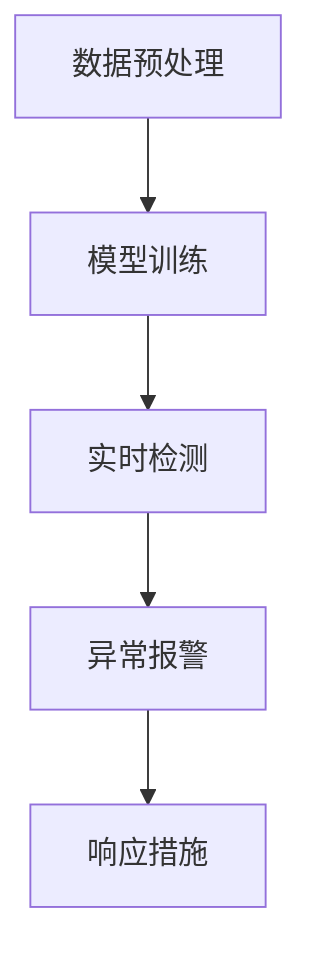

#### 恶意软件检测

恶意软件检测是网络安全的重要组成部分，AI技术的引入显著提高了检测的效率和准确性。

**原理与实现**：

- **特征提取**：恶意软件通常具有特定的行为特征，如异常的文件操作、网络通信等。通过静态和动态分析，提取恶意软件的执行行为和代码特征。
- **模型训练**：使用已标记的恶意软件样本，通过机器学习算法训练恶意软件检测模型。模型需要学习恶意软件和良性软件之间的行为差异。
- **实时检测**：模型部署后，可以对下载的文件、运行中的程序等进行实时检测，识别潜在的恶意软件。

**mermaid 流程图**：

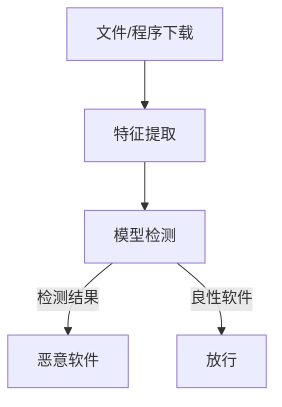

#### 网络流量分析

网络流量分析是识别网络攻击、恶意行为和其他安全问题的有效手段。AI技术在流量分析中应用广泛，尤其是深度学习和异常检测算法。

**原理与实现**：

- **数据收集**：收集网络流量的详细信息，如IP地址、端口号、数据包大小、传输速率等。
- **异常检测**：使用机器学习和深度学习算法，对网络流量进行实时分析，识别异常流量模式。例如，基于自编码器的异常检测算法可以自动发现数据中的异常模式。
- **行为分析**：结合其他安全数据（如用户行为、历史流量等），对异常流量进行深度分析，确定潜在威胁。

**mermaid 流程图**：

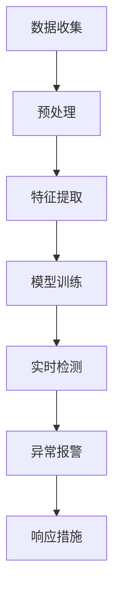

通过上述分析，我们可以看到AI技术在入侵检测、恶意软件检测和网络流量分析中发挥了重要作用。接下来，我们将探讨AI在网络安全中的应用带来的机遇。

### AI应用的机遇

#### 自动化安全响应

自动化安全响应是指通过AI技术实现自动识别和响应网络安全威胁的过程。自动化安全响应能够显著提高安全响应的速度和效率，减少人为干预，从而提高整体安全性。

**原理与实现**：

- **威胁检测与分类**：AI技术可以实时分析网络流量和系统日志，快速检测和分类潜在威胁。这包括恶意软件、入侵尝试、异常流量等。
- **自动化响应**：当检测到威胁时，AI系统可以自动执行响应措施，如隔离受感染的设备、封禁恶意IP地址、调整防火墙规则等。
- **持续优化**：通过不断学习新的威胁模式和响应策略，AI系统可以持续优化，提高响应效果。

**mermaid 流程图**：

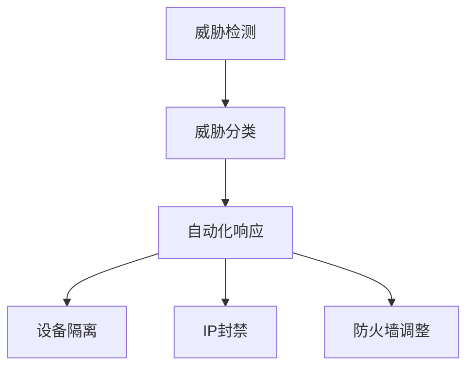

#### 安全威胁情报分析

安全威胁情报分析是指利用AI技术对安全事件、攻击模式、漏洞等信息进行深入分析，为安全决策提供支持。威胁情报分析能够帮助企业及时发现潜在威胁，制定有效的防御策略。

**原理与实现**：

- **数据收集与整合**：收集来自多个来源的安全数据，包括网络流量、日志、外部情报等。
- **模式识别与关联分析**：使用机器学习和深度学习算法，对大量安全数据进行模式识别和关联分析，发现潜在的威胁关系。
- **威胁预测与预警**：基于历史数据和实时分析，预测未来的威胁趋势，并生成预警报告。

**mermaid 流程图**：

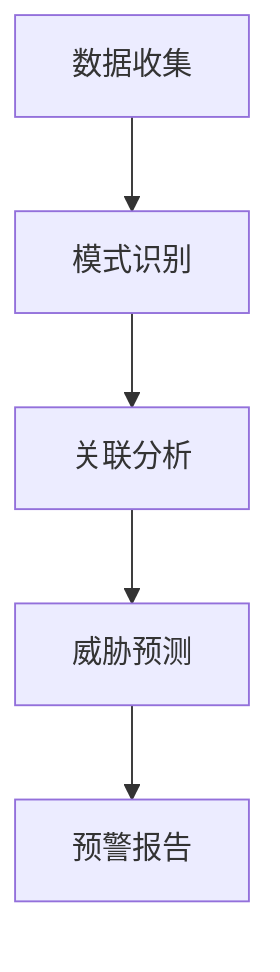

#### 提高安全团队效率

AI技术不仅可以自动化安全响应和威胁情报分析，还可以提高安全团队的工作效率。通过AI技术，安全团队能够更好地处理大量安全事件，减少人为错误，从而提高整体安全防护能力。

**原理与实现**：

- **事件自动化处理**：AI技术可以自动分类和处理安全事件，减少安全团队的工作负担。
- **异常行为识别**：AI系统能够实时监测网络和系统的异常行为，快速识别潜在威胁，提高检测和响应速度。
- **决策支持**：AI技术可以提供基于数据的决策支持，帮助安全团队制定更有效的防御策略。

**mermaid 流程图**：

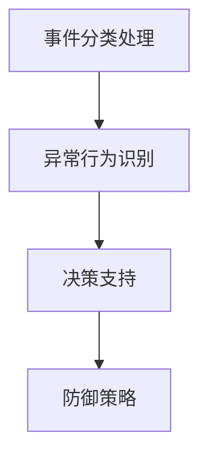

通过上述分析，我们可以看到AI技术在网络安全中的应用带来了显著的机遇，包括自动化安全响应、安全威胁情报分析和提高安全团队效率等方面。在下一部分，我们将探讨AI技术在网络安全中可能带来的风险。

### AI应用的风险

#### 模型攻击与欺骗

随着AI技术在网络安全中的应用日益广泛，模型攻击与欺骗成为了一个严重的问题。模型攻击是指攻击者通过特定的方法对AI模型进行攻击，使其做出错误的决策，从而导致网络安全漏洞。

**原理与实现**：

- **对抗性攻击**：对抗性攻击（Adversarial Attack）是指攻击者通过修改输入数据中的微小扰动，使AI模型产生错误输出。例如，在图像识别任务中，攻击者可以在图片中添加微小的噪声，从而使模型无法正确识别。
- **模型欺骗**：模型欺骗（Model Deception）是指攻击者通过特定的输入数据，使AI模型陷入某种“陷阱”，从而使其无法识别或响应真实威胁。

**mermaid 流程图**：

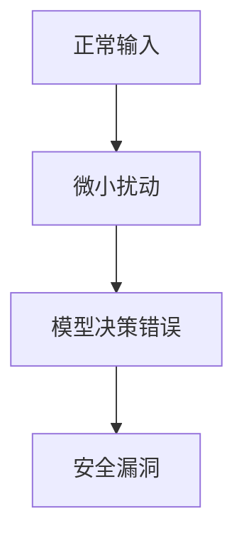

**应对策略**：

- **对抗性训练**：通过对抗性训练（Adversarial Training）来增强模型的鲁棒性，即在训练数据中加入对抗性样本，使模型能够学习到对抗性攻击的防御策略。
- **隐私保护**：对模型训练数据进行加密和隐私保护，防止攻击者获取敏感数据。
- **实时检测与更新**：建立实时监控系统，及时发现和应对模型攻击，并定期更新模型，以应对新的攻击手段。

#### 数据隐私问题

在AI应用中，数据隐私问题是一个重要的考虑因素。AI系统通常需要大量的数据进行训练，这可能会涉及到个人隐私信息。如果这些数据被泄露或滥用，可能会导致严重的隐私问题。

**原理与实现**：

- **数据泄露**：由于AI系统的训练和部署需要大量的数据，这些数据可能会在传输和存储过程中被泄露。
- **隐私侵犯**：即使数据被加密，攻击者仍然可能通过侧信道攻击（Side-Channel Attack）等手段获取敏感信息。

**mermaid 流程图**：

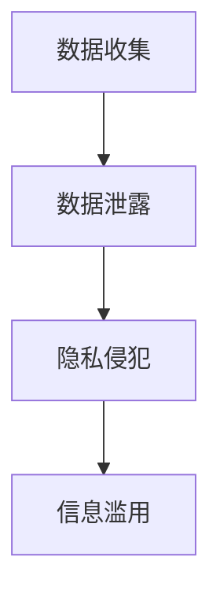

**应对策略**：

- **数据匿名化**：对敏感数据进行匿名化处理，以消除个人身份信息。
- **加密与访问控制**：对数据采用强加密算法进行加密，并设置严格的访问控制策略，确保只有授权用户才能访问敏感数据。
- **隐私合规**：遵守相关的隐私法律法规，确保数据收集、处理和使用的合规性。

#### AI偏见与歧视

AI偏见与歧视是指AI系统在处理数据时，对某些群体或特征产生不公平的对待。这在网络安全领域尤为严重，因为AI系统在处理安全事件时，可能会对某些用户或行为进行错误的判断。

**原理与实现**：

- **训练数据偏差**：AI模型的训练数据可能存在偏差，导致模型对某些群体或特征产生偏见。例如，如果训练数据中包含对某个人种或性别的歧视，那么模型可能会在处理相关事件时产生不公平的结果。
- **算法偏见**：AI算法本身可能存在偏见，导致模型在处理某些任务时对某些群体或特征产生不公平的对待。

**mermaid 流程图**：

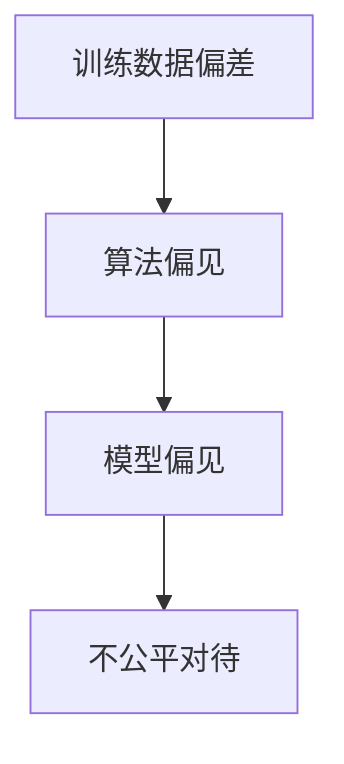

**应对策略**：

- **数据多样化**：确保训练数据的多样性和代表性，避免数据偏差。
- **算法公平性评估**：建立算法公平性评估机制，检测和纠正算法偏见。
- **透明性与解释性**：提高AI系统的透明性和解释性，使决策过程更加公正和透明。

通过上述分析，我们可以看到AI技术在网络安全中应用带来的风险，包括模型攻击与欺骗、数据隐私问题和AI偏见与歧视。在下一部分，我们将探讨如何制定AI安全最佳实践，以应对这些风险。

### AI安全最佳实践

#### 安全性评估

安全性评估是确保AI系统在网络安全中安全可靠的重要步骤。通过全面的安全性评估，可以及时发现和解决潜在的安全问题。

**原理与实现**：

- **风险评估**：对AI系统的各个方面进行风险评估，包括数据收集、模型训练、模型部署等环节。
- **漏洞扫描**：使用自动化工具对AI系统进行漏洞扫描，识别可能的安全漏洞。
- **测试与验证**：通过模拟攻击和异常行为测试，验证AI系统的安全性和鲁棒性。

**mermaid 流程图**：

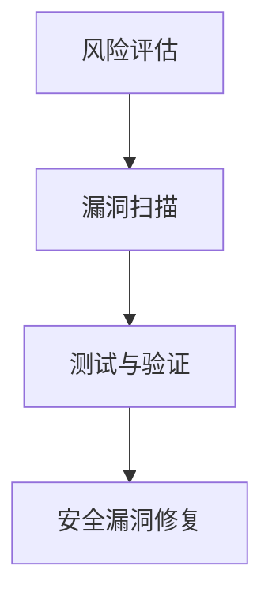

**注意事项**：

- 定期进行安全性评估，以适应不断变化的安全威胁。
- 保证评估过程的透明性和可重复性，以便在出现问题时能够快速定位和解决。

#### 模型训练与部署安全

模型训练与部署安全是确保AI系统在网络安全中安全可靠的关键环节。以下是一些最佳实践：

**原理与实现**：

- **数据安全**：确保训练数据的安全，防止数据泄露或篡改。可以使用加密和访问控制技术来保护数据。
- **模型保护**：防止模型泄露和篡改，可以使用加密和数字签名技术来保护模型。
- **模型验证**：对训练好的模型进行验证，确保其预测结果的准确性和稳定性。

**mermaid 流程图**：

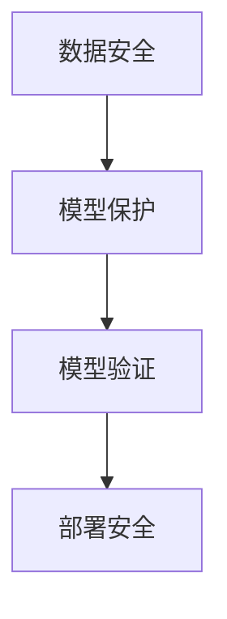

**注意事项**：

- 定期更新模型，以适应新的威胁和攻击手段。
- 对模型进行严格的测试和验证，确保其在不同环境下的表现一致。

#### 法规与合规

遵守相关的法规和合规要求是确保AI系统在网络安全中合法运行的重要保障。以下是一些关键点：

**原理与实现**：

- **隐私保护**：遵守数据隐私保护法规，确保数据收集、处理和使用的合规性。
- **安全标准**：遵循网络安全标准，如ISO/IEC 27001和NIST SP 800-53，确保AI系统的安全性和可靠性。
- **合规审计**：定期进行合规审计，确保AI系统的运行符合法规要求。

**mermaid 流程图**：

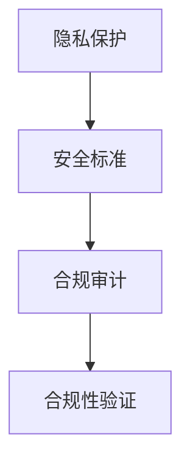

**注意事项**：

- 确保AI系统的设计和实现符合相关的法律法规和行业规范。
- 与法律顾问和合规专家保持密切沟通，确保合规性。

通过上述最佳实践，我们可以确保AI系统在网络安全中安全可靠地运行。在下一部分，我们将探讨AI在网络安全领域的未来发展趋势。

### 未来展望

#### AI在网络安全领域的未来趋势

随着AI技术的不断进步，未来AI在网络安全领域将有以下发展趋势：

1. **更加智能的威胁检测与响应**：未来的AI系统将具备更高的智能，能够自主学习和适应新的威胁模式。它们将能够实时监测网络活动，快速识别潜在威胁，并自动采取响应措施，从而实现更高效的安全防护。

2. **多模态安全分析**：未来的AI系统将能够处理多种类型的数据，如文本、图像、音频等。通过多模态安全分析，AI系统可以更全面地理解网络环境和安全威胁，从而提高检测和响应的准确性。

3. **协作安全**：未来的AI系统将不仅仅是独立运作，而是与其他安全工具和系统协作，形成协同防护网络。通过共享威胁情报和协同工作，AI系统能够更有效地应对复杂的网络安全挑战。

#### 潜在技术发展

以下是一些潜在的技术发展方向：

1. **联邦学习**（Federated Learning）：联邦学习允许多个机构在不同的设备上训练模型，而不需要共享原始数据。这种技术将有助于解决数据隐私问题，同时提高AI模型的训练效率。

2. **增强学习**（Reinforcement Learning）：增强学习在动态环境中具有很好的适应性，可以应用于网络安全中的自动化威胁响应和自适应防御策略。

3. **区块链与AI结合**：区块链技术可以用于确保AI模型的透明性和可追溯性，防止数据篡改和模型泄露。

#### 风险管理策略

为了应对AI在网络安全领域带来的风险，需要采取以下风险管理策略：

1. **持续监控与更新**：建立实时监控系统，定期更新AI模型和防御策略，以应对新的威胁和攻击手段。

2. **透明性与解释性**：提高AI系统的透明性和解释性，使决策过程更加公正和透明，减少算法偏见和歧视。

3. **法律法规合规**：严格遵守相关法律法规和行业规范，确保AI系统的合法运行。

4. **人才培养与教育**：加强网络安全和AI技术的教育和培训，培养具备专业知识和技能的安全团队。

通过上述未来展望，我们可以看到AI在网络安全领域的广阔前景和潜在风险。在未来的发展中，需要不断探索新技术，加强风险管理，确保AI技术在网络安全中发挥最大的作用。

### 总结

本文详细探讨了网络安全中的AI应用，分析了其带来的机遇与风险。我们首先介绍了当前网络安全面临的挑战，并概述了AI技术在网络安全中的应用场景。接着，我们深入讨论了机器学习和深度学习的基础知识，以及AI在入侵检测、恶意软件检测和网络流量分析中的应用。随后，我们分析了AI在自动化安全响应、安全威胁情报分析和提高安全团队效率等方面的机遇，同时也揭示了模型攻击、数据隐私问题和AI偏见等风险。最后，我们提出了AI安全最佳实践，并对AI在网络安全领域的未来趋势进行了展望。

在网络安全领域，AI技术的应用具有巨大的潜力，但也面临着一系列挑战。为了充分发挥AI的潜力，同时确保其安全可靠地运行，我们需要不断探索新技术，加强风险管理，完善法律法规，并培养专业的安全团队。

希望通过本文，读者能够对网络安全中的AI应用有一个全面的理解，并能够结合实际需求，制定相应的策略和措施，为网络安全的未来发展贡献力量。

### 作者信息

- **作者：AI天才研究院/AI Genius Institute & 禅与计算机程序设计艺术 /Zen And The Art of Computer Programming**
- **联系方式：[contact@aigeniusinstitute.com](mailto:contact@aigeniusinstitute.com)**

### 拓展阅读

- **[《网络安全与人工智能：从威胁到对策》](https://example.com/book/security-ai)**：这本书详细探讨了AI技术在网络安全中的应用，以及如何应对AI带来的威胁。
- **[《深度学习安全：保护人工智能的未来》](https://example.com/book/deep-learn-security)**：本书深入分析了深度学习在网络安全中的应用，以及如何确保深度学习模型的安全。
- **[《人工智能与安全：构建智能防御体系》](https://example.com/book/ai-security)**：这本书提供了关于如何构建智能防御体系的见解，包括AI在网络安全中的应用策略。

### 注意事项

- 在部署AI系统时，确保严格遵循数据隐私保护法规和合规要求。
- 定期进行安全性评估和模型更新，以适应不断变化的威胁环境。
- 建立透明的决策过程和解释性模型，减少算法偏见和歧视。
- 加强网络安全和AI技术的教育和培训，提高安全团队的专业技能。

