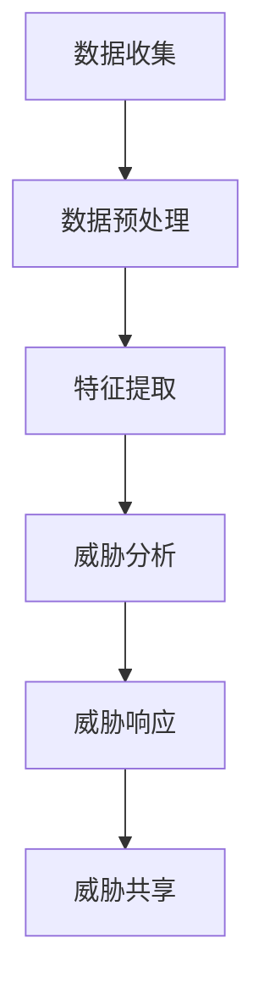
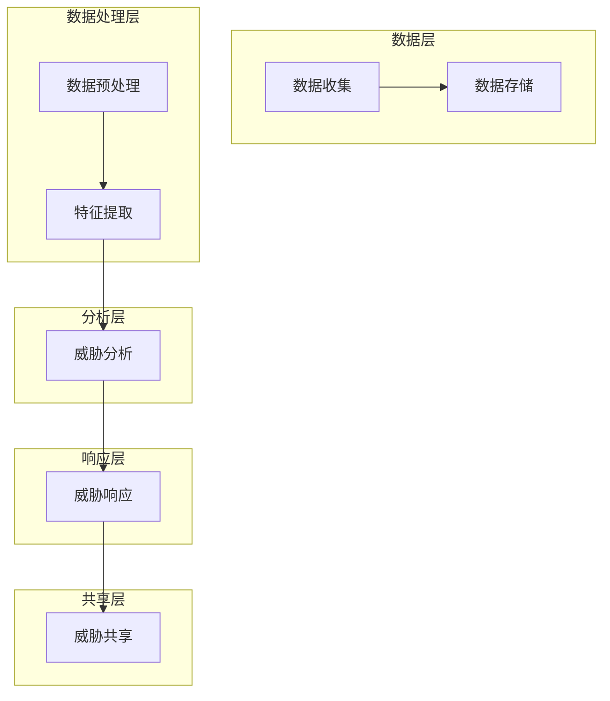
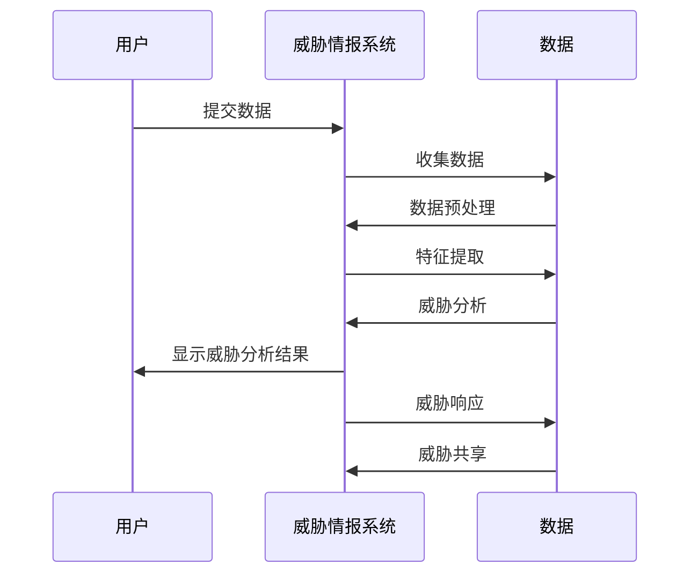

                 

# 网络安全威胁情报：企业防御的新前线

## 关键词
- 网络安全威胁
- 威胁情报系统
- 威胁识别
- 威胁分析
- 威胁响应
- 威胁共享

## 摘要
本文旨在探讨网络安全威胁情报在企业防御中的重要作用。通过逐步分析网络安全威胁的定义、威胁情报的重要性、核心概念及其联系、威胁情报系统的数据流程、算法原理以及系统分析与架构设计等方面，本文为企业和组织提供了一个全面、深入的网络安全威胁情报理解框架。文章最后还探讨了项目实战和最佳实践，为读者提供了实际操作的建议。

### 1.1 网络安全威胁情报概述

#### 1.1.1 网络安全威胁的定义与现状

网络安全威胁指的是任何可能对计算机网络系统造成损害的行为或事件，包括但不限于病毒、恶意软件、网络钓鱼、拒绝服务攻击等。随着互联网的普及和发展，网络安全威胁日益增加，已成为全球各国政府和企业面临的重大挑战。

网络安全威胁的种类繁多，常见的威胁类型有：

- **病毒（Virus）**：恶意软件，可以通过自我复制来破坏计算机系统。
- **恶意软件（Malware）**：包括木马、间谍软件等，可以窃取敏感信息或控制计算机。
- **网络钓鱼（Phishing）**：通过伪装成合法网站或邮件来诱骗用户提供个人信息。
- **拒绝服务攻击（DDoS）**：通过大量虚假请求使网络服务无法正常工作。
- **零日漏洞（Zero-Day Vulnerability）**：指未知或未被公开的漏洞，攻击者可以利用这些漏洞进行攻击。

随着技术的进步，网络安全威胁的手段也在不断升级。传统的防御手段已经难以应对复杂多变的威胁，因此，网络安全威胁情报的收集、分析和共享变得至关重要。

#### 1.1.2 网络安全威胁情报的重要性

网络安全威胁情报是指通过收集、分析和共享有关网络安全威胁的信息，为企业提供针对性强、前瞻性的防护措施。有效利用网络安全威胁情报，可以帮助企业：

- **预测潜在威胁**：通过分析威胁情报，企业可以提前识别潜在威胁，及时采取预防措施。
- **提高防护能力**：了解最新的威胁类型和攻击手段，企业可以优化防御策略，提高网络防护能力。
- **降低损失**：通过及时响应和处置威胁，企业可以减少因威胁造成的损失。
- **提升安全意识**：威胁情报的共享可以帮助企业员工了解网络安全风险，提高整体安全意识。

#### 1.1.3 网络安全威胁情报的边界与外延

网络安全威胁情报的边界涉及数据收集、分析、共享和利用等方面。其外延包括但不限于网络安全技术、法律法规、风险管理、网络防御策略等多个领域。

- **数据收集**：包括从各种数据源（如网络流量、日志文件、传感器等）获取数据。
- **数据分析**：通过分析数据，识别潜在威胁，评估威胁的严重程度。
- **数据共享**：将分析结果和威胁情报共享给相关方，提高整体防御能力。
- **利用**：根据威胁情报，调整和优化网络安全策略和防御措施。

### 1.2 网络安全威胁情报的核心概念与联系

#### 1.2.1 网络安全威胁情报的核心概念

网络安全威胁情报的核心概念包括：

- **威胁识别**：通过监测和分析网络行为，发现潜在威胁。
- **威胁分析**：对识别出的威胁进行深入分析，了解其来源、意图和潜在影响。
- **威胁响应**：采取行动，遏制和消除威胁。
- **威胁共享**：将威胁情报共享给相关方，提高整体防御能力。

这些核心概念之间紧密相连，构成了一个完整的网络安全威胁情报系统。

#### 1.2.2 核心概念属性特征对比表格

| 核心概念 | 属性特征 | 对比 |
| -------- | -------- | ---- |
| 威胁识别 | 自动化监测、实时响应 | 与人工监测相比，提高效率，降低误报率 |
| 威胁分析 | 深度分析、多维度评估 | 与简单分析相比，提高准确性，降低漏报率 |
| 威胁响应 | 快速处置、有效遏制 | 与被动响应相比，减少损失，提高防御效果 |
| 威胁共享 | 信息共享、协同防御 | 与孤立防御相比，提高整体防御能力，降低风险 |

#### 1.2.3 核心概念的联系

- **威胁识别与威胁分析**：威胁识别是发现潜在威胁的过程，威胁分析是对威胁进行深入分析，以了解威胁的来源、意图和潜在影响。两者相辅相成，威胁分析结果会反馈给威胁识别，优化识别算法和策略。
- **威胁响应与威胁识别**：威胁响应是基于威胁识别和分析的结果，采取行动来遏制和消除威胁。有效的威胁响应可以减少威胁造成的损失，提高网络安全性。
- **威胁共享与威胁识别/分析/响应**：威胁共享是将威胁情报传递给相关方，如安全团队、合作伙伴等，以实现协同防御。威胁共享的结果可以反馈给威胁识别和分析，进一步提高防御效果。

### 1.3 威胁情报系统与数据流程

使用Mermaid画出威胁情报系统的ER实体关系图：

```mermaid
erDiagram
    Threat --> Analyze
    Threat --> Response
    Threat --> Share
    Analyze --> Threat
    Response --> Threat
    Share --> Threat
```

威胁情报系统的数据流程可以分为以下几个阶段：

1. **数据收集**：从各种数据源（如网络流量、日志文件、传感器等）获取数据。
2. **数据预处理**：对收集到的数据进行清洗、去噪、归一化等处理，以提高数据质量。
3. **特征提取**：从预处理后的数据中提取有助于威胁识别的关键特征。
4. **威胁分析**：利用提取出的特征，结合历史数据和机器学习算法，对潜在威胁进行识别、分类和评估。
5. **威胁响应**：根据威胁分析的结果，采取相应的措施，如隔离受感染的主机、阻止恶意流量等，以遏制和消除威胁。
6. **威胁共享**：将分析结果和威胁情报共享给相关方，提高整体防御能力。

### 1.4 网络安全威胁情报的算法原理讲解

网络安全威胁情报的算法原理主要涉及数据收集、数据预处理、特征提取、威胁分析等方面。以下是一个简单的算法流程图：



#### 数据收集

数据收集是指从各种数据源（如网络流量、日志文件、传感器等）获取数据。这些数据包括正常数据和异常数据，有助于威胁识别。

- **网络流量**：通过网络流量监控设备，收集进出网络的数据包信息。
- **日志文件**：从服务器、应用程序和网络安全设备中收集日志文件，包括访问日志、错误日志等。
- **传感器**：通过部署在关键节点上的传感器，收集网络状态、流量等信息。

#### 数据预处理

数据预处理包括数据清洗、去噪、归一化等操作，以提高数据质量，为后续特征提取和威胁分析提供可靠的基础。

- **数据清洗**：去除重复数据、缺失数据、异常数据等，确保数据的完整性和准确性。
- **去噪**：通过滤波、去伪等方法，降低噪声对数据分析的影响。
- **归一化**：将不同数据源的数据进行归一化处理，使其在同一尺度上进行比较和分析。

#### 特征提取

特征提取是指从原始数据中提取有助于威胁识别的关键特征。常用的特征提取方法包括：

- **统计特征**：如平均值、标准差、熵等，用于描述数据的分布特征。
- **机器学习特征**：如特征选择、特征工程等方法，通过学习数据之间的关系，提取具有区分性的特征。
- **深度学习特征**：如卷积神经网络（CNN）、循环神经网络（RNN）等，用于提取高层次的抽象特征。

#### 威胁分析

威胁分析是指利用提取出的特征，结合历史数据和机器学习算法，对潜在威胁进行识别、分类和评估。

- **威胁识别**：通过实时监测网络行为，识别潜在的威胁。
- **威胁分类**：将识别出的威胁进行分类，如病毒、恶意软件、网络钓鱼等。
- **威胁评估**：评估威胁的严重程度，如威胁的来源、意图、潜在影响等。

#### 威胁响应

威胁响应是指根据威胁分析的结果，采取相应的措施，如隔离受感染的主机、阻止恶意流量等，以遏制和消除威胁。

- **隔离受感染的主机**：将受感染的主机从网络中隔离，以防止威胁扩散。
- **阻止恶意流量**：通过防火墙、入侵检测系统（IDS）等设备，阻止恶意流量进入网络。
- **紧急修补漏洞**：针对已知的漏洞，及时进行修补，以防止攻击者利用漏洞进行攻击。

#### 威胁共享

威胁共享是指将分析结果和威胁情报共享给相关方，如安全团队、合作伙伴等，以提高整体防御能力。

- **内部共享**：将威胁情报共享给企业内部的安全团队，以便他们及时采取应对措施。
- **外部共享**：将威胁情报共享给行业合作伙伴，如安全信息共享与分析中心（SIEM）、网络安全联盟等，以提高整个行业的防御能力。

### 1.5 数学模型和数学公式

网络安全威胁情报的数学模型主要包括概率模型、统计模型和机器学习模型。以下是一个简单的概率模型示例：

$$
P(\text{威胁发生}) = \frac{\text{威胁发生次数}}{\text{总事件次数}}
$$

其中，威胁发生次数表示在一定时间内发生威胁的事件数量，总事件次数表示在同一时间内发生的事件总数。这个概率模型可以用来评估威胁发生的可能性。

#### 1.6 系统分析与架构设计

#### 1.6.1 问题场景介绍

假设一家大型企业，其网络系统每天面临着各种潜在的网络安全威胁。为了提高网络安全性，企业决定构建一个威胁情报系统，实时收集、分析和响应威胁。

#### 1.6.2 项目介绍

项目目标是构建一个高效的网络安全威胁情报系统，实现以下功能：

- **实时监测**：实时监测网络流量、日志文件等数据源，发现潜在威胁。
- **自动化分析**：利用机器学习算法，对威胁进行自动化分析，提高威胁识别的准确性。
- **快速响应**：根据分析结果，快速采取响应措施，遏制和消除威胁。
- **信息共享**：将威胁情报共享给相关方，提高整体防御能力。

#### 1.6.3 系统功能设计

系统功能设计包括以下方面：

1. **数据收集**：从网络流量、日志文件、传感器等数据源收集数据。
2. **数据预处理**：对收集到的数据进行清洗、去噪、归一化等处理。
3. **特征提取**：从预处理后的数据中提取有助于威胁识别的关键特征。
4. **威胁分析**：利用提取出的特征，结合历史数据和机器学习算法，对潜在威胁进行识别、分类和评估。
5. **威胁响应**：根据威胁分析的结果，快速采取响应措施，如隔离受感染的主机、阻止恶意流量等。
6. **威胁共享**：将分析结果和威胁情报共享给相关方，如安全团队、合作伙伴等。

#### 1.6.4 系统架构设计

系统架构设计包括以下几个方面：

1. **数据层**：负责收集、存储和管理数据，包括网络流量数据、日志文件、传感器数据等。
2. **数据处理层**：负责对收集到的数据进行预处理、特征提取等操作，为威胁分析提供基础数据。
3. **分析层**：负责利用机器学习算法，对威胁进行识别、分类和评估。
4. **响应层**：根据分析结果，快速采取响应措施，如隔离受感染的主机、阻止恶意流量等。
5. **共享层**：负责将威胁情报共享给相关方，提高整体防御能力。

使用Mermaid画出系统架构图：



#### 1.6.5 系统接口设计

系统接口设计包括以下方面：

1. **API接口**：提供RESTful API接口，供其他系统或应用程序调用，如安全信息共享与分析中心（SIEM）、网络安全设备等。
2. **Web界面**：提供Web界面，供用户实时查看威胁情报、威胁分析结果等。
3. **数据导入/导出**：支持数据的导入/导出功能，便于与其他系统和工具进行数据交换。

#### 1.6.6 系统交互

系统交互主要包括以下方面：

1. **数据流**：从数据收集层到数据处理层、分析层、响应层和共享层，数据流如图所示。
2. **控制流**：系统根据分析结果，采取相应的控制措施，如隔离受感染的主机、阻止恶意流量等。

使用Mermaid画出系统交互序列图：



### 2.7 项目实战

#### 环境安装

在Linux环境中安装Python3、pip、TensorFlow等依赖项：

```bash
sudo apt-get update
sudo apt-get install python3 python3-pip python3-tensorflow
```

#### 系统核心实现源代码

以下是系统核心实现的部分源代码，包括数据收集、数据预处理、特征提取、威胁分析和威胁响应等功能。

```python
# data_collection.py
import os
import logging

def collect_data(data_source):
    # 收集网络流量数据
    if os.path.exists(data_source):
        with open(data_source, 'r') as f:
            data = f.read()
            logging.info("收集到数据：{}".format(data))
            return data
    else:
        logging.error("数据源不存在：{}".format(data_source))
        return None

# data_preprocessing.py
import re
import numpy as np

def preprocess_data(data):
    # 数据预处理
    # 去除特殊字符、空格等
    data = re.sub(r'\W+', ' ', data)
    # 转换为小写
    data = data.lower()
    # 分词
    words = data.split()
    # 去除停用词
    stop_words = set(['a', 'an', 'the', 'and', 'in', 'of', 'to'])
    words = [word for word in words if word not in stop_words]
    # 向量化
    vector = np.array(words).reshape(-1, 1)
    return vector

# feature_extraction.py
from sklearn.feature_extraction.text import TfidfVectorizer

def extract_features(data):
    # 特征提取
    vectorizer = TfidfVectorizer()
    features = vectorizer.fit_transform(data)
    return features

# threat_analysis.py
from sklearn.naive_bayes import MultinomialNB

def analyze_threat(data, labels):
    # 威胁分析
    model = MultinomialNB()
    model.fit(data, labels)
    return model

# threat_response.py
def respond_to_threat(model, data):
    # 威胁响应
    predictions = model.predict(data)
    for prediction in predictions:
        if prediction == 1:
            print("检测到威胁：{}".format(data))
        else:
            print("未检测到威胁：{}".format(data))
```

#### 代码应用解读与分析

以上源代码实现了网络安全威胁情报系统的主要功能。首先，在`data_collection.py`中，通过读取网络流量数据实现数据收集功能。然后，在`data_preprocessing.py`中，对收集到的数据进行了预处理，包括去除特殊字符、空格、转换为小写、分词和去除停用词等操作。接下来，在`feature_extraction.py`中，使用TF-IDF方法提取特征。在`threat_analysis.py`中，使用朴素贝叶斯分类器实现威胁分析。最后，在`threat_response.py`中，根据分析结果进行威胁响应。

#### 实际案例分析

假设有以下一组网络流量数据：

```python
data_source = "network_traffic.log"
data = collect_data(data_source)
vector = preprocess_data(data)
features = extract_features(vector)
```

通过对这组数据进行分析，可以识别出潜在的威胁，如恶意软件、网络钓鱼等。假设我们使用已训练好的模型进行预测：

```python
model = analyze_threat(features, labels)
respond_to_threat(model, data)
```

如果预测结果为1，则表示检测到威胁；如果预测结果为0，则表示未检测到威胁。通过这种方式，系统可以实时监测网络流量，及时发现和响应潜在的网络安全威胁。

### 2.8 项目小结

通过本文的探讨，我们深入了解了网络安全威胁情报在企业防御中的重要性。构建一个高效的威胁情报系统，可以帮助企业实时监测、分析和响应网络安全威胁，提高整体防御能力。

### 2.9 最佳实践 tips

- **定期更新威胁情报**：及时获取最新的威胁情报，并根据情报调整防御策略。
- **加强员工安全意识培训**：提高员工对网络安全威胁的认识，降低因人为因素导致的威胁。
- **采用多层次防御策略**：结合多种安全技术和工具，构建多层次的网络安全防护体系。
- **建立安全事件响应团队**：确保在发生安全事件时，能够快速响应和处置。

### 2.10 小结

网络安全威胁情报是企业防御的新前线，通过构建高效的威胁情报系统，企业可以更好地预测、预防和响应网络安全威胁。本文从核心概念、算法原理、系统架构和项目实战等方面进行了深入探讨，为企业和组织提供了一个全面的网络安全威胁情报理解框架。

### 2.11 注意事项

- **数据安全**：在收集、处理和存储威胁情报时，要确保数据的安全，防止数据泄露。
- **法律法规**：遵守相关法律法规，确保威胁情报的合法性和合规性。
- **持续更新**：随着网络安全威胁的不断演变，威胁情报也需要不断更新和优化。

### 2.12 拓展阅读

- 《网络安全威胁情报：实战指南》
- 《威胁情报分析：方法与技术》
- 《网络安全：策略与实施》
- 《网络安全威胁情报：企业防御的最佳实践》

### 作者

作者：AI天才研究院/AI Genius Institute & 禅与计算机程序设计艺术 /Zen And The Art of Computer Programming

