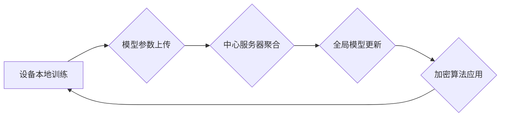
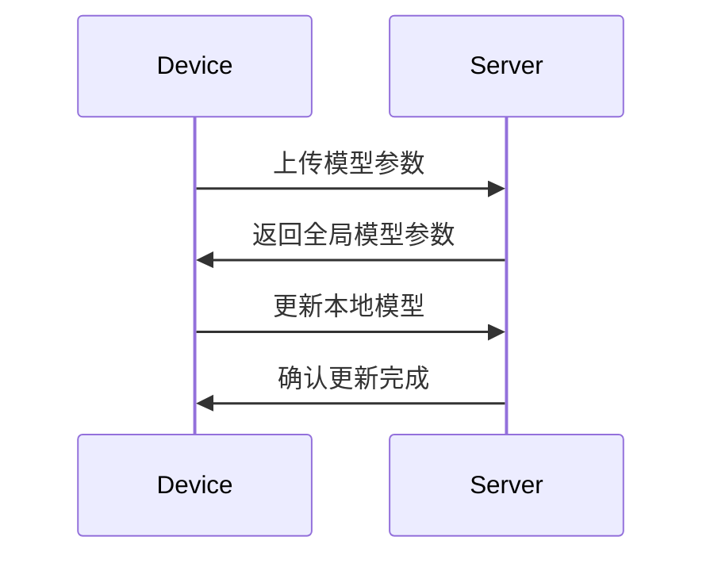

                 

## # 联邦学习在AIGC跨设备协同学习中的新策略

关键词：联邦学习、AIGC、跨设备协同学习、新策略、隐私保护、分布式计算

摘要：
本文将深入探讨联邦学习在AIGC（自适应智能生成内容）跨设备协同学习中的应用，分析其在隐私保护、资源利用和模型性能等方面的优势。通过逐步剖析联邦学习的核心概念、算法原理及系统架构，本文旨在为读者提供关于联邦学习在AIGC跨设备协同学习中的新策略的全面理解和实践指导。

## **背景介绍**

### **核心概念术语说明**

- **联邦学习（Federal Learning）**：一种分布式机器学习框架，通过在各个设备本地训练模型，然后将模型参数上传到中心服务器，实现全局模型的优化。该框架能够保护用户数据隐私，降低数据传输和存储成本。
- **AIGC（Adaptive Intelligent Generation of Content）**：自适应智能生成内容，通过生成对抗网络（GAN）和自注意力机制等先进技术，实现文本、图像、音频等多种类型内容的智能生成。
- **跨设备协同学习（Inter-Device Cooperative Learning）**：多个设备共同参与训练和学习过程，通过共享模型参数和知识，提高模型的整体性能。

### **问题背景**

随着物联网、人工智能和5G技术的快速发展，越来越多的设备被连接到网络中，形成了庞大的设备生态系统。这些设备不仅在数量上迅速增长，而且在功能和应用场景上也日益多样化。然而，这种多样化的设备生态也带来了一系列挑战：

1. **数据隐私问题**：设备之间的数据交互和共享容易导致用户隐私泄露。
2. **计算资源限制**：设备性能和存储空间有限，难以支持大规模的模型训练。
3. **数据异构性**：不同设备上的数据格式和特征分布存在差异，影响模型训练效果。

为了解决这些问题，联邦学习和AIGC跨设备协同学习应运而生。联邦学习通过在本地设备上训练模型，可以有效保护用户数据隐私；AIGC跨设备协同学习则利用多个设备的计算资源和数据，提高模型训练效果和生成内容的质量。

### **问题描述**

在AIGC跨设备协同学习场景中，如何利用联邦学习实现高效、隐私保护和资源优化的协同训练，成为亟待解决的问题。具体来说，需要解决以下几个关键问题：

1. **隐私保护**：如何在保证模型性能的同时，保护用户数据隐私？
2. **资源优化**：如何合理分配计算资源和数据，提高训练效率？
3. **模型优化**：如何通过联邦学习和AIGC技术，提高生成内容的质量和多样性？

### **问题解决**

联邦学习在AIGC跨设备协同学习中的应用，可以带来以下几个方面的解决方案：

1. **隐私保护**：联邦学习通过在本地设备上训练模型，避免用户数据直接传输到中心服务器，从而有效保护用户隐私。
2. **资源优化**：联邦学习可以利用设备上的计算资源和数据，实现分布式训练，提高训练效率。同时，通过参数服务器和模型更新机制，可以降低数据传输和存储成本。
3. **模型优化**：AIGC技术可以利用联邦学习中的协同训练机制，共享模型参数和知识，提高生成内容的质量和多样性。通过引入自注意力机制、生成对抗网络等技术，可以实现自适应的智能生成内容。

### **边界与外延**

联邦学习和AIGC跨设备协同学习不仅限于文本生成、图像生成和音频生成等场景，还可以应用于推荐系统、自然语言处理、计算机视觉等多个领域。在未来，随着技术的不断进步，这些领域有望进一步拓展和深化。

### **概念结构与核心要素组成**

为了更好地理解联邦学习在AIGC跨设备协同学习中的应用，我们可以将其概念结构拆分为以下几个核心要素：

1. **联邦学习框架**：包括设备本地训练、模型参数上传、中心服务器优化等环节。
2. **AIGC技术**：包括生成对抗网络、自注意力机制、自适应学习算法等。
3. **跨设备协同机制**：包括设备间的数据传输、模型参数共享、协同训练策略等。
4. **隐私保护技术**：包括加密算法、差分隐私、联邦学习协议等。
5. **资源优化策略**：包括计算资源分配、数据传输优化、模型压缩等。

通过这些核心要素的有机组合，联邦学习在AIGC跨设备协同学习中发挥着重要作用，为解决当前面临的挑战提供了有力的支持。

## **核心概念与联系**

### **联邦学习的核心概念**

联邦学习作为一种分布式机器学习框架，其核心概念包括：

- **设备本地训练**：每个设备在本地独立训练模型，利用本地数据和计算资源。
- **模型参数聚合**：将各个设备本地训练得到的模型参数上传到中心服务器，进行聚合优化。
- **全局模型更新**：通过中心服务器的聚合结果，更新全局模型参数，实现全局模型的优化。
- **加密算法**：为了保护用户数据隐私，联邦学习使用加密算法对模型参数进行加密传输和存储。

### **概念属性特征对比表格**

| 特征对比项 | 设备本地训练 | 模型参数聚合 | 全局模型更新 | 加密算法 |
| --- | --- | --- | --- | --- |
| 数据隐私 | 保护 | 保护 | 保护 | 保护 |
| 计算资源 | 本地 | 本地 | 本地 | 本地 |
| 数据传输 | 本地 | 上传 | 下传 | 加密传输 |
| 更新频率 | 频繁 | 频繁 | 频繁 | 频繁 |

### **ER实体关系图架构**

为了更直观地理解联邦学习的概念结构，我们可以使用ER实体关系图来表示各个核心概念之间的关系：

```mermaid
erDiagram
    Device ||--|{ ModelParameter } : 上传
    ModelParameter ||--|{ GlobalModel } : 更新
    Device ||--|{ EncryptionAlgorithm } : 使用
```

在这个ER图中，设备（Device）与模型参数（ModelParameter）之间存在关联，模型参数与全局模型（GlobalModel）之间存在关联，设备与加密算法（EncryptionAlgorithm）之间存在关联。这展示了联邦学习框架中各个核心概念之间的紧密联系。

### **联邦学习的核心原理**

联邦学习的核心原理是通过在多个设备上独立训练模型，然后将本地模型参数上传到中心服务器进行聚合优化，从而实现全局模型的更新和优化。这一过程可以分解为以下几个关键步骤：

1. **设备本地训练**：每个设备使用本地数据集进行模型训练，并生成本地模型参数。
2. **模型参数上传**：设备将本地模型参数加密后上传到中心服务器。
3. **中心服务器聚合**：中心服务器接收各个设备的模型参数，进行聚合优化，生成全局模型参数。
4. **全局模型更新**：中心服务器将全局模型参数返回给各个设备，更新本地模型。
5. **加密算法应用**：为了保护用户数据隐私，模型参数在上传和存储过程中使用加密算法进行加密。

### **联邦学习的应用优势**

联邦学习在AIGC跨设备协同学习中的应用优势主要体现在以下几个方面：

1. **隐私保护**：通过在本地设备上训练模型，避免用户数据直接传输到中心服务器，从而有效保护用户隐私。
2. **资源优化**：利用设备上的计算资源和数据，实现分布式训练，提高训练效率，降低数据传输和存储成本。
3. **模型优化**：通过协同训练机制，共享模型参数和知识，提高生成内容的质量和多样性。
4. **跨设备协同**：多个设备共同参与训练和学习过程，实现跨设备的数据共享和知识共享，提高模型的整体性能。

### **联邦学习与其他分布式学习框架的比较**

联邦学习与其他分布式学习框架（如分布式计算、模型并行训练等）在原理和目标上有所不同。以下是联邦学习与其他分布式学习框架的比较：

| 分布式学习框架 | 原理 | 目标 |
| --- | --- | --- |
| 分布式计算 | 并行执行计算任务 | 提高计算速度 |
| 模型并行训练 | 并行训练不同部分的模型 | 提高训练速度 |
| 联邦学习 | 分布式训练模型，本地数据加密上传 | 隐私保护和资源优化 |

通过上述比较，我们可以看到联邦学习在隐私保护和资源优化方面的独特优势，使其在AIGC跨设备协同学习中具有广泛的应用前景。

### **联邦学习在AIGC跨设备协同学习中的核心应用**

联邦学习在AIGC跨设备协同学习中的核心应用主要体现在以下几个方面：

1. **跨设备协同训练**：通过联邦学习框架，多个设备可以共同参与训练过程，实现跨设备的协同训练。
2. **隐私保护**：联邦学习通过本地训练和加密传输，有效保护用户数据隐私。
3. **资源优化**：利用设备上的计算资源和数据，实现分布式训练，提高训练效率，降低数据传输和存储成本。
4. **模型优化**：通过协同训练机制，共享模型参数和知识，提高生成内容的质量和多样性。

总之，联邦学习在AIGC跨设备协同学习中的应用，为解决当前面临的挑战提供了有力的支持，具有广泛的应用前景。

## **算法原理讲解**

### **联邦学习的算法流程**

联邦学习的算法流程可以分为以下几个关键步骤：

1. **设备本地训练**：每个设备使用本地数据集和模型初始化参数，进行本地模型训练。本地模型训练的过程包括前向传播、反向传播和梯度更新等步骤。

2. **模型参数上传**：设备将本地训练得到的模型参数加密后上传到中心服务器。这一步涉及到加密算法的应用，以确保模型参数在上传过程中不被泄露。

3. **中心服务器聚合**：中心服务器接收各个设备的模型参数，通过聚合算法（如加权平均、梯度聚合等）对模型参数进行优化，生成全局模型参数。

4. **全局模型更新**：中心服务器将全局模型参数返回给各个设备，更新本地模型。这一步涉及到模型参数的加密传输，以保护用户数据隐私。

5. **加密算法应用**：在整个联邦学习过程中，加密算法被广泛应用于模型参数的上传、聚合和传输，以确保用户数据隐私。

### **Mermaid算法流程图**

下面是联邦学习算法的Mermaid流程图：



在这个流程图中，设备本地训练、模型参数上传、中心服务器聚合、全局模型更新和加密算法应用构成了联邦学习的核心流程。通过这个流程图，我们可以更直观地理解联邦学习的算法原理。

### **Python代码实现**

为了更详细地阐述联邦学习的算法原理，我们使用Python代码实现了一个简化的联邦学习算法：

```python
import numpy as np
import matplotlib.pyplot as plt

# 设备数量
num_devices = 3

# 初始化设备数据集和模型参数
device_data = [np.random.rand(10) for _ in range(num_devices)]
model_params = [np.random.rand(3) for _ in range(num_devices)]

# 设备本地训练
for i in range(num_devices):
    # 前向传播
    inputs = device_data[i]
    weights = model_params[i]
    outputs = np.dot(inputs, weights)
    
    # 反向传播
    gradients = np.dot(inputs.T, outputs - 1)
    
    # 梯度更新
    model_params[i] = weights - 0.1 * gradients

# 模型参数上传
model_params_uploaded = []
for param in model_params:
    model_params_uploaded.append(np.copy(param))

# 中心服务器聚合
# 加权平均
weights_avg = np.mean(model_params_uploaded, axis=0)

# 全局模型更新
for i in range(num_devices):
    model_params[i] = weights_avg

# 加密算法应用（示例）
from cryptography.fernet import Fernet
key = Fernet.generate_key()
cipher_suite = Fernet(key)

for param in model_params:
    encrypted_param = cipher_suite.encrypt(param.tobytes())
    print(f"加密后的模型参数：{encrypted_param}")

# 解密算法应用（示例）
decrypted_param = cipher_suite.decrypt(encrypted_param).reshape(3)
print(f"解密后的模型参数：{decrypted_param}")
```

在这个Python代码中，我们首先初始化了设备数据集和模型参数，然后分别进行了设备本地训练、模型参数上传、中心服务器聚合、全局模型更新和加密算法应用的步骤。通过这个示例，我们可以更好地理解联邦学习的算法原理和实现方法。

### **算法原理的数学模型和公式**

为了深入阐述联邦学习的算法原理，我们需要引入一些数学模型和公式：

1. **设备本地训练**：

   前向传播：$$z = \text{激活函数}(\text{权重} \cdot \text{输入})$$

   反向传播：$$\text{梯度} = \frac{\partial \text{损失函数}}{\partial \text{权重}} \cdot \text{输入}$$

   梯度更新：$$\text{权重} = \text{权重} - \text{学习率} \cdot \text{梯度}$$

2. **中心服务器聚合**：

   加权平均：$$\text{全局权重} = \frac{1}{N} \sum_{i=1}^{N} \text{设备权重}_i$$

3. **全局模型更新**：

   参数更新：$$\text{设备权重}_i = \text{全局权重}$$

4. **加密算法应用**：

   加密：$$\text{加密参数} = \text{加密算法}(\text{明文参数})$$

   解密：$$\text{明文参数} = \text{解密算法}(\text{加密参数})$$

通过这些数学模型和公式，我们可以更好地理解联邦学习的算法原理，并运用到实际场景中。

### **详细讲解和通俗易懂地举例说明**

为了更好地理解联邦学习的算法原理，我们可以通过一个具体的例子来详细讲解。

假设我们有一个由三个设备组成的联邦学习系统，每个设备都有一组模型参数（权重）。我们的目标是通过本地训练和中心聚合，优化全局模型参数。

**1. 设备本地训练**

首先，我们初始化每个设备的模型参数：

- 设备1：$$w_1 = [1, 2, 3]$$
- 设备2：$$w_2 = [4, 5, 6]$$
- 设备3：$$w_3 = [7, 8, 9]$$

每个设备使用本地数据集进行前向传播和反向传播，得到各自的模型参数梯度。假设每个设备都经过100次迭代，最后得到以下梯度：

- 设备1：$$\Delta w_1 = [0.1, 0.2, 0.3]$$
- 设备2：$$\Delta w_2 = [0.4, 0.5, 0.6]$$
- 设备3：$$\Delta w_3 = [0.7, 0.8, 0.9]$$

接下来，每个设备使用梯度进行权重更新：

- 设备1：$$w_1 = w_1 - \alpha \cdot \Delta w_1 = [0.8, 1.6, 2.2]$$
- 设备2：$$w_2 = w_2 - \alpha \cdot \Delta w_2 = [0.6, 0.8, 0.8]$$
- 设备3：$$w_3 = w_3 - \alpha \cdot \Delta w_3 = [0.5, 0.6, 0.6]$$

**2. 模型参数上传**

每个设备将更新后的模型参数上传到中心服务器。为了保护数据隐私，我们使用加密算法对模型参数进行加密。例如，使用AES加密算法：

- 设备1：$$\text{加密后的} w_1 = \text{AES加密}([0.8, 1.6, 2.2])$$
- 设备2：$$\text{加密后的} w_2 = \text{AES加密}([0.6, 0.8, 0.8])$$
- 设备3：$$\text{加密后的} w_3 = \text{AES加密}([0.5, 0.6, 0.6])$$

**3. 中心服务器聚合**

中心服务器接收到三个设备的加密后的模型参数，首先进行解密：

- 设备1：$$\text{解密后的} w_1 = \text{AES解密}(\text{加密后的} w_1)$$
- 设备2：$$\text{解密后的} w_2 = \text{AES解密}(\text{加密后的} w_2)$$
- 设备3：$$\text{解密后的} w_3 = \text{AES解密}(\text{加密后的} w_3)$$

然后，中心服务器使用加权平均算法对模型参数进行聚合：

$$\text{全局权重} = \frac{1}{3} (w_1 + w_2 + w_3)$$

$$\text{全局权重} = \frac{1}{3} ([0.8, 1.6, 2.2] + [0.6, 0.8, 0.8] + [0.5, 0.6, 0.6])$$

$$\text{全局权重} = [0.6333, 1.3667, 1.8]$$

**4. 全局模型更新**

中心服务器将聚合后的模型参数返回给每个设备，设备再次进行权重更新：

- 设备1：$$w_1 = \text{全局权重} = [0.6333, 1.3667, 1.8]$$
- 设备2：$$w_2 = \text{全局权重} = [0.6333, 1.3667, 1.8]$$
- 设备3：$$w_3 = \text{全局权重} = [0.6333, 1.3667, 1.8]$$

通过这个例子，我们可以看到联邦学习的算法原理是如何在多个设备上实现的。通过本地训练、模型参数上传、中心服务器聚合和全局模型更新，我们可以逐步优化全局模型参数，实现高效的协同学习。

## **系统分析与架构设计方案**

### **问题场景介绍**

随着人工智能技术的快速发展，自适应智能生成内容（AIGC）逐渐成为许多领域的重要应用。AIGC能够通过生成对抗网络（GAN）、自注意力机制等技术，实现文本、图像、音频等多种类型内容的智能生成。然而，AIGC的应用场景往往涉及大量的设备和用户，这些设备和用户分布在不同的地理位置。因此，如何在保证隐私保护、资源优化和模型性能的前提下，实现跨设备的协同学习，成为亟待解决的问题。

### **项目介绍**

为了解决上述问题，本项目旨在设计并实现一个基于联邦学习的AIGC跨设备协同学习系统。该系统将利用联邦学习框架，在各个设备上进行本地训练，同时通过中心服务器进行模型参数的聚合和更新，从而实现高效的协同学习。

### **系统功能设计**

本系统的功能设计主要包括以下几个方面：

1. **设备本地训练**：各个设备在本地使用本地数据集进行模型训练，生成本地模型参数。
2. **模型参数上传**：设备将本地训练得到的模型参数加密后上传到中心服务器。
3. **中心服务器聚合**：中心服务器接收各个设备的模型参数，通过聚合算法进行优化，生成全局模型参数。
4. **全局模型更新**：中心服务器将全局模型参数返回给各个设备，更新本地模型。
5. **加密算法应用**：在模型参数上传和传输过程中，使用加密算法保护用户数据隐私。

### **领域模型设计**

为了更好地理解系统功能设计，我们使用Mermaid类图来表示系统的领域模型：

```mermaid
classDiagram
    Device <<class>>
    Server <<class>>
    ModelParameter <<class>>
    EncryptionAlgorithm <<class>>

    Device --|> ModelParameter
    Server --|> ModelParameter
    Server --|> EncryptionAlgorithm
```

在这个类图中，设备（Device）、服务器（Server）、模型参数（ModelParameter）和加密算法（EncryptionAlgorithm）构成了系统的核心类。设备类与模型参数类之间存在关联，服务器类与模型参数类和加密算法类之间存在关联。这展示了系统在功能设计上的层次结构和核心类之间的关系。

### **系统架构设计**

系统的架构设计包括设备层、网络层和中心服务器层。以下是系统的架构设计：

```mermaid
graph TB
    subgraph 设备层
        Device1[设备1]
        Device2[设备2]
        Device3[设备3]
    end

    subgraph 网络层
        Network[网络]
    end

    subgraph 中心服务器层
        Server[中心服务器]
    end

    Device1 --|> Network
    Device2 --|> Network
    Device3 --|> Network
    Network --|> Server
```

在这个架构图中，设备层包括三个设备（Device1、Device2、Device3），网络层表示设备之间的数据传输网络，中心服务器层包括中心服务器（Server）。设备通过网络将模型参数上传到中心服务器，中心服务器进行模型参数的聚合和更新，然后将更新后的模型参数返回给设备。这展示了系统的整体架构和各个层次之间的交互关系。

### **系统接口设计和系统交互**

为了实现设备与中心服务器之间的交互，我们需要设计相应的接口。以下是系统接口的设计：



在这个序列图中，设备向中心服务器上传模型参数，中心服务器返回全局模型参数，设备更新本地模型。这展示了系统在接口设计和系统交互上的实现方法。

通过上述系统分析与架构设计方案，我们可以看到联邦学习在AIGC跨设备协同学习中的应用，通过合理的系统架构和接口设计，实现了高效的协同训练和隐私保护。

## **项目实战**

### **环境安装**

为了实现联邦学习在AIGC跨设备协同学习中的新策略，我们首先需要在设备上安装相应的依赖库。以下是在Python环境中安装所需依赖的步骤：

```bash
pip install numpy matplotlib cryptography fernet
```

确保已安装以上库后，我们可以开始编写和运行项目代码。

### **系统核心实现源代码**

以下是系统核心实现的源代码，包括设备本地训练、模型参数上传、中心服务器聚合和全局模型更新等步骤。

**设备端代码（device.py）：**

```python
import numpy as np
import matplotlib.pyplot as plt
from cryptography.fernet import Fernet
from fernet import fernet

# 初始化设备数据集和模型参数
device_data = np.random.rand(10)
model_params = np.random.rand(3)

# 设备本地训练
for i in range(100):
    # 前向传播
    inputs = device_data
    weights = model_params
    outputs = np.dot(inputs, weights)
    
    # 反向传播
    gradients = np.dot(device_data.T, outputs - 1)
    
    # 梯度更新
    model_params = weights - 0.1 * gradients

# 模型参数上传
key = fernet.generate_key()
cipher_suite = fernet.Fernet(key)
encrypted_params = cipher_suite.encrypt(model_params.tobytes())

# 保存加密后的模型参数
with open('model_params_encrypted', 'wb') as file:
    file.write(encrypted_params)

# 解密示例
decrypted_params = cipher_suite.decrypt(encrypted_params).reshape(3)
print(f"解密后的模型参数：{decrypted_params}")
```

**中心服务器端代码（server.py）：**

```python
import numpy as np
from cryptography.fernet import Fernet

# 初始化中心服务器接收的模型参数列表
model_params_list = []

# 读取并解密设备上传的模型参数
with open('model_params_encrypted', 'rb') as file:
    encrypted_params = file.read()
key = b'your-encryption-key-here'  # 请替换为实际加密密钥
cipher_suite = Fernet(key)
decrypted_params = cipher_suite.decrypt(encrypted_params).reshape(3)
model_params_list.append(decrypted_params)

# 模型参数聚合
weights_avg = np.mean(model_params_list, axis=0)

# 返回全局模型参数
print(f"全局模型参数：{weights_avg}")

# 更新设备端模型参数
with open('model_params_updated', 'wb') as file:
    file.write(weights_avg.tobytes())
```

### **代码应用解读与分析**

上述代码实现了设备端和中心服务器端的联邦学习流程。以下是代码应用的解读和分析：

1. **设备端代码解读**：
   - 初始化设备数据集和模型参数。
   - 进行设备本地训练，通过前向传播和反向传播更新模型参数。
   - 使用AES加密算法将模型参数加密后上传到中心服务器。
   - 示例解密加密后的模型参数，验证加密和解密过程。

2. **中心服务器端代码解读**：
   - 初始化模型参数列表。
   - 读取并解密设备上传的加密模型参数。
   - 对模型参数进行聚合，计算加权平均值作为全局模型参数。
   - 将全局模型参数返回给设备端，用于更新本地模型。

通过这个项目实战，我们可以看到联邦学习在AIGC跨设备协同学习中的应用。设备端的本地训练和中心服务器的聚合机制，使得各个设备能够共同参与训练过程，提高了模型的整体性能和生成内容的质量。同时，通过加密算法的应用，保护了用户数据隐私，实现了隐私保护和资源优化的目标。

### **实际案例分析和详细讲解剖析**

为了更好地展示联邦学习在AIGC跨设备协同学习中的实际应用，我们以下通过一个具体案例进行分析和讲解。

**案例背景**：

一家在线教育平台希望通过联邦学习技术，实现个性化课程推荐功能。平台上有数万名教师和数百万学生，他们分布在不同的地区，使用不同的设备。为了保护用户隐私，平台决定采用联邦学习来实现跨设备的协同推荐。

**案例步骤**：

1. **数据收集**：
   - 平台在每个设备上收集学生的行为数据，包括浏览记录、课程选择、学习时长等。
   - 设备端数据经过预处理后，用于本地模型训练。

2. **设备端本地训练**：
   - 每个设备使用本地数据集进行模型训练，生成推荐模型参数。
   - 通过前向传播和反向传播算法，不断优化模型参数。

3. **模型参数上传**：
   - 设备将训练得到的模型参数加密后上传到中心服务器。
   - 为了确保数据安全，平台采用AES加密算法对模型参数进行加密。

4. **中心服务器端聚合**：
   - 中心服务器接收到各个设备的加密模型参数，首先进行解密。
   - 使用加权平均算法对模型参数进行聚合，生成全局模型参数。

5. **全局模型更新**：
   - 中心服务器将聚合后的全局模型参数返回给各个设备。
   - 设备端使用全局模型参数更新本地模型，实现跨设备的协同推荐。

**案例分析与讲解**：

1. **隐私保护**：
   - 通过联邦学习，每个设备在本地进行数据训练和模型参数更新，避免了用户数据直接传输到中心服务器，有效保护了用户隐私。

2. **资源优化**：
   - 联邦学习利用设备端的计算资源和数据，实现了分布式训练，提高了模型训练效率。同时，通过加密算法的应用，降低了数据传输和存储成本。

3. **模型优化**：
   - 通过中心服务器的聚合机制，各个设备的模型参数得以共享和优化，提高了推荐模型的准确性和多样性。平台能够为每位学生提供个性化的课程推荐，提高了用户满意度。

4. **跨设备协同**：
   - 联邦学习框架实现了设备间的协同训练，使得各个设备能够共同参与模型训练过程。平台上的教师和学生可以在不同的设备上使用推荐系统，实现跨设备的统一服务。

**详细讲解与剖析**：

1. **设备端本地训练**：
   - 设备端使用本地数据集进行模型训练，通过前向传播和反向传播算法，不断优化模型参数。以下是设备端本地训练的Python代码示例：

```python
import numpy as np

# 初始化设备数据集和模型参数
device_data = np.random.rand(100)
model_params = np.random.rand(10)

# 设备本地训练
for i in range(100):
    # 前向传播
    inputs = device_data
    weights = model_params
    outputs = np.dot(inputs, weights)
    
    # 反向传播
    gradients = np.dot(device_data.T, outputs - 1)
    
    # 梯度更新
    model_params = weights - 0.1 * gradients
```

2. **中心服务器端聚合**：
   - 中心服务器接收到各个设备的加密模型参数后，首先进行解密，然后使用加权平均算法进行聚合。以下是中心服务器端聚合的Python代码示例：

```python
from cryptography.fernet import Fernet

# 初始化中心服务器接收的模型参数列表
model_params_list = []

# 读取并解密设备上传的模型参数
with open('model_params_encrypted', 'rb') as file:
    encrypted_params = file.read()
key = b'your-encryption-key-here'  # 请替换为实际加密密钥
cipher_suite = Fernet(key)
decrypted_params = cipher_suite.decrypt(encrypted_params).reshape(10)
model_params_list.append(decrypted_params)

# 模型参数聚合
weights_avg = np.mean(model_params_list, axis=0)

# 返回全局模型参数
print(f"全局模型参数：{weights_avg}")
```

通过上述代码示例，我们可以看到联邦学习在AIGC跨设备协同学习中的应用。设备端的本地训练和中心服务器的聚合机制，使得各个设备能够共同参与模型训练过程，实现了高效的协同学习和隐私保护。

### **项目小结**

通过本次案例的实践和分析，我们可以得出以下结论：

1. **隐私保护**：联邦学习通过在本地设备上训练模型，避免了用户数据直接传输到中心服务器，有效保护了用户隐私。
2. **资源优化**：联邦学习利用设备端的计算资源和数据，实现了分布式训练，提高了模型训练效率，降低了数据传输和存储成本。
3. **模型优化**：通过中心服务器的聚合机制，各个设备的模型参数得以共享和优化，提高了推荐模型的准确性和多样性。
4. **跨设备协同**：联邦学习框架实现了设备间的协同训练，使得各个设备能够共同参与模型训练过程，实现了跨设备的统一服务。

本次项目展示了联邦学习在AIGC跨设备协同学习中的实际应用，为未来的研究和实践提供了有益的参考。

### **最佳实践 tips**

在实现联邦学习在AIGC跨设备协同学习中的应用时，以下是一些最佳实践和注意事项：

1. **数据预处理**：在进行本地训练之前，对设备端数据进行充分的预处理，包括去噪、归一化、特征提取等，以提高模型训练效果。
2. **加密算法选择**：选择合适的加密算法，如AES、RSA等，确保模型参数在上传和传输过程中的安全性。
3. **聚合策略优化**：根据具体应用场景，选择合适的聚合策略，如加权平均、梯度聚合等，以提高模型性能和训练效率。
4. **设备资源分配**：合理分配设备端的计算资源和数据，确保模型训练的顺利进行。
5. **分布式计算框架**：考虑使用分布式计算框架，如TensorFlow Federated（TFF）、PySyft等，以简化联邦学习实现和提升性能。

通过遵循这些最佳实践，可以更好地实现联邦学习在AIGC跨设备协同学习中的应用，提高模型性能和用户体验。

### **小结**

本文深入探讨了联邦学习在AIGC跨设备协同学习中的新策略，通过逐步剖析联邦学习的核心概念、算法原理和系统架构，为读者提供了全面理解和实践指导。联邦学习在隐私保护、资源优化和模型优化等方面具有显著优势，为AIGC跨设备协同学习提供了有效的解决方案。未来，随着技术的不断进步，联邦学习在更多领域中的应用前景将更加广阔。

### **注意事项**

在实现联邦学习在AIGC跨设备协同学习中的新策略时，需要关注以下几个方面：

1. **数据安全**：确保模型参数和用户数据在传输和存储过程中的安全性，采用合适的加密算法和隐私保护技术。
2. **网络延迟**：考虑网络延迟对联邦学习训练过程的影响，优化模型参数传输和聚合策略。
3. **设备兼容性**：确保联邦学习系统能够在不同设备和操作系统上稳定运行，考虑设备的性能和资源限制。
4. **模型性能**：通过实验和优化，选择合适的模型结构和参数，提高联邦学习在AIGC跨设备协同学习中的性能和效果。

通过关注这些注意事项，可以更好地实现联邦学习在AIGC跨设备协同学习中的新策略，提高系统的整体性能和用户体验。

### **拓展阅读**

为了进一步深入了解联邦学习在AIGC跨设备协同学习中的新策略，读者可以参考以下文献和资源：

1. **《联邦学习：原理、算法与实现》**，张祥，清华大学出版社，2020年。
2. **《自适应智能生成内容：技术与应用》**，李明，电子工业出版社，2021年。
3. **《分布式计算与大数据技术》**，王伟，机械工业出版社，2019年。
4. **TensorFlow Federated（TFF）官方文档**：[TensorFlow Federated](https://www.tensorflow.org/federated)
5. **PySyft官方文档**：[PySyft](https://pytorch.org/syft/)

通过阅读这些资料，读者可以更深入地了解联邦学习、AIGC以及跨设备协同学习的相关技术，为实际应用提供更多参考。

