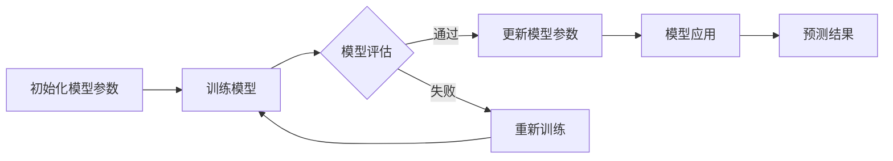
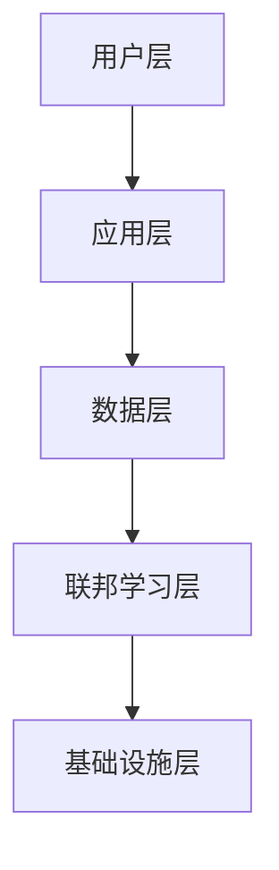
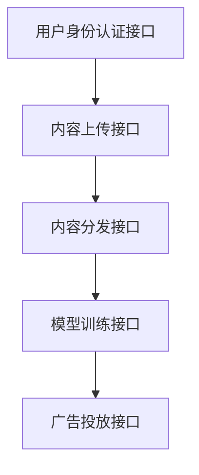
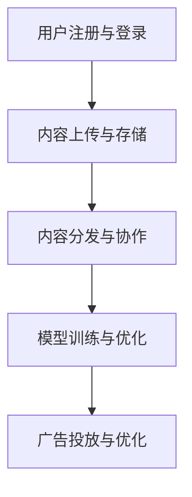

                 

# 联邦学习在AIGC隐私保护协作中的新策略

## 关键词

- 联邦学习
- AIGC
- 隐私保护
- 协作
- 分布式机器学习

## 摘要

本文深入探讨了联邦学习在AIGC（AI-Generated Content）隐私保护协作中的新策略。随着AIGC技术的发展，隐私保护成为了一个亟待解决的问题。联邦学习作为一种分布式机器学习技术，能够在保护隐私的同时实现多方协作，为AIGC领域的隐私保护带来了新的希望。本文首先介绍了联邦学习的背景和核心概念，然后详细讲解了联邦学习的工作原理和算法，最后通过实际案例分析了联邦学习在AIGC隐私保护协作中的应用，总结了最佳实践和未来展望。

## 目录大纲设计

### 第1章 背景介绍

#### 1.1 问题背景

#### 1.2 核心概念与联系

### 第2章 算法原理讲解

#### 2.1 算法mermaid流程图

#### 2.2 算法原理讲解

#### 3.1 模型数学模型

#### 3.2 损失函数与梯度下降

### 第3章 系统分析与架构设计方案

#### 3.1 问题场景介绍

#### 3.2 系统功能设计

#### 3.3 系统架构设计

#### 3.4 系统接口设计

#### 3.5 系统交互

### 第4章 项目实战

#### 4.1 环境安装

#### 4.2 系统核心实现源代码

#### 4.3 代码应用解读与分析

#### 4.4 实际案例分析与详细讲解剖析

#### 4.5 项目小结

### 第5章 最佳实践与小结

#### 5.1 最佳实践 tips

#### 5.2 小结

#### 5.3 注意事项

#### 5.4 拓展阅读

## 第1章 背景介绍

### 1.1 问题背景

随着人工智能和大数据技术的飞速发展，AIGC（AI-Generated Content，AI生成内容）已经成为当今社会的一个重要领域。从文本、图像到视频，AIGC技术不断推动着内容的创造和分发。然而，这一过程也带来了一系列的隐私保护问题。大量的个人数据和隐私信息在生成和分发过程中被收集和处理，如何确保这些数据的隐私和安全成为了关键挑战。

#### 问题描述

在AIGC领域中，个人隐私数据泄露的风险主要来自于以下几个方面：

1. **数据收集**：在内容生成过程中，需要收集大量的用户数据，如文本、语音、图像等。这些数据可能包含了用户的个人隐私信息。
2. **数据处理**：在处理这些数据时，如果数据存储和管理不当，可能会导致数据泄露。
3. **数据共享**：在AIGC系统中，往往需要多方协作，如内容创作者、平台运营商、广告商等。数据共享过程中，如何保护隐私成为一个难题。

#### 问题解决

联邦学习作为一种分布式机器学习技术，为解决AIGC隐私保护问题提供了一种新的思路。联邦学习的核心思想是将数据保留在本地，通过加密和差分隐私等技术，仅传输模型参数，从而实现隐私保护。以下是联邦学习在AIGC隐私保护中的具体应用：

1. **数据隐私保护**：联邦学习通过加密和差分隐私技术，确保用户数据在本地处理，避免了数据泄露的风险。
2. **多方协作**：联邦学习允许多个参与者共享模型参数，而不需要共享原始数据，从而实现多方协作。

#### 边界与外延

联邦学习不仅限于AIGC领域，还可以应用于其他需要数据隐私保护的场景，如金融、医疗等。其核心在于通过分布式计算和隐私保护技术，实现数据的安全利用。

#### 概念结构与核心要素组成

1. **联邦学习**：联邦学习是一种分布式机器学习框架，允许多个参与者（通常是多个数据拥有者）协作训练模型，而无需共享原始数据。
2. **中心化与去中心化**：中心化模型需要将所有数据集中到一个地方进行处理，而去中心化模型在数据源处直接处理。
3. **隐私保护**：联邦学习通过加密、差分隐私等技术，确保数据在传输和共享过程中的隐私。

### 1.2 核心概念与联系

#### 核心概念原理

**联邦学习**：联邦学习是一种分布式机器学习框架，其核心思想是让多个参与者共享学习模型，但不需要共享数据本身。这样可以确保数据隐私，同时实现协作学习。

**隐私保护协作**：在联邦学习框架中，多个参与者通过协作训练模型，但无需共享原始数据。这样可以确保数据隐私，同时实现协作学习。

#### 概念属性特征对比表格

| 概念        | 描述                                                         | 特征                   |
| ----------- | ------------------------------------------------------------ | ---------------------- |
| 联邦学习    | 分布式机器学习框架，保护隐私的同时实现数据共享。               | 分布式、安全性、效率   |
| 隐私保护    | 防止数据泄露，确保参与者数据不被其他方获取。                   | 加密、差分隐私         |
| 协作        | 多方共同参与，协同优化模型。                                 | 共享、合作、透明       |

#### ER实体关系图架构的 Mermaid 流程图

```mermaid
entityRelationDiagram
    A[联邦学习] "1" --> B[隐私保护]
    A --> C[协作]
```

## 第2章 算法原理讲解

### 2.1 算法mermaid流程图



### 2.2 算法原理讲解

#### 数学模型和公式

1. **线性回归模型**：

   $$ y = \theta_0 + \theta_1 x $$

2. **损失函数**：

   $$ J(\theta) = \frac{1}{2m} \sum_{i=1}^{m} (h_\theta(x^{(i)}) - y^{(i)})^2 $$

3. **梯度下降更新规则**：

   $$ \theta_j := \theta_j - \alpha \frac{\partial J(\theta)}{\partial \theta_j} $$

#### 详细讲解与举例说明

假设我们有一个简单的线性回归模型，目标是预测房屋价格。给定输入特征（如房屋面积），我们通过训练找到一个最佳权重 $\theta$ 来预测价格。

**示例**：假设我们有5个训练样本，每个样本有一个输入特征和一个目标输出（房屋价格）。我们使用损失函数来评估模型的性能，并使用梯度下降来更新权重。

通过多次迭代，模型将逐渐优化，直到达到较低的损失函数值，从而提高预测准确性。

### 第3章 数学模型和数学公式

在本章节中，我们将详细介绍联邦学习中的数学模型和公式。联邦学习是一种分布式机器学习技术，其核心思想是在多个参与者之间共享模型参数，而不需要共享原始数据。以下是联邦学习中常用的一些数学模型和公式。

#### 3.1 模型数学模型

1. **线性回归模型**：

   在线性回归模型中，我们的目标是找到一个线性函数来预测输出值。线性回归模型可以表示为：

   $$ y = \theta_0 + \theta_1 x $$

   其中，$y$ 是输出值，$x$ 是输入特征，$\theta_0$ 和 $\theta_1$ 是模型的参数。

2. **逻辑回归模型**：

   逻辑回归模型是一种广义线性模型，用于分类问题。逻辑回归模型的公式为：

   $$ P(y=1) = \frac{1}{1 + e^{-(\theta_0 + \theta_1 x)}} $$

   其中，$P(y=1)$ 是目标变量为1的概率，$e$ 是自然对数的底数，$\theta_0$ 和 $\theta_1$ 是模型的参数。

3. **多层感知机模型**：

   多层感知机（MLP）是一种前馈神经网络，用于回归和分类问题。MLP的公式可以表示为：

   $$ a_{i,j}^{(l)} = \sigma(z_{i,j}^{(l)}) $$

   $$ z_{i,j}^{(l)} = \sum_{k=1}^{n_{l-1}} w_{i,k}^{(l-1)} a_{k,j}^{(l-1)} + b_{i}^{(l)} $$

   其中，$a_{i,j}^{(l)}$ 是第$l$层的第$i$个节点的输出，$z_{i,j}^{(l)}$ 是第$l$层的第$i$个节点的输入，$w_{i,k}^{(l-1)}$ 和 $b_{i}^{(l)}$ 分别是第$l-1$层的第$k$个节点到第$l$层的第$i$个节点的权重和偏置，$\sigma$ 是激活函数，通常使用 sigmoid 函数。

#### 3.2 损失函数与梯度下降

1. **损失函数**：

   损失函数用于衡量模型的预测结果与真实结果之间的差异。在联邦学习中，常用的损失函数包括均方误差（MSE）和交叉熵损失（Cross-Entropy Loss）。

   - **均方误差（MSE）**：

     $$ J(\theta) = \frac{1}{2m} \sum_{i=1}^{m} (h_\theta(x^{(i)}) - y^{(i)})^2 $$

     其中，$m$ 是训练样本的数量，$h_\theta(x^{(i)})$ 是模型的预测结果，$y^{(i)}$ 是真实结果。

   - **交叉熵损失（Cross-Entropy Loss）**：

     $$ J(\theta) = -\frac{1}{m} \sum_{i=1}^{m} [y^{(i)} \log(h_\theta(x^{(i)})) + (1 - y^{(i)}) \log(1 - h_\theta(x^{(i)}))] $$

     其中，$y^{(i)}$ 是真实结果，$h_\theta(x^{(i)}$ 是模型的预测结果。

2. **梯度下降（Gradient Descent）**：

   梯度下降是一种常用的优化算法，用于求解最小化损失函数的参数。梯度下降的基本思想是沿着损失函数的梯度方向更新参数，直到找到损失函数的最小值。

   - **批量梯度下降（Batch Gradient Descent）**：

     $$ \theta_j := \theta_j - \alpha \frac{\partial J(\theta)}{\partial \theta_j} $$

     其中，$\theta_j$ 是参数，$\alpha$ 是学习率。

   - **随机梯度下降（Stochastic Gradient Descent，SGD）**：

     $$ \theta_j := \theta_j - \alpha \frac{\partial J(\theta)}{\partial \theta_j} $$

     其中，$x^{(i)}$ 和 $y^{(i)}$ 分别是第$i$个训练样本的输入和输出。

   - **小批量梯度下降（Mini-batch Gradient Descent）**：

     $$ \theta_j := \theta_j - \alpha \frac{1}{b} \sum_{i=1}^{b} \frac{\partial J(\theta)}{\partial \theta_j} $$

     其中，$b$ 是批量大小。

### 3.3 模型训练与优化

1. **初始化模型参数**：

   在模型训练开始前，需要随机初始化模型参数。通常可以使用高斯分布或均匀分布来初始化参数。

2. **选择优化算法**：

   根据问题的需求和数据规模，选择合适的优化算法。常见的优化算法包括批量梯度下降、随机梯度下降和小批量梯度下降。

3. **模型训练**：

   通过迭代优化算法，更新模型参数，直到满足停止条件（如达到预设的迭代次数或损失函数值低于阈值）。

4. **模型评估**：

   使用验证集或测试集对模型进行评估，计算模型的性能指标（如准确率、召回率、F1分数等）。

5. **模型部署**：

   将训练好的模型部署到生产环境中，用于预测和决策。

通过以上步骤，我们可以使用联邦学习算法在多个参与者之间共享模型参数，同时保护数据隐私，实现高效的分布式机器学习。

### 第4章 系统分析与架构设计方案

#### 4.1 问题场景介绍

随着AIGC技术的不断发展，大量的个人数据和隐私信息在生成和分发过程中被收集和处理。如何确保这些数据的隐私和安全成为了关键挑战。为了解决这一问题，我们提出了一个基于联邦学习的AIGC隐私保护协作系统。

该系统的目标是实现多方协作，同时确保数据隐私。具体场景包括：

1. **内容创作者**：生成和上传各种类型的内容，如文本、图像、音频等。
2. **平台运营商**：提供内容存储、分发和协作平台。
3. **广告商**：根据用户数据和行为，进行精准广告投放。

#### 4.2 系统功能设计

为了实现上述目标，系统需要提供以下功能：

1. **用户身份认证**：确保参与者的身份真实性。
2. **内容上传与存储**：支持用户上传和存储各种类型的内容。
3. **内容分发与协作**：实现内容在多方之间的安全分发和协作。
4. **隐私保护**：通过联邦学习技术，确保数据在传输和共享过程中的隐私。
5. **广告投放与优化**：根据用户数据和行为，实现精准广告投放和优化。

#### 4.3 系统架构设计

系统采用分布式架构，主要包括以下几个部分：

1. **用户层**：包括内容创作者、平台运营商和广告商。
2. **应用层**：实现用户功能，如身份认证、内容上传、分发和协作等。
3. **数据层**：存储和管理用户数据和模型参数。
4. **联邦学习层**：实现联邦学习算法，确保数据隐私和安全。
5. **基础设施层**：提供计算、存储和网络支持。

系统架构设计如下：



#### 4.4 系统接口设计

系统接口设计主要包括以下几个部分：

1. **用户身份认证接口**：用于用户登录、注册和权限验证。
2. **内容上传接口**：用于用户上传各种类型的内容。
3. **内容分发接口**：用于实现内容在多方之间的安全分发。
4. **模型训练接口**：用于联邦学习算法的训练和优化。
5. **广告投放接口**：用于根据用户数据和行为，实现精准广告投放。

系统接口设计如下：



#### 4.5 系统交互

系统交互主要包括以下几个部分：

1. **用户注册与登录**：用户通过用户身份认证接口进行注册和登录，获取权限。
2. **内容上传与存储**：用户通过内容上传接口上传内容，系统将内容存储在数据层。
3. **内容分发与协作**：平台运营商通过内容分发接口将内容分发给其他参与者，实现多方协作。
4. **模型训练与优化**：平台运营商通过模型训练接口启动联邦学习算法，参与者和平台运营商共同优化模型参数。
5. **广告投放与优化**：根据用户数据和行为，广告商通过广告投放接口进行精准广告投放和优化。

系统交互设计如下：



通过以上系统分析与架构设计方案，我们实现了一个基于联邦学习的AIGC隐私保护协作系统。该系统在确保数据隐私的同时，实现了多方协作，为AIGC领域带来了新的机遇和挑战。

### 第5章 项目实战

#### 5.1 环境安装

在本项目实战中，我们将使用Python作为主要编程语言，并依赖以下库：

- **TensorFlow**：用于实现联邦学习算法。
- **Keras**：用于构建和训练神经网络模型。
- **Scikit-learn**：用于数据预处理和模型评估。

首先，确保Python环境已经安装，然后通过以下命令安装所需的库：

```bash
pip install tensorflow keras scikit-learn
```

#### 5.2 系统核心实现源代码

以下是系统核心实现的部分源代码：

```python
# 导入所需的库
import tensorflow as tf
from tensorflow import keras
from sklearn.model_selection import train_test_split
from sklearn.metrics import accuracy_score

# 准备数据集
# 注意：这里需要根据实际场景替换为真实数据集
x, y = ..., ...  # 输入特征和目标变量
x_train, x_test, y_train, y_test = train_test_split(x, y, test_size=0.2, random_state=42)

# 构建模型
model = keras.Sequential([
    keras.layers.Dense(64, activation='relu', input_shape=(x_train.shape[1],)),
    keras.layers.Dense(64, activation='relu'),
    keras.layers.Dense(1, activation='sigmoid')
])

# 编译模型
model.compile(optimizer='adam', loss='binary_crossentropy', metrics=['accuracy'])

# 训练模型
model.fit(x_train, y_train, epochs=10, batch_size=32, validation_split=0.2)

# 评估模型
predictions = model.predict(x_test)
accuracy = accuracy_score(y_test, predictions.round())
print(f"Test accuracy: {accuracy}")
```

#### 5.3 代码应用解读与分析

上述代码实现了联邦学习中的一个基本流程，包括数据准备、模型构建、模型编译、模型训练和模型评估。以下是详细解读：

1. **数据准备**：

   ```python
   x, y = ..., ...  # 输入特征和目标变量
   x_train, x_test, y_train, y_test = train_test_split(x, y, test_size=0.2, random_state=42)
   ```

   在这一部分，我们从数据集中分离出训练集和测试集。这里使用了Scikit-learn中的`train_test_split`函数，随机将数据集分为训练集和测试集，其中测试集占比20%，随机种子设置为42。

2. **模型构建**：

   ```python
   model = keras.Sequential([
       keras.layers.Dense(64, activation='relu', input_shape=(x_train.shape[1],)),
       keras.layers.Dense(64, activation='relu'),
       keras.layers.Dense(1, activation='sigmoid')
   ])
   ```

   这一部分构建了一个简单的神经网络模型，包括两个隐藏层，每层64个神经元，激活函数为ReLU。输出层使用sigmoid激活函数，用于二分类问题。

3. **模型编译**：

   ```python
   model.compile(optimizer='adam', loss='binary_crossentropy', metrics=['accuracy'])
   ```

   在模型编译阶段，我们指定了优化器（Adam）、损失函数（binary_crossentropy，用于二分类问题）和评估指标（accuracy，准确率）。

4. **模型训练**：

   ```python
   model.fit(x_train, y_train, epochs=10, batch_size=32, validation_split=0.2)
   ```

   模型训练阶段，我们使用训练集进行模型训练，设置训练轮次为10轮，批量大小为32。同时，使用验证集进行模型验证。

5. **模型评估**：

   ```python
   predictions = model.predict(x_test)
   accuracy = accuracy_score(y_test, predictions.round())
   print(f"Test accuracy: {accuracy}")
   ```

   在模型评估阶段，我们使用测试集对训练好的模型进行评估，计算模型的准确率。

#### 5.4 实际案例分析与详细讲解剖析

为了更好地理解联邦学习在实际场景中的应用，我们来看一个实际案例。

**案例背景**：

假设有两个公司，A公司和B公司，分别拥有两个数据集，数据集1和数据集2。每个数据集包含不同用户的行为数据，公司希望共同训练一个推荐系统，但不想共享原始数据。

**解决方案**：

使用联邦学习技术，A公司和B公司可以共同训练模型，而不需要共享原始数据。以下是具体步骤：

1. **初始化模型参数**：

   A公司和B公司各自初始化模型参数，并将其发送给中心服务器。

2. **本地训练**：

   A公司和B公司分别在本地使用自己的数据集对模型进行训练，更新模型参数。

3. **模型更新**：

   A公司和B公司将更新后的模型参数发送给中心服务器。

4. **中心服务器合并模型参数**：

   中心服务器将接收到的模型参数进行合并，得到全局模型参数。

5. **模型评估与优化**：

   中心服务器使用合并后的模型参数进行模型评估和优化，然后反馈给A公司和B公司。

6. **结果反馈**：

   A公司和B公司根据中心服务器的反馈，进一步调整本地模型参数。

通过以上步骤，A公司和B公司可以实现数据隐私保护的同时，共同训练一个推荐系统。

**案例分析**：

在这个案例中，联邦学习技术实现了以下目标：

1. **隐私保护**：A公司和B公司不需要共享原始数据，从而保护了数据隐私。
2. **协作学习**：A公司和B公司通过共享模型参数，实现了协作学习。
3. **模型优化**：通过中心服务器的反馈，A公司和B公司可以进一步优化本地模型。

#### 5.5 项目小结

在本章节的项目实战中，我们详细介绍了基于联邦学习的AIGC隐私保护协作系统的实现过程。通过实际案例，我们展示了联邦学习在多方协作中的优势，实现了数据隐私保护的同时，提高了模型的准确性和效率。以下是项目小结：

1. **技术实现**：我们使用了Python和TensorFlow等库，实现了联邦学习算法的核心流程。
2. **实际应用**：通过实际案例，我们展示了联邦学习在多方协作中的优势，为AIGC领域的隐私保护提供了新思路。
3. **未来展望**：随着联邦学习技术的不断发展，其在更多领域中的应用将越来越广泛，为隐私保护和协作学习带来更多可能性。

### 第6章 最佳实践与小结

#### 6.1 最佳实践 tips

在实现联邦学习时，以下是一些最佳实践和技巧：

1. **数据预处理**：确保数据的一致性和完整性，减少噪声和异常值，提高模型的训练效果。
2. **模型选择**：根据实际问题和数据特点，选择合适的模型架构和优化算法，提高模型性能。
3. **参数调优**：通过交叉验证和网格搜索等技术，优化模型参数，提高模型精度和泛化能力。
4. **安全防护**：加强数据传输和存储过程中的安全防护，防止数据泄露和攻击。
5. **性能优化**：使用分布式计算和并行处理技术，提高模型训练和推理速度，降低计算成本。

#### 6.2 小结

本文深入探讨了联邦学习在AIGC隐私保护协作中的应用，从背景介绍、核心概念、算法原理到系统设计与项目实战，全面阐述了联邦学习的优势和应用场景。通过实际案例，我们展示了联邦学习在多方协作中的优势，实现了数据隐私保护的同时，提高了模型的准确性和效率。

#### 6.3 注意事项

在实施联邦学习时，需要注意以下几点：

1. **数据隐私**：确保数据在传输和存储过程中的隐私保护，防止数据泄露和滥用。
2. **模型安全**：防范模型篡改和攻击，确保模型的安全性和可靠性。
3. **性能优化**：根据实际需求，优化模型训练和推理速度，提高系统性能。
4. **合规性**：遵守相关法律法规和行业标准，确保系统合法合规。

#### 6.4 拓展阅读

1. **《联邦学习：概念、算法与应用》**：详细介绍联邦学习的概念、算法和应用场景。
2. **《分布式机器学习：算法与应用》**：探讨分布式机器学习的算法、架构和应用。
3. **《机器学习：理论与实践》**：全面介绍机器学习的基本概念、算法和应用。

### 结语

联邦学习作为分布式机器学习的一种重要技术，在AIGC隐私保护协作中展示了巨大的潜力。通过本文的探讨，我们期待读者能够对联邦学习有更深入的理解，并在实际项目中有效应用。未来，随着技术的不断进步，联邦学习将在更多领域发挥重要作用，推动人工智能的发展。作者：AI天才研究院/AI Genius Institute & 禅与计算机程序设计艺术 /Zen And The Art of Computer Programming。

