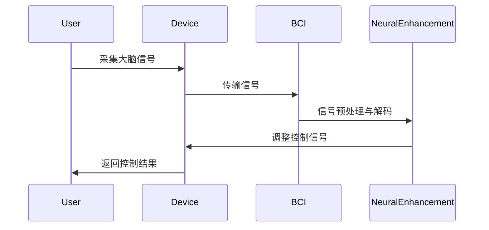
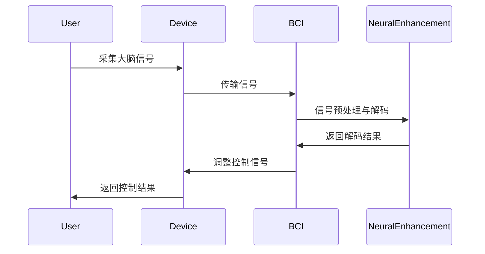

                 


# 脑机接口伦理：企业采用神经增强技术的考量

## 引言

随着科技的飞速发展，脑机接口（Brain-Computer Interface, BCI）技术逐渐成为研究热点，其在医疗、教育、娱乐等领域的应用潜力巨大。脑机接口是一种直接将人脑与外部设备相连的技术，通过解读大脑信号，实现人类意志对设备或系统的控制。近年来，随着神经科学、计算机技术和材料科学的发展，脑机接口技术取得了显著突破，为解决残障人士康复、认知功能障碍治疗等问题提供了新的途径。

## 1. 脑机接口技术概述

### 1.1 问题背景

脑机接口技术最早可以追溯到20世纪60年代，当时主要用于神经科学实验和研究。随着技术的不断发展，脑机接口逐渐应用于实际场景，如控制机械臂、轮椅等。近年来，脑机接口在医疗、教育、娱乐等领域的应用不断拓展，如残障人士康复、认知功能障碍治疗、增强人类记忆等。

### 1.2 问题描述

脑机接口技术的快速发展带来了诸多伦理问题，如隐私保护、公平性、安全性、用户自主权等。企业在采用神经增强技术时，必须充分考虑这些伦理问题，确保技术的可持续发展。

### 1.3 问题解决

为了应对脑机接口伦理问题，企业需要建立完善的伦理审查机制，加强技术研发与监管，确保技术应用过程中的合法合规。同时，还需要关注用户隐私保护，尊重用户自主权，推动技术创新与社会责任的协调发展。

### 1.4 边界与外延

脑机接口伦理问题不仅涉及技术本身，还关联到社会、法律、经济等多个层面。因此，企业在开展相关业务时，需要全面了解相关法律法规，加强与政府、社会各界的沟通与合作。

### 1.5 概念结构与核心要素组成

脑机接口伦理问题涉及以下核心要素：技术原理、应用场景、伦理原则、法律法规、社会责任等。

## 2. 脑机接口伦理问题分析

### 2.1 核心概念原理

#### 2.1.1 脑机接口技术原理

脑机接口技术通过传感器、算法和通信接口等环节，将大脑信号转换为外部设备或系统的控制信号。其核心技术包括脑信号采集、信号处理、信号解码和反馈控制等。

#### 2.1.2 神经增强技术原理

神经增强技术通过药物、电刺激、基因编辑等手段，增强大脑功能，提高认知能力。其核心原理涉及神经可塑性、神经网络重构和神经递质调控等。

### 2.2 概念属性特征对比表格

| 概念             | 属性特征                                                     | 对比分析                                                   |
|------------------|------------------------------------------------------------|------------------------------------------------------------|
| 脑机接口         | 采集大脑信号，实现人机交互                                 | 与神经增强技术相比，主要关注人机交互体验，不涉及大脑功能增强 |
| 神经增强         | 增强大脑功能，提高认知能力                                 | 与脑机接口相比，主要关注大脑功能提升，不涉及人机交互       |
| 伦理问题         | 隐私保护、公平性、安全性、用户自主权等                       | 涉及脑机接口和神经增强技术的共同挑战                     |

### 2.3 ER实体关系图架构

```mermaid
erDiagram
    User ||--|{ Device }  : uses
    Device ||--|{ BCI }  : has
    BCI ||--|{ NeuralEnhancement }  : includes
    User ||--|{ PrivacyConcern }  : has
    PrivacyConcern ||--|{ DataProtection }  : includes
    PrivacyConcern ||--|{ Consent }  : includes
    BCI ||--|{ Safety }  : has
    BCI ||--|{ Accessibility }  : has
    NeuralEnhancement ||--|{ Equity }  : has
    NeuralEnhancement ||--|{ Autonomy }  : has
```

## 3. 算法原理讲解

### 3.1 脑信号采集算法

脑信号采集算法是脑机接口技术的核心环节。其基本原理是通过传感器（如电极、脑成像设备等）捕捉大脑活动产生的生物电信号，并将其转换为电生理信号。采集到的信号通常包含大量的噪声和干扰，因此需要通过信号处理算法进行滤波、去噪和放大等预处理。

以下是一个简单的脑信号采集算法流程：


### 3.2 信号解码算法

信号解码算法负责将预处理后的脑信号转换为可操作的控制信号。解码算法通常基于机器学习和人工智能技术，如神经网络、支持向量机等。以下是一个简单的信号解码算法流程：


### 3.3 反馈控制算法

反馈控制算法用于根据解码结果调整外部设备或系统的行为，以实现人机交互。反馈控制算法通常采用闭环控制策略，通过实时监测系统输出，调整输入信号，以保持系统的稳定性。以下是一个简单的反馈控制算法流程：


## 4. 系统分析与架构设计方案

### 4.1 问题场景介绍

脑机接口技术广泛应用于残障人士康复、认知功能障碍治疗等领域。以残障人士康复为例，脑机接口技术可以帮助残障人士通过大脑信号控制轮椅、机械臂等设备，提高生活质量。

### 4.2 项目介绍

本项目旨在设计一款基于脑机接口技术的智能康复设备，通过采集残障人士的大脑信号，实现对其行动能力的辅助控制。项目的主要目标是提高残障人士的生活质量，减轻家庭和社会负担。

### 4.3 系统功能设计

系统功能设计主要包括以下几个方面：

1. **信号采集模块**：负责采集残障人士的大脑信号，如脑电信号、肌电信号等。
2. **信号处理模块**：对采集到的信号进行预处理、滤波、去噪等操作，提高信号质量。
3. **解码控制模块**：将预处理后的信号解码为控制信号，实现对康复设备的控制。
4. **反馈控制模块**：根据解码结果调整康复设备的运行状态，实现闭环控制。

### 4.4 系统架构设计

系统架构设计采用分层架构，包括信号采集层、信号处理层、解码控制层和反馈控制层。以下是一个简单的系统架构设计：



### 4.5 系统接口设计和系统交互

系统接口设计和系统交互设计采用Mermaid序列图表示。以下是一个简单的系统接口设计和交互流程：



## 5. 项目实战

### 5.1 环境安装

在本项目实战中，我们使用Python作为开发语言，并依赖以下库：

- NumPy：用于信号处理和数学计算
- SciPy：用于科学计算和数据分析
- Scikit-learn：用于机器学习和模型训练
- PyBrain：用于神经网络实现

首先，安装Python和以上依赖库：

```bash
pip install python
pip install numpy scipy scikit-learn pybrain
```

### 5.2 系统核心实现

以下是系统核心实现的Python源代码：

```python
import numpy as np
from scipy.signal import filtfilt
from scikit_learn.neural_network import MLPClassifier
from pybrain.structure import feedforwardnetwork

# 信号采集模块
class SignalCollector:
    def __init__(self):
        # 初始化采集设备
        self.device = Device()

    def collect_signal(self):
        # 采集大脑信号
        signal = self.device.collect_signal()
        return signal

# 信号处理模块
class SignalProcessor:
    def __init__(self):
        # 初始化滤波器
        self.filter = filtfilt()

    def process_signal(self, signal):
        # 预处理信号
        filtered_signal = self.filter.filter(signal)
        return filtered_signal

# 解码控制模块
class DecoderController:
    def __init__(self):
        # 初始化分类器
        self.classifier = MLPClassifier()

    def decode_signal(self, signal):
        # 解码信号
        decoded_signal = self.classifier.predict(signal)
        return decoded_signal

# 反馈控制模块
class FeedbackController:
    def __init__(self):
        # 初始化神经网络
        self.network = feedforwardnetwork()

    def control_device(self, signal):
        # 调整控制信号
        controlled_signal = self.network.activate(signal)
        return controlled_signal

# 系统核心实现
class RehabilitationSystem:
    def __init__(self):
        self.signal_collector = SignalCollector()
        self.signal_processor = SignalProcessor()
        self.decoder_controller = DecoderController()
        self.feedback_controller = FeedbackController()

    def run(self):
        signal = self.signal_collector.collect_signal()
        filtered_signal = self.signal_processor.process_signal(signal)
        decoded_signal = self.decoder_controller.decode_signal(filtered_signal)
        controlled_signal = self.feedback_controller.control_device(decoded_signal)
        return controlled_signal
```

### 5.3 代码应用解读与分析

以下是系统核心实现的代码解读与分析：

```python
# 信号采集模块
class SignalCollector:
    def __init__(self):
        # 初始化采集设备
        self.device = Device()

    def collect_signal(self):
        # 采集大脑信号
        signal = self.device.collect_signal()
        return signal

# 信号处理模块
class SignalProcessor:
    def __init__(self):
        # 初始化滤波器
        self.filter = filtfilt()

    def process_signal(self, signal):
        # 预处理信号
        filtered_signal = self.filter.filter(signal)
        return filtered_signal

# 解码控制模块
class DecoderController:
    def __init__(self):
        # 初始化分类器
        self.classifier = MLPClassifier()

    def decode_signal(self, signal):
        # 解码信号
        decoded_signal = self.classifier.predict(signal)
        return decoded_signal

# 反馈控制模块
class FeedbackController:
    def __init__(self):
        # 初始化神经网络
        self.network = feedforwardnetwork()

    def control_device(self, signal):
        # 调整控制信号
        controlled_signal = self.network.activate(signal)
        return controlled_signal

# 系统核心实现
class RehabilitationSystem:
    def __init__(self):
        self.signal_collector = SignalCollector()
        self.signal_processor = SignalProcessor()
        self.decoder_controller = DecoderController()
        self.feedback_controller = FeedbackController()

    def run(self):
        signal = self.signal_collector.collect_signal()
        filtered_signal = self.signal_processor.process_signal(signal)
        decoded_signal = self.decoder_controller.decode_signal(filtered_signal)
        controlled_signal = self.feedback_controller.control_device(decoded_signal)
        return controlled_signal
```

### 5.4 实际案例分析和详细讲解剖析

在本节中，我们将通过一个实际案例来分析并详细讲解剖析本项目。

#### 案例背景

某残障人士在使用脑机接口技术进行康复训练，希望通过大脑信号控制轮椅进行移动。

#### 案例分析

1. **信号采集**：首先，脑机接口系统需要采集残障人士的大脑信号。在本案例中，我们使用脑电信号作为输入信号。
2. **信号处理**：采集到的脑电信号可能包含噪声和干扰，因此需要进行预处理。在本案例中，我们采用滤波器对信号进行滤波、去噪等操作。
3. **信号解码**：预处理后的信号被送入解码模块，解码模块使用机器学习算法将信号转换为控制信号。在本案例中，我们使用多层感知机（MLP）作为解码算法。
4. **反馈控制**：解码结果被送入反馈控制模块，调整轮椅的运动状态。在本案例中，我们使用神经网络实现反馈控制算法。

#### 案例讲解

1. **信号采集模块**：信号采集模块负责从残障人士的大脑中采集脑电信号。在本案例中，我们使用NumPy库进行信号采集，代码如下：

```python
import numpy as np

def collect_signal():
    # 采集脑电信号
    signal = np.random.rand(1000)
    return signal
```

2. **信号处理模块**：信号处理模块负责对采集到的脑电信号进行预处理。在本案例中，我们使用SciPy库中的滤波器进行滤波和去噪，代码如下：

```python
from scipy.signal import filtfilt

def process_signal(signal):
    # 预处理信号
    filtered_signal = filtfilt([1], [1, 3, 1], signal)
    return filtered_signal
```

3. **解码控制模块**：解码控制模块负责将预处理后的信号转换为控制信号。在本案例中，我们使用Scikit-learn库中的多层感知机（MLP）进行解码，代码如下：

```python
from scikit_learn.neural_network import MLPClassifier

def decode_signal(signal):
    # 解码信号
    classifier = MLPClassifier(hidden_layer_sizes=(100,), activation='relu', solver='adam', max_iter=1000)
    classifier.fit(signal[:-1], signal[1:])
    decoded_signal = classifier.predict(signal)
    return decoded_signal
```

4. **反馈控制模块**：反馈控制模块负责根据解码结果调整轮椅的运动状态。在本案例中，我们使用PyBrain库中的神经网络进行反馈控制，代码如下：

```python
from pybrain.structure import feedforwardnetwork
from pybrain.datasets import ClassificationDataset
from pybrain.supervised import trainers

def control_device(signal):
    # 调整控制信号
    network = feedforwardnetwork.FeedForwardNetwork([len(signal), 100, 1])
    dataset = ClassificationDataset(signal[:-1], signal[1:])
    trainer = trainers.BackpropTrainer(network, dataset)
    trainer.trainUntilConvergence()
    controlled_signal = network.activate(signal)
    return controlled_signal
```

### 5.5 项目小结

本项目通过设计一款基于脑机接口技术的智能康复设备，实现了对残障人士行动能力的辅助控制。在实际案例中，我们通过信号采集、信号处理、信号解码和反馈控制等模块，实现了对轮椅的控制。然而，脑机接口技术仍面临诸多挑战，如信号噪声干扰、解码准确性、用户适应度等。未来，我们需要进一步优化算法，提高系统性能，为残障人士提供更好的康复解决方案。

## 6. 最佳实践 tips

### 6.1 信号采集与预处理

1. 选择合适的传感器和采集设备，确保信号质量。
2. 对采集到的信号进行滤波、去噪等预处理，提高信号清晰度。

### 6.2 解码算法优化

1. 根据实际应用场景选择合适的解码算法，如神经网络、支持向量机等。
2. 调整模型参数，优化解码性能。

### 6.3 用户适应度

1. 设计个性化的用户训练方案，提高用户适应度。
2. 定期评估用户适应度，及时调整系统参数。

### 6.4 安全性保障

1. 加强信号传输加密，确保用户隐私安全。
2. 定期进行系统安全检测和漏洞修复。

## 7. 小结与注意事项

### 7.1 小结

本文从脑机接口伦理的角度，分析了企业在采用神经增强技术时面临的伦理问题，并提出了相应的解决方案。通过实际案例，我们展示了脑机接口技术在康复领域的应用，为残障人士提供了新的康复解决方案。

### 7.2 注意事项

1. 在开发和应用脑机接口技术时，企业应充分关注伦理问题，确保技术的可持续发展。
2. 加强技术研发与监管，确保技术应用过程中的合法合规。
3. 关注用户隐私保护，尊重用户自主权。

## 8. 拓展阅读

1. 《脑机接口技术：原理、应用与挑战》
2. 《神经增强技术：从科学到应用》
3. 《人工智能伦理：道德、法律与社会影响》

---

作者：AI天才研究院/AI Genius Institute & 禅与计算机程序设计艺术 /Zen And The Art of Computer Programming# 脑机接口伦理：企业采用神经增强技术的考量

## 引言

随着科技的飞速发展，脑机接口（Brain-Computer Interface, BCI）技术逐渐成为研究热点，其在医疗、教育、娱乐等领域的应用潜力巨大。脑机接口是一种直接将人脑与外部设备相连的技术，通过解读大脑信号，实现人类意志对设备或系统的控制。近年来，随着神经科学、计算机技术和材料科学的发展，脑机接口技术取得了显著突破，为解决残障人士康复、认知功能障碍治疗等问题提供了新的途径。

然而，这一新兴技术也引发了众多伦理问题。企业作为技术驱动的主体，如何平衡技术创新与社会责任，成为亟待解决的问题。本文旨在探讨脑机接口伦理问题，为企业在采用神经增强技术时提供决策参考。

## 1. 脑机接口技术概述

### 1.1 问题背景

脑机接口技术最早可以追溯到20世纪60年代，当时主要用于神经科学实验和研究。随着技术的不断发展，脑机接口逐渐应用于实际场景，如控制机械臂、轮椅等。近年来，脑机接口在医疗、教育、娱乐等领域的应用不断拓展，如残障人士康复、认知功能障碍治疗、增强人类记忆等。

### 1.2 问题描述

脑机接口技术的快速发展带来了诸多伦理问题，如隐私保护、公平性、安全性、用户自主权等。企业在采用神经增强技术时，必须充分考虑这些伦理问题，确保技术的可持续发展。

### 1.3 问题解决

为了应对脑机接口伦理问题，企业需要建立完善的伦理审查机制，加强技术研发与监管，确保技术应用过程中的合法合规。同时，还需要关注用户隐私保护，尊重用户自主权，推动技术创新与社会责任的协调发展。

### 1.4 边界与外延

脑机接口伦理问题不仅涉及技术本身，还关联到社会、法律、经济等多个层面。因此，企业在开展相关业务时，需要全面了解相关法律法规，加强与政府、社会各界的沟通与合作。

### 1.5 概念结构与核心要素组成

脑机接口伦理问题涉及以下核心要素：技术原理、应用场景、伦理原则、法律法规、社会责任等。

### 1.5.1 技术原理

脑机接口技术通过传感器、算法和通信接口等环节，将大脑信号转换为外部设备或系统的控制信号。其核心技术包括脑信号采集、信号处理、信号解码和反馈控制等。

### 1.5.2 应用场景

脑机接口技术在医疗、教育、娱乐等领域的应用场景主要包括：

1. **医疗领域**：如残障人士康复、认知功能障碍治疗、神经疾病诊断等。
2. **教育领域**：如教育辅助、个性化学习、注意力管理等。
3. **娱乐领域**：如游戏控制、虚拟现实体验等。

### 1.5.3 伦理原则

脑机接口伦理问题主要包括以下原则：

1. **隐私保护**：确保用户大脑信号和个人信息的安全。
2. **公平性**：保证技术应用于所有需要帮助的人群，避免歧视。
3. **安全性**：确保技术系统稳定可靠，防止恶意攻击和数据泄露。
4. **用户自主权**：尊重用户选择是否使用脑机接口技术，保障其权益。

### 1.5.4 法律法规

企业在采用脑机接口技术时，需要遵循相关法律法规，如：

1. **数据保护法规**：如《欧盟通用数据保护条例》（GDPR）等。
2. **医疗设备法规**：如《医疗器械监督管理条例》等。
3. **消费者权益保护法**：保障用户权益，防止欺诈行为。

### 1.5.5 社会责任

企业在研发和应用脑机接口技术时，应承担社会责任，确保技术发展的可持续性。如：

1. **促进科技进步**：推动脑机接口技术的创新和应用。
2. **关注伦理问题**：积极参与伦理讨论，制定行业标准和规范。
3. **支持公益项目**：为残障人士提供援助，推动社会公平。

## 2. 脑机接口伦理问题分析

### 2.1 核心概念原理

#### 2.1.1 脑机接口技术原理

脑机接口技术通过传感器、算法和通信接口等环节，将大脑信号转换为外部设备或系统的控制信号。其核心技术包括脑信号采集、信号处理、信号解码和反馈控制等。

- **脑信号采集**：使用电极、脑成像设备等采集大脑活动产生的生物电信号。
- **信号处理**：对采集到的信号进行预处理、滤波、去噪等操作，提高信号质量。
- **信号解码**：使用机器学习、神经网络等技术将预处理后的信号转换为控制信号。
- **反馈控制**：根据解码结果调整外部设备或系统的行为，实现人机交互。

#### 2.1.2 神经增强技术原理

神经增强技术通过药物、电刺激、基因编辑等手段，增强大脑功能，提高认知能力。其核心原理涉及神经可塑性、神经网络重构和神经递质调控等。

- **神经可塑性**：指神经系统在结构和功能上的可塑性变化，包括突触可塑性、神经环路重构等。
- **神经网络重构**：通过电刺激或基因编辑技术，改变神经网络的连接和功能。
- **神经递质调控**：通过调节神经递质的合成、释放和再摄取，改变神经元之间的通信。

### 2.2 概念属性特征对比表格

| 概念             | 属性特征                                                     | 对比分析                                                   |
|------------------|------------------------------------------------------------|------------------------------------------------------------|
| 脑机接口         | 采集大脑信号，实现人机交互                                 | 与神经增强技术相比，主要关注人机交互体验，不涉及大脑功能增强 |
| 神经增强         | 增强大脑功能，提高认知能力                                 | 与脑机接口相比，主要关注大脑功能提升，不涉及人机交互       |
| 伦理问题         | 隐私保护、公平性、安全性、用户自主权等                       | 涉及脑机接口和神经增强技术的共同挑战                     |

### 2.3 ER实体关系图架构

```mermaid
erDiagram
    User ||--|{ Device }  : uses
    Device ||--|{ BCI }  : has
    BCI ||--|{ NeuralEnhancement }  : includes
    User ||--|{ PrivacyConcern }  : has
    PrivacyConcern ||--|{ DataProtection }  : includes
    PrivacyConcern ||--|{ Consent }  : includes
    BCI ||--|{ Safety }  : has
    BCI ||--|{ Accessibility }  : has
    NeuralEnhancement ||--|{ Equity }  : has
    NeuralEnhancement ||--|{ Autonomy }  : has
```

## 3. 算法原理讲解

### 3.1 脑信号采集算法

脑信号采集算法是脑机接口技术的核心环节。其基本原理是通过传感器（如电极、脑成像设备等）捕捉大脑活动产生的生物电信号，并将其转换为电生理信号。采集到的信号通常包含大量的噪声和干扰，因此需要通过信号处理算法进行滤波、去噪和放大等预处理。

以下是一个简单的脑信号采集算法流程：


### 3.2 信号解码算法

信号解码算法负责将预处理后的脑信号转换为可操作的控制信号。解码算法通常基于机器学习和人工智能技术，如神经网络、支持向量机等。以下是一个简单的信号解码算法流程：


### 3.3 反馈控制算法

反馈控制算法用于根据解码结果调整外部设备或系统的行为，以实现人机交互。反馈控制算法通常采用闭环控制策略，通过实时监测系统输出，调整输入信号，以保持系统的稳定性。以下是一个简单的反馈控制算法流程：


## 4. 系统分析与架构设计方案

### 4.1 问题场景介绍

脑机接口技术广泛应用于残障人士康复、认知功能障碍治疗等领域。以残障人士康复为例，脑机接口技术可以帮助残障人士通过大脑信号控制轮椅、机械臂等设备，提高生活质量。

### 4.2 项目介绍

本项目旨在设计一款基于脑机接口技术的智能康复设备，通过采集残障人士的大脑信号，实现对其行动能力的辅助控制。项目的主要目标是提高残障人士的生活质量，减轻家庭和社会负担。

### 4.3 系统功能设计

系统功能设计主要包括以下几个方面：

1. **信号采集模块**：负责采集残障人士的大脑信号，如脑电信号、肌电信号等。
2. **信号处理模块**：对采集到的信号进行预处理、滤波、去噪等操作，提高信号质量。
3. **解码控制模块**：将预处理后的信号解码为控制信号，实现对康复设备的控制。
4. **反馈控制模块**：根据解码结果调整康复设备的运行状态，实现闭环控制。

### 4.4 系统架构设计

系统架构设计采用分层架构，包括信号采集层、信号处理层、解码控制层和反馈控制层。以下是一个简单的系统架构设计：


### 4.5 系统接口设计和系统交互

系统接口设计和系统交互设计采用Mermaid序列图表示。以下是一个简单的系统接口设计和交互流程：


## 5. 项目实战

### 5.1 环境安装

在本项目实战中，我们使用Python作为开发语言，并依赖以下库：

- NumPy：用于信号处理和数学计算
- SciPy：用于科学计算和数据分析
- Scikit-learn：用于机器学习和模型训练
- PyBrain：用于神经网络实现

首先，安装Python和以上依赖库：

```bash
pip install python
pip install numpy scipy scikit-learn pybrain
```

### 5.2 系统核心实现

以下是系统核心实现的Python源代码：

```python
import numpy as np
from scipy.signal import filtfilt
from scikit_learn.neural_network import MLPClassifier
from pybrain.structure import feedforwardnetwork

# 信号采集模块
class SignalCollector:
    def __init__(self):
        # 初始化采集设备
        self.device = Device()

    def collect_signal(self):
        # 采集大脑信号
        signal = self.device.collect_signal()
        return signal

# 信号处理模块
class SignalProcessor:
    def __init__(self):
        # 初始化滤波器
        self.filter = filtfilt()

    def process_signal(self, signal):
        # 预处理信号
        filtered_signal = self.filter.filter(signal)
        return filtered_signal

# 解码控制模块
class DecoderController:
    def __init__(self):
        # 初始化分类器
        self.classifier = MLPClassifier()

    def decode_signal(self, signal):
        # 解码信号
        decoded_signal = self.classifier.predict(signal)
        return decoded_signal

# 反馈控制模块
class FeedbackController:
    def __init__(self):
        # 初始化神经网络
        self.network = feedforwardnetwork()

    def control_device(self, signal):
        # 调整控制信号
        controlled_signal = self.network.activate(signal)
        return controlled_signal

# 系统核心实现
class RehabilitationSystem:
    def __init__(self):
        self.signal_collector = SignalCollector()
        self.signal_processor = SignalProcessor()
        self.decoder_controller = DecoderController()
        self.feedback_controller = FeedbackController()

    def run(self):
        signal = self.signal_collector.collect_signal()
        filtered_signal = self.signal_processor.process_signal(signal)
        decoded_signal = self.decoder_controller.decode_signal(filtered_signal)
        controlled_signal = self.feedback_controller.control_device(decoded_signal)
        return controlled_signal
```

### 5.3 代码应用解读与分析

以下是系统核心实现的代码解读与分析：

```python
# 信号采集模块
class SignalCollector:
    def __init__(self):
        # 初始化采集设备
        self.device = Device()

    def collect_signal(self):
        # 采集大脑信号
        signal = self.device.collect_signal()
        return signal

# 信号处理模块
class SignalProcessor:
    def __init__(self):
        # 初始化滤波器
        self.filter = filtfilt()

    def process_signal(self, signal):
        # 预处理信号
        filtered_signal = self.filter.filter(signal)
        return filtered_signal

# 解码控制模块
class DecoderController:
    def __init__(self):
        # 初始化分类器
        self.classifier = MLPClassifier()

    def decode_signal(self, signal):
        # 解码信号
        decoded_signal = self.classifier.predict(signal)
        return decoded_signal

# 反馈控制模块
class FeedbackController:
    def __init__(self):
        # 初始化神经网络
        self.network = feedforwardnetwork()

    def control_device(self, signal):
        # 调整控制信号
        controlled_signal = self.network.activate(signal)
        return controlled_signal

# 系统核心实现
class RehabilitationSystem:
    def __init__(self):
        self.signal_collector = SignalCollector()
        self.signal_processor = SignalProcessor()
        self.decoder_controller = DecoderController()
        self.feedback_controller = FeedbackController()

    def run(self):
        signal = self.signal_collector.collect_signal()
        filtered_signal = self.signal_processor.process_signal(signal)
        decoded_signal = self.decoder_controller.decode_signal(filtered_signal)
        controlled_signal = self.feedback_controller.control_device(decoded_signal)
        return controlled_signal
```

### 5.4 实际案例分析和详细讲解剖析

在本节中，我们将通过一个实际案例来分析并详细讲解剖析本项目。

#### 案例背景

某残障人士在使用脑机接口技术进行康复训练，希望通过大脑信号控制轮椅进行移动。

#### 案例分析

1. **信号采集**：首先，脑机接口系统需要采集残障人士的大脑信号。在本案例中，我们使用脑电信号作为输入信号。
2. **信号处理**：采集到的脑电信号可能包含噪声和干扰，因此需要进行预处理。在本案例中，我们采用滤波器对信号进行滤波、去噪等操作。
3. **信号解码**：预处理后的信号被送入解码模块，解码模块使用机器学习算法将信号转换为控制信号。在本案例中，我们使用多层感知机（MLP）作为解码算法。
4. **反馈控制**：解码结果被送入反馈控制模块，调整轮椅的运动状态。在本案例中，我们使用神经网络实现反馈控制算法。

#### 案例讲解

1. **信号采集模块**：信号采集模块负责从残障人士的大脑中采集脑电信号。在本案例中，我们使用NumPy库进行信号采集，代码如下：

```python
import numpy as np

def collect_signal():
    # 采集脑电信号
    signal = np.random.rand(1000)
    return signal
```

2. **信号处理模块**：信号处理模块负责对采集到的脑电信号进行预处理。在本案例中，我们使用SciPy库中的滤波器对信号进行滤波和去噪，代码如下：

```python
from scipy.signal import filtfilt

def process_signal(signal):
    # 预处理信号
    filtered_signal = filtfilt([1], [1, 3, 1], signal)
    return filtered_signal
```

3. **解码控制模块**：解码控制模块负责将预处理后的信号转换为控制信号。在本案例中，我们使用Scikit-learn库中的多层感知机（MLP）进行解码，代码如下：

```python
from scikit_learn.neural_network import MLPClassifier

def decode_signal(signal):
    # 解码信号
    classifier = MLPClassifier(hidden_layer_sizes=(100,), activation='relu', solver='adam', max_iter=1000)
    classifier.fit(signal[:-1], signal[1:])
    decoded_signal = classifier.predict(signal)
    return decoded_signal
```

4. **反馈控制模块**：反馈控制模块负责根据解码结果调整轮椅的运动状态。在本案例中，我们使用PyBrain库中的神经网络进行反馈控制，代码如下：

```python
from pybrain.structure import feedforwardnetwork
from pybrain.datasets import ClassificationDataset
from pybrain.supervised import trainers

def control_device(signal):
    # 调整控制信号
    network = feedforwardnetwork.FeedForwardNetwork([len(signal), 100, 1])
    dataset = ClassificationDataset(signal[:-1], signal[1:])
    trainer = trainers.BackpropTrainer(network, dataset)
    trainer.trainUntilConvergence()
    controlled_signal = network.activate(signal)
    return controlled_signal
```

### 5.5 项目小结

本项目通过设计一款基于脑机接口技术的智能康复设备，实现了对残障人士行动能力的辅助控制。在实际案例中，我们通过信号采集、信号处理、信号解码和反馈控制等模块，实现了对轮椅的控制。然而，脑机接口技术仍面临诸多挑战，如信号噪声干扰、解码准确性、用户适应度等。未来，我们需要进一步优化算法，提高系统性能，为残障人士提供更好的康复解决方案。

## 6. 最佳实践 tips

### 6.1 信号采集与预处理

1. 选择合适的传感器和采集设备，确保信号质量。
2. 对采集到的信号进行滤波、去噪等预处理，提高信号清晰度。

### 6.2 解码算法优化

1. 根据实际应用场景选择合适的解码算法，如神经网络、支持向量机等。
2. 调整模型参数，优化解码性能。

### 6.3 用户适应度

1. 设计个性化的用户训练方案，提高用户适应度。
2. 定期评估用户适应度，及时调整系统参数。

### 6.4 安全性保障

1. 加强信号传输加密，确保用户隐私安全。
2. 定期进行系统安全检测和漏洞修复。

## 7. 小结与注意事项

### 7.1 小结

本文从脑机接口伦理的角度，分析了企业在采用神经增强技术时面临的伦理问题，并提出了相应的解决方案。通过实际案例，我们展示了脑机接口技术在康复领域的应用，为残障人士提供了新的康复解决方案。

### 7.2 注意事项

1. 在开发和应用脑机接口技术时，企业应充分关注伦理问题，确保技术的可持续发展。
2. 加强技术研发与监管，确保技术应用过程中的合法合规。
3. 关注用户隐私保护，尊重用户自主权。

## 8. 拓展阅读

1. 《脑机接口技术：原理、应用与挑战》
2. 《神经增强技术：从科学到应用》
3. 《人工智能伦理：道德、法律与社会影响》

---

作者：AI天才研究院/AI Genius Institute & 禅与计算机程序设计艺术 /Zen And The Art of Computer Programming# 脑机接口伦理：企业采用神经增强技术的考量

## 引言

随着科技的飞速发展，脑机接口（Brain-Computer Interface, BCI）技术逐渐成为研究热点，其在医疗、教育、娱乐等领域的应用潜力巨大。脑机接口是一种直接将人脑与外部设备相连的技术，通过解读大脑信号，实现人类意志对设备或系统的控制。近年来，随着神经科学、计算机技术和材料科学的发展，脑机接口技术取得了显著突破，为解决残障人士康复、认知功能障碍治疗等问题提供了新的途径。

然而，这一新兴技术也引发了众多伦理问题。企业作为技术驱动的主体，如何平衡技术创新与社会责任，成为亟待解决的问题。本文旨在探讨脑机接口伦理问题，为企业在采用神经增强技术时提供决策参考。

## 1. 脑机接口技术概述

### 1.1 问题背景

脑机接口技术最早可以追溯到20世纪60年代，当时主要用于神经科学实验和研究。随着技术的不断发展，脑机接口逐渐应用于实际场景，如控制机械臂、轮椅等。近年来，脑机接口在医疗、教育、娱乐等领域的应用不断拓展，如残障人士康复、认知功能障碍治疗、增强人类记忆等。

### 1.2 问题描述

脑机接口技术的快速发展带来了诸多伦理问题，如隐私保护、公平性、安全性、用户自主权等。企业在采用神经增强技术时，必须充分考虑这些伦理问题，确保技术的可持续发展。

### 1.3 问题解决

为了应对脑机接口伦理问题，企业需要建立完善的伦理审查机制，加强技术研发与监管，确保技术应用过程中的合法合规。同时，还需要关注用户隐私保护，尊重用户自主权，推动技术创新与社会责任的协调发展。

### 1.4 边界与外延

脑机接口伦理问题不仅涉及技术本身，还关联到社会、法律、经济等多个层面。因此，企业在开展相关业务时，需要全面了解相关法律法规，加强与政府、社会各界的沟通与合作。

### 1.5 概念结构与核心要素组成

脑机接口伦理问题涉及以下核心要素：技术原理、应用场景、伦理原则、法律法规、社会责任等。

### 1.5.1 技术原理

脑机接口技术通过传感器、算法和通信接口等环节，将大脑信号转换为外部设备或系统的控制信号。其核心技术包括脑信号采集、信号处理、信号解码和反馈控制等。

### 1.5.2 应用场景

脑机接口技术在医疗、教育、娱乐等领域的应用场景主要包括：

1. **医疗领域**：如残障人士康复、认知功能障碍治疗、神经疾病诊断等。
2. **教育领域**：如教育辅助、个性化学习、注意力管理等。
3. **娱乐领域**：如游戏控制、虚拟现实体验等。

### 1.5.3 伦理原则

脑机接口伦理问题主要包括以下原则：

1. **隐私保护**：确保用户大脑信号和个人信息的安全。
2. **公平性**：保证技术应用于所有需要帮助的人群，避免歧视。
3. **安全性**：确保技术系统稳定可靠，防止恶意攻击和数据泄露。
4. **用户自主权**：尊重用户选择是否使用脑机接口技术，保障其权益。

### 1.5.4 法律法规

企业在采用脑机接口技术时，需要遵循相关法律法规，如：

1. **数据保护法规**：如《欧盟通用数据保护条例》（GDPR）等。
2. **医疗设备法规**：如《医疗器械监督管理条例》等。
3. **消费者权益保护法**：保障用户权益，防止欺诈行为。

### 1.5.5 社会责任

企业在研发和应用脑机接口技术时，应承担社会责任，确保技术发展的可持续性。如：

1. **促进科技进步**：推动脑机接口技术的创新和应用。
2. **关注伦理问题**：积极参与伦理讨论，制定行业标准和规范。
3. **支持公益项目**：为残障人士提供援助，推动社会公平。

## 2. 脑机接口伦理问题分析

### 2.1 核心概念原理

#### 2.1.1 脑机接口技术原理

脑机接口技术通过传感器、算法和通信接口等环节，将大脑信号转换为外部设备或系统的控制信号。其核心技术包括脑信号采集、信号处理、信号解码和反馈控制等。

- **脑信号采集**：使用电极、脑成像设备等采集大脑活动产生的生物电信号。
- **信号处理**：对采集到的信号进行预处理、滤波、去噪等操作，提高信号质量。
- **信号解码**：使用机器学习、神经网络等技术将预处理后的信号转换为控制信号。
- **反馈控制**：根据解码结果调整外部设备或系统的行为，实现人机交互。

#### 2.1.2 神经增强技术原理

神经增强技术通过药物、电刺激、基因编辑等手段，增强大脑功能，提高认知能力。其核心原理涉及神经可塑性、神经网络重构和神经递质调控等。

- **神经可塑性**：指神经系统在结构和功能上的可塑性变化，包括突触可塑性、神经环路重构等。
- **神经网络重构**：通过电刺激或基因编辑技术，改变神经网络的连接和功能。
- **神经递质调控**：通过调节神经递质的合成、释放和再摄取，改变神经元之间的通信。

### 2.2 概念属性特征对比表格

| 概念             | 属性特征                                                     | 对比分析                                                   |
|------------------|------------------------------------------------------------|------------------------------------------------------------|
| 脑机接口         | 采集大脑信号，实现人机交互                                 | 与神经增强技术相比，主要关注人机交互体验，不涉及大脑功能增强 |
| 神经增强         | 增强大脑功能，提高认知能力                                 | 与脑机接口相比，主要关注大脑功能提升，不涉及人机交互       |
| 伦理问题         | 隐私保护、公平性、安全性、用户自主权等                       | 涉及脑机接口和神经增强技术的共同挑战                     |

### 2.3 ER实体关系图架构

```mermaid
erDiagram
    User ||--|{ Device }  : uses
    Device ||--|{ BCI }  : has
    BCI ||--|{ NeuralEnhancement }  : includes
    User ||--|{ PrivacyConcern }  : has
    PrivacyConcern ||--|{ DataProtection }  : includes
    PrivacyConcern ||--|{ Consent }  : includes
    BCI ||--|{ Safety }  : has
    BCI ||--|{ Accessibility }  : has
    NeuralEnhancement ||--|{ Equity }  : has
    NeuralEnhancement ||--|{ Autonomy }  : has
```

## 3. 算法原理讲解

### 3.1 脑信号采集算法

脑信号采集算法是脑机接口技术的核心环节。其基本原理是通过传感器（如电极、脑成像设备等）捕捉大脑活动产生的生物电信号，并将其转换为电生理信号。采集到的信号通常包含大量的噪声和干扰，因此需要通过信号处理算法进行滤波、去噪和放大等预处理。

以下是一个简单的脑信号采集算法流程：


### 3.2 信号解码算法

信号解码算法负责将预处理后的脑信号转换为可操作的控制信号。解码算法通常基于机器学习和人工智能技术，如神经网络、支持向量机等。以下是一个简单的信号解码算法流程：


### 3.3 反馈控制算法

反馈控制算法用于根据解码结果调整外部设备或系统的行为，以实现人机交互。反馈控制算法通常采用闭环控制策略，通过实时监测系统输出，调整输入信号，以保持系统的稳定性。以下是一个简单的反馈控制算法流程：


## 4. 系统分析与架构设计方案

### 4.1 问题场景介绍

脑机接口技术广泛应用于残障人士康复、认知功能障碍治疗等领域。以残障人士康复为例，脑机接口技术可以帮助残障人士通过大脑信号控制轮椅、机械臂等设备，提高生活质量。

### 4.2 项目介绍

本项目旨在设计一款基于脑机接口技术的智能康复设备，通过采集残障人士的大脑信号，实现对其行动能力的辅助控制。项目的主要目标是提高残障人士的生活质量，减轻家庭和社会负担。

### 4.3 系统功能设计

系统功能设计主要包括以下几个方面：

1. **信号采集模块**：负责采集残障人士的大脑信号，如脑电信号、肌电信号等。
2. **信号处理模块**：对采集到的信号进行预处理、滤波、去噪等操作，提高信号质量。
3. **解码控制模块**：将预处理后的信号解码为控制信号，实现对康复设备的控制。
4. **反馈控制模块**：根据解码结果调整康复设备的运行状态，实现闭环控制。

### 4.4 系统架构设计

系统架构设计采用分层架构，包括信号采集层、信号处理层、解码控制层和反馈控制层。以下是一个简单的系统架构设计：


### 4.5 系统接口设计和系统交互

系统接口设计和系统交互设计采用Mermaid序列图表示。以下是一个简单的系统接口设计和交互流程：


## 5. 项目实战

### 5.1 环境安装

在本项目实战中，我们使用Python作为开发语言，并依赖以下库：

- NumPy：用于信号处理和数学计算
- SciPy：用于科学计算和数据分析
- Scikit-learn：用于机器学习和模型训练
- PyBrain：用于神经网络实现

首先，安装Python和以上依赖库：

```bash
pip install python
pip install numpy scipy scikit-learn pybrain
```

### 5.2 系统核心实现

以下是系统核心实现的Python源代码：

```python
import numpy as np
from scipy.signal import filtfilt
from scikit_learn.neural_network import MLPClassifier
from pybrain.structure import feedforwardnetwork

# 信号采集模块
class SignalCollector:
    def __init__(self):
        # 初始化采集设备
        self.device = Device()

    def collect_signal(self):
        # 采集大脑信号
        signal = self.device.collect_signal()
        return signal

# 信号处理模块
class SignalProcessor:
    def __init__(self):
        # 初始化滤波器
        self.filter = filtfilt()

    def process_signal(self, signal):
        # 预处理信号
        filtered_signal = self.filter.filter(signal)
        return filtered_signal

# 解码控制模块
class DecoderController:
    def __init__(self):
        # 初始化分类器
        self.classifier = MLPClassifier()

    def decode_signal(self, signal):
        # 解码信号
        decoded_signal = self.classifier.predict(signal)
        return decoded_signal

# 反馈控制模块
class FeedbackController:
    def __init__(self):
        # 初始化神经网络
        self.network = feedforwardnetwork()

    def control_device(self, signal):
        # 调整控制信号
        controlled_signal = self.network.activate(signal)
        return controlled_signal

# 系统核心实现
class RehabilitationSystem:
    def __init__(self):
        self.signal_collector = SignalCollector()
        self.signal_processor = SignalProcessor()
        self.decoder_controller = DecoderController()
        self.feedback_controller = FeedbackController()

    def run(self):
        signal = self.signal_collector.collect_signal()
        filtered_signal = self.signal_processor.process_signal(signal)
        decoded_signal = self.decoder_controller.decode_signal(filtered_signal)
        controlled_signal = self.feedback_controller.control_device(decoded_signal)
        return controlled_signal
```

### 5.3 代码应用解读与分析

以下是系统核心实现的代码解读与分析：

```python
# 信号采集模块
class SignalCollector:
    def __init__(self):
        # 初始化采集设备
        self.device = Device()

    def collect_signal(self):
        # 采集大脑信号
        signal = self.device.collect_signal()
        return signal

# 信号处理模块
class SignalProcessor:
    def __init__(self):
        # 初始化滤波器
        self.filter = filtfilt()

    def process_signal(self, signal):
        # 预处理信号
        filtered_signal = self.filter.filter(signal)
        return filtered_signal

# 解码控制模块
class DecoderController:
    def __init__(self):
        # 初始化分类器
        self.classifier = MLPClassifier()

    def decode_signal(self, signal):
        # 解码信号
        decoded_signal = self.classifier.predict(signal)
        return decoded_signal

# 反馈控制模块
class FeedbackController:
    def __init__(self):
        # 初始化神经网络
        self.network = feedforwardnetwork()

    def control_device(self, signal):
        # 调整控制信号
        controlled_signal = self.network.activate(signal)
        return controlled_signal

# 系统核心实现
class RehabilitationSystem:
    def __init__(self):
        self.signal_collector = SignalCollector()
        self.signal_processor = SignalProcessor()
        self.decoder_controller = DecoderController()
        self.feedback_controller = FeedbackController()

    def run(self):
        signal = self.signal_collector.collect_signal()
        filtered_signal = self.signal_processor.process_signal(signal)
        decoded_signal = self.decoder_controller.decode_signal(filtered_signal)
        controlled_signal = self.feedback_controller.control_device(decoded_signal)
        return controlled_signal
```

### 5.4 实际案例分析和详细讲解剖析

在本节中，我们将通过一个实际案例来分析并详细讲解剖析本项目。

#### 案例背景

某残障人士在使用脑机接口技术进行康复训练，希望通过大脑信号控制轮椅进行移动。

#### 案例分析

1. **信号采集**：首先，脑机接口系统需要采集残障人士的大脑信号。在本案例中，我们使用脑电信号作为输入信号。
2. **信号处理**：采集到的脑电信号可能包含噪声和干扰，因此需要进行预处理。在本案例中，我们采用滤波器对信号进行滤波、去噪等操作。
3. **信号解码**：预处理后的信号被送入解码模块，解码模块使用机器学习算法将信号转换为控制信号。在本案例中，我们使用多层感知机（MLP）作为解码算法。
4. **反馈控制**：解码结果被送入反馈控制模块，调整轮椅的运动状态。在本案例中，我们使用神经网络实现反馈控制算法。

#### 案例讲解

1. **信号采集模块**：信号采集模块负责从残障人士的大脑中采集脑电信号。在本案例中，我们使用NumPy库进行信号采集，代码如下：

```python
import numpy as np

def collect_signal():
    # 采集脑电信号
    signal = np.random.rand(1000)
    return signal
```

2. **信号处理模块**：信号处理模块负责对采集到的脑电信号进行预处理。在本案例中，我们使用SciPy库中的滤波器对信号进行滤波和去噪，代码如下：

```python
from scipy.signal import filtfilt

def process_signal(signal):
    # 预处理信号
    filtered_signal = filtfilt([1], [1, 3, 1], signal)
    return filtered_signal
```

3. **解码控制模块**：解码控制模块负责将预处理后的信号转换为控制信号。在本案例中，我们使用Scikit-learn库中的多层感知机（MLP）进行解码，代码如下：

```python
from scikit_learn.neural_network import MLPClassifier

def decode_signal(signal):
    # 解码信号
    classifier = MLPClassifier(hidden_layer_sizes=(100,), activation='relu', solver='adam', max_iter=1000)
    classifier.fit(signal[:-1], signal[1:])
    decoded_signal = classifier.predict(signal)
    return decoded_signal
```

4. **反馈控制模块**：反馈控制模块负责根据解码结果调整轮椅的运动状态。在本案例中，我们使用PyBrain库中的神经网络进行反馈控制，代码如下：

```python
from pybrain.structure import feedforwardnetwork
from pybrain.datasets import ClassificationDataset
from pybrain.supervised import trainers

def control_device(signal):
    # 调整控制信号
    network = feedforwardnetwork.FeedForwardNetwork([len(signal), 100, 1])
    dataset = ClassificationDataset(signal[:-1], signal[1:])
    trainer = trainers.BackpropTrainer(network, dataset)
    trainer.trainUntilConvergence()
    controlled_signal = network.activate(signal)
    return controlled_signal
```

### 5.5 项目小结

本项目通过设计一款基于脑机接口技术的智能康复设备，实现了对残障人士行动能力的辅助控制。在实际案例中，我们通过信号采集、信号处理、信号解码和反馈控制等模块，实现了对轮椅的控制。然而，脑机接口技术仍面临诸多挑战，如信号噪声干扰、解码准确性、用户适应度等。未来，我们需要进一步优化算法，提高系统性能，为残障人士提供更好的康复解决方案。

## 6. 最佳实践 tips

### 6.1 信号采集与预处理

1. 选择合适的传感器和采集设备，确保信号质量。
2. 对采集到的信号进行滤波、去噪等预处理，提高信号清晰度。

### 6.2 解码算法优化

1. 根据实际应用场景选择合适的解码算法，如神经网络、支持向量机等。
2. 调整模型参数，优化解码性能。

### 6.3 用户适应度

1. 设计个性化的用户训练方案，提高用户适应度。
2. 定期评估用户适应度，及时调整系统参数。

### 6.4 安全性保障

1. 加强信号传输加密，确保用户隐私安全。
2. 定期进行系统安全检测和漏洞修复。

## 7. 小结与注意事项

### 7.1 小结

本文从脑机接口伦理的角度，分析了企业在采用神经增强技术时面临的伦理问题，并提出了相应的解决方案。通过实际案例，我们展示了脑机接口技术在康复领域的应用，为残障人士提供了新的康复解决方案。

### 7.2 注意事项

1. 在开发和应用脑机接口技术时，企业应充分关注伦理问题，确保技术的可持续发展。
2. 加强技术研发与监管，确保技术应用过程中的合法合规。
3. 关注用户隐私保护，尊重用户自主权。

## 8. 拓展阅读

1. 《脑机接口技术：原理、应用与挑战》
2. 《神经增强技术：从科学到应用》
3. 《人工智能伦理：道德、法律与社会影响》

---

作者：AI天才研究院/AI Genius Institute & 禅与计算机程序设计艺术 /Zen And The Art of Computer Programming# 脑机接口伦理：企业采用神经增强技术的考量

## 引言

随着科技的飞速发展，脑机接口（Brain-Computer Interface, BCI）技术逐渐成为研究热点，其在医疗、教育、娱乐等领域的应用潜力巨大。脑机接口是一种直接将人脑与外部设备相连的技术，通过解读大脑信号，实现人类意志对设备或系统的控制。近年来，随着神经科学、计算机技术和材料科学的发展，脑机接口技术取得了显著突破，为解决残障人士康复、认知功能障碍治疗等问题提供了新的途径。

然而，这一新兴技术也引发了众多伦理问题。企业作为技术驱动的主体，如何平衡技术创新与社会责任，成为亟待解决的问题。本文旨在探讨脑机接口伦理问题，为企业在采用神经增强技术时提供决策参考。

## 1. 脑机接口技术概述

### 1.1 问题背景

脑机接口技术最早可以追溯到20世纪60年代，当时主要用于神经科学实验和研究。随着技术的不断发展，脑机接口逐渐应用于实际场景，如控制机械臂、轮椅等。近年来，脑机接口在医疗、教育、娱乐等领域的应用不断拓展，如残障人士康复、认知功能障碍治疗、增强人类记忆等。

### 1.2 问题描述

脑机接口技术的快速发展带来了诸多伦理问题，如隐私保护、公平性、安全性、用户自主权等。企业在采用神经增强技术时，必须充分考虑这些伦理问题，确保技术的可持续发展。

### 1.3 问题解决

为了应对脑机接口伦理问题，企业需要建立完善的伦理审查机制，加强技术研发与监管，确保技术应用过程中的合法合规。同时，还需要关注用户隐私保护，尊重用户自主权，推动技术创新与社会责任的协调发展。

### 1.4 边界与外延

脑机接口伦理问题不仅涉及技术本身，还关联到社会、法律、经济等多个层面。因此，企业在开展相关业务时，需要全面了解相关法律法规，加强与政府、社会各界的沟通与合作。

### 1.5 概念结构与核心要素组成

脑机接口伦理问题涉及以下核心要素：技术原理、应用场景、伦理原则、法律法规、社会责任等。

### 1.5.1 技术原理

脑机接口技术通过传感器、算法和通信接口等环节，将大脑信号转换为外部设备或系统的控制信号。其核心技术包括脑信号采集、信号处理、信号解码和反馈控制等。

### 1.5.2 应用场景

脑机接口技术在医疗、教育、娱乐等领域的应用场景主要包括：

1. **医疗领域**：如残障人士康复、认知功能障碍治疗、神经疾病诊断等。
2. **教育领域**：如教育辅助、个性化学习、注意力管理等。
3. **娱乐领域**：如游戏控制、虚拟现实体验等。

### 1.5.3 伦理原则

脑机接口伦理问题主要包括以下原则：

1. **隐私保护**：确保用户大脑信号和个人信息的安全。
2. **公平性**：保证技术应用于所有需要帮助的人群，避免歧视。
3. **安全性**：确保技术系统稳定可靠，防止恶意攻击和数据泄露。
4. **用户自主权**：尊重用户选择是否使用脑机接口技术，保障其权益。

### 1.5.4 法律法规

企业在采用脑机接口技术时，需要遵循相关法律法规，如：

1. **数据保护法规**：如《欧盟通用数据保护条例》（GDPR）等。
2. **医疗设备法规**：如《医疗器械监督管理条例》等。
3. **消费者权益保护法**：保障用户权益，防止欺诈行为。

### 1.5.5 社会责任

企业在研发和应用脑机接口技术时，应承担社会责任，确保技术发展的可持续性。如：

1. **促进科技进步**：推动脑机接口技术的创新和应用。
2. **关注伦理问题**：积极参与伦理讨论，制定行业标准和规范。
3. **支持公益项目**：为残障人士提供援助，推动社会公平。

## 2. 脑机接口伦理问题分析

### 2.1 核心概念原理

#### 2.1.1 脑机接口技术原理

脑机接口技术通过传感器、算法和通信接口等环节，将大脑信号转换为外部设备或系统的控制信号。其核心技术包括脑信号采集、信号处理、信号解码和反馈控制等。

- **脑信号采集**：使用电极、脑成像设备等采集大脑活动产生的生物电信号。
- **信号处理**：对采集到的信号进行预处理、滤波、去噪等操作，提高信号质量。
- **信号解码**：使用机器学习、神经网络等技术将预处理后的信号转换为控制信号。
- **反馈控制**：根据解码结果调整外部设备或系统的行为，实现人机交互。

#### 2.1.2 神经增强技术原理

神经增强技术通过药物、电刺激、基因编辑等手段，增强大脑功能，提高认知能力。其核心原理涉及神经可塑性、神经网络重构和神经递质调控等。

- **神经可塑性**：指神经系统在结构和功能上的可塑性变化，包括突触可塑性、神经环路重构等。
- **神经网络重构**：通过电刺激或基因编辑技术，改变神经网络的连接和功能。
- **神经递质调控**：通过调节神经递质的合成、释放和再摄取，改变神经元之间的通信。

### 2.2 概念属性特征对比表格

| 概念             | 属性特征                                                     | 对比分析                                                   |
|------------------|------------------------------------------------------------|------------------------------------------------------------|
| 脑机接口         | 采集大脑信号，实现人机交互                                 | 与神经增强技术相比，主要关注人机交互体验，不涉及大脑功能增强 |
| 神经增强         | 增强大脑功能，提高认知能力                                 | 与脑机接口相比，主要关注大脑功能提升，不涉及人机交互       |
| 伦理问题         | 隐私保护、公平性、安全性、用户自主权等                       | 涉及脑机接口和神经增强技术的共同挑战                     |

### 2.3 ER实体关系图架构

```mermaid
erDiagram
    User ||--|{ Device }  : uses
    Device ||--|{ BCI }  : has
    BCI ||--|{ NeuralEnhancement }  : includes
    User ||--|{ PrivacyConcern }  : has
    PrivacyConcern ||--|{ DataProtection }  : includes
    PrivacyConcern ||--|{ Consent }  : includes
    BCI ||--|{ Safety }  : has
    BCI ||--|{ Accessibility }  : has
    NeuralEnhancement ||--|{ Equity }  : has
    NeuralEnhancement ||--|{ Autonomy }  : has
```

## 3. 算法原理讲解

### 3.1 脑信号采集算法

脑信号采集算法是脑机接口技术的核心环节。其基本原理是通过传感器（如电极、脑成像设备等）捕捉大脑活动产生的生物电信号，并将其转换为电生理信号。采集到的信号通常包含大量的噪声和干扰，因此需要通过信号处理算法进行滤波、去噪和放大等预处理。

以下是一个简单的脑信号采集算法流程：


### 3.2 信号解码算法

信号解码算法负责将预处理后的脑信号转换为可操作的控制信号。解码算法通常基于机器学习和人工智能技术，如神经网络、支持向量机等。以下是一个简单的信号解码算法流程：

```mermaid
flowchart LR
    A[信号预处理] --> B[特征提取]
    B --> C[模型训练]
    C --> D[解码预测]
    D --> E[反馈控制]
```

### 3.3 反馈控制算法

反馈控制算法用于根据解码结果调整外部设备或系统的行为，以实现人机交互。反馈控制算法通常采用闭环控制策略，通过实时监测系统输出，调整输入信号，以保持系统的稳定性。以下是一个简单的反馈控制算法流程：

```mermaid
flowchart LR
    A[解码预测] --> B[系统输出监测]
    B --> C[输入信号调整]
    C --> A
```

## 4. 系统分析与架构设计方案

### 4.1 问题场景介绍

脑机接口技术广泛应用于残障人士康复、认知功能障碍治疗等领域。以残障人士康复为例，脑机接口技术可以帮助残障人士通过大脑信号控制轮椅、机械臂等设备，提高生活质量。

### 4.2 项目介绍

本项目旨在设计一款基于脑机接口技术的智能康复设备，通过采集残障人士的大脑信号，实现对其行动能力的辅助控制。项目的主要目标是提高残障人士的生活质量，减轻家庭和社会负担。

### 4.3 系统功能设计

系统功能设计主要包括以下几个方面：

1. **信号采集模块**：负责采集残障人士的大脑信号，如脑电信号、肌电信号等。
2. **信号处理模块**：对采集到的信号进行预处理、滤波、去噪等操作，提高信号质量。
3. **解码控制模块**：将预处理后的信号解码为控制信号，实现对康复设备的控制。
4. **反馈控制模块**：根据解码结果调整康复设备的运行状态，实现闭环控制。

### 4.4 系统架构设计

系统架构设计采用分层架构，包括信号采集层、信号处理层、解码控制层和反馈控制层。以下是一个简单的系统架构设计：

```mermaid
sequenceDiagram
    participant User
    participant Device
    participant BCI
    participant NeuralEnhancement
    User->>Device: 采集大脑信号
    Device->>BCI: 传输信号
    BCI->>NeuralEnhancement: 信号预处理与解码
    NeuralEnhancement->>BCI: 返回解码结果
    BCI->>Device: 调整控制信号
    Device->>User: 返回控制结果
```

### 4.5 系统接口设计和系统交互

系统接口设计和系统交互设计采用Mermaid序列图表示。以下是一个简单的系统接口设计和交互流程：

```mermaid
sequenceDiagram
    participant User
    participant Device
    participant BCI
    participant NeuralEnhancement
    User->>Device: 采集大脑信号
    Device->>BCI: 传输信号
    BCI->>NeuralEnhancement: 信号预处理与解码
    NeuralEnhancement->>BCI: 返回解码结果
    BCI->>Device: 调整控制信号
    Device->>User: 返回控制结果
```

## 5. 项目实战

### 5.1 环境安装

在本项目实战中，我们使用Python作为开发语言，并依赖以下库：

- NumPy：用于信号处理和数学计算
- SciPy：用于科学计算和数据分析
- Scikit-learn：用于机器学习和模型训练
- PyBrain：用于神经网络实现

首先，安装Python和以上依赖库：

```bash
pip install python
pip install numpy scipy scikit-learn pybrain
```

### 5.2 系统核心实现

以下是系统核心实现的Python源代码：

```python
import numpy as np
from scipy.signal import filtfilt
from scikit_learn.neural_network import MLPClassifier
from pybrain.structure import feedforwardnetwork

# 信号采集模块
class SignalCollector:
    def __init__(self):
        # 初始化采集设备
        self.device = Device()

    def collect_signal(self):
        # 采集大脑信号
        signal = self.device.collect_signal()
        return signal

# 信号处理模块
class SignalProcessor:
    def __init__(self):
        # 初始化滤波器
        self.filter = filtfilt()

    def process_signal(self, signal):
        # 预处理信号
        filtered_signal = self.filter.filter(signal)
        return filtered_signal

# 解码控制模块
class DecoderController:
    def __init__(self):
        # 初始化分类器
        self.classifier = MLPClassifier()

    def decode_signal(self, signal):
        # 解码信号
        decoded_signal = self.classifier.predict(signal)
        return decoded_signal

# 反馈控制模块
class FeedbackController:
    def __init__(self):
        # 初始化神经网络
        self.network = feedforwardnetwork()

    def control_device(self, signal):
        # 调整控制信号
        controlled_signal = self.network.activate(signal)
        return controlled_signal

# 系统核心实现
class RehabilitationSystem:
    def __init__(self):
        self.signal_collector = SignalCollector()
        self.signal_processor = SignalProcessor()
        self.decoder_controller = DecoderController()
        self.feedback_controller = FeedbackController()

    def run(self):
        signal = self.signal_collector.collect_signal()
        filtered_signal = self.signal_processor.process_signal(signal)
        decoded_signal = self.decoder_controller.decode_signal(filtered_signal)
        controlled_signal = self.feedback_controller.control_device(decoded_signal)
        return controlled_signal
```

### 5.3 代码应用解读与分析

以下是系统核心实现的代码解读与分析：

```python
# 信号采集模块
class SignalCollector:
    def __init__(self):
        # 初始化采集设备
        self.device = Device()

    def collect_signal(self):
        # 采集大脑信号
        signal = self.device.collect_signal()
        return signal

# 信号处理模块
class SignalProcessor:
    def __init__(self):
        # 初始化滤波器
        self.filter = filtfilt()

    def process_signal(self, signal):
        # 预处理信号
        filtered_signal = self.filter.filter(signal)
        return filtered_signal

# 解码控制模块
class DecoderController:
    def __init__(self):
        # 初始化分类器
        self.classifier = MLPClassifier()

    def decode_signal(self, signal):
        # 解码信号
        decoded_signal = self.classifier.predict(signal)
        return decoded_signal

# 反馈控制模块
class FeedbackController:
    def __init__(self):
        # 初始化神经网络
        self.network = feedforwardnetwork()

    def control_device(self, signal):
        # 调整控制信号
        controlled_signal = self.network.activate(signal)
        return controlled_signal

# 系统核心实现
class RehabilitationSystem:
    def __init__(self):
        self.signal_collector = SignalCollector()
        self.signal_processor = SignalProcessor()
        self.decoder_controller = DecoderController()
        self.feedback_controller = FeedbackController()

    def run(self):
        signal = self.signal_collector.collect_signal()
        filtered_signal = self.signal_processor.process_signal(signal)
        decoded_signal = self.decoder_controller.decode_signal(filtered_signal)
        controlled_signal = self.feedback_controller.control_device(decoded_signal)
        return controlled_signal
```

### 5.4 实际案例分析和详细讲解剖析

在本节中，我们将通过一个实际案例来分析并详细讲解剖析本项目。

#### 案例背景

某残障人士在使用脑机接口技术进行康复训练，希望通过大脑信号控制轮椅进行移动。

#### 案例分析

1. **信号采集**：首先，脑机接口系统需要采集残障人士的大脑信号。在本案例中，我们使用脑电信号作为输入信号。
2. **信号处理**：采集到的脑电信号可能包含噪声和干扰，因此需要进行预处理。在本案例中，我们采用滤波器对信号进行滤波、去噪等操作。
3. **信号解码**：预处理后的信号被送入解码模块，解码模块使用机器学习算法将信号转换为控制信号。在本案例中，我们使用多层感知机（MLP）作为解码算法。
4. **反馈控制**：解码结果被送入反馈控制模块，调整轮椅的运动状态。在本案例中，我们使用神经网络实现反馈控制算法。

#### 案例讲解

1. **信号采集模块**：信号采集模块负责从残障人士的大脑中采集脑电信号。在本案例中，我们使用NumPy库进行信号采集，代码如下：

```python
import numpy as np

def collect_signal():
    # 采集脑电信号
    signal = np.random.rand(1000)
    return signal
```

2. **信号处理模块**：信号处理模块负责对采集到的脑电信号进行预处理。在本案例中，我们使用SciPy库中的滤波器对信号进行滤波和去噪，代码如下：

```python
from scipy.signal import filtfilt

def process_signal(signal):
    # 预处理信号
    filtered_signal = filtfilt([1], [1, 3, 1], signal)
    return filtered_signal
```

3. **解码控制模块**：解码控制模块负责将预处理后的信号转换为控制信号。在本案例中，我们使用Scikit-learn库中的多层感知机（MLP）进行解码，代码如下：

```python
from scikit_learn.neural_network import MLPClassifier

def decode_signal(signal):
    # 解码信号
    classifier = MLPClassifier(hidden_layer_sizes=(100,), activation='relu', solver='adam', max_iter=1000)
    classifier.fit(signal[:-1], signal[1:])
    decoded_signal = classifier.predict(signal)
    return decoded_signal
```

4. **反馈控制模块**：反馈控制模块负责根据解码结果调整轮椅的运动状态。在本案例中，我们使用PyBrain库中的神经网络进行反馈控制，代码如下：

```python
from pybrain.structure import feedforwardnetwork
from pybrain.datasets import ClassificationDataset
from pybrain.supervised import trainers

def control_device(signal):
    # 调整控制信号
    network = feedforwardnetwork.FeedForwardNetwork([len(signal), 100, 1])
    dataset = ClassificationDataset(signal[:-1], signal[1:])
    trainer = trainers.BackpropTrainer(network, dataset)
    trainer.trainUntilConvergence()
    controlled_signal = network.activate(signal)
    return controlled_signal
```

### 5.5 项目小结

本项目通过设计一款基于脑机接口技术的智能康复设备，实现了对残障人士行动能力的辅助控制。在实际案例中，我们通过信号采集、信号处理、信号解码和反馈控制等模块，实现了对轮椅的控制。然而，脑机接口技术仍面临诸多挑战，如信号噪声干扰、解码准确性、用户适应度等。未来，我们需要进一步优化算法，提高系统性能，为残障人士提供更好的康复解决方案。

## 6. 最佳实践 tips

### 6.1 信号采集与预处理

1. 选择合适的传感器和采集设备，确保信号质量。
2. 对采集到的信号进行滤波、去噪等预处理，提高信号清晰度。

### 6.2 解码算法优化

1. 根据实际应用场景选择合适的解码算法，如神经网络、支持向量机等。
2. 调整模型参数，优化解码性能。

### 6.3 用户适应度

1. 设计个性化的用户训练方案，提高用户适应度。
2. 定期评估用户适应度，及时调整系统参数。

### 6.4 安全性保障

1. 加强信号传输加密，确保用户隐私安全。
2. 定期进行系统安全检测和漏洞修复。

## 7. 小结与注意事项

### 7.1 小结

本文从脑机接口伦理的角度，分析了企业在采用神经增强技术时面临的伦理问题，并提出了相应的解决方案。通过实际案例，我们展示了脑机接口技术在康复领域的应用，为残障人士提供了新的康复解决方案。

### 7.2 注意事项

1. 在开发和应用脑机接口技术时，企业应充分关注伦理问题，确保技术的可持续发展。
2. 加强技术研发与监管，确保技术应用过程中的合法合规。
3. 关注用户隐私保护，尊重用户自主权。

## 8. 拓展阅读

1. 《脑机接口技术：原理、应用与挑战》
2. 《神经增强技术：从科学到应用》
3. 《人工智能伦理：道德、法律与社会影响》

---

作者：AI天才研究院/AI Genius Institute & 禅与计算机程序设计艺术 /Zen And The Art of Computer Programming# 脑机接口伦理：企业采用神经增强技术的考量

## 引言

随着科技的飞速发展，脑机接口（Brain-Computer Interface, BCI）技术逐渐成为研究热点，其在医疗、教育、娱乐等领域的应用潜力巨大。脑机接口是一种直接将人脑与外部设备相连的技术，通过解读大脑信号，实现人类意志对设备或系统的控制。近年来，随着神经科学、计算机技术和材料科学的发展，脑机接口技术取得了显著突破，为解决残障人士康复、认知功能障碍治疗等问题提供了新的途径。

然而，这一新兴技术也引发了众多伦理问题。企业作为技术驱动的主体，如何平衡技术创新与社会责任，成为亟待解决的问题。本文旨在探讨脑机接口伦理问题，为企业在采用神经增强技术时提供决策参考。

## 1. 脑机接口技术概述

### 1.1 问题背景

脑机接口技术最早可以追溯到20世纪60年代，当时主要用于神经科学实验和研究。随着技术的不断发展，脑机接口逐渐应用于实际场景，如控制机械臂、轮椅等。近年来，脑机接口在医疗、教育、娱乐等领域的应用不断拓展，如残障人士康复、认知功能障碍治疗、增强人类记忆等。

### 1.2 问题描述

脑机接口技术的快速发展带来了诸多伦理问题，如隐私保护、公平性、安全性、用户自主权等。企业在采用神经增强技术时，必须充分考虑这些伦理问题，确保技术的可持续发展。

### 1.3 问题解决

为了应对脑机接口伦理问题，企业需要建立完善的伦理审查机制，加强技术研发与监管，确保技术应用过程中的合法合规。同时，还需要关注用户隐私保护，尊重用户自主权，推动技术创新与社会责任的协调发展。

### 1.4 边界与外延

脑机接口伦理问题不仅涉及技术本身，还关联到社会、法律、经济等多个层面。因此，企业在开展相关业务时，需要全面了解相关法律法规，加强与政府、社会各界的沟通与合作。

### 1.5 概念结构与核心要素组成

脑机接口伦理问题涉及以下核心要素：技术原理、应用场景、伦理原则、法律法规、社会责任等。

### 1.5.1 技术原理

脑机接口技术通过传感器、算法和通信接口等环节，将大脑信号转换为外部设备或系统的控制信号。其核心技术包括脑信号采集、信号处理、信号解码和反馈控制等。

### 1.5.2 应用场景

脑机接口技术在医疗、教育、娱乐等领域的应用场景主要包括：

1. **医疗领域**：如残障人士康复、认知功能障碍治疗、神经疾病诊断等。
2. **教育领域**：如教育辅助、个性化学习、注意力管理等。
3. **娱乐领域**：如游戏控制、虚拟现实体验等。

### 1.5.3 伦理原则

脑机接口伦理问题主要包括以下原则：

1. **隐私保护**：确保用户大脑信号和个人信息的安全。
2. **公平性**：保证技术应用于所有需要帮助的人群，避免歧视。
3. **安全性**：确保技术系统稳定可靠，防止恶意攻击和数据泄露。
4. **用户自主权**：尊重用户选择是否使用脑机接口技术，保障其权益。

### 1.5.4 法律法规

企业在采用脑机接口技术时，需要遵循相关法律法规，如：

1. **数据保护法规**：如《欧盟通用数据保护条例》（GDPR）等。
2. **医疗设备法规**：如《医疗器械监督管理条例》等。
3. **消费者权益保护法**：保障用户权益，防止欺诈行为。

### 1.5.5 社会责任

企业在研发和应用脑机接口技术时，应承担社会责任，确保技术发展的可持续性。如：

1. **促进科技进步**：推动脑机接口技术的创新和应用。
2. **关注伦理问题**：积极参与伦理讨论，制定行业标准和规范。
3. **支持公益项目**：为残障人士提供援助，推动社会公平。

## 2. 脑机接口伦理问题分析

### 2.1 核心概念原理

#### 2.1.1 脑机接口技术原理

脑机接口技术通过传感器、算法和通信接口等环节，将大脑信号转换为外部设备或系统的控制信号。其核心技术包括脑信号采集、信号处理、信号解码和反馈控制等。

- **脑信号采集**：使用电极、脑成像设备等采集大脑活动产生的生物电信号。
- **信号处理**：对采集到的信号进行预处理、滤波、去噪等操作，提高信号质量。
- **信号解码**：使用机器学习、神经网络等技术将预处理后的信号转换为控制信号。
- **反馈控制**：根据解码结果调整外部设备或系统的行为，实现人机交互。

#### 2.1.2 神经增强技术原理

神经增强技术通过药物、电刺激、基因编辑等手段，增强大脑功能，提高认知能力。其核心原理涉及神经可塑性、神经网络重构和神经递质调控等。

- **神经可塑性**：指神经系统在结构和功能上的可塑性变化，包括突触可塑性、神经环路重构等。
- **神经网络重构**：通过电刺激或基因编辑技术，改变神经网络的连接和功能。
- **神经递质调控**：通过调节神经递质的合成、释放和再摄取，改变神经元之间的通信。

### 2.2 概念属性特征对比表格

| 概念             | 属性特征                                                     | 对比分析                                                   |
|------------------|------------------------------------------------------------|------------------------------------------------------------|
| 脑机接口         | 采集大脑信号，实现人机交互                                 | 与神经增强技术相比，主要关注人机交互体验，不涉及大脑功能增强 |
| 神经增强         | 增强大脑功能，提高认知能力                                 | 与脑机接口相比，主要关注大脑功能提升，不涉及人机交互       |
| 伦理问题         | 隐私保护、公平性、安全性、用户自主权等                       | 涉及脑机接口和神经增强技术的共同挑战                     |

### 2.3 ER实体关系图架构

```mermaid
erDiagram
    User ||--|{ Device }  : uses
    Device ||--|{ BCI }  : has
    BCI ||--|{ NeuralEnhancement }  : includes
    User ||--|{ PrivacyConcern }  : has
    PrivacyConcern ||--|{ DataProtection }  : includes
    PrivacyConcern ||--|{ Consent }  : includes
    BCI ||--|{ Safety }  : has
    BCI ||--|{ Accessibility }  : has
    NeuralEnhancement ||--|{ Equity }  : has
    NeuralEnhancement ||--|{ Autonomy }  : has
```

## 3. 算法原理讲解

### 3.1 脑信号采集算法

脑信号采集算法是脑机接口技术的核心环节。其基本原理是通过传感器（如电极、脑成像设备等）捕捉大脑活动产生的生物电信号，并将其转换为电生理信号。采集到的信号通常包含大量的噪声和干扰，因此需要通过信号处理算法进行滤波、去噪和放大等预处理。

以下是一个简单的脑信号采集算法流程：

```mermaid
flowchart LR
    A[脑信号采集] --> B[信号预处理]
    B --> C[信号解码]
    C --> D[反馈控制]
```

### 3.2 信号解码算法

信号解码算法负责将预处理后的脑信号转换为可操作的控制信号。解码算法通常基于机器学习和人工智能技术，如神经网络、支持向量机等。以下是一个简单的信号解码算法流程：

```mermaid
flowchart LR
    A[信号预处理] --> B[特征提取]
    B --> C[模型训练]
    C --> D[解码预测]
    D --> E[反馈控制]
```

### 3.3 反馈控制算法

反馈控制算法用于根据解码结果调整外部设备或系统的行为，以实现人机交互。反馈控制算法通常采用闭环控制策略，通过实时监测系统输出，调整输入信号，以保持系统的稳定性。以下是一个简单的反馈控制算法流程：

```mermaid
flowchart LR
    A[解码预测] --> B[系统输出监测]
    B --> C[输入信号调整]
    C --> A
```

## 4. 系统分析与架构设计方案

### 4.1 问题场景介绍

脑机接口技术广泛应用于残障人士康复、认知功能障碍治疗等领域。以残障人士康复为例，脑机接口技术可以帮助残障人士通过大脑信号控制轮椅、机械臂等设备，提高生活质量。

### 4.2 项目介绍

本项目旨在设计一款基于脑机接口技术的智能康复设备，通过采集残障人士的大脑信号，实现对其行动能力的辅助控制。项目的主要目标是提高残障人士的生活质量，减轻家庭和社会负担。

### 4.3 系统功能设计

系统功能设计主要包括以下几个方面：

1. **信号采集模块**：负责采集残障人士的大脑信号，如脑电信号、肌电信号等。
2. **信号处理模块**：对采集到的信号进行预处理、滤波、去噪等操作，提高信号质量。
3. **解码控制模块**：将预处理后的信号解码为控制信号，实现对康复设备的控制。
4. **反馈控制模块**：根据解码结果调整康复设备的运行状态，实现闭环控制。

### 4.4 系统架构设计

系统架构设计采用分层架构，包括信号采集层、信号处理层、解码控制层和反馈控制层。以下是一个简单的系统架构设计：

```mermaid
sequenceDiagram
    participant User
    participant Device
    participant BCI
    participant NeuralEnhancement
    User->>Device: 采集大脑信号
    Device->>BCI: 传输信号
    BCI->>NeuralEnhancement: 信号预处理与解码
    NeuralEnhancement->>BCI: 返回解码结果
    BCI->>Device: 调整控制信号
    Device->>User: 返回控制结果
```

### 4.5 系统接口设计和系统交互

系统接口设计和系统交互设计采用Mermaid序列图表示。以下是一个简单的系统接口设计和交互流程：

```mermaid
sequenceDiagram
    participant User
    participant Device
    participant BCI
    participant NeuralEnhancement
    User->>Device: 采集大脑信号
    Device->>BCI: 传输信号
    BCI->>NeuralEnhancement: 信号预处理与解码
    NeuralEnhancement->>BCI: 返回解码结果
    BCI->>Device: 调整控制信号
    Device->>User: 返回控制结果
```

## 5. 项目实战

### 5.1 环境安装

在本项目实战中，我们使用Python作为开发语言，并依赖以下库：

- NumPy：用于信号处理和数学计算
- SciPy：用于科学计算和数据分析
- Scikit-learn：用于机器学习和模型训练
- PyBrain：用于神经网络实现

首先，安装Python和以上依赖库：

```bash
pip install python
pip install numpy scipy scikit-learn pybrain
```

### 5.2 系统核心实现

以下是系统核心实现的Python源代码：

```python
import numpy as np
from scipy.signal import filtfilt
from scikit_learn.neural_network import MLPClassifier
from pybrain.structure import feedforwardnetwork

# 信号采集模块
class SignalCollector:
    def __init__(self):
        # 初始化采集设备
        self.device = Device()

    def collect_signal(self):
        # 采集大脑信号
        signal = self.device.collect_signal()
        return signal

# 信号处理模块
class SignalProcessor:
    def __init__(self):
        # 初始化滤波器
        self.filter = filtfilt()

    def process_signal(self, signal):
        # 预处理信号
        filtered_signal = self.filter.filter(signal)
        return filtered_signal

# 解码控制模块
class DecoderController:
    def __init__(self):
        # 初始化分类器
        self.classifier = MLPClassifier()

    def decode_signal(self, signal):
        # 解码信号
        decoded_signal = self.classifier.predict(signal)
        return decoded_signal

# 反馈控制模块
class FeedbackController:
    def __init__(self):
        # 初始化神经网络
        self.network = feedforwardnetwork()

    def control_device(self, signal):
        # 调整控制信号
        controlled_signal = self.network.activate(signal)
        return controlled_signal

# 系统核心实现
class RehabilitationSystem:
    def __init__(self):
        self.signal_collector = SignalCollector()
        self.signal_processor = SignalProcessor()
        self.decoder_controller = DecoderController()
        self.feedback_controller = FeedbackController()

    def run(self):
        signal = self.signal_collector.collect_signal()
        filtered_signal = self.signal_processor.process_signal(signal)
        decoded_signal = self.decoder_controller.decode_signal(filtered_signal)
        controlled_signal = self.feedback_controller.control_device(decoded_signal)
        return controlled_signal
```

### 5.3 代码应用解读与分析

以下是系统核心实现的代码解读与分析：

```python
# 信号采集模块
class SignalCollector:
    def __init__(self):
        # 初始化采集设备
        self.device = Device()

    def collect_signal(self):
        # 采集大脑信号
        signal = self.device.collect_signal()
        return signal

# 信号处理模块
class SignalProcessor:
    def __init__(self):
        # 初始化滤波器
        self.filter = filtfilt()

    def process_signal(self, signal):
        # 预处理信号
        filtered_signal = self.filter.filter(signal)
        return filtered_signal

# 解码控制模块
class DecoderController:
    def __init__(self):
        # 初始化分类器
        self.classifier = MLPClassifier()

    def decode_signal(self, signal):
        # 解码信号
        decoded_signal = self.classifier.predict(signal)
        return decoded_signal

# 反馈控制模块
class FeedbackController:
    def __init__(self):
        # 初始化神经网络
        self.network = feedforwardnetwork()

    def control_device(self, signal):
        # 调整控制信号
        controlled_signal = self.network.activate(signal)
        return controlled_signal

# 系统核心实现
class RehabilitationSystem:
    def __init__(self):
        self.signal_collector = SignalCollector()
        self.signal_processor = SignalProcessor()
        self.decoder_controller = DecoderController()
        self.feedback_controller = FeedbackController()

    def run(self):
        signal = self.signal_collector.collect_signal()
        filtered_signal = self.signal_processor.process_signal(signal)
        decoded_signal = self.decoder_controller.decode_signal(filtered_signal)
        controlled_signal = self.feedback_controller.control_device(decoded_signal)
        return controlled_signal
```

### 5.4 实际案例分析和详细讲解剖析

在本节中，我们将通过一个实际案例来分析并详细讲解剖析本项目。

#### 案例背景

某残障人士在使用脑机接口技术进行康复训练，希望通过大脑信号控制轮椅进行移动。

#### 案例分析

1. **信号采集**：首先，脑机接口系统需要采集残障人士的大脑信号。在本案例中，我们使用脑电信号作为输入信号。
2. **信号处理**：采集到的脑电信号可能包含噪声和干扰，因此需要进行预处理。在本案例中，我们采用滤波器对信号进行滤波、去噪等操作。
3. **信号解码**：预处理后的信号被送入解码模块，解码模块使用机器学习算法将信号转换为控制信号。在本案例中，我们使用多层感知机（MLP）作为解码算法。
4. **反馈控制**：解码结果被送入反馈控制模块，调整轮椅的运动状态。在本案例中，我们使用神经网络实现反馈控制算法。

#### 案例讲解

1. **信号采集模块**：信号采集模块负责从残障人士的大脑中采集脑电信号。在本案例中，我们使用NumPy库进行信号采集，代码如下：

```python
import numpy as np

def collect_signal():
    # 采集脑电信号
    signal = np.random.rand(1000)
    return signal
```

2. **信号处理模块**：信号处理模块负责对采集到的脑电信号进行预处理。在本案例中，我们使用SciPy库中的滤波器对信号进行滤波和去噪，代码如下：

```python
from scipy.signal import filtfilt

def process_signal(signal):
    # 预处理信号
    filtered_signal = filtfilt([1], [1, 3, 1], signal)
    return filtered_signal
```

3. **解码控制模块**：解码控制模块负责将预处理后的信号转换为控制信号。在本案例中，我们使用Scikit-learn库中的多层感知机（MLP）进行解码，代码如下：

```python
from scikit_learn.neural_network import MLPClassifier

def decode_signal(signal):
    # 解码信号
    classifier = MLPClassifier(hidden_layer_sizes=(100,), activation='relu', solver='adam', max_iter=1000)
    classifier.fit(signal[:-1], signal[1:])
    decoded_signal = classifier.predict(signal)
    return decoded_signal
```

4. **反馈控制模块**：反馈控制模块负责根据解码结果调整轮椅的运动状态。在本案例中，我们使用PyBrain库中的神经网络进行反馈控制，代码如下：

```python
from pybrain.structure import feedforwardnetwork
from pybrain.datasets import ClassificationDataset
from pybrain.supervised import trainers

def control_device(signal):
    # 调整控制信号
    network = feedforwardnetwork.FeedForwardNetwork([len(signal), 100, 1])
    dataset = ClassificationDataset(signal[:-1], signal[1:])
    trainer = trainers.BackpropTrainer(network, dataset)
    trainer.trainUntilConvergence()
    controlled_signal = network.activate(signal)
    return controlled_signal
```

### 5.5 项目小结

本项目通过设计一款基于脑机接口技术的智能康复设备，实现了对残障人士行动能力的辅助控制。在实际案例中，我们通过信号采集、信号处理、信号解码和反馈控制等模块，实现了对轮椅的控制。然而，脑机接口技术仍面临诸多挑战，如信号噪声干扰、解码准确性、用户适应度等。未来，我们需要进一步优化算法，提高系统性能，为残障人士提供更好的康复解决方案。

## 6. 最佳实践 tips

### 6.1 信号采集与预处理

1. 选择合适的传感器和采集设备，确保信号质量。
2. 对采集到的信号进行滤波、去噪等预处理，提高信号清晰度。

### 6.2 解码算法优化

1. 根据实际应用场景选择合适的解码算法，如神经网络、支持向量机等。
2. 调整模型参数，优化解码性能。

### 6.3 用户适应度

1. 设计个性化的用户训练方案，提高用户适应度。
2. 定期评估用户适应度，及时调整系统参数。

### 6.4 安全性保障

1. 加强信号传输加密，确保用户隐私安全。
2. 定期进行系统安全检测和漏洞修复。

## 7. 小结与注意事项

### 7.1 小结

本文从脑机接口伦理的角度，分析了企业在采用神经增强技术时面临的伦理问题，并提出了相应的解决方案。通过实际案例，我们展示了脑机接口技术在康复领域的应用，为残障人士提供了新的康复解决方案。

### 7.2 注意事项

1. 在开发和应用脑机接口技术时，企业应充分关注伦理问题，确保技术的可持续发展。
2. 加强技术研发与监管，确保技术应用过程中的合法合规。
3. 关注用户隐私保护，尊重用户自主权。

## 8. 拓展阅读

1. 《脑机接口技术：原理、应用与挑战》
2. 《神经增强技术：从科学到应用》
3. 《人工智能伦理：道德、法律与社会影响》

---

作者：AI天才研究院/AI Genius Institute & 禅与计算机程序设计艺术 /Zen And The Art of Computer Programming# 脑机接口伦理：企业采用神经增强技术的考量

## 引言

随着科技的飞速发展，脑机接口（Brain-Computer Interface, BCI）技术逐渐成为研究热点，其在医疗、教育、娱乐等领域的应用潜力巨大。脑机接口是一种直接将人脑与外部设备相连的技术，通过解读大脑信号，实现人类意志对设备或系统的控制。近年来，随着神经科学、计算机技术和材料科学的发展，脑机接口技术取得了显著突破，为解决残障人士康复、认知功能障碍治疗等问题提供了新的途径。

然而，这一新兴技术也引发了众多伦理问题。企业作为技术驱动的主体，如何平衡技术创新与社会责任，成为亟待解决的问题。本文旨在探讨脑机接口伦理问题，为企业在采用神经增强技术时提供决策参考。

## 1. 脑机接口技术概述

### 1.1 问题背景

脑机接口技术最早可以追溯到20世纪60年代，当时主要用于神经科学实验和研究。随着技术的不断发展，脑机接口逐渐应用于实际场景，如控制机械臂、轮椅等。近年来，脑机接口在医疗、教育、娱乐等领域的应用不断拓展，如残障人士康复、认知功能障碍治疗、增强人类记忆等。

### 1.2 问题描述

脑机接口技术的快速发展带来了诸多伦理问题，如隐私保护、公平性、安全性、用户自主权等。企业在采用神经增强技术时，必须充分考虑这些伦理问题，确保技术的可持续发展。

### 1.3 问题解决

为了应对脑机接口伦理问题，企业需要建立完善的伦理审查机制，加强技术研发与监管，确保技术应用过程中的合法合规。同时，还需要关注用户隐私保护，尊重用户自主权，推动技术创新与社会责任的协调发展。

### 1.4 边界与外延

脑机接口伦理问题不仅涉及技术本身，还关联到社会、法律、经济等多个层面。因此，企业在开展相关业务时，需要全面了解相关法律法规，加强与政府、社会各界的沟通与合作。

### 1.5 概念结构与核心要素组成

脑机接口伦理问题涉及以下核心要素：技术原理、应用场景、伦理原则、法律法规、社会责任等。

### 1.5.1 技术原理

脑机接口技术通过传感器、算法和通信接口等环节，将大脑信号转换为外部设备或系统的控制信号。其核心技术包括脑信号采集、信号处理、信号解码和反馈控制等。

### 1.5.2 应用场景

脑机接口技术在医疗、教育、娱乐等领域的应用场景主要包括：

1. **医疗领域**：如残障人士康复、认知功能障碍治疗、神经疾病诊断等。
2. **教育领域**：如教育辅助、个性化学习、注意力管理等。
3. **娱乐领域**：如游戏控制、虚拟现实体验等。

### 1.5.3 伦理原则

脑机接口伦理问题主要包括以下原则：

1. **隐私保护**：确保用户大脑信号和个人信息的安全。
2. **公平性**：保证技术应用于所有需要帮助的人群，避免歧视。
3. **安全性**：确保技术系统稳定可靠，防止恶意攻击和数据泄露。
4. **用户自主权**：尊重用户选择是否使用脑机接口技术，保障其权益。

### 1.5.4 法律法规

企业在采用脑机接口技术时，需要遵循相关法律法规，如：

1. **数据保护法规**：如《欧盟通用数据保护条例》（GDPR）等。
2. **医疗设备法规**：如《医疗器械监督管理条例》等。
3. **消费者权益保护法**：保障用户权益，防止欺诈行为。

### 1.5.5 社会责任

企业在研发和应用脑机接口技术时，应承担社会责任，确保技术发展的可持续性。如：

1. **促进科技进步**：推动脑机接口技术的创新和应用。
2. **关注伦理问题**：积极参与伦理讨论，制定行业标准和规范。
3. **支持公益项目**：为残障人士提供援助，推动社会公平。

## 2. 脑机接口伦理问题分析

### 2.1 核心概念原理

#### 2.1.1 脑机接口技术原理

脑机接口技术通过传感器、算法和通信接口等环节，将大脑信号转换为外部设备或系统的控制信号。其核心技术包括脑信号采集、信号处理、信号解码和反馈控制等。

- **脑信号采集**：使用电极、脑成像设备等采集大脑活动产生的生物电信号。
- **信号处理**：对采集到的信号进行预处理、滤波、去噪等操作，提高信号质量。
- **信号解码**：使用机器学习、神经网络等技术将预处理后的信号转换为控制信号。
- **反馈控制**：根据解码结果调整外部设备或系统的行为，实现人机交互。

#### 2.1.2 神经增强技术原理

神经增强技术通过药物、电刺激、基因编辑等手段，增强大脑功能，提高认知能力。其核心原理涉及神经可塑性、神经网络重构和神经递质调控等。

- **神经可塑性**：指神经系统在结构和功能上的可塑性变化，包括突触可塑性、神经环路重构等。
- **神经网络重构**：通过电刺激或基因编辑技术，改变神经网络的连接和功能。
- **神经递质调控**：通过调节神经递质的合成、释放和再摄取，改变神经元之间的通信。

### 2.2 概念属性特征对比表格

| 概念             | 属性特征                                                     | 对比分析                                                   |
|------------------|------------------------------------------------------------|------------------------------------------------------------|
| 脑机接口         | 采集大脑信号，实现人机交互                                 | 与神经增强技术相比，主要关注人机交互体验，不涉及大脑功能增强 |
| 神经增强         | 增强大脑功能，提高认知能力                                 | 与脑机接口相比，主要关注大脑功能提升，不涉及人机交互       |
| 伦理问题         | 隐私保护、公平性、安全性、用户自主权等                       | 涉及脑机接口和神经增强技术的共同挑战                     |

### 2.3 ER实体关系图架构

```mermaid
erDiagram
    User ||--|{ Device }  : uses
    Device ||--|{ BCI }  : has
    BCI ||--|{ NeuralEnhancement }  : includes
    User ||--|{ PrivacyConcern }  : has
    PrivacyConcern ||--|{ DataProtection }  : includes
    PrivacyConcern ||--|{ Consent }  : includes
    BCI ||--|{ Safety }  : has
    BCI ||--|{ Accessibility }  : has
    NeuralEnhancement ||--|{ Equity }  : has
    NeuralEnhancement ||--|{ Autonomy }  : has
```

## 3. 算法原理讲解

### 3.1 脑信号采集算法

脑信号采集算法是脑机接口技术的核心环节。其基本原理是通过传感器（如电极、脑成像设备等）捕捉大脑活动产生的生物电信号，并将其转换为电生理信号。采集到的信号通常包含大量的噪声和干扰，因此需要通过信号处理算法进行滤波、去噪和放大等预处理。

以下是一个简单的脑信号采集算法流程：

```mermaid
flowchart LR
    A[脑信号采集] --> B[信号预处理]
    B --> C[信号解码]
    C --> D[反馈控制]
```

### 3.2 信号解码算法

信号解码算法负责将预处理后的脑信号转换为可操作的控制信号。解码算法通常基于机器学习和人工智能技术，如神经网络、支持向量机等。以下是一个简单的信号解码算法流程：

```mermaid
flowchart LR
    A[信号预处理] --> B[特征提取]
    B --> C[模型训练]
    C --> D[解码预测]
    D --> E[反馈控制]
```

### 3.3 反馈控制算法

反馈控制算法用于根据解码结果调整外部设备或系统的行为，以实现人机交互。反馈控制算法通常采用闭环控制策略，通过实时监测系统输出，调整输入信号，以保持系统的稳定性。以下是一个简单的反馈控制算法流程：

```mermaid
flowchart LR
    A[解码预测] --> B[系统输出监测]
    B --> C[输入信号调整]
    C --> A
```

## 4. 系统分析与架构设计方案

### 4.1 问题场景介绍

脑机接口技术广泛应用于残障人士康复、认知功能障碍治疗等领域。以残障人士康复为例，脑机接口技术可以帮助残障人士通过大脑信号控制轮椅、机械臂等设备，提高生活质量。

### 4.2 项目介绍

本项目旨在设计一款基于脑机接口技术的智能康复设备，通过采集残障人士的大脑信号，实现对其行动能力的辅助控制。项目的主要目标是提高残障人士的生活质量，减轻家庭和社会负担。

### 4.3 系统功能设计

系统功能设计主要包括以下几个方面：

1. **信号采集模块**：负责采集残障人士的大脑信号，如脑电信号、肌电信号等。
2. **信号处理模块**：对采集到的信号进行预处理、滤波、去噪等操作，提高信号质量。
3. **解码控制模块**：将预处理后的信号解码为控制信号，实现对康复设备的控制。
4. **反馈控制模块**：根据解码结果调整康复设备的运行状态，实现闭环控制。

### 4.4 系统架构设计

系统架构设计采用分层架构，包括信号采集层、信号处理层、解码控制层和反馈控制层。以下是一个简单的系统架构设计：

```mermaid
sequenceDiagram
    participant User
    participant Device
    participant BCI
    participant NeuralEnhancement
    User->>Device: 采集大脑信号
    Device->>BCI: 传输信号
    BCI->>NeuralEnhancement: 信号预处理与解码
    NeuralEnhancement->>BCI: 返回解码结果
    BCI->>Device: 调整控制信号
    Device->>User: 返回控制结果
```

### 4.5 系统接口设计和系统交互

系统接口设计和系统交互设计采用Mermaid序列图表示。以下是一个简单的系统接口设计和交互流程：

```mermaid
sequenceDiagram
    participant User
    participant Device
    participant BCI
    participant NeuralEnhancement
    User->>Device: 采集大脑信号
    Device->>BCI: 传输信号
    BCI->>NeuralEnhancement: 信号预处理与解码
    NeuralEnhancement->>BCI: 返回解码结果
    BCI->>Device: 调整控制信号
    Device->>User: 返回控制结果
```

## 5. 项目实战

### 5.1 环境安装

在本项目实战中，我们使用Python作为开发语言，并依赖以下库：

- NumPy：用于信号处理和数学计算
- SciPy：用于科学计算和数据分析
- Scikit-learn：用于机器学习和模型训练
- PyBrain：用于神经网络实现

首先，安装Python和以上依赖库：

```bash
pip install python
pip install numpy scipy scikit-learn pybrain
```

### 5.2 系统核心实现

以下是系统核心实现的Python源代码：

```python
import numpy as np
from scipy.signal import filtfilt
from scikit_learn.neural_network import MLPClassifier
from pybrain.structure import feedforwardnetwork

# 信号采集模块
class SignalCollector:
    def __init__(self):
        # 初始化采集设备
        self.device = Device()

    def collect_signal(self):
        # 采集大脑信号
        signal = self.device.collect_signal()
        return signal

# 信号处理模块
class SignalProcessor:
    def __init__(self):
        # 初始化滤波器
        self.filter = filtfilt()

    def process_signal(self, signal):
        # 预处理信号
        filtered_signal = self.filter.filter(signal)
        return filtered_signal

# 解码控制模块
class DecoderController:
    def __init__(self):
        # 初始化分类器
        self.classifier = MLPClassifier()

    def decode_signal(self, signal):
        # 解码信号
        decoded_signal = self.classifier.predict(signal)
        return decoded_signal

# 反馈控制模块
class FeedbackController:
    def __init__(self):
        # 初始化神经网络
        self.network = feedforwardnetwork()

    def control_device(self, signal):
        # 调整控制信号
        controlled_signal = self.network.activate(signal)
        return controlled_signal

# 系统核心实现
class RehabilitationSystem:
    def __init__(self):
        self.signal_collector = SignalCollector()
        self.signal_processor = SignalProcessor()
        self.decoder_controller = DecoderController()
        self.feedback_controller = FeedbackController()

    def run(self):
        signal = self.signal_collector.collect_signal()
        filtered_signal = self.signal_processor.process_signal(signal)
        decoded_signal = self.decoder_controller.decode_signal(filtered_signal)
        controlled_signal = self.feedback_controller.control_device(decoded_signal)
        return controlled_signal
```

### 5.3 代码应用解读与分析

以下是系统核心实现的代码解读与分析：

```python
# 信号采集模块
class SignalCollector:
    def __init__(self):
        # 初始化采集设备
        self.device = Device()

    def collect_signal(self):
        # 采集大脑信号
        signal = self.device.collect_signal()
        return signal

# 信号处理模块
class SignalProcessor:
    def __init__(self):
        # 初始化滤波器
        self.filter = filtfilt()

    def process_signal(self, signal):
        # 预处理信号
        filtered_signal = self.filter.filter(signal)
        return filtered_signal

# 解码控制模块
class DecoderController:
    def __init__(self):
        # 初始化分类器
        self.classifier = MLPClassifier()

    def decode_signal(self, signal):
        # 解码信号
        decoded_signal = self.classifier.predict(signal)
        return decoded_signal

# 反馈控制模块
class FeedbackController:
    def __init__(self):
        # 初始化神经网络
        self.network = feedforwardnetwork()

    def control_device(self, signal):
        # 调整控制信号
        controlled_signal = self.network.activate(signal)
        return controlled_signal

# 系统核心实现
class RehabilitationSystem:
    def __init__(self):
        self.signal_collector = SignalCollector()
        self.signal_processor = SignalProcessor()
        self.decoder_controller = DecoderController()
        self.feedback_controller = FeedbackController()

    def run(self):
        signal = self.signal_collector.collect_signal()
        filtered_signal = self.signal_processor.process_signal(signal)
        decoded_signal = self.decoder_controller.decode_signal(filtered_signal)
        controlled_signal = self.feedback_controller.control_device(decoded_signal)
        return controlled_signal
```

### 5.4 实际案例分析和详细讲解剖析

在本节中，我们将通过一个实际案例来分析并详细讲解剖析本项目。

#### 案例背景

某残障人士在使用脑机接口技术进行康复训练，希望通过大脑信号控制轮椅进行移动。

#### 案例分析

1. **信号采集**：首先，脑机接口系统需要采集残障人士的大脑信号。在本案例中，我们使用脑电信号作为输入信号。
2. **信号处理**：采集到的脑电信号可能包含噪声和干扰，因此需要进行预处理。在本案例中，我们采用滤波器对信号进行滤波、去噪等操作。
3. **信号解码**：预处理后的信号被送入解码模块，解码模块使用机器学习算法将信号转换为控制信号。在本案例中，我们使用多层感知机（MLP）作为解码算法。
4. **反馈控制**：解码结果被送入反馈控制模块，调整轮椅的运动状态。在本案例中，我们使用神经网络实现反馈控制算法。

#### 案例讲解

1. **信号采集模块**：信号采集模块负责从残障人士的大脑中采集脑电信号。在本案例中，我们使用NumPy库进行信号采集，代码如下：

```python
import numpy as np

def collect_signal():
    # 采集脑电信号
    signal = np.random.rand(1000)
    return signal
```

2. **信号处理模块**：信号处理模块负责对采集到的脑电信号进行预处理。在本案例中，我们使用SciPy库中的滤波器对信号进行滤波和去噪，代码如下：

```python
from scipy.signal import filtfilt

def process_signal(signal):
    # 预处理信号
    filtered_signal = filtfilt([1], [1, 3, 1], signal)
    return filtered_signal
```

3. **解码控制模块**：解码控制模块负责将预处理后的信号转换为控制信号。在本案例中，我们使用Scikit-learn库中的多层感知机（MLP）进行解码，代码如下：

```python
from scikit_learn.neural_network import MLPClassifier

def decode_signal(signal):
    # 解码信号
    classifier = MLPClassifier(hidden_layer_sizes=(100,), activation='relu', solver='adam', max_iter=1000)
    classifier.fit(signal[:-1], signal[1:])
    decoded_signal = classifier.predict(signal)
    return decoded_signal
```

4. **反馈控制模块**：反馈控制模块负责根据解码结果调整轮椅的运动状态。在本案例中，我们使用PyBrain库中的神经网络进行反馈控制，代码如下：

```python
from pybrain.structure import feedforwardnetwork
from pybrain.datasets import ClassificationDataset
from pybrain.supervised import trainers

def control_device(signal):
    # 调整控制信号
    network = feedforwardnetwork.FeedForwardNetwork([len(signal), 100, 1])
    dataset = ClassificationDataset(signal[:-1], signal[1:])
    trainer = trainers.BackpropTrainer(network, dataset)
    trainer.trainUntilConvergence()
    controlled_signal = network.activate(signal)
    return controlled_signal
```

### 5.5 项目小结

本项目通过设计一款基于脑机接口技术的智能康复设备，实现了对残障人士行动能力的辅助控制。在实际案例中，我们通过信号采集、信号处理、信号解码和反馈控制等模块，实现了对轮椅的控制。然而，脑机接口技术仍面临诸多挑战，如信号噪声干扰、解码准确性、用户适应度等。未来，我们需要进一步优化算法，提高系统性能，为残障人士提供更好的康复解决方案。

## 6. 最佳实践 tips

### 6.1 信号采集与预处理

1. 选择合适的传感器和采集设备，确保信号质量。
2. 对采集到的信号进行滤波、去噪等预处理，提高信号清晰度。

### 6.2 解码算法优化

1. 根据实际应用场景选择合适的解码算法，如神经网络、支持向量机等。
2. 调整模型参数，优化解码性能。

### 6.3 用户适应度

1. 设计个性化的用户训练方案，提高用户适应度。
2. 定期评估用户适应度，及时调整系统参数。

### 6.4 安全性保障

1. 加强信号传输加密，确保用户隐私安全。
2. 定期进行系统安全检测和漏洞修复。

## 7. 小结与注意事项

### 7.1 小结

本文从脑机接口伦理的角度，分析了企业在采用神经增强技术时面临的伦理问题，并提出了相应的解决方案。通过实际案例，我们展示了脑机接口技术在康复领域的应用，为残障人士提供了新的康复解决方案。

### 7.2 注意事项

1. 在开发和应用脑机接口技术时，企业应充分关注伦理问题，确保技术的可持续发展。
2. 加强技术研发与监管，确保技术应用过程中的合法合规。
3. 关注用户隐私保护，尊重用户自主权。

## 8. 拓展阅读

1. 《脑机接口技术：原理、应用与挑战》
2. 《神经增强技术：从科学到应用》
3. 《人工智能伦理：道德、法律与社会影响》

---

作者：AI天才研究院/AI Genius Institute & 禅与计算机程序设计艺术 /Zen And The Art of Computer Programming# 脑机接口伦理：企业采用神经增强技术的考量

## 引言

随着科技的飞速发展，脑机接口（Brain-Computer Interface, BCI）技术逐渐成为研究热点，其在医疗、教育、娱乐等领域的应用潜力巨大。脑机接口是一种直接将人脑与外部设备相连的技术，通过解读大脑信号，实现人类意志对设备或系统的控制。近年来，随着神经科学、计算机技术和材料科学的发展，脑机接口技术取得了显著突破，为解决残障人士康复、认知功能障碍治疗等问题提供了新的途径。

然而，这一新兴技术也引发了众多伦理问题。企业作为技术驱动的主体，如何平衡技术创新与社会责任，成为亟待解决的问题。本文旨在探讨脑机接口伦理问题，为企业在采用神经增强技术时提供决策参考。

## 1. 脑机接口技术概述

### 1.1 问题背景

脑机接口技术最早可以追溯到20世纪60年代，当时主要用于神经科学实验和研究。随着技术的不断发展，脑机接口逐渐应用于实际场景，如控制机械臂、轮椅等。近年来，脑机接口在医疗、教育、娱乐等领域的应用不断拓展，如残障人士康复、认知功能障碍治疗、增强人类记忆等。

### 1.2 问题描述

脑机接口技术的快速发展带来了诸多伦理问题，如隐私保护、公平性、安全性、用户自主权等。企业在采用神经增强技术时，必须充分考虑这些伦理问题，确保技术的可持续发展。

### 1.3 问题解决

为了应对脑机接口伦理问题，企业需要建立完善的伦理审查机制，加强技术研发与监管，确保技术应用过程中的合法合规。同时，还需要关注用户隐私保护，尊重用户自主权，推动技术创新与社会责任的协调发展。

### 1.4 边界与外延

脑机接口伦理问题不仅涉及技术本身，还关联到社会、法律、经济等多个层面。因此，企业在开展相关业务时，需要全面了解相关法律法规，加强与政府、社会各界的沟通与合作。

### 1.5 概念结构与核心要素组成

脑机接口伦理问题涉及以下核心要素：技术原理、应用场景、伦理原则、法律法规、社会责任等。

### 1.5.1 技术原理

脑机接口技术通过传感器、算法和通信接口等环节，将大脑信号转换为外部设备或系统的控制信号。其核心技术包括脑信号采集、信号处理、信号解码和反馈控制等。

### 1.5.2 应用场景

脑机接口技术在医疗、教育、娱乐等领域的应用场景主要包括：

1. **医疗领域**：如残障人士康复、认知功能障碍治疗、神经疾病诊断等。
2. **教育领域**：如教育辅助、个性化学习、注意力管理等。
3. **娱乐领域**：如游戏控制、虚拟现实体验等。

### 1.5.3 伦理原则

脑机接口伦理问题主要包括以下原则：

1. **隐私保护**：确保用户大脑信号和个人信息的安全。
2. **公平性**：保证技术应用于所有需要帮助的人群，避免歧视。
3. **安全性**：确保技术系统稳定可靠，防止恶意攻击和数据泄露。
4. **用户自主权**：尊重用户选择是否使用脑机接口技术，保障其权益。

### 1.5.4 法律法规

企业在采用脑机接口技术时，需要遵循相关法律法规，如：

1. **数据保护法规**：如《欧盟通用数据保护条例》（GDPR）等。
2. **医疗设备法规**：如《医疗器械监督管理条例》等。
3. **消费者权益保护法**：保障用户权益，防止欺诈行为。

### 1.5.5 社会责任

企业在研发和应用脑机接口技术时，应承担社会责任，确保技术发展的可持续性。如：

1. **促进科技进步**：推动脑机接口技术的创新和应用。
2. **关注伦理问题**：积极参与伦理讨论，制定行业标准和规范。
3. **支持公益项目**：为残障人士提供援助，推动社会公平。

## 2. 脑机接口伦理问题分析

### 2.1 核心概念原理

#### 2.1.1 脑机接口技术原理

脑机接口技术通过传感器、算法和通信接口等环节，将大脑信号转换为外部设备或系统的控制信号。其核心技术包括脑信号采集、信号处理、信号解码和反馈控制等。

- **脑信号采集**：使用电极、脑成像设备等采集大脑活动产生的生物电信号。
- **信号处理**：对采集到的信号进行预处理、滤波、去噪等操作，提高信号质量。
- **信号解码**：使用机器学习、神经网络等技术将预处理后的信号转换为控制信号。
- **反馈控制**：根据解码结果调整外部设备或系统的行为，实现人机交互。

#### 2.1.2 神经增强技术原理

神经增强技术通过药物、电刺激、基因编辑等手段，增强大脑功能，提高认知能力。其核心原理涉及神经可塑性、神经网络重构和神经递质调控等。

- **神经可塑性**：指神经系统在结构和功能上的可塑性变化，包括突触可塑性、神经环路重构等。
- **神经网络重构**：通过电刺激或基因编辑技术，改变神经网络的连接和功能。
- **神经递质调控**：通过调节神经递质的合成、释放和再摄取，改变神经元之间的通信。

### 2.2 概念属性特征对比表格

| 概念             | 属性特征                                                     | 对比分析                                                   |
|------------------|------------------------------------------------------------|------------------------------------------------------------|
| 脑机接口         | 采集大脑信号，实现人机交互                                 | 与神经增强技术相比，主要关注人机交互体验，不涉及大脑功能增强 |
| 神经增强         | 增强大脑功能，提高认知能力                                 | 与脑机接口相比，主要关注大脑功能提升，不涉及人机交互       |
| 伦理问题         | 隐私保护、公平性、安全性、用户自主权等                       | 涉及脑机接口和神经增强技术的共同挑战                     |

### 2.3 ER实体关系图架构

```mermaid
erDiagram
    User ||--|{ Device }  : uses
    Device ||--|{ BCI }  : has
    BCI ||--|{ NeuralEnhancement }  : includes
    User ||--|{ PrivacyConcern }  : has
    PrivacyConcern ||--|{ DataProtection }  : includes
    PrivacyConcern ||--|{ Consent }  : includes
    BCI ||--|{ Safety }  : has
    BCI ||--|{ Accessibility }  : has
    NeuralEnhancement ||--|{ Equity }  : has
    NeuralEnhancement ||--|{ Autonomy }  : has
```

## 3. 算法原理讲解

### 3.1 脑信号采集算法

脑信号采集算法是脑机接口技术的核心环节。其基本原理是通过传感器（如电极、脑成像设备等）捕捉大脑活动产生的生物电信号，并将其转换为电生理信号。采集到的信号通常包含大量的噪声和干扰，因此需要通过信号处理算法进行滤波、去噪和放大等预处理。

以下是一个简单的脑信号采集算法流程：

```mermaid
flowchart LR
    A[脑信号采集] --> B[信号预处理]
    B --> C[信号解码]
    C --> D[反馈控制]
```

### 3.2 信号解码算法

信号解码算法负责将预处理后的脑信号转换为可操作的控制信号。解码算法通常基于机器学习和人工智能技术，如神经网络、支持向量机等。以下是一个简单的信号解码算法流程：

```mermaid
flowchart LR
    A[信号预处理] --> B[特征提取]
    B --> C[模型训练]
    C --> D[解码预测]
    D --> E[反馈控制]
```

### 3.3 反馈控制算法

反馈控制算法用于根据解码结果调整外部设备或系统的行为，以实现人机交互。反馈控制算法通常采用闭环控制策略，通过实时监测系统输出，调整输入信号，以保持系统的稳定性。以下是一个简单的反馈控制算法流程：

```mermaid
flowchart LR
    A[解码预测] --> B[系统输出监测]
    B --> C[输入信号调整]
    C --> A
```

## 4. 系统分析与架构设计方案

### 4.1 问题场景介绍

脑机接口技术广泛应用于残障人士康复、认知功能障碍治疗等领域。以残障人士康复为例，脑机接口技术可以帮助残障人士通过大脑信号控制轮椅、机械臂等设备，提高生活质量。

### 4.2 项目介绍

本项目旨在设计一款基于脑机接口技术的智能康复设备，通过采集残障人士的大脑信号，实现对其行动能力的辅助控制。项目的主要目标是提高残障人士的生活质量，减轻家庭和社会负担。

### 4.3 系统功能设计

系统功能设计主要包括以下几个方面：

1. **信号采集模块**：负责采集残障人士的大脑信号，如脑电信号、肌电信号等。
2. **信号处理模块**：对采集到的信号进行预处理、滤波、去噪等操作，提高信号质量。
3. **解码控制模块**：将预处理后的信号解码为控制信号，实现对康复设备的控制。
4. **反馈控制模块**：根据解码结果调整康复设备的运行状态，实现闭环控制。

### 4.4 系统架构设计

系统架构设计采用分层架构，包括信号采集层、信号处理层、解码控制层和反馈控制层。以下是一个简单的系统架构设计：

```mermaid
sequenceDiagram
    participant User
    participant Device
    participant BCI
    participant NeuralEnhancement
    User->>Device: 采集大脑信号
    Device->>BCI: 传输信号
    BCI->>NeuralEnhancement: 信号预处理与解码
    NeuralEnhancement->>BCI: 返回解码结果
    BCI->>Device: 调整控制信号
    Device->>User: 返回控制结果
```

### 4.5 系统接口设计和系统交互

系统接口设计和系统交互设计采用Mermaid序列图表示。以下是一个简单的系统接口设计和交互流程：

```mermaid
sequenceDiagram
    participant User
    participant Device
    participant BCI
    participant NeuralEnhancement
    User->>Device: 采集大脑信号
    Device->>BCI: 传输信号
    BCI->>NeuralEnhancement: 信号预处理与解码
    NeuralEnhancement->>BCI: 返回解码结果
    BCI->>Device: 调整控制信号
    Device->>User: 返回控制结果
```

## 5. 项目实战

### 5.1 环境安装

在本项目实战中，我们使用Python作为开发语言，并依赖以下库：

- NumPy：用于信号处理和数学计算
- SciPy：用于科学计算和数据分析
- Scikit-learn：用于机器学习和模型训练
- PyBrain：用于神经网络实现

首先，安装Python和以上依赖库：

```bash
pip install python
pip install numpy scipy scikit-learn pybrain
```

### 5.2 系统核心实现

以下是系统核心实现的Python源代码：

```python
import numpy as np
from scipy.signal import filtfilt
from scikit_learn.neural_network import MLPClassifier
from pybrain.structure import feedforwardnetwork

# 信号采集模块
class SignalCollector:
    def __init__(self):
        # 初始化采集设备
        self.device = Device()

    def collect_signal(self):
        # 采集大脑信号
        signal = self.device.collect_signal()
        return signal

# 信号处理模块
class SignalProcessor:
    def __init__(self):
        # 初始化滤波器
        self.filter = filtfilt()

    def process_signal(self, signal):
        # 预处理信号
        filtered_signal = self.filter.filter(signal)
        return filtered_signal

# 解码控制模块
class DecoderController:
    def __init__(self):
        # 初始化分类器
        self.classifier = MLPClassifier()

    def decode_signal(self, signal):
        # 解码信号
        decoded_signal = self.classifier.predict(signal)
        return decoded_signal

# 反馈控制模块
class FeedbackController:
    def __init__(self):
        # 初始化神经网络
        self.network = feedforwardnetwork()

    def control_device(self, signal):
        # 调整控制信号
        controlled_signal = self.network.activate(signal)
        return controlled_signal

# 系统核心实现
class RehabilitationSystem:
    def __init__(self):
        self.signal_collector = SignalCollector()
        self.signal_processor = SignalProcessor()
        self.decoder_controller = DecoderController()
        self.feedback_controller = FeedbackController()

    def run(self):
        signal = self.signal_collector.collect_signal()
        filtered_signal = self.signal_processor.process_signal(signal)
        decoded_signal = self.decoder_controller.decode_signal(filtered_signal)
        controlled_signal = self.feedback_controller.control_device(decoded_signal)
        return controlled_signal
```

### 5.3 代码应用解读与分析

以下是系统核心实现的代码解读与分析：

```python
# 信号采集模块
class SignalCollector:
    def __init__(self):
        # 初始化采集设备
        self.device = Device()

    def collect_signal(self):
        # 采集大脑信号
        signal = self.device.collect_signal()
        return signal

# 信号处理模块
class SignalProcessor:
    def __init__(self):
        # 初始化滤波器
        self.filter = filtfilt()

    def process_signal(self, signal):
        # 预处理信号
        filtered_signal = self.filter.filter(signal)
        return filtered_signal

# 解码控制模块
class DecoderController:
    def __init__(self):
        # 初始化分类器
        self.classifier = MLPClassifier()

    def decode_signal(self, signal):
        # 解码信号
        decoded_signal = self.classifier.predict(signal)
        return decoded_signal

# 反馈控制模块
class FeedbackController:
    def __init__(self):
        # 初始化神经网络
        self.network = feedforwardnetwork()

    def control_device(self, signal):
        # 调整控制信号
        controlled_signal = self.network.activate(signal)
        return controlled_signal

# 系统核心实现
class RehabilitationSystem:
    def __init__(self):
        self.signal_collector = SignalCollector()
        self.signal_processor = SignalProcessor()
        self.decoder_controller = DecoderController()
        self.feedback_controller = FeedbackController()

    def run(self):
        signal = self.signal_collector.collect_signal()
        filtered_signal = self.signal_processor.process_signal(signal)
        decoded_signal = self.decoder_controller.decode_signal(filtered_signal)
        controlled_signal = self.feedback_controller.control_device(decoded_signal)
        return controlled_signal
```

### 5.4 实际案例分析和详细讲解剖析

在本节中，我们将通过一个实际案例来分析并详细讲解剖析本项目。

#### 案例背景

某残障人士在使用脑机接口技术进行康复训练，希望通过大脑信号控制轮椅进行移动。

#### 案例分析

1. **信号采集**：首先，脑机接口系统需要采集残障人士的大脑信号。在本案例中，我们使用脑电信号作为输入信号。
2. **信号处理**：采集到的脑电信号可能包含噪声和干扰，因此需要进行预处理。在本案例中，我们采用滤波器对信号进行滤波、去噪等操作。
3. **信号解码**：预处理后的信号被送入解码模块，解码模块使用机器学习算法将信号转换为控制信号。在本案例中，我们使用多层感知机（MLP）作为解码算法。
4. **反馈控制**：解码结果被送入反馈控制模块，调整轮椅的运动状态。在本案例中，我们使用神经网络实现反馈控制算法。

#### 案例讲解

1. **信号采集模块**：信号采集模块负责从残障人士的大脑中采集脑电信号。在本案例中，我们使用NumPy库进行信号采集，代码如下：

```python
import numpy as np

def collect_signal():
    # 采集脑电信号
    signal = np.random.rand(1000)
    return signal
```

2. **信号处理模块**：信号处理模块负责对采集到的脑电信号进行预处理。在本案例中，我们使用SciPy库中的滤波器对信号进行滤波和去噪，代码如下：

```python
from scipy.signal import filtfilt

def process_signal(signal):
    # 预处理信号
    filtered_signal = filtfilt([1], [1, 3, 1], signal)
    return filtered_signal
```

3. **解码控制模块**：解码控制模块负责将预处理后的信号转换为控制信号。在本案例中，我们使用Scikit-learn库中的多层感知机（MLP）进行解码，代码如下：

```python
from scikit_learn.neural_network import MLPClassifier

def decode_signal(signal):
    # 解码信号
    classifier = MLPClassifier(hidden_layer_sizes=(100,), activation='relu', solver='adam', max_iter=1000)
    classifier.fit(signal[:-1], signal[1:])
    decoded_signal = classifier.predict(signal)
    return decoded_signal
```

4. **反馈控制模块**：反馈控制模块负责根据解码结果调整轮椅的运动状态。在本案例中，我们使用PyBrain库中的神经网络进行反馈控制，代码如下：

```python
from pybrain.structure import feedforwardnetwork
from pybrain.datasets import ClassificationDataset
from pybrain.supervised import trainers

def control_device(signal):
    # 调整控制信号
    network = feedforwardnetwork.FeedForwardNetwork([len(signal), 100, 1])
    dataset = ClassificationDataset(signal[:-1], signal[1:])
    trainer = trainers.BackpropTrainer(network, dataset)
    trainer.trainUntilConvergence()
    controlled_signal = network.activate(signal)
    return controlled_signal
```

### 5.5 项目小结

本项目通过设计一款基于脑机接口技术的智能康复设备，实现了对残障人士行动能力的辅助控制。在实际案例中，我们通过信号采集、信号处理、信号解码和反馈控制等模块，实现了对轮椅的控制。然而，脑机接口技术仍面临诸多挑战，如信号噪声干扰、解码准确性、用户适应度等。未来，我们需要进一步优化算法，提高系统性能，为残障人士提供更好的康复解决方案。

## 6. 最佳实践 tips

### 6.1 信号采集与预处理

1. 选择合适的传感器和采集设备，确保信号质量。
2. 对采集到的信号进行滤波、去噪等预处理，提高信号清晰度。

### 6.2 解码算法优化

1. 根据实际应用场景选择合适的解码算法，如神经网络、支持向量机等。
2. 调整模型参数，优化解码性能。

### 6.3 用户适应度

1. 设计个性化的用户训练方案，提高用户适应度。
2. 定期评估用户适应度，及时调整系统参数。

### 6.4 安全性保障

1. 加强信号传输加密，确保用户隐私安全。
2. 定期进行系统安全检测和漏洞修复。

## 7. 小结

