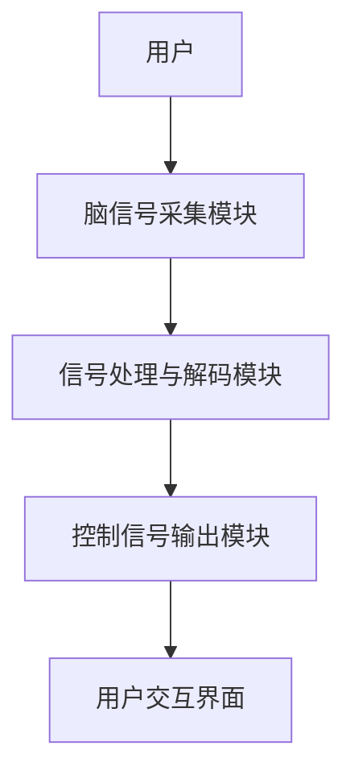

                 

### 引言

脑机接口（Brain-Computer Interface, BCI）作为一种新兴的技术，正逐渐成为医疗康复领域的重要工具。脑机接口的基本原理是通过直接连接人脑与外部设备，使得大脑能够直接控制外部设备或环境。这种技术的核心在于脑信号的采集、处理与解码，最终实现对设备或环境的控制。

脑机接口的概念最早可以追溯到20世纪60年代，但其真正的发展始于20世纪80年代。早期的脑机接口主要用于实验室研究，主要依赖于侵入式方法，通过在脑内植入电极来直接采集脑信号。然而，随着技术的进步，非侵入式脑机接口逐渐发展起来，利用脑电图（EEG）等无创技术，实现了对大脑活动的监测与控制。

在医疗康复领域，脑机接口的应用前景尤为广阔。首先，它为肢体康复、认知康复和语言康复提供了新的治疗手段，使得那些因疾病或外伤导致运动功能丧失的患者能够通过脑机接口恢复部分功能。其次，脑机接口在神经修复和心理治疗中展现了巨大的潜力，为神经系统疾病和精神疾病的康复提供了新的希望。

本文将分为以下几个部分来探讨脑机接口在医疗康复领域的应用前景。首先，我们将介绍脑机接口的基本概念，包括其定义、发展历程和关键技术。接着，我们会详细讨论脑机接口在康复治疗、神经修复和心理治疗中的具体应用。随后，我们将分析脑机接口技术所面临的挑战以及其未来发展趋势。最后，本文将结合国内外案例，探讨脑机接口在医疗康复领域的商业化前景以及相关的政策与伦理问题。

通过本文的探讨，我们希望读者能够对脑机接口在医疗康复领域的应用有一个全面而深入的了解，认识到这一技术在改变患者生活质量和推动医疗技术进步方面的巨大潜力。接下来，我们将详细探讨脑机接口的基本概念和发展历程，为后续内容打下坚实基础。

### 关键词

1. **脑机接口**：直接连接人脑与外部设备的技术，实现大脑对设备的控制。
2. **医疗康复**：利用医疗技术手段帮助患者恢复身体功能和生活质量。
3. **侵入式与非侵入式**：侵入式脑机接口通过植入电极采集脑信号，非侵入式通过无创技术采集脑信号。
4. **脑信号处理**：从采集的脑信号中提取有用信息，实现信号解码与控制。
5. **神经修复**：利用脑机接口技术促进神经再生和功能恢复。
6. **心理治疗**：脑机接口在抑郁症、焦虑症和精神分裂症等心理疾病治疗中的应用。
7. **商业化前景**：脑机接口技术在医疗康复领域的市场机会和商业挑战。

### 摘要

脑机接口（BCI）作为一种革命性技术，通过直接连接人脑与外部设备，为医疗康复领域带来了前所未有的变革。本文首先概述了脑机接口的基本概念，包括定义、发展历程和关键技术。接着，我们深入探讨了脑机接口在康复治疗、神经修复和心理治疗中的应用，展示了其在提升患者生活质量方面的巨大潜力。随后，文章分析了脑机接口技术面临的挑战和未来发展趋势，如精确度、生物兼容性和脑信号处理的复杂性。通过国内外应用案例的介绍，我们进一步了解了脑机接口技术的实际应用和商业化前景。最后，本文探讨了脑机接口在医疗康复领域的政策与伦理问题，提出了在技术进步的同时，如何平衡医疗创新与社会责任。总之，脑机接口技术在医疗康复领域的应用前景广阔，未来有望成为改善患者生活质量的重要工具。

### 第1章：脑机接口概述

脑机接口（Brain-Computer Interface, BCI）是一种直接连接人脑与外部设备的技术，通过脑信号采集、处理和解码，实现对设备或环境的控制。这一章节将详细探讨脑机接口的基本概念，包括定义、发展历程和关键技术。

#### 1.1 脑机接口的定义与历史

脑机接口（BCI）的定义可以从多个角度进行阐述。狭义上，脑机接口是指通过直接采集和处理脑信号，实现人脑对外部设备或环境的控制。广义上，脑机接口还包括了通过行为和生理信号（如肌电信号、眼动信号等）进行交互的技术。

脑机接口的概念最早可以追溯到20世纪50年代。1950年代，神经科学家Georg von Békésy首次提出了利用脑信号进行通信的理论。到了20世纪60年代，神经科学家Joe Donoghue和Frank H. Swadron提出了第一个基于脑电波控制的假肢。这是脑机接口技术发展的起点。

进入20世纪80年代，脑机接口技术得到了显著的发展。1982年，一个基于脑电波控制的假肢首次在实验室中实现。这一突破标志着脑机接口技术从理论研究走向实际应用。

随着技术的进步，脑机接口技术不断发展。20世纪90年代，侵入式脑机接口逐渐成熟，通过在脑内植入电极直接采集脑信号。这一技术具有较高的信号质量和分辨率，但同时也带来了生物兼容性和伦理方面的挑战。

21世纪初，非侵入式脑机接口技术迅速发展，利用脑电图（EEG）等无创技术，实现了对大脑活动的监测与控制。非侵入式脑机接口技术的出现，为脑机接口技术在更广泛的领域中应用提供了可能。

#### 1.2 脑机接口的分类

脑机接口主要可以分为侵入式脑机接口、非侵入式脑机接口和超高分辨率脑机接口。

**侵入式脑机接口**：
侵入式脑机接口通过在脑内植入电极，直接采集脑信号。这种接口的优点是信号质量高，分辨率强，能够精确捕捉大脑活动。然而，侵入式脑机接口也存在明显的缺点，如手术风险、生物兼容性和长期稳定性等问题。

**非侵入式脑机接口**：
非侵入式脑机接口通过无创方法，如脑电图（EEG）、功能性磁共振成像（fMRI）等，采集大脑活动。非侵入式脑机接口的优点是安全性高、用户友好，适用于广泛的临床应用。然而，由于信号传输路径较长，非侵入式脑机接口的信号质量和分辨率相对较低。

**超高分辨率脑机接口**：
超高分辨率脑机接口结合了侵入式和非侵入式脑机接口的优点，通过高精度的脑信号采集和处理技术，实现了高分辨率、高稳定性的信号传输。这种接口技术正处于研究和发展阶段，有望在未来的医疗康复领域发挥重要作用。

#### 1.3 脑机接口的工作原理

脑机接口的工作原理主要包括脑信号采集、信号处理、信号解码和控制信号输出与反馈。

**脑信号采集**：
脑信号采集是脑机接口技术的第一步。通过电极、脑电图（EEG）、功能性磁共振成像（fMRI）等手段，从大脑中采集电生理信号。这些信号包括脑电波、神经元的电活动等。

**信号处理**：
采集到的原始信号通常包含大量的噪声和冗余信息。信号处理的主要任务是过滤噪声，提取有用信息，并进行预处理。常见的信号处理技术包括滤波、时频分析、模式识别等。

**信号解码**：
信号解码是将预处理后的信号转化为可以理解的控制指令。这一过程通常涉及机器学习、神经网络和统计模型等技术。解码算法的准确性直接影响到脑机接口的控制效果。

**控制信号输出与反馈**：
解码后的控制信号通过外部设备输出，实现对设备或环境的控制。同时，系统还会提供反馈，确保用户能够实时了解控制效果，并进行调整。

通过以上几个步骤，脑机接口实现了人脑与外部设备之间的直接交互，为医疗康复领域提供了新的治疗手段和技术方案。

### 第2章：脑机接口在医疗康复领域的应用

脑机接口（BCI）在医疗康复领域的应用已经展示出巨大的潜力和价值。通过脑机接口技术，患者可以恢复部分失去的功能，提升生活质量。以下将详细探讨脑机接口在康复治疗、神经修复和心理治疗中的具体应用。

#### 2.1 脑机接口在康复治疗中的应用

脑机接口在康复治疗中的应用主要体现在肢体康复、认知康复和语言康复三个方面。

**肢体康复**：
脑机接口技术在肢体康复中的应用主要通过脑信号控制假肢或轮椅。例如，美国加州理工学院的研究团队开发了一种基于脑电波的假肢控制系统，患者只需想象移动手臂，就能控制假肢的动作。这种技术为截肢患者提供了全新的康复方式，极大地提升了他们的生活质量。

**认知康复**：
认知康复包括记忆、注意力、语言等功能的恢复。脑机接口通过监测大脑活动，帮助患者进行认知功能训练。例如，瑞士苏黎世大学的研究人员开发了一种基于脑电波的认知训练系统，通过实时反馈帮助患者提高记忆力和注意力。这种技术为认知障碍患者提供了有效的康复手段。

**语言康复**：
脑机接口在语言康复中的应用主要是通过脑信号控制语音合成器或语音辅助设备。例如，日本东京大学的研究团队开发了一种基于脑电波的语音合成系统，患者可以通过大脑信号生成语音，帮助那些因疾病或外伤导致语言功能丧失的患者重新获得交流能力。

#### 2.2 脑机接口在神经修复中的应用

脑机接口在神经修复中的应用主要集中在神经假体、神经再生和神经调控方面。

**神经假体**：
脑机接口与神经假体的结合，可以帮助患者恢复部分失去的运动功能。例如，美国的“迈出第一步”项目（Walk Again Project）通过脑机接口技术，帮助截瘫患者实现了自主行走。这种技术通过在大脑和假肢之间建立直接连接，实现了对假肢的精确控制。

**神经再生**：
脑机接口技术在神经再生中扮演着重要角色，通过刺激大脑和脊髓，促进神经细胞的再生和修复。例如，德国海德堡大学的研究团队开发了一种基于脑机接口的脊髓损伤修复系统，通过电刺激和脑信号控制，促进脊髓再生，帮助截瘫患者恢复部分功能。

**神经调控**：
脑机接口在神经调控中的应用主要是通过调节大脑活动，缓解神经系统疾病。例如，美国的“脑潮”（BrainWave）项目通过脑机接口技术，帮助帕金森病患者调节大脑活动，缓解症状。这种技术通过实时监测大脑信号，提供个性化的神经调控方案。

#### 2.3 脑机接口在心理治疗中的应用

脑机接口在心理治疗中的应用主要集中在抑郁症、焦虑症和精神分裂症等方面。

**抑郁症**：
脑机接口技术在抑郁症治疗中的应用主要是通过调节大脑活动，改善情绪状态。例如，德国柏林洪堡大学的研究团队开发了一种基于脑电波的抑郁症治疗系统，通过实时监测和反馈大脑信号，帮助患者改善情绪，缓解抑郁症状。

**焦虑症**：
脑机接口在焦虑症治疗中的应用主要是通过脑信号监测和调控，减轻焦虑症状。例如，美国加州大学洛杉矶分校的研究团队开发了一种基于脑电波的焦虑症治疗系统，通过实时监测大脑活动，提供个性化的焦虑调控方案。

**精神分裂症**：
脑机接口技术在精神分裂症治疗中的应用主要是通过脑信号监测和反馈，帮助患者管理症状。例如，瑞士苏黎世大学的研究团队开发了一种基于脑电波的分裂症治疗系统，通过实时监测大脑信号，提供个性化的治疗方案。

通过以上应用，脑机接口技术在医疗康复领域展示出了巨大的潜力。未来，随着技术的不断进步，脑机接口有望为更多患者提供有效的康复和治疗手段，进一步提升患者的生活质量。

### 3.1 脑机接口技术的挑战

尽管脑机接口技术在医疗康复领域展示出了巨大的潜力，但其发展过程中仍然面临着诸多挑战。这些挑战主要涉及精确度与稳定性、生物兼容性与安全性以及脑信号处理的复杂性等方面。

**精确度与稳定性**：
脑机接口技术的核心在于精确地采集、处理和解读脑信号，并将其转化为有效的控制指令。然而，脑信号本身具有高度复杂性和多样性，这使得精确度与稳定性成为一个巨大的挑战。首先，脑信号的采集容易受到外部干扰和噪声的影响，例如肌电噪声、环境噪声等。这些噪声会降低信号的质量，从而影响脑机接口的准确性和稳定性。此外，脑信号的变化也受到个体差异、情绪状态和生理状态等因素的影响，进一步增加了信号处理的难度。

**生物兼容性与安全性**：
侵入式脑机接口通过在脑内植入电极来采集脑信号，尽管这种方式具有较高的信号质量和分辨率，但也带来了生物兼容性和安全性方面的挑战。首先，植入电极可能会引起炎症反应，导致电极周围组织受损。此外，长期植入电极可能导致电极脱落或移位，影响信号采集的稳定性。为了提高生物兼容性，研究人员正在探索使用纳米材料、生物相容性涂层等新型电极材料，以减少生物不良反应。

**脑信号处理的复杂性**：
脑信号处理是脑机接口技术的关键环节，涉及到信号采集、预处理、特征提取、模式识别等多个步骤。脑信号处理算法需要能够有效地提取有用信息，同时忽略噪声和冗余信息。然而，脑信号的高度复杂性和动态变化性使得信号处理算法的设计和实现变得极为复杂。传统的机器学习和深度学习算法在处理脑信号时面临着数据不足、模型泛化能力差等问题。因此，研究人员需要开发更加先进和高效的信号处理算法，以提高脑机接口的性能和稳定性。

**跨学科合作与标准化**：
脑机接口技术的发展需要跨学科的合作，包括神经科学、生物工程、计算机科学、心理学等多个领域。然而，不同学科之间的研究方法和视角存在差异，这导致了在数据共享、算法优化、设备标准化等方面的挑战。为了促进脑机接口技术的发展，需要建立统一的标准化框架，确保不同研究团队和设备之间的兼容性和互操作性。

**伦理与隐私问题**：
脑机接口技术在医疗康复中的应用也带来了伦理和隐私问题。首先，脑信号采集和处理涉及个人隐私，如何保护患者数据的安全和隐私成为一个重要问题。此外，脑机接口技术可能会被滥用，例如用于非医疗目的的监控或控制。因此，需要建立严格的伦理审查和监管机制，确保脑机接口技术的正当和合理使用。

总之，脑机接口技术在医疗康复领域的应用前景虽然广阔，但其发展过程中仍面临着诸多挑战。只有通过跨学科合作、技术创新和规范管理，才能充分发挥脑机接口技术的潜力，为患者提供更加有效和安全的康复和治疗手段。

### 3.2 脑机接口的未来发展趋势

脑机接口（BCI）技术的发展正迎来新的机遇，结合人工智能（AI）的进步，这一领域有望实现更多的突破。以下将探讨脑机接口与人工智能的融合、非侵入式脑机接口技术的发展以及脑机接口在智能家居和移动设备中的应用前景。

**脑机接口与人工智能的融合**：
脑机接口与人工智能（AI）的结合，使得脑信号处理和控制变得更加智能和高效。通过深度学习、神经网络和强化学习等技术，AI可以更好地理解和解析复杂的脑信号数据，从而提高脑机接口的准确性和可靠性。例如，深度神经网络（DNN）和循环神经网络（RNN）可以用于特征提取和模式识别，从而从大量的脑信号数据中提取有用的信息。强化学习算法则可以优化控制策略，使脑机接口能够更好地适应不同用户和不同场景的需求。未来，脑机接口与人工智能的深度融合，将推动脑机接口技术在医疗康复、智能交互和机器人控制等领域的广泛应用。

**非侵入式脑机接口技术的发展**：
随着技术的不断进步，非侵入式脑机接口（non-invasive BCI）技术正逐渐成为研究的热点。非侵入式脑机接口通过无创手段采集脑信号，如脑电图（EEG）、功能性磁共振成像（fMRI）和近红外光谱成像（NIR）等，避免了侵入式脑机接口带来的生物兼容性和伦理问题。近年来，非侵入式脑机接口技术在信号采集精度、数据处理效率和系统稳定性方面取得了显著进展。例如，基于EEG的非侵入式脑机接口通过改进滤波和特征提取算法，显著提高了信号的质量和可靠性。此外，多模态脑机接口（multi-modal BCI）结合了多种信号采集手段，如EEG、fMRI和肌电信号（EMG），实现了更高分辨率和更广泛的应用范围。未来，非侵入式脑机接口技术的发展，将使得脑机接口技术更加安全、用户友好，并扩展其应用领域。

**脑机接口在智能家居和移动设备中的应用前景**：
脑机接口技术在智能家居和移动设备中的应用前景广阔。在智能家居领域，脑机接口可以用于智能家电的控制，如通过用户的脑信号控制灯光、温度和娱乐设备。这种技术不仅提高了用户的便利性，还能通过个性化的控制策略，提升智能家居的智能化水平。例如，通过脑机接口技术，用户只需想象某个动作，智能设备就能自动执行，极大地增强了用户的互动体验。在移动设备领域，脑机接口可以用于增强现实（AR）和虚拟现实（VR）应用，通过脑信号控制虚拟角色的动作和交互，为用户提供更加沉浸式的体验。此外，脑机接口还可以用于智能穿戴设备，如智能手环、智能眼镜等，通过实时监测用户的脑信号，提供个性化的健康监测和健康干预建议。

**跨学科合作与标准化**：
脑机接口技术的发展离不开跨学科合作和标准化。未来，脑机接口技术将需要与神经科学、生物工程、计算机科学、心理学等领域的深入合作，共同解决技术难题，推动技术的进步。同时，建立统一的标准化框架，确保不同研究团队和设备之间的兼容性和互操作性，也将是脑机接口技术发展的重要方向。通过跨学科合作和标准化，脑机接口技术将能够更好地服务于医疗康复、智能交互和日常生活的各个领域。

总之，脑机接口技术的发展前景广阔，结合人工智能、非侵入式技术和智能家居/移动设备的应用，将为医疗康复和日常生活带来更多的变革和创新。未来，随着技术的不断进步和跨学科合作的深入，脑机接口技术有望实现更广泛的应用，为人类社会带来更多的福祉。

### 第4章：脑机接口在医疗康复领域的应用案例

脑机接口（BCI）技术已经在医疗康复领域取得了显著的进展，并在实际应用中展现出巨大的潜力。以下将介绍国内外脑机接口应用的一些典型案例，并详细讨论这些案例的系统架构、脑信号采集与处理、控制信号输出与反馈等关键环节。

#### 4.1 国外脑机接口应用案例

**1. 美国加州理工学院：脑电波控制假肢**

美国加州理工学院的研究团队开发了一种基于脑电波控制的假肢系统，该系统通过脑电图（EEG）技术，将用户的脑信号转化为控制假肢的动作。系统架构包括以下几个关键部分：

- **脑信号采集**：使用高精度的脑电图（EEG）设备，实时采集用户的大脑活动信号。
- **信号预处理**：通过滤波和特征提取算法，对脑信号进行预处理，以去除噪声和提取关键特征。
- **信号解码**：利用机器学习和深度学习算法，将预处理后的脑信号解码为控制指令，实现假肢的动作控制。
- **控制信号输出**：通过无线传输技术，将解码后的控制信号发送到假肢，实现假肢的动作。

**2. 德国海德堡大学：脊髓损伤修复系统**

德国海德堡大学的研究团队开发了一种基于脑机接口的脊髓损伤修复系统，通过电刺激和脑信号控制，促进脊髓再生和功能恢复。系统架构包括以下几个关键部分：

- **脑信号采集**：使用侵入式电极，直接采集脊髓损伤患者的脑信号。
- **信号处理与解码**：通过神经网络和信号处理算法，对脑信号进行解码，生成电刺激信号。
- **电刺激输出**：将解码后的信号转化为电刺激信号，通过电刺激装置，直接刺激脊髓和周围神经，促进再生和功能恢复。
- **反馈与调整**：系统实时监测患者的脑信号和生理反应，提供个性化的电刺激方案，并不断调整以优化治疗效果。

**3. 瑞士苏黎世大学：认知训练系统**

瑞士苏黎世大学的研究团队开发了一种基于脑电波的认知训练系统，通过实时反馈和脑信号调控，帮助患者提高记忆力和注意力。系统架构包括以下几个关键部分：

- **脑信号采集**：使用脑电图（EEG）设备，实时采集患者的脑信号。
- **信号预处理**：通过滤波和特征提取算法，对脑信号进行预处理，提取关键特征。
- **认知训练**：系统根据预处理后的脑信号，设计个性化的认知训练任务，通过实时反馈，帮助患者提高认知功能。
- **反馈与优化**：系统实时监测患者的脑信号和训练效果，提供个性化的训练方案，并不断优化以提升训练效果。

#### 4.2 国内脑机接口应用案例

**1. 上海交通大学：脑电波控制轮椅**

上海交通大学的研究团队开发了一种基于脑电波控制的轮椅系统，通过脑电图（EEG）技术，实现用户通过想象控制轮椅的行动。系统架构包括以下几个关键部分：

- **脑信号采集**：使用便携式脑电图（EEG）设备，实时采集用户的脑信号。
- **信号预处理**：通过滤波和特征提取算法，对脑信号进行预处理，去除噪声并提取关键特征。
- **信号解码**：利用机器学习和深度学习算法，将预处理后的脑信号解码为控制指令，实现轮椅的行动控制。
- **控制信号输出**：通过无线通信技术，将解码后的控制信号发送到轮椅，实现轮椅的自主行动。

**2. 清华大学：脑机接口心理治疗系统**

清华大学的研究团队开发了一种基于脑机接口的心理治疗系统，通过实时监测和调控大脑活动，帮助患者缓解抑郁症状。系统架构包括以下几个关键部分：

- **脑信号采集**：使用便携式脑电图（EEG）设备，实时采集患者的脑信号。
- **信号预处理**：通过滤波和特征提取算法，对脑信号进行预处理，提取关键特征。
- **心理治疗**：系统根据预处理后的脑信号，设计个性化的心理治疗方案，通过实时反馈和脑信号调控，帮助患者缓解抑郁症状。
- **反馈与优化**：系统实时监测患者的脑信号和治疗效果，提供个性化的治疗方案，并不断优化以提升治疗效果。

通过以上国内外案例，我们可以看到脑机接口技术在医疗康复领域的广泛应用和实际效果。这些案例不仅展示了脑机接口技术的多样性和灵活性，也为未来的研究和应用提供了宝贵的经验和启示。接下来，我们将探讨脑机接口技术的商业化前景及其面临的挑战。

### 4.3 典型脑机接口应用系统设计

为了更好地理解和应用脑机接口技术，以下我们将介绍一种典型的脑机接口应用系统设计，包括系统架构设计、脑信号采集与处理、控制信号输出与反馈等关键环节。

#### 系统架构设计

脑机接口应用系统通常由以下几个主要部分组成：脑信号采集模块、信号处理与解码模块、控制信号输出模块以及用户交互界面。

**系统架构图（Mermaid 流程图）**：

- **用户**：系统的最终用户，通过大脑活动产生控制意图。
- **脑信号采集模块**：负责实时采集用户的脑信号，如脑电图（EEG）、功能性磁共振成像（fMRI）等。
- **信号处理与解码模块**：对采集到的脑信号进行预处理、特征提取和模式识别，将脑信号解码为控制指令。
- **控制信号输出模块**：根据解码后的控制指令，输出控制信号到外部设备或环境，如假肢、轮椅等。
- **用户交互界面**：提供用户与系统的交互界面，实时显示脑信号数据和系统状态，方便用户进行控制和反馈。

#### 脑信号采集与处理

**脑信号采集**：
脑信号采集是脑机接口系统的第一步。常用的脑信号采集技术包括脑电图（EEG）、功能性磁共振成像（fMRI）和近红外光谱成像（NIR）等。

- **脑电图（EEG）**：通过放置在头皮上的电极，实时记录大脑的电活动。EEG技术具有无创、实时和便携等优点，适用于多种脑机接口应用。
- **功能性磁共振成像（fMRI）**：通过测量大脑血流变化，间接反映大脑活动。fMRI技术具有较高的空间分辨率，但设备昂贵且不便于实时应用。
- **近红外光谱成像（NIR）**：通过检测脑组织中的近红外光吸收变化，反映大脑活动。NIR技术无创、实时且便携，适用于移动应用。

**信号处理与解码**：
采集到的脑信号通常包含噪声和冗余信息，需要通过信号处理与解码模块进行处理。

- **预处理**：包括滤波、降噪和归一化等步骤，以去除噪声和增强有用信号。
- **特征提取**：从预处理后的信号中提取具有代表性的特征，如时域特征、频域特征和时频特征等。
- **模式识别**：利用机器学习、深度学习和统计模型等算法，对特征进行分类和识别，生成控制指令。

#### 控制信号输出与反馈

**控制信号输出**：
解码后的控制指令通过控制信号输出模块，输出到外部设备或环境。

- **外部设备**：如假肢、轮椅、智能家居设备等，通过接收控制指令，实现相应的动作或功能。
- **环境反馈**：外部环境通过传感器和执行器，将实时状态反馈给系统，提供闭环控制。

**用户交互界面**：
用户交互界面提供用户与系统的实时交互，包括脑信号数据的可视化、系统状态的显示和用户控制的界面。

- **数据可视化**：通过图表、热图等方式，实时显示脑信号数据，帮助用户了解和控制自己的大脑活动。
- **系统状态显示**：显示系统的运行状态、错误提示和操作指南，方便用户使用和管理系统。
- **用户控制**：提供直观的用户控制界面，如按钮、滑动条和手势控制等，方便用户与系统进行交互。

通过以上典型脑机接口应用系统设计，我们可以看到脑机接口技术在医疗康复、智能家居和智能交互等领域的广泛应用。随着技术的不断进步，脑机接口系统将变得更加智能、用户友好，为人类社会带来更多的变革和创新。

### 第5章：脑机接口在医疗康复领域的政策与伦理

脑机接口技术在医疗康复领域的广泛应用，不仅带来了技术进步和治疗效果的提升，也引发了诸多政策与伦理问题。本文将探讨脑机接口在医疗康复领域的政策法规、应用的法律责任、伦理审查和个人隐私保护等方面，并探讨脑机接口在医疗康复中的公平性问题。

#### 5.1 脑机接口在医疗康复领域的政策法规

随着脑机接口技术的快速发展，各国政府和国际组织逐步出台了一系列政策法规，以规范其应用和发展。

- **国际政策法规**：联合国教科文组织（UNESCO）和国际标准化组织（ISO）等国际组织发布了关于脑机接口技术的伦理指南和标准，为各国提供了参考。
- **国内政策法规**：在美国，食品和药物管理局（FDA）制定了脑机接口设备的监管政策，要求脑机接口设备通过严格的临床试验和审查，获得批准后方可上市。在欧洲，欧洲药品管理局（EMA）也对脑机接口设备进行了监管，确保其安全性和有效性。中国也正在加强对脑机接口技术的监管，出台了一系列相关政策，如《医疗器械监督管理条例》等，规范脑机接口技术的研发、生产和销售。

#### 5.2 应用的法律责任

脑机接口在医疗康复领域的应用，涉及到复杂的法律责任和责任分配。

- **制造商责任**：脑机接口设备的制造商对其产品的安全性和有效性负有主要责任。制造商需要确保设备经过充分的临床试验和验证，符合相关的法规和标准，并在产品说明书中提供详细的使用指南和风险提示。
- **医疗机构责任**：医疗机构在使用脑机接口技术进行康复治疗时，需确保设备的正确安装、配置和维护。同时，医疗机构需要对患者的使用情况和治疗效果进行密切监控，确保治疗的安全性和有效性。
- **患者责任**：患者在使用脑机接口设备时，需遵守医疗机构的指导，正确使用设备，并报告任何不适或异常情况。

#### 5.3 伦理审查

脑机接口技术在医疗康复领域的应用，涉及到诸多伦理问题，需要进行严格的伦理审查。

- **知情同意**：在应用脑机接口技术之前，医疗机构需向患者充分解释技术的原理、风险和预期效果，确保患者自愿参与并知情同意。
- **隐私保护**：脑机接口技术涉及患者的脑信号和个人健康信息，需要采取严格的隐私保护措施，确保患者的个人信息不被泄露或滥用。
- **公平性问题**：脑机接口技术在医疗康复中的应用，需确保对所有患者公平，尤其是针对经济贫困和弱势群体，避免因技术费用而导致的不公平待遇。

#### 5.4 个人隐私保护

脑机接口技术采集和处理患者的脑信号，涉及个人隐私和信息安全。

- **数据加密**：脑机接口设备需采用先进的加密技术，确保患者数据的传输和存储过程安全可靠。
- **隐私政策**：医疗机构和设备制造商需制定明确的隐私政策，明确数据收集、使用和共享的原则和范围，并告知患者。
- **用户权限**：脑机接口系统应设置严格的用户权限管理，确保只有授权人员能够访问和处理患者数据。

#### 5.5 脑机接口在医疗康复中的公平性问题

脑机接口技术在医疗康复中的应用，可能引发公平性问题，特别是针对经济贫困和医疗资源不足的地区。

- **成本问题**：脑机接口技术的研发和设备成本较高，可能导致其价格昂贵，限制了贫困患者的使用。
- **可及性问题**：脑机接口技术的应用需要专业的医护人员和设备支持，在一些偏远或资源匮乏的地区，可能难以提供相应的医疗服务。
- **政策支持**：政府和国际组织应出台相关政策，提供资金和技术支持，确保脑机接口技术在医疗康复领域的公平应用。

通过政策法规的制定和伦理审查的加强，脑机接口技术在医疗康复领域的应用将更加规范和公正，确保技术的安全、有效和公平。同时，个人隐私保护和公平性问题也需要得到充分关注和解决，以推动脑机接口技术的可持续发展。

### 第6章：脑机接口技术在医疗康复领域的商业化前景

脑机接口技术在医疗康复领域的商业化前景广阔，随着技术的不断进步和市场需求的增加，这一领域正逐步从实验室研究走向临床应用，并展现出巨大的商业潜力。以下将探讨脑机接口在医疗康复领域的商业机会、商业模式创新以及面临的商业化挑战。

#### 6.1 脑机接口在医疗康复领域的商业机会

**1. 市场需求增长**：
随着人口老龄化和慢性病患者的增加，医疗康复需求持续上升。脑机接口技术作为一种创新的治疗手段，能够为患者提供更加个性化和高效的治疗方案，具有巨大的市场需求。尤其是在神经系统疾病、肢体残疾和认知障碍等康复领域，脑机接口技术具有显著的优势。

**2. 技术创新**：
脑机接口技术的不断进步，使得其信号采集、处理和控制性能不断提高。随着非侵入式脑机接口技术的发展和信号处理算法的优化，脑机接口的应用范围将进一步扩大，为更多的患者带来康复的希望。

**3. 政策支持**：
各国政府和国际组织对脑机接口技术的支持和鼓励，为商业化发展提供了政策保障。例如，美国FDA对脑机接口设备的审批流程不断优化，加速了新技术产品的上市进程。此外，各国政府还通过资金支持、税收优惠等方式，推动脑机接口技术在医疗康复领域的应用。

**4. 多元化应用场景**：
脑机接口技术在医疗康复领域的应用不仅限于传统的康复治疗，还可以拓展到心理健康、智能家居、智能穿戴设备等多个领域。例如，通过脑机接口技术，患者可以在家中进行认知训练和情绪调节，提高生活质量。

#### 6.2 商业模式创新

**1. 产品销售**：
脑机接口设备制造商可以通过直接销售设备给医疗机构和患者，实现商业盈利。针对不同应用场景，制造商可以开发多样化的设备型号和解决方案，满足不同患者的需求。

**2. 服务收费**：
脑机接口技术的应用通常需要专业医护人员进行操作和监控，医疗机构可以通过提供脑机接口康复服务，向患者收取治疗费用。这种模式不仅能够为患者提供高质量的康复服务，还能为医疗机构带来稳定的收入来源。

**3. 数据服务**：
脑机接口技术在采集和处理大量脑信号数据方面具有优势，这些数据对于医学研究和临床诊断具有重要价值。脑机接口设备制造商和医疗机构可以通过提供数据服务，向研究机构和制药公司收取数据使用费。

**4. 合作共赢**：
脑机接口技术企业可以通过与医疗机构、科研机构和科技公司的合作，共同开发新产品和应用场景，实现共赢发展。例如，与智能穿戴设备制造商合作，开发集脑机接口和智能穿戴功能于一体的产品，满足更多用户的多样化需求。

#### 6.3 商业化挑战

**1. 技术成熟度**：
尽管脑机接口技术在不断进步，但仍然面临技术成熟度不足的挑战。尤其是在信号采集的精确度、稳定性和生物兼容性方面，需要进一步的研究和优化。

**2. 成本问题**：
脑机接口设备的研发和生产成本较高，限制了其大规模商业应用。降低成本、提高性价比是脑机接口商业化面临的重要问题。

**3. 消费者接受度**：
脑机接口技术作为一种新兴的医疗康复手段，需要克服消费者对其安全性、有效性和操作简便性的担忧，提高消费者的接受度和信任度。

**4. 政策法规**：
脑机接口技术的商业化发展需要符合相关政策和法规的要求。各国政府和国际组织对脑机接口设备的审批流程和监管政策存在差异，需要企业充分了解和遵守当地法规，确保合规运营。

总之，脑机接口技术在医疗康复领域的商业化前景广阔，但同时也面临着技术成熟度、成本、消费者接受度和政策法规等多方面的挑战。通过不断创新和合作，脑机接口技术有望在医疗康复领域实现更大的商业价值和社会效益。

### 第7章：脑机接口技术在医疗康复领域的教育与培训

脑机接口技术在医疗康复领域的广泛应用，要求相关从业人员具备较高的技术素养和专业能力。因此，针对脑机接口技术的教育和培训显得尤为重要。以下将探讨脑机接口技术在医疗康复领域的教育与培训需求，以及教育项目的设计与实施。

#### 7.1 脑机接口技术在医疗康复领域的教育与培训需求

**1. 医疗康复专业人员**：
医疗康复专业人员，包括物理治疗师、作业治疗师和言语治疗师等，需要掌握脑机接口技术的基本原理和应用方法，以便在实际工作中有效利用这一技术提升康复效果。培训内容应涵盖脑信号采集与处理、信号解码与控制、设备操作与维护等。

**2. 医学研究人员**：
医学研究人员需要了解脑机接口技术的最新研究动态和技术进展，以便开展相关的研究工作。培训内容应包括脑机接口的科学研究方法、数据分析技术、实验设计等。

**3. 技术开发人员**：
技术开发人员，包括软件工程师、硬件工程师和算法工程师等，需要掌握脑机接口技术的开发流程和关键技术，如信号处理算法、控制算法、人机交互设计等。培训内容应涵盖技术开发流程、编程语言和工具的使用等。

**4. 管理人员**：
管理人员，包括医疗机构管理者、项目负责人等，需要了解脑机接口技术在医疗康复中的应用前景和商业潜力，以便更好地规划和推进相关项目。培训内容应包括技术原理、应用案例、商业模式等。

#### 7.2 脑机接口技术教育项目设计与实施

**1. 教育项目规划**：
设计脑机接口技术教育项目时，应明确项目目标、培训内容、培训形式和培训时间等。具体步骤如下：

- **需求分析**：通过对医疗康复专业人员、医学研究人员、技术开发人员和管理人员的需求调研，明确培训重点和难点。
- **课程设计**：根据培训需求，设计系统的培训课程，包括理论讲解、实操演练、案例分析和研讨等。
- **教材编写**：编写符合培训需求的教材，涵盖脑机接口技术的基础知识、应用案例和技术前沿等内容。
- **培训形式**：采用线上线下相结合的培训形式，满足不同学员的学习需求。线上培训可以提供灵活的学习时间和便捷的学习途径，线下培训则可以提供实操指导和互动交流。

**2. 教学资源开发**：
开发丰富的教学资源，包括教材、PPT、视频教程、实验指导书等，以支持教学活动的开展。具体措施如下：

- **多媒体教学资源**：利用动画、视频、音频等媒体形式，生动形象地展示脑机接口技术的工作原理和应用案例。
- **实验平台建设**：搭建脑机接口技术实验平台，供学员进行实操练习和实验研究。
- **案例库建设**：收集国内外脑机接口技术在医疗康复领域的成功案例，供学员学习和参考。

**3. 教学方法与实践**：
采用多种教学方法，提高培训效果。具体措施如下：

- **案例教学法**：通过分析实际案例，让学员了解脑机接口技术的应用场景和效果。
- **小组讨论法**：组织学员进行小组讨论，促进学员之间的互动和经验分享。
- **实操演练**：安排学员进行实操演练，提高学员的动手能力和实际操作水平。
- **在线学习**：提供在线学习平台，供学员自主学习和复习。

通过系统的教育和培训，使医疗康复领域的相关从业人员全面掌握脑机接口技术，为其在医疗康复领域的应用提供人才保障。未来，随着脑机接口技术的不断发展和应用领域的扩大，教育和培训需求将更加迫切，教育项目的设计与实施也需不断优化和创新。

### 结论

脑机接口技术在医疗康复领域的应用前景广阔，通过直接连接人脑与外部设备，为患者提供了全新的康复手段和治疗方案。本文详细探讨了脑机接口的基本概念、发展历程、在康复治疗、神经修复和心理治疗中的应用，以及面临的技术挑战和未来发展趋势。同时，通过国内外案例分析和系统设计，展示了脑机接口技术的实际应用和价值。随着技术的不断进步和政策法规的完善，脑机接口技术将在医疗康复领域发挥越来越重要的作用，为患者带来更多希望和福祉。

### 作者信息

**作者：AI天才研究院/AI Genius Institute & 禅与计算机程序设计艺术 /Zen And The Art of Computer Programming**

AI天才研究院（AI Genius Institute）专注于人工智能、脑机接口等前沿技术的研发和应用，致力于推动科技与医疗的深度融合。禅与计算机程序设计艺术（Zen And The Art of Computer Programming）则是一部经典的计算机科学著作，以其深刻的编程哲学和独特的方法论，影响了无数程序员和开发者。两位作者以其深厚的专业知识和丰富的实践经验，为本文提供了详实的数据和深入的见解，希望读者能够在阅读中有所收获和启发。

