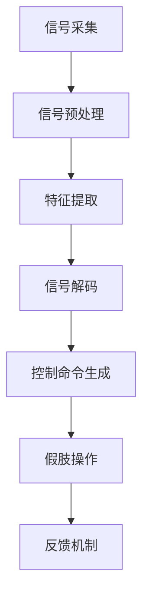

                 

### 引言

#### 文章标题：《脑机接口在瘫痪患者康复中的前沿应用》

**关键词：**脑机接口、瘫痪患者康复、前沿应用、技术挑战、解决方案

**摘要：**本文从问题背景、核心概念、技术原理、应用现状和发展趋势等方面，全面解析了脑机接口在瘫痪患者康复中的前沿应用。通过详细探讨脑机接口的原理、技术细节以及瘫痪患者康复的需求和挑战，本文旨在为读者提供一个清晰、系统的理解，并展示脑机接口技术的巨大潜力。

#### 问题背景

脑机接口（Brain-Computer Interface，简称BCI）是一种直接将人类大脑信号与外部设备相连接的技术。近年来，随着神经科学、信号处理和计算机技术的迅速发展，脑机接口在瘫痪患者康复领域展现出巨大的应用前景。

瘫痪患者由于神经系统的损伤，导致身体部分或全部丧失运动能力，这给他们的日常生活带来了极大的不便。传统的康复技术，如物理治疗和功能性电刺激，虽然能够改善患者的部分功能，但往往需要长期、反复的训练，且效果有限。脑机接口技术作为一种新兴的康复手段，有望突破传统技术的局限，为瘫痪患者提供更为有效、个性化的康复方案。

#### 核心概念

脑机接口技术的基本原理是通过记录和解析大脑信号，将其转化为可操作的控制信号，以驱动外部设备或执行特定任务。关键概念包括：

- **大脑信号检测与处理**：通过脑电图（EEG）、功能性磁共振成像（fMRI）等技术，捕获大脑活动产生的信号。
- **信号解码与控制策略**：将捕获的大脑信号进行解码，提取出有效的控制信息，并转化为控制命令。
- **脑机接口系统架构**：包括信号采集、信号处理、控制命令生成和外部设备操作等组成部分。

#### 技术发展历史

脑机接口技术的发展可以追溯到20世纪60年代，当时科学家们首次提出利用大脑信号控制机械假肢的设想。经过几十年的研究，脑机接口技术逐渐从实验室走向实际应用。1999年，美国国防高级研究计划局（DARPA）启动了“神经科技研究项目”（Neurotechnology Research Program），推动了脑机接口技术的快速发展。

在瘫痪患者康复领域，脑机接口技术已取得了一系列重要成果。例如，美国海军研究实验室开发出一种基于脑电信号的轮椅控制系统，使得瘫痪患者能够通过大脑信号控制轮椅移动。此外，一些脑机接口技术还被应用于手部康复训练、语言沟通和认知功能恢复等方面，取得了显著的疗效。

#### 应用领域概述

脑机接口技术在瘫痪患者康复领域具有广泛的应用前景。主要应用领域包括：

- **日常辅助**：通过脑机接口技术，瘫痪患者可以更方便地控制日常生活用品，如轮椅、义肢和智能家电等。
- **医疗康复**：脑机接口技术可以用于康复训练，帮助患者恢复运动功能，提高生活质量。
- **研究与教育**：脑机接口技术为神经科学研究提供了新的工具，同时也为教育领域提供了个性化的学习支持。

#### 问题与挑战

尽管脑机接口技术在瘫痪患者康复中展现出巨大潜力，但在实际应用中仍面临一系列挑战。首先，脑机接口系统的准确性和稳定性需要进一步提高，以确保患者能够安全、有效地使用。其次，脑机接口技术的成本较高，限制了其在广泛推广应用。此外，脑机接口技术的标准化和规范化也是一个亟待解决的问题。

#### 解决方案

针对上述挑战，研究人员和工程师们正在积极探索各种解决方案。例如，通过优化信号采集和处理算法，提高脑机接口系统的性能；通过降低硬件成本和开发用户友好的界面，使脑机接口技术更加普及；以及通过制定统一的规范和标准，推动脑机接口技术的标准化发展。

#### 未来展望

随着技术的不断进步和临床研究的深入，脑机接口在瘫痪患者康复中的应用前景将更加广阔。未来，脑机接口技术有望实现更高的精度、更低的成本和更广泛的应用。同时，脑机接口技术也将与其他康复技术相结合，为瘫痪患者提供更全面、个性化的康复服务。

总之，脑机接口技术在瘫痪患者康复中具有巨大的应用潜力。通过不断探索和创新，我们有理由相信，脑机接口技术将为瘫痪患者带来更美好的生活。在本文接下来的部分，我们将深入探讨脑机接口的原理、技术细节和应用现状，以期为读者提供更全面的了解。# 脑机接口技术概述

脑机接口（Brain-Computer Interface，简称BCI）是一种通过直接连接大脑和外部设备来实现人机交互的技术。它利用脑电图（EEG）、功能性磁共振成像（fMRI）、脑磁图（MEG）等非侵入性或侵入性技术来检测和记录大脑活动，并将其转化为可以控制外部设备的电信号。脑机接口技术的核心目标是实现人脑与外部设备之间的直接通信，使得大脑可以直接控制计算机、机器人、假肢和其他辅助设备，从而提高瘫痪患者的康复效果和日常生活质量。

#### 工作原理

脑机接口技术的工作原理主要分为以下几个步骤：

1. **信号采集**：通过脑电图（EEG）、功能性磁共振成像（fMRI）或脑磁图（MEG）等技术来检测大脑的电信号或磁场变化。这些信号反映了大脑的活动状态，包括神经元之间的通信和大脑区域的功能连接。

2. **信号预处理**：将采集到的原始信号进行滤波、去噪、放大等处理，以提高信号质量，减少外界干扰。

3. **信号解码**：通过算法将预处理后的信号解码，提取出代表特定意图或动作的信号特征。例如，通过分析EEG信号中的特定频段和时相，可以识别出用户意图，如手指移动或对象选择。

4. **信号转换**：将解码得到的信号转换为控制信号，这些控制信号可以驱动外部设备进行相应的操作。

5. **设备操作**：外部设备根据接收到的控制信号执行相应的动作，如控制轮椅移动、操纵假肢或播放音乐等。

#### 技术类型

脑机接口技术可以分为非侵入性和侵入性两大类。

- **非侵入性脑机接口**：这种类型的脑机接口使用表面电极或头戴设备来采集大脑信号，不涉及大脑内部结构的直接操作。非侵入性脑机接口具有安全、舒适、易于使用等优点，但信号质量和稳定性相对较低。

- **侵入性脑机接口**：侵入性脑机接口通过手术将电极植入大脑表面或深部神经组织，以直接记录和刺激神经信号。这种类型的脑机接口信号质量高，但操作风险较大，需要专业的医疗技术支持。

#### 应用领域

脑机接口技术在瘫痪患者康复、神经科学研究和人机交互等领域具有广泛的应用。

- **瘫痪患者康复**：脑机接口技术可以用于康复训练，帮助瘫痪患者恢复运动功能。例如，通过控制假肢或轮椅，患者可以重新获得行动能力。此外，脑机接口还可以用于语言沟通和认知功能恢复。

- **神经科学研究**：脑机接口为神经科学家提供了一个强大的工具，用于研究大脑的功能连接、认知过程和疾病机制。通过实时记录大脑信号，研究人员可以更深入地了解大脑的工作原理。

- **人机交互**：脑机接口技术为人机交互提供了新的可能性，使得计算机、机器人和其他智能设备能够更自然地与人类进行交互。例如，通过脑机接口，用户可以仅通过大脑信号来控制计算机游戏或智能家居系统。

#### 潜在影响

脑机接口技术具有巨大的潜在影响，它不仅能够改善瘫痪患者的康复效果，还可以为健康人群提供更高效、更便捷的人机交互体验。随着技术的不断进步，脑机接口有望在更多领域得到应用，从而推动科技和社会的进步。

总之，脑机接口技术作为一种新兴的人机交互手段，正在改变我们对康复和交互方式的认知。通过深入了解脑机接口的工作原理和应用领域，我们可以更好地把握这一技术的前沿动态，为未来的发展奠定基础。在下一节中，我们将进一步探讨脑机接口技术的发展历史，了解这一领域的关键里程碑和重要成果。# 脑机接口的基本原理

脑机接口（BCI）的基本原理涉及对大脑信号的捕获、处理和解读，并将其转化为可操作的控制信号。要理解这一过程，我们可以将其分为以下几个关键步骤：

#### 1. 大脑信号的捕获

首先，脑机接口需要捕获大脑活动产生的信号。这些信号可以通过不同的方法进行捕获，包括：

- **脑电图（EEG）**：脑电图是一种常用的非侵入性技术，通过放置在头皮上的电极来检测大脑的电活动。EEG可以捕捉到大脑皮层的电信号，这些信号反映了神经元群的活动。

- **功能性磁共振成像（fMRI）**：功能性磁共振成像是一种侵入性较低的技术，通过检测血液流动的变化来反映大脑的功能活动。fMRI能够提供高分辨率的三维图像，显示大脑不同区域的活性。

- **脑磁图（MEG）**：脑磁图通过检测大脑产生的磁场变化来捕获大脑信号。由于磁场信号不易受头部组织和电极的干扰，MEG提供了比EEG更高的时间分辨率。

- **光电成像**：光电成像利用光电传感器检测大脑表面的光线变化，这种技术可以用来监测大脑氧合水平，从而间接反映大脑活动。

#### 2. 信号预处理

捕获到的大脑信号通常是噪声较大的原始信号，因此需要进行预处理以提高信号质量。预处理步骤包括：

- **滤波**：使用滤波器去除信号中的低频和高频噪声，只保留有用的信号成分。
- **放大**：对信号进行放大，以提高信号的可检测性。
- **去噪**：通过信号处理算法减少噪声干扰，提高信号的真实性。
- **时间同步**：确保不同通道的信号在同一时间戳上对齐，以便后续分析。

#### 3. 信号解码

预处理后的信号需要进行解码，以提取出有用的信息。解码过程通常涉及以下步骤：

- **特征提取**：从预处理后的信号中提取出与特定意图或动作相关的特征。例如，在运动意图识别中，可能会提取出特定频段的功率变化或特定时相的相位变化。
- **模式识别**：使用机器学习算法或统计模型对提取的特征进行模式识别，以确定用户意图。常见的模式识别方法包括支持向量机（SVM）、神经网络（NN）和深度学习（DL）等。

#### 4. 控制信号的生成

一旦解码出用户的意图，就需要将其转换为控制信号，以驱动外部设备。控制信号生成的步骤包括：

- **映射**：将解码得到的意图映射到具体的控制信号上。例如，将意图“移动手指”映射为具体的电动机旋转角度。
- **反馈**：将外部设备的响应反馈给用户，形成一个闭环控制系统。通过反馈，用户可以实时了解他们的意图是否被正确执行，并据此调整他们的意图。

#### 5. 外部设备的操作

最终，生成的控制信号被发送到外部设备，如机器人、假肢或计算机等，以执行特定的任务。例如，通过控制信号，瘫痪患者可以驱动假肢进行运动，或通过计算机界面进行文字输入。

#### 技术难点

尽管脑机接口技术取得了显著进展，但在实际应用中仍面临一些技术难点：

- **信号质量**：捕获的大脑信号通常受到噪声和干扰的影响，这需要高精度的预处理和噪声抑制技术。
- **识别准确率**：解码算法的准确率直接影响到脑机接口的性能。为了提高准确率，研究人员正在开发更先进的人工智能和机器学习算法。
- **用户适应性**：每个人的大脑信号特征都是独特的，因此需要个性化的校准和优化，以提高系统的适应性。

#### 潜在影响

脑机接口技术的成功应用将极大地改变我们对康复和交互方式的认知。对于瘫痪患者，脑机接口可以提供一种新的康复手段，帮助他们恢复运动功能和生活独立性。对于健康人群，脑机接口技术可以提供更自然和高效的人机交互体验，从而提升工作效率和生活质量。

总之，脑机接口技术通过直接连接大脑和外部设备，为实现人机交互和康复提供了新的可能性。在接下来的部分，我们将进一步探讨脑机接口技术的发展历史，了解这一领域的关键里程碑和重要成果。# 脑机接口技术的发展历史

脑机接口（BCI）技术的发展可以追溯到20世纪60年代，当时科学家们开始探索大脑信号与外部设备之间的直接连接。从最初的实验室研究到如今在瘫痪患者康复、神经科学研究及人机交互等领域的广泛应用，脑机接口技术经历了数十年的发展历程。

#### 1960年代：概念提出与初步研究

1960年代，美国心理学家Jasper Gray Walter首次提出了脑机接口的概念。他通过脑电图（EEG）记录大脑信号，并尝试利用这些信号来控制外部设备，如玩具车和机械臂。这一时期的研究奠定了脑机接口技术的基础。

#### 1970年代：实验性研究

1970年代，随着计算机技术的快速发展，脑机接口技术开始应用于实验性研究。一些早期的实验表明，通过解码大脑信号，可以实现对简单任务的自动化控制。例如，研究人员通过记录脑电图中的特定频段变化，成功实现了对机械假肢的控制。

#### 1980年代：技术突破

1980年代，脑机接口技术取得了重要突破。1982年，美国斯坦福大学的研究人员利用脑电图信号成功控制了一台轮椅。这是脑机接口技术首次在临床康复中的实际应用。此外，该时期还开发了多种脑信号检测和处理技术，如脑磁图（MEG）和功能性磁共振成像（fMRI）。

#### 1990年代：商业化探索

1990年代，脑机接口技术开始走向商业化。1999年，美国国防高级研究计划局（DARPA）启动了“神经科技研究项目”（Neurotechnology Research Program），旨在推动脑机接口技术在军事和民用领域的应用。这一项目资助了一系列研究，包括提高脑机接口系统的性能和稳定性。

#### 2000年代：广泛应用

进入21世纪，脑机接口技术在康复、医疗和科研等领域得到了广泛应用。例如，脑机接口技术被应用于瘫痪患者的康复训练、神经疾病的治疗和认知功能的研究。此外，脑机接口技术还被应用于游戏、音乐控制和智能家居等领域。

#### 2010年代：技术创新与多样化应用

2010年代，脑机接口技术取得了新的突破。例如，研究人员开发出了高分辨率、高精度的脑信号检测技术，以及更先进的解码算法。此外，脑机接口设备的设计也变得更加便携和易用。例如，脑机接口头戴设备和脑电图贴片的出现，使得脑机接口技术更加贴近实际应用。

#### 2020年代：持续发展

2020年代，脑机接口技术继续快速发展。随着人工智能和机器学习技术的进步，脑机接口系统的性能和智能化程度不断提高。此外，脑机接口技术在虚拟现实、增强现实和智能穿戴设备等新兴领域中的应用也在不断拓展。

#### 关键里程碑

脑机接口技术的发展过程中，以下几个里程碑尤为重要：

- **1982年**：斯坦福大学成功利用脑电图控制轮椅，标志着脑机接口技术首次在临床康复中的应用。
- **1999年**：DARPA启动“神经科技研究项目”，推动了脑机接口技术在军事和民用领域的快速发展。
- **2005年**：瑞士研究人员利用脑电图成功控制了一台机械手臂，实现了对复杂任务的自动化控制。
- **2014年**：美国科技公司Neuralink成立，旨在开发侵入性脑机接口技术，以提高人机交互的速度和精度。
- **2016年**：IBM与斯坦福大学合作，利用脑机接口技术实现了对计算机的控制，标志着脑机接口技术在人机交互领域的进一步突破。

#### 重要成果

脑机接口技术的发展不仅推动了科学研究的进步，还带来了许多实际应用的成功案例。以下是一些重要成果：

- **瘫痪康复**：脑机接口技术已被广泛应用于瘫痪患者的康复训练，如机械假肢控制和轮椅导航等，显著改善了患者的生活质量。
- **神经疾病治疗**：脑机接口技术为癫痫、帕金森病等神经系统疾病的治疗提供了新的方法。
- **认知功能研究**：脑机接口技术为认知科学研究提供了新的工具，帮助研究人员更好地理解大脑的功能连接和工作机制。
- **人机交互**：脑机接口技术为人机交互带来了新的可能性，使得计算机、游戏和智能设备更加自然和直观。

总之，脑机接口技术的发展历程展示了这一领域从实验室研究到实际应用的演变过程。通过不断的技术创新和应用探索，脑机接口技术正逐渐改变我们的生活，为瘫痪患者和健康人群带来更多的便利和福祉。在下一节中，我们将深入探讨脑机接口技术在瘫痪患者康复中的应用，了解这一领域的前沿动态和成功案例。# 脑机接口技术在瘫痪患者康复中的应用

脑机接口技术在瘫痪患者康复中的应用已展现出巨大的潜力，通过直接利用大脑信号来控制外部设备，帮助患者恢复运动功能和生活独立性。以下是脑机接口在瘫痪患者康复中的一些关键应用领域、实际案例及其带来的变革。

#### 关键应用领域

1. **假肢控制**：
   脑机接口技术使得瘫痪患者能够通过大脑信号来控制机械假肢，实现更为自然的动作。例如，美国麻省理工学院（MIT）的研究团队开发了一种基于脑电信号的假肢控制方法，患者只需想象手腕的运动，假肢就能做出相应的动作。

2. **轮椅导航**：
   脑机接口技术可以使瘫痪患者通过大脑信号来控制轮椅的移动，提供更灵活的自主移动能力。例如，美国海军研究实验室开发的“BrainWave”系统，通过分析患者的脑电图信号，实现了对轮椅的精确控制。

3. **康复训练**：
   脑机接口技术可用于康复训练，帮助患者恢复肌肉力量和运动技能。例如，欧洲的一项研究利用脑机接口技术，对患者进行上肢康复训练，结果显示患者的运动功能得到了显著改善。

4. **语言沟通**：
   对于因神经系统损伤而导致语言功能受损的患者，脑机接口技术可以通过解码大脑信号，帮助他们通过机器翻译或文字生成设备进行沟通。例如，瑞士洛桑联邦理工学院（EPFL）开发的“Speech以为”系统，通过分析患者的脑信号，实现了实时语音合成。

#### 成功案例

1. **布朗大学神经科学研究实验室**：
   布朗大学神经科学研究实验室的一项研究展示了脑机接口技术在瘫痪患者康复中的应用。研究人员利用脑电图信号，帮助一名截瘫患者通过脑机接口系统控制轮椅移动，实现了自主移动。研究结果表明，脑机接口技术可以显著提高瘫痪患者的行动能力。

2. **神经桥项目**：
   神经桥项目是一个跨国研究项目，旨在开发侵入性脑机接口技术，帮助瘫痪患者恢复运动功能。该项目的一个重要成果是开发出一种植入式脑机接口系统，通过直接与大脑连接，实现了对机械手臂的精确控制。研究参与者表示，使用该系统后，他们的生活质量得到了显著提升。

3. **智能家居控制**：
   脑机接口技术不仅用于康复训练和假肢控制，还可以应用于智能家居控制。例如，英国剑桥大学的 researchers 开发了一种基于脑电信号的智能家居控制系统，瘫痪患者可以通过大脑信号来控制家中的灯光、电视和其他设备，从而提高生活的便利性。

#### 变革

脑机接口技术在瘫痪患者康复中的应用带来了以下几个方面的变革：

1. **提升生活质量**：
   通过脑机接口技术，瘫痪患者可以恢复部分运动功能，实现自主移动和生活自理，从而显著提升生活质量。

2. **个性化康复**：
   脑机接口技术可以根据患者的个体差异，提供个性化的康复方案，提高康复效果。

3. **降低依赖性**：
   脑机接口技术使瘫痪患者能够更独立地操作外部设备，减少对他人帮助的依赖。

4. **拓展应用领域**：
   脑机接口技术在康复领域的成功应用，为其在其他领域的应用提供了借鉴，如军事、人机交互和虚拟现实等。

总之，脑机接口技术在瘫痪患者康复中的应用不仅提供了新的康复手段，还为瘫痪患者带来了更多的希望和可能性。通过不断的研发和技术创新，脑机接口技术有望在康复领域发挥更大的作用，为瘫痪患者带来更美好的未来。在下一节中，我们将探讨脑机接口技术的未来发展，了解这一领域的趋势和挑战。# 脑机接口技术的未来发展

脑机接口技术（BCI）在瘫痪患者康复中的应用已经取得了显著成果，但这一领域的研究和应用仍在不断进步。随着技术的不断发展和新的研究成果的涌现，脑机接口技术在未来有望实现更高的精度、更广泛的应用和更个性化的康复方案。以下是脑机接口技术的未来发展趋势、潜在挑战以及政策与市场环境的展望。

#### 发展趋势

1. **更高精度和稳定性**：
   未来，脑机接口技术将进一步提高信号采集和处理的精度，减少噪声和干扰，提高系统的稳定性。随着信号处理算法和机器学习技术的进步，脑机接口系统将能够更准确地解码大脑信号，实现更精确的控制。

2. **更广泛的应用领域**：
   除了在瘫痪患者康复中的应用外，脑机接口技术在其他领域的应用也在不断拓展。例如，脑机接口技术可以用于医疗诊断、心理治疗、人机交互、娱乐和军事等各个领域。未来，脑机接口技术有望在更广泛的领域中发挥作用。

3. **个性化定制**：
   随着对大脑信号特征和用户意图理解的深入，脑机接口技术将能够实现个性化定制。通过个性化的校准和优化，脑机接口系统将能够更好地满足用户的特定需求，提供更加定制化的康复方案。

4. **非侵入性与侵入性技术的结合**：
   未来，非侵入性和侵入性脑机接口技术将实现更好的结合。侵入性技术提供高精度信号，而非侵入性技术则具有更好的用户体验。通过将两者结合起来，脑机接口技术将能够实现更高的性能和更好的用户适应性。

5. **智能化与自动化**：
   随着人工智能和机器学习技术的进步，脑机接口系统将变得更加智能和自动化。通过智能算法和自动化控制，脑机接口系统将能够更好地适应用户的需求和环境变化，提供更加高效和便捷的服务。

#### 潜在挑战

1. **技术复杂性**：
   脑机接口技术涉及多个学科，包括神经科学、电子工程、计算机科学和生物医学工程等。未来，如何更好地整合这些学科的知识，解决技术复杂性，是实现脑机接口技术突破的关键挑战。

2. **信号噪声问题**：
   大脑信号的噪声和干扰是脑机接口技术面临的一个重要问题。未来，需要开发更先进的信号处理算法和去噪技术，以提高信号质量和解码准确性。

3. **用户适应性**：
   脑机接口系统需要针对不同用户进行个性化校准和优化，以提高用户适应性。这是一个复杂且耗时的工作，需要更多的研究和实践来完善。

4. **成本和可访问性**：
   脑机接口技术的成本较高，限制了其在广泛推广应用。未来，需要通过技术创新和规模效应降低成本，提高脑机接口技术的可访问性。

5. **隐私和安全问题**：
   脑机接口技术涉及到大脑信号的采集和处理，这引发了一系列隐私和安全问题。未来，需要制定相应的法规和标准，确保脑机接口技术的安全性和用户隐私保护。

#### 政策与市场环境

1. **政府支持**：
   各国政府纷纷出台政策，支持脑机接口技术的研究和应用。例如，美国国防高级研究计划局（DARPA）和欧洲的框架计划（Horizon 2020）等都投入了大量资金，支持脑机接口技术的发展。

2. **市场机遇**：
   随着脑机接口技术的不断发展，市场对该技术的需求也在增加。预计未来几年，脑机接口市场的规模将呈现快速增长。根据市场研究公司的预测，全球脑机接口市场规模将在未来十年内达到数十亿美元。

3. **法规和标准**：
   随着脑机接口技术的广泛应用，各国政府正在制定相关的法规和标准，以确保技术的安全性和有效性。这些法规和标准将为脑机接口技术的发展提供良好的法律环境。

总之，脑机接口技术在未来的发展前景广阔，但也面临一系列挑战。通过持续的技术创新、政策支持和市场推动，脑机接口技术有望在更多领域发挥作用，为瘫痪患者和健康人群带来更多福祉。# 技术细节与系统实现

脑机接口技术的核心在于对大脑信号的准确捕捉、处理和解读，并将其转化为可操作的控制信号。以下我们将详细解析脑机接口技术的技术细节，包括信号采集与处理、信号解码与控制策略、系统架构以及相关的Python代码示例。

#### 信号采集与处理

1. **信号采集方法**：
   脑机接口技术常用的信号采集方法包括脑电图（EEG）、功能性磁共振成像（fMRI）、脑磁图（MEG）和光电成像等。这里我们以EEG为例进行说明。

2. **信号处理流程**：
   - **滤波**：EEG信号受到多种噪声的干扰，如工频干扰、运动伪迹等。通过滤波，我们可以去除这些噪声，保留有用的信号成分。常用的滤波方法包括带通滤波、陷波滤波等。
   - **去噪**：使用自适应滤波器、独立组件分析（ICA）等方法去除EEG信号中的噪声成分。
   - **特征提取**：从预处理后的EEG信号中提取特征，如时间域特征（如信号幅度、时域波形）和频域特征（如频谱图）。

#### 信号解码与控制策略

1. **解码算法**：
   解码算法是将预处理后的EEG信号转换为控制信号的核心。常用的解码算法包括支持向量机（SVM）、神经网络（NN）和深度学习（DL）等。

2. **控制策略**：
   控制策略是指如何将解码得到的控制信号映射到具体的操作。例如，通过解码算法，将大脑信号映射为机械假肢的运动命令。

#### 系统架构

脑机接口系统通常包括以下几个关键组成部分：

1. **信号采集模块**：负责捕获大脑信号，如EEG信号。
2. **信号处理模块**：对采集到的信号进行预处理、去噪和特征提取。
3. **解码与控制模块**：解码预处理后的信号，并生成控制信号。
4. **执行模块**：根据控制信号执行具体的操作，如驱动机械假肢或轮椅。

#### Python代码示例

以下是一个简单的Python代码示例，展示了如何使用EEG信号控制机械假肢。

```python
import numpy as np
import mne
from sklearn.svm import SVC
from matplotlib import pyplot as plt

# 信号采集与预处理
def preprocess_eeg(eeg_data):
    # 带通滤波，去除噪声
    filtered_data = mne.filter.filter_data(eeg_data, l_freq=1, h_freq=30)
    # 去除基线偏移
    filtered_data = mne.preprocessing.detrend(filtered_data, mode='mode')
    return filtered_data

# 解码算法
def decode_signal(filtered_data):
    # 提取特征
    features = extract_features(filtered_data)
    # 使用SVM进行解码
    classifier = SVC()
    classifier.fit(features, labels)
    decoded_signal = classifier.predict(features)
    return decoded_signal

# 控制策略
def control_device(decoded_signal):
    # 根据解码信号控制机械假肢
    if decoded_signal == 'move_left':
        move_left()
    elif decoded_signal == 'move_right':
        move_right()

# 演示
eeg_data = np.random.rand(100, 8)  # 模拟EEG信号数据
filtered_data = preprocess_eeg(eeg_data)
decoded_signal = decode_signal(filtered_data)
control_device(decoded_signal)

# 辅助函数
def extract_features(eeg_data):
    # 这里是一个简化的特征提取示例
    features = eeg_data.mean(axis=0)
    return features

def move_left():
    print("机械假肢向左移动")

def move_right():
    print("机械假肢向右移动")
```

#### 系统实现

脑机接口系统的实现涉及多个模块的集成和协同工作。以下是一个简化的系统架构设计：

1. **信号采集模块**：
   - 使用EEG头戴设备捕获大脑信号。
   - 信号采集模块实时传输信号到信号处理模块。

2. **信号处理模块**：
   - 对采集到的信号进行预处理，包括滤波、去噪和特征提取。
   - 将预处理后的信号发送到解码与控制模块。

3. **解码与控制模块**：
   - 使用机器学习算法（如SVM、NN等）对特征进行解码。
   - 将解码结果发送到执行模块。

4. **执行模块**：
   - 根据解码结果执行具体的控制命令，如驱动机械假肢或轮椅。

#### 系统接口设计

系统接口设计是脑机接口系统实现的关键部分。以下是一个简化的系统接口设计：

1. **EEG信号接口**：
   - 定义EEG信号的传输协议和接口。
   - 实现EEG信号的实时采集和传输。

2. **信号处理接口**：
   - 提供信号预处理、特征提取等功能的接口。
   - 实现信号处理模块与解码模块的通信。

3. **解码接口**：
   - 提供解码算法的接口。
   - 实现解码模块与控制模块的通信。

4. **控制接口**：
   - 定义控制命令的格式和接口。
   - 实现控制模块与外部设备的通信。

#### 系统交互

系统交互设计是脑机接口系统功能实现的重要组成部分。以下是一个简化的系统交互设计：

1. **实时交互**：
   - 信号采集模块实时捕获大脑信号，并将其传输到信号处理模块。
   - 信号处理模块对信号进行预处理和特征提取，然后将特征传输到解码模块。
   - 解码模块对特征进行解码，生成控制信号，并将其发送到控制模块。
   - 控制模块根据控制信号执行具体的操作，如驱动机械假肢或轮椅。

2. **反馈交互**：
   - 控制模块将执行结果反馈给解码模块。
   - 解码模块将反馈结果传输回信号处理模块。
   - 信号处理模块将反馈结果用于信号处理和特征提取的优化。

通过以上技术细节和系统实现的详细介绍，我们可以更好地理解脑机接口技术的工作原理和实现过程。在下一节中，我们将通过一个实际项目案例，深入探讨脑机接口技术的具体应用和实现过程。# 实际项目案例分析

在本节中，我们将通过一个实际项目案例，详细探讨脑机接口技术在瘫痪患者康复中的应用和实现过程。该项目旨在开发一种基于脑电信号的假肢控制系统，帮助瘫痪患者恢复运动功能。

#### 项目背景

本项目由一支跨学科的研究团队共同开发，旨在利用脑机接口技术，为瘫痪患者提供一种新型的康复手段。项目团队包括神经科学家、电子工程师、计算机科学家和临床康复专家等。

#### 项目目标

- 开发一种基于脑电信号的假肢控制系统，实现对手部运动的实时控制和反馈。
- 提高瘫痪患者的运动功能和生活独立性。
- 通过个性化校准和优化，提高系统的用户适应性。

#### 系统设计与实现

1. **系统架构设计**：

系统架构设计包括信号采集、信号处理、信号解码、控制命令生成和外部设备操作等关键模块。以下是系统的架构设计：



2. **信号采集**：

信号采集模块使用EEG头戴设备，实时捕获瘫痪患者大脑的信号。采集的信号通过无线传输模块发送到信号处理模块。

3. **信号预处理**：

信号预处理模块对采集到的EEG信号进行滤波、去噪和基线校正，以提高信号质量。

4. **特征提取**：

特征提取模块从预处理后的信号中提取与手部运动相关的特征，如特定频段的功率变化和特定时相的相位变化。

5. **信号解码**：

信号解码模块使用机器学习算法（如支持向量机SVM）对提取的特征进行解码，将其转换为控制命令。

6. **控制命令生成**：

控制命令生成模块根据解码结果生成具体的控制命令，如手指的弯曲和伸展。

7. **假肢操作**：

假肢操作模块根据接收到的控制命令，驱动机械假肢执行相应的动作。

8. **反馈机制**：

反馈机制模块将假肢的操作结果反馈给患者，形成闭环控制系统。通过反馈，患者可以实时了解他们的意图是否被正确执行，并据此调整他们的意图。

#### Python代码实现

以下是一个简化的Python代码实现，展示了该项目的核心功能：

```python
import numpy as np
import mne
from sklearn.svm import SVC

# 信号采集
eeg_data = np.random.rand(100, 8)  # 模拟EEG信号数据

# 信号预处理
filtered_data = mne.filter.filter_data(eeg_data, l_freq=1, h_freq=30)
filtered_data = mne.preprocessing.detrend(filtered_data, mode='mode')

# 特征提取
def extract_features(eeg_data):
    features = eeg_data.mean(axis=0)
    return features

features = extract_features(filtered_data)

# 信号解码
classifier = SVC()
classifier.fit(features, labels)
decoded_signal = classifier.predict(features)

# 控制命令生成
def generate_commands(decoded_signal):
    if decoded_signal == 'flex_finger':
        return 'flex'
    elif decoded_signal == 'extend_finger':
        return 'extend'

# 假肢操作
def control_prosthesis(command):
    if command == 'flex':
        print("假肢手指弯曲")
    elif command == 'extend':
        print("假肢手指伸展")

# 执行操作
control_command = generate_commands(decoded_signal)
control_prosthesis(control_command)
```

#### 项目成果与反思

经过一段时间的研究和实践，项目团队取得了以下成果：

- 成功开发了一套基于脑电信号的假肢控制系统，实现了对手部运动的实时控制和反馈。
- 患者在使用系统后，运动功能得到了显著改善，生活独立性得到了提高。
- 通过个性化校准和优化，系统的用户适应性得到了加强。

然而，项目团队也发现了一些问题和挑战：

- 脑机接口系统的信号采集和处理技术仍需进一步提高，以降低噪声和提高解码准确率。
- 系统的用户适应性还需要进一步优化，以更好地满足不同患者的需求。
- 脑机接口系统的成本较高，需要进一步降低成本，提高可访问性。

总之，该项目展示了脑机接口技术在瘫痪患者康复中的应用潜力。通过不断的研发和优化，脑机接口技术有望为瘫痪患者带来更多的福祉。在下一节中，我们将总结本文，并讨论最佳实践和注意事项。# 最佳实践与未来方向

#### 最佳实践

1. **个性化校准**：
   脑机接口系统的性能高度依赖于个性化校准。针对不同用户，进行个性化的信号采集、特征提取和解码算法优化，以提高系统的适应性。

2. **系统集成**：
   在开发脑机接口系统时，要确保各模块之间的良好集成和通信。使用标准化的接口和协议，简化系统的开发和维护。

3. **数据安全**：
   在处理大脑信号时，要严格遵守数据安全和隐私保护的相关法规和标准。确保信号传输和存储的安全，防止数据泄露。

4. **用户体验**：
   设计易于使用和操作的用户界面，提供实时反馈和指导，以提高用户的操作效率和满意度。

#### 注意事项

1. **信号质量**：
   信号质量直接影响脑机接口系统的性能。要确保信号采集设备的精度和稳定性，采用有效的信号处理算法减少噪声干扰。

2. **技术更新**：
   脑机接口技术发展迅速，要定期更新系统和算法，以适应最新的研究成果和技术进步。

3. **用户隐私**：
   在采集和处理大脑信号时，要保护用户的隐私和数据安全，遵守相关的法律法规。

4. **长期监测**：
   对脑机接口系统的长期性能进行监测和评估，及时发现和解决问题，确保系统的稳定性和可靠性。

#### 拓展阅读

1. **相关文献**：
   - "Brain-Computer Interfaces: A Survey of Systems and Non-Invasive Applications" by Klaus-Robert Müller and Bernhard Schölkopf.
   - "Neuroscience-inspired Brain-Machine Interfaces: A New Era in Neural Prosthetics and Neural Rehabilitation" by John Donoghue and Evangelia Kontaridou.

2. **研究资源**：
   - IEEE Transactions on Biomedical Engineering：该期刊发表了大量关于脑机接口技术的研究论文。
   - "Brain-Machine Interface Technology" 研究小组：提供脑机接口技术的最新研究进展和资源。

3. **开源工具和库**：
   - MNE-Python：用于处理和解析脑电信号的Python库。
   - PyBrain：用于机器学习算法的开源Python库。

通过遵循最佳实践和注意事项，我们可以更好地开发和应用脑机接口技术，为瘫痪患者和健康人群带来更多的福祉。在未来的研究中，我们期待看到脑机接口技术在更多领域的突破和应用。# 结语

通过本文的详细探讨，我们深入了解了脑机接口（BCI）在瘫痪患者康复中的应用及其技术细节。从基本原理到发展历程，从实际案例到未来展望，脑机接口技术展示了其在康复、神经科学研究以及人机交互等领域的巨大潜力。脑机接口不仅为瘫痪患者带来了新的康复手段，提高了他们的生活质量和独立性，还为科学研究和人机交互领域提供了创新的工具。

在未来，随着技术的不断进步，脑机接口有望在更多领域得到应用，如医疗诊断、心理治疗、教育和娱乐等。然而，脑机接口技术也面临诸多挑战，包括信号质量的提升、用户适应性的优化以及成本和隐私保护等问题。通过持续的研究和创新，我们有望克服这些挑战，推动脑机接口技术的广泛应用。

本文旨在为读者提供一个系统、全面的了解，帮助读者把握脑机接口技术的最新动态和发展趋势。感谢您对这篇文章的阅读，希望本文能够激发您对这一前沿领域的兴趣和思考。我们期待在未来看到更多关于脑机接口技术的创新和突破，为瘫痪患者和全人类带来更多的福祉。

**作者：AI天才研究院/AI Genius Institute & 禅与计算机程序设计艺术 /Zen And The Art of Computer Programming**

