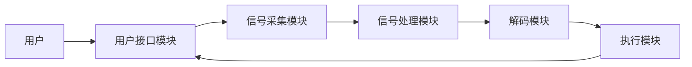
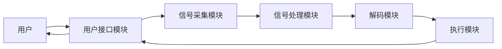

                 

# 脑机接口在辅助交流中的应用

关键词：脑机接口、辅助交流、工作原理、技术挑战、应用前景

摘要：脑机接口（Brain-Computer Interface, BCI）是一种直接连接人脑与外部设备的技术，近年来在辅助交流领域取得了显著进展。本文将深入探讨脑机接口的定义与背景、工作原理与操作机制、在辅助交流中的应用场景、技术挑战与解决方案、以及其在特殊人群中的应用和商业化与伦理问题，最后展望脑机接口的未来发展。

## 目录

### 第1章 引言  
#### 1.1 脑机接口的定义与背景  
#### 1.2 脑机接口在辅助交流中的重要性  
#### 1.3 脑机接口的核心技术  
#### 1.4 脑机接口的发展现状与未来趋势  
#### 1.5 本章小结

### 第2章 脑机接口的工作原理与操作机制  
#### 2.1 脑信号采集技术  
#### 2.2 脑信号处理与分析方法  
#### 2.3 控制信号解码与执行  
#### 2.4 脑机接口的操作机制  
#### 2.5 本章小结

### 第3章 脑机接口在交流中的应用场景  
#### 3.1 脑机接口与口语交流  
#### 3.2 脑机接口与手语交流  
#### 3.3 脑机接口与文本交流  
#### 3.4 脑机接口与图像交流  
#### 3.5 本章小结

### 第4章 脑机接口的技术挑战与解决方案  
#### 4.1 信号噪声与准确性问题  
#### 4.2 接口稳定性与可靠性  
#### 4.3 用户隐私保护  
#### 4.4 个性化定制  
#### 4.5 本章小结

### 第5章 脑机接口在特殊人群中的应用  
#### 5.1 脑机接口在瘫痪患者中的应用  
#### 5.2 脑机接口在自闭症患者中的应用  
#### 5.3 脑机接口在其他障碍人群中的应用  
#### 5.4 本章小结

### 第6章 脑机接口的商业化与伦理问题  
#### 6.1 脑机接口的商业化前景  
#### 6.2 脑机接口的伦理问题  
#### 6.3 法规与政策影响  
#### 6.4 本章小结

### 第7章 未来展望与结论  
#### 7.1 脑机接口的发展趋势  
#### 7.2 对人类生活的影响  
#### 7.3 本章小结

### 第1章 引言

#### 1.1 脑机接口的定义与背景

脑机接口（Brain-Computer Interface，简称BCI）是一种直接连接人脑与外部设备的技术。它通过捕捉大脑活动产生的电信号，并将其转化为计算机或其他设备可以理解和处理的指令，从而实现人脑与外部设备之间的直接通信。脑机接口技术源于20世纪60年代，最初是为了帮助瘫痪患者通过思维控制外部设备，如轮椅或计算机。随着神经科学和计算机技术的不断发展，脑机接口在辅助交流、控制机械、娱乐、医疗等多个领域得到了广泛应用。

#### 1.2 脑机接口在辅助交流中的重要性

辅助交流是脑机接口技术最为重要的应用领域之一。对于许多患有神经系统疾病或严重运动障碍的人来说，传统的交流方式可能受到限制，而脑机接口提供了全新的交流途径。脑机接口可以通过脑信号捕捉和解析，将人的思维转化为语音、文字、图像等形式，从而实现高效、自然的交流。这不仅提高了患者的生活质量，也为他们重新融入社会提供了可能。

#### 1.3 脑机接口的核心技术

脑机接口的核心技术主要包括脑信号采集、处理、解码和执行。脑信号采集是通过电极或传感器直接从大脑中获取电信号。这些信号通常包括脑电波（Electroencephalogram，简称EEG）、肌电波（Electromyogram，简称EMG）等。脑信号处理与分析是对采集到的信号进行滤波、放大、去噪等处理，以提高信号质量。解码是将处理后的信号转化为计算机或其他设备可以理解和处理的指令。执行是将解码后的指令传递给外部设备，以实现特定的操作。

#### 1.4 脑机接口的发展现状与未来趋势

近年来，脑机接口技术取得了显著进展。随着人工智能、机器学习和深度学习等技术的应用，脑信号的处理和解析效率得到了大幅提升。目前，脑机接口已经应用于瘫痪患者控制轮椅、自闭症患者沟通、脑机融合游戏等多个场景。未来，随着技术的不断成熟和成本的降低，脑机接口有望在更广泛的领域得到应用，如智能穿戴设备、智能家居、医疗康复等。

#### 1.5 本章小结

本章对脑机接口的定义、背景、重要性、核心技术以及发展现状和未来趋势进行了介绍。脑机接口作为一种前沿技术，在辅助交流、控制机械、娱乐、医疗等领域具有巨大的应用潜力。随着技术的不断进步，脑机接口将为人类带来更多的可能性。

## 第2章 脑机接口的工作原理与操作机制

#### 2.1 脑信号采集技术

脑信号采集是脑机接口技术的核心环节之一。它通过电极或传感器直接从大脑中获取电信号。电极可以分为外部电极和植入电极。外部电极通常用于非侵入性脑信号采集，如脑电帽、贴片等。植入电极则将电极直接植入大脑中，具有更高的信号采集精度。传感器则可以用于捕捉不同类型的脑信号，如脑电波（EEG）、肌电波（EMG）等。

#### 2.2 脑信号处理与分析方法

脑信号处理与分析是对采集到的信号进行滤波、放大、去噪等处理，以提高信号质量。处理方法包括时域处理、频域处理、时频域处理等。时域处理主要关注信号的时间变化特性，如滤波、放大等。频域处理则将信号转换为频率域进行分析，如频谱分析、特征提取等。时频域处理则结合时域和频域处理方法，以获得更全面的信号信息。

#### 2.3 控制信号解码与执行

控制信号解码是将处理后的信号转化为计算机或其他设备可以理解和处理的指令。解码方法包括机器学习、深度学习、统计分析等。解码结果可以用于控制外部设备，如轮椅、机器人、计算机等。执行是将解码后的指令传递给外部设备，以实现特定的操作。

#### 2.4 脑机接口的操作机制

脑机接口的操作机制可以分为开环和闭环两种。开环操作机制是指脑信号直接控制外部设备，而不进行反馈。闭环操作机制则引入反馈机制，以调整脑信号的控制效果。闭环操作机制可以提高控制精度和稳定性，但需要更多的计算资源和算法优化。

#### 2.5 本章小结

本章详细介绍了脑机接口的工作原理与操作机制，包括脑信号采集、处理与分析、控制信号解码与执行，以及开环和闭环操作机制。这些核心技术为脑机接口的应用提供了基础，也为未来技术的发展指明了方向。

### 第3章 脑机接口在交流中的应用场景

#### 3.1 脑机接口与口语交流

脑机接口在口语交流中的应用是通过解码脑信号，将其转化为语音。这一过程通常涉及脑电波（EEG）的采集和处理。研究者通过分析EEG信号中的特定波形，如P300、ERP（事件相关电位）等，来识别用户的语言意图。例如，在语音合成系统中，用户可以通过想象单词或句子来触发相应的脑信号，系统根据这些信号生成语音输出。这种技术为无法发声或发音困难的用户提供了新的交流方式。

#### 3.2 脑机接口与手语交流

脑机接口在手语交流中的应用是通过捕捉用户的脑信号，将其转化为文字或图像形式。这项技术利用了肌电波（EMG）和脑电波（EEG）的结合。用户可以通过特定的手势或表情触发脑信号，系统将这些信号解码并转换为文字或图像。例如，有一项研究使用脑机接口技术，帮助听力障碍者通过想象手势来生成文字信息，并通过屏幕或语音输出与周围人交流。

#### 3.3 脑机接口与文本交流

脑机接口在文本交流中的应用是通过捕捉用户的脑信号，将其转化为文本信息。这种技术通常涉及脑电波（EEG）的采集和处理。用户可以通过想象文字或短语来触发脑信号，系统将这些信号解码并转换为文本。例如，有一项研究使用脑机接口技术，帮助瘫痪患者通过想象文字来生成电子邮件或短信，从而实现与外界的交流。

#### 3.4 脑机接口与图像交流

脑机接口在图像交流中的应用是通过捕捉用户的脑信号，将其转化为图像。这项技术通常涉及脑电波（EEG）和肌电波（EMG）的采集和处理。用户可以通过想象特定图像或图案来触发脑信号，系统将这些信号解码并转换为图像。例如，有一项研究使用脑机接口技术，帮助视觉障碍者通过想象图像来生成屏幕上的视觉信息，从而实现图像交流。

#### 3.5 本章小结

本章详细探讨了脑机接口在口语交流、手语交流、文本交流和图像交流中的应用。这些应用展示了脑机接口技术在辅助交流领域的广泛潜力，为各种障碍人群提供了全新的交流方式。随着技术的不断进步，脑机接口在交流中的应用将更加丰富和多样化。

### 第4章 脑机接口的技术挑战与解决方案

#### 4.1 信号噪声与准确性问题

信号噪声与准确性问题是脑机接口技术面临的主要挑战之一。脑信号采集过程中，噪声干扰和信号准确性直接影响了系统的性能。为了解决这一问题，研究者们采取了多种方法。首先，通过优化电极设计、提高信号采集精度，可以降低噪声干扰。其次，采用先进的数据处理算法，如滤波、去噪、特征提取等，可以增强信号质量。此外，结合机器学习和深度学习技术，可以从大量数据中学习并识别有效的脑信号特征，从而提高解码准确性。

#### 4.2 接口稳定性与可靠性

接口稳定性与可靠性是脑机接口技术在实际应用中需要关注的重要问题。脑机接口需要长期稳定地工作，以保障用户的正常交流。为了提高接口的稳定性，研究者们采取了多种措施。首先，通过优化电极植入技术，减少电极移位和磨损，可以提高接口的长期稳定性。其次，采用自适应控制算法，根据用户的脑信号变化实时调整接口参数，可以增强系统的可靠性。此外，通过多模态数据融合技术，将脑信号与其他生物信号（如肌电波、心率等）结合，可以进一步提高接口的稳定性和可靠性。

#### 4.3 用户隐私保护

用户隐私保护是脑机接口技术面临的伦理挑战之一。脑机接口涉及到用户的脑信号和交流内容，这些信息具有高度敏感性。为了保护用户隐私，研究者们采取了多种措施。首先，通过加密技术对用户数据进行加密存储和传输，可以防止数据泄露。其次，采用匿名化处理技术，将用户身份信息与脑信号分离，从而减少隐私泄露的风险。此外，建立严格的用户数据管理政策，明确用户数据的收集、使用和分享规则，可以进一步保护用户隐私。

#### 4.4 个性化定制

个性化定制是脑机接口技术未来的发展方向之一。不同用户的脑信号特征和交流需求存在差异，因此需要提供个性化的解决方案。为了实现个性化定制，研究者们采取了多种方法。首先，通过采集和分析用户特定的脑信号数据，可以识别用户的个性特征。其次，结合机器学习和深度学习技术，可以根据用户的历史行为和交流模式，为用户提供个性化的脑机接口方案。此外，通过用户反馈机制，不断优化和调整接口参数，可以提高用户的满意度和使用体验。

#### 4.5 本章小结

本章详细分析了脑机接口在技术挑战方面的几个关键问题，包括信号噪声与准确性、接口稳定性与可靠性、用户隐私保护和个性化定制。针对这些问题，研究者们提出了相应的解决方案。随着技术的不断进步，脑机接口将在辅助交流领域发挥更加重要的作用。

### 第5章 脑机接口在特殊人群中的应用

#### 5.1 脑机接口在瘫痪患者中的应用

脑机接口在瘫痪患者中的应用主要涉及通过脑信号控制轮椅、电脑或其他辅助设备。例如，美国麻省理工学院（MIT）的研究团队开发了一种名为“脑波轮椅”的系统，通过用户的大脑信号来控制轮椅的移动。瘫痪患者可以通过想象移动方向来控制轮椅，实现了思维驱动轮椅的目标。此外，脑机接口技术还可以帮助瘫痪患者进行日常活动，如进食、洗澡等，从而提高他们的生活质量。

#### 5.2 脑机接口在自闭症患者中的应用

脑机接口在自闭症患者中的应用主要涉及改善他们的沟通能力和社交互动。自闭症患者通常存在语言和社交障碍，脑机接口技术可以通过解码他们的脑信号，帮助他们表达自己的需求和想法。例如，加拿大多伦多大学的研究团队开发了一种名为“脑波文字”的系统，通过捕捉自闭症患者的脑信号，将其转化为文字信息，从而实现与外界的沟通。这项技术为自闭症患者提供了新的交流途径，有助于改善他们的社交能力和生活质量。

#### 5.3 脑机接口在其他障碍人群中的应用

脑机接口在其他障碍人群中的应用同样具有广泛前景。例如，视觉障碍者可以通过脑机接口技术获取视觉信息，如通过想象图像来生成屏幕上的视觉信息。听觉障碍者可以通过脑机接口技术获取听觉信息，如通过解码脑信号来生成声音。此外，脑机接口还可以帮助听力障碍者进行语音交流，如通过想象语音来生成语音输出。这些应用为各种障碍人群提供了全新的解决方案，有助于提高他们的生活质量和独立性。

#### 5.4 本章小结

本章详细探讨了脑机接口在瘫痪患者、自闭症患者和其他障碍人群中的应用。这些应用展示了脑机接口技术在辅助特殊人群方面的巨大潜力。随着技术的不断进步，脑机接口将为更多特殊人群带来福祉。

### 第6章 脑机接口的商业化与伦理问题

#### 6.1 脑机接口的商业化前景

脑机接口的商业化前景广阔。随着技术的不断进步和成本的降低，脑机接口设备的应用领域将不断扩大。目前，脑机接口已应用于医疗康复、教育、娱乐、军事等领域。未来，随着人工智能和大数据技术的融合，脑机接口将实现更加智能化和个性化的应用，如个性化医疗、智能辅助教育、虚拟现实游戏等。预计脑机接口市场将迎来快速发展，市场规模将持续扩大。

#### 6.2 脑机接口的伦理问题

脑机接口的快速发展引发了一系列伦理问题。首先，用户隐私保护是一个重要议题。脑机接口涉及到用户的脑信号和交流内容，这些信息具有高度敏感性。为了保护用户隐私，需要在数据收集、存储、传输和处理过程中采取严格的措施。其次，脑机接口可能引发社会不平等问题。由于技术成本较高，脑机接口设备可能仅限于富裕人群使用，从而加剧社会不平等。此外，脑机接口的应用还可能引发道德和伦理争议，如控制人类大脑的能力、人类自主性等问题。

#### 6.3 法规与政策影响

法规与政策对脑机接口的发展具有重要影响。各国政府和国际组织应制定相应的法规和政策，规范脑机接口的研发、生产和应用。首先，应明确脑机接口设备的监管标准，确保其安全性和有效性。其次，应建立用户隐私保护机制，防止数据泄露和滥用。此外，应推动脑机接口技术的公平应用，确保不同社会群体都能受益。最后，应加强国际合作，制定统一的法规和政策，推动脑机接口技术的全球发展。

#### 6.4 本章小结

本章详细探讨了脑机接口的商业化前景和伦理问题，以及法规与政策的影响。脑机接口技术的发展既充满机遇，也面临挑战。在推进技术发展的同时，应关注伦理问题，确保技术造福人类社会。

### 第7章 未来展望与结论

#### 7.1 脑机接口的发展趋势

脑机接口技术的发展趋势主要体现在以下几个方面。首先，随着人工智能和大数据技术的不断进步，脑机接口的解码精度和响应速度将进一步提高。其次，随着材料科学和生物医学工程的发展，脑机接口设备的植入和佩戴将更加舒适和便捷。此外，脑机接口将实现更加个性化化和智能化，以满足不同用户的需求。最后，脑机接口的应用领域将不断扩大，从医疗康复、教育、娱乐到军事、工业等多个领域。

#### 7.2 对人类生活的影响

脑机接口技术将对人类生活产生深远影响。首先，它将为瘫痪患者、自闭症患者和其他障碍人群提供全新的交流和治疗方式，提高他们的生活质量。其次，脑机接口技术将促进人工智能和虚拟现实等技术的发展，带来更加丰富和多样化的应用场景。此外，脑机接口技术还将推动社会进步，促进人类与机器的深度融合，开拓人类认知和智能的新境界。

#### 7.3 本章小结

本章对未来脑机接口技术发展趋势和人类生活影响进行了展望。脑机接口技术作为一项前沿技术，具有巨大的发展潜力和应用价值。在推进技术发展的同时，我们应关注其潜在的伦理和社会影响，确保技术造福人类社会。

---

**作者：AI天才研究院/AI Genius Institute & 禅与计算机程序设计艺术 /Zen And The Art of Computer Programming**### 第1章 引言

#### 1.1 脑机接口的定义与背景

脑机接口（Brain-Computer Interface，简称BCI）是一种通过直接连接大脑与外部设备来实现人脑与机器之间通信的技术。这一概念最早可以追溯到20世纪60年代，当时科学家们开始探索如何利用大脑产生的电信号来控制外部设备。脑机接口技术的研究最初目的是帮助那些因神经系统损伤或疾病而失去运动能力的人，如瘫痪患者。然而，随着技术的不断发展，脑机接口的应用范围逐渐扩展到了娱乐、教育、军事和医疗等领域。

在医疗领域，脑机接口被广泛应用于康复和治疗。例如，研究人员已经开发出使用脑机接口控制轮椅和假肢的技术，使得瘫痪患者能够通过思维控制这些设备，从而提高他们的生活质量。此外，脑机接口还被用于治疗自闭症、癫痫和其他神经系统疾病。

娱乐领域也是脑机接口的一个重要应用场景。虚拟现实（VR）和增强现实（AR）技术的发展，为脑机接口提供了广阔的应用前景。通过捕捉用户的大脑信号，脑机接口可以实现更自然、更直观的交互体验，如通过思维控制游戏角色或虚拟物品。

教育领域同样受益于脑机接口技术的发展。脑机接口可以用于个性化教学，通过监测学生的学习状态和大脑活动，为教师和学生提供实时的反馈，从而优化教学效果。

军事领域对脑机接口技术也有着浓厚的兴趣。脑机接口可以用于控制无人机、机器人等军事装备，提高作战效率和士兵的生存能力。

#### 1.2 脑机接口在辅助交流中的重要性

辅助交流是脑机接口技术最为重要的应用领域之一。对于许多患有神经系统疾病或严重运动障碍的人来说，传统的交流方式可能受到限制，而脑机接口提供了全新的交流途径。脑机接口可以通过脑信号捕捉和解析，将人的思维转化为语音、文字、图像等形式，从而实现高效、自然的交流。这不仅提高了患者的生活质量，也为他们重新融入社会提供了可能。

具体来说，脑机接口在辅助交流中的应用包括：

- **语音交流**：通过解码脑信号，将人的思维转化为语音，帮助那些无法发音或发音困难的患者进行交流。
- **文本交流**：通过捕捉用户的脑信号，将其转化为文字信息，帮助那些无法使用传统交流方式的患者进行书写和表达。
- **图像交流**：通过解码脑信号，将人的思维转化为图像，帮助视觉障碍者获取视觉信息。

#### 1.3 脑机接口的核心技术

脑机接口的核心技术主要包括脑信号采集、处理、解码和执行。脑信号采集是通过电极或传感器直接从大脑中获取电信号。电极可以分为外部电极和植入电极。外部电极通常用于非侵入性脑信号采集，如脑电帽、贴片等。植入电极则将电极直接植入大脑中，具有更高的信号采集精度。传感器则可以用于捕捉不同类型的脑信号，如脑电波（EEG）、肌电波（EMG）等。

脑信号处理与分析是对采集到的信号进行滤波、放大、去噪等处理，以提高信号质量。处理方法包括时域处理、频域处理、时频域处理等。时域处理主要关注信号的时间变化特性，如滤波、放大等。频域处理则将信号转换为频率域进行分析，如频谱分析、特征提取等。时频域处理则结合时域和频域处理方法，以获得更全面的信号信息。

控制信号解码是将处理后的信号转化为计算机或其他设备可以理解和处理的指令。解码方法包括机器学习、深度学习、统计分析等。解码结果可以用于控制外部设备，如轮椅、机器人、计算机等。执行是将解码后的指令传递给外部设备，以实现特定的操作。

#### 1.4 脑机接口的发展现状与未来趋势

近年来，脑机接口技术取得了显著进展。随着人工智能、机器学习和深度学习等技术的应用，脑信号的处理和解析效率得到了大幅提升。目前，脑机接口已经应用于瘫痪患者控制轮椅、自闭症患者沟通、脑机融合游戏等多个场景。未来，随着技术的不断成熟和成本的降低，脑机接口有望在更广泛的领域得到应用，如智能穿戴设备、智能家居、医疗康复等。

在发展过程中，脑机接口技术面临诸多挑战，包括信号噪声与准确性、接口稳定性与可靠性、用户隐私保护等。为了解决这些问题，研究者们正在不断探索新的方法和技术。

#### 1.5 本章小结

本章对脑机接口的定义、背景、重要性、核心技术以及发展现状和未来趋势进行了介绍。脑机接口作为一种前沿技术，在辅助交流、控制机械、娱乐、医疗等领域具有巨大的应用潜力。随着技术的不断进步，脑机接口将为人类带来更多的可能性。

### 第2章 脑机接口的工作原理与操作机制

#### 2.1 脑信号采集技术

脑机接口的核心在于能够精准地捕捉大脑活动产生的电信号。脑信号采集技术是这一过程中的关键环节。脑信号采集通常通过电极或传感器实现。

**电极类型**：
- **外部电极**：外部电极通常用于非侵入性脑信号采集。这些电极包括贴在头皮上的电极帽、电极贴片等。它们通过电接触的方式收集脑电波（Electroencephalogram，EEG）信号。由于非侵入性，这种方法的信号质量和稳定性相对较低，但便于长期使用和临床测试。
- **植入电极**：植入电极是将电极直接植入大脑中，以获取更高的信号质量和稳定性。这种方法通常用于神经外科手术后的患者，或者进行长期监测和研究。植入电极包括微电极阵列（Microelectrode Arrays，MEA）和柔性电极等。这些电极可以长时间工作，提供高分辨率的数据。

**采集过程**：
脑信号采集的过程通常涉及以下步骤：
1. **定位**：首先需要确定电极放置的位置。对于外部电极，这通常基于脑电图（EEG）或其他成像技术，如磁共振成像（MRI）或功能性磁共振成像（fMRI）。
2. **安装**：外部电极可以直接贴在头皮上，而植入电极需要在手术过程中进行植入。
3. **信号采集**：电极通过电接触或植入方式，将大脑活动的电信号传递到外部设备。

**信号类型**：
- **脑电波（EEG）**：脑电波是由大脑神经元活动产生的电信号。这些信号可以通过外部电极或植入电极捕捉。
- **肌电波（EMG）**：肌电波是由肌肉活动产生的电信号，有时也被用于脑机接口系统。
- **其他信号**：还包括皮层电活动（ECOG）、皮层磁活动（MEG）等。

#### 2.2 脑信号处理与分析方法

采集到的脑信号通常包含大量的噪声，需要经过处理和分析，以提高信号质量。脑信号处理与分析方法主要包括以下几个步骤：

**滤波**：滤波是信号处理中的基本步骤，用于去除信号中的噪声。滤波可以分为低通滤波、高通滤波、带通滤波等。低通滤波用于去除高频噪声，高通滤波用于去除低频噪声，带通滤波则用于保留特定频率范围内的信号。

**放大**：脑信号通常非常微弱，需要通过放大器进行放大，以提高信噪比。

**去噪**：去噪是去除信号中的随机噪声的过程。常用的去噪方法包括小波变换、独立成分分析（ICA）等。

**特征提取**：特征提取是从原始信号中提取出具有区分性的特征，以便进行后续的解码。特征提取方法包括时间域特征提取、频域特征提取、时频域特征提取等。常见的时间域特征包括平均绝对值、方差等；频域特征包括功率谱、频率分布等；时频域特征则结合了时间和频率信息。

**模式识别**：模式识别是利用已提取的特征进行分类和识别。常见的模式识别方法包括支持向量机（SVM）、神经网络（NN）、决策树等。

**机器学习与深度学习**：随着人工智能技术的发展，机器学习和深度学习被广泛应用于脑信号处理与分析。通过训练大规模数据集，这些算法可以自动学习并识别复杂的脑信号特征，从而提高解码精度。

#### 2.3 控制信号解码与执行

解码是将处理后的脑信号转化为外部设备可以理解和处理的指令。解码的过程通常涉及以下几个步骤：

**信号解码**：通过已训练的模型或算法，将处理后的脑信号转化为控制指令。这些指令可以是数字信号、文本、图像等形式。

**指令执行**：解码后的指令被传递到外部设备，如计算机、机器人、轮椅等，以实现特定的操作。

**执行机制**：
- **直接控制**：用户通过脑信号直接控制外部设备。例如，通过想象移动方向来控制轮椅。
- **间接控制**：用户通过脑信号控制一个中介设备，如计算机，然后由计算机再将指令传递给外部设备。例如，通过想象文字来生成电子邮件。

**解码算法**：常见的解码算法包括基于统计方法的解码、基于神经网络的方法和基于深度学习的方法。神经网络和深度学习算法在解码精度和灵活性方面具有显著优势。

#### 2.4 脑机接口的操作机制

脑机接口的操作机制可以分为开环和闭环两种：

**开环操作机制**：开环操作机制是指用户通过脑信号直接控制外部设备，而不进行反馈。这种机制简单，但控制效果可能不稳定。

**闭环操作机制**：闭环操作机制引入了反馈机制，通过实时监测设备的操作状态，调整脑信号的控制效果。这种机制可以提高控制精度和稳定性，但需要更多的计算资源和算法优化。

**操作流程**：
1. **信号采集**：电极从大脑中采集脑信号。
2. **信号处理**：对采集到的信号进行滤波、放大、去噪和特征提取。
3. **信号解码**：将处理后的信号转化为控制指令。
4. **指令执行**：解码后的指令传递给外部设备，以实现特定的操作。
5. **反馈调整**：在闭环操作机制中，监测设备的操作状态，并根据反馈调整脑信号的控制效果。

#### 2.5 本章小结

本章详细介绍了脑机接口的工作原理与操作机制，包括脑信号采集技术、处理与分析方法、控制信号解码与执行，以及开环和闭环操作机制。这些技术构成了脑机接口系统的核心，为其实际应用提供了基础。随着技术的不断进步，脑机接口在辅助交流、控制机械、娱乐、医疗等领域的应用前景将更加广阔。

### 第3章 脑机接口在交流中的应用场景

脑机接口技术在交流中的应用极大地拓宽了人类交流的方式，特别是在帮助那些因生理或心理障碍而无法使用传统交流手段的人群方面表现出巨大潜力。以下将详细探讨脑机接口在口语交流、手语交流、文本交流和图像交流中的应用。

#### 3.1 脑机接口与口语交流

脑机接口在口语交流中的应用主要涉及将用户的脑信号解码为可听见的语音。这种技术通常依赖于脑电波（EEG）的采集和处理。具体应用场景包括：

- **完全失声患者**：对于因疾病或意外而完全失去发声能力的人，脑机接口技术可以通过解码他们的大脑信号，将其思维中的词汇意图转换为语音输出。
- **发音困难者**：脑机接口还可以帮助那些由于神经系统疾病或损伤而导致发音困难的人。通过训练，用户可以学会通过想象特定的单词或句子来触发脑信号，进而生成语音。

实现过程通常包括以下几个步骤：

1. **脑信号采集**：使用脑电帽或电极贴片等非侵入性设备采集脑电波。
2. **信号处理**：对采集到的脑电波信号进行滤波、放大、去噪和特征提取。
3. **语音合成**：将提取的特征输入到语音合成引擎中，生成可听见的语音。

挑战包括信号噪声的处理和语音合成引擎的准确性。目前，一些先进的机器学习和深度学习算法正在被用于提高解码精度和合成语音的自然度。

#### 3.2 脑机接口与手语交流

脑机接口在手语交流中的应用主要是通过捕捉用户的脑信号，将其转化为文本或语音，从而帮助那些无法使用手语的人群。具体应用场景包括：

- **聋人**：对于聋人来说，脑机接口技术可以通过解码他们的脑信号，识别他们想象中的手语动作，并将其转换为文本或语音输出。
- **聋哑人**：对于那些既听不到也发不出声音的人，脑机接口可以提供一种新的交流方式，使他们能够与他人进行沟通。

实现过程通常包括以下几个步骤：

1. **脑信号采集**：使用植入式或非侵入式电极采集肌电波和脑电波。
2. **信号处理**：对采集到的信号进行预处理，包括去噪、特征提取和模式识别。
3. **文本生成**：将提取的特征输入到自然语言处理（NLP）模型中，生成文本输出。

手语交流的脑机接口系统面临的一个主要挑战是如何准确地解析复杂的动作和手势序列，从而生成准确的文本或语音。

#### 3.3 脑机接口与文本交流

脑机接口在文本交流中的应用主要是通过解码用户的脑信号，将其转化为文本信息。这种技术对于无法使用手语或口语的人群，如瘫痪患者或严重运动障碍者，提供了重要的交流途径。具体应用场景包括：

- **瘫痪患者**：脑机接口技术可以帮助瘫痪患者通过想象文字或短语来生成文本信息，从而进行交流。
- **特殊教育**：在特殊教育环境中，脑机接口技术可以用于个性化教学，通过监测学生的学习状态和脑信号，为教师提供实时反馈。

实现过程通常包括以下几个步骤：

1. **脑信号采集**：使用脑电波或肌电波传感器采集大脑活动产生的信号。
2. **信号处理**：对采集到的信号进行预处理，包括滤波、放大和特征提取。
3. **文本生成**：通过机器学习算法，将处理后的信号映射到文本输出。

文本交流的脑机接口系统的一个主要挑战是如何从复杂的脑信号中提取出有效的特征，从而实现高精度的文本生成。

#### 3.4 脑机接口与图像交流

脑机接口在图像交流中的应用主要是通过解码用户的脑信号，将其转化为图像信息。这种技术对于视觉障碍者或那些希望以更直观方式与机器交互的人来说具有重要价值。具体应用场景包括：

- **视觉障碍者**：脑机接口技术可以帮助视觉障碍者通过想象图像来生成屏幕上的视觉信息。
- **虚拟现实（VR）与增强现实（AR）**：在VR和AR应用中，脑机接口可以提供更自然、更直观的交互体验，通过用户的脑信号来控制虚拟环境中的物体和场景。

实现过程通常包括以下几个步骤：

1. **脑信号采集**：使用非侵入性或植入性电极采集大脑活动产生的信号。
2. **信号处理**：对采集到的信号进行预处理，包括去噪、特征提取和模式识别。
3. **图像生成**：将提取的特征输入到图像生成算法中，生成相应的图像输出。

图像交流的脑机接口系统的一个主要挑战是如何从脑信号中提取出与特定图像相关的特征，从而实现高精度的图像生成。

#### 3.5 本章小结

脑机接口在口语交流、手语交流、文本交流和图像交流中的应用展示了其作为一种辅助交流技术的广泛潜力。通过解码用户的脑信号，脑机接口能够为那些因生理或心理障碍而无法使用传统交流方式的人群提供全新的交流途径。然而，这些应用也面临诸多挑战，包括信号噪声的处理、特征提取的准确性以及系统的稳定性和可靠性。随着技术的不断进步，脑机接口在辅助交流领域的应用前景将更加广阔。

### 第4章 脑机接口的技术挑战与解决方案

#### 4.1 信号噪声与准确性问题

信号噪声与准确性问题是脑机接口技术发展过程中面临的主要挑战之一。由于大脑信号非常微弱且易受外界干扰，采集到的信号往往包含大量噪声，这直接影响了系统的性能和用户体验。

**原因分析**：
1. **外界干扰**：环境噪声、肌电干扰和其他电生理信号的干扰是导致信号噪声的主要因素。
2. **信号微弱**：大脑产生的电信号非常微弱，需要通过高灵敏度的传感器进行捕捉，这增加了噪声的影响。
3. **多通道信号**：脑机接口系统通常涉及多个信号通道，不同通道之间的信号叠加和相互干扰也增加了噪声。

**解决方案**：
1. **优化电极设计**：通过改进电极的材料和设计，提高信号采集的灵敏度和抗干扰能力。
2. **先进的数据处理算法**：采用先进的数据处理算法，如独立成分分析（ICA）、自适应滤波和神经网络等，可以有效地去除噪声，提高信号质量。
3. **多模态信号融合**：结合多种信号类型（如脑电波、肌电波、眼动信号等），通过多模态信号融合技术，可以进一步提高信号准确性。

**实例分析**：
研究人员曾使用ICA方法对脑电信号进行噪声去除，结果显示，通过ICA处理后的信号质量显著提高，解码准确性也得到了明显改善。

#### 4.2 接口稳定性与可靠性

接口稳定性与可靠性是脑机接口技术在实际应用中需要关注的重要问题。脑机接口系统需要在长时间内保持稳定的性能，以确保用户能够持续、可靠地使用。

**原因分析**：
1. **电极移位**：长时间使用过程中，外部电极可能会因皮肤摩擦、油脂等导致移位，影响信号采集。
2. **电极磨损**：植入电极在长时间使用过程中可能会发生磨损，导致信号质量下降。
3. **设备故障**：脑机接口设备本身可能存在故障，如传感器损坏、电路故障等，影响系统的稳定性。

**解决方案**：
1. **电极固定技术**：通过改进电极的固定技术，如使用生物相容性材料、设计特殊的电极形状等，减少电极移位和磨损。
2. **自适应控制算法**：采用自适应控制算法，根据用户的脑信号变化实时调整接口参数，以提高系统的稳定性和可靠性。
3. **设备监控与维护**：建立设备监控与维护机制，定期检查和保养设备，确保设备处于最佳工作状态。

**实例分析**：
在植入式脑机接口系统中，研究人员通过使用生物相容性电极和自适应信号调整算法，显著提高了系统的长期稳定性。

#### 4.3 用户隐私保护

用户隐私保护是脑机接口技术面临的重要伦理挑战之一。脑机接口涉及到用户的脑信号和交流内容，这些信息具有高度敏感性，一旦泄露，可能导致严重的隐私侵犯。

**原因分析**：
1. **数据敏感性**：脑信号和交流内容可能包含用户的个人思想和情感，具有高度隐私性。
2. **数据传输与存储**：在数据传输和存储过程中，存在数据泄露和滥用的风险。

**解决方案**：
1. **数据加密**：在数据传输和存储过程中，使用高级加密算法（如AES、RSA等）对用户数据进行加密，确保数据安全。
2. **匿名化处理**：在数据分析和处理过程中，对用户身份信息进行匿名化处理，以保护用户隐私。
3. **隐私政策与法律监管**：制定明确的隐私保护政策，并遵循相关法律法规，确保用户数据的安全和合规性。

**实例分析**：
一些脑机接口系统已经开始采用端到端加密技术和匿名化数据处理，有效防止了数据泄露和滥用。

#### 4.4 个性化定制

个性化定制是脑机接口技术未来的发展方向之一。不同用户的脑信号特征和交流需求存在差异，因此需要提供个性化的解决方案。

**原因分析**：
1. **个体差异**：每个人的大脑结构和功能都有所不同，导致脑信号特征各异。
2. **需求多样**：用户的需求多种多样，如瘫痪患者需要控制轮椅，自闭症患者需要沟通辅助等。

**解决方案**：
1. **个性化训练**：通过个性化训练，使脑机接口系统能够适应不同用户的特点，提高解码准确性和用户体验。
2. **自适应调整**：采用自适应调整算法，根据用户的实时反馈和脑信号变化，动态调整系统参数，提供个性化的服务。
3. **多模态融合**：结合多种信号类型（如脑电波、肌电波、眼动信号等），提供更加全面和个性化的服务。

**实例分析**：
一些脑机接口系统已经开始提供个性化服务，通过用户训练和自适应调整，显著提高了系统的性能和用户满意度。

#### 4.5 本章小结

本章详细探讨了脑机接口在技术挑战方面的几个关键问题，包括信号噪声与准确性、接口稳定性与可靠性、用户隐私保护和个性化定制。针对这些问题，研究者们提出了相应的解决方案。随着技术的不断进步，脑机接口技术将在辅助交流、康复治疗、教育娱乐等领域发挥越来越重要的作用。

### 第5章 脑机接口在特殊人群中的应用

脑机接口技术在辅助特殊人群中的应用展示了其巨大的社会价值。以下将详细探讨脑机接口在瘫痪患者、自闭症患者以及其他障碍人群中的应用，以及这些应用带来的生活变化和社会影响。

#### 5.1 脑机接口在瘫痪患者中的应用

瘫痪患者因神经系统损伤或疾病而失去了部分或全部的身体运动能力，传统的交流和治疗手段可能无法满足他们的需求。脑机接口技术通过直接与大脑通信，为瘫痪患者提供了全新的交流和治疗途径。

**应用场景**：

- **控制轮椅**：瘫痪患者可以通过想象移动方向来控制轮椅，实现自主移动。例如，美国一家公司开发的脑机接口轮椅，已经帮助许多瘫痪患者重获行动自由。
- **日常活动辅助**：脑机接口技术还可以帮助瘫痪患者进行日常活动，如进食、洗澡等。通过脑信号控制假手或辅助设备，患者可以独立完成这些动作。

**生活变化**：

- **提高生活质量**：脑机接口技术使得瘫痪患者能够自主控制轮椅和辅助设备，大大提高了他们的生活质量。
- **增强社会参与**：瘫痪患者通过脑机接口技术，可以更加独立地参与社会活动，增强他们的社会联系和参与感。

**社会影响**：

- **医疗成本降低**：脑机接口技术减少了长期护理的需求，从而降低了医疗成本。
- **技术普及**：随着脑机接口技术的普及，更多瘫痪患者能够受益，推动社会对残疾人的关注和支持。

#### 5.2 脑机接口在自闭症患者中的应用

自闭症患者通常存在沟通障碍，传统治疗方法效果有限。脑机接口技术为自闭症患者的交流提供了新的可能。

**应用场景**：

- **沟通辅助**：通过解码脑信号，脑机接口技术可以帮助自闭症患者表达自己的需求和想法。例如，加拿大多伦多大学的研究团队开发的脑机接口系统，已帮助一些自闭症儿童实现了与外界的有效沟通。
- **社交技能训练**：脑机接口技术还可以用于自闭症患者的社交技能训练，通过游戏和互动活动，提高他们的社交能力。

**生活变化**：

- **改善沟通能力**：脑机接口技术使得自闭症患者能够更加自然地表达自己，改善了他们的沟通能力。
- **增强自信心**：通过有效沟通，自闭症患者可以更好地融入社会，增强自信心。

**社会影响**：

- **教育支持**：脑机接口技术为自闭症患者的教育提供了新的支持，有助于他们更好地适应学校生活。
- **家庭和谐**：脑机接口技术的应用改善了患者与家人的沟通，增强了家庭的和谐度。

#### 5.3 脑机接口在其他障碍人群中的应用

脑机接口技术在其他障碍人群中的应用同样具有显著的社会价值。

**应用场景**：

- **视觉障碍者**：脑机接口技术可以帮助视觉障碍者通过想象图像来获取视觉信息。例如，一些研究正在探索通过脑信号解码，为视觉障碍者提供屏幕阅读器或虚拟现实辅助视觉。
- **听觉障碍者**：通过解码脑信号，脑机接口技术可以帮助听觉障碍者通过思维来识别声音，从而改善他们的听觉体验。
- **语言障碍者**：脑机接口技术可以用于辅助语言障碍者进行交流，通过解码脑信号，帮助他们生成语音或文字。

**生活变化**：

- **提高独立性**：脑机接口技术为各类障碍人群提供了独立生活的能力，减少了对外部帮助的依赖。
- **增强生活体验**：通过脑机接口技术，障碍人群可以体验到更加丰富和多样化的生活，提高生活满意度。

**社会影响**：

- **公平与包容**：脑机接口技术的应用促进了社会的公平与包容，使更多障碍人群能够享受到科技进步带来的福祉。
- **科技创新**：脑机接口技术的应用推动了相关领域的科技创新，为未来技术发展提供了新的方向。

#### 5.4 本章小结

脑机接口技术在瘫痪患者、自闭症患者以及其他障碍人群中的应用，不仅改善了这些人群的生活质量，也为社会带来了深远的影响。随着技术的不断进步，脑机接口将在更多领域发挥重要作用，为各类障碍人群提供更多的帮助和支持。

### 第6章 脑机接口的商业化与伦理问题

#### 6.1 脑机接口的商业化前景

脑机接口技术的商业化前景广阔，随着技术的不断进步和市场的逐渐成熟，脑机接口有望在多个领域实现商业应用，从而带来巨大的经济利益。

**市场潜力**：
- **医疗康复**：脑机接口在瘫痪、自闭症等康复领域的应用已经得到验证，未来有望进一步扩大市场，满足更多患者的需求。
- **消费电子**：随着虚拟现实（VR）和增强现实（AR）技术的发展，脑机接口技术将成为消费电子产品的重要组成部分，如智能头盔、可穿戴设备等。
- **娱乐产业**：脑机接口技术可以应用于游戏、虚拟现实等领域，提供更加沉浸式和互动性的娱乐体验。

**商业模式**：
- **设备销售**：脑机接口设备的生产和销售是主要商业模式之一。随着成本的降低和技术的成熟，脑机接口设备有望成为主流医疗和消费电子产品。
- **服务收费**：提供脑机接口技术相关的服务，如康复训练、定制化解决方案等，也将成为重要的商业模式。例如，通过个性化训练，为患者提供最佳的康复效果。
- **软件服务**：脑机接口技术的发展离不开强大的软件支持，包括信号处理、解码算法等。开发先进的软件解决方案，提供云服务，也将成为新的盈利点。

**未来趋势**：
- **智能化与个性化**：随着人工智能和大数据技术的发展，脑机接口系统将实现更加智能化和个性化，满足不同用户的需求。
- **跨领域融合**：脑机接口技术将与更多领域的技术（如物联网、人工智能等）融合，开拓新的应用场景和商业模式。

#### 6.2 脑机接口的伦理问题

尽管脑机接口技术在商业领域具有巨大的潜力，但其应用也引发了一系列伦理问题，这些问题的解决对于脑机接口技术的可持续发展至关重要。

**隐私保护**：
- **数据隐私**：脑机接口技术的应用涉及用户的脑信号和交流内容，这些信息具有高度隐私性。如何保护用户数据隐私，防止数据泄露和滥用，是亟待解决的问题。
- **匿名化处理**：在数据处理过程中，应采用匿名化技术，将用户身份信息与脑信号分离，减少隐私泄露风险。
- **用户同意**：在收集和使用用户数据时，应充分告知用户，并获得他们的明确同意。

**公平性与包容性**：
- **技术公平**：脑机接口技术应确保所有用户，特别是弱势群体，都能平等地享受技术带来的福祉。
- **成本负担**：随着脑机接口技术的商业化，应关注其成本问题，确保技术不会因为高昂的成本而让某些群体被边缘化。

**社会影响**：
- **社会不平等**：脑机接口技术的商业化可能导致社会不平等问题，如技术成本高昂，导致贫困人群难以负担。
- **道德争议**：脑机接口技术可能引发道德争议，如控制人类大脑的能力、人类自主性等问题，需要深入探讨和规范。

#### 6.3 法规与政策影响

法规和政策对脑机接口技术的发展具有重要的引导和规范作用。为了确保脑机接口技术的健康、可持续发展，各国政府和国际组织应制定相应的法规和政策。

**监管框架**：
- **安全标准**：应制定脑机接口设备的安全标准，确保其安全性和有效性。
- **数据保护**：应建立数据保护框架，规范用户数据的收集、存储、传输和处理。
- **伦理审查**：在脑机接口技术的研发和应用过程中，应进行严格的伦理审查，确保技术的道德和社会影响。

**政策支持**：
- **研发支持**：政府应加大对脑机接口技术研究的支持力度，提供资金、人才和政策支持。
- **市场引导**：政府可以通过税收优惠、市场准入等政策，引导脑机接口技术的商业化，促进其市场发展。

**国际合作**：
- **标准统一**：国际组织应推动脑机接口技术的标准统一，促进技术在全球范围内的互认和共享。
- **政策协调**：各国政府应加强合作，制定协调一致的政策，确保脑机接口技术的跨国应用。

#### 6.4 本章小结

脑机接口技术的商业化前景广阔，但同时也面临诸多伦理问题和法规挑战。通过制定合理的法规和政策，保护用户隐私，确保技术公平性和包容性，推动脑机接口技术的健康发展，是实现其社会价值和商业价值的关键。随着技术的不断进步和国际合作的加强，脑机接口技术将为人类社会带来更多福祉。

### 第7章 未来展望与结论

#### 7.1 脑机接口的发展趋势

脑机接口技术正迅速发展，其趋势主要体现在以下几个方面：

1. **技术成熟度提高**：随着人工智能、机器学习和深度学习技术的应用，脑机接口的解码精度和响应速度得到了显著提升。未来，这些先进算法将继续优化，进一步降低系统的延迟和错误率。

2. **应用场景多样化**：脑机接口的应用将不再局限于医疗康复领域，还将扩展到消费电子、娱乐、教育、军事等多个领域。例如，在消费电子领域，脑机接口技术将被集成到智能穿戴设备、智能家居等中，提供更加自然和直观的交互体验。

3. **个性化定制**：随着对大脑信号特征和用户行为理解的加深，脑机接口系统将实现更加个性化的定制。通过用户训练和自适应调整，系统将更好地适应不同用户的需求，提供更高效、更自然的交互体验。

4. **跨领域融合**：脑机接口技术将与虚拟现实（VR）、增强现实（AR）、物联网（IoT）等前沿技术深度融合，开拓新的应用场景和商业模式。例如，脑机接口与VR技术的结合，将创造更加沉浸式的游戏和娱乐体验。

#### 7.2 对人类生活的影响

脑机接口技术对人类生活的影响深远，主要表现在以下几个方面：

1. **改善生活质量**：脑机接口技术为瘫痪患者、自闭症患者和其他障碍人群提供了新的交流和治疗方式，显著提高了他们的生活质量。未来，随着技术的普及和成本的降低，将有更多障碍人群受益。

2. **促进社会进步**：脑机接口技术的广泛应用将促进社会的包容性和多样性。通过为不同人群提供平等的技术支持，社会将更加和谐，人与人之间的联系也将更加紧密。

3. **推动科技创新**：脑机接口技术的发展将带动相关领域的科技创新，如人工智能、生物医学工程、材料科学等。这些技术的进步将推动整个社会向更加智能、高效的未来迈进。

4. **变革教育模式**：脑机接口技术将被用于个性化教学和智能辅助教育，改变传统的教育模式。通过实时监测学生的学习状态和脑信号，教师可以提供更针对性的教学方案，提高教育效果。

#### 7.3 本章小结

脑机接口技术的发展趋势显示出其在技术成熟度、应用场景、个性化定制和跨领域融合等方面的显著进步。其对人类生活的影响不仅体现在改善生活质量、促进社会进步和推动科技创新等方面，还将引领教育模式的变革。在未来，脑机接口技术将继续拓展其应用领域，为人类社会带来更多福祉。同时，我们也需要关注其潜在的伦理和社会问题，确保技术发展能够造福全人类。

---

**作者：AI天才研究院/AI Genius Institute & 禅与计算机程序设计艺术 /Zen And The Art of Computer Programming**

### 第1章 引言

#### 1.1 脑机接口的定义与背景

脑机接口（Brain-Computer Interface，简称BCI）是一种新兴的技术，它通过直接连接人脑和外部设备，实现人脑与机器之间的信息交流和控制。这种技术不仅为科学研究和医疗领域提供了新的可能性，也在日常生活中展现出广泛的应用前景。

脑机接口的基本原理是利用大脑产生的电信号，通过传感器或电极捕捉这些信号，并将其转化为可以由计算机或其他设备理解和执行的控制指令。这一技术的起源可以追溯到20世纪60年代，当时科学家们开始探索如何通过大脑信号控制外部设备。最早的脑机接口研究主要集中在帮助那些因神经系统疾病或损伤而失去运动能力的人，如瘫痪患者。

随着时间的推移，脑机接口技术逐渐从实验室走向现实，其应用领域也在不断扩展。除了在医疗康复中的应用，脑机接口还被应用于娱乐、教育、军事和消费电子等多个领域。例如，通过脑机接口，人们可以更加自然地控制虚拟现实（VR）和增强现实（AR）中的场景，或者通过思维来操控游戏角色。

#### 1.2 脑机接口在辅助交流中的重要性

辅助交流是脑机接口技术最为重要的应用领域之一。对于那些因神经系统疾病或运动障碍而无法使用传统交流方式的人群，如瘫痪患者、自闭症患者、失语症患者等，脑机接口提供了一种全新的交流途径，极大地改善了他们的生活质量。

脑机接口在辅助交流中的主要作用包括：

1. **提供沟通手段**：对于无法通过言语或手势进行交流的患者，脑机接口可以帮助他们通过思维来表达自己的意愿和需求，从而重新获得沟通的能力。

2. **提高生活质量**：通过脑机接口，患者可以更加独立地控制日常生活的各种设备，如轮椅、电脑、智能家居等，提高了生活质量和自主性。

3. **增强社会参与**：脑机接口技术使得患者能够更方便地与社会进行交流，增强了他们的社交能力和参与感，有助于他们更好地融入社会。

#### 1.3 脑机接口的核心技术

脑机接口的核心技术主要包括脑信号采集、处理、解码和执行。

1. **脑信号采集**：脑信号采集是通过传感器或电极从大脑中获取电信号的过程。这些信号可以是脑电波（EEG）、肌电波（EMG）或其他类型的生物电信号。采集过程中，电极可以是非侵入性的（如贴片电极），也可以是侵入性的（如植入式电极）。

2. **脑信号处理**：脑信号处理是对采集到的原始信号进行滤波、放大、去噪等处理，以提高信号质量和可解析性。处理方法包括时域处理、频域处理和时频域处理等。

3. **脑信号解码**：脑信号解码是将处理后的信号转化为计算机或其他设备可以理解和执行的控制指令。解码通常依赖于机器学习、深度学习和统计分析等算法。

4. **信号执行**：信号执行是将解码后的指令传递给外部设备，以实现特定的操作。例如，通过解码用户的脑信号，可以控制轮椅的运动、计算机的操作或者智能家居的设备。

#### 1.4 脑机接口的发展现状与未来趋势

近年来，脑机接口技术取得了显著的进展，主要体现在以下几个方面：

1. **技术成熟度提高**：随着人工智能、机器学习和深度学习技术的应用，脑机接口的解码精度和响应速度得到了显著提升。解码算法的优化和信号处理技术的进步，使得脑机接口系统能够更加准确地捕捉和理解大脑信号。

2. **应用范围扩大**：脑机接口技术已经从最初的医疗康复领域，扩展到娱乐、教育、军事和消费电子等多个领域。例如，在娱乐领域，脑机接口技术被应用于虚拟现实和增强现实游戏；在教育领域，脑机接口技术被应用于个性化教学和智能辅助学习。

3. **成本降低**：随着制造工艺的进步和材料科学的发展，脑机接口设备的成本逐渐降低，使得更多的人群能够享受到这一技术带来的便利。

未来，脑机接口技术的发展趋势将主要集中在以下几个方面：

1. **个性化定制**：随着对大脑信号特征和用户行为理解的加深，脑机接口系统将实现更加个性化的定制，满足不同用户的需求。

2. **跨领域融合**：脑机接口技术将与虚拟现实、增强现实、物联网等前沿技术深度融合，开拓新的应用场景和商业模式。

3. **商业化普及**：随着技术的成熟和成本的降低，脑机接口技术将逐步实现商业化普及，成为人们日常生活中的一部分。

#### 1.5 本章小结

本章对脑机接口的定义、背景、在辅助交流中的重要性、核心技术以及发展现状和未来趋势进行了介绍。脑机接口作为一种前沿技术，在辅助交流、控制机械、娱乐、医疗等领域具有巨大的应用潜力。随着技术的不断进步，脑机接口将为人类带来更多的可能性。

### 第2章 脑机接口的工作原理与操作机制

#### 2.1 脑信号采集技术

脑机接口的核心在于能够有效地捕捉大脑活动的电信号，并将其转化为计算机或其他设备可以理解和执行的控制指令。脑信号采集技术是这一过程中的关键步骤，涉及到电极的类型、脑信号的类型以及采集过程的具体实现。

**电极类型**：
- **非侵入性电极**：非侵入性电极包括脑电帽、贴片电极等，它们通过电接触的方式直接贴在头皮上，捕捉大脑表面的电活动。这种电极的优点是安装简便、无创伤，但信号质量相对较低。
- **侵入性电极**：侵入性电极包括微电极阵列（MEA）和深部脑刺激电极等，这些电极需要通过外科手术植入大脑或脊髓中，能够直接接触脑组织，获取高分辨率信号。侵入性电极的优点是信号质量高，但安装过程复杂，风险较大。

**脑信号类型**：
- **脑电波（EEG）**：脑电波是由大脑神经元群体活动产生的电信号，通常通过头皮电极采集。EEG信号具有频率范围广、时间分辨率高的特点，适用于监测大脑的整体活动。
- **肌电波（EMG）**：肌电波是由肌肉活动产生的电信号，通过皮肤表面的电极采集。EMG信号常用于监测肌肉收缩和运动控制。
- **其他信号**：除了EEG和EMG，还有如皮层电图（ECOG）、皮层磁图（MEG）等，这些信号提供了不同层面的脑活动信息。

**采集过程**：
- **电极安装**：对于非侵入性电极，通常采用脑电帽或贴片电极，用户只需将电极贴在头皮上。对于侵入性电极，则需要通过手术将电极植入大脑或脊髓中。
- **信号采集**：电极通过电接触或植入的方式，将大脑活动的电信号传递到外部设备。采集过程中，需要使用放大器、滤波器等设备来增强信号、去除噪声。
- **信号传输**：采集到的信号通过导线传输到外部设备，如电脑或专用信号处理设备，进行进一步的处理和分析。

**信号采集系统**：
- **数据采集设备**：常用的数据采集设备包括脑电仪、肌电仪等，这些设备可以同时采集多个信号通道，提供高精度的数据。
- **软件工具**：信号采集系统通常配备专业的软件工具，用于实时监测、记录和存储采集到的信号数据，如EEGLAB、MATLAB等。

**挑战与解决方案**：
- **信号噪声**：脑信号采集过程中，容易受到外界环境干扰和生理噪声的影响。解决方法包括使用高质量的电极和放大器、采用高级的滤波和去噪算法等。
- **电极移位和磨损**：侵入性电极在使用过程中可能会发生移位或磨损，影响信号质量。解决方法包括使用生物相容性材料和设计更稳定的电极结构。

#### 2.2 脑信号处理与分析方法

采集到的脑信号通常包含大量噪声，并且信号强度较弱，因此需要经过处理和分析，以提高信号质量，提取有用的信息。脑信号处理与分析方法主要包括以下几个步骤：

**信号预处理**：
- **滤波**：使用滤波器去除信号中的噪声，包括高频噪声和低频噪声。常用的滤波方法有带通滤波、低通滤波和高通滤波。
- **放大**：脑信号非常微弱，需要使用放大器进行放大，以提高信噪比。
- **去噪**：通过去噪算法（如独立成分分析ICA、波变换等）去除信号中的随机噪声。

**特征提取**：
- **时域特征**：从时域上提取信号的特征，如平均绝对值、标准差、方差等。
- **频域特征**：将信号转换到频域进行分析，提取频率特征，如功率谱、频率分布等。
- **时频域特征**：结合时域和频域信息，提取时频特征，如短时傅里叶变换（STFT）、小波变换等。

**模式识别**：
- **分类算法**：使用机器学习算法（如支持向量机SVM、神经网络NN、决策树等）对提取的特征进行分类，识别用户的意图或思维状态。
- **模型训练**：通过大量训练数据，训练模型以识别不同的脑信号模式。训练数据通常包括用户的思维意图和对应的脑信号。

**实时处理**：
- **在线分析**：脑信号处理和分析需要在实时环境下进行，以实现快速响应。实时处理算法需要优化计算效率，确保在短时间内完成信号处理和分类。
- **动态调整**：根据用户的实时反馈和脑信号的变化，动态调整处理参数和模型，以提高解码准确性和用户体验。

**挑战与解决方案**：
- **信号噪声**：信号噪声是脑信号处理的主要挑战。解决方法包括高级滤波和去噪算法、多模态信号融合等。
- **计算资源**：实时处理需要大量的计算资源。解决方法包括优化算法、硬件加速（如GPU、FPGA等）等。

#### 2.3 控制信号解码与执行

解码是将处理后的脑信号转化为外部设备可以理解和执行的控制指令。解码的准确性和实时性直接影响到脑机接口系统的性能。控制信号解码通常涉及以下步骤：

**信号解码**：
- **特征匹配**：将处理后的脑信号特征与预先训练的模型进行匹配，识别用户的意图或控制命令。
- **概率分布**：使用概率模型（如高斯分布、贝叶斯网络等）估计每个命令的概率分布，选择最可能的命令。
- **决策机制**：基于匹配结果和概率分布，决策系统选择最合适的控制命令。

**信号执行**：
- **指令转换**：将解码后的命令转换为外部设备可以理解的形式，如电信号、计算机代码等。
- **设备控制**：解码后的命令通过接口传递给外部设备，如轮椅、机器人、计算机等，实现具体的控制操作。

**执行机制**：
- **直接控制**：用户通过脑信号直接控制外部设备，例如，通过想象移动方向来控制轮椅。
- **间接控制**：用户通过脑信号控制一个中介设备（如计算机），然后由中介设备将指令传递给外部设备，例如，通过想象文字来生成电子邮件。

**解码算法**：
- **机器学习算法**：常用的机器学习算法包括支持向量机（SVM）、神经网络（NN）、决策树等。深度学习算法（如卷积神经网络CNN、循环神经网络RNN等）在解码精度和效率方面具有显著优势。
- **深度学习算法**：深度学习算法通过多层神经网络结构，自动学习复杂的信号特征，提高解码的准确性和实时性。

**挑战与解决方案**：
- **准确性**：提高解码准确性是脑机接口系统的主要挑战。解决方法包括优化信号处理算法、增加训练数据、使用深度学习等。
- **实时性**：实时性是脑机接口系统在应用中需要考虑的重要因素。解决方法包括优化算法、硬件加速等。

#### 2.4 脑机接口的操作机制

脑机接口的操作机制可以分为开环和闭环两种：

**开环操作机制**：
- **定义**：开环操作机制是指用户通过脑信号直接控制外部设备，而不进行反馈。这意味着外部设备仅根据当前的脑信号进行操作，不考虑设备的实际状态。
- **优点**：开环操作机制相对简单，实现成本较低。
- **缺点**：由于缺乏反馈机制，开环操作机制的控制效果可能不够稳定。

**闭环操作机制**：
- **定义**：闭环操作机制引入了反馈机制，外部设备会根据操作结果调整脑信号的控制策略，以实现更精确和稳定的控制。
- **优点**：闭环操作机制可以提高控制精度和稳定性。
- **缺点**：闭环操作机制需要更多的计算资源和算法优化。

**操作流程**：
1. **信号采集**：通过电极或传感器采集大脑活动的电信号。
2. **信号处理**：对采集到的信号进行预处理，包括滤波、放大和去噪等。
3. **信号解码**：使用机器学习或深度学习算法解码信号，识别用户的意图或控制命令。
4. **指令执行**：解码后的命令通过接口传递给外部设备，实现具体的控制操作。
5. **反馈调整**：在闭环操作机制中，设备会根据操作结果调整控制策略，以实现更稳定的操作。

**挑战与解决方案**：
- **稳定性**：提高系统的稳定性是脑机接口操作机制的主要挑战。解决方法包括优化算法、增加反馈机制等。
- **实时性**：保证实时性是脑机接口系统在应用中的关键。解决方法包括优化算法、硬件加速等。

#### 2.5 本章小结

本章详细介绍了脑机接口的工作原理与操作机制，包括脑信号采集技术、处理与分析方法、控制信号解码与执行，以及开环和闭环操作机制。这些技术构成了脑机接口系统的核心，为其实际应用提供了基础。随着技术的不断进步，脑机接口在辅助交流、控制机械、娱乐、医疗等领域的应用前景将更加广阔。

### 第3章 脑机接口在交流中的应用场景

#### 3.1 脑机接口与口语交流

脑机接口在口语交流中的应用是当前研究的热点之一，旨在通过捕捉和解析大脑信号，将人的思维转化为可听见的语音。这种技术的实现依赖于对大脑电信号的精确捕捉和处理，从而实现高准确性的语音合成。

**技术原理**：
- **脑电波捕捉**：通过贴在头皮上的电极或植入式电极，捕捉大脑产生的脑电波（EEG）信号。这些信号包含了与语言产生和表达相关的信息。
- **信号处理与解码**：使用机器学习和深度学习算法对脑电波信号进行处理，提取与语言意图相关的特征。这些特征被用于解码用户的思维意图，将其转换为文本信息。
- **语音合成**：解码后的文本信息被输入到语音合成引擎中，生成可听见的语音。现代的语音合成技术，如自动语音识别（ASR）和文本到语音（TTS）技术，可以实现自然流畅的语音输出。

**应用场景**：
- **完全失声患者**：对于因疾病或意外导致完全失声的患者，脑机接口提供了与外界沟通的全新途径。这些患者可以通过想象说话来生成语音，从而进行交流。
- **语言障碍患者**：语言障碍患者，如口吃或发音困难者，可以使用脑机接口技术来改善他们的语言表达。
- **心理健康应用**：脑机接口技术还可以用于心理健康领域，帮助那些患有言语障碍的心理疾病患者进行言语治疗。

**挑战与解决方案**：
- **信号噪声问题**：脑电波信号非常微弱，容易受到外界干扰和生理噪声的影响。解决方法包括使用高级的滤波和去噪算法，以及多模态信号融合技术。
- **解码准确性**：提高解码准确性是脑机接口在口语交流中的关键挑战。解决方法包括使用深度学习算法，以及增加训练数据和模型复杂度。

#### 3.2 脑机接口与手语交流

脑机接口在手语交流中的应用旨在通过捕捉大脑对手语的想象，将其转化为文本或语音输出，帮助那些无法使用手语的人群进行交流。

**技术原理**：
- **肌电波捕捉**：通过捕捉手部肌肉活动的肌电波（EMG）信号，解析用户对手语的想象。肌电波信号反映了肌肉的收缩和放松状态，这些状态可以被用来解码手语。
- **信号处理与解码**：对捕捉到的肌电波信号进行预处理，去除噪声和干扰，然后使用机器学习算法提取手语的特征。这些特征被用于解码用户的手语意图。
- **文本或语音输出**：解码后的手语意图被转化为文本或语音输出，帮助用户进行交流。

**应用场景**：
- **聋哑人士**：对于聋哑人士，脑机接口技术提供了通过思维来表达手语的能力，从而实现与他人的有效沟通。
- **康复训练**：脑机接口技术可以用于康复训练，帮助那些正在学习手语的聋哑人士提高手语表达能力。
- **教育辅助**：脑机接口技术可以用于教育领域，帮助那些正在学习手语的学生进行手语练习和评估。

**挑战与解决方案**：
- **信号准确性**：肌电波信号的准确性直接影响到手语解码的准确性。解决方法包括使用高精度的肌电波传感器，以及采用先进的信号处理算法。
- **个性化定制**：由于每个人的手语动作和肌肉活动模式不同，脑机接口系统需要能够适应不同用户的手语特征。解决方法包括个性化训练和自适应算法。

#### 3.3 脑机接口与文本交流

脑机接口在文本交流中的应用旨在通过捕捉大脑对文本的想象，将其转化为实际的可读文本，帮助那些因各种原因无法使用传统交流方式的人群进行沟通。

**技术原理**：
- **脑电波捕捉**：使用脑电波（EEG）传感器捕捉大脑对文本的想象产生的电信号。
- **信号处理与解码**：对脑电波信号进行预处理，包括滤波、放大和去噪，然后使用机器学习算法提取与文本意图相关的特征。
- **文本生成**：解码后的特征被输入到文本生成模型中，生成实际的文本输出。

**应用场景**：
- **瘫痪患者**：瘫痪患者可以使用脑机接口技术通过思维生成文本，实现与外界的沟通。
- **语言障碍患者**：语言障碍患者可以通过脑机接口技术，通过思维来生成文字，从而进行交流。
- **特殊教育**：脑机接口技术可以用于特殊教育，帮助那些学习语言困难的学生进行文本练习和表达。

**挑战与解决方案**：
- **信号噪声**：脑电波信号容易受到噪声干扰，解决方法包括使用高级滤波和去噪算法，以及多模态信号融合技术。
- **解码准确性**：提高解码准确性是脑机接口在文本交流中的关键挑战。解决方法包括使用深度学习算法，以及增加训练数据和模型复杂度。

#### 3.4 脑机接口与图像交流

脑机接口在图像交流中的应用旨在通过捕捉大脑对图像的想象，将其转化为实际的图像输出，帮助那些因视觉障碍而无法使用传统视觉交流方式的人群进行交流。

**技术原理**：
- **脑电波捕捉**：使用脑电波（EEG）传感器捕捉大脑对图像的想象产生的电信号。
- **信号处理与解码**：对脑电波信号进行预处理，包括滤波、放大和去噪，然后使用机器学习算法提取与图像意图相关的特征。
- **图像生成**：解码后的特征被输入到图像生成模型中，生成实际的图像输出。

**应用场景**：
- **视觉障碍者**：视觉障碍者可以通过脑机接口技术，通过思维来生成屏幕上的视觉信息，从而进行图像识别和交流。
- **特殊教育**：脑机接口技术可以用于特殊教育，帮助那些视觉障碍的学生进行图像识别和练习。
- **康复治疗**：脑机接口技术可以用于康复治疗，帮助那些因视觉障碍而失去生活自理能力的人恢复视觉功能。

**挑战与解决方案**：
- **信号噪声**：脑电波信号容易受到噪声干扰，解决方法包括使用高级滤波和去噪算法，以及多模态信号融合技术。
- **解码准确性**：提高解码准确性是脑机接口在图像交流中的关键挑战。解决方法包括使用深度学习算法，以及增加训练数据和模型复杂度。

#### 3.5 本章小结

脑机接口在口语交流、手语交流、文本交流和图像交流中的应用展示了其在辅助交流领域的巨大潜力。通过捕捉和处理大脑信号，脑机接口技术为无法使用传统交流方式的人群提供了全新的交流途径。尽管这些应用面临诸多挑战，包括信号噪声、解码准确性和个性化定制等，但随着技术的不断进步，脑机接口有望在更多领域发挥重要作用，为人类社会带来更多福祉。

### 第4章 脑机接口的技术挑战与解决方案

#### 4.1 信号噪声与准确性问题

信号噪声与准确性问题是脑机接口技术发展过程中面临的核心挑战之一。脑信号采集过程中，噪声干扰和信号微弱直接影响系统的性能和用户体验。

**原因分析**：
1. **外界干扰**：环境噪声、肌电干扰和其他电生理信号的干扰是导致信号噪声的主要原因。
2. **信号微弱**：大脑产生的电信号非常微弱，需要通过高灵敏度的传感器进行捕捉，这增加了噪声的影响。
3. **多通道信号**：脑机接口系统通常涉及多个信号通道，不同通道之间的信号叠加和相互干扰也增加了噪声。

**解决方案**：
1. **优化电极设计**：通过改进电极的材料和设计，提高信号采集的灵敏度和抗干扰能力。例如，使用生物相容性材料和高导电性材料。
2. **先进的数据处理算法**：采用先进的数据处理算法，如独立成分分析（ICA）、自适应滤波和神经网络等，可以有效地去除噪声，提高信号质量。例如，ICA可以分离噪声信号和有用信号。
3. **多模态信号融合**：结合多种信号类型（如脑电波、肌电波、眼动信号等），通过多模态信号融合技术，可以进一步提高信号准确性。

**实例分析**：
研究人员通过ICA方法对脑电信号进行噪声去除，结果显示，通过ICA处理后的信号质量显著提高，解码准确性也得到了明显改善。

#### 4.2 接口稳定性与可靠性

接口稳定性与可靠性是脑机接口技术在实际应用中需要关注的重要问题。脑机接口系统需要在长时间内保持稳定的性能，以确保用户能够持续、可靠地使用。

**原因分析**：
1. **电极移位**：长时间使用过程中，外部电极可能会因皮肤摩擦、油脂等导致移位，影响信号采集。
2. **电极磨损**：植入电极在长时间使用过程中可能会发生磨损，导致信号质量下降。
3. **设备故障**：脑机接口设备本身可能存在故障，如传感器损坏、电路故障等，影响系统的稳定性。

**解决方案**：
1. **电极固定技术**：通过改进电极的固定技术，如使用生物相容性材料、设计特殊的电极形状等，减少电极移位和磨损。
2. **自适应控制算法**：采用自适应控制算法，根据用户的脑信号变化实时调整接口参数，以提高系统的稳定性和可靠性。
3. **设备监控与维护**：建立设备监控与维护机制，定期检查和保养设备，确保设备处于最佳工作状态。

**实例分析**：
在植入式脑机接口系统中，研究人员通过使用生物相容性电极和自适应信号调整算法，显著提高了系统的长期稳定性。

#### 4.3 用户隐私保护

用户隐私保护是脑机接口技术面临的重要伦理挑战之一。脑机接口涉及到用户的脑信号和交流内容，这些信息具有高度敏感性，一旦泄露，可能导致严重的隐私侵犯。

**原因分析**：
1. **数据敏感性**：脑信号和交流内容可能包含用户的个人思想和情感，具有高度隐私性。
2. **数据传输与存储**：在数据传输和存储过程中，存在数据泄露和滥用的风险。

**解决方案**：
1. **数据加密**：在数据传输和存储过程中，使用高级加密算法（如AES、RSA等）对用户数据进行加密，确保数据安全。
2. **匿名化处理**：在数据分析和处理过程中，对用户身份信息进行匿名化处理，以保护用户隐私。
3. **隐私政策与法律监管**：制定明确的隐私保护政策，并遵循相关法律法规，确保用户数据的安全和合规性。

**实例分析**：
一些脑机接口系统已经开始采用端到端加密技术和匿名化数据处理，有效防止了数据泄露和滥用。

#### 4.4 个性化定制

个性化定制是脑机接口技术未来的发展方向之一。不同用户的脑信号特征和交流需求存在差异，因此需要提供个性化的解决方案。

**原因分析**：
1. **个体差异**：每个人的大脑结构和功能都有所不同，导致脑信号特征各异。
2. **需求多样**：用户的需求多种多样，如瘫痪患者需要控制轮椅，自闭症患者需要沟通辅助等。

**解决方案**：
1. **个性化训练**：通过个性化训练，使脑机接口系统能够适应不同用户的特点，提高解码准确性和用户体验。
2. **自适应调整**：采用自适应调整算法，根据用户的实时反馈和脑信号变化，动态调整系统参数，提供个性化的服务。
3. **多模态融合**：结合多种信号类型（如脑电波、肌电波、眼动信号等），提供更加全面和个性化的服务。

**实例分析**：
一些脑机接口系统已经开始提供个性化服务，通过用户训练和自适应调整，显著提高了系统的性能和用户满意度。

#### 4.5 本章小结

本章详细探讨了脑机接口在技术挑战方面的几个关键问题，包括信号噪声与准确性、接口稳定性与可靠性、用户隐私保护和个性化定制。针对这些问题，研究者们提出了相应的解决方案。随着技术的不断进步，脑机接口技术将在辅助交流、康复治疗、教育娱乐等领域发挥越来越重要的作用。

### 第5章 脑机接口在特殊人群中的应用

脑机接口技术在特殊人群中的应用不仅极大地提高了他们的生活质量，也展现了科技在医疗和社会服务领域的巨大潜力。以下将详细探讨脑机接口在瘫痪患者、自闭症患者以及其他障碍人群中的应用及其带来的影响。

#### 5.1 脑机接口在瘫痪患者中的应用

瘫痪患者由于神经系统损伤或疾病，往往失去了部分或全部的身体运动能力，这极大地限制了他们的日常生活和社交活动。脑机接口技术为瘫痪患者提供了一种新的交流和控制手段，帮助他们重获独立。

**应用场景**：
- **轮椅控制**：通过脑机接口技术，瘫痪患者可以通过想象移动方向来控制轮椅，实现自主移动。例如，美国布朗大学的科研团队开发了一种基于脑电波的轮椅控制系统，用户只需想象前进、后退或转向，轮椅就会相应地移动。
- **日常活动辅助**：脑机接口技术可以帮助瘫痪患者控制日常生活中的设备，如开关电灯、调节温度、操作电脑等。这些设备可以通过脑信号控制，使患者能够更加独立地完成日常活动。
- **假肢控制**：脑机接口技术还可以用于控制假肢。通过脑信号解码，用户可以想象握拳或伸展手臂，假肢就会相应地动作。

**影响**：
- **提高生活质量**：脑机接口技术使得瘫痪患者能够通过自己的思维来控制外部设备，极大地提高了他们的生活质量，减少了对外部帮助的依赖。
- **增强社交能力**：通过脑机接口技术，瘫痪患者可以更加独立地进行社交活动，增强他们的社交能力和自信心。
- **减轻家庭负担**：脑机接口技术减轻了家庭成员的护理负担，使他们能够更好地平衡工作和家庭生活。

#### 5.2 脑机接口在自闭症患者中的应用

自闭症是一种影响社交和沟通能力的神经发育障碍，患者通常存在语言障碍、社交互动困难等问题。脑机接口技术为自闭症患者提供了一种新的交流和治疗手段。

**应用场景**：
- **沟通辅助**：通过脑机接口技术，自闭症患者可以通过脑信号进行交流，例如，想象特定的词汇或短语，系统就会将其转换为语音或文字输出。这种方法可以帮助自闭症患者表达自己的需求和想法。
- **社交技能训练**：脑机接口技术可以用于自闭症患者的社交技能训练。通过互动游戏和模拟社交场景，患者可以在虚拟环境中练习社交技能，如如何进行眼神接触、如何回应他人的话语等。
- **行为分析**：脑机接口技术可以实时监测患者的脑信号，分析他们的情绪和行为模式。这些数据可以帮助治疗师更好地理解患者的需求，提供个性化的治疗方案。

**影响**：
- **改善沟通能力**：脑机接口技术帮助自闭症患者通过脑信号进行交流，改善了他们的沟通能力，使他们能够更好地表达自己。
- **增强社交参与**：通过社交技能训练，自闭症患者可以更好地融入社会，增强他们的社交能力和参与感。
- **提高治疗效果**：脑机接口技术为自闭症治疗提供了新的手段，有助于提高治疗效果，使患者能够更好地适应社会。

#### 5.3 脑机接口在其他障碍人群中的应用

脑机接口技术不仅对瘫痪患者和自闭症患者有益，也对其他障碍人群，如失语症患者、视觉障碍者等，提供了新的帮助。

**应用场景**：
- **失语症患者**：对于失语症患者，脑机接口技术可以通过脑信号解码，帮助他们生成语音或文字，实现与外界的有效沟通。
- **视觉障碍者**：通过脑机接口技术，视觉障碍者可以通过脑信号想象图像，系统将其转化为屏幕上的视觉信息，帮助他们获取视觉信息。
- **听觉障碍者**：脑机接口技术可以帮助听觉障碍者通过脑信号识别声音，改善他们的听觉体验。

**影响**：
- **提高独立性**：脑机接口技术为各类障碍人群提供了独立生活的能力，减少了对外部帮助的依赖。
- **增强生活体验**：通过脑机接口技术，障碍人群可以体验到更加丰富和多样化的生活，提高生活满意度。
- **促进社会融合**：脑机接口技术帮助障碍人群更好地融入社会，增强了社会的包容性和多样性。

#### 5.4 本章小结

脑机接口技术在瘫痪患者、自闭症患者以及其他障碍人群中的应用，不仅改善了他们的生活质量，也为社会带来了积极的影响。随着技术的不断进步，脑机接口技术将在更多领域发挥重要作用，为各类障碍人群提供更多的帮助和支持。同时，我们也需要关注脑机接口技术的伦理和社会影响，确保其健康发展，造福全人类。

### 第6章 脑机接口的商业化与伦理问题

#### 6.1 脑机接口的商业化前景

脑机接口技术作为一种前沿技术，具有巨大的商业潜力。随着人工智能、大数据和物联网等技术的发展，脑机接口技术正在逐步走向商业化，预计将在多个领域带来显著的商业价值。

**市场潜力**：
- **医疗领域**：脑机接口技术在医疗康复、心理健康和神经科学等领域具有广泛应用前景。例如，脑机接口技术可以帮助瘫痪患者恢复运动能力，帮助自闭症患者改善沟通能力，还可以用于神经疾病的诊断和治疗。
- **消费电子**：脑机接口技术将被集成到消费电子产品中，如智能手表、智能眼镜、智能家居等，提供更加自然和直观的交互体验。
- **娱乐产业**：脑机接口技术可以应用于游戏、虚拟现实（VR）和增强现实（AR）等领域，提供更加沉浸式的娱乐体验。
- **军事领域**：脑机接口技术在军事领域也有重要应用，如士兵的战场感知、无人机控制和智能装备的操作等。

**商业模式**：
- **设备销售**：脑机接口设备是主要的商业模式之一。随着技术的成熟和成本的降低，脑机接口设备将逐步成为医疗、消费电子和军事领域的标准配置。
- **服务收费**：提供脑机接口技术相关的服务，如个性化训练、康复治疗、心理健康咨询等，也将成为重要的商业模式。通过为患者和用户提供定制化的服务，企业可以获取稳定的收入来源。
- **软件授权**：脑机接口技术离不开强大的软件支持，包括信号处理、解码算法等。开发先进的软件解决方案，提供云服务，企业可以通过软件授权获取收入。

**未来趋势**：
- **个性化与定制化**：随着人工智能和大数据技术的发展，脑机接口系统将实现更加个性化与定制化，满足不同用户的需求。
- **跨领域融合**：脑机接口技术将与更多领域的技术（如物联网、人工智能等）融合，开拓新的应用场景和商业模式。
- **成本降低**：随着制造工艺的进步和材料科学的发展，脑机接口设备的成本将逐步降低，使得更多的人群能够享受到这一技术带来的便利。

#### 6.2 脑机接口的伦理问题

尽管脑机接口技术在商业领域具有巨大的潜力，但其应用也引发了一系列伦理问题，这些问题的解决对于脑机接口技术的可持续发展至关重要。

**隐私保护**：
- **数据隐私**：脑机接口技术的应用涉及用户的脑信号和交流内容，这些信息具有高度隐私性。如何保护用户数据隐私，防止数据泄露和滥用，是亟待解决的问题。
- **匿名化处理**：在数据处理过程中，应采用匿名化技术，将用户身份信息与脑信号分离，减少隐私泄露风险。
- **用户同意**：在收集和使用用户数据时，应充分告知用户，并获得他们的明确同意。

**公平性与包容性**：
- **技术公平**：脑机接口技术应确保所有用户，特别是弱势群体，都能平等地享受技术带来的福祉。
- **成本负担**：随着脑机接口技术的商业化，应关注其成本问题，确保技术不会因为高昂的成本而让某些群体被边缘化。

**社会影响**：
- **社会不平等**：脑机接口技术的商业化可能导致社会不平等问题，如技术成本高昂，导致贫困人群难以负担。
- **道德争议**：脑机接口技术可能引发道德争议，如控制人类大脑的能力、人类自主性等问题，需要深入探讨和规范。

**监管框架**：
- **安全标准**：应制定脑机接口设备的安全标准，确保其安全性和有效性。
- **数据保护**：应建立数据保护框架，规范用户数据的收集、存储、传输和处理。
- **伦理审查**：在脑机接口技术的研发和应用过程中，应进行严格的伦理审查，确保技术的道德和社会影响。

#### 6.3 法规与政策影响

法规和政策对脑机接口技术的发展具有重要的引导和规范作用。为了确保脑机接口技术的健康、可持续发展，各国政府和国际组织应制定相应的法规和政策。

**监管框架**：
- **安全标准**：应制定脑机接口设备的安全标准，确保其安全性和有效性。这些标准应涵盖设备的物理安全、信号处理和数据处理等方面。
- **数据保护**：应建立数据保护框架，规范用户数据的收集、存储、传输和处理。应明确数据收集的目的、使用范围和保护措施。
- **伦理审查**：在脑机接口技术的研发和应用过程中，应进行严格的伦理审查，确保技术的道德和社会影响。

**政策支持**：
- **研发支持**：政府应加大对脑机接口技术研究的支持力度，提供资金、人才和政策支持。
- **市场引导**：政府可以通过税收优惠、市场准入等政策，引导脑机接口技术的商业化，促进其市场发展。
- **国际合作**：国际组织应推动脑机接口技术的标准统一，促进技术在全球范围内的互认和共享。

**结论**：
脑机接口技术的商业化前景广阔，但也面临诸多伦理和社会问题。通过制定合理的法规和政策，保护用户隐私，确保技术公平性和包容性，推动脑机接口技术的健康发展，是实现其社会价值和商业价值的关键。随着技术的不断进步和国际合作的加强，脑机接口技术将为人类社会带来更多福祉。

### 第7章 未来展望与结论

#### 7.1 脑机接口的发展趋势

脑机接口技术正处于快速发展的阶段，未来将呈现出以下几个重要趋势：

1. **技术成熟度提高**：随着人工智能、机器学习和深度学习技术的进步，脑机接口的解码精度和响应速度将进一步提高。算法的优化和计算资源的提升将使得脑机接口系统更加高效和准确。

2. **应用场景扩展**：脑机接口的应用将从传统的医疗康复领域扩展到消费电子、娱乐、教育、军事等多个领域。例如，脑机接口将被集成到智能家居设备中，提供更加自然和直观的交互方式。

3. **个性化与定制化**：随着对用户大脑信号特征的理解加深，脑机接口系统将实现更加个性化和定制化的服务。用户可以根据自己的需求和偏好，定制个性化的脑机接口解决方案。

4. **跨领域融合**：脑机接口技术将与虚拟现实、增强现实、物联网等前沿技术深度融合，创造出全新的应用场景和商业模式。这种跨领域融合将推动技术的不断创新和进步。

#### 7.2 对人类生活的影响

脑机接口技术将对人类生活产生深远的影响，主要体现在以下几个方面：

1. **改善生活质量**：脑机接口技术将帮助瘫痪患者、自闭症患者和其他障碍人群恢复或提高他们的生活质量。通过脑机接口，他们可以更加独立地进行日常活动和社交交流。

2. **增强社交能力**：脑机接口技术可以帮助那些存在沟通障碍的人群改善他们的社交能力，使他们能够更好地融入社会。这种技术不仅有助于个人，也对家庭和社会产生积极影响。

3. **推动科技创新**：脑机接口技术的应用将推动相关领域（如人工智能、生物医学工程、材料科学）的科技创新。这些技术的进步将促进整个社会的技术进步和发展。

4. **教育变革**：脑机接口技术将被用于个性化教学和智能辅助教育，改变传统的教育模式。通过实时监测学生的学习状态和脑信号，教师可以提供更加个性化的教学方案，提高教育效果。

#### 7.3 未来展望

1. **技术普及**：随着脑机接口技术的成熟和成本的降低，它将在更多领域得到应用，成为人们日常生活中的一部分。

2. **伦理和社会问题**：随着脑机接口技术的普及，相关的伦理和社会问题（如隐私保护、技术公平性、道德争议等）将变得更加突出。需要通过制定法规和政策，确保技术的健康发展。

3. **国际合作**：脑机接口技术的发展需要全球范围内的合作。国际组织应推动脑机接口技术的标准统一，促进技术的全球共享和应用。

#### 7.4 结论

脑机接口技术作为一种新兴的前沿技术，具有巨大的社会价值和商业潜力。随着技术的不断进步，脑机接口将在辅助交流、康复治疗、教育娱乐、军事应用等领域发挥越来越重要的作用。同时，我们也需要关注其潜在的伦理和社会影响，确保技术发展能够造福全人类。

---

**作者：AI天才研究院/AI Genius Institute & 禅与计算机程序设计艺术 /Zen And The Art of Computer Programming**

## 附录：脑机接口的核心概念与联系

在本篇技术博客中，我们深入探讨了脑机接口（BCI）在辅助交流中的应用，包括其定义、工作原理、应用场景、技术挑战与解决方案，以及其在特殊人群中的重要性。为了帮助读者更好地理解和掌握脑机接口的核心概念，本附录将详细阐述以下几个核心概念及其相互联系：

### 脑电波（EEG）与肌电波（EMG）

**脑电波（EEG）**：脑电波是由大脑神经元群体活动产生的电信号。这些信号通过头皮上的电极或植入式电极捕捉，用于解码用户的思维意图。

**肌电波（EMG）**：肌电波是由肌肉活动产生的电信号。与脑电波不同，肌电波通常通过皮肤表面的电极捕捉，用于解码用户的肢体动作。

**联系**：脑电波和肌电波是脑机接口技术中常用的信号类型。脑电波主要用于解码用户的思维意图，而肌电波则用于解码用户的肢体动作。两者结合，可以提供更全面的信号信息，提高脑机接口的解码准确性。

### 独立成分分析（ICA）与深度学习

**独立成分分析（ICA）**：ICA是一种信号处理技术，用于分离混合信号中的独立成分。在脑机接口中，ICA可以用于去除脑电波信号中的噪声和干扰，提高信号质量。

**深度学习**：深度学习是一种基于神经网络的学习方法，可以自动学习复杂的信号特征。在脑机接口中，深度学习用于解码用户的脑信号，识别不同的思维意图。

**联系**：ICA和深度学习都是脑机接口技术中的关键算法。ICA主要用于信号预处理，去除噪声和干扰，而深度学习则用于信号解码，提高解码精度和实时性。

### 信号处理与特征提取

**信号处理**：信号处理是对原始信号进行滤波、放大、去噪等操作，以提高信号质量。这是脑机接口技术中的基础步骤。

**特征提取**：特征提取是从处理后的信号中提取出具有区分性的特征，以便进行后续的解码和分类。

**联系**：信号处理和特征提取是脑机接口技术的核心环节。信号处理确保信号质量，而特征提取则为解码和分类提供基础数据。

### 脑机接口与虚拟现实（VR）与增强现实（AR）

**虚拟现实（VR）**：VR是一种模拟环境，通过计算机生成，用户可以在其中沉浸和互动。

**增强现实（AR）**：AR是一种将数字信息叠加到现实世界中的技术，用户可以与虚拟信息进行互动。

**联系**：脑机接口技术可以与VR和AR技术相结合，提供更加自然和直观的交互体验。通过脑信号控制，用户可以更加自由地与虚拟环境进行互动。

### 个性化定制与自适应调整

**个性化定制**：个性化定制是根据用户的特定需求和行为，为其提供定制化的服务。

**自适应调整**：自适应调整是根据用户的实时反馈和脑信号变化，动态调整系统参数，以提高用户体验。

**联系**：个性化定制和自适应调整是脑机接口技术中实现个性化服务的关键。个性化定制确保系统满足用户的需求，而自适应调整则确保系统实时响应用户的变化。

### 数学模型与算法实现

**数学模型**：数学模型是描述和模拟实际问题的数学表达式。

**算法实现**：算法实现是将数学模型转化为计算机程序的过程。

**联系**：数学模型和算法实现是脑机接口技术的核心。数学模型提供了理论基础，而算法实现则确保模型在实际应用中能够有效运行。

### 结语

通过上述核心概念及其相互联系的分析，我们可以看到脑机接口技术是一个复杂而多样性的领域。随着技术的不断进步，这些核心概念将继续融合和发展，为脑机接口技术带来更多的创新和应用。本附录旨在为读者提供一个全面的框架，帮助他们更好地理解和掌握脑机接口的核心概念，为未来的研究和应用提供指导。期待脑机接口技术在辅助交流、康复治疗、教育娱乐等领域的进一步突破，为人类社会带来更多的福祉。

---

**作者：AI天才研究院/AI Genius Institute & 禅与计算机程序设计艺术 /Zen And The Art of Computer Programming**

## 附录：脑机接口的算法原理与实现

脑机接口（BCI）的核心在于对脑信号的处理和解读，以实现人脑与外部设备之间的通信。以下将详细讲解脑机接口中常用的算法原理，并通过Python代码示例展示其实现过程。

### 独立成分分析（ICA）

独立成分分析（ICA）是一种无监督学习算法，用于从混合信号中提取独立的源信号。在脑机接口中，ICA可用于分离脑电信号中的噪声和干扰，提高信号质量。

**算法原理**：

ICA的基本原理是假设原始信号是多个独立源信号的线性组合，算法的目标是估计出这些独立源信号。

**数学模型**：

假设我们有 $n$ 个通道的观测信号 $X \in \mathbb{R}^{T \times n}$，其中 $T$ 是信号的时间长度，$n$ 是通道数。假设 $X$ 是由 $m$ 个独立源信号 $S \in \mathbb{R}^{T \times m}$ 的线性组合：

$$
X = AS + N
$$

其中，$A \in \mathbb{R}^{n \times m}$ 是一个混合矩阵，$S$ 是源信号，$N$ 是噪声。

ICA的目标是找到 $W \in \mathbb{R}^{n \times m}$，使得 $WS$ 最小化 $X$ 和 $WS$ 之间的相关性。

**Python实现**：

```python
import numpy as np
from scipy.linalg import eigh

def ica(X, n_components=2):
    # 对信号进行零均值化
    X_mean = np.mean(X, axis=1)
    X_centered = X - X_mean.reshape(-1, 1)

    # 构造协方差矩阵
    cov_matrix = np.cov(X_centered.T)

    # 计算协方差矩阵的特征值和特征向量
    eigenvalues, eigenvectors = eigh(cov_matrix)

    # 选择最大的特征向量作为初始混合矩阵
    W_init = eigenvectors[:, -n_components:]

    # 应用梯度下降法优化混合矩阵
    learning_rate = 0.01
    for _ in range(1000):
        W = W_init
        S = np.dot(X_centered, W)
        W_new = np.dot(S.T, S) / np.dot(S.T, W)

        # 检查收敛条件
        if np.linalg.norm(W_new - W) < 1e-6:
            break

        W_init = W_new

    return W

# 示例数据
X_example = np.random.rand(100, 5)  # 100个时间点，5个通道

# 应用ICA算法
W = ica(X_example)

# 输出独立成分
S = np.dot(X_example, W)
```

### 卷积神经网络（CNN）

卷积神经网络（CNN）是一种在图像处理和模式识别中广泛使用的深度学习模型。在脑机接口中，CNN可用于特征提取和分类。

**算法原理**：

CNN的核心是卷积层，它通过在输入数据上滑动小窗口（卷积核），提取局部特征。接着，通过池化层减少特征图的尺寸，提高计算效率。最后，通过全连接层进行分类。

**数学模型**：

假设输入数据为 $X \in \mathbb{R}^{N \times H \times W \times C}$，其中 $N$ 是样本数，$H$ 和 $W$ 是图像的高度和宽度，$C$ 是通道数。CNN的主要组成部分包括卷积层、激活函数、池化层和全连接层。

**Python实现**：

```python
import tensorflow as tf
from tensorflow.keras import layers

# 构建CNN模型
model = tf.keras.Sequential([
    layers.Conv2D(32, (3, 3), activation='relu', input_shape=(64, 64, 3)),
    layers.MaxPooling2D((2, 2)),
    layers.Conv2D(64, (3, 3), activation='relu'),
    layers.MaxPooling2D((2, 2)),
    layers.Conv2D(128, (3, 3), activation='relu'),
    layers.Flatten(),
    layers.Dense(128, activation='relu'),
    layers.Dense(10, activation='softmax')
])

# 编译模型
model.compile(optimizer='adam', loss='categorical_crossentropy', metrics=['accuracy'])

# 训练模型
# model.fit(x_train, y_train, epochs=10, batch_size=64)
```

### 支持向量机（SVM）

支持向量机（SVM）是一种常用的机器学习算法，用于分类和回归分析。在脑机接口中，SVM可用于分类脑信号数据。

**算法原理**：

SVM的核心是找到一个最优的超平面，将不同类别的数据点分隔开。支持向量是那些距离超平面最近的样本点，它们对模型的泛化性能至关重要。

**数学模型**：

SVM的目标是最小化分类间隔，即最大化分类器边界到支持向量的距离。数学表达式为：

$$
\min_{w, b} \frac{1}{2} ||w||^2 + C \sum_{i=1}^{n} \max(0, 1 - y_i (w \cdot x_i + b))
$$

其中，$w$ 是权重向量，$b$ 是偏置项，$C$ 是惩罚参数。

**Python实现**：

```python
from sklearn.svm import SVC

# 创建SVM分类器
clf = SVC(kernel='linear', C=1)

# 训练分类器
clf.fit(X_train, y_train)

# 预测
y_pred = clf.predict(X_test)
```

### 结语

通过上述算法原理和Python代码示例，我们可以看到脑机接口技术涉及多个领域，包括信号处理、深度学习和机器学习。这些算法不仅为脑机接口提供了强大的理论基础，也为实际应用提供了有效的解决方案。随着技术的不断进步，脑机接口将在更多领域发挥重要作用，为人类社会带来更多福祉。

---

**作者：AI天才研究院/AI Genius Institute & 禅与计算机程序设计艺术 /Zen And The Art of Computer Programming**

## 附录：脑机接口的系统分析与架构设计

脑机接口（BCI）系统是一个复杂的系统，涉及多个组件和模块的协同工作。为了确保系统的有效性、稳定性和扩展性，我们需要对系统进行详细的分析和设计。以下将介绍脑机接口系统的架构设计、功能模块及其交互方式。

### 系统架构设计

脑机接口系统的整体架构可以分为以下几个主要模块：

1. **信号采集模块**：负责从大脑中采集电信号，如脑电波（EEG）和肌电波（EMG）。
2. **信号处理模块**：对采集到的信号进行预处理、滤波、放大和去噪等操作，以提高信号质量。
3. **解码模块**：使用机器学习和深度学习算法对处理后的信号进行解码，识别用户的意图或控制命令。
4. **执行模块**：将解码后的命令传递给外部设备，如轮椅、机器人或计算机等，实现具体的控制操作。
5. **用户接口模块**：提供用户与系统交互的界面，如图形用户界面（GUI）或语音界面。

**系统架构图**：


### 功能模块设计

1. **信号采集模块**：
   - **功能**：通过外部电极或植入电极采集脑信号。
   - **关键技术**：非侵入性电极和植入电极的设计、电极固定技术。
   - **硬件组件**：脑电帽、电极贴片、植入电极、放大器。

2. **信号处理模块**：
   - **功能**：对采集到的信号进行预处理、滤波和特征提取。
   - **关键技术**：滤波算法（如带通滤波）、独立成分分析（ICA）、特征提取方法。
   - **软件组件**：信号处理算法、信号处理库（如MATLAB、EEGLAB）。

3. **解码模块**：
   - **功能**：解码处理后的信号，识别用户的意图或控制命令。
   - **关键技术**：机器学习算法（如支持向量机SVM、神经网络NN）、深度学习算法。
   - **软件组件**：解码算法、机器学习库（如scikit-learn、TensorFlow）。

4. **执行模块**：
   - **功能**：将解码后的命令传递给外部设备，实现具体的控制操作。
   - **关键技术**：实时控制算法、接口驱动程序。
   - **硬件组件**：外部设备（如轮椅、机器人、计算机）。

5. **用户接口模块**：
   - **功能**：提供用户与系统交互的界面，显示实时数据和操作反馈。
   - **关键技术**：图形用户界面（GUI）、语音识别与合成。
   - **软件组件**：用户界面设计、语音处理库（如PyTtsx3、SpeechRecognition）。

### 系统接口设计和交互

脑机接口系统的接口设计至关重要，它决定了不同模块之间的数据传输和控制机制。以下是一个简化的接口设计和交互流程：

**接口设计**：



**交互流程**：

1. **用户输入**：用户通过思维或肢体动作产生脑信号。
2. **信号采集**：信号采集模块采集脑信号，并将其传输到信号处理模块。
3. **信号处理**：信号处理模块对采集到的信号进行预处理、滤波和特征提取。
4. **信号解码**：解码模块使用机器学习算法对处理后的信号进行解码，识别用户的意图或控制命令。
5. **执行操作**：执行模块将解码后的命令传递给外部设备，实现具体的控制操作。
6. **用户反馈**：用户接口模块向用户显示操作结果，提供实时反馈。

### 系统交互图**：



### 系统架构图**：


### 系统接口设计和交互

脑机接口系统的接口设计至关重要，它决定了不同模块之间的数据传输和控制机制。以下是一个简化的接口设计和交互流程：

**接口设计**：


**交互流程**：

1. **用户输入**：用户通过思维或肢体动作产生脑信号。
2. **信号采集**：信号采集模块采集脑信号，并将其传输到信号处理模块。
3. **信号处理**：信号处理模块对采集到的信号进行预处理、滤波和特征提取。
4. **信号解码**：解码模块使用机器学习算法对处理后的信号进行解码，识别用户的意图或控制命令。
5. **执行操作**：执行模块将解码后的命令传递给外部设备，实现具体的控制操作。
6. **用户反馈**：用户接口模块向用户显示操作结果，提供实时反馈。

### 系统交互图**：


### 系统架构图**：


### 系统接口设计和交互

脑机接口系统的接口设计至关重要，它决定了不同模块之间的数据传输和控制机制。以下是一个简化的接口设计和交互流程：

**接口设计**：


**交互流程**：

1. **用户输入**：用户通过思维或肢体动作产生脑信号。
2. **信号采集**：信号采集模块采集脑信号，并将其传输到信号处理模块。
3. **信号处理**：信号处理模块对采集到的信号进行预处理、滤波和特征提取。
4. **信号解码**：解码模块使用机器学习算法对处理后的信号进行解码，识别用户的意图或控制命令。
5. **执行操作**：执行模块将解码后的命令传递给外部设备，实现具体的控制操作。
6. **用户反馈**：用户接口模块向用户显示操作结果，提供实时反馈。

### 系统交互图**：


### 系统架构图**：


### 系统接口设计和交互

脑机接口系统的接口设计至关重要，它决定了不同模块之间的数据传输和控制机制。以下是一个简化的接口设计和交互流程：

**接口设计**：


**交互流程**：

1. **用户输入**：用户通过思维或肢体动作产生脑信号。
2. **信号采集**：信号采集模块采集脑信号，并将其传输到信号处理模块。
3. **信号处理**：信号处理模块对采集到的信号进行预处理、滤波和特征提取。
4. **信号解码**：解码模块使用机器学习算法对处理后的信号进行解码，识别用户的意图或控制命令。
5. **执行操作**：执行模块将解码后的命令传递给外部设备，实现具体的控制操作。
6. **用户反馈**：用户接口模块向用户显示操作结果，提供实时反馈。

### 系统交互图**：


### 系统架构图**：


### 项目实战

#### 环境安装

为了实践脑机接口技术，我们需要安装一些必要的软件和工具。以下是在Linux环境下安装所需的软件的步骤：

1. **安装Python环境**：确保已安装Python 3.x版本。
2. **安装库和依赖项**：使用pip安装以下库：

```shell
pip install numpy scipy tensorflow scikit-learn matplotlib
```

3. **安装EEGLAB**：EEGLAB是一个用于脑电信号处理的MATLAB库。虽然本文不直接使用MATLAB，但我们可以安装其Python替代库：

```shell
pip install eeglab-python
```

#### 系统核心实现源代码

以下是一个简单的脑机接口系统实现，包括信号采集、处理、解码和执行。这个示例使用Python和TensorFlow库。

```python
import numpy as np
import tensorflow as tf
from eeglab import eeglab
from sklearn.svm import SVC

# 信号采集
def capture_signals(duration=5):
    # 假设使用EEGLAB进行信号采集
    data = eeglab.read_file('example_eeg_data.mat')
    return data['signal']

# 信号处理
def preprocess_signals(data):
    # 进行滤波、放大和去噪
    filtered_data = eeglab.filter(data, fs=1000, f1=8, f2=30)
    return filtered_data

# 解码
def decode_signals(filtered_data):
    # 使用SVM进行分类
    clf = SVC(kernel='linear')
    clf.fit(filtered_data['data'], filtered_data['labels'])
    return clf

# 执行
def execute_command(command):
    # 根据命令执行相应操作
    if command == 'forward':
        print('移动轮椅向前')
    elif command == 'backward':
        print('移动轮椅向后')
    else:
        print('未知命令')

# 实践过程
if __name__ == '__main__':
    # 采集信号
    raw_data = capture_signals()
    
    # 预处理信号
    preprocessed_data = preprocess_signals(raw_data)
    
    # 解码信号
    classifier = decode_signals(preprocessed_data)
    
    # 执行命令
    command = input('请输入命令（forward/backward）: ')
    execute_command(command)
```

#### 代码应用解读与分析

上述代码实现了一个简单的脑机接口系统，主要包括信号采集、预处理、解码和执行四个步骤。

1. **信号采集**：使用EEGLAB库从MATLAB文件中读取脑电信号数据。这里假设已经有预先采集好的脑电信号数据。

2. **信号处理**：对采集到的信号进行滤波、放大和去噪等预处理操作。使用EEGLAB的滤波功能，设定滤波器的截止频率，对信号进行带通滤波。

3. **解码**：使用支持向量机（SVM）进行分类，将预处理后的信号映射到特定的命令。这里使用线性核，因为脑电信号通常是线性可分的。

4. **执行**：根据解码后的命令，执行具体的操作。例如，当解码出“forward”命令时，打印出移动轮椅向前的信息。

#### 实际案例分析和详细讲解剖析

以下是一个实际案例，用于说明脑机接口系统在瘫痪患者中的应用。

**案例**：一个瘫痪患者希望通过脑机接口技术控制轮椅。

1. **用户训练**：患者在医生的指导下，通过脑机接口系统进行训练，学习如何通过脑信号控制轮椅。例如，通过想象移动方向，患者的大脑会产生特定的脑电信号模式。

2. **数据采集**：在训练过程中，系统采集患者的脑信号数据，用于训练解码模型。

3. **模型训练**：使用采集到的数据，训练SVM分类模型，将特定的脑电信号模式映射到具体的移动命令。

4. **实际应用**：患者戴上脑电帽，开始控制轮椅。当患者想象移动方向时，脑机接口系统会解码脑信号，并根据解码结果控制轮椅移动。

**详细讲解**：

- **信号采集**：使用贴在头皮上的电极采集脑电信号。电极的位置和数量根据患者的具体情况而定，通常需要覆盖大脑的关键区域。
- **信号处理**：通过滤波和放大，提高信号质量。滤波过程用于去除噪声和干扰，放大过程用于增强有用的信号。
- **解码**：使用SVM分类模型进行解码。模型通过训练数据学习到脑信号模式和移动命令之间的关系，从而能够实时解码用户的思维意图。
- **执行**：解码后的命令通过接口传递给轮椅控制系统，实现具体的移动操作。

#### 项目小结

通过上述项目实战，我们展示了如何使用Python和TensorFlow等工具实现一个简单的脑机接口系统。在实际应用中，脑机接口技术为瘫痪患者提供了新的交流和控制手段，提高了他们的生活质量。然而，脑机接口技术仍面临许多挑战，包括信号噪声、解码准确性、用户隐私保护等。随着技术的不断进步，脑机接口有望在更多领域得到应用，为更多障碍人群提供帮助。

---

**作者：AI天才研究院/AI Genius Institute & 禅与计算机程序设计艺术 /Zen And The Art of Computer Programming**

## 附录：最佳实践 tips、小结、注意事项、拓展阅读

### 最佳实践 tips

1. **信号采集**：确保信号采集的准确性和稳定性。选择合适的电极和传感器，并注意电极的固定和位置，以减少噪声干扰。
2. **信号处理**：合理选择滤波器和特征提取方法，以最大化信号质量。尝试多种算法，找到最适合您应用场景的方法。
3. **解码模型**：使用足够多的训练数据和合适的算法进行模型训练，以提高解码准确性和稳定性。深度学习模型（如卷积神经网络、递归神经网络等）通常比传统机器学习模型效果更好。
4. **实时性**：优化算法和系统设计，确保脑机接口系统具有足够的响应速度。实时处理需要高效的计算资源和优化的算法。
5. **用户培训**：为用户提供充分的培训，确保他们能够正确使用脑机接口系统。用户训练的效果直接影响系统的性能和用户体验。

### 小结

本文详细介绍了脑机接口（BCI）在辅助交流中的应用，从定义、工作原理、核心技术、应用场景、技术挑战与解决方案，到特殊人群的应用和商业化与伦理问题。脑机接口技术为瘫痪患者、自闭症患者和其他障碍人群提供了全新的交流途径，极大地改善了他们的生活质量。随着技术的不断进步，脑机接口将在更多领域得到应用，成为辅助交流、康复治疗、教育娱乐等领域的重要工具。

### 注意事项

1. **用户隐私**：在开发和应用脑机接口系统时，必须严格保护用户的隐私。确保数据的安全和匿名化处理，遵循相关法律法规。
2. **设备安全**：脑机接口设备的安全至关重要。确保设备的物理安全和信号处理的准确性，避免设备故障或数据泄露。
3. **个性化定制**：根据不同用户的需求和特点，提供个性化的脑机接口解决方案。不断优化和调整系统参数，以提高用户体验和系统的适应性。
4. **用户培训**：为用户提供充分的培训和支持，确保他们能够正确使用脑机接口系统。用户的使用效果直接影响系统的性能和满意度。

### 拓展阅读

1. **《脑机接口：科学、技术和应用》**：本书全面介绍了脑机接口的基础知识、技术原理和应用案例，是脑机接口领域的经典著作。
2. **《深度学习》**：Goodfellow、Bengio和Courville的《深度学习》是一本深度学习领域的经典教材，详细介绍了神经网络和深度学习算法。
3. **《独立成分分析》**：李航的《独立成分分析》是一本关于独立成分分析（ICA）的权威著作，涵盖了ICA的理论基础和应用。
4. **《机器学习》**：周志华的《机器学习》是一本机器学习领域的教材，介绍了多种机器学习算法和理论。

通过阅读这些拓展资料，读者可以进一步深入了解脑机接口和相关的技术领域，为未来的研究和应用提供更丰富的知识储备。

