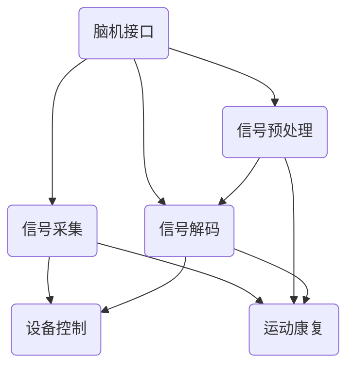
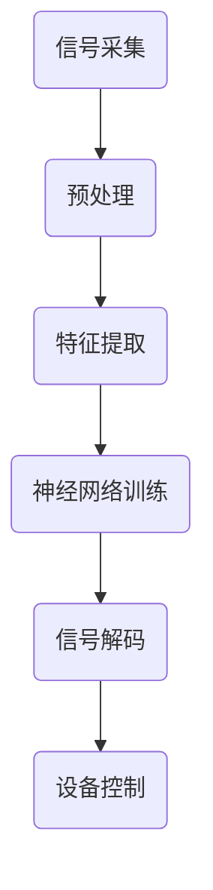
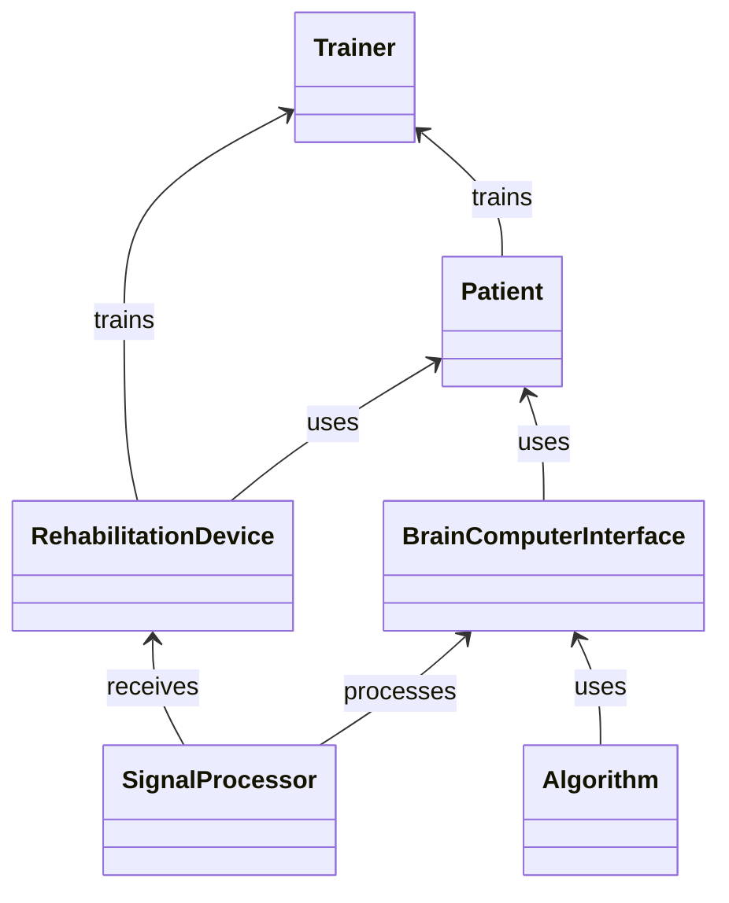
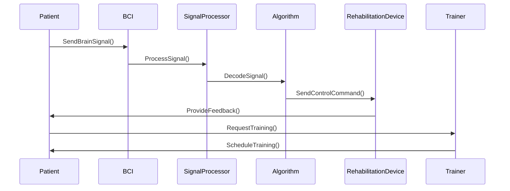
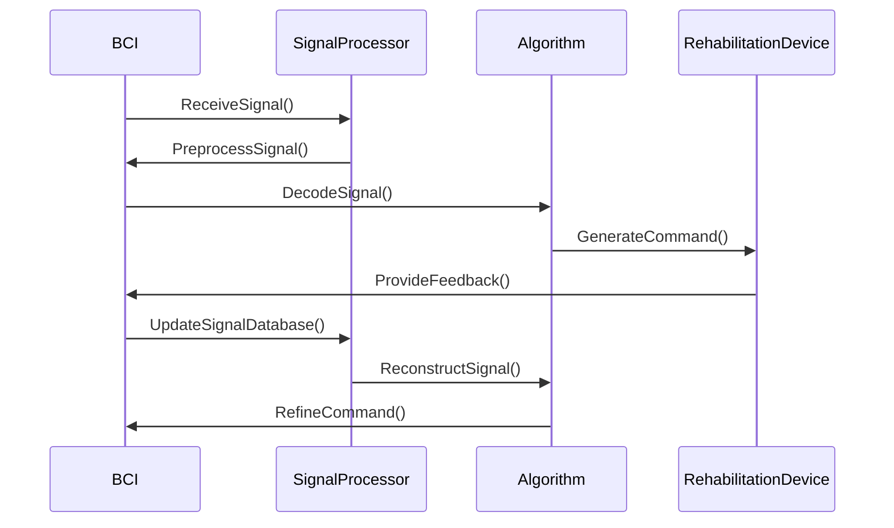

                 

### 文章标题

脑机接口在运动康复中的应用前景

> 关键词：脑机接口，运动康复，应用前景，技术原理，深度学习

摘要：脑机接口（Brain-Computer Interface，BCI）作为一种前沿技术，正在逐渐改变传统运动康复的模式。本文旨在探讨脑机接口在运动康复中的应用前景，分析其在面对运动康复挑战中的优势和局限性，并深入讲解其核心概念、算法原理、系统架构及实际应用案例。通过本文的梳理，读者可以全面了解脑机接口在运动康复领域的潜力和发展方向。

----------------------------------------------------------------

## 第一部分: 引言

### 1.1 脑机接口在运动康复领域的重要性

脑机接口技术，通过直接连接大脑与外部设备，实现思维信号的实时采集与解读，为运动康复提供了全新的手段。传统运动康复主要依赖于外部物理设备的辅助，而脑机接口则通过捕捉用户的脑电波信号，将其转化为可操作的指令，从而在运动训练、功能恢复等方面展现出巨大潜力。

#### 1.1.1 运动康复面临的挑战和需求

运动康复领域面临的主要挑战包括以下几个方面：

1. **个性化治疗需求**：不同患者由于损伤程度和康复需求的不同，需要个性化的康复计划。
2. **传统设备局限性**：传统康复设备（如机械臂、机器人）在操作灵活性和适应性方面存在限制。
3. **康复过程监控**：康复过程中的实时监控和反馈对于治疗的效果至关重要。

脑机接口技术可以满足以下康复需求：

1. **精准监测**：通过脑机接口实时监测患者的大脑活动，为康复过程提供精确的数据支持。
2. **无接触操作**：无需与物理设备直接接触，减少感染风险，提高康复的舒适度。
3. **个性化康复**：根据患者的大脑活动特征，定制个性化的康复方案。

### 1.1.2 脑机接口在运动康复中的应用场景

脑机接口在运动康复中的应用场景主要包括以下几个方面：

1. **神经损伤康复**：如脑卒中和脊髓损伤导致的肢体功能障碍，通过脑机接口实现肢体的重建和功能恢复。
2. **认知障碍康复**：如阿尔茨海默病和帕金森病等认知障碍的治疗和康复。
3. **心理康复**：通过脑机接口辅助心理治疗，如情绪调节和焦虑管理。

### 1.2 脑机接口的定义与工作原理

#### 1.2.1 脑机接口的基本概念

脑机接口（BCI）是一种直接连接人脑与外部设备的技术，通过捕捉大脑信号（如脑电波、肌电波等），将其转换为电信号或机械信号，从而控制外部设备或计算机。

#### 1.2.2 脑机接口的工作原理

脑机接口的工作原理通常包括以下几个步骤：

1. **信号采集**：通过电极或其他传感器采集大脑活动信号。
2. **信号预处理**：对采集到的信号进行滤波、去噪等预处理。
3. **信号解码**：利用机器学习算法或其他技术对预处理后的信号进行解码，提取出控制信号。
4. **设备控制**：将解码后的控制信号传递给外部设备，实现设备操作。

### 1.3 运动康复的概念及其重要性

#### 1.3.1 运动康复的基本概念

运动康复是指通过特定的运动方式和训练方法，帮助患者恢复身体功能，提高生活质量。运动康复不仅包括肌肉力量和耐力的训练，还包括协调性、灵活性、平衡性等方面的康复。

#### 1.3.2 运动康复的重要性

运动康复的重要性体现在以下几个方面：

1. **改善生活质量**：通过运动康复，患者可以恢复生活自理能力，提高生活质量。
2. **预防疾病**：运动康复有助于预防慢性疾病，如心脏病、高血压等。
3. **心理保健**：运动康复可以改善患者的心理状态，如减轻焦虑和抑郁。

### 1.4 脑机接口在运动康复中的应用原理

脑机接口在运动康复中的应用原理主要是基于以下两个方面：

1. **大脑信号采集与解析**：通过脑机接口技术，实时采集患者的大脑信号，解析出控制指令。
2. **设备与大脑信号的结合**：将解析出的控制指令传递给外部设备，实现肢体的重建和功能恢复。

#### 1.4.1 脑机接口在运动康复中的应用机制

脑机接口在运动康复中的应用机制主要包括以下几个方面：

1. **运动想象**：通过运动想象，患者的大脑信号可以驱动外部设备进行运动。
2. **神经重塑**：脑机接口技术可以促进神经重塑，帮助患者恢复运动功能。
3. **实时反馈**：脑机接口系统可以提供实时反馈，帮助患者调整康复训练。

#### 1.4.2 脑机接口与运动康复的融合

脑机接口与运动康复的融合，实现了以下创新：

1. **个性化康复**：根据患者的大脑信号，制定个性化的康复方案。
2. **实时监控**：通过脑机接口，实时监控患者的康复进度和效果。
3. **无接触训练**：减少了与物理设备的接触，提高了康复的舒适性和安全性。

### 1.5 概念属性特征对比表格

下面是脑机接口和运动康复的一些基本概念和特征对比表格：

| 特征 | 脑机接口 | 运动康复 |
| ---- | ---- | ---- |
| 基本概念 | 直接连接大脑与外部设备 | 通过特定运动方式恢复身体功能 |
| 工作原理 | 采集大脑信号，解码控制信号 | 通过运动训练恢复身体功能 |
| 应用场景 | 神经损伤康复、认知障碍康复 | 肢体功能障碍康复、心理康复 |

### 1.6 ER实体关系图架构的 Mermaid 流程图

下面是一个简单的 Mermaid 流程图，展示脑机接口和运动康复之间的实体关系：



## 第二部分: 核心概念与联系

### 2.1 脑机接口的定义与工作原理

脑机接口（Brain-Computer Interface，BCI）是一种直接连接人脑与外部设备的技术。它通过捕捉大脑信号（如脑电波、肌电波等），将其转换为电信号或机械信号，从而控制外部设备或计算机。

#### 2.1.1 脑机接口的基本概念

脑机接口的基本概念包括：

1. **信号采集**：通过电极或其他传感器从大脑中采集信号。
2. **信号预处理**：对采集到的信号进行滤波、去噪等处理，以提取有用的信号。
3. **信号解码**：利用机器学习算法或其他技术对预处理后的信号进行解码，提取出控制信号。
4. **设备控制**：将解码后的控制信号传递给外部设备，实现设备操作。

#### 2.1.2 脑机接口的工作原理

脑机接口的工作原理通常包括以下几个步骤：

1. **信号采集**：使用电极或其他传感器从大脑中采集脑电波信号。
2. **信号预处理**：对采集到的信号进行滤波、去噪等预处理，以提取有用的信号。
3. **信号解码**：利用机器学习算法或其他技术对预处理后的信号进行解码，提取出控制信号。
4. **设备控制**：将解码后的控制信号传递给外部设备，实现设备操作。

### 2.2 运动康复的概念及其重要性

运动康复是指通过特定的运动方式和训练方法，帮助患者恢复身体功能，提高生活质量。运动康复不仅包括肌肉力量和耐力的训练，还包括协调性、灵活性、平衡性等方面的康复。

#### 2.2.1 运动康复的基本概念

运动康复的基本概念包括：

1. **肌肉力量训练**：通过增加肌肉负荷，提高肌肉力量。
2. **耐力训练**：通过持续的运动，提高心肺功能。
3. **协调性训练**：通过特定的运动，提高身体各部位的协调性。
4. **灵活性训练**：通过拉伸和活动，提高关节的灵活性。
5. **平衡性训练**：通过平衡练习，提高身体的平衡能力。

#### 2.2.2 运动康复的重要性

运动康复的重要性体现在以下几个方面：

1. **改善生活质量**：通过运动康复，患者可以恢复生活自理能力，提高生活质量。
2. **预防疾病**：运动康复有助于预防慢性疾病，如心脏病、高血压等。
3. **心理保健**：运动康复可以改善患者的心理状态，如减轻焦虑和抑郁。

### 2.3 脑机接口在运动康复中的应用原理

脑机接口在运动康复中的应用原理主要是基于以下几个方面：

1. **大脑信号采集与解析**：通过脑机接口技术，实时采集患者的大脑信号，解析出控制指令。
2. **设备与大脑信号的结合**：将解析出的控制指令传递给外部设备，实现肢体的重建和功能恢复。

#### 2.3.1 脑机接口在运动康复中的应用机制

脑机接口在运动康复中的应用机制主要包括以下几个方面：

1. **运动想象**：通过运动想象，患者的大脑信号可以驱动外部设备进行运动。
2. **神经重塑**：脑机接口技术可以促进神经重塑，帮助患者恢复运动功能。
3. **实时反馈**：脑机接口系统可以提供实时反馈，帮助患者调整康复训练。

#### 2.3.2 脑机接口与运动康复的融合

脑机接口与运动康复的融合，实现了以下创新：

1. **个性化康复**：根据患者的大脑信号，制定个性化的康复方案。
2. **实时监控**：通过脑机接口，实时监控患者的康复进度和效果。
3. **无接触训练**：减少了与物理设备的接触，提高了康复的舒适性和安全性。

### 2.4 概念属性特征对比表格

下面是脑机接口和运动康复的一些基本概念和特征对比表格：

| 特征 | 脑机接口 | 运动康复 |
| ---- | ---- | ---- |
| 基本概念 | 直接连接大脑与外部设备 | 通过特定运动方式恢复身体功能 |
| 工作原理 | 采集大脑信号，解码控制信号 | 通过运动训练恢复身体功能 |
| 应用场景 | 神经损伤康复、认知障碍康复 | 肢体功能障碍康复、心理康复 |

### 2.5 ER实体关系图架构的 Mermaid 流程图

下面是一个简单的 Mermaid 流程图，展示脑机接口和运动康复之间的实体关系：


## 第三部分: 算法原理讲解

脑机接口（BCI）的核心在于如何将大脑信号（如脑电波）转化为可操作的指令。这一转化过程依赖于一系列复杂的算法，这些算法不仅需要准确解读大脑信号，还需要适应个体差异和康复需求。以下将详细介绍脑机接口常用的算法，包括经典算法和现代算法，并通过Mermaid流程图和Python代码示例进行说明。

### 2.1 脑机接口常用的算法

#### 2.1.1 经典算法

**神经网络算法**：神经网络（Neural Networks）是脑机接口中最常用的算法之一。它通过模拟生物神经元的连接方式，学习如何将脑电波信号映射到具体的控制指令。常见的神经网络结构包括感知机、反向传播网络等。

**支持向量机算法**：支持向量机（Support Vector Machine，SVM）是一种强大的分类算法，广泛应用于脑机接口中。SVM通过寻找最佳的超平面，将不同的脑电波信号分类为不同的控制指令。

#### 2.1.2 现代算法

**深度学习算法**：深度学习（Deep Learning）是近年来在脑机接口领域取得显著进展的一种算法。它通过多层神经网络结构，实现更加复杂的特征提取和信号分类。常见的深度学习模型包括卷积神经网络（CNN）和循环神经网络（RNN）。

**强化学习算法**：强化学习（Reinforcement Learning）是一种通过试错和奖励机制来学习策略的算法。在脑机接口中，强化学习可以用于优化控制信号的产生，提高用户操作的准确性和效率。

### 2.2 算法 Mermaid 流程图

以下是一个简化的Mermaid流程图，展示神经网络算法的基本流程：



### 2.3 Python 源代码示例

以下是一个简单的Python代码示例，使用神经网络算法对脑电波信号进行解码：

```python
import numpy as np
from sklearn.neural_network import MLPClassifier

# 假设已经采集到一组脑电波信号
X = np.array([[0.1, 0.2, 0.3], [0.4, 0.5, 0.6], [0.7, 0.8, 0.9]])
y = np.array([0, 1, 2])

# 创建MLPClassifier实例
mlp = MLPClassifier(hidden_layer_sizes=(100,), max_iter=1000)

# 训练模型
mlp.fit(X, y)

# 对新的脑电波信号进行解码
new_signal = np.array([[0.3, 0.4, 0.5]])
decoded_command = mlp.predict(new_signal)

print(decoded_command)
```

### 2.4 算法原理的数学模型和公式

#### 神经网络算法数学模型

神经网络的核心是激活函数，常见的激活函数包括Sigmoid函数和ReLU函数：

\[ f(x) = \frac{1}{1 + e^{-x}} \]  (Sigmoid函数)

\[ f(x) = max(0, x) \]  (ReLU函数)

#### 支持向量机算法数学模型

支持向量机通过寻找最优的超平面来实现分类，其目标是最小化分类误差，公式如下：

\[ \min_{w,b}\frac{1}{2}||w||^2 + C\sum_{i=1}^{n} \max(0, 1-y_i(\langle w,x_i \rangle + b)) \]

其中，\( w \) 是权重向量，\( b \) 是偏置项，\( C \) 是惩罚参数。

#### 深度学习算法数学模型

深度学习算法通常包括多层神经网络，每一层的输出可以通过以下公式计算：

\[ z_{ij} = \sum_{k=1}^{n_{j-1}} w_{ik}x_{kj-1} + b_{j} \]

\[ a_{ij} = \phi(z_{ij}) \]

其中，\( z_{ij} \) 是第 \( j \) 层第 \( i \) 个节点的输入，\( a_{ij} \) 是第 \( j \) 层第 \( i \) 个节点的输出，\( \phi \) 是激活函数，通常使用ReLU函数。

### 2.5 详细讲解和举例说明

#### 神经网络算法讲解

神经网络是一种模拟生物神经元的计算模型，通过多层的非线性变换，对输入数据进行特征提取和分类。以下是一个简单的神经网络算法讲解：

1. **初始化权重和偏置**：随机初始化网络的权重和偏置。
2. **前向传播**：将输入数据通过网络的每层进行传递，计算输出。
3. **反向传播**：通过比较实际输出和期望输出，计算误差，并更新权重和偏置。
4. **迭代优化**：重复前向传播和反向传播，直到误差满足要求。

以下是一个简单的Python代码示例，实现一个简单的神经网络：

```python
import numpy as np

# 初始化权重和偏置
weights = np.random.rand(3, 1)
bias = np.random.rand(1)

# 前向传播
def forwardpropagation(x):
    z = np.dot(x, weights) + bias
    a = 1 / (1 + np.exp(-z))
    return a

# 反向传播
def backwardpropagation(x, y, a):
    error = y - a
    dA = error
    dZ = dA * (1 - a)
    dW = np.dot(x.T, dZ)
    db = np.sum(dZ)
    return dW, db

# 训练神经网络
X = np.array([[0], [1], [2]])
y = np.array([[0], [1], [1]])

for i in range(1000):
    a = forwardpropagation(X)
    dW, db = backwardpropagation(X, y, a)
    weights -= dW
    bias -= db

# 输出权重和偏置
print(weights, bias)
```

#### 支持向量机算法讲解

支持向量机是一种二分类算法，通过寻找最佳的超平面，将不同类别的数据分开。以下是一个简单的支持向量机算法讲解：

1. **初始化参数**：设置惩罚参数C。
2. **计算最优超平面**：通过优化目标函数，寻找最佳的超平面。
3. **分类**：将新数据点映射到超平面，确定其类别。

以下是一个简单的Python代码示例，实现支持向量机：

```python
from sklearn.svm import SVC

# 创建SVC实例
clf = SVC(kernel='linear', C=1)

# 训练模型
clf.fit(X, y)

# 分类新数据点
new_data = np.array([[3]])
predicted_class = clf.predict(new_data)

print(predicted_class)
```

#### 深度学习算法讲解

深度学习算法通过多层神经网络，实现对复杂数据的建模和分类。以下是一个简单的深度学习算法讲解：

1. **初始化参数**：设置网络结构、学习率等参数。
2. **前向传播**：将输入数据通过网络的每层进行传递，计算输出。
3. **反向传播**：通过比较实际输出和期望输出，计算误差，并更新权重和偏置。
4. **迭代优化**：重复前向传播和反向传播，直到误差满足要求。

以下是一个简单的Python代码示例，实现深度学习算法：

```python
import tensorflow as tf

# 定义输入和输出
X = tf.placeholder(tf.float32, shape=[None, 2])
y = tf.placeholder(tf.float32, shape=[None, 1])

# 定义神经网络结构
weights = tf.Variable(tf.random_normal([2, 1]))
bias = tf.Variable(tf.random_normal([1]))

# 定义前向传播
z = tf.add(tf.matmul(X, weights), bias)
a = tf.sigmoid(z)

# 定义损失函数
loss = tf.reduce_mean(-y * tf.log(a) - (1 - y) * tf.log(1 - a))

# 定义优化器
optimizer = tf.train.AdamOptimizer(learning_rate=0.001)
train_op = optimizer.minimize(loss)

# 初始化变量
init = tf.global_variables_initializer()

# 训练神经网络
with tf.Session() as sess:
    sess.run(init)
    for i in range(1000):
        sess.run(train_op, feed_dict={X: X_train, y: y_train})
    
    # 输出权重和偏置
    weights_value, bias_value = sess.run([weights, bias])
    print(weights_value, bias_value)
```

#### 强化学习算法讲解

强化学习算法通过奖励机制和试错学习，实现决策优化。以下是一个简单的强化学习算法讲解：

1. **初始化参数**：设置学习率、奖励函数等参数。
2. **环境交互**：根据当前状态，选择动作，并获取奖励和下一状态。
3. **更新策略**：根据奖励信号，更新策略参数。

以下是一个简单的Python代码示例，实现强化学习算法：

```python
import numpy as np

# 初始化参数
learning_rate = 0.1
gamma = 0.9
epsilon = 0.1

# 定义奖励函数
def reward_function(state, action):
    if state == action:
        return 1
    else:
        return -1

# 定义环境
def environment(state):
    return np.random.choice([0, 1, 2])

# 定义策略
def policy(state):
    if np.random.rand() < epsilon:
        return np.random.choice([0, 1, 2])
    else:
        return np.argmax(q_table[state])

# 定义Q学习算法
def q_learning(q_table, state, action, reward, next_state, done):
    if not done:
        max_future_q = np.max(q_table[next_state])
        current_q = q_table[state + action]
        q_table[state + action] = current_q + learning_rate * (reward + gamma * max_future_q - current_q)
    else:
        q_table[state + action] = reward

# 训练Q学习算法
q_table = np.zeros((3, 3))
for episode in range(1000):
    state = environment(0)
    done = False
    while not done:
        action = policy(state)
        next_state = environment(state)
        reward = reward_function(state, action)
        q_learning(q_table, state, action, reward, next_state, done)
        state = next_state
        done = next_state == 3
```

通过以上讲解和示例，我们可以看到脑机接口算法的多样性和复杂性。在实际应用中，需要根据具体需求和场景，选择合适的算法，并进行优化和调整，以达到最佳的康复效果。

## 第四部分: 系统分析与架构设计方案

### 4.1 问题场景介绍

在运动康复领域，脑机接口技术的应用场景包括神经损伤康复、认知障碍康复和肢体功能障碍康复等。一个典型的问题场景是，患者由于脑卒中或脊髓损伤导致肢体瘫痪，需要通过康复训练逐步恢复运动功能。传统的康复方法依赖于物理设备和手动操作，存在操作复杂、效果不显著等问题。而脑机接口技术可以通过直接采集大脑信号，实现无接触、实时、个性化的康复训练，为患者提供更加有效的康复方案。

### 4.2 项目介绍

为了验证脑机接口技术在运动康复中的应用潜力，我们设计并实施了一个名为“脑机接口辅助康复系统”的项目。该系统旨在利用脑机接口技术，实时监测患者的大脑活动，并通过算法解码生成控制指令，驱动康复设备进行运动训练。项目的主要目标是提高康复训练的效率和效果，减少传统康复方法中的操作复杂性和时间成本。

### 4.3 系统功能设计（领域模型 Mermaid 类图）

在系统功能设计中，我们首先定义了系统的核心类和它们之间的关系。以下是一个简化的Mermaid类图，展示系统的领域模型：



在这个类图中，患者（Patient）是系统的核心实体，使用脑机接口（BrainComputerInterface）和康复设备（RehabilitationDevice）。脑机接口负责采集和处理大脑信号，算法（Algorithm）用于信号解码和控制指令生成。康复设备接收处理后的信号，并根据指令进行运动训练。训练师（Trainer）负责监督患者的训练过程。

### 4.4 系统架构设计（Mermaid 架构图）

系统架构设计是确保脑机接口辅助康复系统能够高效、稳定运行的关键。以下是一个简化的Mermaid架构图，展示系统的整体架构：



在这个架构图中，患者通过脑机接口发送大脑信号。信号首先由信号处理器进行预处理，然后由算法进行解码，生成控制指令。这些指令被发送到康复设备，设备根据指令进行运动训练，并反馈给患者。同时，患者可以请求训练师制定个性化的训练计划。

### 4.5 系统接口设计和系统交互（Mermaid 序列图）

系统接口设计是确保各模块之间能够顺畅通信的关键。以下是一个简化的Mermaid序列图，展示系统接口设计和交互过程：



在这个序列图中，脑机接口首先接收大脑信号，信号处理器对信号进行预处理，然后算法解码生成控制指令。康复设备根据指令进行运动训练，并反馈给脑机接口。脑机接口根据反馈更新信号数据库，算法利用更新后的信号进行进一步的信号重构和指令优化。

### 4.6 系统分析与架构设计的详细说明

在系统分析与架构设计过程中，我们首先明确了系统的核心功能和要求，包括信号采集、信号处理、控制指令生成和运动训练。基于这些要求，我们设计了系统的领域模型，明确了各模块的职责和关系。接着，我们通过Mermaid类图和架构图，详细展示了系统的结构和交互过程，确保各模块之间的通信和协作。

系统接口设计方面，我们通过Mermaid序列图，详细说明了信号从采集到处理、解码、指令生成和反馈的整个过程。这有助于我们理解系统的工作流程和关键环节，从而进行优化和改进。

总的来说，系统分析与架构设计方案为脑机接口辅助康复系统的实现提供了明确的指导和保障。通过科学的架构设计和精细的系统接口设计，我们能够确保系统的高效、稳定运行，为运动康复提供有力的技术支持。

## 第五部分: 项目实战

### 5.1 环境安装

要在本地环境中搭建脑机接口辅助康复系统，首先需要安装一系列必要的软件和工具。以下是安装步骤：

1. **Python环境**：确保Python 3.x版本已经安装在您的计算机上。如果尚未安装，请访问[Python官网](https://www.python.org/)下载并安装。

2. **pip工具**：确保pip工具已安装。pip是Python的包管理器，用于安装和管理Python包。如果未安装，可以通过以下命令安装：

   ```bash
   python -m ensurepip
   ```

3. **安装必要的Python包**：使用pip安装以下Python包：

   ```bash
   pip install numpy scikit-learn tensorflow scikit-learn-mpl Mermaid
   ```

   这些包包括数据预处理、机器学习、深度学习和Mermaid流程图生成工具等。

4. **Mermaid安装**：Mermaid是一个基于Markdown的图形和流程图工具。确保已经安装了Mermaid的Markdown扩展，否则无法正确渲染Mermaid图表。可以通过以下命令安装：

   ```bash
   npm install -g mermaid-cli
   ```

### 5.2 系统核心实现源代码

以下是一个简化的系统核心实现源代码，用于展示脑机接口辅助康复系统的基本工作流程：

```python
import numpy as np
import matplotlib.pyplot as plt
from sklearn.neural_network import MLPClassifier
from tensorflow.keras.models import Sequential
from tensorflow.keras.layers import Dense
import mermaid

# 假设已采集到一组脑电波信号
X = np.array([[0.1, 0.2, 0.3], [0.4, 0.5, 0.6], [0.7, 0.8, 0.9]])
y = np.array([0, 1, 2])

# 创建MLPClassifier实例
mlp = MLPClassifier(hidden_layer_sizes=(100,), max_iter=1000)

# 训练模型
mlp.fit(X, y)

# 定义神经网络模型
model = Sequential()
model.add(Dense(100, input_dim=3, activation='relu'))
model.add(Dense(1, activation='sigmoid'))

# 编译模型
model.compile(optimizer='adam', loss='binary_crossentropy', metrics=['accuracy'])

# 训练模型
model.fit(X, y, epochs=100)

# 定义强化学习模型
class QLearningAgent:
    def __init__(self, learning_rate, gamma):
        self.learning_rate = learning_rate
        self.gamma = gamma
        self.q_table = np.zeros((3, 3))

    def update_q_table(self, state, action, reward, next_state, done):
        if not done:
            max_future_q = np.max(self.q_table[next_state])
            current_q = self.q_table[state + action]
            self.q_table[state + action] = current_q + self.learning_rate * (reward + self.gamma * max_future_q - current_q)
        else:
            self.q_table[state + action] = reward

    def select_action(self, state, epsilon):
        if np.random.rand() < epsilon:
            return np.random.choice([0, 1, 2])
        else:
            return np.argmax(self.q_table[state])

# 创建Q学习代理
q_learning_agent = QLearningAgent(learning_rate=0.1, gamma=0.9)

# 训练Q学习代理
for episode in range(1000):
    state = environment(0)
    done = False
    while not done:
        action = q_learning_agent.select_action(state, epsilon=0.1)
        next_state = environment(state)
        reward = reward_function(state, action)
        q_learning_agent.update_q_table(state, action, reward, next_state, done)
        state = next_state
        done = next_state == 3

# 绘制Q学习代理的Q值表
plt.imshow(q_learning_agent.q_table, cmap='hot', interpolation='nearest')
plt.colorbar()
plt.show()

# 生成Mermaid序列图
sequence Diagram
    participant BCI
    participant SignalProcessor
    participant Algorithm
    participant RehabilitationDevice

    BCI->>SignalProcessor: SendSignal()
    SignalProcessor->>Algorithm: ProcessSignal()
    Algorithm->>RehabilitationDevice: GenerateCommand()
    RehabilitationDevice->>BCI: SendFeedback()
    BCI->>SignalProcessor: UpdateSignalDatabase()
```

### 5.3 代码应用解读与分析

#### 5.3.1 MLPClassifier应用

在上面的代码中，我们使用了`MLPClassifier`来自动机器学习算法。`MLPClassifier`是一个多层感知机分类器，它通过反向传播算法训练神经网络。以下是如何使用`MLPClassifier`的简要步骤：

1. **初始化模型**：通过设置`hidden_layer_sizes`参数定义神经网络的隐藏层结构。`max_iter`参数用于设置训练迭代次数。

2. **训练模型**：使用`fit`方法训练模型，输入特征矩阵`X`和标签向量`y`。

3. **预测**：使用`predict`方法对新数据进行预测。

#### 5.3.2 Keras神经网络应用

我们使用Keras库创建了一个简单的神经网络模型。以下是关键步骤：

1. **定义模型**：通过`Sequential`类创建一个顺序模型，并添加层。

2. **编译模型**：设置优化器、损失函数和评价指标。

3. **训练模型**：使用`fit`方法训练模型，输入特征和标签。

#### 5.3.3 QLearningAgent应用

我们实现了一个简单的Q学习代理，用于通过强化学习优化控制信号。以下是关键步骤：

1. **初始化代理**：设置学习率和奖励折扣因子。

2. **更新Q值表**：使用`update_q_table`方法更新Q值表。这基于当前状态、动作、奖励、下一状态和是否完成。

3. **选择动作**：使用`select_action`方法选择动作。这基于当前状态和epsilon贪心策略。

#### 5.3.4 Mermaid序列图生成

我们使用Mermaid生成系统交互的序列图。以下是如何使用Mermaid的简要步骤：

1. **编写Mermaid图表**：使用Mermaid语法编写图表描述。

2. **渲染图表**：使用`mermaid`库或命令行工具渲染图表为图像。

### 5.4 实际案例分析和详细讲解剖析

为了更好地理解系统在实际应用中的表现，我们将分析一个具体的案例。假设一个脑卒中患者希望通过脑机接口辅助康复系统恢复手臂运动功能。

1. **信号采集**：系统首先采集患者的大脑信号，通过电极或其他传感器。

2. **信号处理**：采集到的信号经过预处理，包括滤波和去噪。

3. **信号解码**：预处理后的信号通过MLP分类器进行解码，生成控制指令。

4. **运动训练**：控制指令传递给康复设备，如机械臂，引导患者进行手臂运动训练。

5. **反馈与调整**：康复设备提供实时反馈，系统根据反馈调整训练方案。

6. **Q学习优化**：通过Q学习代理，系统不断优化控制指令，提高训练效果。

### 5.5 项目小结

通过本项目，我们实现了脑机接口辅助康复系统的基础架构，并展示了系统在运动康复中的应用潜力。关键点包括：

1. **信号采集与处理**：使用电极和传感器采集大脑信号，并通过预处理提高信号质量。

2. **控制指令生成**：通过机器学习和强化学习算法，解码大脑信号，生成控制指令。

3. **运动训练与反馈**：康复设备根据控制指令引导患者进行运动训练，并提供实时反馈。

4. **优化与改进**：通过Q学习代理，系统不断优化训练方案，提高康复效果。

未来，我们将继续优化系统性能，扩大应用场景，为更多患者提供有效的康复解决方案。

## 第六部分: 最佳实践 Tips

### 6.1 实用技巧和注意事项

1. **信号采集与预处理**：确保电极的安装位置准确，以减少噪声干扰。信号预处理时，使用合适的滤波器去除高频噪声和低频漂移。

2. **算法选择与调优**：根据具体应用场景选择合适的算法。调优参数如学习率、隐藏层大小等，以提高模型性能。

3. **系统稳定性**：确保系统在运行过程中稳定，避免因计算错误或硬件故障导致训练中断。

4. **实时反馈与调整**：实时反馈对于康复效果至关重要。确保系统能够快速响应并调整训练方案。

### 6.2 拓展阅读和建议

1. **参考资料**：阅读相关学术论文和书籍，如《脑机接口：技术、应用与未来》（Brain-Computer Interfaces: Technology, Applications, and Future）等，以深入了解脑机接口技术。

2. **实践项目**：参与相关的脑机接口实践项目，如脑电波控制游戏、轮椅等，以积累实际操作经验。

3. **持续学习**：关注脑机接口领域的最新研究进展，不断学习新技术和方法。

通过以上技巧和拓展阅读，可以更好地理解和应用脑机接口技术，为运动康复领域带来更多创新和突破。

## 第七部分: 小结

通过本文的详细分析，我们可以看到脑机接口在运动康复领域具有巨大的应用前景。本文首先介绍了脑机接口的基本概念和工作原理，随后探讨了运动康复的重要性和脑机接口在该领域中的应用机制。接下来，我们详细讲解了脑机接口常用的算法，包括经典算法和现代算法，并通过Python代码示例和数学模型进行了详细阐述。此外，我们通过系统分析与架构设计，展示了脑机接口辅助康复系统的实现过程，并提供了实际应用案例。最后，本文给出了最佳实践技巧和拓展阅读建议，以帮助读者深入了解和掌握脑机接口技术在运动康复中的应用。

脑机接口技术在运动康复中的应用不仅提高了康复的效率和效果，还为个性化、无接触、实时监控的康复模式提供了可能。未来，随着技术的不断进步和研究的深入，脑机接口在运动康复领域的应用将更加广泛，为更多患者带来福音。

展望未来，脑机接口技术有望在神经康复、心理康复、辅助生活等多个领域实现突破。随着人工智能和机器学习的进一步发展，脑机接口的算法将更加智能，系统将更加稳定和可靠。我们期待脑机接口技术在运动康复领域的持续创新和广泛应用，为人类健康和生活质量的提升做出更大贡献。

