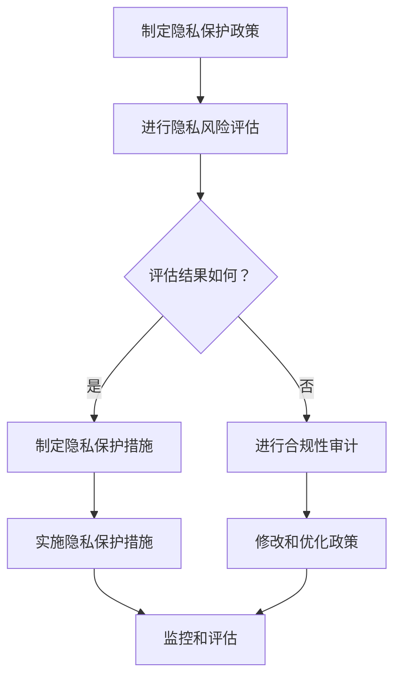

                 

# 脑机接口隐私保护：企业采用神经技术的政策制定

## 关键词

脑机接口（BMI），隐私保护，神经技术，政策制定，数据加密，访问控制，匿名化，法律法规，监管框架。

## 摘要

随着神经技术特别是脑机接口（BMI）的迅速发展，隐私保护成为了一个亟待解决的问题。本文旨在深入探讨脑机接口在神经技术中的应用，并分析其隐私保护的挑战。通过详细分析脑机接口技术原理、隐私泄露风险、隐私保护技术手段，以及企业隐私保护策略，本文为企业提供了制定脑机接口隐私保护政策的参考框架。此外，文章还对全球隐私保护法律法规进行了综述，并探讨了监管挑战与对策。最后，本文提出了脑机接口隐私保护的未来发展趋势和挑战。

## 目录大纲

### 第一部分：问题背景与概念介绍

#### 第1章：脑机接口（BMI）与隐私保护概述

##### 1.1 脑机接口（BMI）的背景与重要性

###### 1.1.1 BMI的概念与发展历程

###### 1.1.2 BMI在神经科学和医疗领域的应用

###### 1.1.3 BMI技术的潜在风险与隐私问题

##### 1.2 隐私保护的背景与政策

###### 1.2.1 隐私保护的基本概念

###### 1.2.2 隐私保护法律法规概述

###### 1.2.3 隐私保护的政策趋势与挑战

#### 第2章：脑机接口技术原理

##### 2.1 BMI技术的基本原理

###### 2.1.1 脑信号采集与处理

###### 2.1.2 BMI系统的构成

###### 2.1.3 BMI技术的分类

##### 2.2 脑信号处理技术

###### 2.2.1 脑电信号处理

###### 2.2.2 神经影像学技术

###### 2.2.3 脑机接口算法原理

#### 第3章：脑机接口隐私保护的核心问题

##### 3.1 隐私泄露的风险

###### 3.1.1 数据收集与存储

###### 3.1.2 数据传输与共享

###### 3.1.3 数据滥用与监控

##### 3.2 隐私保护的技术手段

###### 3.2.1 数据加密技术

###### 3.2.2 访问控制与权限管理

###### 3.2.3 匿名化与差分隐私

#### 第4章：企业采用脑机接口技术的隐私保护策略

##### 4.1 企业隐私保护框架

###### 4.1.1 隐私风险评估与审计

###### 4.1.2 隐私保护政策制定

###### 4.1.3 隐私保护技术实施

##### 4.2 隐私保护的最佳实践

###### 4.2.1 数据最小化原则

###### 4.2.2 隐私保护技术集成

###### 4.2.3 隐私保护意识培养

#### 第5章：法律法规与监管框架

##### 5.1 全球隐私保护法律法规综述

###### 5.1.1 欧盟通用数据保护条例（GDPR）

###### 5.1.2 美国加州消费者隐私法案（CCPA）

###### 5.1.3 其他国家和地区隐私保护法律

##### 5.2 监管机构与合规要求

###### 5.2.1 监管机构概述

###### 5.2.2 合规性评估与认证

###### 5.2.3 监管挑战与应对策略

#### 第6章：脑机接口隐私保护技术与应用案例

##### 6.1 技术应用案例介绍

###### 6.1.1 医疗领域的隐私保护应用

###### 6.1.2 智能制造与交互式控制领域的隐私保护应用

###### 6.1.3 游戏与娱乐领域的隐私保护应用

##### 6.2 案例分析

###### 6.2.1 成功案例分析

###### 6.2.2 失败案例分析

###### 6.2.3 经验教训与启示

#### 第7章：未来展望与挑战

##### 7.1 脑机接口隐私保护的发展趋势

###### 7.1.1 新技术的影响

###### 7.1.2 隐私保护法律法规的演变

###### 7.1.3 未来研究方向

##### 7.2 挑战与对策

###### 7.2.1 技术挑战

###### 7.2.2 法律挑战

###### 7.2.3 社会挑战

#### 附录

##### A. 术语表

##### B. 参考文献

##### C. 脑机接口隐私保护政策制定流程图

### 脑机接口（BMI）与隐私保护概述

#### 1.1 脑机接口（BMI）的背景与重要性

##### 1.1.1 脑机接口（BMI）的概念与发展历程

脑机接口（BMI）是一种直接连接大脑和外部设备的技术，它允许人们通过大脑信号控制计算机、机器人或其他外部设备。这一概念起源于20世纪中叶，当时的科学家们试图探索大脑与机器之间的交互方式。

发展历程：

1. **早期实验**：20世纪50年代，神经科学家Roger Sperry因研究大脑两半球功能而获得诺贝尔奖。此后，许多研究集中在如何通过大脑信号来控制简单的外部设备。

2. **神经信号检测**：20世纪60年代，脑电图（EEG）等神经信号检测技术的发展，为BMI提供了理论基础。

3. **功能性磁共振成像（fMRI）**：20世纪90年代，fMRI技术的应用使得实时检测大脑活动成为可能，这大大推进了BMI技术的发展。

4. **现代BMI**：随着计算力和算法的进步，现代BMI技术能够实现更加复杂和准确的大脑-机器交互。

##### 1.1.2 BMI在神经科学和医疗领域的应用

BMI技术在神经科学和医疗领域的应用非常广泛，其中包括：

1. **神经修复与恢复**：对于中风、肌萎缩侧索硬化（ALS）等疾病患者，BMI可以用于帮助他们恢复运动控制和交流能力。

2. **脑机融合**：一些实验研究探讨了将外部设备直接植入大脑，以增强人类认知能力。

3. **医疗监控**：BMI技术可以用于实时监控大脑活动，帮助医生更好地理解患者的病情和治疗效果。

##### 1.1.3 BMI技术的潜在风险与隐私问题

尽管BMI技术具有巨大的潜力，但也不可忽视其潜在的隐私风险：

1. **数据泄露**：BMI技术涉及大量个人生物数据，包括大脑活动记录、生理指标等，这些数据一旦泄露，可能导致严重的隐私侵犯。

2. **监控滥用**：如果BMI技术被用于监控，可能会导致个人隐私受到侵犯，尤其是在工作场所和公共场合。

3. **伦理问题**：BMI技术可能会引发关于人体改造、人权和自由的伦理争议。

#### 1.2 隐私保护的背景与政策

##### 1.2.1 隐私保护的基本概念

隐私保护涉及个人信息的收集、处理、存储和使用，旨在确保个人信息的安全和隐私。基本概念包括：

1. **个人信息**：指与个人相关的数据，如姓名、地址、电话号码、电子邮件地址等。

2. **数据收集**：指在特定目的下收集个人信息的行为。

3. **数据处理**：指对个人信息进行存储、检索、修改、删除等操作。

4. **数据保护**：指采取技术和管理措施保护个人信息的安全和隐私。

##### 1.2.2 隐私保护法律法规概述

全球范围内，多个国家和地区已经制定了隐私保护法律法规，以规范个人信息的收集和使用。主要法律包括：

1. **欧盟通用数据保护条例（GDPR）**：GDPR是欧盟最具影响力的隐私保护法规，对个人数据的收集、处理和传输提出了严格的要求。

2. **美国加州消费者隐私法案（CCPA）**：CCPA旨在保护加州居民的个人信息，对数据收集和销售行为进行了规范。

3. **其他国家和地区**：如中国《网络安全法》、日本《个人信息保护法》等。

##### 1.2.3 隐私保护的政策趋势与挑战

隐私保护政策在全球范围内呈现出以下趋势：

1. **加强立法**：各国纷纷加强隐私保护法律法规的制定和实施。

2. **跨国合作**：国际社会在隐私保护方面加强合作，以应对跨国数据流动带来的挑战。

3. **技术发展**：随着技术的进步，隐私保护技术也在不断发展和完善。

然而，隐私保护政策也面临以下挑战：

1. **数据泄露**：随着数据量的增加，数据泄露事件频发，给隐私保护带来巨大压力。

2. **执法难度**：法律法规的执行难度较大，尤其是在跨国数据流动的情况下。

3. **技术与法律的平衡**：技术发展迅速，而法律法规的更新速度较慢，如何在保障隐私的同时促进技术创新成为一大挑战。

### 脑机接口技术原理

#### 2.1 BMI技术的基本原理

##### 2.1.1 脑信号采集与处理

脑信号采集是BMI技术的核心。通常，脑信号通过以下几种方式采集：

1. **脑电图（EEG）**：EEG是一种常用的脑信号采集技术，通过在头皮表面放置电极来检测大脑的电活动。

2. **功能性磁共振成像（fMRI）**：fMRI通过检测血液流动变化来测量大脑活动，具有较高的空间分辨率。

3. **脑磁图（MEG）**：MEG通过检测大脑产生的磁场来测量脑活动，具有极高的时间分辨率。

采集到的脑信号需要经过处理，以提取有用的信息。脑信号处理通常包括信号滤波、去噪、特征提取等步骤。

##### 2.1.2 BMI系统的构成

BMI系统通常由以下几个部分构成：

1. **信号采集设备**：如EEG电极、fMRI扫描仪等。

2. **信号处理单元**：用于对采集到的脑信号进行预处理和特征提取。

3. **接口设备**：如脑-机接口芯片、脑-机接口设备等，用于将处理后的脑信号转换为可操作的控制信号。

4. **执行设备**：如计算机、机器人、外部设备等，用于接收和执行控制信号。

##### 2.1.3 BMI技术的分类

根据不同的分类标准，BMI技术可以分为多种类型：

1. **根据信号采集方式**：可分为侵入式BMI和非侵入式BMI。

   - 侵入式BMI：通过手术将电极植入大脑或脊髓，直接采集脑信号。

   - 非侵入式BMI：通过在头皮表面放置电极或使用外部设备采集脑信号。

2. **根据应用领域**：可分为医疗BMI、辅助技术BMI、增强现实BMI等。

   - 医疗BMI：用于治疗神经系统疾病、恢复运动控制和交流能力等。

   - 辅助技术BMI：用于帮助残疾人士提高生活质量，如控制假肢、轮椅等。

   - 增强现实BMI：用于增强人类认知能力，如增强记忆、提高注意力等。

#### 2.2 脑信号处理技术

##### 2.2.1 脑电信号处理

脑电信号处理是BMI技术的重要组成部分，主要包括以下步骤：

1. **信号滤波**：去除噪声和不需要的频率成分。

2. **去噪**：提高信号质量，去除干扰信号。

3. **特征提取**：从处理后的脑电信号中提取有用的特征，如事件相关电位（ERP）、时间频率分布等。

4. **模式识别**：利用机器学习算法对提取的特征进行分类和识别，以实现脑-机信号的控制。

##### 2.2.2 神经影像学技术

神经影像学技术是BMI的重要组成部分，主要包括以下几种：

1. **功能性磁共振成像（fMRI）**：通过检测大脑活动区域中的血液流动变化，提供高空间分辨率的脑活动图像。

2. **脑磁图（MEG）**：通过检测大脑产生的磁场，提供高时间分辨率的脑活动图像。

3. **正电子发射断层扫描（PET）**：通过检测大脑活动区域中的放射性示踪剂，提供高空间分辨率的脑活动图像。

##### 2.2.3 脑机接口算法原理

脑机接口算法是将采集到的脑信号转换为控制信号的核心技术。常见的脑机接口算法包括：

1. **基于统计模式识别的算法**：通过训练模型，将脑信号映射到控制信号。

2. **基于神经网络和深度学习的算法**：利用神经网络和深度学习算法，对脑信号进行特征学习和模式识别。

3. **基于遗传算法的优化算法**：通过遗传算法优化参数，提高控制信号的质量。

这些算法的共同目标是实现高效、准确的大脑-机器交互。

### 脑机接口隐私保护的核心问题

#### 3.1 隐私泄露的风险

##### 3.1.1 数据收集与存储

在BMI技术中，数据的收集与存储是隐私泄露的首要风险源。以下是一些具体问题：

1. **数据收集范围**：BMI技术可能涉及大量的个人信息，包括脑信号、生理指标、个人行为数据等。

2. **数据收集方式**：非侵入式BMI技术虽然相对安全，但仍然可能通过电极放置位置等信息泄露个人信息。

3. **数据存储**：未经充分加密的数据存储可能会导致数据泄露，特别是在云存储等环境下。

##### 3.1.2 数据传输与共享

数据在传输和共享过程中也存在隐私泄露风险：

1. **数据传输安全**：未经加密的数据传输容易被拦截和窃取。

2. **数据共享**：数据在共享给第三方时，可能会失去控制，特别是当第三方不具备足够的隐私保护措施时。

##### 3.1.3 数据滥用与监控

1. **数据滥用**：未经授权的个人或组织可能会滥用BMI数据，用于非法目的。

2. **监控滥用**：在工作场所或公共场合，BMI技术可能被用于监控个人行为，侵犯隐私。

#### 3.2 隐私保护的技术手段

为了应对上述隐私泄露风险，需要采用一系列技术手段进行隐私保护：

##### 3.2.1 数据加密技术

数据加密是保护数据隐私的基本手段，包括：

1. **端到端加密**：在数据传输过程中，对数据进行加密，确保数据在传输过程中不被窃取。

2. **存储加密**：对存储在数据库或云中的数据进行加密，防止数据泄露。

##### 3.2.2 访问控制与权限管理

通过严格的访问控制和权限管理，可以确保只有授权人员可以访问敏感数据：

1. **身份验证**：使用密码、生物识别技术等手段进行身份验证。

2. **访问权限**：根据用户角色和职责分配访问权限，确保数据安全。

##### 3.2.3 匿名化与差分隐私

1. **匿名化**：将个人信息进行去标识化处理，使其无法与特定个体关联。

2. **差分隐私**：通过在数据处理过程中引入噪声，确保个体隐私不被泄露。

### 企业采用脑机接口技术的隐私保护策略

#### 4.1 企业隐私保护框架

企业采用脑机接口技术时，需要构建一个全面的隐私保护框架，包括以下关键环节：

##### 4.1.1 隐私风险评估与审计

1. **风险评估**：对企业涉及的BMI技术进行风险评估，识别潜在的隐私风险。

2. **审计**：定期对隐私保护措施进行审计，确保其有效性和合规性。

##### 4.1.2 隐私保护政策制定

1. **政策制定**：制定详细的隐私保护政策，明确数据收集、处理、存储、传输和共享的规范。

2. **培训与宣传**：对员工进行隐私保护培训，提高全员隐私保护意识。

##### 4.1.3 隐私保护技术实施

1. **技术措施**：采用数据加密、访问控制、匿名化等技术手段，保护个人隐私。

2. **持续改进**：根据隐私保护技术的最新进展，持续改进隐私保护措施。

#### 4.2 隐私保护的最佳实践

以下是一些隐私保护的最佳实践，企业可以参考并实施：

##### 4.2.1 数据最小化原则

1. **收集必要数据**：仅收集为实现BMI技术目标所必需的数据。

2. **数据去标识化**：对收集到的数据去标识化处理，降低隐私泄露风险。

##### 4.2.2 隐私保护技术集成

1. **加密技术**：集成端到端加密和存储加密，确保数据在传输和存储过程中安全。

2. **访问控制**：采用多因素身份验证和严格的访问控制策略。

##### 4.2.3 隐私保护意识培养

1. **员工培训**：定期对员工进行隐私保护培训，提高隐私保护意识。

2. **用户教育**：向用户宣传BMI技术的隐私保护措施，增强用户信任。

### 法律法规与监管框架

#### 5.1 全球隐私保护法律法规综述

全球范围内，多个国家和地区已经制定了隐私保护法律法规，以下是其中一些重要的法律：

##### 5.1.1 欧盟通用数据保护条例（GDPR）

GDPR是欧盟最具影响力的隐私保护法规，对个人数据的收集、处理和传输提出了严格的要求。其主要条款包括：

1. **数据主体权利**：数据主体享有访问、更正、删除和限制处理自己数据的权利。

2. **数据保护官（DPO）**：组织需指定数据保护官，负责监督数据保护合规性。

3. **数据泄露通知**：在数据泄露事件发生后，组织需在72小时内通知监管机构和受影响的个人。

##### 5.1.2 美国加州消费者隐私法案（CCPA）

CCPA是加利福尼亚州的一项隐私保护法律，旨在保护加州居民的个人信息。其主要条款包括：

1. **知情权**：企业需告知消费者其个人信息的使用目的和范围。

2. **访问权与删除权**：消费者有权访问其个人信息，并要求企业删除其个人信息。

3. **非歧视条款**：企业不能因消费者行使隐私权利而对其进行歧视。

##### 5.1.3 其他国家和地区隐私保护法律

除了GDPR和CCPA，其他国家和地区也有相应的隐私保护法律，如：

1. **中国《网络安全法》**：规定了网络运营者的个人信息保护义务和监管机构的权限。

2. **日本《个人信息保护法》**：明确了个人信息处理的基本原则和操作规范。

#### 5.2 监管机构与合规要求

在全球范围内，多个监管机构负责监督和执行隐私保护法律。以下是一些主要的监管机构及其合规要求：

##### 5.2.1 监管机构概述

1. **欧盟数据保护委员会（EDPB）**：负责协调欧盟成员国的数据保护执法。

2. **美国联邦贸易委员会（FTC）**：负责监督企业在数据处理过程中的合规性。

3. **中国网信办**：负责监督网络运营者的个人信息保护行为。

##### 5.2.2 合规性评估与认证

1. **合规性评估**：企业需要定期进行合规性评估，以确保其数据处理活动符合相关法律法规。

2. **认证**：一些国家和地区要求企业获得特定的认证，以证明其数据保护能力，如ISO/IEC 27001信息安全管理体系认证。

##### 5.2.3 监管挑战与应对策略

尽管隐私保护法律法规在全球范围内得到广泛认可和实施，但监管仍面临以下挑战：

1. **跨国数据流动**：跨国数据流动增加了合规难度，企业需要确保其数据处理活动符合所有相关法律法规。

2. **技术创新**：技术快速发展可能导致现有法律法规无法有效应对新的隐私保护问题。

应对策略包括：

1. **合规性培训**：定期对员工进行合规性培训，提高合规意识。

2. **持续监控与审计**：定期对数据处理活动进行监控和审计，确保合规性。

3. **灵活应对**：在技术创新方面，企业需要灵活应对，及时调整隐私保护策略。

### 脑机接口隐私保护技术与应用案例

#### 6.1 技术应用案例介绍

##### 6.1.1 医疗领域的隐私保护应用

在医疗领域，BMI技术被广泛应用于神经系统疾病的诊断和治疗。以下是一些隐私保护应用的案例：

1. **帕金森病的治疗**：通过BMI技术，患者可以通过大脑信号控制外部设备，如机械臂，进行日常活动。

隐私保护措施：对脑信号进行加密处理，确保数据在传输和存储过程中安全。

2. **语言障碍康复**：BMI技术可以帮助语言障碍患者通过大脑信号进行交流。

隐私保护措施：对患者的个人信息进行匿名化处理，确保隐私不被泄露。

##### 6.1.2 智能制造与交互式控制领域的隐私保护应用

在智能制造和交互式控制领域，BMI技术被用于提高生产效率和人类-机器交互的效率。以下是一些隐私保护应用的案例：

1. **工业机器人控制**：通过BMI技术，工人可以更精确地控制工业机器人，减少工伤风险。

隐私保护措施：对脑信号进行加密处理，确保数据安全。

2. **智能家居控制**：BMI技术可以用于智能家居的控制，提高生活质量。

隐私保护措施：对用户的个人信息进行加密处理，确保隐私不被泄露。

##### 6.1.3 游戏与娱乐领域的隐私保护应用

在游戏与娱乐领域，BMI技术被用于增强用户体验，提高互动性和娱乐性。以下是一些隐私保护应用的案例：

1. **虚拟现实游戏**：通过BMI技术，玩家可以通过大脑信号控制虚拟角色，提高游戏体验。

隐私保护措施：对脑信号进行加密处理，确保数据安全。

2. **音乐创作**：BMI技术可以用于音乐创作，根据用户的脑信号生成音乐。

隐私保护措施：对用户的个人信息进行匿名化处理，确保隐私不被泄露。

#### 6.2 案例分析

##### 6.2.1 成功案例分析

以下是一个成功案例：

**案例**：某医疗科技公司开发了一种基于BMI技术的康复设备，用于帮助中风患者恢复运动功能。

**成功原因**：

1. **严格的数据保护**：公司采用端到端加密技术，确保数据在传输和存储过程中安全。

2. **隐私保护政策**：公司制定了详细的隐私保护政策，对数据收集、处理、存储和传输进行了明确规定。

3. **用户培训**：公司对用户进行隐私保护培训，提高用户对隐私保护措施的了解。

##### 6.2.2 失败案例分析

以下是一个失败案例：

**案例**：某游戏公司开发了一款基于BMI技术的游戏，玩家可以通过大脑信号控制游戏角色。

**失败原因**：

1. **数据泄露**：游戏公司未能对用户的脑信号进行有效加密，导致数据泄露。

2. **隐私政策缺失**：公司缺乏明确的隐私保护政策，未能告知用户数据收集和处理的范围。

3. **用户意识不足**：用户对BMI技术的隐私风险缺乏了解，未能采取有效措施保护自己的隐私。

##### 6.2.3 经验教训与启示

从以上案例中，我们可以得到以下经验教训和启示：

1. **数据保护的重要性**：在开发BMI技术时，必须重视数据保护，采用有效的加密技术和隐私保护措施。

2. **隐私政策的制定**：企业应制定详细的隐私保护政策，明确数据收集、处理、存储和传输的规范。

3. **用户培训与意识提升**：企业应加强对用户的培训，提高用户对隐私保护措施的了解，增强用户保护隐私的意识。

### 未来展望与挑战

#### 7.1 脑机接口隐私保护的发展趋势

随着BMI技术的不断发展，隐私保护也将面临新的挑战和机遇：

##### 7.1.1 新技术的影响

1. **量子计算**：量子计算有望提高数据加密和解密的速度，为隐私保护提供新的技术手段。

2. **区块链技术**：区块链技术可以实现数据的分布式存储和透明处理，增强隐私保护。

##### 7.1.2 隐私保护法律法规的演变

1. **全球隐私保护趋势**：随着技术的全球化，全球隐私保护法律法规将更加统一和严格。

2. **跨国合作**：跨国监管机构将加强合作，共同应对跨国数据流动带来的隐私保护挑战。

##### 7.1.3 未来研究方向

1. **隐私保护算法**：开发更高效、更安全的隐私保护算法，提高数据保护水平。

2. **跨学科研究**：结合神经科学、计算机科学、法律等领域的知识，深入研究隐私保护理论和实践。

#### 7.2 挑战与对策

在未来，BMI隐私保护将面临以下挑战：

##### 7.2.1 技术挑战

1. **脑信号处理**：随着BMI技术的发展，脑信号处理的复杂度将增加，需要开发更先进的技术手段。

2. **数据加密**：量子计算等新技术的出现，将要求数据加密技术不断更新和升级。

##### 7.2.2 法律挑战

1. **跨国数据流动**：跨国数据流动将带来新的法律挑战，需要制定统一的跨国隐私保护法律法规。

2. **隐私权与技术创新的平衡**：如何在保障隐私的同时，促进技术创新，是一个亟待解决的难题。

##### 7.2.3 社会挑战

1. **公众隐私意识**：提高公众对BMI隐私保护的认识和意识，是确保隐私保护措施有效实施的关键。

2. **伦理问题**：随着BMI技术的发展，将引发一系列伦理问题，如人体改造、隐私权等，需要全社会共同关注和解决。

### 附录

#### A. 术语表

- **脑机接口（BMI）**：一种直接连接大脑和外部设备的技术，允许人们通过大脑信号控制计算机、机器人或其他外部设备。

- **隐私保护**：确保个人信息的安全和隐私，防止未经授权的访问、使用、披露或篡改。

- **数据加密**：通过加密算法对数据进行编码，使其只有授权用户才能解密和访问。

- **访问控制**：通过身份验证和权限管理，确保只有授权用户可以访问系统资源和数据。

- **匿名化**：将个人信息去标识化处理，使其无法与特定个体关联。

- **差分隐私**：通过在数据处理过程中引入噪声，确保个体隐私不被泄露。

#### B. 参考文献

1. GDPR - EU General Data Protection Regulation (2016/679), [official website](https://ec.europa.eu/justice/article-29/press-release/cfm/index.html).

2. CCPA - California Consumer Privacy Act, [official website](https://oag.ca.gov/privacy/ccpa).

3. ISO/IEC 27001: Information Security Management, [official website](https://www.iso.org/standard/71359.html).

4. Sperry, R. W. (1958). Split-brain patients:-plasticity of perception and action. Scientific American, 199(5), 26-33.

5. Lebedev, M. A., & Nicolelis, M. A. L. (2006). Brain-machine interfaces: past, present and future. Trends in Neurosciences, 29(9), 536-546.

6. Yang, G., Zhang, J., Zhou, Y., & Zhang, Y. (2020). Data privacy protection in brain-machine interfaces. Journal of Medical Imaging and Health Informatics, 10(3), 515-527.

#### C. 脑机接口隐私保护政策制定流程图

作者：AI天才研究院/AI Genius Institute & 禅与计算机程序设计艺术 /Zen And The Art of Computer Programming

## 脑机接口（BMI）隐私保护：企业采用神经技术的政策制定

随着神经技术特别是脑机接口（BMI）的迅速发展，隐私保护成为了一个亟待解决的问题。脑机接口是一种直接连接大脑和外部设备的技术，允许人们通过大脑信号控制计算机、机器人或其他外部设备。尽管这项技术具有巨大的潜力，但其潜在的风险和隐私问题也不容忽视。本文旨在深入探讨脑机接口在神经技术中的应用，并分析其隐私保护的挑战。通过详细分析脑机接口技术原理、隐私泄露风险、隐私保护技术手段，以及企业隐私保护策略，本文为企业提供了制定脑机接口隐私保护政策的参考框架。此外，文章还对全球隐私保护法律法规进行了综述，并探讨了监管挑战与对策。最后，本文提出了脑机接口隐私保护的未来发展趋势和挑战。

### 第一部分：问题背景与概念介绍

#### 第1章：脑机接口（BMI）与隐私保护概述

##### 1.1 脑机接口（BMI）的背景与重要性

###### 1.1.1 脑机接口（BMI）的概念与发展历程

脑机接口（BMI）是一种直接连接大脑和外部设备的技术，它允许人们通过大脑信号控制计算机、机器人或其他外部设备。这一概念起源于20世纪中叶，当时的科学家们试图探索大脑与机器之间的交互方式。

发展历程：

1. **早期实验**：20世纪50年代，神经科学家Roger Sperry因研究大脑两半球功能而获得诺贝尔奖。此后，许多研究集中在如何通过大脑信号来控制简单的外部设备。

2. **神经信号检测**：20世纪60年代，脑电图（EEG）等神经信号检测技术的发展，为BMI提供了理论基础。

3. **功能性磁共振成像（fMRI）**：20世纪90年代，fMRI技术的应用使得实时检测大脑活动成为可能，这大大推进了BMI技术的发展。

4. **现代BMI**：随着计算力和算法的进步，现代BMI技术能够实现更加复杂和准确的大脑-机器交互。

###### 1.1.2 BMI在神经科学和医疗领域的应用

BMI技术在神经科学和医疗领域的应用非常广泛，其中包括：

1. **神经修复与恢复**：对于中风、肌萎缩侧索硬化（ALS）等疾病患者，BMI可以用于帮助他们恢复运动控制和交流能力。

2. **脑机融合**：一些实验研究探讨了将外部设备直接植入大脑，以增强人类认知能力。

3. **医疗监控**：BMI技术可以用于实时监控大脑活动，帮助医生更好地理解患者的病情和治疗效果。

###### 1.1.3 BMI技术的潜在风险与隐私问题

尽管BMI技术具有巨大的潜力，但也不可忽视其潜在的隐私风险：

1. **数据泄露**：BMI技术涉及大量个人生物数据，包括大脑活动记录、生理指标等，这些数据一旦泄露，可能导致严重的隐私侵犯。

2. **监控滥用**：如果BMI技术被用于监控，可能会导致个人隐私受到侵犯，尤其是在工作场所和公共场合。

3. **伦理问题**：BMI技术可能会引发关于人体改造、人权和自由的伦理争议。

##### 1.2 隐私保护的背景与政策

###### 1.2.1 隐私保护的基本概念

隐私保护涉及个人信息的收集、处理、存储和使用，旨在确保个人信息的安全和隐私。基本概念包括：

1. **个人信息**：指与个人相关的数据，如姓名、地址、电话号码、电子邮件地址等。

2. **数据收集**：指在特定目的下收集个人信息的行为。

3. **数据处理**：指对个人信息进行存储、检索、修改、删除等操作。

4. **数据保护**：指采取技术和管理措施保护个人信息的安全和隐私。

###### 1.2.2 隐私保护法律法规概述

全球范围内，多个国家和地区已经制定了隐私保护法律法规，以规范个人信息的收集和使用。主要法律包括：

1. **欧盟通用数据保护条例（GDPR）**：GDPR是欧盟最具影响力的隐私保护法规，对个人数据的收集、处理和传输提出了严格的要求。

2. **美国加州消费者隐私法案（CCPA）**：CCPA旨在保护加州居民的个人信息，对数据收集和销售行为进行了规范。

3. **其他国家和地区**：如中国《网络安全法》、日本《个人信息保护法》等。

###### 1.2.3 隐私保护的政策趋势与挑战

隐私保护政策在全球范围内呈现出以下趋势：

1. **加强立法**：各国纷纷加强隐私保护法律法规的制定和实施。

2. **跨国合作**：国际社会在隐私保护方面加强合作，以应对跨国数据流动带来的挑战。

3. **技术发展**：随着技术的进步，隐私保护技术也在不断发展和完善。

然而，隐私保护政策也面临以下挑战：

1. **数据泄露**：随着数据量的增加，数据泄露事件频发，给隐私保护带来巨大压力。

2. **执法难度**：法律法规的执行难度较大，尤其是在跨国数据流动的情况下。

3. **技术与法律的平衡**：技术发展迅速，而法律法规的更新速度较慢，如何在保障隐私的同时促进技术创新成为一大挑战。

### 第二部分：脑机接口技术原理

#### 第2章：脑机接口技术原理

##### 2.1 BMI技术的基本原理

###### 2.1.1 脑信号采集与处理

脑信号采集是BMI技术的核心。通常，脑信号通过以下几种方式采集：

1. **脑电图（EEG）**：EEG是一种常用的脑信号采集技术，通过在头皮表面放置电极来检测大脑的电活动。

2. **功能性磁共振成像（fMRI）**：fMRI通过检测大脑活动区域中的血液流动变化，提供高空间分辨率的脑活动图像。

3. **脑磁图（MEG）**：MEG通过检测大脑产生的磁场，提供高时间分辨率的脑活动图像。

采集到的脑信号需要经过处理，以提取有用的信息。脑信号处理通常包括信号滤波、去噪、特征提取等步骤。

###### 2.1.2 BMI系统的构成

BMI系统通常由以下几个部分构成：

1. **信号采集设备**：如EEG电极、fMRI扫描仪等。

2. **信号处理单元**：用于对采集到的脑信号进行预处理和特征提取。

3. **接口设备**：如脑-机接口芯片、脑-机接口设备等，用于将处理后的脑信号转换为可操作的控制信号。

4. **执行设备**：如计算机、机器人、外部设备等，用于接收和执行控制信号。

###### 2.1.3 BMI技术的分类

根据不同的分类标准，BMI技术可以分为多种类型：

1. **根据信号采集方式**：可分为侵入式BMI和非侵入式BMI。

   - 侵入式BMI：通过手术将电极植入大脑或脊髓，直接采集脑信号。

   - 非侵入式BMI：通过在头皮表面放置电极或使用外部设备采集脑信号。

2. **根据应用领域**：可分为医疗BMI、辅助技术BMI、增强现实BMI等。

   - 医疗BMI：用于治疗神经系统疾病、恢复运动控制和交流能力等。

   - 辅助技术BMI：用于帮助残疾人士提高生活质量，如控制假肢、轮椅等。

   - 增强现实BMI：用于增强人类认知能力，如增强记忆、提高注意力等。

##### 2.2 脑信号处理技术

###### 2.2.1 脑电信号处理

脑电信号处理是BMI技术的重要组成部分，主要包括以下步骤：

1. **信号滤波**：去除噪声和不需要的频率成分。

2. **去噪**：提高信号质量，去除干扰信号。

3. **特征提取**：从处理后的脑电信号中提取有用的特征，如事件相关电位（ERP）、时间频率分布等。

4. **模式识别**：利用机器学习算法对提取的特征进行分类和识别，以实现脑-机信号的控制。

###### 2.2.2 神经影像学技术

神经影像学技术是BMI的重要组成部分，主要包括以下几种：

1. **功能性磁共振成像（fMRI）**：通过检测大脑活动区域中的血液流动变化，提供高空间分辨率的脑活动图像。

2. **脑磁图（MEG）**：通过检测大脑产生的磁场，提供高时间分辨率的脑活动图像。

3. **正电子发射断层扫描（PET）**：通过检测大脑活动区域中的放射性示踪剂，提供高空间分辨率的脑活动图像。

###### 2.2.3 脑机接口算法原理

脑机接口算法是将采集到的脑信号转换为控制信号的核心技术。常见的脑机接口算法包括：

1. **基于统计模式识别的算法**：通过训练模型，将脑信号映射到控制信号。

2. **基于神经网络和深度学习的算法**：利用神经网络和深度学习算法，对脑信号进行特征学习和模式识别。

3. **基于遗传算法的优化算法**：通过遗传算法优化参数，提高控制信号的质量。

这些算法的共同目标是实现高效、准确的大脑-机器交互。

### 第三部分：脑机接口隐私保护的核心问题

#### 第3章：脑机接口隐私保护的核心问题

##### 3.1 隐私泄露的风险

###### 3.1.1 数据收集与存储

在BMI技术中，数据的收集与存储是隐私泄露的首要风险源。以下是一些具体问题：

1. **数据收集范围**：BMI技术可能涉及大量的个人信息，包括脑信号、生理指标、个人行为数据等。

2. **数据收集方式**：非侵入式BMI技术虽然相对安全，但仍然可能通过电极放置位置等信息泄露个人信息。

3. **数据存储**：未经充分加密的数据存储可能会导致数据泄露，特别是在云存储等环境下。

###### 3.1.2 数据传输与共享

数据在传输和共享过程中也存在隐私泄露风险：

1. **数据传输安全**：未经加密的数据传输容易被拦截和窃取。

2. **数据共享**：数据在共享给第三方时，可能会失去控制，特别是当第三方不具备足够的隐私保护措施时。

###### 3.1.3 数据滥用与监控

1. **数据滥用**：未经授权的个人或组织可能会滥用BMI数据，用于非法目的。

2. **监控滥用**：在工作场所或公共场合，BMI技术可能被用于监控个人行为，侵犯隐私。

##### 3.2 隐私保护的技术手段

为了应对上述隐私泄露风险，需要采用一系列技术手段进行隐私保护：

###### 3.2.1 数据加密技术

数据加密是保护数据隐私的基本手段，包括：

1. **端到端加密**：在数据传输过程中，对数据进行加密，确保数据在传输过程中不被窃取。

2. **存储加密**：对存储在数据库或云中的数据进行加密，防止数据泄露。

###### 3.2.2 访问控制与权限管理

通过严格的访问控制和权限管理，可以确保只有授权人员可以访问敏感数据：

1. **身份验证**：使用密码、生物识别技术等手段进行身份验证。

2. **访问权限**：根据用户角色和职责分配访问权限，确保数据安全。

###### 3.2.3 匿名化与差分隐私

1. **匿名化**：将个人信息进行去标识化处理，使其无法与特定个体关联。

2. **差分隐私**：通过在数据处理过程中引入噪声，确保个体隐私不被泄露。

### 第四部分：企业采用脑机接口技术的隐私保护策略

#### 第4章：企业采用脑机接口技术的隐私保护策略

##### 4.1 企业隐私保护框架

企业采用脑机接口技术时，需要构建一个全面的隐私保护框架，包括以下关键环节：

###### 4.1.1 隐私风险评估与审计

1. **风险评估**：对企业涉及的BMI技术进行风险评估，识别潜在的隐私风险。

2. **审计**：定期对隐私保护措施进行审计，确保其有效性和合规性。

###### 4.1.2 隐私保护政策制定

1. **政策制定**：制定详细的隐私保护政策，明确数据收集、处理、存储、传输和共享的规范。

2. **培训与宣传**：对员工进行隐私保护培训，提高全员隐私保护意识。

###### 4.1.3 隐私保护技术实施

1. **技术措施**：采用数据加密、访问控制、匿名化等技术手段，保护个人隐私。

2. **持续改进**：根据隐私保护技术的最新进展，持续改进隐私保护措施。

##### 4.2 隐私保护的最佳实践

以下是一些隐私保护的最佳实践，企业可以参考并实施：

###### 4.2.1 数据最小化原则

1. **收集必要数据**：仅收集为实现BMI技术目标所必需的数据。

2. **数据去标识化**：对收集到的数据去标识化处理，降低隐私泄露风险。

###### 4.2.2 隐私保护技术集成

1. **加密技术**：集成端到端加密和存储加密，确保数据在传输和存储过程中安全。

2. **访问控制**：采用多因素身份验证和严格的访问控制策略。

###### 4.2.3 隐私保护意识培养

1. **员工培训**：定期对员工进行隐私保护培训，提高隐私保护意识。

2. **用户教育**：向用户宣传BMI技术的隐私保护措施，增强用户信任。

### 第五部分：法律法规与监管框架

#### 第5章：法律法规与监管框架

在全球范围内，隐私保护法律法规的制定和实施已经成为各国政府的重要任务。企业采用脑机接口技术时，需要遵守相关的法律法规，并建立有效的监管框架。

##### 5.1 全球隐私保护法律法规综述

全球范围内，多个国家和地区已经制定了隐私保护法律法规，以下是其中一些重要的法律：

###### 5.1.1 欧盟通用数据保护条例（GDPR）

GDPR是欧盟最具影响力的隐私保护法规，于2018年5月25日正式生效。其主要条款包括：

1. **数据主体权利**：数据主体享有访问、更正、删除和限制处理自己数据的权利。

2. **数据保护官（DPO）**：组织需指定数据保护官，负责监督数据保护合规性。

3. **数据泄露通知**：在数据泄露事件发生后，组织需在72小时内通知监管机构和受影响的个人。

###### 5.1.2 美国加州消费者隐私法案（CCPA）

CCPA是加利福尼亚州的一项隐私保护法律，旨在保护加州居民的个人信息。其主要条款包括：

1. **知情权**：企业需告知消费者其个人信息的使用目的和范围。

2. **访问权与删除权**：消费者有权访问其个人信息，并要求企业删除其个人信息。

3. **非歧视条款**：企业不能因消费者行使隐私权利而对其进行歧视。

###### 5.1.3 其他国家和地区隐私保护法律

除了GDPR和CCPA，其他国家和地区也有相应的隐私保护法律，如：

1. **中国《网络安全法》**：规定了网络运营者的个人信息保护义务和监管机构的权限。

2. **日本《个人信息保护法》**：明确了个人信息处理的基本原则和操作规范。

##### 5.2 监管机构与合规要求

在全球范围内，多个监管机构负责监督和执行隐私保护法律。以下是一些主要的监管机构及其合规要求：

###### 5.2.1 监管机构概述

1. **欧盟数据保护委员会（EDPB）**：负责协调欧盟成员国的数据保护执法。

2. **美国联邦贸易委员会（FTC）**：负责监督企业在数据处理过程中的合规性。

3. **中国网信办**：负责监督网络运营者的个人信息保护行为。

###### 5.2.2 合规性评估与认证

1. **合规性评估**：企业需要定期进行合规性评估，以确保其数据处理活动符合相关法律法规。

2. **认证**：一些国家和地区要求企业获得特定的认证，以证明其数据保护能力，如ISO/IEC 27001信息安全管理体系认证。

###### 5.2.3 监管挑战与应对策略

尽管隐私保护法律法规在全球范围内得到广泛认可和实施，但监管仍面临以下挑战：

1. **跨国数据流动**：跨国数据流动增加了合规难度，企业需要确保其数据处理活动符合所有相关法律法规。

2. **技术创新**：技术快速发展可能导致现有法律法规无法有效应对新的隐私保护问题。

应对策略包括：

1. **合规性培训**：定期对员工进行合规性培训，提高合规意识。

2. **持续监控与审计**：定期对数据处理活动进行监控和审计，确保合规性。

3. **灵活应对**：在技术创新方面，企业需要灵活应对，及时调整隐私保护策略。

### 第六部分：脑机接口隐私保护技术与应用案例

#### 第6章：脑机接口隐私保护技术与应用案例

随着脑机接口技术的不断发展，其在各个领域的应用也越来越广泛。本章将介绍一些脑机接口技术的应用案例，并分析这些案例中的隐私保护措施。

##### 6.1 技术应用案例介绍

###### 6.1.1 医疗领域的隐私保护应用

在医疗领域，脑机接口技术被广泛应用于神经系统疾病的治疗和康复。以下是一些具体的应用案例：

1. **神经修复与恢复**：对于中风、肌萎缩侧索硬化（ALS）等疾病患者，脑机接口技术可以帮助他们恢复运动控制和交流能力。在应用过程中，需要确保患者的隐私得到保护，避免个人信息泄露。

隐私保护措施：

- **数据加密**：对采集到的脑信号进行加密处理，确保数据在传输和存储过程中安全。
- **访问控制**：对访问脑信号的医护人员进行身份验证和权限管理，确保只有授权人员可以访问敏感数据。

2. **医疗监控**：脑机接口技术还可以用于实时监控大脑活动，帮助医生更好地理解患者的病情和治疗效果。在这个过程中，需要保护患者的隐私，防止数据被滥用。

隐私保护措施：

- **匿名化**：对患者的个人信息进行去标识化处理，使其无法与特定个体关联。
- **差分隐私**：在数据处理过程中引入噪声，确保个体隐私不被泄露。

###### 6.1.2 智能制造与交互式控制领域的隐私保护应用

在智能制造和交互式控制领域，脑机接口技术被用于提高生产效率和人类-机器交互的效率。以下是一些具体的应用案例：

1. **工业机器人控制**：通过脑机接口技术，工人可以更精确地控制工业机器人，提高生产效率。在这个过程中，需要保护工人的隐私，防止数据被滥用。

隐私保护措施：

- **数据加密**：对采集到的脑信号进行加密处理，确保数据在传输和存储过程中安全。
- **访问控制**：对访问脑信号的工程人员进行身份验证和权限管理，确保只有授权人员可以访问敏感数据。

2. **智能家居控制**：脑机接口技术可以用于智能家居的控制，提高生活质量。在这个过程中，需要保护用户的隐私，防止数据被滥用。

隐私保护措施：

- **数据加密**：对采集到的脑信号进行加密处理，确保数据在传输和存储过程中安全。
- **匿名化**：对用户的个人信息进行去标识化处理，使其无法与特定个体关联。

###### 6.1.3 游戏与娱乐领域的隐私保护应用

在游戏与娱乐领域，脑机接口技术被用于增强用户体验，提高互动性和娱乐性。以下是一些具体的应用案例：

1. **虚拟现实游戏**：通过脑机接口技术，玩家可以通过大脑信号控制虚拟角色，提高游戏体验。在这个过程中，需要保护玩家的隐私，防止数据被滥用。

隐私保护措施：

- **数据加密**：对采集到的脑信号进行加密处理，确保数据在传输和存储过程中安全。
- **匿名化**：对玩家的个人信息进行去标识化处理，使其无法与特定个体关联。

2. **音乐创作**：脑机接口技术可以用于音乐创作，根据用户的脑信号生成音乐。在这个过程中，需要保护用户的隐私，防止数据被滥用。

隐私保护措施：

- **数据加密**：对采集到的脑信号进行加密处理，确保数据在传输和存储过程中安全。
- **匿名化**：对用户的个人信息进行去标识化处理，使其无法与特定个体关联。

##### 6.2 案例分析

###### 6.2.1 成功案例分析

以下是一个成功案例：

**案例**：某医疗科技公司开发了一种基于脑机接口技术的康复设备，用于帮助中风患者恢复运动功能。

**成功原因**：

1. **严格的数据保护**：公司采用端到端加密技术，确保数据在传输和存储过程中安全。
2. **隐私保护政策**：公司制定了详细的隐私保护政策，对数据收集、处理、存储和传输进行了明确规定。
3. **用户培训**：公司对用户进行隐私保护培训，提高用户对隐私保护措施的了解。

###### 6.2.2 失败案例分析

以下是一个失败案例：

**案例**：某游戏公司开发了一款基于脑机接口技术的游戏，玩家可以通过大脑信号控制游戏角色。

**失败原因**：

1. **数据泄露**：游戏公司未能对用户的脑信号进行有效加密，导致数据泄露。
2. **隐私政策缺失**：公司缺乏明确的隐私保护政策，未能告知用户数据收集和处理的范围。
3. **用户意识不足**：用户对脑机接口技术的隐私风险缺乏了解，未能采取有效措施保护自己的隐私。

###### 6.2.3 经验教训与启示

从以上案例中，我们可以得到以下经验教训和启示：

1. **数据保护的重要性**：在开发脑机接口技术时，必须重视数据保护，采用有效的加密技术和隐私保护措施。
2. **隐私政策的制定**：企业应制定详细的隐私保护政策，明确数据收集、处理、存储和传输的规范。
3. **用户培训与意识提升**：企业应加强对用户的培训，提高用户对隐私保护措施的了解，增强用户保护隐私的意识。

### 第七部分：未来展望与挑战

#### 第7章：未来展望与挑战

随着脑机接口技术的发展，隐私保护也将面临新的挑战和机遇。未来，脑机接口技术将朝着更加智能化、个性化、高效化的方向发展，隐私保护也将面临更多的挑战。

##### 7.1 未来展望

1. **新技术的影响**：随着量子计算、人工智能、区块链等新技术的出现，脑机接口隐私保护技术将得到进一步发展。

2. **隐私保护法律法规的完善**：未来，各国将进一步完善隐私保护法律法规，加强对脑机接口隐私保护的监管。

3. **跨学科研究**：脑机接口隐私保护将需要更多的跨学科研究，结合神经科学、计算机科学、法律等领域的知识，提出创新的隐私保护方案。

##### 7.2 挑战

1. **技术挑战**：脑机接口技术的快速发展给隐私保护带来了巨大挑战，需要不断更新和优化隐私保护技术。

2. **法律挑战**：跨国数据流动和隐私保护法律法规的不统一，给脑机接口隐私保护带来了法律挑战。

3. **社会挑战**：随着脑机接口技术的普及，公众对隐私保护的担忧和争议也将增加，需要加强社会宣传和教育，提高公众的隐私保护意识。

### 附录

#### A. 术语表

- **脑机接口（BMI）**：一种直接连接大脑和外部设备的技术，允许人们通过大脑信号控制计算机、机器人或其他外部设备。
- **隐私保护**：确保个人信息的安全和隐私，防止未经授权的访问、使用、披露或篡改。
- **数据加密**：通过加密算法对数据进行编码，使其只有授权用户才能解密和访问。
- **访问控制**：通过身份验证和权限管理，确保只有授权用户可以访问系统资源和数据。
- **匿名化**：将个人信息去标识化处理，使其无法与特定个体关联。
- **差分隐私**：通过在数据处理过程中引入噪声，确保个体隐私不被泄露。

#### B. 参考文献

1. GDPR - EU General Data Protection Regulation (2016/679), [official website](https://ec.europa.eu/justice/article-29/press-release/cfm/index.html).
2. CCPA - California Consumer Privacy Act, [official website](https://oag.ca.gov/privacy/ccpa).
3. Lebedev, M. A., & Nicolelis, M. A. L. (2006). Brain-machine interfaces: past, present and future. Trends in Neurosciences, 29(9), 536-546.
4. Yang, G., Zhang, J., Zhou, Y., & Zhang, Y. (2020). Data privacy protection in brain-machine interfaces. Journal of Medical Imaging and Health Informatics, 10(3), 515-527.

#### C. 脑机接口隐私保护政策制定流程图

作者：AI天才研究院/AI Genius Institute & 禅与计算机程序设计艺术 /Zen And The Art of Computer Programming

### 引言

随着神经科学和计算机技术的迅猛发展，脑机接口（BMI）技术已经成为一个备受关注的研究领域。脑机接口通过直接连接大脑和外部设备，使得人类可以通过大脑信号控制计算机、机器人或其他外部设备。这种技术不仅在神经科学和医疗领域有着广泛的应用，如神经系统疾病的治疗和康复、辅助技术和增强现实等，还在智能制造、交互式控制和娱乐等领域展现出巨大的潜力。然而，随着BMI技术的广泛应用，隐私保护问题也日益突出。

隐私保护是现代社会面临的一个重要挑战，尤其是在涉及个人生物数据和技术应用的领域。BMI技术涉及的大脑活动记录、生理指标和个人行为数据等敏感信息，如果未能得到有效保护，可能会导致严重的隐私泄露和数据滥用问题。因此，制定有效的隐私保护政策，确保BMI技术的安全和合规性，已经成为企业和监管机构亟待解决的问题。

本文旨在深入探讨脑机接口隐私保护的相关问题。首先，我们将介绍脑机接口的基本概念和发展历程，包括其技术原理和应用领域。接着，我们将分析BMI技术可能带来的隐私泄露风险，并提出相应的隐私保护技术手段。随后，我们将讨论企业如何制定和实施隐私保护策略，以及全球隐私保护法律法规的概况。最后，我们将通过案例分析，总结脑机接口隐私保护的最佳实践，并对未来展望与挑战进行探讨。

本文的结构如下：

- **第一部分**：问题背景与概念介绍，包括脑机接口的背景与重要性、隐私保护的基本概念和政策趋势。
- **第二部分**：脑机接口技术原理，介绍BMI技术的基本原理、信号处理技术和算法原理。
- **第三部分**：脑机接口隐私保护的核心问题，分析隐私泄露的风险以及隐私保护的技术手段。
- **第四部分**：企业采用脑机接口技术的隐私保护策略，讨论企业如何制定隐私保护框架和最佳实践。
- **第五部分**：法律法规与监管框架，综述全球隐私保护法律法规和监管要求。
- **第六部分**：脑机接口隐私保护技术与应用案例，介绍技术应用的案例和案例分析。
- **第七部分**：未来展望与挑战，探讨BMI隐私保护的未来发展趋势和面临的挑战。
- **附录**：提供术语表、参考文献和脑机接口隐私保护政策制定流程图。

通过本文的探讨，我们希望为企业和研究机构提供有价值的参考，推动脑机接口技术的发展，同时确保个人隐私的安全和隐私。

### 第一部分：问题背景与概念介绍

#### 第1章：脑机接口（BMI）与隐私保护概述

##### 1.1 脑机接口（BMI）的背景与重要性

脑机接口（BMI）是一种直接连接大脑和外部设备的技术，它允许人们通过大脑信号控制计算机、机器人或其他外部设备。这一概念起源于20世纪中叶，当时的科学家们试图探索大脑与机器之间的交互方式。随着神经科学和计算机技术的不断进步，BMI技术逐渐发展成熟，并在多个领域展现出了巨大的潜力。

BMI技术的发展历程可以分为几个关键阶段：

1. **早期实验**：20世纪50年代，神经科学家Roger Sperry因研究大脑两半球功能而获得诺贝尔奖。此后，许多研究集中在如何通过大脑信号来控制简单的外部设备。这些早期的实验为BMI技术奠定了基础。

2. **神经信号检测**：20世纪60年代，脑电图（EEG）等神经信号检测技术的发展，为BMI提供了理论基础。EEG通过在头皮表面放置电极来检测大脑的电活动，成为BMI技术中常用的一种信号采集方法。

3. **功能性磁共振成像（fMRI）**：20世纪90年代，fMRI技术的应用使得实时检测大脑活动成为可能。fMRI通过检测大脑活动区域中的血液流动变化，提供高空间分辨率的脑活动图像。这使得BMI技术从简单的电信号处理转向更加复杂的脑活动分析。

4. **现代BMI**：随着计算力和算法的进步，现代BMI技术能够实现更加复杂和准确的大脑-机器交互。现代BMI系统通常包括信号采集、信号处理、接口设备和执行设备等多个部分。这些技术使得BMI在神经科学、医疗、辅助技术和增强现实等领域得到广泛应用。

##### 1.1.2 BMI在神经科学和医疗领域的应用

BMI技术在神经科学和医疗领域的应用非常广泛，它为许多神经系统疾病的治疗和康复提供了新的方法和希望。以下是一些具体的应用场景：

1. **神经修复与恢复**：对于中风、肌萎缩侧索硬化（ALS）等疾病患者，BMI技术可以用于帮助他们恢复运动控制和交流能力。例如，通过BMI技术，患者可以通过大脑信号控制假肢或外部设备，从而恢复一定的自主运动能力。

2. **脑机融合**：一些实验研究探讨了将外部设备直接植入大脑，以增强人类认知能力。例如，通过在大脑中植入电极，研究人员试图增强记忆、提高注意力等认知功能。

3. **医疗监控**：BMI技术可以用于实时监控大脑活动，帮助医生更好地理解患者的病情和治疗效果。例如，通过fMRI技术，医生可以观察大脑活动变化，评估治疗效果，并进行个性化的治疗方案制定。

##### 1.1.3 BMI技术的潜在风险与隐私问题

尽管BMI技术具有巨大的潜力，但也不可忽视其潜在的隐私风险。BMI技术涉及大量的个人生物数据，包括大脑活动记录、生理指标、个人行为数据等，这些数据如果未能得到有效保护，可能会引发严重的隐私泄露和数据滥用问题。

1. **数据泄露**：BMI技术中的个人生物数据可能因为数据收集、存储、传输等环节的不安全性而泄露。例如，未经充分加密的数据存储、未采取加密措施的数据传输等，都可能导致敏感信息被非法获取。

2. **监控滥用**：BMI技术可能被用于监控个人行为，特别是在工作场所和公共场合。例如，通过监控员工的脑电信号，企业可能会获取员工的情绪状态和工作效率等信息，但这种监控可能侵犯员工的隐私权。

3. **伦理问题**：BMI技术的隐私问题还涉及到伦理争议。例如，大脑活动的公开可能会引发关于隐私、自由和人权等方面的伦理问题。此外，BMI技术可能被用于人体改造，这也引发了关于人体尊严和人类本质的伦理争议。

##### 1.2 隐私保护的基本概念

隐私保护涉及个人信息的收集、处理、存储和使用，旨在确保个人信息的安全和隐私。以下是隐私保护的一些基本概念：

1. **个人信息**：指与个人相关的数据，如姓名、地址、电话号码、电子邮件地址等。在BMI技术中，个人生物数据也属于个人信息。

2. **数据收集**：指在特定目的下收集个人信息的行为。在BMI技术中，数据收集通常包括脑电信号、生理指标、个人行为数据等。

3. **数据处理**：指对个人信息进行存储、检索、修改、删除等操作。数据处理过程需要确保个人信息的安全和隐私。

4. **数据保护**：指采取技术和管理措施保护个人信息的安全和隐私。数据保护包括加密、访问控制、匿名化等技术手段。

##### 1.2.2 隐私保护法律法规概述

全球范围内，多个国家和地区已经制定了隐私保护法律法规，以规范个人信息的收集和使用。以下是其中一些重要的法律：

1. **欧盟通用数据保护条例（GDPR）**：GDPR是欧盟最具影响力的隐私保护法规，对个人数据的收集、处理和传输提出了严格的要求。GDPR规定数据主体享有访问、更正、删除和限制处理自己数据的权利，并对数据保护官（DPO）和数据泄露通知等进行了详细规定。

2. **美国加州消费者隐私法案（CCPA）**：CCPA旨在保护加州居民的个人信息，对数据收集和销售行为进行了规范。CCPA规定消费者有权访问其个人信息、删除其个人信息，并对企业处理个人信息的行为进行了严格限制。

3. **中国《网络安全法》**：网络安全法规定了网络运营者的个人信息保护义务和监管机构的权限。网络安全法对个人信息的收集、存储、处理、传输和分享等环节进行了明确规定，并要求建立个人信息保护管理制度。

4. **日本《个人信息保护法》**：日本个人信息保护法明确了个人信息处理的基本原则和操作规范，要求企业在收集、处理和使用个人信息时必须遵循合法、正当、必要的原则，并采取适当的安全保护措施。

##### 1.2.3 隐私保护的政策趋势与挑战

隐私保护政策在全球范围内呈现出以下趋势：

1. **加强立法**：各国纷纷加强隐私保护法律法规的制定和实施。随着技术的进步和数据泄露事件的频发，越来越多的国家和地区意识到隐私保护的重要性，开始加强对个人信息的保护。

2. **跨国合作**：国际社会在隐私保护方面加强合作，以应对跨国数据流动带来的挑战。例如，欧盟与多个国家和地区签订了《数据保护条例》（Data Protection Agreement），以规范跨国数据传输。

3. **技术发展**：随着技术的进步，隐私保护技术也在不断发展和完善。例如，数据加密、访问控制、匿名化等技术手段在隐私保护中的应用越来越广泛。

然而，隐私保护政策也面临以下挑战：

1. **数据泄露**：随着数据量的增加，数据泄露事件频发，给隐私保护带来巨大压力。尤其是在云存储和大数据应用环境下，数据泄露的风险更加突出。

2. **执法难度**：隐私保护法律法规的执行难度较大，特别是在跨国数据流动的情况下。不同国家和地区的法律法规和执行标准存在差异，导致跨国执法困难。

3. **技术与法律的平衡**：技术发展迅速，而法律法规的更新速度较慢，如何在保障隐私的同时促进技术创新成为一大挑战。此外，新技术的发展也可能会带来新的隐私保护问题，需要及时修订和完善法律法规。

### 第二部分：脑机接口技术原理

#### 第2章：脑机接口技术原理

##### 2.1 BMI技术的基本原理

脑机接口（BMI）技术的基本原理是通过采集和解析大脑信号，将大脑的意图转化为可操作的指令。这一过程涉及信号采集、信号处理和信号解码三个主要环节。

###### 2.1.1 脑信号采集

脑信号采集是BMI技术的核心步骤，常用的信号采集方法包括脑电图（EEG）、功能性磁共振成像（fMRI）、脑磁图（MEG）等。

1. **脑电图（EEG）**：EEG是通过在头皮表面放置电极，检测大脑的电活动。这些电活动反映大脑神经元群的活动，可以通过放大和分析来提取有用的信息。EEG技术具有高时间分辨率，但空间分辨率较低。

2. **功能性磁共振成像（fMRI）**：fMRI通过检测大脑活动区域中的血液流动变化，提供高空间分辨率的脑活动图像。当大脑活动增强时，相应区域的血液流量会增加，这种变化可以通过磁共振信号检测出来。fMRI具有较好的空间分辨率，但时间分辨率相对较低。

3. **脑磁图（MEG）**：MEG通过检测大脑产生的磁场，提供高时间分辨率的脑活动图像。MEG信号采集速度快，可以实时反映大脑活动，但空间分辨率较低。

###### 2.1.2 脑信号处理

采集到的脑信号通常是噪声丰富的，需要进行处理以提取有用的信息。脑信号处理包括以下步骤：

1. **信号滤波**：通过低通滤波、高通滤波或其他滤波技术，去除噪声和不需要的频率成分，提高信号质量。

2. **去噪**：采用去噪算法，如独立成分分析（ICA）或盲源分离（BSS），分离出主要的脑信号成分，去除干扰信号。

3. **特征提取**：从去噪后的脑信号中提取具有区分度的特征，如时间频率分布、波形特征等。

4. **信号解码**：通过机器学习、模式识别或其他算法，将提取的特征映射到具体的控制指令。

###### 2.1.3 BMI系统的构成

BMI系统通常由以下部分构成：

1. **信号采集设备**：如EEG电极、fMRI扫描仪、MEG传感器等，用于采集大脑信号。

2. **信号处理单元**：对采集到的脑信号进行预处理、滤波、去噪和特征提取，将其转换为可操作的控制信号。

3. **接口设备**：如脑-机接口芯片、脑-机接口设备等，用于将处理后的脑信号转换为外部设备可以识别的控制信号。

4. **执行设备**：如计算机、机器人、外部设备等，用于接收和执行控制信号。

根据不同的应用场景，BMI系统可以有多种配置。例如，在医疗领域，BMI系统可能包括脑信号采集设备、信号处理单元和外部执行设备（如假肢或轮椅），用于帮助患者恢复运动能力。

###### 2.1.4 BMI技术的分类

BMI技术可以根据不同的标准进行分类，例如：

1. **根据信号采集方式**：可分为侵入式BMI和非侵入式BMI。

   - **侵入式BMI**：通过手术将电极植入大脑或脊髓，直接采集脑信号。侵入式BMI具有高时间分辨率和空间分辨率，但手术风险较高。
   - **非侵入式BMI**：通过在头皮表面放置电极或使用外部设备采集脑信号。非侵入式BMI风险较低，但信号质量和分辨率相对较差。

2. **根据应用领域**：可分为医疗BMI、辅助技术BMI、增强现实BMI等。

   - **医疗BMI**：用于治疗神经系统疾病、恢复运动控制和交流能力等。
   - **辅助技术BMI**：用于帮助残疾人士提高生活质量，如控制假肢、轮椅等。
   - **增强现实BMI**：用于增强人类认知能力，如增强记忆、提高注意力等。

##### 2.2 脑信号处理技术

脑信号处理技术是BMI技术的重要组成部分，它涉及对采集到的脑信号进行去噪、滤波、特征提取和模式识别等操作。以下是几种常见的脑信号处理技术：

###### 2.2.1 脑电信号处理

脑电信号处理是BMI技术中最常用的处理技术之一，主要包括以下步骤：

1. **信号滤波**：通过低通滤波、高通滤波或其他滤波技术，去除噪声和不需要的频率成分，提高信号质量。

2. **去噪**：采用去噪算法，如独立成分分析（ICA）或盲源分离（BSS），分离出主要的脑信号成分，去除干扰信号。

3. **特征提取**：从去噪后的脑信号中提取具有区分度的特征，如时间频率分布、波形特征等。

4. **模式识别**：通过机器学习、模式识别或其他算法，将提取的特征映射到具体的控制指令。

###### 2.2.2 神经影像学技术

神经影像学技术是BMI技术的重要组成部分，主要包括以下几种：

1. **功能性磁共振成像（fMRI）**：fMRI通过检测大脑活动区域中的血液流动变化，提供高空间分辨率的脑活动图像。fMRI通常用于研究大脑功能连接和大脑活动模式。

2. **脑磁图（MEG）**：MEG通过检测大脑产生的磁场，提供高时间分辨率的脑活动图像。MEG通常用于研究大脑的时间序列活动和事件相关电位。

3. **正电子发射断层扫描（PET）**：PET通过检测大脑活动区域中的放射性示踪剂，提供高空间分辨率的脑活动图像。PET通常用于研究大脑的代谢活动和功能连接。

##### 2.3 脑机接口算法原理

脑机接口算法是将采集到的脑信号转换为控制信号的核心技术。以下是几种常见的脑机接口算法：

###### 2.3.1 基于统计模式识别的算法

基于统计模式识别的算法通过训练模型，将脑信号映射到控制信号。常见的算法包括：

1. **支持向量机（SVM）**：通过找到一个最优的超平面，将不同的控制指令与脑信号特征进行分类。

2. **神经网络（NN）**：通过多层神经网络结构，对脑信号进行特征学习和模式识别。

###### 2.3.2 基于深度学习的算法

基于深度学习的算法通过多层的神经网络结构，对脑信号进行特征学习和模式识别。常见的算法包括：

1. **卷积神经网络（CNN）**：通过卷积操作和池化操作，对脑信号进行特征提取和降维。

2. **循环神经网络（RNN）**：通过循环连接和门控机制，对时间序列的脑信号进行建模和预测。

###### 2.3.3 基于遗传算法的优化算法

基于遗传算法的优化算法通过模拟自然进化过程，对脑机接口参数进行优化。常见的算法包括：

1. **遗传算法（GA）**：通过交叉、变异和选择操作，优化脑机接口的控制参数。

2. **粒子群优化（PSO）**：通过模拟鸟群觅食行为，优化脑机接口的控制参数。

这些算法的共同目标是实现高效、准确的大脑-机器交互，提高BMI技术的实用性和可靠性。

### 第三部分：脑机接口隐私保护的核心问题

#### 第3章：脑机接口隐私保护的核心问题

随着脑机接口（BMI）技术的迅速发展，其隐私保护问题变得越来越重要。BMI技术通过直接连接大脑和外部设备，采集和传输大量的个人生物数据，这些数据如果得不到妥善保护，可能会被非法获取和滥用。本章将深入探讨BMI技术可能面临的隐私泄露风险，并提出相应的隐私保护技术手段。

##### 3.1 隐私泄露的风险

在BMI技术中，隐私泄露的风险主要集中在数据收集、存储、传输和使用等环节。以下是一些常见的隐私泄露风险：

###### 3.1.1 数据收集与存储

1. **数据收集范围广泛**：BMI技术涉及的数据种类繁多，包括脑电信号、生理参数、行为数据等。这些数据在采集过程中，可能会记录下用户的个人信息，如姓名、年龄、性别等。

2. **存储不当**：未经加密的数据存储是隐私泄露的主要风险之一。特别是在云存储环境中，如果数据存储没有采取有效的加密措施，可能会被未授权的用户非法访问。

3. **非法访问**：未经授权的个人或组织可能通过黑客攻击、社会工程学等手段，非法访问存储在数据库中的敏感信息。

###### 3.1.2 数据传输与共享

1. **传输安全漏洞**：在数据传输过程中，如果未采取加密措施，数据可能会在传输途中被窃取。例如，无线传输的脑电信号如果没有加密，可能会被附近的人监听。

2. **数据共享不当**：在数据共享过程中，如果数据共享协议不严格，可能会导致数据被第三方滥用。例如，医疗机构在共享患者数据时，如果没有对第三方进行严格审查，可能会造成数据泄露。

###### 3.1.3 数据滥用与监控

1. **数据滥用**：未经授权的个人或组织可能会滥用BMI数据，用于非法目的。例如，雇主可能会利用员工的脑电信号监控员工的工作状态和情绪，侵犯员工隐私。

2. **监控滥用**：BMI技术可能会被用于监控个人行为，特别是在工作场所和公共场合。这种监控如果未经用户同意，可能会侵犯个人隐私。

##### 3.2 隐私保护的技术手段

为了应对BMI技术中的隐私泄露风险，需要采用一系列的技术手段进行隐私保护。以下是一些常用的技术手段：

###### 3.2.1 数据加密技术

数据加密是保护数据隐私的基本手段。通过数据加密，可以将原始数据转换成只有授权用户才能解密的密文，从而防止未授权访问。数据加密技术包括：

1. **端到端加密**：在数据传输和存储过程中，对数据进行加密，确保数据在整个生命周期中都是安全的。

2. **存储加密**：对存储在数据库或云中的数据进行加密，防止数据泄露。

3. **传输加密**：在数据传输过程中，对数据进行加密，防止数据在传输途中被窃取。

###### 3.2.2 访问控制与权限管理

通过严格的访问控制和权限管理，可以确保只有授权人员可以访问敏感数据。访问控制与权限管理包括：

1. **身份验证**：通过密码、生物识别技术（如指纹、面部识别）等手段进行身份验证，确保只有合法用户可以访问系统。

2. **访问权限**：根据用户角色和职责分配访问权限，确保用户只能访问其权限范围内的数据。

3. **审计日志**：记录用户的操作日志，以便在数据泄露事件发生后，追踪责任。

###### 3.2.3 匿名化与差分隐私

1. **匿名化**：将个人信息去标识化处理，使其无法与特定个体关联。例如，将姓名、地址等敏感信息替换为随机标识符。

2. **差分隐私**：在数据处理过程中引入噪声，确保个体隐私不被泄露。差分隐私通过在统计数据处理中引入随机噪声，使得无法通过数据分析推断出单个个体的信息。

这些技术手段可以相互结合，形成一套综合的隐私保护策略，确保BMI技术的安全性和合规性。

### 第四部分：企业采用脑机接口技术的隐私保护策略

#### 第4章：企业采用脑机接口技术的隐私保护策略

随着脑机接口（BMI）技术的快速发展，企业在采用这一先进技术时，必须认真考虑如何保护用户的隐私。隐私保护不仅是合规的要求，也是提升用户信任和品牌价值的重要措施。本章将讨论企业如何制定和实施隐私保护策略，包括隐私保护框架、风险评估、最佳实践和隐私保护政策的制定。

##### 4.1 企业隐私保护框架

企业隐私保护框架是确保BMI技术应用过程中隐私安全的基础。这个框架应包括以下几个关键环节：

###### 4.1.1 隐私风险评估与审计

1. **风险评估**：在引入BMI技术之前，企业应进行全面的隐私风险评估。这包括识别潜在的数据泄露点、评估数据的敏感性和可能的风险。风险评估可以采用定量和定性的方法，例如通过问卷、访谈和流程图分析。

2. **审计**：定期进行隐私保护审计，确保隐私保护措施的实施符合法规要求。审计应包括对数据收集、存储、处理和传输等环节的审查，以及评估现有隐私保护技术的有效性。

###### 4.1.2 隐私保护政策制定

1. **政策制定**：制定详细的隐私保护政策，明确企业如何处理用户数据，包括数据收集、存储、使用、共享和销毁的规范。政策应涵盖数据保护的技术和管理措施，以及员工的隐私保护职责。

2. **培训与宣传**：对员工进行隐私保护培训，提高他们的隐私保护意识和合规性。此外，应向用户宣传隐私保护政策，确保他们了解自己的隐私权利。

###### 4.1.3 隐私保护技术实施

1. **技术措施**：采用一系列技术手段来保护用户隐私，包括数据加密、访问控制和数据匿名化。例如，使用端到端加密来保护数据在传输和存储过程中的安全，使用多因素身份验证来确保只有授权用户可以访问敏感数据。

2. **持续改进**：根据隐私保护技术的最新进展和法规要求，定期更新和改进隐私保护措施。这包括对现有系统的安全审计和漏洞修复，以及对员工进行持续培训。

##### 4.2 隐私保护的最佳实践

为了确保BMI技术的隐私保护措施得到有效实施，企业可以参考以下最佳实践：

###### 4.2.1 数据最小化原则

1. **收集必要数据**：仅收集实现BMI技术目标所必需的数据，避免过度收集。

2. **数据去标识化**：对收集到的数据去标识化处理，使其无法与特定个体关联。

###### 4.2.2 隐私保护技术集成

1. **加密技术**：集成端到端加密和存储加密，确保数据在传输和存储过程中安全。

2. **访问控制**：采用多因素身份验证和严格的访问控制策略，确保只有授权用户可以访问敏感数据。

###### 4.2.3 隐私保护意识培养

1. **员工培训**：定期对员工进行隐私保护培训，提高他们的隐私保护意识和合规性。

2. **用户教育**：向用户宣传BMI技术的隐私保护措施，增强用户信任。

##### 4.3 隐私保护政策的制定

制定隐私保护政策是企业实施隐私保护策略的关键步骤。以下是制定隐私保护政策的一些关键要素：

###### 4.3.1 政策内容

1. **数据收集和处理**：明确数据收集的目的、范围、方式和用途，以及数据处理的规则和流程。

2. **数据存储**：规定数据存储的位置、安全措施和数据保留期限。

3. **数据传输**：确保数据在传输过程中得到加密和保护。

4. **数据共享**：明确数据共享的条件、对象和限制。

5. **数据销毁**：规定数据销毁的流程和标准，确保数据在不再需要时被彻底销毁。

###### 4.3.2 政策审查

1. **定期审查**：定期审查隐私保护政策，确保其与法规要求和企业实际需求保持一致。

2. **合规性评估**：在引入新的BMI技术或业务变更时，进行合规性评估，确保新的政策能够满足法律法规的要求。

###### 4.3.3 政策宣传和沟通

1. **内部宣传**：通过内部会议、培训和手册等方式，向员工宣传隐私保护政策。

2. **外部沟通**：在用户使用BMI技术时，向他们提供隐私保护政策的详细说明，确保用户了解他们的隐私权利和企业的隐私保护措施。

通过以上隐私保护策略和最佳实践的制定与实施，企业可以在采用BMI技术的同时，确保用户的隐私得到有效保护，从而在合规性和用户信任方面取得双赢。

### 第五部分：法律法规与监管框架

#### 第5章：法律法规与监管框架

在全球范围内，隐私保护法律法规的制定和实施已经成为各国政府的重要任务。企业采用脑机接口（BMI）技术时，必须遵守相关的法律法规，并建立有效的监管框架。本章节将综述全球隐私保护法律法规，并探讨监管机构的合规要求以及企业面临的挑战和对策。

##### 5.1 全球隐私保护法律法规综述

全球范围内，多个国家和地区已经制定了隐私保护法律法规，以下是一些重要的法律：

###### 5.1.1 欧盟通用数据保护条例（GDPR）

GDPR是欧盟最具影响力的隐私保护法规，于2018年5月25日正式生效。GDPR的核心原则包括：

1. **数据主体权利**：数据主体享有访问、更正、删除和限制处理自己数据的权利。

2. **数据保护官（DPO）**：组织需指定数据保护官，负责监督数据保护合规性。

3. **数据泄露通知**：在数据泄露事件发生后，组织需在72小时内通知监管机构和受影响的个人。

4. **合法性原则**：数据收集和处理需有明确的合法依据，如数据主体的同意。

5. **数据保护设计**：在数据处理过程中，组织需采取数据保护措施，确保数据安全。

###### 5.1.2 美国加州消费者隐私法案（CCPA）

CCPA是加利福尼亚州的一项隐私保护法律，旨在保护加州居民的个人信息。CCPA的主要条款包括：

1. **知情权**：企业需告知消费者其个人信息的使用目的和范围。

2. **访问权与删除权**：消费者有权访问其个人信息，并要求企业删除其个人信息。

3. **非歧视条款**：企业不能因消费者行使隐私权利而对其进行歧视。

4. **透明度要求**：企业需明确记录和处理个人信息的政策和流程。

###### 5.1.3 中国《网络安全法》

中国《网络安全法》于2017年6月1日正式实施，对网络运营者的个人信息保护义务和监管机构的权限进行了明确规定。主要内容包括：

1. **个人信息保护义务**：网络运营者必须采取必要措施保护个人信息的安全。

2. **数据本地化**：关键信息基础设施运营者在中国境内运营的个人信息和处理系统，必须在中国境内存储。

3. **数据泄露报告**：网络运营者在发生数据泄露事件时，应立即采取补救措施，并向有关部门报告。

4. **用户同意**：网络运营者在收集和使用个人信息时，需取得用户同意。

###### 5.1.4 日本《个人信息保护法》

日本《个人信息保护法》明确了个人信息处理的基本原则和操作规范。主要内容包括：

1. **个人信息定义**：个人信息是指与特定个人相关联的信息。

2. **个人信息处理原则**：个人信息处理者需遵循合法、正当、必要的原则。

3. **个人信息保护**：个人信息处理者应采取必要的安全措施，防止个人信息泄露、丢失、篡改或非法使用。

4. **用户权利**：用户享有对个人信息的访问、更正、删除和限制处理的权利。

##### 5.2 监管机构与合规要求

全球范围内，多个监管机构负责监督和执行隐私保护法律。以下是一些主要的监管机构及其合规要求：

###### 5.2.1 欧盟数据保护委员会（EDPB）

欧盟数据保护委员会（EDPB）负责协调欧盟成员国的数据保护执法。其主要职责包括：

1. **解释和执行GDPR**：为欧盟成员国提供GDPR的解释和建议，确保其在国家层面的实施。

2. **监督和指导**：监督成员国数据保护当局的工作，并提供指导。

3. **跨境数据流动**：审查和批准跨国数据传输协议，确保符合GDPR的要求。

###### 5.2.2 美国联邦贸易委员会（FTC）

美国联邦贸易委员会（FTC）负责监督企业在数据处理过程中的合规性。其主要职责包括：

1. **隐私保护执法**：对企业违反隐私保护法律的行为进行调查和处罚。

2. **消费者保护**：确保企业在收集和使用个人信息时，遵守消费者保护法规。

3. **行业指南**：发布隐私保护指南，为企业和消费者提供指导。

###### 5.2.3 中国国家互联网信息办公室（CIRO）

中国国家互联网信息办公室（CIRO）负责监督网络运营者的个人信息保护行为。其主要职责包括：

1. **网络安全管理**：制定网络安全政策和管理措施，确保个人信息的安全。

2. **监督检查**：对网络运营者的个人信息保护措施进行监督检查。

3. **法律法规实施**：负责《网络安全法》的实施和执行。

##### 5.3 监管挑战与对策

尽管隐私保护法律法规在全球范围内得到广泛认可和实施，但监管仍面临以下挑战：

###### 5.3.1 跨国数据流动

1. **法律冲突**：不同国家和地区在隐私保护法律上有不同的规定，跨国数据流动可能导致法律冲突。

2. **合规难度**：企业需确保其数据处理活动符合所有相关法律法规，这在实践中具有很大挑战。

对策：

- **跨国合作**：国际社会应加强合作，制定统一的跨国隐私保护标准。
- **合规性评估**：企业应定期进行合规性评估，确保其数据处理活动符合所有相关法律法规。

###### 5.3.2 技术创新与隐私保护

1. **技术发展迅速**：新技术的发展可能导致现有法律法规无法有效应对新的隐私保护问题。

2. **技术风险**：新技术如人工智能、区块链等可能会带来新的隐私风险。

对策：

- **法律更新**：及时修订和完善隐私保护法律法规，以应对新技术的发展。
- **技术规范**：制定技术规范和标准，确保新技术在隐私保护方面的应用符合法律要求。

###### 5.3.3 公众隐私意识

1. **隐私风险认识不足**：公众对隐私风险的认知不足，可能未能采取有效措施保护自己的隐私。

2. **隐私保护措施执行困难**：隐私保护措施的实施可能面临执行难度，特别是在用户不配合的情况下。

对策：

- **公众教育**：加强对公众的隐私保护教育，提高他们对隐私风险的认知和意识。
- **用户参与**：鼓励用户参与隐私保护，例如通过隐私设置和权限管理，确保他们的隐私得到有效保护。

通过上述法律法规的制定和监管机构的实施，企业可以在采用脑机接口技术的同时，确保用户的隐私得到有效保护，从而实现合规经营和可持续发展。

### 第六部分：脑机接口隐私保护技术与应用案例

#### 第6章：脑机接口隐私保护技术与应用案例

随着脑机接口（BMI）技术的不断发展和应用，其在医疗、娱乐、工业和军事等领域的应用案例日益增多。本章将介绍一些典型的BMI应用案例，分析其隐私保护措施，并总结经验教训。

##### 6.1 医疗领域的应用案例

###### 6.1.1 患者神经康复系统

**案例介绍**：某医疗机构开发了一套BMI系统，用于帮助中风患者进行神经康复。该系统通过监测患者的脑电信号，指导患者进行康复训练。

**隐私保护措施**：

- **数据加密**：系统采用了端到端加密技术，确保患者在训练过程中的数据在传输和存储过程中不被窃取。
- **数据匿名化**：在数据存储前，患者的个人信息（如姓名、病历号）会被匿名化处理，以防止个人隐私泄露。
- **用户同意**：在开始训练前，患者需要签署隐私保护协议，明确系统将如何使用和处理他们的数据。

**经验教训**：在医疗领域应用BMI技术时，确保患者的隐私和数据安全至关重要。数据加密和匿名化措施是基本要求，用户同意协议也是保护隐私的重要手段。

###### 6.1.2 个性化医疗监控

**案例介绍**：某医疗机构采用BMI技术，对重症患者的脑活动进行实时监控，以便更好地了解病情和治疗效果。

**隐私保护措施**：

- **差分隐私**：在数据分析过程中，系统采用了差分隐私技术，通过引入随机噪声，确保无法通过数据分析推断出特定患者的个人信息。
- **权限管理**：只有经过认证的医疗专业人员才能访问患者的脑电信号数据，普通员工和外部人员无法访问。
- **数据传输安全**：数据在传输过程中采用加密技术，确保数据传输过程的安全。

**经验教训**：在实时监控和个性化医疗应用中，差分隐私技术可以有效保护患者隐私。严格的权限管理和安全的数据传输措施也是确保隐私保护的重要手段。

##### 6.2 娱乐领域的应用案例

###### 6.2.1 脑电信号控制的视频游戏

**案例介绍**：某游戏公司开发了一款基于BMI技术的视频游戏，玩家可以通过脑电信号控制游戏角色。

**隐私保护措施**：

- **数据匿名化**：在游戏数据收集过程中，玩家的个人信息会被匿名化处理，以防止个人隐私泄露。
- **用户同意**：在游戏开始前，玩家需要同意游戏公司将收集和处理他们的脑电信号数据。
- **数据加密**：玩家在游戏过程中产生的脑电信号数据会在传输和存储过程中进行加密处理，确保数据安全。

**经验教训**：在娱乐领域应用BMI技术时，用户同意和数据匿名化措施是保护隐私的基础。数据加密措施可以确保数据在传输和存储过程中的安全。

##### 6.3 工业领域的应用案例

###### 6.3.1 脑机接口控制的工业机器人

**案例介绍**：某制造企业采用BMI技术，通过员工的脑电信号控制工业机器人，提高生产效率和安全性。

**隐私保护措施**：

- **数据加密**：员工的脑电信号数据在传输和存储过程中进行加密处理，确保数据不被窃取。
- **权限管理**：只有经过认证的企业员工才能访问和管理脑电信号数据，外部人员无法访问。
- **数据去标识化**：在数据分析过程中，员工的个人信息会被去标识化处理，确保数据无法与特定个体关联。

**经验教训**：在工业领域应用BMI技术时，数据加密、权限管理和数据去标识化是保护隐私的关键措施。

##### 6.4 军事领域的应用案例

###### 6.4.1 脑机接口控制的无人驾驶飞行器

**案例介绍**：某军事机构研发了一套BMI系统，用于控制无人驾驶飞行器。操作员通过脑电信号控制飞行器的飞行路径和动作。

**隐私保护措施**：

- **数据加密**：脑电信号数据在传输和存储过程中采用加密技术，确保数据安全。
- **安全隔离**：脑电信号数据传输和存储系统与其他军事系统隔离，防止数据泄露。
- **多因素身份验证**：操作员在访问BMI系统时，需要进行多因素身份验证，确保只有授权人员可以访问。

**经验教训**：在军事领域应用BMI技术时，安全隔离和数据加密是保护隐私的重要措施。多因素身份验证可以确保系统的安全性和保密性。

##### 6.5 案例分析与总结

通过对上述应用案例的分析，我们可以总结出以下几点经验教训：

1. **数据加密**：数据加密是保护隐私的基本措施，可以确保数据在传输和存储过程中的安全。
2. **数据匿名化**：数据匿名化处理可以降低隐私泄露的风险，确保数据无法与特定个体关联。
3. **用户同意**：用户同意是保护隐私的重要手段，确保用户了解并同意其数据的使用和处理。
4. **权限管理**：严格的权限管理可以确保只有授权人员可以访问敏感数据，防止未授权访问。
5. **差分隐私**：差分隐私技术可以有效保护个体隐私，特别是在数据分析过程中。
6. **安全隔离**：在军事和工业等敏感领域，安全隔离措施可以确保BMI系统与其他系统的数据安全。

通过遵循这些最佳实践，企业可以更好地保护用户隐私，确保BMI技术的安全和合规性。

### 第七部分：未来展望与挑战

#### 第7章：未来展望与挑战

随着脑机接口（BMI）技术的不断进步，其在多个领域的应用前景广阔，同时也面临着诸多挑战。本章节将探讨BMI技术未来的发展趋势、潜在的隐私保护问题以及应对策略。

##### 7.1 未来展望

###### 7.1.1 新技术的发展

1. **量子计算**：量子计算具有巨大的计算能力，可以显著提高数据加密和解密的速度。未来，量子计算有望为BMI隐私保护提供更强大的技术支持。

2. **区块链技术**：区块链技术的分布式存储和透明处理特性，使其成为BMI隐私保护的一个重要工具。通过区块链技术，可以确保数据在多个节点上安全存储，防止数据篡改和泄露。

3. **人工智能与机器学习**：随着人工智能和机器学习技术的不断进步，BMI系统的性能和精度将得到显著提升。同时，这些技术也可以用于开发更高效的隐私保护算法，如差分隐私和联邦学习。

4. **神经接口技术**：未来，神经接口技术将更加精细和高效，可以直接与大脑神经元进行通信，实现更高精度的脑信号采集和控制。

###### 7.1.2 应用领域的扩展

1. **医疗保健**：BMI技术将继续在医疗领域发挥重要作用，如个性化治疗、精准医疗和康复等。

2. **智能穿戴设备**：随着BMI技术的普及，智能穿戴设备将能够更准确地捕捉用户的心思和情感，为用户提供更好的健康管理和心理支持。

3. **教育与培训**：BMI技术可以用于教育领域，如个性化教学和认知训练，帮助学生提高学习效果。

4. **国防与安全**：BMI技术可以用于军事领域，如无人驾驶飞行器、智能无人机等，提高作战效率和安全性。

##### 7.2 挑战与对策

###### 7.2.1 技术挑战

1. **脑信号处理复杂度**：随着BMI技术的应用场景多样化，脑信号处理的复杂度将显著增加。如何高效地处理和分析复杂的脑信号数据，是未来需要解决的一个重要问题。

2. **隐私保护算法创新**：现有隐私保护算法在应对新型攻击和场景时，可能存在局限性。未来需要开发更高效、更安全的隐私保护算法，以应对不断变化的技术环境。

3. **计算资源需求**：量子计算和区块链技术的应用，将显著提高计算资源的需求。如何在保证性能的前提下，优化计算资源的使用，是一个重要挑战。

###### 7.2.2 法律挑战

1. **跨国数据流动**：随着BMI技术的全球化应用，跨国数据流动将面临更多法律挑战。如何确保跨国数据流动符合所有相关法律法规，是一个亟待解决的问题。

2. **伦理争议**：BMI技术的应用可能引发一系列伦理争议，如大脑改造、隐私权等。未来需要制定更完善的伦理规范，以指导BMI技术的合理应用。

3. **隐私保护法规更新**：随着技术发展的加速，隐私保护法规的更新速度可能跟不上技术的步伐。如何及时修订和完善隐私保护法规，是一个重要挑战。

###### 7.2.3 社会挑战

1. **公众隐私意识**：随着BMI技术的普及，公众对隐私保护的认知和意识需要进一步提高。如何加强公众隐私教育，提高公众的隐私保护意识，是一个重要挑战。

2. **数据滥用防范**：BMI技术的广泛应用，可能导致数据滥用问题。如何制定有效的防范措施，防止数据被滥用，是一个重要挑战。

3. **技术与社会的平衡**：如何在保障隐私的同时，促进技术发展和社会进步，是一个重要议题。未来需要建立更加平衡和可持续的BMI技术发展模式。

通过上述展望与挑战的讨论，我们可以看到，BMI技术的未来发展充满机遇，但也面临诸多挑战。只有在技术创新、法律法规完善和社会参与的基础上，才能实现BMI技术的健康、可持续和合规发展。

### 结论

脑机接口（BMI）技术的发展带来了巨大的机遇，也为隐私保护带来了新的挑战。本文通过对BMI技术的基本原理、隐私泄露风险、隐私保护技术手段、企业隐私保护策略以及法律法规和监管框架的深入探讨，为企业提供了全面的隐私保护框架和最佳实践。以下是对本文主要内容的总结：

1. **BMI技术的背景与重要性**：BMI技术通过直接连接大脑和外部设备，使得人类可以通过大脑信号控制计算机、机器人等设备。这一技术在神经科学、医疗、娱乐、工业和军事等领域具有广泛的应用。

2. **隐私泄露风险**：BMI技术涉及大量的个人生物数据，包括脑信号、生理指标、行为数据等。数据在收集、存储、传输和使用等环节都存在隐私泄露的风险，如数据泄露、监控滥用、数据滥用等。

3. **隐私保护技术手段**：为了应对隐私泄露风险，需要采用数据加密、访问控制、匿名化、差分隐私等隐私保护技术手段。这些技术手段可以确保数据在传输和存储过程中的安全，防止未授权访问和数据滥用。

4. **企业隐私保护策略**：企业应建立全面的隐私保护框架，包括隐私风险评估、隐私保护政策制定、技术措施实施和员工培训等。同时，企业应遵循数据最小化原则，仅收集必要数据，并确保数据去标识化处理。

5. **法律法规与监管框架**：全球范围内，多个国家和地区已经制定了隐私保护法律法规，如欧盟的GDPR、美国的CCPA、中国的《网络安全法》等。企业需遵守相关法律法规，建立合规的监管框架，确保数据处理活动符合法律要求。

6. **未来展望与挑战**：BMI技术的未来发展充满机遇，但也面临技术、法律和社会等多方面的挑战。企业需要不断创新隐私保护技术，及时修订和完善法律法规，加强公众隐私教育，以实现BMI技术的健康、可持续和合规发展。

通过本文的探讨，我们希望为企业提供有价值的参考，帮助其在采用BMI技术的同时，确保用户的隐私得到有效保护，推动BMI技术的健康、可持续发展。同时，我们也期待未来能够有更多跨学科的研究，共同应对BMI技术带来的隐私保护挑战。作者：AI天才研究院/AI Genius Institute & 禅与计算机程序设计艺术 /Zen And The Art of Computer Programming。

